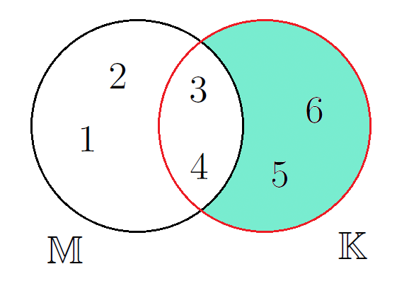

<!--
version:  0.0.1
language: de
narrator: Deutsch Female

@style
main > *:not(:last-child) {
  margin-bottom: 3rem;
}

input {
    text-align: center;
}

.flex-container {
    display: flex;
    flex-wrap: wrap;
    align-items: stretch;
    gap: 20px;
}

.flex-child {
    flex: 1;
    min-width: 350px;
    margin-right: 20px;
}

@media (max-width: 400px) {
    .flex-child {
        flex: 100%;
        margin-right: 0;
    }
}
@end

formula: \carry   \textcolor{red}{\scriptsize #1}
formula: \digit   \rlap{\carry{#1}}\phantom{#2}#2
formula: \permil  \text{‰}

import: https://raw.githubusercontent.com/LiaTemplates/Tikz-Jax/main/README.md

script: https://cdn.jsdelivr.net/gh/LiaTemplates/Tikz-Jax@main/dist/index.js

tags: Mengen, Zahlenverständnis

comment: In diesem Abschnitt werden Mengen besprochen.

author: Martin Lommatzsch

-->

# Mengen

{{|>}}
*******************************

Zahlen können in verschiedene Kategorien, sogenannte *Mengen*, eingeordnet werden.  
Dabei bilden die sogenannten *natürlichen Zahlen* die Basis aller anderen *Zahlenmengen*,  
die in der Schule besprochen werden. Die *natürlichen Zahlen* werden durch das Symbol  
$\mathbb{N}$ beschrieben und beinhalten *Zahlen* wie $0, 1, 2, 3, 4, 5, 6, 7, 8, 9, 10, ...$.  

{{|>}} Die mathematische Schreibweise dazu wäre:  
$\mathbb{N} = \left\{0,1,2,\dots\right\}$,  
wobei in den geschweiften *Klammern* $\{\}$ alle *Zahlen* aufgelistet werden, die zur *Zahlenmenge* gehören.  

{{|>}} Oftmals werden die *natürlichen Zahlen* auch ohne Null verwendet und werden im Folgenden als $\mathbb{N}^+$ bezeichnet.  
Die erste Erweiterung der *natürlichen Zahlen* $\mathbb{N}$ sind die *ganzen Zahlen*  
$\mathbb{Z} = \{\dots,-2,-1,0,1,2,\dots\}$.  

{{|>}} Bei genauer Betrachtung fällt auf, dass die *natürlichen Zahlen* $\mathbb{N}$ eine *Teilmenge* der ganzen Zahlen $\mathbb{Z}$ sind.  
Dies wird mit dem *Mengenoperator* $\subset$ ("ist *Teilmenge* von") wie folgt geschrieben:

$$
\mathbb{N} \subset \mathbb{Z}
$$

{{|>}} Die Einführung der *ganzen Zahlen* ist bedeutsam, da die *Subtraktion* damit an Wichtigkeit verliert,  
weil zum Beispiel $-1$ als $+(-1)$ geschrieben werden kann.  

{{|>}} Die Erweiterung der *ganzen Zahlen* $\mathbb{Z}$ sind alle Zahlen, die durch *Brüche* dargestellt werden können.  
Diese Zahlen werden *rationale Zahlen* genannt:  
$\mathbb{Q} = \{\dots, -2, -\frac{3}{2}, -1, -\frac{1}{2}, 0, \frac{1}{7}, 1, 2, \frac{34}{15}, \dots\}$.

$$
\mathbb{N} \subset \mathbb{Z} \subset \mathbb{Q}
$$

{{|>}} Es gibt jedoch auch *Zahlen*, die nicht durch einen *Bruch* dargestellt werden können.  
Diese werden *reelle Zahlen* $\mathbb{R}$ genannt und umfassen zum Beispiel $\pi, \sqrt{2}$ und $\sqrt{3}$.  

{{|>}} Die letzte Erweiterung der *Zahlenmengen* wird durch die Zahl $i=\sqrt{-1}$ gegeben  
und führt zu den *komplexen Zahlen* $\mathbb{C}$.  
*Komplexe Zahlen* werden in der Regel nicht in der Schule besprochen,  
bieten aber Vorteile bei der Beschreibung von Zusammenhängen in der *Analysis*  
(*Analysis* ist eines der großen Teilgebiete der Mathematik neben der *Algebra*).

$$
\mathbb{N} \subset \mathbb{Z} \subset \mathbb{Q} \subset \mathbb{R} \subset \mathbb{C}
$$

*******************************

### Mengenoperatoren

{{|>}}
*******************************

Es ist möglich *Teilmengen* aufzustellen, dazu werden bestimmte *Mengenoperatoren* wie $\subset$ verwendet.  
Sei die *Menge* $\mathbb{M} = \{1, 2, 3, 4\}$ und die *Menge* $\mathbb{K} = \{3, 4, 5, 6\}$ gegeben, dann existieren folgende *Mengenoperationen*:  

{{|>}} Die *Vereinigung* $\cup$ wird wie folgt dargestellt:

$$
\mathbb{M} \cup \mathbb{K} = \{ 1, 2, 3, 4, 5, 6 \} \quad \text{Vereinigung von $\mathbb{M}$ mit $\mathbb{K}$}
$$

{{|>}} Die *Vereinigung* wird gelesen als:  
"Alle Zahlen, die sich in $\mathbb{M}$ **oder** in $\mathbb{K}$ befinden."  
Das bedeutet, dass alle Zahlen der ersten *Menge* $\mathbb{M}$ und alle Zahlen der zweiten *Menge* $\mathbb{K}$ eine neue *Menge* bilden.  
Das mathematische "oder" unterscheidet sich vom sprachlichen "oder", da es in der Mathematik immer eindeutig dieselbe Bedeutung hat.  
Falls keine *Schnittmenge* vorhanden ist, sind die beiden *Mengen* *disjunkt*.

---

{{|>}} Eine weitere *Mengenoperation* ist der *Durchschnitt* $\cap$:

$$
\mathbb{M} \cap \mathbb{K} = \{ 3, 4 \} \quad \text{Durchschnitt von $\mathbb{M}$ und $\mathbb{K}$}
$$

{{|>}} Der *Durchschnitt* wird gelesen als:  
"Alle Zahlen, die sich in $\mathbb{M}$ **und** in $\mathbb{K}$ befinden."

{{|>}} In diesem Fall sind nur die $3$ und die $4$ in der resultierenden *Durchschnittsmenge*.

---

{{|>}} Die letzte wichtige *Mengenoperation* ist die *Differenz* $\setminus$:

$$
\mathbb{M} \setminus \mathbb{K} = \{ 1, 2 \} \quad \text{Differenz von $\mathbb{M}$ und $\mathbb{K}$}
$$

{{|>}} Das wird gelesen als:  
"Alle *Zahlen* von $\mathbb{M}$ ohne die *Zahlen* aus $\mathbb{K}$."

---

{{|>}} Wenn man die Reihenfolge der *Mengen* umkehrt, ergibt sich ein anderes Bild:

$$
\mathbb{K} \setminus \mathbb{M} = \{ 5, 6 \} \quad \text{Differenz von $\mathbb{K}$ und $\mathbb{M}$}
$$

{{|>}} Es wird deutlich, dass bei der *Differenz* von *Mengen* die Reihenfolge entscheidend ist, während sich der *Durchschnitt* und die *Vereinigung* nicht verändern.

---

{{|>}} Nun, da alle wichtigen *Mengenoperationen* eingeführt wurden, folgen noch einige wichtige mathematische Abkürzungen.  
Diese können als **Vokabeln** angesehen werden, die jeder kennen sollte.

{{|>}} Wenn eine Zahl ein *Element* einer *Zahlenmenge* ist, wird dies mathematisch so geschrieben:

$$
4 \in \mathbb{N}
$$

---

{{|>}} Weitere wichtige Abkürzungen der Mathematik werden nun aufgelistet und im Folgenden verwendet:

$$
\begin{align*}
\forall & \quad \text{für alle gilt} \\
\exists & \quad \text{es existiert} \\
\exists ! & \quad \text{es existiert genau ein} \\
\wedge & \quad \text{und} \\
\vee & \quad \text{oder} \\
\neg & \quad \text{nicht} \\
:= & \quad \text{definiert als} \\
\parallel & \quad \text{parallel zu} \\
\perp & \quad \text{orthogonal (senkrecht) zu} \\
\measuredangle & \quad \text{Winkelmaß zwischen} \\
\angle & \quad \text{Winkel zwischen} \\
\varnothing & \quad \text{leere Menge} \\
\Rightarrow & \quad \text{daraus folgt} \\
< & \quad \text{kleiner als} \\
> & \quad \text{größer als} \\
\stackrel{!}{=} & \quad \text{setze gleich} \\
\stackrel{\wedge}{=} & \quad \text{entspricht}
\end{align*}
$$

---

{{|>}} So würde der Satz "Die *Menge* $\mathbb{M}$ beinhaltet alle *Zahlen* $x$, die die Bedingung erfüllen, dass sie *Element* der *reellen Zahlen* sind und dass es genau eine *Zahl* $e$ gibt, durch die man $x$ teilen kann, sodass $1$ dabei herauskommt" mathematisch so aussehen: 

$$
\mathbb{M} = \left\{ x \in \mathbb{R} \ \middle| \ \exists ! e \in \mathbb{R} : \frac{x}{e} = 1 \right\}
$$

---

{{|>}} Mittels dieser Abkürzungen ist es möglich, eine *Zahlenmenge* einzuführen, welche von besonderer Bedeutung ist – die *Primzahlen*.  
Primzahlen sind *natürliche Zahlen* größer als 1, die genau zwei positive Teiler haben: **1** und **sich selbst**.  

{{|>}} Diese *Zahlenmenge* kann wie folgt definiert werden:

$$
\mathbb{P} = \left\{ p \in \mathbb{N} \ \middle| \ p > 1 \ \wedge \ \nexists n \in \mathbb{N},\ 1 < n < p,\ n \mid p \right\}
$$

Dabei gilt:  

- $\mathbb{P}$ bezeichnet die *Menge* der *Primzahlen*.  
- $\mathbb{N}$ bezeichnet die *Menge* der *natürlichen Zahlen*.  
- $n \mid p$ bedeutet "n teilt p ohne Rest".  
- $\nexists$ bedeutet "es existiert kein".  

{{|>}} **Interpretation:**  
Eine *Zahl* $p$ ist genau dann in der *Menge* $\mathbb{P}$, wenn sie größer als 1 ist und es keine *natürliche Zahl* $n$ gibt, die $p$ teilt, außer den *Zahlen* $1$ und $p$ selbst.

*******************************

### Mengengrenzen

{{|>}}
*******************************

Das *Supremum* ist definiert als die "kleinste oberste Schranke" einer *Zahlenmenge*,  
während das *Infimum* als "größte unterste Schranke" definiert ist.  

{{|>}} Sei als Beispiel dazu folgende *Zahlenmenge* aus *natürlichen Zahlen* betrachtet:  

$$
\mathbb{M} = \left\{ 3,4,5,6,7,8 \right\}
$$

{{|>}} Dann ergibt sich hieraus folgendes *Infimum* und *Supremum*:

$$
\begin{align*}
   \sup  \mathbb{M}  & = 9  \\
   \inf  \mathbb{M}  & = 2  \\
   \Rightarrow \quad  2 & < x  < 9 \quad \forall x \in \mathbb{M}
\end{align*}
$$

---

{{|>}} Hierbei können dem *Supremum* und *Infimum* *Grenzen* auferlegt werden,  
sodass das *Supremum* der Menge $\mathbb{M}$ in den *Grenzen*  
zwischen $3 < x < 6$ und das *Infimum* zwischen $4 < x < 7$ wie folgt geschrieben wird:

$$
\begin{align*}
   \sup_{3<x<6}  \mathbb{M}  & = 7  \\
   \inf_{4<x<7}  \mathbb{M}  & = 3  
\end{align*}
$$

---

{{|>}} Die *Grenzen* müssen nicht ausschließlich (*exklusiv*),  
sondern können auch einschließend (*inklusiv*) sein:

$$
\begin{align*}
   \sup  \mathbb{M}  & = 8  \\
   \inf  \mathbb{M}  & = 3  \\
   \Rightarrow \quad  3 & \leq x  \leq 8 \quad \forall x \in \mathbb{M}
\end{align*}
$$

---

{{|>}} Dabei bildet das *Supremum* die größte *Zahl* der *Menge* und ist gleichzeitig das *Maximum*,  
während das *Infimum* gleich dem *Minimum* ist.  

Somit ergibt sich für inklusive Grenzen:

$$
\begin{align*}
   \sup  \mathbb{M}  & =  \max  \mathbb{M}  \\
   \inf  \mathbb{M}  & =  \min  \mathbb{M}  
\end{align*}
$$

---

> {{|>}} **Hinweis:**  
> Im folgenden Buch werden die Begriffe *Infimum* und *Supremum* lediglich zur Vollständigkeit erwähnt.  
> Sie sind nicht essentiell für ein allgemein bildendes Grundlagenverständnis.

*******************************