<!--

version:  0.0.1
language: de
narrator: Deutsch Female


logo:     https://raw.githubusercontent.com/MINT-the-GAP/Aufgabensammlung/refs/heads/main/Repetitorium/logo.png
email:    info@bildung-bedeutet-freiheit.de

tags: Repetitorium

comment: Hier entsteht ein mathematisches Repetitorium in LiaScript. https://mint-the-gap.github.io/Aufgabensammlung/

author: Martin Lommatzsch
 


@style
main > *:not(:last-child) {
  margin-bottom: 3rem;
}

input {
    text-align: center;
}

.flex-container {
    display: flex;
    flex-wrap: wrap;
    align-items: stretch;
    gap: 20px;
}

.flex-child {
    flex: 1;
    min-width: 350px;
    margin-right: 20px;
}

@media (max-width: 400px) {
    .flex-child {
        flex: 100%;
        margin-right: 0;
    }
}
@end

formula: \carry   \textcolor{red}{\scriptsize #1}
formula: \digit   \rlap{\carry{#1}}\phantom{#2}#2
formula: \permil  \text{‰}

import: https://raw.githubusercontent.com/LiaTemplates/Tikz-Jax/main/README.md

script: https://cdn.jsdelivr.net/gh/LiaTemplates/Tikz-Jax@main/dist/index.js

import: https://raw.githubusercontent.com/liaTemplates/algebrite/master/README.md

import: https://raw.githubusercontent.com/LiaTemplates/GGBScript/refs/heads/main/README.md
-->


# Repetitorium der Mathematik


> "Die Bildung kommt nicht vom Lesen, sondern vom Nachdenken über das Gelesene." \
-Carl Hilty


> "Gebildet ist der Mensch, der die höchsten Ergebnisse des Geistes in physiologische Reflexe umformt." \
-Nicolás Gómez Dávila


    {{|>}} Dieses Repetitorium der Mathematik ist aus der Motivation heraus entstanden, den naturwissenschaftlichen Unterricht an Schulen zu erleichtern. Die ersten Kapitel führen grundlegende mathematische „Vokabeln“, Zahleneigenschaften, Rechenoperationen und gebräuchliche Abkürzungen ein. Da viele Schülerinnen und Schüler durch die gesellschaftlich verbreitete Meinung, Mathematik und Naturwissenschaften seien „schwierig“, zu Ausreden und geringerer Leistungsbereitschaft neigen, soll in diesem Buch bewusst auf die Einfachheit und Klarheit der mathematischen Sprache hingewiesen werden. Diese Einfachheit erschließt sich jedoch oft erst nach der Schulzeit: Mathematik lebt von eindeutig definierten Begriffen, deren Abkürzungen und Symbolen. Anders als in Sprachen wie Deutsch oder Englisch ergibt sich ihre Bedeutung nicht erst aus dem Satzkontext. Zudem gibt es in der Mathematik im Gegensatz zu anderen Sprachen keine Ausnahmen von den Regeln.

    {{|>}} Das Buch versteht sich als Leitfaden für den Mathematikunterricht und als Wiederholungswerkzeug für die naturwissenschaftlichen Fächer. Es wird kontinuierlich weiterentwickelt und am Verständnis der Lernenden ausgerichtet. Zum Verständnis genügt der sichere Umgang mit Zahlen und Grundrechenarten, sodass das Werk für alle Schülerinnen und Schüler weiterführender Schulen geeignet ist. Es wird deutlich, dass mathematisches Verständnis eng mit der korrekten Verwendung definierter Begriffe verbunden ist. Daher sollte jede eingeführte „Vokabel“ verinnerlicht werden.

    {{|>}} Zu jedem Abschnitt gibt es Übungsaufgaben, deren Lösungen im Anhang stehen. Die Aufgaben sind so gestaltet, dass sie das Verständnis überprüfen und vertiefen; sie sollten vollständig bearbeitet und erst danach mit den Lösungen verglichen werden. In der Geometrie werden auch Zeichenaufgaben gestellt, zu denen im Anhang keine fertigen Zeichnungen enthalten sind. Manche Aufgaben erfordern Kenntnisse aus späteren Kapiteln; diese können nach Erwerb des entsprechenden Wissens bearbeitet werden, um vorhandene Kenntnisse zu festigen und zu erweitern. Oft steigert sich der Schwierigkeitsgrad innerhalb einer Aufgabe, sodass binnendifferenzierte Förderung möglich ist und jede Schülerin und jeder Schüler gefordert und gefördert werden kann.

    {{|>}} Alle *leicht schräg/kursiv* markierten Begriffe sind im mathematischen Wörterverzeichnis im Anhang erläutert. Dieser Abschnitt soll den Umgang mit der mathematischen Sprache erleichtern und deren logischen Aufbau verdeutlichen.

    {{|>}} Abschließend sei angemerkt, dass in Zukunft deutlich mehr Aufgaben mit Lösungen ergänzt werden, darunter auch solche, die auf weiter hinten behandelten Themen basieren. Hierzu werden Querverweise angegeben, um je nach Vorwissen auch komplexere Aufgaben bearbeiten zu können. Grundsätzlich gilt: Alle fehlerfreien Rechenwege sind zugelassen – entscheidend ist das korrekte Ergebnis.


> Diese Version kann inhaltliche und sprachliche Tippfehler enthalten und hat somit keinen Anspruch auf Richtigkeit. Außerdem kann nicht gewährleistet werden, dass der "Lehrplan" jedes Bundeslandes abgedeckt ist.


## Wichtige Hinweise


Einige Themengebiete der Mathematik sind besonders essentiell für ein grundlegendes Verständnis der Mathematik. In diesem Buch werden nach der Einführung diese Themen immer wieder in Aufgaben oder Erklärungen vorkommen. Die Themen sind in der nachfolgenden Auflistung nach Wichtigkeit geordnet. In Klammern sind die Themenbereich beschrieben, die mit dem zentralen Thema direkt verknüpft sind:


- Bruchrechnung
- Äquivalenzumformung
- Einsetzungsverfahren
- Funktionen
- Trigonometrie (Dreiecke)
- Einheiten (Potenzen) 
 
Ohne das Verständnis dieser Themenbereiche lassen sich weiterführende Themen nur schwer erschließen. Wenn diese Themen nicht verinnerlicht wurden, sollten diese weiter erschlossen werden, da im Kern nahezu alle Aufgaben letztendlich auf diesen Grundprinzipien basieren.


## Mengen

Zahlen können in verschiedene Kategorien, sogenannte *Mengen*, eingeordnet werden.  
Dabei bilden die sogenannten *natürlichen Zahlen* die Basis aller anderen *Zahlenmengen*,  
die in der Schule besprochen werden. Die *natürlichen Zahlen* werden durch das Symbol  
$\mathbb{N}$ beschrieben und beinhalten *Zahlen* wie $0, 1, 2, 3, 4, 5, 6, 7, 8, 9, 10, ...$.  

Die mathematische Schreibweise dazu wäre:  
$\mathbb{N} = \left\{0,1,2,\dots\right\}$,  
wobei in den geschweiften *Klammern* $\{\}$ alle *Zahlen* aufgelistet werden, die zur *Zahlenmenge* gehören.  

Oftmals werden die *natürlichen Zahlen* auch ohne Null verwendet und werden im Folgenden als $\mathbb{N}^+$ bezeichnet.  
Die erste Erweiterung der *natürlichen Zahlen* $\mathbb{N}$ sind die *ganzen Zahlen*  
$\mathbb{Z} = \{\dots,-2,-1,0,1,2,\dots\}$.  

Bei genauer Betrachtung fällt auf, dass die *natürlichen Zahlen* $\mathbb{N}$ eine *Teilmenge* der ganzen Zahlen $\mathbb{Z}$ sind.  
Dies wird mit dem *Mengenoperator* $\subset$ ("ist *Teilmenge* von") wie folgt geschrieben:

$$
\mathbb{N} \subset \mathbb{Z}
$$

Die Einführung der *ganzen Zahlen* ist bedeutsam, da die *Subtraktion* damit an Wichtigkeit verliert,  
weil zum Beispiel $-1$ als $+(-1)$ geschrieben werden kann.  

Die Erweiterung der *ganzen Zahlen* $\mathbb{Z}$ sind alle Zahlen, die durch *Brüche* dargestellt werden können.  
Diese Zahlen werden *rationale Zahlen* genannt:  
$\mathbb{Q} = \{\dots, -2, -\frac{3}{2}, -1, -\frac{1}{2}, 0, \frac{1}{7}, 1, 2, \frac{34}{15}, \dots\}$.

$$
\mathbb{N} \subset \mathbb{Z} \subset \mathbb{Q}
$$

Es gibt jedoch auch *Zahlen*, die nicht durch einen *Bruch* dargestellt werden können.  
Diese werden *reelle Zahlen* $\mathbb{R}$ genannt und umfassen zum Beispiel $\pi, \sqrt{2}$ und $\sqrt{3}$.  

Die letzte Erweiterung der *Zahlenmengen* wird durch die Zahl $i=\sqrt{-1}$ gegeben  
und führt zu den *komplexen Zahlen* $\mathbb{C}$.  
*Komplexe Zahlen* werden in der Regel nicht in der Schule besprochen,  
bieten aber Vorteile bei der Beschreibung von Zusammenhängen in der *Analysis*  
(*Analysis* ist eines der großen Teilgebiete der Mathematik neben der *Algebra*).

$$
\mathbb{N} \subset \mathbb{Z} \subset \mathbb{Q} \subset \mathbb{R} \subset \mathbb{C}
$$


### Mengenoperatoren

Es ist möglich *Teilmengen* aufzustellen, dazu werden bestimmte *Mengenoperatoren* wie $\subset$ verwendet.  
Sei die *Menge* $\mathbb{M} = \{1, 2, 3, 4\}$ und die *Menge* $\mathbb{K} = \{3, 4, 5, 6\}$ gegeben, dann existieren folgende *Mengenoperationen*:  

Die *Vereinigung* $\cup$ wird wie folgt dargestellt:

$$
\mathbb{M} \cup \mathbb{K} = \{ 1, 2, 3, 4, 5, 6 \} \quad \text{Vereinigung von $\mathbb{M}$ mit $\mathbb{K}$}
$$

Die *Vereinigung* wird gelesen als:  
"Alle Zahlen, die sich in $\mathbb{M}$ **oder** in $\mathbb{K}$ befinden."  
Das bedeutet, dass alle Zahlen der ersten *Menge* $\mathbb{M}$ und alle Zahlen der zweiten *Menge* $\mathbb{K}$ eine neue *Menge* bilden.  
Das mathematische "oder" unterscheidet sich vom sprachlichen "oder", da es in der Mathematik immer eindeutig dieselbe Bedeutung hat.  
Falls keine *Schnittmenge* vorhanden ist, sind die beiden *Mengen* *disjunkt*.

<center>

</center>


---

Eine weitere *Mengenoperation* ist der *Durchschnitt* $\cap$:

$$
\mathbb{M} \cap \mathbb{K} = \{ 3, 4 \} \quad \text{Durchschnitt von $\mathbb{M}$ und $\mathbb{K}$}
$$

Der *Durchschnitt* wird gelesen als:  
"Alle Zahlen, die sich in $\mathbb{M}$ **und** in $\mathbb{K}$ befinden."

<center>
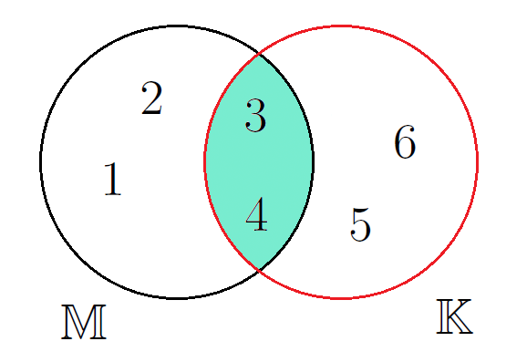
</center>


In diesem Fall sind nur die $3$ und die $4$ in der resultierenden *Durchschnittsmenge*.

---

Die letzte wichtige *Mengenoperation* ist die *Differenz* $\setminus$:

$$
\mathbb{M} \setminus \mathbb{K} = \{ 1, 2 \} \quad \text{Differenz von $\mathbb{M}$ und $\mathbb{K}$}
$$

Das wird gelesen als:  
"Alle *Zahlen* von $\mathbb{M}$ ohne die *Zahlen* aus $\mathbb{K}$."

<center>
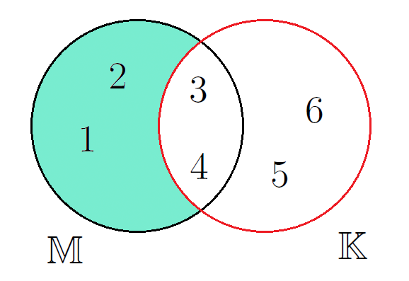
</center>


---

Wenn man die Reihenfolge der *Mengen* umkehrt, ergibt sich ein anderes Bild:

$$
\mathbb{K} \setminus \mathbb{M} = \{ 5, 6 \} \quad \text{Differenz von $\mathbb{K}$ und $\mathbb{M}$}
$$

<center>
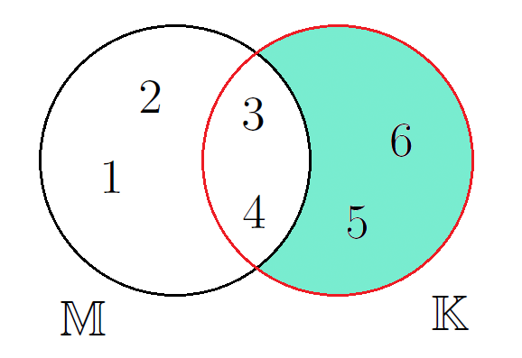
</center>


Es wird deutlich, dass bei der *Differenz* von *Mengen* die Reihenfolge entscheidend ist, während sich der *Durchschnitt* und die *Vereinigung* nicht verändern.

---

Nun, da alle wichtigen *Mengenoperationen* eingeführt wurden, folgen noch einige wichtige mathematische Abkürzungen.  
Diese können als **Vokabeln** angesehen werden, die jeder kennen sollte.

Wenn eine Zahl ein *Element* einer *Zahlenmenge* ist, wird dies mathematisch so geschrieben:

$$
4 \in \mathbb{N}
$$

---


Weitere wichtige Abkürzungen der Mathematik werden nun aufgelistet und im Folgenden verwendet:

$$
\begin{align*}
\forall & \quad \text{für alle gilt} \\
\exists & \quad \text{es existiert} \\
\exists ! & \quad \text{es existiert genau ein} \\
\wedge & \quad \text{und} \\
\vee & \quad \text{oder} \\
\neg & \quad \text{nicht} \\
:= & \quad \text{definiert als} \\
\parallel & \quad \text{parallel zu} \\
\perp & \quad \text{orthogonal (senkrecht) zu} \\
\measuredangle & \quad \text{Winkelmaß zwischen} \\
\angle & \quad \text{Winkel zwischen} \\
\varnothing & \quad \text{leere Menge} \\
\Rightarrow & \quad \text{daraus folgt} \\
< & \quad \text{kleiner als} \\
> & \quad \text{größer als} \\
\stackrel{!}{=} & \quad \text{setze gleich} \\
\stackrel{\wedge}{=} & \quad \text{entspricht}
\end{align*}
$$

---

So würde der Satz "Die *Menge* $\mathbb{M}$ beinhaltet alle *Zahlen* $x$, die die Bedingung erfüllen, dass sie *Element* der *reellen Zahlen* sind und dass es genau eine *Zahl* $e$ gibt, durch die man $x$ teilen kann, sodass $1$ dabei herauskommt" mathematisch so aussehen: 


$$
\mathbb{M} = \left\{ x \in \mathbb{R} \ \middle| \ \exists ! e \in \mathbb{R} : \frac{x}{e} = 1 \right\}
$$


---


Mittels dieser Abkürzungen ist es möglich, eine *Zahlenmenge* einzuführen, welche von besonderer Bedeutung ist – die *Primzahlen*.  
Primzahlen sind *natürliche Zahlen* größer als 1, die genau zwei positive Teiler haben: **1** und **sich selbst**.  

Diese *Zahlenmenge* kann wie folgt definiert werden:

$$
\mathbb{P} = \left\{ p \in \mathbb{N} \ \middle| \ p > 1 \ \wedge \ \nexists n \in \mathbb{N},\ 1 < n < p,\ n \mid p \right\}
$$

Dabei gilt:  

- $\mathbb{P}$ bezeichnet die *Menge* der *Primzahlen*.  
- $\mathbb{N}$ bezeichnet die *Menge* der *natürlichen Zahlen*.  
- $n \mid p$ bedeutet "n teilt p ohne Rest".  
- $\nexists$ bedeutet "es existiert kein".  

**Interpretation:**  
Eine *Zahl* $p$ ist genau dann in der *Menge* $\mathbb{P}$, wenn sie größer als 1 ist und es keine *natürliche Zahl* $n$ gibt, die $p$ teilt, außer den *Zahlen* $1$ und $p$ selbst.


### Mengengrenzen


Das *Supremum* ist definiert als die "kleinste oberste Schranke" einer *Zahlenmenge*,  
während das *Infimum* als "größte unterste Schranke" definiert ist.  

Sei als Beispiel dazu folgende *Zahlenmenge* aus *natürlichen Zahlen* betrachtet:  

$$
\mathbb{M} = \left\{ 3,4,5,6,7,8 \right\}
$$

Dann ergibt sich hieraus folgendes *Infimum* und *Supremum*:

$$
\begin{align*}
   \sup  \mathbb{M}  & = 9  \\
   \inf  \mathbb{M}  & = 2  \\
   \Rightarrow \quad  2 & < x  < 9 \quad \forall x \in \mathbb{M}
\end{align*}
$$

---

Hierbei können dem *Supremum* und *Infimum* *Grenzen* auferlegt werden,  
sodass das *Supremum* der Menge $\mathbb{M}$ in den *Grenzen*  
zwischen $3 < x < 6$ und das *Infimum* zwischen $4 < x < 7$ wie folgt geschrieben wird:

$$
\begin{align*}
   \sup_{3<x<6}  \mathbb{M}  & = 7  \\
   \inf_{4<x<7}  \mathbb{M}  & = 3  
\end{align*}
$$

---

Die *Grenzen* müssen nicht ausschließlich (*exklusiv*),  
sondern können auch einschließend (*inklusiv*) sein:

$$
\begin{align*}
   \sup  \mathbb{M}  & = 8  \\
   \inf  \mathbb{M}  & = 3  \\
   \Rightarrow \quad  3 & \leq x  \leq 8 \quad \forall x \in \mathbb{M}
\end{align*}
$$

---

Dabei bildet das *Supremum* die größte *Zahl* der *Menge* und ist gleichzeitig das *Maximum*,  
während das *Infimum* gleich dem *Minimum* ist.  

Somit ergibt sich für inklusive Grenzen:

$$
\begin{align*}
   \sup  \mathbb{M}  & =  \max  \mathbb{M}  \\
   \inf  \mathbb{M}  & =  \min  \mathbb{M}  
\end{align*}
$$

---

> **Hinweis:**  
> Im folgenden Buch werden die Begriffe *Infimum* und *Supremum* lediglich zur Vollständigkeit erwähnt.  
> Sie sind nicht essentiell für ein allgemein bildendes Grundlagenverständnis.


#### Übungsaufgaben zu Mengen


   \
__Aufgabe 1:__ **Wähle** die kleinste Zahlenmenge **aus**, in der die jeweilige Zahl ist.


<section class="flex-container">
<div class="flex-child">

<!-- data-solution-button="5" -->
__$a)\;\;$__ $ -4 $ [[$\mathbb{N}$|($\mathbb{Z}$)|$\mathbb{Q}$|$\mathbb{R}$]] 

</div>
<div class="flex-child">

<!-- data-solution-button="5" -->
__$b)\;\;$__ $ 6 $ [[($\mathbb{N}$)|$\mathbb{Z}$|$\mathbb{Q}$|$\mathbb{R}$]] 

</div>
<div class="flex-child">

<!-- data-solution-button="5" -->
__$c)\;\;$__ $ 0,03 $ [[$\mathbb{N}$|$\mathbb{Z}$|($\mathbb{Q}$)|$\mathbb{R}$]] 

</div>
<div class="flex-child">

<!-- data-solution-button="5" -->
__$d)\;\;$__ $ \frac{7}{8} $ [[$\mathbb{N}$|$\mathbb{Z}$|($\mathbb{Q}$)|$\mathbb{R}$]] 

</div>
</section>


   \
__Aufgabe 2:__ **Wähle** die kleinste Zahlenmenge **aus**, in der die jeweilige Zahl ist.


<section class="flex-container">
<div class="flex-child">

<!-- data-solution-button="5" -->
__$a)\;\;$__ $ -\frac{3}{7} $ [[$\mathbb{N}$|$\mathbb{Z}$|($\mathbb{Q}$)|$\mathbb{R}$]] 

</div>
<div class="flex-child">

<!-- data-solution-button="5" -->
__$b)\;\;$__ $ \sqrt{3} $ [[$\mathbb{N}$|$\mathbb{Z}$|$\mathbb{Q}$|($\mathbb{R}$)]] 

</div>
<div class="flex-child">

<!-- data-solution-button="5" -->
__$c)\;\;$__ $ 13^2 $ [[($\mathbb{N}$)|$\mathbb{Z}$|$\mathbb{Q}$|$\mathbb{R}$]] 

</div>
<div class="flex-child">

<!-- data-solution-button="5" -->
__$d)\;\;$__ $ -7 $ [[$\mathbb{N}$|($\mathbb{Z}$)|$\mathbb{Q}$|$\mathbb{R}$]] 

</div>
</section>


   \
__Aufgabe 3:__ **Wähle** die kleinste Zahlenmenge **aus**, in der die jeweilige Zahl ist.


<section class="flex-container">
<div class="flex-child">

<!-- data-solution-button="5" -->
__$a)\;\;$__ $ 7,23 $ [[$\mathbb{N}$|$\mathbb{Z}$|($\mathbb{Q}$)|$\mathbb{R}$]] 

</div>
<div class="flex-child">

<!-- data-solution-button="5" -->
__$b)\;\;$__ $ -2 $ [[$\mathbb{N}$|($\mathbb{Z}$)|$\mathbb{Q}$|$\mathbb{R}$]] 

</div>
<div class="flex-child">

<!-- data-solution-button="5" -->
__$c)\;\;$__ $ \pi $ [[$\mathbb{N}$|$\mathbb{Z}$|$\mathbb{Q}$|($\mathbb{R}$)]] 

</div>
<div class="flex-child">

<!-- data-solution-button="5" -->
__$d)\;\;$__ $ 3,\bar{3} $ [[$\mathbb{N}$|$\mathbb{Z}$|($\mathbb{Q}$)|$\mathbb{R}$]] 

</div>
</section>


   \
__Aufgabe 4:__ **Wähle** die kleinste Zahlenmenge **aus**, in der die jeweilige Zahl ist.


<section class="flex-container">
<div class="flex-child">

<!-- data-solution-button="5" -->
__$a)\;\;$__ $ \frac{12}{4} $ [[$(\mathbb{N})$|$\mathbb{Z}$|$\mathbb{Q}$|$\mathbb{R}$]] 

</div>
<div class="flex-child">

<!-- data-solution-button="5" -->
__$b)\;\;$__ $ 0,0001 $ [[$\mathbb{N}$|$\mathbb{Z}$|($\mathbb{Q}$)|$\mathbb{R}$]] 

</div>
<div class="flex-child">

<!-- data-solution-button="5" -->
__$c)\;\;$__ $ -\sqrt{9} $ [[$\mathbb{N}$|($\mathbb{Z}$)|$\mathbb{Q}$|$\mathbb{R}$]] 

</div>
<div class="flex-child">

<!-- data-solution-button="5" -->
__$d)\;\;$__ $ -\sqrt[5]{7} $ [[$\mathbb{N}$|$\mathbb{Z}$|$\mathbb{Q}$|($\mathbb{R}$)]] 

</div>
</section>


   \
__Aufgabe 5:__ **Wähle** die kleinste Zahlenmenge **aus**, in der der beschriebene Term ist.


<section class="flex-container">
<div class="flex-child">

<!-- data-solution-button="5" -->
__$a)\;\;$__ $ 41:7 + 57:7 \in$ [[$(\mathbb{N})$|$\mathbb{Z}$|$\mathbb{Q}$|$\mathbb{R}$]] 

</div>
<div class="flex-child">

<!-- data-solution-button="5" -->
__$b)\;\;$__ $ \sqrt{49}-11,5 \in$ [[$\mathbb{N}$|$\mathbb{Z}$|($\mathbb{Q}$)|$\mathbb{R}$]] 

</div>
<div class="flex-child">

<!-- data-solution-button="5" -->
__$c)\;\;$__ $ \dfrac{2}{3}-\dfrac{14}{9}-0,\bar{1} \in$ [[$\mathbb{N}$|($\mathbb{Z}$)|$\mathbb{Q}$|$\mathbb{R}$]] 

</div>
<div class="flex-child">

<!-- data-solution-button="5" -->
__$d)\;\;$__ $ \dfrac{8}{7}-\pi  \in$ [[$\mathbb{N}$|$\mathbb{Z}$|$\mathbb{Q}$|($\mathbb{R}$)]] 

</div>
</section>


   \
__Aufgabe 6:__ **Wähle** die kleinste Zahlenmenge **aus**, in der der beschriebene Term ist.


<section class="flex-container">
<div class="flex-child">

<!-- data-solution-button="5" -->
__$a)\;\;$__ $ \dfrac{3}{8} + 1,625 \in$ [[($\mathbb{N}$)|$\mathbb{Z}$|$\mathbb{Q}$|$\mathbb{R}$]] 

</div>
<div class="flex-child">

<!-- data-solution-button="5" -->
__$b)\;\;$__ $ (-5)^3-\sqrt{81} \in$ [[$\mathbb{N}$|($\mathbb{Z}$)|$\mathbb{Q}$|$\mathbb{R}$]] 

</div>
<div class="flex-child">

<!-- data-solution-button="5" -->
__$c)\;\;$__ $ \dfrac{7}{3}+\dfrac{8}{7} \in$ [[$\mathbb{N}$|$\mathbb{Z}$|($\mathbb{Q}$)|$\mathbb{R}$]] 

</div>
<div class="flex-child">

<!-- data-solution-button="5" -->
__$d)\;\;$__ $ \pi^0-4 \in$ [[$\mathbb{N}$|($\mathbb{Z}$)|$\mathbb{Q}$|$\mathbb{R}$]] 

</div>
</section>


   \
__Aufgabe 7:__ **Wähle** die kleinste Zahlenmenge **aus**, in der der beschriebene Term ist.


<section class="flex-container">
<div class="flex-child">

<!-- data-solution-button="5" -->
__$a)\;\;$__ $ \sqrt{2^5-3^2} \in$ [[$\mathbb{N}$|$\mathbb{Z}$|$\mathbb{Q}$|($\mathbb{R}$)]] 

</div>
<div class="flex-child">

<!-- data-solution-button="5" -->
__$b)\;\;$__ $ \dfrac{\sqrt{8}+\sqrt{18}}{\sqrt{2}} \in$ [[($\mathbb{N}$)|$\mathbb{Z}$|$\mathbb{Q}$|$\mathbb{R}$]] 

</div>
<div class="flex-child">

<!-- data-solution-button="5" -->
__$c)\;\;$__ $ 0,15-\dfrac{23}{20} \in$ [[$\mathbb{N}$|($\mathbb{Z}$)|$\mathbb{Q}$|$\mathbb{R}$]] 

</div>
<div class="flex-child">

<!-- data-solution-button="5" -->
__$d)\;\;$__ $ 1,\bar{4} + 0,\bar{5} \in$ [[($\mathbb{N}$)|$\mathbb{Z}$|$\mathbb{Q}$|$\mathbb{R}$]] 

</div>
</section>


   \
__Aufgabe 8:__ **Wähle** die kleinste Zahlenmenge **aus**, in der der beschriebene Term ist.


<section class="flex-container">
<div class="flex-child">

<!-- data-solution-button="5" -->
__$a)\;\;$__ $ -4^3+(-3)^4 \in$ [[($\mathbb{N}$)|$\mathbb{Z}$|$\mathbb{Q}$|$\mathbb{R}$]] 

</div>
<div class="flex-child">

<!-- data-solution-button="5" -->
__$b)\;\;$__ $ \left(\sqrt{7}+\sqrt{11}\right)^2 \in$ [[$\mathbb{N}$|$\mathbb{Z}$|$\mathbb{Q}$|($\mathbb{R}$)]] 

</div>
<div class="flex-child">

<!-- data-solution-button="5" -->
__$c)\;\;$__ $ 8-\sqrt{6,25} \in$ [[$\mathbb{N}$|$\mathbb{Z}$|($\mathbb{Q}$)|$\mathbb{R}$]] 

</div>
<div class="flex-child">

<!-- data-solution-button="5" -->
__$d)\;\;$__ $ -0,45+\sqrt{0,25}+\dfrac{19}{20} \in$ [[($\mathbb{N}$)|$\mathbb{Z}$|$\mathbb{Q}$|$\mathbb{R}$]] 

</div>
</section>


   \
__Aufgabe 9:__ **Gib** die kleinste beziehungsweise größte Zahl der gegebenen Zahlenmenge **an**. Es gilt $\mathbb{K} \subset \mathbb{N}$.


__$a)\;\;$__ $ \mathbb{K} = \{ 15,28,17,34,26,24,14,32,29,22 \} $\

$\min(\mathbb{K}) = $ [[ 14 ]] \
$\max(\mathbb{K}) = $ [[ 34 ]] \


__$b)\;\;$__ $ \mathbb{K} = \{ 21,24,28,24,26,25,23,24,19,25,27,29,21,22,26 \} $\


$\min(\mathbb{K}) = $ [[ 19 ]] \
$\max(\mathbb{K}) = $ [[ 29 ]] \


__$c)\;\;$__ $ \mathbb{K} = \{ 14,19,16,15,17,15,18,9,19,11,13,17 \} $\


$\min(\mathbb{K}) = $ [[  9 ]] \
$\max(\mathbb{K}) = $ [[ 19 ]] \


   \
__Aufgabe 10:__ **Gib** die kleinste beziehungsweise größte Zahl der gegebenen Zahlenmenge **an**. Es gilt $\mathbb{K} \subset \mathbb{N}$.


__$a)\;\;$__ $ \mathbb{K} = \{ 83,46,55,64,91,75,61,39,84,55,47 \} $\


$\min(\mathbb{K}) = $ [[ 39 ]] \
$\max(\mathbb{K}) = $ [[ 91 ]] \


__$b)\;\;$__ $ \mathbb{K} = \{ 56,54,55,56,57,55,56,54,53,58,55,56,54,52,56,57 \} $\


$\min(\mathbb{K}) = $ [[ 52 ]] \
$\max(\mathbb{K}) = $ [[ 58 ]] \


__$c)\;\;$__ $ \mathbb{K} = \{ 29,33,28,31,35,24,36,32,28,27,35,34,29,30,35 \} $\


$\min(\mathbb{K}) = $ [[ 24 ]] \
$\max(\mathbb{K}) = $ [[ 36 ]] \


   \
__Aufgabe 11:__ **Gib** die kleinste beziehungsweise größte Zahl der gegebenen Zahlenmenge **an**. Es gilt $\mathbb{K} \subset \mathbb{N}$.


__$a)\;\;$__ $ \mathbb{K} = \{ 45,39,48,51,37,52,46,50,47,38,43,46,51,39,40 \} $\


$\min(\mathbb{K}) = $ [[ 37 ]] \
$\max(\mathbb{K}) = $ [[ 52 ]] \


__$b)\;\;$__ $ \mathbb{K} = \{ 34,37,31,32,39,33,34,35,38,32,30,34,39,38,34,33,31 \} $\


$\min(\mathbb{K}) = $ [[ 30 ]] \
$\max(\mathbb{K}) = $ [[ 39 ]] \


__$c)\;\;$__ $ \mathbb{K} = \{ 64,67,61,58,60,64,66,68,63,64,60,69,64,65,59,67,68,60 \} $\


$\min(\mathbb{K}) = $ [[ 58 ]] \
$\max(\mathbb{K}) = $ [[ 69 ]] \


   \
__Aufgabe 12:__ **Gib** die obere beziehungsweise untere Schranke der gegebenen Zahlenmenge **an**. Es gilt $\mathbb{K} \subset \mathbb{N}$.


__$a)\;\;$__ $ \mathbb{K} = \{ 15,28,17,34,26,24,14,32,29,22 \} $\


$\inf(\mathbb{K}) = $ [[ 13 ]] \
$\sup(\mathbb{K}) = $ [[ 35 ]] \


__$b)\;\;$__ $ \mathbb{K} = \{ 21,24,28,24,26,25,23,24,19,25,27,29,21,22,26 \} $\


$\inf(\mathbb{K}) = $ [[ 18 ]] \
$\sup(\mathbb{K}) = $ [[ 30 ]] \


__$c)\;\;$__ $ \mathbb{K} = \{ 14,19,16,15,17,15,18,9,19,11,13,17 \} $\


$\inf(\mathbb{K}) = $ [[  8 ]] \
$\sup(\mathbb{K}) = $ [[ 20 ]] \


   \
__Aufgabe 13:__ **Gib** die kleinste beziehungsweise größte Zahl der gegebenen Zahlenmenge **an**. Es gilt $\mathbb{K} \subset \mathbb{N}$.


__$a)\;\;$__ $ \mathbb{K} = \{ 83,46,55,64,91,75,61,39,84,55,47 \} $\


$\inf(\mathbb{K}) = $ [[ 38 ]] \
$\sup(\mathbb{K}) = $ [[ 92 ]] \


__$b)\;\;$__ $ \mathbb{K} = \{ 56,54,55,56,57,55,56,54,53,58,55,56,54,52,56,57 \} $\


$\inf(\mathbb{K}) = $ [[ 51 ]] \
$\sup(\mathbb{K}) = $ [[ 59 ]] \


__$c)\;\;$__ $ \mathbb{K} = \{ 29,33,28,31,35,24,36,32,28,27,35,34,29,30,35 \} $\


$\inf(\mathbb{K}) = $ [[ 26 ]] \
$\sup(\mathbb{K}) = $ [[ 37 ]] \


   \
__Aufgabe 14:__ **Gib** die kleinste beziehungsweise größte Zahl der gegebenen Zahlenmenge **an**. Es gilt $\mathbb{K} \subset \mathbb{N}$.


__$a)\;\;$__ $ \mathbb{K} = \{ 45,39,48,51,37,52,46,50,47,38,43,46,51,39,40 \} $\


$\inf(\mathbb{K}) = $ [[ 36 ]] \
$\sup(\mathbb{K}) = $ [[ 53 ]] \


__$b)\;\;$__ $ \mathbb{K} = \{ 34,37,31,32,39,33,34,35,38,32,30,34,39,38,34,33,31 \} $\


$\inf(\mathbb{K}) = $ [[ 29 ]] \
$\sup(\mathbb{K}) = $ [[ 40 ]] \


__$c)\;\;$__ $ \mathbb{K} = \{ 64,67,61,58,60,64,66,68,63,64,60,69,64,65,59,67,68,60 \} $\


$\inf(\mathbb{K}) = $ [[ 57 ]] \
$\sup(\mathbb{K}) = $ [[ 70 ]] \


   \
__Aufgabe 15:__ **Gib** die Vereinigung der beiden gegebenen Mengen $\mathbb{K}$ und $\mathbb{M}$ **an**.
 
__$a)\;\;$__ $ \mathbb{K} = \{ 1,5,6,9 \} $  und $\mathbb{M} = \{ 3,4,6,8 \} $ 

<!-- data-solution-button="5" -->
$\mathbb{K} \cup \mathbb{M} =  $ [[   {1,3,4,5,6,8,9}   ]]  
 
__$b)\;\;$__ $  \mathbb{K} = \{ 1,2,3,4,5,6,7 \} $  und $\mathbb{M} = \{ 1,2,3,5,7 \} $ 

<!-- data-solution-button="5" -->
$\mathbb{K} \cup \mathbb{M} =  $ [[   {1,2,3,4,5,6,7}   ]] 
 
__$c)\;\;$__ $  \mathbb{K} = \{ 5,7,9,11 \} $  und $\mathbb{M} = \{ 4,5,8,10 \} $ 

<!-- data-solution-button="5" -->
$\mathbb{K} \cup \mathbb{M} =  $ [[   {4,5,7,8,9,10,11}   ]]  


   \
__Aufgabe 16:__ **Gib** die Vereinigung der beiden gegebenen Mengen $\mathbb{K}$ und $\mathbb{M}$ **an**.
 
__$a)\;\;$__ $ \mathbb{K} = \{ 2,3,5,6,8 \} $  und $\mathbb{M} = \{ 1,2,4,5,7,8 \} $ 

<!-- data-solution-button="5" -->
$\mathbb{K} \cup \mathbb{M} =  $ [[   {1,2,3,4,5,6,7,8}   ]]  
 
__$b)\;\;$__ $  \mathbb{K} = \{ 3,6,9 \} $  und $\mathbb{M} = \{ 2,3,5,6,8 \} $ 

<!-- data-solution-button="5" -->
$\mathbb{K} \cup \mathbb{M} =  $ [[      {2,3,5,6,8,9}    ]]  
 
__$c)\;\;$__ $  \mathbb{K} = \{ 1,3,5,7,9 \} $  und $\mathbb{M} = \{ 3,4,5,6,7 \} $ 

<!-- data-solution-button="5" -->
$\mathbb{K} \cup \mathbb{M} =  $ [[   {1,3,4,5,6,7,9}     ]]  


   \
__Aufgabe 17:__ 
**Gib** den Durchschnitt der beiden gegebenen Mengen $\mathbb{K}$ und $\mathbb{M}$ **an**.


__$a)\;\;$__ $ \mathbb{K} = \{ 1,5,6,9 \} $  und $\mathbb{M} = \{ 3,4,6,8 \} $ 

<!-- data-solution-button="5" -->
$\mathbb{K} \cap \mathbb{M} =  $ [[   {6}           ]]  


__$b)\;\;$__ $  \mathbb{K} = \{ 1,2,3,4,5,6,7 \} $  und $\mathbb{M} = \{ 1,2,3,5,7 \} $ 

<!-- data-solution-button="5" -->
$\mathbb{K} \cap \mathbb{M} =  $ [[   {1,2,3,5,7}   ]]  


__$c)\;\;$__ $  \mathbb{K} = \{ 5,7,9,11 \} $  und $\mathbb{M} = \{ 4,5,8,10 \} $ 

<!-- data-solution-button="5" -->
$\mathbb{K} \cap \mathbb{M} =  $ [[   {}            ]]  


   \
__Aufgabe 18:__ **Gib** die Vereinigung der beiden gegebenen Mengen $\mathbb{K}$ und $\mathbb{M}$ **an**.

__$a)\;\;$__ $ \mathbb{K} = \{ 2,3,5,6,8 \} $  und $\mathbb{M} = \{ 1,2,4,5,7,8 \} $ 

<!-- data-solution-button="5" -->
$\mathbb{K} \cap \mathbb{M} =  $ [[   {2,5,8}   ]] 

__$b)\;\;$__ $  \mathbb{K} = \{ 3,6,9 \} $  und $\mathbb{M} = \{ 2,3,5,6,8 \} $ 

<!-- data-solution-button="5" -->
$\mathbb{K} \cap \mathbb{M} =  $ [[    {3,6}    ]]  

__$c)\;\;$__ $  \mathbb{K} = \{ 1,3,5,7,9 \} $  und $\mathbb{M} = \{ 3,4,5,6,7 \} $ 

<!-- data-solution-button="5" -->
$\mathbb{K} \cap \mathbb{M} =  $ [[   {3,5,7}   ]]  


   \
__Aufgabe 19:__ 
**Gib** die Differenz der beiden gegebenen Mengen $\mathbb{K}$ und $\mathbb{M}$ **an**.

__$a)\;\;$__ $ \mathbb{K} = \{ 1,5,6,9 \} $ und $\mathbb{M} = \{ 3,4,6,8 \} $ 

<!-- data-solution-button="5" -->
$\mathbb{K} \setminus \mathbb{M} =  $ [[   {3,4,8}   ]]  

__$b)\;\;$__ $  \mathbb{K} = \{ 1,2,3,4,5,6,7 \} $  und $\mathbb{M} = \{ 1,2,3,5,7 \} $ 

<!-- data-solution-button="5" -->
$\mathbb{K} \setminus \mathbb{M} =  $ [[   {}        ]]  

__$c)\;\;$__ $  \mathbb{K} = \{ 5,7,9,11 \} $  und $\mathbb{M} = \{ 4,5,8,10 \} $ 

<!-- data-solution-button="5" -->
$\mathbb{K} \setminus \mathbb{M} =  $ [[   {5,7,9,11}   ]]  

__$d)\;\;$__ $  \mathbb{K} = \{ 5,7,9,11 \} $  und $\mathbb{M} = \{ 4,5,8,10 \} $ 

<!-- data-solution-button="5" -->
$\mathbb{M} \setminus \mathbb{K} =  $ [[   {4,5,8,10}   ]]  


   \
__Aufgabe 20:__ **Gib** die Differenz der beiden gegebenen Mengen $\mathbb{K}$ und $\mathbb{M}$ **an**.

__$a)\;\;$__ $ \mathbb{K} = \{ 2,3,5,6,8 \} $  und $\mathbb{M} = \{ 1,2,4,5,7,8 \} $ 

<!-- data-solution-button="5" -->
$\mathbb{K} \setminus \mathbb{M} =  $ [[   {1,4,7}   ]]   

__$b)\;\;$__ $  \mathbb{K} = \{ 3,6,9 \} $  und $\mathbb{M} = \{ 2,3,5,6,8 \} $ 

<!-- data-solution-button="5" -->
$\mathbb{K} \setminus \mathbb{M} =  $ [[  {2,5,8}    ]]  

__$c)\;\;$__ $  \mathbb{K} = \{ 1,3,5,7,9 \} $  und $\mathbb{M} = \{ 3,4,5,6,7 \} $ 

<!-- data-solution-button="5" -->
$\mathbb{K} \setminus \mathbb{M} =  $ [[   {4,6}     ]] 


__$d)\;\;$__ $  \mathbb{K} = \{ 1,3,5,7,9 \} $  und $\mathbb{M} = \{ 3,4,5,6,7 \} $ 

<!-- data-solution-button="5" -->
$\mathbb{M} \setminus \mathbb{K} =  $ [[   {1,9}     ]]  


   \
__Aufgabe 21:__ **Gib** die resultierende Menge **an**. Gegebenen sind die Mengen $\mathbb{M}= \{ 2,3,5,6,8 \}$, $\mathbb{L} = \{ 3,6,9 \} $  und $\mathbb{K} = \{ 1,3,5,7,9 \}$.

<!-- data-solution-button="5" -->
__$a)\;\;$__  $ \left(\mathbb{K} \setminus \mathbb{M}\right) \cup \mathbb{L} =  $     [[   {1,3,6,7,9}   ]]    


<!-- data-solution-button="5" -->
__$b)\;\;$__    $ \left(\mathbb{K} \cap \mathbb{L} \right) \setminus \mathbb{M} =  $  [[     {9}         ]]    


<!-- data-solution-button="5" -->
__$c)\;\;$__    $\mathbb{K} \cup  \left( \mathbb{L} \setminus \mathbb{M} \right) =  $ [[   {1,3,5,7,9}   ]]  


   \
__Aufgabe 22:__ **Gib** die resultierende Menge **an**. Gegebenen sind die Mengen $\mathbb{M}= \{ 1,4,7,8 \}$, $\mathbb{L} = \{ 1,5,8,9 \} $  und $\mathbb{K} = \{ 2,4,8,9 \}$.


<!-- data-solution-button="5" -->
__$a)\;\;$__  $\mathbb{K} \setminus \left( \mathbb{M} \cup \mathbb{L} \right) =  $ [[   {7}         ]]  


<!-- data-solution-button="5" -->
__$b)\;\;$__    $\mathbb{L} \cap \left( \mathbb{K} \cup \mathbb{M} \right) =  $    [[  {1,8,9}      ]]  


<!-- data-solution-button="5" -->
__$c)\;\;$__   $ \left( \mathbb{L} \cap \mathbb{K}  \right) \cup \mathbb{M} =  $   [[ {1,4,7,8,9}   ]]  


   \
__Aufgabe 23:__ **Gib** die resultierende Menge **an**. Gegebenen sind die Mengen $\mathbb{M}= \{ 2,6,7,8,9 \}$, $\mathbb{L} = \{ 1,2,4,6,8 \} $  und $\mathbb{K} = \{ 2,3,4,9 \}$.


<!-- data-solution-button="5" -->
__$a)\;\;$__  $  \mathbb{K} \cap \left( \mathbb{M} \setminus \mathbb{L} \right)  =  $       [[   {9}       ]] 


<!-- data-solution-button="5" -->
__$b)\;\;$__ $   \mathbb{K} \setminus \left( \mathbb{M} \setminus  \mathbb{L} \right)  =  $ [[  {2,3,4}    ]] 


<!-- data-solution-button="5" -->
__$c)\;\;$__ $  \left( \mathbb{K} \cap  \mathbb{L} \right) \cap  \mathbb{M} =  $            [[   {2}       ]] 


   \
__Aufgabe 24:__ **Bestimme** das resultierende Mengenelement. Gegebenen sind die Mengen $\mathbb{M}= \{ 1,4,7,8 \}$, $\mathbb{L} = \{ 1,5,8,9 \} $  und $\mathbb{K} = \{ 2,4,8,9 \}$.

__$a)\;\;$__   $  \text{sup} \left(  \mathbb{K} \cap \mathbb{M}  \right) =  $                                      [[   8   ]] 

__$b)\;\;$__   $  \text{max} \left(  \mathbb{L} \setminus \mathbb{M}  \right) =  $                                 [[  9    ]] 

__$c)\;\;$__   $  \text{inf} \left(  \mathbb{K} \cup \mathbb{M}  \right) =  $                                      [[   1   ]] 

__$d)\;\;$__   $  \text{min} \left(  \mathbb{M} \setminus \left( \mathbb{L} \cup  \mathbb{K}  \right) \right) =  $ [[   7   ]] 


   \
__Aufgabe 25:__ **Bestimme** das resultierende Mengenelement. Gegebenen sind die Mengen $\mathbb{M}= \{ 1,4,7,8 \}$, $\mathbb{L} = \{ 1,5,8,9 \} $  und $\mathbb{K} = \{ 2,4,8,9 \}$.

__$a)\;\;$__   $  \text{inf} \left(  \mathbb{L} \cup \mathbb{M}  \right) =  $                                    [[   1   ]] 

__$b)\;\;$__   $  \text{min} \left(  \mathbb{K} \setminus \mathbb{L}  \right) =  $                               [[  2    ]] 

__$c)\;\;$__   $  \text{sup}  \left(  \mathbb{L} \cap \mathbb{M}  \right) =  $                                   [[   8   ]] 

__$d)\;\;$__   $  \text{max} \left( \left(  \mathbb{M} \cap \mathbb{K}  \right)  \cap \mathbb{L}  \right) =  $   [[   8   ]] 


   \
__Aufgabe 26:__ **Bestimme** das resultierende Mengenelement. Gegebenen sind die Mengen $\mathbb{M}= \{ 2,6,7,8,9 \}$, $\mathbb{L} = \{ 1,2,4,6,8 \} $  und $\mathbb{K} = \{ 2,3,4,9 \}$.

__$a)\;\;$__   $  \text{min} \left(  \mathbb{K} \setminus \mathbb{L}  \right) =  $ [[   3   ]] 

__$b)\;\;$__   $  \text{max} \left(  \mathbb{K} \cup \mathbb{M}  \right) =  $ [[   9   ]] 

__$c)\;\;$__   $  \text{inf} \left(  \mathbb{L} \cap \mathbb{M}  \right) =  $ [[   2   ]] 

__$d)\;\;$__   $  \text{sup}  \left( \left(  \mathbb{L} \cup  \mathbb{M} \right)  \cap \mathbb{K}  \right) =  $ [[   9   ]] 


   \
__Aufgabe 26:__ Gegebenen sind die Mengen $\mathbb{M}= \{ 1,2,3,6 \}$, $\mathbb{L} = \{ 4,5,7,9 \} $  und $\mathbb{K} = \{ 3,4,6,8,9 \}$.

<!-- data-solution-button="5" -->
__$a)\;\;$__  **Bestimme** das resultierende Mengenelement. $  \left(  \mathbb{L} \cup \mathbb{K}  \right) \setminus \left(  \mathbb{L} \cap \mathbb{K}  \right)  := \mathbb{L} \Delta \mathbb{K}  = $ [[   {3,5,6,7,8}   ]] 

<!-- data-solution-button="5" -->
__$b)\;\;$__  Im Aufgabenteil $a)$ wurde der Mengenoperator der symmetrischen Differenz $\Delta$ definiert. **Bestimme** das resultierende Mengenelement.  $  \mathbb{M} \Delta \mathbb{K} =  $ [[  {1,2,4,8,9}    ]] 

__$c)\;\;$__  Skizziere $ \mathbb{M} \Delta \mathbb{K} $ über Mengenkreise. 

[[!]]
<script>true</script>
**************************************


**************************************


## Algebraische Grundlagen

{{|>}} Um den naturwissenschaftlichen Unterricht und mathematischen Erklärungen besser folgen zu können, müssen die Begrifflichkeiten der *Algebra* geklärt werden. Dazu werden im Laufe dieses Kapitels die wichtigsten mathematischen Vokabeln, Abkürzungen und Rechenvorschriften erläutert.


{{|>}} Der Begriff *Algebra* stammt aus dem Arabischen: al-ǧabr bedeutet so viel wie „das Wiederherstellen“ oder „das Ergänzen“. Geprägt wurde er im 9. Jahrhundert durch den persischen Gelehrten Muḥammad ibn Mūsā al-Ḫwārizmī in seinem Werk al-kitāb al-muḫtaṣar fī ḥisāb al-ǧabr wa’l-muqābala („Das kurzgefasste Buch über die Rechenverfahren durch Ergänzen und Ausgleichen“). Darin systematisierte er die Lösung *linearer* und *quadratischer* *Gleichungen* – ein entscheidender Schritt, um Rechnen mit Unbekannten zu einer eigenen Disziplin zu machen.

{{|>}} Die Wurzeln der *Algebra* reichen jedoch weit zurück: Bereits die Babylonier (um 1800 v. Chr.) lösten quadratische Probleme mit geometrischen Methoden, die Griechen entwickelten Proportionenlehre und Zahlentheorie, und indische Mathematiker führten die symbolische Behandlung von Unbekannten weiter aus. Al-Ḫwārizmīs Werk verband diese Traditionen, prägte den Namen und beeinflusste die Entwicklung der *Algebra* in Europa nachhaltig, insbesondere nach Übersetzungen ins Lateinische im 12. Jahrhundert.


### Arithmetik mit natürlichen Zahlen


{{|>}}  *Ziffern* sind die einzelnen Zeichen, die zur Darstellung von Zahlen verwendet werden. Im *Dezimalsystem* gibt es genau zehn *Ziffern*:

$$
0, 1, 2, 3, 4, 5, 6, 7, 8, 9
$$

{{|>}} Eine *Zahl* entsteht erst, wenn eine oder mehrere *Ziffern* in einer bestimmten Anordnung geschrieben werden. Da in unserem Zahlensystem - dem Dezimalsystem - nach der 9 keine weitere neue *Ziffer* kommt muss eine *Zahl* die größer als die 9 ist durch zwei *Ziffern* ausgedrückt werden. Die Position (Stelle) einer *Ziffer* in der *Zahl* bestimmt dabei ihren Wert. Die Stellenwerttafel bildet diese Wertigkeit ab. 


{{|>}} Im *Dezimalsystem* basiert jede Stelle auf *Potenzen* der Zahl 10:

<center>
<!-- data-type="none" 
data-sortable="false" 
style="width:300px" -->
| Tausender | Hunderter | Zehner | Einer |
|-----------|-----------|--------|-------|
| T | H | Z | E |
| $10^3$    | $10^2$    | $10^1$ | $10^0$ |
| $1000$    | $100$    | $10$ | $1$ |
</center>


{{|>}} Die Zahl $4 583$ besteht aus den *Ziffern* $4$, $5$, $8$ und $3$.  
In der Stellenwerttafel:

<center>
<!-- data-type="none" 
data-sortable="false" 
style="width:50px" -->
| T | H | Z | E |
|---|---|---|---|
| 4 | 5 | 8 | 3 |
</center>

Das bedeutet:

$$
4 \cdot 1000 \;+\; 5 \cdot 100 \;+\; 8 \cdot 10 \;+\; 3 \cdot 1
= 4000 + 500 + 80 + 3
$$

{{|>}} *Ziffern* sind somit die Bausteine der Zahldarstellung. *Zahlen* entstehen durch Anordnung von *Ziffern* und Interpretation ihrer Position in einem Stellenwertsystem. Die *Stellenwerttafel* hilft, den Wert jeder Ziffer in einer Zahl zu erkennen.


##### Übungsaufgaben zu Ziffern und Zahlen


<!-- Grund0007 -->
   \
__Aufgabe 1:__ **Gib** die in Sprache dargestellt Zahl in Ziffern **an**.

<section class="flex-container">
<div class="flex-child">

<!-- data-solution-button="5" -->
__$a)\;\;$__ Dreimillionenvierhunderttausendneun  \
[[  3400009  ]]

</div>
<div class="flex-child">

<!-- data-solution-button="5" -->
__$b)\;\;$__ Neuntausendzweihundertvierundsechsig.\
[[    9264   ]]

</div>
<div class="flex-child">

<!-- data-solution-button="5" -->
__$c)\;\;$__ Zwölftausenddreihundertelf.\
[[   12311   ]]

</div>
<div class="flex-child">

<!-- data-solution-button="5" -->
__$d)\;\;$__ Sechshundertfünfundsiebzigtausendachthundertdreiundachtzig.\
[[   675883  ]]

</div>
</section>   


<!-- Grund0008 -->
   \
__Aufgabe 2:__ **Gib** die in Sprache dargestellt Zahl in Ziffern **an**.

<section class="flex-container">

<div class="flex-child">

<!-- data-solution-button="5" -->
__$a)\;\;$__ Viertausendzweihundertneunundzwanzig  \
[[  4229  ]]

</div>
<div class="flex-child">

<!-- data-solution-button="5" -->
__$b)\;\;$__ Achttausendvier.\
[[  8004  ]]

</div>
<div class="flex-child">

<!-- data-solution-button="5" -->
__$c)\;\;$__ Zweitausendsiebhundertelf.\
[[  2711  ]]

</div>
<div class="flex-child">

<!-- data-solution-button="5" -->
__$d)\;\;$__ Dreihundertneuntausendvierhundertsechsunddreißig.\
[[ 309436 ]]

</div>
</section>


<!-- Grund0009 -->
   \
__Aufgabe 3:__ **Sortiere** die Zahlen in die Stellenwerttafel **ein**. (Falls an einer Stelle nichts eingetragen werden soll, trage eine $0$ ein.)


__$a)\;\;$__ 835069

<!-- data-type="none" data-solution-button="5" -->
|  Millioner  |  Hunderttausender  |   Zehntausender   |  Tausender   |  Hunderter |  Zehner   |  Einer  |
| :---------: | :----------------: | :---------------: | :----------: | :--------: | :-------: | :-----: |
|   [[ 0 ]]   |       [[ 8 ]]      |       [[ 3 ]]     |    [[ 5 ]]   |   [[ 0 ]]  |  [[ 6 ]]  | [[ 9 ]] |


__$b)\;\;$__ 9841631

<!-- data-type="none" data-solution-button="5" -->
|  Millioner  |  Hunderttausender  |   Zehntausender   |  Tausender   |  Hunderter |  Zehner   |  Einer  |
| :---------: | :----------------: | :---------------: | :----------: | :--------: | :-------: | :-----: |
|   [[ 9 ]]   |       [[ 8 ]]      |       [[ 4 ]]     |    [[ 1 ]]   |   [[ 6 ]]  |  [[ 3 ]]  | [[ 1 ]] |


__$c)\;\;$__ 620551

<!-- data-type="none" data-solution-button="5" -->
|  Millioner  |  Hunderttausender  |   Zehntausender   |  Tausender   |  Hunderter |  Zehner   |  Einer  |
| :---------: | :----------------: | :---------------: | :----------: | :--------: | :-------: | :-----: |
|   [[ 0 ]]   |       [[ 6 ]]      |       [[ 2 ]]     |    [[ 0 ]]   |   [[ 5 ]]  |  [[ 5 ]]  | [[ 1 ]] |


<!-- Grund0010 -->
   \
__Aufgabe 4__ **Sortiere** die Zahlen in die Stellenwerttafel **ein**. (Falls an einer Stelle nichts eingetragen werden soll, trage eine $0$ ein.)


__$a)\;\;$__ 6449

<!-- data-type="none"  data-solution-button="5" -->
|  Millioner  |  Hunderttausender  |   Zehntausender   |  Tausender   |  Hunderter |  Zehner   |  Einer  |
| :---------: | :----------------: | :---------------: | :----------: | :--------: | :-------: | :-----: |
|   [[ 0 ]]   |       [[ 0 ]]      |       [[ 0 ]]     |    [[ 6 ]]   |   [[ 4 ]]  |  [[ 4 ]]  | [[ 9 ]] |


__$b)\;\;$__ 6459204

<!-- data-type="none"  data-solution-button="5" -->
|  Millioner  |  Hunderttausender  |   Zehntausender   |  Tausender   |  Hunderter |  Zehner   |  Einer  |
| :---------: | :----------------: | :---------------: | :----------: | :--------: | :-------: | :-----: |
|   [[ 6 ]]   |       [[ 4 ]]      |       [[ 5 ]]     |    [[ 9 ]]   |   [[ 2 ]]  |  [[ 0 ]]  | [[ 4 ]] |


__$c)\;\;$__ 210079

<!-- data-type="none"  data-solution-button="5" -->
|  Millioner  |  Hunderttausender  |   Zehntausender   |  Tausender   |  Hunderter |  Zehner   |  Einer  |
| :---------: | :----------------: | :---------------: | :----------: | :--------: | :-------: | :-----: |
|   [[ 0 ]]   |       [[ 2 ]]      |       [[ 1 ]]     |    [[ 0 ]]   |   [[ 0 ]]  |  [[ 7 ]]  | [[ 9 ]] |


<!-- Grund0011 -->
   \
__Aufgabe 5__ **Sortiere** die Zahlen in die Stellenwerttafel **ein**. (Falls an einer Stelle nichts eingetragen werden soll, trage eine $0$ ein.)


__$a)\;\;$__ 910772

<!-- data-type="none"  data-solution-button="5" -->
|  Millioner  |  Hunderttausender  |   Zehntausender   |  Tausender   |  Hunderter |  Zehner   |  Einer  |
| :---------: | :----------------: | :---------------: | :----------: | :--------: | :-------: | :-----: |
|   [[ 0 ]]   |       [[ 9 ]]      |       [[ 1 ]]     |    [[ 0 ]]   |   [[ 7 ]]  |  [[ 7 ]]  | [[ 2 ]] |


__$b)\;\;$__ 1349310

<!-- data-type="none"  data-solution-button="5" -->
|  Millioner  |  Hunderttausender  |   Zehntausender   |  Tausender   |  Hunderter |  Zehner   |  Einer  |
| :---------: | :----------------: | :---------------: | :----------: | :--------: | :-------: | :-----: |
|   [[ 1 ]]   |       [[ 3 ]]      |       [[ 4 ]]     |    [[ 9 ]]   |   [[ 3 ]]  |  [[ 1 ]]  | [[ 0 ]] |


__$c)\;\;$__ 13792

<!-- data-type="none"  data-solution-button="5" -->
|  Millioner  |  Hunderttausender  |   Zehntausender   |  Tausender   |  Hunderter |  Zehner   |  Einer  |
| :---------: | :----------------: | :---------------: | :----------: | :--------: | :-------: | :-----: |
|   [[ 0 ]]   |       [[ 0 ]]      |       [[ 1 ]]     |    [[ 3 ]]   |   [[ 7 ]]  |  [[ 9 ]]  | [[ 2 ]] |


<!-- Grund0012 -->
   \
__Aufgabe 6__ **Gib** die Zahlen, die durch die Ziffern in der Stellenwerttafel dargestellt sind **an**.


__$a)\;\;$__ 

<!-- data-type="none" -->
|  Millioner  |  Hunderttausender  |   Zehntausender   |  Tausender   |  Hunderter |  Zehner   |  Einer  |
| :---------: | :----------------: | :---------------: | :----------: | :--------: | :-------: | :-----: |
|             |         4          |         0         |      0       |     7      |     5     |    2    |


<!-- data-solution-button="5" -->
[[   400752  ]]


__$b)\;\;$__ 

<!-- data-type="none" -->
|  Millioner  |  Hunderttausender  |   Zehntausender   |  Tausender   |  Hunderter |  Zehner   |  Einer  |
| :---------: | :----------------: | :---------------: | :----------: | :--------: | :-------: | :-----: |
|      3      |          8         |         5         |      1       |     1      |     6     |    7    |


<!-- data-solution-button="5" -->
 [[  3851167  ]]


__$c)\;\;$__ 

<!-- data-type="none" -->
|  Millioner  |  Hunderttausender  |   Zehntausender   |  Tausender   |  Hunderter |  Zehner   |  Einer  |
| :---------: | :----------------: | :---------------: | :----------: | :--------: | :-------: | :-----: |
|             |                    |          7        |       5      |     0      |     0     |     9   |


<!-- data-solution-button="5" -->
 [[   75009   ]]


<!-- Grund0013 -->
   \
__Aufgabe 7__ **Gib** die Zahlen, die durch die Ziffern in der Stellenwerttafel dargestellt sind **an**.


__$a)\;\;$__ 

<!-- data-type="none" -->
|  Millioner  |  Hunderttausender  |   Zehntausender   |  Tausender   |  Hunderter |  Zehner   |  Einer  |
| :---------: | :----------------: | :---------------: | :----------: | :--------: | :-------: | :-----: |
|      4      |         0          |         2         |      1       |     6      |     3     |    9    |


<!-- data-solution-button="5" -->
 [[  4021639  ]]
 

__$b)\;\;$__ 

<!-- data-type="none" -->
|  Millioner  |  Hunderttausender  |   Zehntausender   |  Tausender   |  Hunderter |  Zehner   |  Einer  |
| :---------: | :----------------: | :---------------: | :----------: | :--------: | :-------: | :-----: |
|             |                    |         2         |      8       |     0      |     4     |    5    |


<!-- data-solution-button="5" -->
 [[   28045   ]]
 

__$c)\;\;$__ 

<!-- data-type="none" -->
|  Millioner  |  Hunderttausender  |   Zehntausender   |  Tausender   |  Hunderter |  Zehner   |  Einer  |
| :---------: | :----------------: | :---------------: | :----------: | :--------: | :-------: | :-----: |
|             |         4          |          0        |       2      |     1      |     4     |     7   |


<!-- data-solution-button="5" -->
 [[  402147   ]]


<!-- Grund0014 -->
   \
__Aufgabe 8__ **Gib** die Zahlen, die durch die Ziffern in der Stellenwerttafel dargestellt sind **an**.


__$a)\;\;$__ 

<!-- data-type="none" -->
|  Millioner  |  Hunderttausender  |   Zehntausender   |  Tausender   |  Hunderter |  Zehner   |  Einer  |
| :---------: | :----------------: | :---------------: | :----------: | :--------: | :-------: | :-----: |
|      17     |         2          |         4         |      1       |     0      |     0     |    7    |


<!-- data-solution-button="5" -->
 [[  17241007  ]]
 

__$b)\;\;$__ 

<!-- data-type="none" -->
|  Millioner  |  Hunderttausender  |   Zehntausender   |  Tausender   |  Hunderter |  Zehner   |  Einer  |
| :---------: | :----------------: | :---------------: | :----------: | :--------: | :-------: | :-----: |
|             |          1         |         17        |      4       |     5      |     12    |    4    |


<!-- data-solution-button="5" -->
 [[   274624  ]]
 

__$c)\;\;$__ 

<!-- data-type="none" -->
|  Millioner  |  Hunderttausender  |   Zehntausender   |  Tausender   |  Hunderter |  Zehner   |  Einer  |
| :---------: | :----------------: | :---------------: | :----------: | :--------: | :-------: | :-----: |
|             |                    |        287        |       0      |     24     |     0     |   117   |


<!-- data-solution-button="5" -->
 [[  2872517  ]]


#### Terme und Gleichungen


{{|>}} Hinter großen Teilen des Verständnis der Mathematik steht das Wissen, was ein *Term* ist. Bei dem Beispiel 

$$
 \begin{equation}
\begin{split} 
4+5 = 3+6 \\ 
 \end{split}
\end{equation}  
$$

{{|>}} handelt es sich um eine *Gleichung* wobei die *Terme* $4+5$ und $3+6$ den gleichen Wert $9$ besitzen. Das *Äquivalenzzeichen* "=" wird oftmals fälschlicherweise als Aufforderung interpretiert, den *Wert des Terms* zu berechnen, doch gibt dieses lediglich die Gleichheit an. 

{{|>}} In einer weiteren Beispielaufgabe stehen drei verschiedene Seillängen mit $3\,$cm, $6\,$cm und $7\,$cm zur Verfügung. Wenn nun der *Term* 

$$
 \begin{equation}
\begin{split} 
\text{$4\cdot 3$\,cm\,+\,$5\cdot 6$\,cm\,+\,$2\cdot 7$\,cm } \\ 
 \end{split}
\end{equation}  
$$


{{|>}} niedergeschrieben wird, dann können dem *Term* verschiedene Informationen entnommen werden. So ist bekannt, dass viermal das $3\,$cm, fünfmal das $6\,$cm und zweimal das $7\,$cm Seilstück verwendet wurde und dass die Seilstücke zusammen eine *Länge* von $56\,$cm besitzen. Es wird deutlich, dass *Terme* auch ohne ein *Äquivalenzzeichen* niedergeschrieben werden können und dennoch eine Bedeutung besitzen. 

{{|>}} Wenn ein *Term* berechnet werden soll, ist eine systematisches Vorgehen zu empfehlen. Hierbei sollten einzelne Schritte visualisiert werden, sodass ein anderer Betrachter schnell die Rechnung nachvollziehen kann. Dies ist im folgenden Beispiel dargestellt:

$$
 \begin{equation}
\begin{split}  
& \;\;\;\; \left(6 \cdot 5 + 9 \cdot 8\right) :3 - 3 \cdot 7  \\
& = \left(30 + 72\right) :3 - 21  \\
& = 102 :3 - 21  \\
& = 34 - 21  \\
& = 13  \\ 
 \end{split}
\end{equation}  
$$

{{|>}} Deutlich zu erkennen ist, dass nach jeder Rechnung eine neue Zeile begonnen wurde und hierbei die *Äquivalenzzeichen* "=" stets untereinander stehen. Auch sind die *Rechenregeln* (wie *Punkt- vor Strichrechnung* und die Beachtung der *Klammern*) erkennbar, da im ersten Schritt alle *Produktwerte*, anschließend der *Summenwert* in der *Klammer* gefolgt vom *Quotientenwert* und abschließend der *Differenzwert* bestimmt wurde.  

{{|>}} Besonders das strukturierte, systematische und nachvollziehbare Niederschreiben von *Termveränderungen* bietet die Möglichkeit neue Erkenntnisse zu generieren und Auffälligkeiten zu entdecken, was ein wesentlicher Bestandteil der Mathematik ist.


!?[Termumformung](https://www.youtube.com/watch?v=u9272jlewms)


##### Übungen - Terme und Gleichungen


Streichholz Term angeben
Waagen Terme angeben


#### Runden

    {{|>}} Um Rechnungen mit natürlichen Zahlen $\mathbb{N}$ schnell zu überprüfen lohnt sich die sogenannte Überschlagsrechnung, bei der die Zahlen gerundet werden. Um das *Runden* zu verstehen, muss sich nochmal die Stellenwerttafel vergegenwärtigt werden, da immer bestimmte Stellen betrachtet werden müssen: \


<center>
<!-- data-type="none" 
data-sortable="false" 
style="width:300px" -->
|  Zahl   |   Zehntausender   |  Tausender   |  Hunderter |  Zehner   |  Einer  |
| :-----: | :---------------: | :----------: | :--------: | :-------: | :-----: |
|   35069 |             3     |          5   |         0  |        6  |       9 |
</center>


    {{|>}} Beim *Runden* wird die in der vorherigen Stelle der betrachtete Stelle der Zahl analysiert. Soll also auf Tausender gerundet werden, muss die Hunderterziffer betrachtet werden. Handelt es sich um eine der Ziffern $\left\{0;1;2;3;4\right\}$ wird die betrachtete Stelle abgerundet - sie bleibt also unverändert. Handelt es sich allerdings um $\left\{5;6;7;8;9\right\}$, dann wird aufgerundet - also an der betrachteten Stelle wir die Ziffer um $1$ erhöht. Dies kann begründet werden, dass die Ziffern $\left\{0;1;2;3;4\right\}$ dichter an einer Null sind als an einer Zehn wie $\left\{5;6;7;8;9\right\}$. \


<center>
<!-- data-type="none"
data-sortable="false" 
style="width:300px" -->
|   Zahl    |    Auf Zehner gerundet     |   Auf Hunderter gerundet    | 
|  :-----:  |    :-----:    |   :-----:      |
| $391$     | $\approx 390$ |  $\approx 400$ |
| $382$     | $\approx 380$ |  $\approx 400$ |
| $373$     | $\approx 370$ |  $\approx 400$ |
| $364$     | $\approx 360$ |  $\approx 400$ |
| $355$     | $\approx 360$ |  $\approx 400$ |
| $346$     | $\approx 350$ |  $\approx 300$ |
| $337$     | $\approx 340$ |  $\approx 300$ |
| $328$     | $\approx 330$ |  $\approx 300$ |
| $319$     | $\approx 320$ |  $\approx 300$ |
</center>


    {{|>}} Somit kann eine länger dauernde Rechnung wie folgt dargestellt durch das Runden der Faktoren überschlagen werden: \

$$
\begin{equation}
\begin{split}
6167 \cdot 3139 \approx 6000 \cdot 3000 = 18000000 \\  
 \end{split}
\end{equation}  
$$


Im folgenden Video wird das Beschriebene nochmal anhand von Beispielen erklärt:  \

!?[Runden](https://www.youtube.com/watch?v=lkKLXE5FFes)


##### Übungen - Runden


   \
__Aufgabe 1:__ *Gib* den auf Zehner gerundeten Wert *an*.


<section class="flex-container">
<div class="flex-child">

__$a)\;\;$__

<!-- data-solution-button="5" -->
$534 \approx$ [[  530  ]]

</div>
<div class="flex-child">

__$b)\;\;$__

<!-- data-solution-button="5" -->
$119 \approx$ [[  120  ]]

</div>
<div class="flex-child">

__$c)\;\;$__

<!-- data-solution-button="5" -->
$346 \approx$ [[  350  ]]

</div>
<div class="flex-child">

__$d)\;\;$__

<!-- data-solution-button="5" -->
$971 \approx$ [[  970  ]]

</div>
<div class="flex-child">

__$e)\;\;$__

<!-- data-solution-button="5" -->
$289 \approx$ [[  290  ]]

</div>
<div class="flex-child">

__$f)\;\;$__

<!-- data-solution-button="5" -->
$654 \approx$ [[  650  ]]

</div>
</section>


   \
__Aufgabe 2:__ *Gib* den auf Hunderter gerundeten Wert *an*.


<section class="flex-container">

<div class="flex-child">

__$a)\;\;$__

<!-- data-solution-button="5" -->
$7664 \approx$ [[7700    ]]

</div>


<div class="flex-child">

__$b)\;\;$__

<!-- data-solution-button="5" -->
$4467 \approx$ [[4500    ]]

</div>


<div class="flex-child">

__$c)\;\;$__

<!-- data-solution-button="5" -->
$2454 \approx$ [[2400    ]]

</div>


<div class="flex-child">

__$d)\;\;$__

<!-- data-solution-button="5" -->
$2163 \approx$ [[2200    ]]

</div>


<div class="flex-child">

__$e)\;\;$__

<!-- data-solution-button="5" -->
$2389 \approx$ [[2400    ]]

</div>


<div class="flex-child">

__$f)\;\;$__

<!-- data-solution-button="5" -->
$15314 \approx$ [[15300    ]]

</div>
</section>


   \
__Aufgabe 3:__ *Gib* den auf Tausender gerundeten Wert *an*.


<section class="flex-container">

<div class="flex-child">

__$a)\;\;$__

<!-- data-solution-button="5" -->
$78961 \approx$ [[79000    ]]

</div>


<div class="flex-child">

__$b)\;\;$__

<!-- data-solution-button="5" -->
$18207 \approx$ [[18000    ]]

</div>


<div class="flex-child">

__$c)\;\;$__

<!-- data-solution-button="5" -->
$138499 \approx$ [[138000    ]]

</div>


<div class="flex-child">

__$d)\;\;$__

<!-- data-solution-button="5" -->
$316418 \approx$ [[316000    ]]

</div>


<div class="flex-child">

__$e)\;\;$__

<!-- data-solution-button="5" -->
$218640 \approx$ [[219000    ]]

</div>


<div class="flex-child">

__$f)\;\;$__

<!-- data-solution-button="5" -->
$450748 \approx$ [[451000    ]]

</div>


</section>


   \
__Aufgabe 4:__ *Gib* den auf Zehntausender gerundeten Wert *an*.


<section class="flex-container">

<div class="flex-child">

__$a)\;\;$__

<!-- data-solution-button="5" -->
$464861 \approx$ [[460000    ]]

</div>


<div class="flex-child">

__$b)\;\;$__

<!-- data-solution-button="5" -->
$1103486 \approx$ [[1100000    ]]

</div>


<div class="flex-child">

__$c)\;\;$__

<!-- data-solution-button="5" -->
$1586404 \approx$ [[1590000    ]]

</div>


<div class="flex-child">

__$d)\;\;$__

<!-- data-solution-button="5" -->
$3185048 \approx$ [[3190000    ]]

</div>


<div class="flex-child">

__$e)\;\;$__

<!-- data-solution-button="5" -->
$8075604 \approx$ [[8080000    ]]

</div>


<div class="flex-child">

__$f)\;\;$__

<!-- data-solution-button="5" -->
$3446045 \approx$ [[3450000    ]]

</div>


</section>


   \
__Aufgabe 5:__ *Gib* den auf die angegebene Stelle gerundeten Wert *an*.


<section class="flex-container">

<div class="flex-child">

__$a)\;\;$__

<!-- data-solution-button="5" -->
Auf Tausender: $78163 \approx$ [[78000    ]]

</div>


<div class="flex-child">

__$b)\;\;$__

<!-- data-solution-button="5" -->
Auf Zehner: $78163 \approx$ [[78160    ]]

</div>


<div class="flex-child">

__$c)\;\;$__

<!-- data-solution-button="5" -->
Auf Hunderter: $29963 \approx$ [[30000    ]]

</div>


<div class="flex-child">

__$d)\;\;$__

<!-- data-solution-button="5" -->
Auf Tausender: $499 \approx$ [[    0    ]]

</div>


<div class="flex-child">

__$e)\;\;$__

<!-- data-solution-button="5" -->
Auf Zehner: $55164 \approx$ [[55160    ]]

</div>


<div class="flex-child">

__$f)\;\;$__

<!-- data-solution-button="5" -->
Auf Tausender: $854684 \approx$ [[855000    ]]

</div>


</section>


   \
__Aufgabe 6:__ *Gib* den auf die angegebene Stelle gerundeten Wert *an*.


<section class="flex-container">

<div class="flex-child">

__$a)\;\;$__

<!-- data-solution-button="5" -->
Auf Hunderter: $54164 \approx$ [[54200    ]]

</div>


<div class="flex-child">

__$b)\;\;$__

<!-- data-solution-button="5" -->
Auf Hunderttausender: $54164 \approx$ [[100000    ]]

</div>


<div class="flex-child">

__$c)\;\;$__

<!-- data-solution-button="5" -->
Auf Zehner: $8431 \approx$ [[8430      ]]

</div>


<div class="flex-child">

__$d)\;\;$__

<!-- data-solution-button="5" -->
Auf Millionen: $47081 \approx$ [[    0    ]]

</div>


<div class="flex-child">

__$e)\;\;$__

<!-- data-solution-button="5" -->
Auf Hunderter: $94516 \approx$ [[94500    ]]

</div>


<div class="flex-child">

__$f)\;\;$__

<!-- data-solution-button="5" -->
Auf Zehntausender: $998146 \approx$ [[1000000    ]]

</div>


</section>


   \
__Aufgabe 7:__ *Gib* den auf die angegebene Stelle gerundeten Wert in den freien Tabellenfeldern *an*.


<!-- data-type="none"
data-sortable="false" 
data-solution-button="5"-->
|   Zahl    |    Zehner     |   Hunderter    |   Tausender    |   Zehntausender    |   Hunderttausender   |
|  :-----:  |    :-----:    |   :-----:      |     :-----:    |     :-----:        |       :-----:        |
| $548062$  | [[ 548060  ]] |  [[ 548100  ]] | [[ 548000  ]]  |    [[ 550000  ]]   |     [[ 500000  ]]    |
| $48991$   | [[ 48990   ]] |  [[ 49000   ]] | [[ 49000   ]]  |    [[ 50000   ]]   |     [[   0     ]]    |
| $5184612$ | [[ 5184610 ]] |  [[ 5184600 ]] | [[ 5185000 ]]  |    [[ 5180000 ]]   |     [[ 5200000 ]]    |
|  $84151$  | [[ 84150   ]] |  [[ 84200   ]] | [[ 84000   ]]  |    [[ 80000   ]]   |     [[ 100000  ]]    |
| $2504468$ | [[ 2504470 ]] |  [[ 2504500 ]] | [[ 2504000 ]]  |    [[ 2500000 ]]   |     [[ 2500000 ]]    |


   \
__Aufgabe 8:__ *Gib* den auf die angegebene Stelle gerundeten Wert in den freien Tabellenfeldern *an*.


<!-- data-type="none"
data-sortable="false"  
data-solution-button="5"-->
|   Zahl    |    Zehner     |   Hunderter    |   Tausender    | Zehntausender | Hunderttausender |
|  :-----:  |    :-----:    |   :-----:      |     :-----:    |   :-----:     |     :-----:      |
| $278849$  | [[ 278850  ]] |  [[ 278800  ]] | [[ 279000  ]]  |  [[ 280000 ]] |   [[ 300000  ]]  |
| $67948$   | [[ 67950   ]] |  [[ 67900   ]] | [[ 68000   ]]  |  [[ 70000  ]] |   [[ 100000  ]]  |
| $126443$  | [[ 126440  ]] |  [[ 126400  ]] | [[ 126000  ]]  |  [[ 130000 ]] |   [[ 100000  ]]  |
|  $24367$  | [[ 24370   ]] |  [[ 24400   ]] | [[ 24000   ]]  |  [[ 20000  ]] |   [[ 0       ]]  |
| $2306637$ | [[ 2306640 ]] |  [[ 2306600 ]] | [[ 2307000 ]]  |  [[ 231000 ]] |   [[ 2300000 ]]  |


   \
__Aufgabe 9:__ Gegeben sei eine gerundete Zahl. *Gib* jeweils die kleinste und die größte Zahl *an*, die nach dem Runden zur gegebenen Zahl wird.


<!-- data-type="none"
data-sortable="false"  
data-solution-button="5"-->
| gerundete Zahl | wurde gerundete auf | kleinste Zahl |  größte Zahl  |
|  :----------:  | :-----------------: | :-----------: |  :---------:  |
|    $445000$    |      Tausender      | [[ 444500  ]] | [[ 445499  ]] |
|      $1700$    |      Hunderter      | [[   1650  ]] | [[ 1749    ]] |
|    $5000000$   |      Millionen      | [[ 4500000 ]] | [[ 5499999 ]] |
|      $1970$    |        Zehner       | [[ 1965    ]] | [[ 1974    ]] |
|    $780000$    |    Zehntausender    | [[ 775000  ]] | [[ 784999  ]] |


   \
__Aufgabe 10:__ Gegeben sei eine gerundete Zahl. *Gib* jeweils die kleinste und die größte Zahl *an*, die nach dem Runden zur gegebenen Zahl wird.


<!-- data-type="none"
data-sortable="false"  
data-solution-button="5"-->
| gerundete Zahl | wurde gerundete auf | kleinste Zahl |  größte Zahl  |
|  :----------:  | :-----------------: | :-----------: |  :---------:  |
|    $6000000$   |  Hunderttausender   | [[ 5950000 ]] | [[ 6049999 ]] |
|      $100$     |        Zehner       | [[   50   ]]  | [[  149    ]] |
|    $794000$    |      Tausender      | [[ 793500  ]] | [[ 794499  ]] |
|      $0$       |      Tausender      | [[ 0       ]] | [[ 499     ]] |
|      $6400$    |      Hunderter      | [[ 6350    ]] | [[ 6449    ]] |


#### Addition

    {{|>}} Die *Addition* ist die wichtigste Grundrechenart und lässt *Zahlen* größer als Eins überhaupt erst erfassbar werden, was am *Zahlenstrahl* schnell erkannt werden kann. Direkt hier wird schon deutlich, dass die Null das *neutrale Element* der *Addition* ist, da eine *Addition* von Null den *Wert des Terms* nicht verändert: $1+0=1$. \


<center>

```latex  @tikz

\begin{tikzpicture}[>=latex, scale=2] 

  \node at (-0.75,-1.25) {};
  \node at (7.5, 0.95) {};

    \draw[->, black!100, thick] (0,0) --  (6.5,0) node[right] {\large$x$};

\draw[-, black!100,thick]  ( 0,0.1) -- ( 0,-0.1) node[below] {\large$0$};
\draw[-, black!100,thick]  ( 1,0.1) -- ( 1,-0.1) node[below] {\large$1$};
\draw[-, black!100,thick]  ( 2,0.1) -- ( 2,-0.1) node[below] {\large$2$};
\draw[-, black!100,thick]  ( 3,0.1) -- ( 3,-0.1) node[below] {\large$3$}; 
\draw[-, black!100,thick]  ( 4,0.1) -- ( 4,-0.1) node[below] {\large$4$}; 
\draw[-, black!100,thick]  ( 5,0.1) -- ( 5,-0.1) node[below] {\large$5$}; 
\draw[-, black!100,thick]  ( 6,0.1) -- ( 6,-0.1) node[below] {\large$6$}; 

\draw[->, black!100,thick] (0,0.3) to[out=20,in=160] (1,0.3) ; \node at (0.5,0.5) {\large$+1$};
\draw[->, black!100,thick] (1,0.3) to[out=20,in=160] (2,0.3) ; \node at (1.5,0.5) {\large$+1$};
\draw[->, black!100,thick] (2,0.3) to[out=20,in=160] (3,0.3) ; \node at (2.5,0.5) {\large$+1$};

\end{tikzpicture} 


```
</center>


    {{|>}} Mit der *Addition* werden *Zahlen* zusammengezählt, was immer durch den *Additionsoperator* $+$ beschrieben wird. Der gesamte *Term* ist die sogenannte *Summe*, während der *Wert der Summe* immer auf der anderen Seite eines *Gleichheitszeichen* $=$ geschrieben wird. \


$$
\begin{equation}
\begin{split}
\underbrace{\text{Summand} + \text{Summand}}_{\text{Summe}}  & = \text{Wert der Summe} \\ 
 \end{split}
\end{equation}  
$$

Als Beispiel mit *Zahlen*:

$$
\begin{equation}
\begin{split} 
  2+4 &= 6   \\
 \end{split}
\end{equation}  
$$


    {{|>}} Im Beispiel aus Gleichung ist zu sehen, dass die Zwei mit der Vier zusammengezählt wurde, wie es der *Additionsoperator* $+$ (gesprochen "plus") gefordert hat. Am *Zahlenstrahl* verdeutlicht wird deutlich, dass vom ersten *Summanden* aus Schritte im *Wert* vom zweiten *Summanden* nach rechts gegangen wird, um beim *Wert der Summe* zu enden. \

<center>

```latex  @tikz

\begin{tikzpicture}[>=latex, scale=2] 

  \node at (-0.75,-1.25) {};
  \node at (7.5, 0.95) {};

    \draw[->, black!100, thick] (0,0) --  (6.5,0) node[right] {\large$x$};

\draw[-, black!100,thick]  ( 0,0.1) -- ( 0,-0.1) node[below] {\large$0$};
\draw[-, black!100,thick]  ( 1,0.1) -- ( 1,-0.1) node[below] {\large$1$};
\draw[-, black!100,thick]  ( 2,0.1) -- ( 2,-0.1) node[below] {\large$2$};
\draw[-, black!100,thick]  ( 3,0.1) -- ( 3,-0.1) node[below] {\large$3$}; 
\draw[-, black!100,thick]  ( 4,0.1) -- ( 4,-0.1) node[below] {\large$4$}; 
\draw[-, black!100,thick]  ( 5,0.1) -- ( 5,-0.1) node[below] {\large$5$}; 
\draw[-, black!100,thick]  ( 6,0.1) -- ( 6,-0.1) node[below] {\large$6$}; 

\draw[->, black!100,thick] (2,-0.4) to[out=340,in=200] (6,-0.4) ; \node at (4,-1.00) {\large$+4$};

\end{tikzpicture} 

```
</center>

    {{|>}} Bei der *Darstellung* am *Zahlenstrahl* wird deutlich, dass die *Addition* das *Assoziativgesetz* sowie das *Kommutativgesetz* erfüllt. \


*Kommutativgesetz* für die *Additon*: 

$$
\begin{equation}
\begin{split} 
  a+b=b+a   \\
 \end{split}
\end{equation}  
$$

Folgendes Beispiel des *Kommutativgesetzes* ist am *Zahlenstrahl* dargestellt:

$$
\begin{equation}
\begin{split} 
  2+4=4+2   \\
 \end{split}
\end{equation}  
$$

<center>

```latex  @tikz

\begin{tikzpicture}[>=latex, scale=2] 

  \node at (-0.75,-1.25) {};
  \node at (7.5, 0.95) {};

    \draw[->, black!100, thick] (0,0) --  (6.5,0) node[right] {\large$x$};

\draw[-, black!100,thick]  ( 0,0.1) -- ( 0,-0.1) node[below] {\large$0$};
\draw[-, black!100,thick]  ( 1,0.1) -- ( 1,-0.1) node[below] {\large$1$};
\draw[-, black!100,thick]  ( 2,0.1) -- ( 2,-0.1) node[below] {\large$2$};
\draw[-, black!100,thick]  ( 3,0.1) -- ( 3,-0.1) node[below] {\large$3$}; 
\draw[-, black!100,thick]  ( 4,0.1) -- ( 4,-0.1) node[below] {\large$4$}; 
\draw[-, black!100,thick]  ( 5,0.1) -- ( 5,-0.1) node[below] {\large$5$}; 
\draw[-, black!100,thick]  ( 6,0.1) -- ( 6,-0.1) node[below] {\large$6$}; 

\draw[->, black!100,thick] (2,-0.4) to[out=340,in=200] (6,-0.4) ; \node at (4,-1.00) {\large$+4$};

\draw[->, black!100,thick] (4,0.3) to[out=20,in=160] (6,0.3) ; \node at (5,0.750) {\large$+2$};

\end{tikzpicture} 

```
</center>


*Assoziativgesetz* für die *Additon*: 

$$
\begin{equation}
\begin{split} 
  a+b+c=(a+b)+c=a+(b+c)   \\
 \end{split}
\end{equation}  
$$

Folgendes Beispiel des *Assoziativgesetzes* ist am *Zahlenstrahl* dargestellt:

$$
\begin{equation}
\begin{split} 
  1+1+4=1+(1+4)   \\
 \end{split}
\end{equation}  
$$  
<center>

```latex  @tikz

\begin{tikzpicture}[>=latex, scale=2] 

  \node at (-0.75,-1.25) {};
  \node at (7.5, 1.35) {};

    \draw[->, black!100, thick] (0,0) --  (6.5,0) node[right] {\large$x$};

\draw[-, black!100,thick]  ( 0,0.1) -- ( 0,-0.1) node[below] {\large$0$};
\draw[-, black!100,thick]  ( 1,0.1) -- ( 1,-0.1) node[below] {\large$1$};
\draw[-, black!100,thick]  ( 2,0.1) -- ( 2,-0.1) node[below] {\large$2$};
\draw[-, black!100,thick]  ( 3,0.1) -- ( 3,-0.1) node[below] {\large$3$}; 
\draw[-, black!100,thick]  ( 4,0.1) -- ( 4,-0.1) node[below] {\large$4$}; 
\draw[-, black!100,thick]  ( 5,0.1) -- ( 5,-0.1) node[below] {\large$5$}; 
\draw[-, black!100,thick]  ( 6,0.1) -- ( 6,-0.1) node[below] {\large$6$}; 

\draw[->, black!100,thick] (1,-0.4) to[out=340,in=200] (2,-0.4) ; \node at (1.5,-1.00) {\large$+1$};
\draw[->, black!100,thick] (2,-0.4) to[out=340,in=200] (6,-0.4) ; \node at (4,-1.00) {\large$+4$};

\draw[->, black!100,thick] (1,0.3) to[out=20,in=160] (6,0.3) ; \node at (3.5,1.00) {\large$+1+4$};

\end{tikzpicture} 

```
</center>


    {{|>}} Für größere *Zahlen* lohnt sich eine Schreibweise, die die *Zahlen*, die *addiert* werden sollen, entsprechtend ihrer Position in der Stellenwerttafel untereinander schreibt. Dabei wird der *Wert des Terms* unter einem Strich ausgerechnet.\


<!-- data-type="none" 
data-sortable="false" -->
|  Tausender   |  Hunderter |  Zehner   |  Einer  |    |
| :----------: | :--------: | :-------: | :-----: | :-----: |
|       $1$      |      $3$     |    $4$      |    $7$    |    1. Summand    |
|       $4$      |      $2$     |    $6$      |    $5$    |    2. Summand    |
|       $5$      |      $5$     | $\textcolor{red}{1}0$ |    $\textcolor{red}{1}2$    |    Einzelziffersummen    |
|       $5$      |      $6$     |    $1$      |    $2$    |    Wert der Summe    |

    {{|>}} Außerhalb der *Stellenwerttafel* wirkt die Rechnung der schriftlichen *Addition* übersichtlicher: \


$$
\begin{equation}
\begin{split}
 1347&   \\
+4265& \\ \hline
+\hspace{0.5em}\hspace{0.5em}\textcolor{red}{1}2& \\ 
+\hspace{0.5em}\textcolor{red}{1}0\hspace{0.5em}& \\ 
+\hspace{0.5em}5\hspace{0.5em}\hspace{0.5em}& \\ 
+5\hspace{0.5em}\hspace{0.5em}\hspace{0.5em}& \\ \hline
5612& \\
 \end{split}
\end{equation}  
$$


    {{|>}} Dies kann noch wie folgt verkürzt geschrieben werden: \

$$
\begin{equation}
\begin{split}
1347&   \\
+4265& \\ 
	\textcolor{red}{11}\hspace{0.5em}\hspace{0.5em}&  \\ \hline
5612& \\
 \end{split}
\end{equation}  
$$


     {{|>}} Bei dieser Art der Schreibweise, werden die *Zahlen*, die entsprechend ihrer Position in der *Stellenwerttafel* untereinander stehen, einzeln *addiert*. Dabei wird immer bei der *Ziffern* der kleinsten Position in der *Stellenwerttafel* begonnen. Dies ist sind stets die *Ziffern*, die am weitesten rechts bei den *Zahlen* stehen. Wenn die *addierte* Zahl höher ist als Neun, dann wird die Eins der Zehn zur nächsten Zahlenspalte hinzugezählt. Diese Eins wird auch oft Merkeins genannt und ist in der Beispielrechnung rot eingefärbt. Der Vorteil dieser Schreibweise ist es, dass niemals höhere *Zahlen* als $9$ und $9$ *addiert* werden können. Folglich benötigt der Schüler nur ein sehr gutes Zahlenverständnis von der Zahl $0$ bis $18$ um jegliche Additionsaufgabe zu lösen. Falls mehr als zwei *Summanden* (im Beispiel sind $1337$ und $4265$ die *Summanden*) vorkommen ist es immer erlaubt in einer Nebenrechnung zunächst nur zwei *Summanden* zu *addieren* um dann anschließend die *Summe* der ersten beiden *Summanden* mit der nächsten *Summanden* zu verrechnen. \


Im folgenden Video wird das Beschriebene nochmal anhand von Beispielen erklärt: \

!?[Addition](https://www.youtube.com/watch?v=Tn9xv6jSyyI)


##### Übungen - Addition

   \
__Aufgabe 1:__ *Berechne* den Wert des Terms.


<section class="flex-container">

<div class="flex-child">
$a)\;\;$

<!-- data-solution-button="5"-->
$3821 + 1347=$[[  5168  ]] 
</div>

<div class="flex-child">
$b)\;\;$

<!-- data-solution-button="5"-->
$5962 + 8912=$[[  14874  ]] 
</div>

<div class="flex-child">
$c)\;\;$

<!-- data-solution-button="5"-->
$2512 + 3246=$[[  5758  ]] 
</div>

<div class="flex-child">
$d)\;\;$

<!-- data-solution-button="5"-->
$2353 + 4636=$[[  6989  ]] 
</div>

<div class="flex-child">
$e)\;\;$

<!-- data-solution-button="5"-->
$4462 + 9543=$[[  14005  ]] 
</div>

<div class="flex-child">
$f)\;\;$

<!-- data-solution-button="5"-->
$4156 + 3737=$[[  7893  ]] 
</div>

<div class="flex-child">
$g)\;\;$

<!-- data-solution-button="5"-->
$9948 + 5499=$[[  15447  ]] 
</div>

<div class="flex-child">
$h)\;\;$

<!-- data-solution-button="5"-->
$4784 + 8377=$[[  13161  ]] 
</div>


<div class="flex-child">
$i)\;\;$

<!-- data-solution-button="5"-->
$8437 + 4567=$[[  13004  ]] 
</div>

</section>


   \
__Aufgabe 2:__ *Berechne* den Wert des Terms.


<section class="flex-container">
<div class="flex-child">
$a)\;\;$

<!-- data-solution-button="5"-->
$3821 + 1347=$[[  5168  ]] 
</div>

<div class="flex-child">
$b)\;\;$

<!-- data-solution-button="5"-->
$5962 + 8912=$[[  14874  ]] 
</div>

<div class="flex-child">
$c)\;\;$

<!-- data-solution-button="5"-->
$2512 + 3246=$[[  5758  ]] 
</div>

<div class="flex-child">
$d)\;\;$

<!-- data-solution-button="5"-->
$2353 + 4636=$[[  6989  ]] 
</div>

<div class="flex-child">
$e)\;\;$

<!-- data-solution-button="5"-->
$4462 + 9543=$[[  14005  ]] 
</div>

<div class="flex-child">
$f)\;\;$

<!-- data-solution-button="5"-->
$4156 + 3737=$[[  7893  ]] 
</div>

<div class="flex-child">
$g)\;\;$

<!-- data-solution-button="5"-->
$9948 + 5499=$[[  15447  ]] 
</div>

<div class="flex-child">
$h)\;\;$

<!-- data-solution-button="5"-->
$4784 + 8377=$[[  13161  ]] 
</div>

<div class="flex-child">
$i)\;\;$

<!-- data-solution-button="5"-->
$9745 + 3726=$[[  13471  ]] 
</div>

</section>


   \
__Aufgabe 3:__ *Berechne* den Wert des Terms.


<section class="flex-container">
<div class="flex-child">
$a)\;\;$

<!-- data-solution-button="5"-->
$2634 + 5897=$[[  8531  ]] 
</div>

<div class="flex-child">
$b)\;\;$

<!-- data-solution-button="5"-->
$7185 + 4268=$[[  11453  ]] 
</div>

<div class="flex-child">
$c)\;\;$

<!-- data-solution-button="5"-->
$3492 + 8051=$[[  11543  ]] 
</div>

<div class="flex-child">
$d)\;\;$

<!-- data-solution-button="5"-->
$5924 + 7813=$[[  13737  ]] 
</div>

<div class="flex-child">
$e)\;\;$

<!-- data-solution-button="5"-->
$1847 + 9635=$[[  11482  ]] 
</div>

<div class="flex-child">
$f)\;\;$

<!-- data-solution-button="5"-->
$4076 + 2559=$[[  6635  ]] 
</div>

<div class="flex-child">
$g)\;\;$

<!-- data-solution-button="5"-->
$8321 + 1746=$[[  10067  ]] 
</div>

<div class="flex-child">
$h)\;\;$

<!-- data-solution-button="5"-->
$7560 + 4983=$[[  12543  ]] 
</div>

<div class="flex-child">
$i)\;\;$

<!-- data-solution-button="5"-->
$6214 + 3879=$[[  10093  ]] 
</div>

</section>


#### Subtraktion

    {{|>}} Die *Subtraktion*<!-- title="Test" --> ist die Umkehroperation der *Addition* und wird durch den *Subtraktionsoperator* $-$ (gesprochen "minus") beschrieben. Auch bei der *Subtraktion* ist somit die Null das *neutrale Element* der *Subktration*, da eine *Subktraktion* mit Null den *Wert des Terms* nicht verändert: $1-0=1$. Auf dem Zahlenstrahl wird somit die Richtung der Schritte der Addition von links nach rechts umgekehrt: \


<center>

```latex  @tikz

\begin{tikzpicture}[>=latex, scale=2] 

  \node at (-0.75,-1.25) {};
  \node at (7.5, 0.95) {};

    \draw[->, black!100, thick] (0,0) --  (6.5,0) node[right] {\large$x$};

\draw[-, black!100,thick]  ( 0,0.1) -- ( 0,-0.1) node[below] {\large$0$};
\draw[-, black!100,thick]  ( 1,0.1) -- ( 1,-0.1) node[below] {\large$1$};
\draw[-, black!100,thick]  ( 2,0.1) -- ( 2,-0.1) node[below] {\large$2$};
\draw[-, black!100,thick]  ( 3,0.1) -- ( 3,-0.1) node[below] {\large$3$}; 
\draw[-, black!100,thick]  ( 4,0.1) -- ( 4,-0.1) node[below] {\large$4$}; 
\draw[-, black!100,thick]  ( 5,0.1) -- ( 5,-0.1) node[below] {\large$5$}; 
\draw[-, black!100,thick]  ( 6,0.1) -- ( 6,-0.1) node[below] {\large$6$}; 

\draw[->, black!100,thick] (5,0.3) to[out=160,in=20] (4,0.3) ; \node at (4.5,0.5) {\large$-1$};
\draw[->, black!100,thick] (4,0.3) to[out=160,in=20] (3,0.3) ; \node at (3.5,0.5) {\large$-1$};
\draw[->, black!100,thick] (3,0.3) to[out=160,in=20] (2,0.3) ; \node at (2.5,0.5) {\large$-1$};

\end{tikzpicture} 

```
</center>


    {{|>}} Der gesamte *Term* ist die sogenannte *Differenz*, während der *Wert der Differenz* immer auf der anderen Seite eines *Gleichheitszeichen* $=$ geschrieben wird. Vom *Minuenden* wird dabei der *Subtrahend* abgezogen. \


$$
\begin{equation}
\begin{split}
\underbrace{\text{Minuend} - \text{Subtrahend}}_{\text{Differenz}}  & = \text{Wert der Differenz} \\ 
 \end{split}
\end{equation}  
$$

Als Beispiel mit *Zahlen*:

$$
\begin{equation}
\begin{split} 
  5 - 2 = 3   \\
 \end{split}
\end{equation}  
$$


<center>

```latex  @tikz

\begin{tikzpicture}[>=latex, scale=2] 

  \node at (-0.75,-1.25) {};
  \node at (7.5, 0.95) {};

    \draw[->, black!100, thick] (0,0) --  (6.5,0) node[right] {\large$x$};

\draw[-, black!100,thick]  ( 0,0.1) -- ( 0,-0.1) node[below] {\Large$0$};
\draw[-, black!100,thick]  ( 1,0.1) -- ( 1,-0.1) node[below] {\LARGE$1$};
\draw[-, black!100,thick]  ( 2,0.1) -- ( 2,-0.1) node[below] {\Huge$2$};
\draw[-, black!100,thick]  ( 3,0.1) -- ( 3,-0.1) node[below] {\large$3$}; 
\draw[-, black!100,thick]  ( 4,0.1) -- ( 4,-0.1) node[below] {\large$4$}; 
\draw[-, black!100,thick]  ( 5,0.1) -- ( 5,-0.1) node[below] {\large$5$}; 
\draw[-, black!100,thick]  ( 6,0.1) -- ( 6,-0.1) node[below] {\large$6$}; 

\draw[->, black!100,thick] (5,0.3) to[out=160,in=20] (2,0.3) ; \node at (3.5,0.75) {\large$-3$};

\end{tikzpicture} 

```
</center>


    {{|>}} Wie schon an den unterschiedlichen Bezeichnungen *Minuend* sowie *Subtrahend* zu erahnen ist, ist die *Subtraktion* wieder *kommutativ* noch *assoziativ*. \


$$
\begin{equation}
\begin{split}
  a-b & \neq b-a   \\
  a-b-c & \neq a-(b-c)  \\
 \end{split}
\end{equation}  
$$


    {{|>}} Auch bei der schriftlichen *Subtraktion* werden die Ziffern startend von der kleinsten Position in der *Stellenwerttafel* bearbeitet. Dabei kann die jeweilige *Ziffer* des *Subtrahenden* größer sein als die des *Minuenden*, wie in der zweiten Ziffernspalte. Hierbei ist die Zahl $6$ statt von der $3$ von der $13$ zu *subtrahieren*. Die dazu geschriebene Zehn muss anschließend von der nächsten Ziffernspalte abgezogen werden, was durch die Merkeins in rot wieder symbolisiert wird.


$$
\begin{equation}
\begin{split}
 6337&   \\
-4265& \\ 
	\textcolor{red}{1}\hspace{0.5em}\hspace{0.5em}&  \\ \hline
2072& \\
 \end{split}
\end{equation}  
$$


    {{|>}} Auch bei der *Subtraktion* kann es vorkommen, dass mehrere *Subtrahenden* vorzufinden sind. Dabei sind zwei Arten von Nebenrechnungen zulässig: Die erste Variante sieht vor, dass die *Subtrahenden* nacheinander vom *Minuenden* *subtrahiert* werden, während die zweite Variante vorsieht, dass die *Subtrahenden* *addiert* werden und anschließend die *Summe* der *Subtrahenden* vom *Minuend* abgezogen werden. 

Beispiele der ersten Variante:
$$
\begin{equation}
\begin{split}
  a - b - c &= (a - b) - c     \\
  874 - 125 - 236 &= (874 - 125) - 236      \\
 &\\
  a - b - c - d &= ((a - b) - c) - d      \\
  874 - 125 - 236 - 58 &= ((874 - 125) - 236) - 58      \\
 \end{split}
\end{equation}  
$$


Beispiele der zweiten Variante:
$$
\begin{equation}
\begin{split}
  a - b - c &= a - (b + c)     \\
  874 - 125 - 236 &= 874 - (125 + 236)     \\
 &\\
  a - b - c - d &= a - (b + c + d)     \\
  874 - 125 - 236 - 58 &= 874 - (125 + 236 + 58)     \\
 \end{split}
\end{equation}  
$$


    {{|>}} Beim schriftlichen *Subtrahieren* kann maximal die *Ziffer* $9$ als *Subtrahend* der einzelnen Spalten auftauchen. Somit ist die größte Zahl von der abgezogen werden kann die $18$. Folglich wird lediglich ein gutes Zahlenverständnis bei der *Subtraktion* von den Zahlen $0$ bis $18$ benötigt. \


Im folgenden Video wird das Beschriebene nochmal anhand von Beispielen erklärt:  \

!?[Subtraktion](https://www.youtube.com/watch?v=a2Nwh8npSUo)


##### Übungen - Subtraktion


   \
__Aufgabe 1:__ *Berechne* den Wert des Terms.


<section class="flex-container">

<div class="flex-child">
$a)\;\;$

<!-- data-solution-button="5"-->
$8642 - 3210=$[[  5432  ]] 
</div>

<div class="flex-child">
$b)\;\;$

<!-- data-solution-button="5"-->
$9753 - 6421=$[[  3332  ]] 
</div>

<div class="flex-child">
$c)\;\;$

<!-- data-solution-button="5"-->
$8642 - 4200=$[[  4442  ]] 
</div>

<div class="flex-child">
$d)\;\;$

<!-- data-solution-button="5"-->
$7531 - 4210=$[[  3321  ]] 
</div>

<div class="flex-child">
$e)\;\;$

<!-- data-solution-button="5"-->
$8640 - 4200=$[[  4440  ]] 
</div>

<div class="flex-child">
$f)\;\;$

<!-- data-solution-button="5"-->
$9751 - 6420=$[[  3331  ]] 
</div>

<div class="flex-child">
$g)\;\;$

<!-- data-solution-button="5"-->
$8643 - 4201=$[[  4442  ]] 
</div>

<div class="flex-child">
$h)\;\;$

<!-- data-solution-button="5"-->
$7532 - 4210=$[[  3322  ]] 
</div>

<div class="flex-child">
$i)\;\;$

<!-- data-solution-button="5"-->
$9754 - 6421=$[[  3333  ]] 
</div>

</section>


   \
__Aufgabe 2:__ *Berechne* den Wert des Terms.


<section class="flex-container">

<div class="flex-child">
$a)\;\;$

<!-- data-solution-button="5"-->
$8427 - 3958=$[[  4469  ]] 
</div>

<div class="flex-child">
$b)\;\;$

<!-- data-solution-button="5"-->
$7534 - 2867=$[[  4667  ]] 
</div>

<div class="flex-child">
$c)\;\;$

<!-- data-solution-button="5"-->
$9615 - 4879=$[[  4736  ]] 
</div>

<div class="flex-child">
$d)\;\;$

<!-- data-solution-button="5"-->
$7251 - 3684=$[[  3567  ]] 
</div>

<div class="flex-child">
$e)\;\;$

<!-- data-solution-button="5"-->
$8542 - 4968=$[[  3574  ]] 
</div>

<div class="flex-child">
$f)\;\;$

<!-- data-solution-button="5"-->
$6385 - 2796=$[[  3589  ]] 
</div>

<div class="flex-child">
$g)\;\;$

<!-- data-solution-button="5"-->
$9724 - 6839=$[[  2885  ]] 
</div>

<div class="flex-child">
$h)\;\;$

<!-- data-solution-button="5"-->
$8153 - 4297=$[[  3856  ]] 
</div>

<div class="flex-child">
$i)\;\;$

<!-- data-solution-button="5"-->
$7461 - 3578=$[[  3883  ]] 
</div>


</section>


   \
__Aufgabe 3:__ *Berechne* den Wert des Terms.


<section class="flex-container">

<div class="flex-child">
$a)\;\;$

<!-- data-solution-button="5"-->
$9625 - 3814=$[[  5811  ]] 
</div>

<div class="flex-child">
$b)\;\;$

<!-- data-solution-button="5"-->
$8742 - 5296=$[[  3446  ]] 
</div>

<div class="flex-child">
$c)\;\;$

<!-- data-solution-button="5"-->
$7538 - 2469=$[[  5069  ]] 
</div>

<div class="flex-child">
$d)\;\;$

<!-- data-solution-button="5"-->
$6804 - 3597=$[[  3207  ]] 
</div>

<div class="flex-child">
$e)\;\;$

<!-- data-solution-button="5"-->
$5917 - 2834=$[[  3083  ]] 
</div>

<div class="flex-child">
$f)\;\;$

<!-- data-solution-button="5"-->
$8421 - 5796=$[[  2625  ]] 
</div>

<div class="flex-child">
$g)\;\;$

<!-- data-solution-button="5"-->
$7250 - 4189=$[[  3061  ]] 
</div>

<div class="flex-child">
$h)\;\;$

<!-- data-solution-button="5"-->
$6398 - 2547=$[[  3851  ]] 
</div>

<div class="flex-child">
$i)\;\;$

<!-- data-solution-button="5"-->
$9573 - 6842=$[[  2731  ]] 
</div>

</section>


#### Multiplikation


    {{|>}} Die *Multiplikation* ist die erste abkürzende Schreibweise, die in der Schule eingeführt wird. Dabei wird die zum Beispiel Rechnung $3+3+3+3$ abgekürzt als $4 \cdot 3$ geschrieben, also vier mal die Drei, was durch den *Multiplikationsoperator* $\cdot$ beschrieben wird. Werden also gleichwertige *Summanden* *aufaddiert*, dann kann dies durch die *Multiplikation* im Sinne der Anzahl der *Summanden* mal dem Wert des *Summanden* beschrieben werden. Folglich werden die beiden *Faktoren* miteinander *multipliziert* und bilden ein *Produkt*, während der *Wert des Produkts* auf der anderen Seite des *Gleichheitszeichen* steht.


$$
\begin{equation}
\begin{split}
\underbrace{\text{Faktor} \cdot \text{Faktor}}_{\text{Produkt}}  & = \text{Wert des Produkts} \\ 
 \end{split}
\end{equation}  
$$


Als Beispiel mit *Zahlen*:

$$
\begin{equation}
\begin{split} 
  5 \cdot 4 &= 20   \\
 \end{split}
\end{equation}  
$$

    {{|>}} Am Beispiel kann schon erkannt werden, dass die Anzahl der gleichwertigen *Summanden* und der Wert des *Summanden* vertauscht werden kann. \


$$
\begin{equation}
\begin{split} 
  5 + 5 +5+5 &= 20   \\
  4+4+4+4+4 &= 20   \\
 \end{split}
\end{equation}  
$$

    {{|>}} Diese Rechnung kann ebenfalls geometrisch interpretiert werden, in dem mehrfache Schrittfolgen gleicher Werte am *Zahlenstrahl* vollzogen oder eine zweidimensionale *rechteckige* Anordnung von *Einheitsflächen* betrachtet wird. Beide Interpretationen werden am Beispiel $2 \cdot 4$ dargestellt: \


<center>

```latex  @tikz

\begin{tikzpicture}[>=latex, scale=2] 

  \node at (-0.75,-1.25) {};
  \node at (10.5, 0.95) {};

    \draw[->, black!100, thick] (0,0) --  (9.5,0) node[right] {\large$x$};

\draw[-, black!100,thick]  ( 0,0.1) -- ( 0,-0.1) node[below] {\large$0$};
\draw[-, black!100,thick]  ( 1,0.1) -- ( 1,-0.1) node[below] {\large$1$};
\draw[-, black!100,thick]  ( 2,0.1) -- ( 2,-0.1) node[below] {\large$2$};
\draw[-, black!100,thick]  ( 3,0.1) -- ( 3,-0.1) node[below] {\large$3$}; 
\draw[-, black!100,thick]  ( 4,0.1) -- ( 4,-0.1) node[below] {\large$4$}; 
\draw[-, black!100,thick]  ( 5,0.1) -- ( 5,-0.1) node[below] {\large$5$}; 
\draw[-, black!100,thick]  ( 6,0.1) -- ( 6,-0.1) node[below] {\large$6$}; 
\draw[-, black!100,thick]  ( 7,0.1) -- ( 7,-0.1) node[below] {\large$7$}; 
\draw[-, black!100,thick]  ( 8,0.1) -- ( 8,-0.1) node[below] {\large$8$}; 
\draw[-, black!100,thick]  ( 9,0.1) -- ( 9,-0.1) node[below] {\large$9$}; 

\draw[->, black!100,thick] (0,0.3) to[out=20,in=160] (2,0.3) ; \node at (1,0.65) {\large$+2$};
\draw[->, black!100,thick] (2,0.3) to[out=20,in=160] (4,0.3) ; \node at (3,0.65) {\large$+2$};
\draw[->, black!100,thick] (4,0.3) to[out=20,in=160] (6,0.3) ; \node at (5,0.65) {\large$+2$};
\draw[->, black!100,thick] (6,0.3) to[out=20,in=160] (8,0.3) ; \node at (7,0.65) {\large$+2$};

\end{tikzpicture} 

```
</center>


<center>

```latex  @tikz

\begin{tikzpicture}[>=latex, scale=2] 

  \node at (-0.75,-.5) {};
  \node at (10.5, 2.5) {};


\begin{scope}[yshift=1cm]
\begin{scope}[xshift=0cm]\fill[fill=green!45, draw=black]  (0,0)--(0.47,0)--(0.47,0.47)--(0,0.47)--(0,0) ;\end{scope} 
\begin{scope}[xshift=0.5cm]\fill[fill=green!45, draw=black]  (0,0)--(0.47,0)--(0.47,0.47)--(0,0.47)--(0,0) ;\end{scope} 
\begin{scope}[xshift=1cm]\fill[fill=green!45, draw=black]  (0,0)--(0.47,0)--(0.47,0.47)--(0,0.47)--(0,0) ;\end{scope} 
\begin{scope}[xshift=1.5cm]\fill[fill=green!45, draw=black]  (0,0)--(0.47,0)--(0.47,0.47)--(0,0.47)--(0,0) ;\end{scope} 
\end{scope}  

\begin{scope}[yshift=0.5cm]
\begin{scope}[xshift=0cm]\fill[fill=green!45, draw=black]  (0,0)--(0.47,0)--(0.47,0.47)--(0,0.47)--(0,0) ;\end{scope} 
\begin{scope}[xshift=0.5cm]\fill[fill=green!45, draw=black]  (0,0)--(0.47,0)--(0.47,0.47)--(0,0.47)--(0,0) ;\end{scope} 
\begin{scope}[xshift=1cm]\fill[fill=green!45, draw=black]  (0,0)--(0.47,0)--(0.47,0.47)--(0,0.47)--(0,0) ;\end{scope} 
\begin{scope}[xshift=1.5cm]\fill[fill=green!45, draw=black]  (0,0)--(0.47,0)--(0.47,0.47)--(0,0.47)--(0,0) ;\end{scope} 
\end{scope}  


\begin{scope}[xshift=8cm]
\begin{scope}[yshift=0cm]
\begin{scope}[xshift=0cm]\fill[fill=green!45, draw=black]  (0,0)--(0.47,0)--(0.47,0.47)--(0,0.47)--(0,0) ;\end{scope} 
\begin{scope}[xshift=0.5cm]\fill[fill=green!45, draw=black]  (0,0)--(0.47,0)--(0.47,0.47)--(0,0.47)--(0,0) ;\end{scope} 
\end{scope}  

\begin{scope}[yshift=0.5cm]
\begin{scope}[xshift=0cm]\fill[fill=green!45, draw=black]  (0,0)--(0.47,0)--(0.47,0.47)--(0,0.47)--(0,0) ;\end{scope} 
\begin{scope}[xshift=0.5cm]\fill[fill=green!45, draw=black]  (0,0)--(0.47,0)--(0.47,0.47)--(0,0.47)--(0,0) ;\end{scope} 
\end{scope}  

\begin{scope}[yshift=1cm]
\begin{scope}[xshift=0cm]\fill[fill=green!45, draw=black]  (0,0)--(0.47,0)--(0.47,0.47)--(0,0.47)--(0,0) ;\end{scope} 
\begin{scope}[xshift=0.5cm]\fill[fill=green!45, draw=black]  (0,0)--(0.47,0)--(0.47,0.47)--(0,0.47)--(0,0) ;\end{scope} 
\end{scope}  

\begin{scope}[yshift=1.5cm]
\begin{scope}[xshift=0cm]\fill[fill=green!45, draw=black]  (0,0)--(0.47,0)--(0.47,0.47)--(0,0.47)--(0,0) ;\end{scope} 
\begin{scope}[xshift=0.5cm]\fill[fill=green!45, draw=black]  (0,0)--(0.47,0)--(0.47,0.47)--(0,0.47)--(0,0) ;\end{scope} 
\end{scope}  
\end{scope}  

\end{tikzpicture} 

```
</center>


    {{|>}} Es wird deutlich, dass die *Multiplikation* das *Assoziativgesetz* sowie das *Kommutativgesetz* erfüllt. \


*Kommutativgesetz* für die *Multiplikation*: 

$$
\begin{equation}
\begin{split} 
  a \cdot b=b \cdot a   \\
 \end{split}
\end{equation}  
$$


*Assoziativgesetz* für die *Multiplikation*: 

$$
\begin{equation}
\begin{split} 
  a \cdot b \cdot c = (a \cdot b) \cdot c = a \cdot (b \cdot c)  \\
 \end{split}
\end{equation}  
$$


    {{|>}} Die schriftliche *Multiplikation* sieht Zahlen von $0$ bis $9 \cdot 9 = 81$ vor, da auch hier die einzelnen *Ziffern* der Zahl nacheinander bearbeitet werden. Die *Multiplikation* kann in mehreren Schritten aus der *Addition* heraus eingeführt werden. Hierbei wird das Beispiel $3463 \cdot 5$ betrachtet:  \


$$
\begin{equation}
\begin{split}
3463 &   \\
+3463 & \\ 
+3463 & \\ 
+3463 & \\ 
+3463 & \\ 
	\textcolor{red}{231}\hspace{0.5em}&  \\ \hline
17315& \\
 \end{split}
\end{equation}  
$$

$$
\begin{equation}
\begin{split}
3463 \cdot 5 &   \\ \hline
+\hspace{0.5em}\hspace{0.5em}\hspace{0.5em}15\textcolor{red}{}& \\ 
+\hspace{0.5em}\hspace{0.5em}30\textcolor{red}{0}& \\ 
+\hspace{0.5em}20\textcolor{red}{00}& \\ 
+15\textcolor{red}{000}& \\   \hline
17315& \\
 \end{split}
\end{equation}  
$$


$$
\begin{equation}
\begin{split}
3_{\textcolor{red}{2}}4_{\textcolor{red}{3}}6_{\textcolor{red}{1}}3 \cdot 5 &   \\ \hline 
17315& \\
 \end{split}
\end{equation}  

$$


    {{|>}} Hierbei wird deutlich, dass die Schreibweisen sich verkürzen, sodass bei der dritten Variante die Merkzahlen im *Index* der Ziffern des ersten *Faktors* geschrieben wurden. Dies ist nicht mehr übersichtlich genug, wenn beide *Faktoren* über mehrere Ziffern verfügen, sodass dann die Merkzahlen entweder seperat niedergeschrieben oder im Kopf behalten werden müssen. \


$$
\begin{equation}
\begin{split}
1337 \cdot \textcolor{blue}{2}\textcolor{green}{3} &   \\ \hline
\textcolor{blue}{2674}\textcolor{red}{0}& \\ 
+\textcolor{red}{0}\textcolor{green}{3011}& \\ \hline
29751& \\
 \end{split}
\end{equation}  
$$


    {{|>}} Aus der Gleichung ist zu erkennen, dass die $2$ auf die Zahl $7$ wirkt und danach auf die $3$. Dabei wird die Zehn der Rechnung $2 \cdot 7 = 14$ mit zur nächsten Ziffer von rechts gezählt. Das Ergebnis wird so notiert, dass die am weitest stehende *Ziffer* direkt unter der betrachten Zahl steht (im Beispiel unter der $2$). Anschließend wird dies mit der nächsten *Ziffer*, hier die Drei, wiederholt. Die untereinander geschriebenen Zahlen werden dann *addiert*, sodass sich der Wert des *Terms* ergibt. \


    {{|>}} Da die *Multiplikation* die abkürzende Schreibweise der *Addition* von gleichwertigen *Summanden* ist, ergibt sich daraus die erste *Vorrangsregel*: Punktrechnungen werden vor Strichrechnungen durchgeführt. \

$$
\begin{equation}
\begin{split}
\textcolor{blue}{3 \cdot 5} + \textcolor{red}{2 \cdot 8} & = \textcolor{blue}{5+5+ 5} + \textcolor{red}{8+8}   \\
 & = \textcolor{blue}{15} + \textcolor{red}{16}   \\ 
 & = 31   \\ 
 \end{split}
\end{equation}  
$$


Im folgenden Video wird das Beschriebene nochmal anhand von Beispielen erklärt:  \

!?[Multiplikation](https://www.youtube.com/watch?v=Gh4Zfdlq7K0)


##### Übungen - Multiplikation


   \
__Aufgabe 1:__ *Berechne* den Wert des Terms.

<section class="flex-container">

<div class="flex-child">
$a)\;\;$

<!-- data-solution-button="5"-->
$3245 \cdot 7=$[[  22715  ]] 
</div>

<div class="flex-child">
$b)\;\;$

<!-- data-solution-button="5"-->
$4862 \cdot 9=$[[  43758  ]] 
</div>

<div class="flex-child">
$c)\;\;$

<!-- data-solution-button="5"-->
$7513 \cdot 4=$[[  30052  ]] 
</div>

<div class="flex-child">
$d)\;\;$

<!-- data-solution-button="5"-->
$6294 \cdot 6=$[[  37764  ]] 
</div>

<div class="flex-child">
$e)\;\;$

<!-- data-solution-button="5"-->
$5921 \cdot 8=$[[  47368  ]] 
</div>

<div class="flex-child">
$f)\;\;$

<!-- data-solution-button="5"-->
$8472 \cdot 5=$[[  42360  ]] 
</div>

<div class="flex-child">
$g)\;\;$

<!-- data-solution-button="5"-->
$4386 \cdot 3=$[[  13158  ]] 
</div>

<div class="flex-child">
$h)\;\;$

<!-- data-solution-button="5"-->
$7154 \cdot 2=$[[  14308  ]] 
</div>

<div class="flex-child">
$i)\;\;$

<!-- data-solution-button="5"-->
$9643 \cdot 7=$[[  67501  ]] 
</div>

</section>


   \
__Aufgabe 2:__ *Berechne* den Wert des Terms.

<section class="flex-container">

<div class="flex-child">
$a)\;\;$

<!-- data-solution-button="5"-->
$3245 \cdot 12=$[[  38940  ]] 
</div>

<div class="flex-child">
$b)\;\;$

<!-- data-solution-button="5"-->
$4862 \cdot 27=$[[  131274  ]] 
</div>

<div class="flex-child">
$c)\;\;$

<!-- data-solution-button="5"-->
$7513 \cdot 34=$[[  255442  ]] 
</div>

<div class="flex-child">
$d)\;\;$

<!-- data-solution-button="5"-->
$6294 \cdot 46=$[[  289524  ]] 
</div>

<div class="flex-child">
$e)\;\;$

<!-- data-solution-button="5"-->
$5921 \cdot 53=$[[  313813  ]] 
</div>

<div class="flex-child">
$f)\;\;$

<!-- data-solution-button="5"-->
$8472 \cdot 65=$[[  550680  ]] 
</div>

<div class="flex-child">
$g)\;\;$

<!-- data-solution-button="5"-->
$4386 \cdot 72=$[[  315792  ]] 
</div>

<div class="flex-child">
$h)\;\;$

<!-- data-solution-button="5"-->
$7154 \cdot 84=$[[  600936  ]] 
</div>

<div class="flex-child">
$i)\;\;$

<!-- data-solution-button="5"-->
$9643 \cdot 91=$[[  877513  ]] 
</div>

</section>


   \
__Aufgabe 3:__ *Berechne* den Wert des Terms.

<section class="flex-container">

<div class="flex-child">
$a)\;\;$

<!-- data-solution-button="5"-->
$324 \cdot 187=$[[  60588  ]] 
</div>

<div class="flex-child">
$b)\;\;$

<!-- data-solution-button="5"-->
$486 \cdot 273=$[[  132678  ]] 
</div>

<div class="flex-child">
$c)\;\;$

<!-- data-solution-button="5"-->
$751 \cdot 342=$[[  256782  ]] 
</div>

<div class="flex-child">
$d)\;\;$

<!-- data-solution-button="5"-->
$629 \cdot 468=$[[  294372  ]] 
</div>

<div class="flex-child">
$e)\;\;$

<!-- data-solution-button="5"-->
$592 \cdot 531=$[[  314952  ]] 
</div>

<div class="flex-child">
$f)\;\;$

<!-- data-solution-button="5"-->
$847 \cdot 659=$[[  558173  ]] 
</div>

<div class="flex-child">
$g)\;\;$

<!-- data-solution-button="5"-->
$438 \cdot 726=$[[  318228  ]] 
</div>

<div class="flex-child">
$h)\;\;$

<!-- data-solution-button="5"-->
$715 \cdot 843=$[[  602145  ]] 
</div>

<div class="flex-child">
$i)\;\;$

<!-- data-solution-button="5"-->
$964 \cdot 917=$[[  883388  ]] 
</div>

</section>


#### Division

    {{|>}} Die *Division* stellt die umkehrende Frage der *Multiplikation*: "Wie oft passt die Zahl in die andere Zahl?". Bei der *Division* wird der *Dividend* durch den *Divisor* *dividiert*, was immer durch den *Divisionsoperator* $:$ beschrieben wird. Der gesamte *Term* ist der sogenannte *Quotient*, während der *Wert des Quotienten* auf der anderen Seite des *Gleichheitszeichen* $=$ geschrieben wird. \


$$
\begin{equation}
\begin{split}
\underbrace{\text{Dividend} : \text{Divisor}}_{\text{Quotient}}  & = \text{Wert des Quotienten} \\ 
 \end{split}
\end{equation}  
$$

    Da es sich um die Umkehrung der *Multiplikation* handelt, sollten auch wiederum alle Zahlen von $0$ bis $81$ beherrscht werden. Diese Umkehrung wird besonders deutlich, wenn die *Multiplikation* wie in dem folgenden Beispiel verwendet wird.


Als Beispiel mit *Zahlen*:

$$

\begin{equation*}
\begin{split}
8123 \cdot 3 &   \\ \hline
+\hspace{0.5em}\hspace{0.5em}\hspace{0.5em}\hspace{0.5em}\textcolor{red}{9}& \\ 
+\hspace{0.5em}\hspace{0.5em}\hspace{0.5em}\textcolor{orange}{6}0& \\ 
+\hspace{0.5em}\hspace{0.5em}\textcolor{green}{3}00& \\ 
+\textcolor{blue}{24}000& \\   \hline
24369& \\
 \end{split}
\end{equation*}  

\hspace{5em}

\begin{equation*}
\begin{split} 
  24369:3 &= 8123   \\
  \underline{-\textcolor{blue}{24}} \hspace{0.5em}\hspace{0.5em}\hspace{0.5em}\hspace{0.85em}\hspace{0.5em} &   \\
  03 \hspace{0.5em}\hspace{0.5em}\hspace{0.85em}\hspace{0.5em} &   \\
  \underline{-\hspace{0.5em}\textcolor{green}{3}} \hspace{0.5em}\hspace{0.5em}\hspace{0.85em}\hspace{0.5em} &   \\
  06 \hspace{0.5em}\hspace{0.85em}\hspace{0.5em} &   \\
  \underline{-\hspace{0.5em}\textcolor{orange}{6}} \hspace{0.5em}\hspace{0.85em}\hspace{0.5em} &   \\
  09 \hspace{0.85em}\hspace{0.5em} &   \\
  \underline{-\hspace{0.5em}\textcolor{red}{9}} \hspace{0.85em}\hspace{0.5em} &   \\
  0 \hspace{0.85em}\hspace{0.5em} &   \\
 \end{split}
\end{equation*}  
$$


    {{|>}} Bei der schriftlichen *Division* wird zunächst gefragt "Wie oft passt der *Divisor* ($3$) in die erste Ziffer des *Dividenden* ($2$)?" Die Antwort wäre "`Null mal"' und somit ist die Null die erste *Ziffer* des *Wert* des *Terms*, dem sogenannten *Quotienten*. Anschließend wir die gefundene *Ziffer* des *Quotienten* mit dem *Divisor* *multipliziert* und dieser *Wert* dieser Rechnung von der ersten *Ziffer* *subtrahiert*. Dann wird die nächste *Ziffer* zur Betrachtung mit nach unten gezogen (im Beispiel die Zahl $4$) und nun die sich danach immer wiederholende Frage "Wie oft passt der *Divisor* in diese Zahl?" gestellt. Die Antwort wird beim *Wert* des *Terms* notiert (im Beispiel $8$) und diese *Ziffer* des *Quotienten* dann wieder *multipliziert* mit dem *Divisor* von der besagten *Zahl* *subtrahiert* und anschließend die nächste *Ziffer* des *Dividenden* zur Betrachtung nach unten gezogen. Dieses Prozedur wiederholt sich solange bis alle *Zahlen* betrachtet wurden. \


    {{|>}} Bei höheren *Zahlen* im *Divisor* lohnt es sich diesen in zwei *Zahlen* zu zerlegen. So kann zum Beispiel der *Divisor* $72$ in zwei *Divisoren* $8$ und $9$ zerlegt werden. Dann muss zu erst durch eine *Zahl* *dividiert* werden und anschließend der *Quotient* aus der ersten *Division* durch die zweite *Zahl* *dividiert* werden. Da die *Division* mit am zeitaufwendigsten ist, wird später die *Bruchrechnung* eingeführt, welche eine *Division* bis zum *Wert* des *Terms* hin herauszögern kann.

 


Im folgenden Video wird das Beschriebene nochmal anhand von Beispielen erklärt:  \

!?[Division](https://www.youtube.com/watch?v=KkDMx59XTAs)


##### Übungen - Division


   \
__Aufgabe 1:__ *Berechne* den Wert des Terms.


<section class="flex-container">


<div class="flex-child">
$a)\;\;$

<!-- data-solution-button="5"-->
$8424 : 4=$[[  2106  ]] 
</div>

<div class="flex-child">
$b)\;\;$

<!-- data-solution-button="5"-->
$9360 : 6=$[[  1560  ]] 
</div>

<div class="flex-child">
$c)\;\;$

<!-- data-solution-button="5"-->
$7280 : 5=$[[  1456  ]] 
</div>

<div class="flex-child">
$d)\;\;$

<!-- data-solution-button="5"-->
$8643 : 3=$[[  2881  ]] 
</div>

<div class="flex-child">
$e)\;\;$

<!-- data-solution-button="5"-->
$9152 : 8=$[[  1144  ]] 
</div>

<div class="flex-child">
$f)\;\;$

<!-- data-solution-button="5"-->
$6727 : 7=$[[  961  ]] 
</div>

<div class="flex-child">
$g)\;\;$

<!-- data-solution-button="5"-->
$7944 : 4=$[[  1986  ]] 
</div>

<div class="flex-child">
$h)\;\;$

<!-- data-solution-button="5"-->
$8580 : 5=$[[  1716  ]] 
</div>

<div class="flex-child">
$i)\;\;$

<!-- data-solution-button="5"-->
$9990 : 9=$[[  1110  ]] 
</div>


</section>


   \
__Aufgabe 2:__ *Berechne* den Wert des Terms.


<section class="flex-container">

<div class="flex-child">
$a)\;\;$

<!-- data-solution-button="5"-->
$85344 : 8=$[[  10668  ]] 
</div>

<div class="flex-child">
$b)\;\;$

<!-- data-solution-button="5"-->
$91872 : 9=$[[  10208  ]] 
</div>

<div class="flex-child">
$c)\;\;$

<!-- data-solution-button="5"-->
$76440 : 6=$[[  12740  ]] 
</div>

<div class="flex-child">
$d)\;\;$

<!-- data-solution-button="5"-->
$84270 : 7=$[[  12039  ]] 
</div>

<div class="flex-child">
$e)\;\;$

<!-- data-solution-button="5"-->
$69336 : 4=$[[  17334  ]] 
</div>

<div class="flex-child">
$f)\;\;$

<!-- data-solution-button="5"-->
$92448 : 8=$[[  11556  ]] 
</div>

<div class="flex-child">
$g)\;\;$

<!-- data-solution-button="5"-->
$81648 : 3=$[[  27216  ]] 
</div>

<div class="flex-child">
$h)\;\;$

<!-- data-solution-button="5"-->
$73584 : 6=$[[  12264  ]] 
</div>

<div class="flex-child">
$i)\;\;$

<!-- data-solution-button="5"-->
$88209 : 9=$[[  9801  ]] 
</div>

</section>


   \
__Aufgabe 3:__ *Berechne* den Wert des Terms.


<section class="flex-container">

<div class="flex-child">
$a)\;\;$

<!-- data-solution-button="5"-->
$87552 : 16=$[[  5472  ]] 
</div>

<div class="flex-child">
$b)\;\;$

<!-- data-solution-button="5"-->
$94248 : 18=$[[  5236  ]] 
</div>

<div class="flex-child">
$c)\;\;$

<!-- data-solution-button="5"-->
$86184 : 24=$[[  3591  ]] 
</div>

<div class="flex-child">
$d)\;\;$

<!-- data-solution-button="5"-->
$91584 : 27=$[[  3392  ]] 
</div>

<div class="flex-child">
$e)\;\;$

<!-- data-solution-button="5"-->
$88452 : 36=$[[  2457  ]] 
</div>

<div class="flex-child">
$f)\;\;$

<!-- data-solution-button="5"-->
$97632 : 28=$[[  3480  ]] 
</div>

<div class="flex-child">
$g)\;\;$

<!-- data-solution-button="5"-->
$89424 : 45=$[[  1987  ]] 
</div>

<div class="flex-child">
$h)\;\;$

<!-- data-solution-button="5"-->
$98784 : 48=$[[  2058  ]] 
</div>

<div class="flex-child">
$i)\;\;$

<!-- data-solution-button="5"-->
$91854 : 54=$[[  1701  ]] 
</div>

</section>


##### Übungen - Arithmetik mit natürlichen Zahlen


   \
__Aufgabe 1:__ **Gib** den Wert des beschriebenen Terms **an**.

<section class="flex-container">

<div class="flex-child">

<!-- data-solution-button="5"-->
__$a)\;\;$__ Der Summand $14$ wird mit $19$ addiert.\
[[  33  ]]

</div>
<div class="flex-child">

<!-- data-solution-button="5"-->
__$b)\;\;$__ Die Zahl $17$ ist der Minuend, während die Zahl $11$ der Subtrahend ist.\
[[  6   ]]

</div>
<div class="flex-child">

<!-- data-solution-button="5"-->
__$c)\;\;$__ Der Quotient wird aus dem Divisor $84$ und dem Dividenden $14$ gebildet.\
[[  6   ]]

</div>
<div class="flex-child">

<!-- data-solution-button="5"-->
__$d)\;\;$__ Der Term besteht aus den Faktoren $4$, $6$ und $3$.\
[[  72  ]]
</div>
</section>


   \
__Aufgabe 2:__ **Gib** den Wert des beschriebenen Terms **an**.

<section class="flex-container">

<div class="flex-child">

<!-- data-solution-button="5"-->
__$a)\;\;$__ Der Divisor ist $81$ und der Dividend $27$. \
[[  3   ]]

</div>
<div class="flex-child">

<!-- data-solution-button="5"-->
__$b)\;\;$__ Eine Summe besteht aus den Summanden $12$, $34$ und $26$.\
[[  72  ]]

</div>
<div class="flex-child">

<!-- data-solution-button="5"-->
__$c)\;\;$__ Es wird ein Produkt aus $11$ und $12$ gebildet. \
[[  132 ]]

</div>
<div class="flex-child">

<!-- data-solution-button="5"-->
__$d)\;\;$__ Der Subtrahend einer Differenz ist $19$, während der Wert des Miuenden $45$ beträgt.\
[[  26  ]]

</div>
</section>


   \
__Aufgabe 3:__ **Gib** den Wert des beschriebenen Terms **an**.

<section class="flex-container">

<div class="flex-child">

<!-- data-solution-button="5"-->
__$a)\;\;$__ Von der Summe aus $44$ und $18$ wird $29$ subtrahiert.\
[[  33  ]]

</div>
<div class="flex-child">

<!-- data-solution-button="5"-->
__$b)\;\;$__ Der ganzzahlige Quotient besteht aus den Zahlen $5$ und $70$.\
[[  14  ]]

</div>
<div class="flex-child">

<!-- data-solution-button="5"-->
__$c)\;\;$__ Das Produkt der Zahlen $9$ und $4$ wird mit $5$ multipliziert.\
[[  180 ]]

</div>
<div class="flex-child">

<!-- data-solution-button="5"-->
__$d)\;\;$__ Die positive Differenz aus $38$ und $57$ wird um $14$ addiert.\
[[  33  ]]

</div>
</section>


   \
__Aufgabe 4:__ **Gib** den Wert des beschriebenen Terms **an**.

<section class="flex-container">

<div class="flex-child">

<!-- data-solution-button="5"-->
__$a)\;\;$__ Ein Produkt aus $7$ und $8$ wird durch $4$ dividiert.\
[[  14  ]]

</div>
<div class="flex-child">

<!-- data-solution-button="5"-->
__$b)\;\;$__ Der Term besteht aus den Faktoren $2$, $6$, $3$ und  $5$.\
[[  180 ]]

</div>
<div class="flex-child">

<!-- data-solution-button="5"-->
__$c)\;\;$__ Der Dividend $6$ und der Divisor $78$ bilden ein Produkt mit $8$.\
[[  104 ]]

</div>
<div class="flex-child">

<!-- data-solution-button="5"-->
__$d)\;\;$__ Der Subtrahend $19$ und der Minuend $73$ bilden eine Differenz, die mit $17$ addiert wird.\
[[  71  ]]

</div>
</section>


   \
__Aufgabe 5:__ **Gib** den Wert des beschriebenen Terms **an**.

<section class="flex-container">

<div class="flex-child">

<!-- data-solution-button="5"-->
__$a)\;\;$__ Die positive Differenz aus $23$ und $47$ wird mit $4$ multipliziert. \
[[  96  ]]

</div>
<div class="flex-child">

<!-- data-solution-button="5"-->
__$b)\;\;$__ Der Term ist ein Quotient mit dem Dividenden $7$, während der Divisor sich aus der Summe von $23$ und $33$ bildet. \
[[  8   ]]

</div>
<div class="flex-child">

<!-- data-solution-button="5"-->
__$c)\;\;$__ Die Summanden $13$, $54$ und $23$ werden mit $11$ multipliziert. \
[[  990 ]]

</div>
<div class="flex-child">

<!-- data-solution-button="5"-->
__$d)\;\;$__ Die Summe aus $8$ und $7$ wird mit der Differenz aus dem Minuenden $19$ und den Subtrahenden $14$ multipliziert. \
[[  75  ]]

</div>
</section>


   \
__Aufgabe 6:__ **Gib** den Wert des beschriebenen Terms **an**. 

<section class="flex-container">

<div class="flex-child">

<!-- data-solution-button="5"-->
__$a)\;\;$__ Ein Produkt besteht aus den Summen aus $4$ und $3$ sowie $6$ und $2$. \
[[  144 ]]

</div>
<div class="flex-child">

<!-- data-solution-button="5"-->
__$b)\;\;$__ Der Minuend ist die positive Differenz aus $95$ und $33$, während der Subtrahend $27$ ist. \
[[  35  ]]

</div>
<div class="flex-child">

<!-- data-solution-button="5"-->
__$c)\;\;$__ Der Divisor ist die Summe aus $41$ und $54$, während der Dividend aus der positiven Differenz aus $83$ und $78$ besteht. \
[[  19  ]]

</div>
<div class="flex-child">

<!-- data-solution-button="5"-->
__$d)\;\;$__ Die ganzzahligen Quotienten aus $56$ und $8$ sowie $84$ und $12$ werden miteinander multipliziert.\
[[  42  ]]

</div>
</section>


<!-- Grund0015 -->
   \
__Aufgabe 7:__ **Bestimme** die fehlenden Felder der Rechenmauer. Hierbei werden zwei benachbarte Felder miteinander addiert und die Summe in dem Feld darüber eingetragen.


__$a)\;\;$__

<!-- data-solution-button="5"-->
``` ascii
                  +-----------------+
                  |                 |
                  | " [[  14   ]] " |
                  |                 |
         +--------+--------+--------+--------+
         |                 |                 |
         | " [[   6   ]] " | " [[   8   ]] " |
         |                 |                 |
+--------+--------+--------+--------+--------+--------+
|                 |                 |                 |
|      " 4 "      |      " 2 "      |      " 6 "      |
|                 |                 |                 |
+--------+--------+--------+--------+--------+--------+                                       
```


__$b)\;\;$__

<!-- data-solution-button="5"-->
``` ascii
                  +-----------------+
                  |                 |
                  | " [[  28   ]] " |
                  |                 |
         +--------+--------+--------+--------+
         |                 |                 |
         | " [[  12   ]] " | " [[  16   ]] " |
         |                 |                 |
+--------+--------+--------+--------+--------+--------+
|                 |                 |                 |
|      " 5 "      |      " 7 "      |      " 9 "      |
|                 |                 |                 |
+--------+--------+--------+--------+--------+--------+                                       
```


<!-- Grund0016 -->
   \
__Aufgabe 8:__ **Bestimme** die fehlenden Felder der Rechenmauer. Hierbei werden zwei benachbarte Felder miteinander addiert und die Summe in dem Feld darüber eingetragen.


__$a)\;\;$__

<!-- data-solution-button="5"-->
``` ascii
                  +-----------------+
                  |                 |
                  | " [[  71   ]] " |
                  |                 |
         +--------+--------+--------+--------+
         |                 |                 |
         | " [[  33   ]] " | " [[   38  ]] " |
         |                 |                 |
+--------+--------+--------+--------+--------+--------+
|                 |                 |                 |
|      " 12 "     |      " 21 "     |      " 17 "     |
|                 |                 |                 |
+--------+--------+--------+--------+--------+--------+                                       
```


__$b)\;\;$__

<!-- data-solution-button="5"-->
``` ascii
                  +-----------------+
                  |                 |
                  | " [[  161  ]] " |
                  |                 |
         +--------+--------+--------+--------+
         |                 |                 |
         | " [[  94   ]] " | " [[  67   ]] " |
         |                 |                 |
+--------+--------+--------+--------+--------+--------+
|                 |                 |                 |
|      " 51 "     |      " 43"      |      " 24 "     |
|                 |                 |                 |
+--------+--------+--------+--------+--------+--------+                                       
```


<!-- Grund0017 -->
   \
__Aufgabe 9:__ **Bestimme** die fehlenden Felder der Rechenmauer. Hierbei werden zwei benachbarte Felder miteinander addiert und die Summe in dem Feld darüber eingetragen.


<!-- data-solution-button="5"-->
__$a)\;\;$__

``` ascii
                  +-----------------+
                  |                 |
                  | " [[  44   ]] " |
                  |                 |
         +--------+--------+--------+--------+
         |                 |                 |
         | " [[   19  ]] " |      " 25 "     |
         |                 |                 |
+--------+--------+--------+--------+--------+--------+
|                 |                 |                 |
|      " 11 "     |      " 8 "      | " [[  17   ]] " |
|                 |                 |                 |
+--------+--------+--------+--------+--------+--------+                                       
```


<!-- data-solution-button="5"-->
__$b)\;\;$__

``` ascii
                  +-----------------+
                  |                 |
                  |     " 82 "      |
                  |                 |
         +--------+--------+--------+--------+
         |                 |                 |
         | " [[  45   ]] " |     " 37 "      |
         |                 |                 |
+--------+--------+--------+--------+--------+--------+
|                 |                 |                 |
| " [[  21   ]] " | " [[  24   ]] " |      " 13 "     |
|                 |                 |                 |
+--------+--------+--------+--------+--------+--------+                                       
```


<!-- Grund0018 -->
   \
__Aufgabe 10:__ **Bestimme** die fehlenden Felder der Rechenmauer. Hierbei werden zwei benachbarte Felder miteinander addiert und die Summe in dem Feld darüber eingetragen.


<!-- data-solution-button="5"-->
__$a)\;\;$__

``` ascii
                  +-----------------+
                  |                 |
                  |     " 73 "      |
                  |                 |
         +--------+--------+--------+--------+
         |                 |                 |
         | " [[  36   ]] " |     " 37 "      |
         |                 |                 |
+--------+--------+--------+--------+--------+--------+
|                 |                 |                 |
|     " 17 "      | " [[  19   ]] " | " [[  18   ]] " |
|                 |                 |                 |
+--------+--------+--------+--------+--------+--------+                                       
```


<!-- data-solution-button="5"-->
__$b)\;\;$__

``` ascii
                  +-----------------+
                  |                 |
                  |     " 98 "      |
                  |                 |
         +--------+--------+--------+--------+
         |                 |                 |
         |     " 41 "      | " [[  57   ]] " |
         |                 |                 |
+--------+--------+--------+--------+--------+--------+
|                 |                 |                 |
|     " 28 "      | " [[  13   ]] " | " [[  44   ]] " |
|                 |                 |                 |
+--------+--------+--------+--------+--------+--------+                                       
```


<!-- Grund0019 -->
   \
__Aufgabe 11:__ **Bestimme** die fehlenden Felder der Rechenmauer. Hierbei werden zwei benachbarte Felder miteinander addiert und die Summe in dem Feld darüber eingetragen.


__$a)\;\;$__

<!-- data-solution-button="5"-->
``` ascii
                           +-----------------+
                           |                 |
                           |     " 63 "      |
                           |                 |
                  +--------+--------+--------+--------+
                  |                 |                 |
                  | " [[  28   ]] " |     " 35 "      |
                  |                 |                 |
         +--------+--------+--------+--------+--------+--------+
         |                 |                 |                 |
         | " [[  13   ]] " |      " 15 "     | " [[  20   ]] " |
         |                 |                 |                 |
+--------+--------+--------+--------+--------+--------+--------+--------+                                       
|                 |                 |                 |                 |
| " [[   7   ]] " |      " 6 "      | " [[   9   ]] " | " [[  11   ]] " |
|                 |                 |                 |                 |
+--------+--------+--------+--------+--------+--------+--------+--------+                                       
```


__$b)\;\;$__

<!-- data-solution-button="5"-->
``` ascii
                           +-----------------+
                           |                 |
                           | " [[ 136   ]] " |
                           |                 |
                  +--------+--------+--------+--------+
                  |                 |                 |
                  |      " 62 "     | " [[  74   ]] " |
                  |                 |                 |
         +--------+--------+--------+--------+--------+--------+
         |                 |                 |                 |
         |      " 30 "     | " [[  32   ]] " |      " 42 "     |
         |                 |                 |                 |
+--------+--------+--------+--------+--------+--------+--------+--------+                                       
|                 |                 |                 |                 |
| " [[  17   ]] " |     " 13 "      | " [[  19   ]] " | " [[  23   ]] " |
|                 |                 |                 |                 |
+--------+--------+--------+--------+--------+--------+--------+--------+                                       
```


<!-- Grund0020 -->
   \
__Aufgabe 12:__ **Bestimme** die fehlenden Felder der Rechenmauer. Hierbei werden zwei benachbarte Felder miteinander addiert und die Summe in dem Feld darüber eingetragen.


__$a)\;\;$__

<!-- data-solution-button="5"-->
``` ascii
                                    +-----------------+
                                    |                 |
                                    |     " 155 "     |
                                    |                 |
                           +--------+--------+--------+--------+
                           |                 |                 |
                           | " [[  67   ]] " |     " 88 "      |
                           |                 |                 |
                  +--------+--------+--------+--------+--------+--------+
                  |                 |                 |                 |
                  | " [[  32   ]] " |      " 35 "     | " [[  53   ]] " |
                  |                 |                 |                 |
         +--------+--------+--------+--------+--------+--------+--------+--------+                                       
         |                 |                 |                 |                 |
         | " [[  19   ]] " |     " 13 "      | " [[  22   ]] " |     " 31 "      |
         |                 |                 |                 |                 |
+--------+--------+--------+--------+--------+--------+--------+--------+--------+--------+                                       
|                 |                 |                 |                 |                 |
| " [[  12   ]] " |      " 7 "      | " [[   5   ]] " | " [[  17   ]] " | " [[  14   ]] " |
|                 |                 |                 |                 |                 |
+--------+--------+--------+--------+--------+--------+--------+--------+--------+--------+                                       
```


__$b)\;\;$__

<!-- data-solution-button="5"-->
``` ascii
                                    +-----------------+
                                    |                 |
                                    |     " 181 "     |
                                    |                 |
                           +--------+--------+--------+--------+
                           |                 |                 |
                           | " [[  87   ]] " | " [[  94   ]] " |
                           |                 |                 |
                  +--------+--------+--------+--------+--------+--------+
                  |                 |                 |                 |
                  | " [[  40   ]] " |     " 47 "      | " [[  47   ]] " |
                  |                 |                 |                 |
         +--------+--------+--------+--------+--------+--------+--------+--------+                                       
         |                 |                 |                 |                 |
         | " [[  19   ]] " | " [[  21   ]] " |     " 26 "      | " [[  21   ]] " |
         |                 |                 |                 |                 |
+--------+--------+--------+--------+--------+--------+--------+--------+--------+--------+                                       
|                 |                 |                 |                 |                 |
| " [[  10   ]] " |      " 9 "      | " [[  12   ]] " | " [[  14   ]] " |      " 7 "      |
|                 |                 |                 |                 |                 |
+--------+--------+--------+--------+--------+--------+--------+--------+--------+--------+                                       
```


<!-- Grund0021 -->
   \
__Aufgabe 13:__ **Bestimme** die fehlenden Felder der Rechenmauer. Hierbei werden zwei benachbarte Felder miteinander multipliziert und das Produkt in dem Feld darüber eingetragen.


__$a)\;\;$__

<!-- data-solution-button="5"-->
``` ascii
                  +-----------------+
                  |                 |
                  | " [[  48   ]] " |
                  |                 |
         +--------+--------+--------+--------+
         |                 |                 |
         | " [[   6   ]] " | " [[   8   ]] " |
         |                 |                 |
+--------+--------+--------+--------+--------+--------+
|                 |                 |                 |
|      " 3 "      |      " 2 "      |      " 4 "      |
|                 |                 |                 |
+--------+--------+--------+--------+--------+--------+                                       
```


__$b)\;\;$__

<!-- data-solution-button="5"-->
``` ascii
                  +-----------------+
                  |                 |
                  | " [[  480  ]] " |
                  |                 |
         +--------+--------+--------+--------+
         |                 |                 |
         | " [[  24   ]] " | " [[  20   ]] " |
         |                 |                 |
+--------+--------+--------+--------+--------+--------+
|                 |                 |                 |
|      " 6 "      |      " 4 "      |      " 5 "      |
|                 |                 |                 |
+--------+--------+--------+--------+--------+--------+                                       
```


<!-- Grund0022 -->
   \
__Aufgabe 14:__ **Bestimme** die fehlenden Felder der Rechenmauer. Hierbei werden zwei benachbarte Felder miteinander multipliziert und das Produkt in dem Feld darüber eingetragen.


__$a)\;\;$__

<!-- data-solution-button="5"-->
``` ascii
                  +-----------------+
                  |                 |
                  | " [[ 1792  ]] " |
                  |                 |
         +--------+--------+--------+--------+
         |                 |                 |
         | " [[  56   ]] " | " [[   32  ]] " |
         |                 |                 |
+--------+--------+--------+--------+--------+--------+
|                 |                 |                 |
|      " 7 "      |      " 8 "      |      " 4 "      |
|                 |                 |                 |
+--------+--------+--------+--------+--------+--------+                                       
```


__$b)\;\;$__

<!-- data-solution-button="5"-->
``` ascii
                  +-----------------+
                  |                 |
                  | " [[  2646 ]] " |
                  |                 |
         +--------+--------+--------+--------+
         |                 |                 |
         | " [[  42   ]] " | " [[  63   ]] " |
         |                 |                 |
+--------+--------+--------+--------+--------+--------+
|                 |                 |                 |
|      " 6 "      |      " 7"       |      " 9 "      |
|                 |                 |                 |
+--------+--------+--------+--------+--------+--------+                                       
```


<!-- Grund0023 -->
   \
__Aufgabe 15:__ **Bestimme** die fehlenden Felder der Rechenmauer. Hierbei werden zwei benachbarte Felder miteinander multipliziert und das Produkt in dem Feld darüber eingetragen.


__$a)\;\;$__

<!-- data-solution-button="5"-->
``` ascii
                  +-----------------+
                  |                 |
                  | " [[  288  ]] " |
                  |                 |
         +--------+--------+--------+--------+
         |                 |                 |
         | " [[   24  ]] " |      " 12 "     |
         |                 |                 |
+--------+--------+--------+--------+--------+--------+
|                 |                 |                 |
|      " 6 "      |      " 4 "      | " [[   3   ]] " |
|                 |                 |                 |
+--------+--------+--------+--------+--------+--------+                                       
```


__$b)\;\;$__

<!-- data-solution-button="5"-->
``` ascii
                  +-----------------+
                  |                 |
                  | " [[ 1620  ]] " |
                  |                 |
         +--------+--------+--------+--------+
         |                 |                 |
         | " [[  30   ]] " |     " 54 "      |
         |                 |                 |
+--------+--------+--------+--------+--------+--------+
|                 |                 |                 |
|      " 5 "      | " [[   6   ]] " |      " 9 "      |
|                 |                 |                 |
+--------+--------+--------+--------+--------+--------+                                       
```


<!-- Grund0024 -->
   \
__Aufgabe 16:__ **Bestimme** die fehlenden Felder der Rechenmauer. Hierbei werden zwei benachbarte Felder miteinander multipliziert und das Produkt in dem Feld darüber eingetragen.


__$a)\;\;$__

<!-- data-solution-button="5"-->
``` ascii
                  +-----------------+
                  |                 |
                  |      " 0 "      |
                  |                 |
         +--------+--------+--------+--------+
         |                 |                 |
         | " [[   0   ]] " |     " 156 "     |
         |                 |                 |
+--------+--------+--------+--------+--------+--------+
|                 |                 |                 |
| " [[   0   ]] " |     " 12 "      | " [[  13   ]] " |
|                 |                 |                 |
+--------+--------+--------+--------+--------+--------+                                       
```


__$b)\;\;$__

<!-- data-solution-button="5"-->
``` ascii
                  +-----------------+
                  |                 |
                  |     " 168 "     |
                  |                 |
         +--------+--------+--------+--------+
         |                 |                 |
         |     " 12 "      | " [[  14   ]] " |
         |                 |                 |
+--------+--------+--------+--------+--------+--------+
|                 |                 |                 |
|     " 6  "      | " [[   2   ]] " | " [[   7   ]] " |
|                 |                 |                 |
+--------+--------+--------+--------+--------+--------+                                       
```


<!-- Grund0025 -->
   \
__Aufgabe 17:__ **Bestimme** die fehlenden Felder der Rechenmauer. Hierbei werden zwei benachbarte Felder miteinander multipliziert und das Produkt in dem Feld darüber eingetragen.


__$a)\;\;$__

<!-- data-solution-button="5"-->
``` ascii
                           +-----------------+
                           |                 |
                           |     " 864 "     |
                           |                 |
                  +--------+--------+--------+--------+
                  |                 |                 |
                  | " [[  12   ]] " |     " 72 "      |
                  |                 |                 |
         +--------+--------+--------+--------+--------+--------+
         |                 |                 |                 |
         | " [[   2   ]] " |      " 6 "      | " [[  12   ]] " |
         |                 |                 |                 |
+--------+--------+--------+--------+--------+--------+--------+--------+                                       
|                 |                 |                 |                 |
| " [[   1   ]] " |      " 2 "      | " [[   3   ]] " | " [[   4   ]] " |
|                 |                 |                 |                 |
+--------+--------+--------+--------+--------+--------+--------+--------+                                       
```


__$b)\;\;$__

<!-- data-solution-button="5"-->
``` ascii
                           +-----------------+
                           |                 |
                           | " [[ 108   ]] " |
                           |                 |
                  +--------+--------+--------+--------+
                  |                 |                 |
                  |      " 18 "     | " [[   6   ]] " |
                  |                 |                 |
         +--------+--------+--------+--------+--------+--------+
         |                 |                 |                 |
         |      " 6 "      | " [[  3    ]] " |      " 2  "     |
         |                 |                 |                 |
+--------+--------+--------+--------+--------+--------+--------+--------+                                       
|                 |                 |                 |                 |
| " [[   2   ]] " |      " 3 "      | " [[   1   ]] " | " [[   2   ]] " |
|                 |                 |                 |                 |
+--------+--------+--------+--------+--------+--------+--------+--------+                                       
```


<!-- Grund0026 -->
   \
__Aufgabe 18:__ **Bestimme** die fehlenden Felder der Rechenmauer. Hierbei werden zwei benachbarte Felder miteinander multipliziert und das Produkt in dem Feld darüber eingetragen.


__$a)\;\;$__

<!-- data-solution-button="5"-->
``` ascii
                                    +-----------------+
                                    |                 |
                                    |   " 23328 "     |
                                    |                 |
                           +--------+--------+--------+--------+
                           |                 |                 |
                           | " [[  432  ]] " |     " 54 "      |
                           |                 |                 |
                  +--------+--------+--------+--------+--------+--------+
                  |                 |                 |                 |
                  | " [[  24   ]] " |      " 18 "     |  " [[  3   ]] " |
                  |                 |                 |                 |
         +--------+--------+--------+--------+--------+--------+--------+--------+                                       
         |                 |                 |                 |                 |
         | " [[   4   ]] " |      " 6 "      | " [[   3   ]] " |      " 1 "      |
         |                 |                 |                 |                 |
+--------+--------+--------+--------+--------+--------+--------+--------+--------+--------+                                       
|                 |                 |                 |                 |                 |
| " [[   2   ]] " |      " 2 "      | " [[   3   ]] " | " [[   1   ]] " | " [[   1   ]] " |
|                 |                 |                 |                 |                 |
+--------+--------+--------+--------+--------+--------+--------+--------+--------+--------+                                       
```


__$b)\;\;$__

<!-- data-solution-button="5"-->
``` ascii
                                    +-----------------+
                                    |                 |
                                    | " [[   0   ]] " |
                                    |                 |
                           +--------+--------+--------+--------+
                           |                 |                 |
                           | " [[  960  ]] " | " [[   0   ]] " |
                           |                 |                 |
                  +--------+--------+--------+--------+--------+--------+
                  |                 |                 |                 |
                  |     " 24 "      |     " 40 "      | " [[   0   ]] " |
                  |                 |                 |                 |
         +--------+--------+--------+--------+--------+--------+--------+--------+                                       
         |                 |                 |                 |                 |
         | " [[   6   ]] " | " [[   4   ]] " |     " 10 "      | " [[   0   ]] " |
         |                 |                 |                 |                 |
+--------+--------+--------+--------+--------+--------+--------+--------+--------+--------+                                       
|                 |                 |                 |                 |                 |
| " [[   3   ]] " |      " 2 "      | " [[   2   ]] " | " [[   5   ]] " |      " 0 "      |
|                 |                 |                 |                 |                 |
+--------+--------+--------+--------+--------+--------+--------+--------+--------+--------+                                       
```


<!-- Grund0027 -->
   \
__Aufgabe 19:__ **Wähle** die Rechenoperatoren **aus**, sodass die Gleichung eine wahre Aussage widerspiegelt.

<section class="flex-container">

<div class="flex-child">

<!-- data-solution-button="5"-->
__$a)\;\;$__ $8$ [[$+$|($-$)|$\cdot$|$:$]] $2$ [[$+$|$-$|($\cdot$)|$:$]] $3 = 2$

</div>
<div class="flex-child">

<!-- data-solution-button="5"-->
__$b)\;\;$__ $5$ [[$+$|$-$|($\cdot$)|$:$]] $4$ [[($+$)|$-$|$\cdot$|$:$]] $8$ [[$+$|$-$|($\cdot$)|$:$]] $7 = 76$

</div>
<div class="flex-child">

<!-- data-solution-button="5"-->
__$c)\;\;$__ $48$ [[$+$|$-$|$\cdot$|($:$)]] $8$ [[$+$|($-$)|$\cdot$|$:$]] $5 = 1$

</div>
</section>


<!-- Grund0028 -->
   \
__Aufgabe 20:__ **Wähle** die Rechenoperatoren **aus**, sodass die Gleichung eine wahre Aussage widerspiegelt.

<section class="flex-container">

<div class="flex-child">

<!-- data-solution-button="5"-->
__$a)\;\;$__ $8$ [[$+$|($-$)|$\cdot$|$:$]] $2$ [[$+$|$-$|($\cdot$)|$:$]] $3 = 2$

</div>
<div class="flex-child">

<!-- data-solution-button="5"-->
__$b)\;\;$__ $5$ [[$+$|$-$|($\cdot$)|$:$]] $4$ [[($+$)|$-$|$\cdot$|$:$]] $8$ [[$+$|$-$|($\cdot$)|$:$]] $7 = 76$

</div>
<div class="flex-child">

<!-- data-solution-button="5"-->
__$c)\;\;$__ $48$ [[$+$|$-$|$\cdot$|($:$)]] $8$ [[$+$|($-$)|$\cdot$|$:$]] $5 = 1$

</div>
</section>


<!-- Grund0029 -->
   \
__Aufgabe 21:__ **Wähle** die Rechenoperatoren **aus**, sodass die Gleichung eine wahre Aussage widerspiegelt.

<section class="flex-container">

<div class="flex-child">

<!-- data-solution-button="5"-->
__$a)\;\;$__ $26$ [[$+$|($-$)|$\cdot$|$:$]] $12$ [[($+$)|$-$|$\cdot$|$:$]] $7 = 218$

</div>
<div class="flex-child">

<!-- data-solution-button="5"-->
__$b)\;\;$__ $96$ [[$+$|$-$|$\cdot$|($:$)]] $8$ [[($+$)|$-$|$\cdot$|$:$]] $45$ [[$+$|$-$|$\cdot$|($:$)]] $9 = 17$

</div>
<div class="flex-child">

<!-- data-solution-button="5"-->
__$c)\;\;$__ $4$ [[$+$|$-$|($\cdot$)|$:$]] $3$ [[$+$|$-$|($\cdot$)|$:$]] $5$ [[$+$|($-$)|$\cdot$|$:$]] $13 = 47$

</div>
</section>


<!-- Grund0030 -->
   \
__Aufgabe 22:__ **Wähle** die Rechenoperatoren **aus**, sodass die Gleichung eine wahre Aussage widerspiegelt.

<section class="flex-container">

<div class="flex-child">

<!-- data-solution-button="5"-->
__$a)\;\;$__ $97$ [[$+$|($-$)|$\cdot$|$:$]] $4$ [[$+$|$-$|($\cdot$)|$:$]] $3$ [[$+$|$-$|($\cdot$)|$:$]] $6 = 25$

</div>
<div class="flex-child">

<!-- data-solution-button="5"-->
__$b)\;\;$__ $97$ [[$+$|($-$)|$\cdot$|$:$]] $4$ [[$+$|$-$|($\cdot$)|$:$]] $3$ [[$+$|$-$|($\cdot$)|$:$]] $6 = 25$

</div>
<div class="flex-child">

<!-- data-solution-button="5"-->
__$c)\;\;$__ $7$ [[$+$|$-$|($\cdot$)|$:$]] $5$ [[$+$|$-$|($\cdot$)|$:$]] $3$ [[$+$|$-$|$\cdot$|($:$)]] $105 = 1$

</div>
</section>


<!-- Grund0031 -->
   \
__Aufgabe 23:__ **Gib** die korrekte Bezeichnung in Fachsprache für den rot markierten Teil **an**.

<section class="flex-container">

<div class="flex-child">

<!-- data-solution-button="5"-->
__$a)\;\;$__ $ \textcolor{red}{5} \cdot 3 = 15$ \
[[    Faktor          ]]


</div>
<div class="flex-child">

<!-- data-solution-button="5"-->
__$b)\;\;$__ $ \textcolor{red}{5 + 6} = 11 $ \
[[    Summe           ]]


</div>
<div class="flex-child">

<!-- data-solution-button="5"-->
__$c)\;\;$__ $ 85:\textcolor{red}{13} = 5$ \
[[        Dividend    ]]

</div>
<div class="flex-child">

<!-- data-solution-button="5"-->
__$d)\;\;$__ $ 27-12 = \textcolor{red}{15}$ \
[[ Wert der Differenz ]]

</div>
</section>


<!-- Grund0032 -->
   \
__Aufgabe 24:__ **Gib** die korrekte Bezeichnung in Fachsprache für den rot markierten Teil **an**.

<section class="flex-container">

<div class="flex-child">

<!-- data-solution-button="5"-->
__$a)\;\;$__ $ \textcolor{red}{7} + 9 = 16$ \
[[    Summand         ]]

</div>
<div class="flex-child">

<!-- data-solution-button="5"-->
__$b)\;\;$__ $ \textcolor{red}{9}-7 = 2 $ \
[[    Minuend         ]]

</div>
<div class="flex-child">

<!-- data-solution-button="5"-->
__$c)\;\;$__ $ \textcolor{red}{55}:11 = 11$ \
[[        Divisor     ]]

</div>
<div class="flex-child">

<!-- data-solution-button="5"-->
__$d)\;\;$__ $ 16 = \textcolor{red}{2 \cdot 8}$ \
[[          Produkt   ]]

</div>
</section>


<!-- Grund0033 -->
   \
__Aufgabe 25:__ **Gib** die korrekte Bezeichnung in Fachsprache für den rot markierten Teil **an**.

<section class="flex-container">

<div class="flex-child">

<!-- data-solution-button="5"-->
__$a)\;\;$__ $ 9 \cdot 6 = \textcolor{red}{54}$ \
[[ Wert des Produkts  ]]

</div>
<div class="flex-child">

<!-- data-solution-button="5"-->
__$b)\;\;$__ $ \textcolor{red}{18:6} = 3 $ \
[[    Quotient        ]]

</div>
<div class="flex-child">

<!-- data-solution-button="5"-->
__$c)\;\;$__ $ 63-\textcolor{red}{34} = 29$ \
[[      Subtrahend    ]]

</div>
<div class="flex-child">

<!-- data-solution-button="5"-->
__$d)\;\;$__ $ 32 = \textcolor{red}{72-40}$ \
[[          Differenz ]]

</div>
</section>


<!-- Grund0034 -->
   \
__Aufgabe 26:__ **Gib** die korrekte Bezeichnung in Fachsprache für den rot markierten Teil **an**.

<section class="flex-container">

<div class="flex-child">

<!-- data-solution-button="5"-->
__$a)\;\;$__ $ \textcolor{red}{5} - 3 = 2$ \
[[    Minuend         ]]

</div>
<div class="flex-child">

<!-- data-solution-button="5"-->
__$b)\;\;$__ $ \textcolor{red}{7 \cdot 3} = 21 $ \
[[    Produkt         ]]

</div>
<div class="flex-child">

<!-- data-solution-button="5"-->
__$c)\;\;$__ $ 45:9=\textcolor{red}{5}$ \
[[ Wer des Quotienten ]]

</div>
<div class="flex-child">

<!-- data-solution-button="5"-->
__$d)\;\;$__ $ \textcolor{red}{15}+12 = 27$ \
[[      Summand       ]]

</div>
</section>


<!-- Grund0035 -->
   \
__Aufgabe 27:__ **Gib** die korrekte Bezeichnung in Fachsprache für den rot markierten Teil **an**.

<section class="flex-container">

<div class="flex-child">

<!-- data-solution-button="5"-->
__$a)\;\;$__ $ \textcolor{red}{18+24} = 42$ \
[[    Summe          ]]

</div>
<div class="flex-child">

<!-- data-solution-button="5"-->
__$b)\;\;$__ $ \textcolor{red}{12} \cdot 7 = 84 $ \
[[       Faktor      ]]

</div>
<div class="flex-child">

<!-- data-solution-button="5"-->
__$c)\;\;$__ $ \textcolor{red}{36} = 24+12$ \
[[ Wert der Summe    ]]

</div>
<div class="flex-child">

<!-- data-solution-button="5"-->
__$d)\;\;$__ $ \textcolor{red}{63-48}=15$ \
[[         Differenz ]]

</div>
</section>


<!-- Grund0036 -->
   \
__Aufgabe 28:__ **Gib** den Wert für die rot markierte Stelle auf dem Zahlenstrahl **an**.

<section class="flex-container">

<div class="flex-child">

__$a)\;\;$__ 
<center>

```latex  @tikz

\begin{tikzpicture}[>=latex, scale=1] 

  \node at (-0.75,-0.75) {};
  \node at (7.5, 0.5) {};

    \draw[|->, black!100, thick] (0,0) --  (6.5,0) node[right] {\large$x$};

\draw[-, black!100,thick]  ( 0,0.1) -- ( 0,-0.1) node[below] {\large$0$};
\draw[-, black!100,thick]  ( 1,0.1) -- ( 1,-0.1) node[below] {\large$1$};
\draw[-, black!100,thick]  ( 2,0.1) -- ( 2,-0.1) node[below] {\large$2$};
\draw[-, black!100,thick]  ( 3,0.1) -- ( 3,-0.1) node[below] {\large$ $}; 
\draw[-, black!100,thick]  ( 4,0.1) -- ( 4,-0.1) node[below] {\large$ $}; 
\draw[-, red!100,ultra thick]  ( 5,0.1) -- ( 5,-0.1) node[below] {\large$ $}; 
\draw[-, black!100,thick]  ( 6,0.1) -- ( 6,-0.1) node[below] {\large$ $}; 

\end{tikzpicture}

```
</center>

<!-- data-solution-button="5"-->
[[   5   ]]

</div> 

<div class="flex-child">

__$b)\;\;$__ 
<center>

```latex  @tikz

\begin{tikzpicture}[>=latex, scale=1] 

  \node at (-0.75,-0.75) {};
  \node at (7.5, 0.5) {};

    \draw[|->, black!100, thick] (0,0) --  (6.5,0) node[right] {\large$x$};

\draw[-, black!100,thick]  ( 0,0.1) -- ( 0,-0.1) node[below] {\large$0$};
\draw[-, red!100,ultra thick]  ( 1,0.1) -- ( 1,-0.1) node[below] {\large$ $};
\draw[-, black!100,thick]  ( 2,0.1) -- ( 2,-0.1) node[below] {\large$ $};
\draw[-, black!100,thick]  ( 3,0.1) -- ( 3,-0.1) node[below] {\large$45$}; 
\draw[-, black!100,thick]  ( 4,0.1) -- ( 4,-0.1) node[below] {\large$ $}; 
\draw[-, black!100,thick]  ( 5,0.1) -- ( 5,-0.1) node[below] {\large$60$}; 
\draw[-, black!100,thick]  ( 6,0.1) -- ( 6,-0.1) node[below] {\large$ $}; 

\end{tikzpicture}

```
</center>

<!-- data-solution-button="5"-->
[[  15   ]]

</div> 

<div class="flex-child">

__$c)\;\;$__ 
<center>

```latex  @tikz

\begin{tikzpicture}[>=latex, scale=1] 

  \node at (-0.75,-0.75) {};
  \node at (7.5, 0.5) {};

    \draw[ ->, black!100, thick] (-0.5,0) --  (6.5,0) node[right] {\large$x$};

\draw[-, black!100,thick]  ( 0,0.1) -- ( 0,-0.1) node[below] {\large$14$};
\draw[-, black!100,thick]  ( 1,0.1) -- ( 1,-0.1) node[below] {\large$18$};
\draw[-, black!100,thick]  ( 2,0.1) -- ( 2,-0.1) node[below] {\large$ $};
\draw[-, black!100,thick]  ( 3,0.1) -- ( 3,-0.1) node[below] {\large$ $}; 
\draw[-, red!100,ultra thick]  ( 4,0.1) -- ( 4,-0.1) node[below] {\large$ $}; 
\draw[-, black!100,thick]  ( 5,0.1) -- ( 5,-0.1) node[below] {\large$ $}; 
\draw[-, black!100,thick]  ( 6,0.1) -- ( 6,-0.1) node[below] {\large$38$}; 

\end{tikzpicture}

```
</center>

<!-- data-solution-button="5"-->
[[   30  ]]

</div> 

<div class="flex-child">

__$d)\;\;$__ 
<center>

```latex  @tikz

\begin{tikzpicture}[>=latex, scale=1] 

  \node at (-0.75,-0.75) {};
  \node at (7.5, 0.5) {};

    \draw[ ->, black!100, thick] (-0.5,0)  --  (6.5,0) node[right] {\large$x$};

\draw[-, black!100,thick]  ( 0,0.1) -- ( 0,-0.1) node[below] {\large$120$};
\draw[-, black!100,thick]  ( 1,0.1) -- ( 1,-0.1) node[below] {\large$ $};
\draw[-, black!100,thick]  ( 2,0.1) -- ( 2,-0.1) node[below] {\large$ $};
\draw[-, black!100,thick]  ( 3,0.1) -- ( 3,-0.1) node[below] {\large$156$}; 
\draw[-, red!100,ultra thick]  ( 4,0.1) -- ( 4,-0.1) node[below] {\large$ $}; 
\draw[-, black!100,thick]  ( 5,0.1) -- ( 5,-0.1) node[below] {\large$ $}; 
\draw[-, black!100,thick]  ( 6,0.1) -- ( 6,-0.1) node[below] {\large$192$}; 

\end{tikzpicture}

```
</center>

<!-- data-solution-button="5"-->
[[  168  ]]

</div> 
</section>


<!-- Grund0037 -->
   \
__Aufgabe 29:__ **Gib** den Wert für die rot markierte Stelle auf dem Zahlenstrahl **an**.

<section class="flex-container">

<div class="flex-child">

__$a)\;\;$__ 
<center>

```latex  @tikz

\begin{tikzpicture}[>=latex, scale=1] 

  \node at (-0.75,-0.75) {};
  \node at (7.5, 0.5) {};

    \draw[|->, black!100, thick] (0,0) --  (6.5,0) node[right] {\large$x$};

\draw[-, black!100,thick]  ( 0,0.1) -- ( 0,-0.1) node[below] {\large$0$};
\draw[-, black!100,thick]  ( 1,0.1) -- ( 1,-0.1) node[below] {\large$8$};
\draw[-, black!100,thick]  ( 2,0.1) -- ( 2,-0.1) node[below] {\large$16$};
\draw[-, black!100,thick]  ( 3,0.1) -- ( 3,-0.1) node[below] {\large$ $}; 
\draw[-, black!100,thick]  ( 4,0.1) -- ( 4,-0.1) node[below] {\large$ $}; 
\draw[-, black!100,thick]  ( 5,0.1) -- ( 5,-0.1) node[below] {\large$ $}; 
\draw[-, red!100,ultra thick]  ( 6,0.1) -- ( 6,-0.1) node[below] {\large$ $}; 

\end{tikzpicture}

```
</center>

<!-- data-solution-button="5"-->
[[   48  ]]

</div> 

<div class="flex-child">

__$b)\;\;$__ 
<center>

```latex  @tikz

\begin{tikzpicture}[>=latex, scale=1] 

  \node at (-0.75,-0.75) {};
  \node at (7.5, 0.5) {};

    \draw[|->, black!100, thick] (0,0) --  (6.5,0) node[right] {\large$x$};

\draw[-, black!100,thick]  ( 0,0.1) -- ( 0,-0.1) node[below] {\large$0$};
\draw[-, black!100,thick]  ( 1,0.1) -- ( 1,-0.1) node[below] {\large$ $};
\draw[-, black!100,thick]  ( 2,0.1) -- ( 2,-0.1) node[below] {\large$ $};
\draw[-, black!100,thick]  ( 3,0.1) -- ( 3,-0.1) node[below] {\large$ $}; 
\draw[-, red!100,ultra thick]  ( 4,0.1) -- ( 4,-0.1) node[below] {\large$ $}; 
\draw[-, black!100,thick]  ( 5,0.1) -- ( 5,-0.1) node[below] {\large$ $}; 
\draw[-, black!100,thick]  ( 6,0.1) -- ( 6,-0.1) node[below] {\large$150$}; 

\end{tikzpicture}

```
</center>

<!-- data-solution-button="5"-->
[[  100  ]]

</div> 

<div class="flex-child">

__$c)\;\;$__ 
<center>

```latex  @tikz

\begin{tikzpicture}[>=latex, scale=1] 

  \node at (-0.75,-0.75) {};
  \node at (7.5, 0.5) {};

    \draw[ ->, black!100, thick] (-0.5,0) --  (6.5,0) node[right] {\large$x$};

\draw[-, red!100,ultra thick]  ( 0,0.1) -- ( 0,-0.1) node[below] {\large$ $};
\draw[-, black!100,thick]  ( 1,0.1) -- ( 1,-0.1) node[below] {\large$ $};
\draw[-, black!100,thick]  ( 2,0.1) -- ( 2,-0.1) node[below] {\large$ $};
\draw[-, black!100,thick]  ( 3,0.1) -- ( 3,-0.1) node[below] {\large$77$}; 
\draw[-, black!100,thick]  ( 4,0.1) -- ( 4,-0.1) node[below] {\large$ $}; 
\draw[-, black!100,thick]  ( 5,0.1) -- ( 5,-0.1) node[below] {\large$ $}; 
\draw[-, black!100,thick]  ( 6,0.1) -- ( 6,-0.1) node[below] {\large$110$}; 

\end{tikzpicture}

```
</center>

<!-- data-solution-button="5"-->
[[   44  ]]

</div> 

<div class="flex-child">

__$d)\;\;$__ 
<center>

```latex  @tikz

\begin{tikzpicture}[>=latex, scale=1] 

  \node at (-0.75,-0.75) {};
  \node at (7.5, 0.5) {};

    \draw[ ->, black!100, thick] (-0.5,0)  --  (6.5,0) node[right] {\large$x$};

\draw[-, black!100,thick]  ( 0,0.1) -- ( 0,-0.1) node[below] {\large$72$};
\draw[-, black!100,thick]  ( 1,0.1) -- ( 1,-0.1) node[below] {\large$ $};
\draw[-, black!100,thick]  ( 2,0.1) -- ( 2,-0.1) node[below] {\large$ $};
\draw[-, black!100,thick]  ( 3,0.1) -- ( 3,-0.1) node[below] {\large$ $}; 
\draw[-, red!100,ultra thick]  ( 4,0.1) -- ( 4,-0.1) node[below] {\large$ $}; 
\draw[-, black!100,thick]  ( 5,0.1) -- ( 5,-0.1) node[below] {\large$ $}; 
\draw[-, black!100,thick]  ( 6,0.1) -- ( 6,-0.1) node[below] {\large$120$}; 

\end{tikzpicture}

```
</center>

<!-- data-solution-button="5"-->
[[  104  ]]

</div> 
</section>


<!-- Grund0038 -->
   \
__Aufgabe 30:__ **Gib** den Wert für die rot markierte Stelle auf dem Zahlenstrahl **an**.

<section class="flex-container">

<div class="flex-child">

__$a)\;\;$__ 
<center>

```latex  @tikz

\begin{tikzpicture}[>=latex, scale=1] 

  \node at (-0.75,-0.75) {};
  \node at (7.5, 0.5) {};

    \draw[|->, black!100, thick] (0,0) --  (6.5,0) node[right] {\large$x$};

\draw[-, black!100,thick]  ( 0,0.1) -- ( 0,-0.1) node[below] {\large$0$};
\draw[-, black!100,thick]  ( 1,0.1) -- ( 1,-0.1) node[below] {\large$5$};
\draw[-, black!100,thick]  ( 2,0.1) -- ( 2,-0.1) node[below] {\large$10$};
\draw[-, black!100,thick]  ( 3,0.1) -- ( 3,-0.1) node[below] {\large$ $}; 
\draw[-, black!100,thick]  ( 4,0.1) -- ( 4,-0.1) node[below] {\large$ $}; 
\draw[-, black!100,thick]  ( 5,0.1) -- ( 5,-0.1) node[below] {\large$ $}; 
\draw[-, red!100,ultra thick]  ( 6,0.1) -- ( 6,-0.1) node[below] {\large$ $}; 

\end{tikzpicture}

```
</center>

<!-- data-solution-button="5"-->
[[   30  ]]

</div> 

<div class="flex-child">

__$b)\;\;$__ 
<center>

```latex  @tikz

\begin{tikzpicture}[>=latex, scale=1] 

  \node at (-0.75,-0.75) {};
  \node at (7.5, 0.5) {};

    \draw[|->, black!100, thick] (0,0) --  (6.5,0) node[right] {\large$x$};

\draw[-, black!100,thick]  ( 0,0.1) -- ( 0,-0.1) node[below] {\large$0$};
\draw[-, black!100,thick]  ( 1,0.1) -- ( 1,-0.1) node[below] {\large$ $};
\draw[-, black!100,thick]  ( 2,0.1) -- ( 2,-0.1) node[below] {\large$ $};
\draw[-, red!100,ultra thick]  ( 3,0.1) -- ( 3,-0.1) node[below] {\large$ $}; 
\draw[-, black!100,thick]  ( 4,0.1) -- ( 4,-0.1) node[below] {\large$56$}; 
\draw[-, black!100,thick]  ( 5,0.1) -- ( 5,-0.1) node[below] {\large$ $}; 
\draw[-, black!100,thick]  ( 6,0.1) -- ( 6,-0.1) node[below] {\large$ $}; 

\end{tikzpicture}

```
</center>

<!-- data-solution-button="5"-->
[[  42   ]]


</div> 

<div class="flex-child">

__$c)\;\;$__ 
<center>

```latex  @tikz

\begin{tikzpicture}[>=latex, scale=1] 

  \node at (-0.75,-0.75) {};
  \node at (7.5, 0.5) {};

    \draw[ ->, black!100, thick] (-0.5,0) --  (6.5,0) node[right] {\large$x$};

\draw[-, black!100,thick]  ( 0,0.1) -- ( 0,-0.1) node[below] {\large$27$};
\draw[-, black!100,thick]  ( 1,0.1) -- ( 1,-0.1) node[below] {\large$ $};
\draw[-, black!100,thick]  ( 2,0.1) -- ( 2,-0.1) node[below] {\large$ $};
\draw[-, black!100,thick]  ( 3,0.1) -- ( 3,-0.1) node[below] {\large$ $}; 
\draw[-, red!100,ultra thick]  ( 4,0.1) -- ( 4,-0.1) node[below] {\large$ $}; 
\draw[-, black!100,thick]  ( 5,0.1) -- ( 5,-0.1) node[below] {\large$ $}; 
\draw[-, black!100,thick]  ( 6,0.1) -- ( 6,-0.1) node[below] {\large$33$}; 

\end{tikzpicture}

```
</center>

<!-- data-solution-button="5"-->
[[   31  ]]

</div> 

<div class="flex-child">

__$d)\;\;$__ 
<center>

```latex  @tikz

\begin{tikzpicture}[>=latex, scale=1] 

  \node at (-0.75,-0.75) {};
  \node at (7.5, 0.5) {};

    \draw[ ->, black!100, thick] (-0.5,0)  --  (6.5,0) node[right] {\large$x$};

\draw[-, red!100,ultra thick]  ( 0,0.1) -- ( 0,-0.1) node[below] {\large$ $};
\draw[-, black!100,thick]  ( 1,0.1) -- ( 1,-0.1) node[below] {\large$ $};
\draw[-, black!100,thick]  ( 2,0.1) -- ( 2,-0.1) node[below] {\large$ $};
\draw[-, black!100,thick]  ( 3,0.1) -- ( 3,-0.1) node[below] {\large$116$}; 
\draw[-, black!100,thick]  ( 4,0.1) -- ( 4,-0.1) node[below] {\large$ $}; 
\draw[-, black!100,thick]  ( 5,0.1) -- ( 5,-0.1) node[below] {\large$ $}; 
\draw[-, black!100,thick]  ( 6,0.1) -- ( 6,-0.1) node[below] {\large$128$}; 

\end{tikzpicture}

```
</center>

<!-- data-solution-button="5"-->
[[  104  ]]

</div> 
</section>


 
<!-- Grund0039 -->
   \
__Aufgabe 31:__ **Gib** den Wert für die rot markierte Stelle auf dem Zahlenstrahl **an**.

<section class="flex-container">

<div class="flex-child">

__$a)\;\;$__ 
<center>

```latex  @tikz

\begin{tikzpicture}[>=latex, scale=1] 

  \node at (-0.75,-0.75) {};
  \node at (7.5, 0.5) {};

    \draw[|->, black!100, thick] (0,0) --  (6.5,0) node[right] {\large$x$};

\draw[-, black!100,thick]  ( 0,0.1) -- ( 0,-0.1) node[below] {\large$0$};
\draw[-, black!100,thick]  ( 1,0.1) -- ( 1,-0.1) node[below] {\large$3$};
\draw[-, red!100,ultra thick]  ( 2,0.1) -- ( 2,-0.1) node[below] {\large$ $};
\draw[-, black!100,thick]  ( 3,0.1) -- ( 3,-0.1) node[below] {\large$ $}; 
\draw[-, black!100,thick]  ( 4,0.1) -- ( 4,-0.1) node[below] {\large$12$}; 
\draw[-, black!100,thick]  ( 5,0.1) -- ( 5,-0.1) node[below] {\large$ $}; 
\draw[-, black!100,thick]  ( 6,0.1) -- ( 6,-0.1) node[below] {\large$ $}; 

\end{tikzpicture}

```
</center>

<!-- data-solution-button="5"-->
[[   6   ]]

</div> 

<div class="flex-child">

__$b)\;\;$__ 
<center>

```latex  @tikz

\begin{tikzpicture}[>=latex, scale=1] 

  \node at (-0.75,-0.75) {};
  \node at (7.5, 0.5) {};

    \draw[|->, black!100, thick] (0,0) --  (6.5,0) node[right] {\large$x$};

\draw[-, black!100,thick]  ( 0,0.1) -- ( 0,-0.1) node[below] {\large$0$};
\draw[-, black!100,thick]  ( 1,0.1) -- ( 1,-0.1) node[below] {\large$ $};
\draw[-, black!100,thick]  ( 2,0.1) -- ( 2,-0.1) node[below] {\large$ $};
\draw[-, black!100,thick]  ( 3,0.1) -- ( 3,-0.1) node[below] {\large$51$}; 
\draw[-, black!100,thick]  ( 4,0.1) -- ( 4,-0.1) node[below] {\large$ $}; 
\draw[-, black!100,thick]  ( 5,0.1) -- ( 5,-0.1) node[below] {\large$ $}; 
\draw[-, red!100,ultra thick]  ( 6,0.1) -- ( 6,-0.1) node[below] {\large$102$}; 

\end{tikzpicture}

```
</center>

<!-- data-solution-button="5"-->
[[  102  ]]

</div> 

<div class="flex-child">

__$c)\;\;$__ 
<center>

```latex  @tikz

\begin{tikzpicture}[>=latex, scale=1] 

  \node at (-0.75,-0.75) {};
  \node at (7.5, 0.5) {};

    \draw[ ->, black!100, thick] (-0.5,0) --  (6.5,0) node[right] {\large$x$};

\draw[-, red!100,ultra thick]  ( 0,0.1) -- ( 0,-0.1) node[below] {\large$ $};
\draw[-, black!100,thick]  ( 1,0.1) -- ( 1,-0.1) node[below] {\large$ $};
\draw[-, black!100,thick]  ( 2,0.1) -- ( 2,-0.1) node[below] {\large$ $};
\draw[-, black!100,thick]  ( 3,0.1) -- ( 3,-0.1) node[below] {\large$ 57$}; 
\draw[-, black!100,thick]  ( 4,0.1) -- ( 4,-0.1) node[below] {\large$ $}; 
\draw[-, black!100,thick]  ( 5,0.1) -- ( 5,-0.1) node[below] {\large$ $}; 
\draw[-, black!100,thick]  ( 6,0.1) -- ( 6,-0.1) node[below] {\large$ 66$}; 

\end{tikzpicture}

```
</center>

<!-- data-solution-button="5"-->
[[   48  ]]

</div> 

<div class="flex-child">

__$d)\;\;$__ 
<center>

```latex  @tikz

\begin{tikzpicture}[>=latex, scale=1] 

  \node at (-0.75,-0.75) {};
  \node at (7.5, 0.5) {};

    \draw[ ->, black!100, thick] (-0.5,0)  --  (6.5,0) node[right] {\large$x$};

\draw[-, black!100,thick]  ( 0,0.1) -- ( 0,-0.1) node[below] {\large$ 16$};
\draw[-, black!100,thick]  ( 1,0.1) -- ( 1,-0.1) node[below] {\large$ $};
\draw[-, red!100,ultra thick]  ( 2,0.1) -- ( 2,-0.1) node[below] {\large$ $};
\draw[-, black!100,thick]  ( 3,0.1) -- ( 3,-0.1) node[below] {\large$ $}; 
\draw[-, black!100,thick]  ( 4,0.1) -- ( 4,-0.1) node[below] {\large$ $}; 
\draw[-, black!100,thick]  ( 5,0.1) -- ( 5,-0.1) node[below] {\large$96$}; 
\draw[-, black!100,thick]  ( 6,0.1) -- ( 6,-0.1) node[below] {\large$ $}; 

\end{tikzpicture}

```
</center>

<!-- data-solution-button="5"-->
[[   48  ]]

</div> 
</section>

 
<!-- Grund0040 -->
   \
__Aufgabe 32:__ **Gib** den Wert für die rot markierte Stelle auf dem Zahlenstrahl **an**.

<section class="flex-container">

<div class="flex-child">

__$a)\;\;$__ 
<center>

```latex  @tikz

\begin{tikzpicture}[>=latex, scale=1] 

  \node at (-0.75,-0.75) {};
  \node at (7.5, 0.5) {};

    \draw[|->, black!100, thick] (0,0) --  (6.5,0) node[right] {\large$x$};

\draw[-, black!100,thick]  ( 0,0.1) -- ( 0,-0.1) node[below] {\large$0$};
\draw[-, black!100,thick]  ( 1,0.1) -- ( 1,-0.1) node[below] {\large$7$};
\draw[-, black!100,thick]  ( 2,0.1) -- ( 2,-0.1) node[below] {\large$ $};
\draw[-, black!100,thick]  ( 3,0.1) -- ( 3,-0.1) node[below] {\large$ $}; 
\draw[-, black!100,thick]  ( 4,0.1) -- ( 4,-0.1) node[below] {\large$ $}; 
\draw[-, red!100,ultra thick]  ( 5,0.1) -- ( 5,-0.1) node[below] {\large$ $}; 
\draw[-, black!100,thick]  ( 6,0.1) -- ( 6,-0.1) node[below] {\large$42 $}; 

\end{tikzpicture}

```
</center>

<!-- data-solution-button="5"-->
[[  35   ]]

</div> 

<div class="flex-child">

__$b)\;\;$__ 
<center>

```latex  @tikz

\begin{tikzpicture}[>=latex, scale=1] 

  \node at (-0.75,-0.75) {};
  \node at (7.5, 0.5) {};

    \draw[|->, black!100, thick] (0,0) --  (6.5,0) node[right] {\large$x$};

\draw[-, black!100,thick]  ( 0,0.1) -- ( 0,-0.1) node[below] {\large$0$};
\draw[-, black!100,thick]  ( 1,0.1) -- ( 1,-0.1) node[below] {\large$ $};
\draw[-, black!100,thick]  ( 2,0.1) -- ( 2,-0.1) node[below] {\large$ $};
\draw[-, red!100,ultra thick]  ( 3,0.1) -- ( 3,-0.1) node[below] {\large$ $}; 
\draw[-, black!100,thick]  ( 4,0.1) -- ( 4,-0.1) node[below] {\large$ $}; 
\draw[-, black!100,thick]  ( 5,0.1) -- ( 5,-0.1) node[below] {\large$ $}; 
\draw[-, black!100,thick]  ( 6,0.1) -- ( 6,-0.1) node[below] {\large$ 78$}; 

\end{tikzpicture}

```
</center>

<!-- data-solution-button="5"-->
[[  39   ]]

</div> 

<div class="flex-child">

__$c)\;\;$__ 
<center>

```latex  @tikz

\begin{tikzpicture}[>=latex, scale=1] 

  \node at (-0.75,-0.75) {};
  \node at (7.5, 0.5) {};

    \draw[ ->, black!100, thick] (-0.5,0) --  (6.5,0) node[right] {\large$x$};

\draw[-, black!100,thick]  ( 0,0.1) -- ( 0,-0.1) node[below] {\large$34$};
\draw[-, black!100,thick]  ( 1,0.1) -- ( 1,-0.1) node[below] {\large$36$};
\draw[-, black!100,thick]  ( 2,0.1) -- ( 2,-0.1) node[below] {\large$ $};
\draw[-, black!100,thick]  ( 3,0.1) -- ( 3,-0.1) node[below] {\large$ $}; 
\draw[-, black!100,thick]  ( 4,0.1) -- ( 4,-0.1) node[below] {\large$ $}; 
\draw[-, black!100,thick]  ( 5,0.1) -- ( 5,-0.1) node[below] {\large$ $}; 
\draw[-, red!100,ultra thick]  ( 6,0.1) -- ( 6,-0.1) node[below] {\large$ $}; 

\end{tikzpicture}

```
</center>

<!-- data-solution-button="5"-->
[[   46  ]]

</div> 

<div class="flex-child">

__$d)\;\;$__ 
<center>

```latex  @tikz

\begin{tikzpicture}[>=latex, scale=1] 

  \node at (-0.75,-0.75) {};
  \node at (7.5, 0.5) {};

    \draw[ ->, black!100, thick] (-0.5,0)  --  (6.5,0) node[right] {\large$x$};

\draw[-, red!100,ultra thick]  ( 0,0.1) -- ( 0,-0.1) node[below] {\large$ $};
\draw[-, black!100,thick]  ( 1,0.1) -- ( 1,-0.1) node[below] {\large$ $};
\draw[-, black!100,thick]  ( 2,0.1) -- ( 2,-0.1) node[below] {\large$ 45$};
\draw[-, black!100,thick]  ( 3,0.1) -- ( 3,-0.1) node[below] {\large$ $}; 
\draw[-, black!100,thick]  ( 4,0.1) -- ( 4,-0.1) node[below] {\large$ $}; 
\draw[-, black!100,thick]  ( 5,0.1) -- ( 5,-0.1) node[below] {\large$ $}; 
\draw[-, black!100,thick]  ( 6,0.1) -- ( 6,-0.1) node[below] {\large$ 61$}; 

\end{tikzpicture}

```
</center>

<!-- data-solution-button="5"-->
[[   37  ]]

</div> 
</section>


<!-- Grund0041 -->
   \
__Aufgabe 33:__ **Gib** den Wert des Terms **an**.

<section class="flex-container">

<div class="flex-child">

<!-- data-solution-button="5"-->
__$a)\;\;$__ $ 65:7 - 16:7 =$ [[  7  ]]

</div>
<div class="flex-child">

<!-- data-solution-button="5"-->
__$b)\;\;$__ $ 23:9 + 58:9 =$ [[  9  ]]

</div>
</section>


<!-- Grund0042 -->
   \
__Aufgabe 34:__ **Gib** den Wert des Terms **an**.

<section class="flex-container">

<div class="flex-child">

<!-- data-solution-button="5"-->
__$a)\;\;$__ $ 29:11 + 70:11 =$ [[  9  ]]

</div>
<div class="flex-child">

<!-- data-solution-button="5"-->
__$b)\;\;$__ $ 74:8 - 26:8 =$ [[  6  ]]

</div>
</section>


<!-- Grund0043 -->
   \
__Aufgabe 35:__ **Gib** den Wert des Terms **an**.

<section class="flex-container">

<div class="flex-child">

<!-- data-solution-button="5"-->
__$a)\;\;$__ $ 75:13 + 55:13 =$ [[  10  ]]

</div>
<div class="flex-child">

<!-- data-solution-button="5"-->
__$b)\;\;$__ $ 148:12 + 64:12 =$ [[  7  ]]

</div>
</section>


<!-- Grund0044 -->
   \
__Aufgabe 36:__ **Gib** den Wert des Terms **an**.

<section class="flex-container">

<div class="flex-child">

<!-- data-solution-button="5"-->
__$a)\;\;$__ $ 71:5 + 24:5 =$ [[  19  ]]

</div>
<div class="flex-child">

<!-- data-solution-button="5"-->
__$b)\;\;$__ $ 47:4 - 23:4 =$ [[  6  ]]

</div>
</section>


<!-- Grund0045 -->
   \
__Aufgabe 37:__ **Gib** den am Zahlenstrahl dargestellten Term **an**.

<section class="flex-container">

<div class="flex-child">

__$a)\;\;$__ 
<center>

```latex  @tikz

\begin{tikzpicture}[>=latex, scale=1] 

  \node at (-0.75,-0.75) {};
  \node at (9.5, 1.5) {};

    \draw[|->, black!100, thick] (0,0) --  (8.5,0) node[right] {\large$x$};

\draw[-, black!100,thick]  ( 0,0.1) -- ( 0,-0.1) node[below] {\large$0$};
\draw[-, black!100,thick]  ( 1,0.1) -- ( 1,-0.1) node[below] {\large$1$};
\draw[-, black!100,thick]  ( 2,0.1) -- ( 2,-0.1) node[below] {\large$2$};
\draw[-, black!100,thick]  ( 3,0.1) -- ( 3,-0.1) node[below] {\large$3$}; 
\draw[-, black!100,thick]  ( 4,0.1) -- ( 4,-0.1) node[below] {\large$4$}; 
\draw[-, black!100,thick]  ( 5,0.1) -- ( 5,-0.1) node[below] {\large$5$}; 
\draw[-, black!100,thick]  ( 6,0.1) -- ( 6,-0.1) node[below] {\large$6$}; 
\draw[-, black!100,thick]  ( 7,0.1) -- ( 7,-0.1) node[below] {\large$7$}; 
\draw[-, black!100,thick]  ( 8,0.1) -- ( 8,-0.1) node[below] {\large$8$}; 

\draw[thick, ->] (2,0.25)  to[out=20,in=160] (5,0.25);

\end{tikzpicture}

```
</center>

<!-- data-solution-button="5"-->
[[  2+3   ]] $= 5$

</div>

<div class="flex-child">

__$b)\;\;$__ 
<center>

```latex  @tikz

\begin{tikzpicture}[>=latex, scale=1] 

  \node at (-0.75,-0.75) {};
  \node at (9.5, 1.5) {};

    \draw[|->, black!100, thick] (0,0) --  (8.5,0) node[right] {\large$x$};

\draw[-, black!100,thick]  ( 0,0.1) -- ( 0,-0.1) node[below] {\large$0$};
\draw[-, black!100,thick]  ( 1,0.1) -- ( 1,-0.1) node[below] {\large$1$};
\draw[-, black!100,thick]  ( 2,0.1) -- ( 2,-0.1) node[below] {\large$2$};
\draw[-, black!100,thick]  ( 3,0.1) -- ( 3,-0.1) node[below] {\large$3$}; 
\draw[-, black!100,thick]  ( 4,0.1) -- ( 4,-0.1) node[below] {\large$4$}; 
\draw[-, black!100,thick]  ( 5,0.1) -- ( 5,-0.1) node[below] {\large$5$}; 
\draw[-, black!100,thick]  ( 6,0.1) -- ( 6,-0.1) node[below] {\large$6$}; 
\draw[-, black!100,thick]  ( 7,0.1) -- ( 7,-0.1) node[below] {\large$7$}; 
\draw[-, black!100,thick]  ( 8,0.1) -- ( 8,-0.1) node[below] {\large$8$}; 

\draw[thick, ->] (1,0.25)  to[out=20,in=160] (7,0.25);

\end{tikzpicture}

```
</center>

<!-- data-solution-button="5"-->
[[  1+6   ]] $= 7$

</div>
</section>


<!-- Grund0046 -->
   \
__Aufgabe 38:__ **Gib** den am Zahlenstrahl dargestellten Term **an**.

<section class="flex-container">

<div class="flex-child">

__$a)\;\;$__ 
<center>

```latex  @tikz

\begin{tikzpicture}[>=latex, scale=1] 

  \node at (-0.75,-0.75) {};
  \node at (9.5, 1.5) {};

    \draw[|->, black!100, thick] (0,0) --  (8.5,0) node[right] {\large$x$};

\draw[-, black!100,thick]  ( 0,0.1) -- ( 0,-0.1) node[below] {\large$0$};
\draw[-, black!100,thick]  ( 1,0.1) -- ( 1,-0.1) node[below] {\large$1$};
\draw[-, black!100,thick]  ( 2,0.1) -- ( 2,-0.1) node[below] {\large$2$};
\draw[-, black!100,thick]  ( 3,0.1) -- ( 3,-0.1) node[below] {\large$3$}; 
\draw[-, black!100,thick]  ( 4,0.1) -- ( 4,-0.1) node[below] {\large$4$}; 
\draw[-, black!100,thick]  ( 5,0.1) -- ( 5,-0.1) node[below] {\large$5$}; 
\draw[-, black!100,thick]  ( 6,0.1) -- ( 6,-0.1) node[below] {\large$6$}; 
\draw[-, black!100,thick]  ( 7,0.1) -- ( 7,-0.1) node[below] {\large$7$}; 
\draw[-, black!100,thick]  ( 8,0.1) -- ( 8,-0.1) node[below] {\large$8$}; 

\draw[thick, ->] (5,0.25)  to[out=20,in=160] (7,0.25);

\end{tikzpicture}

```
</center>

<!-- data-solution-button="5"-->
[[  5+2   ]] $= 7$

</div>

<div class="flex-child">

__$b)\;\;$__ 
<center>

```latex  @tikz

\begin{tikzpicture}[>=latex, scale=1] 

  \node at (-0.75,-0.75) {};
  \node at (9.5, 1.5) {};

    \draw[|->, black!100, thick] (0,0) --  (8.5,0) node[right] {\large$x$};

\draw[-, black!100,thick]  ( 0,0.1) -- ( 0,-0.1) node[below] {\large$0$};
\draw[-, black!100,thick]  ( 1,0.1) -- ( 1,-0.1) node[below] {\large$1$};
\draw[-, black!100,thick]  ( 2,0.1) -- ( 2,-0.1) node[below] {\large$2$};
\draw[-, black!100,thick]  ( 3,0.1) -- ( 3,-0.1) node[below] {\large$3$}; 
\draw[-, black!100,thick]  ( 4,0.1) -- ( 4,-0.1) node[below] {\large$4$}; 
\draw[-, black!100,thick]  ( 5,0.1) -- ( 5,-0.1) node[below] {\large$5$}; 
\draw[-, black!100,thick]  ( 6,0.1) -- ( 6,-0.1) node[below] {\large$6$}; 
\draw[-, black!100,thick]  ( 7,0.1) -- ( 7,-0.1) node[below] {\large$7$}; 
\draw[-, black!100,thick]  ( 8,0.1) -- ( 8,-0.1) node[below] {\large$8$}; 

\draw[thick, ->] (3,0.25)  to[out=20,in=160] (8,0.25);

\end{tikzpicture}

```
</center>

<!-- data-solution-button="5"-->
[[  3+5   ]] $= 8$

</div>
</section>


<!-- Grund0047 -->
   \
__Aufgabe 39:__ **Gib** den am Zahlenstrahl dargestellten Term **an**.

<section class="flex-container">

<div class="flex-child">

__$a)\;\;$__ 
<center>

```latex  @tikz

\begin{tikzpicture}[>=latex, scale=1] 

  \node at (-0.75,-0.75) {};
  \node at (9.5, 1.5) {};

    \draw[|->, black!100, thick] (0,0) --  (8.5,0) node[right] {\large$x$};

\draw[-, black!100,thick]  ( 0,0.1) -- ( 0,-0.1) node[below] {\large$0$};
\draw[-, black!100,thick]  ( 1,0.1) -- ( 1,-0.1) node[below] {\large$1$};
\draw[-, black!100,thick]  ( 2,0.1) -- ( 2,-0.1) node[below] {\large$2$};
\draw[-, black!100,thick]  ( 3,0.1) -- ( 3,-0.1) node[below] {\large$3$}; 
\draw[-, black!100,thick]  ( 4,0.1) -- ( 4,-0.1) node[below] {\large$4$}; 
\draw[-, black!100,thick]  ( 5,0.1) -- ( 5,-0.1) node[below] {\large$5$}; 
\draw[-, black!100,thick]  ( 6,0.1) -- ( 6,-0.1) node[below] {\large$6$}; 
\draw[-, black!100,thick]  ( 7,0.1) -- ( 7,-0.1) node[below] {\large$7$}; 
\draw[-, black!100,thick]  ( 8,0.1) -- ( 8,-0.1) node[below] {\large$8$}; 

\draw[thick, ->] (1,0.25)  to[out=20,in=160] (4,0.25);

\end{tikzpicture}

```
</center>

<!-- data-solution-button="5"-->
[[  1+3   ]] $= 4$

</div>

<div class="flex-child">

__$b)\;\;$__ 
<center>

```latex  @tikz

\begin{tikzpicture}[>=latex, scale=1] 

  \node at (-0.75,-0.75) {};
  \node at (9.5, 1.5) {};

    \draw[|->, black!100, thick] (0,0) --  (8.5,0) node[right] {\large$x$};

\draw[-, black!100,thick]  ( 0,0.1) -- ( 0,-0.1) node[below] {\large$0$};
\draw[-, black!100,thick]  ( 1,0.1) -- ( 1,-0.1) node[below] {\large$1$};
\draw[-, black!100,thick]  ( 2,0.1) -- ( 2,-0.1) node[below] {\large$2$};
\draw[-, black!100,thick]  ( 3,0.1) -- ( 3,-0.1) node[below] {\large$3$}; 
\draw[-, black!100,thick]  ( 4,0.1) -- ( 4,-0.1) node[below] {\large$4$}; 
\draw[-, black!100,thick]  ( 5,0.1) -- ( 5,-0.1) node[below] {\large$5$}; 
\draw[-, black!100,thick]  ( 6,0.1) -- ( 6,-0.1) node[below] {\large$6$}; 
\draw[-, black!100,thick]  ( 7,0.1) -- ( 7,-0.1) node[below] {\large$7$}; 
\draw[-, black!100,thick]  ( 8,0.1) -- ( 8,-0.1) node[below] {\large$8$}; 

\draw[thick, ->] (6,0.25)  to[out=20,in=160] (8,0.25);

\end{tikzpicture}

```
</center>

<!-- data-solution-button="5"-->
[[  6+2   ]] $= 8$

</div>
</section>


<!-- Grund0048 -->
   \
__Aufgabe 40:__ **Gib** den am Zahlenstrahl dargestellten Term **an**.

<section class="flex-container">

<div class="flex-child">

__$a)\;\;$__ 
<center>

```latex  @tikz

\begin{tikzpicture}[>=latex, scale=1] 

  \node at (-0.75,-0.75) {};
  \node at (9.5, 1.5) {};

    \draw[|->, black!100, thick] (0,0) --  (8.5,0) node[right] {\large$x$};

\draw[-, black!100,thick]  ( 0,0.1) -- ( 0,-0.1) node[below] {\large$0$};
\draw[-, black!100,thick]  ( 1,0.1) -- ( 1,-0.1) node[below] {\large$1$};
\draw[-, black!100,thick]  ( 2,0.1) -- ( 2,-0.1) node[below] {\large$2$};
\draw[-, black!100,thick]  ( 3,0.1) -- ( 3,-0.1) node[below] {\large$3$}; 
\draw[-, black!100,thick]  ( 4,0.1) -- ( 4,-0.1) node[below] {\large$4$}; 
\draw[-, black!100,thick]  ( 5,0.1) -- ( 5,-0.1) node[below] {\large$5$}; 
\draw[-, black!100,thick]  ( 6,0.1) -- ( 6,-0.1) node[below] {\large$6$}; 
\draw[-, black!100,thick]  ( 7,0.1) -- ( 7,-0.1) node[below] {\large$7$}; 
\draw[-, black!100,thick]  ( 8,0.1) -- ( 8,-0.1) node[below] {\large$8$}; 

\draw[thick, ->] (7,0.25)  to[out=160,in=20] (2,0.25);

\end{tikzpicture}

```
</center>

<!-- data-solution-button="5"-->
[[  7-5   ]] $= 2$

</div>

<div class="flex-child">

__$b)\;\;$__ 
<center>

```latex  @tikz

\begin{tikzpicture}[>=latex, scale=1] 

  \node at (-0.75,-0.75) {};
  \node at (9.5, 1.5) {};

    \draw[|->, black!100, thick] (0,0) --  (8.5,0) node[right] {\large$x$};

\draw[-, black!100,thick]  ( 0,0.1) -- ( 0,-0.1) node[below] {\large$0$};
\draw[-, black!100,thick]  ( 1,0.1) -- ( 1,-0.1) node[below] {\large$1$};
\draw[-, black!100,thick]  ( 2,0.1) -- ( 2,-0.1) node[below] {\large$2$};
\draw[-, black!100,thick]  ( 3,0.1) -- ( 3,-0.1) node[below] {\large$3$}; 
\draw[-, black!100,thick]  ( 4,0.1) -- ( 4,-0.1) node[below] {\large$4$}; 
\draw[-, black!100,thick]  ( 5,0.1) -- ( 5,-0.1) node[below] {\large$5$}; 
\draw[-, black!100,thick]  ( 6,0.1) -- ( 6,-0.1) node[below] {\large$6$}; 
\draw[-, black!100,thick]  ( 7,0.1) -- ( 7,-0.1) node[below] {\large$7$}; 
\draw[-, black!100,thick]  ( 8,0.1) -- ( 8,-0.1) node[below] {\large$8$}; 

\draw[thick, ->] (8,0.25)  to[out=160,in=20] (1,0.25);

\end{tikzpicture}

```
</center>

<!-- data-solution-button="5"-->
[[  8-7   ]] $= 1$

</div>
</section>


<!-- Grund0049 -->
   \
__Aufgabe 41:__ **Gib** den am Zahlenstrahl dargestellten Term **an**.

<section class="flex-container">

<div class="flex-child">

__$a)\;\;$__ 
<center>

```latex  @tikz

\begin{tikzpicture}[>=latex, scale=1] 

  \node at (-0.75,-0.75) {};
  \node at (9.5, 1.5) {};

    \draw[|->, black!100, thick] (0,0) --  (8.5,0) node[right] {\large$x$};

\draw[-, black!100,thick]  ( 0,0.1) -- ( 0,-0.1) node[below] {\large$0$};
\draw[-, black!100,thick]  ( 1,0.1) -- ( 1,-0.1) node[below] {\large$1$};
\draw[-, black!100,thick]  ( 2,0.1) -- ( 2,-0.1) node[below] {\large$2$};
\draw[-, black!100,thick]  ( 3,0.1) -- ( 3,-0.1) node[below] {\large$3$}; 
\draw[-, black!100,thick]  ( 4,0.1) -- ( 4,-0.1) node[below] {\large$4$}; 
\draw[-, black!100,thick]  ( 5,0.1) -- ( 5,-0.1) node[below] {\large$5$}; 
\draw[-, black!100,thick]  ( 6,0.1) -- ( 6,-0.1) node[below] {\large$6$}; 
\draw[-, black!100,thick]  ( 7,0.1) -- ( 7,-0.1) node[below] {\large$7$}; 
\draw[-, black!100,thick]  ( 8,0.1) -- ( 8,-0.1) node[below] {\large$8$}; 

\draw[thick, ->] (6,0.25)  to[out=160,in=20] (5,0.25);

\end{tikzpicture}

```
</center>

<!-- data-solution-button="5"-->
[[  6-1   ]] $= 5$

</div>

<div class="flex-child">

__$b)\;\;$__ 
<center>

```latex  @tikz

\begin{tikzpicture}[>=latex, scale=1] 

  \node at (-0.75,-0.75) {};
  \node at (9.5, 1.5) {};

    \draw[|->, black!100, thick] (0,0) --  (8.5,0) node[right] {\large$x$};

\draw[-, black!100,thick]  ( 0,0.1) -- ( 0,-0.1) node[below] {\large$0$};
\draw[-, black!100,thick]  ( 1,0.1) -- ( 1,-0.1) node[below] {\large$1$};
\draw[-, black!100,thick]  ( 2,0.1) -- ( 2,-0.1) node[below] {\large$2$};
\draw[-, black!100,thick]  ( 3,0.1) -- ( 3,-0.1) node[below] {\large$3$}; 
\draw[-, black!100,thick]  ( 4,0.1) -- ( 4,-0.1) node[below] {\large$4$}; 
\draw[-, black!100,thick]  ( 5,0.1) -- ( 5,-0.1) node[below] {\large$5$}; 
\draw[-, black!100,thick]  ( 6,0.1) -- ( 6,-0.1) node[below] {\large$6$}; 
\draw[-, black!100,thick]  ( 7,0.1) -- ( 7,-0.1) node[below] {\large$7$}; 
\draw[-, black!100,thick]  ( 8,0.1) -- ( 8,-0.1) node[below] {\large$8$}; 

\draw[thick, ->] (7,0.25)  to[out=160,in=20] (3,0.25);

\end{tikzpicture}

```
</center>

<!-- data-solution-button="5"-->
[[  7-4   ]] $= 3$

</div>
</section>


<!-- Grund0050 -->
   \
__Aufgabe 42:__ **Gib** den am Zahlenstrahl dargestellten Term **an**.

<section class="flex-container">

<div class="flex-child">

__$a)\;\;$__ 
<center>

```latex  @tikz

\begin{tikzpicture}[>=latex, scale=1] 

  \node at (-0.75,-0.75) {};
  \node at (9.5, 1.5) {};

    \draw[|->, black!100, thick] (0,0) --  (8.5,0) node[right] {\large$x$};

\draw[-, black!100,thick]  ( 0,0.1) -- ( 0,-0.1) node[below] {\large$0$};
\draw[-, black!100,thick]  ( 1,0.1) -- ( 1,-0.1) node[below] {\large$1$};
\draw[-, black!100,thick]  ( 2,0.1) -- ( 2,-0.1) node[below] {\large$2$};
\draw[-, black!100,thick]  ( 3,0.1) -- ( 3,-0.1) node[below] {\large$3$}; 
\draw[-, black!100,thick]  ( 4,0.1) -- ( 4,-0.1) node[below] {\large$4$}; 
\draw[-, black!100,thick]  ( 5,0.1) -- ( 5,-0.1) node[below] {\large$5$}; 
\draw[-, black!100,thick]  ( 6,0.1) -- ( 6,-0.1) node[below] {\large$6$}; 
\draw[-, black!100,thick]  ( 7,0.1) -- ( 7,-0.1) node[below] {\large$7$}; 
\draw[-, black!100,thick]  ( 8,0.1) -- ( 8,-0.1) node[below] {\large$8$}; 

\draw[thick, ->] (8,0.25)  to[out=160,in=20] (2,0.25);

\end{tikzpicture}

```
</center>

<!-- data-solution-button="5"-->
[[  8-6   ]] $= 2$

</div>

<div class="flex-child">

__$b)\;\;$__ 
<center>

```latex  @tikz

\begin{tikzpicture}[>=latex, scale=1] 

  \node at (-0.75,-0.75) {};
  \node at (9.5, 1.5) {};

    \draw[|->, black!100, thick] (0,0) --  (8.5,0) node[right] {\large$x$};

\draw[-, black!100,thick]  ( 0,0.1) -- ( 0,-0.1) node[below] {\large$0$};
\draw[-, black!100,thick]  ( 1,0.1) -- ( 1,-0.1) node[below] {\large$1$};
\draw[-, black!100,thick]  ( 2,0.1) -- ( 2,-0.1) node[below] {\large$2$};
\draw[-, black!100,thick]  ( 3,0.1) -- ( 3,-0.1) node[below] {\large$3$}; 
\draw[-, black!100,thick]  ( 4,0.1) -- ( 4,-0.1) node[below] {\large$4$}; 
\draw[-, black!100,thick]  ( 5,0.1) -- ( 5,-0.1) node[below] {\large$5$}; 
\draw[-, black!100,thick]  ( 6,0.1) -- ( 6,-0.1) node[below] {\large$6$}; 
\draw[-, black!100,thick]  ( 7,0.1) -- ( 7,-0.1) node[below] {\large$7$}; 
\draw[-, black!100,thick]  ( 8,0.1) -- ( 8,-0.1) node[below] {\large$8$}; 

\draw[thick, ->] (3,0.25)  to[out=160,in=20] (0,0.25);

\end{tikzpicture}

```
</center>

<!-- data-solution-button="5"-->
[[  3-3   ]] $= 0$

</div>
</section>


<!-- Grund0051 -->
   \
__Aufgabe 43:__ **Gib** den Wert des Terms **an**.

<section class="flex-container">

<div class="flex-child">

<!-- data-solution-button="5"-->
__$a)\;\;$__ $  7 \cdot 8 - 14  =$ [[  42  ]]

</div>
<div class="flex-child">

<!-- data-solution-button="5"-->
__$b)\;\;$__ $ 2 + 3 \cdot 9  =$ [[  29  ]]

</div>
<div class="flex-child">

<!-- data-solution-button="5"-->
__$c)\;\;$__ $  4 \cdot  5 + 6 \cdot 3  =$ [[  38  ]]

</div>
<div class="flex-child">

<!-- data-solution-button="5"-->
__$d)\;\;$__ $  72 : 9 + 15  =$ [[  23  ]]

</div>
<div class="flex-child">

<!-- data-solution-button="5"-->
__$e)\;\;$__ $  48 - 36:4  =$ [[  39  ]]

</div>
<div class="flex-child">

<!-- data-solution-button="5"-->
__$f)\;\;$__ $ 41:7 + 15:7  =$ [[  56  ]]

</div>
</section>


<!-- Grund0052 -->
   \
__Aufgabe 44:__ **Gib** den Wert des Terms **an**.

<section class="flex-container">

<div class="flex-child">

<!-- data-solution-button="5"-->
__$a)\;\;$__ $  7 \cdot 4 - 3 \cdot 6 =$ [[  10  ]]

</div>
<div class="flex-child">

<!-- data-solution-button="5"-->
__$b)\;\;$__ $  14 \cdot 9 + 6  =$ [[  130  ]]

</div>
<div class="flex-child">

<!-- data-solution-button="5"-->
__$c)\;\;$__ $  7 + 3 \cdot 17  =$ [[  58  ]]

</div>
<div class="flex-child">

<!-- data-solution-button="5"-->
__$d)\;\;$__ $ 55:5 - 42:6  =$ [[  4  ]]

</div>
<div class="flex-child">

<!-- data-solution-button="5"-->
__$e)\;\;$__ $  11 \cdot 25 - 144:18  =$ [[  267  ]]

</div>
<div class="flex-child">

<!-- data-solution-button="5"-->
__$f)\;\;$__ $ 16 \cdot 5 - 51   =$ [[  29  ]]

</div>
</section>


<!-- Grund0053 -->
   \
__Aufgabe 45:__ **Gib** den Wert des Terms **an**.

<section class="flex-container">

<div class="flex-child">

<!-- data-solution-button="5"-->
__$a)\;\;$__ $ 6 \cdot 4 \cdot 3  - 33 =$ [[  39  ]]

</div>
<div class="flex-child">

<!-- data-solution-button="5"-->
__$b)\;\;$__ $ 83 - 5 \cdot 9  =$ [[  38  ]]

</div>
<div class="flex-child">

<!-- data-solution-button="5"-->
__$c)\;\;$__ $ 63 : 7 + 75:5  =$ [[  24  ]]

</div>
<div class="flex-child">

<!-- data-solution-button="5"-->
__$d)\;\;$__ $ 5 \cdot 7 + 32:8  =$ [[  39  ]]

</div>
<div class="flex-child">

<!-- data-solution-button="5"-->
__$e)\;\;$__ $ (24+36) \cdot 3  =$ [[  180  ]]

</div>
<div class="flex-child">

<!-- data-solution-button="5"-->
__$f)\;\;$__ $  (2 + 9) \cdot ( 16 - 7)  =$ [[  99  ]]

</div>
</section>


<!-- Grund0054 -->
   \
__Aufgabe 46:__ **Gib** den Wert des Terms **an**.

<section class="flex-container">

<div class="flex-child">

<!-- data-solution-button="5"-->
__$a)\;\;$__ $ 2 \cdot (8 + 3) - 5  =$ [[  17  ]]

</div>
<div class="flex-child">

<!-- data-solution-button="5"-->
__$b)\;\;$__ $ 17 \cdot 4 + 35  =$ [[  103  ]]

</div>
<div class="flex-child">

<!-- data-solution-button="5"-->
__$c)\;\;$__ $  84:14 + 65:13  =$ [[  11  ]]

</div>
<div class="flex-child">

<!-- data-solution-button="5"-->
__$d)\;\;$__ $ 58 - 4 \cdot 8  =$ [[  26  ]]

</div>
<div class="flex-child">

<!-- data-solution-button="5"-->
__$e)\;\;$__ $ 47:8 + 41:8  =$ [[  11  ]]

</div>
<div class="flex-child">

<!-- data-solution-button="5"-->
__$f)\;\;$__ $  5 \cdot 7 \cdot 3  - 9 =$ [[  96  ]]

</div>
</section>


<!-- Grund0055 -->
   \
__Aufgabe 47:__ **Gib** den Wert des Terms **an**.

<section class="flex-container">

<div class="flex-child">

<!-- data-solution-button="5"-->
__$a)\;\;$__ $ 96:8 + 3 \cdot 5  =$ [[  27  ]]

</div>
<div class="flex-child">

<!-- data-solution-button="5"-->
__$b)\;\;$__ $ (9 + 2 \cdot 4) \cdot 3 =$ [[  51  ]]

</div>
<div class="flex-child">

<!-- data-solution-button="5"-->
__$c)\;\;$__ $ 6 \cdot 9 - 5 \cdot 5  =$ [[  38  ]]

</div>
<div class="flex-child">

<!-- data-solution-button="5"-->
__$d)\;\;$__ $ 13 + 7 \cdot 8  =$ [[  69  ]]

</div>
<div class="flex-child">

<!-- data-solution-button="5"-->
__$e)\;\;$__ $ 73 - 13 \cdot 4  =$ [[  21  ]]

</div>
<div class="flex-child">

<!-- data-solution-button="5"-->
__$f)\;\;$__ $ 108:12 + 85:5  =$ [[  26  ]]

</div>
</section>


<!-- Grund0056 -->
   \
__Aufgabe 48:__ **Gib** den Wert des Terms **an**.

<section class="flex-container">

<div class="flex-child">

<!-- data-solution-button="5"-->
__$a)\;\;$__ $  105:5 - 4 \cdot 3  =$ [[  9  ]]

</div>
<div class="flex-child">

<!-- data-solution-button="5"-->
__$b)\;\;$__ $ 63 - 3 \cdot 9  =$ [[  36  ]]

</div>
<div class="flex-child">

<!-- data-solution-button="5"-->
__$c)\;\;$__ $ 8 \cdot 9 + 6 \cdot 7  =$ [[  112  ]]

</div>
<div class="flex-child">

<!-- data-solution-button="5"-->
__$d)\;\;$__ $ 24 + 6 \cdot 14  =$ [[  108  ]]

</div>
<div class="flex-child">

<!-- data-solution-button="5"-->
__$e)\;\;$__ $ 53:8 + 19:8  =$ [[  9  ]]

</div>
<div class="flex-child">

<!-- data-solution-button="5"-->
__$f)\;\;$__ $ 124 - 15 \cdot 7  =$ [[  19  ]]

</div>
</section>


??[](https://bildung-bedeutet-freiheit.de/viervieren/index.html)


<!-- data-solution-button="5"-->

<section class="flex-container">


</section>


### Teilbarkeiten


{{|>}} Die Untersuchung von Zahlen auf ihre *Teilbarkeit*, lässt den Umgang mit großen Zahlen verbessern. Besonders in der Informatik ist die Zerlegung von Zahlen in ihre *Faktoren* und sogar auf ihre elementarsten *Faktoren*, den *Primzahlen*, von besonderer Bedeutung. Folgende Regeln, um *Teiler* zu ermitteln, existieren:


{{|>}} •  *Summen*- und *Differenzregel*: Wenn eine Zahl zwei andere Zahlen *teilt*, dann *teilt* sie auch die *Summe* bzw. die *Differenz* dieser Zahlen.
Beispiel: $720:6 + 18:6 = 738:6$
  

{{|>}} •  *Teilerregel*: Wenn eine Zahl $a$ *Teiler* einer Zahl $b$ ist, dann ist auch jeder *Teiler* von $a$ *Teiler* von $b$.
Beispiel: $4$ ist ein *Teiler* von $12$ und $12$ ein *Teiler* von $720$, also ist $4$ auch ein *Teiler* von $720$.
  


{{|>}} • Endstellenregeln:    

{{|>}} 
- Eine Zahl ist durch $10$ *teilbar*, wenn ihre letzte *Ziffer* eine $0$ ist. Beispiel: $436360$.
- Eine Zahl ist durch $5$ *teilbar*, wenn ihre letzte *Ziffer* eine $5$ oder eine $0$ ist. Beispiel: $436360$.
- Eine Zahl ist durch $2$ *teilbar*, wenn ihre letzte *Ziffer* eine gerade *Ziffer* ist. Beispiel: $436360$.
- Eine Zahl ist durch $4$ *teilbar*, wenn ihre letzten beiden *Ziffern* eine durch $4$ *teilbare* Zahl darstellen. Beispiel: $436360$. 
- Eine Zahl ist durch $8$ *teilbar*, wenn ihre letzten drei *Ziffern* eine durch $8$ *teilbare* Zahl darstellen. Beispiel: $436360$.


{{|>}} • *Quersummenregeln*: 

{{|>}} 
- Eine Zahl ist durch $3$ *teilbar*, wenn ihre *Quersumme* durch $3$ *teilbar* ist. Beispiel: $36369 \;\Rightarrow\; 3+6+3+6+9=27$, $3$ ist ein Teiler von $27$ und somit auch $36360$.
- Eine Zahl ist durch $9$ *teilbar*, wenn ihre *Quersumme* durch $9$ *teilbar* ist. Beispiel: $36369 \;\Rightarrow\; 3+6+3+6+9=27$, $9$ ist ein Teiler von $27$ und somit auch $36360$.


{{|>}} • *Alternierende* *Ziffernsumme*:
Eine Zahl ist durch $11$ *teilbar*, wenn die *alternierende* *Ziffernsumme* durch $11$ *teilbar* ist.
Beispiel $5938394$: *alternierende* *Ziffernsumme*: $5-9+3-8+3-9+4 = -11$. Die *negative* $11$ ist auch durch $11$ *teilbar*, also ist $11$ auch ein *Teiler* von $5938394$. 


{{|>}} • Regel für die Sieben:
Wenn die *Differenz* der Zahl ohne die letzte *Ziffer* und das doppelte der letzten *Ziffer* durch $7$ *teilbar* ist, dann ist auch die gesamte Zahl durch $7$ *teilbar*.
Beispiel: $665875$ wird zerlegt in $66587$ und $5$, verrechnet und das Prozedere anschließend solange wiederholt bis die *Teilbarkeit* durch das Einmaleins zu entweder zu erkennen oder auszuschließen ist.

$$
\begin{align*}
   665875 \;\Rightarrow\; 66587 - 2\cdot 5 &= 66577 \\
                          6657 - 2\cdot 7 &= 6643 \\
                          664 - 2\cdot 3 &= 658 \\
                          65 - 2\cdot 8 &= 49 \\
                          \Rightarrow \; 7|49 \;&\Rightarrow 7|665875
  \end{align*}
$$


{{|>}} Eine besondere Eigenschaft zu den *Teilbarkeitsregeln* stellt die Zahl $9$ dar, wobei die Zahl $9$ ist ein Teiler einer beliebigen Zahl $z$ von der die Quersumme der Zahl $Q(z)$ subtrahiert wurde.


{{|>}} • *Primzahlzerlegung*: Jede Zahl kann so lange zerlegt werden bis sie nur noch durch *Faktoren* aus *Primzahlen* dargestellt wird. Dabei werden alle Regeln angewendet. Beispiel: $1576575 = 5 \cdot 7 \cdot 3 \cdot 3 \cdot 5 \cdot 11 \cdot 13 \cdot 7$. Hier wird auch deutlich, dass noch wesentlich mehr *Teilbarkeitsregeln* existieren - besonders für *Primzahlen*. 


{{|>}} • Eine besondere Rolle für die weiteren Regeln spielt die *Quersumme* und die alternierende *Quersummen*. Bei einer *Quersumme* $Q_k(z)$ werden die einzelnen *Ziffern* einer Zahl *aufaddiert*: $z = 987654321 \;\Rightarrow \; Q_1(z) = 9+8+7+6+5+4+3+2+1 $. Bei der *alternierenden* *Quersumme* $AQ_k(z)$ wechseln sich *Additions*- und *Subtraktionsoperatoren* ab.


$$
\begin{align*}
 z &= 987654321\\
   AQ_1 (z) &= 9-8+7-6+5-4+3-2+1 \\
   AQ_2 (z) &= 9-87+65-43+21 \\
   AQ_3 (z) &= 987-654+321 \\
   AQ_4 (z) &= 9-8765+4321 \\
   AQ_5 (z) &= 9876-54321 \\
   AQ_6 (z) &= 987-654321 \\
   Q_2 (z) &= 9+87+65+43+21 \\
   Q_3 (z) &= 987+654+321  \\
  \end{align*}
$$


{{|>}} Dabei gibt die Zahl im *Index* an nach welcher *Ziffernstelle* von hinten der jeweilige *Operator* gesetzt werden muss. So wird bei einer *alternierenden* $3$er-*Quersumme* der erste *Operator* nach drei *Ziffern* von hinten gesetzt. 


{{|>}} Generell gilt die Notation $3 | 27$, was "$27$ ist durch $3$ *teilbar*" beziehungsweise "$27$ ist ein *Vielfaches* von $3$" oder "$3$ ist ein *Teiler* von $27$". Umgekehrt gilt $3 \nmid 28$, was "$28$ ist nicht durch $3$ *teilbar*" bedeutet. 


{{|>}} Für ein tief erreichendes Verständnis der *Multiplikation* sowie *Division* und somit der *Bruchrechnung* aufzubauen, ist die Bestimmung vom "*kleinsten gemeinsamen Vielfachen*", "*größter gemeinsamer Teiler*" und "*Teilermengen*" hilfreich:


{{|>}} • *Teilermengen*: Um die *Teilermenge* einer Zahl zu bestimmen müssen alle *natürlichen Zahlen* gefunden werden, durch die die betrachtete Zahl *dividiert* werden kann. Wenn ein *Teiler* gefunden wurde, kann durch die *Division* der dazugehörige *Teiler* gefunden werden, sodass sich auch die größeren Zahlen ergeben. Zur Veranschaulichung der Notation werden Beispiele gewählt:


$$
\begin{align*}
T_{21} &= \left\{ 1;3;7;21 \right\}    \\
T_{36} &= \left\{ 1;2;3;4;9;12;36 \right\}    \\
 T_{23} &= \left\{ 1;23 \right\}    \\
  \end{align*}
$$


{{|>}} • *Kleinstes gemeinsames Vielfach*: Das *kleinste gemeinsame Vielfach* kann verwendet werden, um *Brüche* auf den gleichen *Nenner* zu bringen, wovon allerdings hier in diesem Buch abgeraten wird, da auch nach der Verrechnung der *Brüche* gekürzt werden kann. Zur Notation wieder einige Beispiele:


$$
\begin{align*}
kgV(4;5) &= 20    \\ 
kgV(2;8) &= 8    \\ 
kgV(6;9) &= 18    \\ 
  \end{align*}
$$


{{|>}} • *Größter gemeinsamer Teiler*: Um *Brüche* effektiv zu *kürzen*, kann in mehreren Schritten auf die *Teilbarkeitsregeln* zurückgegriffen werden oder mit dem *größten gemeinsamen Teiler* das *Kürzen* auf einen einzigen Schritt reduziert werden, wobei die *Teilbarkeitsregeln* in diesem Buch einen höheren Stellenwert besitzen werden. Zur Notation wieder einige Beispiele:


$$
\begin{align*}
ggT(45;35) &= 5    \\ 
ggT(12;48) &= 12    \\ 
ggT(8;17) &= 1    \\ 
  \end{align*}
$$


{{|>}}   Durch Vergleich der *Teilermengen* oder der *Primzahlzerlegung* über die *Teilbarkeitsregeln*, kann der *größte gemeinsame Teiler* gefunden werden. Wobei auch das sogenannte *Euklidische Verfahren* verwendet werden kann, welches ein *iteratives* *Divisionsverfahren* mit *Rest* darstellt: Hierbei wird der *Divisor* durch den *Rest* geteilt wird bis kein *Rest* mehr existiert. Der letzte *Divisor* ist somit der *größte gemeinsame Teiler*


$$
\begin{align*}
ggT(159;789) \; &\Rightarrow \;\; 159:789 = 0 \;\; \text{Rest}\; 159 \;\;\Rightarrow\;\; ggT(159;789) = ggT(789;159)      \\  
  \; &\Rightarrow \;\; 789:159 = 4 \;\; \text{Rest}\; 153 \;\;\Rightarrow\;\; ggT(789;159) = ggT(159;153)      \\  
  \; &\Rightarrow \;\; 159:153 = 1 \;\; \text{Rest}\; 6 \;\;\Rightarrow\;\; ggT(159;153) = ggT(153;6)      \\  
  \; &\Rightarrow \;\; 153:6 = 25 \;\; \text{Rest}\; 3 \;\;\Rightarrow\;\; ggT(153;6) = ggT(6;3)      \\ 
  \; &\Rightarrow \;\; 6:3 = 2 \;\; \text{Rest}\; 0 \;\;\Rightarrow\;\; ggT(159;789) = 3      \\  
  \end{align*}
$$


#### Übungen - Teilbarkeiten


<!-- Teilbarkeit  0034 -->

   \
__Aufgabe 1:__ **Gib** den Wert der Quersumme **an**.


<section class="flex-container">
<div class="flex-child">

<!-- data-solution-button="5"-->
__$a)\;\;$__ $z= 20355726$ \
$Q(z) =$ [[ 30 ]]

</div>
<div class="flex-child">

<!-- data-solution-button="5"-->
__$b)\;\;$__ $z=  94101501$ \
$Q(z) =$ [[ 21 ]]

</div>
<div class="flex-child">

<!-- data-solution-button="5"-->
__$c)\;\;$__ $z=  34620512$\
$Q(z) =$ [[ 23 ]]

</div>
<div class="flex-child">

<!-- data-solution-button="5"-->
__$d)\;\;$__ $z=  23500325$\
$Q(z) =$ [[ 20 ]]

</div>
</section>


<!-- Teilbarkeit 0035 -->

   \
__Aufgabe 2:__ **Gib** den Wert der Quersumme **an**.


<section class="flex-container">
<div class="flex-child">

<!-- data-solution-button="5"-->
__$a)\;\;$__ $z= 34786396$ \
$Q(z) =$ [[ 46 ]]

</div>
<div class="flex-child">

<!-- data-solution-button="5"-->
__$b)\;\;$__ $z= 78258003$ \
$Q(z) =$ [[ 33 ]]


</div>
<div class="flex-child">

<!-- data-solution-button="5"-->
__$c)\;\;$__ $z= 28359015$ \
$Q(z) =$ [[ 33 ]]

</div>
<div class="flex-child">

<!-- data-solution-button="5"-->
__$d)\;\;$__ $z= 81015806$ \
$Q(z) =$ [[ 29 ]]

</div>
</section>


<!-- Teilbarkeit 0036 -->

   \
__Aufgabe 3:__ **Gib** den Wert der Quersumme **an**.


<section class="flex-container">
<div class="flex-child">

<!-- data-solution-button="5"-->
__$a)\;\;$__ $z= 72650261$ \
$Q(z) =$ [[ 29 ]]

</div>
<div class="flex-child">

<!-- data-solution-button="5"-->
__$b)\;\;$__ $z= 14062678$ \
$Q(z) =$ [[ 34 ]]

</div>
<div class="flex-child">

<!-- data-solution-button="5"-->
__$c)\;\;$__ $z= 35800135$ \
$Q(z) =$ [[ 25 ]]

</div>
<div class="flex-child">

<!-- data-solution-button="5"-->
__$d)\;\;$__ $z= 34789179$ \
$Q(z) =$ [[ 48 ]]

</div>
</section>


<!-- Teilbarkeit 0037 -->

   \
__Aufgabe 4:__ **Gib** den Wert der Quersumme **an**.


<section class="flex-container">
<div class="flex-child">

<!-- data-solution-button="5"-->
__$a)\;\;$__ $z= 75946873$ \
$Q(z) =$ [[ 49 ]]

</div>
<div class="flex-child">

<!-- data-solution-button="5"-->
__$b)\;\;$__ $z= 64838390$ \
$Q(z) =$ [[ 41 ]]

</div>
<div class="flex-child">

<!-- data-solution-button="5"-->
__$c)\;\;$__ $z= 23758627$ \
$Q(z) =$ [[ 40 ]]

</div>
<div class="flex-child">

<!-- data-solution-button="5"-->
__$d)\;\;$__ $z= 32950250$ \
$Q(z) =$ [[ 26 ]]

</div>
</section>


<!-- Teilbarkeit 0028 -->

   \
__Aufgabe 5:__ **Kreuze** die zutreffenden Antworten auf die Fragen **an**.


<section class="flex-container">

<div class="flex-child">

__$a)\;\;$__ Welche der folgenden Zahlen ist durch $2$ teilbar?

<!-- data-solution-button="5"-->
- [[X]] $952$
- [[ ]] $843$
- [[ ]] $657$
- [[X]] $254$
- [[X]] $380$

</div>
<div class="flex-child">

__$b)\;\;$__ Welche der folgenden Zahlen ist durch $5$ teilbar?

<!-- data-solution-button="5"-->
- [[X]] $325$
- [[ ]] $621$
- [[X]] $840$
- [[ ]] $942$
- [[ ]] $674$

</div>


<div class="flex-child">

__$c)\;\;$__ Welche der folgenden Zahlen ist durch $3$ teilbar?


<!-- data-solution-button="5"-->
- [[ ]] $512$
- [[X]] $360$
- [[X]] $135$
- [[ ]] $784$
- [[X]] $681$

</div>


<div class="flex-child">

__$d)\;\;$__ Welche der folgenden Zahlen ist durch $8$ teilbar?

<!-- data-solution-button="5"-->
- [[ ]] $355$
- [[X]] $464$
- [[ ]] $789$
- [[ ]] $388$
- [[ ]] $639$

</div>


<div class="flex-child">

__$e)\;\;$__ Welche der folgenden Zahlen ist durch $9$ teilbar?

<!-- data-solution-button="5"-->
- [[X]] $504$
- [[ ]] $821$
- [[X]] $927$
- [[ ]] $487$
- [[X]] $1017$

</div>


<div class="flex-child">

__$f)\;\;$__ Welche der folgenden Zahlen ist durch $4$ teilbar?

<!-- data-solution-button="5"-->
- [[ ]] $474$
- [[ ]] $954$
- [[X]] $796$
- [[ ]] $326$
- [[X]] $512$

</div>
</section>


<!-- Teilbarkeit 0029 -->

   \
__Aufgabe 6:__ **Entscheide**, ob die es sich um einen Teiler $\mid$ oder keinem Teiler $\nmid$ der Zahl handelt.


<section class="flex-container">
<div class="flex-child">
__$a)\;\;$__ $3$ [[ $\mid$ | ($\nmid$) ]] $6436$ \

</div>
<div class="flex-child">
__$b)\;\;$__ $6$ [[ $\mid$ | ($\nmid$) ]] $8431$ \

</div>
<div class="flex-child">
__$c)\;\;$__ $5$ [[ ($\mid$) | $\nmid$ ]] $6505$ \

</div>
<div class="flex-child">
__$d)\;\;$__ $4$ [[ ($\mid$) | $\nmid$ ]] $3120$ \

</div>
<div class="flex-child">
__$e)\;\;$__ $8$ [[ $\mid$ | ($\nmid$) ]] $8744$ \

</div>
<div class="flex-child">
__$f)\;\;$__ $3$ [[ ($\mid$) | $\nmid$ ]] $9093$ 

</div>
</section>


<!-- Teilbarkeit 0030 -->

   \
__Aufgabe 7:__ **Entscheide**, ob die es sich um einen Teiler $\mid$ oder keinem Teiler $\nmid$ der Zahl handelt.


<section class="flex-container">
<div class="flex-child">
__$a)\;\;$__ $2$ [[ ($\mid$) | $\nmid$ ]] $7613$ \

</div>
<div class="flex-child">
__$b)\;\;$__ $8$ [[ ($\mid$) | $\nmid$ ]] $7896$ \

</div>
<div class="flex-child">
__$c)\;\;$__ $4$ [[ ($\mid$) | $\nmid$ ]] $1364$ \

</div>
<div class="flex-child">
__$d)\;\;$__ $9$ [[ ($\mid$) | $\nmid$ ]] $6795$ \

</div>
<div class="flex-child">
__$e)\;\;$__ $6$ [[ $\mid$ | ($\nmid$) ]] $4630$ \

</div>
<div class="flex-child">
__$f)\;\;$__ $9$ [[ ($\mid$) | $\nmid$ ]] $8658$ 

</div>
</section>


<!-- Teilbarkeit 0031 -->

   \
__Aufgabe 8:__ **Entscheide**, ob die es sich um einen Teiler $\mid$ oder keinem Teiler $\nmid$ der Zahl handelt.


<section class="flex-container">
<div class="flex-child">
__$a)\;\;$__ $7$ [[ ($\mid$) | $\nmid$ ]] $7399$ \

</div>
<div class="flex-child">
__$b)\;\;$__ $5$ [[ $\mid$ | ($\nmid$) ]] $2046$ \

</div>
<div class="flex-child">
__$c)\;\;$__ $6$ [[ ($\mid$) | $\nmid$ ]] $3408$ \

</div>
<div class="flex-child">
__$d)\;\;$__ $3$ [[ $\mid$ | ($\nmid$) ]] $6410$ \

</div>
<div class="flex-child">
__$e)\;\;$__ $4$ [[ $\mid$ | ($\nmid$) ]] $8211$ \

</div>
<div class="flex-child">
__$f)\;\;$__ $8$ [[ $\mid$ | ($\nmid$) ]] $7924$ 

</div>
</section>


<!-- Teilbarkeit 0032 -->

   \
__Aufgabe 9:__ **Entscheide**, ob die es sich um einen Teiler $\mid$ oder keinem Teiler $\nmid$ der Zahl handelt.


<section class="flex-container">
<div class="flex-child">
__$a)\;\;$__ $8$ [[ ($\mid$) | $\nmid$ ]] $1416$ \

</div>
<div class="flex-child">
__$b)\;\;$__ $9$ [[ $\mid$ | ($\nmid$) ]] $6707$ \

</div>
<div class="flex-child">
__$c)\;\;$__ $6$ [[ ($\mid$) | $\nmid$ ]] $8424$ \

</div>
<div class="flex-child">
__$d)\;\;$__ $10$ [[ ($\mid$) | $\nmid$ ]] $9200$ \

</div>
<div class="flex-child">
__$e)\;\;$__ $4$ [[ $\mid$ | ($\nmid$) ]] $9846$ \

</div>
<div class="flex-child">
__$f)\;\;$__ $7$ [[ ($\mid$) | $\nmid$ ]] $7098$ 

</div>
</section>


<!-- Teilbarkeit 0033 -->

   \
__Aufgabe 10:__ **Entscheide**, ob die es sich um einen Teiler $\mid$ oder keinem Teiler $\nmid$ der Zahl handelt.


<section class="flex-container">
<div class="flex-child">
__$a)\;\;$__ $8425$ [[ $\mid$ | ($\nmid$) ]] $5$ \

</div>
<div class="flex-child">
__$b)\;\;$__ $3609$ [[ $\mid$ | ($\nmid$) ]] $9$ \

</div>
<div class="flex-child">
__$c)\;\;$__ $6142$ [[ $\mid$ | ($\nmid$) ]] $2$ \

</div>
<div class="flex-child">
__$d)\;\;$__ $3$ [[ ($\mid$) | $\nmid$ ]] $12$ \

</div>
<div class="flex-child">
__$e)\;\;$__ $4176$ [[ $\mid$ | ($\nmid$) ]] $4$ \

</div>
<div class="flex-child">
__$f)\;\;$__ $2511$ [[ $\mid$ | ($\nmid$) ]] $3$ 

</div>
</section>


<!-- Teilbarkeit 0001 -->

   \
__Aufgabe 11:__ **Gib** den Wert des Terms **an**.


<section class="flex-container">

<div class="flex-child">

<!-- data-solution-button="5"-->
$a)\;\; \text{ggT}(24;40) =$ [[  8  ]]

</div>

<div class="flex-child">

<!-- data-solution-button="5"-->
$b)\;\; \text{ggT}(39;75) =$ [[  13 ]]

</div>

<div class="flex-child">

<!-- data-solution-button="5"-->
$c)\;\; \text{ggT}(35;85) =$ [[  5  ]]

</div>

<div class="flex-child">

<!-- data-solution-button="5"-->
$d)\;\; \text{ggT}(63;14) =$ [[  7  ]]

</div>

<div class="flex-child">

<!-- data-solution-button="5"-->
$e)\;\; \text{ggT}(80;110) =$ [[ 10  ]]

</div>

<div class="flex-child">

<!-- data-solution-button="5"-->
$f)\;\; \text{ggT}(17;19) =$ [[  1  ]]

</div>

</section>


<!-- Teilbarkeit 0002 -->

   \
__Aufgabe 12:__ **Gib** den Wert des Terms **an**.


<section class="flex-container">

<div class="flex-child">

<!-- data-solution-button="5"-->
$a)\;\; \text{ggT}(12;8) =$ [[  4  ]]

</div>

<div class="flex-child">

<!-- data-solution-button="5"-->
$b)\;\; \text{ggT}(48;56) =$ [[  8  ]]

</div>

<div class="flex-child">

<!-- data-solution-button="5"-->
$c)\;\; \text{ggT}(77;99) =$ [[  11 ]]

</div>

<div class="flex-child">

<!-- data-solution-button="5"-->
$d)\;\; \text{ggT}(45;25) =$ [[  5  ]]

</div>

<div class="flex-child">

<!-- data-solution-button="5"-->
$e)\;\; \text{ggT}(42;63) =$ [[  7  ]]

</div>

<div class="flex-child">

<!-- data-solution-button="5"-->
$f)\;\; \text{ggT}(100;20) =$ [[  20  ]]

</div>

</section>


<!-- Teilbarkeit 0003 -->

   \
__Aufgabe 13:__ **Gib** den Wert des Terms **an**.


<section class="flex-container">

<div class="flex-child">

<!-- data-solution-button="5"-->
$a)\;\; \text{ggT}(24;42) =$ [[  6  ]]

</div>

<div class="flex-child">

<!-- data-solution-button="5"-->
$b)\;\; \text{ggT}(27;39) =$ [[  3  ]]

</div>

<div class="flex-child">

<!-- data-solution-button="5"-->
$c)\;\; \text{ggT}(18;81) =$ [[  9  ]]

</div>

<div class="flex-child">

<!-- data-solution-button="5"-->
$d)\;\; \text{ggT}(24;81) =$ [[  3  ]]

</div>

<div class="flex-child">

<!-- data-solution-button="5"-->
$e)\;\; \text{ggT}(35;28) =$ [[  7  ]]

</div>

<div class="flex-child">

<!-- data-solution-button="5"-->
$f)\;\; \text{ggT}(12;72) =$ [[ 12  ]]

</div>

</section>


<!-- Teilbarkeit 0004 -->

   \
__Aufgabe 14:__ **Gib** den Wert des Terms **an**.


<section class="flex-container">

<div class="flex-child">

<!-- data-solution-button="5"-->
$a)\;\; \text{ggT}(39;169) =$ [[ 13  ]]

</div>

<div class="flex-child">

<!-- data-solution-button="5"-->
$b)\;\; \text{ggT}(45;75) =$ [[  15 ]]

</div>

<div class="flex-child">

<!-- data-solution-button="5"-->
$c)\;\; \text{ggT}(95;38) =$ [[ 19 ]]

</div>

<div class="flex-child">

<!-- data-solution-button="5"-->
$d)\;\; \text{ggT}(47;39) =$ [[  1  ]]

</div>

<div class="flex-child">

<!-- data-solution-button="5"-->
$e)\;\; \text{ggT}(1750;4750) =$ [[ 250 ]]

</div>

<div class="flex-child">

<!-- data-solution-button="5"-->
$f)\;\; \text{ggT}(420;960) =$ [[ 60  ]]

</div>

</section>


<!-- Teilbarkeit 0005 -->

   \
__Aufgabe 15:__ **Gib** den Wert des Terms **an**.


<section class="flex-container">

<div class="flex-child">

<!-- data-solution-button="5"-->
$a)\;\; \text{ggT}(28;91) =$ [[  7  ]]

</div>

<div class="flex-child">

<!-- data-solution-button="5"-->
$b)\;\; \text{ggT}(23;29) =$ [[  1  ]]

</div>

<div class="flex-child">

<!-- data-solution-button="5"-->
$c)\;\; \text{ggT}(68;51) =$ [[ 17  ]]

</div>

<div class="flex-child">

<!-- data-solution-button="5"-->
$d)\;\; \text{ggT}(24;60) =$ [[ 12  ]]

</div>

<div class="flex-child">

<!-- data-solution-button="5"-->
$e)\;\; \text{ggT}(81;27) =$ [[  9  ]]

</div>

<div class="flex-child">

<!-- data-solution-button="5"-->
$f)\;\; \text{ggT}(175;325) =$ [[ 25  ]]

</div>

</section>


<!-- Teilbarkeit 0006 -->

   \
__Aufgabe 16:__ **Gib** den Wert des Terms **an**.


<section class="flex-container">

<div class="flex-child">

<!-- data-solution-button="5"-->
$a)\;\; \text{ggT}(12;56) =$ [[  4  ]]

</div>

<div class="flex-child">

<!-- data-solution-button="5"-->
$b)\;\; \text{ggT}(81;36) =$ [[  9  ]]

</div>

<div class="flex-child">

<!-- data-solution-button="5"-->
$c)\;\; \text{ggT}(64;48) =$ [[ 16  ]]

</div>

<div class="flex-child">

<!-- data-solution-button="5"-->
$d)\;\; \text{ggT}(75;85) =$ [[  5  ]]

</div>

<div class="flex-child">

<!-- data-solution-button="5"-->
$e)\;\; \text{ggT}(102;78) =$ [[  2  ]]

</div>

<div class="flex-child">

<!-- data-solution-button="5"-->
$f)\;\; \text{ggT}(243;256) =$ [[  1  ]]

</div>

</section>


<!-- Teilbarkeit 0007 -->

   \
__Aufgabe 17:__ **Gib** den Wert des Terms **an**.


<section class="flex-container">

<div class="flex-child">

<!-- data-solution-button="5"-->
$a)\;\; \text{ggT}(33;24;81) =$ [[  3  ]]

</div>

<div class="flex-child">

<!-- data-solution-button="5"-->
$b)\;\; \text{ggT}(45;108;144) =$ [[  9  ]]

</div>

<div class="flex-child">

<!-- data-solution-button="5"-->
$c)\;\; \text{ggT}(21;35;63) =$ [[  7  ]]

</div>

<div class="flex-child">

<!-- data-solution-button="5"-->
$d)\;\; \text{ggT}(32;48;104) =$ [[  8  ]]

</div> 

</section>


<!-- Teilbarkeit 0008 -->

   \
__Aufgabe 18:__ **Gib** den Wert des Terms **an**.


<section class="flex-container">

<div class="flex-child">

<!-- data-solution-button="5"-->
$a)\;\; \text{ggT}(54;81;189) =$ [[  9  ]]

</div>

<div class="flex-child">

<!-- data-solution-button="5"-->
$b)\;\; \text{ggT}(85;143;169) =$ [[  13 ]]

</div>

<div class="flex-child">

<!-- data-solution-button="5"-->
$c)\;\; \text{ggT}(40;72;96) =$ [[  8  ]]

</div>

<div class="flex-child">

<!-- data-solution-button="5"-->
$d)\;\; \text{ggT}(28;40;54) =$ [[  2  ]]

</div> 

</section>


<!-- Teilbarkeit 0009 -->

   \
__Aufgabe 19:__ **Gib** den Wert des Terms **an**.


<section class="flex-container">

<div class="flex-child">

<!-- data-solution-button="5"-->
$a)\;\; \text{ggT}(35;105;115) =$ [[  5  ]]

</div>

<div class="flex-child">

<!-- data-solution-button="5"-->
$b)\;\; \text{ggT}(20;64;96) =$ [[  4  ]]

</div>

<div class="flex-child">

<!-- data-solution-button="5"-->
$c)\;\; \text{ggT}(36;83;144) =$ [[  1  ]]

</div>

<div class="flex-child">

<!-- data-solution-button="5"-->
$d)\;\; \text{ggT}(48;144;176) =$ [[  16 ]]

</div> 

</section>


<!-- Teilbarkeit 0010 -->

   \
__Aufgabe 20:__ **Gib** den Wert des Terms **an**.


<section class="flex-container">

<div class="flex-child">

<!-- data-solution-button="5"-->
$a)\;\; \text{kgV}(4;7) =$ [[ 28  ]]

</div>

<div class="flex-child">

<!-- data-solution-button="5"-->
$b)\;\; \text{kgV}(9;3) =$ [[  9  ]]

</div>

<div class="flex-child">

<!-- data-solution-button="5"-->
$c)\;\; \text{kgV}(10;8) =$ [[  40 ]]

</div>

<div class="flex-child">

<!-- data-solution-button="5"-->
$d)\;\; \text{kgV}(7;9) =$ [[  63 ]]

</div>

<div class="flex-child">

<!-- data-solution-button="5"-->
$e)\;\; \text{kgV}(15;10) =$ [[ 30  ]]

</div>

<div class="flex-child">

<!-- data-solution-button="5"-->
$f)\;\; \text{kgV}(11;7) =$ [[ 77  ]]

</div>

</section>


<!-- Teilbarkeit 0011 -->

   \
__Aufgabe 21:__ **Gib** den Wert des Terms **an**.


<section class="flex-container">

<div class="flex-child">

<!-- data-solution-button="5"-->
$a)\;\; \text{kgV}(8;5) =$ [[ 40  ]]

</div>

<div class="flex-child">

<!-- data-solution-button="5"-->
$b)\;\; \text{kgV}(6;9) =$ [[  18 ]]

</div>

<div class="flex-child">

<!-- data-solution-button="5"-->
$c)\;\; \text{kgV}(16;6) =$ [[  48 ]]

</div>

<div class="flex-child">

<!-- data-solution-button="5"-->
$d)\;\; \text{kgV}(12;18) =$ [[  36 ]]

</div>

<div class="flex-child">

<!-- data-solution-button="5"-->
$e)\;\; \text{kgV}(10;25) =$ [[ 50  ]]

</div>

<div class="flex-child">

<!-- data-solution-button="5"-->
$f)\;\; \text{kgV}(35;7) =$ [[ 35  ]]

</div>

</section>


<!-- Teilbarkeit 0012 -->

   \
__Aufgabe 22:__ **Gib** den Wert des Terms **an**.


<section class="flex-container">

<div class="flex-child">

<!-- data-solution-button="5"-->
$a)\;\; \text{kgV}(6;5) =$ [[ 30  ]]

</div>

<div class="flex-child">

<!-- data-solution-button="5"-->
$b)\;\; \text{kgV}(1;17) =$ [[ 17  ]]

</div>

<div class="flex-child">

<!-- data-solution-button="5"-->
$c)\;\; \text{kgV}(8;3) =$ [[  24 ]]

</div>

<div class="flex-child">

<!-- data-solution-button="5"-->
$d)\;\; \text{kgV}(13;5) =$ [[ 65  ]]

</div>

<div class="flex-child">

<!-- data-solution-button="5"-->
$e)\;\; \text{kgV}(20;15) =$ [[  60 ]]

</div>

<div class="flex-child">

<!-- data-solution-button="5"-->
$f)\;\; \text{kgV}(36;24) =$ [[  72 ]]

</div>

</section>


<!-- Teilbarkeit 0013 -->

   \
__Aufgabe 23:__ **Gib** den Wert des Terms **an**.


<section class="flex-container">

<div class="flex-child">

<!-- data-solution-button="5"-->
$a)\;\; \text{kgV}(16;10) =$ [[ 80  ]]

</div>

<div class="flex-child">

<!-- data-solution-button="5"-->
$b)\;\; \text{kgV}(12;7) =$ [[  84 ]]

</div>

<div class="flex-child">

<!-- data-solution-button="5"-->
$c)\;\; \text{kgV}(6;8) =$ [[  24 ]]

</div>

<div class="flex-child">

<!-- data-solution-button="5"-->
$d)\;\; \text{kgV}(15;12) =$ [[  60 ]]

</div>

<div class="flex-child">

<!-- data-solution-button="5"-->
$e)\;\; \text{kgV}(13;11) =$ [[ 143 ]]

</div>

<div class="flex-child">

<!-- data-solution-button="5"-->
$f)\;\; \text{kgV}(32;3) =$ [[  96  ]]

</div>

</section>


<!-- Teilbarkeit 0014 -->

   \
__Aufgabe 24:__ **Gib** den Wert des Terms **an**.


<section class="flex-container">

<div class="flex-child">

<!-- data-solution-button="5"-->
$a)\;\; \text{kgV}(19;5) =$ [[ 95  ]]

</div>

<div class="flex-child">

<!-- data-solution-button="5"-->
$b)\;\; \text{kgV}(63;14) =$ [[ 126 ]]

</div>

<div class="flex-child">

<!-- data-solution-button="5"-->
$c)\;\; \text{kgV}(16;30) =$ [[ 240 ]]

</div>

<div class="flex-child">

<!-- data-solution-button="5"-->
$d)\;\; \text{kgV}(5;23) =$ [[ 115 ]]

</div>

<div class="flex-child">

<!-- data-solution-button="5"-->
$e)\;\; \text{kgV}(21;18) =$ [[ 126 ]]

</div>

<div class="flex-child">

<!-- data-solution-button="5"-->
$f)\;\; \text{kgV}(12;18) =$ [[  36 ]]

</div>

</section>


<!-- Teilbarkeit 0015 -->

   \
__Aufgabe 25:__ **Gib** den Wert des Terms **an**.


<section class="flex-container">

<div class="flex-child">

<!-- data-solution-button="5"-->
$a)\;\; \text{kgV}(18;16) =$ [[ 144 ]]

</div>

<div class="flex-child">

<!-- data-solution-button="5"-->
$b)\;\; \text{kgV}(15;25) =$ [[ 75  ]]

</div>

<div class="flex-child">

<!-- data-solution-button="5"-->
$c)\;\; \text{kgV}(14;42) =$ [[ 42  ]]

</div>

<div class="flex-child">

<!-- data-solution-button="5"-->
$d)\;\; \text{kgV}(28;16) =$ [[ 112 ]]

</div>

<div class="flex-child">

<!-- data-solution-button="5"-->
$e)\;\; \text{kgV}(27;18) =$ [[ 54  ]]

</div>

<div class="flex-child">

<!-- data-solution-button="5"-->
$f)\;\; \text{kgV}(40;100) =$ [[ 200 ]]

</div>

</section>


<!-- Teilbarkeit 0016 -->

   \
__Aufgabe 26:__ **Gib** den Wert des Terms **an**.


<section class="flex-container">

<div class="flex-child">

<!-- data-solution-button="5"-->
$a)\;\; \text{kgV}(4;5;6) =$ [[ 60  ]]

</div>

<div class="flex-child">

<!-- data-solution-button="5"-->
$b)\;\; \text{kgV}(9;2;5) =$ [[ 90  ]]

</div>

<div class="flex-child">

<!-- data-solution-button="5"-->
$c)\;\; \text{kgV}(9;4;6) =$ [[ 36  ]]

</div>

<div class="flex-child">

<!-- data-solution-button="5"-->
$d)\;\; \text{kgV}(7;3;11) =$ [[ 231 ]]

</div>

</section>


<!-- Teilbarkeit 0017 -->

   \
__Aufgabe 27:__ **Gib** den Wert des Terms **an**.


<section class="flex-container">


<div class="flex-child">

<!-- data-solution-button="5"-->
$a)\;\; \text{kgV}(24;5;9) =$ [[ 360 ]]

</div>

<div class="flex-child">

<!-- data-solution-button="5"-->
$b)\;\; \text{kgV}(12;16;18) =$ [[ 144 ]]

</div>

<div class="flex-child">

<!-- data-solution-button="5"-->
$c)\;\; \text{kgV}(5;8;6) =$ [[ 120 ]]

</div>

<div class="flex-child">

<!-- data-solution-button="5"-->
$d)\;\; \text{kgV}(2;7;5) =$ [[ 70  ]]

</div>

</section>


<!-- Teilbarkeit 0018 -->

   \
__Aufgabe 28:__ **Gib** den Wert des Terms **an**.


<section class="flex-container">

<div class="flex-child">

<!-- data-solution-button="5"-->
$a)\;\; \text{kgV}(6;9;8) =$ [[  72  ]]

</div>

<div class="flex-child">

<!-- data-solution-button="5"-->
$b)\;\; \text{kgV}(15;25;4) =$ [[  300 ]]

</div>

<div class="flex-child">

<!-- data-solution-button="5"-->
$c)\;\; \text{kgV}(4;11;3) =$ [[  132 ]]

</div>

<div class="flex-child">

<!-- data-solution-button="5"-->
$d)\;\; \text{kgV}(11;13;17) =$ [[ 2431 ]]

</div>

</section>


<!-- Teilbarkeit 0019 -->

   \
__Aufgabe 29:__ **Gib** den Wert des Terms **an**.


<!-- data-solution-button="5"-->
$a)\;\; \text{kgV}(4;6) + \text{ggT}(55;35) =$ [[ 17  ]]


<!-- data-solution-button="5"-->
$b)\;\; \text{kgV}\left(6;\text{ggT}(24;33) \right) =$ [[  6  ]]


<!-- data-solution-button="5"-->
$c)\;\; \text{ggT}(45;81) \cdot \text{kgV}(8;6) =$ [[ 216 ]]


<!-- data-solution-button="5"-->
$d)\;\; \text{ggT}\left( 72 ; \text{kgV}(9;4) \right) =$ [[ 36  ]]


<!-- Teilbarkeit 0020 -->

   \
__Aufgabe 30:__ **Gib** den Wert des Terms **an**.


<!-- data-solution-button="5"-->
$a)\;\; \text{kgV}\left(\text{kgV}(4;6);\text{kgV}(9;4)\right) =$ [[ 72  ]]


<!-- data-solution-button="5"-->
$b)\;\; \text{kgV}(9;7)-\text{ggT}(24;64) =$ [[ 55  ]]


<!-- data-solution-button="5"-->
$c)\;\; \text{ggT}(44;121) \cdot \text{ggT}(56;104) =$ [[  88 ]]


<!-- data-solution-button="5"-->
$d)\;\; \text{kgV}(5;4)+\text{kgV}(3;7;5) =$ [[ 420 ]]


<!-- Teilbarkeit 0021 -->

   \
__Aufgabe 31:__ **Gib** den Wert des Terms **an**.


<!-- data-solution-button="5"-->
$a)\;\; \text{kgV}(15;35):\text{ggT}(42;91) =$ [[  15 ]]


<!-- data-solution-button="5"-->
$b)\;\; \text{ggT}(72;132) \cdot \text{ggT}(105;45) =$ [[  60 ]]


<!-- data-solution-button="5"-->
$c)\;\; \text{kgV}\left(\text{ggT}(14;49);\text{ggT}(256;36)\right) =$ [[ 28  ]]


<!-- data-solution-button="5"-->
$d)\;\; \text{ggT}\left(\text{kgV}(8;6);\text{kgV}(16;12)\right)  =$ [[ 12  ]]


<!-- Teilbarkeit 0022 -->

   \
__Aufgabe 32:__ **Gib** den Wert des Terms **an**.


<!-- data-solution-button="5"-->
$a)\;\; \text{kgV}(6;8) + \text{kgV}(5;4) \cdot \text{ggT}(35;63) =$ [[ 164 ]]


<!-- data-solution-button="5"-->
$b)\;\; \text{kgV}(16;12) : \text{ggT}(96;56) - \text{ggT}(15;33) =$ [[  3  ]]


<!-- data-solution-button="5"-->
$c)\;\; \text{kgV}\left(\text{ggT}(45;36);\text{ggT}(24;16)\right) - \text{ggT}(75;100) =$ [[  47 ]]


<!-- Teilbarkeit 0023 -->

   \
__Aufgabe 33:__ **Gib** den Wert des Terms **an**.


<!-- data-solution-button="5"-->
$a)\;\; \text{kgV}(12;7) - \text{ggT}(24;144;4) \cdot \text{ggT}(66;121) = $ [[  40 ]]


<!-- data-solution-button="5"-->
$b)\;\; \text{kgV}\left(3;\text{kgV}(5;7)\right)-\text{ggT}\left(24;\text{ggT}(36;60)\right) =$ [[  93 ]]


<!-- data-solution-button="5"-->
$c)\;\; \text{kgV}\left(\text{ggT}(45;115);\text{ggT}(51;187)\right) - \text{kgV}(7;3) =$ [[  44 ]]


<!-- Teilbarkeit 0024 -->

   \
__Aufgabe 34:__ **Gib** den Wert des Terms **an**.


<!-- data-solution-button="5"-->
$a)\;\; \text{kgV}\left(\text{kgV}(6;7);\text{kgV}(3;5)\right)-\text{kgV}(18;16) =$ [[  66 ]]


<!-- data-solution-button="5"-->
$b)\;\; \text{kgV}(17;19) - \text{ggT}\left(128;\text{ggT}(1024;256)\right) =$ [[ 215 ]]


<!-- data-solution-button="5"-->
$c)\;\; \left(\text{kgV}(24;11) + \text{ggT}(83;91)\right) : \text{ggT}(105;215) =$ [[ 53 ]]


<!-- Teilbarkeit 0025 -->

   \
__Aufgabe 35:__ **Gib** den Wert des Terms **an**.


<!-- data-solution-button="5"-->
$a)\;\; \text{kgV}(4;3):\text{ggT}(25;15) + \text{kgV}(8;6):\text{ggT}(45;55) =$ [[  12 ]]


<!-- data-solution-button="5"-->
$b)\;\; \text{ggT}(144;20) \cdot \left( \text{ggT}(400;280;32) + \text{ggT}(256;64;786;152) \right) =$ [[ 40  ]]


<!-- Teilbarkeit 0026 -->

   \
__Aufgabe 36:__ **Gib** den Wert des Terms **an**.


<!-- data-solution-button="5"-->
$a)\;\; \text{kgV}\left(4;\text{kgV}\left(3;\text{ggT}\left(36;\text{kgV}\left(4;8\right)\right)\right)\right) =$ [[  12 ]]


<!-- data-solution-button="5"-->
$b)\;\; \text{kgV}(25;15):\text{ggT}(81;93) 25- \text{kgV}\left(\text{ggT}(48;104);\text{ggT}(72;102)\right) =$ [[  1  ]]


<!-- Teilbarkeit 0027 -->

   \
__Aufgabe 27:__ **Gib** den Wert des Terms **an**.


<!-- data-solution-button="5"-->
$a)\;\; \text{kgV}\left(6;\text{ggT}(63;49)\right):\text{ggT}(144;54) 42:18 - \text{kgV}(5;6):\text{ggT}(90;126)  =$ [[  4  ]]


<!-- data-solution-button="5"-->
$b)\;\; \text{ggT}\left(\text{kgV}(8;7);84;105\right) + \text{ggT}\left(\text{kgV}(5;4;6);25\right) \cdot 5 =$ [[ 32  ]]


### Bruchrechnung


{{|>}} Ein *Bruch* setzt sich aus seinem *Nenner*, der definiert in wie viele gleichgroße Teile ein Ganzes unterteilt wird, und den *Zähler*, der beschreibt wie viele Teile vom *Nenner* tatsächlich vorzufinden sind ($\text{Bruch} = \frac{\text{Zähler}}{\text{Nenner}}$). Sprachlich lässt sich der *Bruch* von den Bruchteil zurückführen, welcher eine Anteil von etwas beschreibt und am besten geometrisch veranschaulicht werden kann: 


<center>

```latex  @tikz

\begin{tikzpicture}[scale=1,>=latex]

\begin{scope}[xshift=0cm]
\draw[thick,fill=red,opacity=0.5] (0,0) -- (0:1)  arc (0:90:1) -- (0,0); 
\foreach \n in {90,180,270,360} { \draw[opacity=0.5,rotate=\n] (0,0) -- (0:1)  arc (0:90:1) -- (0,0); } 
\draw[thick] (0,0) circle (1cm);  
\end{scope}
 

\begin{scope}[xshift=6cm]
\draw[thick,fill=red,opacity=0.5] (0,0) -- (0:1)  arc (0:300:1) -- (0,0); 
\foreach \n in {60,120,...,360} { \draw[opacity=0.5,rotate=\n] (0,0) -- (0:1)  arc (0:60:1) -- (0,0); } 
\draw[thick] (0,0) circle (1cm);  
\end{scope}
 

\end{tikzpicture}

```
</center>


{{|>}} Hierbei ist im linken Teil der Abbildung ein Viertel vom gesamten *Kreis* markiert, was daran erkannt werden kann, dass der *Kreis* in vier Teile unterteilt wurde und dabei ein Teil eingefärbt wurde. Im rechten Teil der Abbildung gibt es eine Unterteilung in sechs Stücke von denen fünf markiert sind. 


{{|>}} Mittels *Brüchen* kann man die gleiche Zahl auf verschiedene Arten darstellen, so ist $\frac{1}{2}$ das Gleiche wie $\frac{2}{4}$. Wenn der *Nenner* erhöht wird spricht man vom *Erweitern*. Bei einer Verkleinerung des *Nenners* wird vom *Kürzen* gesprochen. 
Dabei muss beachtet werden, dass der *Bruchstrich* nichts weiter als ein *Divisionsoperator* darstellt:


$$
\begin{align*}
& 3 : 4 = \frac{3}{4} \;\; .  \\
\end{align*}
$$


{{|>}} Beim *Erweitern* werden *Zähler* und *Nenner* mit der Zahl *multipliziert* mit der man den *Bruch* *erweitern* möchte. Im folgenden Beispiel wird der *Bruch* im ersten Schritt mit zwei und danach mit vier *erweitert*. 


$$
\begin{align*}
& \quad \frac{1}{2} = \frac{2}{4} = \frac{8}{16}   \\
\end{align*}
$$
 

<center>

```latex  @tikz
\begin{tikzpicture}[scale=1,>=latex]

\begin{scope}[xshift=0cm]
\draw[thick,fill=red,opacity=0.5] (0,0) -- (-90:1)  arc (-90:90:1) -- (0,0); 
\foreach \n in {180,360} { \draw[opacity=0.5,rotate=\n] (0,0) -- (-90:1)  arc (-90:90:1) -- (0,0); } 
\draw[thick] (0,0) circle (1cm); 
\node at (1.5,0) {$=$};	
\end{scope}

\begin{scope}[xshift=3cm]
\draw[thick,fill=red,opacity=0.5] (0,0) -- (-90:1)  arc (-90:90:1) -- (0,0); 
\foreach \n in {90,180,270,360} { \draw[opacity=0.5,rotate=\n] (0,0) -- (-90:1)  arc (-90:90:1) -- (0,0); } 
\draw[thick] (0,0) circle (1cm); 
\node at (1.5,0) {$=$};	
\end{scope}

\begin{scope}[xshift=6cm]
\draw[thick,fill=red,opacity=0.5] (0,0) -- (-90:1)  arc (-90:90:1) -- (0,0); 
\foreach \n in {45,90,...,360} { \draw[opacity=0.5,rotate=\n] (0,0) -- (-90:1)  arc (-90:90:1) -- (0,0); } 
\draw[thick] (0,0) circle (1cm);  
\end{scope}
 

\end{tikzpicture}

```
</center>


{{|>}} Beim *Kürzen* werden *Zähler* und *Nenner* durch die Zahl *dividiert* mit der man den *Bruch* *kürzen* möchte. Im folgenden Beispiel wird der *Bruch* im ersten Schritt mit zwei und danach mit acht *erweitert*. 

 

$$
\begin{align*}
& \quad \frac{6}{18} = \frac{2}{6} =  \frac{1}{3}   \\
\end{align*}
$$
 

 

<center>

```latex  @tikz
\begin{tikzpicture}[scale=1,>=latex]

\begin{scope}[xshift=0cm]
\draw[thick,fill=red,opacity=0.5] (0,0) -- (0:1)  arc (0:120:1) -- (0,0); 
\foreach \n in {120,240,360} { \draw[opacity=0.5,rotate=\n] (0,0) -- (0:1)  arc (0:120:1) -- (0,0); } 
\draw[thick] (0,0) circle (1cm); 
\end{scope}

\begin{scope}[xshift=-3cm]
\draw[thick,fill=red,opacity=0.5] (0,0) -- (0:1)  arc (0:120:1) -- (0,0); 
\foreach \n in {60,120,...,360} { \draw[opacity=0.5,rotate=\n] (0,0) -- (0:1)  arc (0:120:1) -- (0,0); } 
\draw[thick] (0,0) circle (1cm); 
\node at (1.5,0) {$=$};	
\end{scope}

\begin{scope}[xshift=-6cm]
\draw[thick,fill=red,opacity=0.5] (0,0) -- (0:1)  arc (0:120:1) -- (0,0); 
\foreach \n in {20,40,...,360} { \draw[opacity=0.5,rotate=\n] (0,0) -- (0:1)  arc (0:120:1) -- (0,0); } 
\draw[thick] (0,0) circle (1cm); 
\node at (1.5,0) {$=$};	 
\end{scope}
 

\end{tikzpicture}

```
</center>


{{|>}} Bei der *Addition* beziehungsweise der *Subtraktion* von *Brüchen* müssen die *Nenner* der beteiligten *Brüche* so *erweitert* oder *gekürzt* werden, dass sie gleich sind. Dann können die *Zähler* verrechnet werden. Um immer einen gemeinsamen *Nenner* zu finden, kann man den ersten *Bruch* mit dem *Nenner* des zweiten *Bruch* und den zweiten *Bruch* mit dem *Nenner* des ersten *Bruchs* *erweitern* (wie im Subtraktionsbeispiel gezeigt) oder der *Nenner* auf das *kleinste gemeinsame Vielfache* gebracht.

 


$$
\begin{align*}
& \quad \frac{1}{4} + \frac{1}{2}  = \frac{1}{4} + \frac{1 \cdot 2}{2 \cdot 2} =  \frac{1}{4} + \frac{2}{4} = \frac{1+2}{4} = \frac{3}{4}  \;\;\;\\ 
\end{align*}
$$


<center>

```latex  @tikz
\begin{tikzpicture}[scale=1,>=latex]

\begin{scope}[xshift=0cm]
\draw[thick,fill=red,opacity=0.5] (0,0) -- (0:1)  arc (0:90:1) -- (0,0); 
\foreach \n in {90,180,270,360} { \draw[opacity=0.5,rotate=\n] (0,0) -- (0:1)  arc (0:90:1) -- (0,0); } 
\draw[thick] (0,0) circle (1cm); 
\node at (1.5,0) {$+$};	
\end{scope}

\begin{scope}[xshift=3cm]
\draw[thick,fill=red,opacity=0.5] (0,0) -- (0:1)  arc (0:-180:1) -- (0,0); 
\foreach \n in {180,360} { \draw[opacity=0.5,rotate=\n] (0,0) -- (0:1)  arc (0:180:1) -- (0,0); } 
\draw[thick] (0,0) circle (1cm); 
\node at (1.5,0) {$=$};	
\end{scope}
 

\begin{scope}[xshift=6cm]
\draw[thick,fill=red,opacity=0.5] (0,0) -- (0:1)  arc (0:90:1) -- (0,0); 
\foreach \n in {90,180,270,360} { \draw[opacity=0.5,rotate=\n] (0,0) -- (0:1)  arc (0:90:1) -- (0,0); } 
\draw[thick] (0,0) circle (1cm); 
\node at (1.5,0) {$+$};	
\end{scope}

\begin{scope}[xshift=9cm]
\draw[thick,fill=red,opacity=0.5] (0,0) -- (0:1)  arc (0:-180:1) -- (0,0); 
\foreach \n in {90,180,270,360} { \draw[opacity=0.5,rotate=\n] (0,0) -- (0:1)  arc (0:90:1) -- (0,0); } 
\draw[thick] (0,0) circle (1cm); 
\node at (1.5,0) {$=$};	
\end{scope}

\begin{scope}[xshift=12cm]
\draw[thick,fill=red,opacity=0.5] (0,0) -- (0:1)  arc (0:90:1) -- (0,0); 
\draw[thick,fill=red,opacity=0.5] (0,0) -- (0:1)  arc (0:-180:1) -- (0,0); 
\foreach \n in {90,180,270,360} { \draw[opacity=0.5,rotate=\n] (0,0) -- (0:1)  arc (0:90:1) -- (0,0); } 
\draw[thick] (0,0) circle (1cm);  
\end{scope}
 
 

\end{tikzpicture}

```
</center>


$$
\begin{align*}
& \quad \frac{3}{4} - \frac{1}{6}  = \frac{3\cdot 6 }{4\cdot 6 } - \frac{1\cdot 4}{6\cdot 4}  =  \frac{18}{24} - \frac{4}{24} = \frac{18-4}{24} = \frac{14}{24} = \frac{7}{12}   \\
& \quad \frac{3}{4} - \frac{1}{6}  = \frac{3\cdot 3 }{4\cdot 3 } - \frac{1\cdot 2}{6\cdot 2}  =  \frac{9}{12} - \frac{2}{12} = \frac{9-2}{12} =  \frac{7}{12}   \\
\end{align*}
$$


 


<center>

```latex  @tikz
\begin{tikzpicture}[scale=1,>=latex]

\begin{scope}[xshift=0cm]
\draw[thick,fill=red,opacity=0.5] (0,0) -- (0:1)  arc (0:90:1) -- (0,0); 
\draw[thick,fill=red,opacity=0.5] (0,0) -- (0:1)  arc (0:-180:1) -- (0,0); 
\foreach \n in {90,180,270,360} { \draw[opacity=0.5,rotate=\n] (0,0) -- (0:1)  arc (0:90:1) -- (0,0); } 
\draw[thick] (0,0) circle (1cm);  
\node at (1.5,0) {$-$};	
\end{scope} 

\begin{scope}[xshift=3cm]
\draw[thick,fill=red,opacity=0.5] (0,0) -- (180:1)  arc (180:240:1) -- (0,0); 
\foreach \n in {60,120,...,360} { \draw[opacity=0.5,rotate=\n] (0,0) -- (0:1)  arc (0:120:1) -- (0,0); } 
\draw[thick] (0,0) circle (1cm); 
\node at (1.5,0) {$=$};	 
\end{scope} 

\begin{scope}[xshift=6cm]
\draw[thick,fill=red,opacity=0.5] (0,0) -- (0:1)  arc (0:90:1) -- (0,0); 
\draw[thick,fill=red,opacity=0.5] (0,0) -- (0:1)  arc (0:-180:1) -- (0,0); 
\foreach \n in {30,60,...,360} { \draw[opacity=0.5,rotate=\n] (0,0) -- (0:1)  arc (0:30:1) -- (0,0); } 
\draw[thick] (0,0) circle (1cm);  
\node at (1.5,0) {$-$};	
\end{scope} 

\begin{scope}[xshift=9cm]
\draw[thick,fill=red,opacity=0.5] (0,0) -- (180:1)  arc (180:240:1) -- (0,0); 
\foreach \n in {30,60,...,360} { \draw[opacity=0.5,rotate=\n] (0,0) -- (0:1)  arc (0:30:1) -- (0,0); } 
\draw[thick] (0,0) circle (1cm); 
\node at (1.5,0) {$=$};	 
\end{scope} 
 

\begin{scope}[xshift=12cm]
\draw[thick,fill=red,opacity=0.5] (0,0) -- (240:1)  arc (240:450:1) -- (0,0); 
\foreach \n in {30,60,...,360} { \draw[opacity=0.5,rotate=\n] (0,0) -- (0:1)  arc (0:30:1) -- (0,0); } 
\draw[thick] (0,0) circle (1cm);  
\end{scope} 

\end{tikzpicture}

```
</center>


{{|>}} Bei der *Multiplikation* von *Brüchen*, werden die *Nenner* miteinander *multipliziert* und bilden so den neuen *Nenner*. Auch die *Zähler* werden miteinander *multipliziert*.


$$
\begin{align*}
& \quad \frac{1}{4} \cdot \frac{1}{2}  =   \frac{1 \cdot 1}{4 \cdot 2} = \frac{1}{8}  \;\;\;\\
\end{align*}
$$


{{|>}} Am besten kann die *Multiplikation* von *Brüchen* daran veranschaulicht werden, dass zuvor immer von einem *Ganzen* der Bruchteil bestimmt wurde, während bei der *Multiplikation* von zwei *Brüchen* der *Anteil* von einem *Anteil* bestimmt werden soll.


<center>

```latex  @tikz
\begin{tikzpicture}[scale=1,>=latex]

\begin{scope}[xshift=-3.5cm]
\draw[thick,fill=red,opacity=0.5] (0,0) -- (0:1)  arc (0:180:1) -- (0,0);  
\foreach \n in {0,180} { \draw[opacity=0.5,rotate=\n] (0,0) -- (0:1)  arc (0:180:1) -- (0,0); } 
\draw[thick] (0,0) circle (1cm);  
\node at (0,-1.66666) {$\dfrac{1}{2}$};	
\node at (1.75,0) {$\longrightarrow$};	
\end{scope}  

\begin{scope}[xshift=0cm]
\draw[thick,fill=red,opacity=0.5] (0,0) -- (0:1)  arc (0:180:1) -- (0,0);  
\foreach \n in {90} { \draw[opacity=0.5,rotate=\n-90] (0,0) -- (0:1)  arc (0:180:1) -- (0,0); }  
\node at (0,-1.66666) {$\dfrac{1}{2}$};	
\node at (1.75,0) {$\longrightarrow$};	
\end{scope}  

\begin{scope}[xshift=3.5cm]
\draw[thick,fill=red,opacity=0.5] (0,0) -- (0:1)  arc (0:180:1) -- (0,0);  
\foreach \n in {90,180} { \draw[opacity=0.5,rotate=\n-90] (0,0) -- (0:1)  arc (0:90:1) -- (0,0); } 
\foreach \n in {45,90,135} { \draw[opacity=0.5,rotate=\n,dashed] (0,0) -- (0:1)  arc (0:45:1) -- (0,0); }   
\node at (0,-1.66666) {$\dfrac{4}{8}$ };	
\node at (1.75,0) {$\longrightarrow$};	
\end{scope}  

\begin{scope}[xshift=7cm]
\draw[thick,fill=red,opacity=0.5] (0,0) -- (0:1)  arc (0:45:1) -- (0,0);  
\foreach \n in {90,180} { \draw[opacity=0.5,rotate=\n-90] (0,0) -- (0:1)  arc (0:90:1) -- (0,0); } 
\foreach \n in {45,90,135} { \draw[opacity=0.5,rotate=\n,dashed] (0,0) -- (0:1)  arc (0:45:1) -- (0,0); }   
\node at (0,-1.66666) {$\dfrac{1}{4}$ von $\dfrac{4}{8}$ };	
\node at (1.75,0) {$\longrightarrow$};	
\end{scope}  

\begin{scope}[xshift=10.5cm]
\draw[thick,fill=red,opacity=0.5] (0,0) -- (0:1)  arc (0:45:1) -- (0,0);  
\foreach \n in {90,180,270,360} { \draw[opacity=0.5,rotate=\n] (0,0) -- (0:1)  arc (0:90:1) -- (0,0); } 
\foreach \n in {45,90,135} { \draw[opacity=0.5,rotate=\n,dashed] (0,0) -- (0:1)  arc (0:45:1) -- (0,0); }  
\draw[thick] (0,0) circle (1cm);  
\node at (0,-1.66666) {$\dfrac{1}{4}$ von $\dfrac{1}{2} = \dfrac{1}{8}$ };	 
\end{scope}  


\end{tikzpicture}

```
</center>


{{|>}} Bei der *Division* muss man mit dem *Kehrwert*, also der Vertauschung von *Nenner* und *Zähler* des *Divisors*, *multiplizieren*. Durch die Fragestellung "`Wie oft passt $\frac{1}{2}$ in die Zwei?"' wird bei der bereits bekannten Antwort auf die Frage die zugrunde liegende Rechnung deutlich.

 
$$
\begin{align*}
& \quad 2 : \frac{1}{2}  =  \frac{2}{1} : \frac{1}{2}  =  \frac{2}{1} \cdot \frac{2}{1}  =  \frac{2 \cdot 2}{1 \cdot 1} = \frac{4}{1} = 4  \;\;\;\\
& \quad \frac{1}{4} : \frac{1}{2}  =  \frac{1}{4} \cdot \frac{2}{1}  =  \frac{1 \cdot 2}{4 \cdot 1} = \frac{2}{4} = \frac{1}{2}  \;\;\;\\
\end{align*}
$$


{{|>}} Ferner gilt bei Berücksichtigung von *Parametern* oder *Variablen*:

 
$$
\begin{align*}
\frac{a}{b}  &= \frac{a  }{b  } \cdot 1 = \frac{a  }{b  }  \cdot \frac{n}{n} = \frac{a \cdot n}{ b  \cdot n} \quad\qquad\quad\;\;  \text{Erweitern} \\
\frac{a \cdot n}{ b  \cdot n} &= \frac{a  }{b  }  \cdot \frac{n}{n} = \frac{a  }{b  } \cdot 1  = \frac{a}{b}  \quad\qquad\qquad\;\;\; \text{Kürzen} \\
\frac{a}{b} + \frac{c}{d} &= \frac{a \cdot d}{b \cdot d} + \frac{c \cdot b}{d \cdot b} = \frac{a \cdot d + c \cdot  b}{ d  \cdot b} \quad\quad\, \text{Addition} \\
\frac{a}{b} - \frac{c}{d} &= \frac{a \cdot d}{b \cdot d} - \frac{c \cdot b}{d \cdot b} = \frac{a \cdot d - c \cdot  b}{ d  \cdot b} \quad\quad\, \text{Subtraktion} \\
\frac{a}{b} \cdot \frac{c}{d} &= \frac{a \cdot c }{ d \cdot b} \quad\qquad\qquad\qquad\qquad\qquad \text{Multiplikation} \\
\frac{a}{b} : \frac{c}{d} &= \frac{a}{b} \cdot \frac{d}{c} = \frac{a \cdot d }{ c \cdot b} \quad\qquad\qquad\qquad\;\;\; \text{Division} \\
\end{align*}
$$


{{|>}} Im den folgenden Abschnitten wird der Malpunkt zwischen einer Zahl und einem *Parameter* beziehungsweise einer *Variablen* oder zwischen *Parametern* beziehungsweise *Variablen* selbst nicht mehr notiert, es sei denn dieser ist zum Verständnis von besonderer Bedeutung. Aus diesem Grund soll auch auf die Schreibweise für *gemischte Brüche* vollständig verzichtet werden, da in dieser Schreibweise $\frac{13}{6} = 2 \frac{1}{6} = 2 + \frac{1}{6}$ das *Additionszeichen* eingespart wird. Sobald das *Multiplikationszeichen* durch eine Konvention im Unterricht fallen gelassen wird, würde es zu Verwirrungen und Missverständnissen kommen, sodass entweder $2 \frac{1}{6} = 2 + \frac{1}{6}$  oder $2 \frac{1}{6} = 2 \cdot \frac{1}{6}$ gilt. Ein *Bruch* der in einen *gemischten Bruc*h (*gemischte Zahl*) überführt werden kann wird auch *unechter Bruch* genannt. Dieses Buch orientiert sich an der Konvention, welche in der höheren Mathematik verwendet wird. Deswegen sollte auf die Schreibweise von *gemischten Brüchen* vollständig verzichtet werden und ausschließlich nur eine einzige Konvention - die des Weglassens des *Multiplikationsoperators* - verwendet werden.


{{|>}} Da es auch zu sogenannten *Doppelbrüchen* kommen kann, sollte der Umgang hiermit geschult werden. Hierbei werden lediglich die unterschiedlichen Schreibweisen des *Divisionsoperators* ausgenutzt, sodass sich Regeln für die *Doppelbrüche* offenbaren. 


$$
\begin{align*}
\dfrac{\left(\dfrac{a}{b}\right)}{\left(\dfrac{c}{d}\right)} & = \dfrac{a}{b}: \dfrac{c}{d} = \dfrac{a}{b} \cdot  \dfrac{d}{c}  =   \dfrac{a \cdot d}{b \cdot c}  \\
\end{align*}
$$


{{|>}} Aus dem Beispiel geht hervor, dass der *Nenner* des *Zählerbruchs* $b$ insgesamt in den *Nenner* rutscht, während der *Zähler* des *Nennerbruchs* $c$ im *Nenner* bleibt, wohingegen der *Nenner* des *Nennerbruchs* $d$ in den *Zähler* wandert. Dieses Verhalten lässt sich noch weiter verallgemeinern, wenn *Mehrfachbrüche* betrachtet werden. Hierbei sind die *Klammern* lediglich um zu verdeutlichen, welcher *Bruchstrich* mehr Gewichtung besitzt. Es ist nicht nötig bei *Doppelbrüchen* mit *Klammern* zu agieren, allerdings sollte für die Übersicht dennoch manchmal nicht auf Klammern verzichtet werden. 


$$
\begin{align*}
\dfrac{\left[\dfrac{  \left(\dfrac{a}{b}\right)  }{  \left(\dfrac{c}{d}\right)  }\right]}{\left[\dfrac{ \left(\dfrac{e}{f}\right)   }{  \left(\dfrac{g}{h}\right)  }\right]} & = \left[ \dfrac{ \left( \dfrac{a}{b}\right)  }{  \left(\dfrac{c}{d}\right)  } \right]:  \left[\dfrac{ \left(\dfrac{e}{f}\right)   }{  \left(\dfrac{g}{h}\right)  }\right]=    \left[\dfrac{a}{b}   :  \dfrac{c}{d}\right]    :  \left[ \dfrac{e}{f}  :  \dfrac{g}{h} \right] =    \left[\dfrac{a}{b}   \cdot  \dfrac{d}{c}\right]    :  \left[ \dfrac{e}{f}   \cdot  \dfrac{h}{g} \right] \\
&=    \dfrac{a \cdot d}{b \cdot c}      :  \dfrac{e \cdot h}{f \cdot g}  =    \dfrac{a \cdot d}{b \cdot c}      \cdot   \dfrac{f \cdot g}{e \cdot h}       =    \dfrac{a \cdot d  \cdot f \cdot g}{b \cdot c  \cdot e \cdot h}      \\
\end{align*}
$$


{{|>}} Es wird deutlich, dass *Parameter* die in einer geraden Anzahl im *Nenner* vorkommen in der eleganteren Endschreibweise im *Zähler* zu finden sind, während die ungerade Anzahl von *Nennerpositionen* eine Endposition im *Nenner* ergibt. (Beispiele hierzu: $h$ befindet sich im Hauptbruch im *Nenner*, im ersten Nebenbruch im *Nenner* und diesem *Bruch* auch im *Nenner*, sodass $h$ drei *Nennerpositionen* besitzt und somit auch im *Nenner* bleibt. $d$ befindet sich im Hauptbruch im *Zähler*, anschließend im *Nenner* und dort wiederum im *Nenner*, sodass zwei *Nennerpositionen* gezählt werden können und somit $d$ die Endposition im *Zähler* besitzt.) 


{{|>}} Zur *Bruchrechnung* ist anzumerken, dass es nicht möglich ist durch die Zahl Null zu *dividieren*. Diese *Rechenoperation* würde jeder Logik widersprechen und ist damit in der Mathematik nicht vorgesehen. Es existieren Beschreibungen, welche sich damit beschäftigen was in der unmittelbaren Umgebung dieser nicht definierten *Rechenoperation* geschieht und welche im Abschnitt "*Grenzwerte*" und "*Komplexe Zahlen*" vorgestellt werden. 


 


Im folgenden Video wird das Beschriebene nochmal anhand von Beispielen erklärt:  \


!?[Bruchrechnung](https://www.youtube.com/watch?v=E0jIuLBRPBg)


#### Übungen - Bruchrechnung


<!--  Bruchrechnung 0001  -->

   \
__Aufgabe 1:__ **Gib** den Nenner und Zähler des jeweiligen dargestellten Bruchs **an**. (Es ist der jeweilige graue Anteil gefragt.)


<section class="flex-container">

<div class="flex-child">

__$a)\;\;$__

<center>

<!-- style="width:150px" -->
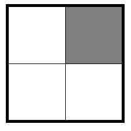

</center>

<!-- data-solution-button="5"-->
Zähler: [[  1  ]] \
Nenner: [[  4  ]] 

</div>
<div class="flex-child">

__$b)\;\;$__

<center>

<!-- style="width:150px" -->
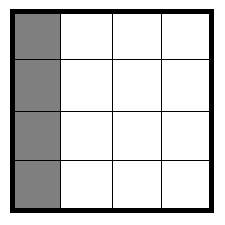

</center>

<!-- data-solution-button="5"-->
Zähler: [[  4  ]] \
Nenner: [[  16 ]] 

</div>
<div class="flex-child">

__$c)\;\;$__

<center>

<!-- style="width:150px" -->


</center>

<!-- data-solution-button="5"-->
Zähler: [[  6  ]] \
Nenner: [[ 16  ]] 

</div>
<div class="flex-child">

__$d)\;\;$__

<center>

<!-- style="width:150px" -->
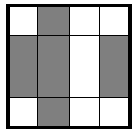

</center>

<!-- data-solution-button="5"-->
Zähler: [[  8  ]] \
Nenner: [[  16 ]] 

</div>
<div class="flex-child">

__$e)\;\;$__

<center>

<!-- style="width:150px" -->
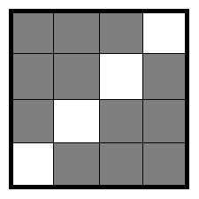

</center>

<!-- data-solution-button="5"-->
Zähler: [[  12 ]] \
Nenner: [[  16 ]] 

</div>

<div class="flex-child">

__$f)\;\;$__

<center>

<!-- style="width:150px" -->
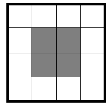

</center>

<!-- data-solution-button="5"-->
Zähler: [[  4  ]] \
Nenner: [[ 16  ]] 

</div>

<div class="flex-child">

__$g)\;\;$__

<center>

<!-- style="width:150px" -->
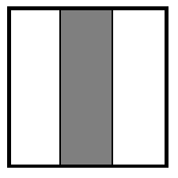

</center>

<!-- data-solution-button="5"-->
Zähler: [[  1  ]] \
Nenner: [[  3  ]] 

</div>

<div class="flex-child">

__$h)\;\;$__

<center>

<!-- style="width:150px" -->
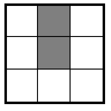

</center>

<!-- data-solution-button="5"-->
Zähler: [[  2  ]] \
Nenner: [[  9  ]] 

</div>

<div class="flex-child">

__$i)\;\;$__

<center>

<!-- style="width:150px" -->
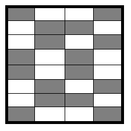

</center>

<!-- data-solution-button="5"-->
Zähler: [[  16 ]] \
Nenner: [[  32 ]] 

</div>

<div class="flex-child">

__$j)\;\;$__

<center>

<!-- style="width:150px" -->


</center>

<!-- data-solution-button="5"-->
Zähler: [[  3  ]] \
Nenner: [[  6  ]] 

</div>

</section>


<!--  Bruchrechnung 0002  -->

   \
__Aufgabe 2:__ **Gib** den Nenner und Zähler des jeweiligen dargestellten Bruchs **an**. (Es ist der jeweilige graue Anteil gefragt.)


<section class="flex-container">

<div class="flex-child">

__$a)\;\;$__

<center>

<!-- style="width:150px" -->
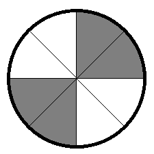

</center>

<!-- data-solution-button="5"-->
Zähler: [[  4  ]] \
Nenner: [[  8  ]] 

</div>
<div class="flex-child">

__$b)\;\;$__

<center>

<!-- style="width:150px" -->
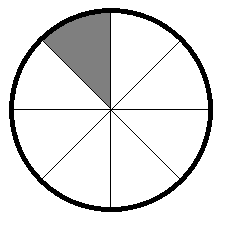

</center>

<!-- data-solution-button="5"-->
Zähler: [[  1  ]] \
Nenner: [[  8  ]] 

</div>
<div class="flex-child">

__$c)\;\;$__

<center>

<!-- style="width:150px" -->
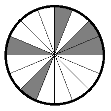

</center>

<!-- data-solution-button="5"-->
Zähler: [[  5  ]] \
Nenner: [[ 16  ]] 

</div>
<div class="flex-child">

__$d)\;\;$__

<center>

<!-- style="width:150px" -->
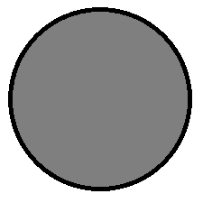

</center>

<!-- data-solution-button="5"-->
Zähler: [[  1  ]] \
Nenner: [[  1  ]] 

</div>
<div class="flex-child">

__$e)\;\;$__

<center>

<!-- style="width:150px" -->
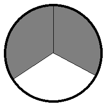

</center>

<!-- data-solution-button="5"-->
Zähler: [[  2  ]] \
Nenner: [[  3  ]] 

</div>

<div class="flex-child">

__$f)\;\;$__

<center>

<!-- style="width:150px" -->
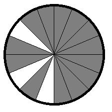

</center>

<!-- data-solution-button="5"-->
Zähler: [[ 13  ]] \
Nenner: [[ 16  ]] 

</div>

<div class="flex-child">

__$g)\;\;$__

<center>

<!-- style="width:150px" -->
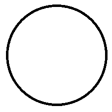

</center>

<!-- data-solution-button="5"-->
Zähler: [[  0  ]] \
Nenner: [[  1  ]] 

</div>

<div class="flex-child">

__$h)\;\;$__

<center>

<!-- style="width:150px" -->
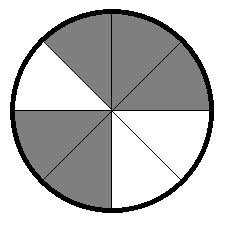

</center>

<!-- data-solution-button="5"-->
Zähler: [[  5  ]] \
Nenner: [[  8  ]] 

</div>

<div class="flex-child">

__$i)\;\;$__

<center>

<!-- style="width:150px" -->
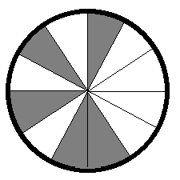

</center>

<!-- data-solution-button="5"-->
Zähler: [[  5  ]] \
Nenner: [[  12 ]] 

</div>

<div class="flex-child">

__$j)\;\;$__

<center>

<!-- style="width:150px" -->
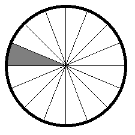

</center>

<!-- data-solution-button="5"-->
Zähler: [[  1  ]] \
Nenner: [[  16 ]] 

</div>

</section>


<!--  Bruchrechnung 0003  -->

   \
__Aufgabe 3:__ **Gib** den Nenner und Zähler des jeweiligen dargestellten Bruchs **an**. (Es ist der jeweilige graue Anteil gefragt.)


<section class="flex-container">

<div class="flex-child">

__$a)\;\;$__

<center>

<!-- style="width:150px" -->
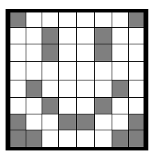

</center>

<!-- data-solution-button="5"-->
Zähler: [[ 18  ]] \
Nenner: [[ 64  ]] 

</div>
<div class="flex-child">

__$b)\;\;$__

<center>

<!-- style="width:150px" -->
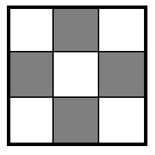

</center>

<!-- data-solution-button="5"-->
Zähler: [[  4  ]] \
Nenner: [[  9  ]] 

</div>
<div class="flex-child">

__$c)\;\;$__

<center>

<!-- style="width:150px" -->
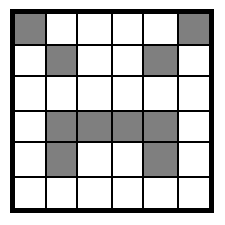

</center>

<!-- data-solution-button="5"-->
Zähler: [[ 10  ]] \
Nenner: [[ 36  ]] 

</div>
<div class="flex-child">

__$d)\;\;$__

<center>

<!-- style="width:150px" -->
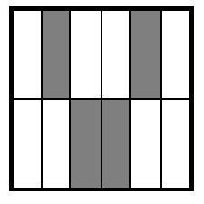

</center>

<!-- data-solution-button="5"-->
Zähler: [[  4  ]] \
Nenner: [[  12 ]] 

</div>
<div class="flex-child">

__$e)\;\;$__

<center>

<!-- style="width:150px" -->
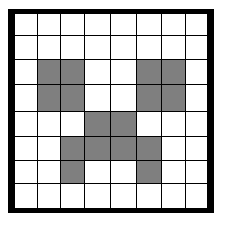

</center>

<!-- data-solution-button="5"-->
Zähler: [[  16 ]] \
Nenner: [[  64 ]] 

</div>

<div class="flex-child">

__$f)\;\;$__

<center>

<!-- style="width:150px" -->
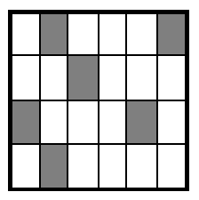

</center>

<!-- data-solution-button="5"-->
Zähler: [[  6  ]] \
Nenner: [[ 24  ]] 

</div>

<div class="flex-child">

__$g)\;\;$__

<center>

<!-- style="width:150px" -->
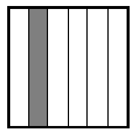

</center>

<!-- data-solution-button="5"-->
Zähler: [[  1  ]] \
Nenner: [[  6  ]] 

</div>

<div class="flex-child">

__$h)\;\;$__

<center>

<!-- style="width:150px" -->
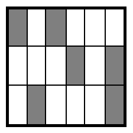

</center>

<!-- data-solution-button="5"-->
Zähler: [[  6  ]] \
Nenner: [[ 18  ]] 

</div>

<div class="flex-child">

__$i)\;\;$__

<center>

<!-- style="width:150px" -->
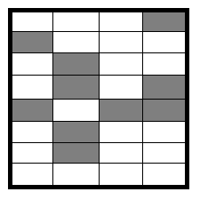

</center>

<!-- data-solution-button="5"-->
Zähler: [[  10 ]] \
Nenner: [[  32 ]] 

</div>

<div class="flex-child">

__$j)\;\;$__

<center>

<!-- style="width:150px" -->
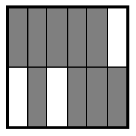

</center>

<!-- data-solution-button="5"-->
Zähler: [[  9  ]] \
Nenner: [[  12 ]] 

</div>

</section>


<!--  Bruchrechnung 0004  -->

   \
__Aufgabe 4:__ **Gib** den Nenner und Zähler des jeweiligen dargestellten Bruchs **an**. (Es ist der jeweilige graue Anteil gefragt.)


<section class="flex-container">

<div class="flex-child">

__$a)\;\;$__

<center>

<!-- style="width:150px" -->
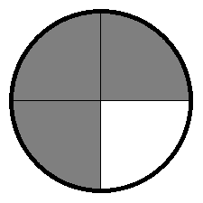

</center>

<!-- data-solution-button="5"-->
Zähler: [[  3  ]] \
Nenner: [[  4  ]] 

</div>
<div class="flex-child">

__$b)\;\;$__

<center>

<!-- style="width:150px" -->
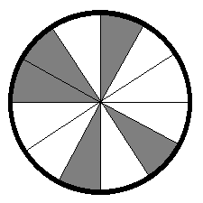

</center>

<!-- data-solution-button="5"-->
Zähler: [[  5  ]] \
Nenner: [[ 12  ]] 

</div>
<div class="flex-child">

__$c)\;\;$__

<center>

<!-- style="width:150px" -->
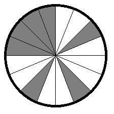

</center>

<!-- data-solution-button="5"-->
Zähler: [[  7  ]] \
Nenner: [[ 16  ]] 

</div>
<div class="flex-child">

__$d)\;\;$__

<center>

<!-- style="width:150px" -->
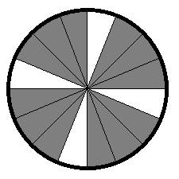

</center>

<!-- data-solution-button="5"-->
Zähler: [[  12 ]] \
Nenner: [[  16 ]] 

</div>
<div class="flex-child">

__$e)\;\;$__

<center>

<!-- style="width:150px" -->
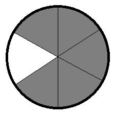

</center>

<!-- data-solution-button="5"-->
Zähler: [[  5  ]] \
Nenner: [[  6  ]] 

</div>

<div class="flex-child">

__$f)\;\;$__

<center>

<!-- style="width:150px" -->
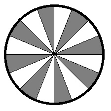

</center>

<!-- data-solution-button="5"-->
Zähler: [[  8  ]] \
Nenner: [[ 16  ]] 

</div>

<div class="flex-child">

__$g)\;\;$__

<center>

<!-- style="width:150px" -->
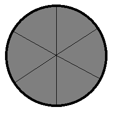

</center>

<!-- data-solution-button="5"-->
Zähler: [[  6  ]] \
Nenner: [[  6  ]] 

</div>

<div class="flex-child">

__$h)\;\;$__

<center>

<!-- style="width:150px" -->
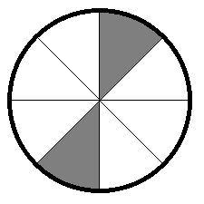

</center>

<!-- data-solution-button="5"-->
Zähler: [[  2  ]] \
Nenner: [[  8  ]] 

</div>

<div class="flex-child">

__$i)\;\;$__

<center>

<!-- style="width:150px" -->
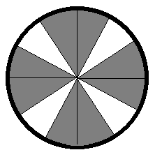

</center>

<!-- data-solution-button="5"-->
Zähler: [[  8  ]] \
Nenner: [[  12 ]] 

</div>

<div class="flex-child">

__$j)\;\;$__

<center>

<!-- style="width:150px" -->
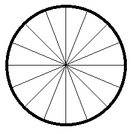

</center>

<!-- data-solution-button="5"-->
Zähler: [[  0  ]] \
Nenner: [[  16 ]] 

</div>

</section>


<!--  Bruchrechnung 0005  -->

   \
__Aufgabe 5:__ **Gib** den Nenner und Zähler des jeweiligen dargestellten Bruchs **an**. (Es ist der jeweilige graue Anteil gefragt.)


<section class="flex-container">

<div class="flex-child">

__$a)\;\;$__

<center>

<!-- style="width:400px" -->
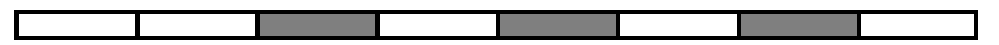

</center>

<!-- data-solution-button="5"-->
Zähler: [[  3  ]] \
Nenner: [[  8  ]] 

</div>
<div class="flex-child">

__$b)\;\;$__

<center>

<!-- style="width:400px" -->


</center>

<!-- data-solution-button="5"-->
Zähler: [[  1  ]] \
Nenner: [[  2  ]] 

</div>
<div class="flex-child">

__$c)\;\;$__

<center>

<!-- style="width:400px" -->


</center>

<!-- data-solution-button="5"-->
Zähler: [[  1  ]] \
Nenner: [[  4  ]] 

</div>
<div class="flex-child">

__$d)\;\;$__

<center>

<!-- style="width:400px" -->


</center>

<!-- data-solution-button="5"-->
Zähler: [[  5  ]] \
Nenner: [[  8  ]] 

</div>
<div class="flex-child">

__$e)\;\;$__

<center>

<!-- style="width:400px" -->
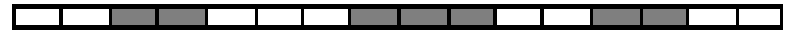

</center>

<!-- data-solution-button="5"-->
Zähler: [[  7  ]] \
Nenner: [[ 16  ]] 

</div>

<div class="flex-child">

__$f)\;\;$__

<center>

<!-- style="width:400px" -->
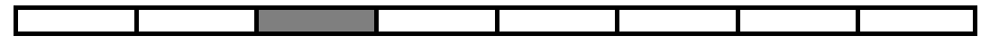

</center>

<!-- data-solution-button="5"-->
Zähler: [[  1  ]] \
Nenner: [[  8  ]] 

</div>


</section>


<!--  Bruchrechnung 0006  -->

   \
__Aufgabe 6:__ **Entscheide** welches Relationszeichen eine wahre mathematische Aussage darstellt.


<section class="flex-container">
<div class="flex-child">

__$a)\;\;$__ $\dfrac{1}{5}$ [[$>$|$=$|($<$)]] $\dfrac{1}{3}$ 

</div>
<div class="flex-child">

__$b)\;\;$__ $\dfrac{5}{10}$ [[$>$|($=$)|$<$]] $\dfrac{1}{2}$ 

</div>
<div class="flex-child">

__$c)\;\;$__ $\dfrac{4}{7}$ [[($>$)|$=$|$<$]] $\dfrac{3}{7}$ 

</div>
<div class="flex-child">

__$d)\;\;$__ $\dfrac{3}{4}$ [[($>$)|$=$|$<$]] $\dfrac{4}{8}$ 

</div>
<div class="flex-child">

__$e)\;\;$__ $\dfrac{3}{20}$ [[$>$|$=$|($<$)]] $\dfrac{3}{8}$ 

</div>
<div class="flex-child">

__$f)\;\;$__ $\dfrac{9}{8}$ [[($>$)|$=$|$<$]] $\dfrac{7}{7}$ 


</div>
</section>


<!--  Bruchrechnung 0007  -->

   \
__Aufgabe 7:__ **Entscheide** welches Relationszeichen eine wahre mathematische Aussage darstellt.


<section class="flex-container">
<div class="flex-child">

__$a)\;\;$__ $\dfrac{2}{5}$ [[$>$|($=$)|$<$]] $\dfrac{4}{10}$ 

</div>
<div class="flex-child">

__$b)\;\;$__ $\dfrac{3}{8}$ [[($>$)|$=$|$<$]] $\dfrac{1}{2}$ 

</div>
<div class="flex-child">

__$c)\;\;$__ $\dfrac{5}{15}$ [[$>$|($=$)|$<$]] $\dfrac{2}{6}$ 

</div>
<div class="flex-child">

__$d)\;\;$__ $\dfrac{5}{3}$ [[($>$)|$=$|$<$]] $\dfrac{7}{4}$ 

</div>
<div class="flex-child">

__$e)\;\;$__ $\dfrac{17}{100}$ [[$>$|$=$|($<$)]] $\dfrac{2}{10}$ 

</div>
<div class="flex-child">

__$f)\;\;$__ $\dfrac{7}{6}$ [[$>$|$=$|($<$)]] $\dfrac{4}{3}$ 


</div>
</section>


<!--  Bruchrechnung 0008  -->

   \
__Aufgabe 8:__ **Entscheide** welches Relationszeichen eine wahre mathematische Aussage darstellt.


<section class="flex-container">
<div class="flex-child">

__$a)\;\;$__ $\dfrac{7}{10}$ [[$>$|$=$|($<$)]] $\dfrac{9}{10}$ 

</div>
<div class="flex-child">

__$b)\;\;$__ $\dfrac{8}{5}$ [[$>$|$=$|($<$)]] $\dfrac{7}{4}$ 

</div>
<div class="flex-child">

__$c)\;\;$__ $\dfrac{2}{3}$ [[($>$)|$=$|$<$]] $\dfrac{3}{7}$ 

</div>
<div class="flex-child">

__$d)\;\;$__ $\dfrac{36}{27}$ [[$>$|($=$)|$<$]] $\dfrac{4}{3}$ 

</div>
<div class="flex-child">

__$e)\;\;$__ $\dfrac{17}{20}$ [[($>$)|$=$|$<$]] $\dfrac{7}{8}$ 

</div>
<div class="flex-child">

__$f)\;\;$__ $\dfrac{11}{9}$ [[($>$)|$=$|$<$]] $\dfrac{8}{7}$ 


</div>
</section>


<!--  Bruchrechnung 0009  -->

   \
__Aufgabe 9:__ **Entscheide** welches Relationszeichen eine wahre mathematische Aussage darstellt.


<section class="flex-container">
<div class="flex-child">

__$a)\;\;$__ $\dfrac{5}{8}$ [[$>$|$=$|($<$)]] $\dfrac{3}{4}$ 

</div>
<div class="flex-child">

__$b)\;\;$__ $\dfrac{9}{7}$ [[($>$)|$=$|$<$]] $\dfrac{8}{9}$ 

</div>
<div class="flex-child">

__$c)\;\;$__ $\dfrac{15}{60}$ [[$>$|($=$)|$<$]] $\dfrac{3}{12}$ 

</div>
<div class="flex-child">

__$d)\;\;$__ $\dfrac{5}{9}$ [[$>$|$=$|($<$)]] $\dfrac{4}{7}$ 

</div>
<div class="flex-child">

__$e)\;\;$__ $\dfrac{12}{5}$ [[$>$|$=$|($<$)]] $\dfrac{11}{4}$ 

</div>
<div class="flex-child">

__$f)\;\;$__ $\dfrac{7}{11}$ [[($>$)|$=$|$<$]] $\dfrac{5}{9}$ 


</div>
</section>


<!--  Bruchrechnung 0010  -->

   \
__Aufgabe 10:__ **Entscheide** welches Relationszeichen eine wahre mathematische Aussage darstellt.


<section class="flex-container">
<div class="flex-child">

__$a)\;\;$__ $\dfrac{8}{9}$ [[($>$)|$=$|$<$]] $\dfrac{2}{3}$ 

</div>
<div class="flex-child">

__$b)\;\;$__ $\dfrac{9}{24}$ [[$>$|($=$)|$<$]] $\dfrac{3}{8}$ 

</div>
<div class="flex-child">

__$c)\;\;$__ $\dfrac{12}{11}$ [[($>$)|$=$|$<$]] $\dfrac{11}{12}$ 

</div>
<div class="flex-child">

__$d)\;\;$__ $\dfrac{5}{6}$ [[($>$)|$=$|$<$]] $\dfrac{7}{10}$ 

</div>
<div class="flex-child">

__$e)\;\;$__ $\dfrac{13}{25}$ [[($>$)|$=$|$<$]] $\dfrac{27}{61}$ 

</div>
<div class="flex-child">

__$f)\;\;$__ $\dfrac{17}{6}$ [[$>$|$=$|($<$)]] $\dfrac{22}{7}$ 


</div>
</section>


<!--  Bruchrechnung 0011  -->


   \
__Aufgabe 11:__ **Berechne** den Wert des Terms.


<section class="flex-container">

<div class="flex-child">
<!-- data-solution-button="5"-->
__$a)\;\;$__ $  \dfrac{1}{2} + \dfrac{1}{8} = $ [[  5/8  ]]
@Algebrite.check(5/8)
************
$$
\begin{align*}
\dfrac{1}{2} + \dfrac{1}{8} & = \dfrac{1 \cdot 4}{2 \cdot 4} + \dfrac{1}{8}  \\
 & = \dfrac{4}{8} + \dfrac{1}{8}  \\
 & = \dfrac{4+1}{8}  \\
 & = \dfrac{5}{8} \\
\end{align*}
$$
************
</div>
<div class="flex-child">
<!-- data-solution-button="5"-->
__$b)\;\;$__ $  \dfrac{1}{3} + \dfrac{1}{6} = $ [[  1/2  ]]
@Algebrite.check(1/2)
************
$$
\begin{align*}
\dfrac{1}{3} + \dfrac{1}{6} & = \dfrac{1 \cdot 2}{3 \cdot 2} + \dfrac{1}{6}  \\
 & = \dfrac{2}{6} + \dfrac{1}{6}  \\
 & = \dfrac{2+1}{6}  \\
 & = \dfrac{3}{6} = \dfrac{1}{2} \\
\end{align*}
$$
************
</div>

<div class="flex-child">
<!-- data-solution-button="5"-->
__$c)\;\;$__ $  \dfrac{2}{5} + \dfrac{1}{10} = $ [[  1/2  ]]
@Algebrite.check(1/2)
************
$$
\begin{align*}
\dfrac{2}{5} + \dfrac{1}{10} & = \dfrac{2 \cdot 2}{5 \cdot 2} + \dfrac{1}{10}  \\
 & = \dfrac{4}{10} + \dfrac{1}{10}  \\
 & = \dfrac{4+1}{10}  \\
 & = \dfrac{5}{10} = \dfrac{1}{2} \\
\end{align*}
$$
************
</div>

<div class="flex-child">
<!-- data-solution-button="5"-->
__$d)\;\;$__ $  \dfrac{3}{4} + \dfrac{1}{8} = $ [[  7/8  ]]
@Algebrite.check(7/8)
************
$$
\begin{align*}
\dfrac{3}{4} + \dfrac{1}{8} & = \dfrac{3 \cdot 2}{4 \cdot 2} + \dfrac{1}{8}  \\
 & = \dfrac{6}{8} + \dfrac{1}{8}  \\
 & = \dfrac{6+1}{8}  \\
 & = \dfrac{7}{8} \\
\end{align*}
$$
************
</div>

<div class="flex-child">
<!-- data-solution-button="5"-->
__$e)\;\;$__ $  \dfrac{5}{6} + \dfrac{1}{12} = $ [[  11/12  ]]
@Algebrite.check(11/12)
************
$$
\begin{align*}
\dfrac{5}{6} + \dfrac{1}{12} & = \dfrac{5 \cdot 2}{6 \cdot 2} + \dfrac{1}{12}  \\
 & = \dfrac{10}{12} + \dfrac{1}{12}  \\
 & = \dfrac{10+1}{12}  \\
 & = \dfrac{11}{12} \\
\end{align*}
$$
************
</div>

<div class="flex-child">
<!-- data-solution-button="5"-->
__$f)\;\;$__ $  \dfrac{7}{10} + \dfrac{1}{5} = $ [[  9/10  ]]
@Algebrite.check(9/10)
************
$$
\begin{align*}
\dfrac{7}{10} + \dfrac{1}{5} & = \dfrac{7}{10} + \dfrac{1 \cdot 2}{5 \cdot 2}  \\
 & = \dfrac{7}{10} + \dfrac{2}{10}  \\
 & = \dfrac{7+2}{10}  \\
 & = \dfrac{9}{10} \\
\end{align*}
$$
************
</div>

</section>


<!--  Bruchrechnung 0012  -->


   \
__Aufgabe 12:__ **Berechne** den Wert des Terms.


<section class="flex-container">

<div class="flex-child">
<!-- data-solution-button="5"-->
__$a)\;\;$__ $  \dfrac{3}{14} + \dfrac{1}{7} = $ [[  5/14  ]]
@Algebrite.check(5/14)
************
$$
\begin{align*}
\dfrac{3}{14} + \dfrac{1}{7} &= \dfrac{3}{14} + \dfrac{1 \cdot 2}{7 \cdot 2} \\
&= \dfrac{3}{14} + \dfrac{2}{14} \\
&= \dfrac{5}{14}
\end{align*}
$$
************
</div>

<div class="flex-child">
<!-- data-solution-button="5"-->
__$b)\;\;$__ $  \dfrac{1}{9} + \dfrac{1}{3} = $ [[  4/9  ]]
@Algebrite.check(4/9)
************
$$
\begin{align*}
\dfrac{1}{9} + \dfrac{1}{3} &= \dfrac{1}{9} + \dfrac{1 \cdot 3}{3 \cdot 3} \\
&= \dfrac{1}{9} + \dfrac{3}{9} \\
&= \dfrac{4}{9}
\end{align*}
$$
************
</div>

<div class="flex-child">
<!-- data-solution-button="5"-->
__$c)\;\;$__ $  \dfrac{7}{8} + \dfrac{1}{4} = $ [[  9/8  ]]
@Algebrite.check(9/8)
************
$$
\begin{align*}
\dfrac{7}{8} + \dfrac{1}{4} &= \dfrac{7}{8} + \dfrac{1 \cdot 2}{4 \cdot 2} \\
&= \dfrac{7}{8} + \dfrac{2}{8} \\
&= \dfrac{9}{8}
\end{align*}
$$
************
</div>

<div class="flex-child">
<!-- data-solution-button="5"-->
__$d)\;\;$__ $  \dfrac{13}{20} + \dfrac{1}{5} = $ [[  17/20  ]]
@Algebrite.check(17/20)
************
$$
\begin{align*}
\dfrac{13}{20} + \dfrac{1}{5} &= \dfrac{13}{20} + \dfrac{1 \cdot 4}{5 \cdot 4} \\
&= \dfrac{13}{20} + \dfrac{4}{20} \\
&= \dfrac{17}{20}
\end{align*}
$$
************
</div>

<div class="flex-child">
<!-- data-solution-button="5"-->
__$e)\;\;$__ $  \dfrac{4}{15} + \dfrac{1}{5} = $ [[  7/15  ]]
@Algebrite.check(7/15)
************
$$
\begin{align*}
\dfrac{4}{15} + \dfrac{1}{5} &= \dfrac{4}{15} + \dfrac{1 \cdot 3}{5 \cdot 3} \\
&= \dfrac{4}{15} + \dfrac{3}{15} \\
&= \dfrac{7}{15}
\end{align*}
$$
************
</div>

<div class="flex-child">
<!-- data-solution-button="5"-->
__$f)\;\;$__ $  \dfrac{11}{28} + \dfrac{1}{14} = $ [[  13/28  ]]
@Algebrite.check(13/28)
************
$$
\begin{align*}
\dfrac{11}{28} + \dfrac{1}{14} &= \dfrac{11}{28} + \dfrac{1 \cdot 2}{14 \cdot 2} \\
&= \dfrac{11}{28} + \dfrac{2}{28} \\
&= \dfrac{13}{28}
\end{align*}
$$
************
</div>

</section>


<!--  Bruchrechnung 0013  -->


   \
__Aufgabe 12:__ **Berechne** den Wert des Terms.


<section class="flex-container">
<div class="flex-child">
<!-- data-solution-button="5"-->
__$a)\;\;$__ $  \dfrac{5}{12} + \dfrac{1}{6} = $ [[  7/12  ]]
@Algebrite.check(7/12)
************
$$
\begin{align*}
\dfrac{5}{12} + \dfrac{1}{6} &= \dfrac{5}{12} + \dfrac{1 \cdot 2}{6 \cdot 2} \\
&= \dfrac{5}{12} + \dfrac{2}{12} \\
&= \dfrac{7}{12}
\end{align*}
$$
************
</div>

<div class="flex-child">
<!-- data-solution-button="5"-->
__$b)\;\;$__ $  \dfrac{9}{16} + \dfrac{1}{8} = $ [[  11/16  ]]
@Algebrite.check(11/16)
************
$$
\begin{align*}
\dfrac{9}{16} + \dfrac{1}{8} &= \dfrac{9}{16} + \dfrac{1 \cdot 2}{8 \cdot 2} \\
&= \dfrac{9}{16} + \dfrac{2}{16} \\
&= \dfrac{11}{16}
\end{align*}
$$
************
</div>

<div class="flex-child">
<!-- data-solution-button="5"-->
__$c)\;\;$__ $  \dfrac{5}{18} + \dfrac{1}{9} = $ [[  7/18  ]]
@Algebrite.check(7/18)
************
$$
\begin{align*}
\dfrac{5}{18} + \dfrac{1}{9} &= \dfrac{5}{18} + \dfrac{1 \cdot 2}{9 \cdot 2} \\
&= \dfrac{5}{18} + \dfrac{2}{18} \\
&= \dfrac{7}{18}
\end{align*}
$$
************
</div>

<div class="flex-child">
<!-- data-solution-button="5"-->
__$d)\;\;$__ $  \dfrac{15}{28} + \dfrac{1}{7} = $ [[  19/28  ]]
@Algebrite.check(19/28)
************
$$
\begin{align*}
\dfrac{15}{28} + \dfrac{1}{7} &= \dfrac{15}{28} + \dfrac{1 \cdot 4}{7 \cdot 4} \\
&= \dfrac{15}{28} + \dfrac{4}{28} \\
&= \dfrac{19}{28}
\end{align*}
$$
************
</div>

<div class="flex-child">
<!-- data-solution-button="5"-->
__$e)\;\;$__ $  \dfrac{8}{21} + \dfrac{1}{7} = $ [[  11/21  ]]
@Algebrite.check(11/21)
************
$$
\begin{align*}
\dfrac{8}{21} + \dfrac{1}{7} &= \dfrac{8}{21} + \dfrac{1 \cdot 3}{7 \cdot 3} \\
&= \dfrac{8}{21} + \dfrac{3}{21} \\
&= \dfrac{11}{21}
\end{align*}
$$
************
</div>

<div class="flex-child">
<!-- data-solution-button="5"-->
__$f)\;\;$__ $  \dfrac{16}{30} + \dfrac{1}{10} = $ [[  19/30  ]]
@Algebrite.check(22/30)
************
$$
\begin{align*}
\dfrac{16}{30} + \dfrac{1}{10} &= \dfrac{16}{30} + \dfrac{1 \cdot 3}{10 \cdot 3} \\
&= \dfrac{16}{30} + \dfrac{3}{30} \\
&= \dfrac{19}{30}
\end{align*}
$$
************
</div>

</section>


<!--  Bruchrechnung 0014  -->


   \
__Aufgabe 14:__ **Berechne** den Wert des Terms.


<section class="flex-container">

<div class="flex-child">
<!-- data-solution-button="5"-->
__$a)\;\;$__ $  \dfrac{5}{12} + \dfrac{1}{6} = $ [[  7/12  ]]
@Algebrite.check(7/12)
************
$$
\begin{align*}
\dfrac{5}{12} + \dfrac{1}{6} &= \dfrac{5}{12} + \dfrac{1 \cdot 2}{6 \cdot 2} \\
&= \dfrac{5}{12} + \dfrac{2}{12} \\
&= \dfrac{7}{12}
\end{align*}
$$
************
</div>

<div class="flex-child">
<!-- data-solution-button="5"-->
__$b)\;\;$__ $  \dfrac{11}{15} + \dfrac{2}{5} = $ [[  17/15  ]]
@Algebrite.check(17/15)
************
$$
\begin{align*}
\dfrac{11}{15} + \dfrac{2}{5} &= \dfrac{11}{15} + \dfrac{2 \cdot 3}{5 \cdot 3} \\
&= \dfrac{11}{15} + \dfrac{6}{15} \\
&= \dfrac{17}{15}
\end{align*}
$$
************
</div>

<div class="flex-child">
<!-- data-solution-button="5"-->
__$c)\;\;$__ $  \dfrac{5}{21} + \dfrac{2}{7} = $ [[  11/21  ]]
@Algebrite.check(11/21)
************
$$
\begin{align*}
\dfrac{5}{21} + \dfrac{2}{7} &= \dfrac{5}{21} + \dfrac{2 \cdot 3}{7 \cdot 3} \\
&= \dfrac{5}{21} + \dfrac{6}{21} \\
&= \dfrac{11}{21}
\end{align*}
$$
************
</div>

<div class="flex-child">
<!-- data-solution-button="5"-->
__$d)\;\;$__ $  \dfrac{5}{18} + \dfrac{1}{9} = $ [[  7/18  ]]
@Algebrite.check(7/18)
************
$$
\begin{align*}
\dfrac{5}{18} + \dfrac{1}{9} &= \dfrac{5}{18} + \dfrac{1 \cdot 2}{9 \cdot 2} \\
&= \dfrac{5}{18} + \dfrac{2}{18} \\
&= \dfrac{7}{18}
\end{align*}
$$
************
</div>

<div class="flex-child">
<!-- data-solution-button="5"-->
__$e)\;\;$__ $  \dfrac{3}{28} + \dfrac{2}{7} = $ [[  11/28  ]]
@Algebrite.check(11/28)
************
$$
\begin{align*}
\dfrac{3}{28} + \dfrac{2}{7} &= \dfrac{3}{28} + \dfrac{2 \cdot 4}{7 \cdot 4} \\
&= \dfrac{3}{28} + \dfrac{8}{28} \\
&= \dfrac{11}{28}
\end{align*}
$$
************
</div>

<div class="flex-child">
<!-- data-solution-button="5"-->
__$f)\;\;$__ $  \dfrac{3}{20} + \dfrac{1}{2} = $ [[  13/20  ]]
@Algebrite.check(13/20)
************
$$
\begin{align*}
\dfrac{3}{20} + \dfrac{1}{2} &= \dfrac{3}{20} + \dfrac{1 \cdot 10}{2 \cdot 10} \\
&= \dfrac{3}{20} + \dfrac{10}{20} \\
&= \dfrac{13}{20}
\end{align*}
$$
************
</div>

</section>


<!--  Bruchrechnung 0015  -->


   \
__Aufgabe 15:__ **Berechne** den Wert des Terms.


<section class="flex-container">

<div class="flex-child">
<!-- data-solution-button="5"-->
__$a)\;\;$__ $  3 + \dfrac{5}{11} = $ [[  38/11  ]]
@Algebrite.check(38/11)
************
$$
\begin{align*}
3 + \dfrac{5}{11} &= \dfrac{3 \cdot 11}{1 \cdot 11} + \dfrac{5}{11} \\
&= \dfrac{33}{11} + \dfrac{5}{11} \\
&= \dfrac{33+5}{11} \\
&= \dfrac{38}{11}
\end{align*}
$$
************
</div>

<div class="flex-child">
<!-- data-solution-button="5"-->
__$b)\;\;$__ $  1 + \dfrac{7}{12} = $ [[  19/12  ]]
@Algebrite.check(19/12)
************
$$
\begin{align*}
1 + \dfrac{7}{12} &= \dfrac{1 \cdot 12}{1 \cdot 12} + \dfrac{7}{12} \\
&= \dfrac{12}{12} + \dfrac{7}{12} \\
&= \dfrac{12+7}{12} \\
&= \dfrac{19}{12}
\end{align*}
$$
************
</div>

<div class="flex-child">
<!-- data-solution-button="5"-->
__$c)\;\;$__ $  4 + \dfrac{2}{9} = $ [[  38/9  ]]
@Algebrite.check(38/9)
************
$$
\begin{align*}
4 + \dfrac{2}{9} &= \dfrac{4 \cdot 9}{1 \cdot 9} + \dfrac{2}{9} \\
&= \dfrac{36}{9} + \dfrac{2}{9} \\
&= \dfrac{36+2}{9} \\
&= \dfrac{38}{9}
\end{align*}
$$
************
</div>

<div class="flex-child">
<!-- data-solution-button="5"-->
__$d)\;\;$__ $  5 + \dfrac{3}{14} = $ [[  73/14  ]]
@Algebrite.check(73/14)
************
$$
\begin{align*}
5 + \dfrac{3}{14} &= \dfrac{5 \cdot 14}{1 \cdot 14} + \dfrac{3}{14} \\
&= \dfrac{70}{14} + \dfrac{3}{14} \\
&= \dfrac{70+3}{14} \\
&= \dfrac{73}{14}
\end{align*}
$$
************
</div>

<div class="flex-child">
<!-- data-solution-button="5"-->
__$e)\;\;$__ $  2 + \dfrac{11}{15} = $ [[  41/15  ]]
@Algebrite.check(41/15)
************
$$
\begin{align*}
2 + \dfrac{11}{15} &= \dfrac{2 \cdot 15}{1 \cdot 15} + \dfrac{11}{15} \\
&= \dfrac{30}{15} + \dfrac{11}{15} \\
&= \dfrac{30+11}{15} \\
&= \dfrac{41}{15}
\end{align*}
$$
************
</div>

<div class="flex-child">
<!-- data-solution-button="5"-->
__$f)\;\;$__ $  6 + \dfrac{1}{8} = $ [[  49/8  ]]
@Algebrite.check(49/8)
************
$$
\begin{align*}
6 + \dfrac{1}{8} &= \dfrac{6 \cdot 8}{1 \cdot 8} + \dfrac{1}{8} \\
&= \dfrac{48}{8} + \dfrac{1}{8} \\
&= \dfrac{48+1}{8} \\
&= \dfrac{49}{8}
\end{align*}
$$
************
</div>

</section>


<!--  Bruchrechnung 0016  -->


   \
__Aufgabe 16:__ **Berechne** den Wert des Terms.


<section class="flex-container">

<div class="flex-child">
<!-- data-solution-button="5"-->
__$a)\;\;$__ $  7 + \dfrac{3}{10} = $ [[  73/10  ]]
@Algebrite.check(73/10)
************
$$
\begin{align*}
7 + \dfrac{3}{10} &= \dfrac{7 \cdot 10}{1 \cdot 10} + \dfrac{3}{10} \\
&= \dfrac{70}{10} + \dfrac{3}{10} \\
&= \dfrac{70+3}{10} \\
&= \dfrac{73}{10}
\end{align*}
$$
************
</div>

<div class="flex-child">
<!-- data-solution-button="5"-->
__$b)\;\;$__ $  2 + \dfrac{9}{13} = $ [[  35/13  ]]
@Algebrite.check(35/13)
************
$$
\begin{align*}
2 + \dfrac{9}{13} &= \dfrac{2 \cdot 13}{1 \cdot 13} + \dfrac{9}{13} \\
&= \dfrac{26}{13} + \dfrac{9}{13} \\
&= \dfrac{26+9}{13} \\
&= \dfrac{35}{13}
\end{align*}
$$
************
</div>

<div class="flex-child">
<!-- data-solution-button="5"-->
__$c)\;\;$__ $  5 + \dfrac{4}{9} = $ [[  49/9  ]]
@Algebrite.check(49/9)
************
$$
\begin{align*}
5 + \dfrac{4}{9} &= \dfrac{5 \cdot 9}{1 \cdot 9} + \dfrac{4}{9} \\
&= \dfrac{45}{9} + \dfrac{4}{9} \\
&= \dfrac{45+4}{9} \\
&= \dfrac{49}{9}
\end{align*}
$$
************
</div>

<div class="flex-child">
<!-- data-solution-button="5"-->
__$d)\;\;$__ $  8 + \dfrac{7}{12} = $ [[  103/12  ]]
@Algebrite.check(103/12)
************
$$
\begin{align*}
8 + \dfrac{7}{12} &= \dfrac{8 \cdot 12}{1 \cdot 12} + \dfrac{7}{12} \\
&= \dfrac{96}{12} + \dfrac{7}{12} \\
&= \dfrac{96+7}{12} \\
&= \dfrac{103}{12}
\end{align*}
$$
************
</div>

<div class="flex-child">
<!-- data-solution-button="5"-->
__$e)\;\;$__ $  3 + \dfrac{5}{14} = $ [[  47/14  ]]
@Algebrite.check(47/14)
************
$$
\begin{align*}
3 + \dfrac{5}{14} &= \dfrac{3 \cdot 14}{1 \cdot 14} + \dfrac{5}{14} \\
&= \dfrac{42}{14} + \dfrac{5}{14} \\
&= \dfrac{42+5}{14} \\
&= \dfrac{47}{14}
\end{align*}
$$
************
</div>

<div class="flex-child">
<!-- data-solution-button="5"-->
__$f)\;\;$__ $  4 + \dfrac{11}{15} = $ [[  71/15  ]]
@Algebrite.check(71/15)
************
$$
\begin{align*}
4 + \dfrac{11}{15} &= \dfrac{4 \cdot 15}{1 \cdot 15} + \dfrac{11}{15} \\
&= \dfrac{60}{15} + \dfrac{11}{15} \\
&= \dfrac{60+11}{15} \\
&= \dfrac{71}{15}
\end{align*}
$$
************
</div>

</section>


<!--  Bruchrechnung 0017  -->


   \
__Aufgabe 17:__ **Berechne** den Wert des Terms.


<section class="flex-container">

<div class="flex-child">
<!-- data-solution-button="5"-->
__$a)\;\;$__ $  \dfrac{7}{8} - \dfrac{1}{4} = $ [[  5/8  ]]
@Algebrite.check(5/8)
************
$$
\begin{align*}
\dfrac{7}{8} - \dfrac{1}{4} &= \dfrac{7}{8} - \dfrac{1 \cdot 2}{4 \cdot 2} \\
&= \dfrac{7}{8} - \dfrac{2}{8} \\
&= \dfrac{7-2}{8} \\
&= \dfrac{5}{8}
\end{align*}
$$
************
</div>

<div class="flex-child">
<!-- data-solution-button="5"-->
__$b)\;\;$__ $  \dfrac{13}{12} - \dfrac{1}{6} = $ [[  11/12  ]]
@Algebrite.check(11/12)
************
$$
\begin{align*}
\dfrac{13}{12} - \dfrac{1}{6} &= \dfrac{13}{12} - \dfrac{1 \cdot 2}{6 \cdot 2} \\
&= \dfrac{13}{12} - \dfrac{2}{12} \\
&= \dfrac{13-2}{12} \\
&= \dfrac{11}{12}
\end{align*}
$$
************
</div>

<div class="flex-child">
<!-- data-solution-button="5"-->
__$c)\;\;$__ $  \dfrac{9}{10} - \dfrac{1}{5} = $ [[  7/10  ]]
@Algebrite.check(7/10)
************
$$
\begin{align*}
\dfrac{9}{10} - \dfrac{1}{5} &= \dfrac{9}{10} - \dfrac{1 \cdot 2}{5 \cdot 2} \\
&= \dfrac{9}{10} - \dfrac{2}{10} \\
&= \dfrac{9-2}{10} \\
&= \dfrac{7}{10}
\end{align*}
$$
************
</div>

<div class="flex-child">
<!-- data-solution-button="5"-->
__$d)\;\;$__ $  \dfrac{13}{14} - \dfrac{2}{7} = $ [[  11/14  ]]
@Algebrite.check(11/14)
************
$$
\begin{align*}
\dfrac{13}{14} - \dfrac{2}{7} &= \dfrac{13}{14} - \dfrac{2 \cdot 2}{7 \cdot 2} \\
&= \dfrac{13}{14} - \dfrac{4}{14} \\
&= \dfrac{13-4}{14} \\
&= \dfrac{11}{14}
\end{align*}
$$
************
</div>

<div class="flex-child">
<!-- data-solution-button="5"-->
__$e)\;\;$__ $  \dfrac{15}{18} - \dfrac{1}{9} = $ [[  13/18  ]]
@Algebrite.check(13/18)
************
$$
\begin{align*}
\dfrac{15}{18} - \dfrac{1}{9} &= \dfrac{15}{18} - \dfrac{1 \cdot 2}{9 \cdot 2} \\
&= \dfrac{15}{18} - \dfrac{2}{18} \\
&= \dfrac{15-2}{18} \\
&= \dfrac{13}{18}
\end{align*}
$$
************
</div>

<div class="flex-child">
<!-- data-solution-button="5"-->
__$f)\;\;$__ $  \dfrac{24}{20} - \dfrac{1}{4} = $ [[  19/20  ]]
@Algebrite.check(19/20)
************
$$
\begin{align*}
\dfrac{24}{20} - \dfrac{1}{4} &= \dfrac{19}{20} - \dfrac{1 \cdot 5}{4 \cdot 5} \\
&= \dfrac{24}{20} - \dfrac{5}{20} \\
&= \dfrac{24-5}{20} \\
&= \dfrac{19}{20}
\end{align*}
$$
************
</div>

</section>


<!--  Bruchrechnung 0018  -->


   \
__Aufgabe 18:__ **Berechne** den Wert des Terms.


<section class="flex-container">

<div class="flex-child">
<!-- data-solution-button="5"-->
__$a)\;\;$__ $  \dfrac{5}{6} - \dfrac{1}{3} = $ [[  1/2  ]]
@Algebrite.check(1/2)
************
$$
\begin{align*}
\dfrac{5}{6} - \dfrac{1}{3} &= \dfrac{5}{6} - \dfrac{1 \cdot 2}{3 \cdot 2} \\
&= \dfrac{5}{6} - \dfrac{2}{6} \\
&= \dfrac{5-2}{6} \\
&= \dfrac{3}{6} \\
&= \dfrac{1}{2}
\end{align*}
$$
************
</div>

<div class="flex-child">
<!-- data-solution-button="5"-->
__$b)\;\;$__ $  \dfrac{7}{10} - \dfrac{1}{5} = $ [[  1/2  ]]
@Algebrite.check(1/2)
************
$$
\begin{align*}
\dfrac{7}{10} - \dfrac{1}{5} &= \dfrac{7}{10} - \dfrac{1 \cdot 2}{5 \cdot 2} \\
&= \dfrac{7}{10} - \dfrac{2}{10} \\
&= \dfrac{7-2}{10} \\
&= \dfrac{5}{10} \\
&= \dfrac{1}{2}
\end{align*}
$$
************
</div>

<div class="flex-child">
<!-- data-solution-button="5"-->
__$c)\;\;$__ $  \dfrac{11}{12} - \dfrac{1}{4} = $ [[  2/3  ]]
@Algebrite.check(2/3)
************
$$
\begin{align*}
\dfrac{11}{12} - \dfrac{1}{4} &= \dfrac{11}{12} - \dfrac{1 \cdot 3}{4 \cdot 3} \\
&= \dfrac{11}{12} - \dfrac{3}{12} \\
&= \dfrac{11-3}{12} \\
&= \dfrac{8}{12} \\
&= \dfrac{2}{3}
\end{align*}
$$
************
</div>

<div class="flex-child">
<!-- data-solution-button="5"-->
__$d)\;\;$__ $  \dfrac{13}{15} - \dfrac{1}{5} = $ [[  2/3  ]]
@Algebrite.check(2/3)
************
$$
\begin{align*}
\dfrac{13}{15} - \dfrac{1}{5} &= \dfrac{13}{15} - \dfrac{1 \cdot 3}{5 \cdot 3} \\
&= \dfrac{13}{15} - \dfrac{3}{15} \\
&= \dfrac{13-3}{15} \\
&= \dfrac{10}{15} \\
&= \dfrac{2}{3}
\end{align*}
$$
************
</div>

<div class="flex-child">
<!-- data-solution-button="5"-->
__$e)\;\;$__ $  \dfrac{17}{18} - \dfrac{2}{9} = $ [[  13/18  ]]
@Algebrite.check(13/18)
************
$$
\begin{align*}
\dfrac{17}{18} - \dfrac{2}{9} &= \dfrac{17}{18} - \dfrac{2 \cdot 2}{9 \cdot 2} \\
&= \dfrac{17}{18} - \dfrac{4}{18} \\
&= \dfrac{17-4}{18} \\
&= \dfrac{13}{18}
\end{align*}
$$
************
</div>

<div class="flex-child">
<!-- data-solution-button="5"-->
__$f)\;\;$__ $  \dfrac{19}{20} - \dfrac{1}{10} = $ [[  17/20  ]]
@Algebrite.check(17/20)
************
$$
\begin{align*}
\dfrac{19}{20} - \dfrac{1}{10} &= \dfrac{19}{20} - \dfrac{1 \cdot 2}{10 \cdot 2} \\
&= \dfrac{19}{20} - \dfrac{2}{20} \\
&= \dfrac{19-2}{20} \\
&= \dfrac{17}{20}
\end{align*}
$$
************
</div>

</section>


<!--  Bruchrechnung 0019  -->


   \
__Aufgabe 19:__ **Berechne** den Wert des Terms.


<section class="flex-container">

<div class="flex-child">
<!-- data-solution-button="5"-->
__$a)\;\;$__ $  \dfrac{7}{8} - \dfrac{1}{4} = $ [[  5/8  ]]
@Algebrite.check(5/8)
************
$$
\begin{align*}
\dfrac{7}{8} - \dfrac{1}{4} &= \dfrac{7}{8} - \dfrac{1 \cdot 2}{4 \cdot 2} \\
&= \dfrac{7}{8} - \dfrac{2}{8} \\
&= \dfrac{7-2}{8} \\
&= \dfrac{5}{8}
\end{align*}
$$
************
</div>

<div class="flex-child">
<!-- data-solution-button="5"-->
__$b)\;\;$__ $  \dfrac{9}{10} - \dfrac{2}{5} = $ [[  1/2  ]]
@Algebrite.check(1/2)
************
$$
\begin{align*}
\dfrac{9}{10} - \dfrac{2}{5} &= \dfrac{9}{10} - \dfrac{2 \cdot 2}{5 \cdot 2} \\
&= \dfrac{9}{10} - \dfrac{4}{10} \\
&= \dfrac{9-4}{10} \\
&= \dfrac{5}{10} \\
&= \dfrac{1}{2}
\end{align*}
$$
************
</div>

<div class="flex-child">
<!-- data-solution-button="5"-->
__$c)\;\;$__ $  \dfrac{11}{12} - \dfrac{5}{6} = $ [[  1/4  ]]
@Algebrite.check(1/4)
************
$$
\begin{align*}
\dfrac{11}{12} - \dfrac{5}{6} &= \dfrac{11}{12} - \dfrac{5 \cdot 2}{6 \cdot 2} \\
&= \dfrac{11}{12} - \dfrac{10}{12} \\
&= \dfrac{11-10}{12} \\
&= \dfrac{1}{12}
\end{align*}
$$
************
</div>

<div class="flex-child">
<!-- data-solution-button="5"-->
__$d)\;\;$__ $  \dfrac{13}{15} - \dfrac{2}{5} = $ [[  7/15  ]]
@Algebrite.check(7/15)
************
$$
\begin{align*}
\dfrac{13}{15} - \dfrac{2}{5} &= \dfrac{13}{15} - \dfrac{2 \cdot 3}{5 \cdot 3} \\
&= \dfrac{13}{15} - \dfrac{6}{15} \\
&= \dfrac{13-6}{15} \\
&= \dfrac{7}{15}
\end{align*}
$$
************
</div>

<div class="flex-child">
<!-- data-solution-button="5"-->
__$e)\;\;$__ $  \dfrac{19}{18} - \dfrac{4}{9} = $ [[  11/18  ]]
@Algebrite.check(11/18)
************
$$
\begin{align*}
\dfrac{19}{18} - \dfrac{4}{9} &= \dfrac{19}{18} - \dfrac{4 \cdot 2}{9 \cdot 2} \\
&= \dfrac{19}{18} - \dfrac{8}{18} \\
&= \dfrac{19-8}{18} \\
&= \dfrac{11}{18} \\
\end{align*}
$$
************
</div>

<div class="flex-child">
<!-- data-solution-button="5"-->
__$f)\;\;$__ $  \dfrac{19}{20} - \dfrac{3}{10} = $ [[  13/20  ]]
@Algebrite.check(13/20)
************
$$
\begin{align*}
\dfrac{19}{20} - \dfrac{3}{10} &= \dfrac{19}{20} - \dfrac{3 \cdot 2}{10 \cdot 2} \\
&= \dfrac{19}{20} - \dfrac{6}{20} \\
&= \dfrac{19-6}{20} \\
&= \dfrac{13}{20}
\end{align*}
$$
************
</div>

</section>


<!--  Bruchrechnung 0020  -->


   \
__Aufgabe 20:__ **Berechne** den Wert des Terms.


<section class="flex-container">

<div class="flex-child">
<!-- data-solution-button="5"-->
__$a)\;\;$__ $  \dfrac{13}{18} - \dfrac{1}{9} = $ [[  11/18  ]]
@Algebrite.check(11/18)
************
$$
\begin{align*}
\dfrac{13}{18} - \dfrac{1}{9} &= \dfrac{13}{18} - \dfrac{1 \cdot 2}{9 \cdot 2} \\
&= \dfrac{13}{18} - \dfrac{2}{18} \\
&= \dfrac{13-2}{18} \\
&= \dfrac{11}{18}
\end{align*}
$$
************
</div>

<div class="flex-child">
<!-- data-solution-button="5"-->
__$b)\;\;$__ $  \dfrac{11}{20} - \dfrac{1}{5} = $ [[  7/20  ]]
@Algebrite.check(7/20)
************
$$
\begin{align*}
\dfrac{11}{20} - \dfrac{1}{5} &= \dfrac{11}{20} - \dfrac{1 \cdot 4}{5 \cdot 4} \\
&= \dfrac{11}{20} - \dfrac{4}{20} \\
&= \dfrac{11-4}{20} \\
&= \dfrac{7}{20}
\end{align*}
$$
************
</div>

<div class="flex-child">
<!-- data-solution-button="5"-->
__$c)\;\;$__ $  \dfrac{11}{14} - \dfrac{1}{7} = $ [[  9/14  ]]
@Algebrite.check(9/14)
************
$$
\begin{align*}
\dfrac{11}{14} - \dfrac{1}{7} &= \dfrac{11}{14} - \dfrac{1 \cdot 2}{7 \cdot 2} \\
&= \dfrac{11}{14} - \dfrac{2}{14} \\
&= \dfrac{11-2}{14} \\
&= \dfrac{9}{14}
\end{align*}
$$
************
</div>

<div class="flex-child">
<!-- data-solution-button="5"-->
__$d)\;\;$__ $  \dfrac{7}{15} - \dfrac{1}{5} = $ [[  4/15  ]]
@Algebrite.check(4/15)
************
$$
\begin{align*}
\dfrac{7}{15} - \dfrac{1}{5} &= \dfrac{7}{15} - \dfrac{1 \cdot 3}{5 \cdot 3} \\
&= \dfrac{7}{15} - \dfrac{3}{15} \\
&= \dfrac{7-3}{15} \\
&= \dfrac{4}{15}
\end{align*}
$$
************
</div>

<div class="flex-child">
<!-- data-solution-button="5"-->
__$e)\;\;$__ $  \dfrac{11}{16} - \dfrac{1}{8} = $ [[  9/16  ]]
@Algebrite.check(9/16)
************
$$
\begin{align*}
\dfrac{11}{16} - \dfrac{1}{8} &= \dfrac{11}{16} - \dfrac{1 \cdot 2}{8 \cdot 2} \\
&= \dfrac{11}{16} - \dfrac{2}{16} \\
&= \dfrac{11-2}{16} \\
&= \dfrac{9}{16}
\end{align*}
$$
************
</div>

<div class="flex-child">
<!-- data-solution-button="5"-->
__$f)\;\;$__ $  \dfrac{7}{9} - \dfrac{1}{3} = $ [[  4/9  ]]
@Algebrite.check(4/9)
************
$$
\begin{align*}
\dfrac{7}{9} - \dfrac{1}{3} &= \dfrac{7}{9} - \dfrac{1 \cdot 3}{3 \cdot 3} \\
&= \dfrac{7}{9} - \dfrac{3}{9} \\
&= \dfrac{7-3}{9} \\
&= \dfrac{4}{9}
\end{align*}
$$
************
</div>

</section>


<!--  Bruchrechnung 0021  -->


   \
__Aufgabe 21:__ **Berechne** den Wert des Terms.


<section class="flex-container">

<div class="flex-child">
<!-- data-solution-button="5"-->
__$a)\;\;$__ $  2 - \dfrac{3}{5} = $ [[  7/5  ]]
@Algebrite.check(7/5)
************
$$
\begin{align*}
2 - \dfrac{3}{5} &= \dfrac{2 \cdot 5}{1 \cdot 5} - \dfrac{3}{5} \\
&= \dfrac{10}{5} - \dfrac{3}{5} \\
&= \dfrac{10-3}{5} \\
&= \dfrac{7}{5}
\end{align*}
$$
************
</div>

<div class="flex-child">
<!-- data-solution-button="5"-->
__$b)\;\;$__ $  3 - \dfrac{7}{8} = $ [[  17/8  ]]
@Algebrite.check(17/8)
************
$$
\begin{align*}
3 - \dfrac{7}{8} &= \dfrac{3 \cdot 8}{1 \cdot 8} - \dfrac{7}{8} \\
&= \dfrac{24}{8} - \dfrac{7}{8} \\
&= \dfrac{24-7}{8} \\
&= \dfrac{17}{8}
\end{align*}
$$
************
</div>

<div class="flex-child">
<!-- data-solution-button="5"-->
__$c)\;\;$__ $  \dfrac{19}{6} - 2 = $ [[  7/6  ]]
@Algebrite.check(7/6)
************
$$
\begin{align*}
\dfrac{19}{6} - 2 &= \dfrac{19}{6} - \dfrac{2 \cdot 6}{1 \cdot 6} \\
&= \dfrac{19}{6} - \dfrac{12}{6} \\
&= \dfrac{19-12}{6} \\
&= \dfrac{7}{6}
\end{align*}
$$
************
</div>

<div class="flex-child">
<!-- data-solution-button="5"-->
__$d)\;\;$__ $  4 - \dfrac{9}{10} = $ [[  31/10  ]]
@Algebrite.check(31/10)
************
$$
\begin{align*}
4 - \dfrac{9}{10} &= \dfrac{4 \cdot 10}{1 \cdot 10} - \dfrac{9}{10} \\
&= \dfrac{40}{10} - \dfrac{9}{10} \\
&= \dfrac{40-9}{10} \\
&= \dfrac{31}{10}
\end{align*}
$$
************
</div>

<div class="flex-child">
<!-- data-solution-button="5"-->
__$e)\;\;$__ $  \dfrac{17}{4} - 3 = $ [[  5/4  ]]
@Algebrite.check(5/4)
************
$$
\begin{align*}
\dfrac{17}{4} - 3 &= \dfrac{17}{4} - \dfrac{3 \cdot 4}{1 \cdot 4} \\
&= \dfrac{17}{4} - \dfrac{12}{4} \\
&= \dfrac{17-12}{4} \\
&= \dfrac{5}{4}
\end{align*}
$$
************
</div>

<div class="flex-child">
<!-- data-solution-button="5"-->
__$f)\;\;$__ $  5 - \dfrac{11}{12} = $ [[  49/12  ]]
@Algebrite.check(49/12)
************
$$
\begin{align*}
5 - \dfrac{11}{12} &= \dfrac{5 \cdot 12}{1 \cdot 12} - \dfrac{11}{12} \\
&= \dfrac{60}{12} - \dfrac{11}{12} \\
&= \dfrac{60-11}{12} \\
&= \dfrac{49}{12}
\end{align*}
$$
************
</div>

</section>


<!--  Bruchrechnung 0022  -->


   \
__Aufgabe 22:__ **Berechne** den Wert des Terms.


<section class="flex-container">

<div class="flex-child">
<!-- data-solution-button="5"-->
__$a)\;\;$__ $  3 - \dfrac{2}{9} = $ [[  25/9  ]]
@Algebrite.check(25/9)
************
$$
\begin{align*}
3 - \dfrac{2}{9} &= \dfrac{3 \cdot 9}{1 \cdot 9} - \dfrac{2}{9} \\
&= \dfrac{27}{9} - \dfrac{2}{9} \\
&= \dfrac{27-2}{9} \\
&= \dfrac{25}{9}
\end{align*}
$$
************
</div>

<div class="flex-child">
<!-- data-solution-button="5"-->
__$b)\;\;$__ $  \dfrac{11}{6} - 1 = $ [[  5/6  ]]
@Algebrite.check(5/6)
************
$$
\begin{align*}
\dfrac{11}{6} - 1 &= \dfrac{11}{6} - \dfrac{1 \cdot 6}{1 \cdot 6} \\
&= \dfrac{11}{6} - \dfrac{6}{6} \\
&= \dfrac{11-6}{6} \\
&= \dfrac{5}{6}
\end{align*}
$$
************
</div>

<div class="flex-child">
<!-- data-solution-button="5"-->
__$c)\;\;$__ $  7 - \dfrac{5}{12} = $ [[  79/12  ]]
@Algebrite.check(79/12)
************
$$
\begin{align*}
7 - \dfrac{5}{12} &= \dfrac{7 \cdot 12}{1 \cdot 12} - \dfrac{5}{12} \\
&= \dfrac{84}{12} - \dfrac{5}{12} \\
&= \dfrac{84-5}{12} \\
&= \dfrac{79}{12}
\end{align*}
$$
************
</div>

<div class="flex-child">
<!-- data-solution-button="5"-->
__$d)\;\;$__ $  \dfrac{9}{5} - 1 = $ [[  4/5  ]]
@Algebrite.check(4/5)
************
$$
\begin{align*}
\dfrac{9}{5} - 1 &= \dfrac{9}{5} - \dfrac{1 \cdot 5}{1 \cdot 5} \\
&= \dfrac{9}{5} - \dfrac{5}{5} \\
&= \dfrac{9-5}{5} \\
&= \dfrac{4}{5}
\end{align*}
$$
************
</div>

<div class="flex-child">
<!-- data-solution-button="5"-->
__$e)\;\;$__ $  4 - \dfrac{7}{16} = $ [[  57/16  ]]
@Algebrite.check(57/16)
************
$$
\begin{align*}
4 - \dfrac{7}{16} &= \dfrac{4 \cdot 16}{1 \cdot 16} - \dfrac{7}{16} \\
&= \dfrac{64}{16} - \dfrac{7}{16} \\
&= \dfrac{64-7}{16} \\
&= \dfrac{57}{16}
\end{align*}
$$
************
</div>

<div class="flex-child">
<!-- data-solution-button="5"-->
__$f)\;\;$__ $  \dfrac{13}{8} - 1 = $ [[  5/8  ]]
@Algebrite.check(5/8)
************
$$
\begin{align*}
\dfrac{13}{8} - 1 &= \dfrac{13}{8} - \dfrac{1 \cdot 8}{1 \cdot 8} \\
&= \dfrac{13}{8} - \dfrac{8}{8} \\
&= \dfrac{13-8}{8} \\
&= \dfrac{5}{8}
\end{align*}
$$
************
</div>

</section>


<!--  Bruchrechnung 0023  -->


   \
__Aufgabe 23:__ **Berechne** den Wert des Terms.


<section class="flex-container">

<div class="flex-child">
<!-- data-solution-button="5"-->
__$a)\;\;$__ $  \dfrac{2}{5} + \dfrac{3}{4} = $ [[  23/20  ]]
@Algebrite.check(23/20)
************
$$
\begin{align*}
\dfrac{2}{5} + \dfrac{3}{4}
&= \dfrac{2\cdot 4}{5\cdot 4} + \dfrac{3\cdot 5}{4\cdot 5} \\
&= \dfrac{8}{20} + \dfrac{15}{20} \\
&= \dfrac{8+15}{20} \\
&= \dfrac{23}{20}
\end{align*}
$$
************
</div>

<div class="flex-child">
<!-- data-solution-button="5"-->
__$b)\;\;$__ $  \dfrac{3}{7} + \dfrac{2}{3} = $ [[  23/21  ]]
@Algebrite.check(23/21)
************
$$
\begin{align*}
\dfrac{3}{7} + \dfrac{2}{3}
&= \dfrac{3\cdot 3}{7\cdot 3} + \dfrac{2\cdot 7}{3\cdot 7} \\
&= \dfrac{9}{21} + \dfrac{14}{21} \\
&= \dfrac{9+14}{21} \\
&= \dfrac{23}{21}
\end{align*}
$$
************
</div>

<div class="flex-child">
<!-- data-solution-button="5"-->
__$c)\;\;$__ $  \dfrac{5}{6} + \dfrac{1}{4} = $ [[  13/12  ]]
@Algebrite.check(13/12)
************
$$
\begin{align*}
\dfrac{5}{6} + \dfrac{1}{4}
&= \dfrac{5\cdot 2}{6\cdot 2} + \dfrac{1\cdot 3}{4\cdot 3} \\
&= \dfrac{10}{12} + \dfrac{3}{12} \\
&= \dfrac{10+3}{12} \\
&= \dfrac{13}{12}
\end{align*}
$$
************
</div>

<div class="flex-child">
<!-- data-solution-button="5"-->
__$d)\;\;$__ $  \dfrac{4}{9} + \dfrac{2}{5} = $ [[  38/45  ]]
@Algebrite.check(38/45)
************
$$
\begin{align*}
\dfrac{4}{9} + \dfrac{2}{5}
&= \dfrac{4\cdot 5}{9\cdot 5} + \dfrac{2\cdot 9}{5\cdot 9} \\
&= \dfrac{20}{45} + \dfrac{18}{45} \\
&= \dfrac{20+18}{45} \\
&= \dfrac{38}{45}
\end{align*}
$$
************
</div>

<div class="flex-child">
<!-- data-solution-button="5"-->
__$e)\;\;$__ $  \dfrac{1}{3} + \dfrac{4}{7} = $ [[  19/21  ]]
@Algebrite.check(19/21)
************
$$
\begin{align*}
\dfrac{1}{3} + \dfrac{4}{7}
&= \dfrac{1\cdot 7}{3\cdot 7} + \dfrac{4\cdot 3}{7\cdot 3} \\
&= \dfrac{7}{21} + \dfrac{12}{21} \\
&= \dfrac{7+12}{21} \\
&= \dfrac{19}{21}
\end{align*}
$$
************
</div>

<div class="flex-child">
<!-- data-solution-button="5"-->
__$f)\;\;$__ $  \dfrac{2}{7} + \dfrac{3}{8} = $ [[  37/56  ]]
@Algebrite.check(37/56)
************
$$
\begin{align*}
\dfrac{2}{7} + \dfrac{3}{8}
&= \dfrac{2\cdot 8}{7\cdot 8} + \dfrac{3\cdot 7}{8\cdot 7} \\
&= \dfrac{16}{56} + \dfrac{21}{56} \\
&= \dfrac{16+21}{56} \\
&= \dfrac{37}{56}
\end{align*}
$$
************
</div>

</section>


<!--  Bruchrechnung 0024  -->


   \
__Aufgabe 24:__ **Berechne** den Wert des Terms.


<section class="flex-container">

<div class="flex-child">
<!-- data-solution-button="5"-->
__$a)\;\;$__ $  \dfrac{3}{4} + \dfrac{2}{9} = $ [[  35/36  ]]
@Algebrite.check(35/36)
************
$$
\begin{align*}
\dfrac{3}{4} + \dfrac{2}{9}
&= \dfrac{3\cdot 9}{4\cdot 9} + \dfrac{2\cdot 4}{9\cdot 4} \\
&= \dfrac{27}{36} + \dfrac{8}{36} \\
&= \dfrac{27+8}{36} \\
&= \dfrac{35}{36}
\end{align*}
$$
************
</div>

<div class="flex-child">
<!-- data-solution-button="5"-->
__$b)\;\;$__ $  \dfrac{5}{6} + \dfrac{2}{7} = $ [[  47/42  ]]
@Algebrite.check(47/42)
************
$$
\begin{align*}
\dfrac{5}{6} + \dfrac{2}{7}
&= \dfrac{5\cdot 7}{6\cdot 7} + \dfrac{2\cdot 6}{7\cdot 6} \\
&= \dfrac{35}{42} + \dfrac{12}{42} \\
&= \dfrac{35+12}{42} \\
&= \dfrac{47}{42}
\end{align*}
$$
************
</div>

<div class="flex-child">
<!-- data-solution-button="5"-->
__$c)\;\;$__ $  \dfrac{2}{5} + \dfrac{3}{8} = $ [[  31/40  ]]
@Algebrite.check(31/40)
************
$$
\begin{align*}
\dfrac{2}{5} + \dfrac{3}{8}
&= \dfrac{2\cdot 8}{5\cdot 8} + \dfrac{3\cdot 5}{8\cdot 5} \\
&= \dfrac{16}{40} + \dfrac{15}{40} \\
&= \dfrac{16+15}{40} \\
&= \dfrac{31}{40}
\end{align*}
$$
************
</div>

<div class="flex-child">
<!-- data-solution-button="5"-->
__$d)\;\;$__ $  \dfrac{1}{6} + \dfrac{4}{10} = $ [[  17/30  ]]
@Algebrite.check(17/30)
************
$$
\begin{align*}
\dfrac{1}{6} + \dfrac{4}{10}
&= \dfrac{1\cdot 5}{6\cdot 5} + \dfrac{4\cdot 3}{10\cdot 3} \\
&= \dfrac{5}{30} + \dfrac{12}{30} \\
&= \dfrac{5+12}{30} \\
&= \dfrac{17}{30}
\end{align*}
$$
************
</div>

<div class="flex-child">
<!-- data-solution-button="5"-->
__$e)\;\;$__ $  \dfrac{4}{7} + \dfrac{2}{9} = $ [[  50/63  ]]
@Algebrite.check(50/63)
************
$$
\begin{align*}
\dfrac{4}{7} + \dfrac{2}{9}
&= \dfrac{4\cdot 9}{7\cdot 9} + \dfrac{2\cdot 7}{9\cdot 7} \\
&= \dfrac{36}{63} + \dfrac{14}{63} \\
&= \dfrac{36+14}{63} \\
&= \dfrac{50}{63}
\end{align*}
$$
************
</div>

<div class="flex-child">
<!-- data-solution-button="5"-->
__$f)\;\;$__ $  \dfrac{3}{8} + \dfrac{5}{12} = $ [[  29/24  ]]
@Algebrite.check(29/24)
************
$$
\begin{align*}
\dfrac{3}{8} + \dfrac{5}{12}
&= \dfrac{3\cdot 3}{8\cdot 3} + \dfrac{5\cdot 2}{12\cdot 2} \\
&= \dfrac{9}{24} + \dfrac{10}{24} \\
&= \dfrac{9+10}{24} \\
&= \dfrac{19}{24}
\end{align*}
$$
************
</div>

</section>


<!--  Bruchrechnung 0025  -->


   \
__Aufgabe 25:__ **Berechne** den Wert des Terms.


<section class="flex-container">

<div class="flex-child">
<!-- data-solution-button="5"-->
__$a)\;\;$__ $  \dfrac{5}{6} - \dfrac{1}{4} = $ [[  7/12  ]]
@Algebrite.check(7/12)
************
$$
\begin{align*}
\dfrac{5}{6} - \dfrac{1}{4}
&= \dfrac{5\cdot 2}{6\cdot 2} - \dfrac{1\cdot 3}{4\cdot 3} \\
&= \dfrac{10}{12} - \dfrac{3}{12} \\
&= \dfrac{10-3}{12} \\
&= \dfrac{7}{12}
\end{align*}
$$
************
</div>

<div class="flex-child">
<!-- data-solution-button="5"-->
__$b)\;\;$__ $  \dfrac{7}{8} - \dfrac{1}{6} = $ [[  17/24  ]]
@Algebrite.check(17/24)
************
$$
\begin{align*}
\dfrac{7}{8} - \dfrac{1}{6}
&= \dfrac{7\cdot 3}{8\cdot 3} - \dfrac{1\cdot 4}{6\cdot 4} \\
&= \dfrac{21}{24} - \dfrac{4}{24} \\
&= \dfrac{21-4}{24} \\
&= \dfrac{17}{24}
\end{align*}
$$
************
</div>

<div class="flex-child">
<!-- data-solution-button="5"-->
__$c)\;\;$__ $  \dfrac{4}{5} - \dfrac{1}{10} = $ [[  7/10  ]]
@Algebrite.check(7/10)
************
$$
\begin{align*}
\dfrac{4}{5} - \dfrac{1}{10}
&= \dfrac{4\cdot 2}{5\cdot 2} - \dfrac{1}{10} \\
&= \dfrac{8}{10} - \dfrac{1}{10} \\
&= \dfrac{8-1}{10} \\
&= \dfrac{7}{10}
\end{align*}
$$
************
</div>

<div class="flex-child">
<!-- data-solution-button="5"-->
__$d)\;\;$__ $  \dfrac{9}{10} - \dfrac{2}{15} = $ [[  23/30  ]]
@Algebrite.check(19/30)
************
$$
\begin{align*}
\dfrac{9}{10} - \dfrac{2}{15}
&= \dfrac{9\cdot 3}{10\cdot 3} - \dfrac{2\cdot 2}{15\cdot 2} \\
&= \dfrac{27}{30} - \dfrac{4}{30} \\
&= \dfrac{27-4}{30} \\
&= \dfrac{23}{30}
\end{align*}
$$
************
</div>

<div class="flex-child">
<!-- data-solution-button="5"-->
__$e)\;\;$__ $  \dfrac{11}{12} - \dfrac{3}{8} = $ [[  13/24  ]]
@Algebrite.check(13/24)
************
$$
\begin{align*}
\dfrac{11}{12} - \dfrac{3}{8}
&= \dfrac{11\cdot 2}{12\cdot 2} - \dfrac{3\cdot 3}{8\cdot 3} \\
&= \dfrac{22}{24} - \dfrac{9}{24} \\
&= \dfrac{22-9}{24} \\
&= \dfrac{13}{24}
\end{align*}
$$
************
</div>

<div class="flex-child">
<!-- data-solution-button="5"-->
__$f)\;\;$__ $  \dfrac{7}{9} - \dfrac{2}{15} = $ [[  23/45  ]]
@Algebrite.check(23/45)
************
$$
\begin{align*}
\dfrac{7}{9} - \dfrac{2}{15}
&= \dfrac{7\cdot 5}{9\cdot 5} - \dfrac{2\cdot 3}{15\cdot 3} \\
&= \dfrac{35}{45} - \dfrac{6}{45} \\
&= \dfrac{35-6}{45} \\
&= \dfrac{29}{45}
\end{align*}
$$
************
</div>

</section>


<!--  Bruchrechnung 0026  -->


   \
__Aufgabe 26:__ **Berechne** den Wert des Terms.


<section class="flex-container">

<div class="flex-child">
<!-- data-solution-button="5"-->
__$a)\;\;$__ $  \dfrac{5}{7} - \dfrac{1}{14} = $ [[  9/14  ]]
@Algebrite.check(9/14)
************
$$
\begin{align*}
\dfrac{5}{7} - \dfrac{1}{14}
&= \dfrac{5\cdot 2}{7\cdot 2} - \dfrac{1}{14} \\
&= \dfrac{10}{14} - \dfrac{1}{14} \\
&= \dfrac{10-1}{14} \\
&= \dfrac{9}{14}
\end{align*}
$$
************
</div>

<div class="flex-child">
<!-- data-solution-button="5"-->
__$b)\;\;$__ $  \dfrac{3}{8} - \dfrac{1}{16} = $ [[  5/16  ]]
@Algebrite.check(5/16)
************
$$
\begin{align*}
\dfrac{3}{8} - \dfrac{1}{16}
&= \dfrac{3\cdot 2}{8\cdot 2} - \dfrac{1}{16} \\
&= \dfrac{6}{16} - \dfrac{1}{16} \\
&= \dfrac{6-1}{16} \\
&= \dfrac{5}{16}
\end{align*}
$$
************
</div>

<div class="flex-child">
<!-- data-solution-button="5"-->
__$c)\;\;$__ $  \dfrac{13}{20} - \dfrac{1}{10} = $ [[  11/20  ]]
@Algebrite.check(11/20)
************
$$
\begin{align*}
\dfrac{13}{20} - \dfrac{1}{10}
&= \dfrac{13}{20} - \dfrac{1\cdot 2}{10\cdot 2} \\
&= \dfrac{13}{20} - \dfrac{2}{20} \\
&= \dfrac{13-2}{20} \\
&= \dfrac{11}{20}
\end{align*}
$$
************
</div>

<div class="flex-child">
<!-- data-solution-button="5"-->
__$d)\;\;$__ $  \dfrac{8}{21} - \dfrac{1}{7} = $ [[  5/21  ]]
@Algebrite.check(5/21)
************
$$
\begin{align*}
\dfrac{8}{21} - \dfrac{1}{7}
&= \dfrac{8}{21} - \dfrac{1\cdot 3}{7\cdot 3} \\
&= \dfrac{8}{21} - \dfrac{3}{21} \\
&= \dfrac{8-3}{21} \\
&= \dfrac{5}{21}
\end{align*}
$$
************
</div>

<div class="flex-child">
<!-- data-solution-button="5"-->
__$e)\;\;$__ $  \dfrac{7}{12} - \dfrac{1}{6} = $ [[  5/12  ]]
@Algebrite.check(5/12)
************
$$
\begin{align*}
\dfrac{7}{12} - \dfrac{1}{6}
&= \dfrac{7}{12} - \dfrac{1\cdot 2}{6\cdot 2} \\
&= \dfrac{7}{12} - \dfrac{2}{12} \\
&= \dfrac{7-2}{12} \\
&= \dfrac{5}{12}
\end{align*}
$$
************
</div>

<div class="flex-child">
<!-- data-solution-button="5"-->
__$f)\;\;$__ $  \dfrac{4}{9} - \dfrac{1}{27} = $ [[  11/27  ]]
@Algebrite.check(11/27)
************
$$
\begin{align*}
\dfrac{4}{9} - \dfrac{1}{27}
&= \dfrac{4\cdot 3}{9\cdot 3} - \dfrac{1}{27} \\
&= \dfrac{12}{27} - \dfrac{1}{27} \\
&= \dfrac{12-1}{27} \\
&= \dfrac{11}{27}
\end{align*}
$$
************
</div>

</section>


<!--  Bruchrechnung 0027  -->


   \
__Aufgabe 27:__ **Berechne** den Wert des Terms.


<section class="flex-container">

<div class="flex-child">
<!-- data-solution-button="5"-->
__$a)\;\;$__ $  \dfrac{3}{10} + \dfrac{1}{5} = $ [[  1/2  ]]
@Algebrite.check(1/2)
************
$$
\begin{align*}
\dfrac{3}{10} + \dfrac{1}{5}
&= \dfrac{3}{10} + \dfrac{1\cdot 2}{5\cdot 2} \\
&= \dfrac{3}{10} + \dfrac{2}{10} \\
&= \dfrac{3+2}{10} \\
&= \dfrac{5}{10} \;=\; \dfrac{1}{2}
\end{align*}
$$
************
</div>

<div class="flex-child">
<!-- data-solution-button="5"-->
__$b)\;\;$__ $  \dfrac{7}{9} - \dfrac{1}{6} = $ [[  11/18  ]]
@Algebrite.check(11/18)
************
$$
\begin{align*}
\dfrac{7}{9} - \dfrac{1}{6}
&= \dfrac{7\cdot 2}{9\cdot 2} - \dfrac{1\cdot 3}{6\cdot 3} \\
&= \dfrac{14}{18} - \dfrac{3}{18} \\
&= \dfrac{14-3}{18} \\
&= \dfrac{11}{18}
\end{align*}
$$
************
</div>

<div class="flex-child">
<!-- data-solution-button="5"-->
__$c)\;\;$__ $  \dfrac{4}{15} + \dfrac{2}{9} = $ [[  22/45  ]]
@Algebrite.check(22/45)
************
$$
\begin{align*}
\dfrac{4}{15} + \dfrac{2}{9}
&= \dfrac{4\cdot 3}{15\cdot 3} + \dfrac{2\cdot 5}{9\cdot 5} \\
&= \dfrac{12}{45} + \dfrac{10}{45} \\
&= \dfrac{12+10}{45} \\
&= \dfrac{22}{45}
\end{align*}
$$
************
</div>

<div class="flex-child">
<!-- data-solution-button="5"-->
__$d)\;\;$__ $  \dfrac{7}{10} - \dfrac{3}{20} = $ [[  11/20  ]]
@Algebrite.check(11/20)
************
$$
\begin{align*}
\dfrac{7}{10} - \dfrac{3}{20}
&= \dfrac{7\cdot 2}{10\cdot 2} - \dfrac{3}{20} \\
&= \dfrac{14}{20} - \dfrac{3}{20} \\
&= \dfrac{14-3}{20} \\
&= \dfrac{11}{20}
\end{align*}
$$
************
</div>

<div class="flex-child">
<!-- data-solution-button="5"-->
__$e)\;\;$__ $  \dfrac{2}{3} + \dfrac{4}{9} = $ [[  10/9  ]]
@Algebrite.check(10/9)
************
$$
\begin{align*}
\dfrac{2}{3} + \dfrac{4}{9}
&= \dfrac{2\cdot 3}{3\cdot 3} + \dfrac{4}{9} \\
&= \dfrac{6}{9} + \dfrac{4}{9} \\
&= \dfrac{6+4}{9} \\
&= \dfrac{10}{9}
\end{align*}
$$
************
</div>

<div class="flex-child">
<!-- data-solution-button="5"-->
__$f)\;\;$__ $  \dfrac{5}{12} - \dfrac{1}{18} = $ [[  13/36  ]]
@Algebrite.check(13/36)
************
$$
\begin{align*}
\dfrac{5}{12} - \dfrac{1}{18}
&= \dfrac{5\cdot 3}{12\cdot 3} - \dfrac{1\cdot 2}{18\cdot 2} \\
&= \dfrac{15}{36} - \dfrac{2}{36} \\
&= \dfrac{15-2}{36} \\
&= \dfrac{13}{36}
\end{align*}
$$
************
</div>

</section>


<!--  Bruchrechnung 0028  -->


   \
__Aufgabe 28:__ **Berechne** den Wert des Terms.


<section class="flex-container">

<div class="flex-child">
<!-- data-solution-button="5"-->
__$a)\;\;$__ $  \dfrac{3}{8} + \dfrac{5}{12} = $ [[  19/24  ]]
@Algebrite.check(19/24)
************
$$
\begin{align*}
\dfrac{3}{8} + \dfrac{5}{12}
&= \dfrac{3\cdot 3}{8\cdot 3} + \dfrac{5\cdot 2}{12\cdot 2} \\
&= \dfrac{9}{24} + \dfrac{10}{24} \\
&= \dfrac{19}{24}
\end{align*}
$$
************
</div>

<div class="flex-child">
<!-- data-solution-button="5"-->
__$b)\;\;$__ $  \dfrac{7}{9} - \dfrac{2}{15} = $ [[  29/45  ]]
@Algebrite.check(29/45)
************
$$
\begin{align*}
\dfrac{7}{9} - \dfrac{2}{15}
&= \dfrac{7\cdot 5}{9\cdot 5} - \dfrac{2\cdot 3}{15\cdot 3} \\
&= \dfrac{35}{45} - \dfrac{6}{45} \\
&= \dfrac{29}{45}
\end{align*}
$$
************
</div>

<div class="flex-child">
<!-- data-solution-button="5"-->
__$c)\;\;$__ $  \dfrac{5}{6} + \dfrac{7}{18} = $ [[  11/9  ]]
@Algebrite.check(11/9)
************
$$
\begin{align*}
\dfrac{5}{6} + \dfrac{7}{18}
&= \dfrac{5\cdot 3}{6\cdot 3} + \dfrac{7}{18} \\
&= \dfrac{15}{18} + \dfrac{7}{18} \\
&= \dfrac{22}{18} \\
&= \dfrac{11}{9}
\end{align*}
$$
************
</div>

<div class="flex-child">
<!-- data-solution-button="5"-->
__$d)\;\;$__ $  \dfrac{11}{20} - \dfrac{1}{10} = $ [[  9/20  ]]
@Algebrite.check(9/20)
************
$$
\begin{align*}
\dfrac{11}{20} - \dfrac{1}{10}
&= \dfrac{11}{20} - \dfrac{1\cdot 2}{10\cdot 2} \\
&= \dfrac{11}{20} - \dfrac{2}{20} \\
&= \dfrac{9}{20}
\end{align*}
$$
************
</div>

<div class="flex-child">
<!-- data-solution-button="5"-->
__$e)\;\;$__ $  \dfrac{2}{7} + \dfrac{3}{14} = $ [[  1/2  ]]
@Algebrite.check(1/2)
************
$$
\begin{align*}
\dfrac{2}{7} + \dfrac{3}{14}
&= \dfrac{2\cdot 2}{7\cdot 2} + \dfrac{3}{14} \\
&= \dfrac{4}{14} + \dfrac{3}{14} \\
&= \dfrac{7}{14} \\
&= \dfrac{1}{2}
\end{align*}
$$
************
</div>

<div class="flex-child">
<!-- data-solution-button="5"-->
__$f)\;\;$__ $  \dfrac{9}{16} - \dfrac{1}{8} = $ [[  7/16  ]]
@Algebrite.check(7/16)
************
$$
\begin{align*}
\dfrac{9}{16} - \dfrac{1}{8}
&= \dfrac{9}{16} - \dfrac{1\cdot 2}{8\cdot 2} \\
&= \dfrac{9}{16} - \dfrac{2}{16} \\
&= \dfrac{7}{16}
\end{align*}
$$
************
</div>

</section>


<!--  Bruchrechnung 0029  -->


   \
__Aufgabe 29:__ **Berechne** den Wert des Terms.


<section class="flex-container">

<div class="flex-child">
<!-- data-solution-button="5"-->
__$a)\;\;$__ $  \dfrac{5}{12} + \dfrac{1}{4} = $ [[  2/3  ]]
@Algebrite.check(2/3)
************
$$
\begin{align*}
\dfrac{5}{12} + \dfrac{1}{4}
&= \dfrac{5}{12} + \dfrac{1\cdot 3}{4\cdot 3} \\
&= \dfrac{5}{12} + \dfrac{3}{12} \\
&= \dfrac{5+3}{12} \\
&= \dfrac{8}{12} \\
&= \dfrac{2}{3}
\end{align*}
$$
************
</div>

<div class="flex-child">
<!-- data-solution-button="5"-->
__$b)\;\;$__ $  \dfrac{4}{15} + \dfrac{1}{6} = $ [[  13/30  ]]
@Algebrite.check(13/30)
************
$$
\begin{align*}
\dfrac{4}{15} + \dfrac{1}{6}
&= \dfrac{4\cdot 2}{15\cdot 2} + \dfrac{1\cdot 5}{6\cdot 5} \\
&= \dfrac{8}{30} + \dfrac{5}{30} \\
&= \dfrac{8+5}{30} \\
&= \dfrac{13}{30}
\end{align*}
$$
************
</div>

<div class="flex-child">
<!-- data-solution-button="5"-->
__$c)\;\;$__ $  \dfrac{11}{18} - \dfrac{1}{6} = $ [[  4/9  ]]
@Algebrite.check(4/9)
************
$$
\begin{align*}
\dfrac{11}{18} - \dfrac{1}{6}
&= \dfrac{11}{18} - \dfrac{1\cdot 3}{6\cdot 3} \\
&= \dfrac{11}{18} - \dfrac{3}{18} \\
&= \dfrac{11-3}{18} \\
&= \dfrac{8}{18} \\
&= \dfrac{4}{9}
\end{align*}
$$
************
</div>

<div class="flex-child">
<!-- data-solution-button="5"-->
__$d)\;\;$__ $  \dfrac{3}{10} + \dfrac{2}{5} = $ [[  7/10  ]]
@Algebrite.check(7/10)
************
$$
\begin{align*}
\dfrac{3}{10} + \dfrac{2}{5}
&= \dfrac{3}{10} + \dfrac{2\cdot 2}{5\cdot 2} \\
&= \dfrac{3}{10} + \dfrac{4}{10} \\
&= \dfrac{3+4}{10} \\
&= \dfrac{7}{10}
\end{align*}
$$
************
</div>

<div class="flex-child">
<!-- data-solution-button="5"-->
__$e)\;\;$__ $  \dfrac{5}{8} + \dfrac{3}{12} = $ [[  7/8  ]]
@Algebrite.check(7/8)
************
$$
\begin{align*}
\dfrac{5}{8} + \dfrac{3}{12}
&= \dfrac{5\cdot 3}{8\cdot 3} + \dfrac{3\cdot 2}{12\cdot 2} \\
&= \dfrac{15}{24} + \dfrac{6}{24} \\
&= \dfrac{15+6}{24} \\
&= \dfrac{21}{24} \\
&= \dfrac{7}{8}
\end{align*}
$$
************
</div>

<div class="flex-child">
<!-- data-solution-button="5"-->
__$f)\;\;$__ $  \dfrac{7}{12} - \dfrac{1}{8} = $ [[  11/24  ]]
@Algebrite.check(11/24)
************
$$
\begin{align*}
\dfrac{7}{12} - \dfrac{1}{8}
&= \dfrac{7\cdot 2}{12\cdot 2} - \dfrac{1\cdot 3}{8\cdot 3} \\
&= \dfrac{14}{24} - \dfrac{3}{24} \\
&= \dfrac{14-3}{24} \\
&= \dfrac{11}{24}
\end{align*}
$$
************
</div>

</section>


<!--  Bruchrechnung 0030  -->


   \
__Aufgabe 30:__ **Berechne** den Wert des Terms.


<section class="flex-container">

<div class="flex-child">
<!-- data-solution-button="5"-->
__$a)\;\;$__ $  \dfrac{4}{9} + \dfrac{5}{12} = $ [[  31/36  ]]
@Algebrite.check(31/36)
************
$$
\begin{align*}
\dfrac{4}{9} + \dfrac{5}{12}
&= \dfrac{4\cdot 4}{9\cdot 4} + \dfrac{5\cdot 3}{12\cdot 3} \\
&= \dfrac{16}{36} + \dfrac{15}{36} \\
&= \dfrac{31}{36}
\end{align*}
$$
************
</div>

<div class="flex-child">
<!-- data-solution-button="5"-->
__$b)\;\;$__ $  \dfrac{7}{10} - \dfrac{1}{4} = $ [[  9/20  ]]
@Algebrite.check(9/20)
************
$$
\begin{align*}
\dfrac{7}{10} - \dfrac{1}{4}
&= \dfrac{7\cdot 2}{10\cdot 2} - \dfrac{1\cdot 5}{4\cdot 5} \\
&= \dfrac{14}{20} - \dfrac{5}{20} \\
&= \dfrac{9}{20}
\end{align*}
$$
************
</div>

<div class="flex-child">
<!-- data-solution-button="5"-->
__$c)\;\;$__ $  \dfrac{3}{8} + \dfrac{7}{12} = $ [[  23/24  ]]
@Algebrite.check(23/24)
************
$$
\begin{align*}
\dfrac{3}{8} + \dfrac{7}{12}
&= \dfrac{3\cdot 3}{8\cdot 3} + \dfrac{7\cdot 2}{12\cdot 2} \\
&= \dfrac{9}{24} + \dfrac{14}{24} \\
&= \dfrac{23}{24}
\end{align*}
$$
************
</div>

<div class="flex-child">
<!-- data-solution-button="5"-->
__$d)\;\;$__ $  \dfrac{11}{18} - \dfrac{5}{12} = $ [[  7/36  ]]
@Algebrite.check(7/36)
************
$$
\begin{align*}
\dfrac{11}{18} - \dfrac{5}{12}
&= \dfrac{11\cdot 2}{18\cdot 2} - \dfrac{5\cdot 3}{12\cdot 3} \\
&= \dfrac{22}{36} - \dfrac{15}{36} \\
&= \dfrac{7}{36}
\end{align*}
$$
************
</div>

<div class="flex-child">
<!-- data-solution-button="5"-->
__$e)\;\;$__ $  \dfrac{5}{14} + \dfrac{9}{21} = $ [[  33/42  ]]
@Algebrite.check(33/42)
************
$$
\begin{align*}
\dfrac{5}{14} + \dfrac{9}{21}
&= \dfrac{5\cdot 3}{14\cdot 3} + \dfrac{9\cdot 2}{21\cdot 2} \\
&= \dfrac{15}{42} + \dfrac{18}{42} \\
&= \dfrac{33}{42} \\
\end{align*}
$$
************
</div>

<div class="flex-child">
<!-- data-solution-button="5"-->
__$f)\;\;$__ $  \dfrac{13}{20} - \dfrac{3}{8} = $ [[  11/40  ]]
@Algebrite.check(11/40)
************
$$
\begin{align*}
\dfrac{13}{20} - \dfrac{3}{8}
&= \dfrac{13\cdot 2}{20\cdot 2} - \dfrac{3\cdot 5}{8\cdot 5} \\
&= \dfrac{26}{40} - \dfrac{15}{40} \\
&= \dfrac{11}{40}
\end{align*}
$$
************
</div>

</section>


<!--  Bruchrechnung 0031  -->


   \
__Aufgabe 31:__ **Berechne** den Wert des Terms.


<section class="flex-container">

<div class="flex-child">
<!-- data-solution-button="5"-->
__$b)\;\;$__ $  \dfrac{2}{7} \cdot 5 = $ [[  10/7  ]]
@Algebrite.check(10/7)
************
$$
\begin{align*}
\dfrac{2}{7} \cdot 5 &= \dfrac{2}{7} \cdot \dfrac{5}{1} \\
&= \dfrac{2 \cdot 5}{7 \cdot 1} \\
&= \dfrac{10}{7}
\end{align*}
$$
************
</div>

<div class="flex-child">
<!-- data-solution-button="5"-->
__$c)\;\;$__ $  \dfrac{5}{9} \cdot 4 = $ [[  20/9  ]]
@Algebrite.check(20/9)
************
$$
\begin{align*}
\dfrac{5}{9} \cdot 4 &= \dfrac{5}{9} \cdot \dfrac{4}{1} \\
&= \dfrac{5 \cdot 4}{9 \cdot 1} \\
&= \dfrac{20}{9}
\end{align*}
$$
************
</div>

<div class="flex-child">
<!-- data-solution-button="5"-->
__$d)\;\;$__ $  \dfrac{7}{11} \cdot 3 = $ [[  21/11  ]]
@Algebrite.check(21/11)
************
$$
\begin{align*}
\dfrac{7}{11} \cdot 3 &= \dfrac{7}{11} \cdot \dfrac{3}{1} \\
&= \dfrac{7 \cdot 3}{11 \cdot 1} \\
&= \dfrac{21}{11}
\end{align*}
$$
************
</div>

<div class="flex-child">
<!-- data-solution-button="5"-->
__$e)\;\;$__ $  \dfrac{4}{13} \cdot 6 = $ [[  24/13  ]]
@Algebrite.check(24/13)
************
$$
\begin{align*}
\dfrac{4}{13} \cdot 6 &= \dfrac{4}{13} \cdot \dfrac{6}{1} \\
&= \dfrac{4 \cdot 6}{13 \cdot 1} \\
&= \dfrac{24}{13}
\end{align*}
$$
************
</div>

<div class="flex-child">
<!-- data-solution-button="5"-->
__$f)\;\;$__ $  \dfrac{5}{14} \cdot 5 = $ [[  25/14  ]]
@Algebrite.check(25/14)
************
$$
\begin{align*}
\dfrac{5}{14} \cdot 5 &= \dfrac{5}{14} \cdot \dfrac{5}{1} \\
&= \dfrac{5 \cdot 5}{14 \cdot 1} \\
&= \dfrac{25}{14}
\end{align*}
$$
************
</div>

<div class="flex-child">
<!-- data-solution-button="5"-->
__$g)\;\;$__ $  \dfrac{9}{25} \cdot 7 = $ [[  63/25  ]]
@Algebrite.check(63/25)
************
$$
\begin{align*}
\dfrac{9}{25} \cdot 7 &= \dfrac{9}{25} \cdot \dfrac{7}{1} \\
&= \dfrac{9 \cdot 7}{25 \cdot 1} \\
&= \dfrac{63}{25}
\end{align*}
$$
************
</div>

</section>


<!--  Bruchrechnung 0032  -->


   \
__Aufgabe 32:__ **Berechne** den Wert des Terms.


<section class="flex-container">

<div class="flex-child">
<!-- data-solution-button="5"-->
__$a)\;\;$__ $  \dfrac{3}{8} \cdot 5 = $ [[  15/8  ]]
@Algebrite.check(15/8)
************
$$
\begin{align*}
\dfrac{3}{8} \cdot 5 &= \dfrac{3}{8} \cdot \dfrac{5}{1} \\
&= \dfrac{3 \cdot 5}{8 \cdot 1} \\
&= \dfrac{15}{8}
\end{align*}
$$
************
</div>

<div class="flex-child">
<!-- data-solution-button="5"-->
__$b)\;\;$__ $  \dfrac{7}{12} \cdot 4 = $ [[  7/4  ]]
@Algebrite.check(7/4)
************
$$
\begin{align*}
\dfrac{7}{12} \cdot 4 &= \dfrac{7}{12} \cdot \dfrac{4}{1} \\
&= \dfrac{7 \cdot 4}{12 \cdot 1} \\
&= \dfrac{28}{12} \\
&= \dfrac{7}{4}
\end{align*}
$$
************
</div>

<div class="flex-child">
<!-- data-solution-button="5"-->
__$c)\;\;$__ $  \dfrac{2}{9} \cdot 7 = $ [[  14/9  ]]
@Algebrite.check(14/9)
************
$$
\begin{align*}
\dfrac{2}{9} \cdot 7 &= \dfrac{2}{9} \cdot \dfrac{7}{1} \\
&= \dfrac{2 \cdot 7}{9 \cdot 1} \\
&= \dfrac{14}{9}
\end{align*}
$$
************
</div>

<div class="flex-child">
<!-- data-solution-button="5"-->
__$d)\;\;$__ $  \dfrac{11}{15} \cdot 3 = $ [[  33/15  ]]
@Algebrite.check(33/15)
************
$$
\begin{align*}
\dfrac{11}{15} \cdot 3 &= \dfrac{11}{15} \cdot \dfrac{3}{1} \\
&= \dfrac{11 \cdot 3}{15 \cdot 1} \\
&= \dfrac{33}{15}
\end{align*}
$$
************
</div>

<div class="flex-child">
<!-- data-solution-button="5"-->
__$e)\;\;$__ $  \dfrac{6}{17} \cdot 5 = $ [[  30/17  ]]
@Algebrite.check(30/17)
************
$$
\begin{align*}
\dfrac{6}{17} \cdot 5 &= \dfrac{6}{17} \cdot \dfrac{5}{1} \\
&= \dfrac{6 \cdot 5}{17 \cdot 1} \\
&= \dfrac{30}{17}
\end{align*}
$$
************
</div>

<div class="flex-child">
<!-- data-solution-button="5"-->
__$f)\;\;$__ $  \dfrac{8}{19} \cdot 2 = $ [[  16/19  ]]
@Algebrite.check(16/19)
************
$$
\begin{align*}
\dfrac{8}{19} \cdot 2 &= \dfrac{8}{19} \cdot \dfrac{2}{1} \\
&= \dfrac{8 \cdot 2}{19 \cdot 1} \\
&= \dfrac{16}{19}
\end{align*}
$$
************
</div>

</section>


<!--  Bruchrechnung 0033  -->


   \
__Aufgabe 33:__ **Berechne** den Wert des Terms.


<section class="flex-container">

<div class="flex-child">
<!-- data-solution-button="5"-->
__$a)\;\;$__ $  \dfrac{3}{4} : 2 = $ [[  3/8  ]]
@Algebrite.check(3/8)
************
$$
\begin{align*}
\dfrac{3}{4} : 2 &= \dfrac{3}{4} : \dfrac{2}{1} \\
&= \dfrac{3}{4} \cdot \dfrac{1}{2} \\
&= \dfrac{3 \cdot 1}{4 \cdot 2} \\
&= \dfrac{3}{8}
\end{align*}
$$
************
</div>

<div class="flex-child">
<!-- data-solution-button="5"-->
__$b)\;\;$__ $  \dfrac{5}{6} : 5 = $ [[  1/6  ]]
@Algebrite.check(1/6)
************
$$
\begin{align*}
\dfrac{5}{6} : 5 &= \dfrac{5}{6} : \dfrac{5}{1} \\
&= \dfrac{5}{6} \cdot \dfrac{1}{5} \\
&= \dfrac{5 \cdot 1}{6 \cdot 5} \\
&= \dfrac{1}{6}
\end{align*}
$$
************
</div>

<div class="flex-child">
<!-- data-solution-button="5"-->
__$c)\;\;$__ $  \dfrac{7}{8} : 7 = $ [[  1/8  ]]
@Algebrite.check(1/8)
************
$$
\begin{align*}
\dfrac{7}{8} : 7 &= \dfrac{7}{8} : \dfrac{7}{1} \\
&= \dfrac{7}{8} \cdot \dfrac{1}{7} \\
&= \dfrac{7 \cdot 1}{8 \cdot 7} \\
&= \dfrac{1}{8}
\end{align*}
$$
************
</div>

<div class="flex-child">
<!-- data-solution-button="5"-->
__$d)\;\;$__ $  \dfrac{9}{10} : 3 = $ [[  3/10  ]]
@Algebrite.check(3/10)
************
$$
\begin{align*}
\dfrac{9}{10} : 3 &= \dfrac{9}{10} : \dfrac{3}{1} \\
&= \dfrac{9}{10} \cdot \dfrac{1}{3} \\
&= \dfrac{9 \cdot 1}{10 \cdot 3} \\
&= \dfrac{9}{30} \\
&= \dfrac{3}{10}
\end{align*}
$$
************
</div>

<div class="flex-child">
<!-- data-solution-button="5"-->
__$e)\;\;$__ $  \dfrac{4}{9} : 2 = $ [[  2/9  ]]
@Algebrite.check(2/9)
************
$$
\begin{align*}
\dfrac{4}{9} : 2 &= \dfrac{4}{9} : \dfrac{2}{1} \\
&= \dfrac{4}{9} \cdot \dfrac{1}{2} \\
&= \dfrac{4 \cdot 1}{9 \cdot 2} \\
&= \dfrac{4}{18} \\
&= \dfrac{2}{9}
\end{align*}
$$
************
</div>

<div class="flex-child">
<!-- data-solution-button="5"-->
__$f)\;\;$__ $  \dfrac{10}{11} : 5 = $ [[  2/11  ]]
@Algebrite.check(2/11)
************
$$
\begin{align*}
\dfrac{10}{11} : 5 &= \dfrac{10}{11} : \dfrac{5}{1} \\
&= \dfrac{10}{11} \cdot \dfrac{1}{5} \\
&= \dfrac{10 \cdot 1}{11 \cdot 5} \\
&= \dfrac{10}{55} \\
&= \dfrac{2}{11}
\end{align*}
$$
************
</div>

</section>


<!--  Bruchrechnung 0034  -->


   \
__Aufgabe 34:__ **Berechne** den Wert des Terms.


<section class="flex-container">

<div class="flex-child">
<!-- data-solution-button="5"-->
__$a)\;\;$__ $ \dfrac{5}{12} : 5 = $ [[  1/12  ]]
@Algebrite.check(1/12)
************
$$
\begin{align*}
\dfrac{5}{12} : 5
&= \dfrac{5}{12} : \dfrac{5}{1} \\
&= \dfrac{5}{12} \cdot \dfrac{1}{5} \\
&= \dfrac{5 \cdot 1}{12 \cdot 5} \\
&= \dfrac{5}{60}
= \dfrac{1}{12}
\end{align*}
$$
************
</div>

<div class="flex-child">
<!-- data-solution-button="5"-->
__$b)\;\;$__ $ \dfrac{7}{15} : 3 = $ [[  7/45  ]]
@Algebrite.check(7/45)
************
$$
\begin{align*}
\dfrac{7}{15} : 3
&= \dfrac{7}{15} : \dfrac{3}{1} \\
&= \dfrac{7}{15} \cdot \dfrac{1}{3} \\
&= \dfrac{7 \cdot 1}{15 \cdot 3} \\
&= \dfrac{7}{45}
\end{align*}
$$
************
</div>

<div class="flex-child">
<!-- data-solution-button="5"-->
__$c)\;\;$__ $ \dfrac{9}{14} : 6 = $ [[  3/28  ]]
@Algebrite.check(3/28)
************
$$
\begin{align*}
\dfrac{9}{14} : 6
&= \dfrac{9}{14} : \dfrac{6}{1} \\
&= \dfrac{9}{14} \cdot \dfrac{1}{6} \\
&= \dfrac{9 \cdot 1}{14 \cdot 6} \\
&= \dfrac{9}{84}
= \dfrac{3}{28}
\end{align*}
$$
************
</div>

<div class="flex-child">
<!-- data-solution-button="5"-->
__$d)\;\;$__ $ \dfrac{11}{18} : 2 = $ [[  11/36  ]]
@Algebrite.check(11/36)
************
$$
\begin{align*}
\dfrac{11}{18} : 2
&= \dfrac{11}{18} : \dfrac{2}{1} \\
&= \dfrac{11}{18} \cdot \dfrac{1}{2} \\
&= \dfrac{11 \cdot 1}{18 \cdot 2} \\
&= \dfrac{11}{36}
\end{align*}
$$
************
</div>

<div class="flex-child">
<!-- data-solution-button="5"-->
__$e)\;\;$__ $ \dfrac{8}{9} : 4 = $ [[  2/9  ]]
@Algebrite.check(2/9)
************
$$
\begin{align*}
\dfrac{8}{9} : 4
&= \dfrac{8}{9} : \dfrac{4}{1} \\
&= \dfrac{8}{9} \cdot \dfrac{1}{4} \\
&= \dfrac{8 \cdot 1}{9 \cdot 4} \\
&= \dfrac{8}{36}
= \dfrac{2}{9}
\end{align*}
$$
************
</div>

<div class="flex-child">
<!-- data-solution-button="5"-->
__$f)\;\;$__ $ \dfrac{13}{20} : 5 = $ [[  13/100  ]]
@Algebrite.check(13/100)
************
$$
\begin{align*}
\dfrac{13}{20} : 5
&= \dfrac{13}{20} : \dfrac{5}{1} \\
&= \dfrac{13}{20} \cdot \dfrac{1}{5} \\
&= \dfrac{13 \cdot 1}{20 \cdot 5} \\
&= \dfrac{13}{100}
\end{align*}
$$
************
</div>

</section>


<!--  Bruchrechnung 0035  -->


   \
__Aufgabe 35:__ **Berechne** den Wert des Terms.


<section class="flex-container">

<div class="flex-child">
<!-- data-solution-button="5"-->
__$a)\;\;$__ $  \dfrac{2}{3} \cdot \dfrac{5}{7} = $ [[  10/21  ]]
@Algebrite.check(10/21)
************
$$
\begin{align*}
\dfrac{2}{3} \cdot \dfrac{5}{7}
&= \dfrac{2 \cdot 5}{3 \cdot 7} \\
&= \dfrac{10}{21}
\end{align*}
$$
************
</div>

<div class="flex-child">
<!-- data-solution-button="5"-->
__$b)\;\;$__ $  \dfrac{3}{4} \cdot \dfrac{5}{7} = $ [[  15/28  ]]
@Algebrite.check(15/28)
************
$$
\begin{align*}
\dfrac{3}{4} \cdot \dfrac{5}{7}
&= \dfrac{3 \cdot 5}{4 \cdot 7} \\
&= \dfrac{15}{28}
\end{align*}
$$
************
</div>

<div class="flex-child">
<!-- data-solution-button="5"-->
__$c)\;\;$__ $  \dfrac{4}{9} \cdot \dfrac{5}{7} = $ [[  20/63  ]]
@Algebrite.check(20/63)
************
$$
\begin{align*}
\dfrac{4}{9} \cdot \dfrac{5}{7}
&= \dfrac{4 \cdot 5}{9 \cdot 7} \\
&= \dfrac{20}{63}
\end{align*}
$$
************
</div>

<div class="flex-child">
<!-- data-solution-button="5"-->
__$d)\;\;$__ $  \dfrac{5}{8} \cdot \dfrac{7}{9} = $ [[  35/72  ]]
@Algebrite.check(35/72)
************
$$
\begin{align*}
\dfrac{5}{8} \cdot \dfrac{7}{9}
&= \dfrac{5 \cdot 7}{8 \cdot 9} \\
&= \dfrac{35}{72}
\end{align*}
$$
************
</div>

<div class="flex-child">
<!-- data-solution-button="5"-->
__$e)\;\;$__ $  \dfrac{3}{10} \cdot \dfrac{7}{11} = $ [[  21/110  ]]
@Algebrite.check(21/110)
************
$$
\begin{align*}
\dfrac{3}{10} \cdot \dfrac{7}{11}
&= \dfrac{3 \cdot 7}{10 \cdot 11} \\
&= \dfrac{21}{110}
\end{align*}
$$
************
</div>

<div class="flex-child">
<!-- data-solution-button="5"-->
__$f)\;\;$__ $  \dfrac{5}{12} \cdot \dfrac{7}{13} = $ [[  35/156  ]]
@Algebrite.check(35/156)
************
$$
\begin{align*}
\dfrac{5}{12} \cdot \dfrac{7}{13}
&= \dfrac{5 \cdot 7}{12 \cdot 13} \\
&= \dfrac{35}{156}
\end{align*}
$$
************
</div>

</section>


<!--  Bruchrechnung 0036  -->


   \
__Aufgabe 36:__ **Berechne** den Wert des Terms.


<section class="flex-container">

<div class="flex-child">
<!-- data-solution-button="5"-->
__$a)\;\;$__ $  \dfrac{2}{5} \cdot \dfrac{3}{7} = $ [[  6/35  ]]
@Algebrite.check(6/35)
************
$$
\begin{align*}
\dfrac{2}{5} \cdot \dfrac{3}{7}
&= \dfrac{2 \cdot 3}{5 \cdot 7} \\
&= \dfrac{6}{35}
\end{align*}
$$
************
</div>

<div class="flex-child">
<!-- data-solution-button="5"-->
__$b)\;\;$__ $  \dfrac{2}{9} \cdot \dfrac{5}{7} = $ [[  10/63  ]]
@Algebrite.check(10/63)
************
$$
\begin{align*}
\dfrac{2}{9} \cdot \dfrac{5}{7}
&= \dfrac{2 \cdot 5}{9 \cdot 7} \\
&= \dfrac{10}{63}
\end{align*}
$$
************
</div>

<div class="flex-child">
<!-- data-solution-button="5"-->
__$c)\;\;$__ $  \dfrac{7}{11} \cdot \dfrac{2}{9} = $ [[  14/99  ]]
@Algebrite.check(14/99)
************
$$
\begin{align*}
\dfrac{7}{11} \cdot \dfrac{2}{9}
&= \dfrac{7 \cdot 2}{11 \cdot 9} \\
&= \dfrac{14}{99}
\end{align*}
$$
************
</div>

<div class="flex-child">
<!-- data-solution-button="5"-->
__$d)\;\;$__ $  \dfrac{5}{14} \cdot \dfrac{3}{11} = $ [[  15/154  ]]
@Algebrite.check(15/154)
************
$$
\begin{align*}
\dfrac{5}{14} \cdot \dfrac{3}{11}
&= \dfrac{5 \cdot 3}{14 \cdot 11} \\
&= \dfrac{15}{154}
\end{align*}
$$
************
</div>

<div class="flex-child">
<!-- data-solution-button="5"-->
__$e)\;\;$__ $  \dfrac{3}{10} \cdot \dfrac{7}{13} = $ [[  21/130  ]]
@Algebrite.check(21/130)
************
$$
\begin{align*}
\dfrac{3}{10} \cdot \dfrac{7}{13}
&= \dfrac{3 \cdot 7}{10 \cdot 13} \\
&= \dfrac{21}{130}
\end{align*}
$$
************
</div>

<div class="flex-child">
<!-- data-solution-button="5"-->
__$f)\;\;$__ $  \dfrac{8}{15} \cdot \dfrac{7}{11} = $ [[  56/165  ]]
@Algebrite.check(56/165)
************
$$
\begin{align*}
\dfrac{8}{15} \cdot \dfrac{7}{11}
&= \dfrac{8 \cdot 7}{15 \cdot 11} \\
&= \dfrac{56}{165}
\end{align*}
$$
************
</div>

</section>


<!--  Bruchrechnung 0037  -->


   \
__Aufgabe 37:__ **Berechne** den Wert des Terms.


<section class="flex-container">

<div class="flex-child">
<!-- data-solution-button="5"-->
__$a)\;\;$__ $  \dfrac{3}{8} \cdot \dfrac{5}{7} = $ [[  15/56  ]]
@Algebrite.check(15/56)
************
$$
\begin{align*}
\dfrac{3}{8} \cdot \dfrac{5}{7}
&= \dfrac{3 \cdot 5}{8 \cdot 7} \\
&= \dfrac{15}{56}
\end{align*}
$$
************
</div>

<div class="flex-child">
<!-- data-solution-button="5"-->
__$b)\;\;$__ $  \dfrac{11}{9} \cdot \dfrac{7}{10} = $ [[  77/90  ]]
@Algebrite.check(28/90)
************
$$
\begin{align*}
\dfrac{11}{9} \cdot \dfrac{7}{10}
&= \dfrac{11 \cdot 7}{9 \cdot 10} \\
&= \dfrac{77}{90}
\end{align*}
$$
************
</div>

<div class="flex-child">
<!-- data-solution-button="5"-->
__$c)\;\;$__ $  \dfrac{2}{11} \cdot \dfrac{9}{13} = $ [[  18/143  ]]
@Algebrite.check(18/143)
************
$$
\begin{align*}
\dfrac{2}{11} \cdot \dfrac{9}{13}
&= \dfrac{2 \cdot 9}{11 \cdot 13} \\
&= \dfrac{18}{143}
\end{align*}
$$
************
</div>

<div class="flex-child">
<!-- data-solution-button="5"-->
__$d)\;\;$__ $  \dfrac{5}{12} \cdot \dfrac{7}{8} = $ [[  35/96  ]]
@Algebrite.check(35/96)
************
$$
\begin{align*}
\dfrac{5}{12} \cdot \dfrac{7}{8}
&= \dfrac{5 \cdot 7}{12 \cdot 8} \\
&= \dfrac{35}{96}
\end{align*}
$$
************
</div>

<div class="flex-child">
<!-- data-solution-button="5"-->
__$e)\;\;$__ $  \dfrac{5}{13} \cdot \dfrac{5}{14} = $ [[  25/182  ]]
@Algebrite.check(30/182)
************
$$
\begin{align*}
\dfrac{5}{13} \cdot \dfrac{5}{14}
&= \dfrac{5 \cdot 5}{13 \cdot 14} \\
&= \dfrac{25}{182}
\end{align*}
$$
************
</div>

<div class="flex-child">
<!-- data-solution-button="5"-->
__$f)\;\;$__ $  \dfrac{7}{15} \cdot \dfrac{4}{11} = $ [[  28/165  ]]
@Algebrite.check(28/165)
************
$$
\begin{align*}
\dfrac{7}{15} \cdot \dfrac{4}{11}
&= \dfrac{7 \cdot 4}{15 \cdot 11} \\
&= \dfrac{28}{165}
\end{align*}
$$
************
</div>

</section>


<!--  Bruchrechnung 0038  -->


   \
__Aufgabe 38:__ **Gib** den Kehrwert **an**.


<section class="flex-container">

<div class="flex-child">

<!-- data-solution-button="5"-->
__$a)\;\;$__ $ \dfrac{4}{5} \;\;\Rightarrow\;\; $ [[  5/4  ]] 
@Algebrite.check(5/4)
</div>
<div class="flex-child">

<!-- data-solution-button="5"-->
__$b)\;\;$__ $ \dfrac{9}{7} \;\;\Rightarrow\;\; $ [[  7/9  ]] 
@Algebrite.check(7/9)
</div>
<div class="flex-child">

<!-- data-solution-button="5"-->
__$c)\;\;$__ $ \dfrac{8}{3} \;\;\Rightarrow\;\; $ [[  3/8  ]] 
@Algebrite.check(3/8)
</div>
<div class="flex-child">

<!-- data-solution-button="5"-->
__$d)\;\;$__ $ \dfrac{11}{4} \;\;\Rightarrow\;\; $ [[  4/11  ]] 
@Algebrite.check(4/11)
</div>
<div class="flex-child">

<!-- data-solution-button="5"-->
__$e)\;\;$__ $ \dfrac{7}{13} \;\;\Rightarrow\;\; $ [[  13/7  ]] 
@Algebrite.check(13/7)
</div>
<div class="flex-child">

<!-- data-solution-button="5"-->
__$f)\;\;$__ $ \dfrac{8}{5} \;\;\Rightarrow\;\; $ [[  5/8  ]] 
@Algebrite.check(5/8)
</div>
<div class="flex-child">

<!-- data-solution-button="5"-->
__$g)\;\;$__ $ \dfrac{9}{4} \;\;\Rightarrow\;\; $ [[  4/9  ]] 
@Algebrite.check(4/9)
</div>
<div class="flex-child">

<!-- data-solution-button="5"-->
__$h)\;\;$__ $ \dfrac{23}{12} \;\;\Rightarrow\;\; $ [[  12/23  ]] 
@Algebrite.check(12/23)
</div>

</section>


<!--  Bruchrechnung 0039  -->


   \
__Aufgabe 39:__ **Gib** den Kehrwert **an**.


<section class="flex-container">

<div class="flex-child">

<!-- data-solution-button="5"-->
__$a)\;\;$__ $ \dfrac{8}{17} \;\;\Rightarrow\;\; $ [[  17/8  ]] 
@Algebrite.check(17/8)
</div>
<div class="flex-child">

<!-- data-solution-button="5"-->
__$b)\;\;$__ $ \dfrac{5}{11} \;\;\Rightarrow\;\; $ [[  11/5  ]] 
@Algebrite.check(11/5)
</div>
<div class="flex-child">

<!-- data-solution-button="5"-->
__$c)\;\;$__ $ \dfrac{6}{7} \;\;\Rightarrow\;\; $ [[  7/6  ]] 
@Algebrite.check(7/6)
</div>
<div class="flex-child">

<!-- data-solution-button="5"-->
__$d)\;\;$__ $ \dfrac{12}{13} \;\;\Rightarrow\;\; $ [[  13/12  ]] 
@Algebrite.check(13/12)
</div>
<div class="flex-child">

<!-- data-solution-button="5"-->
__$e)\;\;$__ $ \dfrac{21}{83} \;\;\Rightarrow\;\; $ [[  83/21  ]] 
@Algebrite.check(83/21)
</div>
<div class="flex-child">

<!-- data-solution-button="5"-->
__$f)\;\;$__ $ \dfrac{25}{19} \;\;\Rightarrow\;\; $ [[  19/25  ]] 
@Algebrite.check(19/25)
</div>
<div class="flex-child">

<!-- data-solution-button="5"-->
__$g)\;\;$__ $ \dfrac{8}{13} \;\;\Rightarrow\;\; $ [[  13/8  ]] 
@Algebrite.check(13/8)
</div>
<div class="flex-child">

<!-- data-solution-button="5"-->
__$h)\;\;$__ $ \dfrac{51}{23} \;\;\Rightarrow\;\; $ [[  23/51  ]] 
@Algebrite.check(23/51)
</div>

</section>


<!--  Bruchrechnung 0040  -->


   \
__Aufgabe 40:__ **Berechne** den Wert des Terms.


<section class="flex-container">

<div class="flex-child">
<!-- data-solution-button="5"-->
__$a)\;\;$__ $  \dfrac{4}{9} : \dfrac{7}{6} = $ [[  8/21  ]]
@Algebrite.check(8/21)
************
$$
\begin{align*}
\dfrac{4}{9} : \dfrac{7}{6}  & =  \dfrac{4}{9} \cdot \dfrac{6}{7}   \\
 & = \dfrac{4 \cdot 6}{9 \cdot 7}  \\
 & = \dfrac{4 \cdot 2}{3 \cdot 7}  \\
 & = \dfrac{8}{21} \\
\end{align*}
$$
************
</div>

<div class="flex-child">
<!-- data-solution-button="5"-->
__$b)\;\;$__ $  \dfrac{5}{8} : \dfrac{3}{4} = $ [[  5/6  ]]
@Algebrite.check(5/6)
************
$$
\begin{align*}
\dfrac{5}{8} : \dfrac{3}{4}
&= \dfrac{5}{8} \cdot \dfrac{4}{3} \\
&= \dfrac{5 \cdot 4}{8 \cdot 3} \\
&= \dfrac{20}{24} \\
&= \dfrac{5}{6}
\end{align*}
$$
************
</div>

<div class="flex-child">
<!-- data-solution-button="5"-->
__$c)\;\;$__ $  \dfrac{7}{12} : \dfrac{5}{18} = $ [[  21/10  ]]
@Algebrite.check(21/10)
************
$$
\begin{align*}
\dfrac{7}{12} : \dfrac{5}{18}
&= \dfrac{7}{12} \cdot \dfrac{18}{5} \\
&= \dfrac{7 \cdot 18}{12 \cdot 5} \\
&= \dfrac{126}{60} \\
&= \dfrac{21}{10}
\end{align*}
$$
************
</div>

<div class="flex-child">
<!-- data-solution-button="5"-->
__$d)\;\;$__ $  \dfrac{9}{14} : \dfrac{3}{7} = $ [[  3/2  ]]
@Algebrite.check(3/2)
************
$$
\begin{align*}
\dfrac{9}{14} : \dfrac{3}{7}
&= \dfrac{9}{14} \cdot \dfrac{7}{3} \\
&= \dfrac{9 \cdot 7}{14 \cdot 3} \\
&= \dfrac{63}{42} \\
&= \dfrac{3}{2}
\end{align*}
$$
************
</div>

<div class="flex-child">
<!-- data-solution-button="5"-->
__$e)\;\;$__ $  \dfrac{11}{15} : \dfrac{22}{45} = $ [[  3/2  ]]
@Algebrite.check(3/2)
************
$$
\begin{align*}
\dfrac{11}{15} : \dfrac{22}{45}
&= \dfrac{11}{15} \cdot \dfrac{45}{22} \\
&= \dfrac{11 \cdot 45}{15 \cdot 22} \\
&= \dfrac{495}{330} \\
&= \dfrac{3}{2}
\end{align*}
$$
************
</div>

<div class="flex-child">
<!-- data-solution-button="5"-->
__$f)\;\;$__ $  \dfrac{8}{21} : \dfrac{4}{9} = $ [[  18/7  ]]
@Algebrite.check(18/7)
************
$$
\begin{align*}
\dfrac{8}{21} : \dfrac{4}{9}
&= \dfrac{8}{21} \cdot \dfrac{9}{4} \\
&= \dfrac{8 \cdot 9}{21 \cdot 4} \\
&= \dfrac{72}{84} \\
&= \dfrac{18}{7}
\end{align*}
$$
************
</div>

</section>


<!--  Bruchrechnung 0041  -->


   \
__Aufgabe 41:__ **Berechne** den Wert des Terms.


<section class="flex-container">

<div class="flex-child">
<!-- data-solution-button="5"-->
__$a)\;\;$__ $  \dfrac{6}{11} : \dfrac{3}{22} = $ [[  4  ]]
@Algebrite.check(4)
************
$$
\begin{align*}
\dfrac{6}{11} : \dfrac{3}{22}
&= \dfrac{6}{11} \cdot \dfrac{22}{3} \\
&= \dfrac{6 \cdot 22}{11 \cdot 3} \\
&= \dfrac{132}{33} \\
&= 4
\end{align*}
$$
************
</div>

<div class="flex-child">
<!-- data-solution-button="5"-->
__$b)\;\;$__ $  \dfrac{5}{12} : \dfrac{10}{18} = $ [[  3/4  ]]
@Algebrite.check(3/4)
************
$$
\begin{align*}
\dfrac{5}{12} : \dfrac{10}{18}
&= \dfrac{5}{12} \cdot \dfrac{18}{10} \\
&= \dfrac{5 \cdot 18}{12 \cdot 10} \\
&= \dfrac{90}{120} \\
&= \dfrac{3}{4}
\end{align*}
$$
************
</div>

<div class="flex-child">
<!-- data-solution-button="5"-->
__$c)\;\;$__ $  \dfrac{7}{16} : \dfrac{14}{24} = $ [[  3/4  ]]
@Algebrite.check(3/4)
************
$$
\begin{align*}
\dfrac{7}{16} : \dfrac{14}{24}
&= \dfrac{7}{16} \cdot \dfrac{24}{14} \\
&= \dfrac{7 \cdot 24}{16 \cdot 14} \\
&= \dfrac{168}{224} \\
&= \dfrac{3}{4}
\end{align*}
$$
************
</div>

<div class="flex-child">
<!-- data-solution-button="5"-->
__$d)\;\;$__ $  \dfrac{9}{20} : \dfrac{3}{25} = $ [[  15/4  ]]
@Algebrite.check(15/4)
************
$$
\begin{align*}
\dfrac{9}{20} : \dfrac{3}{25}
&= \dfrac{9}{20} \cdot \dfrac{25}{3} \\
&= \dfrac{9 \cdot 25}{20 \cdot 3} \\
&= \dfrac{225}{60} \\
&= \dfrac{15}{4}
\end{align*}
$$
************
</div>

<div class="flex-child">
<!-- data-solution-button="5"-->
__$e)\;\;$__ $  \dfrac{4}{9} : \dfrac{2}{15} = $ [[  10/3  ]]
@Algebrite.check(10/3)
************
$$
\begin{align*}
\dfrac{4}{9} : \dfrac{2}{15}
&= \dfrac{4}{9} \cdot \dfrac{15}{2} \\
&= \dfrac{4 \cdot 15}{9 \cdot 2} \\
&= \dfrac{60}{18} \\
&= \dfrac{10}{3}
\end{align*}
$$
************
</div>

<div class="flex-child">
<!-- data-solution-button="5"-->
__$f)\;\;$__ $  \dfrac{10}{21} : \dfrac{5}{14} = $ [[  28/15  ]]
@Algebrite.check(28/15)
************
$$
\begin{align*}
\dfrac{10}{21} : \dfrac{5}{14}
&= \dfrac{10}{21} \cdot \dfrac{14}{5} \\
&= \dfrac{10 \cdot 14}{21 \cdot 5} \\
&= \dfrac{140}{105} \\
&= \dfrac{28}{15}
\end{align*}
$$
************
</div>

</section>


<!--  Bruchrechnung 0042  -->


   \
__Aufgabe 42:__ **Berechne** den Wert des Terms.


<section class="flex-container">

<div class="flex-child">
<!-- data-solution-button="5"-->
__$a)\;\;$__ $  \dfrac{3}{7} : \dfrac{9}{14} = $ [[  2/3  ]]
@Algebrite.check(2/3)
************
$$
\begin{align*}
\dfrac{3}{7} : \dfrac{9}{14}
&= \dfrac{3}{7} \cdot \dfrac{14}{9} \\
&= \dfrac{3 \cdot 14}{7 \cdot 9} \\
&= \dfrac{42}{63} \\
&= \dfrac{2}{3}
\end{align*}
$$
************
</div>

<div class="flex-child">
<!-- data-solution-button="5"-->
__$b)\;\;$__ $  \dfrac{8}{15} : \dfrac{4}{9} = $ [[  6/5  ]]
@Algebrite.check(6/5)
************
$$
\begin{align*}
\dfrac{8}{15} : \dfrac{4}{9}
&= \dfrac{8}{15} \cdot \dfrac{9}{4} \\
&= \dfrac{8 \cdot 9}{15 \cdot 4} \\
&= \dfrac{72}{60} \\
&= \dfrac{6}{5}
\end{align*}
$$
************
</div>

<div class="flex-child">
<!-- data-solution-button="5"-->
__$c)\;\;$__ $  \dfrac{5}{12} : \dfrac{10}{21} = $ [[  7/8  ]]
@Algebrite.check(7/8)
************
$$
\begin{align*}
\dfrac{5}{12} : \dfrac{10}{21}
&= \dfrac{5}{12} \cdot \dfrac{21}{10} \\
&= \dfrac{5 \cdot 21}{12 \cdot 10} \\
&= \dfrac{105}{120} \\
&= \dfrac{7}{8}
\end{align*}
$$
************
</div>

<div class="flex-child">
<!-- data-solution-button="5"-->
__$d)\;\;$__ $  \dfrac{7}{18} : \dfrac{14}{27} = $ [[  27/36  ]] = [[  3/4  ]]
@Algebrite.check(3/4)
************
$$
\begin{align*}
\dfrac{7}{18} : \dfrac{14}{27}
&= \dfrac{7}{18} \cdot \dfrac{27}{14} \\
&= \dfrac{7 \cdot 27}{18 \cdot 14} \\
&= \dfrac{189}{252} \\
&= \dfrac{27}{36} \\
&= \dfrac{3}{4}
\end{align*}
$$
************
</div>

<div class="flex-child">
<!-- data-solution-button="5"-->
__$e)\;\;$__ $  \dfrac{9}{20} : \dfrac{3}{25} = $ [[  15/4  ]]
@Algebrite.check(15/4)
************
$$
\begin{align*}
\dfrac{9}{20} : \dfrac{3}{25}
&= \dfrac{9}{20} \cdot \dfrac{25}{3} \\
&= \dfrac{9 \cdot 25}{20 \cdot 3} \\
&= \dfrac{225}{60} \\
&= \dfrac{15}{4}
\end{align*}
$$
************
</div>

<div class="flex-child">
<!-- data-solution-button="5"-->
__$f)\;\;$__ $  \dfrac{11}{24} : \dfrac{22}{36} = $ [[  3/4  ]]
@Algebrite.check(3/4)
************
$$
\begin{align*}
\dfrac{11}{24} : \dfrac{22}{36}
&= \dfrac{11}{24} \cdot \dfrac{36}{22} \\
&= \dfrac{11 \cdot 36}{24 \cdot 22} \\
&= \dfrac{396}{528} \\
&= \dfrac{3}{4}
\end{align*}
$$
************
</div>

</section>


<!--  Bruchrechnung 0043  -->


   \
__Aufgabe 43:__ **Berechne** den Wert des Terms.


<section class="flex-container">

<div class="flex-child">
<!-- data-solution-button="5"-->
__$a)\;\;$__ $  \dfrac{2}{3} \cdot \dfrac{5}{7} = $ [[  10/21  ]]
@Algebrite.check(10/21)
************
$$
\begin{align*}
\dfrac{2}{3} \cdot \dfrac{5}{7}
&= \dfrac{2 \cdot 5}{3 \cdot 7} \\
&= \dfrac{10}{21}
\end{align*}
$$
************
</div>

<div class="flex-child">
<!-- data-solution-button="5"-->
__$b)\;\;$__ $  \dfrac{9}{14} : \dfrac{3}{7} = $ [[  3/2  ]]
@Algebrite.check(3/2)
************
$$
\begin{align*}
\dfrac{9}{14} : \dfrac{3}{7}
&= \dfrac{9}{14} \cdot \dfrac{7}{3} \\
&= \dfrac{63}{42} \\
&= \dfrac{3}{2}
\end{align*}
$$
************
</div>

<div class="flex-child">
<!-- data-solution-button="5"-->
__$c)\;\;$__ $  \dfrac{7}{8} \cdot \dfrac{6}{11} = $ [[  21/44  ]]
@Algebrite.check(21/44)
************
$$
\begin{align*}
\dfrac{7}{8} \cdot \dfrac{6}{11}
&= \dfrac{7 \cdot 6}{8 \cdot 11} \\
&= \dfrac{42}{88} \\
&= \dfrac{21}{44}
\end{align*}
$$
************
</div>

<div class="flex-child">
<!-- data-solution-button="5"-->
__$d)\;\;$__ $  \dfrac{10}{21} : \dfrac{5}{14} = $ [[  28/15  ]]
@Algebrite.check(28/15)
************
$$
\begin{align*}
\dfrac{10}{21} : \dfrac{5}{14}
&= \dfrac{10}{21} \cdot \dfrac{14}{5} \\
&= \dfrac{140}{105} \\
&= \dfrac{28}{15}
\end{align*}
$$
************
</div>

<div class="flex-child">
<!-- data-solution-button="5"-->
__$e)\;\;$__ $  \dfrac{3}{10} \cdot \dfrac{7}{9} = $ [[  7/30  ]]
@Algebrite.check(7/30)
************
$$
\begin{align*}
\dfrac{3}{10} \cdot \dfrac{7}{9}
&= \dfrac{3 \cdot 7}{10 \cdot 9} \\
&= \dfrac{21}{90} \\
&= \dfrac{7}{30}
\end{align*}
$$
************
</div>

<div class="flex-child">
<!-- data-solution-button="5"-->
__$f)\;\;$__ $  \dfrac{11}{12} : \dfrac{22}{18} = $ [[  3/4  ]]
@Algebrite.check(3/4)
************
$$
\begin{align*}
\dfrac{11}{12} : \dfrac{22}{18}
&= \dfrac{11}{12} \cdot \dfrac{18}{22} \\
&= \dfrac{198}{264} \\
&= \dfrac{3}{4}
\end{align*}
$$
************
</div>

<div class="flex-child">
<!-- data-solution-button="5"-->
__$g)\;\;$__ $  \dfrac{4}{9} \cdot \dfrac{7}{10} = $ [[  14/45  ]]
@Algebrite.check(14/45)
************
$$
\begin{align*}
\dfrac{4}{9} \cdot \dfrac{7}{10}
&= \dfrac{4 \cdot 7}{9 \cdot 10} \\
&= \dfrac{28}{90} \\
&= \dfrac{14}{45}
\end{align*}
$$
************
</div>

<div class="flex-child">
<!-- data-solution-button="5"-->
__$h)\;\;$__ $  \dfrac{6}{11} : \dfrac{3}{22} = $ [[  4  ]]
@Algebrite.check(4)
************
$$
\begin{align*}
\dfrac{6}{11} : \dfrac{3}{22}
&= \dfrac{6}{11} \cdot \dfrac{22}{3} \\
&= \dfrac{132}{33} \\
&= 4
\end{align*}
$$
************
</div>

</section>


<!--  Bruchrechnung 0044  -->


   \
__Aufgabe 44:__ **Berechne** den Wert des Terms.


<section class="flex-container">

<div class="flex-child">
<!-- data-solution-button="5"-->
__$a)\;\;$__ $  \dfrac{3}{5} \cdot \dfrac{7}{8} = $ [[  21/40  ]]
@Algebrite.check(21/40)
************
$$
\begin{align*}
\dfrac{3}{5} \cdot \dfrac{7}{8}
&= \dfrac{3 \cdot 7}{5 \cdot 8} \\
&= \dfrac{21}{40}
\end{align*}
$$
************
</div>

<div class="flex-child">
<!-- data-solution-button="5"-->
__$b)\;\;$__ $  \dfrac{5}{6} : \dfrac{10}{9} = $ [[  3/4  ]]
@Algebrite.check(3/4)
************
$$
\begin{align*}
\dfrac{5}{6} : \dfrac{10}{9}
&= \dfrac{5}{6} \cdot \dfrac{9}{10} \\
&= \dfrac{45}{60} \\
&= \dfrac{3}{4}
\end{align*}
$$
************
</div>

<div class="flex-child">
<!-- data-solution-button="5"-->
__$c)\;\;$__ $  \dfrac{4}{7} \cdot \dfrac{6}{11} = $ [[  24/77  ]]
@Algebrite.check(24/77)
************
$$
\begin{align*}
\dfrac{4}{7} \cdot \dfrac{6}{11}
&= \dfrac{4 \cdot 6}{7 \cdot 11} \\
&= \dfrac{24}{77}
\end{align*}
$$
************
</div>

<div class="flex-child">
<!-- data-solution-button="5"-->
__$d)\;\;$__ $  \dfrac{9}{10} : \dfrac{3}{20} = $ [[  6  ]]
@Algebrite.check(6)
************
$$
\begin{align*}
\dfrac{9}{10} : \dfrac{3}{20}
&= \dfrac{9}{10} \cdot \dfrac{20}{3} \\
&= \dfrac{180}{30} \\
&= 6
\end{align*}
$$
************
</div>

<div class="flex-child">
<!-- data-solution-button="5"-->
__$e)\;\;$__ $  \dfrac{7}{12} \cdot \dfrac{5}{9} = $ [[  35/108  ]]
@Algebrite.check(35/108)
************
$$
\begin{align*}
\dfrac{7}{12} \cdot \dfrac{5}{9}
&= \dfrac{7 \cdot 5}{12 \cdot 9} \\
&= \dfrac{35}{108}
\end{align*}
$$
************
</div>

<div class="flex-child">
<!-- data-solution-button="5"-->
__$f)\;\;$__ $  \dfrac{8}{15} : \dfrac{4}{9} = $ [[  6/5  ]]
@Algebrite.check(6/5)
************
$$
\begin{align*}
\dfrac{8}{15} : \dfrac{4}{9}
&= \dfrac{8}{15} \cdot \dfrac{9}{4} \\
&= \dfrac{72}{60} \\
&= \dfrac{6}{5}
\end{align*}
$$
************
</div>
<div class="flex-child">
<!-- data-solution-button="5"-->
__$g)\;\;$__ $  \dfrac{5}{12} \cdot \dfrac{9}{14} = $ [[  15/56  ]]
@Algebrite.check(15/56)
************
$$
\begin{align*}
\dfrac{5}{12} \cdot \dfrac{9}{14}
&= \dfrac{5 \cdot 9}{12 \cdot 14} \\
&= \dfrac{45}{168} \\
&= \dfrac{15}{56}
\end{align*}
$$
************
</div>

<div class="flex-child">
<!-- data-solution-button="5"-->
__$h)\;\;$__ $  \dfrac{8}{15} : \dfrac{4}{9} = $ [[  6/5  ]]
@Algebrite.check(6/5)
************
$$
\begin{align*}
\dfrac{8}{15} : \dfrac{4}{9}
&= \dfrac{8}{15} \cdot \dfrac{9}{4} \\
&= \dfrac{72}{60} \\
&= \dfrac{6}{5}
\end{align*}
$$
************
</div>


</section>


<!--  Bruchrechnung 0045  -->


   \
__Aufgabe 45:__ **Berechne** den Wert des Terms.


<section class="flex-container">

<div class="flex-child">
<!-- data-solution-button="5"-->
__$a)\;\;$__ $  \dfrac{2}{3} \cdot \dfrac{5}{6} : \dfrac{4}{7} = $ [[  35/36  ]]
@Algebrite.check(35/36)
************
$$
\begin{align*}
\dfrac{2}{3} \cdot \dfrac{5}{6} : \dfrac{4}{7}
&= \dfrac{2}{3} \cdot \dfrac{5}{6} \cdot \dfrac{7}{4} \\
&= \dfrac{2 \cdot 5 \cdot 7}{3 \cdot 6 \cdot 4} \\
&= \dfrac{70}{72} \\
&= \dfrac{35}{36}
\end{align*}
$$
************
</div>

<div class="flex-child">
<!-- data-solution-button="5"-->
__$b)\;\;$__ $  \dfrac{3}{4} : \dfrac{2}{5} \cdot \dfrac{7}{6} = $ [[  35/16  ]]
@Algebrite.check(35/16)
************
$$
\begin{align*}
\dfrac{3}{4} : \dfrac{2}{5} \cdot \dfrac{7}{6}
&= \dfrac{3}{4} \cdot \dfrac{5}{2} \cdot \dfrac{7}{6} \\
&= \dfrac{3 \cdot 5 \cdot 7}{4 \cdot 2 \cdot 6} \\
&= \dfrac{105}{48} \\
&= \dfrac{35}{16}
\end{align*}
$$
************
</div>

<div class="flex-child">
<!-- data-solution-button="5"-->
__$c)\;\;$__ $  \dfrac{5}{8} \cdot \dfrac{3}{7} : \dfrac{2}{9} = $ [[  135/112  ]]
@Algebrite.check(135/112)
************
$$
\begin{align*}
\dfrac{5}{8} \cdot \dfrac{3}{7} : \dfrac{2}{9}
&= \dfrac{5}{8} \cdot \dfrac{3}{7} \cdot \dfrac{9}{2} \\
&= \dfrac{5 \cdot 3 \cdot 9}{8 \cdot 7 \cdot 2} \\
&= \dfrac{135}{112}
\end{align*}
$$
************
</div>

<div class="flex-child">
<!-- data-solution-button="5"-->
__$d)\;\;$__ $  \dfrac{7}{9} : \dfrac{5}{6} \cdot \dfrac{2}{3} = $ [[  14/45  ]]
@Algebrite.check(14/45)
************
$$
\begin{align*}
\dfrac{7}{9} : \dfrac{5}{6} \cdot \dfrac{2}{3}
&= \dfrac{7}{9} \cdot \dfrac{6}{5} \cdot \dfrac{2}{3} \\
&= \dfrac{7 \cdot 6 \cdot 2}{9 \cdot 5 \cdot 3} \\
&= \dfrac{84}{135} \\
&= \dfrac{14}{45}
\end{align*}
$$
************
</div>

<div class="flex-child">
<!-- data-solution-button="5"-->
__$e)\;\;$__ $  \dfrac{4}{5} \cdot \dfrac{7}{8} : \dfrac{3}{10} = $ [[  14/3  ]]
@Algebrite.check(14/3)
************
$$
\begin{align*}
\dfrac{4}{5} \cdot \dfrac{7}{8} : \dfrac{3}{10}
&= \dfrac{4}{5} \cdot \dfrac{7}{8} \cdot \dfrac{10}{3} \\
&= \dfrac{4 \cdot 7 \cdot 10}{5 \cdot 8 \cdot 3} \\
&= \dfrac{280}{120} \\
&= \dfrac{14}{3}
\end{align*}
$$
************
</div>

<div class="flex-child">
<!-- data-solution-button="5"-->
__$f)\;\;$__ $  \dfrac{9}{10} : \dfrac{3}{4} \cdot \dfrac{5}{6} = $ [[  3/2  ]]
@Algebrite.check(3/2)
************
$$
\begin{align*}
\dfrac{9}{10} : \dfrac{3}{4} \cdot \dfrac{5}{6}
&= \dfrac{9}{10} \cdot \dfrac{4}{3} \cdot \dfrac{5}{6} \\
&= \dfrac{9 \cdot 4 \cdot 5}{10 \cdot 3 \cdot 6} \\
&= \dfrac{180}{180} \\
&= \dfrac{3}{2}
\end{align*}
$$
************
</div>

</section>


<!--  Bruchrechnung 0046  -->


   \
__Aufgabe 46:__ **Berechne** den Wert des Terms.


<section class="flex-container">

<div class="flex-child">
<!-- data-solution-button="5"-->
__$a)\;\;$__ $  \dfrac{3}{4} \cdot \dfrac{5}{6} : \dfrac{2}{7} = $ [[  35/16  ]]
@Algebrite.check(35/16)
************
$$
\begin{align*}
\dfrac{3}{4} \cdot \dfrac{5}{6} : \dfrac{2}{7}
&= \dfrac{3}{4} \cdot \dfrac{5}{6} \cdot \dfrac{7}{2} \\
&= \dfrac{3 \cdot 5 \cdot 7}{4 \cdot 6 \cdot 2} \\
&= \dfrac{105}{48} \\
&= \dfrac{35}{16}
\end{align*}
$$
************
</div>

<div class="flex-child">
<!-- data-solution-button="5"-->
__$b)\;\;$__ $  \dfrac{7}{8} : \dfrac{2}{3} \cdot \dfrac{5}{6} = $ [[  35/32  ]]
@Algebrite.check(35/32)
************
$$
\begin{align*}
\dfrac{7}{8} : \dfrac{2}{3} \cdot \dfrac{5}{6}
&= \dfrac{7}{8} \cdot \dfrac{3}{2} \cdot \dfrac{5}{6} \\
&= \dfrac{7 \cdot 3 \cdot 5}{8 \cdot 2 \cdot 6} \\
&= \dfrac{105}{96} \\
&= \dfrac{35}{32}
\end{align*}
$$
************
</div>

<div class="flex-child">
<!-- data-solution-button="5"-->
__$c)\;\;$__ $  \dfrac{9}{10} \cdot \dfrac{4}{7} : \dfrac{6}{5} = $ [[  3/7  ]]
@Algebrite.check(3/7)
************
$$
\begin{align*}
\dfrac{9}{10} \cdot \dfrac{4}{7} : \dfrac{6}{5}
&= \dfrac{9}{10} \cdot \dfrac{4}{7} \cdot \dfrac{5}{6} \\
&= \dfrac{9 \cdot 4 \cdot 5}{10 \cdot 7 \cdot 6} \\
&= \dfrac{180}{420} \\
&= \dfrac{3}{7}
\end{align*}
$$
************
</div>

<div class="flex-child">
<!-- data-solution-button="5"-->
__$d)\;\;$__ $  \dfrac{2}{5} : \dfrac{3}{10} \cdot \dfrac{7}{9} = $ [[  14/27  ]]
@Algebrite.check(14/27)
************
$$
\begin{align*}
\dfrac{2}{5} : \dfrac{3}{10} \cdot \dfrac{7}{9}
&= \dfrac{2}{5} \cdot \dfrac{10}{3} \cdot \dfrac{7}{9} \\
&= \dfrac{2 \cdot 10 \cdot 7}{5 \cdot 3 \cdot 9} \\
&= \dfrac{140}{135} \\
&= \dfrac{14}{27}
\end{align*}
$$
************
</div>

<div class="flex-child">
<!-- data-solution-button="5"-->
__$e)\;\;$__ $  \dfrac{8}{9} \cdot \dfrac{3}{4} : \dfrac{2}{5} = $ [[  10/3  ]]
@Algebrite.check(10/3)
************
$$
\begin{align*}
\dfrac{8}{9} \cdot \dfrac{3}{4} : \dfrac{2}{5}
&= \dfrac{8}{9} \cdot \dfrac{3}{4} \cdot \dfrac{5}{2} \\
&= \dfrac{8 \cdot 3 \cdot 5}{9 \cdot 4 \cdot 2} \\
&= \dfrac{120}{72} \\
&= \dfrac{10}{3}
\end{align*}
$$
************
</div>

<div class="flex-child">
<!-- data-solution-button="5"-->
__$f)\;\;$__ $  \dfrac{5}{6} : \dfrac{10}{9} \cdot \dfrac{7}{8} = $ [[  21/32  ]]
@Algebrite.check(21/32)
************
$$
\begin{align*}
\dfrac{5}{6} : \dfrac{10}{9} \cdot \dfrac{7}{8}
&= \dfrac{5}{6} \cdot \dfrac{9}{10} \cdot \dfrac{7}{8} \\
&= \dfrac{5 \cdot 9 \cdot 7}{6 \cdot 10 \cdot 8} \\
&= \dfrac{315}{480} \\
&= \dfrac{21}{32}
\end{align*}
$$
************
</div>

</section>


<!--  Bruchrechnung 0047  -->


   \
__Aufgabe 47:__ **Berechne** den Wert des Terms.


<section class="flex-container">

<div class="flex-child">
<!-- data-solution-button="5"-->
__$a)\;\;$__ $  \dfrac{1}{2} + \dfrac{1}{3} + \dfrac{1}{6} = $ [[  1  ]]
@Algebrite.check(1)
************
$$
\begin{align*}
\dfrac{1}{2} + \dfrac{1}{3} + \dfrac{1}{6}
&= \dfrac{1\cdot 3}{2\cdot 3} + \dfrac{1\cdot 2}{3\cdot 2} + \dfrac{1}{6} \\
&= \dfrac{3}{6} + \dfrac{2}{6} + \dfrac{1}{6} \\
&= \dfrac{3+2+1}{6} \\
&= \dfrac{6}{6} \;=\; 1
\end{align*}
$$
************
</div>

<div class="flex-child">
<!-- data-solution-button="5"-->
__$b)\;\;$__ $  \dfrac{3}{4} - \dfrac{1}{6} + \dfrac{1}{12} = $ [[  2/3  ]]
@Algebrite.check(2/3)
************
$$
\begin{align*}
\dfrac{3}{4} - \dfrac{1}{6} + \dfrac{1}{12}
&= \dfrac{3\cdot 3}{4\cdot 3} - \dfrac{1\cdot 2}{6\cdot 2} + \dfrac{1}{12} \\
&= \dfrac{9}{12} - \dfrac{2}{12} + \dfrac{1}{12} \\
&= \dfrac{9-2+1}{12} \\
&= \dfrac{8}{12} \;=\; \dfrac{2}{3}
\end{align*}
$$
************
</div>

<div class="flex-child">
<!-- data-solution-button="5"-->
__$c)\;\;$__ $  \dfrac{5}{8} + \dfrac{1}{4} - \dfrac{1}{16} = $ [[  13/16  ]]
@Algebrite.check(13/16)
************
$$
\begin{align*}
\dfrac{5}{8} + \dfrac{1}{4} - \dfrac{1}{16}
&= \dfrac{5\cdot 2}{8\cdot 2} + \dfrac{1\cdot 4}{4\cdot 4} - \dfrac{1}{16} \\
&= \dfrac{10}{16} + \dfrac{4}{16} - \dfrac{1}{16} \\
&= \dfrac{10+4-1}{16} \\
&= \dfrac{13}{16}
\end{align*}
$$
************
</div>

<div class="flex-child">
<!-- data-solution-button="5"-->
__$d)\;\;$__ $  \dfrac{2}{5} + \dfrac{3}{10} + \dfrac{1}{4} = $ [[  19/20  ]]
@Algebrite.check(19/20)
************
$$
\begin{align*}
\dfrac{2}{5} + \dfrac{3}{10} + \dfrac{1}{4}
&= \dfrac{2\cdot 4}{5\cdot 4} + \dfrac{3\cdot 2}{10\cdot 2} + \dfrac{1\cdot 5}{4\cdot 5} \\
&= \dfrac{8}{20} + \dfrac{6}{20} + \dfrac{5}{20} \\
&= \dfrac{8+6+5}{20} \\
&= \dfrac{19}{20}
\end{align*}
$$
************
</div>

<div class="flex-child">
<!-- data-solution-button="5"-->
__$e)\;\;$__ $  \dfrac{7}{12} - \dfrac{1}{8} - \dfrac{1}{6} = $ [[  7/24  ]]
@Algebrite.check(7/24)
************
$$
\begin{align*}
\dfrac{7}{12} - \dfrac{1}{8} - \dfrac{1}{6}
&= \dfrac{7\cdot 2}{12\cdot 2} - \dfrac{1\cdot 3}{8\cdot 3} - \dfrac{1\cdot 4}{6\cdot 4} \\
&= \dfrac{14}{24} - \dfrac{3}{24} - \dfrac{4}{24} \\
&= \dfrac{14-3-4}{24} \\
&= \dfrac{7}{24}
\end{align*}
$$
************
</div>

<div class="flex-child">
<!-- data-solution-button="5"-->
__$f)\;\;$__ $  \dfrac{4}{9} + \dfrac{2}{15} - \dfrac{1}{10} = $ [[  43/90  ]]
@Algebrite.check(43/90)
************
$$
\begin{align*}
\dfrac{4}{9} + \dfrac{2}{15} - \dfrac{1}{10}
&= \dfrac{4\cdot 10}{9\cdot 10} + \dfrac{2\cdot 6}{15\cdot 6} - \dfrac{1\cdot 9}{10\cdot 9} \\
&= \dfrac{40}{90} + \dfrac{12}{90} - \dfrac{9}{90} \\
&= \dfrac{40+12-9}{90} \\
&= \dfrac{43}{90}
\end{align*}
$$
************
</div>

</section>


<!--  Bruchrechnung 0048  -->


   \
__Aufgabe 48:__ **Berechne** den Wert des Terms.


<section class="flex-container">

<div class="flex-child">
<!-- data-solution-button="5"-->
__$a)\;\;$__ $  \dfrac{1}{3} + \dfrac{1}{4} + \dfrac{1}{6} = $ [[  3/4  ]]
@Algebrite.check(3/4)
************
$$
\begin{align*}
\dfrac{1}{3} + \dfrac{1}{4} + \dfrac{1}{6}
&= \dfrac{1\cdot 4}{3\cdot 4} + \dfrac{1\cdot 3}{4\cdot 3} + \dfrac{1\cdot 2}{6\cdot 2} \\
&= \dfrac{4}{12} + \dfrac{3}{12} + \dfrac{2}{12} \\
&= \dfrac{4+3+2}{12} \\
&= \dfrac{9}{12} \\
&= \dfrac{3}{4}
\end{align*}
$$
************
</div>

<div class="flex-child">
<!-- data-solution-button="5"-->
__$b)\;\;$__ $  \dfrac{5}{6} - \dfrac{1}{3} + \dfrac{1}{12} = $ [[  7/12  ]]
@Algebrite.check(7/12)
************
$$
\begin{align*}
\dfrac{5}{6} - \dfrac{1}{3} + \dfrac{1}{12}
&= \dfrac{5\cdot 2}{6\cdot 2} - \dfrac{1\cdot 4}{3\cdot 4} + \dfrac{1}{12} \\
&= \dfrac{10}{12} - \dfrac{4}{12} + \dfrac{1}{12} \\
&= \dfrac{10-4+1}{12} \\
&= \dfrac{7}{12}
\end{align*}
$$
************
</div>

<div class="flex-child">
<!-- data-solution-button="5"-->
__$c)\;\;$__ $  \dfrac{3}{8} + \dfrac{1}{16} - \dfrac{1}{4} = $ [[  3/16  ]]
@Algebrite.check(1/16)
************
$$
\begin{align*}
\dfrac{3}{8} + \dfrac{1}{16} - \dfrac{1}{4}
&= \dfrac{3\cdot 2}{8\cdot 2} + \dfrac{1}{16} - \dfrac{1\cdot 4}{4\cdot 4} \\
&= \dfrac{6}{16} + \dfrac{1}{16} - \dfrac{4}{16} \\
&= \dfrac{6+1-4}{16} \\
&= \dfrac{3}{16}
\end{align*}
$$
************
</div>

<div class="flex-child">
<!-- data-solution-button="5"-->
__$d)\;\;$__ $  \dfrac{2}{5} + \dfrac{1}{10} + \dfrac{3}{20} = $ [[  13/20  ]]
@Algebrite.check(13/20)
************
$$
\begin{align*}
\dfrac{2}{5} + \dfrac{1}{10} + \dfrac{3}{20}
&= \dfrac{2\cdot 4}{5\cdot 4} + \dfrac{1\cdot 2}{10\cdot 2} + \dfrac{3}{20} \\
&= \dfrac{8}{20} + \dfrac{2}{20} + \dfrac{3}{20} \\
&= \dfrac{8+2+3}{20} \\
&= \dfrac{13}{20}
\end{align*}
$$
************
</div>

<div class="flex-child">
<!-- data-solution-button="5"-->
__$e)\;\;$__ $  \dfrac{7}{9} - \dfrac{2}{3} + \dfrac{1}{6} = $ [[  5/18  ]]
@Algebrite.check(5/18)
************
$$
\begin{align*}
\dfrac{7}{9} - \dfrac{2}{3} + \dfrac{1}{6}
&= \dfrac{14}{18} - \dfrac{12}{18} + \dfrac{3}{18} \\
&= \dfrac{14-12+3}{18} \\
&= \dfrac{5}{18}
\end{align*}
$$
************
</div>

<div class="flex-child">
<!-- data-solution-button="5"-->
__$f)\;\;$__ $  \dfrac{4}{7} + \dfrac{2}{21} - \dfrac{1}{3} = $ [[  1/3  ]]
@Algebrite.check(1/3)
************
$$
\begin{align*}
\dfrac{4}{7} + \dfrac{2}{21} - \dfrac{1}{3}
&= \dfrac{12}{21} + \dfrac{2}{21} - \dfrac{7}{21} \\
&= \dfrac{12+2-7}{21} \\
&= \dfrac{7}{21} \\
&= \dfrac{1}{3}
\end{align*}
$$
************
</div>

</section>


<!--  Bruchrechnung 0049  -->


   \
__Aufgabe 49:__ **Berechne** den Wert des Terms.


<section class="flex-container">

<div class="flex-child">
<!-- data-solution-button="5"-->
__$a)\;\;$__ $  \dfrac{1}{2} + \dfrac{2}{3} \cdot \dfrac{3}{4} = $ [[  1  ]]
@Algebrite.check(1)
************
$$
\begin{align*}
\dfrac{1}{2} + \dfrac{2}{3} \cdot \dfrac{3}{4}
&= \dfrac{1}{2} + \dfrac{6}{12} \\
&= \dfrac{1}{2} + \dfrac{1}{2} \\
&= 1
\end{align*}
$$
************
</div>

<div class="flex-child">
<!-- data-solution-button="5"-->
__$b)\;\;$__ $  \dfrac{5}{6} - \dfrac{1}{2} \cdot \dfrac{2}{3} = $ [[  1/2  ]]
@Algebrite.check(1/2)
************
$$
\begin{align*}
\dfrac{5}{6} - \dfrac{1}{2} \cdot \dfrac{2}{3}
&= \dfrac{5}{6} - \dfrac{2}{6} \\
&= \dfrac{5-2}{6} \\
&= \dfrac{1}{2}
\end{align*}
$$
************
</div>

<div class="flex-child">
<!-- data-solution-button="5"-->
__$c)\;\;$__ $  \dfrac{3}{4} + \dfrac{2}{5} : \dfrac{1}{2} = $ [[  31/20  ]]
@Algebrite.check(31/20)
************
$$
\begin{align*}
\dfrac{3}{4} + \dfrac{2}{5} : \dfrac{1}{2}
&= \dfrac{3}{4} + \dfrac{2}{5} \cdot \dfrac{2}{1} \\
&= \dfrac{3}{4} + \dfrac{4}{5} \\
&= \dfrac{15}{20} + \dfrac{16}{20} \\
&= \dfrac{31}{20}
\end{align*}
$$
************
</div>

<div class="flex-child">
<!-- data-solution-button="5"-->
__$d)\;\;$__ $  \dfrac{7}{8} - \dfrac{3}{4} : \dfrac{3}{2} = $ [[  3/8  ]]
@Algebrite.check(3/8)
************
$$
\begin{align*}
\dfrac{7}{8} - \dfrac{3}{4} : \dfrac{3}{2}
&= \dfrac{7}{8} - \dfrac{3}{4} \cdot \dfrac{2}{3} \\
&= \dfrac{7}{8} - \dfrac{6}{12} \\
&= \dfrac{7}{8} - \dfrac{1}{2} \\
&= \dfrac{7}{8} - \dfrac{4}{8} \\
&= \dfrac{3}{8}
\end{align*}
$$
************
</div>

<div class="flex-child">
<!-- data-solution-button="5"-->
__$e)\;\;$__ $  \dfrac{2}{3} + \dfrac{4}{9} \cdot \dfrac{3}{8} = $ [[  5/6  ]]
@Algebrite.check(5/6)
************
$$
\begin{align*}
\dfrac{2}{3} + \dfrac{4}{9} \cdot \dfrac{3}{8}
&= \dfrac{2}{3} + \dfrac{12}{72} \\
&= \dfrac{2}{3} + \dfrac{1}{6} \\
&= \dfrac{4}{6} + \dfrac{1}{6} \\
&= \dfrac{5}{6}
\end{align*}
$$
************
</div>

<div class="flex-child">

<!-- data-solution-button="5"-->
__$f)\;\;$__ $  \dfrac{5}{12} - \dfrac{1}{6} \cdot \dfrac{3}{4} = $ [[  7/24  ]]
@Algebrite.check(7/24)
************
$$
\begin{align*}
\dfrac{5}{12} - \dfrac{1}{6} \cdot \dfrac{3}{4}
&= \dfrac{5}{12} - \dfrac{3}{24} \\
&= \dfrac{5}{12} - \dfrac{1}{8} \\
&= \dfrac{10}{24} - \dfrac{3}{24} \\
&= \dfrac{7}{24}
\end{align*}
$$
************
</div>

</section>


<!--  Bruchrechnung 0050  -->


   \
__Aufgabe 50:__ **Berechne** den Wert des Terms.


<section class="flex-container">

<div class="flex-child">
<!-- data-solution-button="5"-->
__$a)\;\;$__ $  \dfrac{2}{5} \cdot \dfrac{3}{4} + \dfrac{1}{2} = $ [[  4/5  ]]
@Algebrite.check(4/5)
************
$$
\begin{align*}
\dfrac{2}{5} \cdot \dfrac{3}{4} + \dfrac{1}{2}
&= \dfrac{6}{20} + \dfrac{1}{2} \\
&= \dfrac{6}{20} + \dfrac{10}{20} \\
&= \dfrac{16}{20} \\
&= \dfrac{4}{5}
\end{align*}
$$
************
</div>

<div class="flex-child">
<!-- data-solution-button="5"-->
__$b)\;\;$__ $  \dfrac{7}{8} - \dfrac{1}{2} \cdot \dfrac{3}{4} = $ [[  1/2  ]]
@Algebrite.check(1/2)
************
$$
\begin{align*}
\dfrac{7}{8} - \dfrac{1}{2} \cdot \dfrac{3}{4}
&= \dfrac{7}{8} - \dfrac{3}{8} \\
&= \dfrac{4}{8} \\
&= \dfrac{1}{2}
\end{align*}
$$
************
</div>

<div class="flex-child">
<!-- data-solution-button="5"-->
__$c)\;\;$__ $  \dfrac{5}{6} + \dfrac{2}{3} : \dfrac{4}{9} = $ [[  7/3  ]]
@Algebrite.check(7/3)
************
$$
\begin{align*}
\dfrac{5}{6} + \dfrac{2}{3} : \dfrac{4}{9}
&= \dfrac{5}{6} + \dfrac{2}{3} \cdot \dfrac{9}{4} \\
&= \dfrac{5}{6} + \dfrac{18}{12} \\
&= \dfrac{5}{6} + \dfrac{3}{2} \\
&= \dfrac{5}{6} + \dfrac{9}{6} \\
&= \dfrac{14}{6} = \dfrac{7}{3}
\end{align*}
$$
************
</div>

<div class="flex-child">
<!-- data-solution-button="5"-->
__$d)\;\;$__ $  \dfrac{3}{10} : \dfrac{3}{5} - \dfrac{1}{4} = $ [[  1/4  ]]
@Algebrite.check(1/4)
************
$$
\begin{align*}
\dfrac{3}{10} : \dfrac{3}{5} - \dfrac{1}{4}
&= \dfrac{3}{10} \cdot \dfrac{5}{3} - \dfrac{1}{4} \\
&= \dfrac{15}{30} - \dfrac{1}{4} \\
&= \dfrac{1}{2} - \dfrac{1}{4} \\
&= \dfrac{1}{4}
\end{align*}
$$
************
</div>

<div class="flex-child">
<!-- data-solution-button="5"-->
__$e)\;\;$__ $  \dfrac{4}{7} + \dfrac{2}{3} \cdot \dfrac{3}{8} = $ [[  23/28  ]]
@Algebrite.check(23/28)
************
$$
\begin{align*}
\dfrac{4}{7} + \dfrac{2}{3} \cdot \dfrac{3}{8}
&= \dfrac{4}{7} + \dfrac{6}{24} \\
&= \dfrac{4}{7} + \dfrac{1}{4} \\
&= \dfrac{16}{28} + \dfrac{7}{28} \\
&= \dfrac{23}{28}
\end{align*}
$$
************
</div>

<div class="flex-child">
<!-- data-solution-button="5"-->
__$f)\;\;$__ $  \dfrac{9}{10} - \dfrac{2}{5} : \dfrac{3}{4} = $ [[  11/30  ]]
@Algebrite.check(11/30)
************
$$
\begin{align*}
\dfrac{9}{10} - \dfrac{2}{5} : \dfrac{3}{4}
&= \dfrac{9}{10} - \dfrac{2}{5} \cdot \dfrac{4}{3} \\
&= \dfrac{9}{10} - \dfrac{8}{15} \\
&= \dfrac{27}{30} - \dfrac{16}{30} \\
&= \dfrac{11}{30}
\end{align*}
$$
************
</div>

</section>


<!--  Bruchrechnung 0051  -->


   \
__Aufgabe 51:__ **Berechne** den Wert des Terms.


<section class="flex-container">

<div class="flex-child">
<!-- data-solution-button="5"-->
__$a)\;\;$__ $  \dfrac{3}{4} + \dfrac{5}{6} : \dfrac{5}{12} = $ [[  11/4  ]]
@Algebrite.check(11/4)
************
$$
\begin{align*}
\dfrac{3}{4} + \dfrac{5}{6} : \dfrac{5}{12}
&= \dfrac{3}{4} + \dfrac{5}{6} \cdot \dfrac{12}{5} \\
&= \dfrac{3}{4} + 2 \\
&= \dfrac{3}{4} + \dfrac{8}{4} \\
&= \dfrac{11}{4}
\end{align*}
$$
************
</div>

<div class="flex-child">
<!-- data-solution-button="5"-->
__$b)\;\;$__ $  \dfrac{3}{4} - \dfrac{1}{2} \cdot \dfrac{1}{4} = $ [[  5/8  ]]
@Algebrite.check(5/8)
************
$$
\begin{align*}
\dfrac{3}{4} - \dfrac{1}{2} \cdot \dfrac{1}{4}
&= \dfrac{3}{4} - \dfrac{1}{8} \\
&= \dfrac{6}{8} - \dfrac{1}{8} \\
&= \dfrac{5}{8}
\end{align*}
$$
************
</div>

<div class="flex-child">
<!-- data-solution-button="5"-->
__$c)\;\;$__ $  \dfrac{2}{3} + \dfrac{3}{5} : \dfrac{3}{10} = $ [[  8/3  ]]
@Algebrite.check(8/3)
************
$$
\begin{align*}
\dfrac{2}{3} + \dfrac{3}{5} : \dfrac{3}{10}
&= \dfrac{2}{3} + \dfrac{3}{5} \cdot \dfrac{10}{3} \\
&= \dfrac{2}{3} + 2 \\
&= \dfrac{2}{3} + \dfrac{6}{3} \\
&= \dfrac{8}{3}
\end{align*}
$$
************
</div>

<div class="flex-child">
<!-- data-solution-button="5"-->
__$d)\;\;$__ $  \dfrac{5}{12} - \dfrac{1}{6} \cdot \dfrac{3}{4} = $ [[  7/24  ]]
@Algebrite.check(7/24)
************
$$
\begin{align*}
\dfrac{5}{12} - \dfrac{1}{6} \cdot \dfrac{3}{4}
&= \dfrac{5}{12} - \dfrac{3}{24} \\
&= \dfrac{5}{12} - \dfrac{1}{8} \\
&= \dfrac{10}{24} - \dfrac{3}{24} \\
&= \dfrac{7}{24}
\end{align*}
$$
************
</div>

<div class="flex-child">
<!-- data-solution-button="5"-->
__$e)\;\;$__ $  \dfrac{5}{6} - \dfrac{1}{3} \cdot \dfrac{1}{2} = $ [[  2/3  ]]
@Algebrite.check(2/3)
************
$$
\begin{align*}
\dfrac{5}{6} - \dfrac{1}{3} \cdot \dfrac{1}{2}
&= \dfrac{5}{6} - \dfrac{1}{6} \\
&= \dfrac{4}{6} \\
&= \dfrac{2}{3}
\end{align*}
$$
************
</div>

<div class="flex-child">
<!-- data-solution-button="5"-->
__$f)\;\;$__ $  \dfrac{7}{8} + \dfrac{1}{4} : \dfrac{1}{2} = $ [[  11/8  ]]
@Algebrite.check(11/8)
************
$$
\begin{align*}
\dfrac{7}{8} + \dfrac{1}{4} : \dfrac{1}{2}
&= \dfrac{7}{8} + \dfrac{1}{4} \cdot \dfrac{2}{1} \\
&= \dfrac{7}{8} + \dfrac{2}{4} \\
&= \dfrac{7}{8} + \dfrac{1}{2} \\
&= \dfrac{7}{8} + \dfrac{4}{8} \\
&= \dfrac{11}{8}
\end{align*}
$$
************
</div>

</section>


<!--  Bruchrechnung 0052  -->


   \
__Aufgabe 52:__ **Berechne** den Wert des Terms.


<section class="flex-container">


<div class="flex-child">
<!-- data-solution-button="5"-->
__$a)\;\;$__ $  \left(\dfrac{2}{3} - \dfrac{4}{7}\right) \cdot \dfrac{4}{5} = $ [[  8/105  ]]
@Algebrite.check(8/105)
************
$$
\begin{align*}
\left(\dfrac{2}{3} - \dfrac{5}{7}\right) \cdot \dfrac{4}{5}   & = \left(\dfrac{14}{21} - \dfrac{12}{21}\right) \cdot \dfrac{4}{5} \\
 & = \dfrac{2}{21} \cdot \dfrac{4}{5} \\
 & = \dfrac{8}{105}  \\
\end{align*}
$$
************
</div>
<div class="flex-child">
<!-- data-solution-button="5"-->
__$b)\;\;$__ $  \left(\dfrac{3}{4} + \dfrac{1}{6}\right) \cdot \dfrac{2}{3} = $ [[  11/18  ]]
@Algebrite.check(11/18)
************
$$
\begin{align*}
\left(\dfrac{3}{4} + \dfrac{1}{6}\right) \cdot \dfrac{2}{3}
&= \left(\dfrac{3\cdot 3}{4\cdot 3} + \dfrac{1\cdot 2}{6\cdot 2}\right) \cdot \dfrac{2}{3} \\
&= \left(\dfrac{9}{12} + \dfrac{2}{12}\right) \cdot \dfrac{2}{3} \\
&= \dfrac{11}{12} \cdot \dfrac{2}{3} \\
&= \dfrac{22}{36} \\
&= \dfrac{11}{18}
\end{align*}
$$
************
</div>

<div class="flex-child">
<!-- data-solution-button="5"-->
__$c)\;\;$__ $  \left(\dfrac{5}{8} - \dfrac{1}{4}\right) : \dfrac{2}{5} = $ [[  15/16  ]]
@Algebrite.check(15/16)
************
$$
\begin{align*}
\left(\dfrac{5}{8} - \dfrac{1}{4}\right) : \dfrac{2}{5}
&= \left(\dfrac{5}{8} - \dfrac{1\cdot 2}{4\cdot 2}\right) : \dfrac{2}{5} \\
&= \left(\dfrac{5}{8} - \dfrac{2}{8}\right) : \dfrac{2}{5} \\
&= \dfrac{3}{8} : \dfrac{2}{5} \\
&= \dfrac{3}{8} \cdot \dfrac{5}{2} \\
&= \dfrac{15}{16}
\end{align*}
$$
************
</div>

<div class="flex-child">
<!-- data-solution-button="5"-->
__$d)\;\;$__ $  \dfrac{3}{5} \cdot \left(\dfrac{2}{3} + \dfrac{1}{6}\right) = $ [[  1/2  ]]
@Algebrite.check(1/2)
************
$$
\begin{align*}
\dfrac{3}{5} \cdot \left(\dfrac{2}{3} + \dfrac{1}{6}\right)
&= \dfrac{3}{5} \cdot \left(\dfrac{2\cdot 2}{3\cdot 2} + \dfrac{1}{6}\right) \\
&= \dfrac{3}{5} \cdot \left(\dfrac{4}{6} + \dfrac{1}{6}\right) \\
&= \dfrac{3}{5} \cdot \dfrac{5}{6} \\
&= \dfrac{3}{6} \\
&= \dfrac{1}{2}
\end{align*}
$$
************
</div>

<div class="flex-child">
<!-- data-solution-button="5"-->
__$e)\;\;$__ $  \dfrac{4}{7} : \left(\dfrac{1}{2} + \dfrac{1}{14}\right) = $ [[  1  ]]
@Algebrite.check(1)
************
$$
\begin{align*}
\dfrac{4}{7} : \left(\dfrac{1}{2} + \dfrac{1}{14}\right)
&= \dfrac{4}{7} : \left(\dfrac{7}{14} + \dfrac{1}{14}\right) \\
&= \dfrac{4}{7} : \dfrac{8}{14} \\
&= \dfrac{4}{7} : \dfrac{4}{7} \\
&= \dfrac{4}{7} \cdot \dfrac{7}{4} \\
&= 1
\end{align*}
$$
************
</div>

<div class="flex-child">
<!-- data-solution-button="5"-->
__$f)\;\;$__ $  \left(\dfrac{3}{10} + \dfrac{1}{5}\right) : \dfrac{2}{3} = $ [[  3/4  ]]
@Algebrite.check(3/4)
************
$$
\begin{align*}
\left(\dfrac{3}{10} + \dfrac{1}{5}\right) : \dfrac{2}{3}
&= \left(\dfrac{3}{10} + \dfrac{1\cdot 2}{5\cdot 2}\right) : \dfrac{2}{3} \\
&= \left(\dfrac{3}{10} + \dfrac{2}{10}\right) : \dfrac{2}{3} \\
&= \dfrac{5}{10} : \dfrac{2}{3} \\
&= \dfrac{1}{2} \cdot \dfrac{3}{2} \\
&= \dfrac{3}{4}
\end{align*}
$$
************
</div>


</section>


<!--  Bruchrechnung 0053  -->


   \
__Aufgabe 53:__ **Berechne** den Wert des Terms.


<section class="flex-container">

<div class="flex-child">
<!-- data-solution-button="5"-->
__$a)\;\;$__ $ \left(\dfrac{1}{2} + \dfrac{1}{3}\right) \cdot \dfrac{3}{4} = $ [[  5/8  ]]
@Algebrite.check(5/8)
************
$$
\begin{align*}
\left(\dfrac{1}{2} + \dfrac{1}{3}\right) \cdot \dfrac{3}{4}
&= \left(\dfrac{3}{6} + \dfrac{2}{6}\right) \cdot \dfrac{3}{4} \\
&= \dfrac{5}{6} \cdot \dfrac{3}{4} \\
&= \dfrac{15}{24} \\
&= \dfrac{5}{8}
\end{align*}
$$
************
</div>

<div class="flex-child">
<!-- data-solution-button="5"-->
__$b)\;\;$__ $ \left(\dfrac{5}{6} - \dfrac{1}{4}\right) : \dfrac{2}{3} = $ [[  7/8  ]]
@Algebrite.check(7/8)
************
$$
\begin{align*}
\left(\dfrac{5}{6} - \dfrac{1}{4}\right) : \dfrac{2}{3}
&= \left(\dfrac{10}{12} - \dfrac{3}{12}\right) : \dfrac{2}{3} \\
&= \dfrac{7}{12} \cdot \dfrac{3}{2} \\
&= \dfrac{21}{24} \\
&= \dfrac{7}{8}
\end{align*}
$$
************
</div>

<div class="flex-child">
<!-- data-solution-button="5"-->
__$c)\;\;$__ $ \left(\dfrac{3}{5} + \dfrac{1}{10}\right) : \dfrac{3}{4} = $ [[  14/15  ]]
@Algebrite.check(14/15)
************
$$
\begin{align*}
\left(\dfrac{3}{5} + \dfrac{1}{10}\right) : \dfrac{3}{4}
&= \left(\dfrac{6}{10} + \dfrac{1}{10}\right) : \dfrac{3}{4} \\
&= \dfrac{7}{10} \cdot \dfrac{4}{3} \\
&= \dfrac{28}{30} \\
&= \dfrac{14}{15}
\end{align*}
$$
************
</div>

<div class="flex-child">
<!-- data-solution-button="5"-->
__$d)\;\;$__ $ \dfrac{4}{7} \cdot \left(\dfrac{1}{2} + \dfrac{3}{14}\right) = $ [[  20/49  ]]
@Algebrite.check(20/49)
************
$$
\begin{align*}
\dfrac{4}{7} \cdot \left(\dfrac{1}{2} + \dfrac{3}{14}\right)
&= \dfrac{4}{7} \cdot \left(\dfrac{7}{14} + \dfrac{3}{14}\right) \\
&= \dfrac{4}{7} \cdot \dfrac{10}{14} \\
&= \dfrac{4}{7} \cdot \dfrac{5}{7} \\
&= \dfrac{20}{49}
\end{align*}
$$
************
</div>

<div class="flex-child">
<!-- data-solution-button="5"-->
__$e)\;\;$__ $ \left(\dfrac{5}{12} + \dfrac{1}{3}\right) \cdot \dfrac{3}{5} = $ [[  9/20  ]]
@Algebrite.check(9/20)
************
$$
\begin{align*}
\left(\dfrac{5}{12} + \dfrac{1}{3}\right) \cdot \dfrac{3}{5}
&= \left(\dfrac{5}{12} + \dfrac{4}{12}\right) \cdot \dfrac{3}{5} \\
&= \dfrac{9}{12} \cdot \dfrac{3}{5} \\
&= \dfrac{27}{60} \\
&= \dfrac{9}{20}
\end{align*}
$$
************
</div>

<div class="flex-child">
<!-- data-solution-button="5"-->
__$f)\;\;$__ $ \left(\dfrac{7}{8} - \dfrac{1}{2}\right) : \dfrac{7}{12} = $ [[  9/14  ]]
@Algebrite.check(9/14)
************
$$
\begin{align*}
\left(\dfrac{7}{8} - \dfrac{1}{2}\right) : \dfrac{7}{12}
&= \left(\dfrac{7}{8} - \dfrac{4}{8}\right) : \dfrac{7}{12} \\
&= \dfrac{3}{8} \cdot \dfrac{12}{7} \\
&= \dfrac{36}{56} \\
&= \dfrac{9}{14}
\end{align*}
$$
************
</div>

</section>


<!--  Bruchrechnung 0054  -->


   \
__Aufgabe 54:__ **Berechne** den Wert des Terms.


<section class="flex-container">

<div class="flex-child">
<!-- data-solution-button="5"-->
__$a)\;\;$__ $ \left(\dfrac{1}{3} + \dfrac{1}{6}\right) \cdot \dfrac{3}{4} = $ [[  3/8  ]]
@Algebrite.check(3/8)
************
$$
\begin{align*}
\left(\dfrac{1}{3} + \dfrac{1}{6}\right) \cdot \dfrac{3}{4}
&= \left(\dfrac{1\cdot 2}{3\cdot 2} + \dfrac{1}{6}\right) \cdot \dfrac{3}{4} \\
&= \left(\dfrac{2}{6} + \dfrac{1}{6}\right) \cdot \dfrac{3}{4} \\
&= \dfrac{3}{6} \cdot \dfrac{3}{4} \\
&= \dfrac{1}{2} \cdot \dfrac{3}{4} \\
&= \dfrac{3}{8}
\end{align*}
$$
************
</div>

<div class="flex-child">
<!-- data-solution-button="5"-->
__$b)\;\;$__ $ \left(\dfrac{5}{8} - \dfrac{1}{4}\right) : \dfrac{5}{6} = $ [[  9/20  ]]
@Algebrite.check(9/20)
************
$$
\begin{align*}
\left(\dfrac{5}{8} - \dfrac{1}{4}\right) : \dfrac{5}{6}
&= \left(\dfrac{5}{8} - \dfrac{1\cdot 2}{4\cdot 2}\right) : \dfrac{5}{6} \\
&= \left(\dfrac{5}{8} - \dfrac{2}{8}\right) : \dfrac{5}{6} \\
&= \dfrac{3}{8} : \dfrac{5}{6} \\
&= \dfrac{3}{8} \cdot \dfrac{6}{5} \\
&= \dfrac{18}{40} \\
&= \dfrac{9}{20}
\end{align*}
$$
************
</div>

<div class="flex-child">
<!-- data-solution-button="5"-->
__$c)\;\;$__ $ \dfrac{3}{5} : \left(\dfrac{1}{2} + \dfrac{1}{10}\right) = $ [[  1  ]]
@Algebrite.check(1)
************
$$
\begin{align*}
\dfrac{3}{5} : \left(\dfrac{1}{2} + \dfrac{1}{10}\right)
&= \dfrac{3}{5} : \left(\dfrac{1\cdot 5}{2\cdot 5} + \dfrac{1}{10}\right) \\
&= \dfrac{3}{5} : \left(\dfrac{5}{10} + \dfrac{1}{10}\right) \\
&= \dfrac{3}{5} : \dfrac{6}{10} \\
&= \dfrac{3}{5} : \dfrac{3}{5} \\
&= \dfrac{3}{5} \cdot \dfrac{5}{3} \\
&= 1
\end{align*}
$$
************
</div>

<div class="flex-child">
<!-- data-solution-button="5"-->
__$d)\;\;$__ $ \dfrac{5}{6} \cdot \left(\dfrac{3}{7} + \dfrac{1}{14}\right) = $ [[  5/12  ]]
@Algebrite.check(5/12)
************
$$
\begin{align*}
\dfrac{5}{6} \cdot \left(\dfrac{3}{7} + \dfrac{1}{14}\right)
&= \dfrac{5}{6} \cdot \left(\dfrac{3\cdot 2}{7\cdot 2} + \dfrac{1}{14}\right) \\
&= \dfrac{5}{6} \cdot \left(\dfrac{6}{14} + \dfrac{1}{14}\right) \\
&= \dfrac{5}{6} \cdot \dfrac{7}{14} \\
&= \dfrac{5}{6} \cdot \dfrac{1}{2} \\
&= \dfrac{5}{12}
\end{align*}
$$
************
</div>

<div class="flex-child">
<!-- data-solution-button="5"-->
__$e)\;\;$__ $ \dfrac{4}{9} : \left(\dfrac{1}{6} + \dfrac{1}{9}\right) = $ [[  8/5  ]]
@Algebrite.check(8/5)
************
$$
\begin{align*}
\dfrac{4}{9} : \left(\dfrac{1}{6} + \dfrac{1}{9}\right)
&= \dfrac{4}{9} : \left(\dfrac{1\cdot 3}{6\cdot 3} + \dfrac{1\cdot 2}{9\cdot 2}\right) \\
&= \dfrac{4}{9} : \left(\dfrac{3}{18} + \dfrac{2}{18}\right) \\
&= \dfrac{4}{9} : \dfrac{5}{18} \\
&= \dfrac{4}{9} \cdot \dfrac{18}{5} \\
&= \dfrac{4\cdot 2}{5} \quad (\text{da } \dfrac{18}{9}=2) \\
&= \dfrac{8}{5}
\end{align*}
$$
************
</div>

<div class="flex-child">
<!-- data-solution-button="5"-->
__$f)\;\;$__ $ \left(\dfrac{2}{3} - \dfrac{1}{6}\right) \cdot \dfrac{3}{5} = $ [[  3/10  ]]
@Algebrite.check(3/10)
************
$$
\begin{align*}
\left(\dfrac{2}{3} - \dfrac{1}{6}\right) \cdot \dfrac{3}{5}
&= \left(\dfrac{2\cdot 2}{3\cdot 2} - \dfrac{1}{6}\right) \cdot \dfrac{3}{5} \\
&= \left(\dfrac{4}{6} - \dfrac{1}{6}\right) \cdot \dfrac{3}{5} \\
&= \dfrac{3}{6} \cdot \dfrac{3}{5} \\
&= \dfrac{1}{2} \cdot \dfrac{3}{5} \\
&= \dfrac{3}{10}
\end{align*}
$$
************
</div>

</section>


<!--  Bruchrechnung 0055  -->


   \
__Aufgabe 55:__ **Berechne** den Wert des Terms.


<section class="flex-container">


<div class="flex-child">

<!-- data-solution-button="5"-->
__$a)\;\;$__ $ \dfrac{ \left( \dfrac{2}{3} \right) }{ \left( \dfrac{5}{7} \right) } = $ [[  14/15  ]] 
@Algebrite.check(14/15)
************
$$
\begin{align*}
\dfrac{ \left( \dfrac{2}{3} \right) }{ \left( \dfrac{5}{7} \right) } & = \dfrac{2}{3} : \dfrac{5}{7} \\
& = \dfrac{2}{3} \cdot \dfrac{7}{5} \\
& = \dfrac{14}{15}  \\
\end{align*}
$$
************
</div>
<div class="flex-child">
<!-- data-solution-button="5"-->
__$b)\;\;$__ $ \dfrac{\left(\dfrac{3}{4}\right)}{\left(\dfrac{2}{5}\right)} = $ [[  15/8  ]]
@Algebrite.check(15/8)
************
$$
\begin{align*}
\dfrac{\left(\dfrac{3}{4}\right)}{\left(\dfrac{2}{5}\right)}
&= \dfrac{3}{4} : \dfrac{2}{5} \\
&= \dfrac{3}{4} \cdot \dfrac{5}{2} \\
&= \dfrac{15}{8}
\end{align*}
$$
************
</div>

<div class="flex-child">
<!-- data-solution-button="5"-->
__$c)\;\;$__ $ \dfrac{\left(\dfrac{5}{6}\right)}{\left(\dfrac{1}{3}\right)} = $ [[  5/2  ]]
@Algebrite.check(5/2)
************
$$
\begin{align*}
\dfrac{\left(\dfrac{5}{6}\right)}{\left(\dfrac{1}{3}\right)}
&= \dfrac{5}{6} : \dfrac{1}{3} \\
&= \dfrac{5}{6} \cdot \dfrac{3}{1} \\
&= \dfrac{15}{6} \\
&= \dfrac{5}{2}
\end{align*}
$$
************
</div>

<div class="flex-child">
<!-- data-solution-button="5"-->
__$d)\;\;$__ $ \dfrac{\left(\dfrac{7}{9}\right)}{\left(\dfrac{7}{12}\right)} = $ [[  4/3  ]]
@Algebrite.check(4/3)
************
$$
\begin{align*}
\dfrac{\left(\dfrac{7}{9}\right)}{\left(\dfrac{7}{12}\right)}
&= \dfrac{7}{9} : \dfrac{7}{12} \\
&= \dfrac{7}{9} \cdot \dfrac{12}{7} \\
&= \dfrac{12}{9} \\
&= \dfrac{4}{3}
\end{align*}
$$
************
</div>

<div class="flex-child">
<!-- data-solution-button="5"-->
__$e)\;\;$__ $ \dfrac{\left(\dfrac{4}{9}\right)}{\left(\dfrac{2}{3}\right)} = $ [[  2/3  ]]
@Algebrite.check(2/3)
************
$$
\begin{align*}
\dfrac{\left(\dfrac{4}{9}\right)}{\left(\dfrac{2}{3}\right)}
&= \dfrac{4}{9} : \dfrac{2}{3} \\
&= \dfrac{4}{9} \cdot \dfrac{3}{2} \\
&= \dfrac{12}{18} \\
&= \dfrac{2}{3}
\end{align*}
$$
************
</div>

<div class="flex-child">
<!-- data-solution-button="5"-->
__$f)\;\;$__ $ \dfrac{\left(\dfrac{8}{15}\right)}{\left(\dfrac{4}{25}\right)} = $ [[  10/3  ]]
@Algebrite.check(10/3)
************
$$
\begin{align*}
\dfrac{\left(\dfrac{8}{15}\right)}{\left(\dfrac{4}{25}\right)}
&= \dfrac{8}{15} : \dfrac{4}{25} \\
&= \dfrac{8}{15} \cdot \dfrac{25}{4} \\
&= \dfrac{200}{60} \\
&= \dfrac{10}{3}
\end{align*}
$$
************
</div>

</section>


<!--  Bruchrechnung 0056  -->


   \
__Aufgabe 56:__ **Berechne** den Wert des Terms.


<section class="flex-container">

<div class="flex-child">
<!-- data-solution-button="5"-->
__$a)\;\;$__ $ \dfrac{\left(\dfrac{2}{5}\right)}{\left(\dfrac{1}{10}\right)} = $ [[  4  ]]
@Algebrite.check(4)
************
$$
\begin{align*}
\dfrac{\left(\dfrac{2}{5}\right)}{\left(\dfrac{1}{10}\right)}
&= \dfrac{2}{5} : \dfrac{1}{10} \\
&= \dfrac{2}{5} \cdot \dfrac{10}{1} \\
&= \dfrac{20}{5} \\
&= 4
\end{align*}
$$
************
</div>

<div class="flex-child">
<!-- data-solution-button="5"-->
__$b)\;\;$__ $ \dfrac{\left(\dfrac{3}{7}\right)}{\left(\dfrac{9}{14}\right)} = $ [[  2/3  ]]
@Algebrite.check(2/3)
************
$$
\begin{align*}
\dfrac{\left(\dfrac{3}{7}\right)}{\left(\dfrac{9}{14}\right)}
&= \dfrac{3}{7} : \dfrac{9}{14} \\
&= \dfrac{3}{7} \cdot \dfrac{14}{9} \\
&= \dfrac{42}{63} \\
&= \dfrac{2}{3}
\end{align*}
$$
************
</div>

<div class="flex-child">
<!-- data-solution-button="5"-->
__$c)\;\;$__ $ \dfrac{\left(\dfrac{4}{9}\right)}{\left(\dfrac{2}{27}\right)} = $ [[  6  ]]
@Algebrite.check(6)
************
$$
\begin{align*}
\dfrac{\left(\dfrac{4}{9}\right)}{\left(\dfrac{2}{27}\right)}
&= \dfrac{4}{9} : \dfrac{2}{27} \\
&= \dfrac{4}{9} \cdot \dfrac{27}{2} \\
&= \dfrac{108}{18} \\
&= 6
\end{align*}
$$
************
</div>

<div class="flex-child">
<!-- data-solution-button="5"-->
__$d)\;\;$__ $ \dfrac{\left(\dfrac{7}{12}\right)}{\left(\dfrac{14}{15}\right)} = $ [[  5/8  ]]
@Algebrite.check(5/8)
************
$$
\begin{align*}
\dfrac{\left(\dfrac{7}{12}\right)}{\left(\dfrac{14}{15}\right)}
&= \dfrac{7}{12} : \dfrac{14}{15} \\
&= \dfrac{7}{12} \cdot \dfrac{15}{14} \\
&= \dfrac{105}{168} \\
&= \dfrac{5}{8}
\end{align*}
$$
************
</div>

<div class="flex-child">
<!-- data-solution-button="5"-->
__$e)\;\;$__ $ \dfrac{\left(\dfrac{9}{20}\right)}{\left(\dfrac{3}{25}\right)} = $ [[  15/4  ]]
@Algebrite.check(15/4)
************
$$
\begin{align*}
\dfrac{\left(\dfrac{9}{20}\right)}{\left(\dfrac{3}{25}\right)}
&= \dfrac{9}{20} : \dfrac{3}{25} \\
&= \dfrac{9}{20} \cdot \dfrac{25}{3} \\
&= \dfrac{225}{60} \\
&= \dfrac{15}{4}
\end{align*}
$$
************
</div>

<div class="flex-child">
<!-- data-solution-button="5"-->
__$f)\;\;$__ $ \dfrac{\left(\dfrac{8}{15}\right)}{\left(\dfrac{6}{25}\right)} = $ [[  10/9  ]]
@Algebrite.check(10/9)
************
$$
\begin{align*}
\dfrac{\left(\dfrac{8}{15}\right)}{\left(\dfrac{6}{25}\right)}
&= \dfrac{8}{15} : \dfrac{6}{25} \\
&= \dfrac{8}{15} \cdot \dfrac{25}{6} \\
&= \dfrac{200}{90} \\
&= \dfrac{10}{9}
\end{align*}
$$
************
</div>

</section>


<!--  Bruchrechnung 0057  -->


   \
__Aufgabe 57:__ **Berechne** den Wert des Terms.


<section class="flex-container">

<div class="flex-child">
<!-- data-solution-button="5"-->
__$a)\;\;$__ $ \dfrac{ \left[ \dfrac{ \left(\dfrac{ 1 }{ 3 }\right) }{  \left(\dfrac{ 4 }{ 5 }\right) }  \right] }{ 4 } \;= $ [[  5/48  ]]
@Algebrite.check(5/48)
************
$$
\begin{align*}
\dfrac{ \left[ \dfrac{ \left(\dfrac{1}{3}\right) }{ \left(\dfrac{4}{5}\right) } \right] }{4}
&= \dfrac{\left(\dfrac{1}{3} : \dfrac{4}{5}\right)}{4} \\
&= \dfrac{\left(\dfrac{1}{3} \cdot \dfrac{5}{4}\right)}{4} \\
&= \dfrac{\dfrac{5}{12}}{4}
= \dfrac{5}{12} \cdot \dfrac{1}{4}
= \dfrac{5}{48}
\end{align*}
$$
************
</div>

<div class="flex-child">
<!-- data-solution-button="5"-->
__$b)\;\;$__ $ \dfrac{ 8 }{ \left[ \dfrac{ \left(\dfrac{ 2 }{ 5 }\right) }{  \left(\dfrac{ 3 }{ 4 }\right) }  \right] } \;= $ [[  15  ]]
@Algebrite.check(15)
************
$$
\begin{align*}
\dfrac{8}{\left[ \dfrac{\left(\dfrac{2}{5}\right)}{\left(\dfrac{3}{4}\right)} \right]}
&= 8 : \left( \dfrac{2}{5} : \dfrac{3}{4} \right) \\
&= 8 : \left( \dfrac{2}{5} \cdot \dfrac{4}{3} \right)
= 8 : \dfrac{8}{15} \\
&= 8 \cdot \dfrac{15}{8}
= 15
\end{align*}
$$
************
</div>

<div class="flex-child">
<!-- data-solution-button="5"-->
__$c)\;\;$__ $ \dfrac{ \left[\dfrac{2}{3}\right] }{ \left[ \dfrac{ \left(\dfrac{ 9 }{ 7 }\right) }{  6 }  \right] } \;= $ [[  28/9  ]]
@Algebrite.check(28/9)
************
$$
\begin{align*}
\dfrac{\left(\dfrac{2}{3}\right)}{\left[ \dfrac{\left(\dfrac{9}{7}\right)}{6} \right]}
&= \dfrac{\dfrac{2}{3}}{\left( \dfrac{9}{7} : 6 \right)}
= \dfrac{\dfrac{2}{3}}{\left( \dfrac{9}{7} \cdot \dfrac{1}{6} \right)} \\
&= \dfrac{\dfrac{2}{3}}{\dfrac{9}{42}}
= \dfrac{2}{3} \cdot \dfrac{42}{9}
= \dfrac{84}{27}
= \dfrac{28}{9}
\end{align*}
$$
************
</div>

<div class="flex-child">
<!-- data-solution-button="5"-->
__$d)\;\;$__ $ \dfrac{ \left[ \dfrac{ \left(\dfrac{ 5 }{ 6 }\right) }{  \left(\dfrac{ 4 }{ 3 }\right) }  \right] }{ \left[ \dfrac{ \left(\dfrac{ 4 }{ 3 }\right) }{  \left(\dfrac{ 7 }{ 8 }\right) }  \right] } \;= $ [[  105/256  ]]
@Algebrite.check(105/256)
************
$$
\begin{align*}
\text{Zähler:}\quad \dfrac{\left(\dfrac{5}{6}\right)}{\left(\dfrac{4}{3}\right)}
&= \dfrac{5}{6} : \dfrac{4}{3}
= \dfrac{5}{6} \cdot \dfrac{3}{4}
= \dfrac{15}{24}
= \dfrac{5}{8} \\
\text{Nenner:}\quad \dfrac{\left(\dfrac{4}{3}\right)}{\left(\dfrac{7}{8}\right)}
&= \dfrac{4}{3} : \dfrac{7}{8}
= \dfrac{4}{3} \cdot \dfrac{8}{7}
= \dfrac{32}{21} \\
\text{Gesamt:}\quad 
\dfrac{\dfrac{5}{8}}{\dfrac{32}{21}}
&= \dfrac{5}{8} \cdot \dfrac{21}{32}
= \dfrac{105}{256}
\end{align*}
$$
************
</div>

<div class="flex-child">
<!-- data-solution-button="5"-->
__$e)\;\;$__ $ \dfrac{ \left[ \dfrac{ \left(\dfrac{ 2 }{ 3 } + \dfrac{1}{2}\right) }{  \left(\dfrac{ 3 }{ 7 }\right) }  \right] }{ \left[ \dfrac{ \left(\dfrac{ 8 }{ 3 }\right) }{  \left(\dfrac{ 8 }{ 9 }\right) }  \right] } \;= $ [[  49/54  ]]
@Algebrite.check(49/54)
************
$$
\begin{align*}
\text{Zähler:}\quad \dfrac{\left(\dfrac{2}{3} + \dfrac{1}{2}\right)}{\left(\dfrac{3}{7}\right)}
&= \dfrac{\left(\dfrac{4}{6} + \dfrac{3}{6}\right)}{\left(\dfrac{3}{7}\right)}
= \dfrac{\dfrac{7}{6}}{\dfrac{3}{7}}
= \dfrac{7}{6} \cdot \dfrac{7}{3}
= \dfrac{49}{18} \\
\text{Nenner:}\quad \dfrac{\left(\dfrac{8}{3}\right)}{\left(\dfrac{8}{9}\right)}
&= \dfrac{8}{3} : \dfrac{8}{9}
= \dfrac{8}{3} \cdot \dfrac{9}{8}
= 3 \\
\text{Gesamt:}\quad \dfrac{\dfrac{49}{18}}{3}
&= \dfrac{49}{18} \cdot \dfrac{1}{3}
= \dfrac{49}{54}
\end{align*}
$$
************
</div>

<div class="flex-child">
<!-- data-solution-button="5"-->
__$f)\;\;$__ $ \dfrac{ \left[ \dfrac{ \left(\dfrac{ 5 }{ 7 }\right) }{  \left(\dfrac{ 4 }{ 5 }\right) }  \right] }{ \left[ \dfrac{ \left(\dfrac{ 9 }{ 8 }\right) }{  \left(\dfrac{ 11 }{ 3 } + \dfrac{3}{5}\right) }  \right] } \;= $ [[  640/189  ]]
@Algebrite.check(640/189)
************
$$
\begin{align*}
\text{Zähler:}\quad \dfrac{\left(\dfrac{5}{7}\right)}{\left(\dfrac{4}{5}\right)}
&= \dfrac{5}{7} : \dfrac{4}{5}
= \dfrac{5}{7} \cdot \dfrac{5}{4}
= \dfrac{25}{28} \\
\text{Nenner:}\quad \dfrac{\left(\dfrac{9}{8}\right)}{\left(\dfrac{11}{3} + \dfrac{3}{5}\right)}
&= \dfrac{9}{8} : \left( \dfrac{55}{15} + \dfrac{9}{15} \right)
= \dfrac{9}{8} : \dfrac{64}{15}
= \dfrac{9}{8} \cdot \dfrac{15}{64}
= \dfrac{135}{512} \\
\text{Gesamt:}\quad 
\dfrac{\dfrac{25}{28}}{\dfrac{135}{512}}
&= \dfrac{25}{28} \cdot \dfrac{512}{135} \\
&= \dfrac{25}{135} \cdot \dfrac{512}{28}
= \dfrac{5}{27} \cdot \dfrac{128}{7} \\
&= \dfrac{640}{189}
\end{align*}
$$
************
</div>


</section>


<!--  Bruchrechnung 0058  -->


   \
__Aufgabe 58:__ **Berechne** den Wert des Terms.


<section class="flex-container">


<div class="flex-child">
<!-- data-solution-button="5"-->
__$a)\;\;$__ $ \dfrac{ \left[ \dfrac{ \left(\dfrac{ 1 }{ 4 }\right) }{  \left(\dfrac{ 5 }{ 6 }\right) }  \right] }{ 3 } \;= $ [[  1/10  ]]
@Algebrite.check(1/10)
************
$$
\begin{align*}
\dfrac{ \left[ \dfrac{ \left(\dfrac{1}{4}\right) }{ \left(\dfrac{5}{6}\right) } \right] }{3}
&= \dfrac{\left(\dfrac{1}{4} : \dfrac{5}{6}\right)}{3}
= \dfrac{\left(\dfrac{1}{4} \cdot \dfrac{6}{5}\right)}{3}
= \dfrac{\dfrac{6}{20}}{3}
= \dfrac{\dfrac{3}{10}}{3} \\
&= \dfrac{3}{10}\cdot\dfrac{1}{3}
= \dfrac{3}{30}
= \dfrac{1}{10}
\end{align*}
$$
************
</div>

<div class="flex-child">
<!-- data-solution-button="5"-->
__$b)\;\;$__ $ \dfrac{ 9 }{ \left[ \dfrac{ \left(\dfrac{ 3 }{ 7 }\right) }{  \left(\dfrac{ 2 }{ 5 }\right) }  \right] } \;= $ [[  42/5  ]]
@Algebrite.check(42/5)
************
$$
\begin{align*}
\dfrac{9}{\left[ \dfrac{\left(\dfrac{3}{7}\right)}{\left(\dfrac{2}{5}\right)} \right]}
&= 9 : \left( \dfrac{3}{7} : \dfrac{2}{5} \right)
= 9 : \left( \dfrac{3}{7}\cdot\dfrac{5}{2} \right)
= 9 : \dfrac{15}{14} \\
&= 9 \cdot \dfrac{14}{15}
= \dfrac{126}{15}
= \dfrac{42}{5}
\end{align*}
$$
************
</div>

<div class="flex-child">
<!-- data-solution-button="5"-->
__$c)\;\;$__ $ \dfrac{ \left[\dfrac{3}{4}\right] }{ \left[ \dfrac{ \left(\dfrac{ 7 }{ 5 }\right) }{  2 }  \right] } \;= $ [[  15/14  ]]
@Algebrite.check(15/14)
************
$$
\begin{align*}
\dfrac{\left(\dfrac{3}{4}\right)}{\left[ \dfrac{\left(\dfrac{7}{5}\right)}{2} \right]}
&= \dfrac{\dfrac{3}{4}}{\left( \dfrac{7}{5} : 2 \right)}
= \dfrac{\dfrac{3}{4}}{\left( \dfrac{7}{5}\cdot\dfrac{1}{2} \right)}
= \dfrac{\dfrac{3}{4}}{\dfrac{7}{10}} \\
&= \dfrac{3}{4}\cdot\dfrac{10}{7}
= \dfrac{30}{28}
= \dfrac{15}{14}
\end{align*}
$$
************
</div>

<div class="flex-child">
<!-- data-solution-button="5"-->
__$d)\;\;$__ $ \dfrac{ \left[ \dfrac{ \left(\dfrac{ 4 }{ 5 }\right) }{  \left(\dfrac{ 3 }{ 2 }\right) }  \right] }{ \left[ \dfrac{ \left(\dfrac{ 3 }{ 2 }\right) }{  \left(\dfrac{ 5 }{ 6 }\right) }  \right] } \;= $ [[  8/27  ]]
@Algebrite.check(8/27)
************
$$
\begin{align*}
\text{Zähler:}\quad \dfrac{\left(\dfrac{4}{5}\right)}{\left(\dfrac{3}{2}\right)}
&= \dfrac{4}{5} : \dfrac{3}{2}
= \dfrac{4}{5}\cdot\dfrac{2}{3}
= \dfrac{8}{15} \\
\text{Nenner:}\quad \dfrac{\left(\dfrac{3}{2}\right)}{\left(\dfrac{5}{6}\right)}
&= \dfrac{3}{2} : \dfrac{5}{6}
= \dfrac{3}{2}\cdot\dfrac{6}{5}
= \dfrac{18}{10}
= \dfrac{9}{5} \\
\text{Gesamt:}\quad \dfrac{\dfrac{8}{15}}{\dfrac{9}{5}}
&= \dfrac{8}{15}\cdot\dfrac{5}{9}
= \dfrac{40}{135}
= \dfrac{8}{27}
\end{align*}
$$
************
</div>

<div class="flex-child">
<!-- data-solution-button="5"-->
__$e)\;\;$__ $ \dfrac{ \left[ \dfrac{ \left(\dfrac{ 1 }{ 2 } + \dfrac{3}{4}\right) }{  \left(\dfrac{ 2 }{ 5 }\right) }  \right] }{ \left[ \dfrac{ \left(\dfrac{ 9 }{ 4 }\right) }{  \left(\dfrac{ 9 }{ 10 }\right) }  \right] } \;= $ [[  5/4  ]]
@Algebrite.check(5/4)
************
$$
\begin{align*}
\text{Zähler:}\quad \dfrac{\left(\dfrac{1}{2} + \dfrac{3}{4}\right)}{\left(\dfrac{2}{5}\right)}
&= \dfrac{\left(\dfrac{2}{4} + \dfrac{3}{4}\right)}{\left(\dfrac{2}{5}\right)}
= \dfrac{\dfrac{5}{4}}{\dfrac{2}{5}}
= \dfrac{5}{4}\cdot\dfrac{5}{2}
= \dfrac{25}{8} \\
\text{Nenner:}\quad \dfrac{\left(\dfrac{9}{4}\right)}{\left(\dfrac{9}{10}\right)}
&= \dfrac{9}{4} : \dfrac{9}{10}
= \dfrac{9}{4}\cdot\dfrac{10}{9}
= \dfrac{10}{4}
= \dfrac{5}{2} \\
\text{Gesamt:}\quad \dfrac{\dfrac{25}{8}}{\dfrac{5}{2}}
&= \dfrac{25}{8}\cdot\dfrac{2}{5}
= \dfrac{50}{40}
= \dfrac{5}{4}
\end{align*}
$$
************
</div>

<div class="flex-child">
<!-- data-solution-button="5"-->
__$f)\;\;$__ $ \dfrac{ \left[ \dfrac{ \left(\dfrac{ 7 }{ 9 }\right) }{  \left(\dfrac{ 5 }{ 6 }\right) }  \right] }{ \left[ \dfrac{ \left(\dfrac{ 4 }{ 3 }\right) }{  \left(\dfrac{ 7 }{ 2 } + \dfrac{1}{3}\right) }  \right] } \;= $ [[  161/60  ]]
@Algebrite.check(161/60)
************
$$
\begin{align*}
\text{Zähler:}\quad \dfrac{\left(\dfrac{7}{9}\right)}{\left(\dfrac{5}{6}\right)}
&= \dfrac{7}{9} : \dfrac{5}{6}
= \dfrac{7}{9}\cdot\dfrac{6}{5}
= \dfrac{42}{45}
= \dfrac{14}{15} \\
\text{Nenner:}\quad \dfrac{\left(\dfrac{4}{3}\right)}{\left(\dfrac{7}{2} + \dfrac{1}{3}\right)}
&= \dfrac{4}{3} : \left(\dfrac{21}{6} + \dfrac{2}{6}\right)
= \dfrac{4}{3} : \dfrac{23}{6}
= \dfrac{4}{3}\cdot\dfrac{6}{23}
= \dfrac{24}{69}
= \dfrac{8}{23} \\
\text{Gesamt:}\quad \dfrac{\dfrac{14}{15}}{\dfrac{8}{23}}
&= \dfrac{14}{15}\cdot\dfrac{23}{8}
= \dfrac{322}{120}
= \dfrac{161}{60}
\end{align*}
$$
************
</div>


</section>


<!--  Bruchrechnung 0059  -->


   \
__Aufgabe 59:__ **Bestimme** den Wert zwischen den gegeneben beiden Brüchen, der exakt in der Mitte liegt.


<section class="flex-container">

<div class="flex-child">

<!-- data-solution-button="5"-->
__$a)\;\;$__ $  \dfrac{1}{4} \;\;\wedge\;\; \dfrac{5}{6}  \;\;\Rightarrow\;\; $ [[  19/24  ]] 
@Algebrite.check(19/24)
************
$$
\begin{align*}
 \left( \dfrac{1}{4} + \dfrac{5}{6} \right) : 2 
&= \left( \dfrac{3}{12} + \dfrac{10}{12} \right) : 2  \\ 
&=  \dfrac{13}{12} : 2  \\
&=  \dfrac{13}{24}   \\
\end{align*}
$$
************
</div>

<div class="flex-child">

<!-- data-solution-button="5"-->
__$b)\;\;$__ $  \dfrac{3}{7} \;\;\wedge\;\; \dfrac{5}{9}  \;\;\Rightarrow\;\; $ [[  43/126  ]] 
@Algebrite.check(43/126)
************
$$
\begin{align*}
 \left( \dfrac{3}{7} + \dfrac{5}{9} \right) : 2 
&= \left( \dfrac{27}{63} + \dfrac{35}{63} \right) : 2  \\ 
&=  \dfrac{62}{63} : 2  \\
&=  \dfrac{31}{63} 
= \dfrac{43}{126}   \\
\end{align*}
$$
************
</div>

<div class="flex-child">

<!-- data-solution-button="5"-->
__$c)\;\;$__ $  \dfrac{2}{3} \;\;\wedge\;\; \dfrac{4}{5}  \;\;\Rightarrow\;\; $ [[  19/30  ]] 
@Algebrite.check(19/30)
************
$$
\begin{align*}
 \left( \dfrac{2}{3} + \dfrac{4}{5} \right) : 2 
&= \left( \dfrac{10}{15} + \dfrac{12}{15} \right) : 2  \\ 
&=  \dfrac{22}{15} : 2  \\
&=  \dfrac{22}{30} 
= \dfrac{11}{15} 
= \dfrac{19}{30}   \\
\end{align*}
$$
************
</div>

<div class="flex-child">

<!-- data-solution-button="5"-->
__$d)\;\;$__ $  \dfrac{1}{8} \;\;\wedge\;\; \dfrac{3}{4}  \;\;\Rightarrow\;\; $ [[  13/32  ]] 
@Algebrite.check(13/32)
************
$$
\begin{align*}
 \left( \dfrac{1}{8} + \dfrac{3}{4} \right) : 2 
&= \left( \dfrac{1}{8} + \dfrac{6}{8} \right) : 2  \\ 
&=  \dfrac{7}{8} : 2  \\
&=  \dfrac{7}{16} 
= \dfrac{13}{32}   \\
\end{align*}
$$
************
</div>

<div class="flex-child">

<!-- data-solution-button="5"-->
__$e)\;\;$__ $  \dfrac{5}{12} \;\;\wedge\;\; \dfrac{7}{10}  \;\;\Rightarrow\;\; $ [[  59/120  ]] 
@Algebrite.check(59/120)
************
$$
\begin{align*}
 \left( \dfrac{5}{12} + \dfrac{7}{10} \right) : 2 
&= \left( \dfrac{25}{60} + \dfrac{42}{60} \right) : 2  \\ 
&=  \dfrac{67}{60} : 2  \\
&=  \dfrac{67}{120} 
= \dfrac{59}{120}   \\
\end{align*}
$$
************
</div>

<div class="flex-child">

<!-- data-solution-button="5"-->
__$f)\;\;$__ $  \dfrac{2}{5} \;\;\wedge\;\; \dfrac{7}{8}  \;\;\Rightarrow\;\; $ [[  51/80  ]] 
@Algebrite.check(14/15)
************
$$
\begin{align*}
 \left( \dfrac{2}{5} + \dfrac{7}{8} \right) : 2 & = \left( \dfrac{16}{40} + \dfrac{35}{40} \right) : 2  \\ 
 & =  \dfrac{51}{40} : 2  \\
 & =  \dfrac{51}{80}   \\
\end{align*}
$$
************
</div>

</section>


<!--  Bruchrechnung 0060  -->


   \
__Aufgabe 60:__ **Bestimme** den Wert zwischen den gegeneben beiden Brüchen, der exakt in der Mitte liegt.


<section class="flex-container">

<div class="flex-child">

<!-- data-solution-button="5"-->
__$a)\;\;$__ $  \dfrac{1}{3} \;\;\wedge\;\; \dfrac{3}{5}  \;\;\Rightarrow\;\; $ [[  7/15  ]] 
@Algebrite.check(7/15)
************
$$
\begin{align*}
\left(\dfrac{1}{3} + \dfrac{3}{5}\right) : 2
&= \left(\dfrac{5}{15} + \dfrac{9}{15}\right) : 2 \\
&= \dfrac{14}{15} : 2 \\
&= \dfrac{14}{30} \;=\; \dfrac{7}{15}
\end{align*}
$$
************
</div>

<div class="flex-child">

<!-- data-solution-button="5"-->
__$b)\;\;$__ $  \dfrac{2}{7} \;\;\wedge\;\; \dfrac{5}{6}  \;\;\Rightarrow\;\; $ [[  47/84  ]] 
@Algebrite.check(47/84)
************
$$
\begin{align*}
\left(\dfrac{2}{7} + \dfrac{5}{6}\right) : 2
&= \left(\dfrac{12}{42} + \dfrac{35}{42}\right) : 2 \\
&= \dfrac{47}{42} : 2 \\
&= \dfrac{47}{84}
\end{align*}
$$
************
</div>

<div class="flex-child">

<!-- data-solution-button="5"-->
__$c)\;\;$__ $  \dfrac{4}{9} \;\;\wedge\;\; \dfrac{2}{3}  \;\;\Rightarrow\;\; $ [[  5/9  ]] 
@Algebrite.check(5/9)
************
$$
\begin{align*}
\left(\dfrac{4}{9} + \dfrac{2}{3}\right) : 2
&= \left(\dfrac{4}{9} + \dfrac{6}{9}\right) : 2 \\
&= \dfrac{10}{9} : 2 \\
&= \dfrac{10}{18} \;=\; \dfrac{5}{9}
\end{align*}
$$
************
</div>

<div class="flex-child">

<!-- data-solution-button="5"-->
__$d)\;\;$__ $  \dfrac{5}{8} \;\;\wedge\;\; \dfrac{1}{12}  \;\;\Rightarrow\;\; $ [[  17/48  ]] 
@Algebrite.check(17/48)
************
$$
\begin{align*}
\left(\dfrac{5}{8} + \dfrac{1}{12}\right) : 2
&= \left(\dfrac{15}{24} + \dfrac{2}{24}\right) : 2 \\
&= \dfrac{17}{24} : 2 \\
&= \dfrac{17}{48}
\end{align*}
$$
************
</div>

<div class="flex-child">

<!-- data-solution-button="5"-->
__$e)\;\;$__ $  \dfrac{3}{10} \;\;\wedge\;\; \dfrac{7}{12}  \;\;\Rightarrow\;\; $ [[  53/120  ]] 
@Algebrite.check(53/120)
************
$$
\begin{align*}
\left(\dfrac{3}{10} + \dfrac{7}{12}\right) : 2
&= \left(\dfrac{18}{60} + \dfrac{35}{60}\right) : 2 \\
&= \dfrac{53}{60} : 2 \\
&= \dfrac{53}{120}
\end{align*}
$$
************
</div>

<div class="flex-child">

<!-- data-solution-button="5"-->
__$f)\;\;$__ $  \dfrac{11}{20} \;\;\wedge\;\; \dfrac{3}{4}  \;\;\Rightarrow\;\; $ [[  13/20  ]] 
@Algebrite.check(13/20)
************
$$
\begin{align*}
\left(\dfrac{11}{20} + \dfrac{3}{4}\right) : 2
&= \left(\dfrac{11}{20} + \dfrac{15}{20}\right) : 2 \\
&= \dfrac{26}{20} : 2 \\
&= \dfrac{13}{10} : 2
= \dfrac{13}{20}
\end{align*}
$$
************
</div>

</section>


<!--  Bruchrechnung 0061  -->


   \
__Aufgabe 61:__ **Berechne** den Wert des Terms.


<section class="flex-container">

<div class="flex-child">
<!-- data-solution-button="5"-->
__$a)\;\;$__ $ \left( \dfrac{1}{2} + \dfrac{1}{4} \right)\cdot\dfrac{3}{5} : \left( \dfrac{2}{3} - \dfrac{1}{6} \right) = $ [[  9/10  ]]
@Algebrite.check(9/10)
************
$$
\begin{align*}
\left( \dfrac{1}{2} + \dfrac{1}{4} \right)\cdot\dfrac{3}{5} : \left( \dfrac{2}{3} - \dfrac{1}{6} \right)
&= \left( \dfrac{2}{4} + \dfrac{1}{4} \right)\cdot\dfrac{3}{5} : \left( \dfrac{4}{6} - \dfrac{1}{6} \right) \\
&= \left( \dfrac{3}{4} \right)\cdot\dfrac{3}{5} : \left( \dfrac{3}{6} \right) \\
&= \dfrac{9}{20} : \dfrac{1}{2} \\
&= \dfrac{9}{20}\cdot\dfrac{2}{1} \\
&= \dfrac{18}{20} \\
&= \dfrac{9}{10}
\end{align*}
$$
************
</div>

<div class="flex-child">
<!-- data-solution-button="5"-->
__$b)\;\;$__ $ \left( \dfrac{3}{4} - \dfrac{1}{8} \right) : \dfrac{1}{2} - \dfrac{1}{3} = $ [[  11/12  ]]
@Algebrite.check(11/12)
************
$$
\begin{align*}
\left( \dfrac{3}{4} - \dfrac{1}{8} \right) : \dfrac{1}{2} - \dfrac{1}{3}
&= \left( \dfrac{6}{8} - \dfrac{1}{8} \right) : \dfrac{1}{2} - \dfrac{1}{3} \\
&= \left( \dfrac{5}{8} \right) : \dfrac{1}{2} - \dfrac{1}{3} \\
&= \dfrac{5}{8}\cdot\dfrac{2}{1} - \dfrac{1}{3} \\
&= \dfrac{10}{8} - \dfrac{1}{3} \\
&= \dfrac{5}{4} - \dfrac{1}{3} \\
&= \dfrac{15}{12} - \dfrac{4}{12} \\
&= \dfrac{11}{12}
\end{align*}
$$
************
</div>

<div class="flex-child">
<!-- data-solution-button="5"-->
__$c)\;\;$__ $ \dfrac{1}{2} : \dfrac{2}{5} + \left( \dfrac{3}{10} - \dfrac{1}{5} \right) = $ [[  27/20  ]]
@Algebrite.check(27/20)
************
$$
\begin{align*}
\dfrac{1}{2} : \dfrac{2}{5} + \left( \dfrac{3}{10} - \dfrac{1}{5} \right)
&= \dfrac{1}{2}\cdot\dfrac{5}{2} + \left( \dfrac{3}{10} - \dfrac{2}{10} \right) \\
&= \dfrac{5}{4} + \dfrac{1}{10} \\
&= \dfrac{25}{20} + \dfrac{2}{20} \\
&= \dfrac{27}{20}
\end{align*}
$$
************
</div>

<div class="flex-child">
<!-- data-solution-button="5"-->
__$d)\;\;$__ $ \left( \dfrac{5}{6} + \dfrac{1}{3} \right)\cdot\dfrac{2}{5} : \dfrac{3}{4} = $ [[  28/45  ]]
@Algebrite.check(28/45)
************
$$
\begin{align*}
\left( \dfrac{5}{6} + \dfrac{1}{3} \right)\cdot\dfrac{2}{5} : \dfrac{3}{4}
&= \left( \dfrac{5}{6} + \dfrac{2}{6} \right)\cdot\dfrac{2}{5} : \dfrac{3}{4} \\
&= \left( \dfrac{7}{6} \right)\cdot\dfrac{2}{5} : \dfrac{3}{4} \\
&= \dfrac{14}{30} : \dfrac{3}{4} \\
&= \dfrac{7}{15} : \dfrac{3}{4} \\
&= \dfrac{7}{15}\cdot\dfrac{4}{3} \\
&= \dfrac{28}{45}
\end{align*}
$$
************
</div>

<div class="flex-child">
<!-- data-solution-button="5"-->
__$e)\;\;$__ $ \left( \dfrac{4}{9} : \dfrac{2}{3} \right) - \dfrac{1}{6} + \dfrac{1}{4} = $ [[  3/4  ]]
@Algebrite.check(3/4)
************
$$
\begin{align*}
\left( \dfrac{4}{9} : \dfrac{2}{3} \right) - \dfrac{1}{6} + \dfrac{1}{4}
&= \left( \dfrac{4}{9}\cdot\dfrac{3}{2} \right) - \dfrac{1}{6} + \dfrac{1}{4} \\
&= \dfrac{12}{18} - \dfrac{1}{6} + \dfrac{1}{4} \\
&= \dfrac{2}{3} - \dfrac{1}{6} + \dfrac{1}{4} \\
&= \dfrac{4}{6} - \dfrac{1}{6} + \dfrac{1}{4} \\
&= \dfrac{3}{6} + \dfrac{1}{4} \\
&= \dfrac{1}{2} + \dfrac{1}{4} \\
&= \dfrac{2}{4} + \dfrac{1}{4} \\
&= \dfrac{3}{4}
\end{align*}
$$
************
</div>

<div class="flex-child">
<!-- data-solution-button="5"-->
__$f)\;\;$__ $ \left( \dfrac{1}{5} + \dfrac{3}{10} \right) : \left( \dfrac{1}{2}\cdot\dfrac{2}{3} \right) = $ [[  3/2  ]]
@Algebrite.check(3/2)
************
$$
\begin{align*}
\left( \dfrac{1}{5} + \dfrac{3}{10} \right) : \left( \dfrac{1}{2}\cdot\dfrac{2}{3} \right)
&= \left( \dfrac{2}{10} + \dfrac{3}{10} \right) : \left( \dfrac{2}{6} \right) \\
&= \left( \dfrac{5}{10} \right) : \left( \dfrac{1}{3} \right) \\
&= \dfrac{1}{2} : \dfrac{1}{3} \\
&= \dfrac{1}{2}\cdot\dfrac{3}{1} \\
&= \dfrac{3}{2}
\end{align*}
$$
************
</div>

</section>


<!--  Bruchrechnung 0062  -->


   \
__Aufgabe 62:__ **Berechne** den Wert des Terms.


<section class="flex-container">

<div class="flex-child">
<!-- data-solution-button="5"-->
__$a)\;\;$__ $ \left( \dfrac{1}{2} + \dfrac{1}{3} \right) : \dfrac{3}{4} - \dfrac{1}{6} = $ [[  17/18  ]]
@Algebrite.check(17/18)
************
$$
\begin{align*}
\left( \dfrac{1}{2} + \dfrac{1}{3} \right) : \dfrac{3}{4} - \dfrac{1}{6}
&= \left( \dfrac{3}{6} + \dfrac{2}{6} \right) : \dfrac{3}{4} - \dfrac{1}{6} \\
&= \left( \dfrac{5}{6} \right) : \dfrac{3}{4} - \dfrac{1}{6} \\
&= \left( \dfrac{5}{6} \cdot \dfrac{4}{3} \right) - \dfrac{1}{6} \\
&= \dfrac{20}{18} - \dfrac{1}{6}
= \dfrac{10}{9} - \dfrac{1}{6} \\
&= \dfrac{20}{18} - \dfrac{3}{18}
= \dfrac{17}{18}
\end{align*}
$$
************
</div>

<div class="flex-child">
<!-- data-solution-button="5"-->
__$b)\;\;$__ $ \left( \dfrac{3}{5} : \dfrac{1}{2} \right) \cdot \dfrac{2}{3} + \dfrac{1}{4} = $ [[  21/20  ]]
@Algebrite.check(21/20)
************
$$
\begin{align*}
\left( \dfrac{3}{5} : \dfrac{1}{2} \right) \cdot \dfrac{2}{3} + \dfrac{1}{4}
&= \left( \dfrac{3}{5} \cdot \dfrac{2}{1} \right) \cdot \dfrac{2}{3} + \dfrac{1}{4} \\
&= \left( \dfrac{6}{5} \right) \cdot \dfrac{2}{3} + \dfrac{1}{4} \\
&= \dfrac{12}{15} + \dfrac{1}{4}
= \dfrac{4}{5} + \dfrac{1}{4} \\
&= \dfrac{16}{20} + \dfrac{5}{20}
= \dfrac{21}{20}
\end{align*}
$$
************
</div>

<div class="flex-child">
<!-- data-solution-button="5"-->
__$c)\;\;$__ $ \left( \dfrac{5}{6} - \dfrac{1}{3} \right) : \left( \dfrac{1}{4} + \dfrac{1}{8} \right) = $ [[  4/3  ]]
@Algebrite.check(4/3)
************
$$
\begin{align*}
\left( \dfrac{5}{6} - \dfrac{1}{3} \right) : \left( \dfrac{1}{4} + \dfrac{1}{8} \right)
&= \left( \dfrac{5}{6} - \dfrac{2}{6} \right) : \left( \dfrac{2}{8} + \dfrac{1}{8} \right) \\
&= \left( \dfrac{3}{6} \right) : \left( \dfrac{3}{8} \right) \\
&= \dfrac{1}{2} : \dfrac{3}{8}
= \dfrac{1}{2} \cdot \dfrac{8}{3} \\
&= \dfrac{8}{6}
= \dfrac{4}{3}
\end{align*}
$$
************
</div>

<div class="flex-child">
<!-- data-solution-button="5"-->
__$d)\;\;$__ $ \left( \dfrac{2}{5} + \dfrac{1}{10} \right) \cdot \dfrac{3}{4} - \dfrac{1}{8} = $ [[  1/4  ]]
@Algebrite.check(1/4)
************
$$
\begin{align*}
\left( \dfrac{2}{5} + \dfrac{1}{10} \right) \cdot \dfrac{3}{4} - \dfrac{1}{8}
&= \left( \dfrac{4}{10} + \dfrac{1}{10} \right) \cdot \dfrac{3}{4} - \dfrac{1}{8} \\
&= \left( \dfrac{5}{10} \right) \cdot \dfrac{3}{4} - \dfrac{1}{8} \\
&= \dfrac{1}{2} \cdot \dfrac{3}{4} - \dfrac{1}{8} \\
&= \dfrac{3}{8} - \dfrac{1}{8}
= \dfrac{2}{8}
= \dfrac{1}{4}
\end{align*}
$$
************
</div>

<div class="flex-child">
<!-- data-solution-button="5"-->
__$e)\;\;$__ $ \left( \dfrac{4}{9} : \dfrac{2}{3} \right) + \dfrac{1}{6} - \dfrac{1}{12} = $ [[  3/4  ]]
@Algebrite.check(3/4)
************
$$
\begin{align*}
\left( \dfrac{4}{9} : \dfrac{2}{3} \right) + \dfrac{1}{6} - \dfrac{1}{12}
&= \left( \dfrac{4}{9} \cdot \dfrac{3}{2} \right) + \dfrac{1}{6} - \dfrac{1}{12} \\
&= \dfrac{12}{18} + \dfrac{1}{6} - \dfrac{1}{12}
= \dfrac{2}{3} + \dfrac{1}{6} - \dfrac{1}{12} \\
&= \dfrac{4}{6} + \dfrac{1}{6} - \dfrac{1}{12}
= \dfrac{5}{6} - \dfrac{1}{12} \\
&= \dfrac{10}{12} - \dfrac{1}{12}
= \dfrac{9}{12}
= \dfrac{3}{4}
\end{align*}
$$
************
</div>

<div class="flex-child">
<!-- data-solution-button="5"-->
__$f)\;\;$__ $ \left( \dfrac{3}{7} + \dfrac{2}{7} \right) : \dfrac{5}{6} + \dfrac{1}{3} = $ [[  25/21  ]]
@Algebrite.check(25/21)
************
$$
\begin{align*}
\left( \dfrac{3}{7} + \dfrac{2}{7} \right) : \dfrac{5}{6} + \dfrac{1}{3}
&= \left( \dfrac{5}{7} \right) : \dfrac{5}{6} + \dfrac{1}{3} \\
&= \left( \dfrac{5}{7} \cdot \dfrac{6}{5} \right) + \dfrac{1}{3} \\
&= \dfrac{6}{7} + \dfrac{1}{3}
= \dfrac{18}{21} + \dfrac{7}{21} \\
&= \dfrac{25}{21}
\end{align*}
$$
************
</div>

</section>


<!--  Bruchrechnung 0063  -->


   \
__Aufgabe 63:__ **Berechne** den Wert des Terms.


<section class="flex-container">

<div class="flex-child">
<!-- data-solution-button="5"-->
__$a)\;\;$__ $ \left( \dfrac{2}{3} - \dfrac{1}{6} \right) : \dfrac{3}{4} + \dfrac{1}{2} = $ [[  7/6  ]]
@Algebrite.check(7/6)
************
$$
\begin{align*}
\left( \dfrac{2}{3} - \dfrac{1}{6} \right) : \dfrac{3}{4} + \dfrac{1}{2}
&= \left( \dfrac{4}{6} - \dfrac{1}{6} \right) : \dfrac{3}{4} + \dfrac{1}{2} \\
&= \dfrac{3}{6} : \dfrac{3}{4} + \dfrac{1}{2} \\
&= \dfrac{1}{2} : \dfrac{3}{4} + \dfrac{1}{2} \\
&= \dfrac{1}{2} \cdot \dfrac{4}{3} + \dfrac{1}{2} \\
&= \dfrac{4}{6} + \dfrac{1}{2} \\
&= \dfrac{2}{3} + \dfrac{1}{2} \\
&= \dfrac{4}{6} + \dfrac{3}{6} \\
&= \dfrac{7}{6}
\end{align*}
$$
************
</div>

<div class="flex-child">
<!-- data-solution-button="5"-->
__$b)\;\;$__ $ \left( \dfrac{5}{8} + \dfrac{1}{4} \right) \cdot \dfrac{2}{3} - \dfrac{1}{6} = $ [[  5/12  ]]
@Algebrite.check(5/12)
************
$$
\begin{align*}
\left( \dfrac{5}{8} + \dfrac{1}{4} \right) \cdot \dfrac{2}{3} - \dfrac{1}{6}
&= \left( \dfrac{5}{8} + \dfrac{2}{8} \right) \cdot \dfrac{2}{3} - \dfrac{1}{6} \\
&= \dfrac{7}{8} \cdot \dfrac{2}{3} - \dfrac{1}{6} \\
&= \dfrac{14}{24} - \dfrac{1}{6} \\
&= \dfrac{7}{12} - \dfrac{1}{6} \\
&= \dfrac{7}{12} - \dfrac{2}{12} \\
&= \dfrac{5}{12}
\end{align*}
$$
************
</div>

<div class="flex-child">
<!-- data-solution-button="5"-->
__$c)\;\;$__ $ \dfrac{3}{4} : \left( \dfrac{1}{2} + \dfrac{1}{3} \right) + \dfrac{1}{6} = $ [[  16/15  ]]
@Algebrite.check(16/15)
************
$$
\begin{align*}
\dfrac{3}{4} : \left( \dfrac{1}{2} + \dfrac{1}{3} \right) + \dfrac{1}{6}
&= \dfrac{3}{4} : \left( \dfrac{3}{6} + \dfrac{2}{6} \right) + \dfrac{1}{6} \\
&= \dfrac{3}{4} : \dfrac{5}{6} + \dfrac{1}{6} \\
&= \dfrac{3}{4} \cdot \dfrac{6}{5} + \dfrac{1}{6} \\
&= \dfrac{18}{20} + \dfrac{1}{6} \\
&= \dfrac{9}{10} + \dfrac{1}{6} \\
&= \dfrac{27}{30} + \dfrac{5}{30} \\
&= \dfrac{32}{30} \\
&= \dfrac{16}{15}
\end{align*}
$$
************
</div>

<div class="flex-child">
<!-- data-solution-button="5"-->
__$d)\;\;$__ $ \left( \dfrac{2}{5} + \dfrac{3}{10} \right) : \dfrac{1}{2} - \dfrac{2}{3} = $ [[  11/15  ]]
@Algebrite.check(11/15)
************
$$
\begin{align*}
\left( \dfrac{2}{5} + \dfrac{3}{10} \right) : \dfrac{1}{2} - \dfrac{2}{3}
&= \left( \dfrac{4}{10} + \dfrac{3}{10} \right) : \dfrac{1}{2} - \dfrac{2}{3} \\
&= \dfrac{7}{10} : \dfrac{1}{2} - \dfrac{2}{3} \\
&= \dfrac{7}{10} \cdot \dfrac{2}{1} - \dfrac{2}{3} \\
&= \dfrac{14}{10} - \dfrac{2}{3} \\
&= \dfrac{7}{5} - \dfrac{2}{3} \\
&= \dfrac{21}{15} - \dfrac{10}{15} \\
&= \dfrac{11}{15}
\end{align*}
$$
************
</div>

<div class="flex-child">
<!-- data-solution-button="5"-->
__$e)\;\;$__ $ \left( \dfrac{4}{9} - \dfrac{1}{6} \right) \cdot \dfrac{3}{2} + \dfrac{1}{3} = $ [[  3/4  ]]
@Algebrite.check(3/4)
************
$$
\begin{align*}
\left( \dfrac{4}{9} - \dfrac{1}{6} \right) \cdot \dfrac{3}{2} + \dfrac{1}{3}
&= \left( \dfrac{8}{18} - \dfrac{3}{18} \right) \cdot \dfrac{3}{2} + \dfrac{1}{3} \\
&= \left( \dfrac{5}{18} \right) \cdot \dfrac{3}{2} + \dfrac{1}{3} \\
&= \dfrac{15}{36} + \dfrac{1}{3} \\
&= \dfrac{5}{12} + \dfrac{1}{3} \\
&= \dfrac{5}{12} + \dfrac{4}{12} \\
&= \dfrac{9}{12} \\
&= \dfrac{3}{4}
\end{align*}
$$
************
</div>

<div class="flex-child">
<!-- data-solution-button="5"-->
__$f)\;\;$__ $ \dfrac{5}{6} : \left( \dfrac{1}{3} + \dfrac{1}{2} \right) - \dfrac{1}{4} = $ [[  3/4  ]]
@Algebrite.check(3/4)
************
$$
\begin{align*}
\dfrac{5}{6} : \left( \dfrac{1}{3} + \dfrac{1}{2} \right) - \dfrac{1}{4}
&= \dfrac{5}{6} : \left( \dfrac{2}{6} + \dfrac{3}{6} \right) - \dfrac{1}{4} \\
&= \dfrac{5}{6} : \dfrac{5}{6} - \dfrac{1}{4} \\
&= 1 - \dfrac{1}{4} \\
&= \dfrac{3}{4}
\end{align*}
$$
************
</div>

</section>


<!--  Bruchrechnung 0064  -->


   \
__Aufgabe 64:__ **Berechne** den Wert des Terms.


<section class="flex-container">

<div class="flex-child">
<!-- data-solution-button="5"-->
__$a)\;\;$__ $ \left( \dfrac{1}{2} + \dfrac{1}{3} \right)\!\cdot\dfrac{3}{5} : \left( \dfrac{4}{5} - \dfrac{1}{10} \right) = $ [[  5/7  ]]
@Algebrite.check(5/7)
************
$$
\begin{align*}
\left( \dfrac{1}{2} + \dfrac{1}{3} \right)\!\cdot\dfrac{3}{5} : \left( \dfrac{4}{5} - \dfrac{1}{10} \right)
&= \left( \dfrac{3}{6} + \dfrac{2}{6} \right)\!\cdot\dfrac{3}{5} : \left( \dfrac{8}{10} - \dfrac{1}{10} \right) \\
&= \left( \dfrac{5}{6} \right)\!\cdot\dfrac{3}{5} : \left( \dfrac{7}{10} \right) \\
&= \dfrac{5\cdot 3}{6\cdot 5} : \dfrac{7}{10} \\
&= \dfrac{3}{6} : \dfrac{7}{10} \\
&= \dfrac{1}{2} \cdot \dfrac{10}{7} \\
&= \dfrac{10}{14}
= \dfrac{5}{7}
\end{align*}
$$
************
</div>

<div class="flex-child">
<!-- data-solution-button="5"-->
__$b)\;\;$__ $ \left( \dfrac{3}{4} - \dfrac{1}{6} \right) : \left( \dfrac{1}{2} + \dfrac{1}{3} \right) + \dfrac{1}{5} = $ [[  9/10  ]]
@Algebrite.check(9/10)
************
$$
\begin{align*}
\left( \dfrac{3}{4} - \dfrac{1}{6} \right) : \left( \dfrac{1}{2} + \dfrac{1}{3} \right) + \dfrac{1}{5}
&= \left( \dfrac{9}{12} - \dfrac{2}{12} \right) : \left( \dfrac{3}{6} + \dfrac{2}{6} \right) + \dfrac{1}{5} \\
&= \left( \dfrac{7}{12} \right) : \left( \dfrac{5}{6} \right) + \dfrac{1}{5} \\
&= \dfrac{7}{12}\cdot\dfrac{6}{5} + \dfrac{1}{5} \\
&= \dfrac{42}{60} + \dfrac{12}{60} \\
&= \dfrac{54}{60}
= \dfrac{9}{10}
\end{align*}
$$
************
</div>

<div class="flex-child">
<!-- data-solution-button="5"-->
__$c)\;\;$__ $ \left( \dfrac{2}{3} : \dfrac{4}{5} \right) + \left( \dfrac{1}{4} : \dfrac{1}{8} \right) - \dfrac{1}{6} = $ [[  8/3  ]]
@Algebrite.check(8/3)
************
$$
\begin{align*}
\left( \dfrac{2}{3} : \dfrac{4}{5} \right) + \left( \dfrac{1}{4} : \dfrac{1}{8} \right) - \dfrac{1}{6}
&= \left( \dfrac{2}{3}\cdot\dfrac{5}{4} \right) + \left( \dfrac{1}{4}\cdot\dfrac{8}{1} \right) - \dfrac{1}{6} \\
&= \dfrac{10}{12} + 2 - \dfrac{1}{6} \\
&= \dfrac{5}{6} + 2 - \dfrac{1}{6} \\
&= 2 + \dfrac{4}{6}
= 2 + \dfrac{2}{3}
= \dfrac{8}{3}
\end{align*}
$$
************
</div>

<div class="flex-child">
<!-- data-solution-button="5"-->
__$d)\;\;$__ $ \left( \dfrac{5}{8} + \dfrac{1}{4} \right)\!\cdot\dfrac{2}{5} : \dfrac{3}{10} - \dfrac{1}{3} = $ [[  5/6  ]]
@Algebrite.check(5/6)
************
$$
\begin{align*}
\left( \dfrac{5}{8} + \dfrac{1}{4} \right)\!\cdot\dfrac{2}{5} : \dfrac{3}{10} - \dfrac{1}{3}
&= \left( \dfrac{5}{8} + \dfrac{2}{8} \right)\!\cdot\dfrac{2}{5} : \dfrac{3}{10} - \dfrac{1}{3} \\
&= \left( \dfrac{7}{8} \right)\!\cdot\dfrac{2}{5} : \dfrac{3}{10} - \dfrac{1}{3} \\
&= \dfrac{14}{40} : \dfrac{3}{10} - \dfrac{1}{3} \\
&= \dfrac{7}{20}\cdot\dfrac{10}{3} - \dfrac{1}{3} \\
&= \dfrac{70}{60} - \dfrac{1}{3}
= \dfrac{7}{6} - \dfrac{1}{3} \\
&= \dfrac{7}{6} - \dfrac{2}{6}
= \dfrac{5}{6}
\end{align*}
$$
************
</div>

<div class="flex-child">
<!-- data-solution-button="5"-->
__$e)\;\;$__ $ \dfrac{1}{2} : \left( \dfrac{1}{3} + \dfrac{1}{6} \right) + \left( \dfrac{3}{5} - \dfrac{1}{2} \right) = $ [[  11/10  ]]
@Algebrite.check(11/10)
************
$$
\begin{align*}
\dfrac{1}{2} : \left( \dfrac{1}{3} + \dfrac{1}{6} \right) + \left( \dfrac{3}{5} - \dfrac{1}{2} \right)
&= \dfrac{1}{2} : \left( \dfrac{2}{6} + \dfrac{1}{6} \right) + \left( \dfrac{6}{10} - \dfrac{5}{10} \right) \\
&= \dfrac{1}{2} : \left( \dfrac{3}{6} \right) + \dfrac{1}{10} \\
&= \dfrac{1}{2} : \dfrac{1}{2} + \dfrac{1}{10} \\
&= 1 + \dfrac{1}{10}
= \dfrac{11}{10}
\end{align*}
$$
************
</div>

<div class="flex-child">
<!-- data-solution-button="5"-->
__$f)\;\;$__ $ \left( \dfrac{4}{9} : \dfrac{2}{3} \right) + \dfrac{1}{12} : \dfrac{1}{3} - \dfrac{1}{4} = $ [[  2/3  ]]
@Algebrite.check(2/3)
************
$$
\begin{align*}
\left( \dfrac{4}{9} : \dfrac{2}{3} \right) + \dfrac{1}{12} : \dfrac{1}{3} - \dfrac{1}{4}
&= \left( \dfrac{4}{9}\cdot\dfrac{3}{2} \right) + \left( \dfrac{1}{12}\cdot 3 \right) - \dfrac{1}{4} \\
&= \dfrac{12}{18} + \dfrac{3}{12} - \dfrac{1}{4} \\
&= \dfrac{2}{3} + \dfrac{1}{4} - \dfrac{1}{4} \\
&= \dfrac{2}{3}
\end{align*}
$$
************
</div>

</section>


<!--  Bruchrechnung 0065  -->


   \
__Aufgabe 65:__ **Berechne** den Wert des Terms.


<section class="flex-container">

<div class="flex-child">

<!-- data-solution-button="5"-->
__$a)\;\;$__ $ \left( 2a : b \right) \cdot c = $ [[  10/3  ]] $\;\;\text{mit:}\;\; a=\dfrac{3}{5}\;\; \wedge\;\; b=\dfrac{9}{10}\;\; \wedge\;\; c=\dfrac{5}{2}$
@Algebrite.check(10/3)
************
$$
\begin{align*}
\left( 2a : b \right) \cdot c
&= \left( 2\cdot\dfrac{3}{5} : \dfrac{9}{10} \right) \cdot \dfrac{5}{2} \\
&= \left( \dfrac{6}{5} \cdot \dfrac{10}{9} \right) \cdot \dfrac{5}{2} \\
&= \dfrac{6\cdot 10\cdot 5}{5\cdot 9\cdot 2}
= \dfrac{60}{18}
= \dfrac{10}{3}
\end{align*}
$$
************
</div>


<div class="flex-child">

<!-- data-solution-button="5"-->
__$b)\;\;$__ $ \left( a + b \right) : c = $ [[  1  ]] $\;\;\text{mit:}\;\; a=\dfrac{1}{2}\;\; \wedge\;\; b=\dfrac{1}{3}\;\; \wedge\;\; c=\dfrac{5}{6}$
@Algebrite.check(1)
************
$$
\begin{align*}
\left( a + b \right) : c
&= \left( \dfrac{1}{2} + \dfrac{1}{3} \right) : \dfrac{5}{6} \\
&= \left( \dfrac{3}{6} + \dfrac{2}{6} \right) : \dfrac{5}{6}
= \dfrac{5}{6} : \dfrac{5}{6} \\
&= \dfrac{5}{6}\cdot\dfrac{6}{5}
= 1
\end{align*}
$$
************
</div>


<div class="flex-child">

<!-- data-solution-button="5"-->
__$c)\;\;$__ $ \left( a : b \right)\cdot\left( c : a \right) = $ [[  15/4  ]] $\;\;\text{mit:}\;\; a=\dfrac{4}{7}\;\; \wedge\;\; b=\dfrac{2}{5}\;\; \wedge\;\; c=\dfrac{3}{2}$
@Algebrite.check(15/4)
************
$$
\begin{align*}
\left( a : b \right)\cdot\left( c : a \right)
&= \left( \dfrac{4}{7} : \dfrac{2}{5} \right) \cdot \left( \dfrac{3}{2} : \dfrac{4}{7} \right) \\
&= \left( \dfrac{4}{7}\cdot\dfrac{5}{2} \right)\cdot\left( \dfrac{3}{2}\cdot\dfrac{7}{4} \right) \\
&= \dfrac{4\cdot5}{7\cdot2}\cdot\dfrac{3\cdot7}{2\cdot4}
= \dfrac{20}{14}\cdot\dfrac{21}{8} \\
&= \dfrac{20\cdot21}{14\cdot8}
= \dfrac{420}{112}
= \dfrac{15}{4}
\end{align*}
$$
************
</div>


<div class="flex-child">

<!-- data-solution-button="5"-->
__$d)\;\;$__ $ 3a \cdot \left( b : c \right) = $ [[  3  ]] $\;\;\text{mit:}\;\; a=\dfrac{2}{3}\;\; \wedge\;\; b=\dfrac{9}{10}\;\; \wedge\;\; c=\dfrac{3}{5}$
@Algebrite.check(3)
************
$$
\begin{align*}
3a \cdot \left( b : c \right)
&= 3\cdot\dfrac{2}{3} \cdot \left( \dfrac{9}{10} : \dfrac{3}{5} \right) \\
&= 2 \cdot \left( \dfrac{9}{10}\cdot\dfrac{5}{3} \right)
= 2 \cdot \dfrac{45}{30} \\
&= 2 \cdot \dfrac{3}{2}
= 3
\end{align*}
$$
************
</div>


<div class="flex-child">

<!-- data-solution-button="5"-->
__$e)\;\;$__ $ \left( a + c \right)\cdot\left( b : 2a \right) = $ [[  25/36  ]] $\;\;\text{mit:}\;\; a=\dfrac{3}{4}\;\; \wedge\;\; b=\dfrac{5}{6}\;\; \wedge\;\; c=\dfrac{1}{2}$
@Algebrite.check(25/36)
************
$$
\begin{align*}
\left( a + c \right)\cdot\left( b : 2a \right)
&= \left( \dfrac{3}{4} + \dfrac{1}{2} \right)\cdot\left( \dfrac{5}{6} : 2\cdot\dfrac{3}{4} \right) \\
&= \left( \dfrac{3}{4} + \dfrac{2}{4} \right)\cdot\left( \dfrac{5}{6} : \dfrac{3}{2} \right) \\
&= \dfrac{5}{4}\cdot\left( \dfrac{5}{6}\cdot\dfrac{2}{3} \right)
= \dfrac{5}{4}\cdot\dfrac{10}{18} \\
&= \dfrac{5}{4}\cdot\dfrac{5}{9}
= \dfrac{25}{36}
\end{align*}
$$
************
</div>


<div class="flex-child">

<!-- data-solution-button="5"-->
__$f)\;\;$__ $ \dfrac{ab + c}{\,\dfrac{b}{2}\,} = $ [[  64/25  ]] $\;\;\text{mit:}\;\; a=\dfrac{4}{5}\;\; \wedge\;\; b=\dfrac{5}{8}\;\; \wedge\;\; c=\dfrac{3}{10}$
@Algebrite.check(64/25)
************
$$
\begin{align*}
\dfrac{ab + c}{\,\dfrac{b}{2}\,}
&= \dfrac{\left(\dfrac{4}{5}\cdot\dfrac{5}{8}\right) + \dfrac{3}{10}}{\,\dfrac{5}{8}\cdot\dfrac{1}{2}\,} \\
&= \dfrac{\dfrac{4}{8} + \dfrac{3}{10}}{\,\dfrac{5}{16}\,}
= \dfrac{\dfrac{1}{2} + \dfrac{3}{10}}{\,\dfrac{5}{16}\,} \\
&= \dfrac{\dfrac{5}{10} + \dfrac{3}{10}}{\,\dfrac{5}{16}\,}
= \dfrac{\dfrac{8}{10}}{\,\dfrac{5}{16}\,}
= \dfrac{4}{5} : \dfrac{5}{16} \\
&= \dfrac{4}{5}\cdot\dfrac{16}{5}
= \dfrac{64}{25}
\end{align*}
$$
************
</div>

</section>


<!--  Bruchrechnung 0066  -->


   \
__Aufgabe 66:__ **Berechne** den Wert des Terms.


<section class="flex-container">
<div class="flex-child">

<!-- data-solution-button="5"-->
__$a)\;\;$__ $ \left( 3a + b \right) : \left( 2c \right) = $ [[  7/3  ]] $\;\;\text{mit:}\;\; a=\dfrac{1}{3}\;\; \wedge\;\; b=\dfrac{1}{6}\;\; \wedge\;\; c=\dfrac{1}{4}$
@Algebrite.check(7/3)
************
$$
\begin{align*}
\left( 3a + b \right) : \left( 2c \right)
&= \left( 3\cdot\dfrac{1}{3} + \dfrac{1}{6} \right) : \left( 2\cdot\dfrac{1}{4} \right) \\
&= \left( 1 + \dfrac{1}{6} \right) : \dfrac{1}{2}
= \left( \dfrac{6}{6} + \dfrac{1}{6} \right) : \dfrac{1}{2} \\
&= \dfrac{7}{6} : \dfrac{1}{2}
= \dfrac{7}{6} \cdot \dfrac{2}{1} \\
&= \dfrac{14}{6}
= \dfrac{7}{3}
\end{align*}
$$
************
</div>


<div class="flex-child">

<!-- data-solution-button="5"-->
__$b)\;\;$__ $ \left( a : b \right) + \left( c : a \right) = $ [[  31/20  ]] $\;\;\text{mit:}\;\; a=\dfrac{2}{5}\;\; \wedge\;\; b=\dfrac{1}{2}\;\; \wedge\;\; c=\dfrac{3}{10}$
@Algebrite.check(31/20)
************
$$
\begin{align*}
\left( a : b \right) + \left( c : a \right)
&= \left( \dfrac{2}{5} : \dfrac{1}{2} \right) + \left( \dfrac{3}{10} : \dfrac{2}{5} \right) \\
&= \left( \dfrac{2}{5}\cdot\dfrac{2}{1} \right) + \left( \dfrac{3}{10}\cdot\dfrac{5}{2} \right) \\
&= \dfrac{4}{5} + \dfrac{15}{20}
= \dfrac{16}{20} + \dfrac{15}{20} \\
&= \dfrac{31}{20}
\end{align*}
$$
************
</div>


<div class="flex-child">

<!-- data-solution-button="5"-->
__$c)\;\;$__ $ \left( 2a - b \right)\cdot\left( c : a \right) = $ [[  6/5  ]] $\;\;\text{mit:}\;\; a=\dfrac{3}{8}\;\; \wedge\;\; b=\dfrac{1}{4}\;\; \wedge\;\; c=\dfrac{9}{10}$
@Algebrite.check(6/5)
************
$$
\begin{align*}
\left( 2a - b \right)\cdot\left( c : a \right)
&= \left( 2\cdot\dfrac{3}{8} - \dfrac{1}{4} \right)\cdot\left( \dfrac{9}{10} : \dfrac{3}{8} \right) \\
&= \left( \dfrac{6}{8} - \dfrac{2}{8} \right)\cdot\left( \dfrac{9}{10}\cdot\dfrac{8}{3} \right) \\
&= \dfrac{4}{8}\cdot \dfrac{72}{30}
= \dfrac{1}{2}\cdot \dfrac{12}{5} \\
&= \dfrac{12}{10}
= \dfrac{6}{5}
\end{align*}
$$
************
</div>


<div class="flex-child">

<!-- data-solution-button="5"-->
__$d)\;\;$__ $ \left( a + c \right) : \left( b - a \right) = $ [[  5/2  ]] $\;\;\text{mit:}\;\; a=\dfrac{1}{6}\;\; \wedge\;\; b=\dfrac{1}{2}\;\; \wedge\;\; c=\dfrac{2}{3}$
@Algebrite.check(5/2)
************
$$
\begin{align*}
\left( a + c \right) : \left( b - a \right)
&= \left( \dfrac{1}{6} + \dfrac{2}{3} \right) : \left( \dfrac{1}{2} - \dfrac{1}{6} \right) \\
&= \left( \dfrac{1}{6} + \dfrac{4}{6} \right) : \left( \dfrac{3}{6} - \dfrac{1}{6} \right) \\
&= \dfrac{5}{6} : \dfrac{2}{6}
= \dfrac{5}{6}\cdot\dfrac{6}{2} \\
&= \dfrac{5}{2}
\end{align*}
$$
************
</div>


<div class="flex-child">

<!-- data-solution-button="5"-->
__$e)\;\;$__ $ \left( a : 2 + b : 3 \right)\cdot \left( 3c \right) = $ [[  13/8  ]] $\;\;\text{mit:}\;\; a=\dfrac{4}{5}\;\; \wedge\;\; b=\dfrac{3}{4}\;\; \wedge\;\; c=\dfrac{5}{6}$
@Algebrite.check(13/8)
************
$$
\begin{align*}
\left( a : 2 + b : 3 \right)\cdot \left( 3c \right)
&= \left( \dfrac{4}{5} : 2 + \dfrac{3}{4} : 3 \right)\cdot \left( 3\cdot\dfrac{5}{6} \right) \\
&= \left( \dfrac{4}{5}\cdot\dfrac{1}{2} + \dfrac{3}{4}\cdot\dfrac{1}{3} \right)\cdot \dfrac{15}{6} \\
&= \left( \dfrac{2}{5} + \dfrac{1}{4} \right)\cdot \dfrac{5}{2} \\
&= \left( \dfrac{8}{20} + \dfrac{5}{20} \right)\cdot \dfrac{5}{2} \\
&= \dfrac{13}{20}\cdot \dfrac{5}{2}
= \dfrac{65}{40}
= \dfrac{13}{8}
\end{align*}
$$
************
</div>


<div class="flex-child">

<!-- data-solution-button="5"-->
__$f)\;\;$__ $ \left( a + b \right) : \left( c - a \right)\cdot b = $ [[  13/25  ]] $\;\;\text{mit:}\;\; a=\dfrac{1}{4}\;\; \wedge\;\; b=\dfrac{2}{5}\;\; \wedge\;\; c=\dfrac{3}{4}$
@Algebrite.check(13/25)
************
$$
\begin{align*}
\left( a + b \right) : \left( c - a \right)\cdot b
&= \left( \dfrac{1}{4} + \dfrac{2}{5} \right) : \left( \dfrac{3}{4} - \dfrac{1}{4} \right) \cdot \dfrac{2}{5} \\
&= \left( \dfrac{5}{20} + \dfrac{8}{20} \right) : \dfrac{1}{2} \cdot \dfrac{2}{5} \\
&= \dfrac{13}{20} : \dfrac{1}{2} \cdot \dfrac{2}{5}
= \dfrac{13}{20}\cdot\dfrac{2}{1}\cdot\dfrac{2}{5} \\
&= \dfrac{52}{20}\cdot\dfrac{1}{5}
= \dfrac{52}{100}
= \dfrac{13}{25}
\end{align*}
$$
************
</div>

</section>


<!--  Bruchrechnung 0067  -->


   \
__Aufgabe 67:__ **Berechne** den Wert des Terms.


<section class="flex-container">

<div class="flex-child">

<!-- data-solution-button="5"-->
__$a)\;\;$__ $ \; 2a + b : c \; = $ [[  7/2  ]] $\;\;\text{mit:}\;\; a=\dfrac{3}{4}\;\; \wedge\;\; b=\dfrac{5}{6}\;\; \wedge\;\; c=\dfrac{5}{12}$
@Algebrite.check(7/2)
************
$$
\begin{align*}
2a + b : c
&= 2\cdot\dfrac{3}{4} + \dfrac{5}{6} : \dfrac{5}{12} \\
&= \dfrac{6}{4} + \dfrac{5}{6}\cdot\dfrac{12}{5} \\
&= \dfrac{3}{2} + 2 \\
&= \dfrac{3}{2} + \dfrac{4}{2} \\
&= \dfrac{7}{2}
\end{align*}
$$
************
</div>

<div class="flex-child">

<!-- data-solution-button="5"-->
__$b)\;\;$__ $ \; a : 2 + bc \; = $ [[  9/10  ]] $\;\;\text{mit:}\;\; a=\dfrac{4}{5}\;\; \wedge\;\; b=\dfrac{3}{10}\;\; \wedge\;\; c=\dfrac{5}{3}$
@Algebrite.check(9/10)
************
$$
\begin{align*}
a : 2 + bc
&= \dfrac{4}{5} : 2 + \dfrac{3}{10}\cdot\dfrac{5}{3} \\
&= \dfrac{4}{5}\cdot\dfrac{1}{2} + \dfrac{15}{30} \\
&= \dfrac{4}{10} + \dfrac{1}{2} \\
&= \dfrac{2}{5} + \dfrac{1}{2} \\
&= \dfrac{4}{10} + \dfrac{5}{10} \\
&= \dfrac{9}{10}
\end{align*}
$$
************
</div>

<div class="flex-child">

<!-- data-solution-button="5"-->
__$c)\;\;$__ $ \; 3a : b + c : 2 \; = $ [[  59/12  ]] $\;\;\text{mit:}\;\; a=\dfrac{2}{3}\;\; \wedge\;\; b=\dfrac{4}{9}\;\; \wedge\;\; c=\dfrac{5}{6}$
@Algebrite.check(59/12)
************
$$
\begin{align*}
3a : b + c : 2
&= 3\cdot\dfrac{2}{3} : \dfrac{4}{9} + \dfrac{5}{6} : 2 \\
&= 2 : \dfrac{4}{9} + \dfrac{5}{6}\cdot\dfrac{1}{2} \\
&= 2\cdot\dfrac{9}{4} + \dfrac{5}{12} \\
&= \dfrac{18}{4} + \dfrac{5}{12}
= \dfrac{9}{2} + \dfrac{5}{12} \\
&= \dfrac{54}{12} + \dfrac{5}{12}
= \dfrac{59}{12}
\end{align*}
$$
************
</div>

<div class="flex-child">

<!-- data-solution-button="5"-->
__$d)\;\;$__ $ \; a + b : 3 + 2c \; = $ [[  25/12  ]] $\;\;\text{mit:}\;\; a=\dfrac{1}{2}\;\; \wedge\;\; b=\dfrac{3}{4}\;\; \wedge\;\; c=\dfrac{2}{3}$
@Algebrite.check(25/12)
************
$$
\begin{align*}
a + b : 3 + 2c
&= \dfrac{1}{2} + \dfrac{3}{4} : 3 + 2\cdot\dfrac{2}{3} \\
&= \dfrac{1}{2} + \dfrac{3}{4}\cdot\dfrac{1}{3} + \dfrac{4}{3} \\
&= \dfrac{1}{2} + \dfrac{1}{4} + \dfrac{4}{3} \\
&= \dfrac{6}{12} + \dfrac{3}{12} + \dfrac{16}{12} \\
&= \dfrac{25}{12}
\end{align*}
$$
************
</div>

<div class="flex-child">

<!-- data-solution-button="5"-->
__$e)\;\;$__ $ \; ab + a : 2 - c : b \; = $ [[  1/8  ]] $\;\;\text{mit:}\;\; a=\dfrac{3}{4}\;\; \wedge\;\; b=\dfrac{2}{3}\;\; \wedge\;\; c=\dfrac{1}{2}$
@Algebrite.check(1/8)
************
$$
\begin{align*}
ab + a : 2 - c : b
&= \dfrac{3}{4}\cdot\dfrac{2}{3} + \dfrac{3}{4} : 2 - \dfrac{1}{2} : \dfrac{2}{3} \\
&= \dfrac{6}{12} + \dfrac{3}{4}\cdot\dfrac{1}{2} - \dfrac{1}{2}\cdot\dfrac{3}{2} \\
&= \dfrac{1}{2} + \dfrac{3}{8} - \dfrac{3}{4} \\
&= \dfrac{4}{8} + \dfrac{3}{8} - \dfrac{6}{8} \\
&= \dfrac{1}{8}
\end{align*}
$$
************
</div>

<div class="flex-child">

<!-- data-solution-button="5"-->
__$f)\;\;$__ $ \; 4a - b : 2 + c : a \; = $ [[  27/10  ]] $\;\;\text{mit:}\;\; a=\dfrac{2}{5}\;\; \wedge\;\; b=\dfrac{3}{10}\;\; \wedge\;\; c=\dfrac{1}{2}$
@Algebrite.check(27/10)
************
$$
\begin{align*}
4a - b : 2 + c : a
&= 4\cdot\dfrac{2}{5} - \dfrac{3}{10} : 2 + \dfrac{1}{2} : \dfrac{2}{5} \\
&= \dfrac{8}{5} - \dfrac{3}{10}\cdot\dfrac{1}{2} + \dfrac{1}{2}\cdot\dfrac{5}{2} \\
&= \dfrac{8}{5} - \dfrac{3}{20} + \dfrac{5}{4} \\
&= \dfrac{32}{20} - \dfrac{3}{20} + \dfrac{25}{20} \\
&= \dfrac{54}{20}
= \dfrac{27}{10}
\end{align*}
$$
************
</div>

</section>


<!--  Bruchrechnung 0068  -->


   \
__Aufgabe 68:__ **Berechne** den Wert des Terms.


<section class="flex-container">

<div class="flex-child">

<!-- data-solution-button="5"-->
__$a)\;\;$__ $ \; a : b + 2c \; = $ [[  11/6  ]] $\;\;\text{mit:}\;\; a=\dfrac{3}{5}\;\; \wedge\;\; b=\dfrac{9}{10}\;\; \wedge\;\; c=\dfrac{7}{12}$
@Algebrite.check(11/6)
************
$$
\begin{align*}
a : b + 2c
&= \dfrac{3}{5} : \dfrac{9}{10} + 2\cdot\dfrac{7}{12} \\
&= \dfrac{3}{5}\cdot\dfrac{10}{9} + \dfrac{14}{12} \\
&= \dfrac{30}{45} + \dfrac{7}{6}
= \dfrac{2}{3} + \dfrac{7}{6} \\
&= \dfrac{4}{6} + \dfrac{7}{6}
= \dfrac{11}{6}
\end{align*}
$$
************
</div>

<div class="flex-child">

<!-- data-solution-button="5"-->
__$b)\;\;$__ $ \; 3a - b : 2 + c : b \; = $ [[  161/72  ]] $\;\;\text{mit:}\;\; a=\dfrac{1}{2}\;\; \wedge\;\; b=\dfrac{3}{4}\;\; \wedge\;\; c=\dfrac{5}{6}$
@Algebrite.check(161/72)
************
$$
\begin{align*}
3a - b : 2 + c : b
&= 3\cdot\dfrac{1}{2} - \dfrac{3}{4} : 2 + \dfrac{5}{6} : \dfrac{3}{4} \\
&= \dfrac{3}{2} - \dfrac{3}{4}\cdot\dfrac{1}{2} + \dfrac{5}{6}\cdot\dfrac{4}{3} \\
&= \dfrac{3}{2} - \dfrac{3}{8} + \dfrac{20}{18}
= \dfrac{3}{2} - \dfrac{3}{8} + \dfrac{10}{9} \\
&= \left(\dfrac{12}{8} - \dfrac{3}{8}\right) + \dfrac{10}{9}
= \dfrac{9}{8} + \dfrac{10}{9} \\
&= \dfrac{81}{72} + \dfrac{80}{72}
= \dfrac{161}{72}
\end{align*}
$$
************
</div>

<div class="flex-child">

<!-- data-solution-button="5"-->
__$c)\;\;$__ $ \; ab + c : 2 - a : c \; = $ [[  1/45  ]] $\;\;\text{mit:}\;\; a=\dfrac{2}{3}\;\; \wedge\;\; b=\dfrac{5}{4}\;\; \wedge\;\; c=\dfrac{3}{5}$
@Algebrite.check(1/45)
************
$$
\begin{align*}
ab + c : 2 - a : c
&= \left(\dfrac{2}{3}\cdot\dfrac{5}{4}\right) + \dfrac{3}{5} : 2 - \dfrac{2}{3} : \dfrac{3}{5} \\
&= \dfrac{10}{12} + \dfrac{3}{5}\cdot\dfrac{1}{2} - \dfrac{2}{3}\cdot\dfrac{5}{3} \\
&= \dfrac{5}{6} + \dfrac{3}{10} - \dfrac{10}{9} \\
&= \dfrac{75}{90} + \dfrac{27}{90} - \dfrac{100}{90} \\
&= \dfrac{2}{90}
= \dfrac{1}{45}
\end{align*}
$$
************
</div>

<div class="flex-child">

<!-- data-solution-button="5"-->
__$d)\;\;$__ $ \; a : (3b) + 2c - b : a \; = $ [[  17/30  ]] $\;\;\text{mit:}\;\; a=\dfrac{4}{5}\;\; \wedge\;\; b=\dfrac{2}{3}\;\; \wedge\;\; c=\dfrac{1}{2}$
@Algebrite.check(17/30)
************
$$
\begin{align*}
a : (3b) + 2c - b : a
&= \dfrac{4}{5} : \big(3\cdot\dfrac{2}{3}\big) + 2\cdot\dfrac{1}{2} - \dfrac{2}{3} : \dfrac{4}{5} \\
&= \dfrac{4}{5} : 2 + 1 - \dfrac{2}{3}\cdot\dfrac{5}{4} \\
&= \dfrac{4}{5}\cdot\dfrac{1}{2} + 1 - \dfrac{10}{12} \\
&= \dfrac{2}{5} + 1 - \dfrac{5}{6} \\
&= \dfrac{12}{30} + \dfrac{30}{30} - \dfrac{25}{30} \\
&= \dfrac{17}{30}
\end{align*}
$$
************
</div>

<div class="flex-child">

<!-- data-solution-button="5"-->
__$e)\;\;$__ $ \; 2a + bc : a - c : 2 \; = $ [[  89/27  ]] $\;\;\text{mit:}\;\; a=\dfrac{3}{8}\;\; \wedge\;\; b=\dfrac{4}{3}\;\; \wedge\;\; c=\dfrac{5}{6}$
@Algebrite.check(89/27)
************
$$
\begin{align*}
2a + bc : a - c : 2
&= 2\cdot\dfrac{3}{8} + \left(\dfrac{4}{3}\cdot\dfrac{5}{6}\right) : \dfrac{3}{8} - \dfrac{5}{6} : 2 \\
&= \dfrac{3}{4} + \dfrac{20}{18} : \dfrac{3}{8} - \dfrac{5}{6}\cdot\dfrac{1}{2} \\
&= \dfrac{3}{4} + \dfrac{10}{9}\cdot\dfrac{8}{3} - \dfrac{5}{12} \\
&= \dfrac{3}{4} + \dfrac{80}{27} - \dfrac{5}{12} \\
&= \dfrac{81}{108} + \dfrac{320}{108} - \dfrac{45}{108} \\
&= \dfrac{356}{108}
= \dfrac{89}{27}
\end{align*}
$$
************
</div>

<div class="flex-child">

<!-- data-solution-button="5"-->
__$f)\;\;$__ $ \; a : b + c : (2a) + 3b - a \; = $ [[  263/90  ]] $\;\;\text{mit:}\;\; a=\dfrac{5}{12}\;\; \wedge\;\; b=\dfrac{3}{10}\;\; \wedge\;\; c=\dfrac{7}{8}$
@Algebrite.check(263/90)
************
$$
\begin{align*}
a : b + c : (2a) + 3b - a
&= \dfrac{5}{12} : \dfrac{3}{10} + \dfrac{7}{8} : \big(2\cdot\dfrac{5}{12}\big) + 3\cdot\dfrac{3}{10} - \dfrac{5}{12} \\
&= \dfrac{5}{12}\cdot\dfrac{10}{3} + \dfrac{7}{8} : \dfrac{5}{6} + \dfrac{9}{10} - \dfrac{5}{12} \\
&= \dfrac{50}{36} + \dfrac{7}{8}\cdot\dfrac{6}{5} + \dfrac{9}{10} - \dfrac{5}{12} \\
&= \dfrac{25}{18} + \dfrac{42}{40} + \dfrac{9}{10} - \dfrac{5}{12} \\
&= \dfrac{250}{180} + \dfrac{189}{180} + \dfrac{162}{180} - \dfrac{75}{180} \\
&= \dfrac{526}{180}
= \dfrac{263}{90}
\end{align*}
$$
************
</div>

</section>


<!--  Bruchrechnung 0069  -->


   \
__Aufgabe 69:__ **Berechne** den Wert des Terms.


<section class="flex-container">

<div class="flex-child">
<!-- data-solution-button="5"-->
__$a)\;\;$__ $ \dfrac{2}{3} \cdot \dfrac{7}{4}  \cdot \dfrac{8}{9}  \cdot \dfrac{9}{7} = $ [[  4/3  ]]
@Algebrite.check(4/3)
************
$$
\begin{align*}
\dfrac{2}{3} \cdot \dfrac{7}{4}  \cdot \dfrac{8}{9}  \cdot \dfrac{9}{7} &= \dfrac{2}{3} \cdot \dfrac{ \cancel{7} }{ \xcancel{4} }  \cdot \dfrac{\xcancel{8} \,\textcolor{red}{2}  }{\bcancel{9}}  \cdot \dfrac{\bcancel{9} }{\cancel{7} }  \\
 &= \dfrac{2  \cdot  1  \cdot  2  \cdot  1}{3 \cdot 1 \cdot 1 \cdot 1 }\\
 &= \dfrac{4}{3 }\\
\end{align*}
$$
************
</div>

<div class="flex-child">
<!-- data-solution-button="5"-->
__$b)\;\;$__ $ \dfrac{6}{5} \cdot \dfrac{9}{2}  \cdot \dfrac{10}{6}  \cdot \dfrac{7}{9} = $ [[  7  ]]
@Algebrite.check(7)
************
$$
\begin{align*}
\dfrac{6}{5} \cdot \dfrac{9}{2}  \cdot \dfrac{10}{6}  \cdot \dfrac{7}{9} & = \dfrac{\cancel{6}}{\xcancel{5}} \cdot \dfrac{\bcancel{9}}{2}  \cdot \dfrac{\xcancel{10}\,\textcolor{red}{2} }{\cancel{6}}  \cdot \dfrac{7}{\bcancel{9}}  \\
& = \dfrac{1}{1} \cdot \dfrac{1}{\cancel{2}}  \cdot \dfrac{\cancel{2} }{1}  \cdot \dfrac{7}{1}  \\
& = 7  \\
\end{align*}
$$
************
</div>

<div class="flex-child">
<!-- data-solution-button="5"-->
__$c)\;\;$__ $ \dfrac{12}{18} \cdot \dfrac{20}{15} \cdot \dfrac{14}{7} \cdot \dfrac{9}{6} = $ [[  8/3  ]]
@Algebrite.check(8/3)
************
$$
\begin{align*}
\dfrac{12}{18} \cdot \dfrac{20}{15} \cdot \dfrac{14}{7} \cdot \dfrac{9}{6}
&= \dfrac{\cancel{12}\,\textcolor{orange}{2}}{ 18 }
   \cdot \dfrac{\bcancel{20}\,\textcolor{red}{4}}{\bcancel{15}\,\textcolor{red}{3}}
   \cdot \dfrac{\xcancel{14}\,\textcolor{blue}{2}}{\xcancel{7}\,\textcolor{blue}{1}}
   \cdot \dfrac{ 9 }{\cancel{6}\,\textcolor{orange}{2}} \\[6pt]
&= \dfrac{ 2 \cdot 4 \cdot \bcancel{2} \cdot \cancel{9}\,\textcolor{lime}{3} }{ \bcancel{18}\,\textcolor{violet}{9} \cdot \cancel{3} \cdot 1 \cdot 2 } \\[6pt]
&= \dfrac{ 2 \cdot 4 \cdot 1 \cdot 3 }{ 9 \cdot 1 \cdot 1 \cdot 2 } \\[6pt]
&= \dfrac{ \cancel{2} \cdot 4 \cdot 2\cdot \cancel{3} }{ \cancel{9}\,\textcolor{red}{3}  \cdot 1 \cdot 1 \cdot \cancel{2} } \\[6pt]
&= \dfrac{ 4 \cdot 2  }{ 3 \cdot 1  } \\[6pt]
&= \dfrac{8}{3}
\end{align*}
$$
************
</div>

<div class="flex-child">
<!-- data-solution-button="5"-->
__$d)\;\;$__ $  \dfrac{6}{8} \cdot \dfrac{2}{3}  \cdot \dfrac{20}{9}  \cdot \dfrac{15}{2} \cdot \dfrac{7}{3} \cdot \dfrac{18}{5} = $ [[  70  ]]
@Algebrite.check(70)
************
$$
\begin{align*}
\dfrac{6}{8} \cdot \dfrac{2}{3}  \cdot \dfrac{20}{9}  \cdot \dfrac{15}{2} \cdot \dfrac{7}{3} \cdot \dfrac{18}{5} 
& = \dfrac{6}{\xcancel{8}\,\textcolor{orange}{2}} \cdot \dfrac{2}{3}  \cdot \dfrac{\xcancel{20}\,\textcolor{orange}{5}}{\cancel{9}}  \cdot \dfrac{\bcancel{15}\,\textcolor{blue}{3}}{2} \cdot \dfrac{7}{3} \cdot \dfrac{\cancel{18}\,\textcolor{red}{2}}{\bcancel{5}}  \\
& = \dfrac{6}{\bcancel{2}} \cdot \dfrac{\bcancel{2}}{3}  \cdot \dfrac{5}{1}  \cdot \dfrac{\cancel{3}}{\xcancel{2}} \cdot \dfrac{7}{\cancel{3}} \cdot \dfrac{\xcancel{2}}{1}  \\
& = \dfrac{\cancel{6}\,\textcolor{red}{2}}{1} \cdot \dfrac{1}{\cancel{3}}  \cdot \dfrac{5}{1}  \cdot \dfrac{1}{1} \cdot \dfrac{7}{1} \cdot \dfrac{1}{1}  \\
& = \dfrac{2 \cdot 5 \cdot 7 }{1}   \\
& = 70   \\
\end{align*}
$$
************
</div>

<div class="flex-child">
<!-- data-solution-button="5"-->
__$e)\;\;$__ $ \dfrac{6}{7} \cdot \dfrac{7}{10}  \cdot \dfrac{5}{9}  \cdot \dfrac{4}{3} \cdot \dfrac{9}{8} \cdot \dfrac{5}{6}  = $ [[  5/12  ]]
@Algebrite.check(5/12)
************
$$
\begin{align*}
\dfrac{6}{7} \cdot \dfrac{7}{10}  \cdot \dfrac{5}{9}  \cdot \dfrac{4}{3} \cdot \dfrac{9}{8} \cdot \dfrac{5}{6} 
& = \dfrac{\cancel{6}}{\xcancel{7}} \cdot \dfrac{\xcancel{7}}{10}  \cdot \dfrac{5}{\bcancel{9}}  \cdot \dfrac{4}{3} \cdot \dfrac{\bcancel{9}}{8} \cdot \dfrac{5}{\cancel{6}} \\
& = \dfrac{1}{1} \cdot \dfrac{1}{\bcancel{10}\,\textcolor{blue}{2}}  \cdot \dfrac{\bcancel{5}}{1}  \cdot \dfrac{\cancel{4}}{3} \cdot \dfrac{1}{\cancel{8}\,\textcolor{red}{2}} \cdot \dfrac{5}{1} \\
& = \dfrac{1}{1} \cdot \dfrac{1}{2}  \cdot \dfrac{1}{1}  \cdot \dfrac{1}{3} \cdot \dfrac{1}{2} \cdot \dfrac{5}{1} \\
& = \dfrac{5}{ 2 \cdot 3 \cdot 2 } \\
& = \dfrac{5}{ 12 } \\
\end{align*}
$$
************
</div>

<div class="flex-child">
<!-- data-solution-button="5"-->
__$f)\;\;$__ $ \dfrac{12}{7} \cdot \dfrac{15}{33} \cdot \dfrac{8}{45} \cdot \dfrac{14}{3} \cdot \dfrac{9}{8} \cdot \dfrac{11}{5} = $ [[  8/5  ]]
@Algebrite.check(8/5)
************
$$
\begin{align*}
\dfrac{12}{7} \cdot \dfrac{15}{33} \cdot \dfrac{8}{45} \cdot \dfrac{14}{3} \cdot \dfrac{9}{8} \cdot \dfrac{11}{5}
&= \dfrac{12}{\cancel{7}} \cdot \dfrac{15}{\bcancel{33}\,\textcolor{blue}{3}} \cdot \dfrac{\xcancel{8}}{45} \cdot \dfrac{\cancel{14}\,\textcolor{red}{2}}{3} \cdot \dfrac{9}{\xcancel{8}} \cdot \dfrac{\bcancel{11}}{5}  \\
&= \dfrac{\xcancel{12}\,\textcolor{blue}{4}}{1} \cdot \dfrac{\bcancel{15}}{\xcancel{3}} \cdot \dfrac{1}{\bcancel{45}\,\textcolor{orange}{3}} \cdot \dfrac{2}{\cancel{3}} \cdot \dfrac{\cancel{9}\,\textcolor{red}{3}}{1} \cdot \dfrac{1}{5}  \\
&= \dfrac{4}{1} \cdot \dfrac{1}{1} \cdot \dfrac{1}{\cancel{3}} \cdot \dfrac{2}{1} \cdot \dfrac{\cancel{3}}{1} \cdot \dfrac{1}{5}  \\
&= \dfrac{4 \cdot 1 \cdot 1 \cdot 2 \cdot 1 \cdot 1}{1 \cdot 1 \cdot 1 \cdot 1 \cdot 1 \cdot 5} \\
&= \dfrac{8}{5} \\
\end{align*}
$$
************
</div>

</section>


<!--  Bruchrechnung 0070  -->


   \
__Aufgabe 70:__ 


**Berechne** den Wert des Terms.


<section class="flex-container">

<div class="flex-child">
<!-- data-solution-button="5"-->
__$a)\;\;$__ $ \dfrac{9}{8} \cdot \dfrac{4}{5}  \cdot \dfrac{25}{2}  \cdot \dfrac{4}{15} = $ [[  3/16  ]]
@Algebrite.check(3/16)
************
$$
\begin{align*}
\dfrac{9}{8} \cdot \dfrac{4}{5}  \cdot \dfrac{25}{2}  \cdot \dfrac{4}{15} 
& = \dfrac{\cancel{9}\,\textcolor{blue}{3}}{8} \cdot \dfrac{\xcancel{4}}{\bcancel{5}}  \cdot \dfrac{\bcancel{25}\,\textcolor{red}{5}}{2}  \cdot \dfrac{\xcancel{4}}{\cancel{15}\,\textcolor{blue}{5}} \\
& = \dfrac{3}{8} \cdot \dfrac{1}{1}  \cdot \dfrac{\bcancel{5}}{2}  \cdot \dfrac{1}{\bcancel{5}} \\
& = \dfrac{3}{8} \cdot \dfrac{1}{2}  \\
& = \dfrac{3}{16}  \\
\end{align*}
$$
************
</div>

<div class="flex-child">
<!-- data-solution-button="5"-->
__$b)\;\;$__ $  \dfrac{8}{13} \cdot \dfrac{7}{2}  \cdot \dfrac{9}{7}  \cdot \dfrac{13}{4} = $ [[  9  ]]
@Algebrite.check(9)
************
$$
\begin{align*}
 \dfrac{8}{13} \cdot \dfrac{7}{2}  \cdot \dfrac{9}{7}  \cdot \dfrac{13}{4} 
 & =  \dfrac{\xcancel{8}  \,\textcolor{red}{4}  }{\bcancel{13}} \cdot \dfrac{\cancel{7}}{\xcancel{2}}  \cdot \dfrac{9}{\cancel{7}}  \cdot \dfrac{\bcancel{13}}{4} \\
 & =  \dfrac{\xcancel{4} }{1} \cdot \dfrac{1}{1}  \cdot \dfrac{9}{1}  \cdot \dfrac{1}{\xcancel{4}} \\
 & =  9 \\
\end{align*}
$$
************
</div>

<div class="flex-child">
<!-- data-solution-button="5"-->
__$c)\;\;$__ $ \dfrac{2}{9} \cdot \dfrac{12}{5}  \cdot \dfrac{9}{8}  \cdot \dfrac{7}{6} \cdot \dfrac{7}{4}  = $ [[  49/40  ]]
@Algebrite.check(49/40)
************
$$
\begin{align*}
\dfrac{2}{9} \cdot \dfrac{12}{5}  \cdot \dfrac{9}{8}  \cdot \dfrac{7}{6} \cdot \dfrac{7}{4}
 &= \dfrac{\bcancel{4}}{\cancel{9}} \cdot \dfrac{\xcancel{12} \,\textcolor{red}{2} }{5}  \cdot \dfrac{\cancel{9}}{8}  \cdot \dfrac{7}{\xcancel{6}} \cdot \dfrac{7}{\bcancel{4} \,\textcolor{blue}{2}} \\ 
 &= \dfrac{1}{1} \cdot \dfrac{\cancel{2} }{5}  \cdot \dfrac{1}{8}  \cdot \dfrac{7}{1} \cdot \dfrac{7}{\cancel{2}} \\
 &= \dfrac{7  \cdot 7 }{5  \cdot 8}   \\
 &= \dfrac{ 49 }{ 40 }   \\
\end{align*}
$$
************
</div>

<div class="flex-child">
<!-- data-solution-button="5"-->
__$d)\;\;$__ $ \dfrac{11}{4} \cdot \dfrac{10}{9}  \cdot \dfrac{4}{7}  \cdot \dfrac{7}{11} \cdot \dfrac{6}{5} =  $ [[  4/3  ]]
@Algebrite.check(4/3)
************
$$
\begin{align*}
\dfrac{11}{4} \cdot \dfrac{10}{9}  \cdot \dfrac{4}{7}  \cdot \dfrac{7}{11} \cdot \dfrac{6}{5}
 &= \dfrac{\cancel{11}}{\bcancel{4}} \cdot \dfrac{\xcancel{10} \,\textcolor{blue}{2}}{9}  \cdot \dfrac{\bcancel{4}}{7}  \cdot \dfrac{7}{\cancel{11}} \cdot \dfrac{6}{\xcancel{5}} \\
 &= \dfrac{1}{1} \cdot \dfrac{2}{\xcancel{9} \,\textcolor{blue}{3}}  \cdot \dfrac{1}{\bcancel{7}}  \cdot \dfrac{\bcancel{7}}{1} \cdot \dfrac{\xcancel{6} \,\textcolor{red}{2}}{1} \\
 &= \dfrac{1}{1} \cdot \dfrac{2}{3}  \cdot \dfrac{1}{1}  \cdot \dfrac{1}{1} \cdot \dfrac{2}{1} \\
 &= \dfrac{4}{3}  \\
\end{align*}
$$
************
</div>

<div class="flex-child">
<!-- data-solution-button="5"-->
__$e)\;\;$__ $  \dfrac{5}{12} \cdot \dfrac{16}{15}  \cdot \dfrac{9}{4}  \cdot \dfrac{7}{8} \cdot \dfrac{2}{3} \cdot \dfrac{4}{7} = $ [[  1/3  ]]
@Algebrite.check(1/3)
************
$$
\begin{align*}
\dfrac{5}{12} \cdot \dfrac{16}{15}  \cdot \dfrac{9}{4}  \cdot \dfrac{7}{8} \cdot \dfrac{2}{3} \cdot \dfrac{4}{7}
 &= \dfrac{\bcancel{5}}{\cancel{12} \,\textcolor{orange}{4}} \cdot \dfrac{\xcancel{16} \,\textcolor{blue}{2}}{\bcancel{15} \,\textcolor{red}{3}}  \cdot \dfrac{\cancel{9} \,\textcolor{orange}{3}}{4}  \cdot \dfrac{7}{\xcancel{8} } \cdot \dfrac{2}{3} \cdot \dfrac{4}{7} \\
 &= \dfrac{1}{\cancel{4} \,\textcolor{blue}{2}} \cdot \dfrac{\cancel{2}}{3}  \cdot \dfrac{3}{\bcancel{4}}  \cdot \dfrac{\xcancel{7}}{1 } \cdot \dfrac{2}{3} \cdot \dfrac{\bcancel{4}}{\xcancel{7}} \\
 &= \dfrac{1}{\bcancel{2}} \cdot \dfrac{1}{3}  \cdot \dfrac{\cancel{3}}{1}  \cdot \dfrac{1}{1 } \cdot \dfrac{\bcancel{2}}{\cancel{3}} \cdot \dfrac{1}{1} \\
 &= \dfrac{1}{3}  \\
\end{align*}
$$
************
</div>

<div class="flex-child">
<!-- data-solution-button="5"-->
__$f)\;\;$__ $  \dfrac{10}{18} \cdot \dfrac{7}{8}  \cdot \dfrac{3}{8}  \cdot \dfrac{9}{4} \cdot \dfrac{16}{5} \cdot \dfrac{5}{21} = $ [[  5/16  ]]
@Algebrite.check(5/16)
************
$$
\begin{align*}
\dfrac{10}{18} \cdot \dfrac{7}{8}  \cdot \dfrac{3}{8}  \cdot \dfrac{9}{4} \cdot \dfrac{16}{5} \cdot \dfrac{5}{21}
&= \dfrac{10}{\xcancel{18} \,\textcolor{red}{2} } \cdot \dfrac{7}{8}  \cdot \dfrac{3}{\cancel{8}}  \cdot \dfrac{\xcancel{9}}{4} \cdot \dfrac{\cancel{16}\,\textcolor{blue}{2}}{\bcancel{5}} \cdot \dfrac{\bcancel{5}}{21} \\
&= \dfrac{\xcancel{10} \,\textcolor{red}{5}}{\cancel{2} } \cdot \dfrac{7}{\xcancel{8} \,\textcolor{red}{4}}  \cdot \dfrac{\bcancel{3}}{1}  \cdot \dfrac{1}{4} \cdot \dfrac{\cancel{2}}{1} \cdot \dfrac{1}{\bcancel{21}\,\textcolor{blue}{7}} \\
&= \dfrac{5}{1 } \cdot \dfrac{\bcancel{7}}{4}  \cdot \dfrac{1}{1}  \cdot \dfrac{1}{4} \cdot \dfrac{1}{1} \cdot \dfrac{1}{\bcancel{7}} \\
&= \dfrac{5}{1 } \cdot \dfrac{1}{4}  \cdot \dfrac{1}{1}  \cdot \dfrac{1}{4} \cdot \dfrac{1}{1} \cdot \dfrac{1}{1} \\
&= \dfrac{5}{16 } \\
\end{align*}
$$
************
</div>

</section>


<!--  Bruchrechnung 0071  -->


   \
__Aufgabe 71:__ **Bestimme** unechten Bruch aus der gemischten Zahl.


<section class="flex-container">

<div class="flex-child">

<!-- data-solution-button="5"-->
__$a)\;\;$__ $ 2\tfrac{5}{6} = $ [[  17/6  ]] 
@Algebrite.check(17/6)
************
$$
\begin{align*}
2\tfrac{5}{6} &= 2 + \dfrac{5}{6} \\
              &= \dfrac{12}{6} + \dfrac{5}{6} \\
              &= \dfrac{17}{6}
\end{align*}
$$
************
</div>

<div class="flex-child">

<!-- data-solution-button="5"-->
__$b)\;\;$__ $ 7\tfrac{1}{3} = $ [[  22/3  ]] 
@Algebrite.check(22/3)
************
$$
\begin{align*}
7\tfrac{1}{3} &= 7 + \dfrac{1}{3} \\
              &= \dfrac{21}{3} + \dfrac{1}{3} \\
              &= \dfrac{22}{3}
\end{align*}
$$
************
</div>

<div class="flex-child">

<!-- data-solution-button="5"-->
__$c)\;\;$__ $ 4\tfrac{7}{8} = $ [[  39/8  ]] 
@Algebrite.check(39/8)
************
$$
\begin{align*}
4\tfrac{7}{8} &= 4 + \dfrac{7}{8} \\
              &= \dfrac{32}{8} + \dfrac{7}{8} \\
              &= \dfrac{39}{8}
\end{align*}
$$
************
</div>

<div class="flex-child">

<!-- data-solution-button="5"-->
__$d)\;\;$__ $ 9\tfrac{2}{5} = $ [[  47/5  ]] 
@Algebrite.check(47/5)
************
$$
\begin{align*}
9\tfrac{2}{5} &= 9 + \dfrac{2}{5} \\
              &= \dfrac{45}{5} + \dfrac{2}{5} \\
              &= \dfrac{47}{5}
\end{align*}
$$
************
</div>

<div class="flex-child">

<!-- data-solution-button="5"-->
__$e)\;\;$__ $ 3\tfrac{3}{10} = $ [[  33/10  ]] 
@Algebrite.check(33/10)
************
$$
\begin{align*}
3\tfrac{3}{10} &= 3 + \dfrac{3}{10} \\
               &= \dfrac{30}{10} + \dfrac{3}{10} \\
               &= \dfrac{33}{10}
\end{align*}
$$
************
</div>

<div class="flex-child">

<!-- data-solution-button="5"-->
__$f)\;\;$__ $ 6\tfrac{5}{12} = $ [[  77/12  ]] 
@Algebrite.check(77/12)
************
$$
\begin{align*}
6\tfrac{5}{12} &= 6 + \dfrac{5}{12} \\
               &= \dfrac{72}{12} + \dfrac{5}{12} \\
               &= \dfrac{77}{12}
\end{align*}
$$
************
</div>

<div class="flex-child">

<!-- data-solution-button="5"-->
__$g)\;\;$__ $ 1\tfrac{7}{9} = $ [[  16/9  ]] 
@Algebrite.check(16/9)
************
$$
\begin{align*}
1\tfrac{7}{9} &= 1 + \dfrac{7}{9} \\
              &= \dfrac{9}{9} + \dfrac{7}{9} \\
              &= \dfrac{16}{9}
\end{align*}
$$
************
</div>

<div class="flex-child">

<!-- data-solution-button="5"-->
__$h)\;\;$__ $ 8\tfrac{11}{12} = $ [[  107/12  ]] 
@Algebrite.check(107/12)
************
$$
\begin{align*}
8\tfrac{11}{12} &= 8 + \dfrac{11}{12} \\
                &= \dfrac{96}{12} + \dfrac{11}{12} \\
                &= \dfrac{107}{12}
\end{align*}
$$
************
</div>

<div class="flex-child">

<!-- data-solution-button="5"-->
__$i)\;\;$__ $ 10\tfrac{1}{2} = $ [[  21/2  ]] 
@Algebrite.check(21/2)
************
$$
\begin{align*}
10\tfrac{1}{2} &= 10 + \dfrac{1}{2} \\
               &= \dfrac{20}{2} + \dfrac{1}{2} \\
               &= \dfrac{21}{2}
\end{align*}
$$
************
</div>

<div class="flex-child">

<!-- data-solution-button="5"-->
__$j)\;\;$__ $ 2\tfrac{4}{7} = $ [[  18/7  ]] 
@Algebrite.check(18/7)
************
$$
\begin{align*}
2\tfrac{4}{7} &= 2 + \dfrac{4}{7} \\
              &= \dfrac{14}{7} + \dfrac{4}{7} \\
              &= \dfrac{18}{7}
\end{align*}
$$
************
</div>

</section>


<!--  Bruchrechnung 0072  -->


   \
__Aufgabe 72:__ **Bestimme** unechten Bruch aus der gemischten Zahl.


<section class="flex-container">

<div class="flex-child">

<!-- data-solution-button="5"-->
__$a)\;\;$__ $ 3\tfrac{2}{7} = $ [[  23/7  ]] 
@Algebrite.check(23/7)
************
$$
\begin{align*}
3\tfrac{2}{7} &= 3 + \dfrac{2}{7} \\
              &= \dfrac{21}{7} + \dfrac{2}{7} \\
              &= \dfrac{23}{7}
\end{align*}
$$
************
</div>

<div class="flex-child">

<!-- data-solution-button="5"-->
__$b)\;\;$__ $ 6\tfrac{5}{8} = $ [[  53/8  ]] 
@Algebrite.check(53/8)
************
$$
\begin{align*}
6\tfrac{5}{8} &= 6 + \dfrac{5}{8} \\
              &= \dfrac{48}{8} + \dfrac{5}{8} \\
              &= \dfrac{53}{8}
\end{align*}
$$
************
</div>

<div class="flex-child">

<!-- data-solution-button="5"-->
__$c)\;\;$__ $ 1\tfrac{3}{10} = $ [[  13/10  ]] 
@Algebrite.check(13/10)
************
$$
\begin{align*}
1\tfrac{3}{10} &= 1 + \dfrac{3}{10} \\
               &= \dfrac{10}{10} + \dfrac{3}{10} \\
               &= \dfrac{13}{10}
\end{align*}
$$
************
</div>

<div class="flex-child">

<!-- data-solution-button="5"-->
__$d)\;\;$__ $ 9\tfrac{4}{9} = $ [[  85/9  ]] 
@Algebrite.check(85/9)
************
$$
\begin{align*}
9\tfrac{4}{9} &= 9 + \dfrac{4}{9} \\
              &= \dfrac{81}{9} + \dfrac{4}{9} \\
              &= \dfrac{85}{9}
\end{align*}
$$
************
</div>

<div class="flex-child">

<!-- data-solution-button="5"-->
__$e)\;\;$__ $ 7\tfrac{11}{12} = $ [[  95/12  ]] 
@Algebrite.check(95/12)
************
$$
\begin{align*}
7\tfrac{11}{12} &= 7 + \dfrac{11}{12} \\
                &= \dfrac{84}{12} + \dfrac{11}{12} \\
                &= \dfrac{95}{12}
\end{align*}
$$
************
</div>

<div class="flex-child">

<!-- data-solution-button="5"-->
__$f)\;\;$__ $ 2\tfrac{5}{13} = $ [[  31/13  ]] 
@Algebrite.check(31/13)
************
$$
\begin{align*}
2\tfrac{5}{13} &= 2 + \dfrac{5}{13} \\
               &= \dfrac{26}{13} + \dfrac{5}{13} \\
               &= \dfrac{31}{13}
\end{align*}
$$
************
</div>

<div class="flex-child">

<!-- data-solution-button="5"-->
__$g)\;\;$__ $ 4\tfrac{7}{15} = $ [[  67/15  ]] 
@Algebrite.check(67/15)
************
$$
\begin{align*}
4\tfrac{7}{15} &= 4 + \dfrac{7}{15} \\
               &= \dfrac{60}{15} + \dfrac{7}{15} \\
               &= \dfrac{67}{15}
\end{align*}
$$
************
</div>

<div class="flex-child">

<!-- data-solution-button="5"-->
__$h)\;\;$__ $ 10\tfrac{3}{4} = $ [[  43/4  ]] 
@Algebrite.check(43/4)
************
$$
\begin{align*}
10\tfrac{3}{4} &= 10 + \dfrac{3}{4} \\
               &= \dfrac{40}{4} + \dfrac{3}{4} \\
               &= \dfrac{43}{4}
\end{align*}
$$
************
</div>

<div class="flex-child">

<!-- data-solution-button="5"-->
__$i)\;\;$__ $ 5\tfrac{1}{6} = $ [[  31/6  ]] 
@Algebrite.check(31/6)
************
$$
\begin{align*}
5\tfrac{1}{6} &= 5 + \dfrac{1}{6} \\
              &= \dfrac{30}{6} + \dfrac{1}{6} \\
              &= \dfrac{31}{6}
\end{align*}
$$
************
</div>

<div class="flex-child">

<!-- data-solution-button="5"-->
__$j)\;\;$__ $ 8\tfrac{2}{11} = $ [[  90/11  ]] 
@Algebrite.check(90/11)
************
$$
\begin{align*}
8\tfrac{2}{11} &= 8 + \dfrac{2}{11} \\
               &= \dfrac{88}{11} + \dfrac{2}{11} \\
               &= \dfrac{90}{11}
\end{align*}
$$
************
</div>

</section>


<!--  Bruchrechnung 0073  -->


   \
__Aufgabe 73:__ **Bestimme** unechten Bruch aus der gemischten Zahl.


<section class="flex-container">

<div class="flex-child">

<!-- data-solution-button="5"-->
__$a)\;\;$__ $ 2\tfrac{7}{9} = $ [[  25/9  ]] 
@Algebrite.check(25/9)
************
$$
\begin{align*}
2\tfrac{7}{9} &= 2 + \dfrac{7}{9} \\
              &= \dfrac{18}{9} + \dfrac{7}{9} \\
              &= \dfrac{25}{9}
\end{align*}
$$
************
</div>

<div class="flex-child">

<!-- data-solution-button="5"-->
__$b)\;\;$__ $ 6\tfrac{1}{5} = $ [[  31/5  ]] 
@Algebrite.check(31/5)
************
$$
\begin{align*}
6\tfrac{1}{5} &= 6 + \dfrac{1}{5} \\
              &= \dfrac{30}{5} + \dfrac{1}{5} \\
              &= \dfrac{31}{5}
\end{align*}
$$
************
</div>

<div class="flex-child">

<!-- data-solution-button="5"-->
__$c)\;\;$__ $ 9\tfrac{2}{7} = $ [[  65/7  ]] 
@Algebrite.check(65/7)
************
$$
\begin{align*}
9\tfrac{2}{7} &= 9 + \dfrac{2}{7} \\
              &= \dfrac{63}{7} + \dfrac{2}{7} \\
              &= \dfrac{65}{7}
\end{align*}
$$
************
</div>

<div class="flex-child">

<!-- data-solution-button="5"-->
__$d)\;\;$__ $ 4\tfrac{3}{11} = $ [[  47/11  ]] 
@Algebrite.check(47/11)
************
$$
\begin{align*}
4\tfrac{3}{11} &= 4 + \dfrac{3}{11} \\
               &= \dfrac{44}{11} + \dfrac{3}{11} \\
               &= \dfrac{47}{11}
\end{align*}
$$
************
</div>

<div class="flex-child">

<!-- data-solution-button="5"-->
__$e)\;\;$__ $ 7\tfrac{9}{10} = $ [[  79/10  ]] 
@Algebrite.check(79/10)
************
$$
\begin{align*}
7\tfrac{9}{10} &= 7 + \dfrac{9}{10} \\
               &= \dfrac{70}{10} + \dfrac{9}{10} \\
               &= \dfrac{79}{10}
\end{align*}
$$
************
</div>

<div class="flex-child">

<!-- data-solution-button="5"-->
__$f)\;\;$__ $ 5\tfrac{8}{13} = $ [[  73/13  ]] 
@Algebrite.check(73/13)
************
$$
\begin{align*}
5\tfrac{8}{13} &= 5 + \dfrac{8}{13} \\
               &= \dfrac{65}{13} + \dfrac{8}{13} \\
               &= \dfrac{73}{13}
\end{align*}
$$
************
</div>

<div class="flex-child">

<!-- data-solution-button="5"-->
__$g)\;\;$__ $ 3\tfrac{11}{12} = $ [[  47/12  ]] 
@Algebrite.check(47/12)
************
$$
\begin{align*}
3\tfrac{11}{12} &= 3 + \dfrac{11}{12} \\
                &= \dfrac{36}{12} + \dfrac{11}{12} \\
                &= \dfrac{47}{12}
\end{align*}
$$
************
</div>

<div class="flex-child">

<!-- data-solution-button="5"-->
__$h)\;\;$__ $ 8\tfrac{4}{9} = $ [[  76/9  ]] 
@Algebrite.check(76/9)
************
$$
\begin{align*}
8\tfrac{4}{9} &= 8 + \dfrac{4}{9} \\
              &= \dfrac{72}{9} + \dfrac{4}{9} \\
              &= \dfrac{76}{9}
\end{align*}
$$
************
</div>

<div class="flex-child">

<!-- data-solution-button="5"-->
__$i)\;\;$__ $ 1\tfrac{5}{6} = $ [[  11/6  ]] 
@Algebrite.check(11/6)
************
$$
\begin{align*}
1\tfrac{5}{6} &= 1 + \dfrac{5}{6} \\
              &= \dfrac{6}{6} + \dfrac{5}{6} \\
              &= \dfrac{11}{6}
\end{align*}
$$
************
</div>

<div class="flex-child">

<!-- data-solution-button="5"-->
__$j)\;\;$__ $ 10\tfrac{7}{8} = $ [[  87/8  ]] 
@Algebrite.check(87/8)
************
$$
\begin{align*}
10\tfrac{7}{8} &= 10 + \dfrac{7}{8} \\
               &= \dfrac{80}{8} + \dfrac{7}{8} \\
               &= \dfrac{87}{8}
\end{align*}
$$
************
</div>

</section>


<!--  Bruchrechnung 0074  -->


   \
__Aufgabe 74:__ **Bestimme** unechten Bruch aus der gemischten Zahl.


<section class="flex-container">

<div class="flex-child">

<!-- data-solution-button="5"-->
__$a)\;\;$__ $ 4\tfrac{2}{5} = $ [[  22/5  ]] 
@Algebrite.check(22/5)
************
$$
\begin{align*}
4\tfrac{2}{5} &= 4 + \dfrac{2}{5} \\
              &= \dfrac{20}{5} + \dfrac{2}{5} \\
              &= \dfrac{22}{5}
\end{align*}
$$
************
</div>

<div class="flex-child">

<!-- data-solution-button="5"-->
__$b)\;\;$__ $ 3\tfrac{7}{8} = $ [[  31/8  ]] 
@Algebrite.check(31/8)
************
$$
\begin{align*}
3\tfrac{7}{8} &= 3 + \dfrac{7}{8} \\
              &= \dfrac{24}{8} + \dfrac{7}{8} \\
              &= \dfrac{31}{8}
\end{align*}
$$
************
</div>

<div class="flex-child">

<!-- data-solution-button="5"-->
__$c)\;\;$__ $ 7\tfrac{5}{6} = $ [[  47/6  ]] 
@Algebrite.check(47/6)
************
$$
\begin{align*}
7\tfrac{5}{6} &= 7 + \dfrac{5}{6} \\
              &= \dfrac{42}{6} + \dfrac{5}{6} \\
              &= \dfrac{47}{6}
\end{align*}
$$
************
</div>

<div class="flex-child">

<!-- data-solution-button="5"-->
__$d)\;\;$__ $ 2\tfrac{9}{10} = $ [[  29/10  ]] 
@Algebrite.check(29/10)
************
$$
\begin{align*}
2\tfrac{9}{10} &= 2 + \dfrac{9}{10} \\
               &= \dfrac{20}{10} + \dfrac{9}{10} \\
               &= \dfrac{29}{10}
\end{align*}
$$
************
</div>

<div class="flex-child">

<!-- data-solution-button="5"-->
__$e)\;\;$__ $ 5\tfrac{11}{12} = $ [[  71/12  ]] 
@Algebrite.check(71/12)
************
$$
\begin{align*}
5\tfrac{11}{12} &= 5 + \dfrac{11}{12} \\
                &= \dfrac{60}{12} + \dfrac{11}{12} \\
                &= \dfrac{71}{12}
\end{align*}
$$
************
</div>

<div class="flex-child">

<!-- data-solution-button="5"-->
__$f)\;\;$__ $ 9\tfrac{4}{7} = $ [[  67/7  ]] 
@Algebrite.check(67/7)
************
$$
\begin{align*}
9\tfrac{4}{7} &= 9 + \dfrac{4}{7} \\
              &= \dfrac{63}{7} + \dfrac{4}{7} \\
              &= \dfrac{67}{7}
\end{align*}
$$
************
</div>

<div class="flex-child">

<!-- data-solution-button="5"-->
__$g)\;\;$__ $ 6\tfrac{3}{11} = $ [[  69/11  ]] 
@Algebrite.check(69/11)
************
$$
\begin{align*}
6\tfrac{3}{11} &= 6 + \dfrac{3}{11} \\
               &= \dfrac{66}{11} + \dfrac{3}{11} \\
               &= \dfrac{69}{11}
\end{align*}
$$
************
</div>

<div class="flex-child">

<!-- data-solution-button="5"-->
__$h)\;\;$__ $ 8\tfrac{2}{9} = $ [[  74/9  ]] 
@Algebrite.check(74/9)
************
$$
\begin{align*}
8\tfrac{2}{9} &= 8 + \dfrac{2}{9} \\
              &= \dfrac{72}{9} + \dfrac{2}{9} \\
              &= \dfrac{74}{9}
\end{align*}
$$
************
</div>

<div class="flex-child">

<!-- data-solution-button="5"-->
__$i)\;\;$__ $ 1\tfrac{6}{7} = $ [[  13/7  ]] 
@Algebrite.check(13/7)
************
$$
\begin{align*}
1\tfrac{6}{7} &= 1 + \dfrac{6}{7} \\
              &= \dfrac{7}{7} + \dfrac{6}{7} \\
              &= \dfrac{13}{7}
\end{align*}
$$
************
</div>

<div class="flex-child">

<!-- data-solution-button="5"-->
__$j)\;\;$__ $ 10\tfrac{5}{6} = $ [[  65/6  ]] 
@Algebrite.check(65/6)
************
$$
\begin{align*}
10\tfrac{5}{6} &= 10 + \dfrac{5}{6} \\
               &= \dfrac{60}{6} + \dfrac{5}{6} \\
               &= \dfrac{65}{6}
\end{align*}
$$
************
</div>

</section>


<!--  Bruchrechnung 0075  -->


   \
__Aufgabe 75:__ **Berechne** den Wert des Terms.


<section class="flex-container">

<div class="flex-child">

<!-- data-solution-button="5"-->
__$a)\;\;$__ $ \;(3:4)\,\cdot\,(7:9)\;-\;(1:8)\;=\; $ [[  11/24  ]]
@Algebrite.check(11/24)
************
$$
\begin{align*}
(3:4)\cdot(7:9)-(1:8)
&= \dfrac{3}{4}\cdot\dfrac{7}{9}-\dfrac{1}{8} \\
&= \dfrac{21}{36}-\dfrac{1}{8}
= \dfrac{7}{12}-\dfrac{1}{8} \\
&= \dfrac{14}{24}-\dfrac{3}{24}
= \dfrac{11}{24}
\end{align*}
$$
************
</div>


<div class="flex-child">

<!-- data-solution-button="5"-->
__$b)\;\;$__ $ \;(5:6)\;+\;(3:8):(9:4)\;=\; $ [[  1  ]]
@Algebrite.check(1)
************
$$
\begin{align*}
(5:6)+(3:8):(9:4)
&= \dfrac{5}{6}+\left(\dfrac{3}{8}:\dfrac{9}{4}\right) \\
&= \dfrac{5}{6}+\left(\dfrac{3}{8}\cdot\dfrac{4}{9}\right)
= \dfrac{5}{6}+\dfrac{12}{72} \\
&= \dfrac{5}{6}+\dfrac{1}{6}
= 1
\end{align*}
$$
************
</div>


<div class="flex-child">

<!-- data-solution-button="5"-->
__$c)\;\;$__ $ \;(2:5):(3:10)\;+\;(1:2)\cdot(3:7)\;=\; $ [[  65/42  ]]
@Algebrite.check(65/42)
************
$$
\begin{align*}
(2:5):(3:10)+(1:2)\cdot(3:7)
&= \left(\dfrac{2}{5}:\dfrac{3}{10}\right)+\dfrac{1}{2}\cdot\dfrac{3}{7} \\
&= \left(\dfrac{2}{5}\cdot\dfrac{10}{3}\right)+\dfrac{3}{14}
= \dfrac{20}{15}+\dfrac{3}{14} \\
&= \dfrac{4}{3}+\dfrac{3}{14}
= \dfrac{56}{42}+\dfrac{9}{42}
= \dfrac{65}{42}
\end{align*}
$$
************
</div>


<div class="flex-child">

<!-- data-solution-button="5"-->
__$d)\;\;$__ $ \;(7:12)\;+\;(5:18)\;-\;(1:9)\cdot(3:2)\;=\; $ [[  25/36  ]]
@Algebrite.check(25/36)
************
$$
\begin{align*}
(7:12)+(5:18)-(1:9)\cdot(3:2)
&= \dfrac{7}{12}+\dfrac{5}{18}-\left(\dfrac{1}{9}\cdot\dfrac{3}{2}\right) \\
&= \dfrac{7}{12}+\dfrac{5}{18}-\dfrac{3}{18}
= \dfrac{7}{12}+\dfrac{1}{6} \\
&= \dfrac{21}{36}+\dfrac{6}{36}
= \dfrac{25}{36}
\end{align*}
$$
************
</div>


<div class="flex-child">

<!-- data-solution-button="5"-->
__$e)\;\;$__ $ \;(4:9):(2:3)\;+\;(5:12):(5:18)\;=\; $ [[  13/6  ]]
@Algebrite.check(13/6)
************
$$
\begin{align*}
(4:9):(2:3)+(5:12):(5:18)
&= \left(\dfrac{4}{9}:\dfrac{2}{3}\right)+\left(\dfrac{5}{12}:\dfrac{5}{18}\right) \\
&= \dfrac{4}{9}\cdot\dfrac{3}{2}+\dfrac{5}{12}\cdot\dfrac{18}{5} \\
&= \dfrac{12}{18}+\dfrac{18}{12}
= \dfrac{2}{3}+\dfrac{3}{2} \\
&= \dfrac{4}{6}+\dfrac{9}{6}
= \dfrac{13}{6}
\end{align*}
$$
************
</div>


<div class="flex-child">

<!-- data-solution-button="5"-->
__$f)\;\;$__ $ \;(3:5)\cdot\big((7:8)-(1:4)\big)\;+\;(2:3):(4:9)\;=\; $ [[  15/8  ]]
@Algebrite.check(15/8)
************
$$
\begin{align*}
(3:5)\cdot\big((7:8)-(1:4)\big)+(2:3):(4:9)
&= \dfrac{3}{5}\cdot\left(\dfrac{7}{8}-\dfrac{1}{4}\right)+\left(\dfrac{2}{3}:\dfrac{4}{9}\right) \\
&= \dfrac{3}{5}\cdot\left(\dfrac{7}{8}-\dfrac{2}{8}\right)+\dfrac{2}{3}\cdot\dfrac{9}{4} \\
&= \dfrac{3}{5}\cdot\dfrac{5}{8}+\dfrac{18}{12}
= \dfrac{3}{8}+\dfrac{3}{2} \\
&= \dfrac{3}{8}+\dfrac{12}{8}
= \dfrac{15}{8}
\end{align*}
$$
************
</div>

</section>


<!--  Bruchrechnung 0076  -->


   \
__Aufgabe 76:__ **Berechne** den Wert des Terms.


<section class="flex-container">

<div class="flex-child">

<!-- data-solution-button="5"-->
__$a)\;\;$__ $ \;(2:3)\;+\;(5:12)\;-\;(1:6)\;=\; $ [[  11/12  ]]
@Algebrite.check(11/12)
************
$$
\begin{align*}
(2:3)+(5:12)-(1:6)
&= \dfrac{2}{3}+\dfrac{5}{12}-\dfrac{1}{6} \\
&= \dfrac{8}{12}+\dfrac{5}{12}-\dfrac{2}{12} \\
&= \dfrac{11}{12}
\end{align*}
$$
************
</div>


<div class="flex-child">

<!-- data-solution-button="5"-->
__$b)\;\;$__ $ \;(5:8)\;+\;(7:12):(7:18)\;=\; $ [[  17/8  ]]
@Algebrite.check(17/8)
************
$$
\begin{align*}
(5:8)+(7:12):(7:18)
&= \dfrac{5}{8}+\left(\dfrac{7}{12}:\dfrac{7}{18}\right) \\
&= \dfrac{5}{8}+\left(\dfrac{7}{12}\cdot\dfrac{18}{7}\right) \\
&= \dfrac{5}{8}+\dfrac{18}{12}
= \dfrac{5}{8}+\dfrac{3}{2} \\
&= \dfrac{5}{8}+\dfrac{12}{8}
= \dfrac{17}{8}
\end{align*}
$$
************
</div>


<div class="flex-child">

<!-- data-solution-button="5"-->
__$c)\;\;$__ $ \;(4:9)\cdot(9:8)\;+\;(1:6)\;=\; $ [[  2/3  ]]
@Algebrite.check(2/3)
************
$$
\begin{align*}
(4:9)\cdot(9:8)+(1:6)
&= \left(\dfrac{4}{9}\cdot\dfrac{9}{8}\right)+\dfrac{1}{6} \\
&= \dfrac{4}{8}+\dfrac{1}{6}
= \dfrac{1}{2}+\dfrac{1}{6} \\
&= \dfrac{3}{6}+\dfrac{1}{6}
= \dfrac{2}{3}
\end{align*}
$$
************
</div>


<div class="flex-child">

<!-- data-solution-button="5"-->
__$d)\;\;$__ $ \;(7:15)\;-\;(1:5)\cdot(3:2)\;+\;(2:3)\;=\; $ [[  5/6  ]]
@Algebrite.check(5/6)
************
$$
\begin{align*}
(7:15)-(1:5)\cdot(3:2)+(2:3)
&= \dfrac{7}{15}-\left(\dfrac{1}{5}\cdot\dfrac{3}{2}\right)+\dfrac{2}{3} \\
&= \dfrac{7}{15}-\dfrac{3}{10}+\dfrac{2}{3} \\
&= \dfrac{14}{30}-\dfrac{9}{30}+\dfrac{20}{30} \\
&= \dfrac{25}{30}
= \dfrac{5}{6}
\end{align*}
$$
************
</div>


<div class="flex-child">

<!-- data-solution-button="5"-->
__$e)\;\;$__ $ \;(6:7):(3:14)\;-\;(2:5)\;+\;(1:2)\;=\; $ [[  41/10  ]]
@Algebrite.check(41/10)
************
$$
\begin{align*}
(6:7):(3:14)-(2:5)+(1:2)
&= \left(\dfrac{6}{7}:\dfrac{3}{14}\right)-\dfrac{2}{5}+\dfrac{1}{2} \\
&= \left(\dfrac{6}{7}\cdot\dfrac{14}{3}\right)-\dfrac{2}{5}+\dfrac{1}{2} \\
&= 4 - \dfrac{2}{5} + \dfrac{1}{2}
= 4 + \left(-\dfrac{4}{10}+\dfrac{5}{10}\right) \\
&= 4 + \dfrac{1}{10}
= \dfrac{41}{10}
\end{align*}
$$
************
</div>


<div class="flex-child">

<!-- data-solution-button="5"-->
__$f)\;\;$__ $ \;(3:4)\cdot\big((5:6)+(1:3)\big)\;:\;(9:8)\;=\; $ [[  7/9  ]]
@Algebrite.check(7/9)
************
$$
\begin{align*}
(3:4)\cdot\big((5:6)+(1:3)\big):(9:8)
&= \left(\dfrac{3}{4}\cdot\left(\dfrac{5}{6}+\dfrac{1}{3}\right)\right):\dfrac{9}{8} \\
&= \left(\dfrac{3}{4}\cdot\left(\dfrac{5}{6}+\dfrac{2}{6}\right)\right):\dfrac{9}{8} \\
&= \left(\dfrac{3}{4}\cdot\dfrac{7}{6}\right):\dfrac{9}{8}
= \dfrac{21}{24}:\dfrac{9}{8} \\
&= \dfrac{7}{8}\cdot\dfrac{8}{9}
= \dfrac{7}{9}
\end{align*}
$$
************
</div>

</section>


<!--  Bruchrechnung 0077  -->


   \
__Aufgabe 77:__ **Gib** den beschriebenen Anteilswert **an**.


<section class="flex-container">
<div class="flex-child">

__$a)\;\;$__ Wie viel sind $\dfrac{4}{5}$ von $2500\,$kg?  \

 [[  2000  ]]kg

</div>
<div class="flex-child">

__$b)\;\;$__ Wie viel sind $\dfrac{5}{9}$ von $180\,$cm?  \

 [[  100  ]]cm

</div>
<div class="flex-child">

__$c)\;\;$__ Wie viel sind $\dfrac{1}{4}$ von $300\,$min?  \

 [[  75  ]]min

</div>
<div class="flex-child">

__$d)\;\;$__ Wie viel sind $\dfrac{6}{7}$ von $42\,$m?  \

 [[  36  ]]m

</div>
</section>


<!--  Bruchrechnung 0078  -->


   \
__Aufgabe 78:__ **Gib** den beschriebenen Anteilswert **an**.


<section class="flex-container">
<div class="flex-child">

__$a)\;\;$__ Wie viel sind $\dfrac{3}{10}$ von $90\,$€?  \

 [[  27  ]]€

</div>
<div class="flex-child">

__$b)\;\;$__ Wie viel sind $\dfrac{7}{4}$ von $840\,$kg?  \

 [[  147  ]]kg

</div>
<div class="flex-child">

__$c)\;\;$__ Wie viel sind $\dfrac{2}{3}$ von $6\,$m$^3$?  \

 [[  4  ]]m$^3$

</div>
<div class="flex-child">

__$d)\;\;$__ Wie viel sind $\dfrac{11}{6}$ von $240\,$l?  \

 [[  440  ]]l

</div>
</section>


<!--  Bruchrechnung 0079  -->


   \
__Aufgabe 79:__ **Gib** den beschriebenen Anteilswert **an**.


<section class="flex-container">
<div class="flex-child">

__$a)\;\;$__ Wie viel sind $\dfrac{1}{7}$ von $84\,$€?  \

 [[  12  ]]€

</div>
<div class="flex-child">

__$b)\;\;$__ Wie viel sind $\dfrac{8}{3}$ von $45\,$min?  \

 [[  120  ]]min

</div>
<div class="flex-child">

__$c)\;\;$__ Wie viel sind $\dfrac{3}{5}$ von $8000\,$dm$^2$?  \

 [[  4800  ]]dm$^2$

</div>
<div class="flex-child">

__$d)\;\;$__ Wie viel sind $\dfrac{5}{12}$ von $144\,$l?  \

 [[  60  ]]l

</div>
</section>


<!--  Bruchrechnung 0080  -->


   \
__Aufgabe 80:__ **Gib** den beschriebenen Anteilswert **an**.


<section class="flex-container">
<div class="flex-child">

__$a)\;\;$__ Wie viel sind $\dfrac{9}{4}$ von $72\,$kg?  \

 [[  162  ]]kg

</div>
<div class="flex-child">

__$b)\;\;$__ Wie viel sind $\dfrac{7}{10}$ von $120\,$kg?  \

 [[  84  ]]kg

</div>
<div class="flex-child">

__$c)\;\;$__ Wie viel sind $\dfrac{1}{8}$ von $480\,$m?  \

 [[  60  ]]m

</div>
<div class="flex-child">

__$d)\;\;$__ Wie viel sind $\dfrac{3}{20}$ von $500\,$€?  \

 [[  75  ]]€

</div>
</section>


<!--  Bruchrechnung 0081  -->


   \
__Aufgabe 81:__ **Gib** den dargestellten Bruch **an**. (Es ist der jeweilige graue Anteil gefragt.)


<section class="flex-container">

<div class="flex-child">

__$a)\;\;$__

<center>

<!-- style="width:150px" -->


</center>

<!-- data-solution-button="5"-->
[[  10/32  ]]
@Algebrite.check(10/32)

</div>

<div class="flex-child">

__$b)\;\;$__

<center>

<!-- style="width:150px" -->


</center>

<!-- data-solution-button="5"-->
[[  3/8  ]]
@Algebrite.check(3/8)

</div>

<div class="flex-child">

__$c)\;\;$__

<center>

<!-- style="width:150px" -->


</center>

<!-- data-solution-button="5"-->
[[  14/32  ]]
@Algebrite.check(14/32)

</div>

<div class="flex-child">

__$d)\;\;$__

<center>

<!-- style="width:150px" -->


</center>

<!-- data-solution-button="5"-->
[[  8/19  ]]
@Algebrite.check(8/19)

</div>

<div class="flex-child">

__$e)\;\;$__

<center>

<!-- style="width:150px" -->


</center>

<!-- data-solution-button="5"-->
[[  4/12  ]]
@Algebrite.check(4/12)

</div>

<div class="flex-child">

__$f)\;\;$__

<center>

<!-- style="width:150px" -->


</center>

<!-- data-solution-button="5"-->
[[  5/12  ]]
@Algebrite.check(5/12)

</div>

</section>


<!--  Bruchrechnung 0082  -->


   \
__Aufgabe 82:__ **Gib** den dargestellten Bruch **an**. (Es ist der jeweilige graue Anteil gefragt.)


<section class="flex-container">

<div class="flex-child">

__$a)\;\;$__

<center>

<!-- style="width:150px" -->


</center>

<!-- data-solution-button="5"-->
[[  9/21  ]]
@Algebrite.check(9/21)

</div>

<div class="flex-child">

__$b)\;\;$__

<center>

<!-- style="width:150px" -->


</center>

<!-- data-solution-button="5"-->
[[  3/6  ]]
@Algebrite.check(3/6)

</div>

<div class="flex-child">

__$c)\;\;$__

<center>

<!-- style="width:150px" -->


</center>

<!-- data-solution-button="5"-->
[[  11/24  ]]
@Algebrite.check(11/24)

</div>

<div class="flex-child">

__$d)\;\;$__

<center>

<!-- style="width:150px" -->


</center>

<!-- data-solution-button="5"-->
[[  7/16  ]]
@Algebrite.check(7/16)

</div>

<div class="flex-child">

__$e)\;\;$__

<center>

<!-- style="width:150px" -->


</center>

<!-- data-solution-button="5"-->
[[  4/16  ]]
@Algebrite.check(4/16)

</div>

<div class="flex-child">

__$f)\;\;$__

<center>

<!-- style="width:150px" -->


</center>

<!-- data-solution-button="5"-->
[[  5/6  ]]
@Algebrite.check(5/6)

</div>

</section>


<!--  Bruchrechnung 0083  -->


   \
__Aufgabe 83:__ **Gib** den dargestellten Bruch **an**. (Es ist der jeweilige graue Anteil gefragt.)


<section class="flex-container">

<div class="flex-child">

__$a)\;\;$__

<center>

<!-- style="width:150px" -->


</center>

<!-- data-solution-button="5"-->
[[  5/18  ]]
@Algebrite.check(5/18)

</div>

<div class="flex-child">

__$b)\;\;$__

<center>

<!-- style="width:150px" -->


</center>

<!-- data-solution-button="5"-->
[[  2/3  ]]
@Algebrite.check(2/3)

</div>

<div class="flex-child">

__$c)\;\;$__

<center>

<!-- style="width:150px" -->


</center>

<!-- data-solution-button="5"-->
[[  32/72  ]]
@Algebrite.check(32/72)

</div>

<div class="flex-child">

__$d)\;\;$__

<center>

<!-- style="width:150px" -->


</center>

<!-- data-solution-button="5"-->
[[  4/9  ]]
@Algebrite.check(4/9)

</div>

<div class="flex-child">

__$e)\;\;$__

<center>

<!-- style="width:150px" -->


</center>

<!-- data-solution-button="5"-->
[[  4/12  ]]
@Algebrite.check(4/12)

</div>

<div class="flex-child">

__$f)\;\;$__

<center>

<!-- style="width:150px" -->


</center>

<!-- data-solution-button="5"-->
[[  1/6  ]]
@Algebrite.check(1/6)

</div>

</section>


<!--  Bruchrechnung 0084  -->


   \
__Aufgabe 84:__ **Gib** den dargestellten Bruch **an**. (Es ist der jeweilige graue Anteil gefragt.)


<section class="flex-container">

<div class="flex-child">

__$a)\;\;$__

<center>

<!-- style="width:150px" -->


</center>

<!-- data-solution-button="5"-->
[[  11/25  ]]
@Algebrite.check(11/25)

</div>

<div class="flex-child">

__$b)\;\;$__

<center>

<!-- style="width:150px" -->


</center>

<!-- data-solution-button="5"-->
[[  14/37  ]]
@Algebrite.check(14/37)

</div>

<div class="flex-child">

__$c)\;\;$__

<center>

<!-- style="width:150px" -->


</center>

<!-- data-solution-button="5"-->
[[  9/14  ]]
@Algebrite.check(9/14)

</div>

<div class="flex-child">

__$d)\;\;$__

<center>

<!-- style="width:150px" -->


</center>

<!-- data-solution-button="5"-->
[[  13/37  ]]
@Algebrite.check(13/37)

</div>

<div class="flex-child">

__$e)\;\;$__

<center>

<!-- style="width:150px" -->


</center>

<!-- data-solution-button="5"-->
[[  9/14  ]]
@Algebrite.check(9/14)

</div>

<div class="flex-child">

__$f)\;\;$__

<center>

<!-- style="width:150px" -->


</center>

<!-- data-solution-button="5"-->
[[  6/9  ]]
@Algebrite.check(6/9)

</div>

</section>


<!--  Bruchrechnung 0085  -->


   \
__Aufgabe 85:__ **Gib** den dargestellten Bruch **an**. (Es ist der jeweilige graue Anteil gefragt.)


<section class="flex-container">

<div class="flex-child">

__$a)\;\;$__

<center>

<!-- style="width:400px" -->


</center>

<!-- data-solution-button="5"-->
[[  2/6  ]]
@Algebrite.check(2/6)

</div>

<div class="flex-child">

__$b)\;\;$__

<center>

<!-- style="width:400px" -->


</center>

<!-- data-solution-button="5"-->
[[  5/12  ]]
@Algebrite.check(5/12)

</div>

<div class="flex-child">

__$c)\;\;$__

<center>

<!-- style="width:400px" -->


</center>

<!-- data-solution-button="5"-->
[[  1/4  ]]
@Algebrite.check(1/4)

</div>

<div class="flex-child">

__$d)\;\;$__

<center>

<!-- style="width:400px" -->


</center>

<!-- data-solution-button="5"-->
[[  5/8  ]]
@Algebrite.check(5/8)

</div>

</section>


<!--  Bruchrechnung 0086  -->


   \
__Aufgabe 86:__ **Gib** den dargestellten Bruch **an**. (Es ist der jeweilige graue Anteil gefragt.)


<section class="flex-container">

<div class="flex-child">

__$a)\;\;$__

<center>

<!-- style="width:400px" -->


</center>

<!-- data-solution-button="5"-->
[[  1/2  ]]
@Algebrite.check(1/2)

</div>

<div class="flex-child">

__$b)\;\;$__

<center>

<!-- style="width:400px" -->


</center>

<!-- data-solution-button="5"-->
[[  1/3  ]]
@Algebrite.check(1/3)

</div>

<div class="flex-child">

__$c)\;\;$__

<center>

<!-- style="width:400px" -->


</center>

<!-- data-solution-button="5"-->
[[  3/4  ]]
@Algebrite.check(3/4)

</div>

<div class="flex-child">

__$d)\;\;$__

<center>

<!-- style="width:400px" -->


</center>

<!-- data-solution-button="5"-->
[[  10/24  ]]
@Algebrite.check(10/24)

</div>

</section>


<!--  Bruchrechnung 0087  -->


   \
__Aufgabe 87:__ **Gib** den dargestellten Bruch **an**. (Es ist der jeweilige graue Anteil gefragt.)


<section class="flex-container">

<div class="flex-child">

__$a)\;\;$__

<center>

<!-- style="width:150px" -->


</center>

<!-- data-solution-button="5"-->
[[  1/4  ]]
@Algebrite.check(1/4)

</div>

<div class="flex-child">

__$b)\;\;$__

<center>

<!-- style="width:150px" -->


</center>

<!-- data-solution-button="5"-->
[[  11/30  ]]
@Algebrite.check(11/30)

</div>

<div class="flex-child">

__$c)\;\;$__

<center>

<!-- style="width:150px" -->


</center>

<!-- data-solution-button="5"-->
[[  2/5  ]]
@Algebrite.check(2/5)

</div>

<div class="flex-child">

__$d)\;\;$__

<center>

<!-- style="width:150px" -->


</center>

<!-- data-solution-button="5"-->
[[  19/40  ]]
@Algebrite.check(19/40)

</div>

</section>


<!--  Bruchrechnung 0088  -->


   \
__Aufgabe 88:__ **Gib** den dargestellten Bruch **an**. (Es ist der jeweilige graue Anteil gefragt.)


<section class="flex-container">

<div class="flex-child">

__$a)\;\;$__

<center>

<!-- style="width:150px" -->


</center>

<!-- data-solution-button="5"-->
[[  1/6  ]]
@Algebrite.check(1/6)

</div>

<div class="flex-child">

__$b)\;\;$__

<center>

<!-- style="width:150px" -->


</center>

<!-- data-solution-button="5"-->
[[  5/12  ]]
@Algebrite.check(5/12)

</div>

<div class="flex-child">

__$c)\;\;$__

<center>

<!-- style="width:150px" -->


</center>

<!-- data-solution-button="5"-->
[[  4/15  ]]
@Algebrite.check(4/15)

</div>

<div class="flex-child">

__$d)\;\;$__

<center>

<!-- style="width:150px" -->


</center>

<!-- data-solution-button="5"-->
[[  11/15  ]]
@Algebrite.check(11/15)

</div>

</section>


<!--  Bruchrechnung 0089  -->


   \
__Aufgabe 89:__ **Berechne** den Wert des Terms hinter der Fragestellung.


<section class="flex-container">

<div class="flex-child">

<!-- data-solution-button="5"-->
__$a)\;\;$__ Wie viel sind $\dfrac{7}{12}$ von $54\,$kg?  \
[[  63/2  ]]kg
************
$$
\begin{align*}
\dfrac{7}{12}\cdot 54\;\text{kg}
&= \dfrac{7\cdot 54}{12}\;\text{kg} \\
&= \dfrac{7\cdot \,9}{2}\;\text{kg} \\
&= \dfrac{63}{2}\;\text{kg}
\end{align*}
$$
************
</div>

<div class="flex-child">

<!-- data-solution-button="5"-->
__$b)\;\;$__ Wie viel sind $\dfrac{5}{6}$ von $49\,$m$^2$?  \
[[  245/6  ]]m$^2$
************
$$
\begin{align*}
\dfrac{5}{6}\cdot 49\;\text{m$^2$}
&= \dfrac{5\cdot 49}{6}\;\text{m$^2$} \\
&= \dfrac{245}{6}\;\text{m$^2$} 
\end{align*}
$$
************
</div>

<div class="flex-child">

<!-- data-solution-button="5"-->
__$c)\;\;$__ Wie viel sind $\dfrac{9}{8}$ von $20\,$h?  \
[[  45/2  ]]h
************
$$
\begin{align*}
\dfrac{9}{8}\cdot 20\;\text{h}
&= \dfrac{9\cdot 20}{8}\;\text{h} \\
&= \dfrac{9\cdot \,5}{2}\;\text{h} \\
&= \dfrac{45}{2}\;\text{h}
\end{align*}
$$
************
</div>

<div class="flex-child">

<!-- data-solution-button="5"-->
__$d)\;\;$__ Wie viel sind $\dfrac{13}{15}$ von $36\,$kg?  \
[[  156/5  ]]kg
************
$$
\begin{align*}
\dfrac{13}{15}\cdot 36\;\text{kg}
&= \dfrac{13\cdot 36}{15}\;\text{kg} \\
&= \dfrac{13\cdot 12}{5}\;\text{kg} \\
&= \dfrac{156}{5}\;\text{kg}
\end{align*}
$$
************
</div>

<div class="flex-child">

<!-- data-solution-button="5"-->
__$e)\;\;$__ Wie viel sind $\dfrac{3}{7}$ von $85\,$min?  \
[[  255/7  ]]min
************
$$
\begin{align*}
\dfrac{3}{7}\cdot 85\;\text{min}
&= \dfrac{3\cdot 85}{7}\;\text{min} \\
&= \dfrac{255}{7}\;\text{min} 
\end{align*}
$$
************
</div>

<div class="flex-child">

<!-- data-solution-button="5"-->
__$f)\;\;$__ Wie viel sind $\dfrac{17}{12}$ von $18\,$m?  \
[[  51/2  ]]m
************
$$
\begin{align*}
\dfrac{17}{12}\cdot 18\;\text{m}
&= \dfrac{17\cdot 18}{12}\;\text{m} \\
&= \dfrac{17\cdot \,3}{2}\;\text{m} \\
&= \dfrac{51}{2}\;\text{m}
\end{align*}
$$
************
</div>

</section>


<!--  Bruchrechnung 0090  -->


   \
__Aufgabe 90:__ **Berechne** den Wert des Terms hinter der Fragestellung.


<section class="flex-container">
<div class="flex-child">

<!-- data-solution-button="5"-->
__$a)\;\;$__ Wie viel sind $\dfrac{7}{12}$ von $50\,$kg?  \
[[  175/6  ]]kg
************
$$
\begin{align*}
\dfrac{7}{12}\cdot 50
&= \dfrac{7\cdot 50}{12} \\
&= \dfrac{350}{12} \\
&= \dfrac{175}{6}
\end{align*}
$$
************
</div>


<div class="flex-child">

<!-- data-solution-button="5"-->
__$b)\;\;$__ Wie viel sind $\dfrac{9}{14}$ von $25\,$l?  \
[[  225/14  ]]l
************
$$
\begin{align*}
\dfrac{9}{14}\cdot 25
&= \dfrac{9\cdot 25}{14} \\
&= \dfrac{225}{14}
\end{align*}
$$
************
</div>


<div class="flex-child">

<!-- data-solution-button="5"-->
__$c)\;\;$__ Wie viel sind $\dfrac{11}{15}$ von $40\,$m?  \
[[  88/3  ]]m
************
$$
\begin{align*}
\dfrac{11}{15}\cdot 40
&= \dfrac{11\cdot 40}{15} \\
&= \dfrac{440}{15} \\
&= \dfrac{88}{3}
\end{align*}
$$
************
</div>


<div class="flex-child">

<!-- data-solution-button="5"-->
__$d)\;\;$__ Wie viel sind $\dfrac{5}{9}$ von $22\,$cm?  \
[[  110/9  ]]cm
************
$$
\begin{align*}
\dfrac{5}{9}\cdot 22
&= \dfrac{5\cdot 22}{9} \\
&= \dfrac{110}{9}
\end{align*}
$$
************
</div>


<div class="flex-child">

<!-- data-solution-button="5"-->
__$e)\;\;$__ Wie viel sind $\dfrac{13}{16}$ von $18\,$kg?  \
[[  117/8  ]]kg
************
$$
\begin{align*}
\dfrac{13}{16}\cdot 18
&= \dfrac{13\cdot 18}{16} \\
&= \dfrac{234}{16} \\
&= \dfrac{117}{8}
\end{align*}
$$
************
</div>


<div class="flex-child">

<!-- data-solution-button="5"-->
__$f)\;\;$__ Wie viel sind $\dfrac{7}{20}$ von $33\,$m?  \
[[  231/20  ]]m
************
$$
\begin{align*}
\dfrac{7}{20}\cdot 33
&= \dfrac{7\cdot 33}{20} \\
&= \dfrac{231}{20}
\end{align*}
$$
************
</div>

</section>


<!--  Bruchrechnung 0091  -->


   \
__Aufgabe 91:__ **Berechne** den Wert des Terms hinter der Fragestellung.


<section class="flex-container">

<div class="flex-child">

<!-- data-solution-button="5"-->
__$a)\;\;$__ Wie viel sind $\dfrac{7}{4}$ von $\dfrac{5}{6}$ von $36\,$€?  \
[[  105/2  ]]€
************
$$
\begin{align*}
\dfrac{7}{4}\cdot\dfrac{5}{6}\cdot 36
&= \dfrac{7\cdot5\cdot36}{4\cdot6}
= \dfrac{35\cdot36}{24}
= \dfrac{35\cdot 3}{2}
= \dfrac{105}{2}
\end{align*}
$$
************
</div>

<div class="flex-child">

<!-- data-solution-button="5"-->
__$b)\;\;$__ Wie viel sind $\dfrac{9}{8}$ von $\dfrac{2}{3}$ von $45\,$kg?  \
[[  135/4  ]]kg
************
$$
\begin{align*}
\dfrac{9}{8}\cdot\dfrac{2}{3}\cdot 45
&= \dfrac{9\cdot2\cdot45}{8\cdot3}
= \dfrac{810}{24}
= \dfrac{135}{4}
\end{align*}
$$
************
</div>

<div class="flex-child">

<!-- data-solution-button="5"-->
__$c)\;\;$__ Wie viel sind $\dfrac{4}{5}$ von $\dfrac{7}{9}$ von $80\,$min?  \
[[  448/9  ]]min
************
$$
\begin{align*}
\dfrac{4}{5}\cdot\dfrac{7}{9}\cdot 80
&= \dfrac{4\cdot7\cdot80}{5\cdot9}
= \dfrac{2240}{45}
= \dfrac{448}{9}
\end{align*}
$$
************
</div>

<div class="flex-child">

<!-- data-solution-button="5"-->
__$d)\;\;$__ Wie viel sind $\dfrac{11}{12}$ von $\dfrac{3}{5}$ von $95\,$l?  \
[[  209/4  ]]l
************
$$
\begin{align*}
\dfrac{11}{12}\cdot\dfrac{3}{5}\cdot 95
&= \dfrac{11\cdot3\cdot95}{12\cdot5}
= \dfrac{3135}{60}
= \dfrac{209}{4}
\end{align*}
$$
************
</div>

<div class="flex-child">

<!-- data-solution-button="5"-->
__$e)\;\;$__ Wie viel sind $\dfrac{5}{6}$ von $\dfrac{7}{8}$ von $64\,$m?  \
[[  140/3  ]]m
************
$$
\begin{align*}
\dfrac{5}{6}\cdot\dfrac{7}{8}\cdot 64
&= \dfrac{5\cdot7\cdot64}{6\cdot8}
= \dfrac{2240}{48}
= \dfrac{140}{3}
\end{align*}
$$
************
</div>

<div class="flex-child">

<!-- data-solution-button="5"-->
__$f)\;\;$__ Wie viel sind $\dfrac{7}{5}$ von $\dfrac{3}{8}$ von $50\,$€?  \
[[  105/4  ]]€
************
$$
\begin{align*}
\dfrac{7}{5}\cdot\dfrac{3}{8}\cdot 50
&= \dfrac{7\cdot3\cdot50}{5\cdot8}
= \dfrac{1050}{40}
= \dfrac{105}{4}
\end{align*}
$$
************
</div>

</section>


<!--  Bruchrechnung 0092  -->


   \
__Aufgabe 92:__ **Berechne** den Wert des Terms hinter der Fragestellung.


<section class="flex-container">

<div class="flex-child">

<!-- data-solution-button="5"-->
__$a)\;\;$__ Wie viel sind $\dfrac{7}{4}$ von $\dfrac{2}{3}$ von $35\,$€?  \
[[  245/6  ]]€
@Algebrite.check(245/6)
************
$$
\begin{align*}
\dfrac{7}{4}\cdot\dfrac{2}{3}\cdot 35
&= \dfrac{7\cdot 2 \cdot 35}{4\cdot 3} \\
&= \dfrac{490}{12} \\
&= \dfrac{245}{6}
\end{align*}
$$
************
</div>


<div class="flex-child">

<!-- data-solution-button="5"-->
__$b)\;\;$__ Wie viel sind $\dfrac{9}{8}$ von $\dfrac{2}{5}$ von $55\,$kg?  \
[[  99/4  ]]kg
@Algebrite.check(99/4)
************
$$
\begin{align*}
\dfrac{9}{8}\cdot\dfrac{2}{5}\cdot 55
&= \dfrac{9\cdot 2 \cdot 55}{8\cdot 5} \\
&= \dfrac{990}{40} \\
&= \dfrac{99}{4}
\end{align*}
$$
************
</div>


<div class="flex-child">

<!-- data-solution-button="5"-->
__$c)\;\;$__ Wie viel sind $\dfrac{11}{12}$ von $\dfrac{5}{7}$ von $80\,$l?  \
[[  1100/21  ]]l
@Algebrite.check(1100/21)
************
$$
\begin{align*}
\dfrac{11}{12}\cdot\dfrac{5}{7}\cdot 80
&= \dfrac{11\cdot 5 \cdot 80}{12\cdot 7} \\
&= \dfrac{4400}{84} \\
&= \dfrac{1100}{21}
\end{align*}
$$
************
</div>


<div class="flex-child">

<!-- data-solution-button="5"-->
__$d)\;\;$__ Wie viel sind $\dfrac{5}{6}$ von $\dfrac{7}{9}$ von $65\,$m?  \
[[  2275/54  ]]m
@Algebrite.check(2275/54)
************
$$
\begin{align*}
\dfrac{5}{6}\cdot\dfrac{7}{9}\cdot 65
&= \dfrac{5\cdot 7 \cdot 65}{6\cdot 9} \\
&= \dfrac{2275}{54}
\end{align*}
$$
************
</div>


<div class="flex-child">

<!-- data-solution-button="5"-->
__$e)\;\;$__ Wie viel sind $\dfrac{4}{5}$ von $\dfrac{3}{8}$ von $96\,$min?  \
[[  144/5  ]]min
@Algebrite.check(144/5)
************
$$
\begin{align*}
\dfrac{4}{5}\cdot\dfrac{3}{8}\cdot 96
&= \dfrac{4\cdot 3 \cdot 96}{5\cdot 8} \\
&= \dfrac{1152}{40} \\
&= \dfrac{144}{5}
\end{align*}
$$
************
</div>


<div class="flex-child">

<!-- data-solution-button="5"-->
__$f)\;\;$__ Wie viel sind $\dfrac{13}{10}$ von $\dfrac{3}{4}$ von $30\,$€?  \
[[  117/4  ]]€
@Algebrite.check(117/4)
************
$$
\begin{align*}
\dfrac{13}{10}\cdot\dfrac{3}{4}\cdot 30
&= \dfrac{13\cdot 3 \cdot 30}{10\cdot 4} \\
&= \dfrac{1170}{40} \\
&= \dfrac{117}{4}
\end{align*}
$$
************
</div>

</section>


<!--  Bruchrechnung 0093  -->


   \
__Aufgabe 93:__ **Berechne** den Wert des Terms.


<section class="flex-container">

<div class="flex-child">

<!-- data-solution-button="5"-->
__$a)\;\;$__ 
$ \dfrac{ \left( \dfrac{3}{4} + \dfrac{1}{6} \right) }{ \left( \dfrac{5}{8} - \dfrac{1}{4} \right) } = $ [[  22/9  ]]
@Algebrite.check(22/9)
************
$$
\begin{align*}
\dfrac{ \left( \dfrac{3}{4} + \dfrac{1}{6} \right) }{ \left( \dfrac{5}{8} - \dfrac{1}{4} \right) }
&= \dfrac{ \left( \dfrac{9}{12} + \dfrac{2}{12} \right) }{ \left( \dfrac{5}{8} - \dfrac{2}{8} \right) } \\
&= \dfrac{ \dfrac{11}{12} }{ \dfrac{3}{8} }
= \dfrac{11}{12} : \dfrac{3}{8}
= \dfrac{11}{12} \cdot \dfrac{8}{3} \\
&= \dfrac{88}{36}
= \dfrac{22}{9}
\end{align*}
$$
************
</div>


<div class="flex-child">

<!-- data-solution-button="5"-->
__$b)\;\;$__ 
$ \dfrac{ \left( \dfrac{5}{6} - \dfrac{1}{3} \right) }{ \left( \dfrac{2}{5} + \dfrac{1}{10} \right) } = $ [[  1  ]]
@Algebrite.check(1)
************
$$
\begin{align*}
\dfrac{ \left( \dfrac{5}{6} - \dfrac{1}{3} \right) }{ \left( \dfrac{2}{5} + \dfrac{1}{10} \right) }
&= \dfrac{ \left( \dfrac{5}{6} - \dfrac{2}{6} \right) }{ \left( \dfrac{4}{10} + \dfrac{1}{10} \right) } \\
&= \dfrac{ \dfrac{3}{6} }{ \dfrac{5}{10} }
= \dfrac{ \dfrac{1}{2} }{ \dfrac{1}{2} }
= 1
\end{align*}
$$
************
</div>


<div class="flex-child">

<!-- data-solution-button="5"-->
__$c)\;\;$__ 
$ \dfrac{ \left( \dfrac{3}{5} \cdot \dfrac{10}{9} \right) }{ \left( \dfrac{7}{12} : \dfrac{7}{18} \right) } = $ [[  4/9  ]]
@Algebrite.check(4/9)
************
$$
\begin{align*}
\dfrac{ \left( \dfrac{3}{5} \cdot \dfrac{10}{9} \right) }{ \left( \dfrac{7}{12} : \dfrac{7}{18} \right) }
&= \dfrac{ \dfrac{30}{45} }{ \left( \dfrac{7}{12} \cdot \dfrac{18}{7} \right) } \\
&= \dfrac{ \dfrac{2}{3} }{ \dfrac{18}{12} }
= \dfrac{ \dfrac{2}{3} }{ \dfrac{3}{2} }
= \dfrac{2}{3} \cdot \dfrac{2}{3}
= \dfrac{4}{9}
\end{align*}
$$
************
</div>


<div class="flex-child">

<!-- data-solution-button="5"-->
__$d)\;\;$__ 
$ \dfrac{ \left( \dfrac{4}{7} + \dfrac{5}{14} \right) }{ \left( \dfrac{3}{5} + \dfrac{1}{10} \right) } = $ [[  65/49  ]]
@Algebrite.check(65/49)
************
$$
\begin{align*}
\dfrac{ \left( \dfrac{4}{7} + \dfrac{5}{14} \right) }{ \left( \dfrac{3}{5} + \dfrac{1}{10} \right) }
&= \dfrac{ \left( \dfrac{8}{14} + \dfrac{5}{14} \right) }{ \left( \dfrac{6}{10} + \dfrac{1}{10} \right) } \\
&= \dfrac{ \dfrac{13}{14} }{ \dfrac{7}{10} }
= \dfrac{13}{14} : \dfrac{7}{10}
= \dfrac{13}{14} \cdot \dfrac{10}{7} \\
&= \dfrac{130}{98}
= \dfrac{65}{49}
\end{align*}
$$
************
</div>


<div class="flex-child">

<!-- data-solution-button="5"-->
__$e)\;\;$__ 
$ \dfrac{ \left( \dfrac{9}{8} - \dfrac{1}{16} \right) }{ \left( \dfrac{3}{4} + \dfrac{1}{6} \right) } = $ [[  51/44  ]]
@Algebrite.check(51/44)
************
$$
\begin{align*}
\dfrac{ \left( \dfrac{9}{8} - \dfrac{1}{16} \right) }{ \left( \dfrac{3}{4} + \dfrac{1}{6} \right) }
&= \dfrac{ \left( \dfrac{18}{16} - \dfrac{1}{16} \right) }{ \left( \dfrac{9}{12} + \dfrac{2}{12} \right) } \\
&= \dfrac{ \dfrac{17}{16} }{ \dfrac{11}{12} }
= \dfrac{17}{16} : \dfrac{11}{12}
= \dfrac{17}{16} \cdot \dfrac{12}{11} \\
&= \dfrac{204}{176}
= \dfrac{51}{44}
\end{align*}
$$
************
</div>


<div class="flex-child">

<!-- data-solution-button="5"-->
__$f)\;\;$__ 
$ \dfrac{ \left( \dfrac{2}{3} : \dfrac{5}{9} \right) }{ \left( \dfrac{7}{10} - \dfrac{1}{5} \right) } = $ [[  12/5  ]]
@Algebrite.check(12/5)
************
$$
\begin{align*}
\dfrac{ \left( \dfrac{2}{3} : \dfrac{5}{9} \right) }{ \left( \dfrac{7}{10} - \dfrac{1}{5} \right) }
&= \dfrac{ \left( \dfrac{2}{3} \cdot \dfrac{9}{5} \right) }{ \left( \dfrac{7}{10} - \dfrac{2}{10} \right) } \\
&= \dfrac{ \dfrac{18}{15} }{ \dfrac{5}{10} }
= \dfrac{ \dfrac{6}{5} }{ \dfrac{1}{2} }
= \dfrac{6}{5} \cdot 2
= \dfrac{12}{5}
\end{align*}
$$
************
</div>

</section>


<!--  Bruchrechnung 0094  -->


   \
__Aufgabe 94:__ **Berechne** den Wert des Terms.


<section class="flex-container">

<div class="flex-child">

<!-- data-solution-button="5"-->
__$a)\;\;$__ 
$ \dfrac{ \left( \dfrac{3}{5} + \dfrac{1}{10} \right) }{ \left( \dfrac{7}{12} - \dfrac{1}{4} \right) } = $ [[  21/10  ]]
@Algebrite.check(21/10)
************
$$
\begin{align*}
\dfrac{ \left( \dfrac{3}{5} + \dfrac{1}{10} \right) }{ \left( \dfrac{7}{12} - \dfrac{1}{4} \right) }
&= \dfrac{ \left( \dfrac{6}{10} + \dfrac{1}{10} \right) }{ \left( \dfrac{7}{12} - \dfrac{3}{12} \right) } \\
&= \dfrac{ \dfrac{7}{10} }{ \dfrac{4}{12} }
= \dfrac{7}{10} : \dfrac{4}{12}
= \dfrac{7}{10} \cdot \dfrac{12}{4} \\
&= \dfrac{84}{40}
= \dfrac{21}{10}
\end{align*}
$$
************
</div>


<div class="flex-child">

<!-- data-solution-button="5"-->
__$b)\;\;$__ 
$ \dfrac{ \left( \dfrac{5}{8} - \dfrac{1}{16} \right) }{ \left( \dfrac{2}{3} + \dfrac{1}{6} \right) } = $ [[  27/40  ]]
@Algebrite.check(27/40)
************
$$
\begin{align*}
\dfrac{ \left( \dfrac{5}{8} - \dfrac{1}{16} \right) }{ \left( \dfrac{2}{3} + \dfrac{1}{6} \right) }
&= \dfrac{ \left( \dfrac{10}{16} - \dfrac{1}{16} \right) }{ \left( \dfrac{4}{6} + \dfrac{1}{6} \right) } \\
&= \dfrac{ \dfrac{9}{16} }{ \dfrac{5}{6} }
= \dfrac{9}{16} : \dfrac{5}{6}
= \dfrac{9}{16} \cdot \dfrac{6}{5} \\
&= \dfrac{54}{80}
= \dfrac{27}{40}
\end{align*}
$$
************
</div>


<div class="flex-child">

<!-- data-solution-button="5"-->
__$c)\;\;$__ 
$ \dfrac{ \left( \dfrac{4}{9} + \dfrac{1}{3} \right) }{ \left( \dfrac{7}{10} : \dfrac{7}{5} \right) } = $ [[  14/9  ]]
@Algebrite.check(14/9)
************
$$
\begin{align*}
\dfrac{ \left( \dfrac{4}{9} + \dfrac{1}{3} \right) }{ \left( \dfrac{7}{10} : \dfrac{7}{5} \right) }
&= \dfrac{ \left( \dfrac{4}{9} + \dfrac{3}{9} \right) }{ \left( \dfrac{7}{10} \cdot \dfrac{5}{7} \right) } \\
&= \dfrac{ \dfrac{7}{9} }{ \dfrac{5}{10} }
= \dfrac{7}{9} : \dfrac{1}{2}
= \dfrac{7}{9} \cdot 2 \\
&= \dfrac{14}{9}
\end{align*}
$$
************
</div>


<div class="flex-child">

<!-- data-solution-button="5"-->
__$d)\;\;$__ 
$ \dfrac{ \left( \dfrac{5}{6} : \dfrac{5}{12} \right) }{ \left( \dfrac{1}{2} + \dfrac{1}{3} \right) } = $ [[  12/5  ]]
@Algebrite.check(12/5)
************
$$
\begin{align*}
\dfrac{ \left( \dfrac{5}{6} : \dfrac{5}{12} \right) }{ \left( \dfrac{1}{2} + \dfrac{1}{3} \right) }
&= \dfrac{ \left( \dfrac{5}{6} \cdot \dfrac{12}{5} \right) }{ \left( \dfrac{3}{6} + \dfrac{2}{6} \right) } \\
&= \dfrac{ 2 }{ \dfrac{5}{6} }
= 2 : \dfrac{5}{6}
= 2 \cdot \dfrac{6}{5} \\
&= \dfrac{12}{5}
\end{align*}
$$
************
</div>


<div class="flex-child">

<!-- data-solution-button="5"-->
__$e)\;\;$__ 
$ \dfrac{ \left( \dfrac{9}{10} - \dfrac{2}{5} \right) }{ \left( \dfrac{1}{4} \cdot \dfrac{8}{3} \right) } = $ [[  3/4  ]]
@Algebrite.check(3/4)
************
$$
\begin{align*}
\dfrac{ \left( \dfrac{9}{10} - \dfrac{2}{5} \right) }{ \left( \dfrac{1}{4} \cdot \dfrac{8}{3} \right) }
&= \dfrac{ \left( \dfrac{9}{10} - \dfrac{4}{10} \right) }{ \left( \dfrac{8}{12} \right) } \\
&= \dfrac{ \dfrac{1}{2} }{ \dfrac{2}{3} }
= \dfrac{1}{2} : \dfrac{2}{3}
= \dfrac{1}{2} \cdot \dfrac{3}{2} \\
&= \dfrac{3}{4}
\end{align*}
$$
************
</div>


<div class="flex-child">

<!-- data-solution-button="5"-->
__$f)\;\;$__ 
$ \dfrac{ \left( \dfrac{7}{8} + \dfrac{1}{16} \right) }{ \left( \dfrac{3}{5} - \dfrac{1}{10} \right) } = $ [[  15/8  ]]
@Algebrite.check(15/8)
************
$$
\begin{align*}
\dfrac{ \left( \dfrac{7}{8} + \dfrac{1}{16} \right) }{ \left( \dfrac{3}{5} - \dfrac{1}{10} \right) }
&= \dfrac{ \left( \dfrac{14}{16} + \dfrac{1}{16} \right) }{ \left( \dfrac{6}{10} - \dfrac{1}{10} \right) } \\
&= \dfrac{ \dfrac{15}{16} }{ \dfrac{5}{10} }
= \dfrac{15}{16} : \dfrac{1}{2}
= \dfrac{15}{16} \cdot 2 \\
&= \dfrac{15}{8}
\end{align*}
$$
************
</div>

</section>


<!--  Bruchrechnung 0095  -->


   \
__Aufgabe 95:__ **Gib** die Zahl **an**, die $x$ sein muss, sodass die Brüche gleichwertig sind.


<section class="flex-container">

<div class="flex-child">
<!-- data-solution-button="5"-->
__$a)\;\;$__ 
$ \dfrac{ 3 }{ 5 } = \dfrac{ 21 }{ x }  $ \
$x = $ [[  35  ]]
</div>
<div class="flex-child">
<!-- data-solution-button="5"-->
__$a)\;\;$__  
$ \dfrac{ 4 }{ 7 } = \dfrac{ x }{ 21 } $ \
$x = $ [[  12  ]]
</div>

<div class="flex-child">
<!-- data-solution-button="5"-->
__$b)\;\;$__  
$ \dfrac{ x }{ 8 } = \dfrac{ 9 }{ 12 } $ \
$x = $ [[  6  ]]
</div>

<div class="flex-child">
<!-- data-solution-button="5"-->
__$c)\;\;$__  
$ \dfrac{ 5 }{ x } = \dfrac{ 15 }{ 18 } $ \
$x = $ [[  6  ]]
</div>

<div class="flex-child">
<!-- data-solution-button="5"-->
__$d)\;\;$__  
$ \dfrac{ 11 }{ 22 } = \dfrac{ x }{ 6 } $ \
$x = $ [[  3  ]]
</div>

<div class="flex-child">
<!-- data-solution-button="5"-->
__$e)\;\;$__  
$ \dfrac{ 7 }{ x } = \dfrac{ 14 }{ 20 } $ \
$x = $ [[  10  ]]
</div>

<div class="flex-child">
<!-- data-solution-button="5"-->
__$f)\;\;$__  
$ \dfrac{ 8 }{ 12 } = \dfrac{ 2 }{ x } $ \
$x = $ [[  3  ]]
</div>

<div class="flex-child">
<!-- data-solution-button="5"-->
__$g)\;\;$__  
$ \dfrac{ x }{ 15 } = \dfrac{ 6 }{ 10 } $ \
$x = $ [[  9  ]]
</div>

<div class="flex-child">
<!-- data-solution-button="5"-->
__$h)\;\;$__  
$ \dfrac{ 3 }{ 9 } = \dfrac{ 4 }{ x } $ \
$x = $ [[  12  ]]
</div>

<div class="flex-child">
<!-- data-solution-button="5"-->
__$i)\;\;$__  
$ \dfrac{ x }{ 18 } = \dfrac{ 5 }{ 9 } $ \
$x = $ [[  10  ]]
</div>

</section>


<!--  Bruchrechnung 0096  -->


   \
__Aufgabe 96:__ **Gib** die Zahl **an**, die $x$ sein muss, sodass die Brüche gleichwertig sind.


<section class="flex-container">

<div class="flex-child">
<!-- data-solution-button="5"-->
__$a)\;\;$__  
$ \dfrac{ 2 }{ 3 } = \dfrac{ x }{ 12 } $ \
$x = $ [[  8  ]]
</div>

<div class="flex-child">
<!-- data-solution-button="5"-->
__$b)\;\;$__  
$ \dfrac{ 7 }{ x } = \dfrac{ 14 }{ 30 } $ \
$x = $ [[  15  ]]
</div>

<div class="flex-child">
<!-- data-solution-button="5"-->
__$c)\;\;$__  
$ \dfrac{ x }{ 9 } = \dfrac{ 5 }{ 15 } $ \
$x = $ [[  3  ]]
</div>

<div class="flex-child">
<!-- data-solution-button="5"-->
__$d)\;\;$__  
$ \dfrac{ 6 }{ 8 } = \dfrac{ x }{ 20 } $ \
$x = $ [[  15  ]]
</div>

<div class="flex-child">
<!-- data-solution-button="5"-->
__$e)\;\;$__  
$ \dfrac{ x }{ 14 } = \dfrac{ 9 }{ 21 } $ \
$x = $ [[  6  ]]
</div>

<div class="flex-child">
<!-- data-solution-button="5"-->
__$f)\;\;$__  
$ \dfrac{ 10 }{ x } = \dfrac{ 15 }{ 12 } $ \
$x = $ [[  8  ]]
</div>

<div class="flex-child">
<!-- data-solution-button="5"-->
__$g)\;\;$__  
$ \dfrac{ x }{ 5 } = \dfrac{ 12 }{ 15 } $ \
$x = $ [[  4  ]]
</div>

<div class="flex-child">
<!-- data-solution-button="5"-->
__$h)\;\;$__  
$ \dfrac{ 8 }{ 20 } = \dfrac{ x }{ 25 } $ \
$x = $ [[  10  ]]
</div>

<div class="flex-child">
<!-- data-solution-button="5"-->
__$i)\;\;$__  
$ \dfrac{ x }{ 16 } = \dfrac{ 9 }{ 24 } $ \
$x = $ [[  6  ]]
</div>

<div class="flex-child">
<!-- data-solution-button="5"-->
__$j)\;\;$__  
$ \dfrac{ 4 }{ x } = \dfrac{ 6 }{ 18 } $ \
$x = $ [[  12  ]]
</div>

</section>


<!--  Bruchrechnung 0097  -->


   \
__Aufgabe 97:__ **Bestimme** den farbigen Anteil an der Gesamtfläche. 


<section class="flex-container">


<div class="flex-child">

__$a)\;\;$__ Die Gesamtfläche besitzt einen Flächeninhalt von $20\,$m$^2$.

<center>

<!-- style="width:150px" -->


</center>

<!-- data-solution-button="5"-->
rot: [[  6  ]] m$^2$ \
blau: [[  4  ]] m$^2$ \
violett: [[  4  ]] m$^2$

</div>
<div class="flex-child">

__$b)\;\;$__ Die Gesamtfläche besitzt einen Flächeninhalt von $80\,$m$^2$.

<center>

<!-- style="width:150px" -->


</center>

<!-- data-solution-button="5"-->
rot: [[  48  ]] m$^2$ \
blau: [[  4   ]] m$^2$ \
violett: [[  12  ]] m$^2$

</div>
<div class="flex-child">

__$c)\;\;$__ Die Gesamtfläche besitzt einen Flächeninhalt von $120\,$m$^2$.

<center>

<!-- style="width:150px" -->


</center>

<!-- data-solution-button="5"-->
rot: [[  18  ]] m$^2$ \
blau: [[  45  ]] m$^2$ \
violett: [[  27  ]] m$^2$

</div>
<div class="flex-child">

__$d)\;\;$__ Die Gesamtfläche besitzt einen Flächeninhalt von $240\,$m$^2$.

<center>

<!-- style="width:150px" -->


</center>

<!-- data-solution-button="5"-->
rot: [[  105 ]] m$^2$ \
blau: [[  27  ]] m$^2$ \
violett: [[  45  ]] m$^2$

</div>
<div class="flex-child">

__$e)\;\;$__ Die Gesamtfläche besitzt einen Flächeninhalt von $200\,$m$^2$.

<center>

<!-- style="width:150px" -->


</center>

<!-- data-solution-button="5"-->
rot: [[  35  ]] m$^2$ \
blau: [[  45  ]] m$^2$ \
violett: [[  15  ]] m$^2$

</div>
<div class="flex-child">

__$f)\;\;$__ Die Gesamtfläche besitzt einen Flächeninhalt von $60\,$m$^2$.

<center>

<!-- style="width:150px" -->


</center>

<!-- data-solution-button="5"-->
rot: [[  9  ]] m$^2$ \
blau: [[  12 ]] m$^2$ \
violett: [[  6  ]] m$^2$

</div>

</section>


<!--  Bruchrechnung 0098  -->


   \
__Aufgabe 98:__ **Bestimme** den farbigen Anteil an der Gesamtfläche. 


<section class="flex-container">


<div class="flex-child">

__$a)\;\;$__ Die Gesamtfläche besitzt einen Flächeninhalt von $90\,$m$^2$.

<center>

<!-- style="width:150px" -->


</center>

<!-- data-solution-button="5"-->
rot: [[  5  ]] m$^2$ \
blau: [[  50 ]] m$^2$ \
violett: [[ 25  ]] m$^2$

</div>
<div class="flex-child">

__$b)\;\;$__ Die Gesamtfläche besitzt einen Flächeninhalt von $96\,$m$^2$.

<center>

<!-- style="width:150px" -->


</center>

<!-- data-solution-button="5"-->
rot: [[  4   ]] m$^2$ \
blau: [[  20  ]] m$^2$ \
violett: [[  10  ]] m$^2$

</div>
<div class="flex-child">

__$c)\;\;$__ Die Gesamtfläche besitzt einen Flächeninhalt von $81\,$m$^2$.

<center>

<!-- style="width:150px" -->


</center>

<!-- data-solution-button="5"-->
rot: [[  21  ]] m$^2$ \
blau: [[  12  ]] m$^2$ \
violett: [[  42  ]] m$^2$

</div>
<div class="flex-child">

__$d)\;\;$__ Die Gesamtfläche besitzt einen Flächeninhalt von $560\,$m$^2$.

<center>

<!-- style="width:150px" -->


</center>

<!-- data-solution-button="5"-->
rot: [[  98  ]] m$^2$ \
blau: [[  126 ]] m$^2$ \
violett: [[  42  ]] m$^2$

</div>
<div class="flex-child">

__$e)\;\;$__ Die Gesamtfläche besitzt einen Flächeninhalt von $126\,$m$^2$.

<center>

<!-- style="width:150px" -->


</center>

<!-- data-solution-button="5"-->
rot: [[  40  ]] m$^2$ \
blau: [[  24  ]] m$^2$ \
violett: [[  32  ]] m$^2$

</div>
<div class="flex-child">

__$f)\;\;$__ Die Gesamtfläche besitzt einen Flächeninhalt von $192\,$m$^2$.

<center>

<!-- style="width:150px" -->


</center>

<!-- data-solution-button="5"-->
rot: [[  60  ]] m$^2$ \
blau: [[  36  ]] m$^2$ \
violett: [[  60  ]] m$^2$

</div>

</section>


<!--  Bruchrechnung 0099  -->


   \
__Aufgabe 99:__ **Gib** die Antwort auf die Fragen zu jeder Darstellung **an**.


<center>

<!-- style="width:750px" -->


</center>


__$a)\;\;$__ Das jeweilige Rechteck wird durch die gestrichelten Linien in wie viele Teile geteilt? 


<section class="flex-container">
<div class="flex-child">
<!-- data-solution-button="5"-->
__$I\;\;$__ [[  5  ]]
</div>
<div class="flex-child">
<!-- data-solution-button="5"-->
__$II\;\;$__ [[  4  ]]
</div>
<div class="flex-child">
<!-- data-solution-button="5"-->
__$III\;\;$__ [[  3  ]]
</div>
</section>

__$b)\;\;$__ Das jeweilige Rechteck wird durch die gepunkteten Linien in wie viele Teile geteilt? 


<section class="flex-container">
<div class="flex-child">
<!-- data-solution-button="5"-->
__$I\;\;$__ [[  3  ]]
</div>
<div class="flex-child">
<!-- data-solution-button="5"-->
__$II\;\;$__ [[  4  ]]
</div>
<div class="flex-child">
<!-- data-solution-button="5"-->
__$III\;\;$__ [[  6  ]]
</div>
</section>

__$c)\;\;$__ Das jeweilige Rechteck wird durch die gestrichelten und die gepunkteten Linien in wie viele Teile geteilt? 


<section class="flex-container">
<div class="flex-child">
<!-- data-solution-button="5"-->
__$I\;\;$__ [[  15  ]]
</div>
<div class="flex-child">
<!-- data-solution-button="5"-->
__$II\;\;$__ [[  16  ]]
</div>
<div class="flex-child">
<!-- data-solution-button="5"-->
__$III\;\;$__ [[  18  ]]
</div>
</section>


<!--  Bruchrechnung 0100  -->


   \
__Aufgabe 100:__ **Gib** die Antwort auf die Fragen zu jeder Darstellung **an**.


<center>

<!-- style="width:750px" -->


</center>


__$a)\;\;$__ Welcher Bruchanteil des jeweiligen Rechteck ist farbig markiert?


<section class="flex-container">
<div class="flex-child">
<!-- data-solution-button="5"-->
__$I\;\;$__ [[  1/3  ]]
@Algebrite.check(1/3)
</div>
<div class="flex-child">
<!-- data-solution-button="5"-->
__$II\;\;$__ [[  3/4  ]]
@Algebrite.check(3/4)
</div>
<div class="flex-child">
<!-- data-solution-button="5"-->
__$III\;\;$__ [[  3/5  ]]
@Algebrite.check(3/5)
</div>
</section>

__$b)\;\;$__ Welcher Bruchanteil der farbigen Markierung ist bläulich markiert?


<section class="flex-container">
<div class="flex-child">
<!-- data-solution-button="5"-->
__$I\;\;$__ [[  2/3  ]]
@Algebrite.check(2/3)
</div>
<div class="flex-child">
<!-- data-solution-button="5"-->
__$II\;\;$__ [[  1/6  ]]
@Algebrite.check(1/6)
</div>
<div class="flex-child">
<!-- data-solution-button="5"-->
__$III\;\;$__ [[  3/4  ]]
@Algebrite.check(3/4)
</div>
</section>

__$c)\;\;$__ Welcher Bruchanteil der jeweiligen Rechteck ist bläulich markiert? 


<section class="flex-container">
<div class="flex-child">
<!-- data-solution-button="5"-->
__$I\;\;$__ [[  2/9  ]]
@Algebrite.check(2/9)
</div>
<div class="flex-child">
<!-- data-solution-button="5"-->
__$II\;\;$__ [[  3/24 ]]
@Algebrite.check(3/24)
</div>
<div class="flex-child">
<!-- data-solution-button="5"-->
__$III\;\;$__ [[  9/20  ]]
@Algebrite.check(9/20)
</div>
</section>


<!--  Bruchrechnung 0101  -->


   \
__Aufgabe 101:__ Eine Pizza wird in $16$ gleich große Stücke geteilt. $\dfrac{3}{8}$ der Pizza werden gegessen.  
**Bestimme**, wie viele Stücke das sind. 

<!-- data-solution-button="5"-->
 [[  6  ]] 
@Algebrite.check(6)
************
$$
\dfrac{3}{8}\cdot 16 &= \dfrac{3}{8}\cdot \dfrac{16}{1}  \\
  & = \dfrac{48}{8}  \\
  & = 48:8  \\
  & = 6
$$
************


<!--  Bruchrechnung 0102  -->


   \
__Aufgabe 102:__ Ein Wasserkanister fasst $12$ Liter Wasser. Es wird $\dfrac{1}{3}$ des Wassers entnommen.  
**Bestimme**, wie viele Liter entnommen werden. 


<!-- data-solution-button="5"-->
[[  4  ]] l
@Algebrite.check(4)
************
$$
\dfrac{1}{3}\cdot 12\,\text{l} & = \dfrac{1}{3} \cdot  \dfrac{12}{1}\,\text{l} \\
 & = \dfrac{12}{3}\,\text{l} \\
  & = 12\,\text{l}:3 \\
  & = 4\,\text{l}
$$
************


<!--  Bruchrechnung 0103  -->


   \
__Aufgabe 103:__ Ein Weg ist $9$ km lang. Mit dem Fahrrad werden $\dfrac{2}{3}$ gefahren, der Rest wird zu Fuß zurückgelegt.  
**Bestimme**, wie viele Kilometer zu Fuß gegangen werden.  

<!-- data-solution-button="5"-->
[[  3  ]] km
@Algebrite.check(3)
************
$$
 9\,\text{km} - \dfrac{2}{3}\cdot 9\,\text{km} & = 9\,\text{km} - \dfrac{2}{3}\cdot  \dfrac{9}{1}\,\text{km} \\
 & = 9\,\text{km} - \dfrac{18}{3}\,\text{km} \\
 & = 9\,\text{km} - 6\,\text{km} \\
 & = 3\,\text{km}
$$
************


<!--  Bruchrechnung 0104  -->


   \
__Aufgabe 104:__ Ein Kuchen hat eine Masse von $2\,$kg. Davon bleiben $\dfrac{1}{4}$ übrig.  
**Bestimme** die Masse des restlichen Kuchens.  

<!-- data-solution-button="5"-->
[[  1/2  ]] kg
@Algebrite.check(1/2)
************
$$
\dfrac{1}{4}\cdot 2\,\text{kg} = \dfrac{2}{4}\,\text{kg} = \dfrac{1}{2}\,\text{kg}
$$
************


<!--  Bruchrechnung 0105  -->


   \
__Aufgabe 105:__ Ein Behälter enthält $18$ Liter Saft. Davon werden $\dfrac{3}{6}$ ausgeschänkt.  
**Bestimme**, wie viele Liter im Behälter verbleiben. 

<!-- data-solution-button="5"-->
[[  9  ]] l
************
$$
18\,\text{l} - \dfrac{3}{6}\cdot 18\,\text{l}
= 18\,\text{l} - \dfrac{3}{6}\cdot \dfrac{18}{1}\,\text{l}
= 18\,\text{l} - \dfrac{54}{6}\,\text{l}
= 18\,\text{l} - 9\,\text{l}
= 9\,\text{l}
$$
************


<!--  Bruchrechnung 0106  -->


   \
__Aufgabe 106:__ Eine Strecke ist $15$ km lang. Davon werden $\dfrac{2}{5}$ mit dem Bus zurückgelegt, der Rest zu Fuß.  
**Bestimme**, wie viele Kilometer zu Fuß gegangen werden.  

<!-- data-solution-button="5"-->
[[  9  ]] km
************
$$
15\,\text{km} - \dfrac{2}{5}\cdot 15\,\text{km}
= 15\,\text{km} - \dfrac{2}{5}\cdot \dfrac{15}{1}\,\text{km}
= 15\,\text{km} - \dfrac{30}{5}\,\text{km}
= 15\,\text{km} - 6\,\text{km}
= 9\,\text{km}
$$
************


<!--  Bruchrechnung 0107  -->


   \
__Aufgabe 107:__ Ein Rechteck hat eine Seite von $20$ cm. Die zweite Seite beträgt $\dfrac{2}{5}$ der ersten.  
**Bestimme** die Länge der zweiten Seite.  

<!-- data-solution-button="5"-->
[[  8  ]] cm
************
$$
\dfrac{2}{5}\cdot 20\,\text{cm}
= \dfrac{2}{5}\cdot \dfrac{20}{1}\,\text{cm}
= \dfrac{40}{5}\,\text{cm}
= 8\,\text{cm}
$$
************


<!--  Bruchrechnung 0108  -->


   \
__Aufgabe 108:__ Ein Geldbetrag von $30$ € steht zur Verfügung. Es werden $\dfrac{1}{6}$ davon ausgegeben.  
**Bestimme**, wie viele Euro übrig bleiben. 

[[  25  ]] €
************
$$
30\,\text{€} - \dfrac{1}{6}\cdot 30\,\text{€}
= 30\,\text{€} - \dfrac{1}{6}\cdot \dfrac{30}{1}\,\text{€}
= 30\,\text{€} - \dfrac{30}{6}\,\text{€}
= 30\,\text{€} - 5\,\text{€}
= 25\,\text{€}
$$
************


<!--  Bruchrechnung 0109  -->


   \
__Aufgabe 109:__ Eine Arbeitszeit beträgt $90$ Minuten. Davon sind $\dfrac{3}{10}$ Pause.  
**Bestimme**, wie viele Minuten gearbeitet werden. 

<!-- data-solution-button="5"-->
[[  63  ]] min
************
$$
90\,\text{min} - \dfrac{3}{10}\cdot 90\,\text{min}
= 90\,\text{min} - \dfrac{3}{10}\cdot \dfrac{90}{1}\,\text{min}
= 90\,\text{min} - \dfrac{270}{10}\,\text{min}
= 90\,\text{min} - 27\,\text{min}
= 63\,\text{min}
$$
************


<!--  Bruchrechnung 0110  -->


   \
__Aufgabe 110:__ Für ein Rezept werden $\dfrac{3}{8}$ eines Mehlsacks mit $4$ kg Inhalt benötigt.  
**Bestimme** die benötigte Mehlmenge als Bruch in kg. 

<!-- data-solution-button="5"-->
[[  3/2  ]] kg
@Algebrite.check(3/2)
************
$$
\dfrac{3}{8}\cdot 4\,\text{kg}
= \dfrac{3}{8}\cdot \dfrac{4}{1}\,\text{kg}
= \dfrac{12}{8}\,\text{kg}
= \dfrac{3}{2}\,\text{kg}
$$
************


<!--  Bruchrechnung 0111  -->


   \
__Aufgabe 111:__ Ein Wasserbecken fasst $200$ Liter. Es ist zu $\dfrac{7}{10}$ gefüllt.  
**Bestimme**, wie viele Liter Wasser im Becken sind.  

<!-- data-solution-button="5"-->
[[  140  ]] l
************
$$
\dfrac{7}{10}\cdot 200\,\text{l}
= \dfrac{7}{10}\cdot \dfrac{200}{1}\,\text{l}
= \dfrac{1400}{10}\,\text{l}
= 140\,\text{l}
$$
************


<!--  Bruchrechnung 0112  -->


   \
__Aufgabe 112:__ Eine Trainingsrunde beträgt $8$ km. Bereits $\dfrac{1}{4}$ der Strecke sind geschafft.  
**Bestimme**, wie viele Kilometer noch zu laufen sind. 

<!-- data-solution-button="5"-->
[[  6  ]] km
************
$$
8\,\text{km} - \dfrac{1}{4}\cdot 8\,\text{km}
= 8\,\text{km} - \dfrac{1}{4}\cdot \dfrac{8}{1}\,\text{km}
= 8\,\text{km} - \dfrac{8}{4}\,\text{km}
= 8\,\text{km} - 2\,\text{km}
= 6\,\text{km}
$$
************


<!--  Bruchrechnung 0113  -->

   \
__Aufgabe 113:__ Ein Tank enthält $60$ Liter Benzin. Davon werden $\dfrac{2}{5}$ verbraucht.  
**Bestimme**, wie viele Liter übrig bleiben. 

<!-- data-solution-button="5"-->
[[ 36 ]] l
************
$$
60\,\text{l} - \dfrac{2}{5}\cdot 60\,\text{l} = 60\,\text{l} - \dfrac{120}{5} = 60\,\text{l} - 24\,\text{l} = 36\,\text{l}
$$
************


<!--  Bruchrechnung 0114  -->

   \
__Aufgabe 114:__ Ein Rechteck hat eine Seitenlänge von $12$ cm. Die andere Seitenlänge beträgt $\dfrac{3}{4}$ davon.  
**Bestimme** die zweite Seitenlänge. 

<!-- data-solution-button="5"-->
[[ 9 ]] cm
************
$$
\dfrac{3}{4}\cdot 12\,\text{cm} = \dfrac{36}{4}\,\text{cm} = 9\,\text{cm}
$$
************


<!--  Bruchrechnung 0115  -->

   \
__Aufgabe 115:__ Ein Läufer hat eine Strecke von $18$ km zurückzulegen. Am Vormittag läuft er $\dfrac{5}{9}$ der Strecke.  
**Bestimme**, wie viele Kilometer am Nachmittag noch zu laufen sind. 

<!-- data-solution-button="5"-->
[[ 8 ]] km
************
$$
18\,\text{km} - \dfrac{5}{9}\cdot 18\,\text{km} = 18\,\text{km} - 10\,\text{km} = 8\,\text{km}
$$
************


<!--  Bruchrechnung 0116  -->

   \
__Aufgabe 116:__ Ein Wassertank fasst $250$ Liter. Er ist zu $\dfrac{3}{10}$ gefüllt.  
**Bestimme**, wie viele Liter sich im Tank befinden. 

<!-- data-solution-button="5"-->
[[ 75 ]] l
************
$$
\dfrac{3}{10}\cdot 250\,\text{l} = \dfrac{750}{10}\,\text{l} = 75\,\text{l}
$$
************


<!--  Bruchrechnung 0117  -->

   \
__Aufgabe 117:__ Ein Seil ist $24$ m lang. Es wird $\dfrac{5}{8}$ der Länge benötigt.  
**Bestimme** die benötigte Seillänge.  

<!-- data-solution-button="5"-->
[[  15  ]] m
************
$$
\dfrac{5}{8}\cdot 24\,\text{m}
= \dfrac{5}{8}\cdot \dfrac{24}{1}\,\text{m}
= \dfrac{120}{8}\,\text{m}
= 120\,\text{m}:8
= 15\,\text{m}
$$
************


<!--  Bruchrechnung 0118  -->

   \
__Aufgabe 118:__ Eine Strecke ist $18$ cm lang. Davon werden $\dfrac{2}{3}$ markiert, der Rest bleibt unmarkiert.  
**Bestimme** die unmarkierte Länge.  

<!-- data-solution-button="5"-->
[[  6  ]] cm
@Algebrite.check(6)
************
$$
18\,\text{cm} - \dfrac{2}{3}\cdot 18\,\text{cm}
= 18\,\text{cm} - \dfrac{2}{3}\cdot \dfrac{18}{1}\,\text{cm}
= 18\,\text{cm} - \dfrac{36}{3}\,\text{cm}
= 18\,\text{cm} - 12\,\text{cm}
= 6\,\text{cm}
$$
************


<!--  Bruchrechnung 0119  -->

   \
__Aufgabe 119:__ Ein Budget umfasst $50$ €. Davon werden $\dfrac{3}{5}$ verplant.  
**Bestimme** den verbleibenden Betrag.  

<!-- data-solution-button="5"-->
[[  20  ]] €
************
$$
50\,\text{€} - \dfrac{3}{5}\cdot 50\,\text{€}
= 50\,\text{€} - \dfrac{3}{5}\cdot \dfrac{50}{1}\,\text{€}
= 50\,\text{€} - \dfrac{150}{5}\,\text{€}
= 50\,\text{€} - 30\,\text{€}
= 20\,\text{€}
$$
************


<!--  Bruchrechnung 0120  -->

   \
__Aufgabe 120:__ Die Fläche eines Rechtecks beträgt $40\,\text{cm}^2$. Ein Anteil von $\dfrac{3}{8}$ wird farbig markiert.  
**Bestimme** die markierte Fläche. 

<!-- data-solution-button="5"-->
[[  15  ]] cm$^2$
************
$$
\dfrac{3}{8}\cdot 40\,\text{cm}^2
= \dfrac{3}{8}\cdot \dfrac{40}{1}\,\text{cm}^2
= \dfrac{120}{8}\,\text{cm}^2
= 120\,\text{cm}^2:8
= 15\,\text{cm}^2
$$
************


<!--  Bruchrechnung 0121  -->

   \
__Aufgabe 121:__ Eine Übung dauert $80$ Minuten. Die Aufwärmphase umfasst $\dfrac{3}{8}$ der Gesamtzeit.  
**Berechne** die Dauer der Aufwärmphase. 

<!-- data-solution-button="5"-->
[[  30  ]] min
************
$$
\dfrac{3}{8}\cdot 80\,\text{min}
= \dfrac{3}{8}\cdot \dfrac{80}{1}\,\text{min}
= \dfrac{240}{8}\,\text{min}
= 30\,\text{min}
$$
************


<!--  Bruchrechnung 0122  -->

   \
__Aufgabe 122:__ Ein Reissack enthält $6$ kg. Für ein Projekt wird $\dfrac{5}{12}$ des Inhalts benötigt.  
**Bestimme** die benötigte Masse als Bruch.  

<!-- data-solution-button="5"-->
[[  5/2  ]] kg
@Algebrite.check(5/2)
************
$$
\dfrac{5}{12}\cdot 6\,\text{kg}
= \dfrac{5}{12}\cdot \dfrac{6}{1}\,\text{kg}
= \dfrac{30}{12}\,\text{kg}
= 30\,\text{kg}:12
= \dfrac{5}{2}\,\text{kg}
$$
************


<!--  Bruchrechnung 0123  -->

   \
__Aufgabe 123:__ In der Werkhalle liegt eine Papierrolle von $30\,\text{m}$ Länge bereit. Für einen Zuschnitt wird ein Anteil von $\dfrac{3}{10}$ der Rolle verwendet.  
**Bestimme** die Länge des zugeschnittenen Stücks. 

<!-- data-solution-button="5"-->
[[  9  ]] m
************
$$
\dfrac{3}{10}\cdot 30\,\text{m}
= \dfrac{3}{10}\cdot \dfrac{30}{1}\,\text{m}
= \dfrac{90}{10}\,\text{m}
= 9\,\text{m}
$$
************


<!--  Bruchrechnung 0124  -->

   \
__Aufgabe 124:__ Ein Vorratstank enthält zu Beginn $48\,\text{l}$ Wasser. Am Vormittag werden $\dfrac{3}{8}$ des Inhalts verwendet, am Nachmittag danach $\dfrac{1}{4}$ des verbleibenden Inhalts.  
**Berechne** das Restvolumen im Tank.  

<!-- data-solution-button="5"-->
[[  45/2  ]] l
@Algebrite.check(45/2)
************
$$
\begin{align*}
\text{Vormittag:}\quad & \dfrac{3}{8}\cdot 48\,\text{l}
= \dfrac{144}{8}\,\text{l}
= 18\,\text{l} \\
\text{Rest 1:}\quad & 48\,\text{l} - 18\,\text{l} = 30\,\text{l} \\
\text{Nachmittag:}\quad & \dfrac{1}{4}\cdot 30\,\text{l}
= \dfrac{30}{4}\,\text{l}
= \dfrac{15}{2}\,\text{l} \\
\text{Endrest:}\quad & 30\,\text{l} - \dfrac{15}{2}\,\text{l}
= \dfrac{60}{2}\,\text{l} - \dfrac{15}{2}\,\text{l}
= \dfrac{45}{2}\,\text{l}
\end{align*}
$$
************


<!--  Bruchrechnung 0125  -->

   \
__Aufgabe 125:__ Ein rechteckiger Garten besitzt eine Länge von $18\,\text{m}$. Die Breite beträgt $\dfrac{3}{4}$ der Länge. Für ein Blumenbeet wird ein Anteil von $\dfrac{2}{5}$ der gesamten Fläche genutzt.  
**Berechne** die Fläche des Blumenbeets.  \

<!-- data-solution-button="5"-->
[[  486/5  ]] m$^2$
@Algebrite.check(486/5)
************
$$
\begin{align*}
\text{Breite:}\quad & \dfrac{3}{4}\cdot 18\,\text{m}
= \dfrac{54}{4}\,\text{m}
= \dfrac{27}{2}\,\text{m} \\
\text{Fläche ges.:}\quad & 18\,\text{m}\cdot \dfrac{27}{2}\,\text{m}
= \dfrac{486}{2}\,\text{m}^2
= 243\,\text{m}^2 \\
\text{Beet:}\quad & \dfrac{2}{5}\cdot 243\,\text{m}^2
= \dfrac{486}{5}\,\text{m}^2
\end{align*}
$$
************


<!--  Bruchrechnung 0126  -->

   \
__Aufgabe 126:__ Für die Reinigung steht eine $5\,\text{l}$-Kanisterlösung bereit. Zuerst verschüttet sich $\dfrac{3}{10}$ des Inhalts, danach wird $\dfrac{1}{4}$ der **verbleibenden** Menge für die Gerätepflege genutzt.  
**Berechne** das restliche Volumen im Kanister. 

<!-- data-solution-button="5"-->
[[  21/8  ]] l
@Algebrite.check(21/8)
************
$$
\begin{align*}
\text{Verschüttet:}\quad & \dfrac{3}{10}\cdot 5\,\text{l}
= \dfrac{15}{10}\,\text{l}
= \dfrac{3}{2}\,\text{l} \\
\text{Rest 1:}\quad & 5\,\text{l} - \dfrac{3}{2}\,\text{l}
= \dfrac{10}{2}\,\text{l} - \dfrac{3}{2}\,\text{l}
= \dfrac{7}{2}\,\text{l} \\
\text{Verbrauch:}\quad & \dfrac{1}{4}\cdot \dfrac{7}{2}\,\text{l}
= \dfrac{7}{8}\,\text{l} \\
\text{Endrest:}\quad & \dfrac{7}{2}\,\text{l} - \dfrac{7}{8}\,\text{l}
= \dfrac{28}{8}\,\text{l} - \dfrac{7}{8}\,\text{l}
= \dfrac{21}{8}\,\text{l}
\end{align*}
$$
************


<!--  Bruchrechnung 0127  -->

   \
__Aufgabe 127:__ In einer Bibliothek werden neue Bücher geliefert. Insgesamt kommen $40$ Exemplare an.  
Am Vormittag wird $\dfrac{1}{5}$ der Bücher sofort in die Regale einsortiert.  
Am Nachmittag wird von den übrigen Büchern erneut die Hälfte in die Regale gestellt.  
**Bestimme**, wie viele Bücher am Ende des Tages noch nicht einsortiert sind.  

<!-- data-solution-button="5"-->
 [[  12  ]] 
************
$$
\text{Vormittag:}\quad \dfrac{1}{5}\cdot 40 = 8 \quad \Rightarrow \; 40-8 = 32 \text{ Bücher übrig} \\
\text{Nachmittag:}\quad \dfrac{1}{2}\cdot 32 = 16 \quad \Rightarrow \; 32-16 = 16 \text{ Bücher übrig}
$$
************


<!--  Bruchrechnung 0128  -->

   \
__Aufgabe 128:__ Ein Markthändler bringt $24$ Kisten Obst auf den Wochenmarkt.  
Am Vormittag verkauft er $\dfrac{2}{3}$ seiner Kisten. Danach beschließt er, von den verbleibenden Kisten $\dfrac{1}{4}$ an eine Nachbarhändlerin abzugeben.  
**Bestimme**, wie viele Kisten er schließlich noch selbst behalten kann. 

<!-- data-solution-button="5"-->
 [[  4  ]] 
************
$$
\text{Verkauf:}\quad \dfrac{2}{3}\cdot 24 = 16 \quad \Rightarrow \; 24-16=8 \text{ Kisten übrig} \\
\text{Abgabe:}\quad \dfrac{1}{4}\cdot 8 = 2 \quad \Rightarrow \; 8-2=6 \text{ Kisten übrig}
$$
************


<!--  Bruchrechnung 0129  -->

   \
__Aufgabe 129:__ Ein rechteckiger Sportplatz hat eine Länge von $30\,\text{m}$. Die Breite beträgt $\dfrac{2}{3}$ dieser Länge.  
Von der gesamten Fläche soll für ein Turnier nur $\dfrac{5}{6}$ genutzt werden, der Rest wird gesperrt.  
**Bestimme**, wie groß die gesperrte Fläche ist. 

<!-- data-solution-button="5"-->
[[  100  ]] m$^2$
************
$$
\text{Breite:}\quad \dfrac{2}{3}\cdot 30\,\text{m} = 20\,\text{m} \\
\text{Gesamtfläche:}\quad 30\,\text{m}\cdot 20\,\text{m} = 600\,\text{m}^2 \\
\text{Turnierfläche:}\quad \dfrac{5}{6}\cdot 600 = 500\,\text{m}^2 \\
\text{Gesperrt:}\quad 600-500 = 100\,\text{m}^2
$$
************


<!--  Bruchrechnung 0130  -->

   \
__Aufgabe 130:__ Ein Wasserbecken fasst insgesamt $120\,\text{l}$. Am Morgen wird es nur zu $\dfrac{2}{5}$ gefüllt.  
Im Laufe des Tages werden zusätzlich $\dfrac{1}{4}$ des **vollen Beckens** nachgefüllt.  
**Bestimme**, wie viele Liter Wasser am Abend im Becken sind. 

<!-- data-solution-button="5"-->
[[  76  ]] l
************
$$
\text{Morgenfüllung:}\quad \dfrac{2}{5}\cdot 120 = 48\,\text{l} \\
\text{Nachfüllung:}\quad \dfrac{1}{4}\cdot 120 = 30\,\text{l} \\
\text{Gesamt:}\quad 48\,\text{l} + 30\,\text{l} = 78\,\text{l}
$$
************


<!--  Bruchrechnung 0131  -->

   \
__Aufgabe 131:__ Eine Schulklasse soll neue Hefte bekommen. Insgesamt werden $60$ Hefte geliefert.  
Zuerst verteilt die Lehrerin $\dfrac{1}{3}$ der Hefte an die Schülerinnen.  
Von den verbleibenden Heften werden später $\dfrac{1}{2}$ an die Schüler verteilt.  
**Bestimme**, wie viele Hefte am Ende noch übrig bleiben. 

<!-- data-solution-button="5"-->
[[  20  ]] Hefte
************
$$
\text{Erste Verteilung:}\quad \dfrac{1}{3}\cdot 60 = 20 \quad \Rightarrow \; 60-20=40 \text{ Hefte} \\
\text{Zweite Verteilung:}\quad \dfrac{1}{2}\cdot 40 = 20 \quad \Rightarrow \; 40-20=20 \text{ Hefte} \\
\text{Rest: } 20 \text{ Hefte}
$$
************


<!--  Bruchrechnung 0132  -->

   \
__Aufgabe 132:__ Ein rechteckiger Garten ist $24\,\text{m}$ lang. Die Breite beträgt $\dfrac{5}{8}$ der Länge.  
Für ein Schulfest wird $\dfrac{3}{4}$ der gesamten Gartenfläche genutzt.  
**Bestimme**, wie viele Quadratmeter nicht genutzt werden. 

<!-- data-solution-button="5"-->
[[  90  ]] m$^2$
************
$$
\text{Breite:}\quad \dfrac{5}{8}\cdot 24 = 15\,\text{m} \\
\text{Fläche:}\quad 24\cdot 15 = 360\,\text{m}^2 \\
\text{Nutzung:}\quad \dfrac{3}{4}\cdot 360 = 270\,\text{m}^2 \\
\text{Nicht genutzt: } 360-270 = 90\,\text{m}^2
$$
************


<!--  Bruchrechnung 0133  -->

   \
__Aufgabe 133:__ Eine Obstkiste wiegt $48\,\text{kg}$. Darin befinden sich Äpfel und Birnen.  
Die Äpfel machen $\dfrac{5}{12}$ der gesamten Masse aus. Von den restlichen Kilogramm entfallen $\dfrac{2}{3}$ auf Birnen.  
**Bestimme**, wie viele Kilogramm Obst weder Äpfel noch Birnen sind. 

<!-- data-solution-button="5"-->
[[  10  ]] kg
************
$$
\text{Äpfel:}\quad \dfrac{5}{12}\cdot 48 = 20\,\text{kg} \\
\text{Rest:}\quad 48-20 = 28\,\text{kg} \\
\text{Birnen:}\quad \dfrac{2}{3}\cdot 28 = 18\,\text{kg} \\
\text{Sonstiges: } 28-18 = 10\,\text{kg}
$$
************


<!--  Bruchrechnung 0134  -->

   \
__Aufgabe 134:__ Ein Zug fährt $180\,\text{km}$. Auf der ersten Teilstrecke werden $\dfrac{2}{5}$ der Gesamtlänge zurückgelegt.  
Von der verbleibenden Strecke werden anschließend nochmals $\dfrac{3}{4}$ gefahren.  
**Bestimme**, wie viele Kilometer am Ende noch übrig sind. 

<!-- data-solution-button="5"-->
[[  27  ]] km
************
$$
\text{Erste Strecke:}\quad \dfrac{2}{5}\cdot 180 = 72\,\text{km} \quad \Rightarrow \; 180-72=108\,\text{km} \\
\text{Zweite Strecke:}\quad \dfrac{3}{4}\cdot 108 = 81\,\text{km} \quad \Rightarrow \; 108-81=27\,\text{km} \\
\text{Rest: } 27\,\text{km}
$$
************


<!--  Bruchrechnung 0135  -->

   \
__Aufgabe 135:__ Eine Schulbibliothek besitzt $240$ Bücher. Davon sind $\dfrac{3}{8}$ Romane.  
Von den verbleibenden Büchern sind $\dfrac{2}{5}$ Sachbücher, der Rest sind Zeitschriften.  
**Bestimme**, wie viele Zeitschriften es gibt. 

<!-- data-solution-button="5"-->
[[  90  ]] Zeitschriften
************
$$
\text{Romane: } \dfrac{3}{8}\cdot 240 = 90 \\
\text{Rest: } 240 - 90 = 150 \\
\text{Sachbücher: } \dfrac{2}{5}\cdot 150 = 60 \\
\text{Zeitschriften: } 150 - 60 = 90
$$
************


<!--  Bruchrechnung 0136  -->

   \
__Aufgabe 136:__ Ein Schwimmbecken fasst $120\,\text{m}^3$ Wasser.  
Zunächst wird es zu $\dfrac{5}{6}$ gefüllt.  
Dann werden $\dfrac{3}{10}$ des gefüllten Wassers wieder abgelassen.  
**Bestimme**, wie viele Kubikmeter Wasser nun im Becken sind. 

<!-- data-solution-button="5"-->
[[  70  ]] m$^3$
************
$$
\text{Gefüllt: } \dfrac{5}{6}\cdot 120 = 100\,\text{m}^3 \\
\text{Abgelassen: } \dfrac{3}{10}\cdot 100 = 30\,\text{m}^3 \\
\text{Rest: } 100-30 = 70\,\text{m}^3
$$
************


<!--  Bruchrechnung 0137  -->

   \
__Aufgabe 137:__ Ein rechteckiges Grundstück ist $48\,\text{m}$ lang und $\dfrac{3}{4}$ so breit.  
Von der Fläche wird ein Teil als Garten angelegt, der $\dfrac{2}{3}$ der Gesamtfläche einnimmt.  
**Bestimme**, wie groß die Gartenfläche ist. 

<!-- data-solution-button="5"-->
[[  576  ]] m$^2$
************
$$
\text{Breite: } \dfrac{3}{4}\cdot 48 = 36\,\text{m} \\
\text{Fläche: } 48\cdot 36 = 1728\,\text{m}^2 \\
\text{Gartenfläche: } \dfrac{2}{3}\cdot 1728 = 576\,\text{m}^2
$$
************


<!--  Bruchrechnung 0138  -->

   \
__Aufgabe 138:__ Ein Vorratssilo enthält $90\,\text{kg}$ Getreide.  
Davon werden zunächst $\dfrac{2}{9}$ verfüttert.  
Von der verbleibenden Menge werden dann $\dfrac{3}{5}$ für den Verkauf abgefüllt.  
**Bestimme**, wie viele Kilogramm Getreide am Ende noch im Silo verbleiben. 

<!-- data-solution-button="5"-->
[[  30  ]] kg
************
$$
\text{Verfüttert: } \dfrac{2}{9}\cdot 90 = 20\,\text{kg} \\
\text{Rest: } 90-20 = 70\,\text{kg} \\
\text{Verkauf: } \dfrac{3}{5}\cdot 70 = 42\,\text{kg} \\
\text{Endbestand: } 70-42 = 28\,\text{kg}
$$
************


<!--  Bruchrechnung 0139  -->

   \
__Aufgabe 139:__ In der Schulküche wird eine große Suppenportion vorbereitet. Ein Kessel enthält zu Beginn $36\,\text{l}$ Brühe.  
In der ersten Pause werden $\dfrac{2}{9}$ der gesamten Brühe ausgegeben.  
In der zweiten Pause werden anschließend $\dfrac{3}{8}$ der verbleibenden Brühe ausgegeben.  
**Berechne** das Restvolumen im Kessel nach der zweiten Pause. 

<!-- data-solution-button="5"-->
[[  35/2  ]] l
@Algebrite.check(35/2)
************
$$
\begin{align*}
\text{1. Ausgabe:}\quad & \dfrac{2}{9}\cdot 36\,\text{l}
= \dfrac{2}{9}\cdot \dfrac{36}{1}\,\text{l}
= \dfrac{72}{9}\,\text{l}
= 8\,\text{l} \\[4pt]
\text{Rest 1:}\quad & 36\,\text{l} - 8\,\text{l} = 28\,\text{l} \\[4pt]
\text{2. Ausgabe:}\quad & \dfrac{3}{8}\cdot 28\,\text{l}
= \dfrac{3}{8}\cdot \dfrac{28}{1}\,\text{l}
= \dfrac{84}{8}\,\text{l}
= \dfrac{21}{2}\,\text{l} \\[4pt]
\text{Rest ges.:}\quad & 28\,\text{l} - \dfrac{21}{2}\,\text{l}
= \dfrac{56}{2}\,\text{l} - \dfrac{21}{2}\,\text{l}
= \dfrac{35}{2}\,\text{l}
\end{align*}
$$
************


<!--  Bruchrechnung 0140  -->

   \
__Aufgabe 140:__ In der Backstube steht ein Mehlsack mit $24\,\text{kg}$.  
Am Vormittag werden für Teiglinge $\dfrac{3}{8}$ der Gesamtmasse verbraucht.  
Am Nachmittag wird für eine zweite Charge die Hälfte der verbleibenden Masse genutzt.  
**Berechne** die am Ende noch vorhandene Mehlmenge als Bruch. 

<!-- data-solution-button="5"-->
[[  15/2  ]] kg
@Algebrite.check(15/2)
************
$$
\begin{align*}
\text{Vormittag:}\quad & \dfrac{3}{8}\cdot 24\,\text{kg}
= \dfrac{72}{8}\,\text{kg}
= 9\,\text{kg} \\[4pt]
\text{Rest 1:}\quad & 24\,\text{kg} - 9\,\text{kg} = 15\,\text{kg} \\[4pt]
\text{Nachmittag:}\quad & \dfrac{1}{2}\cdot 15\,\text{kg}
= \dfrac{15}{2}\,\text{kg} \\[4pt]
\text{Rest ges.:}\quad & 15\,\text{kg} - \dfrac{15}{2}\,\text{kg}
= \dfrac{30}{2}\,\text{kg} - \dfrac{15}{2}\,\text{kg}
= \dfrac{15}{2}\,\text{kg}
\end{align*}
$$
************


<!--  Bruchrechnung 0141  -->

   \
__Aufgabe 141__ Für einen Schulgarten wird eine rechteckige Fläche abgesteckt. Die Länge beträgt $18\,\text{m}$, die Breite ist $\dfrac{7}{12}$ der Länge.  
Zunächst werden für Beete $\dfrac{2}{3}$ der gesamten Rasenfläche vorgesehen.  
Von der verbleibenden Fläche wird anschließend $\dfrac{1}{5}$ für Wege reserviert.  
**Berechne** die am Ende nutzbare Gartenfläche. 

<!-- data-solution-button="5"-->
[[  252/5  ]] m^2
@Algebrite.check(252/5)
************
$$
\begin{align*}
\text{Breite:}\quad & \dfrac{7}{12}\cdot 18\,\text{m}
= \dfrac{7}{12}\cdot \dfrac{18}{1}\,\text{m}
= \dfrac{126}{12}\,\text{m}
= \dfrac{21}{2}\,\text{m} \\[4pt]
\text{Gesamtfläche:}\quad & 18\,\text{m}\cdot \dfrac{21}{2}\,\text{m}
= \dfrac{378}{2}\,\text{m}^2
= 189\,\text{m}^2 \\[4pt]
\text{Beete:}\quad & \dfrac{2}{3}\cdot 189\,\text{m}^2
= 126\,\text{m}^2 \\[4pt]
\text{Rest 1:}\quad & 189\,\text{m}^2 - 126\,\text{m}^2
= 63\,\text{m}^2 \\[4pt]
\text{Wege:}\quad & \dfrac{1}{5}\cdot 63\,\text{m}^2
= \dfrac{63}{5}\,\text{m}^2 \\[4pt]
\text{Nutzfläche:}\quad & 63\,\text{m}^2 - \dfrac{63}{5}\,\text{m}^2
= \dfrac{315}{5}\,\text{m}^2 - \dfrac{63}{5}\,\text{m}^2
= \dfrac{252}{5}\,\text{m}^2
\end{align*}
$$
************


<!--  Bruchrechnung 0142  -->

   \
__Aufgabe 142:__ Für ein Technikprojekt steht ein Budget von $85\,\text{€}$ zur Verfügung.  
Zunächst werden für Materialien $\dfrac{3}{10}$ des Budgets ausgegeben.  
Später erhält die Gruppe eine Rückerstattung in Höhe von $\dfrac{1}{8}$ des **gesamten** Budgets (Gutschrift).  
**Berechne** den am Ende verfügbare Betrag als Bruch. 

<!-- data-solution-button="5"-->
[[  561/8  ]] €
@Algebrite.check(561/8)
************
$$
\begin{align*}
\text{Ausgabe:}\quad & \dfrac{3}{10}\cdot 85\,\text{€}
= \dfrac{255}{10}\,\text{€}
= \dfrac{51}{2}\,\text{€} \\[4pt]
\text{Rest nach Kauf:}\quad & 85\,\text{€} - \dfrac{51}{2}\,\text{€}
= \dfrac{170}{2}\,\text{€} - \dfrac{51}{2}\,\text{€}
= \dfrac{119}{2}\,\text{€} \\[4pt]
\text{Gutschrift:}\quad & \dfrac{1}{8}\cdot 85\,\text{€}
= \dfrac{85}{8}\,\text{€} \\[4pt]
\text{Endbetrag:}\quad & \dfrac{119}{2}\,\text{€} + \dfrac{85}{8}\,\text{€}
= \dfrac{476}{8}\,\text{€} + \dfrac{85}{8}\,\text{€}
= \dfrac{561}{8}\,\text{€}
\end{align*}
$$
************


<!--  Bruchrechnung 0143  -->

   \
__Aufgabe 143:__ In einer Textilwerkstatt liegt eine Stoffrolle mit $50\,\text{m}$ Länge bereit.  
Zunächst wird ein Anteil von $\dfrac{3}{5}$ der gesamten Rolle für Vorhänge zugeschnitten.  
Aus der **verbleibenden** Stoffmenge wird anschließend noch $\dfrac{1}{4}$ für Tischdecken verwendet.  
**Berechne** die am Ende übrig bleibende Stofflänge. 

<!-- data-solution-button="5"-->
[[  15  ]] m
@Algebrite.check(15)
************
$$
\begin{align*}
\text{Erster Zuschnitt:}\;& \dfrac{3}{5}\cdot 50\,\text{m}
= \dfrac{150}{5}\,\text{m}
= 30\,\text{m} \\
\text{Rest 1:}\;& 50\,\text{m} - 30\,\text{m} = 20\,\text{m} \\
\text{Zweiter Zuschnitt:}\;& \dfrac{1}{4}\cdot 20\,\text{m}
= 5\,\text{m} \\
\text{Endrest:}\;& 20\,\text{m} - 5\,\text{m} = 15\,\text{m}
\end{align*}
$$
************


<!--  Bruchrechnung 0144  -->

   \
__Aufgabe 144:__ In einem Labor steht ein Kanister mit $25\,\text{l}$ Desinfektionslösung.  
Zunächst werden $\dfrac{3}{10}$ der **gesamten** Menge entnommen.  
Am Abend wird eine feste Nachfüllmenge von $\dfrac{1}{8}$ des **vollen** Kanisters wieder aufgefüllt.  
**Berechne** das Flüssigkeitsvolumen im Kanister am Ende des Tages als Bruch. 

<!-- data-solution-button="5"-->
[[  165/8  ]] l
@Algebrite.check(165/8)
************
$$
\begin{align*}
\text{Entnahme:}\;& \dfrac{3}{10}\cdot 25\,\text{l}
= \dfrac{75}{10}\,\text{l}
= \dfrac{15}{2}\,\text{l} \\[4pt]
\text{Rest nach Entnahme:}\;& 25\,\text{l} - \dfrac{15}{2}\,\text{l}
= \dfrac{50}{2}\,\text{l} - \dfrac{15}{2}\,\text{l}
= \dfrac{35}{2}\,\text{l} \\[4pt]
\text{Nachfüllung (fest):}\;& \dfrac{1}{8}\cdot 25\,\text{l}
= \dfrac{25}{8}\,\text{l} \\[4pt]
\text{Endmenge:}\;& \dfrac{35}{2}\,\text{l} + \dfrac{25}{8}\,\text{l}
= \dfrac{140}{8}\,\text{l} + \dfrac{25}{8}\,\text{l}
= \dfrac{165}{8}\,\text{l}
\end{align*}
$$
************


<!--  Bruchrechnung 0145  -->

   \
__Aufgabe 145:__ Für eine Ausstellungsfläche wird eine Holzplatte als Rechteck verwendet.  
Die Länge beträgt $32\,\text{cm}$, die Breite ist $\dfrac{5}{12}$ der Länge.  
Von der gesamten Fläche wird zunächst $\dfrac{3}{8}$ für Befestigungen reserviert.  
Von der **verbleibenden** Fläche wird anschließend $\dfrac{1}{3}$ farbig lackiert.  
**Berechne** die am Ende **nicht** lackierte Nutzfläche als Bruch. 

<!-- data-solution-button="5"-->
[[  1600/9  ]] cm^2
@Algebrite.check(1600/9)
************
$$
\begin{align*}
\text{Breite:}\;& \dfrac{5}{12}\cdot 32\,\text{cm}
= \dfrac{160}{12}\,\text{cm}
= \dfrac{40}{3}\,\text{cm} \\[4pt]
\text{Gesamtfläche:}\;& 32\,\text{cm}\cdot \dfrac{40}{3}\,\text{cm}
= \dfrac{1280}{3}\,\text{cm}^2 \\[6pt]
\text{Reserviert:}\;& \dfrac{3}{8}\cdot \dfrac{1280}{3}\,\text{cm}^2
= \dfrac{1280}{8}\,\text{cm}^2
= 160\,\text{cm}^2 \\[4pt]
\text{Rest 1:}\;& \dfrac{1280}{3}\,\text{cm}^2 - 160\,\text{cm}^2
= \dfrac{1280-480}{3}\,\text{cm}^2
= \dfrac{800}{3}\,\text{cm}^2 \\[6pt]
\text{Lackiert:}\;& \dfrac{1}{3}\cdot \dfrac{800}{3}\,\text{cm}^2
= \dfrac{800}{9}\,\text{cm}^2 \\[4pt]
\text{Nicht lackiert:}\;& \dfrac{800}{3}\,\text{cm}^2 - \dfrac{800}{9}\,\text{cm}^2
= \dfrac{2400-800}{9}\,\text{cm}^2
= \dfrac{1600}{9}\,\text{cm}^2
\end{align*}
$$
************


<!--  Bruchrechnung 0146  -->

   \
__Aufgabe 146:__ Eine Buslinie hat eine Tagesetappe von $54\,\text{km}$.  
Am Morgen werden $\dfrac{4}{9}$ der Gesamtdistanz gefahren.  
Von der **verbleibenden** Strecke wird nach der Pause nochmals $\dfrac{5}{12}$ zurückgelegt.  
**Berechne** die am Ende noch ausstehende Strecke als Bruch. 

<!-- data-solution-button="5"-->
[[  35/2  ]] km
@Algebrite.check(35/2)
************
$$
\begin{align*}
\text{Morgens:}\;& \dfrac{4}{9}\cdot 54\,\text{km}
= \dfrac{216}{9}\,\text{km}
= 24\,\text{km} \\[4pt]
\text{Rest 1:}\;& 54\,\text{km} - 24\,\text{km} = 30\,\text{km} \\[6pt]
\text{Nach der Pause:}\;& \dfrac{5}{12}\cdot 30\,\text{km}
= \dfrac{150}{12}\,\text{km}
= \dfrac{25}{2}\,\text{km} \\[4pt]
\text{Endrest:}\;& 30\,\text{km} - \dfrac{25}{2}\,\text{km}
= \dfrac{60}{2}\,\text{km} - \dfrac{25}{2}\,\text{km}
= \dfrac{35}{2}\,\text{km}
\end{align*}
$$
************


<!--  Bruchrechnung 0147  -->

   \
__Aufgabe 147:__ In einer Werkstatt sollen identische Musterstücke aus Stoff vorbereitet werden.  
Pro Musterstück werden $\dfrac{2}{3}\,\text{m}$ Stoff für die Fläche und zusätzlich $\dfrac{1}{4}\,\text{m}$ für Säume benötigt.  
Es werden $3$ Musterstücke gefertigt; anschließend wird für eine Probe noch $\dfrac{1}{2}\,\text{m}$ Stoff bereitgelegt.  
**Berechne** die gesamte Stofflänge. 

<!-- data-solution-button="5"-->
[[  13/4  ]] m
@Algebrite.check(13/4)
************
$$
\begin{align*}
\text{Term:}\quad & 3\cdot\Big(\dfrac{2}{3}\,\text{m}+\dfrac{1}{4}\,\text{m}\Big)+\dfrac{1}{2}\,\text{m} \\[4pt]
\text{(Distributivgesetz)}\quad & = 3\cdot\dfrac{2}{3}\,\text{m} + 3\cdot\dfrac{1}{4}\,\text{m} + \dfrac{1}{2}\,\text{m} \\
&= 2\,\text{m} + \dfrac{3}{4}\,\text{m} + \dfrac{1}{2}\,\text{m}
= 2\,\text{m} + \Big(\dfrac{3}{4}+\dfrac{2}{4}\Big)\text{m} \\
&= 2\,\text{m} + \dfrac{5}{4}\,\text{m}
= \dfrac{8}{4}\,\text{m} + \dfrac{5}{4}\,\text{m}
= \dfrac{13}{4}\,\text{m}
\end{align*}
$$
************


<!--  Bruchrechnung 0148  -->

   \
__Aufgabe 148:__ In einem Labor werden Reinigungsmischungen angesetzt.  
Eine Mischung besteht aus $\dfrac{3}{8}\,\text{l}$ Lösung A und $\dfrac{1}{4}\,\text{l}$ Lösung B.  
Es werden $6$ Mischungen hergestellt; danach werden für Tests $\dfrac{2}{3}\,\text{l}$ des **Gesamtergebnisses** entnommen.  
**Bestimme** die verbleibende Flüssigkeitsmenge. 

<!-- data-solution-button="5"-->
[[  37/12  ]] l
@Algebrite.check(37/12)
************
$$
\begin{align*}
\text{Term:}\quad & 6\cdot\Big(\dfrac{3}{8}\,\text{l}+\dfrac{1}{4}\,\text{l}\Big)-\dfrac{2}{3}\,\text{l} \\[4pt]
\text{(Distributivgesetz)}\quad & = 6\cdot\dfrac{3}{8}\,\text{l} + 6\cdot\dfrac{1}{4}\,\text{l} - \dfrac{2}{3}\,\text{l} \\
&= \dfrac{18}{8}\,\text{l} + \dfrac{6}{4}\,\text{l} - \dfrac{2}{3}\,\text{l}
= \dfrac{9}{4}\,\text{l} + \dfrac{3}{2}\,\text{l} - \dfrac{2}{3}\,\text{l} \\
&= \Big(\dfrac{9}{4}+\dfrac{6}{4}\Big)\text{l} - \dfrac{2}{3}\,\text{l}
= \dfrac{15}{4}\,\text{l} - \dfrac{2}{3}\,\text{l} \\
&= \dfrac{45}{12}\,\text{l} - \dfrac{8}{12}\,\text{l}
= \dfrac{37}{12}\,\text{l}
\end{align*}
$$
************


<!--  Bruchrechnung 0149  -->

   \
__Aufgabe 149:__ Für ein Ausstellungsmodell werden Rahmen gebaut.  
Jeder Rahmen benötigt $\dfrac{3}{2}\,\text{m}$ Leisten für die langen Kanten und $\dfrac{3}{4}\,\text{m}$ für die kurzen Kanten.  
Beim Anpassen fällt pro Rahmen Verschnitt von $\dfrac{1}{6}\,\text{m}$ an, der von der benötigten Länge abgezogen wird.  
Es werden $4$ identische Rahmen gefertigt.  
**Berechne** die gesamte tatsächlich benötigte Leistenlänge. 

<!-- data-solution-button="5"-->
[[  25/3  ]] m
@Algebrite.check(25/3)
************
$$
\begin{align*}
\text{Term:}\quad & 4\cdot\Big( \big(\dfrac{3}{2}+\dfrac{3}{4}\big)\text{ m} - \dfrac{1}{6}\,\text{m} \Big) \\[4pt]
\text{Klammer:}\quad & \dfrac{3}{2}+\dfrac{3}{4}=\dfrac{6}{4}+\dfrac{3}{4}=\dfrac{9}{4} \\
&\Rightarrow \; 4\cdot\Big(\dfrac{9}{4}\,\text{m} - \dfrac{1}{6}\,\text{m}\Big)
= 4\cdot\Big(\dfrac{27}{12}-\dfrac{2}{12}\Big)\text{ m} \\
&= 4\cdot\dfrac{25}{12}\,\text{m}
= \dfrac{100}{12}\,\text{m}
= \dfrac{25}{3}\,\text{m}
\end{align*}
$$
************


<!--  Bruchrechnung 0150  -->

   \
__Aufgabe 150:__ Ein modularer Garten besteht aus drei identischen Beeten.  
Jedes Beet setzt sich aus einer Hauptfläche mit Breite $\dfrac{4}{5}\,\text{m}$ und einer Seitenfläche mit Breite $\dfrac{1}{2}\,\text{m}$ zusammen; die Länge beträgt jeweils $6\,\text{m}$.  
Aus ästhetischen Gründen bleibt je Beet ein Randstreifen von $\dfrac{1}{10}$ der jeweiligen **Beetfläche** unbepflanzt.  
**Berechne** die gesamte bepflanzte Fläche der drei Beete. 

<!-- data-solution-button="5"-->
[[  1053/50  ]] m$^2$
@Algebrite.check(1053/50)
************
$$
\begin{align*}
\text{Beetfläche:}\quad & 6\,\text{m}\cdot\Big(\dfrac{4}{5}\,\text{m}+\dfrac{1}{2}\,\text{m}\Big)
= 6\cdot\Big(\dfrac{4}{5}+\dfrac{1}{2}\Big)\text{ m}^2 \\[2pt]
&= 6\cdot\Big(\dfrac{8}{10}+\dfrac{5}{10}\Big)\text{ m}^2
= 6\cdot\dfrac{13}{10}\,\text{m}^2
= \dfrac{78}{10}\,\text{m}^2
= \dfrac{39}{5}\,\text{m}^2 \\[6pt]
\text{Bepflanzt je Beet:}\quad & \Big(1-\dfrac{1}{10}\Big)\cdot\dfrac{39}{5}
= \dfrac{9}{10}\cdot\dfrac{39}{5}
= \dfrac{351}{50}\,\text{m}^2 \\[6pt]
\text{Gesamt (3 Beete):}\quad & 3\cdot\dfrac{351}{50}
= \dfrac{1053}{50}\,\text{m}^2
\end{align*}
$$
************


<!--  Bruchrechnung 0151  -->

   \
__Aufgabe 151:__ Für eine Ausstellung werden vier identische Rahmen gebaut.  
Je Rahmen werden zunächst $\dfrac{5}{6}\,\text{m}$ Leisten für die langen Kanten und $\dfrac{1}{3}\,\text{m}$ für die kurzen Kanten benötigt.  
Zusätzlich wird pro Rahmen ein Verschnitt von $\dfrac{1}{8}$ der je Rahmen benötigten Leistenlänge einkalkuliert.  
Am Ende bleiben insgesamt $\dfrac{1}{2}\,\text{m}$ Rest übrig, der abgezogen wird.  
**Berechne** die gesamte tatsächlich benötigte Leistenlänge.  


<!-- data-solution-button="5"-->
[[  19/4  ]] m
@Algebrite.check(19/4)
************
$$
\begin{align*}
\text{Basis je Rahmen:}\quad 
&\left(\dfrac{5}{6} + \dfrac{1}{3}\right)\,\text{m}
= \left(\dfrac{5}{6} + \dfrac{2}{6}\right)\,\text{m}
= \dfrac{7}{6}\,\text{m} \\[4pt]
\text{Mit Verschnitt je Rahmen:}\quad
&\left(1+\dfrac{1}{8}\right)\cdot \dfrac{7}{6}\,\text{m}
= \dfrac{9}{8}\cdot \dfrac{7}{6}\,\text{m}
= \dfrac{63}{48}\,\text{m}
= \dfrac{21}{16}\,\text{m} \\[6pt]
\text{Für 4 Rahmen:}\quad 
&4\cdot \dfrac{21}{16}\,\text{m} 
= \dfrac{84}{16}\,\text{m}
= \dfrac{21}{4}\,\text{m} \\[6pt]
\text{Abzug Rest:}\quad 
&\dfrac{21}{4}\,\text{m} - \dfrac{1}{2}\,\text{m}
= \dfrac{21}{4}\,\text{m} - \dfrac{2}{4}\,\text{m}
= \dfrac{19}{4}\,\text{m}
\end{align*}
$$
************


<!--  Bruchrechnung 0152  -->

   \
__Aufgabe 152:__ In einem Labor werden Mischungen angesetzt.  
Eine \emph{Mischung} besteht aus $\dfrac{3}{5}\,\text{l}$ Lösung A und $\dfrac{1}{4}\,\text{l}$ Lösung B.  
Es werden sieben Mischungen hergestellt. Anschließend werden $\dfrac{2}{7}$ der gesamten hergestellten Menge zur Kalibrierung entnommen, danach werden noch $\dfrac{1}{3}\,\text{l}$ destilliertes Wasser zugegeben.  
**Berechne** das endgültige Volumen.  


<!-- data-solution-button="5"-->
[[  55/12  ]] l
@Algebrite.check(55/12)
************
$$
\begin{align*}
\text{Summe je Mischung:}\quad 
&\left(\dfrac{3}{5}+\dfrac{1}{4}\right)\,\text{l}
= \left(\dfrac{12}{20}+\dfrac{5}{20}\right)\,\text{l}
= \dfrac{17}{20}\,\text{l} \\[4pt]
\text{Gesamt vor Entnahme:}\quad 
&7\cdot \dfrac{17}{20}\,\text{l}
= \dfrac{119}{20}\,\text{l} \\[6pt]
\text{Kalibrier-Entnahme:}\quad 
&\dfrac{2}{7}\cdot \dfrac{119}{20}\,\text{l}
= \dfrac{238}{140}\,\text{l}
= \dfrac{17}{10}\,\text{l} \\[6pt]
\text{Nach Entnahme:}\quad 
&\dfrac{119}{20}\,\text{l} - \dfrac{17}{10}\,\text{l}
= \dfrac{119}{20}\,\text{l} - \dfrac{34}{20}\,\text{l}
= \dfrac{85}{20}\,\text{l}
= \dfrac{17}{4}\,\text{l} \\[6pt]
\text{Zugabe Wasser:}\quad 
&\dfrac{17}{4}\,\text{l} + \dfrac{1}{3}\,\text{l}
= \dfrac{51}{12}\,\text{l} + \dfrac{4}{12}\,\text{l}
= \dfrac{55}{12}\,\text{l}
\end{align*}
$$
************


<!--  Bruchrechnung 0153  -->

   \
__Aufgabe 153:__ Für eine Sammelaktion bringt jede der \textbf{8} Klassen denselben Beitrag:  
pro Klasse $\left(\dfrac{3}{5}\,\text{kg} + \dfrac{1}{4}\,\text{kg}\right)$ Papier.  
Von der gesamten eingesammelten Masse wird anschließend $\dfrac{1}{5}$ direkt recycelt.  
Der verbleibende Rest wird gleichmäßig auf sechs Kisten verteilt.  
**Berechne** die Masse pro Kiste als Bruch. 


<!-- data-solution-button="5"-->
[[  68/75  ]] kg
@Algebrite.check(68/75)
************
$$
\begin{align*}
\text{Pro Klasse:}\quad 
&\left(\dfrac{3}{5}+\dfrac{1}{4}\right)\,\text{kg}
= \left(\dfrac{12}{20}+\dfrac{5}{20}\right)\,\text{kg}
= \dfrac{17}{20}\,\text{kg} \\[4pt]
\text{Gesamt:}\quad 
&8\cdot \dfrac{17}{20}\,\text{kg}
= \dfrac{136}{20}\,\text{kg}
= \dfrac{34}{5}\,\text{kg} \\[6pt]
\text{Nach Recycling:}\quad 
&\left(1-\dfrac{1}{5}\right)\cdot \dfrac{34}{5}\,\text{kg}
= \dfrac{4}{5}\cdot \dfrac{34}{5}\,\text{kg}
= \dfrac{136}{25}\,\text{kg} \\[6pt]
\text{Gleichmäßig auf 6 Kisten:}\quad 
&\dfrac{136}{25}\,\text{kg} : 6
= \dfrac{136}{25}\,\text{kg} \cdot \dfrac{1}{6}
= \dfrac{136}{150}\,\text{kg}
= \dfrac{68}{75}\,\text{kg}
\end{align*}
$$
************


<!--  Bruchrechnung 0154  -->

   \
__Aufgabe 154:__ In einer Druckerei werden großformatige Plakate produziert. Für jedes Plakat werden $\dfrac{7}{10}\,\text{m}^2$ Papier für die Druckfläche und zusätzlich $\dfrac{1}{8}\,\text{m}^2$ als Rand verwendet.  
Es werden insgesamt acht Plakate hergestellt. Nach dem Zuschneiden gehen $\dfrac{3}{20}$ der gesamten bisher verwendeten Fläche als Verschnitt verloren.  
Anschließend muss wegen eines Fehldrucks noch einmal $\dfrac{1}{4}\,\text{m}^2$ nachgedruckt werden.  
**Berechne** die schließlich verbrauchte Papierfläche. 


<!-- data-solution-button="5"-->
[[  293/50  ]] m$^2$
@Algebrite.check(293/50)
************
$$
\begin{align*}
\text{Term:}\quad 
&\left[\,8\cdot\left(\dfrac{7}{10}+\dfrac{1}{8}\right)\right]\cdot\left(1-\dfrac{3}{20}\right)\;+\;\dfrac{1}{4}\;\;\text{m}^2 \\[6pt]
\text{Pro Plakat:}\quad 
&\left(\dfrac{7}{10}+\dfrac{1}{8}\right)
= \left(\dfrac{28}{40}+\dfrac{5}{40}\right)
= \dfrac{33}{40} \\[6pt]
\text{Für 8 Plakate:}\quad 
&8\cdot\dfrac{33}{40}
= \dfrac{264}{40}
= \dfrac{33}{5} \\[6pt]
\text{Nach Verschnitt:}\quad 
&\dfrac{33}{5}\cdot\left(1-\dfrac{3}{20}\right)
= \dfrac{33}{5}\cdot\dfrac{17}{20}
= \dfrac{561}{100} \\[6pt]
\text{Nachdruck addieren:}\quad 
&\dfrac{561}{100} + \dfrac{1}{4}
= \dfrac{561}{100} + \dfrac{25}{100}
= \dfrac{586}{100}
= \dfrac{293}{50} \\[4pt]
&\Rightarrow\;\; \dfrac{293}{50}\,\text{m}^2
\end{align*}
$$
************


<!--  Bruchrechnung 0155  -->

   \
__Aufgabe 155:__ Für eine Materialserie werden identische Stoff-Kits vorbereitet.  
Je Kit werden $\dfrac{7}{12}\,\text{m}$ Stoff für die Außenflächen und $\dfrac{3}{8}\,\text{m}$ für das Innenfutter bereitgelegt.  
Pro Kit fällt zusätzlich Verschnitt in Höhe von $\dfrac{1}{6}$ der Kit-Grundlänge an (die Kit-Grundlänge ist die Summe aus Außen- und Innenanteil).  
Es werden fünf Kits gefertigt. Zusätzlich werden drei Teststreifen geschnitten, wobei jeder Teststreifen $\dfrac{1}{4}$ der Kit-Grundlänge entspricht (ohne Verschnitt).  
Von der bis dahin vorbereiteten Gesamtlänge werden anschließend $\dfrac{2}{15}$ zurückgegeben. Zum Abschluss kommen $\dfrac{1}{5}\,\text{m}$ aus Restbeständen dazu.  
**Berechne** die schließlich benötigte Stofflänge. 


<!-- data-solution-button="5"-->
[[  4897/864  ]] m
@Algebrite.check(4897/864)
************
$$
\begin{align*}
\text{Kit-Grundlänge:}\quad 
& \dfrac{7}{12}\,\text{m}+\dfrac{3}{8}\,\text{m}
= \dfrac{14}{24}\,\text{m}+\dfrac{9}{24}\,\text{m}
= \dfrac{23}{24}\,\text{m} \\[6pt]
\text{Verschnitt je Kit:}\quad 
& \dfrac{1}{6}\cdot \dfrac{23}{24}\,\text{m}
= \dfrac{23}{144}\,\text{m} \\[6pt]
\text{Je Kit inkl. Verschnitt:}\quad 
& \dfrac{23}{24}\,\text{m}+\dfrac{23}{144}\,\text{m}
= \dfrac{161}{144}\,\text{m} \\[6pt]
\text{Fünf Kits:}\quad 
& 5\cdot\dfrac{161}{144}\,\text{m}
= \dfrac{805}{144}\,\text{m} \\[6pt]
\text{Drei Teststreifen:}\quad 
& 3\cdot\left(\dfrac{1}{4}\cdot\dfrac{23}{24}\right)\,\text{m}
= 3\cdot\dfrac{23}{96}\,\text{m}
= \dfrac{23}{32}\,\text{m} \\[6pt]
\text{Zwischensumme:}\quad 
& \dfrac{805}{144}\,\text{m}+\dfrac{23}{32}\,\text{m}
= \dfrac{1817}{288}\,\text{m} \\[6pt]
\text{Rückgabe:}\quad 
& \left(1-\dfrac{2}{15}\right)\cdot\dfrac{1817}{288}\,\text{m}
= \dfrac{13}{15}\cdot\dfrac{1817}{288}\,\text{m}
= \dfrac{23621}{4320}\,\text{m} \\[6pt]
\text{Restbestand hinzu:}\quad 
& \dfrac{23621}{4320}\,\text{m}+\dfrac{1}{5}\,\text{m}
= \dfrac{23621}{4320}\,\text{m}+\dfrac{864}{4320}\,\text{m} \\[4pt]
&= \dfrac{24485}{4320}\,\text{m}
= \dfrac{4897}{864}\,\text{m}
\end{align*}
$$
************


<!--  Bruchrechnung 0156  -->

   \
__Aufgabe 156:__ Für eine Laborreihe werden Mischungen angesetzt.  
Pro Dose werden $\dfrac{2}{3}\,\text{l}$ Grundlösung und $\dfrac{3}{10}\,\text{l}$ Zusatzlösung kombiniert.  
Beim Ansetzen geht je Dose $\dfrac{1}{12}$ der Mischsumme als Verlust ab (die Mischsumme ist $\dfrac{2}{3}\,\text{l}+\dfrac{3}{10}\,\text{l}$).  
Es werden sechs Dosen hergestellt. Danach wird $\dfrac{3}{8}$ der bis dahin vorhandenen Gesamtmenge für Tests entnommen.  
Zum Schluss werden pro hergestellter Dose nochmals $\dfrac{1}{5}\,\text{l}$ destilliertes Wasser zugegeben.  
**Bestimme** das endgültige Volumen. 


<!-- data-solution-button="5"-->
[[  2171/480  ]] l
@Algebrite.check(2171/480)
************
$$
\begin{align*}
\text{Mischsumme je Dose:}\quad
& \dfrac{2}{3}\,\text{l}+\dfrac{3}{10}\,\text{l}
= \dfrac{20}{30}\,\text{l}+\dfrac{9}{30}\,\text{l}
= \dfrac{29}{30}\,\text{l} \\[6pt]
\text{Verlust je Dose:}\quad
& \dfrac{1}{12}\cdot\dfrac{29}{30}\,\text{l}
= \dfrac{29}{360}\,\text{l} \\[6pt]
\text{Je Dose nach Verlust:}\quad
& \left(\dfrac{29}{30}-\dfrac{29}{360}\right)\,\text{l}
= \dfrac{319}{360}\,\text{l} \\[6pt]
\text{Sechs Dosen:}\quad
& 6\cdot\dfrac{319}{360}\,\text{l}
= \dfrac{319}{60}\,\text{l} \\[6pt]
\text{Entnahme Tests:}\quad
& \left(1-\dfrac{3}{8}\right)\cdot\dfrac{319}{60}\,\text{l}
= \dfrac{5}{8}\cdot\dfrac{319}{60}\,\text{l}
= \dfrac{319}{96}\,\text{l} \\[6pt]
\text{Zugabe Wasser:}\quad
& 6\cdot\dfrac{1}{5}\,\text{l}
= \dfrac{6}{5}\,\text{l}
= \dfrac{576}{480}\,\text{l} \\[6pt]
\text{Endvolumen:}\quad
& \dfrac{319}{96}\,\text{l} + \dfrac{6}{5}\,\text{l}
= \dfrac{1595}{480}\,\text{l} + \dfrac{576}{480}\,\text{l}
= \dfrac{2171}{480}\,\text{l}
\end{align*}
$$
************


<!--  Bruchrechnung 0157  -->

   \
__Aufgabe 157:__ Für eine Kleinserie werden identische Montagesets vorbereitet.  
Pro Set werden für die Grundplatte $\dfrac{3}{4}\,\text{m}$ Metallleiste und für die Verstärkung $\dfrac{2}{5}\,\text{m}$ zusätzlich benötigt.  
Je Set kommt ein Verstärkungszuschlag in Höhe von $\dfrac{1}{6}$ der Set-Grundlänge (Summe aus Grundplatte und Verstärkung) hinzu.  
Es werden sechs Sets fertiggestellt. Anschließend werden $\dfrac{2}{9}$ der bis dahin insgesamt verwendeten Länge als Ausschuss verworfen.  
Zum Schluss können $\dfrac{1}{4}\,\text{m}$ aus Reststücken wiederverwendet werden (werden addiert).  
**Berechne** die schließlich benötigte Leistenlänge.  

<!-- data-solution-button="5"-->
[[  293/45  ]] m
@Algebrite.check(293/45)
************
$$
\begin{align*}
\text{Set-Grundlänge:}\quad
& \dfrac{3}{4}\,\text{m} + \dfrac{2}{5}\,\text{m}
= \left(\dfrac{15}{20}+\dfrac{8}{20}\right)\text{m}
= \dfrac{23}{20}\,\text{m} \\[6pt]
\text{Zuschlag je Set:}\quad
& \dfrac{1}{6}\cdot \dfrac{23}{20}\,\text{m}
= \dfrac{23}{120}\,\text{m} \\[6pt]
\text{Summe je Set:}\quad
& \dfrac{23}{20}\,\text{m} + \dfrac{23}{120}\,\text{m}
= \left(\dfrac{138}{120}+\dfrac{23}{120}\right)\text{m}
= \dfrac{161}{120}\,\text{m} \\[6pt]
\text{Vor Ausschuss (6 Sets):}\quad
& 6\cdot \dfrac{161}{120}\,\text{m}
= \dfrac{161}{20}\,\text{m} \\[6pt]
\text{Nach Ausschuss:}\quad
& \left(1-\dfrac{2}{9}\right)\cdot \dfrac{161}{20}\,\text{m}
= \dfrac{7}{9}\cdot \dfrac{161}{20}\,\text{m}
= \dfrac{1127}{180}\,\text{m} \\[6pt]
\text{Reststücke addieren:}\quad
& \dfrac{1127}{180}\,\text{m} + \dfrac{1}{4}\,\text{m}
= \dfrac{1127}{180}\,\text{m} + \dfrac{45}{180}\,\text{m}
= \dfrac{1172}{180}\,\text{m}
= \dfrac{293}{45}\,\text{m}
\end{align*}
$$
************


<!--  Bruchrechnung 0158  -->

   \
__Aufgabe 158:__ Für einen Schulhof wird eine rechteckige Aktionsfläche angelegt.  
Die Länge beträgt $27\,\text{m}$, die Breite ist $\dfrac{2}{3}$ der Länge.  
Zuerst werden für Spielfelder $\dfrac{5}{12}$ der gesamten Fläche markiert.  
Von der verbleibenden Fläche werden anschließend $\dfrac{3}{7}$ als Rasen angelegt.  
Zum Schluss wird ein Materialschuppen aufgebaut, der $\dfrac{1}{8}$ der Gesamtfläche beansprucht.  
**Berechne** die am Ende frei nutzbare Fläche (ohne Spielfelder, ohne Rasen, ohne Schuppen). 

<!-- data-solution-button="5"-->
[[  405/4  ]] m$^2$
@Algebrite.check(405/4)
************
$$
\begin{align*}
\text{Breite:}\quad
& \dfrac{2}{3}\cdot 27\,\text{m}
= 18\,\text{m} \\[4pt]
\text{Gesamtfläche:}\quad
& 27\,\text{m}\cdot 18\,\text{m}
= 486\,\text{m}^2 \\[6pt]
\text{Spielfelder:}\quad
& \dfrac{5}{12}\cdot 486\,\text{m}^2
= \dfrac{5}{12}\cdot \dfrac{486}{1}\,\text{m}^2
= \dfrac{2430}{12}\,\text{m}^2
= \dfrac{405}{2}\,\text{m}^2 \\[6pt]
\text{Rest 1:}\quad
& 486\,\text{m}^2 - \dfrac{405}{2}\,\text{m}^2
= \dfrac{972}{2}\,\text{m}^2 - \dfrac{405}{2}\,\text{m}^2
= \dfrac{567}{2}\,\text{m}^2 \\[6pt]
\text{Rasen:}\quad
& \dfrac{3}{7}\cdot \dfrac{567}{2}\,\text{m}^2
= \dfrac{1701}{14}\,\text{m}^2 \\[6pt]
\text{Rest 2:}\quad
& \dfrac{567}{2}\,\text{m}^2 - \dfrac{1701}{14}\,\text{m}^2
= \left(\dfrac{3969}{14}-\dfrac{1701}{14}\right)\text{m}^2
= \dfrac{2268}{14}\,\text{m}^2
= 162\,\text{m}^2 \\[6pt]
\text{Schuppen:}\quad
& \dfrac{1}{8}\cdot 486\,\text{m}^2
= \dfrac{243}{4}\,\text{m}^2 \\[6pt]
\text{Frei nutzbar:}\quad
& 162\,\text{m}^2 - \dfrac{243}{4}\,\text{m}^2
= \dfrac{648}{4}\,\text{m}^2 - \dfrac{243}{4}\,\text{m}^2
= \dfrac{405}{4}\,\text{m}^2
\end{align*}
$$
************


<!--  Bruchrechnung 0159  -->

   \
__Aufgabe 159:__ Für eine Veranstaltung wird eine rechteckige Halle vorbereitet.  
Die Länge beträgt $ 25\,\text{m} $, die Breite ist $ \dfrac{4}{5} $ der Länge. Zunächst wird eine Sicherheitszone von $ \dfrac{3}{10} $ der Gesamtfläche abgesperrt (nicht begehbar).  
Von der anschließend verbleibenden Fläche werden Schutzmatten auf $ \dfrac{2}{3} $ ausgelegt (ebenfalls nicht begehbar).  
Zum Schluss blockiert eine Bühne $ \dfrac{1}{5} $ der Gesamtfläche.  
**Berechne** die am Ende frei begehbare Fläche. 


<!-- data-solution-button="5"-->
[[  50/3  ]] m$^2$
@Algebrite.check(50/3)
************
$$
\begin{align*}
\text{Breite:}&\quad \dfrac{4}{5}\cdot 25\,\text{m} = 20\,\text{m} \\[4pt]
\text{Gesamtfläche:}&\quad 25\,\text{m}\cdot 20\,\text{m} = 500\,\text{m}^2 \\[6pt]
\text{Sicherheitszone:}&\quad \dfrac{3}{10}\cdot 500\,\text{m}^2 = 150\,\text{m}^2 \\[4pt]
\text{Rest 1:}&\quad 500\,\text{m}^2 - 150\,\text{m}^2 = 350\,\text{m}^2 \\[6pt]
\text{Matten (vom Rest 1):}&\quad \dfrac{2}{3}\cdot 350\,\text{m}^2
= \dfrac{700}{3}\,\text{m}^2 \\[6pt]
\text{Rest 2:}&\quad 350\,\text{m}^2 - \dfrac{700}{3}\,\text{m}^2
= \dfrac{1050}{3}\,\text{m}^2 - \dfrac{700}{3}\,\text{m}^2
= \dfrac{350}{3}\,\text{m}^2 \\[6pt]
\text{Bühne (von Gesamt):}&\quad \dfrac{1}{5}\cdot 500\,\text{m}^2 = 100\,\text{m}^2 = \dfrac{300}{3}\,\text{m}^2 \\[6pt]
\text{Frei begehbar:}&\quad \dfrac{350}{3}\,\text{m}^2 - \dfrac{300}{3}\,\text{m}^2
= \dfrac{50}{3}\,\text{m}^2
\end{align*}
$$
************


<!--  Bruchrechnung 0160  -->

   \
__Aufgabe 160:__ Für eine Regalanlage werden identische Fachböden vorbereitet.  
Je Fachboden werden $\dfrac{4}{9}\,\text{m}$ Leiste für die Auflage und $\dfrac{5}{12}\,\text{m}$ für die Rückwand zugeschnitten.  
Zusätzlich wird pro Fachboden eine Verstärkung in Höhe von $\dfrac{1}{8}$ der Fachboden-Summe (Auflage plus Rückwand) angebracht.  
Es werden elf Fachböden hergestellt. Danach fällt beim Endbeschnitt ein Verlust von $\dfrac{1}{11}$ der bis dahin verwendeten Gesamtlänge an.  
Zum Schluss werden noch zwei Zusatzleisten zu je $\dfrac{3}{20}\,\text{m}$ ergänzt.  
**Berechne** die schließlich benötigte Leistenlänge.  


<!-- data-solution-button="5"-->
[[  799/80  ]] m
@Algebrite.check(799/80)
************
$$
\begin{align*}
\text{Fachboden-Summe:}\quad
& \dfrac{4}{9}\,\text{m} + \dfrac{5}{12}\,\text{m}
= \left(\dfrac{16}{36} + \dfrac{15}{36}\right)\text{m}
= \dfrac{31}{36}\,\text{m} \\[6pt]
\text{Mit Verstärkung je Fachboden:}\quad
& \left(1+\dfrac{1}{8}\right)\cdot \dfrac{31}{36}\,\text{m}
= \dfrac{9}{8}\cdot \dfrac{31}{36}\,\text{m}
= \dfrac{31}{32}\,\text{m} \\[6pt]
\text{Für 11 Fachböden:}\quad
& 11\cdot \dfrac{31}{32}\,\text{m}
= \dfrac{341}{32}\,\text{m} \\[6pt]
\text{Endbeschnitt (Verlust } \dfrac{1}{11}\text{):}\quad
& \left(1-\dfrac{1}{11}\right)\cdot \dfrac{341}{32}\,\text{m}
= \dfrac{10}{11}\cdot \dfrac{341}{32}\,\text{m}
= \dfrac{155}{16}\,\text{m} \\[6pt]
\text{Zusatzleisten:}\quad
& 2\cdot \dfrac{3}{20}\,\text{m}
= \dfrac{3}{10}\,\text{m} \\[6pt]
\text{Endlänge:}\quad
& \dfrac{155}{16}\,\text{m} + \dfrac{3}{10}\,\text{m}
= \dfrac{775}{80}\,\text{m} + \dfrac{24}{80}\,\text{m}
= \dfrac{799}{80}\,\text{m}
\end{align*}
$$
************


<!--  Bruchrechnung noch keine  -->

   \
__Aufgabe 161:__ **Bestimme** die richtige Reihenfolge der Dominos.


??[](https://www.bildung-bedeutet-freiheit.de/GeoGebra/Dominoes-Demo.html)


### Dezimalzahlen


#### Übungen - Dezimalzahlen


<!-- Runden 0011 -->


  \
__Aufgabe 1:__ *Gib* die Zahl gerundet auf drei Nachkommastellen *an*.


<section class="flex-container">
<div class="flex-child">

<!-- data-solution-button="5"-->
__$a)\;\;$__ $0,\overline{6} \approx$ [[ 0,667 ]] 

</div>
<div class="flex-child">

<!-- data-solution-button="5"-->
__$b)\;\;$__ $4,\overline{2} \approx$ [[ 4,222 ]] 

</div>
<div class="flex-child">

<!-- data-solution-button="5"-->
__$c)\;\;$__ $1,\overline{633} \approx$ [[ 1,634 ]] 

</div>
</section>


<!-- Runden 0012 -->


   \
__Aufgabe 2:__ *Gib* die Zahl gerundet auf drei Nachkommastellen *an*.


<section class="flex-container">
<div class="flex-child">

<!-- data-solution-button="5"-->
__$a)\;\;$__ $0,\overline{8} \approx$ [[ 0,889 ]] 

</div>
<div class="flex-child">

<!-- data-solution-button="5"-->
__$b)\;\;$__ $1,\overline{35} \approx$ [[ 1,354 ]] 

</div>
<div class="flex-child">

<!-- data-solution-button="5"-->
__$c)\;\;$__ $7,\overline{645891} \approx$ [[ 7,646 ]] 

</div>
</section>


<!-- Runden 0013 -->


   \
__Aufgabe 3:__ *Gib* die Zahl gerundet auf drei Nachkommastellen *an*.


<section class="flex-container">
<div class="flex-child">

<!-- data-solution-button="5"-->
__$a)\;\;$__ $5,\overline{91} \approx$ [[ 5,919 ]] 

</div>
<div class="flex-child">

<!-- data-solution-button="5"-->
__$b)\;\;$__ $2,\overline{7} \approx$ [[ 2,778 ]] 

</div>
<div class="flex-child">

<!-- data-solution-button="5"-->
__$c)\;\;$__ $0,\overline{45} \approx$ [[ 0,455 ]] 

</div>
</section>


<!-- Runden 0014 -->


   \
__Aufgabe 4:__ *Gib* die Zahl gerundet auf drei Nachkommastellen *an*.


<section class="flex-container">
<div class="flex-child">

<!-- data-solution-button="5"-->
__$a)\;\;$__ $0,\overline{9} \approx$ [[  1,000 ]] 

</div>
<div class="flex-child">

<!-- data-solution-button="5"-->
__$b)\;\;$__ $13,\overline{97} \approx$ [[ 13,980 ]] 

</div>
<div class="flex-child">

<!-- data-solution-button="5"-->
__$c)\;\;$__ $3,\overline{2486} \approx$ [[  3,249 ]] 

</div>
</section>


### Parameter


#### Übungen - Parameter


   \
__Aufgabe 1:__ 


<!-- data-solution-button="5"-->

<section class="flex-container">


</section>


### Einsetzungsverfahren


!?[Einsetzen](https://www.youtube.com/watch?v=oCzl1Sasf4M)


#### Übungen - Einsetzungsverfahren


   \
__Aufgabe 1:__ 


<!-- data-solution-button="5"-->

<section class="flex-container">


</section>


### Prozentrechnung


#### Übungen - Prozentrechnung


   \
__Aufgabe 1:__ Fülle die fehlenden Felder aus.


??[](https://www.bildung-bedeutet-freiheit.de/GeoGebra/Downloadbalken.html)


   \
__Aufgabe 2:__ Fülle die fehlenden Felder aus.


??[](https://www.bildung-bedeutet-freiheit.de/GeoGebra/DreisatzL.html)


<!-- data-solution-button="5"-->

<section class="flex-container">


</section>


### Negative Zahlen


{{|>}} Die *negativen Zahlen* erweitern die *Zahlenmenge* der *natürlichen Zahlen* $\mathbb{N}$ zu den *ganzen Zahlen* $\mathbb{Z} = \left\{-2 , -1 , 0 , 1 , 2\right\}$, indem die *Subtraktion* mit der *Addition* vereinheitlicht wird. Dabei gehört der *Subtraktionsoperator* nun als *Vorzeichen* zu der Zahl dazu.


$$
\begin{align*}
2 - 1 = 2 + (-1) = -1+2 \\
  \end{align*}
$$

{{|>}} Wie die *Gleichung* zeigt, bleibt das *Vorzeichen* immer bei der jeweiligen Zahl. Dabei gilt, dass das positive *Vorzeichen* $+$ nicht oftmals nicht mitgeschrieben wird. Wichtig ist dabei, dass Zahlen mit negativem *Vorzeichen* immer in *Klammern* gesetzt werden, sodass niemals zwei *Grundrechenoperatoren* direkt hinter einander stehen. Als Folge dieser Schreibweise verschwindet die *Subtraktion* nahezu vollständig, da *Parameter* auch negative *Werte* annehmen kann.


$$
\begin{align*}
a - b = a + (-b) = - b + a \\
  \end{align*}
$$

{{|>}} Die *Gleichung* kann neu formuliert werden, indem der *Parameter* $b$ mit dem *Vorzeichen* neudefiniert wird: $-b := c$, sodass folgende *Gleichung* daraus entsteht:


$$
\begin{align*}
a - b = a + (-b) = a + c = c + a \quad . \\
  \end{align*}
$$


{{|>}} Aber nicht nur bei der *Addition* sondern auch bei der *Multiplikation* spielt das *Vorzeichen* eine besondere Rolle. Bei der *Multiplikation* wird deutlich wie das *Vorzeichen* im Detail mathematisch zu verstehen ist:


$$
\begin{align*}
-3 \cdot 2 = 2 \cdot (-3) = 2 \cdot (-1) \cdot 3 \quad . \\
  \end{align*}
$$


{{|>}} Wie die *Gleichung* zeigt, ist das *Vorzeichen* durch die *Multiplikation* der Zahl $-1$. Folglich wurde die *Zahlenmenge* der *natürlichen Zahlen* lediglich um eine Zahl, der $-1$, zu den *ganzen Zahlen* $\mathbb{Z}$ erweitert. Dabei dreht die *Multiplikation* der $-1$ das *Vorzeichen* der Zahl um, sodass die doppelte *Multiplikation* das *Vorzeichen* erhält. Somit ergibt sich die umgangssprachliche Regel: "`Minus mal Minus ergibt Plus!"'.


$$
\begin{align*}
(-1) \cdot (-1) = 1  \\
  \end{align*}
$$

{{|>}} Diese Regel kann durch mehrere Konzepte motiviert werden:


- durch das *Permanenzprinzip*:


$$
\begin{align*}
(-1) \cdot (2) &= -2  \\
(-1) \cdot (1) &= -1  \\
(-1) \cdot (0) &= 0  \\
(-1) \cdot (-1) &= 1  \\
(-1) \cdot (-2) &= 2  \\
  \end{align*}
$$

- über das *Distributivgesetz*:

$$
\begin{align*}
0 &= -2 \cdot 0  \\ 
0 &= -2 \cdot  \left(3 + (-3) \right)  \\ 
0 &= -2 \cdot  3 + (-2) \cdot   (-3)   \\ 
0 &= -6 + 6    \\ 
  \end{align*}
$$

- über die *Bruchrechnung*:

$$
\begin{align*}
(-4) \cdot \left(- \frac{3}{5}\right) &= (-4) \cdot \left(\frac{3}{-5}\right)   \\ 
  &=  \left(\frac{-4}{1}\right)  \cdot \left(\frac{3}{-5}\right)   \\ 
  &=  \frac{\cancel{-}12}{\cancel{-}5}   \\ 
  &=  \frac{ 12}{ 5}   \\ 
  \end{align*}
$$


{{|>}} Oftmals bereitet das Einsetzen von *negativen Zahlen* in *Gleichungen* mit höheren *Potenzen* Probleme. Aus diesem Grund wird hier explizit darauf hingewiesen, dass das negative *Vorzeichen* einer Zahl als die *Multiplikation* mit $(-1)$ verstanden werden kann. Somit muss beim Einsetzen in eine *Gleichung* die gesamte Zahl eingeklammert werden, da es ansonsten den *Wert des Terms* verändern würde.

$$
\begin{align*}
-a^2 = (-1) \cdot a^2 \neq (-a)^2 = (-1)^2 \cdot a^2 = a^2
  \end{align*}
$$


{{|>}}  Die Bedeutung der Einführung der *negativen Zahlen* wird im nächsten Abschnitt durch die Besprechung des *Kommutativ*- und *Assoziativgesetzes* detaillierter ausgeführt.


Im folgenden Video wird das Beschriebene nochmal anhand von Beispielen erklärt:  \


!?[Negative Zahlen](https://www.youtube.com/watch?v=Yt03b6sbMLM)


#### Übungen - Negative Zahlen


<!-- Negative Zahlen 0001 -->

   \
__Aufgabe 1:__ **Entscheide**, welches Relationszeichen eine wahre mathematische Aussage darstellt.


<section class="flex-container">
<div class="flex-child">


__$a)\;\;$__ $-7$ [[($>$)|$=$|$<$]] $-11$ 

</div>
<div class="flex-child">

__$b)\;\;$__ $-19$ [[$>$|$=$|($<$)]] $-5$ 

</div>
<div class="flex-child">

__$c)\;\;$__ $-8$ [[($>$)|$=$|$<$]] $-9$ 

</div>
<div class="flex-child">

__$d)\;\;$__ $-15$ [[$>$|$=$|($<$)]] $5$ 

</div>
</section>


<!-- data-solution-button="5"--> 


<!-- Negative Zahlen 0002 -->

   \
__Aufgabe 2:__ **Entscheide**, welches Relationszeichen eine wahre mathematische Aussage darstellt.


<section class="flex-container">
<div class="flex-child">


__$a)\;\;$__ $-1$ [[$>$|$=$|($<$)]] $4$ 

</div>
<div class="flex-child">

__$b)\;\;$__ $-7$ [[($>$)|$=$|$<$]] $-9$ 

</div>
<div class="flex-child">

__$c)\;\;$__ $-8$ [[$>$|$=$|($<$)]] $8$ 

</div>
<div class="flex-child">

__$d)\;\;$__ $-5$ [[$>$|$=$|($<$)]] $0$ 

</div>
</section>


<!-- data-solution-button="5"--> 


<!-- Negative Zahlen 0003 -->

   \
__Aufgabe 3:__ **Entscheide**, welches Relationszeichen eine wahre mathematische Aussage darstellt.


<section class="flex-container">
<div class="flex-child">


__$a)\;\;$__ $-8$ [[($>$)|$=$|$<$]] $-11$ 

</div>
<div class="flex-child">

__$b)\;\;$__ $|-5|$ [[$>$|($=$)|$<$]] $5$ 

</div>
<div class="flex-child">

__$c)\;\;$__ $-8$ [[$>$|$=$|($<$)]] $-2$ 

</div>
<div class="flex-child">

__$d)\;\;$__ $|-9|$ [[($>$)|$=$|$<$]] $|-5|$ 

</div>
</section>


<!-- data-solution-button="5"--> 


<!-- Negative Zahlen 0004 -->

   \
__Aufgabe 4:__ **Entscheide**, welches Relationszeichen eine wahre mathematische Aussage darstellt.


<section class="flex-container">
<div class="flex-child">


__$a)\;\;$__ $-5$ [[$>$|$=$|($<$)]] $-3$ 

</div>
<div class="flex-child">

__$b)\;\;$__ $|4|$ [[$>$|($=$)|$<$]] $|-4|$ 

</div>
<div class="flex-child">

__$c)\;\;$__ $-12$ [[($>$)|$=$|$<$]] $-14$ 

</div>
<div class="flex-child">

__$d)\;\;$__ $-|3|$ [[$>$|($=$)|$<$]] $-3$ 

</div>
</section>


<!-- data-solution-button="5"--> 


<!-- Negative Zahlen 0005 -->

   \
__Aufgabe 5:__ **Entscheide**, welches Relationszeichen eine wahre mathematische Aussage darstellt.


<section class="flex-container">
<div class="flex-child">


__$a)\;\;$__ $-6$ [[($>$)|$=$|$<$]] $-8$ 

</div>
<div class="flex-child">

__$b)\;\;$__ $-3$ [[$>$|$=$|($<$)]] $3$ 

</div>
<div class="flex-child">

__$c)\;\;$__ $-15$ [[$>$|($=$)|$<$]] $-|-15|$ 

</div>
<div class="flex-child">

__$d)\;\;$__ $-1$ [[$>$|$=$|($<$)]] $0$ 

</div>
</section>


<!-- data-solution-button="5"--> 


<!-- Negative Zahlen 0006 -->

   \
__Aufgabe 6:__ **Entscheide**, welches Relationszeichen eine wahre mathematische Aussage darstellt.


<section class="flex-container">
<div class="flex-child">


__$a)\;\;$__ $-0,15$ [[$>$|($=$)|$<$]] $\dfrac{-3}{20}$ 

</div>
<div class="flex-child">

__$b)\;\;$__ $-1,\bar{6}$ [[$>$|$=$|($<$)]] $-1,5$ 

</div>
<div class="flex-child">

__$c)\;\;$__ $\left| -\dfrac{3}{4} \right|$ [[($>$)|$=$|$<$]] $-0,75$ 

</div>
<div class="flex-child">

__$d)\;\;$__ $-\dfrac{7}{8}$ [[$>$|$=$|($<$)]] $-\dfrac{7}{9}$ 

</div>
</section>


<!-- data-solution-button="5"--> 


<!-- Negative Zahlen 0007 -->

   \
__Aufgabe 7:__ **Entscheide**, welches Relationszeichen eine wahre mathematische Aussage darstellt.


<section class="flex-container">
<div class="flex-child">


__$a)\;\;$__ $|-0,\bar{7}|$ [[$>$|($=$)|$<$]] $\dfrac{7}{9}$ 

</div>
<div class="flex-child">

__$b)\;\;$__ $-\dfrac{5}{6}$ [[$>$|$=$|($<$)]] $-\dfrac{5}{12}$ 

</div>
<div class="flex-child">

__$c)\;\;$__ $\left|-\dfrac{7}{8}\right|$ [[($>$)|$=$|$<$]] $\left|-\dfrac{7}{16}\right|$ 

</div>
<div class="flex-child">

__$d)\;\;$__ $-0,\bar{2}$ [[$>$|$=$|($<$)]] $-|-0,2|$ 

</div>
</section>


<!-- data-solution-button="5"--> 


<!-- Negative Zahlen 0008 -->

   \
__Aufgabe 8:__ **Entscheide**, welches Relationszeichen eine wahre mathematische Aussage darstellt.


<section class="flex-container">
<div class="flex-child">


__$a)\;\;$__ $-\dfrac{6}{5}$ [[($>$)|$=$|$<$]] $-\dfrac{17}{10}$ 

</div>
<div class="flex-child">

__$b)\;\;$__ $|-1,\bar{3}|$ [[($>$)|$=$|$<$]] $-\dfrac{4}{3}$ 

</div>
<div class="flex-child">

__$c)\;\;$__ $0,04$ [[($>$)|$=$|$<$]] $-\dfrac{7}{10}$ 

</div>
<div class="flex-child">

__$d)\;\;$__ $\dfrac{1}{25}$ [[$>$|$=$|($<$)]] $|-0,05|$ 

</div>
</section>


<!-- data-solution-button="5"--> 


<!-- Negative Zahlen 0009 -->

   \
__Aufgabe 9:__ **Gib** den Wert des Terms **an**.


<section class="flex-container">
<div class="flex-child">


<!-- data-solution-button="5"--> 
__$a)\;\;$__ $|-9|=$ [[  9   ]]

</div>
<div class="flex-child">

<!-- data-solution-button="5"--> 
__$b)\;\;$__ $\text{sgn}(-5)=$ [[  -1  ]]

</div>
<div class="flex-child">

<!-- data-solution-button="5"--> 
__$c)\;\;$__ $\text{sgn}(85)=$ [[  +1  ]]

</div>
<div class="flex-child">

<!-- data-solution-button="5"--> 
__$d)\;\;$__ $|72|=$ [[  72  ]]

</div>
</section>


<!-- Negative Zahlen 0010 -->

   \
__Aufgabe 10:__ **Gib** den Wert des Terms **an**.


<section class="flex-container">
<div class="flex-child">


<!-- data-solution-button="5"--> 
__$a)\;\;$__ $\text{sgn}(17)=$ [[  +1   ]]

</div>
<div class="flex-child">

<!-- data-solution-button="5"--> 
__$b)\;\;$__ $\text{sgn}(|-14|)=$ [[  +1  ]]

</div>
<div class="flex-child">

<!-- data-solution-button="5"--> 
__$c)\;\;$__ $-|-77|=$ [[  -77  ]]

</div>
<div class="flex-child">

<!-- data-solution-button="5"--> 
__$d)\;\;$__ $|\text{sgn}(-94)|=$ [[  +1  ]]

</div>
</section>


<!-- data-solution-button="5"--> 


<!-- Negative Zahlen 0011 -->

   \
__Aufgabe 11:__ **Gib** den Wert des Terms **an**.


<section class="flex-container">
<div class="flex-child">


<!-- data-solution-button="5"--> 
__$a)\;\;$__ $\text{sgn}(-8) \cdot |-4|=$ [[  -4   ]]

</div>
<div class="flex-child">

<!-- data-solution-button="5"--> 
__$b)\;\;$__ $\text{sgn}(847)=$ [[  +1  ]]

</div>
<div class="flex-child">

<!-- data-solution-button="5"--> 
__$c)\;\;$__ $-|84|=$ [[  -84 ]]

</div>
<div class="flex-child">

<!-- data-solution-button="5"--> 
__$d)\;\;$__ $\text{sgn}(-43)=$ [[  -1  ]]

</div>
</section>


<!-- data-solution-button="5"--> 


<!-- Negative Zahlen 0012 -->

   \
__Aufgabe 12:__ **Gib** den Wert des Terms **an**.


<section class="flex-container">
<div class="flex-child">


<!-- data-solution-button="5"--> 
__$a)\;\;$__ $ -\left( -\left( -4 \right) \right)=$ [[  -4  ]]

</div>
<div class="flex-child">

<!-- data-solution-button="5"--> 
__$b)\;\;$__ $-\left( -\left( -\left( -\left( -9 \right) \right) \right) \right)=$ [[  -9  ]]

</div>
<div class="flex-child">

<!-- data-solution-button="5"--> 
__$c)\;\;$__ $-\left( -\left( -\left( -12 \right) \right) \right)=$ [[  12  ]]

</div>
<div class="flex-child">

<!-- data-solution-button="5"--> 
__$d)\;\;$__ $-\left( -\left| -\left( -7 \right) \right| \right)=$ [[   7  ]]

</div>
</section>


<!-- data-solution-button="5"--> 


<!-- Negative Zahlen 0013 -->

   \
__Aufgabe 13:__ **Gib** den Wert des Terms **an**.


<section class="flex-container">
<div class="flex-child">


<!-- data-solution-button="5"--> 
__$a)\;\;$__ $ -\left( -\left( -\left( -11 \right) \right) \right)=$ [[  11  ]]

</div>
<div class="flex-child">

<!-- data-solution-button="5"--> 
__$b)\;\;$__ $-\left( -|-5| \right)=$ [[  5   ]]

</div>
<div class="flex-child">

<!-- data-solution-button="5"--> 
__$c)\;\;$__ $ -\left( -\left( -25 \right) \right)=$ [[  -25 ]]

</div>
<div class="flex-child">

<!-- data-solution-button="5"--> 
__$d)\;\;$__ $-\left| -\left( -\left( -3 \right) \right) \right|=$ [[  -3  ]]

</div>
</section>


<!-- data-solution-button="5"--> 


<!-- Negative Zahlen 0014 -->

   \
__Aufgabe 14:__ **Gib** den Wert des Terms **an**.


<section class="flex-container">
<div class="flex-child">


<!-- data-solution-button="5"--> 
__$a)\;\;$__ $ -\left( -71 \right)=$ [[  71  ]]

</div>
<div class="flex-child">

<!-- data-solution-button="5"--> 
__$b)\;\;$__ $-\left( -\left( -8 \right) \right)=$ [[  -8  ]]

</div>
<div class="flex-child">

<!-- data-solution-button="5"--> 
__$c)\;\;$__ $-\left| -\left( -\left( -6 \right) \right)  \right|=$ [[  -6  ]]

</div>
<div class="flex-child">

<!-- data-solution-button="5"--> 
__$d)\;\;$__ $-\left( -\left( -\left( -\left( -\left( -\left( -31 \right) \right) \right) \right) \right) \right)=$ [[ -31  ]]

</div>
</section>


<!-- data-solution-button="5"--> 


<!-- Negative Zahlen 0015 -->

   \
__Aufgabe 15:__ **Bestimme** die fehlenden Felder der Rechenmauer. Hierbei werden zwei benachbarte Felder miteinander addiert und die Summe in dem Feld darüber eingetragen.


__$a)\;\;$__

<!-- data-solution-button="5"--> 
``` ascii
                  +-----------------+
                  |                 |
                  | " [[   0   ]] " |
                  |                 |
         +--------+--------+--------+--------+
         |                 |                 |
         | " [[   1   ]] " | " [[   -1  ]] " |
         |                 |                 |
+--------+--------+--------+--------+--------+--------+
|                 |                 |                 |
|      " -3 "     |      " 4 "      |     " -5 "      |
|                 |                 |                 |
+--------+--------+--------+--------+--------+--------+                                       
```


__$b)\;\;$__

<!-- data-solution-button="5"--> 
``` ascii
                  +-----------------+
                  |                 |
                  | " [[  -13  ]] " |
                  |                 |
         +--------+--------+--------+--------+
         |                 |                 |
         | " [[  2    ]] " | " [[ -15   ]] " |
         |                 |                 |
+--------+--------+--------+--------+--------+--------+
|                 |                 |                 |
|      " 9 "      |      " -7 "     |      " -8 "     |
|                 |                 |                 |
+--------+--------+--------+--------+--------+--------+                                       
```


<!-- Negative Zahlen 0016 -->

   \
__Aufgabe 16:__ **Bestimme** die fehlenden Felder der Rechenmauer. Hierbei werden zwei benachbarte Felder miteinander addiert und die Summe in dem Feld darüber eingetragen.


__$a)\;\;$__

<!-- data-solution-button="5"--> 
``` ascii
                  +-----------------+
                  |                 |
                  | " [[  -77  ]] " |
                  |                 |
         +--------+--------+--------+--------+
         |                 |                 |
         | " [[ -51   ]] " | " [[  -26  ]] " |
         |                 |                 |
+--------+--------+--------+--------+--------+--------+
|                 |                 |                 |
|     " -14 "     |      " -37 "    |      " 21 "     |
|                 |                 |                 |
+--------+--------+--------+--------+--------+--------+                                       
```


__$b)\;\;$__

<!-- data-solution-button="5"--> 
``` ascii
                  +-----------------+
                  |                 |
                  | " [[  -16  ]] " |
                  |                 |
         +--------+--------+--------+--------+
         |                 |                 |
         | " [[  10   ]] " | " [[ -26   ]] " |
         |                 |                 |
+--------+--------+--------+--------+--------+--------+
|                 |                 |                 |
|      " 12 "     |     " -22 "     |      " -4 "     |
|                 |                 |                 |
+--------+--------+--------+--------+--------+--------+                                       
```


<!-- Negative Zahlen 0017 -->

   \
__Aufgabe 17:__ **Bestimme** die fehlenden Felder der Rechenmauer. Hierbei werden zwei benachbarte Felder miteinander addiert und die Summe in dem Feld darüber eingetragen.


__$a)\;\;$__

<!-- data-solution-button="5"--> 
``` ascii
                  +-----------------+
                  |                 |
                  | " [[   8   ]] " |
                  |                 |
         +--------+--------+--------+--------+
         |                 |                 |
         | " [[   2   ]] " |      " 6 "      |
         |                 |                 |
+--------+--------+--------+--------+--------+--------+
|                 |                 |                 |
|      " -12 "    |      " 14 "     | " [[  -8   ]] " |
|                 |                 |                 |
+--------+--------+--------+--------+--------+--------+                                       
```


__$b)\;\;$__

<!-- data-solution-button="5"--> 
``` ascii
                  +-----------------+
                  |                 |
                  |     " -16 "     |
                  |                 |
         +--------+--------+--------+--------+
         |                 |                 |
         | " [[  -42  ]] " |     " 26 "      |
         |                 |                 |
+--------+--------+--------+--------+--------+--------+
|                 |                 |                 |
| " [[  -23  ]] " | " [[  -19  ]] " |      " 45 "     |
|                 |                 |                 |
+--------+--------+--------+--------+--------+--------+                                       
```


<!-- data-solution-button="5"--> 


<!-- Negative Zahlen 0018 -->

   \
__Aufgabe 18:__ **Bestimme** die fehlenden Felder der Rechenmauer. Hierbei werden zwei benachbarte Felder miteinander addiert und die Summe in dem Feld darüber eingetragen.


__$a)\;\;$__

<!-- data-solution-button="5"--> 
``` ascii
                  +-----------------+
                  |                 |
                  |     " -4 "      |
                  |                 |
         +--------+--------+--------+--------+
         |                 |                 |
         | " [[  -27  ]] " |     " 23 "      |
         |                 |                 |
+--------+--------+--------+--------+--------+--------+
|                 |                 |                 |
|     " -61 "     | " [[  34   ]] " | " [[  -11  ]] " |
|                 |                 |                 |
+--------+--------+--------+--------+--------+--------+                                       
```


__$b)\;\;$__

<!-- data-solution-button="5"--> 
``` ascii
                  +-----------------+
                  |                 |
                  |     " -37 "     |
                  |                 |
         +--------+--------+--------+--------+
         |                 |                 |
         |     " -22 "     | " [[  -15  ]] " |
         |                 |                 |
+--------+--------+--------+--------+--------+--------+
|                 |                 |                 |
|     " 37 "      | " [[  -59  ]] " | " [[  44   ]] " |
|                 |                 |                 |
+--------+--------+--------+--------+--------+--------+                                       
```


<!-- Negative Zahlen 0019 -->

   \
__Aufgabe 19:__ **Bestimme** die fehlenden Felder der Rechenmauer. Hierbei werden zwei benachbarte Felder miteinander addiert und die Summe in dem Feld darüber eingetragen.


__$a)\;\;$__

<!-- data-solution-button="5"--> 
``` ascii
                           +-----------------+
                           |                 |
                           |     " 12 "      |
                           |                 |
                  +--------+--------+--------+--------+
                  |                 |                 |
                  | " [[  11   ]] " |      " 1 "      |
                  |                 |                 |
         +--------+--------+--------+--------+--------+--------+
         |                 |                 |                 |
         | " [[  4    ]] " |      " 7 "      | " [[  -6   ]] " |
         |                 |                 |                 |
+--------+--------+--------+--------+--------+--------+--------+--------+                                       
|                 |                 |                 |                 |
| " [[  -5   ]] " |      " 9 "      | " [[  -2   ]] " | " [[  -4   ]] " |
|                 |                 |                 |                 |
+--------+--------+--------+--------+--------+--------+--------+--------+                                       
```


__$b)\;\;$__

<!-- data-solution-button="5"--> 
``` ascii
                           +-----------------+
                           |                 |
                           | " [[  61   ]] " |
                           |                 |
                  +--------+--------+--------+--------+
                  |                 |                 |
                  |      " 12 "     | " [[  49   ]] " |
                  |                 |                 |
         +--------+--------+--------+--------+--------+--------+
         |                 |                 |                 |
         |     " -21 "     | " [[  33   ]] " |      " 16 "     |
         |                 |                 |                 |
+--------+--------+--------+--------+--------+--------+--------+--------+                                       
|                 |                 |                 |                 |
| " [[  -13  ]] " |     " -8 "      | " [[  41   ]] " | " [[  -24  ]] " |
|                 |                 |                 |                 |
+--------+--------+--------+--------+--------+--------+--------+--------+                                       
```


<!-- Negative Zahlen 0020 -->

   \
__Aufgabe 20:__ **Bestimme** die fehlenden Felder der Rechenmauer. Hierbei werden zwei benachbarte Felder miteinander addiert und die Summe in dem Feld darüber eingetragen.


__$a)\;\;$__

<!-- data-solution-button="5"--> 
``` ascii
                                    +-----------------+
                                    |                 |
                                    |      " 73 "     |
                                    |                 |
                           +--------+--------+--------+--------+
                           |                 |                 |
                           | " [[  11   ]] " |     " 62 "      |
                           |                 |                 |
                  +--------+--------+--------+--------+--------+--------+
                  |                 |                 |                 |
                  | " [[  -17  ]] " |      " 28 "     | " [[  34   ]] " |
                  |                 |                 |                 |
         +--------+--------+--------+--------+--------+--------+--------+--------+                                       
         |                 |                 |                 |                 |
         | " [[  -29  ]] " |     " 12 "      | " [[  16   ]] " |     " 18 "      |
         |                 |                 |                 |                 |
+--------+--------+--------+--------+--------+--------+--------+--------+--------+--------+                                       
|                 |                 |                 |                 |                 |
| " [[  -16  ]] " |     " -13 "     | " [[  25   ]] " | " [[  -9   ]] " | " [[  27   ]] " |
|                 |                 |                 |                 |                 |
+--------+--------+--------+--------+--------+--------+--------+--------+--------+--------+                                       
```


__$b)\;\;$__

<!-- data-solution-button="5"--> 
``` ascii
                                    +-----------------+
                                    |                 |
                                    |      " -9 "     |
                                    |                 |
                           +--------+--------+--------+--------+
                           |                 |                 |
                           | " [[  20   ]] " | " [[ -29   ]] " |
                           |                 |                 |
                  +--------+--------+--------+--------+--------+--------+
                  |                 |                 |                 |
                  | " [[  22   ]] " |     " -2 "      | " [[  -27  ]] " |
                  |                 |                 |                 |
         +--------+--------+--------+--------+--------+--------+--------+--------+                                       
         |                 |                 |                 |                 |
         | " [[  15   ]] " | " [[   7   ]] " |     " -9 "      | " [[  -18  ]] " |
         |                 |                 |                 |                 |
+--------+--------+--------+--------+--------+--------+--------+--------+--------+--------+                                       
|                 |                 |                 |                 |                 |
| " [[  -9   ]] " |      " 24 "     | " [[  -17  ]] " | " [[   8   ]] " |     " -26 "     |
|                 |                 |                 |                 |                 |
+--------+--------+--------+--------+--------+--------+--------+--------+--------+--------+                                       
```


<!-- Negative Zahlen 0021 -->

   \
__Aufgabe 21:__ **Bestimme** die fehlenden Felder der Rechenmauer. Hierbei werden zwei benachbarte Felder miteinander multipliziert und das Produkt in dem Feld darüber eingetragen.


__$a)\;\;$__

<!-- data-solution-button="5"--> 
``` ascii
                  +-----------------+
                  |                 |
                  | " [[  300  ]] " |
                  |                 |
         +--------+--------+--------+--------+
         |                 |                 |
         | " [[  -10  ]] " | " [[  -30  ]] " |
         |                 |                 |
+--------+--------+--------+--------+--------+--------+
|                 |                 |                 |
|      " -2 "     |      " 5 "      |      " -6 "     |
|                 |                 |                 |
+--------+--------+--------+--------+--------+--------+                                       
```


__$b)\;\;$__

<!-- data-solution-button="5"--> 
``` ascii
                  +-----------------+
                  |                 |
                  | " [[  224  ]] " |
                  |                 |
         +--------+--------+--------+--------+
         |                 |                 |
         | " [[  -28  ]] " | " [[   8   ]] " |
         |                 |                 |
+--------+--------+--------+--------+--------+--------+
|                 |                 |                 |
|      " -7 "     |      " 4 "      |      " 2 "      |
|                 |                 |                 |
+--------+--------+--------+--------+--------+--------+                                       
```


<!-- Negative Zahlen 0022 -->

   \
__Aufgabe 22:__ **Bestimme** die fehlenden Felder der Rechenmauer. Hierbei werden zwei benachbarte Felder miteinander multipliziert und das Produkt in dem Feld darüber eingetragen.


__$a)\;\;$__

<!-- data-solution-button="5"--> 
``` ascii
                  +-----------------+
                  |                 |
                  | " [[  60   ]] " |
                  |                 |
         +--------+--------+--------+--------+
         |                 |                 |
         | " [[  -12  ]] " | " [[   -5  ]] " |
         |                 |                 |
+--------+--------+--------+--------+--------+--------+
|                 |                 |                 |
|     " 12 "      |      " -1 "     |      " 5 "      |
|                 |                 |                 |
+--------+--------+--------+--------+--------+--------+                                       
```


__$b)\;\;$__

<!-- data-solution-button="5"--> 
``` ascii
                  +-----------------+
                  |                 |
                  | " [[  -540 ]] " |
                  |                 |
         +--------+--------+--------+--------+
         |                 |                 |
         | " [[  18   ]] " | " [[  -30  ]] " |
         |                 |                 |
+--------+--------+--------+--------+--------+--------+
|                 |                 |                 |
|      " 3 "      |      " 6 "      |      " -5 "     |
|                 |                 |                 |
+--------+--------+--------+--------+--------+--------+                                       
```


<!-- data-solution-button="5"--> 


<!-- Negative Zahlen 0023 -->

   \
__Aufgabe 23:__ **Bestimme** die fehlenden Felder der Rechenmauer. Hierbei werden zwei benachbarte Felder miteinander multipliziert und das Produkt in dem Feld darüber eingetragen.


__$a)\;\;$__

<!-- data-solution-button="5"--> 
``` ascii
                  +-----------------+
                  |                 |
                  | " [[ -480  ]] " |
                  |                 |
         +--------+--------+--------+--------+
         |                 |                 |
         | " [[  12   ]] " |     " -40 "     |
         |                 |                 |
+--------+--------+--------+--------+--------+--------+
|                 |                 |                 |
|      " -4 "     |      " -5 "     | " [[   8   ]] " |
|                 |                 |                 |
+--------+--------+--------+--------+--------+--------+                                       
```


__$b)\;\;$__

<!-- data-solution-button="5"--> 
``` ascii
                  +-----------------+
                  |                 |
                  | " [[ -302  ]] " |
                  |                 |
         +--------+--------+--------+--------+
         |                 |                 |
         | " [[  -14  ]] " |     " 22 "      |
         |                 |                 |
+--------+--------+--------+--------+--------+--------+
|                 |                 |                 |
|      " 7 "      | " [[   -2  ]] " |     " -11 "     |
|                 |                 |                 |
+--------+--------+--------+--------+--------+--------+                                       
```


<!-- data-solution-button="5"--> 

<!-- Negative Zahlen 0024 -->

   \
__Aufgabe 24:__ **Bestimme** die fehlenden Felder der Rechenmauer. Hierbei werden zwei benachbarte Felder miteinander multipliziert und das Produkt in dem Feld darüber eingetragen.


__$a)\;\;$__

<!-- data-solution-button="5"--> 
``` ascii
                  +-----------------+
                  |                 |
                  |     " 576 "     |
                  |                 |
         +--------+--------+--------+--------+
         |                 |                 |
         | " [[  -4   ]] " |     " -144 "    |
         |                 |                 |
+--------+--------+--------+--------+--------+--------+
|                 |                 |                 |
| " [[   1   ]] " |     " -4 "      | " [[  -36  ]] " |
|                 |                 |                 |
+--------+--------+--------+--------+--------+--------+                                       
```


__$b)\;\;$__

<!-- data-solution-button="5"--> 
``` ascii
                  +-----------------+
                  |                 |
                  |    " -441 "     |
                  |                 |
         +--------+--------+--------+--------+
         |                 |                 |
         |     " -21 "     | " [[  21   ]] " |
         |                 |                 |
+--------+--------+--------+--------+--------+--------+
|                 |                 |                 |
|      " 3 "      | " [[  -7   ]] " | " [[  -3   ]] " |
|                 |                 |                 |
+--------+--------+--------+--------+--------+--------+                                       
```


<!-- data-solution-button="5"--> 


<!-- Negative Zahlen 0025 -->

   \
__Aufgabe 25:__ **Bestimme** die fehlenden Felder der Rechenmauer. Hierbei werden zwei benachbarte Felder miteinander multipliziert und das Produkt in dem Feld darüber eingetragen.


__$a)\;\;$__

<!-- data-solution-button="5"--> 
``` ascii
                           +-----------------+
                           |                 |
                           |    " -648 "     |
                           |                 |
                  +--------+--------+--------+--------+
                  |                 |                 |
                  | " [[  18   ]] " |     " -36 "     |
                  |                 |                 |
         +--------+--------+--------+--------+--------+--------+
         |                 |                 |                 |
         | " [[  -3   ]] " |     " -6 "      | " [[   6   ]] " |
         |                 |                 |                 |
+--------+--------+--------+--------+--------+--------+--------+--------+                                       
|                 |                 |                 |                 |
| " [[  -1   ]] " |      " 3 "      | " [[   -2  ]] " | " [[   -3  ]] " |
|                 |                 |                 |                 |
+--------+--------+--------+--------+--------+--------+--------+--------+                                       
```


__$b)\;\;$__

<!-- data-solution-button="5"--> 
``` ascii
                           +-----------------+
                           |                 |
                           | " [[ -384  ]] " |
                           |                 |
                  +--------+--------+--------+--------+
                  |                 |                 |
                  |      " 24 "     | " [[  -16  ]] " |
                  |                 |                 |
         +--------+--------+--------+--------+--------+--------+
         |                 |                 |                 |
         |      " 6 "      | " [[  4    ]] " |      " -4 "     |
         |                 |                 |                 |
+--------+--------+--------+--------+--------+--------+--------+--------+                                       
|                 |                 |                 |                 |
| " [[   -5  ]] " |      " -1 "     | " [[   4   ]] " | " [[   -1  ]] " |
|                 |                 |                 |                 |
+--------+--------+--------+--------+--------+--------+--------+--------+                                       
```


<!-- Negative Zahlen 0026 -->

   \
__Aufgabe 26:__ **Bestimme** die fehlenden Felder der Rechenmauer. Hierbei werden zwei benachbarte Felder miteinander multipliziert und das Produkt in dem Feld darüber eingetragen.


__$a)\;\;$__

<!-- data-solution-button="5"--> 
``` ascii
                                    +-----------------+
                                    |                 |
                                    |  " -1638400 "   |
                                    |                 |
                           +--------+--------+--------+--------+
                           |                 |                 |
                           | " [[ -2560 ]] " |    " 640 "      |
                           |                 |                 |
                  +--------+--------+--------+--------+--------+--------+
                  |                 |                 |                 |
                  | " [[  80   ]] " |     " -32 "     |  " [[ -20  ]] " |
                  |                 |                 |                 |
         +--------+--------+--------+--------+--------+--------+--------+--------+                                       
         |                 |                 |                 |                 |
         | " [[  -10  ]] " |     " -8 "      | " [[   4   ]] " |     " -5 "      |
         |                 |                 |                 |                 |
+--------+--------+--------+--------+--------+--------+--------+--------+--------+--------+                                       
|                 |                 |                 |                 |                 |
| " [[  -5   ]] " |      " 2 "      | " [[   -4  ]] " | " [[   -1  ]] " | " [[   5   ]] " |
|                 |                 |                 |                 |                 |
+--------+--------+--------+--------+--------+--------+--------+--------+--------+--------+                                       
```


__$b)\;\;$__

<!-- data-solution-button="5"--> 
``` ascii
                                    +-----------------+
                                    |                 |
                                    | " [[-80000 ]] " |
                                    |                 |
                           +--------+--------+--------+--------+
                           |                 |                 |
                           | " [[ 1000  ]] " | " [[  -80  ]] " |
                           |                 |                 |
                  +--------+--------+--------+--------+--------+--------+
                  |                 |                 |                 |
                  |     " -50 "     |    " -20 "      | " [[   4   ]] " |
                  |                 |                 |                 |
         +--------+--------+--------+--------+--------+--------+--------+--------+                                       
         |                 |                 |                 |                 |
         | " [[  -5   ]] " | " [[   10  ]] " |     " -2 "      | " [[  -2   ]] " |
         |                 |                 |                 |                 |
+--------+--------+--------+--------+--------+--------+--------+--------+--------+--------+                                       
|                 |                 |                 |                 |                 |
| " [[  -1   ]] " |      " 5 "      | " [[   2   ]] " | " [[  -1   ]] " |      " 2 "      |
|                 |                 |                 |                 |                 |
+--------+--------+--------+--------+--------+--------+--------+--------+--------+--------+                                       
```


<!-- Negative Zahlen 0027 -->

   \
__Aufgabe 27:__ **Wähle** die Rechenoperatoren **aus**, sodass die Gleichung eine wahre Aussage widerspiegelt.


<!-- data-solution-button="5"--> 
__$a)\;\;$__ $-2$ [[($+$)|$-$|$\cdot$|$:$]] $5$ [[$+$|$-$|($\cdot$)|$:$]] $(-7) = -37$


<!-- data-solution-button="5"--> 
__$b)\;\;$__ $-17$ [[($+$)|$-$|$\cdot$|$:$]] $(-8)$ [[$+$|($-$)|$\cdot$|$:$]] $(-15) = 24$


<!-- data-solution-button="5"--> 
__$c)\;\;$__ $-32$ [[$+$|$-$|$\cdot$|($:$)]] $($  [[($+$)|$-$|$\cdot$|$:$]]  $(-4))$ [[$+$|($-$)|$\cdot$|$:$]] $(-5) = 13$


<!-- Negative Zahlen 0028 -->

   \
__Aufgabe 28:__ **Wähle** die Rechenoperatoren **aus**, sodass die Gleichung eine wahre Aussage widerspiegelt.


<!-- data-solution-button="5"--> 
__$a)\;\;$__ $-(9$ [[$+$|($-$)|$\cdot$|$:$]] $(-6))$ [[$+$|$-$|$\cdot$|($:$)]] $3 = -5$


<!-- data-solution-button="5"--> 
__$b)\;\;$__ $-7$ [[($+$)|$-$|$\cdot$|$:$]] $(-2)$ [[$+$|$-$|($\cdot$)|$:$]] $(-8) = 5$


<!-- data-solution-button="5"--> 
__$c)\;\;$__ $8$ [[$+$|($-$)|$\cdot$|$:$]] $3$ [[$+$|$-$|($\cdot$)|$:$]] $|-4|$ [[$+$|$-$|$\cdot$|($:$)]] $(-6) = 10$


<!-- Negative Zahlen 0029 -->

   \
__Aufgabe 29:__ **Wähle** die Rechenoperatoren **aus**, sodass die Gleichung eine wahre Aussage widerspiegelt.


<!-- data-solution-button="5"--> 
__$a)\;\;$__ $72$ [[$+$|$-$|$\cdot$|($:$)]] $(-18)$ [[$+$|($-$)|$\cdot$|$:$]] $(-48) = 52$


<!-- data-solution-button="5"--> 
__$b)\;\;$__ $(-3$ [[($+$)|$-$|$\cdot$|$:$]] $(-|-2|))$ [[$+$|$-$|$\cdot$|($:$)]]  $(-5) = 1$


<!-- data-solution-button="5"--> 
__$c)\;\;$__ $\text{sgn}(-4)$ [[$+$|$-$|($\cdot$)|$:$]] $(-5)$ [[$+$|($-$)|$\cdot$|$:$]]  $(-8)$ [[$+$|$-$|($\cdot$)|$:$]] $3 = 23$


<!-- Negative Zahlen 0030 -->

   \
__Aufgabe 30:__ **Wähle** die Rechenoperatoren **aus**, sodass die Gleichung eine wahre Aussage widerspiegelt.


<!-- data-solution-button="5"--> 
__$a)\;\;$__ $48$ [[$+$|$-$|$\cdot$|($:$)]] $($  [[$+$|($-$)|$\cdot$|$:$]]  $4)$ [[($+$)|$-$|$\cdot$|$:$]] $(-5) = -17$


<!-- data-solution-button="5"--> 
__$b)\;\;$__ $-14$ [[$+$|($-$)|$\cdot$|$:$]] $12$ [[($+$)|$-$|$\cdot$|$:$]] $(-16) = -42$


<!-- data-solution-button="5"--> 
__$c)\;\;$__ $-2$ [[$+$|($-$)|$\cdot$|$:$]] $(-7$ [[$+$|$-$|($\cdot$)|$:$]] $(-8)) = -58$


<!-- Negative Zahlen 0031 -->

   \
__Aufgabe 31:__ **Gib** die Stelle der angegebenen Punkte **an**.


<center>

```latex  @tikz

\begin{tikzpicture} [scale=1.25, >=latex]

\draw[black!70, step=5mm,   thin, dashed] (-5,-5) grid (5,5);  
\draw[black!70, step=10mm,   thin] (-5,-5) grid (5,5);

  \coordinate (ya) at (0,-5.25);
  \coordinate (xa) at (-5.25,0);
  \coordinate (o) at (0,0);
  \coordinate (y) at (0,5.25);
  \coordinate (x) at (5.25,0);
  
    \draw[<->, black!100, thick] (y) node[above] {\large $y$} -- (0,0) --  (x) node[right]   {\large $x$};

\draw[-, black!100, thin]  (0,0.1) -- (0,-0.1) node[below=0.25cm,left] {\Large 0};
\draw[-, black!100, thin]  (1,0.1) -- (1,-0.1) node[below] {\Large 1};
\draw[-, black!100, thin]  (2,0.1) -- (2,-0.1) node[below] {\Large 2};
\draw[-, black!100, thin]  (3,0.1) -- (3,-0.1) node[below] {\Large 3};
\draw[-, black!100, thin]  (4,0.1) -- (4,-0.1) node[below] {\Large 4};
\draw[-, black!100, thin]  (5,0.1) -- (5,-0.1) node[below] {\Large 5};
\draw[-, black!100, thin]  (0.1,1) -- (-0.1,1) node[left] {\Large 1};
\draw[-, black!100, thin]  (0.1,2) -- (-0.1,2) node[left] {\Large 2};
\draw[-, black!100, thin]  (0.1,3) -- (-0.1,3) node[left] {\Large 3};
\draw[-, black!100, thin]  (0.1,4) -- (-0.1,4) node[left] {\Large 4};
\draw[-, black!100, thin]  (0.1,5) -- (-0.1,5) node[left] {\Large 5};

\draw[-, black!100, thin]  (-1,0.1) -- (-1,-0.1) node[below] {\Large -1};
\draw[-, black!100, thin]  (-2,0.1) -- (-2,-0.1) node[below] {\Large -2};
\draw[-, black!100, thin]  (-3,0.1) -- (-3,-0.1) node[below] {\Large -3};
\draw[-, black!100, thin]  (-4,0.1) -- (-4,-0.1) node[below] {\Large -4};
\draw[-, black!100, thin]  (-5,0.1) -- (-5,-0.1) node[below] {\Large -5};
\draw[-, black!100, thin]  (0.1,-1) -- (-0.1,-1) node[left] {\Large -1};
\draw[-, black!100, thin]  (0.1,-2) -- (-0.1,-2) node[left] {\Large -2};
\draw[-, black!100, thin]  (0.1,-3) -- (-0.1,-3) node[left] {\Large -3};
\draw[-, black!100, thin]  (0.1,-4) -- (-0.1,-4) node[left] {\Large -4};
\draw[-, black!100, thin]  (0.1,-5) -- (-0.1,-5) node[left] {\Large -5};
 
 \draw [ black!100, thick]  (ya) --(o) --  (xa);

  \coordinate[label=center:\LARGE$\times$] (a) at (-4+0.03,2-0.02);
  \node[below right] at (-4,2) {\LARGE $A$};

  \coordinate[label=center:\LARGE$\times$] (b) at (-5+0.03,-3-0.02);
  \node[below right] at (-5,-3) {\LARGE $B$};

  \coordinate[label=center:\LARGE$\times$] (c) at (-3+0.03,-1-0.02);
  \node[below right] at (-3,-1) {\LARGE $C$};

  \coordinate[label=center:\LARGE$\times$] (d) at (-3+0.03,1-0.02);
  \node[below right] at (-3,1) {\LARGE $D$};

  \coordinate[label=center:\LARGE$\times$] (e) at (3+0.03,-1-0.02);
  \node[below right] at (3,-1) {\LARGE $E$};

  \coordinate[label=center:\LARGE$\times$] (f) at (3+0.03,1-0.02);
  \node[below right] at (3,1) {\LARGE $F$};

	%\draw[thick,color=black, ]  plot[samples=100, domain=-0:4] (\x, {2*\x } ) node[right] {\large $f$};  
  
\end{tikzpicture}

```
</center>

<section class="flex-container">
<div class="flex-child">

<!-- data-solution-button="5"--> 
$A($[[  -4 ]]$|$[[  2  ]]$)$ \

</div>
<div class="flex-child">

<!-- data-solution-button="5"--> 
$B($[[  -5 ]]$|$[[  -3  ]]$)$ \

</div>
<div class="flex-child">

<!-- data-solution-button="5"--> 
[[  E  ]]$( 3 | -1 )$ \

</div>
</section>


<!-- Negative Zahlen 0032 -->

   \
__Aufgabe 32:__ **Gib** die Stelle der angegebenen Punkte **an**.


<center>

```latex  @tikz

\begin{tikzpicture} [scale=1.25, >=latex]

\draw[black!70, step=5mm,   thin, dashed] (-5,-5) grid (5,5);  
\draw[black!70, step=10mm,   thin] (-5,-5) grid (5,5);

  \coordinate (ya) at (0,-5.25);
  \coordinate (xa) at (-5.25,0);
  \coordinate (o) at (0,0);
  \coordinate (y) at (0,5.25);
  \coordinate (x) at (5.25,0);
  
    \draw[<->, black!100, thick] (y) node[above] {\large $y$} -- (0,0) --  (x) node[right]   {\large $x$};

\draw[-, black!100, thin]  (0,0.1) -- (0,-0.1) node[below=0.25cm,left] {\Large 0};
\draw[-, black!100, thin]  (1,0.1) -- (1,-0.1) node[below] {\Large 1};
\draw[-, black!100, thin]  (2,0.1) -- (2,-0.1) node[below] {\Large 2};
\draw[-, black!100, thin]  (3,0.1) -- (3,-0.1) node[below] {\Large 3};
\draw[-, black!100, thin]  (4,0.1) -- (4,-0.1) node[below] {\Large 4};
\draw[-, black!100, thin]  (5,0.1) -- (5,-0.1) node[below] {\Large 5};
\draw[-, black!100, thin]  (0.1,1) -- (-0.1,1) node[left] {\Large 1};
\draw[-, black!100, thin]  (0.1,2) -- (-0.1,2) node[left] {\Large 2};
\draw[-, black!100, thin]  (0.1,3) -- (-0.1,3) node[left] {\Large 3};
\draw[-, black!100, thin]  (0.1,4) -- (-0.1,4) node[left] {\Large 4};
\draw[-, black!100, thin]  (0.1,5) -- (-0.1,5) node[left] {\Large 5};

\draw[-, black!100, thin]  (-1,0.1) -- (-1,-0.1) node[below] {\Large -1};
\draw[-, black!100, thin]  (-2,0.1) -- (-2,-0.1) node[below] {\Large -2};
\draw[-, black!100, thin]  (-3,0.1) -- (-3,-0.1) node[below] {\Large -3};
\draw[-, black!100, thin]  (-4,0.1) -- (-4,-0.1) node[below] {\Large -4};
\draw[-, black!100, thin]  (-5,0.1) -- (-5,-0.1) node[below] {\Large -5};
\draw[-, black!100, thin]  (0.1,-1) -- (-0.1,-1) node[left] {\Large -1};
\draw[-, black!100, thin]  (0.1,-2) -- (-0.1,-2) node[left] {\Large -2};
\draw[-, black!100, thin]  (0.1,-3) -- (-0.1,-3) node[left] {\Large -3};
\draw[-, black!100, thin]  (0.1,-4) -- (-0.1,-4) node[left] {\Large -4};
\draw[-, black!100, thin]  (0.1,-5) -- (-0.1,-5) node[left] {\Large -5};
 
 \draw [ black!100, thick]  (ya) --(o) --  (xa);

  \coordinate[label=center:\LARGE$\times$] (a) at (-4+0.03,-3-0.02);
  \node[below right] at (-4,-3) {\LARGE $A$};

  \coordinate[label=center:\LARGE$\times$] (b) at (3+0.03,-1-0.02);
  \node[below right] at (3,-1) {\LARGE $B$};

  \coordinate[label=center:\LARGE$\times$] (c) at (4+0.03,4-0.02);
  \node[below right] at (4,4) {\LARGE $C$};

  \coordinate[label=center:\LARGE$\times$] (d) at (-1+0.03,-2-0.02);
  \node[below right] at (-1,-2) {\LARGE $D$};

  \coordinate[label=center:\LARGE$\times$] (e) at (-3+0.03,4-0.02);
  \node[below right] at (-3,4) {\LARGE $E$};

  \coordinate[label=center:\LARGE$\times$] (f) at (2+0.03,-5-0.02);
  \node[below right] at (2,-5) {\LARGE $F$};

	%\draw[thick,color=black, ]  plot[samples=100, domain=-0:4] (\x, {2*\x } ) node[right] {\large $f$};  
  
\end{tikzpicture}

```
</center>

<section class="flex-container">
<div class="flex-child">

<!-- data-solution-button="5"--> 
$A($[[ -4  ]]$|$[[  -3 ]]$)$ \

</div>
<div class="flex-child">

<!-- data-solution-button="5"--> 
$B($[[  3  ]]$|$[[ -1  ]]$)$ \

</div>
<div class="flex-child">

<!-- data-solution-button="5"--> 
[[  F  ]]$( 2 | -5 )$ \

</div>
</section>


<!-- Negative Zahlen 0033 -->

   \
__Aufgabe 33:__ **Gib** die Stelle der angegebenen Punkte **an**.


<center>

```latex  @tikz

\begin{tikzpicture} [scale=1.25, >=latex]

\draw[black!70, step=5mm,   thin, dashed] (-5,-5) grid (5,5);  
\draw[black!70, step=10mm,   thin] (-5,-5) grid (5,5);

  \coordinate (ya) at (0,-5.25);
  \coordinate (xa) at (-5.25,0);
  \coordinate (o) at (0,0);
  \coordinate (y) at (0,5.25);
  \coordinate (x) at (5.25,0);
  
    \draw[<->, black!100, thick] (y) node[above] {\large $y$} -- (0,0) --  (x) node[right]   {\large $x$};

\draw[-, black!100, thin]  (0,0.1) -- (0,-0.1) node[below=0.25cm,left] {\Large 0};
\draw[-, black!100, thin]  (1,0.1) -- (1,-0.1) node[below] {\Large 1};
\draw[-, black!100, thin]  (2,0.1) -- (2,-0.1) node[below] {\Large 2};
\draw[-, black!100, thin]  (3,0.1) -- (3,-0.1) node[below] {\Large 3};
\draw[-, black!100, thin]  (4,0.1) -- (4,-0.1) node[below] {\Large 4};
\draw[-, black!100, thin]  (5,0.1) -- (5,-0.1) node[below] {\Large 5};
\draw[-, black!100, thin]  (0.1,1) -- (-0.1,1) node[left] {\Large 1};
\draw[-, black!100, thin]  (0.1,2) -- (-0.1,2) node[left] {\Large 2};
\draw[-, black!100, thin]  (0.1,3) -- (-0.1,3) node[left] {\Large 3};
\draw[-, black!100, thin]  (0.1,4) -- (-0.1,4) node[left] {\Large 4};
\draw[-, black!100, thin]  (0.1,5) -- (-0.1,5) node[left] {\Large 5};

\draw[-, black!100, thin]  (-1,0.1) -- (-1,-0.1) node[below] {\Large -1};
\draw[-, black!100, thin]  (-2,0.1) -- (-2,-0.1) node[below] {\Large -2};
\draw[-, black!100, thin]  (-3,0.1) -- (-3,-0.1) node[below] {\Large -3};
\draw[-, black!100, thin]  (-4,0.1) -- (-4,-0.1) node[below] {\Large -4};
\draw[-, black!100, thin]  (-5,0.1) -- (-5,-0.1) node[below] {\Large -5};
\draw[-, black!100, thin]  (0.1,-1) -- (-0.1,-1) node[left] {\Large -1};
\draw[-, black!100, thin]  (0.1,-2) -- (-0.1,-2) node[left] {\Large -2};
\draw[-, black!100, thin]  (0.1,-3) -- (-0.1,-3) node[left] {\Large -3};
\draw[-, black!100, thin]  (0.1,-4) -- (-0.1,-4) node[left] {\Large -4};
\draw[-, black!100, thin]  (0.1,-5) -- (-0.1,-5) node[left] {\Large -5};
 
 \draw [ black!100, thick]  (ya) --(o) --  (xa);

  \coordinate[label=center:\LARGE$\times$] (a) at (3+0.03,-2-0.02);
  \node[below right] at (3,-2) {\LARGE $A$};

  \coordinate[label=center:\LARGE$\times$] (b) at (-4+0.03,2-0.02);
  \node[below right] at (-4,2) {\LARGE $B$};

  \coordinate[label=center:\LARGE$\times$] (c) at (3+0.03,4-0.02);
  \node[below right] at (3,4) {\LARGE $C$};

  \coordinate[label=center:\LARGE$\times$] (d) at (-1+0.03,-5-0.02);
  \node[below right] at (-1,-5) {\LARGE $D$};

  \coordinate[label=center:\LARGE$\times$] (e) at (-5+0.03,1-0.02);
  \node[below right] at (-5,1) {\LARGE $E$};

  \coordinate[label=center:\LARGE$\times$] (f) at (-1+0.03,5-0.02);
  \node[below right] at (-1,5) {\LARGE $F$};

	%\draw[thick,color=black, ]  plot[samples=100, domain=-0:4] (\x, {2*\x } ) node[right] {\large $f$};  
  
\end{tikzpicture}

```
</center>

<section class="flex-container">
<div class="flex-child">

<!-- data-solution-button="5"--> 
$A($[[  3  ]]$|$[[  -2 ]]$)$ \

</div>
<div class="flex-child">

<!-- data-solution-button="5"--> 
$B($[[  -4 ]]$|$[[  2  ]]$)$ \

</div>
<div class="flex-child">

<!-- data-solution-button="5"--> 
[[  F  ]]$( -1 | 5 )$ \

</div>
</section>


<!-- Negative Zahlen 0034 -->

   \
__Aufgabe 34:__ **Gib** die Stelle der angegebenen Punkte **an**.


<center>

```latex  @tikz

\begin{tikzpicture} [scale=1.25, >=latex]

\draw[black!70, step=5mm,   thin, dashed] (-5,-5) grid (5,5);  
\draw[black!70, step=10mm,   thin] (-5,-5) grid (5,5);

  \coordinate (ya) at (0,-5.25);
  \coordinate (xa) at (-5.25,0);
  \coordinate (o) at (0,0);
  \coordinate (y) at (0,5.25);
  \coordinate (x) at (5.25,0);
  
    \draw[<->, black!100, thick] (y) node[above] {\large $y$} -- (0,0) --  (x) node[right]   {\large $x$};

\draw[-, black!100, thin]  (0,0.1) -- (0,-0.1) node[below=0.25cm,left] {\Large 0};
\draw[-, black!100, thin]  (1,0.1) -- (1,-0.1) node[below] {\Large 1};
\draw[-, black!100, thin]  (2,0.1) -- (2,-0.1) node[below] {\Large 2};
\draw[-, black!100, thin]  (3,0.1) -- (3,-0.1) node[below] {\Large 3};
\draw[-, black!100, thin]  (4,0.1) -- (4,-0.1) node[below] {\Large 4};
\draw[-, black!100, thin]  (5,0.1) -- (5,-0.1) node[below] {\Large 5};
\draw[-, black!100, thin]  (0.1,1) -- (-0.1,1) node[left] {\Large 1};
\draw[-, black!100, thin]  (0.1,2) -- (-0.1,2) node[left] {\Large 2};
\draw[-, black!100, thin]  (0.1,3) -- (-0.1,3) node[left] {\Large 3};
\draw[-, black!100, thin]  (0.1,4) -- (-0.1,4) node[left] {\Large 4};
\draw[-, black!100, thin]  (0.1,5) -- (-0.1,5) node[left] {\Large 5};

\draw[-, black!100, thin]  (-1,0.1) -- (-1,-0.1) node[below] {\Large -1};
\draw[-, black!100, thin]  (-2,0.1) -- (-2,-0.1) node[below] {\Large -2};
\draw[-, black!100, thin]  (-3,0.1) -- (-3,-0.1) node[below] {\Large -3};
\draw[-, black!100, thin]  (-4,0.1) -- (-4,-0.1) node[below] {\Large -4};
\draw[-, black!100, thin]  (-5,0.1) -- (-5,-0.1) node[below] {\Large -5};
\draw[-, black!100, thin]  (0.1,-1) -- (-0.1,-1) node[left] {\Large -1};
\draw[-, black!100, thin]  (0.1,-2) -- (-0.1,-2) node[left] {\Large -2};
\draw[-, black!100, thin]  (0.1,-3) -- (-0.1,-3) node[left] {\Large -3};
\draw[-, black!100, thin]  (0.1,-4) -- (-0.1,-4) node[left] {\Large -4};
\draw[-, black!100, thin]  (0.1,-5) -- (-0.1,-5) node[left] {\Large -5};
 
 \draw [ black!100, thick]  (ya) --(o) --  (xa);

  \coordinate[label=center:\LARGE$\times$] (a) at (2+0.03,-5-0.02);
  \node[below right] at (2,-5) {\LARGE $A$};

  \coordinate[label=center:\LARGE$\times$] (b) at (-3+0.03,-1-0.02);
  \node[below right] at (-3,-1) {\LARGE $B$};

  \coordinate[label=center:\LARGE$\times$] (c) at (4+0.03,2-0.02);
  \node[below right] at (4,2) {\LARGE $C$};

  \coordinate[label=center:\LARGE$\times$] (d) at (1+0.03,-3-0.02);
  \node[below right] at (1,-3) {\LARGE $D$};

  \coordinate[label=center:\LARGE$\times$] (e) at (-5+0.03,4-0.02);
  \node[below right] at (-5,4) {\LARGE $E$};

  \coordinate[label=center:\LARGE$\times$] (f) at (-2+0.03,-1-0.02);
  \node[below right] at (-2,-1) {\LARGE $F$};

	%\draw[thick,color=black, ]  plot[samples=100, domain=-0:4] (\x, {2*\x } ) node[right] {\large $f$};  
  
\end{tikzpicture}

```
</center>

<section class="flex-container">
<div class="flex-child">

<!-- data-solution-button="5"--> 
$A($[[  2  ]]$|$[[ -5  ]]$)$ \

</div>
<div class="flex-child">

<!-- data-solution-button="5"--> 
$B($[[ -3  ]]$|$[[ -1  ]]$)$ \

</div>
<div class="flex-child">

<!-- data-solution-button="5"--> 
[[  E  ]]$( -5 | 4 )$ \

</div>
</section>


<!-- Negative Zahlen 0035 -->

   \
__Aufgabe 35:__ **Gib** die Zahl **an**, die sich genau in der Mitte zwischen den beiden gegebenen Zahlen befindet.


<section class="flex-container">

<div class="flex-child">
<!-- data-solution-button="5"--> 
__$a)\;\;$__ $7$ und $-5 \quad$ \
[[ -1   ]] 
</div>
<div class="flex-child">
<!-- data-solution-button="5"--> 
__$b)\;\;$__ $-6$ und $-22 \quad$ \
[[ -13  ]] 
</div> 
<div class="flex-child">
<!-- data-solution-button="5"--> 
__$c)\;\;$__ $-7$ und $3 \quad$ \
[[ -2   ]] 
</div> 
<div class="flex-child">
<!-- data-solution-button="5"--> 
__$d)\;\;$__ $11$ und $-7 \quad$ \
[[ 2    ]] 
</div> 
</section>


<!-- Negative Zahlen 0036 -->

   \
__Aufgabe 36:__ **Gib** die Zahl **an**, die sich genau in der Mitte zwischen den beiden gegebenen Zahlen befindet.


<section class="flex-container">

<div class="flex-child">
<!-- data-solution-button="5"--> 
__$a)\;\;$__ $-8$ und $-24 \quad$ \
[[ -16  ]] 
</div>
<div class="flex-child">
<!-- data-solution-button="5"--> 
__$b)\;\;$__ $9$ und $-1 \quad$ \
[[ 4    ]] 
</div> 
<div class="flex-child">
<!-- data-solution-button="5"--> 
__$c)\;\;$__ $5$ und $-13 \quad$ \
[[ -4   ]] 
</div> 
<div class="flex-child">
<!-- data-solution-button="5"--> 
__$d)\;\;$__ $-14$ und $-18 \quad$ \
[[ -16  ]] 
</div> 
</section>


<!-- Negative Zahlen 0037 -->

   \
__Aufgabe 37:__ **Gib** die Dezimalzahl **an**, die sich genau in der Mitte zwischen den beiden gegebenen Zahlen befindet.


<section class="flex-container">

<div class="flex-child">
<!-- data-solution-button="5"--> 
__$a)\;\;$__ $-5,5$ und $-2,1 \quad$ \
[[ -3,8   ]] 
</div>
<div class="flex-child">
<!-- data-solution-button="5"--> 
__$b)\;\;$__ $0,6$ und $-0,04 \quad$ \
[[ 0,28   ]] 
</div> 
<div class="flex-child">
<!-- data-solution-button="5"--> 
__$c)\;\;$__ $-4,2$ und $2,5 \quad$ \
[[ -1,15  ]] 
</div> 
<div class="flex-child">
<!-- data-solution-button="5"--> 
__$d)\;\;$__ $-1,5$ und $0,25 \quad$ \
[[ -0,625  ]] 
</div> 
</section>


<!-- Negative Zahlen 0038 -->

   \
__Aufgabe 38:__ **Gib** die Dezimalzahl **an**, die sich genau in der Mitte zwischen den beiden gegebenen Zahlen befindet.


<section class="flex-container">

<div class="flex-child">
<!-- data-solution-button="5"--> 
__$a)\;\;$__ $2$ und $-10,5 \quad$ \
[[ -4,25  ]] 
</div>
<div class="flex-child">
<!-- data-solution-button="5"--> 
__$b)\;\;$__ $-0,5$ und $ 0,75 \quad$ \
[[  0,125 ]] 
</div> 
<div class="flex-child">
<!-- data-solution-button="5"--> 
__$c)\;\;$__ $0,85$ und $-2,25 \quad$ \
[[ -0,7   ]] 
</div> 
<div class="flex-child">
<!-- data-solution-button="5"--> 
__$d)\;\;$__ $-21,5$ und $-22 \quad$ \
[[ -21,75 ]] 
</div> 
</section>


<!-- Negative Zahlen 0039 -->

   \
__Aufgabe 39:__ **Gib** die Dezimalzahl **an**, die sich genau in der Mitte zwischen den beiden gegebenen Zahlen befindet.


<section class="flex-container">

<div class="flex-child">
<!-- data-solution-button="5"--> 
__$a)\;\;$__ $-5$ und $-1,7 \quad$ \
[[ -3,35  ]] 
</div>
<div class="flex-child">
<!-- data-solution-button="5"--> 
__$b)\;\;$__ $1,3$ und $-2,9 \quad$ \
[[ -0,8   ]] 
</div> 
<div class="flex-child">
<!-- data-solution-button="5"--> 
__$c)\;\;$__ $-6,3$ und $-0,8 \quad$ \
[[ -3,05  ]] 
</div> 
<div class="flex-child">
<!-- data-solution-button="5"--> 
__$d)\;\;$__ $-7,5$ und $ 10 \quad$ \
[[  2,25  ]] 
</div> 
</section>


<!-- Negative Zahlen 0040 -->

   \
__Aufgabe 40:__ **Gib** die Dezimalzahl **an**, die sich genau in der Mitte zwischen den beiden gegebenen Zahlen befindet.


<section class="flex-container">

<div class="flex-child">
<!-- data-solution-button="5"--> 
__$a)\;\;$__ $-4,4$ und $7 \quad$ \
[[ 1,3    ]] 
</div>
<div class="flex-child">
<!-- data-solution-button="5"--> 
__$b)\;\;$__ $0,25$ und $-1,25 \quad$ \
[[ -0,5   ]] 
</div> 
<div class="flex-child">
<!-- data-solution-button="5"--> 
__$c)\;\;$__ $0,65$ und $-0,85 \quad$ \
[[ -0,1   ]] 
</div> 
<div class="flex-child">
<!-- data-solution-button="5"--> 
__$d)\;\;$__ $-7$ und $-7,75 \quad$ \
[[ -7,375 ]] 
</div> 
</section>


<!-- Negative Zahlen 0041 -->

   \
__Aufgabe 41:__ **Gib** den Wert für die rot markierte Stelle auf dem Zahlenstrahl **an**.

<section class="flex-container">

<div class="flex-child">

__$a)\;\;$__ 
<center>

```latex  @tikz

\begin{tikzpicture}[>=latex, scale=1] 

  \node at (-0.75,-0.75) {};
  \node at (9.5, 0.5) {};

    \draw[ ->, black!100, thick] (-0.5,0) --  (8.5,0) node[right] {\large$x$};

\draw[-, black!100,thick]  ( 0,0.1) -- ( 0,-0.1) node[below] {\large$-9$};
\draw[-, black!100,thick]  ( 1,0.1) -- ( 1,-0.1) node[below] {\large$ $};
\draw[-, black!100,thick]  ( 2,0.1) -- ( 2,-0.1) node[below] {\large$ $};
\draw[-, black!100,thick]  ( 3,0.1) -- ( 3,-0.1) node[below] {\large$ $}; 
\draw[-, black!100,thick]  ( 4,0.1) -- ( 4,-0.1) node[below] {\large$ $}; 
\draw[-, red!100,ultra thick]  ( 5,0.1) -- ( 5,-0.1) node[below] {\large$ $}; 
\draw[-, black!100,thick]  ( 6,0.1) -- ( 6,-0.1) node[below] {\large$ $}; 
\draw[-, black!100,thick]  ( 7,0.1) -- ( 7,-0.1) node[below] {\large$ $}; 
\draw[-, black!100,thick]  ( 8,0.1) -- ( 8,-0.1) node[below] {\large$-1$}; 

\end{tikzpicture}

```
</center>

<!-- data-solution-button="5"--> 
[[  -4   ]]

</div> 

<div class="flex-child">

__$b)\;\;$__ 
<center>

```latex  @tikz

\begin{tikzpicture}[>=latex, scale=1] 

  \node at (-0.75,-0.75) {};
  \node at (9.5, 0.5) {};

    \draw[ ->, black!100, thick] (-0.5,0) --  (8.5,0) node[right] {\large$x$};

\draw[-, black!100,thick]  ( 0,0.1) -- ( 0,-0.1) node[below] {\large$ $};
\draw[-, red!100,ultra thick]  ( 1,0.1) -- ( 1,-0.1) node[below] {\large$ $};
\draw[-, black!100,thick]  ( 2,0.1) -- ( 2,-0.1) node[below] {\large$ $};
\draw[-, black!100,thick]  ( 3,0.1) -- ( 3,-0.1) node[below] {\large$ $}; 
\draw[-, black!100,thick]  ( 4,0.1) -- ( 4,-0.1) node[below] {\large$-8$}; 
\draw[-, black!100,thick]  ( 5,0.1) -- ( 5,-0.1) node[below] {\large$ $}; 
\draw[-, black!100,thick]  ( 6,0.1) -- ( 6,-0.1) node[below] {\large$4$}; 
\draw[-, black!100,thick]  ( 7,0.1) -- ( 7,-0.1) node[below] {\large$ $}; 
\draw[-, black!100,thick]  ( 8,0.1) -- ( 8,-0.1) node[below] {\large$ $}; 

\end{tikzpicture}

```
</center>

<!-- data-solution-button="5"--> 
[[  -26  ]]

</div> 

<div class="flex-child">

__$c)\;\;$__ 
<center>

```latex  @tikz

\begin{tikzpicture}[>=latex, scale=1] 

  \node at (-0.75,-0.75) {};
  \node at (9.5, 0.5) {};

    \draw[ ->, black!100, thick] (-0.5,0) --  (8.5,0) node[right] {\large$x$};

\draw[-, black!100,thick]  ( 0,0.1) -- ( 0,-0.1) node[below] {\large$-16$};
\draw[-, black!100,thick]  ( 1,0.1) -- ( 1,-0.1) node[below] {\large$ $};
\draw[-, black!100,thick]  ( 2,0.1) -- ( 2,-0.1) node[below] {\large$ $};
\draw[-, black!100,thick]  ( 3,0.1) -- ( 3,-0.1) node[below] {\large$ $}; 
\draw[-, red!100,ultra thick]  ( 4,0.1) -- ( 4,-0.1) node[below] {\large$ $}; 
\draw[-, black!100,thick]  ( 5,0.1) -- ( 5,-0.1) node[below] {\large$ $}; 
\draw[-, black!100,thick]  ( 6,0.1) -- ( 6,-0.1) node[below] {\large$ $}; 
\draw[-, black!100,thick]  ( 7,0.1) -- ( 7,-0.1) node[below] {\large$ $}; 
\draw[-, black!100,thick]  ( 8,0.1) -- ( 8,-0.1) node[below] {\large$ 8$}; 

\end{tikzpicture}

```
</center>

<!-- data-solution-button="5"--> 
[[   -4  ]]

</div> 

<div class="flex-child">

__$d)\;\;$__ 
<center>

```latex  @tikz

\begin{tikzpicture}[>=latex, scale=1] 

  \node at (-0.75,-0.75) {};
  \node at (9.5, 0.5) {};

    \draw[ ->, black!100, thick] (-0.5,0) --  (8.5,0) node[right] {\large$x$};

\draw[-, black!100,thick]  ( 0,0.1) -- ( 0,-0.1) node[below] {\large$ -75$};
\draw[-, black!100,thick]  ( 1,0.1) -- ( 1,-0.1) node[below] {\large$ $};
\draw[-, black!100,thick]  ( 2,0.1) -- ( 2,-0.1) node[below] {\large$ $};
\draw[-, black!100,thick]  ( 3,0.1) -- ( 3,-0.1) node[below] {\large$ $}; 
\draw[-, black!100,thick]  ( 4,0.1) -- ( 4,-0.1) node[below] {\large$ -45$}; 
\draw[-, black!100,thick]  ( 5,0.1) -- ( 5,-0.1) node[below] {\large$ $}; 
\draw[-, black!100,thick]  ( 6,0.1) -- ( 6,-0.1) node[below] {\large$ $}; 
\draw[-, black!100,thick]  ( 7,0.1) -- ( 7,-0.1) node[below] {\large$ $}; 
\draw[-, red!100,ultra thick]  ( 8,0.1) -- ( 8,-0.1) node[below] {\large$ $}; 

\end{tikzpicture}

```
</center>

<!-- data-solution-button="5"--> 
[[  -25  ]]

</div> 
</section>


<!-- data-solution-button="5"--> 


<!-- Negative Zahlen 0042 -->

   \
__Aufgabe 42:__ **Gib** den Wert für die rot markierte Stelle auf dem Zahlenstrahl **an**.

<section class="flex-container">

<div class="flex-child">

__$a)\;\;$__ 
<center>

```latex  @tikz

\begin{tikzpicture}[>=latex, scale=1] 

  \node at (-0.75,-0.75) {};
  \node at (9.5, 0.5) {};

    \draw[ ->, black!100, thick] (-0.5,0) --  (8.5,0) node[right] {\large$x$};

\draw[-, red!100,ultra thick]  ( 0,0.1) -- ( 0,-0.1) node[below] {\large$ $};
\draw[-, black!100,thick]  ( 1,0.1) -- ( 1,-0.1) node[below] {\large$ $};
\draw[-, black!100,thick]  ( 2,0.1) -- ( 2,-0.1) node[below] {\large$ $};
\draw[-, black!100,thick]  ( 3,0.1) -- ( 3,-0.1) node[below] {\large$ $}; 
\draw[-, black!100,thick]  ( 4,0.1) -- ( 4,-0.1) node[below] {\large$ $}; 
\draw[-, black!100,thick]  ( 5,0.1) -- ( 5,-0.1) node[below] {\large$ $}; 
\draw[-, black!100,thick]  ( 6,0.1) -- ( 6,-0.1) node[below] {\large$ $}; 
\draw[-, black!100,thick]  ( 7,0.1) -- ( 7,-0.1) node[below] {\large$1$}; 
\draw[-, black!100,thick]  ( 8,0.1) -- ( 8,-0.1) node[below] {\large$6$}; 

\end{tikzpicture}

```
</center>

<!-- data-solution-button="5"--> 
[[  -34  ]]

</div> 

<div class="flex-child">

__$b)\;\;$__ 
<center>

```latex  @tikz

\begin{tikzpicture}[>=latex, scale=1] 

  \node at (-0.75,-0.75) {};
  \node at (9.5, 0.5) {};

    \draw[ ->, black!100, thick] (-0.5,0) --  (8.5,0) node[right] {\large$x$};

\draw[-, black!100,thick]  ( 0,0.1) -- ( 0,-0.1) node[below] {\large$ $};
\draw[-, red!100,ultra thick]  ( 1,0.1) -- ( 1,-0.1) node[below] {\large$ $};
\draw[-, black!100,thick]  ( 2,0.1) -- ( 2,-0.1) node[below] {\large$ $};
\draw[-, black!100,thick]  ( 3,0.1) -- ( 3,-0.1) node[below] {\large$ $}; 
\draw[-, black!100,thick]  ( 4,0.1) -- ( 4,-0.1) node[below] {\large$ $}; 
\draw[-, black!100,thick]  ( 5,0.1) -- ( 5,-0.1) node[below] {\large$ $}; 
\draw[-, black!100,thick]  ( 6,0.1) -- ( 6,-0.1) node[below] {\large$0$}; 
\draw[-, black!100,thick]  ( 7,0.1) -- ( 7,-0.1) node[below] {\large$ $}; 
\draw[-, black!100,thick]  ( 8,0.1) -- ( 8,-0.1) node[below] {\large$12$}; 

\end{tikzpicture}

```
</center>

<!-- data-solution-button="5"--> 
[[  -18  ]]

</div> 

<div class="flex-child">

__$c)\;\;$__ 
<center>

```latex  @tikz

\begin{tikzpicture}[>=latex, scale=1] 

  \node at (-0.75,-0.75) {};
  \node at (9.5, 0.5) {};

    \draw[ ->, black!100, thick] (-0.5,0) --  (8.5,0) node[right] {\large$x$};

\draw[-, black!100,thick]  ( 0,0.1) -- ( 0,-0.1) node[below] {\large$-24$};
\draw[-, black!100,thick]  ( 1,0.1) -- ( 1,-0.1) node[below] {\large$ $};
\draw[-, black!100,thick]  ( 2,0.1) -- ( 2,-0.1) node[below] {\large$ $};
\draw[-, black!100,thick]  ( 3,0.1) -- ( 3,-0.1) node[below] {\large$-6$}; 
\draw[-, black!100,thick]  ( 4,0.1) -- ( 4,-0.1) node[below] {\large$ $}; 
\draw[-, black!100,thick]  ( 5,0.1) -- ( 5,-0.1) node[below] {\large$ $}; 
\draw[-, black!100,thick]  ( 6,0.1) -- ( 6,-0.1) node[below] {\large$ $}; 
\draw[-, black!100,thick]  ( 7,0.1) -- ( 7,-0.1) node[below] {\large$ $}; 
\draw[-, red!100,ultra thick]  ( 8,0.1) -- ( 8,-0.1) node[below] {\large$ $}; 

\end{tikzpicture}

```
</center>

<!-- data-solution-button="5"--> 
[[   24  ]]

</div> 

<div class="flex-child">

__$d)\;\;$__ 
<center>

```latex  @tikz

\begin{tikzpicture}[>=latex, scale=1] 

  \node at (-0.75,-0.75) {};
  \node at (9.5, 0.5) {};

    \draw[ ->, black!100, thick] (-0.5,0) --  (8.5,0) node[right] {\large$x$};

\draw[-, black!100,thick]  ( 0,0.1) -- ( 0,-0.1) node[below] {\large$ $};
\draw[-, black!100,thick]  ( 1,0.1) -- ( 1,-0.1) node[below] {\large$ $};
\draw[-, black!100,thick]  ( 2,0.1) -- ( 2,-0.1) node[below] {\large$ $};
\draw[-, black!100,thick]  ( 3,0.1) -- ( 3,-0.1) node[below] {\large$ $}; 
\draw[-, red!100,ultra thick]  ( 4,0.1) -- ( 4,-0.1) node[below] {\large$ $}; 
\draw[-, black!100,thick]  ( 5,0.1) -- ( 5,-0.1) node[below] {\large$ $}; 
\draw[-, black!100,thick]  ( 6,0.1) -- ( 6,-0.1) node[below] {\large$ $}; 
\draw[-, black!100,thick]  ( 7,0.1) -- ( 7,-0.1) node[below] {\large$ $}; 
\draw[-, black!100,thick]  ( 8,0.1) -- ( 8,-0.1) node[below] {\large$ $}; 

\end{tikzpicture}

```
</center>

<!-- data-solution-button="5"--> 
[[  168  ]]

</div> 
</section>


<!-- Negative Zahlen 0043 -->

   \
__Aufgabe 43:__ **Gib** den Wert für die rot markierte Stelle auf dem Zahlenstrahl **an**.

<section class="flex-container">

<div class="flex-child">

__$a)\;\;$__ 
<center>

```latex  @tikz

\begin{tikzpicture}[>=latex, scale=1] 

  \node at (-0.75,-0.75) {};
  \node at (9.5, 0.5) {};

    \draw[ ->, black!100, thick] (-0.5,0) --  (8.5,0) node[right] {\large$x$};

\draw[-, black!100,thick]  ( 0,0.1) -- ( 0,-0.1) node[below] {\large$-44$};
\draw[-, black!100,thick]  ( 1,0.1) -- ( 1,-0.1) node[below] {\large$ $};
\draw[-, black!100,thick]  ( 2,0.1) -- ( 2,-0.1) node[below] {\large$ $};
\draw[-, black!100,thick]  ( 3,0.1) -- ( 3,-0.1) node[below] {\large$ $}; 
\draw[-, black!100,thick]  ( 4,0.1) -- ( 4,-0.1) node[below] {\large$ $}; 
\draw[-, red!100,ultra thick]  ( 5,0.1) -- ( 5,-0.1) node[below] {\large$ $}; 
\draw[-, black!100,thick]  ( 6,0.1) -- ( 6,-0.1) node[below] {\large$ $}; 
\draw[-, black!100,thick]  ( 7,0.1) -- ( 7,-0.1) node[below] {\large$5$}; 
\draw[-, black!100,thick]  ( 8,0.1) -- ( 8,-0.1) node[below] {\large$ $}; 

\end{tikzpicture}

```
</center>

<!-- data-solution-button="5"--> 
[[  -9   ]]

</div> 

<div class="flex-child">

__$b)\;\;$__ 
<center>

```latex  @tikz

\begin{tikzpicture}[>=latex, scale=1] 

  \node at (-0.75,-0.75) {};
  \node at (9.5, 0.5) {};

    \draw[ ->, black!100, thick] (-0.5,0) --  (8.5,0) node[right] {\large$x$};

\draw[-, black!100,thick]  ( 0,0.1) -- ( 0,-0.1) node[below] {\large$ $};
\draw[-, black!100,thick]  ( 1,0.1) -- ( 1,-0.1) node[below] {\large$ $};
\draw[-, red!100,ultra thick]  ( 2,0.1) -- ( 2,-0.1) node[below] {\large$ $};
\draw[-, black!100,thick]  ( 3,0.1) -- ( 3,-0.1) node[below] {\large$ $}; 
\draw[-, black!100,thick]  ( 4,0.1) -- ( 4,-0.1) node[below] {\large$ $}; 
\draw[-, black!100,thick]  ( 5,0.1) -- ( 5,-0.1) node[below] {\large$34$}; 
\draw[-, black!100,thick]  ( 6,0.1) -- ( 6,-0.1) node[below] {\large$ $}; 
\draw[-, black!100,thick]  ( 7,0.1) -- ( 7,-0.1) node[below] {\large$ $}; 
\draw[-, black!100,thick]  ( 8,0.1) -- ( 8,-0.1) node[below] {\large$85$}; 

\end{tikzpicture}

```
</center>

<!-- data-solution-button="5"--> 
[[  -17  ]]

</div> 

<div class="flex-child">

__$c)\;\;$__ 
<center>

```latex  @tikz

\begin{tikzpicture}[>=latex, scale=1] 

  \node at (-0.75,-0.75) {};
  \node at (9.5, 0.5) {};

    \draw[ ->, black!100, thick] (-0.5,0) --  (8.5,0) node[right] {\large$x$};

\draw[-, black!100,thick]  ( 0,0.1) -- ( 0,-0.1) node[below] {\large$-54$};
\draw[-, black!100,thick]  ( 1,0.1) -- ( 1,-0.1) node[below] {\large$ $};
\draw[-, black!100,thick]  ( 2,0.1) -- ( 2,-0.1) node[below] {\large$ $};
\draw[-, black!100,thick]  ( 3,0.1) -- ( 3,-0.1) node[below] {\large$-27$}; 
\draw[-, black!100,thick]  ( 4,0.1) -- ( 4,-0.1) node[below] {\large$ $}; 
\draw[-, black!100,thick]  ( 5,0.1) -- ( 5,-0.1) node[below] {\large$ $}; 
\draw[-, black!100,thick]  ( 6,0.1) -- ( 6,-0.1) node[below] {\large$ $}; 
\draw[-, black!100,thick]  ( 7,0.1) -- ( 7,-0.1) node[below] {\large$ $}; 
\draw[-, red!100,ultra thick]  ( 8,0.1) -- ( 8,-0.1) node[below] {\large$ $}; 

\end{tikzpicture}

```
</center>

<!-- data-solution-button="5"--> 
[[   18  ]]

</div> 

<div class="flex-child">

__$d)\;\;$__ 
<center>

```latex  @tikz

\begin{tikzpicture}[>=latex, scale=1] 

  \node at (-0.75,-0.75) {};
  \node at (9.5, 0.5) {};

    \draw[ ->, black!100, thick] (-0.5,0) --  (8.5,0) node[right] {\large$x$};

\draw[-, red!100,ultra thick]  ( 0,0.1) -- ( 0,-0.1) node[below] {\large$ $};
\draw[-, black!100,thick]  ( 1,0.1) -- ( 1,-0.1) node[below] {\large$ $};
\draw[-, black!100,thick]  ( 2,0.1) -- ( 2,-0.1) node[below] {\large$ $};
\draw[-, black!100,thick]  ( 3,0.1) -- ( 3,-0.1) node[below] {\large$ $}; 
\draw[-, black!100,thick]  ( 4,0.1) -- ( 4,-0.1) node[below] {\large$ -14$}; 
\draw[-, black!100,thick]  ( 5,0.1) -- ( 5,-0.1) node[below] {\large$ $}; 
\draw[-, black!100,thick]  ( 6,0.1) -- ( 6,-0.1) node[below] {\large$ $}; 
\draw[-, black!100,thick]  ( 7,0.1) -- ( 7,-0.1) node[below] {\large$ $}; 
\draw[-, black!100,thick]  ( 8,0.1) -- ( 8,-0.1) node[below] {\large$42$}; 

\end{tikzpicture}

```
</center>

<!-- data-solution-button="5"--> 
[[  -70  ]]

</div> 
</section>


<!-- Negative Zahlen 0044 -->

   \
__Aufgabe 44:__ **Gib** den Wert für die rot markierte Stelle auf dem Zahlenstrahl als Dezimalzahl **an**.

<section class="flex-container">

<div class="flex-child">

__$a)\;\;$__ 
<center>

```latex  @tikz

\begin{tikzpicture}[>=latex, scale=1] 

  \node at (-0.75,-0.75) {};
  \node at (9.5, 0.5) {};

    \draw[ ->, black!100, thick] (-0.5,0) --  (8.5,0) node[right] {\large$x$};

\draw[-, black!100,thick]  ( 0,0.1) -- ( 0,-0.1) node[below] {\large$-1,5$};
\draw[-, black!100,thick]  ( 1,0.1) -- ( 1,-0.1) node[below] {\large$ $};
\draw[-, black!100,thick]  ( 2,0.1) -- ( 2,-0.1) node[below] {\large$ $};
\draw[-, black!100,thick]  ( 3,0.1) -- ( 3,-0.1) node[below] {\large$ $}; 
\draw[-, black!100,thick]  ( 4,0.1) -- ( 4,-0.1) node[below] {\large$ $}; 
\draw[-, red!100,ultra thick]  ( 5,0.1) -- ( 5,-0.1) node[below] {\large$ $}; 
\draw[-, black!100,thick]  ( 6,0.1) -- ( 6,-0.1) node[below] {\large$ $}; 
\draw[-, black!100,thick]  ( 7,0.1) -- ( 7,-0.1) node[below] {\large$ $}; 
\draw[-, black!100,thick]  ( 8,0.1) -- ( 8,-0.1) node[below] {\large$1,5$}; 

\end{tikzpicture}

```
</center>

<!-- data-solution-button="5"--> 
[[  0,375  ]]

</div> 

<div class="flex-child">

__$b)\;\;$__ 
<center>

```latex  @tikz

\begin{tikzpicture}[>=latex, scale=1] 

  \node at (-0.75,-0.75) {};
  \node at (9.5, 0.5) {};

    \draw[ ->, black!100, thick] (-0.5,0) --  (8.5,0) node[right] {\large$x$};

\draw[-, black!100,thick]  ( 0,0.1) -- ( 0,-0.1) node[below] {\large$ $};
\draw[-, red!100,ultra thick]  ( 1,0.1) -- ( 1,-0.1) node[below] {\large$ $};
\draw[-, black!100,thick]  ( 2,0.1) -- ( 2,-0.1) node[below] {\large$-0,4$};
\draw[-, black!100,thick]  ( 3,0.1) -- ( 3,-0.1) node[below] {\large$ $}; 
\draw[-, black!100,thick]  ( 4,0.1) -- ( 4,-0.1) node[below] {\large$ $}; 
\draw[-, black!100,thick]  ( 5,0.1) -- ( 5,-0.1) node[below] {\large$ $}; 
\draw[-, black!100,thick]  ( 6,0.1) -- ( 6,-0.1) node[below] {\large$ $}; 
\draw[-, black!100,thick]  ( 7,0.1) -- ( 7,-0.1) node[below] {\large$ $}; 
\draw[-, black!100,thick]  ( 8,0.1) -- ( 8,-0.1) node[below] {\large$0,5$}; 

\end{tikzpicture}

```
</center>

<!-- data-solution-button="5"--> 
[[  -0,55   ]]

</div> 

<div class="flex-child">

__$c)\;\;$__ 
<center>

```latex  @tikz

\begin{tikzpicture}[>=latex, scale=1] 

  \node at (-0.75,-0.75) {};
  \node at (9.5, 0.5) {};

    \draw[ ->, black!100, thick] (-0.5,0) --  (8.5,0) node[right] {\large$x$};

\draw[-, black!100,thick]  ( 0,0.1) -- ( 0,-0.1) node[below] {\large$-5,7$};
\draw[-, black!100,thick]  ( 1,0.1) -- ( 1,-0.1) node[below] {\large$ $};
\draw[-, black!100,thick]  ( 2,0.1) -- ( 2,-0.1) node[below] {\large$ $};
\draw[-, black!100,thick]  ( 3,0.1) -- ( 3,-0.1) node[below] {\large$ $}; 
\draw[-, red!100,ultra thick]  ( 4,0.1) -- ( 4,-0.1) node[below] {\large$ $}; 
\draw[-, black!100,thick]  ( 5,0.1) -- ( 5,-0.1) node[below] {\large$ $}; 
\draw[-, black!100,thick]  ( 6,0.1) -- ( 6,-0.1) node[below] {\large$ $}; 
\draw[-, black!100,thick]  ( 7,0.1) -- ( 7,-0.1) node[below] {\large$-5,525$}; 
\draw[-, black!100,thick]  ( 8,0.1) -- ( 8,-0.1) node[below] {\large$ $}; 

\end{tikzpicture}

```
</center>

<!-- data-solution-button="5"--> 
[[  -5,6  ]]

</div> 

<div class="flex-child">

__$d)\;\;$__ 
<center>

```latex  @tikz

\begin{tikzpicture}[>=latex, scale=1] 

  \node at (-0.75,-0.75) {};
  \node at (9.5, 0.5) {};

    \draw[ ->, black!100, thick] (-0.5,0) --  (8.5,0) node[right] {\large$x$};

\draw[-, red!100,ultra thick]  ( 0,0.1) -- ( 0,-0.1) node[below] {\large$ $};
\draw[-, black!100,thick]  ( 1,0.1) -- ( 1,-0.1) node[below] {\large$ $};
\draw[-, black!100,thick]  ( 2,0.1) -- ( 2,-0.1) node[below] {\large$ $};
\draw[-, black!100,thick]  ( 3,0.1) -- ( 3,-0.1) node[below] {\large$ $}; 
\draw[-, black!100,thick]  ( 4,0.1) -- ( 4,-0.1) node[below] {\large$ $}; 
\draw[-, black!100,thick]  ( 5,0.1) -- ( 5,-0.1) node[below] {\large$-8,05$}; 
\draw[-, black!100,thick]  ( 6,0.1) -- ( 6,-0.1) node[below] {\large$ $}; 
\draw[-, black!100,thick]  ( 7,0.1) -- ( 7,-0.1) node[below] {\large$ $}; 
\draw[-, black!100,thick]  ( 8,0.1) -- ( 8,-0.1) node[below] {\large$0,2$}; 

\end{tikzpicture}

```
</center>

<!-- data-solution-button="5"--> 
[[  -21,8  ]]

</div> 
</section>


<!-- data-solution-button="5"--> 


<!-- Negative Zahlen 0045 -->

   \
__Aufgabe 45:__ **Gib** den Wert für die rot markierte Stelle auf dem Zahlenstrahl als Dezimalzahl **an**.

<section class="flex-container">

<div class="flex-child">

__$a)\;\;$__ 
<center>

```latex  @tikz

\begin{tikzpicture}[>=latex, scale=1] 

  \node at (-0.75,-0.75) {};
  \node at (9.5, 0.5) {};

    \draw[ ->, black!100, thick] (-0.5,0) --  (8.5,0) node[right] {\large$x$};

\draw[-, black!100,thick]  ( 0,0.1) -- ( 0,-0.1) node[below] {\large$-8$};
\draw[-, black!100,thick]  ( 1,0.1) -- ( 1,-0.1) node[below] {\large$ $};
\draw[-, black!100,thick]  ( 2,0.1) -- ( 2,-0.1) node[below] {\large$ $};
\draw[-, black!100,thick]  ( 3,0.1) -- ( 3,-0.1) node[below] {\large$ $}; 
\draw[-, black!100,thick]  ( 4,0.1) -- ( 4,-0.1) node[below] {\large$ $}; 
\draw[-, black!100,thick]  ( 5,0.1) -- ( 5,-0.1) node[below] {\large$-2,5$}; 
\draw[-, black!100,thick]  ( 6,0.1) -- ( 6,-0.1) node[below] {\large$ $}; 
\draw[-, black!100,thick]  ( 7,0.1) -- ( 7,-0.1) node[below] {\large$ $}; 
\draw[-, red!100,ultra thick]  ( 8,0.1) -- ( 8,-0.1) node[below] {\large$ $}; 

\end{tikzpicture}

```
</center>

<!-- data-solution-button="5"--> 
[[  0,8   ]]

</div> 

<div class="flex-child">

__$b)\;\;$__ 
<center>

```latex  @tikz

\begin{tikzpicture}[>=latex, scale=1] 

  \node at (-0.75,-0.75) {};
  \node at (9.5, 0.5) {};

    \draw[ ->, black!100, thick] (-0.5,0) --  (8.5,0) node[right] {\large$x$};

\draw[-, black!100,thick]  ( 0,0.1) -- ( 0,-0.1) node[below] {\large$-1,3$};
\draw[-, red!100,ultra thick]  ( 1,0.1) -- ( 1,-0.1) node[below] {\large$ $};
\draw[-, black!100,thick]  ( 2,0.1) -- ( 2,-0.1) node[below] {\large$ $};
\draw[-, black!100,thick]  ( 3,0.1) -- ( 3,-0.1) node[below] {\large$ $}; 
\draw[-, black!100,thick]  ( 4,0.1) -- ( 4,-0.1) node[below] {\large$ $}; 
\draw[-, black!100,thick]  ( 5,0.1) -- ( 5,-0.1) node[below] {\large$ $}; 
\draw[-, black!100,thick]  ( 6,0.1) -- ( 6,-0.1) node[below] {\large$ $}; 
\draw[-, black!100,thick]  ( 7,0.1) -- ( 7,-0.1) node[below] {\large$-0,25$}; 
\draw[-, black!100,thick]  ( 8,0.1) -- ( 8,-0.1) node[below] {\large$ $}; 

\end{tikzpicture}

```
</center>

<!-- data-solution-button="5"--> 
[[  -1,15  ]]

</div> 

<div class="flex-child">

__$c)\;\;$__ 
<center>

```latex  @tikz

\begin{tikzpicture}[>=latex, scale=1] 

  \node at (-0.75,-0.75) {};
  \node at (9.5, 0.5) {};

    \draw[ ->, black!100, thick] (-0.5,0) --  (8.5,0) node[right] {\large$x$};

\draw[-, black!100,thick]  ( 0,0.1) -- ( 0,-0.1) node[below] {\large$ $};
\draw[-, black!100,thick]  ( 1,0.1) -- ( 1,-0.1) node[below] {\large$-6,35$};
\draw[-, red!100,ultra thick]  ( 2,0.1) -- ( 2,-0.1) node[below] {\large$ $};
\draw[-, black!100,thick]  ( 3,0.1) -- ( 3,-0.1) node[below] {\large$ $}; 
\draw[-, black!100,thick]  ( 4,0.1) -- ( 4,-0.1) node[below] {\large$ $}; 
\draw[-, black!100,thick]  ( 5,0.1) -- ( 5,-0.1) node[below] {\large$ $}; 
\draw[-, black!100,thick]  ( 6,0.1) -- ( 6,-0.1) node[below] {\large$ $}; 
\draw[-, black!100,thick]  ( 7,0.1) -- ( 7,-0.1) node[below] {\large$ $}; 
\draw[-, black!100,thick]  ( 8,0.1) -- ( 8,-0.1) node[below] {\large$2,4$}; 

\end{tikzpicture}

```
</center>

<!-- data-solution-button="5"--> 
[[  -5,1  ]]

</div> 

<div class="flex-child">

__$d)\;\;$__ 
<center>

```latex  @tikz

\begin{tikzpicture}[>=latex, scale=1] 

  \node at (-0.75,-0.75) {};
  \node at (9.5, 0.5) {};

    \draw[ ->, black!100, thick] (-0.5,0) --  (8.5,0) node[right] {\large$x$};

\draw[-, red!100,ultra thick]  ( 0,0.1) -- ( 0,-0.1) node[below] {\large$ $};
\draw[-, black!100,thick]  ( 1,0.1) -- ( 1,-0.1) node[below] {\large$ $};
\draw[-, black!100,thick]  ( 2,0.1) -- ( 2,-0.1) node[below] {\large$ $};
\draw[-, black!100,thick]  ( 3,0.1) -- ( 3,-0.1) node[below] {\large$-1,125$}; 
\draw[-, black!100,thick]  ( 4,0.1) -- ( 4,-0.1) node[below] {\large$ $}; 
\draw[-, black!100,thick]  ( 5,0.1) -- ( 5,-0.1) node[below] {\large$ $}; 
\draw[-, black!100,thick]  ( 6,0.1) -- ( 6,-0.1) node[below] {\large$ $}; 
\draw[-, black!100,thick]  ( 7,0.1) -- ( 7,-0.1) node[below] {\large$ $}; 
\draw[-, black!100,thick]  ( 8,0.1) -- ( 8,-0.1) node[below] {\large$3,25$}; 

\end{tikzpicture}

```
</center>

<!-- data-solution-button="5"--> 
[[  -3,75  ]]

</div> 
</section>


<!-- data-solution-button="5"--> 


<!-- Negative Zahlen 0046 -->

   \
__Aufgabe 46:__ **Gib** den Wert für die rot markierte Stelle auf dem Zahlenstrahl als Dezimalzahl **an**.

<section class="flex-container">

<div class="flex-child">

__$a)\;\;$__ 
<center>

```latex  @tikz

\begin{tikzpicture}[>=latex, scale=1] 

  \node at (-0.75,-0.75) {};
  \node at (9.5, 0.5) {};

    \draw[ ->, black!100, thick] (-0.5,0) --  (8.5,0) node[right] {\large$x$};

\draw[-, black!100,thick]  ( 0,0.1) -- ( 0,-0.1) node[below] {\large$-0,8$};
\draw[-, black!100,thick]  ( 1,0.1) -- ( 1,-0.1) node[below] {\large$ $};
\draw[-, black!100,thick]  ( 2,0.1) -- ( 2,-0.1) node[below] {\large$ $};
\draw[-, black!100,thick]  ( 3,0.1) -- ( 3,-0.1) node[below] {\large$ $}; 
\draw[-, black!100,thick]  ( 4,0.1) -- ( 4,-0.1) node[below] {\large$ $}; 
\draw[-, red!100,ultra thick]  ( 5,0.1) -- ( 5,-0.1) node[below] {\large$ $}; 
\draw[-, black!100,thick]  ( 6,0.1) -- ( 6,-0.1) node[below] {\large$ $}; 
\draw[-, black!100,thick]  ( 7,0.1) -- ( 7,-0.1) node[below] {\large$0,6$}; 
\draw[-, black!100,thick]  ( 8,0.1) -- ( 8,-0.1) node[below] {\large$ $}; 

\end{tikzpicture}

```
</center>

<!-- data-solution-button="5"--> 
[[  0,2  ]]

</div> 

<div class="flex-child">

__$b)\;\;$__ 
<center>

```latex  @tikz

\begin{tikzpicture}[>=latex, scale=1] 

  \node at (-0.75,-0.75) {};
  \node at (9.5, 0.5) {};

    \draw[ ->, black!100, thick] (-0.5,0) --  (8.5,0) node[right] {\large$x$};

\draw[-, black!100,thick]  ( 0,0.1) -- ( 0,-0.1) node[below] {\large$ $};
\draw[-, black!100,thick]  ( 1,0.1) -- ( 1,-0.1) node[below] {\large$-3,6$};
\draw[-, black!100,thick]  ( 2,0.1) -- ( 2,-0.1) node[below] {\large$ $};
\draw[-, black!100,thick]  ( 3,0.1) -- ( 3,-0.1) node[below] {\large$ $}; 
\draw[-, black!100,thick]  ( 4,0.1) -- ( 4,-0.1) node[below] {\large$-2,475$}; 
\draw[-, black!100,thick]  ( 5,0.1) -- ( 5,-0.1) node[below] {\large$ $}; 
\draw[-, black!100,thick]  ( 6,0.1) -- ( 6,-0.1) node[below] {\large$ $}; 
\draw[-, black!100,thick]  ( 7,0.1) -- ( 7,-0.1) node[below] {\large$ $}; 
\draw[-, red!100,ultra thick]  ( 8,0.1) -- ( 8,-0.1) node[below] {\large$ $}; 

\end{tikzpicture}

```
</center>

<!-- data-solution-button="5"--> 
[[  -0,975  ]]

</div> 

<div class="flex-child">

__$c)\;\;$__ 
<center>

```latex  @tikz

\begin{tikzpicture}[>=latex, scale=1] 

  \node at (-0.75,-0.75) {};
  \node at (9.5, 0.5) {};

    \draw[ ->, black!100, thick] (-0.5,0) --  (8.5,0) node[right] {\large$x$};

\draw[-, black!100,thick]  ( 0,0.1) -- ( 0,-0.1) node[below] {\large$-9$};
\draw[-, black!100,thick]  ( 1,0.1) -- ( 1,-0.1) node[below] {\large$ $};
\draw[-, black!100,thick]  ( 2,0.1) -- ( 2,-0.1) node[below] {\large$ $};
\draw[-, red!100,ultra thick]  ( 3,0.1) -- ( 3,-0.1) node[below] {\large$ $}; 
\draw[-, black!100,thick]  ( 4,0.1) -- ( 4,-0.1) node[below] {\large$ $}; 
\draw[-, black!100,thick]  ( 5,0.1) -- ( 5,-0.1) node[below] {\large$ $}; 
\draw[-, black!100,thick]  ( 6,0.1) -- ( 6,-0.1) node[below] {\large$ $}; 
\draw[-, black!100,thick]  ( 7,0.1) -- ( 7,-0.1) node[below] {\large$ $}; 
\draw[-, black!100,thick]  ( 8,0.1) -- ( 8,-0.1) node[below] {\large$-8$}; 

\end{tikzpicture}

```
</center>

<!-- data-solution-button="5"--> 
[[  -8,625  ]]

</div> 

<div class="flex-child">

__$d)\;\;$__ 
<center>

```latex  @tikz

\begin{tikzpicture}[>=latex, scale=1] 

  \node at (-0.75,-0.75) {};
  \node at (9.5, 0.5) {};

    \draw[ ->, black!100, thick] (-0.5,0) --  (8.5,0) node[right] {\large$x$};

\draw[-, black!100,thick]  ( 0,0.1) -- ( 0,-0.1) node[below] {\large$-7,5$};
\draw[-, black!100,thick]  ( 1,0.1) -- ( 1,-0.1) node[below] {\large$ $};
\draw[-, black!100,thick]  ( 2,0.1) -- ( 2,-0.1) node[below] {\large$ $};
\draw[-, black!100,thick]  ( 3,0.1) -- ( 3,-0.1) node[below] {\large$ $}; 
\draw[-, black!100,thick]  ( 4,0.1) -- ( 4,-0.1) node[below] {\large$ $}; 
\draw[-, black!100,thick]  ( 5,0.1) -- ( 5,-0.1) node[below] {\large$ $}; 
\draw[-, red!100,ultra thick]  ( 6,0.1) -- ( 6,-0.1) node[below] {\large$ $}; 
\draw[-, black!100,thick]  ( 7,0.1) -- ( 7,-0.1) node[below] {\large$-2,25$}; 
\draw[-, black!100,thick]  ( 8,0.1) -- ( 8,-0.1) node[below] {\large$ $}; 

\end{tikzpicture}

```
</center>

<!-- data-solution-button="5"--> 
[[   -3   ]]

</div> 
</section>


<!-- Negative Zahlen 0047 -->

   \
__Aufgabe 47:__ **Gib** den Wert des Terms **an**.

<section class="flex-container">

<div class="flex-child">

<!-- data-solution-button="5"--> 
__$a)\;\;$__ $ -16+14=$ [[  -2  ]]

</div> 
<div class="flex-child">

<!-- data-solution-button="5"--> 
__$b)\;\;$__ $ -5+(-11)=$ [[  -16  ]]

</div> 
<div class="flex-child">

<!-- data-solution-button="5"--> 
__$c)\;\;$__ $ 22+(-37) =$ [[  -15  ]]

</div> 
<div class="flex-child">

<!-- data-solution-button="5"--> 
__$d)\;\;$__ $-15+26 =$ [[  11  ]]

</div> 
<div class="flex-child">

<!-- data-solution-button="5"--> 
__$e)\;\;$__ $41+(-19) =$ [[  22  ]]

</div> 
<div class="flex-child">

<!-- data-solution-button="5"--> 
__$f)\;\;$__ $-35+(-26) =$ [[  -61  ]]

</div> 
</section>


<!-- data-solution-button="5"--> 


<!-- Negative Zahlen 0048 -->

   \
__Aufgabe 48:__ **Gib** den Wert des Terms **an**.

<section class="flex-container">

<div class="flex-child">

<!-- data-solution-button="5"--> 
__$a)\;\;$__ $-27+(-17) =$ [[  -44  ]]

</div> 
<div class="flex-child">

<!-- data-solution-button="5"--> 
__$b)\;\;$__ $-18+26 =$ [[  8  ]]

</div> 
<div class="flex-child">

<!-- data-solution-button="5"--> 
__$c)\;\;$__ $ 36+(-55)=$ [[  -19  ]]

</div> 
<div class="flex-child">

<!-- data-solution-button="5"--> 
__$d)\;\;$__ $ 46+(-37)=$ [[  9  ]]

</div> 
<div class="flex-child">

<!-- data-solution-button="5"--> 
__$e)\;\;$__ $-29+(-43) =$ [[  -72  ]]

</div> 
<div class="flex-child">

<!-- data-solution-button="5"--> 
__$f)\;\;$__ $23+(-48) =$ [[  -25  ]]

</div> 
</section>


<!-- data-solution-button="5"--> 


<!-- Negative Zahlen 0049 -->

   \
__Aufgabe 49:__ **Gib** den Wert des Terms **an**.

<section class="flex-container">

<div class="flex-child">

<!-- data-solution-button="5"--> 
__$a)\;\;$__ $22+(-43) =$ [[  -21  ]]

</div> 
<div class="flex-child">

<!-- data-solution-button="5"--> 
__$b)\;\;$__ $-31+(-25) =$ [[  -56  ]]

</div> 
<div class="flex-child">

<!-- data-solution-button="5"--> 
__$c)\;\;$__ $ -44+29=$ [[  -15  ]]

</div> 
<div class="flex-child">

<!-- data-solution-button="5"--> 
__$d)\;\;$__ $-36+58 =$ [[  22  ]]

</div> 
<div class="flex-child">

<!-- data-solution-button="5"--> 
__$e)\;\;$__ $ -62+(-29)=$ [[  -91  ]]

</div> 
<div class="flex-child">

<!-- data-solution-button="5"--> 
__$f)\;\;$__ $ 35+(-57)=$ [[  -22  ]]

</div> 
</section>


<!-- Negative Zahlen 0050 -->

   \
__Aufgabe 50:__ **Gib** den Wert des Terms **an**.

<section class="flex-container">

<div class="flex-child">

<!-- data-solution-button="5"--> 
__$a)\;\;$__ $ 26+(-43)=$ [[  -17  ]]

</div> 
<div class="flex-child">

<!-- data-solution-button="5"--> 
__$b)\;\;$__ $ -25+(72)=$ [[  48  ]]

</div> 
<div class="flex-child">

<!-- data-solution-button="5"--> 
__$c)\;\;$__ $ -31+(-36)=$ [[  -67  ]]

</div> 
<div class="flex-child">

<!-- data-solution-button="5"--> 
__$d)\;\;$__ $ -65+48=$ [[  -17  ]]

</div> 
<div class="flex-child">

<!-- data-solution-button="5"--> 
__$e)\;\;$__ $ 48+(-23)=$ [[  25  ]]

</div> 
<div class="flex-child">

<!-- data-solution-button="5"--> 
__$f)\;\;$__ $ 26+(-38)=$ [[  -12  ]]

</div> 
</section>


<!-- data-solution-button="5"--> 


<!-- Negative Zahlen 0051 -->

   \
__Aufgabe 51:__ **Gib** den Wert des Terms **an**.

<section class="flex-container">

<div class="flex-child">

<!-- data-solution-button="5"--> 
__$a)\;\;$__ $ 14-(-62)=$ [[  76  ]]

</div> 
<div class="flex-child">

<!-- data-solution-button="5"--> 
__$b)\;\;$__ $-21-31 =$ [[  -52  ]]

</div> 
<div class="flex-child">

<!-- data-solution-button="5"--> 
__$c)\;\;$__ $ -29-(-14)=$ [[  -15  ]]

</div> 
<div class="flex-child">

<!-- data-solution-button="5"--> 
__$d)\;\;$__ $ -41-(-63)=$ [[  22  ]]

</div> 
<div class="flex-child">

<!-- data-solution-button="5"--> 
__$e)\;\;$__ $ 36-94=$ [[  -58  ]]

</div> 
<div class="flex-child">

<!-- data-solution-button="5"--> 
__$f)\;\;$__ $ -14-54=$ [[  -68  ]]

</div> 
</section>


<!-- data-solution-button="5"--> 


<!-- Negative Zahlen 0052 -->

   \
__Aufgabe 52:__ **Gib** den Wert des Terms **an**.

<section class="flex-container">

<div class="flex-child">

<!-- data-solution-button="5"--> 
__$a)\;\;$__ $ -37-25=$ [[  -62  ]]

</div> 
<div class="flex-child">

<!-- data-solution-button="5"--> 
__$b)\;\;$__ $ -58-(-34)=$ [[  -24  ]]

</div> 
<div class="flex-child">

<!-- data-solution-button="5"--> 
__$c)\;\;$__ $ -17+52=$ [[  35  ]]

</div> 
<div class="flex-child">

<!-- data-solution-button="5"--> 
__$d)\;\;$__ $ 43-(-28) =$ [[  71  ]]

</div> 
<div class="flex-child">

<!-- data-solution-button="5"--> 
__$e)\;\;$__ $ -23-(-18) =$ [[  -5  ]]

</div> 
<div class="flex-child">

<!-- data-solution-button="5"--> 
__$f)\;\;$__ $ -37-45 =$ [[  -82  ]]

</div> 
</section>


<!-- data-solution-button="5"--> 


<!-- Negative Zahlen 0053 -->

   \
__Aufgabe 53:__ **Gib** den Wert des Terms **an**.

<section class="flex-container">

<div class="flex-child">

<!-- data-solution-button="5"--> 
__$a)\;\;$__ $ 27-63=$ [[  -36  ]]

</div> 
<div class="flex-child">

<!-- data-solution-button="5"--> 
__$b)\;\;$__ $ -34-17=$ [[  -51  ]]

</div> 
<div class="flex-child">

<!-- data-solution-button="5"--> 
__$c)\;\;$__ $ -28-(-51)=$ [[  23  ]]

</div> 
<div class="flex-child">

<!-- data-solution-button="5"--> 
__$d)\;\;$__ $ -84-(-53)=$ [[  -31  ]]

</div> 
<div class="flex-child">

<!-- data-solution-button="5"--> 
__$e)\;\;$__ $ 35-62=$ [[  -27  ]]

</div> 
<div class="flex-child">

<!-- data-solution-button="5"--> 
__$f)\;\;$__ $21-(-45) =$ [[  66  ]]

</div> 
</section>


<!-- data-solution-button="5"--> 


<!-- Negative Zahlen 0054 -->

   \
__Aufgabe 54:__ **Gib** den Wert des Terms **an**.

<section class="flex-container">

<div class="flex-child">

<!-- data-solution-button="5"--> 
__$a)\;\;$__ $-17-29 =$ [[  -46  ]]

</div> 
<div class="flex-child">

<!-- data-solution-button="5"--> 
__$b)\;\;$__ $23-59 =$ [[  -36  ]]

</div> 
<div class="flex-child">

<!-- data-solution-button="5"--> 
__$c)\;\;$__ $-81-(-26) =$ [[  -55  ]]

</div> 
<div class="flex-child">

<!-- data-solution-button="5"--> 
__$d)\;\;$__ $-24-(-62) =$ [[  38  ]]

</div> 
<div class="flex-child">

<!-- data-solution-button="5"--> 
__$e)\;\;$__ $ 34-(-21)=$ [[  55  ]]

</div> 
<div class="flex-child">

<!-- data-solution-button="5"--> 
__$f)\;\;$__ $ -42-(-14)=$ [[  -28  ]]

</div> 
</section>


<!-- data-solution-button="5"--> 


<!-- Negative Zahlen 0055 -->

   \
__Aufgabe 55:__ **Gib** den Wert des Terms **an**.

<section class="flex-container">

<div class="flex-child">

<!-- data-solution-button="5"--> 
__$a)\;\;$__ $ -4 \cdot (-8) =$ [[  32  ]]

</div> 
<div class="flex-child">

<!-- data-solution-button="5"--> 
__$b)\;\;$__ $ 7 \cdot (-11) =$ [[  -77  ]]

</div> 
<div class="flex-child">

<!-- data-solution-button="5"--> 
__$c)\;\;$__ $ -8 \cdot 9 =$ [[  -72  ]]

</div> 
<div class="flex-child">

<!-- data-solution-button="5"--> 
__$d)\;\;$__ $ -12 \cdot 5 =$ [[  -60  ]]

</div> 
<div class="flex-child">

<!-- data-solution-button="5"--> 
__$e)\;\;$__ $ 15 \cdot (-7) =$ [[ -105  ]]

</div> 
<div class="flex-child">

<!-- data-solution-button="5"--> 
__$f)\;\;$__ $ -8 \cdot (-6) =$ [[  48  ]]

</div> 
</section>


<!-- data-solution-button="5"--> 


<!-- Negative Zahlen 0056 -->

   \
__Aufgabe 56:__ **Gib** den Wert des Terms **an**.

<section class="flex-container">

<div class="flex-child">

<!-- data-solution-button="5"--> 
__$a)\;\;$__ $ -7 \cdot 4=$ [[  -28  ]]

</div> 
<div class="flex-child">

<!-- data-solution-button="5"--> 
__$b)\;\;$__ $ -6 \cdot (-7) =$ [[  42  ]]

</div> 
<div class="flex-child">

<!-- data-solution-button="5"--> 
__$c)\;\;$__ $ 9 \cdot (-12) =$ [[  -108 ]]

</div> 
<div class="flex-child">

<!-- data-solution-button="5"--> 
__$d)\;\;$__ $ 11 \cdot (-13) =$ [[ -143  ]]

</div> 
<div class="flex-child">

<!-- data-solution-button="5"--> 
__$e)\;\;$__ $ -8 \cdot 15 =$ [[  -120 ]]

</div> 
<div class="flex-child">

<!-- data-solution-button="5"--> 
__$f)\;\;$__ $ -9 \cdot (-7) =$ [[  63  ]]

</div> 
</section>


<!-- data-solution-button="5"--> 


<!-- Negative Zahlen 0057 -->

   \
__Aufgabe 57:__ **Gib** den Wert des Terms **an**.

<section class="flex-container">

<div class="flex-child">

<!-- data-solution-button="5"--> 
__$a)\;\;$__ $ -14 \cdot 6 =$ [[  -84  ]]

</div> 
<div class="flex-child">

<!-- data-solution-button="5"--> 
__$b)\;\;$__ $ -13 \cdot (-14) =$ [[  182  ]]

</div> 
<div class="flex-child">

<!-- data-solution-button="5"--> 
__$c)\;\;$__ $ 12 \cdot (-3) =$ [[  -36  ]]

</div> 
<div class="flex-child">

<!-- data-solution-button="5"--> 
__$d)\;\;$__ $ -5 \cdot 18 =$ [[  -90  ]]

</div> 
<div class="flex-child">

<!-- data-solution-button="5"--> 
__$e)\;\;$__ $ 16 \cdot (-4) =$ [[  -64  ]]

</div> 
<div class="flex-child">

<!-- data-solution-button="5"--> 
__$f)\;\;$__ $ -25 \cdot 6 =$ [[  -150  ]]

</div> 
</section>


<!-- data-solution-button="5"--> 


<!-- Negative Zahlen 0058 -->

   \
__Aufgabe 58:__ **Gib** den Wert des Terms **an**.

<section class="flex-container">

<div class="flex-child">

<!-- data-solution-button="5"--> 
__$a)\;\;$__ $ -8 \cdot 12 =$ [[  -96  ]]

</div> 
<div class="flex-child">

<!-- data-solution-button="5"--> 
__$b)\;\;$__ $ -7 \cdot (-20) =$ [[  140  ]]

</div> 
<div class="flex-child">

<!-- data-solution-button="5"--> 
__$c)\;\;$__ $ 5 \cdot (-45) =$ [[  -225  ]]

</div> 
<div class="flex-child">

<!-- data-solution-button="5"--> 
__$d)\;\;$__ $ -16 \cdot (-12) =$ [[  192  ]]

</div> 
<div class="flex-child">

<!-- data-solution-button="5"--> 
__$e)\;\;$__ $ 11 \cdot (-31) =$ [[  -341  ]]

</div> 
<div class="flex-child">

<!-- data-solution-button="5"--> 
__$f)\;\;$__ $ -14 \cdot 6 =$ [[  -84  ]]

</div> 
</section>


<!-- data-solution-button="5"--> 


<!-- Negative Zahlen 0059 -->

   \
__Aufgabe 59:__ **Gib** den Wert des Terms **an**.

<section class="flex-container">

<div class="flex-child">

<!-- data-solution-button="5"--> 
__$a)\;\;$__ $ -99:9 =$ [[  -11  ]]

</div> 
<div class="flex-child">

<!-- data-solution-button="5"--> 
__$b)\;\;$__ $ -75:(-15) =$ [[  5  ]]

</div> 
<div class="flex-child">

<!-- data-solution-button="5"--> 
__$c)\;\;$__ $ 144:(-12) =$ [[  -12  ]]

</div> 
<div class="flex-child">

<!-- data-solution-button="5"--> 
__$d)\;\;$__ $ -96:16 =$ [[  -6  ]]

</div> 
<div class="flex-child">

<!-- data-solution-button="5"--> 
__$e)\;\;$__ $ 72:(-3) =$ [[  -24  ]]

</div> 
<div class="flex-child">

<!-- data-solution-button="5"--> 
__$f)\;\;$__ $ -48:(-8) =$ [[  6  ]]

</div> 
</section>


<!-- Negative Zahlen 0060 -->

   \
__Aufgabe 60:__ **Gib** den Wert des Terms **an**.

<section class="flex-container">

<div class="flex-child">

<!-- data-solution-button="5"--> 
__$a)\;\;$__ $ -135:45 =$ [[  -3  ]]

</div> 
<div class="flex-child">

<!-- data-solution-button="5"--> 
__$b)\;\;$__ $ 85:(-5) =$ [[  -17  ]]

</div> 
<div class="flex-child">

<!-- data-solution-button="5"--> 
__$c)\;\;$__ $ -76:(-4) =$ [[  19  ]]

</div> 
<div class="flex-child">

<!-- data-solution-button="5"--> 
__$d)\;\;$__ $ -64:8 =$ [[  -8  ]]

</div> 
<div class="flex-child">

<!-- data-solution-button="5"--> 
__$e)\;\;$__ $ -128:(-16) =$ [[  8  ]]

</div> 
<div class="flex-child">

<!-- data-solution-button="5"--> 
__$f)\;\;$__ $ 125:(-5) =$ [[  -25  ]]

</div> 
</section>


<!-- data-solution-button="5"--> 


<!-- Negative Zahlen 0061 -->

   \
__Aufgabe 61:__ **Gib** den Wert des Terms **an**.

<section class="flex-container">

<div class="flex-child">

<!-- data-solution-button="5"--> 
__$a)\;\;$__ $ -65:(-13) =$ [[  5  ]]

</div> 
<div class="flex-child">

<!-- data-solution-button="5"--> 
__$b)\;\;$__ $96 :(-24) =$ [[  -4  ]]

</div> 
<div class="flex-child">

<!-- data-solution-button="5"--> 
__$c)\;\;$__ $-115 :5 =$ [[  -23  ]]

</div> 
<div class="flex-child">

<!-- data-solution-button="5"--> 
__$d)\;\;$__ $ 77:(-11) =$ [[  -7  ]]

</div> 
<div class="flex-child">

<!-- data-solution-button="5"--> 
__$e)\;\;$__ $ -56:(-4) =$ [[  14  ]]

</div> 
<div class="flex-child">

<!-- data-solution-button="5"--> 
__$f)\;\;$__ $ -93:3 =$ [[  -31  ]]

</div> 
</section>


<!-- data-solution-button="5"--> 


<!-- Negative Zahlen 0062 -->

   \
__Aufgabe 62:__ **Gib** den Wert des Terms **an**.

<section class="flex-container">

<div class="flex-child">

<!-- data-solution-button="5"--> 
__$a)\;\;$__ $ -35:7 =$ [[  -5  ]]

</div> 
<div class="flex-child">

<!-- data-solution-button="5"--> 
__$b)\;\;$__ $ 72:(-8) =$ [[  -9  ]]

</div> 
<div class="flex-child">

<!-- data-solution-button="5"--> 
__$c)\;\;$__ $ -95:(-5) =$ [[  19  ]]

</div> 
<div class="flex-child">

<!-- data-solution-button="5"--> 
__$d)\;\;$__ $ -42:7 =$ [[  -6  ]]

</div> 
<div class="flex-child">

<!-- data-solution-button="5"--> 
__$e)\;\;$__ $ 72:(-18) =$ [[  -4  ]]

</div> 
<div class="flex-child">

<!-- data-solution-button="5"--> 
__$f)\;\;$__ $ -186:(-6) =$ [[  31  ]]

</div> 
</section>


<!-- Negative Zahlen 0063 -->

   \
__Aufgabe 63:__ **Gib** den Wert des Terms **an**.

<section class="flex-container">

<div class="flex-child">

<!-- data-solution-button="5"--> 
__$a)\;\;$__ $ \left| -4 \right| \cdot (-35) =$ [[  -140  ]]

</div> 
<div class="flex-child">

<!-- data-solution-button="5"--> 
__$b)\;\;$__ $ \left| -45 - (-12) \right| =$ [[  33  ]]

</div> 
<div class="flex-child">

<!-- data-solution-button="5"--> 
__$c)\;\;$__ $ 15-\left| -37 \right| =$ [[  -22  ]]

</div> 
<div class="flex-child">

<!-- data-solution-button="5"--> 
__$d)\;\;$__ $ \left| -18 \right|+(-47) =$ [[  -29  ]]

</div> 
<div class="flex-child">

<!-- data-solution-button="5"--> 
__$e)\;\;$__ $ \left| 14 - \left| -52 \right| \right| =$ [[  38  ]]

</div> 
<div class="flex-child">

<!-- data-solution-button="5"--> 
__$f)\;\;$__ $ \left| -96 \right| : (-8) =$ [[  -12  ]]

</div> 
</section>


<!-- data-solution-button="5"--> 


<!-- Negative Zahlen 0064 -->

   \
__Aufgabe 64:__ **Gib** den Wert des Terms **an**.

<section class="flex-container">

<div class="flex-child">

<!-- data-solution-button="5"--> 
__$a)\;\;$__ $ \left| -37 \right| - \left| -65 \right| =$ [[  -28  ]]

</div> 
<div class="flex-child">

<!-- data-solution-button="5"--> 
__$b)\;\;$__ $ -13 \cdot \left| -9 \right| =$ [[  -117  ]]

</div> 
<div class="flex-child">

<!-- data-solution-button="5"--> 
__$c)\;\;$__ $ \left|-625:\left| -25 \right|\right| =$ [[  25  ]]

</div> 
<div class="flex-child">

<!-- data-solution-button="5"--> 
__$d)\;\;$__ $ \left| -17 \right| - 85 =$ [[  -68  ]]

</div> 
<div class="flex-child">

<!-- data-solution-button="5"--> 
__$e)\;\;$__ $ \left| -26 - (84) \right| =$ [[  58  ]]

</div> 
<div class="flex-child">

<!-- data-solution-button="5"--> 
__$f)\;\;$__ $ \left| -29 \right| + (-45) =$ [[  -16  ]]

</div> 
</section>


<!-- data-solution-button="5"--> 


<!-- Negative Zahlen 0065 -->

   \
__Aufgabe 65:__ **Gib** den Wert des Terms **an**.

<section class="flex-container">

<div class="flex-child">

<!-- data-solution-button="5"--> 
__$a)\;\;$__ $ \left| -126 \right|:9 =$ [[  14  ]]

</div> 
<div class="flex-child">

<!-- data-solution-button="5"--> 
__$b)\;\;$__ $ -13 + \left| -29 \right| =$ [[  16  ]]

</div> 
<div class="flex-child">

<!-- data-solution-button="5"--> 
__$c)\;\;$__ $ \left| -76 \right| + (-98) =$ [[  -22  ]]

</div> 
<div class="flex-child">

<!-- data-solution-button="5"--> 
__$d)\;\;$__ $ \left| 42 + (-67) \right| =$ [[  25  ]]

</div> 
<div class="flex-child">

<!-- data-solution-button="5"--> 
__$e)\;\;$__ $ -8 \cdot \left| -9 \right| =$ [[  -72  ]]

</div> 
<div class="flex-child">

<!-- data-solution-button="5"--> 
__$f)\;\;$__ $ \left| -225 \right|:\left| -15 \right| =$ [[  15  ]]

</div> 
</section>


<!-- data-solution-button="5"--> 


<!-- Negative Zahlen 0066 -->

   \
__Aufgabe 66:__ **Gib** den Wert des Terms **an**.

<section class="flex-container">

<div class="flex-child">

<!-- data-solution-button="5"--> 
__$a)\;\;$__ $ 144:\left| -12 \right| =$ [[  12  ]]

</div> 
<div class="flex-child">

<!-- data-solution-button="5"--> 
__$b)\;\;$__ $ \left| -54-(-37) \right| =$ [[  14  ]]

</div> 
<div class="flex-child">

<!-- data-solution-button="5"--> 
__$c)\;\;$__ $ \left| -36 \right| \cdot (-5) =$ [[  -180  ]]

</div> 
<div class="flex-child">

<!-- data-solution-button="5"--> 
__$d)\;\;$__ $ \left| 48+(-69) \right| =$ [[  21  ]]

</div> 
<div class="flex-child">

<!-- data-solution-button="5"--> 
__$e)\;\;$__ $ -11 \cdot \left| -13 \right| =$ [[  -143  ]]

</div> 
<div class="flex-child">

<!-- data-solution-button="5"--> 
__$f)\;\;$__ $ -56 + \left| -74 \right| =$ [[  18  ]]

</div> 
</section>


<!-- data-solution-button="5"--> 


<!-- Negative Zahlen 0067 -->

   \
__Aufgabe 67:__ **Gib** den Wert des Terms **an**.

<section class="flex-container">

<div class="flex-child">

<!-- data-solution-button="5"--> 
__$a)\;\;$__ $ \text{sgn}\left(-94 \right) \cdot 92 =$ [[  -92  ]]

</div> 
<div class="flex-child">

<!-- data-solution-button="5"--> 
__$b)\;\;$__ $ -74:\text{sgn}\left( 74\right) =$ [[  -74  ]]

</div> 
<div class="flex-child">

<!-- data-solution-button="5"--> 
__$c)\;\;$__ $ -14-\text{sgn}\left( -58\right) =$ [[  -15  ]]

</div> 
<div class="flex-child">

<!-- data-solution-button="5"--> 
__$d)\;\;$__ $ 19:\text{sgn}\left( -65 \right) =$ [[  -19  ]]

</div> 
</section>


<!-- data-solution-button="5"--> 


<!-- Negative Zahlen 0068 -->

   \
__Aufgabe 68:__ **Gib** den Wert des Terms **an**.

<section class="flex-container">

<div class="flex-child">

<!-- data-solution-button="5"--> 
__$a)\;\;$__ $ \text{sgn}\left( -81\right) + (-8) =$ [[  -9  ]]

</div> 
<div class="flex-child">

<!-- data-solution-button="5"--> 
__$b)\;\;$__ $ \text{sgn}\left( -21 \right) - (-17)=$ [[  -16  ]]

</div> 
<div class="flex-child">

<!-- data-solution-button="5"--> 
__$c)\;\;$__ $ \text{sgn}\left( -63 \right) \cdot (-83) =$ [[  83  ]]

</div> 
<div class="flex-child">

<!-- data-solution-button="5"--> 
__$d)\;\;$__ $ 81:\text{sgn}\left( 45 \right) =$ [[  81  ]]

</div> 
</section>


<!-- data-solution-button="5"--> 


<!-- Negative Zahlen 0069 -->

   \
__Aufgabe 69:__ **Gib** den Wert des Terms **an**.

<section class="flex-container">

<div class="flex-child">

<!-- data-solution-button="5"--> 
__$a)\;\;$__ $ -31 - \text{sgn}\left( -74\right) =$ [[  -30  ]]

</div> 
<div class="flex-child">

<!-- data-solution-button="5"--> 
__$b)\;\;$__ $ -25 \cdot \text{sgn}\left( 61\right) =$ [[  -25  ]]

</div> 
<div class="flex-child">

<!-- data-solution-button="5"--> 
__$c)\;\;$__ $ -14 : \text{sgn}\left( -7 \right) =$ [[  14  ]]

</div> 
<div class="flex-child">

<!-- data-solution-button="5"--> 
__$d)\;\;$__ $ -74 + \text{sgn}\left( -1 \right) =$ [[  -75  ]]

</div> 
</section>


<!-- data-solution-button="5"--> 


<!-- Negative Zahlen 0070 -->

   \
__Aufgabe 70:__ **Gib** den Wert des Terms **an**.

<section class="flex-container">

<div class="flex-child">

<!-- data-solution-button="5"--> 
__$a)\;\;$__ $ \text{sgn}\left( -9\right) \cdot 53 =$ [[ -53   ]]

</div> 
<div class="flex-child">

<!-- data-solution-button="5"--> 
__$b)\;\;$__ $ 99 - \text{sgn}\left( -25\right) =$ [[  100  ]]

</div> 
<div class="flex-child">

<!-- data-solution-button="5"--> 
__$c)\;\;$__ $ \text{sgn}\left( 23 \right) + (-56) =$ [[  -55  ]]

</div> 
<div class="flex-child">

<!-- data-solution-button="5"--> 
__$d)\;\;$__ $ \text{sgn}\left( -1 \right):(-1) =$ [[  1  ]]

</div> 
</section>


<!-- Negative Zahlen 0071 -->

   \
__Aufgabe 71:__ **Gib** den Wert des Terms **an**.
 

<!-- data-solution-button="5"--> 
__$a)\;\;$__ $ -(-(-(4))) \cdot (-(-(-(-5)))) =$ [[  -20  ]]
 

<!-- data-solution-button="5"--> 
__$b)\;\;$__ $ -72:(-(-(-(-(-4))))) =$ [[  18  ]]
 

<!-- data-solution-button="5"--> 
__$c)\;\;$__ $ -(-(-(-(-6)))) \cdot (-(-(-(-8)))) =$ [[  -48  ]]
 

<!-- data-solution-button="5"--> 
__$d)\;\;$__ $ -(-(-3)) \cdot (-(-(-(-(-2))))) \cdot (-(-(-(-5))))  =$ [[  16  ]]
 


<!-- data-solution-button="5"--> 


<!-- Negative Zahlen 0072 -->

   \
__Aufgabe 72:__ 
**Gib** den Wert des Terms **an**.
 

<!-- data-solution-button="5"--> 
__$a)\;\;$__ $ -(-(-(-9))) \cdot (-(-(-(-3)))) =$ [[  27  ]]
 

<!-- data-solution-button="5"--> 
__$b)\;\;$__ $ -(-(-(-(-54)))) : (-(-(-(-6)))) =$ [[  -9  ]]
 

<!-- data-solution-button="5"--> 
__$c)\;\;$__ $ -48 \cdot (-(-(-(-(-(-(-(-5))))))))  =$ [[  -240  ]]
 

<!-- data-solution-button="5"--> 
__$d)\;\;$__ $ -(-(-(-(-(-(-(-8))))))) \cdot (-(-3)) : (-4)  =$ [[  -6  ]]
 


<!-- data-solution-button="5"--> 


<!-- Negative Zahlen 0073 -->

   \
__Aufgabe 73:__ **Gib** den Wert des Terms **an**.
 

<!-- data-solution-button="5"--> 
__$a)\;\;$__ $ -(-96) : (-(-(-12))) =$ [[  -8  ]]
 

<!-- data-solution-button="5"--> 
__$b)\;\;$__ $ -5 \cdot (-(-(-(-(-(-(-9))))))) =$ [[  45  ]]
 

<!-- data-solution-button="5"--> 
__$c)\;\;$__ $ -(-7) \cdot (-(-(-(-(-(-(-9))))))) =$ [[  -63  ]]
 

<!-- data-solution-button="5"--> 
__$d)\;\;$__ $ -(-(-(36))) : (-(-(-(-2))) \cdot (-(-(-(-2)))))  =$ [[  -8  ]]
 


<!-- data-solution-button="5"--> 


<!-- Negative Zahlen 0074 -->

   \
__Aufgabe 74:__ **Gib** den Wert des Terms **an**.
 

__$a)\;\;$__ $ -(-(-(-7))) \cdot (-(-(-(-8)))) =$ [[  56  ]]
 

<!-- data-solution-button="5"--> 
__$b)\;\;$__ $ -18 \cdot (-(-(-(-(-6))))) =$ [[  108  ]]
 

<!-- data-solution-button="5"--> 
__$c)\;\;$__ $ -(-(-(-(-64)))) : (-(-8)) =$ [[  -8  ]]
 

<!-- data-solution-button="5"--> 
__$d)\;\;$__ $ (-(-(-(72))) : (-(-2))) : (-(-(-(-18))))  =$ [[  -2  ]]
 


<!-- data-solution-button="5"--> 


<!-- Negative Zahlen 0075 -->

   \
__Aufgabe 75:__ **Gib** den Wert des Terms **an**.

<section class="flex-container">

<!-- data-solution-button="5"--> 
<div class="flex-child">

__$a)\;\;$__ $ -4 \cdot (-5) - (-6) =$ [[  26  ]]

</div> 
<div class="flex-child">

<!-- data-solution-button="5"--> 
__$b)\;\;$__ $ 63 : (-7) + (-11) =$ [[  -20  ]]

</div> 
<div class="flex-child">

<!-- data-solution-button="5"--> 
__$c)\;\;$__ $ -2 \cdot (-6) - (-7) \cdot (-5) =$ [[  -23  ]]

</div> 
<div class="flex-child">

<!-- data-solution-button="5"--> 
__$d)\;\;$__ $ -61 + (-56) : 8 =$ [[  -68  ]]

</div> 
</section>


<!-- data-solution-button="5"--> 


<!-- Negative Zahlen 0076 -->

   \
__Aufgabe 76:__ **Gib** den Wert des Terms **an**.

<section class="flex-container">

<div class="flex-child">

<!-- data-solution-button="5"--> 
__$a)\;\;$__ $ -65 + (-6) \cdot (-8) =$ [[  -17  ]]

</div> 
<div class="flex-child">

<!-- data-solution-button="5"--> 
__$b)\;\;$__ $ 23 - (-99) : (-3) =$ [[  -10  ]]

</div> 
<div class="flex-child">

<!-- data-solution-button="5"--> 
__$c)\;\;$__ $ -(-5) \cdot (-2) - 9 =$ [[  -19  ]]

</div> 
<div class="flex-child">

<!-- data-solution-button="5"--> 
__$d)\;\;$__ $ 7 \cdot (-8) + (-15) =$ [[  -71  ]]

</div> 
</section>


<!-- data-solution-button="5"--> 


<!-- Negative Zahlen 0077 -->

   \
__Aufgabe 77:__ **Gib** den Wert des Terms **an**.

<section class="flex-container">

<div class="flex-child">

<!-- data-solution-button="5"--> 
__$a)\;\;$__ $ -91 : (-7) + (-45) =$ [[  -32  ]]

</div> 
<div class="flex-child">

<!-- data-solution-button="5"--> 
__$b)\;\;$__ $  -56 - 6 \cdot (-4) =$ [[  -32  ]]

</div> 
<div class="flex-child">

<!-- data-solution-button="5"--> 
__$c)\;\;$__ $ - 6 \cdot 3 - 4 \cdot (-8) =$ [[  14  ]]

</div> 
<div class="flex-child">

<!-- data-solution-button="5"--> 
__$d)\;\;$__ $ -(-24)-(-8) \cdot (-5) =$ [[  -16  ]]

</div> 
</section>


<!-- data-solution-button="5"--> 


<!-- Negative Zahlen 0078 -->

   \
__Aufgabe 78:__ **Gib** den Wert des Terms **an**.

<section class="flex-container">

<div class="flex-child">

<!-- data-solution-button="5"--> 
__$a)\;\;$__ $ -7 \cdot 8 + (-18) =$ [[  -60  ]]

</div> 
<div class="flex-child">

<!-- data-solution-button="5"--> 
__$b)\;\;$__ $ -49:(-7)+(-14) =$ [[  -7  ]]

</div> 
<div class="flex-child">

<!-- data-solution-button="5"--> 
__$c)\;\;$__ $ -5 - (-6) \cdot 4 =$ [[  -29  ]]

</div> 
<div class="flex-child">

<!-- data-solution-button="5"--> 
__$d)\;\;$__ $ 12 + 7 \cdot (-9) =$ [[  -51  ]]

</div> 
</section>


<!-- data-solution-button="5"--> 


<!-- Negative Zahlen 0079 -->

   \
__Aufgabe 79:__ **Gib** den Wert des Terms **an**.

<section class="flex-container">

<div class="flex-child">

<!-- data-solution-button="5"--> 
__$a)\;\;$__ $ -4 \cdot (-3) - (-5) \cdot (-7) =$ [[  -23  ]]

</div> 
<div class="flex-child">

<!-- data-solution-button="5"--> 
__$b)\;\;$__ $ 44 : (-11) - (-34) =$ [[  30  ]]

</div> 
<div class="flex-child">

<!-- data-solution-button="5"--> 
__$c)\;\;$__ $ (-11) \cdot (-8) + (-53) =$ [[  35  ]]

</div> 
<div class="flex-child">

<!-- data-solution-button="5"--> 
__$d)\;\;$__ $ 65:(-13) + 6 \cdot (-7) =$ [[  -47  ]]

</div> 
</section>


<!-- data-solution-button="5"--> 


<!-- Negative Zahlen 0080 -->

   \
__Aufgabe 80:__ **Gib** den Wert des Terms **an**.

<section class="flex-container">

<div class="flex-child">

<!-- data-solution-button="5"--> 
__$a)\;\;$__ $ -8 + 5 \cdot (-11) =$ [[  -63  ]]

</div> 
<div class="flex-child">

<!-- data-solution-button="5"--> 
__$b)\;\;$__ $ -92:4 - (-8) =$ [[  15  ]]

</div> 
<div class="flex-child">

<!-- data-solution-button="5"--> 
__$c)\;\;$__ $ -43:8-21:8 =$ [[  -8  ]]

</div> 
<div class="flex-child">

<!-- data-solution-button="5"--> 
__$d)\;\;$__ $ -4 \cdot (-5) \cdot (-9) =$ [[  -180  ]]

</div> 
</section>


<!-- Negative Zahlen 0081 -->

   \
__Aufgabe 81:__ **Gib** den Wert des Terms **an**.

<section class="flex-container">

<div class="flex-child">

<!-- data-solution-button="5"--> 
__$a)\;\;$__ \
$ 8+8 =$ [[  16  ]] \
$ 8+4 =$ [[  12  ]] \
$ 8+0 =$ [[  8  ]] \
$ 8+(-4) =$ [[  4  ]] \
$ 8+(-8) =$ [[  0  ]] \
$ 8+(-12) =$ [[  -4  ]] \
$ 8+(-16) =$ [[  -8  ]]  

</div>
<div class="flex-child">

<!-- data-solution-button="5"--> 
__$b)\;\;$__ \
$ 10+5 =$ [[  15  ]] \
$ 10+0 =$ [[  10  ]] \
$ 10+(-5) =$ [[  5  ]] \
$ 10+(-10) =$ [[  0  ]] \
$ 10+(-15) =$ [[  -5  ]] \
$ 10+(-20) =$ [[  -10  ]] \
$ 10+(-25) =$ [[  -15  ]]  

</div>
<div class="flex-child">

<!-- data-solution-button="5"--> 
__$c)\;\;$__ \
$ 6+9 =$ [[  15  ]] \
$ 6+0 =$ [[  6  ]] \
$ 6+(-9) =$ [[  -3  ]] \
$ 6+(-18) =$ [[  -12  ]] \
$ 6+(-27) =$ [[  -21  ]] \
$ 6+(-36) =$ [[  -30  ]] \
$ 6+(-45) =$ [[  -39  ]]  

</div>
<div class="flex-child">

<!-- data-solution-button="5"--> 
__$d)\;\;$__ \
$ 7+12 =$ [[  19  ]] \
$ 7+6 =$ [[  13  ]] \
$ 7+0 =$ [[  7  ]] \
$ 7+(-6) =$ [[  1  ]] \
$ 7+(-12) =$ [[  -6  ]] \
$ 7+(-18) =$ [[  -11  ]] \
$ 7+(-24) =$ [[  -18  ]]  

</div>
</section>


<!-- data-solution-button="5"--> 


<!-- Negative Zahlen 0082 -->

   \
__Aufgabe 82:__ **Gib** den Wert des Terms **an**.

<section class="flex-container">

<div class="flex-child">

<!-- data-solution-button="5"--> 
__$a)\;\;$__ \
$ 2+14 =$ [[  16  ]] \
$ 2+7 =$ [[  9  ]] \
$ 2+0 =$ [[  2  ]] \
$ 2+(-7) =$ [[  -5  ]] \
$ 2+(-14) =$ [[  -12  ]] \
$ 2+(-21) =$ [[  -19  ]] \
$ 2+(-28) =$ [[  -26  ]]  

</div>
<div class="flex-child">

<!-- data-solution-button="5"--> 
__$b)\;\;$__ \
$ 5+12 =$ [[  17  ]] \
$ 5+6 =$ [[  11  ]] \
$ 5+0 =$ [[  5  ]] \
$ 5+(-6) =$ [[  -1  ]] \
$ 5+(-12) =$ [[  -7  ]] \
$ 5+(-18) =$ [[  -13  ]] \
$ 5+(-24) =$ [[  -19  ]]  

</div>
<div class="flex-child">

<!-- data-solution-button="5"--> 
__$c)\;\;$__ \
$ 54+9 =$ [[  63  ]] \
$ 54+0 =$ [[  54  ]] \
$ 54+(-9) =$ [[  45  ]] \
$ 54+(-18) =$ [[  36  ]] \
$ 54+(-27) =$ [[  27  ]] \
$ 54+(-36) =$ [[  18  ]] \
$ 54+(-45) =$ [[  9  ]]  

</div>
<div class="flex-child">

<!-- data-solution-button="5"--> 
__$d)\;\;$__ \
$ -7+16 =$ [[  9  ]] \
$ -7+8 =$ [[  1  ]] \
$ -7+0 =$ [[  -7  ]] \
$ -7+(-8) =$ [[  -15  ]] \
$ -7+(-16) =$ [[  -23  ]] \
$ -7+(-24) =$ [[  -31  ]] \
$ -7+(-32) =$ [[  -39  ]]  

</div>
</section>


<!-- data-solution-button="5"--> 


<!-- Negative Zahlen 0083 -->

   \
__Aufgabe 83:__ **Gib** den Wert des Terms **an**.

<section class="flex-container">

<div class="flex-child">

<!-- data-solution-button="5"--> 
__$a)\;\;$__ \
$ 23-32 =$ [[  -9  ]] \
$ 23-24 =$ [[  -1  ]] \
$ 23-16 =$ [[  7  ]] \
$ 23-8 =$ [[  15  ]] \
$ 23-0 =$ [[  23  ]] \
$ 23-(-8) =$ [[  31  ]] \
$ 23-(-16) =$ [[  39  ]]  

</div>
<div class="flex-child">

<!-- data-solution-button="5"--> 
__$b)\;\;$__ \
$ -12-20 =$ [[  -32  ]] \
$ -12-15 =$ [[  -27  ]] \
$ -12-10 =$ [[  -22  ]] \
$ -12-5 =$ [[ -17   ]] \
$ -12-0 =$ [[  -12  ]] \
$ -12-(-5) =$ [[  -7  ]] \
$ -12-(-10) =$ [[  -2  ]]  

</div>
<div class="flex-child">

<!-- data-solution-button="5"--> 
__$c)\;\;$__ \
$ 13-30 =$ [[  -17  ]] \
$ 13-15 =$ [[ -2   ]] \
$ 13-0 =$ [[  13  ]] \
$ 13-(-15) =$ [[  28  ]] \
$ 13-(-30) =$ [[  43  ]] \
$ 13-(-45) =$ [[  58  ]] \
$ 13-(-60) =$ [[  73  ]]  

</div>
<div class="flex-child">

<!-- data-solution-button="5"--> 
__$d)\;\;$__ \
$ -54-7 =$ [[  -61  ]] \
$ -54-0 =$ [[  -54  ]] \
$ -54-(-7) =$ [[  -47  ]] \
$ -54-(-14) =$ [[  -40  ]] \
$ -54-(-21) =$ [[  -33  ]] \
$ -54-(-28) =$ [[  -26  ]] \
$ -54-(-35) =$ [[  -19  ]]  

</div>
</section>


<!-- Negative Zahlen 0084 -->

   \
__Aufgabe 84:__ **Gib** den Wert des Terms **an**.

<section class="flex-container">

<div class="flex-child">

<!-- data-solution-button="5"--> 
__$a)\;\;$__ \
$ -17-18 =$ [[  -35  ]] \
$ -17-9 =$ [[  -26  ]] \
$ -17-0 =$ [[  -17  ]] \
$ -17-(-9) =$ [[  -8  ]] \
$ -17-(-18) =$ [[  1  ]] \
$ -17-(-27) =$ [[  10  ]] \
$ -17-(-36) =$ [[ 19   ]]  

</div>
<div class="flex-child">

<!-- data-solution-button="5"--> 
__$b)\;\;$__ \
$ 22-36 =$ [[  -14  ]] \
$ 22-24 =$ [[ -2   ]] \
$ 22-12 =$ [[ 10   ]] \
$ 22-0 =$ [[  22  ]] \
$ 22-(-12) =$ [[  34  ]] \
$ 22-(-24) =$ [[  46  ]] \
$ 22-(-36) =$ [[  58  ]]  

</div>
<div class="flex-child">

<!-- data-solution-button="5"--> 
__$c)\;\;$__ \
$ -1-15=$ [[ -16   ]] \
$ -1-10 =$ [[ -11   ]] \
$ -1-5 =$ [[  -6  ]] \
$ -1-0 =$ [[  -1  ]] \
$ -1-(-5) =$ [[  4  ]] \
$ -1-(-10) =$ [[  9  ]] \
$ -1-(-15) =$ [[  14  ]]  

</div>
<div class="flex-child">

<!-- data-solution-button="5"--> 
__$d)\;\;$__ \
$ 17-24 =$ [[  -7  ]] \
$ 17-16 =$ [[  1  ]] \
$ 17-8 =$ [[  9  ]] \
$ 17-0 =$ [[ 17   ]] \
$ 17-(-8) =$ [[  25  ]] \
$ 17-(-16) =$ [[ 33   ]] \
$ 17-(-24) =$ [[  41  ]]  

</div>
</section>


<!-- Negative Zahlen 0085 -->

   \
__Aufgabe 85:__ **Gib** den Wert des Terms **an**.

<section class="flex-container">

<div class="flex-child">

<!-- data-solution-button="5"--> 
__$a)\;\;$__ \
$ 2 \cdot (-3)  =$ [[  -6  ]] \
$ 2 \cdot (-(-3)) =$ [[  6  ]] \
$ 2 \cdot (-(-(-3))) =$ [[  -6  ]] \
$ 2 \cdot (-(-(-(-3)))) =$ [[  6  ]] \
$ 2 \cdot (-(-(-(-(-3))))) =$ [[  -6  ]] \
$ 2 \cdot (-(-(-(-(-(-3)))))) =$ [[  6  ]]  

</div>
<div class="flex-child">

<!-- data-solution-button="5"--> 
__$b)\;\;$__ \
$ -4 \cdot 8 =$ [[  -32  ]] \
$ -4 \cdot (-8) =$ [[  32  ]] \
$ -(-4) \cdot (-8) =$ [[  -32  ]] \
$ -(-4) \cdot (-(-8)) =$ [[  32  ]] \
$ -(-(-4)) \cdot (-(-8)) =$ [[  -32  ]] \
$ -(-(-4)) \cdot (-(-(-8)))  =$ [[  32  ]]  

</div>
<div class="flex-child">

<!-- data-solution-button="5"--> 
__$c)\;\;$__ \
$  -9 \cdot 5 =$ [[  -45  ]] \
$  -(-9) \cdot 5 =$ [[  45  ]] \
$  -(-(-9)) \cdot 5 =$ [[  -45  ]] \
$  -(-(-(-9))) \cdot 5 =$ [[  45  ]] \
$  -(-(-(-(-9)))) \cdot 5 =$ [[  -45  ]] \
$  -(-(-(-(-(-9))))) \cdot 5 =$ [[  45  ]] 

</div>
<div class="flex-child">

<!-- data-solution-button="5"--> 
__$d)\;\;$__ \
$ -8 \cdot (-7)  =$ [[  56  ]] \
$ -(-8) \cdot (-(-7)) =$ [[  56  ]] \
$ -(-(-8)) \cdot (-(-(-7))) =$ [[  56  ]] \
$ -(-(-(-8))) \cdot (-(-(-(-7)))) =$ [[  56  ]] \
$ -(-(-(-(-8)))) \cdot (-(-(-(-(-7))))) =$ [[  56  ]] \
$ -(-(-(-(-(-8))))) \cdot (-(-(-(-(-(-7)))))) =$ [[  56  ]]  

</div>
</section>


<!-- Negative Zahlen 0086 -->

   \
__Aufgabe 86:__ **Gib** den Wert des Terms **an**.

<section class="flex-container">

<div class="flex-child">

<!-- data-solution-button="5"--> 
__$a)\;\;$__ \
$ -4 \cdot 3 =$ [[  -12  ]] \
$ -4 \cdot 3 \cdot (-1) =$ [[  12  ]] \
$ -4 \cdot 3 \cdot (-1) \cdot (-1)  =$ [[  -12  ]] \
$ -4 \cdot 3 \cdot (-1) \cdot (-1)  \cdot (-1)  =$ [[  12  ]] \
$ -4 \cdot 3 \cdot (-1) \cdot (-1)  \cdot (-1)  \cdot (-1)  =$ [[  -12  ]] \
$ -4 \cdot 3 \cdot (-1) \cdot (-1)  \cdot (-1)  \cdot (-1)  \cdot (-1)  =$ [[  12  ]]  

</div>
<div class="flex-child">

<!-- data-solution-button="5"--> 
__$b)\;\;$__ \
$ -5 \cdot (-12)  =$ [[  60  ]] \
$ -(-5) \cdot (-(-12)) =$ [[  60  ]] \
$ -(-(-5)) \cdot (-(-(-12))) =$ [[  60  ]] \
$ -(-(-(-5))) \cdot (-(-(-(-12)))) =$ [[  60  ]] \
$ -(-(-(-(-5)))) \cdot (-(-(-(-(-12))))) =$ [[  60  ]] \
$ -(-(-(-(-(-5))))) \cdot (-(-(-(-(-(-12)))))) =$ [[  60  ]]  

</div>
<div class="flex-child">

<!-- data-solution-button="5"--> 
__$c)\;\;$__ \
$ -6 \cdot (-7)  =$ [[  42  ]] \
$ -6 \cdot (-(-7)) =$ [[  -42  ]] \
$ -6 \cdot (-(-(-7))) =$ [[  42  ]] \
$ -6 \cdot (-(-(-(-7)))) =$ [[  -42  ]] \
$ -6 \cdot (-(-(-(-(-7))))) =$ [[  42  ]] \
$ -6 \cdot (-(-(-(-(-(-7)))))) =$ [[  -42  ]]  

</div>
<div class="flex-child">

<!-- data-solution-button="5"--> 
__$d)\;\;$__ \
$  -4 \cdot (-7) =$ [[  28  ]] \
$  -(-4) \cdot (-7) =$ [[  -28  ]] \
$  -(-(-4)) \cdot (-7) =$ [[  28  ]] \
$  -(-(-(-4))) \cdot (-7) =$ [[  -28  ]] \
$  -(-(-(-(-4)))) \cdot (-7) =$ [[  28  ]] \
$  -(-(-(-(-(-4))))) \cdot (-7) =$ [[  -28  ]] 

</div>
</section>


<!-- Negative Zahlen 0087 -->

   \
__Aufgabe 87:__ **Gib** den Wert des Terms **an**.

<section class="flex-container">

<div class="flex-child">

<!-- data-solution-button="5"--> 
__$a)\;\;$__ \
$ -144 : (-36) =$ [[  4  ]] \
$ -(-144) : (-36) =$ [[  -4  ]] \
$ -(-144) : (-(-36)) =$ [[  4  ]] \
$ -(-(-144)) : (-(-36)) =$ [[  -4  ]] \
$ -(-(-144)) : (-(-(-36))) =$ [[  4  ]] \
$ -(-(-(-144))) : (-(-(-36))) =$ [[  -4  ]]  

</div>
<div class="flex-child">

<!-- data-solution-button="5"--> 
__$b)\;\;$__ \
$ 63 : (-7) =$ [[  -9  ]] \
$ -63 : (-7) =$ [[  9  ]] \
$ -(-63) : (-7) =$ [[ -9   ]] \
$ -(-(-63)) : (-7) =$ [[  9  ]] \
$ -(-(-(-63))) : (-7) =$ [[  -9  ]] \
$ -(-(-(-(-63)))) : (-7) =$ [[  9  ]]  

</div>
<div class="flex-child">

<!-- data-solution-button="5"--> 
__$c)\;\;$__ \
$ 35:(-7) =$ [[  -5  ]] \
$ 35:(-(-7)) =$ [[  5  ]] \
$ 35:(-(-(-7))) =$ [[  -5  ]] \
$ 35:(-(-(-(-7)))) =$ [[  5  ]] \
$ 35:(-(-(-(-(-7))))) =$ [[  -5  ]] \
$ 35:(-(-(-(-(-(-7)))))) =$ [[  5  ]]  

</div>
<div class="flex-child">

<!-- data-solution-button="5"--> 
__$d)\;\;$__ \
$ -84 : 7 =$ [[  -12  ]] \
$ -(-84) : (-7) =$ [[  -12  ]] \
$ -(-(-84)) : (-(-7)) =$ [[  -12  ]] \
$ -(-(-(-84))) : (-(-(-7))) =$ [[  -12  ]] \
$ -(-(-(-(-84)))) : (-(-(-(-7)))) =$ [[  -12  ]] \
$ -(-(-(-(-(-84))))) : (-(-(-(-(-7))))) =$ [[  -12  ]]  

</div>
</section>


<!-- Negative Zahlen 0088 -->

   \
__Aufgabe 88:__ **Gib** den Wert des Terms **an**.

<section class="flex-container">

<div class="flex-child">

<!-- data-solution-button="5"--> 
__$a)\;\;$__ \
$ 18:(-2) =$ [[  -9  ]] \
$ 18:(-(-2)) =$ [[  9  ]] \
$ 18:(-(-(-2))) =$ [[  -9  ]] \
$ 18:(-(-(-(-2)))) =$ [[  9  ]] \
$ 18:(-(-(-(-(-2))))) =$ [[  -9  ]] \
$ 18:(-(-(-(-(-(-2)))))) =$ [[  9  ]]  

</div>
<div class="flex-child">

<!-- data-solution-button="5"--> 
__$b)\;\;$__ \
$ -33 : 3 =$ [[  -11  ]] \
$ -(-33) : (-3) =$ [[  -11  ]] \
$ -(-(-33)) : (-(-3)) =$ [[  -11  ]] \
$ -(-(-(-33))) : (-(-(-3))) =$ [[  -11  ]] \
$ -(-(-(-(-33)))) : (-(-(-(-3)))) =$ [[  -11  ]] \
$ -(-(-(-(-(-33))))) : (-(-(-(-(-3))))) =$ [[  -11  ]]  

</div>
<div class="flex-child">

<!-- data-solution-button="5"--> 
__$c)\;\;$__ \
$ 24 : (-8) =$ [[  -3  ]] \
$ -24 : (-8) =$ [[  3  ]] \
$ -(-24) : (-8) =$ [[ -3   ]] \
$ -(-(-24)) : (-8) =$ [[  3  ]] \
$ -(-(-(-24))) : (-8) =$ [[  -3  ]] \
$ -(-(-(-(-24)))) : (-8) =$ [[  3  ]]  

</div>
<div class="flex-child">

<!-- data-solution-button="5"--> 
__$d)\;\;$__ \
$ -48 : (-8) =$ [[  6  ]] \
$ -(-48) : (-8) =$ [[  -6  ]] \
$ -(-48) : (-(-8)) =$ [[  6  ]] \
$ -(-(-48)) : (-(-8)) =$ [[  -6  ]] \
$ -(-(-48)) : (-(-(-8))) =$ [[  6  ]] \
$ -(-(-(-48))) : (-(-(-8))) =$ [[  -6  ]]  

</div>
</section>


<!-- Negative Zahlen 0089 -->

   \
__Aufgabe 89:__ **Gib** den Wert des Terms in Dezimalzahlen **an**.

<section class="flex-container">

<div class="flex-child">

<!-- data-solution-button="5"--> 
__$a)\;\;$__ $ 2,3+(-9,4) =$ [[  -6,9  ]]

</div> 
<div class="flex-child">

<!-- data-solution-button="5"--> 
__$b)\;\;$__ $ -1,9+(-3,5) =$ [[  -5,4  ]]

</div> 
<div class="flex-child">

<!-- data-solution-button="5"--> 
__$c)\;\;$__ $ 2,7+(-6,2) =$ [[  -3,5  ]]

</div> 
<div class="flex-child">

<!-- data-solution-button="5"--> 
__$d)\;\;$__ $ -0,25+(-3,68) =$ [[  -3,93  ]]

</div> 
<div class="flex-child">

<!-- data-solution-button="5"--> 
__$e)\;\;$__ $ -0,09+(-2,18) =$ [[  -2,27  ]]

</div> 
<div class="flex-child">

<!-- data-solution-button="5"--> 
__$f)\;\;$__ $ 0,19+(-2,75) =$ [[  -2,56  ]]

</div> 
</section>


<!-- Negative Zahlen 0090 -->

   \
__Aufgabe 90:__ **Gib** den Wert des Terms in Dezimalzahlen **an**.

<section class="flex-container">

<div class="flex-child">

<!-- data-solution-button="5"--> 
__$a)\;\;$__ $ 7,7 +(0,29) =$ [[  7,41  ]]

</div> 
<div class="flex-child">

<!-- data-solution-button="5"--> 
__$b)\;\;$__ $ -5,3+(-3,8) =$ [[  -9,1  ]]

</div> 
<div class="flex-child">

<!-- data-solution-button="5"--> 
__$c)\;\;$__ $ 4,26+(-6,84) =$ [[  -2,58  ]]

</div> 
<div class="flex-child">

<!-- data-solution-button="5"--> 
__$d)\;\;$__ $ -2,3+(-5,17) =$ [[  -7,47  ]]

</div> 
<div class="flex-child">

<!-- data-solution-button="5"--> 
__$e)\;\;$__ $ 1,9+(-6,4) =$ [[  -4,5  ]]

</div> 
<div class="flex-child">

<!-- data-solution-button="5"--> 
__$f)\;\;$__ $ 6,4+(2,55) =$ [[  3,85  ]]

</div> 
</section>


<!-- Negative Zahlen 0091 -->

   \
__Aufgabe 91:__ **Gib** den Wert des Terms in Dezimalzahlen **an**.

<section class="flex-container">

<div class="flex-child">

<!-- data-solution-button="5"--> 
__$a)\;\;$__ $ -9,2+(-4,1) =$ [[  -13,3  ]]

</div> 
<div class="flex-child">

<!-- data-solution-button="5"--> 
__$b)\;\;$__ $ 2,15+(-3,6) =$ [[  -1,45  ]]

</div> 
<div class="flex-child">

<!-- data-solution-button="5"--> 
__$c)\;\;$__ $ -0,9+(-4,7) =$ [[  -5,8  ]]

</div> 
<div class="flex-child">

<!-- data-solution-button="5"--> 
__$d)\;\;$__ $ 3,1+(-4,44) =$ [[  -1,34  ]]

</div> 
<div class="flex-child">

<!-- data-solution-button="5"--> 
__$e)\;\;$__ $ -2,74+(-1,67) =$ [[  -4,41  ]]

</div> 
<div class="flex-child">

<!-- data-solution-button="5"--> 
__$f)\;\;$__ $ 0,85+(-6,14) =$ [[  -5,29  ]]

</div> 
</section>


<!-- data-solution-button="5"--> 


<!-- Negative Zahlen 0092 -->

   \
__Aufgabe 92:__ **Gib** den Wert des Terms in Dezimalzahlen **an**.

<section class="flex-container">

<div class="flex-child">

<!-- data-solution-button="5"--> 
__$a)\;\;$__ $ 2,4+(-5,7) =$ [[  -3,3  ]]

</div> 
<div class="flex-child">

<!-- data-solution-button="5"--> 
__$b)\;\;$__ $ -1,8+(-3,48) =$ [[  -5,28  ]]

</div> 
<div class="flex-child">

<!-- data-solution-button="5"--> 
__$c)\;\;$__ $ -2,8+(-0,084) =$ [[  -2,884  ]]

</div> 
<div class="flex-child">

<!-- data-solution-button="5"--> 
__$d)\;\;$__ $ 2,18+(-3,54) =$ [[  -1,36  ]]

</div> 
<div class="flex-child">

<!-- data-solution-button="5"--> 
__$e)\;\;$__ $ -0,85+(-1,68) =$ [[  -2,53  ]]

</div> 
<div class="flex-child">

<!-- data-solution-button="5"--> 
__$f)\;\;$__ $ 1,17+(-2,8) =$ [[  -1,63  ]]

</div> 
</section>


<!-- data-solution-button="5"--> 


<!-- Negative Zahlen 0093 -->

   \
__Aufgabe 93:__ **Gib** den Wert des Terms in Dezimalzahlen **an**.

<section class="flex-container">

<div class="flex-child">

<!-- data-solution-button="5"--> 
__$a)\;\;$__ $ 1,4-(-2,8) =$ [[  4,2  ]]

</div> 
<div class="flex-child">

<!-- data-solution-button="5"--> 
__$b)\;\;$__ $ -2,05-(-1,1) =$ [[  -0,95  ]]

</div> 
<div class="flex-child">

<!-- data-solution-button="5"--> 
__$c)\;\;$__ $ -1,9-(-1,48) =$ [[  -0,42  ]]

</div> 
<div class="flex-child">

<!-- data-solution-button="5"--> 
__$d)\;\;$__ $ -1,3-(-3,75) =$ [[  2,45  ]]

</div> 
<div class="flex-child">

<!-- data-solution-button="5"--> 
__$e)\;\;$__ $ -4,61-(-2,48) =$ [[  -7,09  ]]

</div> 
<div class="flex-child">

<!-- data-solution-button="5"--> 
__$f)\;\;$__ $ 2,44-(-3,12) =$ [[  5,56  ]]

</div> 
</section>


<!-- data-solution-button="5"--> 


<!-- Negative Zahlen 0094 -->

   \
__Aufgabe 94:__ **Gib** den Wert des Terms in Dezimalzahlen **an**.

<section class="flex-container">

<div class="flex-child">

<!-- data-solution-button="5"--> 
__$a)\;\;$__ $ -0,52-(-1,78) =$ [[  1,26  ]]

</div> 
<div class="flex-child">

<!-- data-solution-button="5"--> 
__$b)\;\;$__ $ 2,14-(-4,8) =$ [[  6,94  ]]

</div> 
<div class="flex-child">

<!-- data-solution-button="5"--> 
__$c)\;\;$__ $ -8,46-(-3,9) =$ [[  -4,56  ]]

</div> 
<div class="flex-child">

<!-- data-solution-button="5"--> 
__$d)\;\;$__ $ -2,5-(-0,25) =$ [[  -2,25  ]]

</div> 
<div class="flex-child">

<!-- data-solution-button="5"--> 
__$e)\;\;$__ $ 0,62-(-6,14) =$ [[  6,76  ]]

</div> 
<div class="flex-child">

<!-- data-solution-button="5"--> 
__$f)\;\;$__ $ -1,23-(-2,46) =$ [[  1,23  ]]

</div> 
</section>


<!-- data-solution-button="5"--> 


<!-- Negative Zahlen 0095 -->

   \
__Aufgabe 95:__ **Gib** den Wert des Terms in Dezimalzahlen **an**.

<section class="flex-container">

<div class="flex-child">

<!-- data-solution-button="5"--> 
__$a)\;\;$__ $ -2,14-(-3,2) =$ [[  1,06  ]]

</div> 
<div class="flex-child">

<!-- data-solution-button="5"--> 
__$b)\;\;$__ $ 1,4-(-0,39) =$ [[  1,79  ]]

</div> 
<div class="flex-child">

<!-- data-solution-button="5"--> 
__$c)\;\;$__ $ -2,7-(1,55) =$ [[  -1,15  ]]

</div> 
<div class="flex-child">

<!-- data-solution-button="5"--> 
__$d)\;\;$__ $ -6,2-(-9,75) =$ [[  3,55  ]]

</div> 
<div class="flex-child">

<!-- data-solution-button="5"--> 
__$e)\;\;$__ $ 0,65-(-3,4) =$ [[  4,05  ]]

</div> 
<div class="flex-child">

<!-- data-solution-button="5"--> 
__$f)\;\;$__ $ -0,84-(2,52) =$ [[  1,68  ]]

</div> 
</section>


<!-- data-solution-button="5"--> 


<!-- Negative Zahlen 0096 -->

   \
__Aufgabe 96:__ **Gib** den Wert des Terms in Dezimalzahlen **an**.

<section class="flex-container">

<div class="flex-child">

<!-- data-solution-button="5"--> 
__$a)\;\;$__ $ -8,5-(-6,25) =$ [[  -2,25  ]]

</div> 
<div class="flex-child">

<!-- data-solution-button="5"--> 
__$b)\;\;$__ $ 3,6-(-1,1) =$ [[  4,7  ]]

</div> 
<div class="flex-child">

<!-- data-solution-button="5"--> 
__$c)\;\;$__ $ 1,25-(-3,67) =$ [[  4,92  ]]

</div> 
<div class="flex-child">

<!-- data-solution-button="5"--> 
__$d)\;\;$__ $ -6,4-(-0,25) =$ [[  -6,15  ]]

</div> 
<div class="flex-child">

<!-- data-solution-button="5"--> 
__$e)\;\;$__ $ -2,3-(-5,4) =$ [[  3,1  ]]

</div> 
<div class="flex-child">

<!-- data-solution-button="5"--> 
__$f)\;\;$__ $ -4,75-(-2,17) =$ [[  -2,58  ]]

</div> 
</section>


<!-- data-solution-button="5"--> 


<!-- Negative Zahlen 0097 -->

   \
__Aufgabe 97:__ **Gib** den Wert des Terms in Dezimalzahlen **an**.

<section class="flex-container">

<div class="flex-child">

<!-- data-solution-button="5"--> 
__$a)\;\;$__ $ -1,25 \cdot 2,8 =$ [[  -3,5  ]]

</div> 
<div class="flex-child">

<!-- data-solution-button="5"--> 
__$b)\;\;$__ $ 0,25 \cdot (-3,1) =$ [[  -1,65  ]]

</div> 
<div class="flex-child">

<!-- data-solution-button="5"--> 
__$c)\;\;$__ $ - 1,2 \cdot (-0,9) =$ [[  1,08  ]]

</div> 
<div class="flex-child">

<!-- data-solution-button="5"--> 
__$d)\;\;$__ $ 0,7 \cdot (-0,2) =$ [[  -0,14  ]]

</div> 
<div class="flex-child">

<!-- data-solution-button="5"--> 
__$e)\;\;$__ $ -0,125 \cdot (-4,8) =$ [[  0,6  ]]

</div> 
<div class="flex-child">

<!-- data-solution-button="5"--> 
__$f)\;\;$__ $ 0,75 \cdot (-4,2) =$ [[  -1,05  ]]

</div> 
</section>


<!-- data-solution-button="5"--> 


<!-- Negative Zahlen 0098 -->

   \
__Aufgabe 98:__ **Gib** den Wert des Terms in Dezimalzahlen **an**.

<section class="flex-container">

<div class="flex-child">

<!-- data-solution-button="5"--> 
__$a)\;\;$__ $ -2,2 \cdot (-0,6) =$ [[  -1,32  ]]

</div> 
<div class="flex-child">

<!-- data-solution-button="5"--> 
__$b)\;\;$__ $ -0,4 \cdot (-0,375) =$ [[  0,15  ]]

</div> 
<div class="flex-child">

<!-- data-solution-button="5"--> 
__$c)\;\;$__ $ 2,5 \cdot (-4,3) =$ [[  -10,75  ]]

</div> 
<div class="flex-child">

<!-- data-solution-button="5"--> 
__$d)\;\;$__ $ -1,6 \cdot 0,9 =$ [[  -1,44  ]]

</div> 
<div class="flex-child">

<!-- data-solution-button="5"--> 
__$e)\;\;$__ $ -0,75 \cdot 0,06 =$ [[  -0,045  ]]

</div> 
<div class="flex-child">

<!-- data-solution-button="5"--> 
__$f)\;\;$__ $ -1,5 \cdot 9,5 =$ [[  -14,25  ]]

</div> 
</section>


<!-- data-solution-button="5"--> 


<!-- Negative Zahlen 0099 -->

   \
__Aufgabe 99:__ **Gib** den Wert des Terms in Dezimalzahlen **an**.

<section class="flex-container">

<div class="flex-child">

<!-- data-solution-button="5"--> 
__$a)\;\;$__ $ -1,5 \cdot (-0,25) =$ [[  0,375  ]]

</div> 
<div class="flex-child">

<!-- data-solution-button="5"--> 
__$b)\;\;$__ $ 7,5 \cdot (-0,2) =$ [[  -1,5  ]]

</div> 
<div class="flex-child">

<!-- data-solution-button="5"--> 
__$c)\;\;$__ $ -0,03 \cdot 0,8 =$ [[  -0,24  ]]

</div> 
<div class="flex-child">

<!-- data-solution-button="5"--> 
__$d)\;\;$__ $ 1,7 \cdot (-0,4) =$ [[  -0,68  ]]

</div> 
<div class="flex-child">

<!-- data-solution-button="5"--> 
__$e)\;\;$__ $ -4,4 \cdot (-0,2) =$ [[  0,88  ]]

</div> 
<div class="flex-child">

<!-- data-solution-button="5"--> 
__$f)\;\;$__ $ -0,8 \cdot (-0,09) =$ [[  0,072  ]]

</div> 
</section>


<!-- data-solution-button="5"--> 


<!-- Negative Zahlen 0100 -->

   \
__Aufgabe 100:__ **Gib** den Wert des Terms in Dezimalzahlen **an**.

<section class="flex-container">

<div class="flex-child">

<!-- data-solution-button="5"--> 
__$a)\;\;$__ $ 1,2 \cdot (-1,3) =$ [[  -1,56  ]]

</div> 
<div class="flex-child">

<!-- data-solution-button="5"--> 
__$b)\;\;$__ $ -0,9 \cdot (-1,2) =$ [[  1,08  ]]

</div> 
<div class="flex-child">

<!-- data-solution-button="5"--> 
__$c)\;\;$__ $ -0,875 \cdot 4 =$ [[  -3,5  ]]

</div> 
<div class="flex-child">

<!-- data-solution-button="5"--> 
__$d)\;\;$__ $ 0,4 \cdot (-0,6) =$ [[  -0,24  ]]

</div> 
<div class="flex-child">

<!-- data-solution-button="5"--> 
__$e)\;\;$__ $ -1,2 \cdot (-0,325) =$ [[  0,45  ]]

</div> 
<div class="flex-child">

<!-- data-solution-button="5"--> 
__$f)\;\;$__ $ 3,2 \cdot 0,875 =$ [[  2,8  ]]

</div> 
</section>


<!-- data-solution-button="5"--> 


<!-- Negative Zahlen 0101 -->

   \
__Aufgabe 101:__ **Gib** den Wert des Terms in Dezimalzahlen **an**.

<section class="flex-container">

<div class="flex-child">

<!-- data-solution-button="5"--> 
__$a)\;\;$__ $ 0,25 : (-0,05) =$ [[  -5  ]]

</div> 
<div class="flex-child">

<!-- data-solution-button="5"--> 
__$b)\;\;$__ $ -8,1 : (-9) =$ [[  0,9  ]]

</div> 
<div class="flex-child">

<!-- data-solution-button="5"--> 
__$c)\;\;$__ $ -0,4:0,025 =$ [[  -16  ]]

</div> 
<div class="flex-child">

<!-- data-solution-button="5"--> 
__$d)\;\;$__ $ -9,6 : (-120) =$ [[  0,08  ]]

</div> 
<div class="flex-child">

<!-- data-solution-button="5"--> 
__$e)\;\;$__ $ 5,5 : (-2,5) =$ [[  -2,2  ]]

</div> 
<div class="flex-child">

<!-- data-solution-button="5"--> 
__$f)\;\;$__ $ -3,5:0,07 =$ [[  -50  ]]

</div> 
</section>


<!-- data-solution-button="5"--> 


<!-- Negative Zahlen 0102 -->

   \
__Aufgabe 102:__ **Gib** den Wert des Terms in Dezimalzahlen **an**.

<section class="flex-container">

<div class="flex-child">

<!-- data-solution-button="5"--> 
__$a)\;\;$__ $ -0,54:(-0,6) =$ [[  0,9  ]]

</div> 
<div class="flex-child">

<!-- data-solution-button="5"--> 
__$b)\;\;$__ $ -3 : (-8) =$ [[  0,375  ]]

</div> 
<div class="flex-child">

<!-- data-solution-button="5"--> 
__$c)\;\;$__ $ 1,5 : (-2,5) =$ [[  -0,6  ]]

</div> 
<div class="flex-child">

<!-- data-solution-button="5"--> 
__$d)\;\;$__ $ 0,072 : (-0,8) =$ [[  -0,09  ]]

</div> 
<div class="flex-child">

<!-- data-solution-button="5"--> 
__$e)\;\;$__ $ -0,144 : (-1,2) =$ [[  0,12  ]]

</div> 
<div class="flex-child">

<!-- data-solution-button="5"--> 
__$f)\;\;$__ $ 0,49 : (-7) =$ [[  -0,07  ]]

</div> 
</section>


<!-- data-solution-button="5"--> 


<!-- Negative Zahlen 0103 -->

   \
__Aufgabe 103:__ **Gib** den Wert des Terms in Dezimalzahlen **an**.

<section class="flex-container">

<div class="flex-child">

<!-- data-solution-button="5"--> 
__$a)\;\;$__ $ -0,008 : (-0,2) =$ [[  0,04  ]]

</div> 
<div class="flex-child">

<!-- data-solution-button="5"--> 
__$b)\;\;$__ $ -0,55: 1,1 =$ [[  -0,5  ]]

</div> 
<div class="flex-child">

<!-- data-solution-button="5"--> 
__$c)\;\;$__ $ -4,8:(-0,06)=$ [[  8  ]]

</div> 
<div class="flex-child">

<!-- data-solution-button="5"--> 
__$d)\;\;$__ $ -3,6:90 =$ [[  -0,04  ]]

</div> 
<div class="flex-child">

<!-- data-solution-button="5"--> 
__$e)\;\;$__ $ 0,009:(-0,3) =$ [[  -0,03  ]]

</div> 
<div class="flex-child">

<!-- data-solution-button="5"--> 
__$f)\;\;$__ $ 0,96:0,8 =$ [[  1,2  ]]

</div> 
</section>


<!-- data-solution-button="5"--> 


<!-- Negative Zahlen 00104 -->

   \
__Aufgabe 104:__ **Gib** den Wert des Terms in Dezimalzahlen **an**.

<section class="flex-container">

<div class="flex-child">

<!-- data-solution-button="5"--> 
__$a)\;\;$__ $ -0,63 : 7 =$ [[  -0,09  ]]

</div> 
<div class="flex-child">

<!-- data-solution-button="5"--> 
__$b)\;\;$__ $ 0,81:(-2,7) =$ [[  -0,3  ]]

</div> 
<div class="flex-child">

<!-- data-solution-button="5"--> 
__$c)\;\;$__ $ -48:0,25 =$ [[  -192  ]]

</div> 
<div class="flex-child">

<!-- data-solution-button="5"--> 
__$d)\;\;$__ $ 0,016:(-0,02) =$ [[  -0,8  ]]

</div> 
<div class="flex-child">

<!-- data-solution-button="5"--> 
__$e)\;\;$__ $ -7,2:0,36 =$ [[  -20  ]]

</div> 
<div class="flex-child">

<!-- data-solution-button="5"--> 
__$f)\;\;$__ $ -0,56:(-0,7) =$ [[  0,8  ]]

</div> 
</section>


### Assoziativ- und Kommutativgesetz


#### Übungen - Assoziativ- und Kommutativgesetz


   \
__Aufgabe 1:__ 


<!-- data-solution-button="5"-->

<section class="flex-container">


</section>


### Distributivgesetz

!?[Distributivgesetz](https://www.youtube.com/watch?v=tSawKXhm714)


#### Übungen - Distributivgesetz


   \
__Aufgabe 1:__ 


<!-- data-solution-button="5"-->

<section class="flex-container">


</section>


### Potenzen


!?[Potenzgesetze](https://www.youtube.com/watch?v=g1zLW9FsglU)


#### Übungen - Potenzen


   \
__Aufgabe 1:__ 


<!-- data-solution-button="5"-->

<section class="flex-container">


</section>


### Logarithmen


#### Übungen - Logarithmen


   \
__Aufgabe 1:__ 


<!-- data-solution-button="5"-->

<section class="flex-container">


</section>


### Äquivalenzumformung


{{|>}} Die *Äquivalenzumformung* stellt die Basis für den Erkenntniserwerb und steht als selbstverständliches Vorwissen aller Schüler im Zentrum des naturwissenschaftlichen Unterrichts. Letztendlich versteckt sich hinter diesem Wort nur die Bedingung, dass auf beiden Seiten des *Äquivalenzzeichens* "=" immer die gleichen *Operationen* durchgeführt werden müssen. Dabei wird hinter dem *Kommandostrich* oder *Ankündigungsstrich* "$\left|\right.$" hinter der umzuformenden *Gleichung* die nachfolgende *Operation* angegeben.


$$
\begin{align*}
  0	 &= 0  \qquad \left|   + 2   \right. \\
	\Leftrightarrow 2 &= 2 \\
  \end{align*}
$$


{{|>}} Die Gleichung zeigt, wie auf beiden Seiten des *Äquivalenzzeichen* die Zwei *addiert* wurde. Dabei steht der Doppelpfeil $\Leftrightarrow$ für "daraus folgt und umgekehrt", und ist nicht zwingend erforderlich bei einer *Äquivalenzumformung*, sollte allerdings bei einer genauen, detaillierten und vollständigen Betrachtung mit geschrieben werden.


{{|>}} Eine *Gleichung* wird zum Beispiel durch eine Balkenwaage mit gleichlangen Armen symbolisiert, bei der auf beiden Seiten die exakt gleiche Masse in den Schalen liegen muss. 

<center>

<!-- style="width:600px" -->
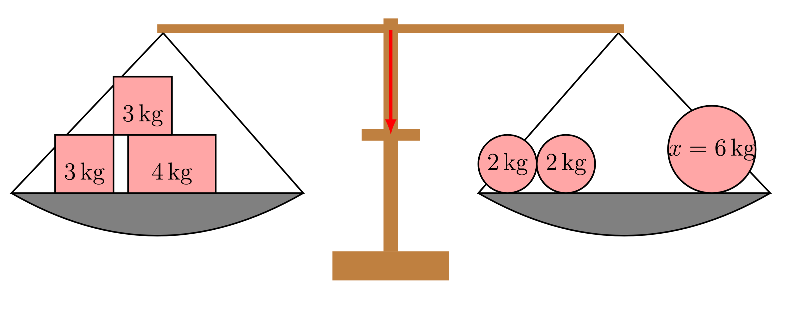

</center>

{{|>}} In der Abbildung wird deutlich, dass die Masse $x$ nur einen bestimmten *Wert* für ein Gleichgewicht haben kann, nämlich $6\,$kg.


$$
\begin{align*}
  8	 &= 8  \qquad \left|   - 2   \right. \\
 6 &= 6  \qquad \left|   \cdot \, 3   \right. \\
 18 &= 18  \qquad \left|   : 2   \right. \\
 9 &= 9   \\
  \end{align*}
$$
 

{{|>}} Die *Gleichung* zeigt, wie im ersten Schritt auf beiden Seiten des *Äquivalenzzeichen* die Zwei *subtrahiert* wurde. Im zweiten Schritt werden beide Seiten mit drei *multipliziert* und im dritten Schritt durch Zwei *dividiert*. In diesen beiden Beispielen sind die vier Grundrechenarten gezeigt, was nicht bedeutet, dass andere *Rechenoperationen* ausgeschlossen sind.\


{{|>}} *Äquivalenzumformungen* dienen dazu um *Gleichung* umzustellen und so *Werte* von unbekannten *Parametern* beziehungsweise *Variablen* zu bestimmen. *Parameter* sind Platzhalter für *Zahlen* und werden in der Regel mit Buchstaben am Anfang des Alphabets beschrieben. Wenn keine genaue Beschreibung für die *Parameter* angegeben sind, gilt $a,b,... \in \mathbb{R}$. 


{{|>}} Dies kann gut durch Streichholzschachteln symbolisiert werden. Dabei befinden sich in jeder Streichholzschachtel mit der Aufschrift $x$ stets die gleiche aber unbekannte Anzahl von Streichhölzern. 

<center>

<!-- style="width:350px" -->
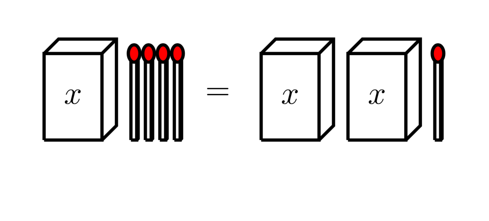

</center>

{{|>}} Um herauszufinden, wie viele Streichhölzer sich jeweils in den Schachtel befinden ohne die Schachtel dabei zu öffnen, muss auf beiden Seiten des *Äquivalenzzeichen* exakt die gleiche Aktion durchgeführt werden. Im ersten Schritt wird auf beiden Seiten ein Streichholz weggenommen.

<center>

<!-- style="width:350px" -->
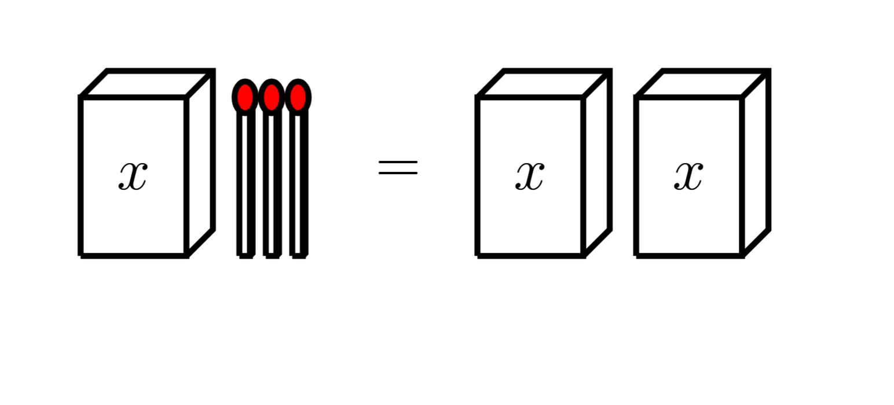

</center>

{{|>}} Im zweiten Schritt wird bei beiden Seiten des *Äquivalenzzeichen* eine Schachtel entfernt.

<center>

<!-- style="width:350px" -->
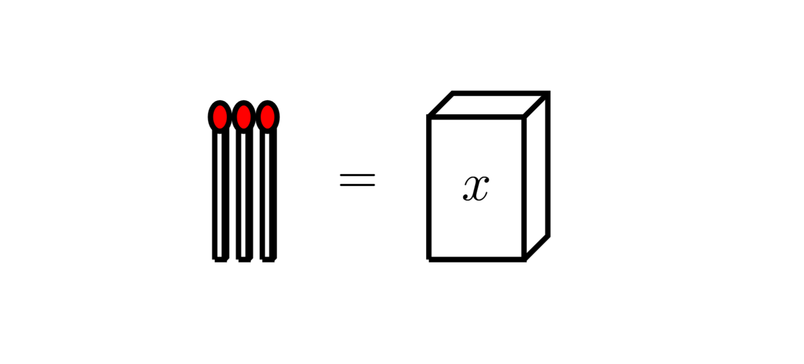

</center>

Aus der letzten *Gleichung* wird deutlich, dass sich in jeder Schachtel mit der Aufschrift $x$ genau drei Streichhölzer sind.


Im folgenden Beispiel soll nach $x$ aufgelöst werden.

$$
\begin{align*}
0 & = \frac{a}{d} \cdot x + b - c  \qquad \left| + c \right. \\
c & = \frac{a}{d} \cdot x    \qquad \left| -b \right. \\
c - b & = \frac{a}{d} \cdot x    \qquad \left| \cdot d \right. \\
d \cdot \left(c - b\right) & = a \cdot x    \qquad \left| : a \right. \\
\frac{d \cdot \left(c - b\right)}{a} & =  x     \\
  \end{align*}
$$

{{|>}} Jede *Rechenoperation*, die die Richtigkeit der *Gleichung* nicht verändert ist zulässig! Die *Addition* der $0$ und die *Multiplikation* der $1$ sind solche *Operationen*. Dabei ist $0$ das so genannte *neutrale Element* der *Addition* und $1$ das *neutrale Element* der *Multiplikation*.


$$
\begin{align*}
\frac{1}{2}  = \frac{1}{2} \cdot 1 = \frac{1}{2} \cdot \frac{4}{4} = \frac{4}{8} \qquad  &\text{Multiplikation der $1$} \\
4 = 4 + 0 = 4+6-6 = 10 - 6 \qquad  & \text{Addition der $0$} \\
  \end{align*}
$$

{{|>}} Die Beispiele aus *Gleichung* zeigen, dass die *Multiplikation* des *neutralen Elements* mit dem *Erweitern* von *Brüchen* unmittelbar in Verbindung steht.  


{{|>}} Um *Lösungen* der *Äquivalenzumformung* zu überprüfen, kann bei der *Probe* die berechnete *Lösung* in die Ausgangsgleichung eingesetzt werden. Wenn die *Gleichung* rechnerisch gezeigt werden kann, ist der ermittelte *Variablenwert* beziehungsweise *Parameterwert* eine richtige *Lösung*.

Beispiel:
 


$$
\begin{align*}
3x-2&=5x+4 \quad \left| +2  \right. \\
3x&=5x+6 \quad \left| -5x  \right. \\
-2x&=6 \quad \left| :(-2)  \right. \\
x&=-3 \\
\Rightarrow \; 3\cdot(-3)-2&=5\cdot(-3)+4\\
-9-2&=-15+4\\
-11&=-11\\
  \end{align*}
$$


{{|>}}  Bei *Rechenoperationen*, die die *Definitionsmenge* der *Gleichung* verändert, kann nicht mehr von direkter *Äquivalenzumformung* gesprochen werden. Aus diesem Grund kann keine *Äquivalenzumformung* angekündigt werden und es sollte die *Definitionsmengenveränderung* durch einen "Daraus folgt"-Pfeil $\Rightarrow$ angedeutet werden. Dazu ein Beispiel:

$$
\begin{align*}
(2x)^2 & = 4a-5 \\
\Rightarrow\;\; 2x_{1,2} & = \pm \sqrt{4a-5} \quad \left| :2  \right.  \\
x_{1,2} & = \pm \dfrac{\sqrt{4a-5}}{2}  
  \end{align*}
$$

{{|>}} In dem gezeigten Beispiel wäre ein *Ankündigungsstrich* mit einer angedeuteten *Wurzel* nicht korrekt, da die *Definitionsmenge* halbiert wird. Aus diesem Grund wurde dies auch nicht im ersten Schritt niedergeschrieben.


Im folgenden Video wird das Beschriebene nochmal anhand von Beispielen erklärt:  \

!?[Äquivalenzumformung](https://www.youtube.com/watch?v=55z4hWAx8Q0)


#### Übungen - Äquivalenzumformung


   \
__Aufgabe 1:__ In jeder Schachtel mit der Aufschrift $x$ befinden sich gleich viele Streichhölzer. Auf jeder Seite des Gleichheitszeichen befindet sich die selbe Anzahl an Streichhölzern. **Bestimme** bei allen Streichholzschachtelgleichungen wie viele Streichhölzer sich in einer Schachtel befinden.

<!-- style="width:600px" data-solution-button="5" -->
__$a)\;\;$__   
$x=$ [[  3  ]] Streichhölzer

<!-- style="width:600px" data-solution-button="5" -->
__$b)\;\;$__   
$x=$ [[  1  ]] Streichhölzer

<!-- style="width:600px" data-solution-button="5" -->
__$c)\;\;$__ 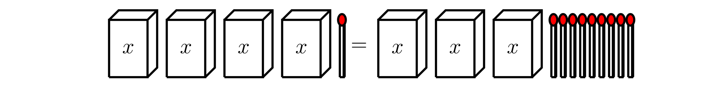  
$x=$ [[  8  ]] Streichhölzer

<!-- style="width:600px" data-solution-button="5" -->
__$d)\;\;$__   
$x=$ [[  3  ]] Streichhölzer


   \
__Aufgabe 2:__ In jeder Schachtel mit der Aufschrift $x$ befinden sich gleich viele Streichhölzer. Auf jeder Seite des Gleichheitszeichen befindet sich die selbe Anzahl an Streichhölzern. **Bestimme** bei allen Streichholzschachtelgleichungen wie viele Streichhölzer sich in einer Schachtel befinden.

<!-- style="width:600px" data-solution-button="5" -->
__$a)\;\;$__   
$x=$ [[  2  ]] Streichhölzer

<!-- style="width:600px" data-solution-button="5" -->
__$b)\;\;$__ 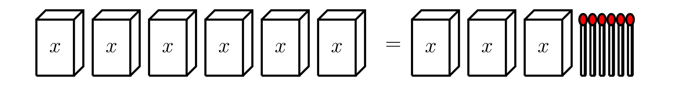  
$x=$ [[  2  ]] Streichhölzer

<!-- style="width:600px" data-solution-button="5" -->
__$c)\;\;$__   
$x=$ [[  1  ]] Streichhölzer

<!-- style="width:600px" data-solution-button="5" -->
__$d)\;\;$__   
$x=$ [[  5  ]] Streichhölzer


   \
__Aufgabe 3:__ In jeder Schachtel mit der Aufschrift $x$ befinden sich gleich viele Streichhölzer. Auf jeder Seite des Gleichheitszeichen befindet sich die selbe Anzahl an Streichhölzern. **Bestimme** bei allen Streichholzschachtelgleichungen wie viele Streichhölzer sich in einer Schachtel befinden.

<!-- style="width:600px" data-solution-button="5" -->
__$a)\;\;$__   
$x=$ [[  4  ]] Streichhölzer

<!-- style="width:600px" data-solution-button="5" -->
__$b)\;\;$__   
$x=$ [[  1  ]] Streichhölzer

<!-- style="width:600px" data-solution-button="5" -->
__$c)\;\;$__   
$x=$ [[  4  ]] Streichhölzer

<!-- style="width:600px" data-solution-button="5" -->
__$d)\;\;$__   
$x=$ [[  2  ]] Streichhölzer


   \
__Aufgabe 4:__ In jeder Schachtel mit der Aufschrift $x$ befinden sich gleich viele Streichhölzer. Auf jeder Seite des Gleichheitszeichen befindet sich die selbe Anzahl an Streichhölzern. **Bestimme** bei allen Streichholzschachtelgleichungen wie viele Streichhölzer sich in einer Schachtel befinden.

<!-- style="width:600px" data-solution-button="5" -->
__$a)\;\;$__   
$x=$ [[  5  ]] Streichhölzer

<!-- style="width:600px" data-solution-button="5" -->
__$b)\;\;$__   
$x=$ [[  2  ]] Streichhölzer

<!-- style="width:600px" data-solution-button="5" -->
__$c)\;\;$__   
$x=$ [[  1  ]] Streichhölzer

<!-- style="width:600px" data-solution-button="5" -->
__$d)\;\;$__   
$x=$ [[  3  ]] Streichhölzer


   \
__Aufgabe 5:__ **Bestimme** die Massenwert des Massestückchens $x$.


<!-- style="width:600px" data-solution-button="5" -->
__$a)\;\;$__   
$x=$ [[  5    ]] kg

<!-- style="width:600px" data-solution-button="5" -->
__$b)\;\;$__   
$x=$ [[  2    ]] kg

<!-- style="width:600px" data-solution-button="5" -->
__$c)\;\;$__   
$x=$ [[  0,75  ]] kg


   \
__Aufgabe 6:__ **Bestimme** die Massenwert des Massestückchens $x$.


<!-- style="width:600px" data-solution-button="5" -->
__$a)\;\;$__   
$x=$ [[  3    ]] kg

<!-- style="width:600px" data-solution-button="5" -->
__$b)\;\;$__   
$x=$ [[  2    ]] kg

<!-- style="width:600px" data-solution-button="5" -->
__$c)\;\;$__   
$x=$ [[  1,83  ]] kg


   \
__Aufgabe 7:__ **Bestimme** die Massenwert des Massestückchens $x$.


<!-- style="width:600px" data-solution-button="5" -->
__$a)\;\;$__   
$x=$ [[  4    ]] kg

<!-- style="width:600px" data-solution-button="5" -->
__$b)\;\;$__   
$x=$ [[  5    ]] kg

<!-- style="width:600px" data-solution-button="5" -->
__$c)\;\;$__   
$x=$ [[  1,56  ]] kg


   \
__Aufgabe 8:__ Im Folgenden ist eine Äquivalenzumformung dargestellt und das Vorgehen ist in einem Lückentext beschrieben. **Fülle** die Lücken **aus**.

$$
\begin{align*}
  11+6 \cdot x & = 3 + 8 \cdot x  \quad \left|  -3  \right. \\
  8 + 6 \cdot x & = 8 \cdot x  \quad \left|  -6x  \right. \\
  8  & = 2 \cdot x  \quad \left|  : 2  \right. \\
  4  & = x   \\
\end{align*}
$$

$$
\begin{align*}
  11+6 \cdot 4 & = 3 + 8 \cdot 4   \\
  11 + 24 & = 3 + 32  \\
  35  & = 35   \\
\end{align*}
$$

<!-- data-solution-button="5" -->
Um die Gleichung zu sortieren, wird zu nächst auf beiden Seiten des Gleichungszeichen [[  -3  ]] gerechnet. Anschließend wird $-6x$ auf [[     beiden Seiten des Gleichheitszeichen     ]] gerechnet, sodass alles, was mit der Variable $x$ multipliziert ist, auf einer Seite des Gleichheitszeichen ist und alles andere auf der anderen Seite. Abschließend wird durch den Vorfaktor [[  2  ]] [[  dividiert  ]]. Nachdem die [[  Lösung  ]] der Gleichung gefunden wurde, wird die [[  Probe  ]] durchgeführt, indem die Lösung für $x$ in die [[  Gleichung  ]] vom Anfang eingesetzt wird. Ist auf beiden Seiten des Gleichheitszeichen der gleiche Wert, dann ist die Lösung korrekt.


   \
__Aufgabe 9:__ Im Folgenden ist eine Äquivalenzumformung dargestellt und das Vorgehen ist in einem Lückentext beschrieben. **Fülle** die Lücken **aus**.


$$
\begin{align*}
  \dfrac{3}{x-2} & = \dfrac{4}{3x+7}    \quad \left|  \cdot (x-2)  \right. \\
  3 & = \dfrac{4}{3x+7} (x-2)    \quad \left|  \cdot (3x+7) \right. \\
  3(3x+7) & = 4 (x-2)      \\
  9x+21 & = 4x-8     \quad \left| -4x \right.     \\
  5x+21 & = -8     \quad \left| -21 \right.     \\
  5x  & = -29     \quad \left| :5 \right.     \\
  x  & = -\dfrac{29}{5}       \\
\end{align*}
$$


<!-- data-solution-button="5" -->
Bei dieser Gleichung steht die gesuchte Unbekannte auf beiden Seiten des Gleichheitszeichen im [[  Nenner  ]]. Um dies aufzuheben wird mit $(x-2)$ und dann mit $(3x+7)$ auf beiden Seiten des Gleichheitszeichen [[  multipliziert  ]]. Die [[  Klammern  ]] sind dabei wichtig, aufgrund der Regel: Punkt- vor [[  Strichrechnung  ]]. Anschließend wird das [[  Distributivgesetz  ]] benutzt, um die Klammern aufzulösen. Nun wird die Gleichung mit der Strichrechnung sortiert, indem erst $-4x$ und dann [[  -21  ]] auf beiden Seiten des Gleichheitszeichen gerechnet wird. Abschließend wird durch den [[  Vorfaktor  ]] $5$ dividiert.


   \
__Aufgabe 10:__ Im Folgenden ist eine Äquivalenzumformung dargestellt und das Vorgehen ist in einem Lückentext beschrieben. **Fülle** die Lücken **aus**.


$$
\begin{align*}
  \dfrac{3}{5}x - 4 & = \dfrac{2}{7} + x    \quad \left|  + 4  \right. \\
  \dfrac{3}{5}x   & = \dfrac{30}{7} + x    \quad \left|  -x  \right. \\
  -\dfrac{2}{5}x   & = \dfrac{30}{7}    \quad \left|  \cdot 5  \right. \\
  -2x   & = \dfrac{150}{7}    \quad \left|  : 2  \right. \\
  -x   & = \dfrac{75}{7}    \quad \left|  \cdot (-1)  \right. \\
  x   & = -\dfrac{75}{7}     \\
\end{align*}
$$

<!-- data-solution-button="5" -->
Als erstes wird die Gleichung sortiert, indem auf [[  beiden Seiten  ]] des Gleichheitszeichen $+4$ gerechnet wird. Anschließend wird [[  -x  ]] auf beiden Seiten des [[  Gleichheitszeichen  ]] gerechnet, sodass in den nächsten Schritten nur noch die Punktrechnung zum Einsatz kommen kann. Der Vorfaktor stückweise entfernt. Zu nächst wird [[ mit   ]] $5$ [[  multipliziert  ]], dann nächst wird [[ durch ]] $2$ [[  dividiert      ]]. Das Vorzeichen wird abschließend noch mit der [[  Multiplikation  ]] mit $(-1)$ von der Unbekannten gelöst.


   \
__Aufgabe 11:__ **Berechne** den Lösungswert für die Unbekannte.


<section class="flex-container">
<div class="flex-child">

<!-- data-solution-button="5"-->
__$a)\;\;$__ $  x - 4 = 9 $ \
$x$ = [[  13  ]]
************
$$
\begin{align*}
x - 4 & = 9 \quad \left| +4  \right. \\
x   & = 13  \\
\end{align*}
$$
************

</div>
<div class="flex-child">

<!-- data-solution-button="5"-->
__$b)\;\;$__ $  4 \cdot x = 36$ \
$x$ =  [[  9   ]]
************
$$
\begin{align*}
4 \cdot x & = 36 \quad \left| : 4  \right. \\
x   & = 9  \\
\end{align*}
$$
************


</div>
<div class="flex-child">

<!-- data-solution-button="5"-->
__$c)\;\;$__ $  7 = \dfrac{x}{6}  $ \
$x$ =  [[  42  ]]
************
$$
\begin{align*}
7 & = \dfrac{x}{6} \quad \left| \cdot 6  \right. \\
42   & = x  \\
\end{align*}
$$
************


</div>
<div class="flex-child">

<!-- data-solution-button="5"-->
__$d)\;\;$__ $ 3 = x - 5 $ \
$x$ =  [[  8   ]]
************
$$
\begin{align*}
3 & = x - 5 \quad \left| +5  \right. \\
8   & = x  \\
\end{align*}
$$
************


</div>
<div class="flex-child">

<!-- data-solution-button="5"-->
__$e)\;\;$__ $  x + 8  = 13 $ \
$x$ =  [[  5   ]]
************
$$
\begin{align*}
x+8 & = 13 \quad \left| -8  \right. \\
x   & = 5  \\
\end{align*}
$$
************


</div>
<div class="flex-child">

<!-- data-solution-button="5"-->
__$f)\;\;$__ $  64 = 4 \cdot x  $ \
$x$ =  [[  16  ]]
************
$$
\begin{align*}
64 & = 4x \quad \left| :4  \right. \\
16 & = x  \\
\end{align*}
$$
************


</div>
</section>


   \
__Aufgabe 12:__ **Berechne** den Lösungswert für die Unbekannte.


<section class="flex-container">
<div class="flex-child">

<!-- data-solution-button="5"-->
__$a)\;\;$__ $  72 = 8 \cdot x $ \
$x$ = [[  9   ]]
************
$$
\begin{align*}
72 & = 8 \cdot x  \quad \left| : 8  \right. \\
9   & = x  \\
\end{align*}
$$
************

</div>
<div class="flex-child">

<!-- data-solution-button="5"-->
__$b)\;\;$__ $  \dfrac{x}{7} = 5 $ \
$x$ =  [[  35  ]]
************
$$
\begin{align*}
\dfrac{x}{7} & = 5 \quad \left| \cdot 7  \right. \\
x   & = 35  \\
\end{align*}
$$
************


</div>
<div class="flex-child">

<!-- data-solution-button="5"-->
__$c)\;\;$__ $  x + 7 = 19  $ \
$x$ =  [[  12  ]]
************
$$
\begin{align*}
x + 7 & = 19 \quad \left|  -7  \right. \\
x   & = 12  \\
\end{align*}
$$
************


</div>
<div class="flex-child">

<!-- data-solution-button="5"-->
__$d)\;\;$__ $ 17 = x - 8 $ \
$x$ =  [[  25  ]]
************
$$
\begin{align*}
17 & = x - 8 \quad \left| +8  \right. \\
25   & = x  \\
\end{align*}
$$
************


</div>
<div class="flex-child">

<!-- data-solution-button="5"-->
__$e)\;\;$__ $  7x = 84 $ \
$x$ =  [[  12  ]]
************
$$
\begin{align*}
7x & = 84 \quad \left| :7  \right. \\
x   & = 12  \\
\end{align*}
$$
************


</div>
<div class="flex-child">

<!-- data-solution-button="5"-->
__$f)\;\;$__ $  3 = \dfrac{x}{17}  $ \
$x$ =  [[  51  ]]
************
$$
\begin{align*}
3 & = \dfrac{x}{17} \quad \left| \cdot 17  \right. \\
51 & = x  \\
\end{align*}
$$
************


</div>
</section>


   \
__Aufgabe 13:__ **Berechne** den Lösungswert für die Unbekannte.


<section class="flex-container">
<div class="flex-child">

<!-- data-solution-button="5"-->
__$a)\;\;$__ $  3x-7 = 8 - 2x $ \
$x$ = [[  3   ]]
************
$$
\begin{align*}
3x-7 & = 8 - 2x  \quad \left| +7  \right. \\
3x    & = 15 -2x  \quad \left| +2x  \right.  \\
5x    & = 15  \quad \left| :5  \right.  \\
x    & = 3   \\
\end{align*}
$$
************

</div>
<div class="flex-child">

<!-- data-solution-button="5"-->
__$b)\;\;$__  $ 3x - 2 = 2x + 1 $ \
$x$ = [[  3  ]]
************
$$
\begin{align*}
3x - 2 &= 2x + 1 \quad \left| -2x \right. \\
x - 2 &= 1 \quad \left| +2 \right. \\
x &= 3
\end{align*}
$$
************


</div>
<div class="flex-child">

<!-- data-solution-button="5"-->
__$c)\;\;$__    $ 5x + 3 = 2x + 18 $ \
$x$ = [[  5  ]]
************
$$
\begin{align*}
5x + 3 &= 2x + 18 \quad \left| -2x \right. \\
3x + 3 &= 18 \quad \left| -3 \right. \\
3x &= 15 \quad \left| :3 \right. \\
x &= 5
\end{align*}
$$
************


</div>
<div class="flex-child">

<!-- data-solution-button="5"-->
__$d)\;\;$__  $ 4x - 4 = 2x + 10 $ \
$x$ = [[  7  ]]
************
$$
\begin{align*}
4x - 4 &= 2x + 10 \quad \left| -2x \right. \\
2x - 4 &= 10 \quad \left| +4 \right. \\
2x &= 14 \quad \left| :2 \right. \\
x &= 7
\end{align*}
$$
************


</div>
</section>


   \
__Aufgabe 14:__ **Berechne** den Lösungswert für die Unbekannte.


<section class="flex-container">
<div class="flex-child">

<!-- data-solution-button="5"-->
__$a)\;\;$__  $ 4x + 5 = 3x + 14 $ \
$x$ = [[  9  ]]
************
$$
\begin{align*}
4x + 5 &= 3x + 14 \quad \left| -3x \right. \\
x + 5 &= 14 \quad \left| -5 \right. \\
x &= 9
\end{align*}
$$
************


</div>
<div class="flex-child">

<!-- data-solution-button="5"-->
__$b)\;\;$__  $ 7x - 4 = 3x + 16 $ \
$x$ = [[  5  ]]
************
$$
\begin{align*}
7x - 4 &= 3x + 16 \quad \left| -3x \right. \\
4x - 4 &= 16 \quad \left| +4 \right. \\
4x &= 20 \quad \left| :4 \right. \\
x &= 5
\end{align*}
$$
************


</div>
<div class="flex-child">

<!-- data-solution-button="5"-->
__$c)\;\;$__   $ 6x - 8 = 2x + 20 $ \
$x$ = [[  7  ]]
************
$$
\begin{align*}
6x - 8 &= 2x + 20 \quad \left| -2x \right. \\
4x - 8 &= 20 \quad \left| +8 \right. \\
4x &= 28 \quad \left| :4 \right. \\
x &= 7
\end{align*}
$$
************


</div>
<div class="flex-child">

<!-- data-solution-button="5"-->
__$d)\;\;$__  $ 10x - 12 = 4x + 24 $ \
$x$ = [[  6  ]]
************
$$
\begin{align*}
10x - 12 &= 4x + 24 \quad \left| -4x \right. \\
6x - 12 &= 24 \quad \left| +12 \right. \\
6x &= 36 \quad \left| :6 \right. \\
x &= 6
\end{align*}
$$
************


</div>
</section>


   \
__Aufgabe 15:__ **Berechne** den Lösungswert für die Unbekannte.


<section class="flex-container">
<div class="flex-child">

<!-- data-solution-button="5"-->
__$a)\;\;$__ $ 2x - 8 = 3x - 10 $ \
$x$ = [[  2  ]]
************
$$
\begin{align*}
2x - 8 &= 3x - 10 \quad \left| -2x \right. \\
-8 &= x - 10 \quad \left| +10 \right. \\
2 &= x
\end{align*}
$$
************


</div>
<div class="flex-child">

<!-- data-solution-button="5"-->
__$b)\;\;$__  $ 5x - 12 = 3x + 6 \;$ \
$x$ = [[  9  ]]
************
$$
\begin{align*}
5x - 12 &= 3x + 6 \quad \left| -3x \right. \\
2x - 12 &= 6 \quad \left| +12 \right. \\
2x &= 18 \quad \left| :2 \right. \\
x &= 9
\end{align*}
$$
************


</div>
<div class="flex-child">

<!-- data-solution-button="5"-->
__$c)\;\;$__   $ 3x + 12 = 5x - 2 $ \
$x$ = [[  7  ]]
************
$$
\begin{align*}
3x + 12 &= 5x - 2 \quad \left| -3x \right. \\
12 &= 2x - 2 \quad \left| +2 \right. \\
14 &= 2x \quad \left| :2 \right. \\
x &= 7
\end{align*}
$$
************


</div>
<div class="flex-child">

<!-- data-solution-button="5"-->
__$d)\;\;$__  $ 8x - 5 = 3x + 20 $ \
$x$ = [[  5  ]]
************
$$
\begin{align*}
8x - 5 &= 3x + 20 \quad \left| -3x \right. \\
5x - 5 &= 20 \quad \left| +5 \right. \\
5x &= 25 \quad \left| :5 \right. \\
x &= 5
\end{align*}
$$
************


</div>
</section>


   \
__Aufgabe 16:__ **Berechne** den Lösungswert für die Unbekannte.


<section class="flex-container">
<div class="flex-child">

<!-- data-solution-button="5"-->
__$a)\;\;$__ $ 2x + 10 = 4x - 6 $ \
$x$ = [[  8  ]]
************
$$
\begin{align*}
2x + 10 &= 4x - 6 \quad \left| -2x \right. \\
10 &= 2x - 6 \quad \left| +6 \right. \\
16 &= 2x \quad \left| :2 \right. \\
x &= 8
\end{align*}
$$
************


</div>
<div class="flex-child">

<!-- data-solution-button="5"-->
__$b)\;\;$__  $ \;9x - 15 = 6x + 12 \;$ \
$x$ = [[  9  ]]
************
$$
\begin{align*}
9x - 15 &= 6x + 12 \quad \left| -6x \right. \\
3x - 15 &= 12 \quad \left| +15 \right. \\
3x &= 27 \quad \left| :3 \right. \\
x &= 9
\end{align*}
$$
************


</div>
<div class="flex-child">

<!-- data-solution-button="5"-->
__$c)\;\;$__   $ 2x + 14 = 3x + 5 $ \
$x$ = [[  9  ]]
************
$$
\begin{align*}
2x + 14 &= 3x + 5 \quad \left| -2x \right. \\
14 &= x + 5 \quad \left| -5 \right. \\
9 &= x
\end{align*}
$$
************


</div>
<div class="flex-child">

<!-- data-solution-button="5"-->
__$d)\;\;$__  $ 7x - 9 = 2x + 16 \;$ \
$x$ = [[  5  ]]
************
$$
\begin{align*}
7x - 9 &= 2x + 16 \quad \left| -2x \right. \\
5x - 9 &= 16 \quad \left| +9 \right. \\
5x &= 25 \quad \left| :5 \right. \\
x &= 5
\end{align*}
$$
************


</div>
</section>


   \
__Aufgabe 17:__ **Berechne** den Lösungswert für die Unbekannte.


<section class="flex-container">
<div class="flex-child">
<!-- data-solution-button="5"-->
__$a)\;\;$__ $  2x + 4 + 9 = 6x - 3 - 7 $ \
$x$ = [[  4  ]]
************
$$
\begin{align*}
2x + 4 + 9 &= 6x - 3 - 7 \\
2x + 13 &= 6x - 10 \quad \left| +10 \right. \\
2x + 23 &= 6x  \quad \left| -2x \right. \\
23 &= 4x \quad \left| :4 \right. \\
x &= 4
\end{align*}
$$
************
</div>
<div class="flex-child">
<!-- data-solution-button="5"-->
__$b)\;\;$__ $  3x + 5 + x = 2x + 17 - x $ \
$x$ = [[  3  ]]
************
$$
\begin{align*}
3x + 5 + x &= 2x + 17 - x \\
4x + 5 &= x + 17 \quad \left| -x \right. \\
3x + 5 &= 17 \quad \left| -5 \right. \\
3x &= 12 \quad \left| :3 \right. \\
x &= 3
\end{align*}
$$
************
</div>
<div class="flex-child">
<!-- data-solution-button="5"-->
__$c)\;\;$__ $  5x - 7 + 2x = 3x + 13 $ \
$x$ = [[  5  ]]
************
$$
\begin{align*}
5x - 7 + 2x &= 3x + 13 \\
7x - 7 &= 3x + 13 \quad \left| -3x \right. \\
4x - 7 &= 13 \quad \left| +7 \right. \\
4x &= 20 \quad \left| :4 \right. \\
x &= 5
\end{align*}
$$
************
</div>
<div class="flex-child">
<!-- data-solution-button="5"-->
__$d)\;\;$__ $  2x + 4 + 9x = 6x - 3 - 7 $ \
$x$ = [[  2  ]]
************
$$
\begin{align*}
2x + 4 + 9x &= 6x - 3 - 7 \\
11x + 4 &= 6x - 10 \quad \left| -6x \right. \\
5x + 4 &= -10 \quad \left| -4 \right. \\
5x &= -14 \quad \left| :(-5) \right. \\
x &= 2
\end{align*}
$$
************
</div>
</section>


   \
__Aufgabe 18:__ **Berechne** den Lösungswert für die Unbekannte.


<section class="flex-container">
<div class="flex-child">
<!-- data-solution-button="5"-->
__$a)\;\;$__ $  4x + 6 - 2x + 3 = x + 17 $ \
$x$ = [[  4  ]]
************
$$
\begin{align*} 
4x + 6 - 2x + 3 &= x + 17  \\
2x + 9 &= x + 17 \quad \left| -x \right. \\
x + 9 &= 17 \quad \left| -9 \right. \\
x &= 8
\end{align*}
$$
************
</div>
<div class="flex-child">
<!-- data-solution-button="5"-->
__$b)\;\;$__ $  6x - 5 + 2x = 3x + 25 $ \
$x$ = [[  6  ]]
************
$$
\begin{align*}
 6x - 5 + 2x &= 3x + 25 \\
8x - 5 &= 3x + 25 \quad \left| -3x \right. \\
5x - 5 &= 25 \quad \left| +5 \right. \\
5x &= 30 \quad \left| :5 \right. \\
x &= 6
\end{align*}
$$
************
</div>
<div class="flex-child">
<!-- data-solution-button="5"-->
__$c)\;\;$__ $  7x + 3 - 2x = 4x + 8 $ \
$x$ = [[  1  ]]
************
$$
\begin{align*}
7x + 3 - 2x &= 4x + 8 \\
5x + 3 &= 4x + 8 \quad \left| -4x \right. \\
x + 3 &= 8 \quad \left| -3 \right. \\
x &= 5
\end{align*}
$$
************
</div>
<div class="flex-child">
<!-- data-solution-button="5"-->
__$d)\;\;$__ $  9x - 4 + x = 5x + 26 $ \
$x$ = [[  6  ]]
************
$$
\begin{align*}
9x - 4 + x &= 5x + 26 \\
10x - 4 &= 5x + 26 \quad \left| -5x \right. \\
5x - 4 &= 26 \quad \left| +4 \right. \\
5x &= 30 \quad \left| :5 \right. \\
x &= 6
\end{align*}
$$
************
</div>
</section>


   \
__Aufgabe 19:__ **Berechne** den Lösungswert für die Unbekannte.


<section class="flex-container">
<div class="flex-child">
<!-- data-solution-button="5"-->
__$a)\;\;$__ $  4(2x-3) = 2x + 10 $ \
$x$ = [[  2  ]]
************
$$
\begin{align*}
4(2x-3) &= 2x + 10 \\
8x - 12 &= 2x + 10 \quad \left| -2x \right. \\
6x - 12 &= 10 \quad \left| +12 \right. \\
6x &= 22 \quad \left| :6 \right. \\
x &= 2
\end{align*}
$$
************
</div>
<div class="flex-child">
<!-- data-solution-button="5"-->
__$b)\;\;$__ $  3(2x+4) = x + 19 $ \
$x$ = [[  5  ]]
************
$$
\begin{align*}
3(2x+4) &= x + 19 \\
6x + 12 &= x + 19 \quad \left| -x \right. \\
5x + 12 &= 19 \quad \left| -12 \right. \\
5x &= 7 \quad \left| :5 \right. \\
x &= 5
\end{align*}
$$
************
</div>
<div class="flex-child">
<!-- data-solution-button="5"-->
__$c)\;\;$__ $  2(3x-1) + 5 = 4x + 7 $ \
$x$ = [[  2  ]]
************
$$
\begin{align*}
2(3x-1) + 5 &= 4x + 7 \\
6x - 2 + 5 &= 4x + 7 \\
6x + 3 &= 4x + 7 \quad \left| -4x \right. \\
2x + 3 &= 7 \quad \left| -3 \right. \\
2x &= 4 \quad \left| :2 \right. \\
x &= 2
\end{align*}
$$
************
</div>
<div class="flex-child">
<!-- data-solution-button="5"-->
__$d)\;\;$__ $  5(x+2) - 3 = 2x + 12 $ \
$x$ = [[  3  ]]
************
$$
\begin{align*}
5(x+2) - 3 &= 2x + 12 \\
5x + 10 - 3 &= 2x + 12 \\
5x + 7 &= 2x + 12 \quad \left| -2x \right. \\
3x + 7 &= 12 \quad \left| -7 \right. \\
3x &= 5 \quad \left| :3 \right. \\
x &= 3
\end{align*}
$$
************
</div>
</section>


   \
__Aufgabe 20:__ **Berechne** den Lösungswert für die Unbekannte.


<section class="flex-container">
<div class="flex-child">
<!-- data-solution-button="5"-->
__$a)\;\;$__ $  2(4x-5) = 3x + 13 $ \
$x$ = [[  3  ]]
************
$$
\begin{align*}
2(4x-5) &= 3x + 13 \\
8x - 10 &= 3x + 13 \quad \left| -3x \right. \\
5x - 10 &= 13 \quad \left| +10 \right. \\
5x &= 23 \quad \left| :5 \right. \\
x &= 3
\end{align*}
$$
************
</div>
<div class="flex-child">
<!-- data-solution-button="5"-->
__$b)\;\;$__ $  3(2x+1) = 4x + 11 $ \
$x$ = [[  2  ]]
************
$$
\begin{align*}
3(2x+1) &= 4x + 11 \\
6x + 3 &= 4x + 11 \quad \left| -4x \right. \\
2x + 3 &= 11 \quad \left| -3 \right. \\
2x &= 8 \quad \left| :2 \right. \\
x &= 4
\end{align*}
$$
************

</div>
<div class="flex-child">
<!-- data-solution-button="5"-->
__$c)\;\;$__ $  2(5x-4) = 3x + 14 $ \
$x$ = [[  2  ]]
************
$$
\begin{align*}
2(5x-4) &= 3x + 14 \\
10x - 8 &= 3x + 14 \quad \left| -3x \right. \\
7x - 8 &= 14 \quad \left| +8 \right. \\
7x &= 22 \quad \left| :7 \right. \\
x &= 2
\end{align*}
$$
************
</div>
<div class="flex-child">
<!-- data-solution-button="5"-->
__$d)\;\;$__ $  7(x-2) + 1 = 3x + 8 $ \
$x$ = [[  3  ]]
************
$$
\begin{align*}
 7(x-2) + 1 &= 3x + 8 \\
7x - 14 + 1 &= 3x + 8 \\
7x - 13 &= 3x + 8 \quad \left| -3x \right. \\
4x - 13 &= 8 \quad \left| +13 \right. \\
4x &= 21 \quad \left| :4 \right. \\
x &= 3
\end{align*}
$$
************
</div>
</section>


   \
__Aufgabe 21:__ **Berechne** den Lösungswert für die Unbekannte.


<section class="flex-container">
<div class="flex-child">
<!-- data-solution-button="5"-->
__$a)\;\;$__ $  3x - 7 = \dfrac{1}{2}x + 5 $ \
$x$ = [[  24/5  ]]
@Algebrite.check(24/5)
************
$$
\begin{align*}
3x - 7 &= \dfrac{1}{2}x + 5 \quad \left| -\dfrac{1}{2}x \right. \\
\dfrac{5}{2}x - 7 &= 5 \quad \left| +7 \right. \\
\dfrac{5}{2}x &= 12 \quad \left| :\dfrac{5}{2} \right. \\
x &= \dfrac{24}{5}
\end{align*}
$$
************
</div>
<div class="flex-child">
<!-- data-solution-button="5"-->
__$b)\;\;$__ $  4x + 3 = 2x - \dfrac{5}{2} $ \
$x$ = [[  -11/4  ]]
@Algebrite.check(-11/4)
************
$$
\begin{align*}
4x + 3 &= 2x - \dfrac{5}{2} \quad \left| -2x \right. \\
2x + 3 &= -\dfrac{5}{2} \quad \left| -3 \right. \\
2x &= -\dfrac{5}{2} - \dfrac{6}{2} \\
2x &= -\dfrac{11}{2} \quad \left| :2 \right. \\
x &= -\dfrac{11}{4}
\end{align*}
$$
************
</div>
<div class="flex-child">
<!-- data-solution-button="5"-->
__$c)\;\;$__ $  \dfrac{5}{3}x - 4 = x + 2 $ \
$x$ = [[  18  ]]
@Algebrite.check(18)
************
$$
\begin{align*}
\dfrac{5}{3}x - 4 &= x + 2 \quad \left| -x \right. \\
\dfrac{2}{3}x - 4 &= 2 \quad \left| +4 \right. \\
\dfrac{2}{3}x &= 6 \quad \left| :\dfrac{2}{3} \right. \\
x &= 18
\end{align*}
$$
************
</div>
<div class="flex-child">
<!-- data-solution-button="5"-->
__$d)\;\;$__ $ 5(x-1) = 3x + \dfrac{7}{3}$ \
$x$ = [[  11/3  ]]
@Algebrite.check(11/3)
************
$$
\begin{align*}
5(x-1) &= 3x + \dfrac{7}{3} \\
5x - 5 &= 3x + \dfrac{7}{3} \quad \left| -3x \right. \\
2x - 5 &= \dfrac{7}{3} \quad \left| +5 \right. \\
2x &= \dfrac{7}{3} + \dfrac{15}{3} \\
2x &= \dfrac{22}{3} \quad \left| :2 \right. \\
x &= \dfrac{11}{3}
\end{align*}
$$
************
</div>
<div class="flex-child">
<!-- data-solution-button="5"-->
__$e)\;\;$__ $  2\left(x + \dfrac{3}{2}\right) = \dfrac{1}{2}x + 5 $ \
$x$ = [[  4/3  ]]
@Algebrite.check(4/3)
************
$$
\begin{align*}
 2\left(x + \dfrac{3}{2}\right) &= \dfrac{1}{2}x + 5 \\
2x + 3 &= \dfrac{1}{2}x + 5 \quad \left| -\dfrac{1}{2}x \right. \\
\dfrac{3}{2}x + 3 &= 5 \quad \left| -3 \right. \\
\dfrac{3}{2}x &= 2 \quad \left| :\dfrac{3}{2} \right. \\
x &= \dfrac{4}{3}
\end{align*}
$$
************
</div>
<div class="flex-child">
<!-- data-solution-button="5"-->
__$f)\;\;$__ $  \dfrac{2}{3}(3x+6) = x - 2 $ \
$x$ = [[  -6  ]]
@Algebrite.check(-6)
************
$$
\begin{align*}
\dfrac{2}{3}(3x+6) &= x - 2  \\
2x + 4 &= x - 2 \quad \left| -x \right. \\
x + 4 &= -2 \quad \left| -4 \right. \\
x &= -6
\end{align*}
$$
************
</div>
</section>


   \
__Aufgabe 22:__ **Berechne** den Lösungswert für die Unbekannte.


<section class="flex-container">
<div class="flex-child">
<!-- data-solution-button="5"-->
__$d)\;\;$__ $ \; 7x + \dfrac{1}{2} = 3x - \dfrac{7}{2} \;$ \
$x$ = [[  -1  ]]
@Algebrite.check(-1)
************
$$
\begin{align*}
7x + \dfrac{1}{2} &= 3x - \dfrac{7}{2} \quad \left| -3x \right. \\
4x + \dfrac{1}{2} &= -\dfrac{7}{2} \quad \left| -\dfrac{1}{2} \right. \\
4x &= -\dfrac{8}{2} \\
4x &= -4 \quad \left| :4 \right. \\
x &= -1
\end{align*}
$$
************
</div>
<div class="flex-child">
<!-- data-solution-button="5"-->
__$e)\;\;$__ $ \; 2x - \dfrac{7}{3} = \dfrac{1}{3}x + 5 \;$ \
$x$ = [[  22/5  ]]
@Algebrite.check(22/5)
************
$$
\begin{align*}
2x - \dfrac{7}{3} &= \dfrac{1}{3}x + 5 \quad \left| -\dfrac{1}{3}x \right. \\
\dfrac{5}{3}x - \dfrac{7}{3} &= 5 \quad \left| +\dfrac{7}{3} \right. \\
\dfrac{5}{3}x &= \dfrac{15}{3} + \dfrac{7}{3} \\
\dfrac{5}{3}x &= \dfrac{22}{3} \quad \left| :\dfrac{5}{3} \right. \\
x &= \dfrac{22}{5}
\end{align*}
$$
************
</div>
<div class="flex-child">
<!-- data-solution-button="5"-->
__$f)\;\;$__ $ \; \dfrac{3}{2}x + 4 = \dfrac{5}{4}x - 2 \;$ \
$x$ = [[  -24  ]]
@Algebrite.check(-24)
************
$$
\begin{align*}
\dfrac{3}{2}x + 4 &= \dfrac{5}{4}x - 2 \\
\dfrac{6}{4}x + 4 &= \dfrac{5}{4}x - 2 \quad \left| -\dfrac{5}{4}x \right. \\
\dfrac{1}{4}x + 4 &= -2 \quad \left| -4 \right. \\
\dfrac{1}{4}x &= -6 \quad \left| :\dfrac{1}{4} \right. \\
x &= -24
\end{align*}
$$
************
</div>
<div class="flex-child">
<!-- data-solution-button="5"-->
__$d)\;\;$__ $ 2(x-3) = \dfrac{1}{2}x - 1 $ \
$x$ = [[  10/3  ]]
@Algebrite.check(10/3)
************
$$
\begin{align*}
2(x-3) &= \dfrac{1}{2}x - 1  \\
2x - 3\cdot 2 &= \dfrac{1}{2}x - 1 \\
2x - 6 &= \dfrac{1}{2}x - 1 \quad \left| -\dfrac{1}{2}x \right. \\
\dfrac{3}{2}x - 6 &= -1 \quad \left| +6 \right. \\
\dfrac{3}{2}x &= 5 \quad \left| :\dfrac{3}{2} \right. \\
x &= \dfrac{10}{3}
\end{align*}
$$
************
</div>
<div class="flex-child">
<!-- data-solution-button="5"-->
__$e)\;\;$__ $ 3(x+2) - \dfrac{5}{2} = 2x $ \
$x$ = [[  -7/2  ]]
@Algebrite.check(-7/2)
************
$$
\begin{align*}
 3(x+2) - \dfrac{5}{2} &= 2x  \\
3x + 6 - \dfrac{5}{2} &= 2x \\
3x + \dfrac{12}{2} - \dfrac{5}{2} &= 2x \\
3x + \dfrac{7}{2} &= 2x \quad \left| -2x \right. \\
x + \dfrac{7}{2} &= 0 \quad \left| -\dfrac{7}{2} \right. \\
x &= -\dfrac{7}{2}
\end{align*}
$$
************
</div>
<div class="flex-child">
<!-- data-solution-button="5"-->
__$f)\;\;$__ $  \dfrac{3}{4}(2x-1) = x + \dfrac{1}{2} $ \
$x$ = [[  5/2  ]]
@Algebrite.check(5/2)
************
$$
\begin{align*}
\dfrac{3}{4}(2x-1) &= x + \dfrac{1}{2} \\
\dfrac{3}{2}x - \dfrac{3}{4} &= x + \dfrac{1}{2} \quad \left| -x \right. \\
\dfrac{1}{2}x - \dfrac{3}{4} &= \dfrac{1}{2} \quad \left| +\dfrac{3}{4} \right. \\
\dfrac{1}{2}x &= \dfrac{5}{4} \quad \left| :\dfrac{1}{2} \right. \\
x &= \dfrac{5}{2}
\end{align*}
$$
************
</div>
</section>


   \
__Aufgabe 23:__ **Berechne** den Lösungswert für die Unbekannte.


<section class="flex-container">
<div class="flex-child">
<!-- data-solution-button="5"-->
__$a)\;\;$__ $  2x + 3x - 7 = x + 5 $ \
$x$ = [[  3  ]]
@Algebrite.check(3)
************
$$
\begin{align*}
2x + 3x - 7 &= x + 5 \\
5x - 7 &= x + 5 \quad \left| -x \right. \\
4x - 7 &= 5 \quad \left| +7 \right. \\
4x &= 12 \quad \left| :4 \right. \\
x &= 3
\end{align*}
$$
************
</div>
<div class="flex-child">
<!-- data-solution-button="5"-->
__$b)\;\;$__ $  4(2x-3) = 5x + 1 $ \
$x$ = [[  13/3  ]]
@Algebrite.check(13/3)
************
$$
\begin{align*}
4(2x-3) &= 5x + 1 \\
8x - 12 &= 5x + 1 \quad \left| -5x \right. \\
3x - 12 &= 1 \quad \left| +12 \right. \\
3x &= 13 \quad \left| :3 \right. \\
x &= \dfrac{13}{3}
\end{align*}
$$
************
</div>
<div class="flex-child">
<!-- data-solution-button="5"-->
__$c)\;\;$__ $  \dfrac{3}{2}x - 5 = \dfrac{1}{2}x + 4 $ \
$x$ = [[  9  ]]
@Algebrite.check(9)
************
$$
\begin{align*}
\dfrac{3}{2}x - 5 &= \dfrac{1}{2}x + 4 \quad \left| -\dfrac{1}{2}x \right. \\
x - 5 &= 4 \quad \left| +5 \right. \\
x &= 9
\end{align*}
$$
************
</div>
<div class="flex-child">
<!-- data-solution-button="5"-->
__$d)\;\;$__ $  5x + 2 - x = \dfrac{1}{3}x - 7 $ \
$x$ = [[  -27/11  ]]
@Algebrite.check(-27/11)
************
$$
\begin{align*}
5x + 2 - x &= \dfrac{1}{3}x - 7 \\
4x + 2 &= \dfrac{1}{3}x - 7 \quad \left| -\dfrac{1}{3}x \right. \\
\dfrac{11}{3}x + 2 &= -7 \quad \left| -2 \right. \\
\dfrac{11}{3}x &= -9 \quad \left| :\dfrac{11}{3} \right. \\
x &= -\dfrac{27}{11}
\end{align*}
$$
************
</div>
<div class="flex-child">
<!-- data-solution-button="5"-->
__$e)\;\;$__ $  2(3x+4) - x = 7x - 10 $ \
$x$ = [[  6  ]]
@Algebrite.check(6)
************
$$
\begin{align*}
2(3x+4) - x &= 7x - 10 \\
6x + 8 - x &= 7x - 10 \\
5x + 8 &= 7x - 10 \quad \left| -5x \right. \\
8 &= 2x - 10 \quad \left| +10 \right. \\
18 &= 2x \quad \left| :2 \right. \\
x &= 6
\end{align*}
$$
************
</div>
<div class="flex-child">
<!-- data-solution-button="5"-->
__$f)\;\;$__ $  \dfrac{5}{4}x + 7 = \dfrac{3}{2}x - 1 $ \
$x$ = [[  16  ]]
@Algebrite.check(16)
************
$$
\begin{align*}
\dfrac{5}{4}x + 7 &= \dfrac{3}{2}x - 1 \\
\dfrac{5}{4}x + 7 &= \dfrac{6}{4}x - 1 \quad \left| -\dfrac{5}{4}x \right. \\
7 &= \dfrac{1}{4}x - 1 \quad \left| +1 \right. \\
8 &= \dfrac{1}{4}x \quad \left| :\dfrac{1}{4} \right. \\
x &= 16
\end{align*}
$$
************
</div>
</section>


   \
__Aufgabe 24:__ **Berechne** den Lösungswert für die Unbekannte.


<section class="flex-container">
<div class="flex-child">
<!-- data-solution-button="5"-->
__$a)\;\;$__ $  4x - 3 = \dfrac{1}{2}x + 9 $ \
$x$ = [[  24/7  ]]
@Algebrite.check(24/7)
************
$$
\begin{align*}
4x - 3 &= \dfrac{1}{2}x + 9 \quad \left| -\dfrac{1}{2}x \right. \\
\left(4 - \dfrac{1}{2}\right)x - 3 &= 9 \\
\dfrac{7}{2}x - 3 &= 9 \quad \left| +3 \right. \\
\dfrac{7}{2}x &= 12 \quad \left| :\dfrac{7}{2} \right. \\
x &= \dfrac{24}{7}
\end{align*}
$$
************
</div>
<div class="flex-child">
<!-- data-solution-button="5"-->
__$b)\;\;$__ $  3(2x+1) - 4 = x + 5 $ \
$x$ = [[  6/5  ]]
@Algebrite.check(6/5)
************
$$
\begin{align*}
3(2x+1) - 4 &= x + 5 \\
6x + 3 - 4 &= x + 5 \\
6x - 1 &= x + 5 \quad \left| -x \right. \\
5x - 1 &= 5 \quad \left| +1 \right. \\
5x &= 6 \quad \left| :5 \right. \\
x &= \dfrac{6}{5}
\end{align*}
$$
************
</div>
<div class="flex-child">
<!-- data-solution-button="5"-->
__$c)\;\;$__ $  \dfrac{1}{3}x - 2 = \dfrac{3}{5}x + 1 $ \
$x$ = [[  -45/4  ]]
@Algebrite.check(-45/4)
************
$$
\begin{align*}
\dfrac{1}{3}x - 2 &= \dfrac{3}{5}x + 1 \quad \left| -\dfrac{3}{5}x \right. \\
\left(\dfrac{1}{3} - \dfrac{3}{5}\right)x - 2 &= 1 \\
-\dfrac{4}{15}x - 2 &= 1 \quad \left| +2 \right. \\
-\dfrac{4}{15}x &= 3 \quad \left| \cdot(-1) \right. \\
\dfrac{4}{15}x &= -3 \quad \left| :\dfrac{4}{15} \right. \\
x &= -\dfrac{45}{4}
\end{align*}
$$
************

</div>
<div class="flex-child">
<!-- data-solution-button="5"-->
__$d)\;\;$__ $  2x + 5 = \dfrac{4}{3}x - 1 $ \
$x$ = [[  -9  ]]
@Algebrite.check(-9)
************
$$
\begin{align*}
2x + 5 &= \dfrac{4}{3}x - 1 \quad \left| -\dfrac{4}{3}x \right. \\
\left(2 - \dfrac{4}{3}\right)x + 5 &= -1 \\
\dfrac{2}{3}x + 5 &= -1 \quad \left| -5 \right. \\
\dfrac{2}{3}x &= -6 \quad \left| :\dfrac{2}{3} \right. \\
x &= -9
\end{align*}
$$
************
</div>
<div class="flex-child">
<!-- data-solution-button="5"-->
__$e)\;\;$__ $  \dfrac{5}{4}x - 3 = 2 - \dfrac{1}{2}x $ \
$x$ = [[  20/7  ]]
@Algebrite.check(20/7)
************
$$
\begin{align*}
\dfrac{5}{4}x - 3 &= 2 - \dfrac{1}{2}x \quad \left| +\dfrac{1}{2}x \right. \\
\left(\dfrac{5}{4} + \dfrac{1}{2}\right)x - 3 &= 2 \\
\dfrac{7}{4}x - 3 &= 2 \quad \left| +3 \right. \\
\dfrac{7}{4}x &= 5 \quad \left| :\dfrac{7}{4} \right. \\
x &= \dfrac{20}{7}
\end{align*}
$$
************
</div>
<div class="flex-child">
<!-- data-solution-button="5"-->
__$f)\;\;$__ $  2\left(x - \dfrac{3}{2}\right) + \dfrac{1}{3} = \dfrac{5}{3}x - 1 $ \
$x$ = [[  5  ]]
@Algebrite.check(5)
************
$$
\begin{align*}
2 \left(x - \dfrac{3}{2}\right) + \dfrac{1}{3} &= \dfrac{5}{3}x - 1 \\
2x - 3 + \dfrac{1}{3} &= \dfrac{5}{3}x - 1 \\
2x - \dfrac{8}{3} &= \dfrac{5}{3}x - 1 \quad \left| -\dfrac{5}{3}x \right. \\
\left(2 - \dfrac{5}{3}\right)x - \dfrac{8}{3} &= -1 \\
\dfrac{1}{3}x - \dfrac{8}{3} &= -1 \quad \left| +\dfrac{8}{3} \right. \\
\dfrac{1}{3}x &= \dfrac{5}{3} \quad \left| :\dfrac{1}{3} \right. \\
x &= 5
\end{align*}
$$
************
</div>
</section>


   \
__Aufgabe 25:__ **Berechne** den Lösungswert für die Unbekannte.


<section class="flex-container">
<div class="flex-child">
<!-- data-solution-button="5"-->
__$a)\;\;$__ $  \dfrac{5}{x-1} = \dfrac{10}{x+1} $ \
$x$ = [[  3  ]]
************
$$
\begin{align*}
\dfrac{5}{x-1} &= \dfrac{10}{x+1} \quad \left| \cdot(x-1) \right. \\
5 &= \dfrac{10(x-1)}{x+1} \quad \left| \cdot(x+1) \right. \\
5(x+1) &= 10(x-1) \\
5x+5 &= 10x-10 \quad \left| -5x \right. \\
5 &= 5x - 10 \quad \left| +10 \right. \\
15 &= 5x \quad \left| :5 \right. \\
x &= 3
\end{align*}
$$
************
</div>
<div class="flex-child">
<!-- data-solution-button="5"-->
__$b)\;\;$__ $  \dfrac{6}{x+1} = \dfrac{9}{2x+1} $ \
$x$ = [[  1  ]]
************
$$
\begin{align*}
\dfrac{6}{x+1} &= \dfrac{9}{2x+1} \quad \left| \cdot(x+1) \right. \\
6 &= \dfrac{9(x+1)}{2x+1} \quad \left| \cdot(2x+1) \right. \\
6(2x+1) &= 9(x+1) \\
12x+6 &= 9x+9 \quad \left| -9x \right. \\
3x+6 &= 9 \quad \left| -6 \right. \\
3x &= 3 \quad \left| :3 \right. \\
x &= 1
\end{align*}
$$
************
</div>
<div class="flex-child">
<!-- data-solution-button="5"-->
__$c)\;\;$__ $  \dfrac{9}{2x-1} = \dfrac{3}{x-4} $ \
$x$ = [[  11  ]]
************
$$
\begin{align*}
\dfrac{9}{2x-1} &= \dfrac{3}{x-4} \quad \left| \cdot(2x-1) \right. \\
9 &= \dfrac{3(2x-1)}{x-4} \quad \left| \cdot(x-4) \right. \\
9(x-4) &= 3(2x-1) \\
9x-36 &= 6x-3 \quad \left| -6x \right. \\
3x-36 &= -3 \quad \left| +36 \right. \\
3x &= 33 \quad \left| :3 \right. \\
x &= 11
\end{align*}
$$
************
</div>
<div class="flex-child">
<!-- data-solution-button="5"-->
__$d)\;\;$__ $  \dfrac{12}{x+3} = \dfrac{8}{x+1} $ \
$x$ = [[  3  ]]
************
$$
\begin{align*}
\dfrac{12}{x+3} &= \dfrac{8}{x+1} \quad \left| \cdot(x+3) \right. \\
12 &= \dfrac{8(x+3)}{x+1} \quad \left| \cdot(x+1) \right. \\
12(x+1) &= 8(x+3) \\
12x+12 &= 8x+24 \quad \left| -8x \right. \\
4x+12 &= 24 \quad \left| -12 \right. \\
4x &= 12 \quad \left| :4 \right. \\
x &= 3
\end{align*}
$$
************
</div>
<div class="flex-child">
<!-- data-solution-button="5"-->
__$e)\;\;$__ $  \dfrac{3}{x+1} = \dfrac{7}{x+5} $ \
$x$ = [[  2  ]]
************
$$
\begin{align*}
\dfrac{3}{x+1} &= \dfrac{7}{x+5} \quad \left| \cdot(x+1) \right. \\
3 &= \dfrac{7(x+1)}{x+5} \quad \left| \cdot(x+5) \right. \\
3(x+5) &= 7(x+1) \\
3x+15 &= 7x+7 \quad \left| -3x \right. \\
15 &= 4x+7 \quad \left| -7 \right. \\
8 &= 4x \quad \left| :4 \right. \\
x &= 2
\end{align*}
$$
************
</div>
<div class="flex-child">
<!-- data-solution-button="5"-->
__$f)\;\;$__ $  \dfrac{6}{x+2} = \dfrac{11}{2x+3} $ \
$x$ = [[  4  ]]
************
$$
\begin{align*}
\dfrac{6}{x+2} &= \dfrac{11}{2x+3} \quad \left| \cdot(x+2) \right. \\
6 &= \dfrac{11(x+2)}{2x+3} \quad \left| \cdot(2x+3) \right. \\
6(2x+3) &= 11(x+2) \\
12x+18 &= 11x+22 \quad \left| -11x \right. \\
x+18 &= 22 \quad \left| -18 \right. \\
x &= 4
\end{align*}
$$
************
</div>
</section>


   \
__Aufgabe 26:__ **Berechne** den Lösungswert für die Unbekannte.


<section class="flex-container">
<div class="flex-child">
<!-- data-solution-button="5"-->
__$a)\;\;$__ $  \dfrac{6}{x-2} = \dfrac{18}{x+4} $ \
$x$ = [[  5  ]]
************
$$
\begin{align*}
\dfrac{6}{x-2} &= \dfrac{18}{x+4} \quad \left| \cdot(x-2) \right. \\
6 &= \dfrac{18(x-2)}{x+4} \quad \left| \cdot(x+4) \right. \\
6(x+4) &= 18(x-2) \\
6x + 24 &= 18x - 36 \quad \left| -6x \right. \\
24 &= 12x - 36 \quad \left| +36 \right. \\
60 &= 12x \quad \left| :12 \right. \\
x &= 5
\end{align*}
$$
************
</div>
<div class="flex-child">
<!-- data-solution-button="5"-->
__$b)\;\;$__ $  \dfrac{9}{2x+5} = \dfrac{3}{x+1} $ \
$x$ = [[  2  ]]
************
$$
\begin{align*}
\dfrac{9}{2x+5} &= \dfrac{3}{x+1} \quad \left| \cdot(2x+5) \right. \\
9 &= \dfrac{3(2x+5)}{x+1} \quad \left| \cdot(x+1) \right. \\
9(x+1) &= 3(2x+5) \\
9x + 9 &= 6x + 15 \quad \left| -6x \right. \\
3x + 9 &= 15 \quad \left| -9 \right. \\
3x &= 6 \quad \left| :3 \right. \\
x &= 2
\end{align*}
$$
************
</div>
<div class="flex-child">
<!-- data-solution-button="5"-->
__$c)\;\;$__ $  \dfrac{7}{x+3} = \dfrac{11}{3x-1} $ \
$x$ = [[  4  ]]
************
$$
\begin{align*}
\dfrac{7}{x+3} &= \dfrac{11}{3x-1} \quad \left| \cdot(x+3) \right. \\
7 &= \dfrac{11(x+3)}{3x-1} \quad \left| \cdot(3x-1) \right. \\
7(3x-1) &= 11(x+3) \\
21x - 7 &= 11x + 33 \quad \left| -11x \right. \\
10x - 7 &= 33 \quad \left| +7 \right. \\
10x &= 40 \quad \left| :10 \right. \\
x &= 4
\end{align*}
$$
************
</div>
<div class="flex-child">
<!-- data-solution-button="5"-->
__$d)\;\;$__ $  \dfrac{3}{x} = \dfrac{9}{4x-3} $ \
$x$ = [[  3  ]]
************
$$
\begin{align*}
\dfrac{3}{x} &= \dfrac{9}{4x-3} \quad \left| \cdot x \right. \\
3 &= \dfrac{9x}{4x-3} \quad \left| \cdot(4x-3) \right. \\
3(4x-3) &= 9x \\
12x - 9 &= 9x \quad \left| -9x \right. \\
3x - 9 &= 0 \quad \left| +9 \right. \\
3x &= 9 \quad \left| :3 \right. \\
x &= 3
\end{align*}
$$
************

</div>
<div class="flex-child">
<!-- data-solution-button="5"-->
__$e)\;\;$__ $  \dfrac{3}{x-1} = \dfrac{13}{2x+5} $ \
$x$ = [[  4  ]]
************
$$
\begin{align*}
\dfrac{3}{x-1} &= \dfrac{13}{2x+5} \quad \left| \cdot(x-1) \right. \\
3 &= \dfrac{13(x-1)}{2x+5} \quad \left| \cdot(2x+5) \right. \\
3(2x+5) &= 13(x-1) \\
6x + 15 &= 13x - 13 \quad \left| -6x \right. \\
15 &= 7x - 13 \quad \left| +13 \right. \\
28 &= 7x \quad \left| :7 \right. \\
x &= 4
\end{align*}
$$
************

</div>
<div class="flex-child">
<!-- data-solution-button="5"-->
__$f)\;\;$__ $  \dfrac{8}{3x+2} = \dfrac{9}{x+7} $ \
$x$ = [[  2  ]]
************
$$
\begin{align*}
\dfrac{8}{3x+2} &= \dfrac{9}{x+7} \quad \left| \cdot(3x+2) \right. \\
8 &= \dfrac{9(3x+2)}{x+7} \quad \left| \cdot(x+7) \right. \\
8(x+7) &= 9(3x+2) \\
8x + 56 &= 27x + 18 \quad \left| -8x \right. \\
56 &= 19x + 18 \quad \left| -18 \right. \\
38 &= 19x \quad \left| :19 \right. \\
x &= 2
\end{align*}
$$
************
</div>
</section>


   \
__Aufgabe 27:__ **Berechne** den Lösungswert für die Unbekannte.


<section class="flex-container">
<div class="flex-child">
<!-- data-solution-button="5"-->
__$a)\;\;$__ $  \dfrac{5}{x-2} = \dfrac{7}{3x+1} $ \
$x$ = [[  -19/8  ]]
@Algebrite.check(-19/8)
************
$$
\begin{align*}
\dfrac{5}{x-2} &= \dfrac{7}{3x+1} \quad \left| \cdot(x-2) \right. \\
5 &= \dfrac{7(x-2)}{3x+1} \quad \left| \cdot(3x+1) \right. \\
5(3x+1) &= 7(x-2) \\
15x + 5 &= 7x - 14 \quad \left| -7x \right. \\
8x + 5 &= -14 \quad \left| -5 \right. \\
8x &= -19 \quad \left| :8 \right. \\
x &= \dfrac{-19}{8}
\end{align*}
$$
************
</div>
<div class="flex-child">
<!-- data-solution-button="5"-->
__$b)\;\;$__ $  \dfrac{4}{2x-3} = \dfrac{3}{x+5} $ \
$x$ = [[  29/2  ]]
@Algebrite.check(29/2)
************
$$
\begin{align*}
\dfrac{4}{2x-3} &= \dfrac{3}{x+5} \quad \left| \cdot(2x-3) \right. \\
4 &= \dfrac{3(2x-3)}{x+5} \quad \left| \cdot(x+5) \right. \\
4(x+5) &= 3(2x-3) \\
4x + 20 &= 6x - 9 \quad \left| -4x \right. \\
20 &= 2x - 9 \quad \left| +9 \right. \\
29 &= 2x \quad \left| :2 \right. \\
x &= \dfrac{29}{2}
\end{align*}
$$
************
</div>
<div class="flex-child">
<!-- data-solution-button="5"-->
__$c)\;\;$__ $  \dfrac{9}{x+4} = \dfrac{2}{x-1} $ \
$x$ = [[  17/7  ]]
@Algebrite.check(17/7)
************
$$
\begin{align*}
\dfrac{9}{x+4} &= \dfrac{2}{x-1} \quad \left| \cdot(x+4) \right. \\
9 &= \dfrac{2(x+4)}{x-1} \quad \left| \cdot(x-1) \right. \\
9(x-1) &= 2(x+4) \\
9x - 9 &= 2x + 8 \quad \left| -2x \right. \\
7x - 9 &= 8 \quad \left| +9 \right. \\
7x &= 17 \quad \left| :7 \right. \\
x &= \dfrac{17}{7}
\end{align*}
$$
************
</div>
<div class="flex-child">
<!-- data-solution-button="5"-->
__$d)\;\;$__ $  \dfrac{7}{3x-2} = \dfrac{5}{x+6} $ \
$x$ = [[  13/2  ]]
@Algebrite.check(13/2)
************
$$
\begin{align*}
\dfrac{7}{3x-2} &= \dfrac{5}{x+6} \quad \left| \cdot(3x-2) \right. \\
7 &= \dfrac{5(3x-2)}{x+6} \quad \left| \cdot(x+6) \right. \\
7(x+6) &= 5(3x-2) \\
7x + 42 &= 15x - 10 \quad \left| -7x \right. \\
42 &= 8x - 10 \quad \left| +10 \right. \\
52 &= 8x \quad \left| :8 \right. \\
x &= \dfrac{13}{2}
\end{align*}
$$
************
</div>
<div class="flex-child">
<!-- data-solution-button="5"-->
__$e)\;\;$__ $ \; -\dfrac{3}{x+2} = \dfrac{6}{2x-1} \;$ \
$x$ = [[  -3/4  ]]
@Algebrite.check(-3/4)
************
$$
\begin{align*}
-\dfrac{3}{x+2} &= \dfrac{6}{2x-1} \quad \left| \cdot(x+2) \right. \\
-3 &= \dfrac{6(x+2)}{2x-1} \quad \left| \cdot(2x-1) \right. \\
-3(2x-1) &= 6(x+2) \\
-6x + 3 &= 6x + 12 \quad \left| +6x \right. \\
3 &= 12x + 12 \quad \left| -12 \right. \\
-9 &= 12x \quad \left| :12 \right. \\
x &= -\dfrac{3}{4}
\end{align*}
$$
************
</div>
<div class="flex-child">
<!-- data-solution-button="5"-->
__$f)\;\;$__ $  \dfrac{5}{x-4} = -\dfrac{10}{3x+2} $ \
$x$ = [[  6/5  ]]
@Algebrite.check(6/5)
************
$$
\begin{align*}
\dfrac{5}{x-4} &= -\dfrac{10}{3x+2} \quad \left| \cdot(x-4) \right. \\
5 &= -\,\dfrac{10(x-4)}{3x+2} \quad \left| \cdot(3x+2) \right. \\
5(3x+2) &= -10(x-4) \\
15x + 10 &= -10x + 40 \quad \left| +10x \right. \\
25x + 10 &= 40 \quad \left| -10 \right. \\
25x &= 30 \quad \left| :25 \right. \\
x &= \dfrac{6}{5}
\end{align*}
$$
************
</div>
</section>


   \
__Aufgabe 28:__ **Berechne** den Lösungswert für die Unbekannte.


<section class="flex-container">
<div class="flex-child">
<!-- data-solution-button="5"-->
__$a)\;\;$__ $  \dfrac{5}{x-2} = \dfrac{3}{2x+1} $ \
$x$ = [[  -11/7  ]]
@Algebrite.check(11/7)
************
$$
\begin{align*}
\dfrac{5}{x-2} &= \dfrac{3}{2x+1} \quad \left| \cdot(x-2) \right. \\
5 &= \dfrac{3(x-2)}{2x+1} \quad \left| \cdot(2x+1) \right. \\
5(2x+1) &= 3(x-2) \\
10x + 5 &= 3x - 6 \quad \left| -3x \right. \\
7x + 5 &= -6 \quad \left| -5 \right. \\
7x &= -11 \quad \left| :7 \right. \\
x &= -\dfrac{11}{7}
\end{align*}
$$
************
</div>
<div class="flex-child">
<!-- data-solution-button="5"-->
__$b)\;\;$__ $  \dfrac{7}{x+3} = \dfrac{2}{x-1} $ \
$x$ = [[  13/5  ]]
@Algebrite.check(13/5)
************
$$
\begin{align*}
\dfrac{7}{x+3} &= \dfrac{2}{x-1} \quad \left| \cdot(x+3) \right. \\
7 &= \dfrac{2(x+3)}{x-1} \quad \left| \cdot(x-1) \right. \\
7(x-1) &= 2(x+3) \\
7x - 7 &= 2x + 6 \quad \left| -2x \right. \\
5x - 7 &= 6 \quad \left| +7 \right. \\
5x &= 13 \quad \left| :5 \right. \\
x &= \dfrac{13}{5}
\end{align*}
$$
************
</div>
<div class="flex-child">
<!-- data-solution-button="5"-->
__$c)\;\;$__ $  \dfrac{4}{2x-3} = \dfrac{9}{x+6} $ \
$x$ = [[  51/14  ]]
@Algebrite.check(51/14)
************
$$
\begin{align*}
\dfrac{4}{2x-3} &= \dfrac{9}{x+6} \quad \left| \cdot(2x-3) \right. \\
4 &= \dfrac{9(2x-3)}{x+6} \quad \left| \cdot(x+6) \right. \\
4(x+6) &= 9(2x-3) \\
4x + 24 &= 18x - 27 \quad \left| -4x \right. \\
24 &= 14x - 27 \quad \left| +27 \right. \\
51 &= 14x \quad \left| :14 \right. \\
x &= \dfrac{51}{14}
\end{align*}
$$
************

</div>
<div class="flex-child">
<!-- data-solution-button="5"-->
__$d)\;\;$__ $  \dfrac{3}{x-4} = \dfrac{5}{2x+7} $ \
$x$ = [[  -41  ]]
@Algebrite.check(-41)
************
$$
\begin{align*}
\dfrac{3}{x-4} &= \dfrac{5}{2x+7} \quad \left| \cdot(x-4) \right. \\
3 &= \dfrac{5(x-4)}{2x+7} \quad \left| \cdot(2x+7) \right. \\
3(2x+7) &= 5(x-4) \\
6x + 21 &= 5x - 20 \quad \left| -5x \right. \\
x + 21 &= -20 \quad \left| -21 \right. \\
x &= -41
\end{align*}
$$
************

</div>
<div class="flex-child">
<!-- data-solution-button="5"-->
__$e)\;\;$__ $  \dfrac{2}{x+5} = \dfrac{7}{3x-2} $ \
$x$ = [[  -39  ]]
@Algebrite.check(-39)
************
$$
\begin{align*}
\dfrac{2}{x+5} &= \dfrac{7}{3x-2} \quad \left| \cdot(x+5) \right. \\
2 &= \dfrac{7(x+5)}{3x-2} \quad \left| \cdot(3x-2) \right. \\
2(3x-2) &= 7(x+5) \\
6x - 4 &= 7x + 35 \quad \left| -6x \right. \\
-4 &= x + 35 \quad \left| -35 \right. \\
-39 &= x \\
x &= -39
\end{align*}
$$
************
</div>
<div class="flex-child">
<!-- data-solution-button="5"-->
__$f)\;\;$__ $  \dfrac{5}{x-1} = \dfrac{8}{x+6} $ \
$x$ = [[  38/3  ]]
@Algebrite.check(38/3)
************
$$
\begin{align*}
\dfrac{5}{x-1} &= \dfrac{8}{x+6} \quad \left| \cdot(x-1) \right. \\
5 &= \dfrac{8(x-1)}{x+6} \quad \left| \cdot(x+6) \right. \\
5(x+6) &= 8(x-1) \\
5x + 30 &= 8x - 8 \quad \left| -5x \right. \\
30 &= 3x - 8 \quad \left| +8 \right. \\
38 &= 3x \quad \left| :3 \right. \\
x &= \dfrac{38}{3}
\end{align*}
$$
************
</div>
</section>


   \
__Aufgabe 29:__ **Berechne** den Lösungswert für die fehlende Größe.


<section class="flex-container">
<div class="flex-child">
<!-- data-solution-button="5"-->
__$a)\;\;$__ $  T = m g h \;\;$  mit $\;\;m=8 \;\;\wedge\;\; g=10 \;\;\wedge\;\; T=480$ \
$h$ = [[  6  ]]
************
$$
\begin{align*}
T &= m g h \quad \left| : (mg) \right. \\
h &= \dfrac{T}{m g} \\ 
h &= \dfrac{480}{8\cdot 10} \\
h &= \dfrac{480}{80}  \\
h &=   6 \\ 
\end{align*}
$$
************
</div>
<div class="flex-child">
<!-- data-solution-button="5"-->
__$b)\;\;$__ $ \dfrac{G\,M\,m}{r} = F\;\;$  mit $\;\;F=50 \;\;\wedge\;\; r=8 \;\;\wedge\;\; m=2 \;\;\wedge\;\; G=\dfrac{1}{10}$ \
$M$ = [[  2000  ]]
************
$$
\begin{align*}
\dfrac{G M m}{r} &= F \quad \left| \cdot r \right. \\
G\,M\,m &= F r \quad \left| : (Gm) \right. \\
M &= \dfrac{F r}{G m} \\ 
M &= \dfrac{50\cdot 8}{\left(\dfrac{1}{10}\right)\cdot 2} \\
M &= \dfrac{400}{\dfrac{1}{5}} \\
M &= 2000 \\ 
\end{align*}
$$
************
</div>
<div class="flex-child">
<!-- data-solution-button="5"-->
__$c)\;\;$__ $  \dfrac{V}{A} - a = a + V  \;\;$  mit $\;\; V=36 \;\;\wedge\;\; A=7$ \
$a$ = [[  -108/7  ]]
@Algebrite.check(-108/7)
************
$$
\begin{align*}
\dfrac{V}{A} - a &= a + V \quad \left| +a \right. \\
\dfrac{V}{A} &= 2a + V \quad \left| -V \right. \\
\dfrac{V}{A} - V &= 2a \quad \left| :2 \right. \\
a &= \dfrac{1}{2} \left(\dfrac{V}{A} - V\right) \\
a &= \dfrac{1}{2} \left(\dfrac{36}{7} - 36\right) \\
a &= \dfrac{1}{2} \left(\dfrac{36}{7} - \dfrac{252}{7}\right) \\
a &= \dfrac{1}{2} \left(-\dfrac{216}{7}\right) \\
a &= -\dfrac{108}{7} \\ 
\end{align*}
$$
************
</div>
<div class="flex-child">
<!-- data-solution-button="5"-->
__$d)\;\;$__ $   0 = \dfrac{1}{2} d r - d s a  \;\;$  mit $\;\;d=3 \;\;\wedge\;\; s=5 \;\;\wedge\;\; a=2$ \
$r$ = [[  20  ]]
************
$$
\begin{align*}
0 &= d \left(\dfrac{1}{2}r - s a\right) \quad \left| :d  \right. \\
0 &= \dfrac{1}{2}r - s a \quad \left| + s a \right. \\
\dfrac{1}{2}r &= s a \quad \left| \cdot 2 \right. \\
r &= 2 s a \\
r &= 2\cdot 5 \cdot 2 \\
r & = 20 
\end{align*}
$$
************
</div>
<div class="flex-child">
<!-- data-solution-button="5"-->
__$e)\;\;$__ $   m n + p o = m z \;\;$  mit $\;\; m=2 \;\;\wedge\;\; p=\dfrac{3}{2} \;\;\wedge\;\; z=3 \;\;\wedge\;\; n=\dfrac{5}{4}$ \
$o$ = [[  7/3  ]]
@Algebrite.check(7/3)
************
$$
\begin{align*}
m n + p o &= m z \quad \left| -mn \right. \\
p o &= m(z-n) \quad \left| :p \right. \\
o &= \dfrac{m(z-n)}{p} \\ 
o &= \dfrac{2 \left(3 - \dfrac{5}{4}\right)}{\dfrac{3}{2}} \\ 
o &= \dfrac{2 \left(\dfrac{12}{4} - \dfrac{5}{4}\right)}{\dfrac{3}{2}} \\ 
o &= \dfrac{2\cdot \dfrac{7}{4}}{\dfrac{3}{2}} \\ 
o &=  \dfrac{7}{2} : \dfrac{3}{2}  \\ 
o &= \dfrac{7}{2}\cdot \dfrac{2}{3} \\ 
o &= \dfrac{7}{3} \\ 
\end{align*}
$$
************
</div>
<div class="flex-child">
<!-- data-solution-button="5"-->
__$f)\;\;$__ $  m n + p o = m z - p q \;\;$  mit $\;\; m=\dfrac{1}{100} \;\;\wedge\;\;  p=8 \;\;\wedge\;\;  z=\dfrac{21}{5} \;\;\wedge\;\;  n=12 \;\;\wedge\;\;  q=\dfrac{3}{8}$ \
$o$ = [[  -1539/4000  ]]
@Algebrite.check(-1539/4000)
************
$$
\begin{align*}
mn + po &= mz - pq \quad \left| -mn \right. \\
po &= m(z-n) - pq \quad \left| :p \right. \\
o &= \dfrac{m(z-n)}{p} - q \\ 
o &= \dfrac{\dfrac{1}{100}\!\left(\dfrac{21}{5} - 12\right)}{8} - \dfrac{3}{8} \\
o &= \dfrac{\dfrac{1}{100}\!\left(\dfrac{21}{5} - \dfrac{60}{5}\right)}{8} - \dfrac{3}{8} \\
o &= \dfrac{\dfrac{1}{100}\!\left(-\dfrac{39}{5}\right)}{8} - \dfrac{3}{8} \\ 
o &= \dfrac{-\dfrac{39}{500}}{8} - \dfrac{3}{8} \\
o &= -\dfrac{39}{4000} - \dfrac{3}{8} \\ 
o &= -\dfrac{39}{4000} - \dfrac{1500}{4000} \\ 
o &= -\dfrac{1539}{4000} \\ 
\end{align*}
$$
************
</div>
<div class="flex-child">
<!-- data-solution-button="5"-->
__$g)\;\;$__ $   0 = \dfrac{1}{2} d r - d s a  \;\;$  mit $\;\; r=\dfrac{5}{2} \;\;\wedge\;\;  s=\dfrac{1}{4} \;\;\wedge\;\;  a=\dfrac{7}{8}$ \
$d$ = [[  0  ]]
************
$$
\begin{align*}
0 &= d \left(\dfrac{1}{2}r - s a\right) \\
\dfrac{1}{2}r - s a &= \dfrac{1}{2}\cdot \dfrac{5}{2} - \dfrac{1}{4}\cdot \dfrac{7}{8} \\ 
&= \dfrac{5}{4} - \dfrac{7}{32} \\ 
&= \dfrac{40-7}{32} \\ 
&= \dfrac{33}{32} \neq 0 \\ 
\Rightarrow\;& \text{Damit die Gleichung }  \left(\dfrac{1}{2}r - s a\right) \text{ gilt, muss } d=0 \text{ sein.} \\
d &= 0 \\ 
\end{align*}
$$
************
</div>
</section>


   \
__Aufgabe 30:__ **Berechne** den Lösungswert für die fehlende Größe.


<section class="flex-container">
<div class="flex-child">
<!-- data-solution-button="5"-->
__$a)\;\;$__ $   F = m a \;\;$  mit $\;\;a=2 \;\;\wedge\;\; F=30$ \
$m$ = [[  15  ]]
************
$$
\begin{align*}
F &= m a \quad \left| :a \right. \\
m &= \dfrac{F}{a} \\ 
m &= \dfrac{30}{2}  \\
m &= 15  \\
\end{align*}
$$
************
</div>
<div class="flex-child">
<!-- data-solution-button="5"-->
__$b)\;\;$__ $   U - T = \dfrac{1}{2} v \;\;$  mit $\;\; v=5 \;\;\wedge\;\; U=7$ \
$T$ = [[  9/2  ]]
@Algebrite.check(9/2)
************
$$
\begin{align*}
U - T &= \dfrac{1}{2} v \quad \left| -U \right. \\
-T &= \dfrac{1}{2} v - U \quad \left| \cdot (-1) \right. \\
T &= U - \dfrac{1}{2}v \\ 
T &= 7 - \dfrac{1}{2}\cdot 5  \\
T &= 7 - \dfrac{5}{2}  \\
T &= \dfrac{14}{2} - \dfrac{5}{2}  \\
T &= \dfrac{9}{2} \\
\end{align*}
$$
************
</div>
<div class="flex-child">
<!-- data-solution-button="5"-->
__$c)\;\;$__ $   r = 2x + 2y + z \;\;$  mit $\;\; r=12 \;\;\wedge\;\; x=0,4 \;\;\wedge\;\; z=1,5$ \
$y$ = [[  21/10  ]]
@Algebrite.check(21/10)
************
$$
\begin{align*}
r &= 2x + 2y + z \quad \left| -2x  \right. \\
r -2x &=  2y + z \quad \left|  - z \right. \\
r - 2x - z &= 2y \quad \left| :2 \right. \\
y &= \dfrac{r - 2x - z}{2} \\ 
y &= \dfrac{12 - 2\cdot 0,4 - 1,5}{2} \\
y &= \dfrac{12 - 0,8 - 1,5}{2} \\
y &= \dfrac{9,7}{2} \\
y &= \dfrac{97}{20} \\
y &= \dfrac{21}{10} \\
\end{align*}
$$
************
</div>
<div class="flex-child">
<!-- data-solution-button="5"-->
__$d)\;\;$__ $   pV = \dfrac{3}{2}kNT \;\;$  mit $\;\; N=100 \;\;\wedge\;\; k=5 \;\;\wedge\;\; p=30 \;\;\wedge\;\; V=20$ \
$T$ = [[  4/5  ]]
@Algebrite.check(4/5)
************
$$
\begin{align*}
pV &= \dfrac{3}{2}kNT \quad \left| : \left(\dfrac{3}{2}kN\right) \right. \\
T &= \dfrac{pV}{\dfrac{3}{2}kN} \\ 
T &= \dfrac{30\cdot 20}{\dfrac{3}{2}\cdot 5 \cdot 100} \\
T &= \dfrac{600}{750}  \\
T &= \dfrac{4}{5}  \\ 
\end{align*}
$$
************
</div>
<div class="flex-child">
<!-- data-solution-button="5"-->
__$e)\;\;$__ $   8ab - c = cb + b \;\; $  mit $ \;\; b=3 \;\;\wedge\;\; c=0,75 $ \
$a$ = [[  1/4  ]]
@Algebrite.check(1/4)
************
$$
\begin{align*}
8ab - c &= cb + b \quad \left| +c \right. \\
8ab &= cb + b + c \quad \left| : (8b) \right. \\
a &= \dfrac{cb + b + c}{8b} \\ 
a &= \dfrac{0,75\cdot 3 + 3 + 0,75}{8\cdot 3} \\
a &= \dfrac{2,25 + 3 + 0,75}{24} \\
a &= \dfrac{6}{24} \\
a &= \dfrac{1}{4} \\
\end{align*}
$$
************
</div>
<div class="flex-child">

<!-- data-solution-button="5"-->
__$f)\;\;$__ $   G\dfrac{M m}{r} = F \;\;$  mit $\;\; F=120 \;\;\wedge\;\; M=4,5 \;\;\wedge\;\; m=9,5 \;\;\wedge\;\; G=1,2 $ \
$r$ = [[  4275/10000  ]]
@Algebrite.check(4275/10000)
************
$$
\begin{align*}
\dfrac{G M m}{r} &= F \quad \left| \cdot r \right. \\
G M m &= F r \quad \left| :F \right. \\
r &= \dfrac{G M m}{F} \\ 
r &= \dfrac{1,2\cdot 4,5 \cdot 9,5}{120}  \\
r &= \dfrac{51,3}{120}  \\
r &= 0,4275  \\
\end{align*}
$$
************
</div>
<div class="flex-child">
<!-- data-solution-button="5"-->
__$g)\;\;$__ $  \dfrac{A}{B} = \dfrac{C}{D} \;\;$  mit $\;\; A=0,2 \;\;\wedge\;\; B=0,5 \;\;\wedge\;\; C=6$ \
$D$ = [[  15  ]]
************
$$
\begin{align*}
\dfrac{A}{B} &= \dfrac{C}{D} \quad \left| \cdot D \right. \\
\dfrac{A}{B}D &= C \quad \left| \cdot B \right. \\
AD &= BC \quad \left| :A \right. \\
D &= \dfrac{B C}{A} \\ 
D &= \dfrac{0,5\cdot 6}{0,2}  \\
D &= \dfrac{3}{0,2}  \\
D &= 15
\end{align*}
$$
************
</div>
</section>


   \
__Aufgabe 31:__ **Berechne** den Lösungswert für die fehlende Größe.


<section class="flex-container">
<div class="flex-child">
<!-- data-solution-button="5"-->
__$a)\;\;$__ $  2a + b = c \;\;$  mit $\;\; b=4a \;\;\wedge\;\; c=24$ \
$a$ = [[  4  ]]
************
$$
\begin{align*}
2a + b &= c \\
2a + 4a &= 24  \\
6a &= 24 \quad \left| :6 \right. \\
a &= 4 \\
\end{align*}
$$
************
</div>
<div class="flex-child">
<!-- data-solution-button="5"-->
__$b)\;\;$__ $  x + 6y = y + 9z \;\;$  mit $\;\; y=4 \;\;\wedge\;\; x=4z$ \
$z$ = [[  4  ]]
************
$$
\begin{align*}
x + 6y &= y + 9z \\
4z + 6\cdot 4 &= 4 + 9z \\
4z + 24 &= 4 + 9z \quad \left| -4z \right. \\
24 &= 4 + 5z \quad \left| -4 \right. \\
20 &= 5z \quad \left| :5 \right. \\
z &= 4 \\
\end{align*}
$$
************
</div>
<div class="flex-child">
<!-- data-solution-button="5"-->
__$c)\;\;$__ $  11k + 2r = 5t + c \;\;$  mit $\;\; r=6 \;\;\wedge\;\; t=6 \;\;\wedge\;\; c=4k$ \
$k$ = [[  18/7  ]]
@Algebrite.check(18/7)
************
$$
\begin{align*}
11k + 2r &= 5t + c \\
11k + 2\cdot 6 &= 5\cdot 6 + 4k \\
11k + 12 &= 30 + 4k \quad \left| -4k \right. \\
7k + 12 &= 30 \quad \left| -12 \right. \\
7k &= 18 \quad \left| :7 \right. \\
k &= \dfrac{18}{7} \\
\end{align*}
$$
************
</div>
<div class="flex-child">
<!-- data-solution-button="5"-->
__$d)\;\;$__ $   5n + 3m + 9s = n\cdot m + a \;\;$  mit $\;\; n=3 \;\;\wedge\;\; m=6 \;\;\wedge\;\; a=17s$ \
$s$ = [[  15/8  ]]
@Algebrite.check(15/8)
************
$$
\begin{align*}
5n + 3m + 9s &= n m + a \\
5\cdot 3 + 3\cdot 6 + 9s &= 3\cdot 6 + 17s \\
15 + 18 + 9s &= 18 + 17s \quad \left| -18 \right. \\
15 + 9s &= 17s \quad \left| -9s \right. \\
15 &= 8s \quad \left| :8 \right. \\
s &= \dfrac{15}{8} \\
\end{align*}
$$
************
</div>
<div class="flex-child">
<!-- data-solution-button="5"-->
__$e)\;\;$__ $  r + t = u + v \;\;$  mit $\;\; r=2+u \;\;\wedge\;\; t=7+6u \;\;\wedge\;\; v=19+2u$ \
$u$ = [[  5/2  ]]
@Algebrite.check(5/2)
************
$$
\begin{align*}
r + t &= u + v \\
(2+u) + (7+6u) &= u + (19+2u) \\
9 + 7u &= 19 + 3u \quad \left| -3u \right. \\
9 + 4u &= 19 \quad \left| -9 \right. \\
4u &= 10 \quad \left| :4 \right. \\
u &= \dfrac{5}{2} \\
\end{align*}
$$
************
</div>
<div class="flex-child">
<!-- data-solution-button="5"-->
__$f)\;\;$__ $   5(c+6)+5t = 4(r+n) \;\;$  mit $\;\; c=5t+3 \;\;\wedge\;\; r=2t+2 \;\;\wedge\;\; n=4t+3$ \
$t$ = [[  -25/6  ]]
@Algebrite.check(-25/6)
************
$$
\begin{align*}
5(c+6)+5t &= 4(r+n) \\
5\left((5t+3)+6\right)+5t &= 4\left((2t+2)+(4t+3)\right) \\
5(5t+9)+5t &= 4(6t+5) \\
25t + 45 + 5t &= 24t + 20 \quad \left| -24t \right. \\
6t + 45 &= 20 \quad \left| -45 \right. \\
6t &= -25 \quad \left| :6 \right. \\
t &= -\dfrac{25}{6}  \\
\end{align*}
$$
************
</div>
</section>


   \
__Aufgabe 32:__ **Berechne** den Lösungswert für die fehlende Größe.


<section class="flex-container">
<div class="flex-child">
<!-- data-solution-button="5"-->
__$a)\;\;$__ $  3a + 2b = c + 4 \;\;$  mit $\;\; b = a - 5 \;\;\wedge\;\; c = 2a - 1$ \
$a$ = [[  13/3  ]]
@Algebrite.check(13/3)
************
$$
\begin{align*}
3a + 2b &= c + 4 \\
3a + 2(a-5) &= (2a-1) + 4 \\
3a + 2a - 10 &= 2a + 3 \quad \left| -2a \right. \\
3a - 10 &= 3 \quad \left| +10 \right. \\
3a &= 13 \quad \left| :3 \right. \\
a &= \dfrac{13}{3} \\
\end{align*}
$$
************
</div>
<div class="flex-child">
<!-- data-solution-button="5"-->
__$b)\;\;$__ $   x + 6y = y + 9z \;\;$  mit $\;\; y = 2x - 1 \;\;\wedge\;\; z = x + 2$ \
$x$ = [[  23/2  ]]
@Algebrite.check(23/2)
************
$$
\begin{align*}
x + 6y &= y + 9z \\
x + 6(2x-1) &= (2x-1) + 9(x+2) \\
x + 12x - 6 &= 2x - 1 + 9x + 18 \\
13x - 6 &= 11x + 17 \quad \left| -11x \right. \\
2x - 6 &= 17 \quad \left| +6 \right. \\
2x &= 23 \quad \left| :2 \right. \\
x &= \dfrac{23}{2} \\
\end{align*}
$$
************
</div>
<div class="flex-child">
<!-- data-solution-button="5"-->
__$c)\;\;$__ $   r + t = u + v \;\;$  mit $\;\; r = 1 + 3u \;\;\wedge\;\; t = 2u - 4 \;\;\wedge\;\; v = 5u - 2$ \
$u$ = [[  -1  ]]
@Algebrite.check(-1)
************
$$
\begin{align*}
r + t &= u + v \\
(1+3u) + (2u-4) &= u + (5u-2) \\
5u - 3 &= 6u - 2 \quad \left| -5u \right. \\
-3 &= u - 2 \quad \left| +2 \right. \\
-1 &= u \\
\end{align*}
$$
************
</div>
<div class="flex-child">
<!-- data-solution-button="5"-->
__$d)\;\;$__ $   5n + 3m + 9s = n m + a \;\;$  mit $\;\; n=2 \;\;\wedge\;\; m = 4s + 1 \;\;\wedge\;\; a = s - 5$ \
$s$ = [[  -4/3  ]]
@Algebrite.check(-4/3)
************
$$
\begin{align*}
5n + 3m + 9s &= n m + a \\
5\cdot 2 + 3(4s+1) + 9s &= 2(4s+1) + (s-5) \\
10 + 12s + 3 + 9s &= 8s + 2 + s - 5 \\
21s + 13 &= 9s - 3 \quad \left| -9s \right. \\
12s + 13 &= -3 \quad \left| -13 \right. \\
12s &= -16 \quad \left| :12 \right. \\
s &= -\dfrac{4}{3} \\
\end{align*}
$$
************
</div>
<div class="flex-child">
<!-- data-solution-button="5"-->
__$e)\;\;$__ $ \; 5(c+6) + 5t = 4(r + n) \;$  mit $\,c = 2t - 1 \;\;\wedge\;\; r = t + 3 \;\;\wedge\;\; n = 3t + 5$ \
$t$ = [[  -7  ]]
@Algebrite.check(-7)
************
$$
\begin{align*}
5(c+6) + 5t &= 4(r+n) \\
5\left((2t-1)+6\right) + 5t &= 4\left((t+3)+(3t+5)\right) \\
5(2t+5) + 5t &= 4(4t+8) \\
10t + 25 + 5t &= 16t + 32 \quad \left| -15t \right. \\
25 &= t + 32 \quad \left| -32 \right. \\
-7 &= t \\
\end{align*}
$$
************
</div>
<div class="flex-child">
<!-- data-solution-button="5"-->
__$f)\;\;$__ $   r + s = t \;\;$  mit $\;\; s = 2r + 1 \;\;\wedge\;\;  t = 2s + 3$ \
$r$ = [[  -4  ]]
@Algebrite.check(-4)
************
$$
\begin{align*}
r + s &= t \\
r + (2r+1) &= 2(2r+1) + 3 \\
3r + 1 &= 4r + 2 + 3 = 4r + 5 \quad \left| -3r \right. \\
1 &= r + 5 \quad \left| -5 \right. \\
-4 &= r \\
\end{align*}
$$
************
</div>
</section>


### Quadratische Ergänzung


!?[Quadratische Ergänzung](https://www.youtube.com/watch?v=8QRKPmR82jQ)


#### Übungen - Quadratische Ergänzung


   \
__Aufgabe 1:__ 


<!-- data-solution-button="5"-->

<section class="flex-container">


</section>


### Substitution


#### Übungen - Substitution


   \
__Aufgabe 1:__ 


<!-- data-solution-button="5" -->

<section class="flex-container">


</section>


### Gleichungssysteme


{{|>}} Nicht jede *Gleichung* besitzt nur eine *Unbekannte*, sondern oftmals mehrere. Mit der richtigen Anzahl von *Randbedingungen* an diese *Gleichung* können alle *Unbekannten* mittels eines *Gleichungssystem* bestimmt werden. Sei ein allgemeines *Gleichungssystem* mit zwei Unbekannten als Beispiel gegeben:

$$
\begin{align*}
I.& \qquad 4x - y = 18 \\  
II.& \qquad x + 3y = 11  
\end{align*}
$$  


{{|>}} Das *Gleichungssystem* besteht dabei aus zwei *Gleichungen* mit ihren Bezeichnung ($I.$ oder $II.$) vor sich hertragen, welche zur besseren Übersicht dienen. 
Nun kann durch die *Äquivalenzumformung* eine der *Gleichungen* umgestellt werden und dann mittels verschiedener Verfahren das *Gleichungssystem* gelöst werden:

{{|>}} • Das *Gleichsetzungsverfahren*: Beim *Gleichsetzungsverfahren* werden die beiden *Gleichungen* (oder auch mehrere) nach der gleichen *Unbekannten* aufgelöst und dann mit einander gleichgesetz. Dieses Verfahren wird hier beispielhaft gezeigt:

$$
\begin{align*}
I. &\qquad 4x - y = 18 \quad \left| -4x \right. \\
&\qquad -y = 18 - 4x \quad \left| \cdot (-1) \right. \\
&\qquad y = \textcolor{red}{4x - 18} \\[6pt]
II. &\qquad x + 3y = 11 \quad \left| -x \right. \\
&\qquad 3y = 11 - x \quad \left| :3 \right. \\
&\qquad y = \textcolor{blue}{ \dfrac{11 - x}{3} } \\[6pt]
I. \cap II. &\qquad \textcolor{red}{4x - 18} = \textcolor{blue}{ \dfrac{11 - x}{3} } \\
&\qquad 3(4x - 18) = 11 - x \\
&\qquad 12x - 54 = 11 - x \quad \left| +x \right. \\
&\qquad 13x - 54 = 11 \quad \left| +54 \right. \\
&\qquad 13x = 65 \quad \left| :13 \right. \\
&\qquad x = 5 \\[6pt]
x \cap I. &\qquad 4\cdot 5 - y = 18 \\
&\qquad 20 - y = 18 \quad \left| -20 \right. \\
&\qquad -y = -2 \quad \left| \cdot (-1) \right. \\
&\qquad y = 2 \;\; ,
\end{align*}
$$

{{|>}} wobei $I. \cap II.$ verdeutlicht, dass $I.$ in $II.$ eingesetzt wurde. Das *Gleichsetzungsverfahren* kommt vor allem bei der Berechnung von *Schnittpunkten* oder *Schnittstellen* zur Anwendung.


{{|>}} • Das *Additionsverfahren*: Beim *Additionsverfahren* werden die beiden *Gleichungen* (oder auch mehrere) so *multipliziert*, dass bei der *Addition* oder *Subtraktion* dieser beiden *Gleichungen* voneinander eine *Unbekannte* eliminiert wird. Dieses Verfahren wird hier beispielhaft gezeigt:

$$
\begin{align*}
I.& \qquad \textcolor{blue}{4x - y = 18} \\  
II.& \qquad x + 3y = 11 \quad \left| \cdot 4 \right. \\
II.\cdot 4 &\qquad \textcolor{red}{4x + 12y = 44} \\ \hline
(II.\cdot 4) - I.\, &\qquad (\textcolor{red}{4x} - \textcolor{blue}{4x}) + (\textcolor{red}{12y} - \textcolor{blue}{(-y)}) = \textcolor{red}{44} - \textcolor{blue}{18} \\
&\qquad 13y = 26 \quad \left| :13 \right. \\
&\qquad y = 2 \\[6pt]
y \cap II. &\qquad x + 3\cdot 2 = 11 \\
&\qquad x + 6 = 11 \quad \left| -6 \right. \\
&\qquad x = 5
\end{align*}
$$

{{|>}} Das Additionsverfahren kommt vor allem bei linearen Gleichungssystem zur Anwendung. So wird es zum Beispiel bei dem Gauß-Jordan-Verfahren verwendet. 


{{|>}} • Das *Einsetzungsverfahren*: Beim *Einsetzungsverfahren* wird eine *Gleichung* nach einer *Unbekannten* aufgelöst und dieser Ausdruck dann in die anderen *Gleichungen* eingesetzt. Dieses Verfahren wird hier beispielhaft gezeigt:

$$
\begin{align*}
I.& \qquad 4x - y = 18 \quad \left| -4x \right. \\
&\qquad -y = 18 - 4x \quad \left| \cdot(-1) \right. \\
&\qquad y = \textcolor{red}{4x - 18} \\ \hline
I. \cap II. &\qquad x + 3(\textcolor{red}{4x - 18}) = 11 \\
&\qquad x + 12x - 54 = 11 \\
&\qquad 13x - 54 = 11 \quad \left| +54 \right. \\
&\qquad 13x = 65 \quad \left| :13 \right. \\
&\qquad x = 5 \\[6pt]
x \cap I. &\qquad 4\cdot 5 - y = 18 \\
&\qquad 20 - y = 18 \quad \left| -20 \right. \\
&\qquad -y = -2 \quad \left| \cdot(-1) \right. \\
&\qquad y = 2
\end{align*}
$$


{{|>}} Das *Einsetzungsverfahren* funktioniert bei jedem *Gleichungssystem* auch bei *nichtlinearen* *Gleichungen*, kann allerdings auch längere und komplexere *Terme* nach sich ziehen.


{{|>}} Alle Verfahren funktionieren auch bei mehr als zwei *Gleichungen* und zwei *Unbekannten* und können auch innerhalb einer Rechnung varriert werden. Dabei sollte immer beachtet werden, dass die Anzahl der *Gleichungen* mit der Anzahl der *Unbekannten* übereinstimmt, da das *Gleichungssystem* ansonsten *unterbestimmt* (zu wenige Informationen) oder *überbestimmt* (zu viele Informationen) ist. Letzteres ermöglicht es dem Rechnenden sich auf die trivialeren Informationen zu beschränken. 


#### Übungen - Gleichungssysteme


   \
__Aufgabe 1:__ In jeder Schachtel mit der Aufschrift $x$ befinden sich gleich viele Streichhölzer, gleiches gilt für die $y$-Schachteln und $z$-Schachteln. Auf jeder Seite des Gleichheitszeichen befindet sich die gleiche Anzahl an Streichhölzern. **Bestimme** bei allen Gleichungssystemen wie viele Streichhölzer sich in den einzelnen $x$-, $y$- und $z$-Schachteln befinden.


<!-- style="width:600px"  data-solution-button="5"-->
__$a)\;\;$__   
$x=$ [[  1  ]] Streichhölzer
$y=$ [[  4  ]] Streichhölzer

<!-- style="width:600px"  data-solution-button="5"-->
__$b)\;\;$__   
$x=$ [[  2  ]] Streichhölzer
$y=$ [[  6  ]] Streichhölzer

<!-- style="width:600px"  data-solution-button="5"-->
__$c)\;\;$__   
$x=$ [[  3  ]] Streichhölzer
$y=$ [[  5  ]] Streichhölzer

<!-- style="width:600px"  data-solution-button="5"-->
__$d)\;\;$__   
$x=$ [[  1  ]] Streichhölzer
$y=$ [[  7  ]] Streichhölzer
$z=$ [[  2  ]] Streichhölzer


   \
__Aufgabe 2:__ In jeder Schachtel mit der Aufschrift $x$ befinden sich gleich viele Streichhölzer, gleiches gilt für die $y$-Schachteln und $z$-Schachteln. Auf jeder Seite des Gleichheitszeichen befindet sich die gleiche Anzahl an Streichhölzern. **Bestimme** bei allen Gleichungssystemen wie viele Streichhölzer sich in den einzelnen $x$-, $y$- und $z$-Schachteln befinden.


<!-- style="width:600px"  data-solution-button="5"-->
__$a)\;\;$__   
$x=$ [[  2  ]] Streichhölzer
$y=$ [[  12 ]] Streichhölzer

<!-- style="width:600px"  data-solution-button="5"-->
__$b)\;\;$__   
$x=$ [[  2   ]] Streichhölzer
$y=$ [[  3   ]] Streichhölzer

<!-- style="width:600px"  data-solution-button="5"-->
__$c)\;\;$__   
$x=$ [[  1  ]] Streichhölzer
$y=$ [[  2  ]] Streichhölzer

<!-- style="width:600px"  data-solution-button="5"-->
__$d)\;\;$__   
$x=$ [[  2  ]] Streichhölzer
$y=$ [[  6  ]] Streichhölzer
$z=$ [[  4  ]] Streichhölzer


   \
__Aufgabe 3:__ **Gib** das verwendete Lösungsverfahren **an**.


<section class="flex-container">
<div class="flex-child">
__$a)\;\;$__ 
$$
\begin{align*}
I.& \qquad 2x + y = 11 \\
II.& \qquad 3x - y = 4 \\ \hline
I.+II.& \qquad (2x+3x) + (y-y) = 11+4 \\
& \qquad 5x = 15 \quad \left| :5 \right. \\
& \qquad x = 3 \\
x \cap I.& \qquad 2\cdot 3 + y = 11 \\
& \qquad 6 + y = 11 \quad \left| -6 \right. \\
& \qquad y = 5
\end{align*}
$$

<!-- data-solution-button="2"-->
[[Einsetzungsverfahren|Gleichsetzungsverfahren|(Additionsverfahren)]]
</div>
<div class="flex-child">
__$b)\;\;$__ 
$$
\begin{align*}
I.& \qquad 3x + 2y = 16 \\  
II.& \qquad x - y = 2  \\  \hline
II. &\qquad x - y = 2 \quad \left| -x \right. \\
&\qquad -y = 2 - x \quad \left| \cdot(-1) \right. \\
&\qquad y = x - 2 \\ \hline
I. \cap II. &\qquad 3x + 2(x-2) = 16 \\
&\qquad 3x + 2x - 4 = 16 \\
&\qquad 5x - 4 = 16 \quad \left| +4 \right. \\
&\qquad 5x = 20 \quad \left| :5 \right. \\
&\qquad x = 4 \\
x \cap II. &\qquad y = 4 - 2 = 2
\end{align*}
$$

<!-- data-solution-button="2"-->
[[(Einsetzungsverfahren)|Gleichsetzungsverfahren|Additionsverfahren]]
</div>
<div class="flex-child">
__$c)\;\;$__ 
$$
\begin{align*}
I.& \qquad 4x - y = 10 \\  
II.& \qquad 2x + 3y = 12  \\  \hline
I. &\qquad 4x - y = 10 \quad \left| -4x \right. \\
&\qquad -y = 10 - 4x \quad \left| \cdot(-1) \right. \\
&\qquad y = 4x - 10 \\ \hline
I. \cap II. &\qquad 2x + 3(4x - 10) = 12 \\
&\qquad 2x + 12x - 30 = 12 \\
&\qquad 14x - 30 = 12 \quad \left| +30 \right. \\
&\qquad 14x = 42 \quad \left| :14 \right. \\
&\qquad x = 3 \\
x \cap I. &\qquad 4\cdot 3 - y = 10 \\
&\qquad 12 - y = 10 \quad \left| -12 \right. \\
&\qquad -y = -2 \quad \left| \cdot(-1) \right. \\
&\qquad y = 2
\end{align*}
$$

<!-- data-solution-button="2"-->
[[(Einsetzungsverfahren)|Gleichsetzungsverfahren|Additionsverfahren]]
</div>
<div class="flex-child">
__$d)\;\;$__ 
$$
\begin{align*}
I. &\qquad 2x + y = 11 \quad \left| -2x \right. \\
II. &\qquad x + 2y = 13 \quad \left| -x \right. \\ \hline
I. &\qquad y = 11 - 2x \\
II. &\qquad 2y = 13 - x \quad \left| :2 \right. \\
II. &\qquad y = \dfrac{13 - x}{2} \\[4pt]
I. \cap II. &\qquad 11 - 2x = \dfrac{13 - x}{2} \\
&\qquad 2(11 - 2x) = 13 - x \\
&\qquad 22 - 4x = 13 - x \quad \left| -13 \right. \\
&\qquad 9 - 4x = -x \quad \left| +4x \right. \\
&\qquad 9 = 3x \quad \left| :3 \right. \\
&\qquad x = 3 \\
x \cap I. &\qquad 2\cdot 3 + y = 11 \\
&\qquad 6 + y = 11 \quad \left| -6 \right. \\
&\qquad y = 5
\end{align*}
$$

<!-- data-solution-button="2"-->
[[Einsetzungsverfahren|(Gleichsetzungsverfahren)|Additionsverfahren]]
</div>
<div class="flex-child">
__$e)\;\;$__ 
$$
\begin{align*}
I.& \qquad 4x + 2y = 20 \\  
II.& \qquad 3x + y = 11  \\ \hline
II.& \qquad 3x + y = 11 \quad \left|\cdot 2 \right. \\
& \qquad 6x + 2y = 22 \\ 
I.& \qquad 4x + 2y = 20 \\ \hline
(II.-I.)& \qquad (6x-4x) + (2y-2y) = 22-20 \\
& \qquad 2x = 2 \quad \left| :2 \right. \\
& \qquad x = 1 \\
x \cap II.& \qquad 3\cdot 1 + y = 11 \\
& \qquad 3 + y = 11 \quad \left| -3 \right. \\
& \qquad y = 8
\end{align*}
$$

<!-- data-solution-button="2"-->
[[Einsetzungsverfahren|Gleichsetzungsverfahren|(Additionsverfahren)]]
</div>
<div class="flex-child">
__$f)\;\;$__ 
$$
\begin{align*}
I. &\qquad 3x - y = 2 \quad \left| -3x \right. \\
II.&\qquad x + 2y = 17 \quad \left| -x \right. \\ \hline
I. &\qquad -y = 2 - 3x \quad \left| \cdot(-1) \right. \\
I. &\qquad y = 3x - 2 \\
II.&\qquad 2y = 17 - x \quad \left| :2 \right. \\
II.&\qquad y = \dfrac{17 - x}{2} \\ 
I. \cap II. &\qquad 3x - 2 = \dfrac{17 - x}{2} \\
&\qquad 2(3x - 2) = 17 - x \\
&\qquad 6x - 4 = 17 - x \quad \left| +x \right. \\
&\qquad 7x - 4 = 17 \quad \left| +4 \right. \\
&\qquad 7x = 21 \quad \left| :7 \right. \\
&\qquad x = 3 \\
x \cap I. &\qquad 3\cdot 3 - y = 2 \\
&\qquad 9 - y = 2 \quad \left| -9 \right. \\
&\qquad -y = -7 \quad \left| \cdot(-1) \right. \\
&\qquad y = 7
\end{align*}
$$

<!-- data-solution-button="2"-->
[[Einsetzungsverfahren|(Gleichsetzungsverfahren)|Additionsverfahren]]
</div>
</section>


   \
__Aufgabe 4:__ **Gib** das verwendete Lösungsverfahren **an**.


<section class="flex-container">
<div class="flex-child">
__$a)\;\;$__ 
$$
\begin{align*}
I.& \qquad 3x + y = 16 \\  
II.& \qquad x + 4y = 9   \\ \hline
I. &\qquad 3x + y = 16 \quad \left| -3x \right. \\
&\qquad y = 16 - 3x \\ \hline
I. \cap II. &\qquad x + 4(16 - 3x) = 9 \\
&\qquad x + 64 - 12x = 9 \\
&\qquad -11x + 64 = 9 \quad \left| -64 \right. \\
&\qquad -11x = -55 \quad \left| :(-11) \right. \\
&\qquad x = 5 \\
x \cap I. &\qquad 3\cdot 5 + y = 16 \\
&\qquad 15 + y = 16 \quad \left| -15 \right. \\
&\qquad y = 1
\end{align*}
$$

<!-- data-solution-button="2"-->
[[(Einsetzungsverfahren)|Gleichsetzungsverfahren|Additionsverfahren]]
</div>
<div class="flex-child">
__$b)\;\;$__ 
$$
\begin{align*}
I.& \qquad 5x + 2y = 19 \\
II.& \qquad 2x + 3y = 17 \\ \hline
I.& \qquad 5x + 2y = 19 \quad \left|\cdot 3 \right. \\
& \qquad 15x + 6y = 57 \\
II.& \qquad 2x + 3y = 17 \quad \left|\cdot 2 \right. \\
& \qquad 4x + 6y = 34 \\ \hline
(I.-II.)& \qquad (15x-4x) + (6y-6y) = 57-34 \\
& \qquad 11x = 23 \quad \left| :11 \right. \\
& \qquad x = 2 \\
x \cap II.& \qquad 2\cdot 2 + 3y = 17 \\
& \qquad 4 + 3y = 17 \quad \left| -4 \right. \\
& \qquad 3y = 13 \quad \left| :3 \right. \\
& \qquad y = 5
\end{align*}
$$

<!-- data-solution-button="2"-->
[[Einsetzungsverfahren|Gleichsetzungsverfahren|(Additionsverfahren)]]
</div>
<div class="flex-child">
__$c)\;\;$__ 
$$
\begin{align*}
I. &\qquad 5x + 2y = 26 \quad \left| -5x \right. \\
II.&\qquad 3x - y = 9 \quad \left| -3x \right. \\ \hline
I. &\qquad 2y = 26 - 5x \quad \left| :2 \right. \\
I. &\qquad y = \dfrac{26 - 5x}{2} \\
II.&\qquad -y = 9 - 3x \quad \left| \cdot(-1) \right. \\
II.&\qquad y = 3x - 9 \\[4pt]
I. \cap II. &\qquad \dfrac{26 - 5x}{2} = 3x - 9 \\
&\qquad 26 - 5x = 6x - 18 \\
&\qquad 26 + 18 = 6x + 5x \\
&\qquad 44 = 11x \quad \left| :11 \right. \\
&\qquad x = 4 \\
x \cap II. &\qquad 3\cdot 4 - y = 9 \\
&\qquad 12 - y = 9 \quad \left| -12 \right. \\
&\qquad -y = -3 \quad \left| \cdot(-1) \right. \\
&\qquad y = 3
\end{align*}
$$

<!-- data-solution-button="2"-->
[[Einsetzungsverfahren|(Gleichsetzungsverfahren)|Additionsverfahren]]
</div>
<div class="flex-child">
__$d)\;\;$__ 
$$
\begin{align*}
I. &\qquad 3x + y = 11 \quad \left| -3x \right. \\
II.&\qquad 2x + 3y = 19 \quad \left| -2x \right. \\ \hline
I. &\qquad y = 11 - 3x \\
II.&\qquad 3y = 19 - 2x \quad \left| :3 \right. \\
II.&\qquad y = \dfrac{19 - 2x}{3} \\[4pt]
I. \cap II. &\qquad 11 - 3x = \dfrac{19 - 2x}{3} \\
&\qquad 3(11 - 3x) = 19 - 2x \\
&\qquad 33 - 9x = 19 - 2x \quad \left| -19 \right. \\
&\qquad 14 - 9x = -2x \quad \left| +9x \right. \\
&\qquad 14 = 7x \quad \left| :7 \right. \\
&\qquad x = 2 \\
x \cap I. &\qquad 3\cdot 2 + y = 11 \\
&\qquad 6 + y = 11 \quad \left| -6 \right. \\
&\qquad y = 5
\end{align*}
$$

<!-- data-solution-button="2"-->
[[Einsetzungsverfahren|(Gleichsetzungsverfahren)|Additionsverfahren]]
</div>
<div class="flex-child">
__$e)\;\;$__ 
$$
\begin{align*}
I.& \qquad 2x + y = 10 \\  
II.& \qquad x + 3y = 15   \\ \hline
II. &\qquad x + 3y = 15 \quad \left| -3y \right. \\
&\qquad x = 15 - 3y \\ \hline
I. \cap II. &\qquad 2(15 - 3y) + y = 10 \\
&\qquad 30 - 6y + y = 10 \\
&\qquad -5y = -20 \quad \left| :(-5) \right. \\
&\qquad y = 4 \\
y \cap II. &\qquad x + 3\cdot 4 = 15 \\
&\qquad x + 12 = 15 \quad \left| -12 \right. \\
&\qquad x = 3
\end{align*}
$$

<!-- data-solution-button="2"-->
[[(Einsetzungsverfahren)|Gleichsetzungsverfahren|Additionsverfahren]]
</div>
<div class="flex-child">
__$f)\;\;$__ 
$$
\begin{align*}
I.& \qquad x + 4y = 22 \quad \left|\cdot 2 \right. \\
& \qquad 2x + 8y = 44 \\
II.& \qquad 2x + 3y = 19 \\ \hline
(I.-II.)& \qquad (2x-2x) + (8y-3y) = 44-19 \\
& \qquad 5y = 25 \quad \left| :5 \right. \\
& \qquad y = 5 \\
y \cap I.& \qquad x + 4\cdot 5 = 22 \\
& \qquad x + 20 = 22 \quad \left| -20 \right. \\
& \qquad x = 2
\end{align*}
$$

<!-- data-solution-button="2"-->
[[Einsetzungsverfahren|Gleichsetzungsverfahren|(Additionsverfahren)]]
</div>
</section>


   \
__Aufgabe 5:__ **Fülle** alle Lücken des Lückentextes **aus**, der die präsentierte Musterlösung zum gegebenen Gleichungssystem beschreibt.


<section class="flex-container">
<div class="flex-child">
__$a)\;\;$__ 
$$
\begin{align*}
I.& \qquad 3x - y = 13 \\  
II.& \qquad x + 4y = 13  \\ \hline
I. &\qquad 3x - y = 13 \quad \left| -3x \right. \\
&\qquad -y = 13 - 3x \quad \left| \cdot(-1) \right. \\
&\qquad y = 3x - 13 \\ \hline
I. \cap II. &\qquad x + 4(3x - 13) = 13 \\
&\qquad x + 12x - 52 = 13 \\
&\qquad 13x - 52 = 13 \quad \left| +52 \right. \\
&\qquad 13x = 65 \quad \left| :13 \right. \\
&\qquad x = 5 \\
x \cap I. &\qquad 3\cdot 5 - y = 13 \\
&\qquad 15 - y = 13 \quad \left| -15 \right. \\
&\qquad -y = -2 \quad \left| \cdot(-1) \right. \\
&\qquad y = 2
\end{align*}
$$

<!-- data-solution-button="5"-->
Um das [[   Gleichungssystem   ]] zu lösen, wird das [[    Einsetzungsverfahren    ]] angewendet.  
Zunächst wird eine der beiden [[   Gleichungen   ]] gewählt, hier die erste, und nach [[  y  ]] umgestellt.  
Aus $3x - y = 13$ folgt durch Umformen, dass $y = 3x - 13$. Diesen Ausdruck setzen wir in die zweite [[  Gleichung  ]] ein.  
Dadurch entsteht $x + 4(3x - 13) =$ [[  13  ]]. Nach dem [[  Ausmultiplizieren  ]] der Klammern ergibt sich $x + 12x - 52 = 13$, was sich zu $13x - 52 = 13$ zusammenfassen lässt. Wird $52$ auf beiden Seiten [[ addiert ]], so folgt $13x = 65$. Abschließend muss durch $13$ dividiert werden. Zum Schluss wird $x=5$ in die [[  erste  ]] Gleichung [[  eingesetzt ]], sodass $y = 2$ resultiert.  

</div>
<div class="flex-child">
__$b)\;\;$__ 
$$
\begin{align*}
I. &\qquad 3x + 2y = 17 \\
II. &\qquad 5x - y = 11 \\ \hline
II. &\qquad 5x - y = 11 \quad \left| \cdot 2 \right. \\
II.\cdot 2 &\qquad 10x - 2y = 22 \\
I. &\qquad 3x + 2y = 17 \\ \hline
I. + (II.\cdot 2)\, &\qquad (3x+10x) + (2y-2y) = 17 + 22 \\
&\qquad 13x = 39 \quad \left| :13 \right. \\
&\qquad x = 3 \\
x \cap II.\, &\qquad 5\cdot 3 - y = 11 \\
&\qquad 15 - y = 11 \quad \left| -15 \right. \\
&\qquad -y = -4 \quad \left| \cdot(-1) \right. \\
&\qquad y = 4
\end{align*}
$$

<!-- data-solution-button="5"-->
Um das [[   Gleichungssystem   ]] zu lösen, wird das [[   Additionsverfahren   ]] angewendet.
Dazu wird zunächst die [[   zweite   ]] Gleichung so umgeformt, dass die Variable $y$ in beiden Gleichungen mit entgegengesetzten [[ Vorzeichen ]] auftritt.
Deshalb wird  die zweite Gleichung mit [[  2  ]] multiplizieren und es ergibt sich $10x - 2y = 22$.
Nun können wir diese Gleichung mit der [[   ersten   ]] addieren. Dabei fällt die Variable [[  y  ]] weg und es bleibt $13x = 39$.
Wird nun durch [[   13   ]] geteilt, so ergibt sich $x = 3$.
Dieser Wert wird anschließend in die [[   zweite   ]] Gleichung eingesetzt: $5\cdot 3 - y = 11$.
Nach dem Umformen folgt $15 - y = 11$, und nach Subtraktion von [[ 15 ]] ergibt sich $-y = -4$.
Durch Multiplikation mit [[ -1 ]] ergibt sich schließlich $y = 4$.

</div>
<div class="flex-child">
__$c)\;\;$__ 
$$
\begin{align*}
I. &\qquad 4x - y = 13 \quad \left| -4x \right. \\
II.&\qquad x + 2y = 10 \quad \left| -x \right. \\ \hline
I. &\qquad -y = 13 - 4x \quad \left| \cdot(-1) \right. \\
I. &\qquad y = 4x - 13 \\
II.&\qquad 2y = 10 - x \quad \left| :2 \right. \\
II.&\qquad y = \dfrac{10 - x}{2} \\[4pt]
I. \cap II. &\qquad 4x - 13 = \dfrac{10 - x}{2} \\
&\qquad 2(4x - 13) = 10 - x \\
&\qquad 8x - 26 = 10 - x \quad \left| +x \right. \\
&\qquad 9x - 26 = 10 \quad \left| +26 \right. \\
&\qquad 9x = 36 \quad \left| :9 \right. \\
&\qquad x = 4 \\
x \cap I. &\qquad 4\cdot 4 - y = 13 \\
&\qquad 16 - y = 13 \quad \left| -16 \right. \\
&\qquad -y = -3 \quad \left| \cdot(-1) \right. \\
&\qquad y = 3
\end{align*}
$$


<!-- data-solution-button="5"-->
Zur Lösung des [[   Gleichungssystems   ]] wird das [[   Gleichsetzungsverfahren   ]] angewendet.
Zunächst wird die [[   erste   ]] Gleichung nach $y$ aufgelöst und es ergibt sich $y = 4x - 13$.
Anschließend wird die [[   zweite   ]] Gleichung ebenfalls nach $y$ umgeformt, sodass $y = \dfrac{10 - x}{2}$ resultiert.
Beide Terme für [[  y  ]] werden nun [[   gleichgesetzt   ]], wodurch $4x - 13 = \dfrac{10 - x}{2}$ entsteht.
Nach dem [[   Ausmultiplizieren   ]] folgt $8x - 26 = 10 - x$.
Durch [[  Addition  ]] von [[  x  ]] auf beiden Seiten ergibt sich $9x - 26 = 10$.
Nach Addition von [[  26  ]] resultiert $9x = 36$.
Durch [[  Division  ]] mit $9$ folgt $x = 4$.
Der Wert für $x$ wird schließlich in die [[  erste  ]] Gleichung [[  eingesetzt  ]], sodass $y = 3$ bestimmt wird.

</div>
</section>


   \
__Aufgabe 6:__ **Fülle** alle Lücken des Lückentextes **aus**, der die präsentierte Musterlösung zum gegebenen Gleichungssystem beschreibt.


<section class="flex-container">
<div class="flex-child">
__$a)\;\;$__ 
$$
\begin{align*}
I. &\qquad 5x + y = 22 \quad \left| -5x \right. \\
II.&\qquad 2x - y = -1 \quad \left| -2x \right. \\ \hline
I. &\qquad y = 22 - 5x \\
II.&\qquad -y = -1 - 2x \quad \left| \cdot(-1) \right. \\
II.&\qquad y = 2x + 1 \\[4pt]
I. \cap II. &\qquad 22 - 5x = 2x + 1 \\
&\qquad 22 - 1 = 2x + 5x \\
&\qquad 21 = 7x \quad \left| :7 \right. \\
&\qquad x = 3 \\
x \cap I. &\qquad 5\cdot 3 + y = 22 \\
&\qquad 15 + y = 22 \quad \left| -15 \right. \\
&\qquad y = 7
\end{align*}
$$

<!-- data-solution-button="5"-->
Zur Lösung des [[   Gleichungssystems   ]] wird das [[   Gleichsetzungsverfahren   ]] angewendet.
Zunächst wird die [[   erste   ]] Gleichung nach $y$ aufgelöst und es ergibt sich $y = 22 - 5x$.
Anschließend wird die [[   zweite   ]] Gleichung nach $y$ umgeformt, sodass $y = 2x + 1$ resultiert.
Die beiden Terme für [[   y   ]] werden [[   gleichgesetzt   ]], wodurch $22 - 5x = 2x + 1$ entsteht.
Nach dem [[  Zusammenfassen  ]] folgt $21 = 7x$.
Durch Division mit [[   7   ]] ergibt sich $x = 3$.
Der Wert für $x$ wird in die [[   erste   ]] Gleichung [[   eingesetzt  ]], sodass $y = 7$ bestimmt wird.


</div>
<div class="flex-child">
__$b)\;\;$__ 
$$
\begin{align*}
I.& \qquad 5x + y = 26 \\  
II.& \qquad 2x + 3y = 26   \\ \hline
I. &\qquad 5x + y = 26 \quad \left| -5x \right. \\
&\qquad y = 26 - 5x \\ \hline
I. \cap II. &\qquad 2x + 3(26 - 5x) = 26 \\
&\qquad 2x + 78 - 15x = 26 \\
&\qquad -13x + 78 = 26 \quad \left| -78 \right. \\
&\qquad -13x = -52 \quad \left| :(-13) \right. \\
&\qquad x = 4 \\
x \cap I. &\qquad 5\cdot 4 + y = 26 \\
&\qquad 20 + y = 26 \quad \left| -20 \right. \\
&\qquad y = 6
\end{align*}
$$

<!-- data-solution-button="5"-->
Zur Lösung des [[   Gleichungssystems   ]] wird das [[   Einsetzungsverfahren   ]] angewendet.
Zuerst wird die [[   erste   ]] Gleichung nach $y$ umgestellt, sodass $y = 26 - 5x$ entsteht.
Dieser Ausdruck wird in die zweite [[  Gleichung  ]] eingesetzt, wodurch $2x + 3(26 - 5x) = 26$ gebildet wird.
Nach dem [[   Ausmultiplizieren   ]] der Klammer ergibt sich $2x + 78 - 15x = 26$.
Dies lässt sich zu $-13x + 78 = 26$ [[   zusammenfassen   ]].
Durch [[  Subtraktion  ]] von [[ 78 ]] auf beiden Seiten folgt $-13x = -52$.
Durch Division mit [[  -13  ]] wird $x = 4$ erhalten.
Der Wert für $x$ wird in die [[   erste  ]] Gleichung [[   eingesetzt   ]], sodass schließlich $y = 6$ bestimmt wird.


</div>
<div class="flex-child">
__$c)\;\;$__ 
$$
\begin{align*}
I. &\qquad 2x + 3y = 23 \\
II. &\qquad 4x - y = 11 \\ \hline
II. &\qquad 4x - y = 11 \quad \left| \cdot 3 \right. \\
II.\cdot 3 &\qquad 12x - 3y = 33 \\
I. &\qquad 2x + 3y = 23 \\ \hline
(II.\cdot 3) + I.\, &\qquad (12x+2x) + (-3y+3y) = 33 + 23 \\
&\qquad 14x = 56 \quad \left| :14 \right. \\
&\qquad x = 4 \\
x \cap II.\, &\qquad 4\cdot 4 - y = 11 \\
&\qquad 16 - y = 11 \quad \left| -16 \right. \\
&\qquad -y = -5 \quad \left| \cdot(-1) \right. \\
&\qquad y = 5
\end{align*}
$$

<!-- data-solution-button="5"-->
Zur Lösung des [[   Gleichungssystems   ]] wird das [[   Additionsverfahren   ]] angewendet.
Zuerst wird die zweite Gleichung mit [[  3  ]] [[  multipliziert  ]], sodass $12x - 3y = 33$ entsteht.
Nun wird diese Gleichung mit der ersten [[  addiert  ]]. Dabei fallen die Teile mit $y$ weg und es bleibt $14x = 56$.
Durch [[  Division  ]] mit [[  14  ]] ergibt sich $x = 4$.
Der erhaltene Wert wird in die zweite [[  Gleichung  ]] [[   eingesetzt   ]], woraus $16 - y = 11$ folgt.
Durch [[  Subtraktion  ]] von [[  16  ]] auf beiden Seiten ergibt sich $-y = -5$.
Durch [[  Multiplikation  ]] mit [[  -1  ]] wird schließlich $y = 5$ bestimmt.


</div>
</section>


   \
__Aufgabe 7:__ **Berechne** die Lösungen des gegebenen Gleichungssystems.


<section class="flex-container">
<div class="flex-child">

<!-- data-solution-button="5"-->
__$a)\;\;$__  
$$
\begin{align*}
I.& \qquad 2x + y = 11 \\  
II.& \qquad x + 3y = 13  
\end{align*}
$$  
$x$ = [[  4  ]]  und  $y$ = [[  3  ]]
************
$$
\begin{align*}
I. &\qquad 2x + y = 11 \quad \left| -2x  \right. \\
II. &\qquad x + 3y = 13    \\ \hline
I. &\qquad y = 11 - 2x \\  
I. \cap II.  &\qquad x + 3(11-2x) = 13   \\
& \qquad x + 33 - 6x = 13 \quad \left| -33 \right. \\
& \qquad -5x = -20 \quad \left| :(-5) \right. \\
& \qquad x = 4 \\
x \cap I. &\qquad 2\cdot 4 + y = 11 \\
& \qquad 8 + y = 11 \quad \left| -8 \right. \\
& \qquad y = 3
\end{align*}
$$
************

</div>
<div class="flex-child">
<!-- data-solution-button="5"-->
__$b)\;\;$__  
$$
\begin{align*}
I.& \qquad 3x + 2y = 19 \\  
II.& \qquad 2x + y  = 12  
\end{align*}
$$  
$x$ = [[  5  ]]  und  $y$ = [[  2  ]]
************
$$
\begin{align*}
I. & \qquad 3x + 2y = 19 \\
II. & \qquad 2x + y  = 12 \quad \left| -2x \right. \\ \hline
II. &  \qquad y = 12 - 2x \\ 
I.\cap II. & \qquad 3x + 2(12 - 2x) = 19 \\
&  \qquad 3x + 24 - 4x = 19 \\
&  \qquad -x + 24 = 19 \quad \left| -24 \right. \\
&  \qquad-x = -5 \quad \left| \cdot(-1) \right. \\
&  \qquad x = 5 \\
x\cap II. &  \qquad 2\cdot 5 + y = 12 \\
&  \qquad 10 + y = 12 \quad \left| -10 \right. \\
&  \qquad y = 2
\end{align*}
$$
************
</div>
<div class="flex-child">
<!-- data-solution-button="5"-->
__$c)\;\;$__  
$$
\begin{align*}
I.& \qquad x + y &= 9 \\  
II.& \qquad 2x - y &= 3  
\end{align*}
$$  
$x$ = [[  4  ]]  und  $y$ = [[  5  ]]
************
$$
\begin{align*}
I.\ &\qquad x + y = 9 \quad \left| -x \right. \\
II.\ &\qquad 2x - y = 3 \\ \hline
I.\ &\qquad y = 9 - x \\
I.\cap II.\ &\qquad 2x - (9 - x) = 3 \\
&\qquad 2x - 9 + x = 3 \\
&\qquad 3x - 9 = 3 \quad \left| +9 \right. \\
&\qquad 3x = 12 \quad \left| :3 \right. \\
&\qquad x = 4 \\
x\cap I.\ &\qquad 4 + y = 9 \quad \left| -4 \right. \\
&\qquad y = 5
\end{align*}
$$
************
</div>
<div class="flex-child">
<!-- data-solution-button="5"-->
__$d)\;\;$__  
$$
\begin{align*}
I.& \qquad 4x - y &= 7 \\  
II.& \qquad x + 2y &= 13  
\end{align*}
$$  
$x$ = [[  3  ]]  und  $y$ = [[  5  ]]
************
$$
\begin{align*}
I.\ &\qquad 4x - y = 7 \quad \left| -4x \right. \\
II.\ &\qquad x + 2y = 13 \\ \hline
I.\ &\qquad -y = 7 - 4x \quad \left| \cdot(-1) \right. \\
I.\ &\qquad y = 4x - 7 \\
I.\cap II.\ &\qquad x + 2(4x - 7) = 13 \\
&\qquad x + 8x - 14 = 13 \\
&\qquad 9x - 14 = 13 \quad \left| +14 \right. \\
&\qquad 9x = 27 \quad \left| :9 \right. \\
&\qquad x = 3 \\
x\cap I.\ &\qquad 4\cdot 3 - y = 7 \\
&\qquad 12 - y = 7 \quad \left| -12 \right. \\
&\qquad -y = -5 \quad \left| \cdot(-1) \right. \\
&\qquad y = 5
\end{align*}
$$
************
</div>
<div class="flex-child">
<!-- data-solution-button="5"-->
__$e)\;\;$__  
$$
\begin{align*}
I.& \qquad 3x + y &= 16 \\  
II.& \qquad 2x + 3y &= 20  
\end{align*}
$$  
$x$ = [[  4  ]]  und  $y$ = [[  4  ]]
************
$$
\begin{align*}
I.\ &\qquad 3x + y = 16 \quad \left| -3x \right. \\
II.\ &\qquad 2x + 3y = 20 \\ \hline
I.\ &\qquad y = 16 - 3x \\
I.\cap II.\ &\qquad 2x + 3(16 - 3x) = 20 \\
&\qquad 2x + 48 - 9x = 20 \\
&\qquad -7x + 48 = 20 \quad \left| -48 \right. \\
&\qquad -7x = -28 \quad \left| :(-7) \right. \\
&\qquad x = 4 \\
x\cap I.  &\qquad 3\cdot 4 + y = 16 \\
&\qquad 12 + y = 16 \quad \left| -12 \right. \\
&\qquad y = 4
\end{align*}
$$
************
</div>
<div class="flex-child">
<!-- data-solution-button="5"-->
__$f)\;\;$__  
$$
\begin{align*}
I.& \qquad 4x + y &= 24 \\  
II.& \qquad x + 2y &= 13  
\end{align*}
$$  
$x$ = [[  5  ]]  und  $y$ = [[  4  ]]
************
$$
\begin{align*}
I.\qquad &\ 4x + y = 24 \quad \left| -4x \right. \\
II.\qquad &\ x + 2y = 13 \\ \hline
I.\qquad &\ y = 24 - 4x \\
I.\cap II.\ &\qquad x + 2(24 - 4x) = 13 \\
&\qquad x + 48 - 8x = 13 \\
&\qquad -7x + 48 = 13 \quad \left| -48 \right. \\
&\qquad -7x = -35 \quad \left| :(-7) \right. \\
&\qquad x = 5 \\
x\cap I.  &\qquad 4\cdot 5 + y = 24 \\
&\qquad 20 + y = 24 \quad \left| -20 \right. \\
&\qquad y = 4
\end{align*}
$$
************
</div>
</section>


   \
__Aufgabe 8:__ **Berechne** die Lösungen des gegebenen Gleichungssystems.


<section class="flex-container">
<div class="flex-child">
<!-- data-solution-button="5"-->
__$a)\;\;$__  
$$
\begin{align*}
I.& \qquad 3x + y = 14 \\  
II.& \qquad x + 2y = 10  
\end{align*}
$$  
$x$ = [[  2  ]]  und  $y$ = [[  4  ]]
************
$$
\begin{align*}
I. &\qquad 3x + y = 14 \quad \left| -3x \right. \\
II. &\qquad x + 2y = 10 \\ \hline
I. &\qquad y = 14 - 3x \\
I. \cap II. &\qquad x + 2(14 - 3x) = 10 \\
&\qquad x + 28 - 6x = 10 \quad \left| -28 \right. \\
&\qquad -5x = -18 \quad \left| :(-5) \right. \\
&\qquad x = 2 \\
x \cap I. &\qquad 3\cdot 2 + y = 14 \\
&\qquad 6 + y = 14 \quad \left| -6 \right. \\
&\qquad y = 8
\end{align*}
$$
************

</div>
<div class="flex-child">
__$b)\;\;$__  
$$
\begin{align*}
I.& \qquad 4x - y = 7 \\  
II.& \qquad x + 3y = 19  
\end{align*}
$$  
$x$ = [[  4  ]]  und  $y$ = [[  5  ]]
************
$$
\begin{align*}
I. &\qquad 4x - y = 7 \quad \left| -4x \right. \\
II. &\qquad x + 3y = 19 \\ \hline
I. &\qquad -y = 7 - 4x \quad \left| \cdot(-1) \right. \\
I. &\qquad y = 4x - 7 \\
I. \cap II. &\qquad x + 3(4x - 7) = 19 \\
&\qquad x + 12x - 21 = 19 \\
&\qquad 13x - 21 = 19 \quad \left| +21 \right. \\
&\qquad 13x = 40 \quad \left| :13 \right. \\
&\qquad x = 4 \\
x \cap I. &\qquad 4\cdot 4 - y = 7 \\
&\qquad 16 - y = 7 \quad \left| -16 \right. \\
&\qquad -y = -9 \quad \left| \cdot(-1) \right. \\
&\qquad y = 9
\end{align*}
$$
************
</div>
<div class="flex-child">
<!-- data-solution-button="5"-->
__$c)\;\;$__  
$$
\begin{align*}
I.& \qquad 2x + 3y = 18 \\  
II.& \qquad x - y = 1  
\end{align*}
$$  
$x$ = [[  3  ]]  und  $y$ = [[  2  ]]
************
$$
\begin{align*}
II. &\qquad x - y = 1 \quad \left| -x \right. \\
I.  &\qquad 2x + 3y = 18 \\ \hline
II. &\qquad -y = 1 - x \quad \left| \cdot(-1) \right. \\
II. &\qquad y = x - 1 \\
I. \cap II. &\qquad 2x + 3(x - 1) = 18 \\
&\qquad 2x + 3x - 3 = 18 \\
&\qquad 5x - 3 = 18 \quad \left| +3 \right. \\
&\qquad 5x = 21 \quad \left| :5 \right. \\
&\qquad x = 3 \\
x \cap II. &\qquad y = 3 - 1 \\
&\qquad y = 2
\end{align*}
$$
************
</div>
<div class="flex-child">
<!-- data-solution-button="5"-->
__$d)\;\;$__  
$$
\begin{align*}
I.& \qquad 5x + 2y = 20 \\  
II.& \qquad 3x - y = 4  
\end{align*}
$$  
$x$ = [[  2  ]]  und  $y$ = [[  5  ]]
************
$$
\begin{align*}
II. &\qquad 3x - y = 4 \quad \left| -3x \right. \\
I.  &\qquad 5x + 2y = 20 \\ \hline
II. &\qquad -y = 4 - 3x \quad \left| \cdot(-1) \right. \\
II. &\qquad y = 3x - 4 \\
I. \cap II. &\qquad 5x + 2(3x - 4) = 20 \\
&\qquad 5x + 6x - 8 = 20 \\
&\qquad 11x - 8 = 20 \quad \left| +8 \right. \\
&\qquad 11x = 28 \quad \left| :11 \right. \\
&\qquad x = 2 \\
x \cap II. &\qquad y = 3\cdot 2 - 4 \\
&\qquad y = 6 - 4 = 2
\end{align*}
$$
************
</div>
<div class="flex-child">
<!-- data-solution-button="5"-->
__$e)\;\;$__  
$$
\begin{align*}
I.& \qquad 2x + y = 10 \\  
II.& \qquad 4x - y = 6  
\end{align*}
$$  
$x$ = [[  2  ]]  und  $y$ = [[  6  ]]
************
$$
\begin{align*}
I. &\qquad 2x + y = 10 \quad \left| -2x \right. \\
II. &\qquad 4x - y = 6 \\ \hline
I. &\qquad y = 10 - 2x \\
I. \cap II. &\qquad 4x - (10 - 2x) = 6 \\
&\qquad 4x - 10 + 2x = 6 \\
&\qquad 6x - 10 = 6 \quad \left| +10 \right. \\
&\qquad 6x = 16 \quad \left| :6 \right. \\
&\qquad x = 2 \\
x \cap I. &\qquad 2\cdot 2 + y = 10 \\
&\qquad 4 + y = 10 \quad \left| -4 \right. \\
&\qquad y = 6
\end{align*}
$$
************
</div>
<div class="flex-child">
<!-- data-solution-button="5"-->
__$f)\;\;$__  
$$
\begin{align*}
I.& \qquad 3x + 2y = 22 \\  
II.& \qquad x + y = 7  
\end{align*}
$$  
$x$ = [[  4  ]]  und  $y$ = [[  3  ]]
************
$$
\begin{align*}
II. &\qquad x + y = 7 \quad \left| -x \right. \\
I.  &\qquad 3x + 2y = 22 \\ \hline
II. &\qquad y = 7 - x \\
I. \cap II. &\qquad 3x + 2(7 - x) = 22 \\
&\qquad 3x + 14 - 2x = 22 \\
&\qquad x + 14 = 22 \quad \left| -14 \right. \\
&\qquad x = 8 \\
x \cap II. &\qquad 8 + y = 7 \quad \left| -8 \right. \\
&\qquad y = -1
\end{align*}
$$
************
</div>
</section>


   \
__Aufgabe 9:__ **Berechne** die Lösungen des gegebenen Gleichungssystems.


<section class="flex-container">
<div class="flex-child">
<!-- data-solution-button="5"-->
__$a)\;\;$__  
$$
\begin{align*}
I.& \qquad x + y + z = 12 \\  
II.& \qquad 2x - y + z = 8 \\  
III.& \qquad x + 2y - z = 1  
\end{align*}
$$  
$x$ = [[  2  ]], $y$ = [[  3  ]], $z$ = [[  7  ]]
************
$$
\begin{align*}
I.& \qquad x + y + z = 12 \\  
II.& \qquad 2x - y + z = 8 \\  
III.& \qquad x + 2y - z = 1  \\  \hline
I. &\qquad x + y + z = 12 \quad \left| -x - y \right. \\
&\qquad z = 12 - x - y \\ \hline
I. \cap II.\; &\qquad 2x - y + (12 - x - y) = 8 \\
&\qquad x - 2y + 12 = 8 \quad \left| -12 \right. \\
&\qquad x - 2y = -4   \quad \left| +2y \right. \\
&\qquad x = 2y -4  \\ 
I. \cap III.\; &\qquad x + 2y - (12 - x - y) = 1 \\
&\qquad 2x + 3y - 12 = 1 \quad \left| +12 \right. \\
&\qquad 2x + 3y = 13 \\ \hline
\left( I. \cap II. \right)  \cap \left(  I. \cap III. \right)\;  &\qquad x = 2y - 4 \\
 &\qquad 2(2y-4) + 3y = 13 \\
&\qquad 4y - 8 + 3y = 13 \\
&\qquad 7y = 21 \quad \left| :7 \right. \\
&\qquad y = 3 \\
y \cap \left( I. \cap II. \right)  &\qquad  x = 2y-4 = 2 \cdot 3-4 = 2 \\
\left( x \wedge y \right) \cap  I. &\qquad  z = 12 - 2 - 3 = 7
\end{align*}
$$
************

</div>
<div class="flex-child">
<!-- data-solution-button="5"-->
__$b)\;\;$__  
$$
\begin{align*}
I.& \qquad x + y + z = 10 \\  
II.& \qquad 2x - y + z = 9 \\  
III.& \qquad x + 3y - z = 4  
\end{align*}
$$  
$x$ = [[  3  ]], $y$ = [[  2  ]], $z$ = [[  5  ]]
************
$$
\begin{align*}
I.& \qquad x + y + z = 10 \\  
II.& \qquad 2x - y + z = 9 \\  
III.& \qquad x + 3y - z = 4  \\  \hline
I. &\qquad x + y + z = 10 \quad \left| -x - y \right. \\
&\qquad z = 10 - x - y \\ \hline
I. \cap II.\; &\qquad 2x - y + (10 - x - y) = 9 \\
&\qquad x - 2y + 10 = 9 \quad \left| -10 \right. \\
&\qquad x - 2y = -1 \quad \left| +2y \right. \\
&\qquad x = 2y - 1 \\ 
I. \cap III.\; &\qquad x + 3y - (10 - x - y) = 4 \\
&\qquad 2x + 4y - 10 = 4 \quad \left| +10 \right. \\
&\qquad 2x + 4y = 14 \\ \hline
\left( I. \cap II. \right)  \cap \left(  I. \cap III. \right)\;  &\qquad x = 2y - 1 \\
 &\qquad 2(2y-1) + 4y = 14 \\
&\qquad 4y - 2 + 4y = 14 \\
&\qquad 8y = 16 \quad \left| :8 \right. \\
&\qquad y = 2 \\
y \cap \left( I. \cap II. \right)  &\qquad  x = 2y-1 = 2\cdot 2 - 1 = 3 \\
\left( x \wedge y \right) \cap  I. &\qquad  z = 10 - 3 - 2 = 5
\end{align*}
$$
************


</div>
<div class="flex-child">
<!-- data-solution-button="5"-->
__$c)\;\;$__  
$$
\begin{align*}
I.& \qquad 2x + y + z = 15 \\  
II.& \qquad x + 2y + 3z = 24 \\  
III.& \qquad 3x - y + z = 17  
\end{align*}
$$  
$x$ = [[  4  ]], $y$ = [[  1  ]], $z$ = [[  6  ]]
************
$$
\begin{align*}
I.& \qquad 2x + y + z = 15 \\  
II.& \qquad x + 2y + 3z = 24 \\  
III.& \qquad 3x - y + z = 17  \\  \hline
I. &\qquad 2x + y + z = 15 \quad \left| -2x - z \right. \\
&\qquad y = 15 - 2x - z \\
III. &\qquad 3x - y + z = 17 \quad \left| -3x - z \right. \\
&\qquad -y = 17 - 3x - z \quad \left| \cdot(-1) \right. \\
&\qquad y = 3x + z - 17 \\ \hline
I = III\; &\qquad 15 - 2x - z = 3x + z - 17 \\
&\qquad 32 = 5x + 2z \quad (A) \\
I \cap II\; &\qquad x + 2(15 - 2x - z) + 3z = 24 \\
&\qquad x + 30 - 4x - 2z + 3z = 24 \\
&\qquad -3x + z + 30 = 24 \quad \left| -30 \right. \\
&\qquad z = 3x - 6 \quad (B) \\ \hline
(A) \cap (B)\; &\qquad 32 = 5x + 2(3x - 6) \\
&\qquad 32 = 11x - 12 \quad \left| +12 \right. \\
&\qquad 44 = 11x \quad \left| :11 \right. \\
&\qquad x = 4,\;\; z = 3\cdot 4 - 6 = 6, \;\; y = 15 - 2\cdot 4 - 6 = 1
\end{align*}
$$
************

</div>
<div class="flex-child">
<!-- data-solution-button="5"-->
__$d)\;\;$__  
$$
\begin{align*}
I.& \qquad x + 2y + z = 16 \\  
II.& \qquad 2x + y - z = 11 \\  
III.& \qquad x - y + 2z = 7  
\end{align*}
$$  
$x$ = [[  5  ]], $y$ = [[  4  ]], $z$ = [[  3  ]]
************
$$
\begin{align*}
I.& \qquad x + 2y + z = 16 \\  
II.& \qquad 2x + y - z = 11 \\  
III.& \qquad x - y + 2z = 7  \\  \hline
I.+II.\; &\qquad (x+2y+z) + (2x+y-z) = 16 + 11 \\
&\qquad 3x + 3y = 27 \quad \left| :3 \right. \\
&\qquad x + y = 9 \quad (A) \\
I.\cdot 2 \; &\qquad 2x + 4y + 2z = 32 \\
(I.\cdot 2) - III.\; &\qquad (2x - x) + (4y - (-y)) + (2z - 2z) = 32 - 7 \\
&\qquad x + 5y = 25 \quad (B) \\ \hline
(A) &\qquad x = 9 - y \\
(A) \cap (B) &\qquad (9 - y) + 5y = 25 \\
&\qquad 4y + 9 = 25 \quad \left| -9 \right. \\
&\qquad 4y = 16 \quad \left| :4 \right. \\
&\qquad y = 4,\;\; x = 9 - 4 = 5,\;\; z: \; 5 + 2\cdot 4 + z = 16 \Rightarrow z = 3
\end{align*}
$$
************

</div>
</section>


   \
__Aufgabe 10:__ **Berechne** die Lösungen des gegebenen Gleichungssystems.


<section class="flex-container">
<div class="flex-child">
<!-- data-solution-button="5"-->
__$a)\;\;$__  
$$
\begin{align*}
I.& \qquad x + y + z = 11 \\  
II.& \qquad 2x - y + z = 13 \\  
III.& \qquad x + 2y - z = 0  
\end{align*}
$$  
$x$ = [[  4  ]], $y$ = [[  1  ]], $z$ = [[  6  ]]
************
$$
\begin{align*}
I.& \qquad x + y + z = 11 \\  
II.& \qquad 2x - y + z = 13 \\  
III.& \qquad x + 2y - z = 0  \\  \hline
I. &\qquad x + y + z = 11 \quad \left| -x - y \right. \\
&\qquad z = 11 - x - y \\ \hline
I. \cap II.\; &\qquad 2x - y + (11 - x - y) = 13 \\
&\qquad x - 2y + 11 = 13 \quad \left| -11 \right. \\
&\qquad x - 2y = 2 \quad \left| +2y \right. \\
&\qquad x = 2y + 2 \\ 
I. \cap III.\; &\qquad x + 2y - (11 - x - y) = 0 \\
&\qquad 2x + 3y - 11 = 0 \quad \left| +11 \right. \\
&\qquad 2x + 3y = 11 \\ \hline
\left( I. \cap II. \right)  \cap \left(  I. \cap III. \right)\;  &\qquad x = 2y + 2 \\
&\qquad 2(2y+2) + 3y = 11 \\
&\qquad 4y + 4 + 3y = 11 \\
&\qquad 7y = 7 \quad \left| :7 \right. \\
&\qquad y = 1 \\
y \cap \left( I. \cap II. \right)  &\qquad  x = 2y+2 = 2 \cdot 1 + 2 = 4 \\
\left( x \wedge y \right) \cap  I. &\qquad  z = 11 - 4 - 1 = 6
\end{align*}
$$
************


</div>
<div class="flex-child">
<!-- data-solution-button="5"-->
__$b)\;\;$__  
$$
\begin{align*}
I.& \qquad x + y + z = 12 \\  
II.& \qquad 2x + y - z = 7 \\  
III.& \qquad x + 3y + z = 22  
\end{align*}
$$  
$x$ = [[  3  ]], $y$ = [[  5  ]], $z$ = [[  4  ]]
************
$$
\begin{align*}
I.& \qquad x + y + z = 12 \\  
II.& \qquad 2x + y - z = 7 \\  
III.& \qquad x + 3y + z = 22  \\  \hline
III. - I.\; &\qquad (x+3y+z) - (x+y+z) = 22 - 12 \\
&\qquad 2y = 10 \quad \left| :2 \right. \\
&\qquad y = 5 \\ \hline
I. + II.\; &\qquad (x+y+z) + (2x+y-z) = 12 + 7 \\
&\qquad 3x + 2y = 19 \\
y \cap (I.+II.)\; &\qquad 3x + 2\cdot 5 = 19 \\
&\qquad 3x + 10 = 19 \quad \left| -10 \right. \\
&\qquad 3x = 9 \quad \left| :3 \right. \\
&\qquad x = 3 \\ \hline
\left( x \wedge y \right) \cap I.\; &\qquad 3 + 5 + z = 12 \\
&\qquad z = 12 - 8 = 4
\end{align*}
$$
************

</div>
<div class="flex-child">
<!-- data-solution-button="5"-->
__$c)\;\;$__  
$$
\begin{align*}
I.& \qquad x + y + z = 13 \\  
II.& \qquad 2x - y + z = 13 \\  
III.& \qquad x + 3y - z = 3  
\end{align*}
$$  
$x$ = [[  4  ]], $y$ = [[  2  ]], $z$ = [[  7  ]]
************
$$
\begin{align*}
I.& \qquad x + y + z = 13 \\  
II.& \qquad 2x - y + z = 13 \\  
III.& \qquad x + 3y - z = 3  \\  \hline
I. &\qquad x + y + z = 13 \quad \left| -x - y \right. \\
&\qquad z = 13 - x - y \\ \hline
I. \cap II.\; &\qquad 2x - y + (13 - x - y) = 13 \\
&\qquad x - 2y + 13 = 13 \quad \left| -13 \right. \\
&\qquad x - 2y = 0 \quad \left| +2y \right. \\
&\qquad x = 2y \\ 
I. \cap III.\; &\qquad x + 3y - (13 - x - y) = 3 \\
&\qquad 2x + 4y - 13 = 3 \quad \left| +13 \right. \\
&\qquad 2x + 4y = 16 \\ \hline
\left( I. \cap II. \right)  \cap \left(  I. \cap III. \right)\;  &\qquad x = 2y \\
 &\qquad 2(2y) + 4y = 16 \\
&\qquad 4y + 4y = 16 \\
&\qquad 8y = 16 \quad \left| :8 \right. \\
&\qquad y = 2 \\
y \cap \left( I. \cap II. \right)  &\qquad  x = 2y = 2 \cdot 2 = 4 \\
\left( x \wedge y \right) \cap  I. &\qquad  z = 13 - 4 - 2 = 7
\end{align*}
$$
************

</div>
<div class="flex-child">
<!-- data-solution-button="5"-->
__$d)\;\;$__  
$$
\begin{align*}
I.& \qquad x + y + z = 14 \\  
II.& \qquad 2x + y - z = 10 \\  
III.& \qquad x + 2y + 3z = 27  
\end{align*}
$$  
$x$ = [[  6  ]], $y$ = [[  3  ]], $z$ = [[  5  ]]
************
$$
\begin{align*}
I.& \qquad x + y + z = 14 \\  
II.& \qquad 2x + y - z = 10 \\  
III.& \qquad x + 2y + 3z = 27  \\  \hline
I. &\qquad x + y + z = 14 \quad \left| -x - y \right. \\
&\qquad z = 14 - x - y \\ \hline
I. \cap II.\; &\qquad 2x + y - (14 - x - y) = 10 \\
&\qquad 3x + 2y - 14 = 10 \quad \left| +14 \right. \\
&\qquad 3x + 2y = 24 \quad (A) \\ 
I. \cap III.\; &\qquad x + 2y + 3(14 - x - y) = 27 \\
&\qquad x + 2y + 42 - 3x - 3y = 27 \\
&\qquad -2x - y + 42 = 27 \quad \left| -42 \right. \\
&\qquad -2x - y = -15 \quad \left| \cdot(-1) \right. \\
&\qquad 2x + y = 15 \quad (B) \\ \hline
(B)\cdot 2\; &\qquad 4x + 2y = 30 \\
\big((B)\cdot 2\big) - (A)\; &\qquad (4x - 3x) + (2y - 2y) = 30 - 24 \\
&\qquad x = 6 \\
x \cap (B)\; &\qquad 2\cdot 6 + y = 15 \;\Rightarrow\; y = 3 \\
\left( x \wedge y \right) \cap  I. &\qquad  z = 14 - 6 - 3 = 5
\end{align*}
$$
************

</div>
</section>


   \
__Aufgabe 11:__ **Berechne** die Lösungen des gegebenen Gleichungssystems mit dem Additionsverfahren.


<section class="flex-container">
<div class="flex-child">
<!-- data-solution-button="5"-->
__$a)\;\;$__  
$$
\begin{align*}
I.& \qquad x + y + z = 9 \\  
II.& \qquad 2x - y + z = 8 \\  
III.& \qquad x + 3y - z = 5  
\end{align*}
$$  
$x$ = [[  3  ]], $y$ = [[  2  ]], $z$ = [[  4  ]]
************
$$
\begin{align*}
I.& \qquad x + y + z = 9 \\
II.& \qquad 2x - y + z = 8 \\
III.& \qquad x + 3y - z = 5 \\ \hline
\text{(Eliminiere } z\text{): } I.+III.& \qquad (x+x) + (y+3y) + (z - z) = 9 + 5 \\
& \qquad 2x + 4y = 14 \quad (A) \\
II.+III.& \qquad (2x+x) + (-y+3y) + (z - z) = 8 + 5 \\
& \qquad 3x + 2y = 13 \quad (B) \\ \hline
2\cdot (B) - (A)\!:& \qquad (6x+4y) - (2x+4y) = 26 - 14 \\
& \qquad 4x = 12 \quad \left| :4 \right. \\
& \qquad x = 3 \\
x \cap (A):& \qquad 2\cdot 3 + 4y = 14 \\
& \qquad 6 + 4y = 14 \quad \left| -6 \right. \\
& \qquad 4y = 8 \quad \left| :4 \right. \\
& \qquad y = 2 \\
(x \wedge y) \cap I.:& \qquad 3 + 2 + z = 9 \\
& \qquad z = 4
\end{align*}
$$
************

</div>
<div class="flex-child">
<!-- data-solution-button="5"-->
__$b)\;\;$__  
$$
\begin{align*}
I.& \qquad 2x + y + z = 16 \\  
II.& \qquad x + 2y - z = 5 \\  
III.& \qquad 3x - y + 2z = 19  
\end{align*}
$$  
$x$ = [[  4  ]], $y$ = [[  3  ]], $z$ = [[  5  ]]
************
$$
\begin{align*}
I.& \qquad 2x + y + z = 16 \\
II.& \qquad x + 2y - z = 5 \\
III.& \qquad 3x - y + 2z = 19 \\ \hline
\text{(Eliminiere } z\text{): } I.+II.& \qquad (2x+x) + (y+2y) + (z - z) = 16 + 5 \\
& \qquad 3x + 3y = 21 \quad (A) \\ 
III. + 2\cdot II.& \qquad (3x+2x) + (-y+4y) + (2z - 2z) = 19 + 10 \\
& \qquad 5x + 3y = 29 \quad (B) \\ \hline
(B) - (A)& \qquad (5x+3y) - (3x+3y) = 29 - 21 \\
& \qquad 2x = 8 \quad \left| :2 \right. \\
& \qquad x = 4 \\
x \cap (A):& \qquad 3\cdot 4 + 3y = 21 \\
& \qquad 12 + 3y = 21 \quad \left| -12 \right. \\
& \qquad 3y = 9 \quad \left| :3 \right. \\
& \qquad y = 3 \\
(x \wedge y) \cap I.:& \qquad 2\cdot 4 + 3 + z = 16 \\
& \qquad 8 + 3 + z = 16 \\
& \qquad z = 5
\end{align*}
$$
************

</div>
<div class="flex-child">

<!-- data-solution-button="5"-->
__$c)\;\;$__  
$$
\begin{align*}
I.& \qquad x + y + z = 11 \\  
II.& \qquad 2x + 3y - z = 11 \\  
III.& \qquad 3x - y + 2z = 12  
\end{align*}
$$  
$x$ = [[  2  ]], $y$ = [[  4  ]], $z$ = [[  5  ]]
************
$$
\begin{align*}
I.& \qquad x + y + z = 11 \\
II.& \qquad 2x + 3y - z = 11 \\
III.& \qquad 3x - y + 2z = 12 \\ \hline
\text{(Eliminiere } z\text{): } I.+II.& \qquad (x+2x) + (y+3y) + (z - z) = 11 + 11 \\
& \qquad 3x + 4y = 22 \quad (A) \\[6pt]
\text{(Eliminiere } z\text{): } III.+2\cdot II.& \qquad (3x+4x) + (-y+6y) + (2z - 2z) = 12 + 22 \\
& \qquad 7x + 5y = 34 \quad (B) \\ \hline
(B)\cdot 4 - (A)\cdot 5\!:& \qquad (28x-15x) + (20y-20y) = 136 - 110 \\
& \qquad 13x = 26 \quad \left| :13 \right. \\
& \qquad x = 2 \\[6pt]
x \cap (A):& \qquad 3\cdot 2 + 4y = 22 \\
& \qquad 6 + 4y = 22 \quad \left| -6 \right. \\
& \qquad 4y = 16 \quad \left| :4 \right. \\
& \qquad y = 4 \\[6pt]
(x \wedge y) \cap I.:& \qquad 2 + 4 + z = 11 \;\Rightarrow\; z = 5
\end{align*}
$$
************

</div>
<div class="flex-child">

<!-- data-solution-button="5"-->
__$d)\;\;$__  
$$
\begin{align*}
I.& \qquad x + y + z = 13 \\  
II.& \qquad 3x + y - z = 11 \\  
III.& \qquad 2x + 3y + z = 22  
\end{align*}
$$  
$x$ = [[  5  ]], $y$ = [[  2  ]], $z$ = [[  6  ]]
************
$$
\begin{align*}
I.& \qquad x + y + z = 13 \\
II.& \qquad 3x + y - z = 11 \\
III.& \qquad 2x + 3y + z = 22 \\ \hline
\text{(Eliminiere } z\text{): } I.+II.& \qquad (x+3x) + (y+y) + (z - z) = 13 + 11 \\
& \qquad 4x + 2y = 24 \quad \left| :2 \right. \\
& \qquad 2x + y = 12 \quad (A) \\[6pt]
\text{(Eliminiere } z\text{): } III.-I.& \qquad (2x - x) + (3y - y) + (z - z) = 22 - 13 \\
& \qquad x + 2y = 9 \quad (B) \\ \hline
2\cdot(B) - (A)\!:& \qquad (2x+4y) - (2x+y) = 18 - 12 \\
& \qquad 3y = 6 \quad \left| :3 \right. \\
& \qquad y = 2 \\[6pt]
y \cap (A):& \qquad 2x + 2 = 12 \quad \left| -2 \right. \\
& \qquad 2x = 10 \quad \left| :2 \right. \\
& \qquad x = 5 \\[6pt]
(x \wedge y) \cap I.:& \qquad 5 + 2 + z = 13 \;\Rightarrow\; z = 6
\end{align*}
$$
************


</div>
</section>


   \
__Aufgabe 12:__ **Berechne** die Lösungen des gegebenen Gleichungssystems mit dem Additionsverfahren.


<section class="flex-container">
<div class="flex-child">
<!-- data-solution-button="5"-->
__$a)\;\;$__  
$$
\begin{align*}
I.& \qquad x + y + z = 11 \\  
II.& \qquad 2x + 3y - z = 7 \\  
III.& \qquad 3x - y + 2z = 15  
\end{align*}
$$  
$x$ = [[  2  ]], $y$ = [[  3  ]], $z$ = [[  6  ]]
************
$$
\begin{align*}
I.& \qquad x + y + z = 11 \\
II.& \qquad 2x + 3y - z = 7 \\
III.& \qquad 3x - y + 2z = 15 \\ \hline
\text{(Eliminiere } z\text{): } I.+II.& \qquad (x+2x) + (y+3y) + (z - z) = 11 + 7 \\
& \qquad 3x + 4y = 18 \quad (A) \\[6pt]
\text{(Eliminiere } z\text{): } III.-2\cdot I.& \qquad (3x-2x) + (-y-2y) + (2z-2z) = 15 - 22 \\
& \qquad x - 3y = -7 \quad (B) \\ \hline
(A) - 3\cdot (B)\!:& \qquad (3x-3x) + (4y-(-9y)) = 18 - (-21) \\
& \qquad 13y = 39 \quad \left| :13 \right. \\
& \qquad y = 3 \\[6pt]
y \cap (B):& \qquad x - 3\cdot 3 = -7 \;\Rightarrow\; x = 2 \\[6pt]
(x \wedge y) \cap I.:& \qquad 2 + 3 + z = 11 \;\Rightarrow\; z = 6
\end{align*}
$$
************


</div>
<div class="flex-child">


<!-- data-solution-button="5"-->
__$b)\;\;$__  
$$
\begin{align*}
I.& \qquad x + y + z = 13 \\  
II.& \qquad 2x + y - z = 1 \\  
III.& \qquad x + 2y + 3z = 30  
\end{align*}
$$  
$x$ = [[  4  ]], $y$ = [[  1  ]], $z$ = [[  8  ]]
************
$$
\begin{align*}
I.& \qquad x + y + z = 13 \\
II.& \qquad 2x + y - z = 1 \\
III.& \qquad x + 2y + 3z = 30 \\ \hline
\text{(Eliminiere } z\text{): } I.+II.& \qquad (x+2x) + (y+y) + (z - z) = 13 + 1 \\
& \qquad 3x + 2y = 14 \quad (A) \\[6pt]
\text{(Eliminiere } z\text{): } (III.+II.) - 2\cdot I.& \qquad (3x-2x) + (3y-2y) + (2z-2z) = 31 - 26 \\
& \qquad x + y = 5 \quad (B) \\ \hline
2\cdot (B) - (A)\!:& \qquad (2x+2y) - (3x+2y) = 10 - 14 \\
& \qquad -x = -4 \;\Rightarrow\; x = 4 \\[6pt]
x \cap (B):& \qquad 4 + y = 5 \;\Rightarrow\; y = 1 \\[6pt]
(x \wedge y) \cap I.:& \qquad 4 + 1 + z = 13 \;\Rightarrow\; z = 8
\end{align*}
$$
************

</div>
<div class="flex-child">
<!-- data-solution-button="5"-->
__$c)\;\;$__  
$$
\begin{align*}
I.& \qquad x + y + z = 9 \\  
II.& \qquad 2x - y + z = 4 \\  
III.& \qquad 3x + y - z = 11  
\end{align*}
$$  
$x$ = [[  3  ]], $y$ = [[  4  ]], $z$ = [[  2  ]]
************
$$
\begin{align*}
I.& \qquad x + y + z = 9 \\
II.& \qquad 2x - y + z = 4 \\
III.& \qquad 3x + y - z = 11 \\ \hline
\text{(Eliminiere } z\text{): } II.+III.\; &\qquad (2x+3x) + (-y+y) + (z - z) = 4 + 11 \\
&\qquad 5x = 15 \quad \left| :5 \right. \\
&\qquad x = 3 \\[6pt]
\text{(Eliminiere } z\text{): } I.-II.\; &\qquad (x-2x) + (y - (-y)) + (z - z) = 9 - 4 \\
&\qquad -x + 2y = 5 \quad (A) \\[6pt]
x \cap (A)\; &\qquad -3 + 2y = 5 \quad \left| +3 \right. \\
&\qquad 2y = 8 \quad \left| :2 \right. \\
&\qquad y = 4 \\[6pt]
(x \wedge y) \cap I.\; &\qquad 3 + 4 + z = 9 \\
&\qquad z = 2
\end{align*}
$$
************


</div>
<div class="flex-child">


<!-- data-solution-button="5"-->
__$d)\;\;$__  
$$
\begin{align*}
I.& \qquad x + 2y + z = 18 \\  
II.& \qquad 3x - y + z = 7 \\  
III.& \qquad 2x + 3y - z = 13  
\end{align*}
$$  
$x$ = [[  2  ]], $y$ = [[  5  ]], $z$ = [[  6  ]]
************
$$
\begin{align*}
I.& \qquad x + 2y + z = 18 \\
II.& \qquad 3x - y + z = 7 \\
III.& \qquad 2x + 3y - z = 13 \\ \hline
\text{(Eliminiere } z\text{): } II.+III.\; &\qquad (3x+2x) + (-y+3y) + (z - z) = 7 + 13 \\
&\qquad 5x + 2y = 20 \quad (A) \\[6pt]
\text{(Eliminiere } z\text{): } I.-II.\; &\qquad (x-3x) + (2y - (-y)) + (z - z) = 18 - 7 \\
&\qquad -2x + 3y = 11 \quad (B) \\ \hline
(A)\cdot 3 - (B)\cdot 2\; &\qquad (15x+6y) - (-4x+6y) = 60 - 22 \\
&\qquad 19x = 38 \quad \left| :19 \right. \\
&\qquad x = 2 \\[6pt]
x \cap (A)\; &\qquad 5\cdot 2 + 2y = 20 \\
&\qquad 10 + 2y = 20 \quad \left| -10 \right. \\
&\qquad 2y = 10 \quad \left| :2 \right. \\
&\qquad y = 5 \\[6pt]
(x \wedge y) \cap I.\; &\qquad 2 + 2\cdot 5 + z = 18 \\
&\qquad 12 + z = 18 \quad \left| -12 \right. \\
&\qquad z = 6
\end{align*}
$$
************

</div>
</section>


### Ungleichungen


{{|>}} *Ungleichungen* beschreiben meistens Sachverhalte, bei denen vor allem die Grenzen entscheidend sind. So gibt es insgesamt vier Bedingungen:


$$
\begin{align*}
x & > y  \qquad \text{$x$ größer als $y$} \;\; , \\
x & \geq  y  \qquad \text{$x$ größer gleich $y$} \;\; , \\
x & \leq  y  \qquad \text{$x$ kleiner gleich $y$} \;\; , \\
x & < y  \qquad \text{$x$ kleiner als $y$} \;\; . \\
\end{align*}
$$

{{|>}} Im Umgang mit *Ungleichungen* gelten nahe zu die gleichen Regeln wie bei *Gleichungen*, so muss bei der *Äquivalenzumformung* lediglich beim Vorzeichenwechsel auch die Richtung der Bedingung umgedreht werden, da die Aussage ansonsten falsch werden würde:


$$
\begin{align*}
x & > a  \qquad  \left|  \cdot (-1) \right. \\
\Rightarrow -x & < -a  \qquad    \\ 
\end{align*}
$$


{{|>}} Dies kann erkannt werden, wenn die *Multiplikation* $\cdot(-1)$ durch mehrere Schritte der Strichrechnung ersetzt:


$$
\begin{align*}
x & > a  \qquad  \left|  -x \right. \\
0 & > a-x  \qquad  \left|  -a \right. \\
-a & > -x  \qquad  \text{mit: Drehe die Ungleichung um.} \\
\Rightarrow -x & < -a  \qquad   \;\; ,  \\ 
\end{align*}
$$

{{|>}} wobei bei dieser Veranschaulichung die Gleichheit der Ausdrücke $x>a$ und $a<x$. 


{{|>}} Da die Lösung bei *Ungleichungen* nicht eine einzige Zahl, sondern ein *Zahlenintervall* ist, muss dieses *Intervall* angegeben werden. Dabei kann dies als *Lösungsmenge* wie folgt dargestellt werden:


$$
\begin{align*}
x &\geq 2 \\
\Rightarrow \mathbb{L} & = \left\{  x \in \mathbb{R}   \left|  x \geq 2   \right.  \right\} \\
\end{align*}
$$

{{|>}} Die Darstellung der Lösung als *Intervall* kann im Abschnitt "Intervalle" nachgeschlagen werden.


#### Übungen - Ungleichungen


<!-- Ungleichungen 0001 -->

   \
__Aufgabe 1:__ **Gib** den gesuchten Wert innerhalb der Lösungsmenge, die die Ungleichung beschreibt, **an**.


<section class="flex-container">

<div class="flex-child">
__$a)\;\;$__ $2x < 12$ 

<!-- data-solution-button="5"-->
$\mathbb{L} = \left\{ x \in \mathbb{R} \right| x < $   [[  6  ]]   $\left.   \right\}$
</div>
<div class="flex-child">
__$b)\;\;$__  $x \geq 5$ 

<!-- data-solution-button="5"-->
$\mathbb{L} = \left\{ x \in \mathbb{R} \right| x \geq $   [[  5  ]]   $\left.   \right\}$
</div>
<div class="flex-child">
__$c)\;\;$__  $\dfrac{x}{3} \leq 4$ 

<!-- data-solution-button="5"-->
$\mathbb{L} = \left\{ x \in \mathbb{R} \right| x \leq $   [[  12 ]]   $\left.   \right\}$
</div>
<div class="flex-child">
__$d)\;\;$__  $ x + 14 > 32$ 

<!-- data-solution-button="5"-->
$\mathbb{L} = \left\{ x \in \mathbb{R} \right| x > $   [[  18 ]]   $\left.   \right\}$
</div>

</section>


<!-- Ungleichungen 0002 -->

   \
__Aufgabe 2:__ **Gib** den gesuchten Wert innerhalb der Lösungsmenge, die die Ungleichung beschreibt, **an**.

<section class="flex-container">

<div class="flex-child">
__$a)\;\;$__ $3x < 21$ 

<!-- data-solution-button="5"-->
$\mathbb{L} = \left\{ x \in \mathbb{R} \right| x < $   [[  7  ]]   $\left.   \right\}$
</div>

<div class="flex-child">
__$b)\;\;$__  $x \geq 4$ 

<!-- data-solution-button="5"-->
$\mathbb{L} = \left\{ x \in \mathbb{R} \right| x \geq $   [[  4  ]]   $\left.   \right\}$
</div>

<div class="flex-child">
__$c)\;\;$__  $\dfrac{x}{2} \leq 9$ 

<!-- data-solution-button="5"-->
$\mathbb{L} = \left\{ x \in \mathbb{R} \right| x \leq $   [[  18  ]]   $\left.   \right\}$
</div>

<div class="flex-child">
__$d)\;\;$__  $ x + 9 > 20$ 

<!-- data-solution-button="5"-->
$\mathbb{L} = \left\{ x \in \mathbb{R} \right| x > $   [[  11  ]]   $\left.   \right\}$
</div>

</section>


<!-- Ungleichungen 0003 -->

   \
__Aufgabe 3:__ **Gib** den gesuchten Wert innerhalb der Lösungsmenge, die die Ungleichung beschreibt, **an**.

<section class="flex-container">
<div class="flex-child">
__$a)\;\;$__ $4x < 20$ 

<!-- data-solution-button="5"-->
$\mathbb{L} = \left\{ x \in \mathbb{R} \right| x < $   [[  5  ]]   $\left.   \right\}$
</div>

<div class="flex-child">
__$b)\;\;$__  $x : 5 \geq 2$ 

<!-- data-solution-button="5"-->
$\mathbb{L} = \left\{ x \in \mathbb{R} \right| x \geq $   [[  10  ]]   $\left.   \right\}$
</div>

<div class="flex-child">
__$c)\;\;$__  $\dfrac{x}{5} \leq 6$ 

<!-- data-solution-button="5"-->
$\mathbb{L} = \left\{ x \in \mathbb{R} \right| x \leq $   [[  30  ]]   $\left.   \right\}$
</div>

<div class="flex-child">
__$d)\;\;$__  $ x - 3 > 12$ 

<!-- data-solution-button="5"-->
$\mathbb{L} = \left\{ x \in \mathbb{R} \right| x > $   [[  15  ]]   $\left.   \right\}$
</div>
</section>


<!-- Ungleichungen 0004 -->

   \
__Aufgabe 4:__ **Gib** den gesuchten Wert innerhalb der Lösungsmenge, die die Ungleichung beschreibt, **an**.

<section class="flex-container">

<div class="flex-child">
__$a)\;\;$__ $3x < 24$ 

<!-- data-solution-button="5"-->
$\mathbb{L} = \left\{ x \in \mathbb{R} \right| x < $   [[  8  ]]   $\left.   \right\}$
</div>

<div class="flex-child">
__$b)\;\;$__  $x - 6 \leq 10$ 

<!-- data-solution-button="5"-->
$\mathbb{L} = \left\{ x \in \mathbb{R} \right| x \leq $   [[  16  ]]   $\left.   \right\}$
</div>

<div class="flex-child">
__$c)\;\;$__  $\dfrac{x}{7} \geq 2$ 

<!-- data-solution-button="5"-->
$\mathbb{L} = \left\{ x \in \mathbb{R} \right| x \geq $   [[  14  ]]   $\left.   \right\}$
</div>

<div class="flex-child">
__$d)\;\;$__  $x + 5 > 18$ 

<!-- data-solution-button="5"-->
$\mathbb{L} = \left\{ x \in \mathbb{R} \right| x > $   [[  13  ]]   $\left.   \right\}$
</div>

</section>


<!-- Ungleichungen 0005 -->

   \
__Aufgabe 5:__ **Gib** den gesuchten Wert innerhalb der Lösungsmenge, die die Ungleichung beschreibt, **an**.

<section class="flex-container">

<div class="flex-child">
__$a)\;\;$__ $ 2x \leq 18$ 

<!-- data-solution-button="5"-->
$\mathbb{L} = \left\{ x \in \mathbb{N} \right| x < $   [[  8  ]]   $\left.   \right\}$
</div>

<div class="flex-child">
__$b)\;\;$__  $x + 8 \leq 17$ 

<!-- data-solution-button="5"-->
$\mathbb{L} = \left\{ x \in \mathbb{Q} \right| x \leq $   [[  9  ]]   $\left.   \right\}$
</div>

<div class="flex-child">
__$c)\;\;$__  $\dfrac{x}{6} \geq 7$ 

<!-- data-solution-button="5"-->
$\mathbb{L} = \left\{ x \in \mathbb{Z} \right| x > $   [[  42  ]]   $\left.   \right\}$
</div>

<div class="flex-child">
__$d)\;\;$__  $x - 6 > 9$ 

<!-- data-solution-button="5"-->
$\mathbb{L} = \left\{ x \in \mathbb{R} \right| x > $   [[  3  ]]   $\left.   \right\}$
</div>


<div class="flex-child">
__$e)\;\;$__  $x + 4 \leq 15$ 

<!-- data-solution-button="5"-->
$\mathbb{L} = \left\{ x \in \mathbb{R} \right| x \leq $   [[  11  ]]   $\left.   \right\}$
</div>

<div class="flex-child">
__$f)\;\;$__  $5x < 40$ 

<!-- data-solution-button="5"-->
$\mathbb{L} = \left\{ x \in \mathbb{N} \right| x \leq $   [[  7  ]]   $\left.   \right\}$
</div>

</section>


<!-- Ungleichungen 0006 -->

   \
__Aufgabe 6:__ **Gib** den gesuchten Wert innerhalb der Lösungsmenge, die die Ungleichung beschreibt, **an**.

<section class="flex-container">

<div class="flex-child">
__$a)\;\;$__ $3x < 18$ 

<!-- data-solution-button="5"-->
$\mathbb{L} = \left\{ x \in \mathbb{R} \right| x < $   [[  6  ]]   $\left.   \right\}$
</div>

<div class="flex-child">
__$b)\;\;$__  $x + 7 \geq 12$ 

<!-- data-solution-button="5"-->
$\mathbb{L} = \left\{ x \in \mathbb{Z} \right| x \geq $   [[  5  ]]   $\left.   \right\}$
</div>

<div class="flex-child">
__$c)\;\;$__  $\dfrac{x}{4} \leq 6$ 

<!-- data-solution-button="5"-->
$\mathbb{L} = \left\{ x \in \mathbb{N} \right| x \leq $   [[  24  ]]   $\left.   \right\}$
</div>

<div class="flex-child">
__$d)\;\;$__  $x - 5 > 10$ 

<!-- data-solution-button="5"-->
$\mathbb{L} = \left\{ x \in \mathbb{Q} \right| x > $   [[  15  ]]   $\left.   \right\}$
</div>

<div class="flex-child">
__$e)\;\;$__  $2x \geq 14$ 

<!-- data-solution-button="5"-->
$\mathbb{L} = \left\{ x \in \mathbb{N} \right| x > $   [[  7  ]]   $\left.   \right\}$
</div>

<div class="flex-child">
__$f)\;\;$__  $\dfrac{x}{9} \geq 2$ 

<!-- data-solution-button="5"-->
$\mathbb{L} = \left\{ x \in \mathbb{Z} \right| x > $   [[  18  ]]   $\left.   \right\}$
</div>

</section>


<!-- Ungleichungen 0007 -->

   \
__Aufgabe 7:__ **Bestimme** den gesuchten Wert innerhalb der Lösungsmenge, die die Ungleichung beschreibt.

<section class="flex-container">

<div class="flex-child">
__$a)\;\;$__ $2x + 6 \leq 20$ 

<!-- data-solution-button="5"-->
$\mathbb{L} = \left\{ x \in \mathbb{R} \right| x \leq $   [[  7  ]]   $\left.   \right\}$
******************
$$
\begin{align*}
2x + 6 &\leq 20 \quad \left| -6 \right. \\
2x &\leq 14 \quad \left| :2 \right. \\
x &\leq 7
\end{align*}
$$
******************
</div>

<div class="flex-child">
__$b)\;\;$__ $3x - 4 < 14$ 

<!-- data-solution-button="5"-->
$\mathbb{L} = \left\{ x \in \mathbb{N} \right| x \leq $   [[  5  ]]   $\left.   \right\}$
******************
$$
\begin{align*}
3x - 4 &< 14 \quad \left| +4 \right. \\
3x &< 18 \quad \left| :3 \right. \\
x &< 6 \;\;\Rightarrow\;\; x \le 5 \text{ für } \mathbb{N}
\end{align*}
$$
******************
</div>

<div class="flex-child">
__$c)\;\;$__ $\dfrac{x}{4} + 5 \geq 11$ 

<!-- data-solution-button="5"-->
$\mathbb{L} = \left\{ x \in \mathbb{Z} \right| x \geq $   [[  24  ]]   $\left.   \right\}$
******************
$$
\begin{align*}
\frac{x}{4} + 5 &\ge 11 \quad \left| -5 \right. \\
\frac{x}{4} &\ge 6 \quad \left| \cdot 4 \right. \\
x &\ge 24
\end{align*}
$$
******************
</div>

<div class="flex-child">
__$d)\;\;$__ $5x + 3 > 28$ 

<!-- data-solution-button="5"-->
$\mathbb{L} = \left\{ x \in \mathbb{N} \right| x \geq $   [[  6  ]]   $\left.   \right\}$
******************
$$
\begin{align*}
5x + 3 &> 28 \quad \left| -3 \right. \\
5x &> 25 \quad \left| :5 \right. \\
x &> 5 \;\;\Rightarrow\;\; x \ge 6 \text{ für } \mathbb{N}
\end{align*}
$$
******************
</div>

<div class="flex-child">
__$e)\;\;$__ $\dfrac{x}{3} + 2 \leq 13$ 

<!-- data-solution-button="5"-->
$\mathbb{L} = \left\{ x \in \mathbb{Q} \right| x \leq $   [[  33  ]]   $\left.   \right\}$
******************
$$
\begin{align*}
\frac{x}{3} + 2 &\le 13 \quad \left| -2 \right. \\
\frac{x}{3} &\le 11 \quad \left| \cdot 3 \right. \\
x &\le 33
\end{align*}
$$
******************
</div>

<div class="flex-child">
__$f)\;\;$__ $6x - 6 > 30$ 

<!-- data-solution-button="5"-->
$\mathbb{L} = \left\{ x \in \mathbb{Z} \right| x \geq $   [[  7  ]]   $\left.   \right\}$
******************
$$
\begin{align*}
6x - 6 &> 30 \quad \left| +6 \right. \\
6x &> 36 \quad \left| :6 \right. \\
x &> 6 \;\;\Rightarrow\;\; x \ge 7 \text{ für } \mathbb{Z}
\end{align*}
$$
******************
</div>


</section>


<!-- Ungleichungen 0008 -->

   \
__Aufgabe 8:__ **Bestimme** den gesuchten Wert innerhalb der Lösungsmenge, die die Ungleichung beschreibt.

<section class="flex-container">
<div class="flex-child">
__$a)\;\;$__ $3x + 9 \leq 30$ 

<!-- data-solution-button="5"-->
$\mathbb{L} = \left\{ x \in \mathbb{Q} \right| x \leq $   [[  7  ]]   $\left.   \right\}$
******************
$$
\begin{align*}
3x + 9 &\le 30 \quad \left| -9 \right. \\
3x &\le 21 \quad \left| :3 \right. \\
x &\le 7
\end{align*}
$$
******************
</div>

<div class="flex-child">
__$b)\;\;$__ $\dfrac{x}{2} + 4 > 12$ 

<!-- data-solution-button="5"-->
$\mathbb{L} = \left\{ x \in \mathbb{N} \right| x \geq $   [[  17  ]]   $\left.   \right\}$
******************
$$
\begin{align*}
\frac{x}{2} + 4 &> 12 \quad \left| -4 \right. \\
\frac{x}{2} &> 8 \quad \left| \cdot 2 \right. \\
x &> 16 \;\;\Rightarrow\;\; x \ge 17 \text{ für } \mathbb{N}
\end{align*}
$$
******************
</div>

<div class="flex-child">
__$c)\;\;$__ $5x - 5 \geq 20$ 

<!-- data-solution-button="5"-->
$\mathbb{L} = \left\{ x \in \mathbb{Z} \right| x \geq $   [[  5  ]]   $\left.   \right\}$
******************
$$
\begin{align*}
5x - 5 &\ge 20 \quad \left| +5 \right. \\
5x &\ge 25 \quad \left| :5 \right. \\
x &\ge 5
\end{align*}
$$
******************
</div>

<div class="flex-child">
__$d)\;\;$__ $\dfrac{x}{6} + 3 < 10$ 

<!-- data-solution-button="5"-->
$\mathbb{L} = \left\{ x \in \mathbb{N} \right| x \leq $   [[  41  ]]   $\left.   \right\}$
******************
$$
\begin{align*}
\frac{x}{6} + 3 &< 10 \quad \left| -3 \right. \\
\frac{x}{6} &< 7 \quad \left| \cdot 6 \right. \\
x &< 42 \;\;\Rightarrow\;\; x \le 41 \text{ für } \mathbb{N}
\end{align*}
$$
******************
</div>

<div class="flex-child">
__$e)\;\;$__ $4x + 2 \geq 18$ 

<!-- data-solution-button="5"-->
$\mathbb{L} = \left\{ x \in \mathbb{R} \right| x \geq $   [[  4  ]]   $\left.   \right\}$
******************
$$
\begin{align*}
4x + 2 &\ge 18 \quad \left| -2 \right. \\
4x &\ge 16 \quad \left| :4 \right. \\
x &\ge 4
\end{align*}
$$
******************
</div>

<div class="flex-child">
__$f)\;\;$__ $6x - 12 < 24$ 

<!-- data-solution-button="5"-->
$\mathbb{L} = \left\{ x \in \mathbb{Z} \right| x \leq $   [[  5  ]]   $\left.   \right\}$
******************
$$
\begin{align*}
6x - 12 &< 24 \quad \left| +12 \right. \\
6x &< 36 \quad \left| :6 \right. \\
x &< 6 \;\;\Rightarrow\;\; x \le 5 \text{ für } \mathbb{Z}
\end{align*}
$$
******************
</div>

</section>


<!-- Ungleichungen 0009 -->

   \
__Aufgabe 9:__ **Bestimme** den gesuchten Wert innerhalb der Lösungsmenge, die die Ungleichung beschreibt.

<section class="flex-container">
<div class="flex-child">
__$a)\;\;$__ $-3x + 9 \geq 0$ 

<!-- data-solution-button="5"-->
$\mathbb{L} = \left\{ x \in \mathbb{R} \right| x \leq $   [[  3  ]]   $\left.   \right\}$
@Algebrite.check(3)
******************
$$
\begin{align*}
-3x + 9 &\geq 0 \quad \left| -9 \right. \\
-3x &\geq -9 \quad \left| :(-3) \right. \\
x &\leq 3
\end{align*}
$$
******************
</div>

<div class="flex-child">
__$b)\;\;$__ $2x - 7 \leq -1$ 

<!-- data-solution-button="5"-->
$\mathbb{L} = \left\{ x \in \mathbb{R} \right| x \leq $   [[  3  ]]   $\left.   \right\}$
@Algebrite.check(3)
******************
$$
\begin{align*}
2x - 7 &\leq -1 \quad \left| +7 \right. \\
2x &\leq 6 \quad \left| :2 \right. \\
x &\leq 3
\end{align*}
$$
******************
</div>

<div class="flex-child">
__$c)\;\;$__ $-5x - 10 < 5$ 

<!-- data-solution-button="5"-->
$\mathbb{L} = \left\{ x \in \mathbb{R} \right| x > $   [[  -3  ]]   $\left.   \right\}$
@Algebrite.check(-3)
******************
$$
\begin{align*}
-5x - 10 &< 5 \quad \left| +10 \right. \\
-5x &< 15 \quad \left| :(-5) \right. \\
x &> -3
\end{align*}
$$
******************
</div>

<div class="flex-child">
__$d)\;\;$__ $7 - 2x > 3$ 

<!-- data-solution-button="5"-->
$\mathbb{L} = \left\{ x \in \mathbb{R} \right| x < $   [[  2  ]]   $\left.   \right\}$
@Algebrite.check(2)
******************
$$
\begin{align*}
7 - 2x &> 3 \quad \left| -7 \right. \\
-2x &> -4 \quad \left| :(-2) \right. \\
x &< 2
\end{align*}
$$
******************
</div>

<div class="flex-child">
__$e)\;\;$__ $-4x + 2 \geq -6$ 

<!-- data-solution-button="5"-->
$\mathbb{L} = \left\{ x \in \mathbb{R} \right| x \leq $   [[  2  ]]   $\left.   \right\}$
@Algebrite.check(2)
******************
$$
\begin{align*}
-4x + 2 &\geq -6 \quad \left| -2 \right. \\
-4x &\geq -8 \quad \left| :(-4) \right. \\
x &\leq 2
\end{align*}
$$
******************
</div>

<div class="flex-child">
__$f)\;\;$__ $-6x - 12 > 0$ 

<!-- data-solution-button="5"-->
$\mathbb{L} = \left\{ x \in \mathbb{R} \right| x < $   [[  -2  ]]   $\left.   \right\}$
@Algebrite.check(-2)
******************
$$
\begin{align*}
-6x - 12 &> 0 \quad \left| +12 \right. \\
-6x &> 12 \quad \left| :(-6) \right. \\
x &< -2
\end{align*}
$$
******************
</div>

</section>


<!-- Ungleichungen 0010 -->

   \
__Aufgabe 10:__ **Bestimme** den gesuchten Wert innerhalb der Lösungsmenge, die die Ungleichung beschreibt.

<section class="flex-container">
<div class="flex-child">
__$a)\;\;$__ $-2x + 4 < -6$ 

<!-- data-solution-button="5"-->
$\mathbb{L} = \left\{ x \in \mathbb{R} \right| x > $   [[  5  ]]   $\left.   \right\}$
@Algebrite.check(5)
******************
$$
\begin{align*}
-2x + 4 &< -6 \quad \left| -4 \right. \\
-2x &< -10 \quad \left| :(-2) \right. \\
x &> 5
\end{align*}
$$
******************
</div>

<div class="flex-child">
__$b)\;\;$__ $3x - 12 \geq -3$ 

<!-- data-solution-button="5"-->
$\mathbb{L} = \left\{ x \in \mathbb{R} \right| x \geq $   [[  3  ]]   $\left.   \right\}$
@Algebrite.check(3)
******************
$$
\begin{align*}
3x - 12 &\geq -3 \quad \left| +12 \right. \\
3x &\geq 9 \quad \left| :3 \right. \\
x &\geq 3
\end{align*}
$$
******************
</div>

<div class="flex-child">
__$c)\;\;$__ $-4x - 2 \geq 6$ 

<!-- data-solution-button="5"-->
$\mathbb{L} = \left\{ x \in \mathbb{R} \right| x \leq $   [[  -2  ]]   $\left.   \right\}$
@Algebrite.check(-2)
******************
$$
\begin{align*}
-4x - 2 &\geq 6 \quad \left| +2 \right. \\
-4x &\geq 8 \quad \left| :(-4) \right. \\
x &\leq -2
\end{align*}
$$
******************
</div>

<div class="flex-child">
__$d)\;\;$__ $5 - x < 1$ 

<!-- data-solution-button="5"-->
$\mathbb{L} = \left\{ x \in \mathbb{R} \right| x > $   [[  4  ]]   $\left.   \right\}$
@Algebrite.check(4)
******************
$$
\begin{align*}
5 - x &< 1 \quad \left| -5 \right. \\
-x &< -4 \quad \left| :(-1) \right. \\
x &> 4
\end{align*}
$$
******************
</div>

<div class="flex-child">
__$e)\;\;$__ $\dfrac{x}{-2} + 7 > 3$ 

<!-- data-solution-button="5"-->
$\mathbb{L} = \left\{ x \in \mathbb{R} \right| x < $   [[  -8  ]]   $\left.   \right\}$
@Algebrite.check(-8)
******************
$$
\begin{align*}
\frac{x}{-2} + 7 &> 3 \quad \left| -7 \right. \\
\frac{x}{-2} &> -4 \quad \left| \cdot (-2) \right. \\
x &< -8
\end{align*}
$$
******************
</div>

<div class="flex-child">
__$f)\;\;$__ $-6x + 9 \leq -3$ 

<!-- data-solution-button="5"-->
$\mathbb{L} = \left\{ x \in \mathbb{R} \right| x \geq $   [[  2  ]]   $\left.   \right\}$
@Algebrite.check(2)
******************
$$
\begin{align*}
-6x + 9 &\leq -3 \quad \left| -9 \right. \\
-6x &\leq -12 \quad \left| :(-6) \right. \\
x &\geq 2
\end{align*}
$$
******************
</div>
</section>


<!-- Ungleichungen 0011 -->

   \
__Aufgabe 11:__ **Bestimme** den gesuchten Wert innerhalb der Lösungsmenge, die die Ungleichung beschreibt.

<section class="flex-container">
<div class="flex-child">
__$a)\;\;$__ $-3x + 7 \leq 1$ 

<!-- data-solution-button="5"-->
$\mathbb{L} = \left\{ x \in \mathbb{Z} \right| x \geq $   [[  2  ]]   $\left.   \right\}$
@Algebrite.check(2)
******************
$$
\begin{align*}
-3x + 7 &\leq 1 \quad \left| -7 \right. \\
-3x &\leq -6 \quad \left| :(-3) \right. \\
x &\geq 2
\end{align*}
$$
******************
</div>

<div class="flex-child">
__$b)\;\;$__ $2x - 5 < 9$ 

<!-- data-solution-button="5"-->
$\mathbb{L} = \left\{ x \in \mathbb{N} \right| x \leq $   [[  6  ]]   $\left.   \right\}$
@Algebrite.check(6)
******************
$$
\begin{align*}
2x - 5 &< 9 \quad \left| +5 \right. \\
2x &< 14 \quad \left| :2 \right. \\
x &< 7 \;\;\Rightarrow\;\; x \leq 6 \text{ für } \mathbb{N}
\end{align*}
$$
******************
</div>

<div class="flex-child">
__$c)\;\;$__ $\dfrac{x}{-4} + 3 \geq -2$ 

<!-- data-solution-button="5"-->
$\mathbb{L} = \left\{ x \in \mathbb{Q} \right| x \leq $   [[  20  ]]   $\left.   \right\}$
@Algebrite.check(20)
******************
$$
\begin{align*}
\frac{x}{-4} + 3 &\geq -2 \quad \left| -3 \right. \\
\frac{x}{-4} &\geq -5 \quad \left| \cdot (-4) \right. \\
x &\leq 20
\end{align*}
$$
******************
</div>

<div class="flex-child">
__$d)\;\;$__ $-2x - 8 > 0$ 

<!-- data-solution-button="5"-->
$\mathbb{L} = \left\{ x \in \mathbb{N} \right| x \leq $   [[  -5  ]]   $\left.   \right\}$
@Algebrite.check(-5)
******************
$$
\begin{align*}
-2x - 8 &> 0 \quad \left| +8 \right. \\
-2x &> 8 \quad \left| :(-2) \right. \\
x &< -4 \;\;\Rightarrow\;\; x \leq -5 \text{ für } \mathbb{N? nein, hier } \mathbb{Z}
\end{align*}
$$
******************
</div>

<div class="flex-child">
__$e)\;\;$__ $4x + 6 \geq -2$ 

<!-- data-solution-button="5"-->
$\mathbb{L} = \left\{ x \in \mathbb{R} \right| x \geq $   [[  -2  ]]   $\left.   \right\}$
@Algebrite.check(-2)
******************
$$
\begin{align*}
4x + 6 &\geq -2 \quad \left| -6 \right. \\
4x &\geq -8 \quad \left| :4 \right. \\
x &\geq -2
\end{align*}
$$
******************
</div>

<div class="flex-child">
__$f)\;\;$__ $\dfrac{x}{3} - 5 < -1$ 

<!-- data-solution-button="5"-->
$\mathbb{L} = \left\{ x \in \mathbb{Z} \right| x \leq $   [[  11  ]]   $\left.   \right\}$
@Algebrite.check(11)
******************
$$
\begin{align*}
\frac{x}{3} - 5 &< -1 \quad \left| +5 \right. \\
\frac{x}{3} &< 4 \quad \left| \cdot 3 \right. \\
x &< 12 \;\;\Rightarrow\;\; x \leq 11 \text{ für } \mathbb{Z}
\end{align*}
$$
******************
</div>
</section>


<!-- Ungleichungen 0012 -->

   \
__Aufgabe 12:__ **Bestimme** den gesuchten Wert innerhalb der Lösungsmenge, die die Ungleichung beschreibt.

<section class="flex-container">
<div class="flex-child">
__$a)\;\;$__ $-2x + 10 \geq 4$ 

<!-- data-solution-button="5"-->
$\mathbb{L} = \left\{ x \in \mathbb{R} \right| x \leq $   [[  3  ]]   $\left.   \right\}$
@Algebrite.check(3)
******************
$$
\begin{align*}
-2x + 10 &\geq 4 \quad \left| -10 \right. \\
-2x &\geq -6 \quad \left| :(-2) \right. \\
x &\leq 3
\end{align*}
$$
******************
</div>

<div class="flex-child">
__$b)\;\;$__ $3x - 2 < 7$ 

<!-- data-solution-button="5"-->
$\mathbb{L} = \left\{ x \in \mathbb{N} \right| x \leq $   [[  2  ]]   $\left.   \right\}$
@Algebrite.check(2)
******************
$$
\begin{align*}
3x - 2 &< 7 \quad \left| +2 \right. \\
3x &< 9 \quad \left| :3 \right. \\
x &< 3 \;\;\Rightarrow\;\; x \leq 2 \text{ für } \mathbb{N}
\end{align*}
$$
******************
</div>

<div class="flex-child">
__$c)\;\;$__ $\dfrac{x}{-5} - 1 \leq 2$ 

<!-- data-solution-button="5"-->
$\mathbb{L} = \left\{ x \in \mathbb{Q} \right| x \geq $   [[  -15  ]]   $\left.   \right\}$
@Algebrite.check(-15)
******************
$$
\begin{align*}
\frac{x}{-5} - 1 &\leq 2 \quad \left| +1 \right. \\
\frac{x}{-5} &\leq 3 \quad \left| \cdot (-5) \right. \\
x &\geq -15
\end{align*}
$$
******************
</div>

<div class="flex-child">
__$d)\;\;$__ $-4x - 6 > 2$ 

<!-- data-solution-button="5"-->
$\mathbb{L} = \left\{ x \in \mathbb{Z} \right| x \leq $   [[  -3  ]]   $\left.   \right\}$
@Algebrite.check(-3)
******************
$$
\begin{align*}
-4x - 6 &> 2 \quad \left| +6 \right. \\
-4x &> 8 \quad \left| :(-4) \right. \\
x &< -2 \;\;\Rightarrow\;\; x \leq -3 \text{ für } \mathbb{Z}
\end{align*}
$$
******************
</div>

<div class="flex-child">
__$e)\;\;$__ $5x + 4 \geq -6$ 

<!-- data-solution-button="5"-->
$\mathbb{L} = \left\{ x \in \mathbb{R} \right| x \geq $   [[  -2  ]]   $\left.   \right\}$
@Algebrite.check(-2)
******************
$$
\begin{align*}
5x + 4 &\geq -6 \quad \left| -4 \right. \\
5x &\geq -10 \quad \left| :5 \right. \\
x &\geq -2
\end{align*}
$$
******************
</div>

<div class="flex-child">
__$f)\;\;$__ $\dfrac{x}{3} + 2 > -4$ 

<!-- data-solution-button="5"-->
$\mathbb{L} = \left\{ x \in \mathbb{Z} \right| x \geq $   [[  -17  ]]   $\left.   \right\}$
@Algebrite.check(-17)
******************
$$
\begin{align*}
\frac{x}{3} + 2 &> -4 \quad \left| -2 \right. \\
\frac{x}{3} &> -6 \quad \left| \cdot 3 \right. \\
x &> -18 \;\;\Rightarrow\;\; x \geq -17 \text{ für } \mathbb{Z}
\end{align*}
$$
******************
</div>
</section>


<!-- Ungleichungen 0013 -->

   \
__Aufgabe 13:__ **Berechne** den gesuchten Wert innerhalb der Lösungsmenge, die die Ungleichung beschreibt.

<section class="flex-container">
<div class="flex-child">
__$a)\;\;$__ $-2x + 10 \geq 4 - 5x + 2$ 

<!-- data-solution-button="5"-->
$\mathbb{L} = \left\{ x \in \mathbb{R} \right| x \geq $   [[  -4  ]]   $\left.   \right\}$
@Algebrite.check(-4)
******************
$$
\begin{align*}
-2x + 10 &\geq 4 - 5x + 2 \\
-2x + 10 &\geq -5x + 6 \quad \left| +5x \right. \\
3x + 10 &\geq 6 \quad \left| -10 \right. \\
3x &\geq -4 \quad \left| :3 \right. \\
x &\geq -\tfrac{4}{3}
\end{align*}
$$
******************
</div>

<div class="flex-child">
__$b)\;\;$__ $3x - 7 < 2x + 5$ 

<!-- data-solution-button="5"-->
$\mathbb{L} = \left\{ x \in \mathbb{Z} \right| x \leq $   [[  11  ]]   $\left.   \right\}$
@Algebrite.check(11)
******************
$$
\begin{align*}
3x - 7 &< 2x + 5 \quad \left| -2x \right. \\
x - 7 &< 5 \quad \left| +7 \right. \\
x &< 12 \;\;\Rightarrow\;\; x \leq 11 \text{ für } \mathbb{Z}
\end{align*}
$$
******************
</div>

<div class="flex-child">
__$c)\;\;$__ $4x + 3 > 2x + 9$ 

<!-- data-solution-button="5"-->
$\mathbb{L} = \left\{ x \in \mathbb{N} \right| x \geq $   [[  4  ]]   $\left.   \right\}$
@Algebrite.check(4)
******************
$$
\begin{align*}
4x + 3 &> 2x + 9 \quad \left| -2x \right. \\
2x + 3 &> 9 \quad \left| -3 \right. \\
2x &> 6 \quad \left| :2 \right. \\
x &> 3 \;\;\Rightarrow\;\; x \geq 4 \text{ für } \mathbb{N}
\end{align*}
$$
******************
</div>

<div class="flex-child">
__$d)\;\;$__ $7 - 2x \leq x + 4$ 

<!-- data-solution-button="5"-->
$\mathbb{L} = \left\{ x \in \mathbb{R} \right| x \geq $   [[  1  ]]   $\left.   \right\}$
@Algebrite.check(1)
******************
$$
\begin{align*}
7 - 2x &\leq x + 4 \quad \left| -7 \right. \\
-2x &\leq x - 3 \quad \left| -x \right. \\
-3x &\leq -3 \quad \left| :(-3) \right. \\
x &\geq 1
\end{align*}
$$
******************
</div>

<div class="flex-child">
__$e)\;\;$__ $5x - 8 \geq 3x - 2$ 

<!-- data-solution-button="5"-->
$\mathbb{L} = \left\{ x \in \mathbb{Q} \right| x \geq $   [[  3  ]]   $\left.   \right\}$
@Algebrite.check(3)
******************
$$
\begin{align*}
5x - 8 &\geq 3x - 2 \quad \left| -3x \right. \\
2x - 8 &\geq -2 \quad \left| +8 \right. \\
2x &\geq 6 \quad \left| :2 \right. \\
x &\geq 3
\end{align*}
$$
******************
</div>

<div class="flex-child">
__$f)\;\;$__ $-4x + 5 < 2x - 7$ 

<!-- data-solution-button="5"-->
$\mathbb{L} = \left\{ x \in \mathbb{Z} \right| x \geq $   [[  2  ]]   $\left.   \right\}$
@Algebrite.check(2)
******************
$$
\begin{align*}
-4x + 5 &< 2x - 7 \quad \left| -2x \right. \\
-6x + 5 &< -7 \quad \left| -5 \right. \\
-6x &< -12 \quad \left| :(-6) \right. \\
x &> 2 \;\;\Rightarrow\;\; x \geq 2 \text{ für } \mathbb{Z}
\end{align*}
$$
******************
</div>
</section>


<!-- Ungleichungen 0014 -->

   \
__Aufgabe 14:__ **Berechne** den gesuchten Wert innerhalb der Lösungsmenge, die die Ungleichung beschreibt.

<section class="flex-container">
<div class="flex-child">
__$a)\;\;$__ $2x + 5 > x + 9$ 

<!-- data-solution-button="5"-->
$\mathbb{L} = \left\{ x \in \mathbb{N} \right| x \geq $   [[  5  ]]   $\left.   \right\}$
@Algebrite.check(5)
******************
$$
\begin{align*}
2x + 5 &> x + 9 \quad \left| -x \right. \\
x + 5 &> 9 \quad \left| -5 \right. \\
x &> 4 \;\;\Rightarrow\;\; x \geq 5 \text{ für } \mathbb{N}
\end{align*}
$$
******************
</div>

<div class="flex-child">
__$b)\;\;$__ $-3x + 7 \leq 2x - 8$ 

<!-- data-solution-button="5"-->
$\mathbb{L} = \left\{ x \in \mathbb{Z} \right| x \geq $   [[  3  ]]   $\left.   \right\}$
@Algebrite.check(3)
******************
$$
\begin{align*}
-3x + 7 &\leq 2x - 8 \quad \left| +3x \right. \\
7 &\leq 5x - 8 \quad \left| +8 \right. \\
15 &\leq 5x \quad \left| :5 \right. \\
3 &\leq x \;\;\Rightarrow\;\; x \geq 3
\end{align*}
$$
******************
</div>

<div class="flex-child">
__$c)\;\;$__ $4x - 6 < 3x + 2$ 

<!-- data-solution-button="5"-->
$\mathbb{L} = \left\{ x \in \mathbb{R} \right| x < $   [[  8  ]]   $\left.   \right\}$
@Algebrite.check(8)
******************
$$
\begin{align*}
4x - 6 &< 3x + 2 \quad \left| -3x \right. \\
x - 6 &< 2 \quad \left| +6 \right. \\
x &< 8
\end{align*}
$$
******************
</div>

<div class="flex-child">
__$d)\;\;$__ $5x + 4 \geq 2x + 16$ 

<!-- data-solution-button="5"-->
$\mathbb{L} = \left\{ x \in \mathbb{Q} \right| x \geq $   [[  4  ]]   $\left.   \right\}$
@Algebrite.check(4)
******************
$$
\begin{align*}
5x + 4 &\geq 2x + 16 \quad \left| -2x \right. \\
3x + 4 &\geq 16 \quad \left| -4 \right. \\
3x &\geq 12 \quad \left| :3 \right. \\
x &\geq 4
\end{align*}
$$
******************
</div>

<div class="flex-child">
__$e)\;\;$__ $7 - 2x > 5x - 14$ 

<!-- data-solution-button="5"-->
$\mathbb{L} = \left\{ x \in \mathbb{Z} \right| x \leq $   [[  3  ]]   $\left.   \right\}$
@Algebrite.check(3)
******************
$$
\begin{align*}
7 - 2x &> 5x - 14 \quad \left| -5x \right. \\
7 - 7x &> -14 \quad \left| -7 \right. \\
-7x &> -21 \quad \left| :(-7) \right. \\
x &< 3 \;\;\Rightarrow\;\; x \leq 3 \text{ für } \mathbb{Z}
\end{align*}
$$
******************
</div>

<div class="flex-child">
__$f)\;\;$__ $-4x + 9 \leq 3x + 2$ 

<!-- data-solution-button="5"-->
$\mathbb{L} = \left\{ x \in \mathbb{N} \right| x \geq $   [[  1  ]]   $\left.   \right\}$
@Algebrite.check(1)
******************
$$
\begin{align*}
-4x + 9 &\leq 3x + 2 \quad \left| -3x \right. \\
-7x + 9 &\leq 2 \quad \left| -9 \right. \\
-7x &\leq -7 \quad \left| :(-7) \right. \\
x &\geq 1
\end{align*}
$$
******************
</div>
</section>


<!-- Ungleichungen 0015 -->

   \
__Aufgabe 15:__ **Berechne** den gesuchten Wert innerhalb der Lösungsmenge, die die Ungleichung beschreibt.

<section class="flex-container">
<div class="flex-child">
__$a)\;\;$__ $\dfrac{5}{6}x - 1 > \dfrac{1}{2}x + \dfrac{1}{2}$ 

<!-- data-solution-button="5"-->
$\mathbb{L} = \left\{ x \in \mathbb{Q} \right| x > $   [[  9/2  ]]   $\left.   \right\}$
@Algebrite.check(9/2)
******************
$$
\begin{align*}
\dfrac{5}{6}x - 1 &> \dfrac{1}{2}x + \dfrac{1}{2} \quad \left| -\dfrac{1}{2}x \right. \\
\dfrac{1}{3}x - 1 &> \dfrac{1}{2} \quad \left| +1 \right. \\
\dfrac{1}{3}x &> \dfrac{3}{2} \quad \left| \cdot 3 \right. \\
x &> \dfrac{9}{2}
\end{align*}
$$
******************
</div>

<div class="flex-child">
__$b)\;\;$__ $2x - 1 < x + \dfrac{5}{2}$ 

<!-- data-solution-button="5"-->
$\mathbb{L} = \left\{ x \in \mathbb{Z} \right| x \leq $   [[  3  ]]   $\left.   \right\}$
@Algebrite.check(3)
******************
$$
\begin{align*}
2x - 1 &< x + \dfrac{5}{2} \quad \left| -x \right. \\
x - 1 &< \dfrac{5}{2} \quad \left| +1 \right. \\
x &< \dfrac{7}{2} \;\;\Rightarrow\;\; x \leq 3 \text{ für } \mathbb{Z}
\end{align*}
$$
******************
</div>

<div class="flex-child">
__$c)\;\;$__ $-\,\dfrac{3}{2}x + 4 \geq \dfrac{1}{2}x - 1$ 

<!-- data-solution-button="5"-->
$\mathbb{L} = \left\{ x \in \mathbb{R} \right| x \leq $   [[  5/2  ]]   $\left.   \right\}$
@Algebrite.check(5/2)
******************
$$
\begin{align*}
-\,\dfrac{3}{2}x + 4 &\geq \dfrac{1}{2}x - 1 \quad \left| -\dfrac{1}{2}x \right. \\
-2x + 4 &\geq -1 \quad \left| -4 \right. \\
-2x &\geq -5 \quad \left| :(-2) \right. \\
x &\leq \dfrac{5}{2}
\end{align*}
$$
******************
</div>

<div class="flex-child">
__$d)\;\;$__ $\dfrac{2}{3}x - 1 > \dfrac{1}{2}x - \dfrac{1}{4}$ 

<!-- data-solution-button="5"-->
$\mathbb{L} = \left\{ x \in \mathbb{N} \right| x \geq $   [[  5  ]]   $\left.   \right\}$
@Algebrite.check(5)
******************
$$
\begin{align*}
\dfrac{2}{3}x - 1 &> \dfrac{1}{2}x - \dfrac{1}{4} \quad \left| -\dfrac{1}{2}x \right. \\
\dfrac{1}{6}x - 1 &> -\dfrac{1}{4} \quad \left| +1 \right. \\
\dfrac{1}{6}x &> \dfrac{3}{4} \quad \left| \cdot 6 \right. \\
x &> \dfrac{9}{2} \;\;\Rightarrow\;\; x \geq 5 \text{ für } \mathbb{N}
\end{align*}
$$
******************
</div>

<div class="flex-child">
__$e)\;\;$__ $3x - 4 > 2x + \dfrac{7}{2}$ 

<!-- data-solution-button="5"-->
$\mathbb{L} = \left\{ x \in \mathbb{Z} \right| x \geq $   [[  8  ]]   $\left.   \right\}$
@Algebrite.check(8)
******************
$$
\begin{align*}
3x - 4 &> 2x + \dfrac{7}{2} \quad \left| -2x \right. \\
x - 4 &> \dfrac{7}{2} \quad \left| +4 \right. \\
x &> \dfrac{15}{2} \;\;\Rightarrow\;\; x \geq 8 \text{ für } \mathbb{Z}
\end{align*}
$$
******************
</div>

<div class="flex-child">
__$f)\;\;$__ $\dfrac{1}{2}x + 1 \leq -x + \dfrac{4}{3}$ 

<!-- data-solution-button="5"-->
$\mathbb{L} = \left\{ x \in \mathbb{Q} \right| x \leq $   [[  2/9  ]]   $\left.   \right\}$
@Algebrite.check(2/9)
******************
$$
\begin{align*}
\dfrac{1}{2}x + 1 &\leq -x + \dfrac{4}{3} \quad \left| +x \right. \\
\dfrac{3}{2}x + 1 &\leq \dfrac{4}{3} \quad \left| -1 \right. \\
\dfrac{3}{2}x &\leq \dfrac{1}{3} \quad \left| :\dfrac{3}{2} \right. \\
x &\leq \dfrac{2}{9}
\end{align*}
$$
******************
</div>
</section>


<!-- Ungleichungen 0016 -->

   \
__Aufgabe 16:__ **Berechne** den gesuchten Wert innerhalb der Lösungsmenge, die die Ungleichung beschreibt.

<section class="flex-container">
<div class="flex-child">
__$a)\;\;$__ $\,\dfrac{3}{5}x + 2 \leq \dfrac{1}{5}x + \dfrac{11}{5}\,$ 

<!-- data-solution-button="5"-->
$\mathbb{L} = \left\{ x \in \mathbb{Q} \right| x \leq $   [[  1/2  ]]   $\left.   \right\}$
@Algebrite.check(1/2)
******************
$$
\begin{align*}
\dfrac{3}{5}x + 2 &\le \dfrac{1}{5}x + \dfrac{11}{5} \quad \left| -\dfrac{1}{5}x \right. \\
\dfrac{2}{5}x + 2 &\le \dfrac{11}{5} \quad \left| -2 \right. \\
\dfrac{2}{5}x &\le \dfrac{1}{5} \quad \left| :\dfrac{2}{5} \right. \\
x &\le \dfrac{1}{2}
\end{align*}
$$
******************
</div>

<div class="flex-child">
__$b)\;\;$__ $\,\dfrac{2}{3}x - \dfrac{5}{3} > \dfrac{1}{6}x + \dfrac{1}{3}\,$ 

<!-- data-solution-button="5"-->
$\mathbb{L} = \left\{ x \in \mathbb{N} \right| x \geq $   [[  5  ]]   $\left.   \right\}$
@Algebrite.check(5)
******************
$$
\begin{align*}
\dfrac{2}{3}x - \dfrac{5}{3} &> \dfrac{1}{6}x + \dfrac{1}{3} \quad \left| -\dfrac{1}{6}x \right. \\
\dfrac{1}{2}x - \dfrac{5}{3} &> \dfrac{1}{3} \quad \left| +\dfrac{5}{3} \right. \\
\dfrac{1}{2}x &> 2 \quad \left| \cdot 2 \right. \\
x &> 4 \;\;\Rightarrow\;\; x \ge 5 \text{ für } \mathbb{N}
\end{align*}
$$
******************
</div>

<div class="flex-child">
__$c)\;\;$__ $-\dfrac{3}{4}x + \dfrac{7}{2} \ge \dfrac{1}{4}x - 1$ 

<!-- data-solution-button="5"-->
$\mathbb{L} = \left\{ x \in \mathbb{R} \right| x \leq $   [[  9/2  ]]   $\left.   \right\}$
@Algebrite.check(9/2)
******************
$$
\begin{align*}
-\dfrac{3}{4}x + \dfrac{7}{2} &\ge \dfrac{1}{4}x - 1 \quad \left| +\dfrac{3}{4}x \right. \\
\dfrac{7}{2} &\ge x - 1 \quad \left| +1 \right. \\
\dfrac{9}{2} &\ge x \quad \Rightarrow\; x \le \dfrac{9}{2}
\end{align*}
$$
******************
</div>

<div class="flex-child">
__$d)\;\;$__ $\,5x - \dfrac{7}{2} < 3x + \dfrac{1}{2}\,$ 

<!-- data-solution-button="5"-->
$\mathbb{L} = \left\{ x \in \mathbb{Z} \right| x \leq $   [[  1  ]]   $\left.   \right\}$
@Algebrite.check(1)
******************
$$
\begin{align*}
5x - \dfrac{7}{2} &< 3x + \dfrac{1}{2} \quad \left| -3x \right. \\
2x - \dfrac{7}{2} &< \dfrac{1}{2} \quad \left| +\dfrac{7}{2} \right. \\
2x &< 4 \quad \left| :2 \right. \\
x &< 2 \;\;\Rightarrow\;\; x \le 1 \text{ für } \mathbb{Z}
\end{align*}
$$
******************
</div>

<div class="flex-child">
__$e)\;\;$__ $\, -2x + \dfrac{5}{3} > -\dfrac{1}{3}x + 1 \,$ 

<!-- data-solution-button="5"-->
$\mathbb{L} = \left\{ x \in \mathbb{Q} \right| x < $   [[  2/5  ]]   $\left.   \right\}$
@Algebrite.check(2/5)
******************
$$
\begin{align*}
-2x + \dfrac{5}{3} &> -\dfrac{1}{3}x + 1 \quad \left| +\dfrac{1}{3}x \right. \\
-\dfrac{5}{3}x + \dfrac{5}{3} &> 1 \quad \left| -\dfrac{5}{3} \right. \\
-\dfrac{5}{3}x &> -\dfrac{2}{3} \quad \left| :\left(-\dfrac{5}{3}\right) \right. \\
x &< \dfrac{2}{5}
\end{align*}
$$
******************
</div>

<div class="flex-child">
__$f)\;\;$__ $\,\dfrac{1}{2}x + \dfrac{5}{4} \ge -\dfrac{3}{4}x + \dfrac{1}{2}\,$ 

<!-- data-solution-button="5"-->
$\mathbb{L} = \left\{ x \in \mathbb{Z} \right| x \geq $   [[  0  ]]   $\left.   \right\}$
@Algebrite.check(0)
******************
$$
\begin{align*}
\dfrac{1}{2}x + \dfrac{5}{4} &\ge -\dfrac{3}{4}x + \dfrac{1}{2} \quad \left| +\dfrac{3}{4}x \right. \\
\dfrac{5}{4}x + \dfrac{5}{4} &\ge \dfrac{1}{2} \quad \left| -\dfrac{5}{4} \right. \\
\dfrac{5}{4}x &\ge -\dfrac{3}{4} \quad \left| :\dfrac{5}{4} \right. \\
x &\ge -\dfrac{3}{5} \;\;\Rightarrow\;\; x \ge 0 \text{ für } \mathbb{Z}
\end{align*}
$$
******************
</div>
</section>


<!-- Ungleichungen 0017 -->

   \
__Aufgabe 17:__ **Berechne** den gesuchten Wert innerhalb der Lösungsmenge, die die Ungleichung beschreibt.

<section class="flex-container">
<div class="flex-child">
__$a)\;\;$__ $\dfrac{4}{5}x + \dfrac{2}{3} \geq \dfrac{1}{2}x + \dfrac{5}{6}$ 

<!-- data-solution-button="5"-->
$\mathbb{L} = \left\{ x \in \mathbb{Q} \right| x \geq $   [[  5/9  ]]   $\left.   \right\}$
@Algebrite.check(5/9)
******************
$$
\begin{align*}
\dfrac{4}{5}x + \dfrac{2}{3} &\ge \dfrac{1}{2}x + \dfrac{5}{6} \quad \left| -\dfrac{1}{2}x \right. \\
\dfrac{3}{10}x + \dfrac{2}{3} &\ge \dfrac{5}{6} \quad \left| -\dfrac{2}{3} \right. \\
\dfrac{3}{10}x &\ge \dfrac{1}{6} \quad \left| :\dfrac{3}{10} \right. \\
x &\ge \dfrac{5}{9}
\end{align*}
$$
******************
</div>

<div class="flex-child">
__$b)\;\;$__ $\dfrac{3}{4}x - \dfrac{5}{2} < \dfrac{1}{2}x + 1$ 

<!-- data-solution-button="5"-->
$\mathbb{L} = \left\{ x \in \mathbb{Z} \right| x \leq $   [[  13  ]]   $\left.   \right\}$
@Algebrite.check(13)
******************
$$
\begin{align*}
\dfrac{3}{4}x - \dfrac{5}{2} &< \dfrac{1}{2}x + 1 \quad \left| -\dfrac{1}{2}x \right. \\
\dfrac{1}{4}x - \dfrac{5}{2} &< 1 \quad \left| +\dfrac{5}{2} \right. \\
\dfrac{1}{4}x &< \dfrac{7}{2} \quad \left| \cdot 4 \right. \\
x &< 14 \;\;\Rightarrow\;\; x \le 13 \text{ für } \mathbb{Z}
\end{align*}
$$
******************
</div>

<div class="flex-child">
__$c)\;\;$__ $\dfrac{2}{3}x + \dfrac{1}{3} > x - \dfrac{4}{3}$ 

<!-- data-solution-button="5"-->
$\mathbb{L} = \left\{ x \in \mathbb{N} \right| x \leq $   [[  4  ]]   $\left.   \right\}$
@Algebrite.check(4)
******************
$$
\begin{align*}
\dfrac{2}{3}x + \dfrac{1}{3} &> x - \dfrac{4}{3} \quad \left| -x \right. \\
-\dfrac{1}{3}x + \dfrac{1}{3} &> -\dfrac{4}{3} \quad \left| -\dfrac{1}{3} \right. \\
-\dfrac{1}{3}x &> -\dfrac{5}{3} \quad \left| :\left(-\dfrac{1}{3}\right) \right. \\
x &< 5 \;\;\Rightarrow\;\; x \le 4 \text{ für } \mathbb{N}
\end{align*}
$$
******************
</div>

<div class="flex-child">
__$d)\;\;$__ $-\dfrac{3}{2}x - 1 \ge \dfrac{1}{4}x - \dfrac{3}{2}$ 

<!-- data-solution-button="5"-->
$\mathbb{L} = \left\{ x \in \mathbb{R} \right| x \leq $   [[  2/7  ]]   $\left.   \right\}$
@Algebrite.check(2/7)
******************
$$
\begin{align*}
-\dfrac{3}{2}x - 1 &\ge \dfrac{1}{4}x - \dfrac{3}{2} \quad \left| +\dfrac{3}{2}x \right. \\
-1 &\ge \dfrac{7}{4}x - \dfrac{3}{2} \quad \left| +\dfrac{3}{2} \right. \\
\dfrac{1}{2} &\ge \dfrac{7}{4}x \quad \left| :\dfrac{7}{4} \right. \\
x &\le \dfrac{2}{7}
\end{align*}
$$
******************
</div>

<div class="flex-child">
__$e)\;\;$__ $\dfrac{1}{3}x + \dfrac{2}{3} > -\dfrac{1}{6}x - \dfrac{1}{2}$ 

<!-- data-solution-button="5"-->
$\mathbb{L} = \left\{ x \in \mathbb{Z} \right| x \geq $   [[  -2  ]]   $\left.   \right\}$
@Algebrite.check(-2)
******************
$$
\begin{align*}
\dfrac{1}{3}x + \dfrac{2}{3} &> -\dfrac{1}{6}x - \dfrac{1}{2} \quad \left| +\dfrac{1}{6}x \right. \\
\dfrac{1}{2}x + \dfrac{2}{3} &> -\dfrac{1}{2} \quad \left| -\dfrac{2}{3} \right. \\
\dfrac{1}{2}x &> -\dfrac{7}{6} \quad \left| \cdot 2 \right. \\
x &> -\dfrac{7}{3} \;\;\Rightarrow\;\; x \ge -2 \text{ für } \mathbb{Z}
\end{align*}
$$
******************
</div>

<div class="flex-child">
__$f)\;\;$__ $-\dfrac{1}{2}x + \dfrac{1}{3} > \dfrac{1}{6}x - \dfrac{1}{2}$ 

<!-- data-solution-button="5"-->
$\mathbb{L} = \left\{ x \in \mathbb{R} \right| x < $   [[  5/4  ]]   $\left.   \right\}$
@Algebrite.check(5/4)
******************
$$
\begin{align*}
-\dfrac{1}{2}x + \dfrac{1}{3} &> \dfrac{1}{6}x - \dfrac{1}{2} \quad \left| +\dfrac{1}{2}x \right. \\
\dfrac{1}{3} &> \dfrac{2}{3}x - \dfrac{1}{2} \quad \left| +\dfrac{1}{2} \right. \\
\dfrac{5}{6} &> \dfrac{2}{3}x \quad \left| :\dfrac{2}{3} \right. \\
\dfrac{5}{4} &> x \quad \Rightarrow\; x < \dfrac{5}{4}
\end{align*}
$$
******************
</div>
</section>


<!-- Ungleichungen 0018 -->

   \
__Aufgabe 18:__ **Berechne** den gesuchten Wert innerhalb der Lösungsmenge, die die Ungleichung beschreibt.

<section class="flex-container">
<div class="flex-child">
__$a)\;\;$__ $\dfrac{1}{3}x + 1 \leq \dfrac{3}{5}x + \dfrac{2}{3}$ 

<!-- data-solution-button="5"-->
$\mathbb{L} = \left\{ x \in \mathbb{Q} \right| x \geq $   [[  5/4  ]]   $\left.   \right\}$
@Algebrite.check(5/4)
******************
$$
\begin{align*}
\dfrac{1}{3}x + 1 &\leq \dfrac{3}{5}x + \dfrac{2}{3} \quad \left| -\dfrac{1}{3}x \right. \\
1 &\leq \left(\dfrac{3}{5}-\dfrac{1}{3}\right)x + \dfrac{2}{3} = \dfrac{4}{15}x + \dfrac{2}{3} \quad \left| -\dfrac{2}{3} \right. \\
\dfrac{1}{3} &\leq \dfrac{4}{15}x \quad \left| :\dfrac{4}{15} \right. \\
x &\geq \dfrac{5}{4}
\end{align*}
$$
******************
</div>

<div class="flex-child">
__$b)\;\;$__ $\dfrac{2}{3}x - \dfrac{5}{3} > \dfrac{1}{6}x - \dfrac{1}{2}$ 

<!-- data-solution-button="5"-->
$\mathbb{L} = \left\{ x \in \mathbb{Z} \right| x \geq $   [[  3  ]]   $\left.   \right\}$
@Algebrite.check(3)
******************
$$
\begin{align*}
\dfrac{2}{3}x - \dfrac{5}{3} &> \dfrac{1}{6}x - \dfrac{1}{2} \quad \left| -\dfrac{1}{6}x \right. \\
\dfrac{1}{2}x - \dfrac{5}{3} &> -\dfrac{1}{2} \quad \left| +\dfrac{5}{3} \right. \\
\dfrac{1}{2}x &> \dfrac{7}{6} \quad \left| \cdot 2 \right. \\
x &> \dfrac{7}{3} \;\;\Rightarrow\;\; x \ge 3 \text{ für } \mathbb{Z}
\end{align*}
$$
******************
</div>

<div class="flex-child">
__$c)\;\;$__ $-\dfrac{3}{4}x + 2 \leq \dfrac{1}{2}x - \dfrac{1}{4}$ 

<!-- data-solution-button="5"-->
$\mathbb{L} = \left\{ x \in \mathbb{R} \right| x \geq $   [[  9/5  ]]   $\left.   \right\}$
@Algebrite.check(9/5)
******************
$$
\begin{align*}
-\dfrac{3}{4}x + 2 &\leq \dfrac{1}{2}x - \dfrac{1}{4} \quad \left| -\dfrac{1}{2}x \right. \\
-\dfrac{5}{4}x + 2 &\leq -\dfrac{1}{4} \quad \left| -2 \right. \\
-\dfrac{5}{4}x &\leq -\dfrac{9}{4} \quad \left| :\left(-\dfrac{5}{4}\right) \right. \\
x &\geq \dfrac{9}{5}
\end{align*}
$$
******************
</div>

<div class="flex-child">
__$d)\;\;$__ $-x + \dfrac{7}{2} < \dfrac{1}{3}x + 2$ 

<!-- data-solution-button="5"-->
$\mathbb{L} = \left\{ x \in \mathbb{N} \right| x \geq $   [[  2  ]]   $\left.   \right\}$
@Algebrite.check(2)
******************
$$
\begin{align*}
-x + \dfrac{7}{2} &< \dfrac{1}{3}x + 2 \quad \left| +x \right. \\
\dfrac{7}{2} &< \dfrac{4}{3}x + 2 \quad \left| -2 \right. \\
\dfrac{3}{2} &< \dfrac{4}{3}x \quad \left| :\dfrac{4}{3} \right. \\
x &> \dfrac{9}{8} \;\;\Rightarrow\;\; x \ge 2 \text{ für } \mathbb{N}
\end{align*}
$$
******************
</div>

<div class="flex-child">
__$e)\;\;$__ $\dfrac{1}{2}x - 1 \geq \dfrac{3}{4}x - \dfrac{5}{2}$ 

<!-- data-solution-button="5"-->
$\mathbb{L} = \left\{ x \in \mathbb{Q} \right| x \leq $   [[  6  ]]   $\left.   \right\}$
@Algebrite.check(6)
******************
$$
\begin{align*}
\dfrac{1}{2}x - 1 &\geq \dfrac{3}{4}x - \dfrac{5}{2} \quad \left| -\dfrac{1}{2}x \right. \\
-1 &\geq \dfrac{1}{4}x - \dfrac{5}{2} \quad \left| +\dfrac{5}{2} \right. \\
\dfrac{3}{2} &\geq \dfrac{1}{4}x \quad \left| :\dfrac{1}{4} \right. \\
6 &\geq x \;\;\Rightarrow\;\; x \le 6
\end{align*}
$$
******************
</div>

<div class="flex-child">
__$f)\;\;$__ $-\dfrac{5}{6}x + \dfrac{1}{3} > \dfrac{1}{6}x - \dfrac{2}{3}$ 

<!-- data-solution-button="5"-->
$\mathbb{L} = \left\{ x \in \mathbb{Z} \right| x \leq $   [[  0  ]]   $\left.   \right\}$
@Algebrite.check(0)
******************
$$
\begin{align*}
-\dfrac{5}{6}x + \dfrac{1}{3} &> \dfrac{1}{6}x - \dfrac{2}{3} \quad \left| -\dfrac{1}{6}x \right. \\
- x + \dfrac{1}{3} &> -\dfrac{2}{3} \quad \left| -\dfrac{1}{3} \right. \\
- x &> -1 \quad \left| :(-1) \right. \\
x &< 1 \;\;\Rightarrow\;\; x \le 0 \text{ für } \mathbb{Z}
\end{align*}
$$
******************
</div>
</section>


<!-- Ungleichungen 0019 -->

   \
__Aufgabe 19:__ **Berechne** den gesuchten Wert innerhalb der Lösungsmenge, die die Ungleichung beschreibt.

<section class="flex-container">
<div class="flex-child">
__$a)\;\;$__ $-\dfrac{3}{2}(x-4) + 1 > \dfrac{1}{3}(x+5) - 2$ 

<!-- data-solution-button="5"-->
$\mathbb{L} = \left\{ x \in \mathbb{R} \right| x < $   [[  4  ]]   $\left.   \right\}$
@Algebrite.check(4)
******************
$$
\begin{align*}
-\dfrac{3}{2}(x-4) + 1 &> \dfrac{1}{3}(x+5) - 2 \\
-\dfrac{3}{2}x + 6 + 1 &> \dfrac{1}{3}x + \dfrac{5}{3} - 2 \\
-\dfrac{3}{2}x + 7 &> \dfrac{1}{3}x - \dfrac{1}{3} \quad \left| +\dfrac{3}{2}x \right. \\
7 &> \dfrac{11}{6}x - \dfrac{1}{3} \quad \left| +\dfrac{1}{3} \right. \\
\dfrac{22}{3} &> \dfrac{11}{6}x \quad \left| :\dfrac{11}{6} \right. \\
4 &> x \;\;\Rightarrow\;\; x < 4
\end{align*}
$$
******************
</div>

<div class="flex-child">
__$b)\;\;$__ $\dfrac{5}{4}(x+2) \leq x + \dfrac{9}{2}$ 

<!-- data-solution-button="5"-->
$\mathbb{L} = \left\{ x \in \mathbb{Q} \right| x \leq $   [[  8  ]]   $\left.   \right\}$
@Algebrite.check(8)
******************
$$
\begin{align*}
\dfrac{5}{4}(x+2) &\le x + \dfrac{9}{2} \\
\dfrac{5}{4}x + \dfrac{5}{2} &\le x + \dfrac{9}{2} \quad \left| -x \right. \\
\dfrac{1}{4}x + \dfrac{5}{2} &\le \dfrac{9}{2} \quad \left| -\dfrac{5}{2} \right. \\
\dfrac{1}{4}x &\le 2 \quad \left| \cdot 4 \right. \\
x &\le 8
\end{align*}
$$
******************
</div>

<div class="flex-child">
__$c)\;\;$__ $-2\!\left(x-\dfrac{3}{2}\right) + \dfrac{1}{2} \;\ge\; \dfrac{1}{2}(x-1) - 3$ 

<!-- data-solution-button="5"-->
$\mathbb{L} = \left\{ x \in \mathbb{R} \right| x \leq $   [[  14/5  ]]   $\left.   \right\}$
@Algebrite.check(14/5)
******************
$$
\begin{align*}
-2\!\left(x-\dfrac{3}{2}\right) + \dfrac{1}{2} &\ge \dfrac{1}{2}(x-1) - 3 \\
-2x + 3 + \dfrac{1}{2} &\ge \dfrac{1}{2}x - \dfrac{1}{2} - 3 \\
-2x + \dfrac{7}{2} &\ge \dfrac{1}{2}x - \dfrac{7}{2} \quad \left| +2x \right. \\
\dfrac{7}{2} &\ge \dfrac{5}{2}x - \dfrac{7}{2} \quad \left| +\dfrac{7}{2} \right. \\
7 &\ge \dfrac{5}{2}x \quad \left| :\dfrac{5}{2} \right. \\
\dfrac{14}{5} &\ge x \;\;\Rightarrow\;\; x \le \dfrac{14}{5}
\end{align*}
$$
******************
</div>

<div class="flex-child">
__$d)\;\;$__ $\dfrac{3}{2}(x-4) - \dfrac{1}{3}x \;>\; -\dfrac{1}{6}(2x-3) + 5$ 

<!-- data-solution-button="5"-->
$\mathbb{L} = \left\{ x \in \mathbb{Z} \right| x \geq $   [[  8  ]]   $\left.   \right\}$
@Algebrite.check(8)
******************
$$
\begin{align*}
\dfrac{3}{2}(x-4) - \dfrac{1}{3}x &> -\dfrac{1}{6}(2x-3) + 5 \\
\dfrac{3}{2}x - 6 - \dfrac{1}{3}x &> -\dfrac{1}{3}x + \dfrac{1}{2} + 5 \\
\dfrac{7}{6}x - 6 &> -\dfrac{1}{3}x + \dfrac{11}{2} \quad \left| +\dfrac{1}{3}x \right. \\
\dfrac{3}{2}x - 6 &> \dfrac{11}{2} \quad \left| +6 \right. \\
\dfrac{3}{2}x &> \dfrac{23}{2} \quad \left| :\dfrac{3}{2} \right. \\
x &> \dfrac{23}{3} \;\;\Rightarrow\;\; x \ge 8 \text{ für } \mathbb{Z}
\end{align*}
$$
******************
</div>

<div class="flex-child">
__$e)\;\;$__ $-\,\dfrac{2}{3}(x+6) + \dfrac{5}{3} \;\le\; \dfrac{1}{2}(3x-2) - 1$ 

<!-- data-solution-button="5"-->
$\mathbb{L} = \left\{ x \in \mathbb{Q} \right| x \geq $   [[  -2/13  ]]   $\left.   \right\}$
@Algebrite.check(-2/13)
******************
$$
\begin{align*}
-\dfrac{2}{3}(x+6) + \dfrac{5}{3} &\le \dfrac{1}{2}(3x-2) - 1 \\
-\dfrac{2}{3}x - 4 + \dfrac{5}{3} &\le \dfrac{3}{2}x - 2 \\
-\dfrac{2}{3}x - \dfrac{7}{3} &\le \dfrac{3}{2}x - 2 \quad \left| +\dfrac{2}{3}x \right. \\
-\dfrac{7}{3} &\le \left(\dfrac{3}{2}+\dfrac{2}{3}\right)x - 2 = \dfrac{13}{6}x - 2 \quad \left| +2 \right. \\
-\dfrac{1}{3} &\le \dfrac{13}{6}x \quad \left| \cdot \dfrac{6}{13} \right. \\
-\dfrac{2}{13} &\le x \;\;\Rightarrow\;\; x \ge -\dfrac{2}{13}
\end{align*}
$$
******************
</div>

<div class="flex-child">
__$f)\;\;$__ $\dfrac{4}{3}(x-1) \;>\; \dfrac{2}{3}x + \dfrac{1}{3}$ 

<!-- data-solution-button="5"-->
$\mathbb{L} = \left\{ x \in \mathbb{N} \right| x \geq $   [[  3  ]]   $\left.   \right\}$
@Algebrite.check(3)
******************
$$
\begin{align*}
\dfrac{4}{3}(x-1) &> \dfrac{2}{3}x + \dfrac{1}{3} \\
\dfrac{4}{3}x - \dfrac{4}{3} &> \dfrac{2}{3}x + \dfrac{1}{3} \quad \left| -\dfrac{2}{3}x \right. \\
\dfrac{2}{3}x - \dfrac{4}{3} &> \dfrac{1}{3} \quad \left| +\dfrac{4}{3} \right. \\
\dfrac{2}{3}x &> \dfrac{5}{3} \quad \left| \cdot \dfrac{3}{2} \right. \\
x &> \dfrac{5}{2} \;\;\Rightarrow\;\; x \ge 3 \text{ für } \mathbb{N}
\end{align*}
$$
******************
</div>
</section>


<!-- Ungleichungen 0020 -->

   \
__Aufgabe 20:__ **Berechne** den gesuchten Wert innerhalb der Lösungsmenge, die die Ungleichung beschreibt.

<section class="flex-container">
<div class="flex-child">
__$a)\;\;$__ $-\dfrac{3}{4}(x-2) + 5 \;\leq\; \dfrac{1}{2}(x+1) + 2$ 

<!-- data-solution-button="5"-->
$\mathbb{L} = \left\{ x \in \mathbb{Q} \right| x \geq $ [[ 16/5 ]] $\left. \right\}$
@Algebrite.check(16/5)
******************
$$
\begin{align*}
-\dfrac{3}{4}(x-2) + 5 &\le \dfrac{1}{2}(x+1) + 2 \\
-\dfrac{3}{4}x + \dfrac{3}{2} + 5 &\le \dfrac{1}{2}x + \dfrac{1}{2} + 2 \\
-\dfrac{3}{4}x + \dfrac{13}{2} &\le \dfrac{1}{2}x + \dfrac{5}{2} \quad \left| \; +\dfrac{3}{4}x \; \right. \\
\dfrac{13}{2} &\le \dfrac{5}{4}x + \dfrac{5}{2} \quad \left| \; -\dfrac{5}{2} \; \right. \\
4 &\le \dfrac{5}{4}x \quad \left| \; :\dfrac{5}{4} \; \right. \\
x &\ge \dfrac{16}{5}
\end{align*}
$$
******************
</div>

<div class="flex-child">
__$b)\;\;$__ $\dfrac{2}{3}(x-6) \;>\; -\dfrac{1}{2}(x-4) + 1$ 

<!-- data-solution-button="5"-->
$\mathbb{L} = \left\{ x \in \mathbb{N} \right| x \geq $ [[ 7 ]] $\left. \right\}$
@Algebrite.check(7)
******************
$$
\begin{align*}
\dfrac{2}{3}(x-6) &> -\dfrac{1}{2}(x-4) + 1 \\
\dfrac{2}{3}x - 4 &> -\dfrac{1}{2}x + 3 \quad \left| \; +\dfrac{1}{2}x \; \right. \\
\dfrac{7}{6}x - 4 &> 3 \quad \left| \; +4 \; \right. \\
\dfrac{7}{6}x &> 7 \quad \left| \; :\dfrac{7}{6} \; \right. \\
x &> 6 \;\;\Rightarrow\;\; x \ge 7 \text{ für } \mathbb{N}
\end{align*}
$$
******************
</div>

<div class="flex-child">
__$c)\;\;$__ $-2(x+5) + \dfrac{1}{3}(3x-6) \;\ge\; \dfrac{1}{4}(8-2x) - 1$ 

<!-- data-solution-button="5"-->
$\mathbb{L} = \left\{ x \in \mathbb{R} \right| x \leq $ [[ -26 ]] $\left. \right\}$
@Algebrite.check(-26)
******************
$$
\begin{align*}
-2(x+5) + \dfrac{1}{3}(3x-6) &\ge \dfrac{1}{4}(8-2x) - 1 \\
-2x - 10 + x - 2 &\ge 2 - \dfrac{1}{2}x - 1 \\
-x - 12 &\ge 1 - \dfrac{1}{2}x \quad \left| \; +\dfrac{1}{2}x \; \right. \\
-\dfrac{1}{2}x - 12 &\ge 1 \quad \left| \; +12 \; \right. \\
-\dfrac{1}{2}x &\ge 13 \quad \left| \; :(-\dfrac{1}{2}) \; \right. \\
x &\le -26
\end{align*}
$$
******************
</div>

<div class="flex-child">
__$d)\;\;$__ $\dfrac{3}{2}(x-2) - \dfrac{1}{3}(x+3) \;<\; x - \dfrac{1}{2}$ 

<!-- data-solution-button="5"-->
$\mathbb{L} = \left\{ x \in \mathbb{Z} \right| x \leq $ [[ 20 ]] $\left. \right\}$
@Algebrite.check(20)
******************
$$
\begin{align*}
\dfrac{3}{2}(x-2) - \dfrac{1}{3}(x+3) &< x - \dfrac{1}{2} \\
\dfrac{3}{2}x - 3 - \dfrac{1}{3}x - 1 &< x - \dfrac{1}{2} \\
\dfrac{7}{6}x - 4 &< x - \dfrac{1}{2} \quad \left| \; -x \; \right. \\
-4 &< \left(1-\dfrac{7}{6}\right)x - \dfrac{1}{2} = -\dfrac{1}{6}x - \dfrac{1}{2} \quad \left| \; +\dfrac{1}{2} \; \right. \\
-\dfrac{7}{2} &< -\dfrac{1}{6}x \quad \left| \; \cdot(-6) \; \right. \\
21 &> x \;\;\Rightarrow\;\; x \le 20 \text{ für } \mathbb{Z}
\end{align*}
$$
******************
</div>

<div class="flex-child">
__$e)\;\;$__ $-\dfrac{1}{2}(2x-5) + 3 \;\ge\; \dfrac{3}{4}(x-1) + \dfrac{1}{2}$ 

<!-- data-solution-button="5"-->
$\mathbb{L} = \left\{ x \in \mathbb{Q} \right| x \leq $ [[ 23/7 ]] $\left. \right\}$
@Algebrite.check(23/7)
******************
$$
\begin{align*}
-\dfrac{1}{2}(2x-5) + 3 &\ge \dfrac{3}{4}(x-1) + \dfrac{1}{2} \\
-x + \dfrac{5}{2} + 3 &\ge \dfrac{3}{4}x - \dfrac{3}{4} + \dfrac{1}{2} \\
-x + \dfrac{11}{2} &\ge \dfrac{3}{4}x - \dfrac{1}{4} \quad \left| \; +x \; \right. \\
\dfrac{11}{2} &\ge \dfrac{7}{4}x - \dfrac{1}{4} \quad \left| \; +\dfrac{1}{4} \; \right. \\
\dfrac{23}{4} &\ge \dfrac{7}{4}x \quad \left| \; :\dfrac{7}{4} \; \right. \\
\dfrac{23}{7} &\ge x \;\;\Rightarrow\;\; x \le \dfrac{23}{7}
\end{align*}
$$
******************
</div>

<div class="flex-child">
__$f)\;\;$__ $4\!\left(x+\dfrac{1}{2}\right) - \dfrac{2}{3}(3x-1) \;>\; -x + 5$ 

<!-- data-solution-button="5"-->
$\mathbb{L} = \left\{ x \in \mathbb{N} \right| x \geq $ [[ 1 ]] $\left. \right\}$
@Algebrite.check(1)
******************
$$
\begin{align*}
4\!\left(x+\dfrac{1}{2}\right) - \dfrac{2}{3}(3x-1) &> -x + 5 \\
4x + 2 - 2x + \dfrac{2}{3} &> -x + 5 \\
2x + \dfrac{8}{3} &> -x + 5 \quad \left| \; +x \; \right. \\
3x + \dfrac{8}{3} &> 5 \quad \left| \; -\dfrac{8}{3} \; \right. \\
3x &> \dfrac{7}{3} \quad \left| \; :3 \; \right. \\
x &> \dfrac{7}{9} \;\;\Rightarrow\;\; x \ge 1 \text{ für } \mathbb{N}
\end{align*}
$$
******************
</div>
</section>


### Fakultäten und Binomialkoeffizienten


#### Übungen - Fakultäten und Binomialkoeffizienten


   \
__Aufgabe 1:__ 


<!-- data-solution-button="5"-->

<section class="flex-container">


<div class="flex-child">
</div>

</section>


### Zahlensysteme

#### Übungen - Zahlensysteme


   \
__Aufgabe 1:__ 


<!-- data-solution-button="5"-->

<section class="flex-container">


</section>


### Einheiten


#### Übungen - Einheiten


   \
__Aufgabe 1:__ 


<!-- data-solution-button="5"-->

<section class="flex-container">


</section>


### Verhältnisse


#### Übungen - Verhältnisse


   \
__Aufgabe 1:__ 


<!-- data-solution-button="5"-->

<section class="flex-container">


</section>


### Gemischte Aufgaben


   \
__Aufgabe 1:__ 


<!-- data-solution-button="5"-->

<section class="flex-container">


</section>


## Weiteres

!?[Lagebeziehung](https://www.youtube.com/watch?v=CGrkv0Jj3dE)
!?[Rechteck](https://www.youtube.com/watch?v=wl7edZWZew0)

!?[Operatorenalgebra](https://www.youtube.com/watch?v=quQtPwW04B0)
!?[Graphische Differentiation](https://www.youtube.com/watch?v=ChaN4YkErPw)
!?[Integration](https://www.youtube.com/watch?v=ppdwq_KDMoE)


