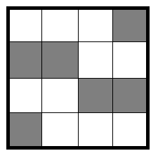
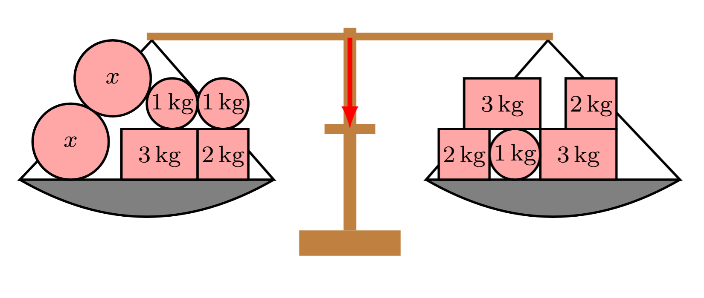

<!--

version:  0.0.1
language: de
narrator: Deutsch Female


logo:     https://raw.githubusercontent.com/MINT-the-GAP/Aufgabensammlung/refs/heads/main/Repetitorium/logo.png
email:    info@bildung-bedeutet-freiheit.de

tags: Repetitorium

comment: Hier entsteht ein mathematisches Repetitorium in LiaScript. https://mint-the-gap.github.io/Aufgabensammlung/

author: Martin Lommatzsch


@style
main > *:not(:last-child) {
  margin-bottom: 3rem;
}

input {
    text-align: center;
}

.flex-container {
    display: flex;
    flex-wrap: wrap;
    align-items: stretch;
    gap: 20px;
}

.flex-child {
    flex: 1;
    min-width: 350px;
    margin-right: 20px;
}

@media (max-width: 400px) {
    .flex-child {
        flex: 100%;
        margin-right: 0;
    }
}
@end

formula: \carry   \textcolor{red}{\scriptsize #1}
formula: \digit   \rlap{\carry{#1}}\phantom{#2}#2
formula: \permil  \text{‰}


@onload
window.segments = window.segments || {}

window.toggleSegments = function (uid, i) {
  segments[uid][i] = !segments[uid][i]
}

window.rects    = window.rects    || {}
window.rectDims = window.rectDims || {}

window.toggleRect = function (uid, i) {
  rects[uid][i] = !rects[uid][i]}
@end

@circleQuiz: @circleQuiz_(@uid,@0)

@circleQuiz_
<script modify="false">
const segments = @input(`segments-@0`);
const cx = 145, cy = 150, r = 140;

const circleFill = "white";  // Hintergrundfarbe Kreis
const lineColor  = "black";          // Linienfarbe
const segmentFill = "orange";     // Füllfarbe aktiver Segmente

const step = 360 / segments;
const startOffset = -90;

let lines = "";
let slices = "";

if (segments > 1) {
  for (let i = 0; i < segments; i++) {
    const a0 = (startOffset + step * i) * Math.PI / 180;
    const a1 = (startOffset + step * (i + 1)) * Math.PI / 180;

    const x0 = cx + r * Math.cos(a0), y0 = cy + r * Math.sin(a0);
    const x1 = cx + r * Math.cos(a1), y1 = cy + r * Math.sin(a1);

    const largeArc = (step > 180) ? 1 : 0;
    const sweep = 1;

    const isActive = window.segments['@0'][i];
    slices += `
      <path class="slice@0 slice@0 ${isActive ? 'active' : ''}"
            d="M ${cx},${cy} L ${x0},${y0} A ${r},${r} 0 ${largeArc},${sweep} ${x1},${y1} Z"
            onclick="
              this.classList.toggle('active');
              toggleSegments('@0', ${i});
            ">
      </path>
    `;

    lines += `<line x1="${cx}" y1="${cy}" x2="${x0}" y2="${y0}" stroke="${lineColor}" stroke-width="2"/>`;
  }
} else {
    const isActive = window.segments['@0'][0];
    slices = `
    <circle class="slice@0 ${isActive ? 'active' : ''}"
            cx="${cx}" cy="${cy}" r="${r}"
            onclick="this.classList.toggle('active'); toggleSegments('@0', 0);">
    </circle>
  `;
}

`HTML:
<svg viewBox="0 0 300 300" xmlns="http://www.w3.org/2000/svg" width="300" height="300" 
     style="--line:${lineColor}; --segment:${segmentFill}">
  <style>
    .slice@0 { fill: transparent; cursor: pointer; }
    .slice@0.active { fill: var(--segment); }
  </style>

  <circle cx="${cx}" cy="${cy}" r="${r}" stroke="${lineColor}" stroke-width="2" fill="${circleFill}"/>
  ${slices}
  ${lines}
</svg>
`
</script>


<script run-once modify="false" input="range" output="segments-@0" value="1" min="1" max="32" input-always-active>
if (!segments["@0"] || @input != segments["@0"].length) {
  segments["@0"] = Array(@input).fill(false);
}

@input
</script>

[[!]]
<script>
@1 === ((window.segments["@0"].filter(i => i).length) / window.segments["@0"].length)
</script>
@end


@rectQuiz: @rectQuiz_(@uid,@0)

@rectQuiz_
<script modify="false">
/*
  WICHTIG:
  - Rows/Cols kommen NUR aus window.rectDims['@0'].
  - Die folgenden zwei Dummy-Zeilen dienen ausschließlich als REAKTIONS-TRIGGER,
    damit LiaScript das SVG neu rendert, wenn die Slider bewegt werden.
    Sie werden NICHT als Datenquelle verwendet.
*/
const _rowsTrigger = @input(`rows-@0`);
const _colsTrigger = @input(`cols-@0`);

/* Quelle der Wahrheit: globale Variable */
const dims = window.rectDims['@0'] || { rows: 1, cols: 1 };
const rows = Math.max(1, +dims.rows || 1);
const cols = Math.max(1, +dims.cols || 1);

const W = 300, H = 300, padding = 8;
const usableW = W - 2*padding, usableH = H - 2*padding;


const bgFill     = "white";      // Hintergrundfarbe der Fläche
const lineColor  = "black";  // Linienfarbe
const cellFill   = "orange";    // Füllfarbe aktiver Zellen
const cellGap    = 0;            // Lücke zwischen Zellen (px)

const rw = usableW / cols;
const rh = usableH / rows;

/* Auswahlarray-Größe absichern */
const total = rows * cols;
if (!window.rects['@0'] || window.rects['@0'].length !== total) {
  window.rects['@0'] = Array(total).fill(false);
}

let gridRects = "";
let gridLines = "";

/* Zellen (anklickbar) */
for (let r = 0; r < rows; r++) {
  for (let c = 0; c < cols; c++) {
    const i = r*cols + c;
    const x = padding + c*rw + cellGap/2;
    const y = padding + r*rh + cellGap/2;
    const w = rw - cellGap;
    const h = rh - cellGap;

    const isActive = window.rects['@0'][i];

    gridRects += `
      <rect class="cell@0 ${isActive ? 'active' : ''}"
            x="${x}" y="${y}" width="${Math.max(0,w)}" height="${Math.max(0,h)}"
            onclick="this.classList.toggle('active'); toggleRect('@0', ${i});">
      </rect>
    `;
  }
}

/* Gitterlinien */
for (let r = 0; r <= rows; r++) {
  const y = padding + r*rh;
  gridLines += `<line x1="${padding}" y1="${y}" x2="${W-padding}" y2="${y}" stroke="${lineColor}" stroke-width="2"/>`;
}
for (let c = 0; c <= cols; c++) {
  const x = padding + c*rw;
  gridLines += `<line x1="${x}" y1="${padding}" x2="${x}" y2="${H-padding}" stroke="${lineColor}" stroke-width="2"/>`;
}

`HTML:
<svg viewBox="0 0 ${W} ${H}" xmlns="http://www.w3.org/2000/svg" width="${W}" height="${H}"
     style="--line:${lineColor}; --cell:${cellFill}">
  <style>
    .cell@0 { fill: transparent; cursor: pointer; }
    .cell@0.active { fill: var(--cell); }
  </style>

  <rect x="0" y="0" width="${W}" height="${H}" fill="${bgFill}" stroke="${lineColor}" stroke-width="2"/>
  ${gridRects}
  ${gridLines}
</svg>
`
</script>

<script run-once modify="false" input="range" output="rows-@0" value="1" min="1" max="20" input-always-active>
/* Initialisieren, falls nötig */
window.rectDims = window.rectDims || {};
const current = window.rectDims['@0'] || { rows: 1, cols: 1 };
const newRows = Math.max(1, +@input || 1);
const cols    = Math.max(1, +current.cols || 1);

window.rectDims['@0'] = { rows: newRows, cols };

/* Auswahlarray-Größe anpassen */
window.rects = window.rects || {};
const total = newRows * cols;
if (!window.rects['@0'] || window.rects['@0'].length !== total) {
  window.rects['@0'] = Array(total).fill(false);
}

/* @input zurückgeben (Anzeige im UI), aber NICHT als Logikquelle genutzt */
@input
</script>

<script run-once modify="false" input="range" output="cols-@0" value="1" min="1" max="20" input-always-active>
window.rectDims = window.rectDims || {};
const current = window.rectDims['@0'] || { rows: 1, cols: 1 };
const newCols = Math.max(1, +@input || 1);
const rows    = Math.max(1, +current.rows || 1);

window.rectDims['@0'] = { rows, cols: newCols };

/* Auswahlarray-Größe anpassen */
window.rects = window.rects || {};
const total = rows * newCols;
if (!window.rects['@0'] || window.rects['@0'].length !== total) {
  window.rects['@0'] = Array(total).fill(false);
}

/* @input zurückgeben (Anzeige im UI), aber NICHT als Logikquelle genutzt */
@input
</script>

[[!]]
<script>
@1 === (
  (window.rects["@0"].filter(i => i).length) /
  Math.max(1, window.rects["@0"].length)
)
</script>
@end


import: https://raw.githubusercontent.com/LiaTemplates/Tikz-Jax/main/README.md

script: https://cdn.jsdelivr.net/gh/LiaTemplates/Tikz-Jax@main/dist/index.js

import: https://raw.githubusercontent.com/liaTemplates/algebrite/master/README.md
        https://raw.githubusercontent.com/liaTemplates/JSXGraph/main/README.md

import: https://raw.githubusercontent.com/LiaTemplates/GGBScript/refs/heads/main/README.md


-->


# Repetitorium der Mathematik


{{|>}}
*******************************

> "Die Bildung kommt nicht vom Lesen, sondern vom Nachdenken über das Gelesene." \
-Carl Hilty


> "Gebildet ist der Mensch, der die höchsten Ergebnisse des Geistes in physiologische Reflexe umformt." \
-Nicolás Gómez Dávila


{{|>}} Das Wort „Mathematik“ geht auf das griechische mathema zurück, was so viel bedeutet wie „das, was man lernt“ oder „die Wissenschaft des Lernens“. Schon dieser Ursprung deutet an, dass Mathematik immer eng mit Erkenntnis und Bildung verbunden war. Während die frühen Hochkulturen in Mesopotamien, Ägypten oder China praktische Verfahren entwickelten, etwa zum Rechnen mit großen Zahlen, zum Planen von Bauwerken oder zur Berechnung des Kalenders, gingen die Griechen einen Schritt weiter: Sie suchten nach allgemeinen Regeln und Beweisen. Mathematik wurde zur Wissenschaft, die nicht nur praktische Aufgaben löst, sondern auch grundlegende Strukturen und Muster sichtbar macht.


{{|>}} Bis heute prägt uns dieses doppelte Gesicht der Mathematik: Einerseits ist sie ein Werkzeug, mit dem wir Probleme in Naturwissenschaft, Technik oder Wirtschaft bewältigen. Andererseits ist sie eine Sprache der Strukturen, die unabhängig von der Wirklichkeit gilt. Ob in der Algebra, Geometrie oder Stochastik – Mathematik lädt uns ein, Zusammenhänge zu entdecken, präzise zu denken und die Welt aus einer besonderen Perspektive zu betrachten.
*******************************


## Wichtige Hinweise


{{|>}}
*******************************

    Dieses Repetitorium der Mathematik ist aus der Motivation heraus entstanden, den naturwissenschaftlichen Unterricht an Schulen zu erleichtern. Die ersten Kapitel führen grundlegende mathematische „Vokabeln“, Zahleneigenschaften, Rechenoperationen und gebräuchliche Abkürzungen ein. Da viele Schülerinnen und Schüler durch die gesellschaftlich verbreitete Meinung, Mathematik und Naturwissenschaften seien „schwierig“, zu Ausreden und geringerer Leistungsbereitschaft neigen, soll in diesem Buch bewusst auf die Einfachheit und Klarheit der mathematischen Sprache hingewiesen werden. Diese Einfachheit erschließt sich jedoch oft erst nach der Schulzeit: Mathematik lebt von eindeutig definierten Begriffen, deren Abkürzungen und Symbolen. Anders als in Sprachen wie Deutsch oder Englisch ergibt sich ihre Bedeutung nicht erst aus dem Satzkontext. Zudem gibt es in der Mathematik im Gegensatz zu anderen Sprachen keine Ausnahmen von den Regeln.

    {{|>}} Das Buch versteht sich als Leitfaden für den Mathematikunterricht und als Wiederholungswerkzeug für die naturwissenschaftlichen Fächer. Es wird kontinuierlich weiterentwickelt und am Verständnis der Lernenden ausgerichtet. Zum Verständnis genügt der sichere Umgang mit Zahlen und Grundrechenarten, sodass das Werk für alle Schülerinnen und Schüler weiterführender Schulen geeignet ist. Es wird deutlich, dass mathematisches Verständnis eng mit der korrekten Verwendung definierter Begriffe verbunden ist. Daher sollte jede eingeführte „Vokabel“ verinnerlicht werden.

    {{|>}} Zu jedem Abschnitt gibt es Übungsaufgaben, deren Lösungen im Anhang stehen. Die Aufgaben sind so gestaltet, dass sie das Verständnis überprüfen und vertiefen; sie sollten vollständig bearbeitet und erst danach mit den Lösungen verglichen werden. In der Geometrie werden auch Zeichenaufgaben gestellt, zu denen im Anhang keine fertigen Zeichnungen enthalten sind. Manche Aufgaben erfordern Kenntnisse aus späteren Kapiteln; diese können nach Erwerb des entsprechenden Wissens bearbeitet werden, um vorhandene Kenntnisse zu festigen und zu erweitern. Oft steigert sich der Schwierigkeitsgrad innerhalb einer Aufgabe, sodass binnendifferenzierte Förderung möglich ist und jede Schülerin und jeder Schüler gefordert und gefördert werden kann.

    {{|>}} Alle *leicht schräg/kursiv* markierten Begriffe sind im mathematischen Wörterverzeichnis im Anhang erläutert. Dieser Abschnitt soll den Umgang mit der mathematischen Sprache erleichtern und deren logischen Aufbau verdeutlichen.

    {{|>}} Abschließend sei angemerkt, dass in Zukunft deutlich mehr Aufgaben mit Lösungen ergänzt werden, darunter auch solche, die auf weiter hinten behandelten Themen basieren. Hierzu werden Querverweise angegeben, um je nach Vorwissen auch komplexere Aufgaben bearbeiten zu können. Grundsätzlich gilt: Alle fehlerfreien Rechenwege sind zugelassen – entscheidend ist das korrekte Ergebnis.


> {{|>}} Diese Version kann inhaltliche und sprachliche Tippfehler enthalten und hat somit keinen Anspruch auf Richtigkeit. Außerdem kann nicht gewährleistet werden, dass der "Lehrplan" jedes Bundeslandes abgedeckt ist.


$\; $

Einige Themengebiete der Mathematik sind besonders essentiell für ein grundlegendes Verständnis der Mathematik. In diesem Buch werden nach der Einführung diese Themen immer wieder in Aufgaben oder Erklärungen vorkommen. Die Themen sind in der nachfolgenden Auflistung nach Wichtigkeit geordnet. In Klammern sind die Themenbereich beschrieben, die mit dem zentralen Thema direkt verknüpft sind:


- Bruchrechnung
- Äquivalenzumformung
- Einsetzungsverfahren
- Funktionen
- Trigonometrie (Dreiecke)
- Einheiten (Potenzen) 
 
Ohne das Verständnis dieser Themenbereiche lassen sich weiterführende Themen nur schwer erschließen. Wenn diese Themen nicht verinnerlicht wurden, sollten diese weiter erschlossen werden, da im Kern nahezu alle Aufgaben letztendlich auf diesen Grundprinzipien basieren.


*******************************


## Mengen

- Link [Erklärungen zu Mengen](https://raw.githubusercontent.com/MINT-the-GAP/Aufgabensammlung/refs/heads/main/Repetitorium/Erklaerungen/00_00_01_Mengen.md)
- Link [Übungsaufgaben zu Mengen](https://raw.githubusercontent.com/MINT-the-GAP/Aufgabensammlung/refs/heads/main/Repetitorium/Sets/00_00_01_MengenA.md)


## Algebraische Grundlagen

{{|>}}
*******************************

Um den naturwissenschaftlichen Unterricht und mathematischen Erklärungen besser folgen zu können, müssen die Begrifflichkeiten der *Algebra* geklärt werden. Dazu werden im Laufe dieses Kapitels die wichtigsten mathematischen Vokabeln, Abkürzungen und Rechenvorschriften erläutert.


{{|>}} Der Begriff *Algebra* stammt aus dem Arabischen: al-ǧabr bedeutet so viel wie „das Wiederherstellen“ oder „das Ergänzen“. Geprägt wurde er im 9. Jahrhundert durch den persischen Gelehrten Muḥammad ibn Mūsā al-Ḫwārizmī in seinem Werk al-kitāb al-muḫtaṣar fī ḥisāb al-ǧabr wa’l-muqābala („Das kurzgefasste Buch über die Rechenverfahren durch Ergänzen und Ausgleichen“). Darin systematisierte er die Lösung *linearer* und *quadratischer* *Gleichungen* – ein entscheidender Schritt, um Rechnen mit Unbekannten zu einer eigenen Disziplin zu machen.

{{|>}} Die Wurzeln der *Algebra* reichen jedoch weit zurück: Bereits die Babylonier (um 1800 v. Chr.) lösten quadratische Probleme mit geometrischen Methoden, die Griechen entwickelten Proportionenlehre und Zahlentheorie, und indische Mathematiker führten die symbolische Behandlung von Unbekannten weiter aus. Al-Ḫwārizmīs Werk verband diese Traditionen, prägte den Namen und beeinflusste die Entwicklung der *Algebra* in Europa nachhaltig, insbesondere nach Übersetzungen ins Lateinische im 12. Jahrhundert.

*******************************


### Arithmetik mit natürlichen Zahlen


{{|>}}
*******************************

*Ziffern* sind die einzelnen Zeichen, die zur Darstellung von Zahlen verwendet werden. Im *Dezimalsystem* gibt es genau zehn *Ziffern*:

$$
0, 1, 2, 3, 4, 5, 6, 7, 8, 9
$$

{{|>}} Eine *Zahl* entsteht erst, wenn eine oder mehrere *Ziffern* in einer bestimmten Anordnung geschrieben werden. Da in unserem Zahlensystem - dem Dezimalsystem - nach der 9 keine weitere neue *Ziffer* kommt muss eine *Zahl* die größer als die 9 ist durch zwei *Ziffern* ausgedrückt werden. Die Position (Stelle) einer *Ziffer* in der *Zahl* bestimmt dabei ihren Wert. Die Stellenwerttafel bildet diese Wertigkeit ab. 


{{|>}} Im *Dezimalsystem* basiert jede Stelle auf *Potenzen* der Zahl 10:

<center>
<!-- data-type="none" 
data-sortable="false" 
style="width:300px" -->
| Tausender | Hunderter | Zehner | Einer |
|-----------|-----------|--------|-------|
| T | H | Z | E |
| $10^3$    | $10^2$    | $10^1$ | $10^0$ |
| $1000$    | $100$    | $10$ | $1$ |
</center>


{{|>}} Die Zahl $4 583$ besteht aus den *Ziffern* $4$, $5$, $8$ und $3$.  
In der Stellenwerttafel:

<center>
<!-- data-type="none" 
data-sortable="false" 
style="width:50px" -->
| T | H | Z | E |
|---|---|---|---|
| 4 | 5 | 8 | 3 |
</center>

Das bedeutet:

$$
4 \cdot 1000 \;+\; 5 \cdot 100 \;+\; 8 \cdot 10 \;+\; 3 \cdot 1
= 4000 + 500 + 80 + 3
$$

{{|>}} *Ziffern* sind somit die Bausteine der Zahldarstellung. *Zahlen* entstehen durch Anordnung von *Ziffern* und Interpretation ihrer Position in einem Stellenwertsystem. Die *Stellenwerttafel* hilft, den Wert jeder Ziffer in einer Zahl zu erkennen.


*******************************


##### Übungsaufgaben zu Ziffern und Zahlen


<!-- Grund0007 -->
   \
__Aufgabe 1:__ **Gib** die in Sprache dargestellt Zahl in Ziffern **an**.

<section class="flex-container">
<div class="flex-child">

<!-- data-solution-button="5" -->
__$a)\;\;$__ Dreimillionenvierhunderttausendneun  \
[[  3400009  ]]

</div>
<div class="flex-child">

<!-- data-solution-button="5" -->
__$b)\;\;$__ Neuntausendzweihundertvierundsechsig.\
[[    9264   ]]

</div>
<div class="flex-child">

<!-- data-solution-button="5" -->
__$c)\;\;$__ Zwölftausenddreihundertelf.\
[[   12311   ]]

</div>
<div class="flex-child">

<!-- data-solution-button="5" -->
__$d)\;\;$__ Sechshundertfünfundsiebzigtausendachthundertdreiundachtzig.\
[[   675883  ]]

</div>
</section>   


<!-- Grund0008 -->
   \
__Aufgabe 2:__ **Gib** die in Sprache dargestellt Zahl in Ziffern **an**.

<section class="flex-container">

<div class="flex-child">

<!-- data-solution-button="5" -->
__$a)\;\;$__ Viertausendzweihundertneunundzwanzig  \
[[  4229  ]]

</div>
<div class="flex-child">

<!-- data-solution-button="5" -->
__$b)\;\;$__ Achttausendvier.\
[[  8004  ]]

</div>
<div class="flex-child">

<!-- data-solution-button="5" -->
__$c)\;\;$__ Zweitausendsiebhundertelf.\
[[  2711  ]]

</div>
<div class="flex-child">

<!-- data-solution-button="5" -->
__$d)\;\;$__ Dreihundertneuntausendvierhundertsechsunddreißig.\
[[ 309436 ]]

</div>
</section>


<!-- Grund0009 -->
   \
__Aufgabe 3:__ **Sortiere** die Zahlen in die Stellenwerttafel **ein**. (Falls an einer Stelle nichts eingetragen werden soll, trage eine $0$ ein.)


__$a)\;\;$__ 835069

<!-- data-type="none" data-solution-button="5" -->
|  Millioner  |  Hunderttausender  |   Zehntausender   |  Tausender   |  Hunderter |  Zehner   |  Einer  |
| :---------: | :----------------: | :---------------: | :----------: | :--------: | :-------: | :-----: |
|   [[ 0 ]]   |       [[ 8 ]]      |       [[ 3 ]]     |    [[ 5 ]]   |   [[ 0 ]]  |  [[ 6 ]]  | [[ 9 ]] |


__$b)\;\;$__ 9841631

<!-- data-type="none" data-solution-button="5" -->
|  Millioner  |  Hunderttausender  |   Zehntausender   |  Tausender   |  Hunderter |  Zehner   |  Einer  |
| :---------: | :----------------: | :---------------: | :----------: | :--------: | :-------: | :-----: |
|   [[ 9 ]]   |       [[ 8 ]]      |       [[ 4 ]]     |    [[ 1 ]]   |   [[ 6 ]]  |  [[ 3 ]]  | [[ 1 ]] |


__$c)\;\;$__ 620551

<!-- data-type="none" data-solution-button="5" -->
|  Millioner  |  Hunderttausender  |   Zehntausender   |  Tausender   |  Hunderter |  Zehner   |  Einer  |
| :---------: | :----------------: | :---------------: | :----------: | :--------: | :-------: | :-----: |
|   [[ 0 ]]   |       [[ 6 ]]      |       [[ 2 ]]     |    [[ 0 ]]   |   [[ 5 ]]  |  [[ 5 ]]  | [[ 1 ]] |


<!-- Grund0010 -->
   \
__Aufgabe 4__ **Sortiere** die Zahlen in die Stellenwerttafel **ein**. (Falls an einer Stelle nichts eingetragen werden soll, trage eine $0$ ein.)


__$a)\;\;$__ 6449

<!-- data-type="none"  data-solution-button="5" -->
|  Millioner  |  Hunderttausender  |   Zehntausender   |  Tausender   |  Hunderter |  Zehner   |  Einer  |
| :---------: | :----------------: | :---------------: | :----------: | :--------: | :-------: | :-----: |
|   [[ 0 ]]   |       [[ 0 ]]      |       [[ 0 ]]     |    [[ 6 ]]   |   [[ 4 ]]  |  [[ 4 ]]  | [[ 9 ]] |


__$b)\;\;$__ 6459204

<!-- data-type="none"  data-solution-button="5" -->
|  Millioner  |  Hunderttausender  |   Zehntausender   |  Tausender   |  Hunderter |  Zehner   |  Einer  |
| :---------: | :----------------: | :---------------: | :----------: | :--------: | :-------: | :-----: |
|   [[ 6 ]]   |       [[ 4 ]]      |       [[ 5 ]]     |    [[ 9 ]]   |   [[ 2 ]]  |  [[ 0 ]]  | [[ 4 ]] |


__$c)\;\;$__ 210079

<!-- data-type="none"  data-solution-button="5" -->
|  Millioner  |  Hunderttausender  |   Zehntausender   |  Tausender   |  Hunderter |  Zehner   |  Einer  |
| :---------: | :----------------: | :---------------: | :----------: | :--------: | :-------: | :-----: |
|   [[ 0 ]]   |       [[ 2 ]]      |       [[ 1 ]]     |    [[ 0 ]]   |   [[ 0 ]]  |  [[ 7 ]]  | [[ 9 ]] |


<!-- Grund0011 -->
   \
__Aufgabe 5__ **Sortiere** die Zahlen in die Stellenwerttafel **ein**. (Falls an einer Stelle nichts eingetragen werden soll, trage eine $0$ ein.)


__$a)\;\;$__ 910772

<!-- data-type="none"  data-solution-button="5" -->
|  Millioner  |  Hunderttausender  |   Zehntausender   |  Tausender   |  Hunderter |  Zehner   |  Einer  |
| :---------: | :----------------: | :---------------: | :----------: | :--------: | :-------: | :-----: |
|   [[ 0 ]]   |       [[ 9 ]]      |       [[ 1 ]]     |    [[ 0 ]]   |   [[ 7 ]]  |  [[ 7 ]]  | [[ 2 ]] |


__$b)\;\;$__ 1349310

<!-- data-type="none"  data-solution-button="5" -->
|  Millioner  |  Hunderttausender  |   Zehntausender   |  Tausender   |  Hunderter |  Zehner   |  Einer  |
| :---------: | :----------------: | :---------------: | :----------: | :--------: | :-------: | :-----: |
|   [[ 1 ]]   |       [[ 3 ]]      |       [[ 4 ]]     |    [[ 9 ]]   |   [[ 3 ]]  |  [[ 1 ]]  | [[ 0 ]] |


__$c)\;\;$__ 13792

<!-- data-type="none"  data-solution-button="5" -->
|  Millioner  |  Hunderttausender  |   Zehntausender   |  Tausender   |  Hunderter |  Zehner   |  Einer  |
| :---------: | :----------------: | :---------------: | :----------: | :--------: | :-------: | :-----: |
|   [[ 0 ]]   |       [[ 0 ]]      |       [[ 1 ]]     |    [[ 3 ]]   |   [[ 7 ]]  |  [[ 9 ]]  | [[ 2 ]] |


<!-- Grund0012 -->
   \
__Aufgabe 6__ **Gib** die Zahlen, die durch die Ziffern in der Stellenwerttafel dargestellt sind **an**.


__$a)\;\;$__ 

<!-- data-type="none" -->
|  Millioner  |  Hunderttausender  |   Zehntausender   |  Tausender   |  Hunderter |  Zehner   |  Einer  |
| :---------: | :----------------: | :---------------: | :----------: | :--------: | :-------: | :-----: |
|             |         4          |         0         |      0       |     7      |     5     |    2    |


<!-- data-solution-button="5" -->
[[   400752  ]]


__$b)\;\;$__ 

<!-- data-type="none" -->
|  Millioner  |  Hunderttausender  |   Zehntausender   |  Tausender   |  Hunderter |  Zehner   |  Einer  |
| :---------: | :----------------: | :---------------: | :----------: | :--------: | :-------: | :-----: |
|      3      |          8         |         5         |      1       |     1      |     6     |    7    |


<!-- data-solution-button="5" -->
 [[  3851167  ]]


__$c)\;\;$__ 

<!-- data-type="none" -->
|  Millioner  |  Hunderttausender  |   Zehntausender   |  Tausender   |  Hunderter |  Zehner   |  Einer  |
| :---------: | :----------------: | :---------------: | :----------: | :--------: | :-------: | :-----: |
|             |                    |          7        |       5      |     0      |     0     |     9   |


<!-- data-solution-button="5" -->
 [[   75009   ]]


<!-- Grund0013 -->
   \
__Aufgabe 7__ **Gib** die Zahlen, die durch die Ziffern in der Stellenwerttafel dargestellt sind **an**.


__$a)\;\;$__ 

<!-- data-type="none" -->
|  Millioner  |  Hunderttausender  |   Zehntausender   |  Tausender   |  Hunderter |  Zehner   |  Einer  |
| :---------: | :----------------: | :---------------: | :----------: | :--------: | :-------: | :-----: |
|      4      |         0          |         2         |      1       |     6      |     3     |    9    |


<!-- data-solution-button="5" -->
 [[  4021639  ]]
 

__$b)\;\;$__ 

<!-- data-type="none" -->
|  Millioner  |  Hunderttausender  |   Zehntausender   |  Tausender   |  Hunderter |  Zehner   |  Einer  |
| :---------: | :----------------: | :---------------: | :----------: | :--------: | :-------: | :-----: |
|             |                    |         2         |      8       |     0      |     4     |    5    |


<!-- data-solution-button="5" -->
 [[   28045   ]]
 

__$c)\;\;$__ 

<!-- data-type="none" -->
|  Millioner  |  Hunderttausender  |   Zehntausender   |  Tausender   |  Hunderter |  Zehner   |  Einer  |
| :---------: | :----------------: | :---------------: | :----------: | :--------: | :-------: | :-----: |
|             |         4          |          0        |       2      |     1      |     4     |     7   |


<!-- data-solution-button="5" -->
 [[  402147   ]]


<!-- Grund0014 -->
   \
__Aufgabe 8__ **Gib** die Zahlen, die durch die Ziffern in der Stellenwerttafel dargestellt sind **an**.


__$a)\;\;$__ 

<!-- data-type="none" -->
|  Millioner  |  Hunderttausender  |   Zehntausender   |  Tausender   |  Hunderter |  Zehner   |  Einer  |
| :---------: | :----------------: | :---------------: | :----------: | :--------: | :-------: | :-----: |
|      17     |         2          |         4         |      1       |     0      |     0     |    7    |


<!-- data-solution-button="5" -->
 [[  17241007  ]]
 

__$b)\;\;$__ 

<!-- data-type="none" -->
|  Millioner  |  Hunderttausender  |   Zehntausender   |  Tausender   |  Hunderter |  Zehner   |  Einer  |
| :---------: | :----------------: | :---------------: | :----------: | :--------: | :-------: | :-----: |
|             |          1         |         17        |      4       |     5      |     12    |    4    |


<!-- data-solution-button="5" -->
 [[   274624  ]]
 

__$c)\;\;$__ 

<!-- data-type="none" -->
|  Millioner  |  Hunderttausender  |   Zehntausender   |  Tausender   |  Hunderter |  Zehner   |  Einer  |
| :---------: | :----------------: | :---------------: | :----------: | :--------: | :-------: | :-----: |
|             |                    |        287        |       0      |     24     |     0     |   117   |


<!-- data-solution-button="5" -->
 [[  2872517  ]]


#### Terme und Gleichungen


{{|>}}
*******************************


{{|>}} Hinter großen Teilen des Verständnis der Mathematik steht das Wissen, was ein *Term* ist. Bei dem Beispiel 

$$
 \begin{equation}
\begin{split} 
4+5 = 3+6 \\ 
 \end{split}
\end{equation}  
$$

{{|>}} handelt es sich um eine *Gleichung* wobei die *Terme* $4+5$ und $3+6$ den gleichen Wert $9$ besitzen. Das *Äquivalenzzeichen* "=" wird oftmals fälschlicherweise als Aufforderung interpretiert, den *Wert des Terms* zu berechnen, doch gibt dieses lediglich die Gleichheit an. 

{{|>}} In einer weiteren Beispielaufgabe stehen drei verschiedene Seillängen mit $3\,$cm, $6\,$cm und $7\,$cm zur Verfügung. Wenn nun der *Term* 

$$
 \begin{equation}
\begin{split} 
\text{$4\cdot 3$\,cm\,+\,$5\cdot 6$\,cm\,+\,$2\cdot 7$\,cm } \\ 
 \end{split}
\end{equation}  
$$


{{|>}} niedergeschrieben wird, dann können dem *Term* verschiedene Informationen entnommen werden. So ist bekannt, dass viermal das $3\,$cm, fünfmal das $6\,$cm und zweimal das $7\,$cm Seilstück verwendet wurde und dass die Seilstücke zusammen eine *Länge* von $56\,$cm besitzen. Es wird deutlich, dass *Terme* auch ohne ein *Äquivalenzzeichen* niedergeschrieben werden können und dennoch eine Bedeutung besitzen. 

{{|>}} Wenn ein *Term* berechnet werden soll, ist eine systematisches Vorgehen zu empfehlen. Hierbei sollten einzelne Schritte visualisiert werden, sodass ein anderer Betrachter schnell die Rechnung nachvollziehen kann. Dies ist im folgenden Beispiel dargestellt:

$$
 \begin{equation}
\begin{split}  
& \;\;\;\; \left(6 \cdot 5 + 9 \cdot 8\right) :3 - 3 \cdot 7  \\
& = \left(30 + 72\right) :3 - 21  \\
& = 102 :3 - 21  \\
& = 34 - 21  \\
& = 13  \\ 
 \end{split}
\end{equation}  
$$

{{|>}} Deutlich zu erkennen ist, dass nach jeder Rechnung eine neue Zeile begonnen wurde und hierbei die *Äquivalenzzeichen* "=" stets untereinander stehen. Auch sind die *Rechenregeln* (wie *Punkt- vor Strichrechnung* und die Beachtung der *Klammern*) erkennbar, da im ersten Schritt alle *Produktwerte*, anschließend der *Summenwert* in der *Klammer* gefolgt vom *Quotientenwert* und abschließend der *Differenzwert* bestimmt wurde.  

{{|>}} Besonders das strukturierte, systematische und nachvollziehbare Niederschreiben von *Termveränderungen* bietet die Möglichkeit neue Erkenntnisse zu generieren und Auffälligkeiten zu entdecken, was ein wesentlicher Bestandteil der Mathematik ist.


*******************************


##### Übungen - Terme und Gleichungen


<!-- Terme 0001 -->

   \
__Aufgabe 1:__ **Gib** die Werte in den Lücken der Rechnung **an**.

<section class="flex-container">

<div class="flex-child">

<!-- data-solution-button="5" data-show-partial-solution -->
__$a)\;\;$__ \
$\;\;\;\; 13 \cdot 5 + 14 $ \
$=$ [[ 65 ]] $  + 14 $ \
$=$ [[ 79 ]] 

</div> 
<div class="flex-child">

<!-- data-solution-button="5" data-show-partial-solution -->
__$b)\;\;$__ \
$\;\;\;\; 75 - 7 \cdot 5 + 23  $ \
$=  75 - $ [[ 35 ]] $  + 23 $ \
$=$ [[ 40 ]]  $  + 23 $ \
$=$ [[ 63 ]]

</div> 
<div class="flex-child">

<!-- data-solution-button="5" data-show-partial-solution -->
__$c)\;\;$__ \
$\;\;\;\; 65 : 13 + 85 : 5   $ \
$=$ $ 65 : 13 +$ [[ 17 ]]  \
$=$ [[  5 ]] $+$ [[ 17 ]]  \
$=$ [[ 22 ]] 

</div> 
<div class="flex-child">

<!-- data-solution-button="5" data-show-partial-solution -->
__$d)\;\;$__ \
$\;\;\;\; 9 \cdot 8 - 12 \cdot 4  $ \
$=$ [[ 72 ]] $ - 12 \cdot 4  $ \
$=$ [[ 72 ]] $-$ [[ 48 ]] \
$=$ [[ 24 ]] 

</div> 
</section>


<!-- Terme 0002 -->

   \
__Aufgabe 2:__ **Gib** die Werte in den Lücken der Rechnung **an**.

<section class="flex-container">

<div class="flex-child">

<!-- data-solution-button="5" data-show-partial-solution -->
__$a)\;\;$__ \
$\;\;\;\; 72:16 + 26 + 22 $ \
$=$ [[ 4 ]] $ + 26 + 22  $ \
$=$ [[ 30 ]] $ + 22  $ \
$=$ [[ 52 ]] 

</div> 
<div class="flex-child">

<!-- data-solution-button="5" data-show-partial-solution -->
__$b)\;\;$__ \
$\;\;\;\; 5 \cdot 9 + 6 \cdot 7 + 2 $ \
$= $ [[ 45 ]] $ + 6 \cdot 7 + 2$ \
$=$ [[ 45 ]]  $+$ [[ 42 ]] $+ 2$  \
$=$ [[ 87 ]]  $+ 2$  \
$=$ [[ 89 ]]

</div> 
<div class="flex-child">

<!-- data-solution-button="5" data-show-partial-solution -->
__$c)\;\;$__ \
$\;\;\;\; 34 + 64 + 25 + 21   $ \
$=$ $ 34 + 64 + $ [[ 46 ]]  \
$=$ $ 34 +$ [[ 110 ]]  \
$=$ [[ 144 ]] 

</div> 
<div class="flex-child">

<!-- data-solution-button="5" data-show-partial-solution -->
__$d)\;\;$__ \
$\;\;\;\; 7 \cdot 3 \cdot ( 14 - 2 \cdot 4 ) $ \
$= 7 \cdot 3 \cdot ( 14 -$ [[  8 ]] $) $ \
$= 7 \cdot 3 \cdot$  [[  6 ]]  \
$= 7 \cdot $  [[  18 ]] \
$=$ [[ 126 ]] 

</div> 
</section>


<!-- Terme 0003 -->

   \
__Aufgabe 3:__ **Gib** die Werte in den Lücken der Rechnung **an**.

<section class="flex-container">

<div class="flex-child">

<!-- data-solution-button="5" data-show-partial-solution -->
__$a)\;\;$__ \
$\;\;\;\; 20 + 2 \cdot 3 \cdot 4 \cdot 5 $ \
$= 20 +$ [[  6  ]] $\cdot 4 \cdot 5 $ \
$= 20 +$ [[ 24  ]] $ \cdot 5 $ \
$= 20 +$ [[ 120 ]]   \
$=$ [[ 140 ]] 

</div> 
<div class="flex-child">

<!-- data-solution-button="5" data-show-partial-solution -->
__$b)\;\;$__ \
$\;\;\;\; 187 - 17 - 31 -25 - 41  $ \
$=$ [[ 160 ]]  $  - 31 -25 - 41 $ \
$=$ [[ 129 ]]  $   -25 - 41 $ \
$=$ [[ 104 ]]  $    - 41 $ \
$=$ [[ 63 ]]

</div> 
<div class="flex-child">

<!-- data-solution-button="5" data-show-partial-solution -->
__$c)\;\;$__ \
$\;\;\;\; 81 : 3 + 105 : 5 + 6 \cdot 4  $ \
$=$ $ 81 : 3 + 105 : 5 +$ [[ 24 ]]  \
$=$ $ 81 : 3 +$ [[ 21 ]] $+$ [[ 24 ]]  \
$=$ $ 81 : 3 +$ [[ 45 ]]  \
$=$ [[ 27 ]] $+$ [[ 45 ]]  \
$=$ [[ 72 ]] 

</div> 
<div class="flex-child">

<!-- data-solution-button="5" data-show-partial-solution -->
__$d)\;\;$__ \
$\;\;\;\; 11 \cdot 7 - 17 \cdot 3  $ \
$=$ [[ 77 ]] $ - 17 \cdot 3  $ \
$=$ [[ 77 ]] $-$ [[ 51 ]] \
$=$ [[ 26 ]] 

</div> 
</section>

<!-- Terme 0004 -->

   \
__Aufgabe 4:__ **Gib** die Werte in den Lücken der Rechnung **an**.

<section class="flex-container">

<div class="flex-child">

<!-- data-solution-button="5" data-show-partial-solution -->
__$a)\;\;$__ \
$\;\;\;\; 82 - 5 \cdot 3 - 6 \cdot 4 $ \
$= 82 - $ [[ 15 ]] $ - 6 \cdot 4  $ \
$= [[ 67 ]] $ - 6 \cdot 4  $ \
$= [[ 67 ]] $ - $[[ 24 ]] \
$=$ [[ 43 ]] 

</div> 
<div class="flex-child">

<!-- data-solution-button="5" data-show-partial-solution -->
__$b)\;\;$__ \
$\;\;\;\; 144 - ( 8 \cdot 6 + 17)  $ \
$= 144 - ( $[[ 42 ]]$ + 17)  $ \
$= 144 - $[[ 59 ]]$  \
$=$ [[ 85 ]]

</div> 
<div class="flex-child">

<!-- data-solution-button="5" data-show-partial-solution -->
__$c)\;\;$__ \
$\;\;\;\; ( 9 \cdot 5 + 18 ) : 7   $ \
$= ( $[[ 45 ]] $ + 18 ) : 7   $ \
$=  $[[ 63 ]] $  : 7   $ \
$=$ [[ 9 ]] 

</div> 
<div class="flex-child">

<!-- data-solution-button="5" data-show-partial-solution -->
__$d)\;\;$__ \
$\;\;\;\; 13 + 5 \cdot 7 + 108 : 4  $ \
$= 13 +$ [[ 35 ]] $+ 108 : 4  $ \
$= $ [[ 48 ]] $+ 108 : 4  $ \
$= $ [[ 48 ]] $+$ [[ 27 ]] \
$=$ [[ 75 ]] 

</div> 
</section>

<!-- Terme 0005 -->

   \
__Aufgabe 5:__ **Gib** die Werte in den Lücken der Rechnung **an**.

<section class="flex-container">

<div class="flex-child">

<!-- data-solution-button="5" data-show-partial-solution -->
__$a)\;\;$__ \
$\;\;\;\; -2 \cdot 7 + 8 \cdot (-3) - 34 $ \
$=$ [[ -14   ]] $ + $ [[ (-24) ]] $ - 34 $ \
$=$ [[ -38   ]] $ - 34 $ \
$=$ [[ -72   ]] 

</div> 
<div class="flex-child">

<!-- data-solution-button="5" data-show-partial-solution -->
__$b)\;\;$__ \
$\;\;\;\; -34-75:5-12 \cdot (-9) $ \
$= -34-75:5-$ [[ (-108) ]]  \
$= -34-$[[ 15    ]]$+$ [[ 108    ]]  \
$= -34+$[[ 93    ]]  \
$=$ [[ 59    ]] 

</div> 
<div class="flex-child">

<!-- data-solution-button="5" data-show-partial-solution -->
__$c)\;\;$__ \
$\;\;\;\; 85:(-5) + (-4) \cdot (-3) \cdot (-5) - 44 $ \
$=$ [[ -17   ]] $ + (-4) \cdot (-3) \cdot (-5) - 44 $ \
$=$ [[ -17   ]] $ + $ [[ 12    ]] $ \cdot (-5) - 44 $ \
$=$ [[ -17   ]] $ + $ [[ (-60) ]] $ - 44 $ \
$=$ [[ -77   ]] $ - 44 $ \
$=$ [[ -121  ]] 

</div> 
<div class="flex-child">

<!-- data-solution-button="5" data-show-partial-solution -->
__$d)\;\;$__ \
$\;\;\;\; - ( 3 - (-5) \cdot 7 + 23 ) + 54 $ \
$= - ( 3 - $  [[ (-35) ]]  $ + 23 ) + 54 $ \
$= - ( $ [[   -9  ]]  $  ) + 54 $ \
$=$   [[   9  ]]  $  + 54 $ \
$=$ [[  63  ]] 

</div> 
</section>


<!-- Terme 0006 -->

   \
__Aufgabe 6:__ **Gib** die Werte in den Lücken der Rechnung **an**.

<section class="flex-container">

<div class="flex-child">

<!-- data-solution-button="5" data-show-partial-solution -->
__$a)\;\;$__ \
$\;\;\;\; - 5 \cdot (-9) - 46 + 11 \cdot (-4) $ \
$= $ [[  45   ]] $ - 46 + 11 \cdot (-4) $ \
$= $ [[  -1   ]] $ + 11 \cdot (-4) $ \
$= $ [[  -1   ]] $ + $ [[ (-44) ]]   \
$=$ [[  -45  ]] 

</div> 
<div class="flex-child">

<!-- data-solution-button="5" data-show-partial-solution -->
__$b)\;\;$__ \
$\;\;\;\; -92 + 7 \cdot (-4) - 144 : (-4) $ \
$= -92 +$ [[ (-28) ]] $ - 144 : (-4) $ \
$= $ [[ -120 ]] $ - 144 : (-4) $ \
$= $ [[ -120 ]] $ -$ [[ (-36) ]]  \
$=$ [[ -84  ]] 

</div> 
<div class="flex-child">

<!-- data-solution-button="5" data-show-partial-solution -->
__$c)\;\;$__ \
$\;\;\;\; -3 \cdot (-4) \cdot (-2) \cdot (-5) : (-6) $ \
$=$ [[  24  ]] $ \cdot (-2) \cdot (-5) : (-6) $ \
$=$ [[ -48  ]] $ \cdot (-5) : (-6) $ \
$=$ [[ 240  ]] $ : (-6) $ \
$=$ [[ -40 ]] 

</div> 
<div class="flex-child">

<!-- data-solution-button="5" data-show-partial-solution -->
__$d)\;\;$__ \
$\;\;\;\; -8 \cdot (-7) - 4 \cdot (-3) + 72:(-8) $ \
$=$ [[  56   ]] $- 4 \cdot (-3) + 72:(-8) $ \
$=$ [[  56   ]] $-$ [[ (-12) ]]$ + 72:(-8) $ \
$=$ [[  56   ]] $+$ [[   12  ]]$ + 72:(-8) $ \
$=$ [[  68   ]] $ + 72:(-8) $ \
$=$ [[  68   ]] $ +$  [[  (-9) ]] \
$=$ [[  59   ]] 

</div> 
</section>


<!-- Terme 0007 -->

   \
__Aufgabe 7:__ **Gib** die Werte in den Lücken der Rechnung **an**.

<section class="flex-container">

<div class="flex-child">

<!-- data-solution-button="5" data-show-partial-solution -->
__$a)\;\;$__ \
$\;\;\;\; 44 - 2 \cdot (13 - 5 \cdot (3 + 2 \cdot (-4)) ) $ \
$= 44 - 2 \cdot (13 - 5 \cdot (3 +$ [[ (-8)  ]] $ ) ) $ \
$= 44 - 2 \cdot (13 - 5 \cdot ($ [[  -5   ]] $ ) ) $ \
$= 44 - 2 \cdot (13 - ($ [[ (-25) ]] $  )) $ \
$= 44 - 2 \cdot $ [[   38  ]] $  $ \
$= 44 - $ [[   76  ]] $  $ \
$=$ [[  -32  ]] 

</div> 
<div class="flex-child">

<!-- data-solution-button="5" data-show-partial-solution -->
__$b)\;\;$__ \
$\;\;\;\; -45 + (-3) \cdot (-8) - 92: (-4) $ \
$= -45 +$ [[   24  ]] $- 92: (-4) $ \
$= -45 +$ [[   24  ]] $-$ [[ (-23) ]]   \
$= -45 +$ [[   47  ]] $ \
$=$ [[   2   ]] 

</div> 
<div class="flex-child">

<!-- data-solution-button="5" data-show-partial-solution -->
__$c)\;\;$__ \
$\;\;\;\; -4 \cdot (-3) + 5 \cdot (-9) - 74 $ \
$= -4 \cdot (-3) +$ [[ (-45)  ]] $ - 74 $ \
$= -4 \cdot (-3) +$ [[ (-119) ]] \
$=$ [[   12   ]] $+$ [[ (-119) ]] \
$=$ [[ -107   ]] 

</div> 
<div class="flex-child">

<!-- data-solution-button="5" data-show-partial-solution -->
__$d)\;\;$__ \
$\;\;\;\; -(-56 : (-2)) : (-7) - (-14) $ \
$= -(-56 : (-2)) : (-7) + $ [[ 14   ]] \
$= -($ [[ 28   ]] $) : (-7) + $ [[ 14   ]] \
$= $ [[  4   ]] $  + $ [[ 14   ]] \
$=$ [[ 18   ]] 

</div> 
</section>


<!-- Terme 0008 -->

   \
__Aufgabe 8:__ **Gib** die Werte in den Lücken der Rechnung **an**.

<section class="flex-container">

<div class="flex-child">

<!-- data-solution-button="5" data-show-partial-solution -->
__$a)\;\;$__ \
$\;\;\;\; -7 \cdot (-47 + 2 \cdot (-4) \cdot (-6) ) $ \
$= -7 \cdot (-47 + 2 \cdot $ [[  24  ]] $) $ \
$= -7 \cdot (-47 +$ [[  48  ]] $) $ \
$= -7 \cdot $ [[   1  ]]  \
$=$ [[  -7  ]] 

</div> 
<div class="flex-child">

<!-- data-solution-button="5" data-show-partial-solution -->
__$b)\;\;$__ \
$\;\;\;\; -65-(-25)-42+8 \cdot (-6) $ \
$= -65-(-25)-42+ $ [[ (-48) ]] \
$= -65-(-25)-$ [[   90  ]] \
$= -65+$[[   25  ]]$-$ [[   90  ]] \
$= -65-$[[   65  ]] \
$=$ [[  -130 ]] 

</div> 
<div class="flex-child">

<!-- data-solution-button="5" data-show-partial-solution -->
__$c)\;\;$__ \
$\;\;\;\; -(-45:(-9) - 54:(-6)) \cdot (-2) $ \
$= -($ [[   5   ]] $ - 54:(-6)) \cdot (-2) $ \
$= -($ [[   5   ]] $ + $ [[   9   ]] $) \cdot (-2) $ \
$= -$ [[  14   ]] $ \cdot (-2) $ \
$=$ [[  28   ]] 

</div> 
<div class="flex-child">

<!-- data-solution-button="5" data-show-partial-solution -->
__$d)\;\;$__ \
$\;\;\;\; -(-6 \cdot (-5) \cdot 4) : (-8) - 13 \cdot 11 $ \
$= -($ [[  30   ]] $\cdot 4) : (-8) - 13 \cdot 11 $ \
$= -($ [[  120  ]] $) : (-8) - 13 \cdot 11 $ \
$= $ [[   15  ]]  $- 13 \cdot 11 $ \
$= $ [[   15  ]]  $-$ [[  143  ]]   \
$=$  [[ -128  ]] 

</div> 
</section>


<!-- Terme 0009 -->

   \
__Aufgabe 9:__ **Gib** die Werte in den Lücken der Rechnung **an**.

<section class="flex-container">

<div class="flex-child">

<!-- data-solution-button="5" data-show-partial-solution -->
__$a)\;\;$__ \
$\;\;\;\; 1,7 + 0,5 \cdot 0,3 + 1,3 \cdot 0,25 $ \
$= 1,7 +$ [[  0,15   ]] $+ 1,3 \cdot 0,25 $ \
$= 1,7 +$ [[  0,15   ]] $+$ [[  0,325  ]]  \
$= 1,7 +$ [[  0,435  ]]   \
$=$ [[  2,135  ]] 

</div> 
<div class="flex-child">

<!-- data-solution-button="5" data-show-partial-solution -->
__$b)\;\;$__ \
$\;\;\;\; 0,81:0,9 + 5,4:6 + 0,125 \cdot 5 $ \
$=$ [[  0,9  ]] $+ 5,4:6 + 0,125 \cdot 5 $ \
$=$ [[  0,9  ]] $+$ [[  0,9  ]] $+ 0,125 \cdot 5 $ \
$=$ [[  1,8  ]] $+ 0,125 \cdot 5 $ \
$=$ [[  1,8  ]] $+$ [[ 0,625 ]] \
$=$ [[ 2,425 ]] 

</div> 
<div class="flex-child">

<!-- data-solution-button="5" data-show-partial-solution -->
__$c)\;\;$__ \
$\;\;\;\; 9,2 - 0,4 \cdot 1,5 \cdot 0,6 - 0,48:0,6 $ \
$= 9,2 -$ [[  0,6  ]] $\cdot 0,6 - 0,48:0,6 $ \
$= 9,2 -$ [[ 0,36  ]] $- 0,48:0,6 $ \
$= $ [[ 8,84 ]] $- 0,48:0,6 $ \
$= $ [[ 8,84 ]] $-$ [[  0,8  ]] \
$=$ [[ 8,04 ]] 

</div> 
<div class="flex-child">

<!-- data-solution-button="5" data-show-partial-solution -->
__$d)\;\;$__ \
$\;\;\;\; (0,12 \cdot 0,4) : 0,08 + 6,5 : 1,3  $ \
$= $ [[ 0,48 ]] $ : 0,08 + 6,5 : 1,3  $ \
$= $ [[  6   ]] $ + 6,5 : 1,3  $ \
$= $ [[  6   ]] $ +$ [[  5   ]] \
$=$ [[ 11   ]] 

</div> 
</section>


<!-- Terme 0010 -->

   \
__Aufgabe 10:__ **Gib** die Werte in den Lücken der Rechnung **an**.

<section class="flex-container">

<div class="flex-child">

<!-- data-solution-button="5" data-show-partial-solution -->
__$a)\;\;$__ \
$\;\;\;\; 1,4 \cdot 6 - 0,4 \cdot 0,7 - 1,69:1,3 $ \
$=$ [[  8,4  ]] $- 0,4 \cdot 0,7 - 1,69:1,3 $ \
$=$ [[  8,4  ]] $-$ [[  0,28 ]] $- 1,69:1,3 $ \
$=$ [[  8,12 ]] $- 1,69:1,3 $ \
$=$ [[  8,12 ]] $-$ [[  1,3  ]] \
$=$ [[ 7,82 ]] 

</div> 
<div class="flex-child">

<!-- data-solution-button="5" data-show-partial-solution -->
__$b)\;\;$__ \
$\;\;\;\; 1,8 \cdot 0,4 + 0,75 \cdot 6,4 - 0,125 \cdot 0,96 $ \
$= 1,8 \cdot 0,4 +$ [[  4,8   ]] $- 0,125 \cdot 0,96 $ \
$= 1,8 \cdot 0,4 +$ [[  4,8   ]] $-$ [[  0,16  ]] \
$= 1,8 \cdot 0,4 +$ [[  4,64  ]] \
$=$ [[  0,72  ]] $+$ [[  4,64  ]] \
$=$ [[  5,36  ]] 

</div> 
<div class="flex-child">

<!-- data-solution-button="5" data-show-partial-solution -->
__$c)\;\;$__ \
$\;\;\;\; (3,4 - 1,4 \cdot 1,6) \cdot 0,5 + 2,1 \cdot 0,75  $ \
$= (3,4 - $ [[ 2,24  ]] $) \cdot 0,5 + 2,1 \cdot 0,75  $ \
$=$ [[ 1,16  ]] $ \cdot 0,5 + 2,1 \cdot 0,75  $ \
$=$ [[ 0,58  ]] $ + 2,1 \cdot 0,75  $ \
$=$ [[ 0,58  ]] $ + $ [[ 15,75 ]] \
$=$ [[ 16,33 ]] 

</div> 
<div class="flex-child">

<!-- data-solution-button="5" data-show-partial-solution -->
__$d)\;\;$__ \
$\;\;\;\; (0,056:0,7) \cdot 2,5 + (0,42 : 0,6) \cdot 1,5  $ \
$= $ [[ 0,08 ]] $ \cdot 2,5 + (0,42 : 0,6) \cdot 1,5  $ \
$= $ [[ 0,2  ]] $ + (0,42 : 0,6) \cdot 1,5  $ \
$= $ [[ 0,2  ]] $ +$ [[ 0,7  ]] $\cdot 1,5  $ \
$= $ [[ 0,2  ]] $ +$ [[ 1,05 ]]  \
$=$ [[ 1,25 ]] 

</div> 
</section>


<!-- Terme 0011 -->

   \
__Aufgabe 11:__ **Gib** die Werte in den Lücken der Rechnung **an**.

<section class="flex-container">

<div class="flex-child">

<!-- data-solution-button="5" data-show-partial-solution -->
__$a)\;\;$__ \
$\;\;\;\; 3,5 \cdot 2,5 - 0,8 \cdot 1,2 - 0,875 \cdot 1,6 $ \
$=$ [[ 8,75 ]] $ - 0,8 \cdot 1,2 - 0,875 \cdot 1,6 $ \
$=$ [[ 8,75 ]] $ - $ [[ 0,95 ]] $ - 0,875 \cdot 1,6 $ \
$=$ [[ 7,8  ]] $ - 0,875 \cdot 1,6 $ \
$=$ [[ 7,8  ]] $ -$ [[ 1,4  ]] \
$=$ [[ 6,4  ]] 

</div> 
<div class="flex-child">

<!-- data-solution-button="5" data-show-partial-solution -->
__$b)\;\;$__ \
$\;\;\;\; 0,25 \cdot 0,8 \cdot 5,2 + 0,6 \cdot 5,5 - 2,75 $ \
$= $ [[ 0,2  ]] $ \cdot 5,2 + 0,6 \cdot 5,5 - 2,75 $ \
$= $ [[ 1,3  ]] $ + 0,6 \cdot 5,5 - 2,75 $ \
$= $ [[ 1,3  ]] $ + $ [[ 3,3  ]] $ - 2,75 $ \
$= $ [[ 4,6  ]] $ - 2,75 $ \
$=$ [[ 1,85 ]] 

</div> 
<div class="flex-child">

<!-- data-solution-button="5" data-show-partial-solution -->
__$c)\;\;$__ \
$\;\;\;\; 9,87-2,3-0,45-0,37-1,87 $ \
$= $ [[ 7,57  ]] $ -0,45-0,37-1,87 $ \
$= $ [[ 7,12  ]] $ -0,37-1,87 $ \
$= $ [[ 6,75  ]] $ -1,87 $ \
$=$ [[ 4,88  ]] 

</div> 
<div class="flex-child">

<!-- data-solution-button="5" data-show-partial-solution -->
__$d)\;\;$__ \
$\;\;\;\; 0,75 \cdot (1,6 - 0,4 \cdot 0,8) + 0,9 \cdot 1,5 $ \
$= 0,75 \cdot (1,6 - $ [[ 0,32  ]] $) + 0,9 \cdot 1,5 $ \
$= 0,75 \cdot $ [[ 1,28  ]] $ + 0,9 \cdot 1,5 $ \
$= $ [[ 0,96  ]] $ + 0,9 \cdot 1,5 $ \
$= $ [[ 0,96  ]] $ + $ [[ 1,35  ]] \
$=$ [[ 2,31  ]] 

</div> 
</section>


<!-- Terme 0012 -->

   \
__Aufgabe 12:__ **Gib** die Werte in den Lücken der Rechnung **an**.

<section class="flex-container">

<div class="flex-child">

<!-- data-solution-button="5" data-show-partial-solution -->
__$a)\;\;$__ \
$\;\;\;\; 0,84 : 0,7 + 2,54 + 1,75 \cdot 4,8 $ \
$=$ [[  1,2  ]] $ + 2,54 + 1,75 \cdot 4,8 $ \
$=$ [[ 3,74  ]] $ + 1,75 \cdot 4,8 $ \
$=$ [[ 3,74  ]] $ + $ [[ 8,4   ]] \
$=$ [[ 12,14 ]] 

</div> 
<div class="flex-child">

<!-- data-solution-button="5" data-show-partial-solution -->
__$b)\;\;$__ \
$\;\;\;\; 1,25 \cdot 0,4 \cdot 7,5 + 3,4 \cdot 3,5 \cdot 0,1 $ \
$=$ [[ 0,5  ]] $ \cdot 7,5 + 3,4 \cdot 3,5 \cdot 0,1 $ \
$=$ [[ 3,75 ]] $ + 3,4 \cdot 3,5 \cdot 0,1 $ \
$=$ [[ 3,75 ]] $ + $ [[ 11,9 ]] $ \cdot 0,1 $ \
$=$ [[ 3,75 ]] $ + $ [[ 1,19 ]]  \
$=$ [[ 4,94 ]] 

</div> 
<div class="flex-child">

<!-- data-solution-button="5" data-show-partial-solution -->
__$c)\;\;$__ \
$\;\;\;\; 9,4 \cdot 0,25 + 1,4 \cdot 0,45 + 0,375 $ \
$= $ [[ 2,3   ]] $ + 1,4 \cdot 0,45 + 0,375 $ \
$= $ [[ 2,3   ]] $ + $ [[ 0,63  ]] $ + 0,375 $ \
$= $ [[ 2,93  ]] $ + 0,375 $ \
$=$  [[ 3,305 ]] 

</div> 
<div class="flex-child">

<!-- data-solution-button="5" data-show-partial-solution -->
__$d)\;\;$__ \
$\;\;\;\; 1,75 \cdot 2,4 + 5,31 - 2,56 : 16 $ \
$=$ [[  4,2  ]] $ + 5,31 - 2,56 : 16 $ \
$=$ [[  9,51 ]] $ - 2,56 : 16 $ \
$=$ [[  9,51 ]] $ -$ [[  0,16 ]] \
$=$ [[  9,35 ]] 

</div> 
</section>


<!-- Terme 0013 -->

   \
__Aufgabe 13:__ **Gib** die Werte in den Lücken der Rechnung **an**.

<section class="flex-container">

<div class="flex-child">

<!-- data-solution-button="5" data-show-partial-solution -->
__$a)\;\;$__ \
$\;\;\;\; - 1,6 \cdot 4,25 - 0,85:0,5 + 1,25 \cdot 0,6 $ \
$= - 1,6 \cdot 4,25 - 0,85:0,5 + $ [[ 0,75   ]]  \
$= - 1,6 \cdot 4,25 - $ [[ 1,3   ]] $ + $ [[ 0,75   ]]  \
$= - 1,6 \cdot 4,25 - $ [[ 0,65  ]]  \
$=$ [[ -6,8  ]] $- $ [[ 0,65 ]]  \
$=$ [[ -7,45 ]] 

</div> 
<div class="flex-child">

<!-- data-solution-button="5" data-show-partial-solution -->
__$b)\;\;$__ \
$\;\;\;\; -0,75 \cdot 5,8 - 0,7 \cdot 2,5 + 1,2 \cdot 0,9 $ \
$=$ [[ -4,35 ]] $ - 0,7 \cdot 2,5 + 1,2 \cdot 0,9 $ \
$=$ [[ -4,35 ]] $ - $ [[  1,75 ]] $ + 1,2 \cdot 0,9 $ \
$=$ [[ -6,1  ]]  $ + 1,2 \cdot 0,9 $ \
$=$ [[ -6,1  ]]  $ + $ [[  1,08 ]] \
$=$ [[ -5,02 ]] 

</div> 
<div class="flex-child">

<!-- data-solution-button="5" data-show-partial-solution -->
__$c)\;\;$__ \
$\;\;\;\; 1,6 \cdot (-0,25) \cdot 2,5 - 6,3 : 70 $ \
$= 1,6 \cdot $ [[ (-0,625) ]] $ - 6,3 : 70 $ \
$= $ [[  -1,08   ]] $ - 6,3 : 70 $ \
$= $ [[  -1,08   ]] $ - $ [[   0,09   ]] \
$=$ [[  -1,17   ]] 

</div> 
<div class="flex-child">

<!-- data-solution-button="5" data-show-partial-solution -->
__$d)\;\;$__ \
$\;\;\;\; -(-0,7 \cdot 0,2):0,25 + 0,8 \cdot (-4,5)  $ \
$= -($[[ -0,14   ]]$):0,25 + 0,8 \cdot (-4,5)  $ \
$=$ [[  0,14   ]]$:0,25 + 0,8 \cdot (-4,5)  $ \
$=$ [[  0,56   ]] $+ 0,8 \cdot (-4,5)  $ \
$=$ [[  0,56   ]] $+ $ [[ (-0,36) ]] \
$=$ [[ 0,2     ]] 

</div> 
</section>


<!-- Terme 0014 -->

   \
__Aufgabe 14:__ **Gib** die Werte in den Lücken der Rechnung **an**.

<section class="flex-container">

<div class="flex-child">

<!-- data-solution-button="5" data-show-partial-solution -->
__$a)\;\;$__ \
$\;\;\;\; -(-7,2:(-4)):20 - 0,4 \cdot 0,125 $ \
$= -($ [[  1,8  ]] $):20 - 0,4 \cdot 0,125 $ \
$= $ [[ -1,8  ]] $:20 - 0,4 \cdot 0,125 $ \
$= $ [[ -0,09 ]] $ - 0,4 \cdot 0,125 $ \
$= $ [[ -0,09 ]] $ - $ [[  3,2  ]]  \
$=$ [[ -3,29 ]] 

</div> 
<div class="flex-child">

<!-- data-solution-button="5" data-show-partial-solution -->
__$b)\;\;$__ \
$\;\;\;\; 0,65:5 - 0,4 \cdot 1,7 - 0,7 : 0,2 $ \
$=$ [[  0,13  ]] $ - 0,4 \cdot 1,7 - 0,7 : 0,2 $ \
$=$ [[  0,13  ]] $ - $ [[  0,68  ]] $ - 0,7 : 0,2 $ \
$=$ [[ -0,55  ]] $ - 0,7 : 0,2 $ \
$=$ [[ -0,55  ]] $ - $ [[  0,14  ]]  \
$=$ [[ -0,69  ]] 

</div> 
<div class="flex-child">

<!-- data-solution-button="5" data-show-partial-solution -->
__$c)\;\;$__ \
$\;\;\;\; 1,7 \cdot (-0,75) + (-0,85 : 1,7) \cdot (-3,5)   $ \
$=$ [[ -0,975 ]] $ + (-0,85 : 1,7) \cdot (-3,5)   $ \
$=$ [[ -0,975 ]] $ + $ ([[  -0,5  ]]) $ \cdot (-3,5)   \
$=$ [[ -0,975 ]] $ + $ [[  1,75  ]] $  \
$=$ [[  0,775 ]] 

</div> 
<div class="flex-child">

<!-- data-solution-button="5" data-show-partial-solution -->
__$d)\;\;$__ \
$\;\;\;\; (1,9:(-0,25) - 4,2 \cdot 0,25) \cdot (-1,5) $ \
$= ($ [[  -7,6   ]] $ - 4,2 \cdot 0,25) \cdot (-1,5) $ \
$= ($ [[  -7,6   ]] $ - $ [[  1,05   ]] $) \cdot (-1,5) $ \
$= $ [[ -8,65   ]] $ \cdot (-1,5) $ \
$=$ [[  12,975 ]] 

</div> 
</section>


<!-- Terme 0015 -->

   \
__Aufgabe 15:__ **Gib** die Werte in den Lücken der Rechnung **an**.

<section class="flex-container">

<div class="flex-child">

<!-- data-solution-button="5" data-show-partial-solution -->
__$a)\;\;$__ \
$\;\;\;\;   -0,8 \cdot (-0,3) - 1,4 \cdot (-0,75) + 2,25$  \
$=$ [[ 0,24 ]] $ - 1,4 \cdot (-0,75) + 2,25 $ \
$=$ [[   0,24  ]] $ - $ [[ (-1,05) ]] $ + 2,25 $ \
$=$ [[   1,29  ]] $ + 2,25 $ \
$=$ [[   3,54  ]] 

</div> 
<div class="flex-child">

<!-- data-solution-button="5" data-show-partial-solution -->
__$b)\;\;$__ \
$\;\;\;\; -0,15 : 0,2 + 0,7 \cdot (-2,1) - 2,3 $ \
$=$ [[  -0,75  ]] $ + 0,7 \cdot (-2,1) - 2,3 $ \
$=$ [[  -0,75  ]] $ + $ [[ (-1,47) ]] $ - 2,3 $ \
$=$ [[  -2,22 ]] $ - 2,3 $ \
$=$ [[ -4,52  ]] 

</div> 
<div class="flex-child">

<!-- data-solution-button="5" data-show-partial-solution -->
__$c)\;\;$__ \
$\;\;\;\; (1,44 : 0,8 -2,5) \cdot 0,7 - 0,85 $ \
$= ($ [[   1,6  ]]  $ -2,5) \cdot 0,7 - 0,85 $ \
$= $  [[  -0,9  ]]  $  \cdot 0,7 - 0,85 $ \
$= $  [[  -0,63 ]]  $ - 0,85 $ \
$=$   [[  -1,48 ]] 

</div> 
<div class="flex-child">

<!-- data-solution-button="5" data-show-partial-solution -->
__$d)\;\;$__ \
$\;\;\;\; (0,12 : (-0,125) - 5,2 \cdot 0,25) : (-0,1) $ \
$=($ [[  -0,96  ]] $ - 5,2 \cdot 0,25) : (-0,1) $ \
$=($ [[  -0,96  ]] $ - $ [[  -2,3   ]] $) : (-0,1) $ \
$= $ [[  -3,26  ]] $ : (-0,1) $ \
$=$ [[  -32,6  ]] 

</div> 
</section>


<!-- Terme 0016 -->

   \
__Aufgabe 16:__ **Gib** die Werte in den Lücken der Rechnung **an**.

<section class="flex-container">

<div class="flex-child">

<!-- data-solution-button="5" data-show-partial-solution -->
__$a)\;\;$__ \
$\;\;\;\; (-0,63:0,9-0,25) : (-0,05) + 2,5 \cdot (-6,5)   $ \
$= ($ [[  -0,7   ]]$-0,25) : (-0,05) + 2,5 \cdot (-6,5)   $ \
$= $ [[  -0,95  ]]$ : (-0,05) + 2,5 \cdot (-6,5)   $ \
$= $ [[  19     ]]$  + 2,5 \cdot (-6,5)   $ \
$= $ [[  19     ]]$  + $[[ (-16,25) ]] \
$=$ [[ 3,75    ]] 

</div> 
<div class="flex-child">

<!-- data-solution-button="5" data-show-partial-solution -->
__$b)\;\;$__ \
$\;\;\;\; -0,7 : 0,125 + 3,2 \cdot (-0,125) - 2,8 $ \
$=$ [[   -5,6  ]] $ + 3,2 \cdot (-0,125) - 2,8 $ \
$=$ [[   -5,6  ]] $ + $ [[ (-0,4)  ]] $ - 2,8 $ \
$=$ [[   -6    ]] $ - 2,8 $ \
$=$ [[  -8,8   ]] 

</div> 
<div class="flex-child">

<!-- data-solution-button="5" data-show-partial-solution -->
__$c)\;\;$__ \
$\;\;\;\; -(-2,1 \cdot 0,4 +1,25) : 0,5 - 1,1 $ \
$= -( $ [[  0,84  ]] $ +1,25) : 0,5 - 1,1 $ \
$= -( $ [[  2,19  ]] $) : 0,5 - 1,1 $ \
$= $ [[ -4,38  ]] $ - 1,1 $ \
$=$ [[ -5,48  ]] 

</div> 
<div class="flex-child">

<!-- data-solution-button="5" data-show-partial-solution -->
__$d)\;\;$__ \
$\;\;\;\; -0,225: (-1,5) + 0,8 \cdot (-4) \cdot 0,375 $ \
$=  $ [[  0,15  ]] $ + 0,8 \cdot (-4) \cdot 0,375 $ \
$=  $ [[  0,15  ]] $ + $ [[ (-3,2) ]] $ \cdot 0,375 $ \
$=  $ [[  0,15  ]] $ + $ [[ (-1,2) ]]  \
$=$   [[ -1,05  ]] 

</div> 
</section>


#### Runden


{{|>}}
***************************


Um Rechnungen mit natürlichen Zahlen $\mathbb{N}$ schnell zu überprüfen lohnt sich die sogenannte Überschlagsrechnung, bei der die Zahlen gerundet werden. Um das *Runden* zu verstehen, muss sich nochmal die Stellenwerttafel vergegenwärtigt werden, da immer bestimmte Stellen betrachtet werden müssen: \


<center>
<!-- data-type="none" 
data-sortable="false" 
style="width:300px" -->
|  Zahl   |   Zehntausender   |  Tausender   |  Hunderter |  Zehner   |  Einer  |
| :-----: | :---------------: | :----------: | :--------: | :-------: | :-----: |
|   35069 |             3     |          5   |         0  |        6  |       9 |
</center>


    {{|>}} Beim *Runden* wird die in der vorherigen Stelle der betrachtete Stelle der Zahl analysiert. Soll also auf Tausender gerundet werden, muss die Hunderterziffer betrachtet werden. Handelt es sich um eine der Ziffern $\left\{0;1;2;3;4\right\}$ wird die betrachtete Stelle abgerundet - sie bleibt also unverändert. Handelt es sich allerdings um $\left\{5;6;7;8;9\right\}$, dann wird aufgerundet - also an der betrachteten Stelle wir die Ziffer um $1$ erhöht. Dies kann begründet werden, dass die Ziffern $\left\{0;1;2;3;4\right\}$ dichter an einer Null sind als an einer Zehn wie $\left\{5;6;7;8;9\right\}$. \


<center>
<!-- data-type="none"
data-sortable="false" 
style="width:300px" -->
|   Zahl    |    Auf Zehner gerundet     |   Auf Hunderter gerundet    | 
|  :-----:  |    :-----:    |   :-----:      |
| $391$     | $\approx 390$ |  $\approx 400$ |
| $382$     | $\approx 380$ |  $\approx 400$ |
| $373$     | $\approx 370$ |  $\approx 400$ |
| $364$     | $\approx 360$ |  $\approx 400$ |
| $355$     | $\approx 360$ |  $\approx 400$ |
| $346$     | $\approx 350$ |  $\approx 300$ |
| $337$     | $\approx 340$ |  $\approx 300$ |
| $328$     | $\approx 330$ |  $\approx 300$ |
| $319$     | $\approx 320$ |  $\approx 300$ |
</center>


    {{|>}} Somit kann eine länger dauernde Rechnung wie folgt dargestellt durch das Runden der Faktoren überschlagen werden: \

$$
\begin{equation}
\begin{split}
6167 \cdot 3139 \approx 6000 \cdot 3000 = 18000000 \\  
 \end{split}
\end{equation}  
$$


***************************


##### Übungen - Runden


   \
__Aufgabe 1:__ *Gib* den auf Zehner gerundeten Wert *an*.


<section class="flex-container">
<div class="flex-child">

__$a)\;\;$__

<!-- data-solution-button="5" -->
$534 \approx$ [[  530  ]]

</div>
<div class="flex-child">

__$b)\;\;$__

<!-- data-solution-button="5" -->
$119 \approx$ [[  120  ]]

</div>
<div class="flex-child">

__$c)\;\;$__

<!-- data-solution-button="5" -->
$346 \approx$ [[  350  ]]

</div>
<div class="flex-child">

__$d)\;\;$__

<!-- data-solution-button="5" -->
$971 \approx$ [[  970  ]]

</div>
<div class="flex-child">

__$e)\;\;$__

<!-- data-solution-button="5" -->
$289 \approx$ [[  290  ]]

</div>
<div class="flex-child">

__$f)\;\;$__

<!-- data-solution-button="5" -->
$654 \approx$ [[  650  ]]

</div>
</section>


   \
__Aufgabe 2:__ *Gib* den auf Hunderter gerundeten Wert *an*.


<section class="flex-container">

<div class="flex-child">

__$a)\;\;$__

<!-- data-solution-button="5" -->
$7664 \approx$ [[7700    ]]

</div>


<div class="flex-child">

__$b)\;\;$__

<!-- data-solution-button="5" -->
$4467 \approx$ [[4500    ]]

</div>


<div class="flex-child">

__$c)\;\;$__

<!-- data-solution-button="5" -->
$2454 \approx$ [[2400    ]]

</div>


<div class="flex-child">

__$d)\;\;$__

<!-- data-solution-button="5" -->
$2163 \approx$ [[2200    ]]

</div>


<div class="flex-child">

__$e)\;\;$__

<!-- data-solution-button="5" -->
$2389 \approx$ [[2400    ]]

</div>


<div class="flex-child">

__$f)\;\;$__

<!-- data-solution-button="5" -->
$15314 \approx$ [[15300    ]]

</div>
</section>


   \
__Aufgabe 3:__ *Gib* den auf Tausender gerundeten Wert *an*.


<section class="flex-container">

<div class="flex-child">

__$a)\;\;$__

<!-- data-solution-button="5" -->
$78961 \approx$ [[79000    ]]

</div>


<div class="flex-child">

__$b)\;\;$__

<!-- data-solution-button="5" -->
$18207 \approx$ [[18000    ]]

</div>


<div class="flex-child">

__$c)\;\;$__

<!-- data-solution-button="5" -->
$138499 \approx$ [[138000    ]]

</div>


<div class="flex-child">

__$d)\;\;$__

<!-- data-solution-button="5" -->
$316418 \approx$ [[316000    ]]

</div>


<div class="flex-child">

__$e)\;\;$__

<!-- data-solution-button="5" -->
$218640 \approx$ [[219000    ]]

</div>


<div class="flex-child">

__$f)\;\;$__

<!-- data-solution-button="5" -->
$450748 \approx$ [[451000    ]]

</div>


</section>


   \
__Aufgabe 4:__ *Gib* den auf Zehntausender gerundeten Wert *an*.


<section class="flex-container">

<div class="flex-child">

__$a)\;\;$__

<!-- data-solution-button="5" -->
$464861 \approx$ [[460000    ]]

</div>


<div class="flex-child">

__$b)\;\;$__

<!-- data-solution-button="5" -->
$1103486 \approx$ [[1100000    ]]

</div>


<div class="flex-child">

__$c)\;\;$__

<!-- data-solution-button="5" -->
$1586404 \approx$ [[1590000    ]]

</div>


<div class="flex-child">

__$d)\;\;$__

<!-- data-solution-button="5" -->
$3185048 \approx$ [[3190000    ]]

</div>


<div class="flex-child">

__$e)\;\;$__

<!-- data-solution-button="5" -->
$8075604 \approx$ [[8080000    ]]

</div>


<div class="flex-child">

__$f)\;\;$__

<!-- data-solution-button="5" -->
$3446045 \approx$ [[3450000    ]]

</div>


</section>


   \
__Aufgabe 5:__ *Gib* den auf die angegebene Stelle gerundeten Wert *an*.


<section class="flex-container">

<div class="flex-child">

__$a)\;\;$__

<!-- data-solution-button="5" -->
Auf Tausender: $78163 \approx$ [[78000    ]]

</div>


<div class="flex-child">

__$b)\;\;$__

<!-- data-solution-button="5" -->
Auf Zehner: $78163 \approx$ [[78160    ]]

</div>


<div class="flex-child">

__$c)\;\;$__

<!-- data-solution-button="5" -->
Auf Hunderter: $29963 \approx$ [[30000    ]]

</div>


<div class="flex-child">

__$d)\;\;$__

<!-- data-solution-button="5" -->
Auf Tausender: $499 \approx$ [[    0    ]]

</div>


<div class="flex-child">

__$e)\;\;$__

<!-- data-solution-button="5" -->
Auf Zehner: $55164 \approx$ [[55160    ]]

</div>


<div class="flex-child">

__$f)\;\;$__

<!-- data-solution-button="5" -->
Auf Tausender: $854684 \approx$ [[855000    ]]

</div>


</section>


   \
__Aufgabe 6:__ *Gib* den auf die angegebene Stelle gerundeten Wert *an*.


<section class="flex-container">

<div class="flex-child">

__$a)\;\;$__

<!-- data-solution-button="5" -->
Auf Hunderter: $54164 \approx$ [[54200    ]]

</div>


<div class="flex-child">

__$b)\;\;$__

<!-- data-solution-button="5" -->
Auf Hunderttausender: $54164 \approx$ [[100000    ]]

</div>


<div class="flex-child">

__$c)\;\;$__

<!-- data-solution-button="5" -->
Auf Zehner: $8431 \approx$ [[8430      ]]

</div>


<div class="flex-child">

__$d)\;\;$__

<!-- data-solution-button="5" -->
Auf Millionen: $47081 \approx$ [[    0    ]]

</div>


<div class="flex-child">

__$e)\;\;$__

<!-- data-solution-button="5" -->
Auf Hunderter: $94516 \approx$ [[94500    ]]

</div>


<div class="flex-child">

__$f)\;\;$__

<!-- data-solution-button="5" -->
Auf Zehntausender: $998146 \approx$ [[1000000    ]]

</div>


</section>


   \
__Aufgabe 7:__ *Gib* den auf die angegebene Stelle gerundeten Wert in den freien Tabellenfeldern *an*.


<!-- data-type="none"
data-sortable="false" 
data-solution-button="5"-->
|   Zahl    |    Zehner     |   Hunderter    |   Tausender    |   Zehntausender    |   Hunderttausender   |
|  :-----:  |    :-----:    |   :-----:      |     :-----:    |     :-----:        |       :-----:        |
| $548062$  | [[ 548060  ]] |  [[ 548100  ]] | [[ 548000  ]]  |    [[ 550000  ]]   |     [[ 500000  ]]    |
| $48991$   | [[ 48990   ]] |  [[ 49000   ]] | [[ 49000   ]]  |    [[ 50000   ]]   |     [[   0     ]]    |
| $5184612$ | [[ 5184610 ]] |  [[ 5184600 ]] | [[ 5185000 ]]  |    [[ 5180000 ]]   |     [[ 5200000 ]]    |
|  $84151$  | [[ 84150   ]] |  [[ 84200   ]] | [[ 84000   ]]  |    [[ 80000   ]]   |     [[ 100000  ]]    |
| $2504468$ | [[ 2504470 ]] |  [[ 2504500 ]] | [[ 2504000 ]]  |    [[ 2500000 ]]   |     [[ 2500000 ]]    |


   \
__Aufgabe 8:__ *Gib* den auf die angegebene Stelle gerundeten Wert in den freien Tabellenfeldern *an*.


<!-- data-type="none"
data-sortable="false"  
data-solution-button="5"-->
|   Zahl    |    Zehner     |   Hunderter    |   Tausender    | Zehntausender | Hunderttausender |
|  :-----:  |    :-----:    |   :-----:      |     :-----:    |   :-----:     |     :-----:      |
| $278849$  | [[ 278850  ]] |  [[ 278800  ]] | [[ 279000  ]]  |  [[ 280000 ]] |   [[ 300000  ]]  |
| $67948$   | [[ 67950   ]] |  [[ 67900   ]] | [[ 68000   ]]  |  [[ 70000  ]] |   [[ 100000  ]]  |
| $126443$  | [[ 126440  ]] |  [[ 126400  ]] | [[ 126000  ]]  |  [[ 130000 ]] |   [[ 100000  ]]  |
|  $24367$  | [[ 24370   ]] |  [[ 24400   ]] | [[ 24000   ]]  |  [[ 20000  ]] |   [[ 0       ]]  |
| $2306637$ | [[ 2306640 ]] |  [[ 2306600 ]] | [[ 2307000 ]]  |  [[ 231000 ]] |   [[ 2300000 ]]  |


   \
__Aufgabe 9:__ Gegeben sei eine gerundete Zahl. *Gib* jeweils die kleinste und die größte Zahl *an*, die nach dem Runden zur gegebenen Zahl wird.


<!-- data-type="none"
data-sortable="false"  
data-solution-button="5"-->
| gerundete Zahl | wurde gerundete auf | kleinste Zahl |  größte Zahl  |
|  :----------:  | :-----------------: | :-----------: |  :---------:  |
|    $445000$    |      Tausender      | [[ 444500  ]] | [[ 445499  ]] |
|      $1700$    |      Hunderter      | [[   1650  ]] | [[ 1749    ]] |
|    $5000000$   |      Millionen      | [[ 4500000 ]] | [[ 5499999 ]] |
|      $1970$    |        Zehner       | [[ 1965    ]] | [[ 1974    ]] |
|    $780000$    |    Zehntausender    | [[ 775000  ]] | [[ 784999  ]] |


   \
__Aufgabe 10:__ Gegeben sei eine gerundete Zahl. *Gib* jeweils die kleinste und die größte Zahl *an*, die nach dem Runden zur gegebenen Zahl wird.


<!-- data-type="none"
data-sortable="false"  
data-solution-button="5"-->
| gerundete Zahl | wurde gerundete auf | kleinste Zahl |  größte Zahl  |
|  :----------:  | :-----------------: | :-----------: |  :---------:  |
|    $6000000$   |  Hunderttausender   | [[ 5950000 ]] | [[ 6049999 ]] |
|      $100$     |        Zehner       | [[   50   ]]  | [[  149    ]] |
|    $794000$    |      Tausender      | [[ 793500  ]] | [[ 794499  ]] |
|      $0$       |      Tausender      | [[ 0       ]] | [[ 499     ]] |
|      $6400$    |      Hunderter      | [[ 6350    ]] | [[ 6449    ]] |


#### Addition


{{|>}}
***************************


 Die *Addition* ist die wichtigste Grundrechenart und lässt *Zahlen* größer als Eins überhaupt erst erfassbar werden, was am *Zahlenstrahl* schnell erkannt werden kann. Direkt hier wird schon deutlich, dass die Null das *neutrale Element* der *Addition* ist, da eine *Addition* von Null den *Wert des Terms* nicht verändert: $1+0=1$. \


<center>


</center>


    {{|>}} Mit der *Addition* werden *Zahlen* zusammengezählt, was immer durch den *Additionsoperator* $+$ beschrieben wird. Der gesamte *Term* ist die sogenannte *Summe*, während der *Wert der Summe* immer auf der anderen Seite eines *Gleichheitszeichen* $=$ geschrieben wird. \


$$
\begin{equation}
\begin{split}
\underbrace{\text{Summand} + \text{Summand}}_{\text{Summe}}  & = \text{Wert der Summe} \\ 
 \end{split}
\end{equation}  
$$

Als Beispiel mit *Zahlen*:

$$
\begin{equation}
\begin{split} 
  2+4 &= 6   \\
 \end{split}
\end{equation}  
$$


    {{|>}} Im Beispiel aus Gleichung ist zu sehen, dass die Zwei mit der Vier zusammengezählt wurde, wie es der *Additionsoperator* $+$ (gesprochen "plus") gefordert hat. Am *Zahlenstrahl* verdeutlicht wird deutlich, dass vom ersten *Summanden* aus Schritte im *Wert* vom zweiten *Summanden* nach rechts gegangen wird, um beim *Wert der Summe* zu enden. \


<center>


</center>


    {{|>}} Bei der *Darstellung* am *Zahlenstrahl* wird deutlich, dass die *Addition* das *Assoziativgesetz* sowie das *Kommutativgesetz* erfüllt. \


*Kommutativgesetz* für die *Additon*: 

$$
\begin{equation}
\begin{split} 
  a+b=b+a   \\
 \end{split}
\end{equation}  
$$

Folgendes Beispiel des *Kommutativgesetzes* ist am *Zahlenstrahl* dargestellt:

$$
\begin{equation}
\begin{split} 
  2+4=4+2   \\
 \end{split}
\end{equation}  
$$


<center>


</center>


*Assoziativgesetz* für die *Additon*: 

$$
\begin{equation}
\begin{split} 
  a+b+c=(a+b)+c=a+(b+c)   \\
 \end{split}
\end{equation}  
$$

Folgendes Beispiel des *Assoziativgesetzes* ist am *Zahlenstrahl* dargestellt:

$$
\begin{equation}
\begin{split} 
  1+1+4=1+(1+4)   \\
 \end{split}
\end{equation}  
$$  


<center>


</center>


    {{|>}} Für größere *Zahlen* lohnt sich eine Schreibweise, die die *Zahlen*, die *addiert* werden sollen, entsprechtend ihrer Position in der Stellenwerttafel untereinander schreibt. Dabei wird der *Wert des Terms* unter einem Strich ausgerechnet.\


<!-- data-type="none" 
data-sortable="false" -->
|  Tausender   |  Hunderter |  Zehner   |  Einer  |    |
| :----------: | :--------: | :-------: | :-----: | :-----: |
|       $1$      |      $3$     |    $4$      |    $7$    |    1. Summand    |
|       $4$      |      $2$     |    $6$      |    $5$    |    2. Summand    |
|       $5$      |      $5$     | $\textcolor{red}{1}0$ |    $\textcolor{red}{1}2$    |    Einzelziffersummen    |
|       $5$      |      $6$     |    $1$      |    $2$    |    Wert der Summe    |

    {{|>}} Außerhalb der *Stellenwerttafel* wirkt die Rechnung der schriftlichen *Addition* übersichtlicher: \


$$
\begin{equation}
\begin{split}
 1347&   \\
+4265& \\ \hline
+\hspace{0.5em}\hspace{0.5em}\textcolor{red}{1}2& \\ 
+\hspace{0.5em}\textcolor{red}{1}0\hspace{0.5em}& \\ 
+\hspace{0.5em}5\hspace{0.5em}\hspace{0.5em}& \\ 
+5\hspace{0.5em}\hspace{0.5em}\hspace{0.5em}& \\ \hline
5612& \\
 \end{split}
\end{equation}  
$$


{{|>}} Dies kann noch wie folgt verkürzt geschrieben werden: \

$$
\begin{equation}
\begin{split}
1347&   \\
+4265& \\ 
	\textcolor{red}{11}\hspace{0.5em}\hspace{0.5em}&  \\ \hline
5612& \\
 \end{split}
\end{equation}  
$$


{{|>}} Bei dieser Art der Schreibweise, werden die *Zahlen*, die entsprechend ihrer Position in der *Stellenwerttafel* untereinander stehen, einzeln *addiert*. Dabei wird immer bei der *Ziffern* der kleinsten Position in der *Stellenwerttafel* begonnen. Dies ist sind stets die *Ziffern*, die am weitesten rechts bei den *Zahlen* stehen. Wenn die *addierte* Zahl höher ist als Neun, dann wird die Eins der Zehn zur nächsten Zahlenspalte hinzugezählt. Diese Eins wird auch oft Merkeins genannt und ist in der Beispielrechnung rot eingefärbt. Der Vorteil dieser Schreibweise ist es, dass niemals höhere *Zahlen* als $9$ und $9$ *addiert* werden können. Folglich benötigt der Schüler nur ein sehr gutes Zahlenverständnis von der Zahl $0$ bis $18$ um jegliche Additionsaufgabe zu lösen. Falls mehr als zwei *Summanden* (im Beispiel sind $1337$ und $4265$ die *Summanden*) vorkommen ist es immer erlaubt in einer Nebenrechnung zunächst nur zwei *Summanden* zu *addieren* um dann anschließend die *Summe* der ersten beiden *Summanden* mit der nächsten *Summanden* zu verrechnen. \


***************************


##### Übungen - Addition

   \
__Aufgabe 1:__ *Berechne* den Wert des Terms.


<section class="flex-container">

<div class="flex-child">
$a)\;\;$

<!-- data-solution-button="5"-->
$3821 + 1347=$[[  5168  ]] 
</div>

<div class="flex-child">
$b)\;\;$

<!-- data-solution-button="5"-->
$5962 + 8912=$[[  14874  ]] 
</div>

<div class="flex-child">
$c)\;\;$

<!-- data-solution-button="5"-->
$2512 + 3246=$[[  5758  ]] 
</div>

<div class="flex-child">
$d)\;\;$

<!-- data-solution-button="5"-->
$2353 + 4636=$[[  6989  ]] 
</div>

<div class="flex-child">
$e)\;\;$

<!-- data-solution-button="5"-->
$4462 + 9543=$[[  14005  ]] 
</div>

<div class="flex-child">
$f)\;\;$

<!-- data-solution-button="5"-->
$4156 + 3737=$[[  7893  ]] 
</div>

<div class="flex-child">
$g)\;\;$

<!-- data-solution-button="5"-->
$9948 + 5499=$[[  15447  ]] 
</div>

<div class="flex-child">
$h)\;\;$

<!-- data-solution-button="5"-->
$4784 + 8377=$[[  13161  ]] 
</div>


<div class="flex-child">
$i)\;\;$

<!-- data-solution-button="5"-->
$8437 + 4567=$[[  13004  ]] 
</div>

</section>


   \
__Aufgabe 2:__ *Berechne* den Wert des Terms.


<section class="flex-container">
<div class="flex-child">
$a)\;\;$

<!-- data-solution-button="5"-->
$3821 + 1347=$[[  5168  ]] 
</div>

<div class="flex-child">
$b)\;\;$

<!-- data-solution-button="5"-->
$5962 + 8912=$[[  14874  ]] 
</div>

<div class="flex-child">
$c)\;\;$

<!-- data-solution-button="5"-->
$2512 + 3246=$[[  5758  ]] 
</div>

<div class="flex-child">
$d)\;\;$

<!-- data-solution-button="5"-->
$2353 + 4636=$[[  6989  ]] 
</div>

<div class="flex-child">
$e)\;\;$

<!-- data-solution-button="5"-->
$4462 + 9543=$[[  14005  ]] 
</div>

<div class="flex-child">
$f)\;\;$

<!-- data-solution-button="5"-->
$4156 + 3737=$[[  7893  ]] 
</div>

<div class="flex-child">
$g)\;\;$

<!-- data-solution-button="5"-->
$9948 + 5499=$[[  15447  ]] 
</div>

<div class="flex-child">
$h)\;\;$

<!-- data-solution-button="5"-->
$4784 + 8377=$[[  13161  ]] 
</div>

<div class="flex-child">
$i)\;\;$

<!-- data-solution-button="5"-->
$9745 + 3726=$[[  13471  ]] 
</div>

</section>


   \
__Aufgabe 3:__ *Berechne* den Wert des Terms.


<section class="flex-container">
<div class="flex-child">
$a)\;\;$

<!-- data-solution-button="5"-->
$2634 + 5897=$[[  8531  ]] 
</div>

<div class="flex-child">
$b)\;\;$

<!-- data-solution-button="5"-->
$7185 + 4268=$[[  11453  ]] 
</div>

<div class="flex-child">
$c)\;\;$

<!-- data-solution-button="5"-->
$3492 + 8051=$[[  11543  ]] 
</div>

<div class="flex-child">
$d)\;\;$

<!-- data-solution-button="5"-->
$5924 + 7813=$[[  13737  ]] 
</div>

<div class="flex-child">
$e)\;\;$

<!-- data-solution-button="5"-->
$1847 + 9635=$[[  11482  ]] 
</div>

<div class="flex-child">
$f)\;\;$

<!-- data-solution-button="5"-->
$4076 + 2559=$[[  6635  ]] 
</div>

<div class="flex-child">
$g)\;\;$

<!-- data-solution-button="5"-->
$8321 + 1746=$[[  10067  ]] 
</div>

<div class="flex-child">
$h)\;\;$

<!-- data-solution-button="5"-->
$7560 + 4983=$[[  12543  ]] 
</div>

<div class="flex-child">
$i)\;\;$

<!-- data-solution-button="5"-->
$6214 + 3879=$[[  10093  ]] 
</div>

</section>


#### Subtraktion


{{|>}}
*********************

Die *Subtraktion* ist die Umkehroperation der *Addition* und wird durch den *Subtraktionsoperator* $-$ (gesprochen "minus") beschrieben. Auch bei der *Subtraktion* ist somit die Null das *neutrale Element* der *Subktration*, da eine *Subktraktion* mit Null den *Wert des Terms* nicht verändert: $1-0=1$. Auf dem Zahlenstrahl wird somit die Richtung der Schritte der Addition von links nach rechts umgekehrt: \


<center>


</center>


    {{|>}} Der gesamte *Term* ist die sogenannte *Differenz*, während der *Wert der Differenz* immer auf der anderen Seite eines *Gleichheitszeichen* $=$ geschrieben wird. Vom *Minuenden* wird dabei der *Subtrahend* abgezogen. \


$$
\begin{equation}
\begin{split}
\underbrace{\text{Minuend} - \text{Subtrahend}}_{\text{Differenz}}  & = \text{Wert der Differenz} \\ 
 \end{split}
\end{equation}  
$$

Als Beispiel mit *Zahlen*:

$$
\begin{equation}
\begin{split} 
  5 - 2 = 3   \\
 \end{split}
\end{equation}  
$$


<center>


</center>


    {{|>}} Wie schon an den unterschiedlichen Bezeichnungen *Minuend* sowie *Subtrahend* zu erahnen ist, ist die *Subtraktion* wieder *kommutativ* noch *assoziativ*. \


$$
\begin{equation}
\begin{split}
  a-b & \neq b-a   \\
  a-b-c & \neq a-(b-c)  \\
 \end{split}
\end{equation}  
$$


    {{|>}} Auch bei der schriftlichen *Subtraktion* werden die Ziffern startend von der kleinsten Position in der *Stellenwerttafel* bearbeitet. Dabei kann die jeweilige *Ziffer* des *Subtrahenden* größer sein als die des *Minuenden*, wie in der zweiten Ziffernspalte. Hierbei ist die Zahl $6$ statt von der $3$ von der $13$ zu *subtrahieren*. Die dazu geschriebene Zehn muss anschließend von der nächsten Ziffernspalte abgezogen werden, was durch die Merkeins in rot wieder symbolisiert wird.


$$
\begin{equation}
\begin{split}
 6337&   \\
-4265& \\ 
	\textcolor{red}{1}\hspace{0.5em}\hspace{0.5em}&  \\ \hline
2072& \\
 \end{split}
\end{equation}  
$$


    {{|>}} Auch bei der *Subtraktion* kann es vorkommen, dass mehrere *Subtrahenden* vorzufinden sind. Dabei sind zwei Arten von Nebenrechnungen zulässig: Die erste Variante sieht vor, dass die *Subtrahenden* nacheinander vom *Minuenden* *subtrahiert* werden, während die zweite Variante vorsieht, dass die *Subtrahenden* *addiert* werden und anschließend die *Summe* der *Subtrahenden* vom *Minuend* abgezogen werden. 

Beispiele der ersten Variante:
$$
\begin{equation}
\begin{split}
  a - b - c &= (a - b) - c     \\
  874 - 125 - 236 &= (874 - 125) - 236      \\
 &\\
  a - b - c - d &= ((a - b) - c) - d      \\
  874 - 125 - 236 - 58 &= ((874 - 125) - 236) - 58      \\
 \end{split}
\end{equation}  
$$


Beispiele der zweiten Variante:
$$
\begin{equation}
\begin{split}
  a - b - c &= a - (b + c)     \\
  874 - 125 - 236 &= 874 - (125 + 236)     \\
 &\\
  a - b - c - d &= a - (b + c + d)     \\
  874 - 125 - 236 - 58 &= 874 - (125 + 236 + 58)     \\
 \end{split}
\end{equation}  
$$


    {{|>}} Beim schriftlichen *Subtrahieren* kann maximal die *Ziffer* $9$ als *Subtrahend* der einzelnen Spalten auftauchen. Somit ist die größte Zahl von der abgezogen werden kann die $18$. Folglich wird lediglich ein gutes Zahlenverständnis bei der *Subtraktion* von den Zahlen $0$ bis $18$ benötigt. \


*********************


##### Übungen - Subtraktion


   \
__Aufgabe 1:__ *Berechne* den Wert des Terms.


<section class="flex-container">

<div class="flex-child">
$a)\;\;$

<!-- data-solution-button="5"-->
$8642 - 3210=$[[  5432  ]] 
</div>

<div class="flex-child">
$b)\;\;$

<!-- data-solution-button="5"-->
$9753 - 6421=$[[  3332  ]] 
</div>

<div class="flex-child">
$c)\;\;$

<!-- data-solution-button="5"-->
$8642 - 4200=$[[  4442  ]] 
</div>

<div class="flex-child">
$d)\;\;$

<!-- data-solution-button="5"-->
$7531 - 4210=$[[  3321  ]] 
</div>

<div class="flex-child">
$e)\;\;$

<!-- data-solution-button="5"-->
$8640 - 4200=$[[  4440  ]] 
</div>

<div class="flex-child">
$f)\;\;$

<!-- data-solution-button="5"-->
$9751 - 6420=$[[  3331  ]] 
</div>

<div class="flex-child">
$g)\;\;$

<!-- data-solution-button="5"-->
$8643 - 4201=$[[  4442  ]] 
</div>

<div class="flex-child">
$h)\;\;$

<!-- data-solution-button="5"-->
$7532 - 4210=$[[  3322  ]] 
</div>

<div class="flex-child">
$i)\;\;$

<!-- data-solution-button="5"-->
$9754 - 6421=$[[  3333  ]] 
</div>

</section>


   \
__Aufgabe 2:__ *Berechne* den Wert des Terms.


<section class="flex-container">

<div class="flex-child">
$a)\;\;$

<!-- data-solution-button="5"-->
$8427 - 3958=$[[  4469  ]] 
</div>

<div class="flex-child">
$b)\;\;$

<!-- data-solution-button="5"-->
$7534 - 2867=$[[  4667  ]] 
</div>

<div class="flex-child">
$c)\;\;$

<!-- data-solution-button="5"-->
$9615 - 4879=$[[  4736  ]] 
</div>

<div class="flex-child">
$d)\;\;$

<!-- data-solution-button="5"-->
$7251 - 3684=$[[  3567  ]] 
</div>

<div class="flex-child">
$e)\;\;$

<!-- data-solution-button="5"-->
$8542 - 4968=$[[  3574  ]] 
</div>

<div class="flex-child">
$f)\;\;$

<!-- data-solution-button="5"-->
$6385 - 2796=$[[  3589  ]] 
</div>

<div class="flex-child">
$g)\;\;$

<!-- data-solution-button="5"-->
$9724 - 6839=$[[  2885  ]] 
</div>

<div class="flex-child">
$h)\;\;$

<!-- data-solution-button="5"-->
$8153 - 4297=$[[  3856  ]] 
</div>

<div class="flex-child">
$i)\;\;$

<!-- data-solution-button="5"-->
$7461 - 3578=$[[  3883  ]] 
</div>


</section>


   \
__Aufgabe 3:__ *Berechne* den Wert des Terms.


<section class="flex-container">

<div class="flex-child">
$a)\;\;$

<!-- data-solution-button="5"-->
$9625 - 3814=$[[  5811  ]] 
</div>

<div class="flex-child">
$b)\;\;$

<!-- data-solution-button="5"-->
$8742 - 5296=$[[  3446  ]] 
</div>

<div class="flex-child">
$c)\;\;$

<!-- data-solution-button="5"-->
$7538 - 2469=$[[  5069  ]] 
</div>

<div class="flex-child">
$d)\;\;$

<!-- data-solution-button="5"-->
$6804 - 3597=$[[  3207  ]] 
</div>

<div class="flex-child">
$e)\;\;$

<!-- data-solution-button="5"-->
$5917 - 2834=$[[  3083  ]] 
</div>

<div class="flex-child">
$f)\;\;$

<!-- data-solution-button="5"-->
$8421 - 5796=$[[  2625  ]] 
</div>

<div class="flex-child">
$g)\;\;$

<!-- data-solution-button="5"-->
$7250 - 4189=$[[  3061  ]] 
</div>

<div class="flex-child">
$h)\;\;$

<!-- data-solution-button="5"-->
$6398 - 2547=$[[  3851  ]] 
</div>

<div class="flex-child">
$i)\;\;$

<!-- data-solution-button="5"-->
$9573 - 6842=$[[  2731  ]] 
</div>

</section>


#### Multiplikation


{{|>}}
*********************


Die *Multiplikation* ist die erste abkürzende Schreibweise, die in der Schule eingeführt wird. Dabei wird die zum Beispiel Rechnung $3+3+3+3$ abgekürzt als $4 \cdot 3$ geschrieben, also vier mal die Drei, was durch den *Multiplikationsoperator* $\cdot$ beschrieben wird. Werden also gleichwertige *Summanden* *aufaddiert*, dann kann dies durch die *Multiplikation* im Sinne der Anzahl der *Summanden* mal dem Wert des *Summanden* beschrieben werden. Folglich werden die beiden *Faktoren* miteinander *multipliziert* und bilden ein *Produkt*, während der *Wert des Produkts* auf der anderen Seite des *Gleichheitszeichen* steht.


$$
\begin{equation}
\begin{split}
\underbrace{\text{Faktor} \cdot \text{Faktor}}_{\text{Produkt}}  & = \text{Wert des Produkts} \\ 
 \end{split}
\end{equation}  
$$


Als Beispiel mit *Zahlen*:

$$
\begin{equation}
\begin{split} 
  5 \cdot 4 &= 20   \\
 \end{split}
\end{equation}  
$$

    {{|>}} Am Beispiel kann schon erkannt werden, dass die Anzahl der gleichwertigen *Summanden* und der Wert des *Summanden* vertauscht werden kann. \


$$
\begin{equation}
\begin{split} 
  5 + 5 +5+5 &= 20   \\
  4+4+4+4+4 &= 20   \\
 \end{split}
\end{equation}  
$$

    {{|>}} Diese Rechnung kann ebenfalls geometrisch interpretiert werden, in dem mehrfache Schrittfolgen gleicher Werte am *Zahlenstrahl* vollzogen oder eine zweidimensionale *rechteckige* Anordnung von *Einheitsflächen* betrachtet wird. Beide Interpretationen werden am Beispiel $2 \cdot 4$ dargestellt: \


<center>


</center>

<center>


</center>


    {{|>}} Es wird deutlich, dass die *Multiplikation* das *Assoziativgesetz* sowie das *Kommutativgesetz* erfüllt. \


*Kommutativgesetz* für die *Multiplikation*: 

$$
\begin{equation}
\begin{split} 
  a \cdot b=b \cdot a   \\
 \end{split}
\end{equation}  
$$


*Assoziativgesetz* für die *Multiplikation*: 

$$
\begin{equation}
\begin{split} 
  a \cdot b \cdot c = (a \cdot b) \cdot c = a \cdot (b \cdot c)  \\
 \end{split}
\end{equation}  
$$


    {{|>}} Die schriftliche *Multiplikation* sieht Zahlen von $0$ bis $9 \cdot 9 = 81$ vor, da auch hier die einzelnen *Ziffern* der Zahl nacheinander bearbeitet werden. Die *Multiplikation* kann in mehreren Schritten aus der *Addition* heraus eingeführt werden. Hierbei wird das Beispiel $3463 \cdot 5$ betrachtet:  \


$$
\begin{equation}
\begin{split}
3463 &   \\
+3463 & \\ 
+3463 & \\ 
+3463 & \\ 
+3463 & \\ 
	\textcolor{red}{231}\hspace{0.5em}&  \\ \hline
17315& \\
 \end{split}
\end{equation}  
$$

$$
\begin{equation}
\begin{split}
3463 \cdot 5 &   \\ \hline
+\hspace{0.5em}\hspace{0.5em}\hspace{0.5em}15\textcolor{red}{}& \\ 
+\hspace{0.5em}\hspace{0.5em}30\textcolor{red}{0}& \\ 
+\hspace{0.5em}20\textcolor{red}{00}& \\ 
+15\textcolor{red}{000}& \\   \hline
17315& \\
 \end{split}
\end{equation}  
$$


$$
\begin{equation}
\begin{split}
3_{\textcolor{red}{2}}4_{\textcolor{red}{3}}6_{\textcolor{red}{1}}3 \cdot 5 &   \\ \hline 
17315& \\
 \end{split}
\end{equation}  

$$


    {{|>}} Hierbei wird deutlich, dass die Schreibweisen sich verkürzen, sodass bei der dritten Variante die Merkzahlen im *Index* der Ziffern des ersten *Faktors* geschrieben wurden. Dies ist nicht mehr übersichtlich genug, wenn beide *Faktoren* über mehrere Ziffern verfügen, sodass dann die Merkzahlen entweder seperat niedergeschrieben oder im Kopf behalten werden müssen. \


$$
\begin{equation}
\begin{split}
1337 \cdot \textcolor{blue}{2}\textcolor{green}{3} &   \\ \hline
\textcolor{blue}{2674}\textcolor{red}{0}& \\ 
+\textcolor{red}{0}\textcolor{green}{3011}& \\ \hline
29751& \\
 \end{split}
\end{equation}  
$$


    {{|>}} Aus der Gleichung ist zu erkennen, dass die $2$ auf die Zahl $7$ wirkt und danach auf die $3$. Dabei wird die Zehn der Rechnung $2 \cdot 7 = 14$ mit zur nächsten Ziffer von rechts gezählt. Das Ergebnis wird so notiert, dass die am weitest stehende *Ziffer* direkt unter der betrachten Zahl steht (im Beispiel unter der $2$). Anschließend wird dies mit der nächsten *Ziffer*, hier die Drei, wiederholt. Die untereinander geschriebenen Zahlen werden dann *addiert*, sodass sich der Wert des *Terms* ergibt. \


    {{|>}} Da die *Multiplikation* die abkürzende Schreibweise der *Addition* von gleichwertigen *Summanden* ist, ergibt sich daraus die erste *Vorrangsregel*: Punktrechnungen werden vor Strichrechnungen durchgeführt. \

$$
\begin{equation}
\begin{split}
\textcolor{blue}{3 \cdot 5} + \textcolor{red}{2 \cdot 8} & = \textcolor{blue}{5+5+ 5} + \textcolor{red}{8+8}   \\
 & = \textcolor{blue}{15} + \textcolor{red}{16}   \\ 
 & = 31   \\ 
 \end{split}
\end{equation}  
$$


*********************


##### Übungen - Multiplikation


   \
__Aufgabe 1:__ *Berechne* den Wert des Terms.

<section class="flex-container">

<div class="flex-child">
$a)\;\;$

<!-- data-solution-button="5"-->
$3245 \cdot 7=$[[  22715  ]] 
</div>

<div class="flex-child">
$b)\;\;$

<!-- data-solution-button="5"-->
$4862 \cdot 9=$[[  43758  ]] 
</div>

<div class="flex-child">
$c)\;\;$

<!-- data-solution-button="5"-->
$7513 \cdot 4=$[[  30052  ]] 
</div>

<div class="flex-child">
$d)\;\;$

<!-- data-solution-button="5"-->
$6294 \cdot 6=$[[  37764  ]] 
</div>

<div class="flex-child">
$e)\;\;$

<!-- data-solution-button="5"-->
$5921 \cdot 8=$[[  47368  ]] 
</div>

<div class="flex-child">
$f)\;\;$

<!-- data-solution-button="5"-->
$8472 \cdot 5=$[[  42360  ]] 
</div>

<div class="flex-child">
$g)\;\;$

<!-- data-solution-button="5"-->
$4386 \cdot 3=$[[  13158  ]] 
</div>

<div class="flex-child">
$h)\;\;$

<!-- data-solution-button="5"-->
$7154 \cdot 2=$[[  14308  ]] 
</div>

<div class="flex-child">
$i)\;\;$

<!-- data-solution-button="5"-->
$9643 \cdot 7=$[[  67501  ]] 
</div>

</section>


   \
__Aufgabe 2:__ *Berechne* den Wert des Terms.

<section class="flex-container">

<div class="flex-child">
$a)\;\;$

<!-- data-solution-button="5"-->
$3245 \cdot 12=$[[  38940  ]] 
</div>

<div class="flex-child">
$b)\;\;$

<!-- data-solution-button="5"-->
$4862 \cdot 27=$[[  131274  ]] 
</div>

<div class="flex-child">
$c)\;\;$

<!-- data-solution-button="5"-->
$7513 \cdot 34=$[[  255442  ]] 
</div>

<div class="flex-child">
$d)\;\;$

<!-- data-solution-button="5"-->
$6294 \cdot 46=$[[  289524  ]] 
</div>

<div class="flex-child">
$e)\;\;$

<!-- data-solution-button="5"-->
$5921 \cdot 53=$[[  313813  ]] 
</div>

<div class="flex-child">
$f)\;\;$

<!-- data-solution-button="5"-->
$8472 \cdot 65=$[[  550680  ]] 
</div>

<div class="flex-child">
$g)\;\;$

<!-- data-solution-button="5"-->
$4386 \cdot 72=$[[  315792  ]] 
</div>

<div class="flex-child">
$h)\;\;$

<!-- data-solution-button="5"-->
$7154 \cdot 84=$[[  600936  ]] 
</div>

<div class="flex-child">
$i)\;\;$

<!-- data-solution-button="5"-->
$9643 \cdot 91=$[[  877513  ]] 
</div>

</section>


   \
__Aufgabe 3:__ *Berechne* den Wert des Terms.

<section class="flex-container">

<div class="flex-child">
$a)\;\;$

<!-- data-solution-button="5"-->
$324 \cdot 187=$[[  60588  ]] 
</div>

<div class="flex-child">
$b)\;\;$

<!-- data-solution-button="5"-->
$486 \cdot 273=$[[  132678  ]] 
</div>

<div class="flex-child">
$c)\;\;$

<!-- data-solution-button="5"-->
$751 \cdot 342=$[[  256782  ]] 
</div>

<div class="flex-child">
$d)\;\;$

<!-- data-solution-button="5"-->
$629 \cdot 468=$[[  294372  ]] 
</div>

<div class="flex-child">
$e)\;\;$

<!-- data-solution-button="5"-->
$592 \cdot 531=$[[  314952  ]] 
</div>

<div class="flex-child">
$f)\;\;$

<!-- data-solution-button="5"-->
$847 \cdot 659=$[[  558173  ]] 
</div>

<div class="flex-child">
$g)\;\;$

<!-- data-solution-button="5"-->
$438 \cdot 726=$[[  318228  ]] 
</div>

<div class="flex-child">
$h)\;\;$

<!-- data-solution-button="5"-->
$715 \cdot 843=$[[  602145  ]] 
</div>

<div class="flex-child">
$i)\;\;$

<!-- data-solution-button="5"-->
$964 \cdot 917=$[[  883388  ]] 
</div>

</section>


#### Division


{{|>}}
*********************


Die *Division* stellt die umkehrende Frage der *Multiplikation*: "Wie oft passt die Zahl in die andere Zahl?". Bei der *Division* wird der *Dividend* durch den *Divisor* *dividiert*, was immer durch den *Divisionsoperator* $:$ beschrieben wird. Der gesamte *Term* ist der sogenannte *Quotient*, während der *Wert des Quotienten* auf der anderen Seite des *Gleichheitszeichen* $=$ geschrieben wird. \


$$
\begin{equation}
\begin{split}
\underbrace{\text{Dividend} : \text{Divisor}}_{\text{Quotient}}  & = \text{Wert des Quotienten} \\ 
 \end{split}
\end{equation}  
$$

Da es sich um die Umkehrung der *Multiplikation* handelt, sollten auch wiederum alle Zahlen von $0$ bis $81$ beherrscht werden. Diese Umkehrung wird besonders deutlich, wenn die *Multiplikation* wie in dem folgenden Beispiel verwendet wird.


Als Beispiel mit *Zahlen*:

$$

\begin{equation*}
\begin{split}
8123 \cdot 3 &   \\ \hline
+\hspace{0.5em}\hspace{0.5em}\hspace{0.5em}\hspace{0.5em}\textcolor{red}{9}& \\ 
+\hspace{0.5em}\hspace{0.5em}\hspace{0.5em}\textcolor{orange}{6}0& \\ 
+\hspace{0.5em}\hspace{0.5em}\textcolor{green}{3}00& \\ 
+\textcolor{blue}{24}000& \\   \hline
24369& \\
 \end{split}
\end{equation*}  

\hspace{5em}

\begin{equation*}
\begin{split} 
  24369:3 &= 8123   \\
  \underline{-\textcolor{blue}{24}} \hspace{0.5em}\hspace{0.5em}\hspace{0.5em}\hspace{0.85em}\hspace{0.5em} &   \\
  03 \hspace{0.5em}\hspace{0.5em}\hspace{0.85em}\hspace{0.5em} &   \\
  \underline{-\hspace{0.5em}\textcolor{green}{3}} \hspace{0.5em}\hspace{0.5em}\hspace{0.85em}\hspace{0.5em} &   \\
  06 \hspace{0.5em}\hspace{0.85em}\hspace{0.5em} &   \\
  \underline{-\hspace{0.5em}\textcolor{orange}{6}} \hspace{0.5em}\hspace{0.85em}\hspace{0.5em} &   \\
  09 \hspace{0.85em}\hspace{0.5em} &   \\
  \underline{-\hspace{0.5em}\textcolor{red}{9}} \hspace{0.85em}\hspace{0.5em} &   \\
  0 \hspace{0.85em}\hspace{0.5em} &   \\
 \end{split}
\end{equation*}  
$$


{{|>}} Bei der schriftlichen *Division* wird zunächst gefragt "Wie oft passt der *Divisor* ($3$) in die erste Ziffer des *Dividenden* ($2$)?" Die Antwort wäre "`Null mal"' und somit ist die Null die erste *Ziffer* des *Wert* des *Terms*, dem sogenannten *Quotienten*. Anschließend wir die gefundene *Ziffer* des *Quotienten* mit dem *Divisor* *multipliziert* und dieser *Wert* dieser Rechnung von der ersten *Ziffer* *subtrahiert*. Dann wird die nächste *Ziffer* zur Betrachtung mit nach unten gezogen (im Beispiel die Zahl $4$) und nun die sich danach immer wiederholende Frage "Wie oft passt der *Divisor* in diese Zahl?" gestellt. Die Antwort wird beim *Wert* des *Terms* notiert (im Beispiel $8$) und diese *Ziffer* des *Quotienten* dann wieder *multipliziert* mit dem *Divisor* von der besagten *Zahl* *subtrahiert* und anschließend die nächste *Ziffer* des *Dividenden* zur Betrachtung nach unten gezogen. Dieses Prozedur wiederholt sich solange bis alle *Zahlen* betrachtet wurden. \


{{|>}} Bei höheren *Zahlen* im *Divisor* lohnt es sich diesen in zwei *Zahlen* zu zerlegen. So kann zum Beispiel der *Divisor* $72$ in zwei *Divisoren* $8$ und $9$ zerlegt werden. Dann muss zu erst durch eine *Zahl* *dividiert* werden und anschließend der *Quotient* aus der ersten *Division* durch die zweite *Zahl* *dividiert* werden. Da die *Division* mit am zeitaufwendigsten ist, wird später die *Bruchrechnung* eingeführt, welche eine *Division* bis zum *Wert* des *Terms* hin herauszögern kann.

 
 

Im folgenden Video wird das Beschriebene nochmal anhand von Beispielen erklärt:  \


*********************


##### Übungen - Division


   \
__Aufgabe 1:__ *Berechne* den Wert des Terms.


<section class="flex-container">


<div class="flex-child">
$a)\;\;$

<!-- data-solution-button="5"-->
$8424 : 4=$[[  2106  ]] 
</div>

<div class="flex-child">
$b)\;\;$

<!-- data-solution-button="5"-->
$9360 : 6=$[[  1560  ]] 
</div>

<div class="flex-child">
$c)\;\;$

<!-- data-solution-button="5"-->
$7280 : 5=$[[  1456  ]] 
</div>

<div class="flex-child">
$d)\;\;$

<!-- data-solution-button="5"-->
$8643 : 3=$[[  2881  ]] 
</div>

<div class="flex-child">
$e)\;\;$

<!-- data-solution-button="5"-->
$9152 : 8=$[[  1144  ]] 
</div>

<div class="flex-child">
$f)\;\;$

<!-- data-solution-button="5"-->
$6727 : 7=$[[  961  ]] 
</div>

<div class="flex-child">
$g)\;\;$

<!-- data-solution-button="5"-->
$7944 : 4=$[[  1986  ]] 
</div>

<div class="flex-child">
$h)\;\;$

<!-- data-solution-button="5"-->
$8580 : 5=$[[  1716  ]] 
</div>

<div class="flex-child">
$i)\;\;$

<!-- data-solution-button="5"-->
$9990 : 9=$[[  1110  ]] 
</div>


</section>


   \
__Aufgabe 2:__ *Berechne* den Wert des Terms.


<section class="flex-container">

<div class="flex-child">
$a)\;\;$

<!-- data-solution-button="5"-->
$85344 : 8=$[[  10668  ]] 
</div>

<div class="flex-child">
$b)\;\;$

<!-- data-solution-button="5"-->
$91872 : 9=$[[  10208  ]] 
</div>

<div class="flex-child">
$c)\;\;$

<!-- data-solution-button="5"-->
$76440 : 6=$[[  12740  ]] 
</div>

<div class="flex-child">
$d)\;\;$

<!-- data-solution-button="5"-->
$84270 : 7=$[[  12039  ]] 
</div>

<div class="flex-child">
$e)\;\;$

<!-- data-solution-button="5"-->
$69336 : 4=$[[  17334  ]] 
</div>

<div class="flex-child">
$f)\;\;$

<!-- data-solution-button="5"-->
$92448 : 8=$[[  11556  ]] 
</div>

<div class="flex-child">
$g)\;\;$

<!-- data-solution-button="5"-->
$81648 : 3=$[[  27216  ]] 
</div>

<div class="flex-child">
$h)\;\;$

<!-- data-solution-button="5"-->
$73584 : 6=$[[  12264  ]] 
</div>

<div class="flex-child">
$i)\;\;$

<!-- data-solution-button="5"-->
$88209 : 9=$[[  9801  ]] 
</div>

</section>


   \
__Aufgabe 3:__ *Berechne* den Wert des Terms.


<section class="flex-container">

<div class="flex-child">
$a)\;\;$

<!-- data-solution-button="5"-->
$87552 : 16=$[[  5472  ]] 
</div>

<div class="flex-child">
$b)\;\;$

<!-- data-solution-button="5"-->
$94248 : 18=$[[  5236  ]] 
</div>

<div class="flex-child">
$c)\;\;$

<!-- data-solution-button="5"-->
$86184 : 24=$[[  3591  ]] 
</div>

<div class="flex-child">
$d)\;\;$

<!-- data-solution-button="5"-->
$91584 : 27=$[[  3392  ]] 
</div>

<div class="flex-child">
$e)\;\;$

<!-- data-solution-button="5"-->
$88452 : 36=$[[  2457  ]] 
</div>

<div class="flex-child">
$f)\;\;$

<!-- data-solution-button="5"-->
$97632 : 28=$[[  3480  ]] 
</div>

<div class="flex-child">
$g)\;\;$

<!-- data-solution-button="5"-->
$89424 : 45=$[[  1987  ]] 
</div>

<div class="flex-child">
$h)\;\;$

<!-- data-solution-button="5"-->
$98784 : 48=$[[  2058  ]] 
</div>

<div class="flex-child">
$i)\;\;$

<!-- data-solution-button="5"-->
$91854 : 54=$[[  1701  ]] 
</div>

</section>


#### Übungen - Arithmetik mit natürlichen Zahlen


   \
__Aufgabe 1:__ **Gib** den Wert des beschriebenen Terms **an**.

<section class="flex-container">

<div class="flex-child">

<!-- data-solution-button="5"-->
__$a)\;\;$__ Der Summand $14$ wird mit $19$ addiert.\
[[  33  ]]

</div>
<div class="flex-child">

<!-- data-solution-button="5"-->
__$b)\;\;$__ Die Zahl $17$ ist der Minuend, während die Zahl $11$ der Subtrahend ist.\
[[  6   ]]

</div>
<div class="flex-child">

<!-- data-solution-button="5"-->
__$c)\;\;$__ Der Quotient wird aus dem Divisor $84$ und dem Dividenden $14$ gebildet.\
[[  6   ]]

</div>
<div class="flex-child">

<!-- data-solution-button="5"-->
__$d)\;\;$__ Der Term besteht aus den Faktoren $4$, $6$ und $3$.\
[[  72  ]]
</div>
</section>


   \
__Aufgabe 2:__ **Gib** den Wert des beschriebenen Terms **an**.

<section class="flex-container">

<div class="flex-child">

<!-- data-solution-button="5"-->
__$a)\;\;$__ Der Divisor ist $81$ und der Dividend $27$. \
[[  3   ]]

</div>
<div class="flex-child">

<!-- data-solution-button="5"-->
__$b)\;\;$__ Eine Summe besteht aus den Summanden $12$, $34$ und $26$.\
[[  72  ]]

</div>
<div class="flex-child">

<!-- data-solution-button="5"-->
__$c)\;\;$__ Es wird ein Produkt aus $11$ und $12$ gebildet. \
[[  132 ]]

</div>
<div class="flex-child">

<!-- data-solution-button="5"-->
__$d)\;\;$__ Der Subtrahend einer Differenz ist $19$, während der Wert des Miuenden $45$ beträgt.\
[[  26  ]]

</div>
</section>


   \
__Aufgabe 3:__ **Gib** den Wert des beschriebenen Terms **an**.

<section class="flex-container">

<div class="flex-child">

<!-- data-solution-button="5"-->
__$a)\;\;$__ Von der Summe aus $44$ und $18$ wird $29$ subtrahiert.\
[[  33  ]]

</div>
<div class="flex-child">

<!-- data-solution-button="5"-->
__$b)\;\;$__ Der ganzzahlige Quotient besteht aus den Zahlen $5$ und $70$.\
[[  14  ]]

</div>
<div class="flex-child">

<!-- data-solution-button="5"-->
__$c)\;\;$__ Das Produkt der Zahlen $9$ und $4$ wird mit $5$ multipliziert.\
[[  180 ]]

</div>
<div class="flex-child">

<!-- data-solution-button="5"-->
__$d)\;\;$__ Die positive Differenz aus $38$ und $57$ wird um $14$ addiert.\
[[  33  ]]

</div>
</section>


   \
__Aufgabe 4:__ **Gib** den Wert des beschriebenen Terms **an**.

<section class="flex-container">

<div class="flex-child">

<!-- data-solution-button="5"-->
__$a)\;\;$__ Ein Produkt aus $7$ und $8$ wird durch $4$ dividiert.\
[[  14  ]]

</div>
<div class="flex-child">

<!-- data-solution-button="5"-->
__$b)\;\;$__ Der Term besteht aus den Faktoren $2$, $6$, $3$ und  $5$.\
[[  180 ]]

</div>
<div class="flex-child">

<!-- data-solution-button="5"-->
__$c)\;\;$__ Der Dividend $6$ und der Divisor $78$ bilden ein Produkt mit $8$.\
[[  104 ]]

</div>
<div class="flex-child">

<!-- data-solution-button="5"-->
__$d)\;\;$__ Der Subtrahend $19$ und der Minuend $73$ bilden eine Differenz, die mit $17$ addiert wird.\
[[  71  ]]

</div>
</section>


   \
__Aufgabe 5:__ **Gib** den Wert des beschriebenen Terms **an**.

<section class="flex-container">

<div class="flex-child">

<!-- data-solution-button="5"-->
__$a)\;\;$__ Die positive Differenz aus $23$ und $47$ wird mit $4$ multipliziert. \
[[  96  ]]

</div>
<div class="flex-child">

<!-- data-solution-button="5"-->
__$b)\;\;$__ Der Term ist ein Quotient mit dem Dividenden $7$, während der Divisor sich aus der Summe von $23$ und $33$ bildet. \
[[  8   ]]

</div>
<div class="flex-child">

<!-- data-solution-button="5"-->
__$c)\;\;$__ Die Summanden $13$, $54$ und $23$ werden mit $11$ multipliziert. \
[[  990 ]]

</div>
<div class="flex-child">

<!-- data-solution-button="5"-->
__$d)\;\;$__ Die Summe aus $8$ und $7$ wird mit der Differenz aus dem Minuenden $19$ und den Subtrahenden $14$ multipliziert. \
[[  75  ]]

</div>
</section>


   \
__Aufgabe 6:__ **Gib** den Wert des beschriebenen Terms **an**. 

<section class="flex-container">

<div class="flex-child">

<!-- data-solution-button="5"-->
__$a)\;\;$__ Ein Produkt besteht aus den Summen aus $4$ und $3$ sowie $6$ und $2$. \
[[  144 ]]

</div>
<div class="flex-child">

<!-- data-solution-button="5"-->
__$b)\;\;$__ Der Minuend ist die positive Differenz aus $95$ und $33$, während der Subtrahend $27$ ist. \
[[  35  ]]

</div>
<div class="flex-child">

<!-- data-solution-button="5"-->
__$c)\;\;$__ Der Divisor ist die Summe aus $41$ und $54$, während der Dividend aus der positiven Differenz aus $83$ und $78$ besteht. \
[[  19  ]]

</div>
<div class="flex-child">

<!-- data-solution-button="5"-->
__$d)\;\;$__ Die ganzzahligen Quotienten aus $56$ und $8$ sowie $84$ und $12$ werden miteinander multipliziert.\
[[  42  ]]

</div>
</section>


<!-- Grund0015 -->
   \
__Aufgabe 7:__ **Bestimme** die fehlenden Felder der Rechenmauer. Hierbei werden zwei benachbarte Felder miteinander addiert und die Summe in dem Feld darüber eingetragen.


__$a)\;\;$__

<!-- data-solution-button="5"-->
``` ascii
                  +-----------------+
                  |                 |
                  | " [[  14   ]] " |
                  |                 |
         +--------+--------+--------+--------+
         |                 |                 |
         | " [[   6   ]] " | " [[   8   ]] " |
         |                 |                 |
+--------+--------+--------+--------+--------+--------+
|                 |                 |                 |
|      " 4 "      |      " 2 "      |      " 6 "      |
|                 |                 |                 |
+--------+--------+--------+--------+--------+--------+                                       
```


__$b)\;\;$__

<!-- data-solution-button="5"-->
``` ascii
                  +-----------------+
                  |                 |
                  | " [[  28   ]] " |
                  |                 |
         +--------+--------+--------+--------+
         |                 |                 |
         | " [[  12   ]] " | " [[  16   ]] " |
         |                 |                 |
+--------+--------+--------+--------+--------+--------+
|                 |                 |                 |
|      " 5 "      |      " 7 "      |      " 9 "      |
|                 |                 |                 |
+--------+--------+--------+--------+--------+--------+                                       
```


<!-- Grund0016 -->
   \
__Aufgabe 8:__ **Bestimme** die fehlenden Felder der Rechenmauer. Hierbei werden zwei benachbarte Felder miteinander addiert und die Summe in dem Feld darüber eingetragen.


__$a)\;\;$__

<!-- data-solution-button="5"-->
``` ascii
                  +-----------------+
                  |                 |
                  | " [[  71   ]] " |
                  |                 |
         +--------+--------+--------+--------+
         |                 |                 |
         | " [[  33   ]] " | " [[   38  ]] " |
         |                 |                 |
+--------+--------+--------+--------+--------+--------+
|                 |                 |                 |
|      " 12 "     |      " 21 "     |      " 17 "     |
|                 |                 |                 |
+--------+--------+--------+--------+--------+--------+                                       
```


__$b)\;\;$__

<!-- data-solution-button="5"-->
``` ascii
                  +-----------------+
                  |                 |
                  | " [[  161  ]] " |
                  |                 |
         +--------+--------+--------+--------+
         |                 |                 |
         | " [[  94   ]] " | " [[  67   ]] " |
         |                 |                 |
+--------+--------+--------+--------+--------+--------+
|                 |                 |                 |
|      " 51 "     |      " 43"      |      " 24 "     |
|                 |                 |                 |
+--------+--------+--------+--------+--------+--------+                                       
```


<!-- Grund0017 -->
   \
__Aufgabe 9:__ **Bestimme** die fehlenden Felder der Rechenmauer. Hierbei werden zwei benachbarte Felder miteinander addiert und die Summe in dem Feld darüber eingetragen.


<!-- data-solution-button="5"-->
__$a)\;\;$__

``` ascii
                  +-----------------+
                  |                 |
                  | " [[  44   ]] " |
                  |                 |
         +--------+--------+--------+--------+
         |                 |                 |
         | " [[   19  ]] " |      " 25 "     |
         |                 |                 |
+--------+--------+--------+--------+--------+--------+
|                 |                 |                 |
|      " 11 "     |      " 8 "      | " [[  17   ]] " |
|                 |                 |                 |
+--------+--------+--------+--------+--------+--------+                                       
```


<!-- data-solution-button="5"-->
__$b)\;\;$__

``` ascii
                  +-----------------+
                  |                 |
                  |     " 82 "      |
                  |                 |
         +--------+--------+--------+--------+
         |                 |                 |
         | " [[  45   ]] " |     " 37 "      |
         |                 |                 |
+--------+--------+--------+--------+--------+--------+
|                 |                 |                 |
| " [[  21   ]] " | " [[  24   ]] " |      " 13 "     |
|                 |                 |                 |
+--------+--------+--------+--------+--------+--------+                                       
```


<!-- Grund0018 -->
   \
__Aufgabe 10:__ **Bestimme** die fehlenden Felder der Rechenmauer. Hierbei werden zwei benachbarte Felder miteinander addiert und die Summe in dem Feld darüber eingetragen.


<!-- data-solution-button="5"-->
__$a)\;\;$__

``` ascii
                  +-----------------+
                  |                 |
                  |     " 73 "      |
                  |                 |
         +--------+--------+--------+--------+
         |                 |                 |
         | " [[  36   ]] " |     " 37 "      |
         |                 |                 |
+--------+--------+--------+--------+--------+--------+
|                 |                 |                 |
|     " 17 "      | " [[  19   ]] " | " [[  18   ]] " |
|                 |                 |                 |
+--------+--------+--------+--------+--------+--------+                                       
```


<!-- data-solution-button="5"-->
__$b)\;\;$__

``` ascii
                  +-----------------+
                  |                 |
                  |     " 98 "      |
                  |                 |
         +--------+--------+--------+--------+
         |                 |                 |
         |     " 41 "      | " [[  57   ]] " |
         |                 |                 |
+--------+--------+--------+--------+--------+--------+
|                 |                 |                 |
|     " 28 "      | " [[  13   ]] " | " [[  44   ]] " |
|                 |                 |                 |
+--------+--------+--------+--------+--------+--------+                                       
```


<!-- Grund0019 -->
   \
__Aufgabe 11:__ **Bestimme** die fehlenden Felder der Rechenmauer. Hierbei werden zwei benachbarte Felder miteinander addiert und die Summe in dem Feld darüber eingetragen.


__$a)\;\;$__

<!-- data-solution-button="5"-->
``` ascii
                           +-----------------+
                           |                 |
                           |     " 63 "      |
                           |                 |
                  +--------+--------+--------+--------+
                  |                 |                 |
                  | " [[  28   ]] " |     " 35 "      |
                  |                 |                 |
         +--------+--------+--------+--------+--------+--------+
         |                 |                 |                 |
         | " [[  13   ]] " |      " 15 "     | " [[  20   ]] " |
         |                 |                 |                 |
+--------+--------+--------+--------+--------+--------+--------+--------+                                       
|                 |                 |                 |                 |
| " [[   7   ]] " |      " 6 "      | " [[   9   ]] " | " [[  11   ]] " |
|                 |                 |                 |                 |
+--------+--------+--------+--------+--------+--------+--------+--------+                                       
```


__$b)\;\;$__

<!-- data-solution-button="5"-->
``` ascii
                           +-----------------+
                           |                 |
                           | " [[ 136   ]] " |
                           |                 |
                  +--------+--------+--------+--------+
                  |                 |                 |
                  |      " 62 "     | " [[  74   ]] " |
                  |                 |                 |
         +--------+--------+--------+--------+--------+--------+
         |                 |                 |                 |
         |      " 30 "     | " [[  32   ]] " |      " 42 "     |
         |                 |                 |                 |
+--------+--------+--------+--------+--------+--------+--------+--------+                                       
|                 |                 |                 |                 |
| " [[  17   ]] " |     " 13 "      | " [[  19   ]] " | " [[  23   ]] " |
|                 |                 |                 |                 |
+--------+--------+--------+--------+--------+--------+--------+--------+                                       
```


<!-- Grund0020 -->
   \
__Aufgabe 12:__ **Bestimme** die fehlenden Felder der Rechenmauer. Hierbei werden zwei benachbarte Felder miteinander addiert und die Summe in dem Feld darüber eingetragen.


__$a)\;\;$__

<!-- data-solution-button="5"-->
``` ascii
                                    +-----------------+
                                    |                 |
                                    |     " 155 "     |
                                    |                 |
                           +--------+--------+--------+--------+
                           |                 |                 |
                           | " [[  67   ]] " |     " 88 "      |
                           |                 |                 |
                  +--------+--------+--------+--------+--------+--------+
                  |                 |                 |                 |
                  | " [[  32   ]] " |      " 35 "     | " [[  53   ]] " |
                  |                 |                 |                 |
         +--------+--------+--------+--------+--------+--------+--------+--------+                                       
         |                 |                 |                 |                 |
         | " [[  19   ]] " |     " 13 "      | " [[  22   ]] " |     " 31 "      |
         |                 |                 |                 |                 |
+--------+--------+--------+--------+--------+--------+--------+--------+--------+--------+                                       
|                 |                 |                 |                 |                 |
| " [[  12   ]] " |      " 7 "      | " [[   5   ]] " | " [[  17   ]] " | " [[  14   ]] " |
|                 |                 |                 |                 |                 |
+--------+--------+--------+--------+--------+--------+--------+--------+--------+--------+                                       
```


__$b)\;\;$__

<!-- data-solution-button="5"-->
``` ascii
                                    +-----------------+
                                    |                 |
                                    |     " 181 "     |
                                    |                 |
                           +--------+--------+--------+--------+
                           |                 |                 |
                           | " [[  87   ]] " | " [[  94   ]] " |
                           |                 |                 |
                  +--------+--------+--------+--------+--------+--------+
                  |                 |                 |                 |
                  | " [[  40   ]] " |     " 47 "      | " [[  47   ]] " |
                  |                 |                 |                 |
         +--------+--------+--------+--------+--------+--------+--------+--------+                                       
         |                 |                 |                 |                 |
         | " [[  19   ]] " | " [[  21   ]] " |     " 26 "      | " [[  21   ]] " |
         |                 |                 |                 |                 |
+--------+--------+--------+--------+--------+--------+--------+--------+--------+--------+                                       
|                 |                 |                 |                 |                 |
| " [[  10   ]] " |      " 9 "      | " [[  12   ]] " | " [[  14   ]] " |      " 7 "      |
|                 |                 |                 |                 |                 |
+--------+--------+--------+--------+--------+--------+--------+--------+--------+--------+                                       
```


<!-- Grund0021 -->
   \
__Aufgabe 13:__ **Bestimme** die fehlenden Felder der Rechenmauer. Hierbei werden zwei benachbarte Felder miteinander multipliziert und das Produkt in dem Feld darüber eingetragen.


__$a)\;\;$__

<!-- data-solution-button="5"-->
``` ascii
                  +-----------------+
                  |                 |
                  | " [[  48   ]] " |
                  |                 |
         +--------+--------+--------+--------+
         |                 |                 |
         | " [[   6   ]] " | " [[   8   ]] " |
         |                 |                 |
+--------+--------+--------+--------+--------+--------+
|                 |                 |                 |
|      " 3 "      |      " 2 "      |      " 4 "      |
|                 |                 |                 |
+--------+--------+--------+--------+--------+--------+                                       
```


__$b)\;\;$__

<!-- data-solution-button="5"-->
``` ascii
                  +-----------------+
                  |                 |
                  | " [[  480  ]] " |
                  |                 |
         +--------+--------+--------+--------+
         |                 |                 |
         | " [[  24   ]] " | " [[  20   ]] " |
         |                 |                 |
+--------+--------+--------+--------+--------+--------+
|                 |                 |                 |
|      " 6 "      |      " 4 "      |      " 5 "      |
|                 |                 |                 |
+--------+--------+--------+--------+--------+--------+                                       
```


<!-- Grund0022 -->
   \
__Aufgabe 14:__ **Bestimme** die fehlenden Felder der Rechenmauer. Hierbei werden zwei benachbarte Felder miteinander multipliziert und das Produkt in dem Feld darüber eingetragen.


__$a)\;\;$__

<!-- data-solution-button="5"-->
``` ascii
                  +-----------------+
                  |                 |
                  | " [[ 1792  ]] " |
                  |                 |
         +--------+--------+--------+--------+
         |                 |                 |
         | " [[  56   ]] " | " [[   32  ]] " |
         |                 |                 |
+--------+--------+--------+--------+--------+--------+
|                 |                 |                 |
|      " 7 "      |      " 8 "      |      " 4 "      |
|                 |                 |                 |
+--------+--------+--------+--------+--------+--------+                                       
```


__$b)\;\;$__

<!-- data-solution-button="5"-->
``` ascii
                  +-----------------+
                  |                 |
                  | " [[  2646 ]] " |
                  |                 |
         +--------+--------+--------+--------+
         |                 |                 |
         | " [[  42   ]] " | " [[  63   ]] " |
         |                 |                 |
+--------+--------+--------+--------+--------+--------+
|                 |                 |                 |
|      " 6 "      |      " 7"       |      " 9 "      |
|                 |                 |                 |
+--------+--------+--------+--------+--------+--------+                                       
```


<!-- Grund0023 -->
   \
__Aufgabe 15:__ **Bestimme** die fehlenden Felder der Rechenmauer. Hierbei werden zwei benachbarte Felder miteinander multipliziert und das Produkt in dem Feld darüber eingetragen.


__$a)\;\;$__

<!-- data-solution-button="5"-->
``` ascii
                  +-----------------+
                  |                 |
                  | " [[  288  ]] " |
                  |                 |
         +--------+--------+--------+--------+
         |                 |                 |
         | " [[   24  ]] " |      " 12 "     |
         |                 |                 |
+--------+--------+--------+--------+--------+--------+
|                 |                 |                 |
|      " 6 "      |      " 4 "      | " [[   3   ]] " |
|                 |                 |                 |
+--------+--------+--------+--------+--------+--------+                                       
```


__$b)\;\;$__

<!-- data-solution-button="5"-->
``` ascii
                  +-----------------+
                  |                 |
                  | " [[ 1620  ]] " |
                  |                 |
         +--------+--------+--------+--------+
         |                 |                 |
         | " [[  30   ]] " |     " 54 "      |
         |                 |                 |
+--------+--------+--------+--------+--------+--------+
|                 |                 |                 |
|      " 5 "      | " [[   6   ]] " |      " 9 "      |
|                 |                 |                 |
+--------+--------+--------+--------+--------+--------+                                       
```


<!-- Grund0024 -->
   \
__Aufgabe 16:__ **Bestimme** die fehlenden Felder der Rechenmauer. Hierbei werden zwei benachbarte Felder miteinander multipliziert und das Produkt in dem Feld darüber eingetragen.


__$a)\;\;$__

<!-- data-solution-button="5"-->
``` ascii
                  +-----------------+
                  |                 |
                  |      " 0 "      |
                  |                 |
         +--------+--------+--------+--------+
         |                 |                 |
         | " [[   0   ]] " |     " 156 "     |
         |                 |                 |
+--------+--------+--------+--------+--------+--------+
|                 |                 |                 |
| " [[   0   ]] " |     " 12 "      | " [[  13   ]] " |
|                 |                 |                 |
+--------+--------+--------+--------+--------+--------+                                       
```


__$b)\;\;$__

<!-- data-solution-button="5"-->
``` ascii
                  +-----------------+
                  |                 |
                  |     " 168 "     |
                  |                 |
         +--------+--------+--------+--------+
         |                 |                 |
         |     " 12 "      | " [[  14   ]] " |
         |                 |                 |
+--------+--------+--------+--------+--------+--------+
|                 |                 |                 |
|     " 6  "      | " [[   2   ]] " | " [[   7   ]] " |
|                 |                 |                 |
+--------+--------+--------+--------+--------+--------+                                       
```


<!-- Grund0025 -->
   \
__Aufgabe 17:__ **Bestimme** die fehlenden Felder der Rechenmauer. Hierbei werden zwei benachbarte Felder miteinander multipliziert und das Produkt in dem Feld darüber eingetragen.


__$a)\;\;$__

<!-- data-solution-button="5"-->
``` ascii
                           +-----------------+
                           |                 |
                           |     " 864 "     |
                           |                 |
                  +--------+--------+--------+--------+
                  |                 |                 |
                  | " [[  12   ]] " |     " 72 "      |
                  |                 |                 |
         +--------+--------+--------+--------+--------+--------+
         |                 |                 |                 |
         | " [[   2   ]] " |      " 6 "      | " [[  12   ]] " |
         |                 |                 |                 |
+--------+--------+--------+--------+--------+--------+--------+--------+                                       
|                 |                 |                 |                 |
| " [[   1   ]] " |      " 2 "      | " [[   3   ]] " | " [[   4   ]] " |
|                 |                 |                 |                 |
+--------+--------+--------+--------+--------+--------+--------+--------+                                       
```


__$b)\;\;$__

<!-- data-solution-button="5"-->
``` ascii
                           +-----------------+
                           |                 |
                           | " [[ 108   ]] " |
                           |                 |
                  +--------+--------+--------+--------+
                  |                 |                 |
                  |      " 18 "     | " [[   6   ]] " |
                  |                 |                 |
         +--------+--------+--------+--------+--------+--------+
         |                 |                 |                 |
         |      " 6 "      | " [[  3    ]] " |      " 2  "     |
         |                 |                 |                 |
+--------+--------+--------+--------+--------+--------+--------+--------+                                       
|                 |                 |                 |                 |
| " [[   2   ]] " |      " 3 "      | " [[   1   ]] " | " [[   2   ]] " |
|                 |                 |                 |                 |
+--------+--------+--------+--------+--------+--------+--------+--------+                                       
```


<!-- Grund0026 -->
   \
__Aufgabe 18:__ **Bestimme** die fehlenden Felder der Rechenmauer. Hierbei werden zwei benachbarte Felder miteinander multipliziert und das Produkt in dem Feld darüber eingetragen.


__$a)\;\;$__

<!-- data-solution-button="5"-->
``` ascii
                                    +-----------------+
                                    |                 |
                                    |   " 23328 "     |
                                    |                 |
                           +--------+--------+--------+--------+
                           |                 |                 |
                           | " [[  432  ]] " |     " 54 "      |
                           |                 |                 |
                  +--------+--------+--------+--------+--------+--------+
                  |                 |                 |                 |
                  | " [[  24   ]] " |      " 18 "     |  " [[  3   ]] " |
                  |                 |                 |                 |
         +--------+--------+--------+--------+--------+--------+--------+--------+                                       
         |                 |                 |                 |                 |
         | " [[   4   ]] " |      " 6 "      | " [[   3   ]] " |      " 1 "      |
         |                 |                 |                 |                 |
+--------+--------+--------+--------+--------+--------+--------+--------+--------+--------+                                       
|                 |                 |                 |                 |                 |
| " [[   2   ]] " |      " 2 "      | " [[   3   ]] " | " [[   1   ]] " | " [[   1   ]] " |
|                 |                 |                 |                 |                 |
+--------+--------+--------+--------+--------+--------+--------+--------+--------+--------+                                       
```


__$b)\;\;$__

<!-- data-solution-button="5"-->
``` ascii
                                    +-----------------+
                                    |                 |
                                    | " [[   0   ]] " |
                                    |                 |
                           +--------+--------+--------+--------+
                           |                 |                 |
                           | " [[  960  ]] " | " [[   0   ]] " |
                           |                 |                 |
                  +--------+--------+--------+--------+--------+--------+
                  |                 |                 |                 |
                  |     " 24 "      |     " 40 "      | " [[   0   ]] " |
                  |                 |                 |                 |
         +--------+--------+--------+--------+--------+--------+--------+--------+                                       
         |                 |                 |                 |                 |
         | " [[   6   ]] " | " [[   4   ]] " |     " 10 "      | " [[   0   ]] " |
         |                 |                 |                 |                 |
+--------+--------+--------+--------+--------+--------+--------+--------+--------+--------+                                       
|                 |                 |                 |                 |                 |
| " [[   3   ]] " |      " 2 "      | " [[   2   ]] " | " [[   5   ]] " |      " 0 "      |
|                 |                 |                 |                 |                 |
+--------+--------+--------+--------+--------+--------+--------+--------+--------+--------+                                       
```


<!-- Grund0027 -->
   \
__Aufgabe 19:__ **Wähle** die Rechenoperatoren **aus**, sodass die Gleichung eine wahre Aussage widerspiegelt.

<section class="flex-container">

<div class="flex-child">

<!-- data-solution-button="5"-->
__$a)\;\;$__ $8$ [[$+$|($-$)|$\cdot$|$:$]] $2$ [[$+$|$-$|($\cdot$)|$:$]] $3 = 2$

</div>
<div class="flex-child">

<!-- data-solution-button="5"-->
__$b)\;\;$__ $5$ [[$+$|$-$|($\cdot$)|$:$]] $4$ [[($+$)|$-$|$\cdot$|$:$]] $8$ [[$+$|$-$|($\cdot$)|$:$]] $7 = 76$

</div>
<div class="flex-child">

<!-- data-solution-button="5"-->
__$c)\;\;$__ $48$ [[$+$|$-$|$\cdot$|($:$)]] $8$ [[$+$|($-$)|$\cdot$|$:$]] $5 = 1$

</div>
</section>


<!-- Grund0028 -->
   \
__Aufgabe 20:__ **Wähle** die Rechenoperatoren **aus**, sodass die Gleichung eine wahre Aussage widerspiegelt.

<section class="flex-container">

<div class="flex-child">

<!-- data-solution-button="5"-->
__$a)\;\;$__ $8$ [[$+$|($-$)|$\cdot$|$:$]] $2$ [[$+$|$-$|($\cdot$)|$:$]] $3 = 2$

</div>
<div class="flex-child">

<!-- data-solution-button="5"-->
__$b)\;\;$__ $5$ [[$+$|$-$|($\cdot$)|$:$]] $4$ [[($+$)|$-$|$\cdot$|$:$]] $8$ [[$+$|$-$|($\cdot$)|$:$]] $7 = 76$

</div>
<div class="flex-child">

<!-- data-solution-button="5"-->
__$c)\;\;$__ $48$ [[$+$|$-$|$\cdot$|($:$)]] $8$ [[$+$|($-$)|$\cdot$|$:$]] $5 = 1$

</div>
</section>


<!-- Grund0029 -->
   \
__Aufgabe 21:__ **Wähle** die Rechenoperatoren **aus**, sodass die Gleichung eine wahre Aussage widerspiegelt.

<section class="flex-container">

<div class="flex-child">

<!-- data-solution-button="5"-->
__$a)\;\;$__ $26$ [[$+$|($-$)|$\cdot$|$:$]] $12$ [[($+$)|$-$|$\cdot$|$:$]] $7 = 218$

</div>
<div class="flex-child">

<!-- data-solution-button="5"-->
__$b)\;\;$__ $96$ [[$+$|$-$|$\cdot$|($:$)]] $8$ [[($+$)|$-$|$\cdot$|$:$]] $45$ [[$+$|$-$|$\cdot$|($:$)]] $9 = 17$

</div>
<div class="flex-child">

<!-- data-solution-button="5"-->
__$c)\;\;$__ $4$ [[$+$|$-$|($\cdot$)|$:$]] $3$ [[$+$|$-$|($\cdot$)|$:$]] $5$ [[$+$|($-$)|$\cdot$|$:$]] $13 = 47$

</div>
</section>


<!-- Grund0030 -->
   \
__Aufgabe 22:__ **Wähle** die Rechenoperatoren **aus**, sodass die Gleichung eine wahre Aussage widerspiegelt.

<section class="flex-container">

<div class="flex-child">

<!-- data-solution-button="5"-->
__$a)\;\;$__ $97$ [[$+$|($-$)|$\cdot$|$:$]] $4$ [[$+$|$-$|($\cdot$)|$:$]] $3$ [[$+$|$-$|($\cdot$)|$:$]] $6 = 25$

</div>
<div class="flex-child">

<!-- data-solution-button="5"-->
__$b)\;\;$__ $97$ [[$+$|($-$)|$\cdot$|$:$]] $4$ [[$+$|$-$|($\cdot$)|$:$]] $3$ [[$+$|$-$|($\cdot$)|$:$]] $6 = 25$

</div>
<div class="flex-child">

<!-- data-solution-button="5"-->
__$c)\;\;$__ $7$ [[$+$|$-$|($\cdot$)|$:$]] $5$ [[$+$|$-$|($\cdot$)|$:$]] $3$ [[$+$|$-$|$\cdot$|($:$)]] $105 = 1$

</div>
</section>


<!-- Grund0031 -->
   \
__Aufgabe 23:__ **Gib** die korrekte Bezeichnung in Fachsprache für den rot markierten Teil **an**.

<section class="flex-container">

<div class="flex-child">

<!-- data-solution-button="5"-->
__$a)\;\;$__ $ \textcolor{red}{5} \cdot 3 = 15$ \
[[    Faktor          ]]


</div>
<div class="flex-child">

<!-- data-solution-button="5"-->
__$b)\;\;$__ $ \textcolor{red}{5 + 6} = 11 $ \
[[    Summe           ]]


</div>
<div class="flex-child">

<!-- data-solution-button="5"-->
__$c)\;\;$__ $ 85:\textcolor{red}{13} = 5$ \
[[        Dividend    ]]

</div>
<div class="flex-child">

<!-- data-solution-button="5"-->
__$d)\;\;$__ $ 27-12 = \textcolor{red}{15}$ \
[[ Wert der Differenz ]]

</div>
</section>


<!-- Grund0032 -->
   \
__Aufgabe 24:__ **Gib** die korrekte Bezeichnung in Fachsprache für den rot markierten Teil **an**.

<section class="flex-container">

<div class="flex-child">

<!-- data-solution-button="5"-->
__$a)\;\;$__ $ \textcolor{red}{7} + 9 = 16$ \
[[    Summand         ]]

</div>
<div class="flex-child">

<!-- data-solution-button="5"-->
__$b)\;\;$__ $ \textcolor{red}{9}-7 = 2 $ \
[[    Minuend         ]]

</div>
<div class="flex-child">

<!-- data-solution-button="5"-->
__$c)\;\;$__ $ \textcolor{red}{55}:11 = 11$ \
[[        Divisor     ]]

</div>
<div class="flex-child">

<!-- data-solution-button="5"-->
__$d)\;\;$__ $ 16 = \textcolor{red}{2 \cdot 8}$ \
[[          Produkt   ]]

</div>
</section>


<!-- Grund0033 -->
   \
__Aufgabe 25:__ **Gib** die korrekte Bezeichnung in Fachsprache für den rot markierten Teil **an**.

<section class="flex-container">

<div class="flex-child">

<!-- data-solution-button="5"-->
__$a)\;\;$__ $ 9 \cdot 6 = \textcolor{red}{54}$ \
[[ Wert des Produkts  ]]

</div>
<div class="flex-child">

<!-- data-solution-button="5"-->
__$b)\;\;$__ $ \textcolor{red}{18:6} = 3 $ \
[[    Quotient        ]]

</div>
<div class="flex-child">

<!-- data-solution-button="5"-->
__$c)\;\;$__ $ 63-\textcolor{red}{34} = 29$ \
[[      Subtrahend    ]]

</div>
<div class="flex-child">

<!-- data-solution-button="5"-->
__$d)\;\;$__ $ 32 = \textcolor{red}{72-40}$ \
[[          Differenz ]]

</div>
</section>


<!-- Grund0034 -->
   \
__Aufgabe 26:__ **Gib** die korrekte Bezeichnung in Fachsprache für den rot markierten Teil **an**.

<section class="flex-container">

<div class="flex-child">

<!-- data-solution-button="5"-->
__$a)\;\;$__ $ \textcolor{red}{5} - 3 = 2$ \
[[    Minuend         ]]

</div>
<div class="flex-child">

<!-- data-solution-button="5"-->
__$b)\;\;$__ $ \textcolor{red}{7 \cdot 3} = 21 $ \
[[    Produkt         ]]

</div>
<div class="flex-child">

<!-- data-solution-button="5"-->
__$c)\;\;$__ $ 45:9=\textcolor{red}{5}$ \
[[ Wer des Quotienten ]]

</div>
<div class="flex-child">

<!-- data-solution-button="5"-->
__$d)\;\;$__ $ \textcolor{red}{15}+12 = 27$ \
[[      Summand       ]]

</div>
</section>


<!-- Grund0035 -->
   \
__Aufgabe 27:__ **Gib** die korrekte Bezeichnung in Fachsprache für den rot markierten Teil **an**.

<section class="flex-container">

<div class="flex-child">

<!-- data-solution-button="5"-->
__$a)\;\;$__ $ \textcolor{red}{18+24} = 42$ \
[[    Summe          ]]

</div>
<div class="flex-child">

<!-- data-solution-button="5"-->
__$b)\;\;$__ $ \textcolor{red}{12} \cdot 7 = 84 $ \
[[       Faktor      ]]

</div>
<div class="flex-child">

<!-- data-solution-button="5"-->
__$c)\;\;$__ $ \textcolor{red}{36} = 24+12$ \
[[ Wert der Summe    ]]

</div>
<div class="flex-child">

<!-- data-solution-button="5"-->
__$d)\;\;$__ $ \textcolor{red}{63-48}=15$ \
[[         Differenz ]]

</div>
</section>


<!-- Grund0036 -->
   \
__Aufgabe 28:__ **Gib** den Wert für die rot markierte Stelle auf dem Zahlenstrahl **an**.

<section class="flex-container">

<div class="flex-child">

__$a)\;\;$__ 
<center>


</center>

<!-- data-solution-button="5"-->
[[   5   ]]

</div> 

<div class="flex-child">

__$b)\;\;$__ 
<center>


</center>

<!-- data-solution-button="5"-->
[[  15   ]]

</div> 

<div class="flex-child">

__$c)\;\;$__ 
<center>


</center>

<!-- data-solution-button="5"-->
[[   30  ]]

</div> 

<div class="flex-child">

__$d)\;\;$__ 
<center>


</center>

<!-- data-solution-button="5"-->
[[  168  ]]

</div> 
</section>


<!-- Grund0037 -->
   \
__Aufgabe 29:__ **Gib** den Wert für die rot markierte Stelle auf dem Zahlenstrahl **an**.

<section class="flex-container">

<div class="flex-child">

__$a)\;\;$__ 
<center>


</center>

<!-- data-solution-button="5"-->
[[   48  ]]

</div> 

<div class="flex-child">

__$b)\;\;$__ 
<center>


</center>

<!-- data-solution-button="5"-->
[[  100  ]]

</div> 

<div class="flex-child">

__$c)\;\;$__ 
<center>


</center>

<!-- data-solution-button="5"-->
[[   44  ]]

</div> 

<div class="flex-child">

__$d)\;\;$__ 
<center>


</center>

<!-- data-solution-button="5"-->
[[  104  ]]

</div> 
</section>


<!-- Grund0038 -->
   \
__Aufgabe 30:__ **Gib** den Wert für die rot markierte Stelle auf dem Zahlenstrahl **an**.

<section class="flex-container">

<div class="flex-child">

__$a)\;\;$__ 
<center>


</center>

<!-- data-solution-button="5"-->
[[   30  ]]

</div> 

<div class="flex-child">

__$b)\;\;$__ 
<center>


</center>

<!-- data-solution-button="5"-->
[[  42   ]]


</div> 

<div class="flex-child">

__$c)\;\;$__ 
<center>


</center>

<!-- data-solution-button="5"-->
[[   31  ]]

</div> 

<div class="flex-child">

__$d)\;\;$__ 
<center>


</center>

<!-- data-solution-button="5"-->
[[  104  ]]

</div> 
</section>


 
<!-- Grund0039 -->
   \
__Aufgabe 31:__ **Gib** den Wert für die rot markierte Stelle auf dem Zahlenstrahl **an**.

<section class="flex-container">

<div class="flex-child">

__$a)\;\;$__ 
<center>


</center>

<!-- data-solution-button="5"-->
[[   6   ]]

</div> 

<div class="flex-child">

__$b)\;\;$__ 
<center>


</center>

<!-- data-solution-button="5"-->
[[  102  ]]

</div> 

<div class="flex-child">

__$c)\;\;$__ 
<center>


</center>

<!-- data-solution-button="5"-->
[[   48  ]]

</div> 

<div class="flex-child">

__$d)\;\;$__ 
<center>


</center>

<!-- data-solution-button="5"-->
[[   48  ]]

</div> 
</section>

 
<!-- Grund0040 -->
   \
__Aufgabe 32:__ **Gib** den Wert für die rot markierte Stelle auf dem Zahlenstrahl **an**.

<section class="flex-container">

<div class="flex-child">

__$a)\;\;$__ 
<center>


</center>

<!-- data-solution-button="5"-->
[[  35   ]]

</div> 

<div class="flex-child">

__$b)\;\;$__ 
<center>


</center>

<!-- data-solution-button="5"-->
[[  39   ]]

</div> 

<div class="flex-child">

__$c)\;\;$__ 
<center>


</center>

<!-- data-solution-button="5"-->
[[   46  ]]

</div> 

<div class="flex-child">

__$d)\;\;$__ 
<center>


</center>

<!-- data-solution-button="5"-->
[[   37  ]]

</div> 
</section>


<!-- Grund0041 -->
   \
__Aufgabe 33:__ **Gib** den Wert des Terms **an**.

<section class="flex-container">

<div class="flex-child">

<!-- data-solution-button="5"-->
__$a)\;\;$__ $ 65:7 - 16:7 =$ [[  7  ]]

</div>
<div class="flex-child">

<!-- data-solution-button="5"-->
__$b)\;\;$__ $ 23:9 + 58:9 =$ [[  9  ]]

</div>
</section>


<!-- Grund0042 -->
   \
__Aufgabe 34:__ **Gib** den Wert des Terms **an**.

<section class="flex-container">

<div class="flex-child">

<!-- data-solution-button="5"-->
__$a)\;\;$__ $ 29:11 + 70:11 =$ [[  9  ]]

</div>
<div class="flex-child">

<!-- data-solution-button="5"-->
__$b)\;\;$__ $ 74:8 - 26:8 =$ [[  6  ]]

</div>
</section>


<!-- Grund0043 -->
   \
__Aufgabe 35:__ **Gib** den Wert des Terms **an**.

<section class="flex-container">

<div class="flex-child">

<!-- data-solution-button="5"-->
__$a)\;\;$__ $ 75:13 + 55:13 =$ [[  10  ]]

</div>
<div class="flex-child">

<!-- data-solution-button="5"-->
__$b)\;\;$__ $ 148:12 + 64:12 =$ [[  7  ]]

</div>
</section>


<!-- Grund0044 -->
   \
__Aufgabe 36:__ **Gib** den Wert des Terms **an**.

<section class="flex-container">

<div class="flex-child">

<!-- data-solution-button="5"-->
__$a)\;\;$__ $ 71:5 + 24:5 =$ [[  19  ]]

</div>
<div class="flex-child">

<!-- data-solution-button="5"-->
__$b)\;\;$__ $ 47:4 - 23:4 =$ [[  6  ]]

</div>
</section>


<!-- Grund0045 -->
   \
__Aufgabe 37:__ **Gib** den am Zahlenstrahl dargestellten Term **an**.

<section class="flex-container">

<div class="flex-child">

__$a)\;\;$__ 
<center>


</center>

<!-- data-solution-button="5"-->
[[  2+3   ]] $= 5$

</div>

<div class="flex-child">

__$b)\;\;$__ 
<center>


</center>

<!-- data-solution-button="5"-->
[[  1+6   ]] $= 7$

</div>
</section>


<!-- Grund0046 -->
   \
__Aufgabe 38:__ **Gib** den am Zahlenstrahl dargestellten Term **an**.

<section class="flex-container">

<div class="flex-child">

__$a)\;\;$__ 
<center>


</center>

<!-- data-solution-button="5"-->
[[  5+2   ]] $= 7$

</div>

<div class="flex-child">

__$b)\;\;$__ 
<center>


</center>

<!-- data-solution-button="5"-->
[[  3+5   ]] $= 8$

</div>
</section>


<!-- Grund0047 -->
   \
__Aufgabe 39:__ **Gib** den am Zahlenstrahl dargestellten Term **an**.

<section class="flex-container">

<div class="flex-child">

__$a)\;\;$__ 
<center>


</center>

<!-- data-solution-button="5"-->
[[  1+3   ]] $= 4$

</div>

<div class="flex-child">

__$b)\;\;$__ 
<center>


</center>

<!-- data-solution-button="5"-->
[[  6+2   ]] $= 8$

</div>
</section>


<!-- Grund0048 -->
   \
__Aufgabe 40:__ **Gib** den am Zahlenstrahl dargestellten Term **an**.

<section class="flex-container">

<div class="flex-child">

__$a)\;\;$__ 
<center>


</center>

<!-- data-solution-button="5"-->
[[  7-5   ]] $= 2$

</div>

<div class="flex-child">

__$b)\;\;$__ 
<center>


</center>

<!-- data-solution-button="5"-->
[[  8-7   ]] $= 1$

</div>
</section>


<!-- Grund0049 -->
   \
__Aufgabe 41:__ **Gib** den am Zahlenstrahl dargestellten Term **an**.

<section class="flex-container">

<div class="flex-child">

__$a)\;\;$__ 
<center>


</center>

<!-- data-solution-button="5"-->
[[  6-1   ]] $= 5$

</div>

<div class="flex-child">

__$b)\;\;$__ 
<center>


</center>

<!-- data-solution-button="5"-->
[[  7-4   ]] $= 3$

</div>
</section>


<!-- Grund0050 -->
   \
__Aufgabe 42:__ **Gib** den am Zahlenstrahl dargestellten Term **an**.

<section class="flex-container">

<div class="flex-child">

__$a)\;\;$__ 
<center>


</center>

<!-- data-solution-button="5"-->
[[  8-6   ]] $= 2$

</div>

<div class="flex-child">

__$b)\;\;$__ 
<center>


</center>

<!-- data-solution-button="5"-->
[[  3-3   ]] $= 0$

</div>
</section>


<!-- Grund0051 -->
   \
__Aufgabe 43:__ **Gib** den Wert des Terms **an**.

<section class="flex-container">

<div class="flex-child">

<!-- data-solution-button="5"-->
__$a)\;\;$__ $  7 \cdot 8 - 14  =$ [[  42  ]]

</div>
<div class="flex-child">

<!-- data-solution-button="5"-->
__$b)\;\;$__ $ 2 + 3 \cdot 9  =$ [[  29  ]]

</div>
<div class="flex-child">

<!-- data-solution-button="5"-->
__$c)\;\;$__ $  4 \cdot  5 + 6 \cdot 3  =$ [[  38  ]]

</div>
<div class="flex-child">

<!-- data-solution-button="5"-->
__$d)\;\;$__ $  72 : 9 + 15  =$ [[  23  ]]

</div>
<div class="flex-child">

<!-- data-solution-button="5"-->
__$e)\;\;$__ $  48 - 36:4  =$ [[  39  ]]

</div>
<div class="flex-child">

<!-- data-solution-button="5"-->
__$f)\;\;$__ $ 41:7 + 15:7  =$ [[  56  ]]

</div>
</section>


<!-- Grund0052 -->
   \
__Aufgabe 44:__ **Gib** den Wert des Terms **an**.

<section class="flex-container">

<div class="flex-child">

<!-- data-solution-button="5"-->
__$a)\;\;$__ $  7 \cdot 4 - 3 \cdot 6 =$ [[  10  ]]

</div>
<div class="flex-child">

<!-- data-solution-button="5"-->
__$b)\;\;$__ $  14 \cdot 9 + 6  =$ [[  130  ]]

</div>
<div class="flex-child">

<!-- data-solution-button="5"-->
__$c)\;\;$__ $  7 + 3 \cdot 17  =$ [[  58  ]]

</div>
<div class="flex-child">

<!-- data-solution-button="5"-->
__$d)\;\;$__ $ 55:5 - 42:6  =$ [[  4  ]]

</div>
<div class="flex-child">

<!-- data-solution-button="5"-->
__$e)\;\;$__ $  11 \cdot 25 - 144:18  =$ [[  267  ]]

</div>
<div class="flex-child">

<!-- data-solution-button="5"-->
__$f)\;\;$__ $ 16 \cdot 5 - 51   =$ [[  29  ]]

</div>
</section>


<!-- Grund0053 -->
   \
__Aufgabe 45:__ **Gib** den Wert des Terms **an**.

<section class="flex-container">

<div class="flex-child">

<!-- data-solution-button="5"-->
__$a)\;\;$__ $ 6 \cdot 4 \cdot 3  - 33 =$ [[  39  ]]

</div>
<div class="flex-child">

<!-- data-solution-button="5"-->
__$b)\;\;$__ $ 83 - 5 \cdot 9  =$ [[  38  ]]

</div>
<div class="flex-child">

<!-- data-solution-button="5"-->
__$c)\;\;$__ $ 63 : 7 + 75:5  =$ [[  24  ]]

</div>
<div class="flex-child">

<!-- data-solution-button="5"-->
__$d)\;\;$__ $ 5 \cdot 7 + 32:8  =$ [[  39  ]]

</div>
<div class="flex-child">

<!-- data-solution-button="5"-->
__$e)\;\;$__ $ (24+36) \cdot 3  =$ [[  180  ]]

</div>
<div class="flex-child">

<!-- data-solution-button="5"-->
__$f)\;\;$__ $  (2 + 9) \cdot ( 16 - 7)  =$ [[  99  ]]

</div>
</section>


<!-- Grund0054 -->
   \
__Aufgabe 46:__ **Gib** den Wert des Terms **an**.

<section class="flex-container">

<div class="flex-child">

<!-- data-solution-button="5"-->
__$a)\;\;$__ $ 2 \cdot (8 + 3) - 5  =$ [[  17  ]]

</div>
<div class="flex-child">

<!-- data-solution-button="5"-->
__$b)\;\;$__ $ 17 \cdot 4 + 35  =$ [[  103  ]]

</div>
<div class="flex-child">

<!-- data-solution-button="5"-->
__$c)\;\;$__ $  84:14 + 65:13  =$ [[  11  ]]

</div>
<div class="flex-child">

<!-- data-solution-button="5"-->
__$d)\;\;$__ $ 58 - 4 \cdot 8  =$ [[  26  ]]

</div>
<div class="flex-child">

<!-- data-solution-button="5"-->
__$e)\;\;$__ $ 47:8 + 41:8  =$ [[  11  ]]

</div>
<div class="flex-child">

<!-- data-solution-button="5"-->
__$f)\;\;$__ $  5 \cdot 7 \cdot 3  - 9 =$ [[  96  ]]

</div>
</section>


<!-- Grund0055 -->
   \
__Aufgabe 47:__ **Gib** den Wert des Terms **an**.

<section class="flex-container">

<div class="flex-child">

<!-- data-solution-button="5"-->
__$a)\;\;$__ $ 96:8 + 3 \cdot 5  =$ [[  27  ]]

</div>
<div class="flex-child">

<!-- data-solution-button="5"-->
__$b)\;\;$__ $ (9 + 2 \cdot 4) \cdot 3 =$ [[  51  ]]

</div>
<div class="flex-child">

<!-- data-solution-button="5"-->
__$c)\;\;$__ $ 6 \cdot 9 - 5 \cdot 5  =$ [[  38  ]]

</div>
<div class="flex-child">

<!-- data-solution-button="5"-->
__$d)\;\;$__ $ 13 + 7 \cdot 8  =$ [[  69  ]]

</div>
<div class="flex-child">

<!-- data-solution-button="5"-->
__$e)\;\;$__ $ 73 - 13 \cdot 4  =$ [[  21  ]]

</div>
<div class="flex-child">

<!-- data-solution-button="5"-->
__$f)\;\;$__ $ 108:12 + 85:5  =$ [[  26  ]]

</div>
</section>


<!-- Grund0056 -->
   \
__Aufgabe 48:__ **Gib** den Wert des Terms **an**.

<section class="flex-container">

<div class="flex-child">

<!-- data-solution-button="5"-->
__$a)\;\;$__ $  105:5 - 4 \cdot 3  =$ [[  9  ]]

</div>
<div class="flex-child">

<!-- data-solution-button="5"-->
__$b)\;\;$__ $ 63 - 3 \cdot 9  =$ [[  36  ]]

</div>
<div class="flex-child">

<!-- data-solution-button="5"-->
__$c)\;\;$__ $ 8 \cdot 9 + 6 \cdot 7  =$ [[  112  ]]

</div>
<div class="flex-child">

<!-- data-solution-button="5"-->
__$d)\;\;$__ $ 24 + 6 \cdot 14  =$ [[  108  ]]

</div>
<div class="flex-child">

<!-- data-solution-button="5"-->
__$e)\;\;$__ $ 53:8 + 19:8  =$ [[  9  ]]

</div>
<div class="flex-child">

<!-- data-solution-button="5"-->
__$f)\;\;$__ $ 124 - 15 \cdot 7  =$ [[  19  ]]

</div>
</section>


<!-- Grund 9900 -->

   \
__Aufgabe 49:__ **Bestimme** den Wert der dargestellten Lücke. Klicke danach gerne auf "Neue Aufgabe", um eine weitere Aufgabe zu erhalten.


<script input="submit" output="Aufgabe" default="Neue Aufgabe" modify="false">
  if (!window.randomAdd) { window.randomAdd = 1 }
  "Neue Aufgabe " + window.randomAdd++
</script>

---

<script modify="false">
// @input(`Aufgabe`)

// Helpers
const ri = (min, max) => Math.floor(Math.random() * (max - min + 1)) + min;
const digs4 = n => [Math.floor(n/1000)%10, Math.floor(n/100)%10, Math.floor(n/10)%10, n%10]; // [T,H,Z,E]

// Slot: liefert *einen* Backslash in TeX (\hspace ... / \textcolor ...)
const slot = f => f ? '\\textcolor{red}{1}' : '\\hspace{0.5em}';

// Zufall (dreistellige Summanden)
const a = ri(100, 999);
const b = ri(100, 999);
const c = a + b;

// 0 -> a gesucht, 1 -> b gesucht, 2 -> Summe gesucht
const marked = Math.floor(Math.random() * 3);

// Aufgabe (dein Format)
const problem =
  (marked === 0) ? `[[ ${a} ]] + ${b} = ${c}` :
  (marked === 1) ? `${a} + [[ ${b} ]] = ${c}` :
                   `${a} + ${b} = [[ ${c} ]]`;

// Übertragszeile für Addition (rote 1 IN der Zielspalte: E→Z, Z→H, H→T)
function carryLineAdd(a, b) {
  const A = digs4(a), B = digs4(b);
  const sE = A[3] + B[3]; const kZ = Math.floor(sE/10);
  const sZ = A[2] + B[2] + kZ; const kH = Math.floor(sZ/10);
  const sH = A[1] + B[1] + kH; const kT = Math.floor(sH/10);
  const flags = [kT, kH, kZ, 0]; // [T,H,Z,E] -> 1, wenn in diese Spalte übertragen wird
  return `${slot(flags[0])}${slot(flags[1])}${slot(flags[2])}${slot(flags[3])}&`;
}

// Leihzeile für Subtraktion (rote 1 WO +10 genommen wurde)
function borrowLineSub(minuend, subtrahend) {
  const M = digs4(minuend).slice();
  const S = digs4(subtrahend);
  const bor = [0,0,0,0]; // [T,H,Z,E]

  if (M[3] < S[3]) { bor[3] = 1; M[2] -= 1; M[3] += 10; }
  if (M[2] < S[2]) { bor[2] = 1; M[1] -= 1; M[2] += 10; }
  if (M[1] < S[1]) { bor[1] = 1; M[0] -= 1; M[1] += 10; }
  return `${slot(bor[0])}${slot(bor[1])}${slot(bor[2])}${slot(bor[3])}&`;
}

// Align-Blöcke (nur deine Darstellung, sauber in $$ ... $$)
function additionAlign(a, b, c) {
  const carriers = carryLineAdd(a, b);
  return `$$
\\begin{align*}
 ${a}& \\\\
+${b}& \\\\
 ${carriers} \\\\ \\hline
 ${c}& \\\\
\\end{align*}
$$`;
}

function subtractionAlign(minuend, subtrahend, result) {
  const borrows = borrowLineSub(minuend, subtrahend);
  return `$$
\\begin{align*}
 ${minuend}& \\\\
-${subtrahend}& \\\\
 ${borrows} \\\\ \\hline
 ${result}& \\\\
\\end{align*}
$$`;
}

// Versteckte Lösung (keine Leerzeile davor; End-Sternenblock)
let solution = '***************';
if (marked === 2) {
  solution += '\n' + additionAlign(a, b, c);
} else if (marked === 0) {
  solution += `\n$$x + ${b} = ${c} \\;\\Rightarrow\\; x = ${c} - ${b} = ${a}$$\n`;
  solution += subtractionAlign(c, b, a);
} else {
  solution += `\n$$${a} + x = ${c} \\;\\Rightarrow\\; x = ${c} - ${a} = ${b}$$\n`;
  solution += subtractionAlign(c, a, b);
}
solution += '\n***************';

// Ausgabe
"LIASCRIPT:\n" + problem + "\n" + solution;
</script>


<!-- Grund 9901 -->

   \
__Aufgabe 50:__ **Bestimme** den Wert der dargestellten Lücke. Klicke danach gerne auf "Neue Aufgabe", um eine weitere Aufgabe zu erhalten.


<script input="submit" output="Aufgabe" default="Neue Aufgabe" modify="false">
  if (!window._add4_tick) { window._add4_tick = 1 } else { window._add4_tick++; }
  "Neue Aufgabe " + window._add4_tick
</script>

---

<script modify="false">
// @input(`Aufgabe`)

// Helpers
const ri    = (min, max) => Math.floor(Math.random() * (max - min + 1)) + min;
const digs4 = n => [Math.floor(n/1000)%10, Math.floor(n/100)%10, Math.floor(n/10)%10, n%10]; // [T,H,Z,E]
const slot  = f => f ? '\\textcolor{red}{1}' : '\\hspace{0.5em}'; // TeX: \textcolor / \hspace mit {0.5em}

// Zufall: 4-stellige Summanden, KEIN Übertrag in 10^4
let a, b, c, ok = false;
while (!ok) {
  a = ri(1000, 9999);
  b = ri(1000, 9999);
  const A = digs4(a), B = digs4(b);

  const sE = A[3] + B[3]; const kZ = Math.floor(sE/10);
  const sZ = A[2] + B[2] + kZ; const kH = Math.floor(sZ/10);
  const sH = A[1] + B[1] + kH; const kT = Math.floor(sH/10);
  const sT = A[0] + B[0] + kT; const kTT = Math.floor(sT/10);
  ok = (kTT === 0); // keine fünfte Stelle erzeugen
}
c = a + b;

// Aufgabe (nur: Summe eingeben)
const problem = `${a} + ${b} = [[ ${c} ]]`;

// Übertragszeile (rote 1 IN der Zielspalte: E→Z, Z→H, H→T)
function carryLineAdd(a, b) {
  const A = digs4(a), B = digs4(b);
  const sE = A[3] + B[3]; const kZ = Math.floor(sE/10);
  const sZ = A[2] + B[2] + kZ; const kH = Math.floor(sZ/10);
  const sH = A[1] + B[1] + kH; const kT = Math.floor(sH/10);
  const flags = [kT, kH, kZ, 0]; // [T, H, Z, E]; E hat nie eine 1
  return `${slot(flags[0])}${slot(flags[1])}${slot(flags[2])}${slot(flags[3])}&`;
}

// Align-Block (dein Layout), korrekt in $$ … $$
function additionAlign(a, b, c) {
  const carriers = carryLineAdd(a, b);
  return `$$
\\begin{align*}
 ${a}& \\\\
+${b}& \\\\
 ${carriers} \\\\ \\hline
 ${c}& \\\\
\\end{align*}
$$`;
}

// Versteckte Lösung
let solution = '***************';
solution += '\n' + additionAlign(a, b, c);
solution += '\n***************';

// Ausgabe
"LIASCRIPT:\n" + problem + "\n" + solution;
</script>


<!-- Grund 9902 -->

   \
__Aufgabe 51:__ **Bestimme** den Wert der dargestellten Lücke. Klicke danach gerne auf "Neue Aufgabe", um eine weitere Aufgabe zu erhalten.


<script input="submit" output="Aufgabe" default="Neue Aufgabe" modify="false">
  if (!window._sub4_tick) { window._sub4_tick = 1 } else { window._sub4_tick++; }
  "Neue Aufgabe " + window._sub4_tick
</script>

---

<script modify="false">
// @input(`Aufgabe`)

// Helpers
const ri    = (min, max) => Math.floor(Math.random() * (max - min + 1)) + min;
const digs4 = n => [Math.floor(n/1000)%10, Math.floor(n/100)%10, Math.floor(n/10)%10, n%10]; // [T,H,Z,E]
const slot  = f => f ? '\\textcolor{red}{1}' : '\\hspace{0.5em}';

// Zufall: 4-stellige Summanden, KEIN Übertrag in 10^4
let a, b, c, ok = false;
while (!ok) {
  a = ri(1000, 9999);
  b = ri(1000, 9999);
  c = a + b;
  if (c < 10000) ok = true; // keine 5. Stelle
}

// Welcher Summand fehlt? 0 = a, 1 = b
const missing = ri(0,1);

// Aufgabe-Text
let problem = (missing === 0)
  ? `[[ ${a} ]] + ${b} = ${c}`
  : `${a} + [[ ${b} ]] = ${c}`;

// Leihzeile für Subtraktion (rote 1 WO +10 genommen wurde)
function borrowLineSub(minuend, subtrahend) {
  const M = digs4(minuend).slice();
  const S = digs4(subtrahend);
  const bor = [0,0,0,0]; // [T,H,Z,E]

  if (M[3] < S[3]) { bor[3] = 1; M[2] -= 1; M[3] += 10; }
  if (M[2] < S[2]) { bor[2] = 1; M[1] -= 1; M[2] += 10; }
  if (M[1] < S[1]) { bor[1] = 1; M[0] -= 1; M[1] += 10; }

  return `${slot(bor[0])}${slot(bor[1])}${slot(bor[2])}${slot(bor[3])}&`;
}

// Align-Block für Subtraktion
function subtractionAlign(minuend, subtrahend, result) {
  const borrows = borrowLineSub(minuend, subtrahend);
  return `$$
\\begin{align*}
 ${minuend}& \\\\
-${subtrahend}& \\\\
 ${borrows} \\\\ \\hline
 ${result}& \\\\
\\end{align*}
$$`;
}

// Versteckte Lösung
let solution = '***************';
if (missing === 0) {
  solution += `\n$$x + ${b} = ${c} \\;\\Rightarrow\\; x = ${c} - ${b} = ${a}$$\n`;
  solution += subtractionAlign(c, b, a);
} else {
  solution += `\n$${a} + x = ${c} \\;\\Rightarrow\\; x = ${c} - ${a} = ${b}$$\n`.replace('$','$$');
  solution += subtractionAlign(c, a, b);
}
solution += '\n***************';

// Ausgabe
"LIASCRIPT:\n" + problem + "\n" + solution;
</script>


<!-- Grund 9903 -->

   \
__Aufgabe 52:__ **Bestimme** den Wert der dargestellten Lücke. Klicke danach gerne auf "Neue Aufgabe", um eine weitere Aufgabe zu erhalten.


<script input="submit" output="Aufgabe" default="Neue Aufgabe" modify="false">
  if (!window._sub3_tick) { window._sub3_tick = 1 } else { window._sub3_tick++; }
  "Neue Aufgabe " + window._sub3_tick
</script>

---

<script modify="false">
// @input(`Aufgabe`)

// Helpers
const ri    = (min, max) => Math.floor(Math.random() * (max - min + 1)) + min;
const digs3 = n => [Math.floor(n/100)%10, Math.floor(n/10)%10, n%10]; // [H,Z,E]
const slot  = f => f ? '\\textcolor{red}{1}' : '\\hspace{0.5em}'; // <<< mit {0.5em}

// Welche Größe ist gesucht? 0=Minuend A, 1=Subtrahend B, 2=Differenz C
const missing = ri(0, 2);

// Zahlen generieren (alle dreistellig)
let A, B, C;
if (missing === 2) {
  // C gesucht: A - B = C, mit C dreistellig
  A = ri(200, 999);
  B = ri(100, A - 100);
  C = A - B;
} else if (missing === 1) {
  // B gesucht
  A = ri(200, 999);
  C = ri(100, A - 100);
  B = A - C;
} else {
  // A gesucht
  B = ri(100, 899);
  C = ri(100, 999 - B);
  A = B + C;
}

// Aufgabe (gesuchte Zahl als Eingabefeld)
const problem =
  (missing === 0) ? `[[ ${A} ]] - ${B} = ${C}` :
  (missing === 1) ? `${A} - [[ ${B} ]] = ${C}` :
                    `${A} - ${B} = [[ ${C} ]]`;

// Leih-Zeile bauen: rote 1 WO +10 genommen wurde (Reihenfolge [H,Z,E])
function borrowLineSub(minuend, subtrahend) {
  const M = digs3(minuend).slice();
  const S = digs3(subtrahend);
  const bor = [0,0,0]; // [H,Z,E]

  // Einer
  if (M[2] < S[2]) { bor[2] = 1; M[1] -= 1; M[2] += 10; }
  // Zehner
  if (M[1] < S[1]) { bor[1] = 1; M[0] -= 1; M[1] += 10; }
  // Hunderter: kein weiteres Leihen (bleibt dreistellig)

  return `${slot(bor[0])}${slot(bor[1])}${slot(bor[2])}&`;
}

// Align-Block für die schriftliche Subtraktion (dein Layout)
function subtractionAlign(minuend, subtrahend, result) {
  const borrows = borrowLineSub(minuend, subtrahend);
  return `$$
\\begin{align*}
 ${minuend}& \\\\
-${subtrahend}& \\\\
 ${borrows} \\\\ \\hline
 ${result}& \\\\
\\end{align*}
$$`;
}

// Versteckte Lösung
let solution = '***************';
if (missing === 0) {
  // Minuend gesucht
  solution += `\n$$x - ${B} = ${C} \\;\\Rightarrow\\; x = ${C} + ${B} = ${A}$$\n`;
  solution += subtractionAlign(A, B, C);
} else if (missing === 1) {
  // Subtrahend gesucht
  solution += `\n$$${A} - x = ${C} \\;\\Rightarrow\\; x = ${A} - ${C} = ${B}$$\n`;
  solution += subtractionAlign(A, B, C);
} else {
  // Differenz gesucht
  solution += `\n$$${A} - ${B} = x \\;\\Rightarrow\\; x = ${A} - ${B} = ${C}$$\n`;
  solution += subtractionAlign(A, B, C);
}
solution += '\n***************';

// Ausgabe
"LIASCRIPT:\n" + problem + "\n" + solution;
</script>


<!-- Grund 9904 -->

   \
__Aufgabe 53:__ **Bestimme** den Wert der dargestellten Lücke. Klicke danach gerne auf "Neue Aufgabe", um eine weitere Aufgabe zu erhalten.


<script input="submit" output="Aufgabe" default="Neue Aufgabe" modify="false">
  if (!window._sub4_diff_tick) { window._sub4_diff_tick = 1 } else { window._sub4_diff_tick++; }
  "Neue Aufgabe " + window._sub4_diff_tick
</script>

---

<script modify="false">
// @input(`Aufgabe`)

// Hilfsfunktionen
const ri    = (min, max) => Math.floor(Math.random() * (max - min + 1)) + min;
const digs4 = n => [Math.floor(n/1000)%10, Math.floor(n/100)%10, Math.floor(n/10)%10, n%10]; // [T,H,Z,E]
const slot  = f => f ? '\\textcolor{red}{1}' : '\\hspace{0.5em}'; // mit {0.5em}

// Zufall: vierstellige Zahlen, A >= B
let A = ri(1000, 9999);
let B = ri(1000, A);
const C = A - B;

// Aufgabe: nur Differenz gesucht
const problem = `${A} - ${B} = [[ ${C} ]]`;

// Leih-Zeile für Subtraktion
function borrowLineSub(minuend, subtrahend) {
  const M = digs4(minuend).slice(); // Arbeitskopie
  const S = digs4(subtrahend);
  const bor = [0,0,0,0]; // [T,H,Z,E]

  // Einer
  if (M[3] < S[3]) { bor[3] = 1; M[2] -= 1; M[3] += 10; }
  // Zehner
  if (M[2] < S[2]) { bor[2] = 1; M[1] -= 1; M[2] += 10; }
  // Hunderter
  if (M[1] < S[1]) { bor[1] = 1; M[0] -= 1; M[1] += 10; }
  // Tausender: kein weiteres Leihen

  return `${slot(bor[0])}${slot(bor[1])}${slot(bor[2])}${slot(bor[3])}&`;
}

// Align-Block im richtigen $$ … $$-Format
function subtractionAlign(minuend, subtrahend, result) {
  const borrows = borrowLineSub(minuend, subtrahend);
  return `$$
\\begin{align*}
 ${minuend}& \\\\
-${subtrahend}& \\\\
 ${borrows} \\\\ \\hline
 ${result}& \\\\
\\end{align*}
$$`;
}

// Versteckte Lösung
let solution = '***************';
solution += `\n$$${A} - ${B} = x \\;\\Rightarrow\\; x = ${A} - ${B} = ${C}$$\n`;
solution += subtractionAlign(A, B, C);
solution += '\n***************';

// Ausgabe
"LIASCRIPT:\n" + problem + "\n" + solution;
</script>


<!-- Grund 9905 -->

   \
__Aufgabe 54:__ **Bestimme** den Wert der dargestellten Lücke. Klicke danach gerne auf "Neue Aufgabe", um eine weitere Aufgabe zu erhalten.


<script input="submit" output="Aufgabe" default="Neue Aufgabe" modify="false">
  if (!window._sub4_min_tick) { window._sub4_min_tick = 1 } else { window._sub4_min_tick++; }
  "Neue Aufgabe " + window._sub4_min_tick
</script>

---

<script modify="false">
// @input(`Aufgabe`)

// Hilfsfunktionen
const ri    = (min, max) => Math.floor(Math.random() * (max - min + 1)) + min;
const digs4 = n => [Math.floor(n/1000)%10, Math.floor(n/100)%10, Math.floor(n/10)%10, n%10]; // [T,H,Z,E]
const slot  = f => f ? '\\textcolor{red}{1}' : '\\hspace{0.5em}'; // mit {0.5em}

// Zufallszahlen: Subtrahend und Differenz (beide vierstellig), daraus Minuend
let B = ri(1000, 9999);
let C = ri(1000, 9999 - B); // C so, dass A = B+C ≤ 9999
let A = B + C;

// Aufgabe: Minuend gesucht
const problem = `[[ ${A} ]] - ${B} = ${C}`;

// Leih-Zeile für Subtraktion
function borrowLineSub(minuend, subtrahend) {
  const M = digs4(minuend).slice(); // Arbeitskopie
  const S = digs4(subtrahend);
  const bor = [0,0,0,0]; // [T,H,Z,E]

  // Einer
  if (M[3] < S[3]) { bor[3] = 1; M[2] -= 1; M[3] += 10; }
  // Zehner
  if (M[2] < S[2]) { bor[2] = 1; M[1] -= 1; M[2] += 10; }
  // Hunderter
  if (M[1] < S[1]) { bor[1] = 1; M[0] -= 1; M[1] += 10; }
  // Tausender: kein weiteres Leihen

  return `${slot(bor[0])}${slot(bor[1])}${slot(bor[2])}${slot(bor[3])}&`;
}

// Align-Block im $$ … $$-Format
function subtractionAlign(minuend, subtrahend, result) {
  const borrows = borrowLineSub(minuend, subtrahend);
  return `$$
\\begin{align*}
 ${minuend}& \\\\
-${subtrahend}& \\\\
 ${borrows} \\\\ \\hline
 ${result}& \\\\
\\end{align*}
$$`;
}

// Versteckte Lösung
let solution = '***************';
solution += `\n$$x - ${B} = ${C} \\;\\Rightarrow\\; x = ${C} + ${B} = ${A}$$\n`;
solution += subtractionAlign(A, B, C);
solution += '\n***************';

// Ausgabe
"LIASCRIPT:\n" + problem + "\n" + solution;
</script>


<!-- Grund 9906 -->

   \
__Aufgabe 55:__ **Bestimme** den Wert der dargestellten Lücke. Klicke danach gerne auf "Neue Aufgabe", um eine weitere Aufgabe zu erhalten.


<script input="submit" output="Aufgabe" default="Neue Aufgabe" modify="false">
  if (!window._sub4_subtrahend_tick) { window._sub4_subtrahend_tick = 1 } else { window._sub4_subtrahend_tick++; }
  "Neue Aufgabe " + window._sub4_subtrahend_tick
</script>

---

<script modify="false">
// @input(`Aufgabe`)

// Hilfsfunktionen
const ri    = (min, max) => Math.floor(Math.random() * (max - min + 1)) + min;
const digs4 = n => [Math.floor(n/1000)%10, Math.floor(n/100)%10, Math.floor(n/10)%10, n%10]; // [T,H,Z,E]
const slot  = f => f ? '\\textcolor{red}{1}' : '\\hspace{0.5em}'; // <- mit {0.5em}

// Zahlen wählen: Minuend A und Differenz C vierstellig; B = A - C ebenfalls vierstellig
const A = ri(2000, 9999);
const C = ri(1000, A - 1000);
const B = A - C; // 1000..8999

// Aufgabe: nur der Subtrahend ist gesucht
const problem = `${A} - [[ ${B} ]] = ${C}`;

// Leih-Markierungen (rote 1 dort, WO +10 genommen wurde) in Reihenfolge [T,H,Z,E]
function borrowLineSub(minuend, subtrahend) {
  const M = digs4(minuend).slice();
  const S = digs4(subtrahend);
  const bor = [0,0,0,0]; // [T,H,Z,E]

  // Einer
  if (M[3] < S[3]) { bor[3] = 1; M[2] -= 1; M[3] += 10; }
  // Zehner
  if (M[2] < S[2]) { bor[2] = 1; M[1] -= 1; M[2] += 10; }
  // Hunderter
  if (M[1] < S[1]) { bor[1] = 1; M[0] -= 1; M[1] += 10; }
  // Tausender: kein weiteres Leihen

  return `${slot(bor[0])}${slot(bor[1])}${slot(bor[2])}${slot(bor[3])}&`;
}

// Align-Block (sauber in $$ … $$ gekapselt)
function subtractionAlign(minuend, subtrahend, result) {
  const borrows = borrowLineSub(minuend, subtrahend);
  return `$$
\\begin{align*}
 ${minuend}& \\\\
-${subtrahend}& \\\\
 ${borrows} \\\\ \\hline
 ${result}& \\\\
\\end{align*}
$$`;
}

// Versteckte Lösung (keine Leerzeile davor; mit End-Sternen)
let solution = '***************';
solution += `\n$${A} - x = ${C} \\;\\Rightarrow\\; x = ${A} - ${C} = ${B}$$\n`.replace('$','$$');
solution += subtractionAlign(A, B, C);
solution += '\n***************';

// Ausgabe
"LIASCRIPT:\n" + problem + "\n" + solution;
</script>


<!-- Grund 9907 -->

   \
__Aufgabe 56:__ **Bestimme** den Wert der dargestellten Lücke. Klicke danach gerne auf "Neue Aufgabe", um eine weitere Aufgabe zu erhalten.


<script input="submit" output="Aufgabe" default="Neue Aufgabe" modify="false">
  if (!window._mult3x1_tick) { window._mult3x1_tick = 1 } else { window._mult3x1_tick++; }
  "Neue Aufgabe " + window._mult3x1_tick
</script>

---

<script modify="false">
// @input(`Aufgabe`)

const ri = (min, max) => Math.floor(Math.random() * (max - min + 1)) + min;

// Zufall: dreistelliger und einstelliger Faktor
const A = ri(100, 999);
const B = ri(2, 9);
const P = A * B;

// Aufgabe: TeX für Rechnung, Eingabefeld außerhalb
const problem = `$${A} \\cdot ${B} =$ [[ ${P} ]]`;

// Lösung im Align-Stil
function multiplicationAlign(a, b, p) {
  const digits = String(a).split('').map(d => parseInt(d));
  let lines = [];

  // Einer
  let prod = digits[2] * b;
  lines.push(`+\\hspace{0.5em}\\hspace{0.5em}\\hspace{0.5em}${prod}& \\\\`);

  // Zehner
  prod = digits[1] * b;
  lines.push(`+\\hspace{0.5em}\\hspace{0.5em}${prod}\\textcolor{red}{0}& \\\\`);

  // Hunderter
  prod = digits[0] * b;
  lines.push(`+\\hspace{0.5em}${prod}\\textcolor{red}{00}& \\\\`);

  return `$$
\\begin{align*}
 ${a} \\cdot ${b}& \\\\ \\hline
 ${lines.join('\n')}
 \\hline
 ${p}& \\\\
\\end{align*}
$$`;
}

// Versteckte Lösung
let solution = '***************';
solution += '\n' + multiplicationAlign(A, B, P);
solution += '\n***************';

// Ausgabe
"LIASCRIPT:\n" + problem + "\n" + solution;
</script>


<!-- Grund 9908 -->

   \
__Aufgabe 57:__ **Bestimme** den Wert der dargestellten Lücke. Klicke danach gerne auf "Neue Aufgabe", um eine weitere Aufgabe zu erhalten.


<script input="submit" output="Aufgabe" default="Neue Aufgabe" modify="false">
  if (!window._mult3x3_tick) { window._mult3x3_tick = 1 } else { window._mult3x3_tick++; }
  "Neue Aufgabe " + window._mult3x3_tick
</script>

---

<script modify="false">
// @input(`Aufgabe`)

// Zufall: beide Faktoren dreistellig
const ri = (min, max) => Math.floor(Math.random() * (max - min + 1)) + min;
const A = ri(100, 999);
const B = ri(100, 999);
const P = A * B;

// Aufgabe: TeX links, Eingabefeld rechts (außerhalb der TeX-Umgebung)
const problem = `$${A} \\cdot ${B} = $ [[ ${P} ]]`;

// Lösung im Align-Stil
function multiplicationAlign(a, b, p) {
  const [h, z, e] = String(b).padStart(3, '0').split('').map(x => parseInt(x, 10));
  const prodE = a * e;   // Einer-Teilprodukt
  const prodZ = a * z;   // Zehner-Teilprodukt
  const prodH = a * h;   // Hunderter-Teilprodukt

  return `$$
\\begin{align*}
 ${a} \\cdot \\textcolor{orange}{${h}}\\textcolor{green}{${z}}\\textcolor{blue}{${e}}& \\\\ \\hline
 \\textcolor{blue}{${prodE}}& \\\\
 +\\textcolor{green}{${prodZ}}\\textcolor{red}{0}& \\\\
 +\\textcolor{orange}{${prodH}}\\textcolor{red}{00}& \\\\ \\hline
 ${p}& \\\\
\\end{align*}
$$`;
}

// Versteckte Lösung
let solution = '***************';
solution += '\n' + multiplicationAlign(A, B, P);
solution += '\n***************';

// Ausgabe
"LIASCRIPT:\n" + problem + "\n" + solution;
</script>


   \
__Aufgabe 58:__ 


??[](https://bildung-bedeutet-freiheit.de/viervieren/index.html)


### Teilbarkeiten


{{|>}}
********************************


Die Untersuchung von Zahlen auf ihre *Teilbarkeit*, lässt den Umgang mit großen Zahlen verbessern. Besonders in der Informatik ist die Zerlegung von Zahlen in ihre *Faktoren* und sogar auf ihre elementarsten *Faktoren*, den *Primzahlen*, von besonderer Bedeutung. Folgende Regeln, um *Teiler* zu ermitteln, existieren:


{{|>}} •  *Summen*- und *Differenzregel*: Wenn eine Zahl zwei andere Zahlen *teilt*, dann *teilt* sie auch die *Summe* bzw. die *Differenz* dieser Zahlen.
Beispiel: $720:6 + 18:6 = 738:6$
  

{{|>}} •  *Teilerregel*: Wenn eine Zahl $a$ *Teiler* einer Zahl $b$ ist, dann ist auch jeder *Teiler* von $a$ *Teiler* von $b$.
Beispiel: $4$ ist ein *Teiler* von $12$ und $12$ ein *Teiler* von $720$, also ist $4$ auch ein *Teiler* von $720$.
  


{{|>}} • Endstellenregeln:    

{{|>}} 
- Eine Zahl ist durch $10$ *teilbar*, wenn ihre letzte *Ziffer* eine $0$ ist. Beispiel: $436360$.
- Eine Zahl ist durch $5$ *teilbar*, wenn ihre letzte *Ziffer* eine $5$ oder eine $0$ ist. Beispiel: $436360$.
- Eine Zahl ist durch $2$ *teilbar*, wenn ihre letzte *Ziffer* eine gerade *Ziffer* ist. Beispiel: $436360$.
- Eine Zahl ist durch $4$ *teilbar*, wenn ihre letzten beiden *Ziffern* eine durch $4$ *teilbare* Zahl darstellen. Beispiel: $436360$. 
- Eine Zahl ist durch $8$ *teilbar*, wenn ihre letzten drei *Ziffern* eine durch $8$ *teilbare* Zahl darstellen. Beispiel: $436360$.


{{|>}} • *Quersummenregeln*: 

{{|>}} 
- Eine Zahl ist durch $3$ *teilbar*, wenn ihre *Quersumme* durch $3$ *teilbar* ist. Beispiel: $36369 \;\Rightarrow\; 3+6+3+6+9=27$, $3$ ist ein Teiler von $27$ und somit auch $36360$.
- Eine Zahl ist durch $9$ *teilbar*, wenn ihre *Quersumme* durch $9$ *teilbar* ist. Beispiel: $36369 \;\Rightarrow\; 3+6+3+6+9=27$, $9$ ist ein Teiler von $27$ und somit auch $36360$.


{{|>}} • *Alternierende* *Ziffernsumme*:
Eine Zahl ist durch $11$ *teilbar*, wenn die *alternierende* *Ziffernsumme* durch $11$ *teilbar* ist.
Beispiel $5938394$: *alternierende* *Ziffernsumme*: $5-9+3-8+3-9+4 = -11$. Die *negative* $11$ ist auch durch $11$ *teilbar*, also ist $11$ auch ein *Teiler* von $5938394$. 


{{|>}} • Regel für die Sieben:
Wenn die *Differenz* der Zahl ohne die letzte *Ziffer* und das doppelte der letzten *Ziffer* durch $7$ *teilbar* ist, dann ist auch die gesamte Zahl durch $7$ *teilbar*.
Beispiel: $665875$ wird zerlegt in $66587$ und $5$, verrechnet und das Prozedere anschließend solange wiederholt bis die *Teilbarkeit* durch das Einmaleins zu entweder zu erkennen oder auszuschließen ist.

$$
\begin{align*}
   665875 \;\Rightarrow\; 66587 - 2\cdot 5 &= 66577 \\
                          6657 - 2\cdot 7 &= 6643 \\
                          664 - 2\cdot 3 &= 658 \\
                          65 - 2\cdot 8 &= 49 \\
                          \Rightarrow \; 7|49 \;&\Rightarrow 7|665875
  \end{align*}
$$


{{|>}} Eine besondere Eigenschaft zu den *Teilbarkeitsregeln* stellt die Zahl $9$ dar, wobei die Zahl $9$ ist ein Teiler einer beliebigen Zahl $z$ von der die Quersumme der Zahl $Q(z)$ subtrahiert wurde.


{{|>}} • *Primzahlzerlegung*: Jede Zahl kann so lange zerlegt werden bis sie nur noch durch *Faktoren* aus *Primzahlen* dargestellt wird. Dabei werden alle Regeln angewendet. Beispiel: $1576575 = 5 \cdot 7 \cdot 3 \cdot 3 \cdot 5 \cdot 11 \cdot 13 \cdot 7$. Hier wird auch deutlich, dass noch wesentlich mehr *Teilbarkeitsregeln* existieren - besonders für *Primzahlen*. 


{{|>}} • Eine besondere Rolle für die weiteren Regeln spielt die *Quersumme* und die alternierende *Quersummen*. Bei einer *Quersumme* $Q_k(z)$ werden die einzelnen *Ziffern* einer Zahl *aufaddiert*: $z = 987654321 \;\Rightarrow \; Q_1(z) = 9+8+7+6+5+4+3+2+1 $. Bei der *alternierenden* *Quersumme* $AQ_k(z)$ wechseln sich *Additions*- und *Subtraktionsoperatoren* ab.


$$
\begin{align*}
 z &= 987654321\\
   AQ_1 (z) &= 9-8+7-6+5-4+3-2+1 \\
   AQ_2 (z) &= 9-87+65-43+21 \\
   AQ_3 (z) &= 987-654+321 \\
   AQ_4 (z) &= 9-8765+4321 \\
   AQ_5 (z) &= 9876-54321 \\
   AQ_6 (z) &= 987-654321 \\
   Q_2 (z) &= 9+87+65+43+21 \\
   Q_3 (z) &= 987+654+321  \\
  \end{align*}
$$


{{|>}} Dabei gibt die Zahl im *Index* an nach welcher *Ziffernstelle* von hinten der jeweilige *Operator* gesetzt werden muss. So wird bei einer *alternierenden* $3$er-*Quersumme* der erste *Operator* nach drei *Ziffern* von hinten gesetzt. 


{{|>}} Generell gilt die Notation $3 | 27$, was "$27$ ist durch $3$ *teilbar*" beziehungsweise "$27$ ist ein *Vielfaches* von $3$" oder "$3$ ist ein *Teiler* von $27$". Umgekehrt gilt $3 \nmid 28$, was "$28$ ist nicht durch $3$ *teilbar*" bedeutet. 


{{|>}} Für ein tief erreichendes Verständnis der *Multiplikation* sowie *Division* und somit der *Bruchrechnung* aufzubauen, ist die Bestimmung vom "*kleinsten gemeinsamen Vielfachen*", "*größter gemeinsamer Teiler*" und "*Teilermengen*" hilfreich:


{{|>}} • *Teilermengen*: Um die *Teilermenge* einer Zahl zu bestimmen müssen alle *natürlichen Zahlen* gefunden werden, durch die die betrachtete Zahl *dividiert* werden kann. Wenn ein *Teiler* gefunden wurde, kann durch die *Division* der dazugehörige *Teiler* gefunden werden, sodass sich auch die größeren Zahlen ergeben. Zur Veranschaulichung der Notation werden Beispiele gewählt:


$$
\begin{align*}
T_{21} &= \left\{ 1;3;7;21 \right\}    \\
T_{36} &= \left\{ 1;2;3;4;9;12;36 \right\}    \\
 T_{23} &= \left\{ 1;23 \right\}    \\
  \end{align*}
$$


{{|>}} • *Kleinstes gemeinsames Vielfach*: Das *kleinste gemeinsame Vielfach* kann verwendet werden, um *Brüche* auf den gleichen *Nenner* zu bringen, wovon allerdings hier in diesem Buch abgeraten wird, da auch nach der Verrechnung der *Brüche* gekürzt werden kann. Zur Notation wieder einige Beispiele:


$$
\begin{align*}
kgV(4;5) &= 20    \\ 
kgV(2;8) &= 8    \\ 
kgV(6;9) &= 18    \\ 
  \end{align*}
$$


{{|>}} • *Größter gemeinsamer Teiler*: Um *Brüche* effektiv zu *kürzen*, kann in mehreren Schritten auf die *Teilbarkeitsregeln* zurückgegriffen werden oder mit dem *größten gemeinsamen Teiler* das *Kürzen* auf einen einzigen Schritt reduziert werden, wobei die *Teilbarkeitsregeln* in diesem Buch einen höheren Stellenwert besitzen werden.   Zur Notation wieder einige Beispiele:


$$
\begin{align*}
ggT(45;35) &= 5    \\ 
ggT(12;48) &= 12    \\ 
ggT(8;17) &= 1    \\ 
  \end{align*}
$$


{{|>}}   Durch Vergleich der *Teilermengen* oder der *Primzahlzerlegung* über die *Teilbarkeitsregeln*, kann der *größte gemeinsame Teiler* gefunden werden. Wobei auch das sogenannte *Euklidische Verfahren* verwendet werden kann, welches ein *iteratives* *Divisionsverfahren* mit *Rest* darstellt: Hierbei wird der *Divisor* durch den *Rest* geteilt wird bis kein *Rest* mehr existiert. Der letzte *Divisor* ist somit der *größte gemeinsame Teiler*


$$
\begin{align*}
ggT(159;789) \; &\Rightarrow \;\; 159:789 = 0 \;\; \text{Rest}\; 159 \;\;\Rightarrow\;\; ggT(159;789) = ggT(789;159)      \\  
  \; &\Rightarrow \;\; 789:159 = 4 \;\; \text{Rest}\; 153 \;\;\Rightarrow\;\; ggT(789;159) = ggT(159;153)      \\  
  \; &\Rightarrow \;\; 159:153 = 1 \;\; \text{Rest}\; 6 \;\;\Rightarrow\;\; ggT(159;153) = ggT(153;6)      \\  
  \; &\Rightarrow \;\; 153:6 = 25 \;\; \text{Rest}\; 3 \;\;\Rightarrow\;\; ggT(153;6) = ggT(6;3)      \\ 
  \; &\Rightarrow \;\; 6:3 = 2 \;\; \text{Rest}\; 0 \;\;\Rightarrow\;\; ggT(159;789) = 3      \\  
  \end{align*}
$$


********************************


#### Übungen - Teilbarkeiten


<!-- Teilbarkeit  0034 -->

   \
__Aufgabe 1:__ **Gib** den Wert der Quersumme **an**.


<section class="flex-container">
<div class="flex-child">

<!-- data-solution-button="5"-->
__$a)\;\;$__ $z= 20355726$ \
$Q(z) =$ [[ 30 ]]

</div>
<div class="flex-child">

<!-- data-solution-button="5"-->
__$b)\;\;$__ $z=  94101501$ \
$Q(z) =$ [[ 21 ]]

</div>
<div class="flex-child">

<!-- data-solution-button="5"-->
__$c)\;\;$__ $z=  34620512$\
$Q(z) =$ [[ 23 ]]

</div>
<div class="flex-child">

<!-- data-solution-button="5"-->
__$d)\;\;$__ $z=  23500325$\
$Q(z) =$ [[ 20 ]]

</div>
</section>


<!-- Teilbarkeit 0035 -->

   \
__Aufgabe 2:__ **Gib** den Wert der Quersumme **an**.


<section class="flex-container">
<div class="flex-child">

<!-- data-solution-button="5"-->
__$a)\;\;$__ $z= 34786396$ \
$Q(z) =$ [[ 46 ]]

</div>
<div class="flex-child">

<!-- data-solution-button="5"-->
__$b)\;\;$__ $z= 78258003$ \
$Q(z) =$ [[ 33 ]]


</div>
<div class="flex-child">

<!-- data-solution-button="5"-->
__$c)\;\;$__ $z= 28359015$ \
$Q(z) =$ [[ 33 ]]

</div>
<div class="flex-child">

<!-- data-solution-button="5"-->
__$d)\;\;$__ $z= 81015806$ \
$Q(z) =$ [[ 29 ]]

</div>
</section>


<!-- Teilbarkeit 0036 -->

   \
__Aufgabe 3:__ **Gib** den Wert der Quersumme **an**.


<section class="flex-container">
<div class="flex-child">

<!-- data-solution-button="5"-->
__$a)\;\;$__ $z= 72650261$ \
$Q(z) =$ [[ 29 ]]

</div>
<div class="flex-child">

<!-- data-solution-button="5"-->
__$b)\;\;$__ $z= 14062678$ \
$Q(z) =$ [[ 34 ]]

</div>
<div class="flex-child">

<!-- data-solution-button="5"-->
__$c)\;\;$__ $z= 35800135$ \
$Q(z) =$ [[ 25 ]]

</div>
<div class="flex-child">

<!-- data-solution-button="5"-->
__$d)\;\;$__ $z= 34789179$ \
$Q(z) =$ [[ 48 ]]

</div>
</section>


<!-- Teilbarkeit 0037 -->

   \
__Aufgabe 4:__ **Gib** den Wert der Quersumme **an**.


<section class="flex-container">
<div class="flex-child">

<!-- data-solution-button="5"-->
__$a)\;\;$__ $z= 75946873$ \
$Q(z) =$ [[ 49 ]]

</div>
<div class="flex-child">

<!-- data-solution-button="5"-->
__$b)\;\;$__ $z= 64838390$ \
$Q(z) =$ [[ 41 ]]

</div>
<div class="flex-child">

<!-- data-solution-button="5"-->
__$c)\;\;$__ $z= 23758627$ \
$Q(z) =$ [[ 40 ]]

</div>
<div class="flex-child">

<!-- data-solution-button="5"-->
__$d)\;\;$__ $z= 32950250$ \
$Q(z) =$ [[ 26 ]]

</div>
</section>


<!-- Teilbarkeit 0028 -->

   \
__Aufgabe 5:__ **Kreuze** die zutreffenden Antworten auf die Fragen **an**.


<section class="flex-container">

<div class="flex-child">

__$a)\;\;$__ Welche der folgenden Zahlen ist durch $2$ teilbar?

<!-- data-solution-button="5"-->
- [[X]] $952$
- [[ ]] $843$
- [[ ]] $657$
- [[X]] $254$
- [[X]] $380$

</div>
<div class="flex-child">

__$b)\;\;$__ Welche der folgenden Zahlen ist durch $5$ teilbar?

<!-- data-solution-button="5"-->
- [[X]] $325$
- [[ ]] $621$
- [[X]] $840$
- [[ ]] $942$
- [[ ]] $674$

</div>


<div class="flex-child">

__$c)\;\;$__ Welche der folgenden Zahlen ist durch $3$ teilbar?


<!-- data-solution-button="5"-->
- [[ ]] $512$
- [[X]] $360$
- [[X]] $135$
- [[ ]] $784$
- [[X]] $681$

</div>


<div class="flex-child">

__$d)\;\;$__ Welche der folgenden Zahlen ist durch $8$ teilbar?

<!-- data-solution-button="5"-->
- [[ ]] $355$
- [[X]] $464$
- [[ ]] $789$
- [[ ]] $388$
- [[ ]] $639$

</div>


<div class="flex-child">

__$e)\;\;$__ Welche der folgenden Zahlen ist durch $9$ teilbar?

<!-- data-solution-button="5"-->
- [[X]] $504$
- [[ ]] $821$
- [[X]] $927$
- [[ ]] $487$
- [[X]] $1017$

</div>


<div class="flex-child">

__$f)\;\;$__ Welche der folgenden Zahlen ist durch $4$ teilbar?

<!-- data-solution-button="5"-->
- [[ ]] $474$
- [[ ]] $954$
- [[X]] $796$
- [[ ]] $326$
- [[X]] $512$

</div>
</section>


<!-- Teilbarkeit 0029 -->

   \
__Aufgabe 6:__ **Entscheide**, ob die es sich um einen Teiler $\mid$ oder keinem Teiler $\nmid$ der Zahl handelt.


<section class="flex-container">
<div class="flex-child">
__$a)\;\;$__ $3$ [[ $\mid$ | ($\nmid$) ]] $6436$ \

</div>
<div class="flex-child">
__$b)\;\;$__ $6$ [[ $\mid$ | ($\nmid$) ]] $8431$ \

</div>
<div class="flex-child">
__$c)\;\;$__ $5$ [[ ($\mid$) | $\nmid$ ]] $6505$ \

</div>
<div class="flex-child">
__$d)\;\;$__ $4$ [[ ($\mid$) | $\nmid$ ]] $3120$ \

</div>
<div class="flex-child">
__$e)\;\;$__ $8$ [[ $\mid$ | ($\nmid$) ]] $8744$ \

</div>
<div class="flex-child">
__$f)\;\;$__ $3$ [[ ($\mid$) | $\nmid$ ]] $9093$ 

</div>
</section>


<!-- Teilbarkeit 0030 -->

   \
__Aufgabe 7:__ **Entscheide**, ob die es sich um einen Teiler $\mid$ oder keinem Teiler $\nmid$ der Zahl handelt.


<section class="flex-container">
<div class="flex-child">
__$a)\;\;$__ $2$ [[ ($\mid$) | $\nmid$ ]] $7613$ \

</div>
<div class="flex-child">
__$b)\;\;$__ $8$ [[ ($\mid$) | $\nmid$ ]] $7896$ \

</div>
<div class="flex-child">
__$c)\;\;$__ $4$ [[ ($\mid$) | $\nmid$ ]] $1364$ \

</div>
<div class="flex-child">
__$d)\;\;$__ $9$ [[ ($\mid$) | $\nmid$ ]] $6795$ \

</div>
<div class="flex-child">
__$e)\;\;$__ $6$ [[ $\mid$ | ($\nmid$) ]] $4630$ \

</div>
<div class="flex-child">
__$f)\;\;$__ $9$ [[ ($\mid$) | $\nmid$ ]] $8658$ 

</div>
</section>


<!-- Teilbarkeit 0031 -->

   \
__Aufgabe 8:__ **Entscheide**, ob die es sich um einen Teiler $\mid$ oder keinem Teiler $\nmid$ der Zahl handelt.


<section class="flex-container">
<div class="flex-child">
__$a)\;\;$__ $7$ [[ ($\mid$) | $\nmid$ ]] $7399$ \

</div>
<div class="flex-child">
__$b)\;\;$__ $5$ [[ $\mid$ | ($\nmid$) ]] $2046$ \

</div>
<div class="flex-child">
__$c)\;\;$__ $6$ [[ ($\mid$) | $\nmid$ ]] $3408$ \

</div>
<div class="flex-child">
__$d)\;\;$__ $3$ [[ $\mid$ | ($\nmid$) ]] $6410$ \

</div>
<div class="flex-child">
__$e)\;\;$__ $4$ [[ $\mid$ | ($\nmid$) ]] $8211$ \

</div>
<div class="flex-child">
__$f)\;\;$__ $8$ [[ $\mid$ | ($\nmid$) ]] $7924$ 

</div>
</section>


<!-- Teilbarkeit 0032 -->

   \
__Aufgabe 9:__ **Entscheide**, ob die es sich um einen Teiler $\mid$ oder keinem Teiler $\nmid$ der Zahl handelt.


<section class="flex-container">
<div class="flex-child">
__$a)\;\;$__ $8$ [[ ($\mid$) | $\nmid$ ]] $1416$ \

</div>
<div class="flex-child">
__$b)\;\;$__ $9$ [[ $\mid$ | ($\nmid$) ]] $6707$ \

</div>
<div class="flex-child">
__$c)\;\;$__ $6$ [[ ($\mid$) | $\nmid$ ]] $8424$ \

</div>
<div class="flex-child">
__$d)\;\;$__ $10$ [[ ($\mid$) | $\nmid$ ]] $9200$ \

</div>
<div class="flex-child">
__$e)\;\;$__ $4$ [[ $\mid$ | ($\nmid$) ]] $9846$ \

</div>
<div class="flex-child">
__$f)\;\;$__ $7$ [[ ($\mid$) | $\nmid$ ]] $7098$ 

</div>
</section>


<!-- Teilbarkeit 0033 -->

   \
__Aufgabe 10:__ **Entscheide**, ob die es sich um einen Teiler $\mid$ oder keinem Teiler $\nmid$ der Zahl handelt.


<section class="flex-container">
<div class="flex-child">
__$a)\;\;$__ $8425$ [[ $\mid$ | ($\nmid$) ]] $5$ \

</div>
<div class="flex-child">
__$b)\;\;$__ $3609$ [[ $\mid$ | ($\nmid$) ]] $9$ \

</div>
<div class="flex-child">
__$c)\;\;$__ $6142$ [[ $\mid$ | ($\nmid$) ]] $2$ \

</div>
<div class="flex-child">
__$d)\;\;$__ $3$ [[ ($\mid$) | $\nmid$ ]] $12$ \

</div>
<div class="flex-child">
__$e)\;\;$__ $4176$ [[ $\mid$ | ($\nmid$) ]] $4$ \

</div>
<div class="flex-child">
__$f)\;\;$__ $2511$ [[ $\mid$ | ($\nmid$) ]] $3$ 

</div>
</section>


<!-- Teilbarkeit 0001 -->

   \
__Aufgabe 11:__ **Gib** den Wert des Terms **an**.


<section class="flex-container">

<div class="flex-child">

<!-- data-solution-button="5"-->
$a)\;\; \text{ggT}(24;40) =$ [[  8  ]]

</div>

<div class="flex-child">

<!-- data-solution-button="5"-->
$b)\;\; \text{ggT}(39;75) =$ [[  13 ]]

</div>

<div class="flex-child">

<!-- data-solution-button="5"-->
$c)\;\; \text{ggT}(35;85) =$ [[  5  ]]

</div>

<div class="flex-child">

<!-- data-solution-button="5"-->
$d)\;\; \text{ggT}(63;14) =$ [[  7  ]]

</div>

<div class="flex-child">

<!-- data-solution-button="5"-->
$e)\;\; \text{ggT}(80;110) =$ [[ 10  ]]

</div>

<div class="flex-child">

<!-- data-solution-button="5"-->
$f)\;\; \text{ggT}(17;19) =$ [[  1  ]]

</div>

</section>


<!-- Teilbarkeit 0002 -->

   \
__Aufgabe 12:__ **Gib** den Wert des Terms **an**.


<section class="flex-container">

<div class="flex-child">

<!-- data-solution-button="5"-->
$a)\;\; \text{ggT}(12;8) =$ [[  4  ]]

</div>

<div class="flex-child">

<!-- data-solution-button="5"-->
$b)\;\; \text{ggT}(48;56) =$ [[  8  ]]

</div>

<div class="flex-child">

<!-- data-solution-button="5"-->
$c)\;\; \text{ggT}(77;99) =$ [[  11 ]]

</div>

<div class="flex-child">

<!-- data-solution-button="5"-->
$d)\;\; \text{ggT}(45;25) =$ [[  5  ]]

</div>

<div class="flex-child">

<!-- data-solution-button="5"-->
$e)\;\; \text{ggT}(42;63) =$ [[  7  ]]

</div>

<div class="flex-child">

<!-- data-solution-button="5"-->
$f)\;\; \text{ggT}(100;20) =$ [[  20  ]]

</div>

</section>


<!-- Teilbarkeit 0003 -->

   \
__Aufgabe 13:__ **Gib** den Wert des Terms **an**.


<section class="flex-container">

<div class="flex-child">

<!-- data-solution-button="5"-->
$a)\;\; \text{ggT}(24;42) =$ [[  6  ]]

</div>

<div class="flex-child">

<!-- data-solution-button="5"-->
$b)\;\; \text{ggT}(27;39) =$ [[  3  ]]

</div>

<div class="flex-child">

<!-- data-solution-button="5"-->
$c)\;\; \text{ggT}(18;81) =$ [[  9  ]]

</div>

<div class="flex-child">

<!-- data-solution-button="5"-->
$d)\;\; \text{ggT}(24;81) =$ [[  3  ]]

</div>

<div class="flex-child">

<!-- data-solution-button="5"-->
$e)\;\; \text{ggT}(35;28) =$ [[  7  ]]

</div>

<div class="flex-child">

<!-- data-solution-button="5"-->
$f)\;\; \text{ggT}(12;72) =$ [[ 12  ]]

</div>

</section>


<!-- Teilbarkeit 0004 -->

   \
__Aufgabe 14:__ **Gib** den Wert des Terms **an**.


<section class="flex-container">

<div class="flex-child">

<!-- data-solution-button="5"-->
$a)\;\; \text{ggT}(39;169) =$ [[ 13  ]]

</div>

<div class="flex-child">

<!-- data-solution-button="5"-->
$b)\;\; \text{ggT}(45;75) =$ [[  15 ]]

</div>

<div class="flex-child">

<!-- data-solution-button="5"-->
$c)\;\; \text{ggT}(95;38) =$ [[ 19 ]]

</div>

<div class="flex-child">

<!-- data-solution-button="5"-->
$d)\;\; \text{ggT}(47;39) =$ [[  1  ]]

</div>

<div class="flex-child">

<!-- data-solution-button="5"-->
$e)\;\; \text{ggT}(1750;4750) =$ [[ 250 ]]

</div>

<div class="flex-child">

<!-- data-solution-button="5"-->
$f)\;\; \text{ggT}(420;960) =$ [[ 60  ]]

</div>

</section>


<!-- Teilbarkeit 0005 -->

   \
__Aufgabe 15:__ **Gib** den Wert des Terms **an**.


<section class="flex-container">

<div class="flex-child">

<!-- data-solution-button="5"-->
$a)\;\; \text{ggT}(28;91) =$ [[  7  ]]

</div>

<div class="flex-child">

<!-- data-solution-button="5"-->
$b)\;\; \text{ggT}(23;29) =$ [[  1  ]]

</div>

<div class="flex-child">

<!-- data-solution-button="5"-->
$c)\;\; \text{ggT}(68;51) =$ [[ 17  ]]

</div>

<div class="flex-child">

<!-- data-solution-button="5"-->
$d)\;\; \text{ggT}(24;60) =$ [[ 12  ]]

</div>

<div class="flex-child">

<!-- data-solution-button="5"-->
$e)\;\; \text{ggT}(81;27) =$ [[  9  ]]

</div>

<div class="flex-child">

<!-- data-solution-button="5"-->
$f)\;\; \text{ggT}(175;325) =$ [[ 25  ]]

</div>

</section>


<!-- Teilbarkeit 0006 -->

   \
__Aufgabe 16:__ **Gib** den Wert des Terms **an**.


<section class="flex-container">

<div class="flex-child">

<!-- data-solution-button="5"-->
$a)\;\; \text{ggT}(12;56) =$ [[  4  ]]

</div>

<div class="flex-child">

<!-- data-solution-button="5"-->
$b)\;\; \text{ggT}(81;36) =$ [[  9  ]]

</div>

<div class="flex-child">

<!-- data-solution-button="5"-->
$c)\;\; \text{ggT}(64;48) =$ [[ 16  ]]

</div>

<div class="flex-child">

<!-- data-solution-button="5"-->
$d)\;\; \text{ggT}(75;85) =$ [[  5  ]]

</div>

<div class="flex-child">

<!-- data-solution-button="5"-->
$e)\;\; \text{ggT}(102;78) =$ [[  2  ]]

</div>

<div class="flex-child">

<!-- data-solution-button="5"-->
$f)\;\; \text{ggT}(243;256) =$ [[  1  ]]

</div>

</section>


<!-- Teilbarkeit 0007 -->

   \
__Aufgabe 17:__ **Gib** den Wert des Terms **an**.


<section class="flex-container">

<div class="flex-child">

<!-- data-solution-button="5"-->
$a)\;\; \text{ggT}(33;24;81) =$ [[  3  ]]

</div>

<div class="flex-child">

<!-- data-solution-button="5"-->
$b)\;\; \text{ggT}(45;108;144) =$ [[  9  ]]

</div>

<div class="flex-child">

<!-- data-solution-button="5"-->
$c)\;\; \text{ggT}(21;35;63) =$ [[  7  ]]

</div>

<div class="flex-child">

<!-- data-solution-button="5"-->
$d)\;\; \text{ggT}(32;48;104) =$ [[  8  ]]

</div> 

</section>


<!-- Teilbarkeit 0008 -->

   \
__Aufgabe 18:__ **Gib** den Wert des Terms **an**.


<section class="flex-container">

<div class="flex-child">

<!-- data-solution-button="5"-->
$a)\;\; \text{ggT}(54;81;189) =$ [[  9  ]]

</div>

<div class="flex-child">

<!-- data-solution-button="5"-->
$b)\;\; \text{ggT}(85;143;169) =$ [[  13 ]]

</div>

<div class="flex-child">

<!-- data-solution-button="5"-->
$c)\;\; \text{ggT}(40;72;96) =$ [[  8  ]]

</div>

<div class="flex-child">

<!-- data-solution-button="5"-->
$d)\;\; \text{ggT}(28;40;54) =$ [[  2  ]]

</div> 

</section>


<!-- Teilbarkeit 0009 -->

   \
__Aufgabe 19:__ **Gib** den Wert des Terms **an**.


<section class="flex-container">

<div class="flex-child">

<!-- data-solution-button="5"-->
$a)\;\; \text{ggT}(35;105;115) =$ [[  5  ]]

</div>

<div class="flex-child">

<!-- data-solution-button="5"-->
$b)\;\; \text{ggT}(20;64;96) =$ [[  4  ]]

</div>

<div class="flex-child">

<!-- data-solution-button="5"-->
$c)\;\; \text{ggT}(36;83;144) =$ [[  1  ]]

</div>

<div class="flex-child">

<!-- data-solution-button="5"-->
$d)\;\; \text{ggT}(48;144;176) =$ [[  16 ]]

</div> 

</section>


<!-- Teilbarkeit 0010 -->

   \
__Aufgabe 20:__ **Gib** den Wert des Terms **an**.


<section class="flex-container">

<div class="flex-child">

<!-- data-solution-button="5"-->
$a)\;\; \text{kgV}(4;7) =$ [[ 28  ]]

</div>

<div class="flex-child">

<!-- data-solution-button="5"-->
$b)\;\; \text{kgV}(9;3) =$ [[  9  ]]

</div>

<div class="flex-child">

<!-- data-solution-button="5"-->
$c)\;\; \text{kgV}(10;8) =$ [[  40 ]]

</div>

<div class="flex-child">

<!-- data-solution-button="5"-->
$d)\;\; \text{kgV}(7;9) =$ [[  63 ]]

</div>

<div class="flex-child">

<!-- data-solution-button="5"-->
$e)\;\; \text{kgV}(15;10) =$ [[ 30  ]]

</div>

<div class="flex-child">

<!-- data-solution-button="5"-->
$f)\;\; \text{kgV}(11;7) =$ [[ 77  ]]

</div>

</section>


<!-- Teilbarkeit 0011 -->

   \
__Aufgabe 21:__ **Gib** den Wert des Terms **an**.


<section class="flex-container">

<div class="flex-child">

<!-- data-solution-button="5"-->
$a)\;\; \text{kgV}(8;5) =$ [[ 40  ]]

</div>

<div class="flex-child">

<!-- data-solution-button="5"-->
$b)\;\; \text{kgV}(6;9) =$ [[  18 ]]

</div>

<div class="flex-child">

<!-- data-solution-button="5"-->
$c)\;\; \text{kgV}(16;6) =$ [[  48 ]]

</div>

<div class="flex-child">

<!-- data-solution-button="5"-->
$d)\;\; \text{kgV}(12;18) =$ [[  36 ]]

</div>

<div class="flex-child">

<!-- data-solution-button="5"-->
$e)\;\; \text{kgV}(10;25) =$ [[ 50  ]]

</div>

<div class="flex-child">

<!-- data-solution-button="5"-->
$f)\;\; \text{kgV}(35;7) =$ [[ 35  ]]

</div>

</section>


<!-- Teilbarkeit 0012 -->

   \
__Aufgabe 22:__ **Gib** den Wert des Terms **an**.


<section class="flex-container">

<div class="flex-child">

<!-- data-solution-button="5"-->
$a)\;\; \text{kgV}(6;5) =$ [[ 30  ]]

</div>

<div class="flex-child">

<!-- data-solution-button="5"-->
$b)\;\; \text{kgV}(1;17) =$ [[ 17  ]]

</div>

<div class="flex-child">

<!-- data-solution-button="5"-->
$c)\;\; \text{kgV}(8;3) =$ [[  24 ]]

</div>

<div class="flex-child">

<!-- data-solution-button="5"-->
$d)\;\; \text{kgV}(13;5) =$ [[ 65  ]]

</div>

<div class="flex-child">

<!-- data-solution-button="5"-->
$e)\;\; \text{kgV}(20;15) =$ [[  60 ]]

</div>

<div class="flex-child">

<!-- data-solution-button="5"-->
$f)\;\; \text{kgV}(36;24) =$ [[  72 ]]

</div>

</section>


<!-- Teilbarkeit 0013 -->

   \
__Aufgabe 23:__ **Gib** den Wert des Terms **an**.


<section class="flex-container">

<div class="flex-child">

<!-- data-solution-button="5"-->
$a)\;\; \text{kgV}(16;10) =$ [[ 80  ]]

</div>

<div class="flex-child">

<!-- data-solution-button="5"-->
$b)\;\; \text{kgV}(12;7) =$ [[  84 ]]

</div>

<div class="flex-child">

<!-- data-solution-button="5"-->
$c)\;\; \text{kgV}(6;8) =$ [[  24 ]]

</div>

<div class="flex-child">

<!-- data-solution-button="5"-->
$d)\;\; \text{kgV}(15;12) =$ [[  60 ]]

</div>

<div class="flex-child">

<!-- data-solution-button="5"-->
$e)\;\; \text{kgV}(13;11) =$ [[ 143 ]]

</div>

<div class="flex-child">

<!-- data-solution-button="5"-->
$f)\;\; \text{kgV}(32;3) =$ [[  96  ]]

</div>

</section>


<!-- Teilbarkeit 0014 -->

   \
__Aufgabe 24:__ **Gib** den Wert des Terms **an**.


<section class="flex-container">

<div class="flex-child">

<!-- data-solution-button="5"-->
$a)\;\; \text{kgV}(19;5) =$ [[ 95  ]]

</div>

<div class="flex-child">

<!-- data-solution-button="5"-->
$b)\;\; \text{kgV}(63;14) =$ [[ 126 ]]

</div>

<div class="flex-child">

<!-- data-solution-button="5"-->
$c)\;\; \text{kgV}(16;30) =$ [[ 240 ]]

</div>

<div class="flex-child">

<!-- data-solution-button="5"-->
$d)\;\; \text{kgV}(5;23) =$ [[ 115 ]]

</div>

<div class="flex-child">

<!-- data-solution-button="5"-->
$e)\;\; \text{kgV}(21;18) =$ [[ 126 ]]

</div>

<div class="flex-child">

<!-- data-solution-button="5"-->
$f)\;\; \text{kgV}(12;18) =$ [[  36 ]]

</div>

</section>


<!-- Teilbarkeit 0015 -->

   \
__Aufgabe 25:__ **Gib** den Wert des Terms **an**.


<section class="flex-container">

<div class="flex-child">

<!-- data-solution-button="5"-->
$a)\;\; \text{kgV}(18;16) =$ [[ 144 ]]

</div>

<div class="flex-child">

<!-- data-solution-button="5"-->
$b)\;\; \text{kgV}(15;25) =$ [[ 75  ]]

</div>

<div class="flex-child">

<!-- data-solution-button="5"-->
$c)\;\; \text{kgV}(14;42) =$ [[ 42  ]]

</div>

<div class="flex-child">

<!-- data-solution-button="5"-->
$d)\;\; \text{kgV}(28;16) =$ [[ 112 ]]

</div>

<div class="flex-child">

<!-- data-solution-button="5"-->
$e)\;\; \text{kgV}(27;18) =$ [[ 54  ]]

</div>

<div class="flex-child">

<!-- data-solution-button="5"-->
$f)\;\; \text{kgV}(40;100) =$ [[ 200 ]]

</div>

</section>


<!-- Teilbarkeit 0016 -->

   \
__Aufgabe 26:__ **Gib** den Wert des Terms **an**.


<section class="flex-container">

<div class="flex-child">

<!-- data-solution-button="5"-->
$a)\;\; \text{kgV}(4;5;6) =$ [[ 60  ]]

</div>

<div class="flex-child">

<!-- data-solution-button="5"-->
$b)\;\; \text{kgV}(9;2;5) =$ [[ 90  ]]

</div>

<div class="flex-child">

<!-- data-solution-button="5"-->
$c)\;\; \text{kgV}(9;4;6) =$ [[ 36  ]]

</div>

<div class="flex-child">

<!-- data-solution-button="5"-->
$d)\;\; \text{kgV}(7;3;11) =$ [[ 231 ]]

</div>

</section>


<!-- Teilbarkeit 0017 -->

   \
__Aufgabe 27:__ **Gib** den Wert des Terms **an**.


<section class="flex-container">


<div class="flex-child">

<!-- data-solution-button="5"-->
$a)\;\; \text{kgV}(24;5;9) =$ [[ 360 ]]

</div>

<div class="flex-child">

<!-- data-solution-button="5"-->
$b)\;\; \text{kgV}(12;16;18) =$ [[ 144 ]]

</div>

<div class="flex-child">

<!-- data-solution-button="5"-->
$c)\;\; \text{kgV}(5;8;6) =$ [[ 120 ]]

</div>

<div class="flex-child">

<!-- data-solution-button="5"-->
$d)\;\; \text{kgV}(2;7;5) =$ [[ 70  ]]

</div>

</section>


<!-- Teilbarkeit 0018 -->

   \
__Aufgabe 28:__ **Gib** den Wert des Terms **an**.


<section class="flex-container">

<div class="flex-child">

<!-- data-solution-button="5"-->
$a)\;\; \text{kgV}(6;9;8) =$ [[  72  ]]

</div>

<div class="flex-child">

<!-- data-solution-button="5"-->
$b)\;\; \text{kgV}(15;25;4) =$ [[  300 ]]

</div>

<div class="flex-child">

<!-- data-solution-button="5"-->
$c)\;\; \text{kgV}(4;11;3) =$ [[  132 ]]

</div>

<div class="flex-child">

<!-- data-solution-button="5"-->
$d)\;\; \text{kgV}(11;13;17) =$ [[ 2431 ]]

</div>

</section>


<!-- Teilbarkeit 0019 -->

   \
__Aufgabe 29:__ **Gib** den Wert des Terms **an**.


<!-- data-solution-button="5"-->
$a)\;\; \text{kgV}(4;6) + \text{ggT}(55;35) =$ [[ 17  ]]


<!-- data-solution-button="5"-->
$b)\;\; \text{kgV}\left(6;\text{ggT}(24;33) \right) =$ [[  6  ]]


<!-- data-solution-button="5"-->
$c)\;\; \text{ggT}(45;81) \cdot \text{kgV}(8;6) =$ [[ 216 ]]


<!-- data-solution-button="5"-->
$d)\;\; \text{ggT}\left( 72 ; \text{kgV}(9;4) \right) =$ [[ 36  ]]


<!-- Teilbarkeit 0020 -->

   \
__Aufgabe 30:__ **Gib** den Wert des Terms **an**.


<!-- data-solution-button="5"-->
$a)\;\; \text{kgV}\left(\text{kgV}(4;6);\text{kgV}(9;4)\right) =$ [[ 72  ]]


<!-- data-solution-button="5"-->
$b)\;\; \text{kgV}(9;7)-\text{ggT}(24;64) =$ [[ 55  ]]


<!-- data-solution-button="5"-->
$c)\;\; \text{ggT}(44;121) \cdot \text{ggT}(56;104) =$ [[  88 ]]


<!-- data-solution-button="5"-->
$d)\;\; \text{kgV}(5;4)+\text{kgV}(3;7;5) =$ [[ 420 ]]


<!-- Teilbarkeit 0021 -->

   \
__Aufgabe 31:__ **Gib** den Wert des Terms **an**.


<!-- data-solution-button="5"-->
$a)\;\; \text{kgV}(15;35):\text{ggT}(42;91) =$ [[  15 ]]


<!-- data-solution-button="5"-->
$b)\;\; \text{ggT}(72;132) \cdot \text{ggT}(105;45) =$ [[  60 ]]


<!-- data-solution-button="5"-->
$c)\;\; \text{kgV}\left(\text{ggT}(14;49);\text{ggT}(256;36)\right) =$ [[ 28  ]]


<!-- data-solution-button="5"-->
$d)\;\; \text{ggT}\left(\text{kgV}(8;6);\text{kgV}(16;12)\right)  =$ [[ 12  ]]


<!-- Teilbarkeit 0022 -->

   \
__Aufgabe 32:__ **Gib** den Wert des Terms **an**.


<!-- data-solution-button="5"-->
$a)\;\; \text{kgV}(6;8) + \text{kgV}(5;4) \cdot \text{ggT}(35;63) =$ [[ 164 ]]


<!-- data-solution-button="5"-->
$b)\;\; \text{kgV}(16;12) : \text{ggT}(96;56) - \text{ggT}(15;33) =$ [[  3  ]]


<!-- data-solution-button="5"-->
$c)\;\; \text{kgV}\left(\text{ggT}(45;36);\text{ggT}(24;16)\right) - \text{ggT}(75;100) =$ [[  47 ]]


<!-- Teilbarkeit 0023 -->

   \
__Aufgabe 33:__ **Gib** den Wert des Terms **an**.


<!-- data-solution-button="5"-->
$a)\;\; \text{kgV}(12;7) - \text{ggT}(24;144;4) \cdot \text{ggT}(66;121) = $ [[  40 ]]


<!-- data-solution-button="5"-->
$b)\;\; \text{kgV}\left(3;\text{kgV}(5;7)\right)-\text{ggT}\left(24;\text{ggT}(36;60)\right) =$ [[  93 ]]


<!-- data-solution-button="5"-->
$c)\;\; \text{kgV}\left(\text{ggT}(45;115);\text{ggT}(51;187)\right) - \text{kgV}(7;3) =$ [[  44 ]]


<!-- Teilbarkeit 0024 -->

   \
__Aufgabe 34:__ **Gib** den Wert des Terms **an**.


<!-- data-solution-button="5"-->
$a)\;\; \text{kgV}\left(\text{kgV}(6;7);\text{kgV}(3;5)\right)-\text{kgV}(18;16) =$ [[  66 ]]


<!-- data-solution-button="5"-->
$b)\;\; \text{kgV}(17;19) - \text{ggT}\left(128;\text{ggT}(1024;256)\right) =$ [[ 215 ]]


<!-- data-solution-button="5"-->
$c)\;\; \left(\text{kgV}(24;11) + \text{ggT}(83;91)\right) : \text{ggT}(105;215) =$ [[ 53 ]]


<!-- Teilbarkeit 0025 -->

   \
__Aufgabe 35:__ **Gib** den Wert des Terms **an**.


<!-- data-solution-button="5"-->
$a)\;\; \text{kgV}(4;3):\text{ggT}(25;15) + \text{kgV}(8;6):\text{ggT}(45;55) =$ [[  12 ]]


<!-- data-solution-button="5"-->
$b)\;\; \text{ggT}(144;20) \cdot \left( \text{ggT}(400;280;32) + \text{ggT}(256;64;786;152) \right) =$ [[ 40  ]]


<!-- Teilbarkeit 0026 -->

   \
__Aufgabe 36:__ **Gib** den Wert des Terms **an**.


<!-- data-solution-button="5"-->
$a)\;\; \text{kgV}\left(4;\text{kgV}\left(3;\text{ggT}\left(36;\text{kgV}\left(4;8\right)\right)\right)\right) =$ [[  12 ]]


<!-- data-solution-button="5"-->
$b)\;\; \text{kgV}(25;15):\text{ggT}(81;93) 25- \text{kgV}\left(\text{ggT}(48;104);\text{ggT}(72;102)\right) =$ [[  1  ]]


<!-- Teilbarkeit 0027 -->

   \
__Aufgabe 27:__ **Gib** den Wert des Terms **an**.


<!-- data-solution-button="5"-->
$a)\;\; \text{kgV}\left(6;\text{ggT}(63;49)\right):\text{ggT}(144;54) 42:18 - \text{kgV}(5;6):\text{ggT}(90;126)  =$ [[  4  ]]


<!-- data-solution-button="5"-->
$b)\;\; \text{ggT}\left(\text{kgV}(8;7);84;105\right) + \text{ggT}\left(\text{kgV}(5;4;6);25\right) \cdot 5 =$ [[ 32  ]]


### Bruchrechnung


{{|>}}
********************************


Ein *Bruch* setzt sich aus seinem *Nenner*, der definiert in wie viele gleichgroße Teile ein Ganzes unterteilt wird, und den *Zähler*, der beschreibt wie viele Teile vom *Nenner* tatsächlich vorzufinden sind ($\text{Bruch} = \frac{\text{Zähler}}{\text{Nenner}}$). Sprachlich lässt sich der *Bruch* von den Bruchteil zurückführen, welcher eine Anteil von etwas beschreibt und am besten geometrisch veranschaulicht werden kann: 


<center>

<!-- style="width:750px" -->


</center>


{{|>}} Hierbei ist im linken Teil der Abbildung ein Viertel vom gesamten *Kreis* markiert, was daran erkannt werden kann, dass der *Kreis* in vier Teile unterteilt wurde und dabei ein Teil eingefärbt wurde. Im rechten Teil der Abbildung gibt es eine Unterteilung in sechs Stücke von denen fünf markiert sind. 


{{|>}} Mittels *Brüchen* kann man die gleiche Zahl auf verschiedene Arten darstellen, so ist $\frac{1}{2}$ das Gleiche wie $\frac{2}{4}$. Wenn der *Nenner* erhöht wird spricht man vom *Erweitern*. Bei einer Verkleinerung des *Nenners* wird vom *Kürzen* gesprochen. 
Dabei muss beachtet werden, dass der *Bruchstrich* nichts weiter als ein *Divisionsoperator* darstellt:


$$
\begin{align*}
& 3 : 4 = \frac{3}{4} \;\; .  \\
\end{align*}
$$


{{|>}} Beim *Erweitern* werden *Zähler* und *Nenner* mit der Zahl *multipliziert* mit der man den *Bruch* *erweitern* möchte. Im folgenden Beispiel wird der *Bruch* im ersten Schritt mit zwei und danach mit vier *erweitert*. 


$$
\begin{align*}
& \quad \frac{1}{2} = \frac{2}{4} = \frac{8}{16}   \\
\end{align*}
$$
 


<center>

<!-- style="width:750px" -->


</center>


{{|>}} Beim *Kürzen* werden *Zähler* und *Nenner* durch die Zahl *dividiert* mit der man den *Bruch* *kürzen* möchte. Im folgenden Beispiel wird der *Bruch* im ersten Schritt mit zwei und danach mit acht *erweitert*. 

 

$$
\begin{align*}
& \quad \frac{6}{18} = \frac{2}{6} =  \frac{1}{3}   \\
\end{align*}
$$


<center>

<!-- style="width:750px" -->


</center>


{{|>}} Bei der *Addition* beziehungsweise der *Subtraktion* von *Brüchen* müssen die *Nenner* der beteiligten *Brüche* so *erweitert* oder *gekürzt* werden, dass sie gleich sind. Dann können die *Zähler* verrechnet werden. Um immer einen gemeinsamen *Nenner* zu finden, kann man den ersten *Bruch* mit dem *Nenner* des zweiten *Bruch* und den zweiten *Bruch* mit dem *Nenner* des ersten *Bruchs* *erweitern* (wie im Subtraktionsbeispiel gezeigt) oder der *Nenner* auf das *kleinste gemeinsame Vielfache* gebracht.

 


$$
\begin{align*}
& \quad \frac{1}{4} + \frac{1}{2}  = \frac{1}{4} + \frac{1 \cdot 2}{2 \cdot 2} =  \frac{1}{4} + \frac{2}{4} = \frac{1+2}{4} = \frac{3}{4}  \;\;\;\\ 
\end{align*}
$$


<center>

<!-- style="width:750px" -->


</center>


$$
\begin{align*}
& \quad \frac{3}{4} - \frac{1}{6}  = \frac{3\cdot 6 }{4\cdot 6 } - \frac{1\cdot 4}{6\cdot 4}  =  \frac{18}{24} - \frac{4}{24} = \frac{18-4}{24} = \frac{14}{24} = \frac{7}{12}   \\
& \quad \frac{3}{4} - \frac{1}{6}  = \frac{3\cdot 3 }{4\cdot 3 } - \frac{1\cdot 2}{6\cdot 2}  =  \frac{9}{12} - \frac{2}{12} = \frac{9-2}{12} =  \frac{7}{12}   \\
\end{align*}
$$


<center>

<!-- style="width:750px" -->


</center>


{{|>}} Bei der *Multiplikation* von *Brüchen*, werden die *Nenner* miteinander *multipliziert* und bilden so den neuen *Nenner*. Auch die *Zähler* werden miteinander *multipliziert*.


$$
\begin{align*}
& \quad \frac{1}{4} \cdot \frac{1}{2}  =   \frac{1 \cdot 1}{4 \cdot 2} = \frac{1}{8}  \;\;\;\\
\end{align*}
$$


{{|>}} Am besten kann die *Multiplikation* von *Brüchen* daran veranschaulicht werden, dass zuvor immer von einem *Ganzen* der Bruchteil bestimmt wurde, während bei der *Multiplikation* von zwei *Brüchen* der *Anteil* von einem *Anteil* bestimmt werden soll.


<center>

<!-- style="width:750px" -->


</center>


{{|>}} Bei der *Division* muss man mit dem *Kehrwert*, also der Vertauschung von *Nenner* und *Zähler* des *Divisors*, *multiplizieren*. Durch die Fragestellung "`Wie oft passt $\frac{1}{2}$ in die Zwei?"' wird bei der bereits bekannten Antwort auf die Frage die zugrunde liegende Rechnung deutlich.

 
$$
\begin{align*}
& \quad 2 : \frac{1}{2}  =  \frac{2}{1} : \frac{1}{2}  =  \frac{2}{1} \cdot \frac{2}{1}  =  \frac{2 \cdot 2}{1 \cdot 1} = \frac{4}{1} = 4  \;\;\;\\
& \quad \frac{1}{4} : \frac{1}{2}  =  \frac{1}{4} \cdot \frac{2}{1}  =  \frac{1 \cdot 2}{4 \cdot 1} = \frac{2}{4} = \frac{1}{2}  \;\;\;\\
\end{align*}
$$


{{|>}} Ferner gilt bei Berücksichtigung von *Parametern* oder *Variablen*:

 
$$
\begin{align*}
\frac{a}{b}  &= \frac{a  }{b  } \cdot 1 = \frac{a  }{b  }  \cdot \frac{n}{n} = \frac{a \cdot n}{ b  \cdot n} \quad\qquad\quad\;\;  \text{Erweitern} \\
\frac{a \cdot n}{ b  \cdot n} &= \frac{a  }{b  }  \cdot \frac{n}{n} = \frac{a  }{b  } \cdot 1  = \frac{a}{b}  \quad\qquad\qquad\;\;\; \text{Kürzen} \\
\frac{a}{b} + \frac{c}{d} &= \frac{a \cdot d}{b \cdot d} + \frac{c \cdot b}{d \cdot b} = \frac{a \cdot d + c \cdot  b}{ d  \cdot b} \quad\quad\, \text{Addition} \\
\frac{a}{b} - \frac{c}{d} &= \frac{a \cdot d}{b \cdot d} - \frac{c \cdot b}{d \cdot b} = \frac{a \cdot d - c \cdot  b}{ d  \cdot b} \quad\quad\, \text{Subtraktion} \\
\frac{a}{b} \cdot \frac{c}{d} &= \frac{a \cdot c }{ d \cdot b} \quad\qquad\qquad\qquad\qquad\qquad \text{Multiplikation} \\
\frac{a}{b} : \frac{c}{d} &= \frac{a}{b} \cdot \frac{d}{c} = \frac{a \cdot d }{ c \cdot b} \quad\qquad\qquad\qquad\;\;\; \text{Division} \\
\end{align*}
$$


{{|>}} Im den folgenden Abschnitten wird der Malpunkt zwischen einer Zahl und einem *Parameter* beziehungsweise einer *Variablen* oder zwischen *Parametern* beziehungsweise *Variablen* selbst nicht mehr notiert, es sei denn dieser ist zum Verständnis von besonderer Bedeutung. Aus diesem Grund soll auch auf die Schreibweise für *gemischte Brüche* vollständig verzichtet werden, da in dieser Schreibweise $\frac{13}{6} = 2 \frac{1}{6} = 2 + \frac{1}{6}$ das *Additionszeichen* eingespart wird. Sobald das *Multiplikationszeichen* durch eine Konvention im Unterricht fallen gelassen wird, würde es zu Verwirrungen und Missverständnissen kommen, sodass entweder $2 \frac{1}{6} = 2 + \frac{1}{6}$  oder $2 \frac{1}{6} = 2 \cdot \frac{1}{6}$ gilt. Ein *Bruch* der in einen *gemischten Bruc*h (*gemischte Zahl*) überführt werden kann wird auch *unechter Bruch* genannt. Dieses Buch orientiert sich an der Konvention, welche in der höheren Mathematik verwendet wird. Deswegen sollte auf die Schreibweise von *gemischten Brüchen* vollständig verzichtet werden und ausschließlich nur eine einzige Konvention - die des Weglassens des *Multiplikationsoperators* - verwendet werden.


{{|>}} Da es auch zu sogenannten *Doppelbrüchen* kommen kann, sollte der Umgang hiermit geschult werden. Hierbei werden lediglich die unterschiedlichen Schreibweisen des *Divisionsoperators* ausgenutzt, sodass sich Regeln für die *Doppelbrüche* offenbaren. 


$$
\begin{align*}
\dfrac{\left(\dfrac{a}{b}\right)}{\left(\dfrac{c}{d}\right)} & = \dfrac{a}{b}: \dfrac{c}{d} = \dfrac{a}{b} \cdot  \dfrac{d}{c}  =   \dfrac{a \cdot d}{b \cdot c}  \\
\end{align*}
$$


{{|>}} Aus dem Beispiel geht hervor, dass der *Nenner* des *Zählerbruchs* $b$ insgesamt in den *Nenner* rutscht, während der *Zähler* des *Nennerbruchs* $c$ im *Nenner* bleibt, wohingegen der *Nenner* des *Nennerbruchs* $d$ in den *Zähler* wandert. Dieses Verhalten lässt sich noch weiter verallgemeinern, wenn *Mehrfachbrüche* betrachtet werden. Hierbei sind die *Klammern* lediglich um zu verdeutlichen, welcher *Bruchstrich* mehr Gewichtung besitzt. Es ist nicht nötig bei *Doppelbrüchen* mit *Klammern* zu agieren, allerdings sollte für die Übersicht dennoch manchmal nicht auf Klammern verzichtet werden. 


$$
\begin{align*}
\dfrac{\left[\dfrac{  \left(\dfrac{a}{b}\right)  }{  \left(\dfrac{c}{d}\right)  }\right]}{\left[\dfrac{ \left(\dfrac{e}{f}\right)   }{  \left(\dfrac{g}{h}\right)  }\right]} & = \left[ \dfrac{ \left( \dfrac{a}{b}\right)  }{  \left(\dfrac{c}{d}\right)  } \right]:  \left[\dfrac{ \left(\dfrac{e}{f}\right)   }{  \left(\dfrac{g}{h}\right)  }\right]=    \left[\dfrac{a}{b}   :  \dfrac{c}{d}\right]    :  \left[ \dfrac{e}{f}  :  \dfrac{g}{h} \right] =    \left[\dfrac{a}{b}   \cdot  \dfrac{d}{c}\right]    :  \left[ \dfrac{e}{f}   \cdot  \dfrac{h}{g} \right] \\
&=    \dfrac{a \cdot d}{b \cdot c}      :  \dfrac{e \cdot h}{f \cdot g}  =    \dfrac{a \cdot d}{b \cdot c}      \cdot   \dfrac{f \cdot g}{e \cdot h}       =    \dfrac{a \cdot d  \cdot f \cdot g}{b \cdot c  \cdot e \cdot h}      \\
\end{align*}
$$


{{|>}} Es wird deutlich, dass *Parameter* die in einer geraden Anzahl im *Nenner* vorkommen in der eleganteren Endschreibweise im *Zähler* zu finden sind, während die ungerade Anzahl von *Nennerpositionen* eine Endposition im *Nenner* ergibt. (Beispiele hierzu: $h$ befindet sich im Hauptbruch im *Nenner*, im ersten Nebenbruch im *Nenner* und diesem *Bruch* auch im *Nenner*, sodass $h$ drei *Nennerpositionen* besitzt und somit auch im *Nenner* bleibt. $d$ befindet sich im Hauptbruch im *Zähler*, anschließend im *Nenner* und dort wiederum im *Nenner*, sodass zwei *Nennerpositionen* gezählt werden können und somit $d$ die Endposition im *Zähler* besitzt.) 


{{|>}} Zur *Bruchrechnung* ist anzumerken, dass es nicht möglich ist durch die Zahl Null zu *dividieren*. Diese *Rechenoperation* würde jeder Logik widersprechen und ist damit in der Mathematik nicht vorgesehen. Es existieren Beschreibungen, welche sich damit beschäftigen was in der unmittelbaren Umgebung dieser nicht definierten *Rechenoperation* geschieht und welche im Abschnitt "*Grenzwerte*" und "*Komplexe Zahlen*" vorgestellt werden. 


********************************


#### Übungen Teil 1 - Bruchrechnung Aufgabe 1 bis 19


<!--  Bruchrechnung 0001  -->

   \
__Aufgabe 1:__ **Gib** den Nenner und Zähler des jeweiligen dargestellten Bruchs **an**. (Es ist der jeweilige graue Anteil gefragt.)


<section class="flex-container">

<div class="flex-child">

__$a)\;\;$__

<center>

<!-- style="width:150px" -->


</center>

<!-- data-solution-button="5"-->
Zähler: [[  1  ]] \
Nenner: [[  4  ]] 

</div>
<div class="flex-child">

__$b)\;\;$__

<center>

<!-- style="width:150px" -->


</center>

<!-- data-solution-button="5"-->
Zähler: [[  4  ]] \
Nenner: [[  16 ]] 

</div>
<div class="flex-child">

__$c)\;\;$__

<center>

<!-- style="width:150px" -->


</center>

<!-- data-solution-button="5"-->
Zähler: [[  6  ]] \
Nenner: [[ 16  ]] 

</div>
<div class="flex-child">

__$d)\;\;$__

<center>

<!-- style="width:150px" -->


</center>

<!-- data-solution-button="5"-->
Zähler: [[  8  ]] \
Nenner: [[  16 ]] 

</div>
<div class="flex-child">

__$e)\;\;$__

<center>

<!-- style="width:150px" -->


</center>

<!-- data-solution-button="5"-->
Zähler: [[  12 ]] \
Nenner: [[  16 ]] 

</div>

<div class="flex-child">

__$f)\;\;$__

<center>

<!-- style="width:150px" -->


</center>

<!-- data-solution-button="5"-->
Zähler: [[  4  ]] \
Nenner: [[ 16  ]] 

</div>

<div class="flex-child">

__$g)\;\;$__

<center>

<!-- style="width:150px" -->


</center>

<!-- data-solution-button="5"-->
Zähler: [[  1  ]] \
Nenner: [[  3  ]] 

</div>

<div class="flex-child">

__$h)\;\;$__

<center>

<!-- style="width:150px" -->


</center>

<!-- data-solution-button="5"-->
Zähler: [[  2  ]] \
Nenner: [[  9  ]] 

</div>

<div class="flex-child">

__$i)\;\;$__

<center>

<!-- style="width:150px" -->


</center>

<!-- data-solution-button="5"-->
Zähler: [[  16 ]] \
Nenner: [[  32 ]] 

</div>

<div class="flex-child">

__$j)\;\;$__

<center>

<!-- style="width:150px" -->


</center>

<!-- data-solution-button="5"-->
Zähler: [[  3  ]] \
Nenner: [[  6  ]] 

</div>

</section>


<!--  Bruchrechnung 0002  -->

   \
__Aufgabe 2:__ **Gib** den Nenner und Zähler des jeweiligen dargestellten Bruchs **an**. (Es ist der jeweilige graue Anteil gefragt.)


<section class="flex-container">

<div class="flex-child">

__$a)\;\;$__

<center>

<!-- style="width:150px" -->


</center>

<!-- data-solution-button="5"-->
Zähler: [[  4  ]] \
Nenner: [[  8  ]] 

</div>
<div class="flex-child">

__$b)\;\;$__

<center>

<!-- style="width:150px" -->


</center>

<!-- data-solution-button="5"-->
Zähler: [[  1  ]] \
Nenner: [[  8  ]] 

</div>
<div class="flex-child">

__$c)\;\;$__

<center>

<!-- style="width:150px" -->


</center>

<!-- data-solution-button="5"-->
Zähler: [[  5  ]] \
Nenner: [[ 16  ]] 

</div>
<div class="flex-child">

__$d)\;\;$__

<center>

<!-- style="width:150px" -->


</center>

<!-- data-solution-button="5"-->
Zähler: [[  1  ]] \
Nenner: [[  1  ]] 

</div>
<div class="flex-child">

__$e)\;\;$__

<center>

<!-- style="width:150px" -->


</center>

<!-- data-solution-button="5"-->
Zähler: [[  2  ]] \
Nenner: [[  3  ]] 

</div>

<div class="flex-child">

__$f)\;\;$__

<center>

<!-- style="width:150px" -->


</center>

<!-- data-solution-button="5"-->
Zähler: [[ 13  ]] \
Nenner: [[ 16  ]] 

</div>

<div class="flex-child">

__$g)\;\;$__

<center>

<!-- style="width:150px" -->


</center>

<!-- data-solution-button="5"-->
Zähler: [[  0  ]] \
Nenner: [[  1  ]] 

</div>

<div class="flex-child">

__$h)\;\;$__

<center>

<!-- style="width:150px" -->


</center>

<!-- data-solution-button="5"-->
Zähler: [[  5  ]] \
Nenner: [[  8  ]] 

</div>

<div class="flex-child">

__$i)\;\;$__

<center>

<!-- style="width:150px" -->


</center>

<!-- data-solution-button="5"-->
Zähler: [[  5  ]] \
Nenner: [[  12 ]] 

</div>

<div class="flex-child">

__$j)\;\;$__

<center>

<!-- style="width:150px" -->


</center>

<!-- data-solution-button="5"-->
Zähler: [[  1  ]] \
Nenner: [[  16 ]] 

</div>

</section>


<!--  Bruchrechnung 0003  -->

   \
__Aufgabe 3:__ **Gib** den Nenner und Zähler des jeweiligen dargestellten Bruchs **an**. (Es ist der jeweilige graue Anteil gefragt.)


<section class="flex-container">

<div class="flex-child">

__$a)\;\;$__

<center>

<!-- style="width:150px" -->


</center>

<!-- data-solution-button="5"-->
Zähler: [[ 18  ]] \
Nenner: [[ 64  ]] 

</div>
<div class="flex-child">

__$b)\;\;$__

<center>

<!-- style="width:150px" -->


</center>

<!-- data-solution-button="5"-->
Zähler: [[  4  ]] \
Nenner: [[  9  ]] 

</div>
<div class="flex-child">

__$c)\;\;$__

<center>

<!-- style="width:150px" -->


</center>

<!-- data-solution-button="5"-->
Zähler: [[ 10  ]] \
Nenner: [[ 36  ]] 

</div>
<div class="flex-child">

__$d)\;\;$__

<center>

<!-- style="width:150px" -->


</center>

<!-- data-solution-button="5"-->
Zähler: [[  4  ]] \
Nenner: [[  12 ]] 

</div>
<div class="flex-child">

__$e)\;\;$__

<center>

<!-- style="width:150px" -->


</center>

<!-- data-solution-button="5"-->
Zähler: [[  16 ]] \
Nenner: [[  64 ]] 

</div>

<div class="flex-child">

__$f)\;\;$__

<center>

<!-- style="width:150px" -->


</center>

<!-- data-solution-button="5"-->
Zähler: [[  6  ]] \
Nenner: [[ 24  ]] 

</div>

<div class="flex-child">

__$g)\;\;$__

<center>

<!-- style="width:150px" -->


</center>

<!-- data-solution-button="5"-->
Zähler: [[  1  ]] \
Nenner: [[  6  ]] 

</div>

<div class="flex-child">

__$h)\;\;$__

<center>

<!-- style="width:150px" -->


</center>

<!-- data-solution-button="5"-->
Zähler: [[  6  ]] \
Nenner: [[ 18  ]] 

</div>

<div class="flex-child">

__$i)\;\;$__

<center>

<!-- style="width:150px" -->


</center>

<!-- data-solution-button="5"-->
Zähler: [[  10 ]] \
Nenner: [[  32 ]] 

</div>

<div class="flex-child">

__$j)\;\;$__

<center>

<!-- style="width:150px" -->


</center>

<!-- data-solution-button="5"-->
Zähler: [[  9  ]] \
Nenner: [[  12 ]] 

</div>

</section>


<!--  Bruchrechnung 0004  -->

   \
__Aufgabe 4:__ **Gib** den Nenner und Zähler des jeweiligen dargestellten Bruchs **an**. (Es ist der jeweilige graue Anteil gefragt.)


<section class="flex-container">

<div class="flex-child">

__$a)\;\;$__

<center>

<!-- style="width:150px" -->


</center>

<!-- data-solution-button="5"-->
Zähler: [[  3  ]] \
Nenner: [[  4  ]] 

</div>
<div class="flex-child">

__$b)\;\;$__

<center>

<!-- style="width:150px" -->


</center>

<!-- data-solution-button="5"-->
Zähler: [[  5  ]] \
Nenner: [[ 12  ]] 

</div>
<div class="flex-child">

__$c)\;\;$__

<center>

<!-- style="width:150px" -->


</center>

<!-- data-solution-button="5"-->
Zähler: [[  7  ]] \
Nenner: [[ 16  ]] 

</div>
<div class="flex-child">

__$d)\;\;$__

<center>

<!-- style="width:150px" -->


</center>

<!-- data-solution-button="5"-->
Zähler: [[  12 ]] \
Nenner: [[  16 ]] 

</div>
<div class="flex-child">

__$e)\;\;$__

<center>

<!-- style="width:150px" -->


</center>

<!-- data-solution-button="5"-->
Zähler: [[  5  ]] \
Nenner: [[  6  ]] 

</div>

<div class="flex-child">

__$f)\;\;$__

<center>

<!-- style="width:150px" -->


</center>

<!-- data-solution-button="5"-->
Zähler: [[  8  ]] \
Nenner: [[ 16  ]] 

</div>

<div class="flex-child">

__$g)\;\;$__

<center>

<!-- style="width:150px" -->


</center>

<!-- data-solution-button="5"-->
Zähler: [[  6  ]] \
Nenner: [[  6  ]] 

</div>

<div class="flex-child">

__$h)\;\;$__

<center>

<!-- style="width:150px" -->


</center>

<!-- data-solution-button="5"-->
Zähler: [[  2  ]] \
Nenner: [[  8  ]] 

</div>

<div class="flex-child">

__$i)\;\;$__

<center>

<!-- style="width:150px" -->


</center>

<!-- data-solution-button="5"-->
Zähler: [[  8  ]] \
Nenner: [[  12 ]] 

</div>

<div class="flex-child">

__$j)\;\;$__

<center>

<!-- style="width:150px" -->


</center>

<!-- data-solution-button="5"-->
Zähler: [[  0  ]] \
Nenner: [[  16 ]] 

</div>

</section>


<!--  Bruchrechnung 0005  -->

   \
__Aufgabe 5:__ **Gib** den Nenner und Zähler des jeweiligen dargestellten Bruchs **an**. (Es ist der jeweilige graue Anteil gefragt.)


<section class="flex-container">

<div class="flex-child">

__$a)\;\;$__

<center>

<!-- style="width:400px" -->


</center>

<!-- data-solution-button="5"-->
Zähler: [[  3  ]] \
Nenner: [[  8  ]] 

</div>
<div class="flex-child">

__$b)\;\;$__

<center>

<!-- style="width:400px" -->


</center>

<!-- data-solution-button="5"-->
Zähler: [[  1  ]] \
Nenner: [[  2  ]] 

</div>
<div class="flex-child">

__$c)\;\;$__

<center>

<!-- style="width:400px" -->


</center>

<!-- data-solution-button="5"-->
Zähler: [[  1  ]] \
Nenner: [[  4  ]] 

</div>
<div class="flex-child">

__$d)\;\;$__

<center>

<!-- style="width:400px" -->


</center>

<!-- data-solution-button="5"-->
Zähler: [[  5  ]] \
Nenner: [[  8  ]] 

</div>
<div class="flex-child">

__$e)\;\;$__

<center>

<!-- style="width:400px" -->


</center>

<!-- data-solution-button="5"-->
Zähler: [[  7  ]] \
Nenner: [[ 16  ]] 

</div>

<div class="flex-child">

__$f)\;\;$__

<center>

<!-- style="width:400px" -->


</center>

<!-- data-solution-button="5"-->
Zähler: [[  1  ]] \
Nenner: [[  8  ]] 

</div>


</section>


<!--  Bruchrechnung 0006  -->

   \
__Aufgabe 6:__ **Entscheide** welches Relationszeichen eine wahre mathematische Aussage darstellt.


<section class="flex-container">
<div class="flex-child">

__$a)\;\;$__ $\dfrac{1}{5}$ [[$>$|$=$|($<$)]] $\dfrac{1}{3}$ 

</div>
<div class="flex-child">

__$b)\;\;$__ $\dfrac{5}{10}$ [[$>$|($=$)|$<$]] $\dfrac{1}{2}$ 

</div>
<div class="flex-child">

__$c)\;\;$__ $\dfrac{4}{7}$ [[($>$)|$=$|$<$]] $\dfrac{3}{7}$ 

</div>
<div class="flex-child">

__$d)\;\;$__ $\dfrac{3}{4}$ [[($>$)|$=$|$<$]] $\dfrac{4}{8}$ 

</div>
<div class="flex-child">

__$e)\;\;$__ $\dfrac{3}{20}$ [[$>$|$=$|($<$)]] $\dfrac{3}{8}$ 

</div>
<div class="flex-child">

__$f)\;\;$__ $\dfrac{9}{8}$ [[($>$)|$=$|$<$]] $\dfrac{7}{7}$ 


</div>
</section>


<!--  Bruchrechnung 0007  -->

   \
__Aufgabe 7:__ **Entscheide** welches Relationszeichen eine wahre mathematische Aussage darstellt.


<section class="flex-container">
<div class="flex-child">

__$a)\;\;$__ $\dfrac{2}{5}$ [[$>$|($=$)|$<$]] $\dfrac{4}{10}$ 

</div>
<div class="flex-child">

__$b)\;\;$__ $\dfrac{3}{8}$ [[($>$)|$=$|$<$]] $\dfrac{1}{2}$ 

</div>
<div class="flex-child">

__$c)\;\;$__ $\dfrac{5}{15}$ [[$>$|($=$)|$<$]] $\dfrac{2}{6}$ 

</div>
<div class="flex-child">

__$d)\;\;$__ $\dfrac{5}{3}$ [[($>$)|$=$|$<$]] $\dfrac{7}{4}$ 

</div>
<div class="flex-child">

__$e)\;\;$__ $\dfrac{17}{100}$ [[$>$|$=$|($<$)]] $\dfrac{2}{10}$ 

</div>
<div class="flex-child">

__$f)\;\;$__ $\dfrac{7}{6}$ [[$>$|$=$|($<$)]] $\dfrac{4}{3}$ 


</div>
</section>


<!--  Bruchrechnung 0008  -->

   \
__Aufgabe 8:__ **Entscheide** welches Relationszeichen eine wahre mathematische Aussage darstellt.


<section class="flex-container">
<div class="flex-child">

__$a)\;\;$__ $\dfrac{7}{10}$ [[$>$|$=$|($<$)]] $\dfrac{9}{10}$ 

</div>
<div class="flex-child">

__$b)\;\;$__ $\dfrac{8}{5}$ [[$>$|$=$|($<$)]] $\dfrac{7}{4}$ 

</div>
<div class="flex-child">

__$c)\;\;$__ $\dfrac{2}{3}$ [[($>$)|$=$|$<$]] $\dfrac{3}{7}$ 

</div>
<div class="flex-child">

__$d)\;\;$__ $\dfrac{36}{27}$ [[$>$|($=$)|$<$]] $\dfrac{4}{3}$ 

</div>
<div class="flex-child">

__$e)\;\;$__ $\dfrac{17}{20}$ [[($>$)|$=$|$<$]] $\dfrac{7}{8}$ 

</div>
<div class="flex-child">

__$f)\;\;$__ $\dfrac{11}{9}$ [[($>$)|$=$|$<$]] $\dfrac{8}{7}$ 


</div>
</section>


<!--  Bruchrechnung 0009  -->

   \
__Aufgabe 9:__ **Entscheide** welches Relationszeichen eine wahre mathematische Aussage darstellt.


<section class="flex-container">
<div class="flex-child">

__$a)\;\;$__ $\dfrac{5}{8}$ [[$>$|$=$|($<$)]] $\dfrac{3}{4}$ 

</div>
<div class="flex-child">

__$b)\;\;$__ $\dfrac{9}{7}$ [[($>$)|$=$|$<$]] $\dfrac{8}{9}$ 

</div>
<div class="flex-child">

__$c)\;\;$__ $\dfrac{15}{60}$ [[$>$|($=$)|$<$]] $\dfrac{3}{12}$ 

</div>
<div class="flex-child">

__$d)\;\;$__ $\dfrac{5}{9}$ [[$>$|$=$|($<$)]] $\dfrac{4}{7}$ 

</div>
<div class="flex-child">

__$e)\;\;$__ $\dfrac{12}{5}$ [[$>$|$=$|($<$)]] $\dfrac{11}{4}$ 

</div>
<div class="flex-child">

__$f)\;\;$__ $\dfrac{7}{11}$ [[($>$)|$=$|$<$]] $\dfrac{5}{9}$ 


</div>
</section>


<!--  Bruchrechnung 0010  -->

   \
__Aufgabe 10:__ **Entscheide** welches Relationszeichen eine wahre mathematische Aussage darstellt.


<section class="flex-container">
<div class="flex-child">

__$a)\;\;$__ $\dfrac{8}{9}$ [[($>$)|$=$|$<$]] $\dfrac{2}{3}$ 

</div>
<div class="flex-child">

__$b)\;\;$__ $\dfrac{9}{24}$ [[$>$|($=$)|$<$]] $\dfrac{3}{8}$ 

</div>
<div class="flex-child">

__$c)\;\;$__ $\dfrac{12}{11}$ [[($>$)|$=$|$<$]] $\dfrac{11}{12}$ 

</div>
<div class="flex-child">

__$d)\;\;$__ $\dfrac{5}{6}$ [[($>$)|$=$|$<$]] $\dfrac{7}{10}$ 

</div>
<div class="flex-child">

__$e)\;\;$__ $\dfrac{13}{25}$ [[($>$)|$=$|$<$]] $\dfrac{27}{61}$ 

</div>
<div class="flex-child">

__$f)\;\;$__ $\dfrac{17}{6}$ [[$>$|$=$|($<$)]] $\dfrac{22}{7}$ 


</div>
</section>


<!--  Bruchrechnung 0011  -->


   \
__Aufgabe 11:__ **Berechne** den Wert des Terms.


<section class="flex-container">

<div class="flex-child">
<!-- data-solution-button="5"-->
__$a)\;\;$__ $  \dfrac{1}{2} + \dfrac{1}{8} = $ [[  5/8  ]]
@Algebrite.check(5/8)
************
$$
\begin{align*}
\dfrac{1}{2} + \dfrac{1}{8} & = \dfrac{1 \cdot 4}{2 \cdot 4} + \dfrac{1}{8}  \\
 & = \dfrac{4}{8} + \dfrac{1}{8}  \\
 & = \dfrac{4+1}{8}  \\
 & = \dfrac{5}{8} \\
\end{align*}
$$
************
</div>
<div class="flex-child">
<!-- data-solution-button="5"-->
__$b)\;\;$__ $  \dfrac{1}{3} + \dfrac{1}{6} = $ [[  1/2  ]]
@Algebrite.check(1/2)
************
$$
\begin{align*}
\dfrac{1}{3} + \dfrac{1}{6} & = \dfrac{1 \cdot 2}{3 \cdot 2} + \dfrac{1}{6}  \\
 & = \dfrac{2}{6} + \dfrac{1}{6}  \\
 & = \dfrac{2+1}{6}  \\
 & = \dfrac{3}{6} = \dfrac{1}{2} \\
\end{align*}
$$
************
</div>

<div class="flex-child">
<!-- data-solution-button="5"-->
__$c)\;\;$__ $  \dfrac{2}{5} + \dfrac{1}{10} = $ [[  1/2  ]]
@Algebrite.check(1/2)
************
$$
\begin{align*}
\dfrac{2}{5} + \dfrac{1}{10} & = \dfrac{2 \cdot 2}{5 \cdot 2} + \dfrac{1}{10}  \\
 & = \dfrac{4}{10} + \dfrac{1}{10}  \\
 & = \dfrac{4+1}{10}  \\
 & = \dfrac{5}{10} = \dfrac{1}{2} \\
\end{align*}
$$
************
</div>

<div class="flex-child">
<!-- data-solution-button="5"-->
__$d)\;\;$__ $  \dfrac{3}{4} + \dfrac{1}{8} = $ [[  7/8  ]]
@Algebrite.check(7/8)
************
$$
\begin{align*}
\dfrac{3}{4} + \dfrac{1}{8} & = \dfrac{3 \cdot 2}{4 \cdot 2} + \dfrac{1}{8}  \\
 & = \dfrac{6}{8} + \dfrac{1}{8}  \\
 & = \dfrac{6+1}{8}  \\
 & = \dfrac{7}{8} \\
\end{align*}
$$
************
</div>

<div class="flex-child">
<!-- data-solution-button="5"-->
__$e)\;\;$__ $  \dfrac{5}{6} + \dfrac{1}{12} = $ [[  11/12  ]]
@Algebrite.check(11/12)
************
$$
\begin{align*}
\dfrac{5}{6} + \dfrac{1}{12} & = \dfrac{5 \cdot 2}{6 \cdot 2} + \dfrac{1}{12}  \\
 & = \dfrac{10}{12} + \dfrac{1}{12}  \\
 & = \dfrac{10+1}{12}  \\
 & = \dfrac{11}{12} \\
\end{align*}
$$
************
</div>

<div class="flex-child">
<!-- data-solution-button="5"-->
__$f)\;\;$__ $  \dfrac{7}{10} + \dfrac{1}{5} = $ [[  9/10  ]]
@Algebrite.check(9/10)
************
$$
\begin{align*}
\dfrac{7}{10} + \dfrac{1}{5} & = \dfrac{7}{10} + \dfrac{1 \cdot 2}{5 \cdot 2}  \\
 & = \dfrac{7}{10} + \dfrac{2}{10}  \\
 & = \dfrac{7+2}{10}  \\
 & = \dfrac{9}{10} \\
\end{align*}
$$
************
</div>

</section>


<!--  Bruchrechnung 0012  -->


   \
__Aufgabe 12:__ **Berechne** den Wert des Terms.


<section class="flex-container">

<div class="flex-child">
<!-- data-solution-button="5"-->
__$a)\;\;$__ $  \dfrac{3}{14} + \dfrac{1}{7} = $ [[  5/14  ]]
@Algebrite.check(5/14)
************
$$
\begin{align*}
\dfrac{3}{14} + \dfrac{1}{7} &= \dfrac{3}{14} + \dfrac{1 \cdot 2}{7 \cdot 2} \\
&= \dfrac{3}{14} + \dfrac{2}{14} \\
&= \dfrac{5}{14}
\end{align*}
$$
************
</div>

<div class="flex-child">
<!-- data-solution-button="5"-->
__$b)\;\;$__ $  \dfrac{1}{9} + \dfrac{1}{3} = $ [[  4/9  ]]
@Algebrite.check(4/9)
************
$$
\begin{align*}
\dfrac{1}{9} + \dfrac{1}{3} &= \dfrac{1}{9} + \dfrac{1 \cdot 3}{3 \cdot 3} \\
&= \dfrac{1}{9} + \dfrac{3}{9} \\
&= \dfrac{4}{9}
\end{align*}
$$
************
</div>

<div class="flex-child">
<!-- data-solution-button="5"-->
__$c)\;\;$__ $  \dfrac{7}{8} + \dfrac{1}{4} = $ [[  9/8  ]]
@Algebrite.check(9/8)
************
$$
\begin{align*}
\dfrac{7}{8} + \dfrac{1}{4} &= \dfrac{7}{8} + \dfrac{1 \cdot 2}{4 \cdot 2} \\
&= \dfrac{7}{8} + \dfrac{2}{8} \\
&= \dfrac{9}{8}
\end{align*}
$$
************
</div>

<div class="flex-child">
<!-- data-solution-button="5"-->
__$d)\;\;$__ $  \dfrac{13}{20} + \dfrac{1}{5} = $ [[  17/20  ]]
@Algebrite.check(17/20)
************
$$
\begin{align*}
\dfrac{13}{20} + \dfrac{1}{5} &= \dfrac{13}{20} + \dfrac{1 \cdot 4}{5 \cdot 4} \\
&= \dfrac{13}{20} + \dfrac{4}{20} \\
&= \dfrac{17}{20}
\end{align*}
$$
************
</div>

<div class="flex-child">
<!-- data-solution-button="5"-->
__$e)\;\;$__ $  \dfrac{4}{15} + \dfrac{1}{5} = $ [[  7/15  ]]
@Algebrite.check(7/15)
************
$$
\begin{align*}
\dfrac{4}{15} + \dfrac{1}{5} &= \dfrac{4}{15} + \dfrac{1 \cdot 3}{5 \cdot 3} \\
&= \dfrac{4}{15} + \dfrac{3}{15} \\
&= \dfrac{7}{15}
\end{align*}
$$
************
</div>

<div class="flex-child">
<!-- data-solution-button="5"-->
__$f)\;\;$__ $  \dfrac{11}{28} + \dfrac{1}{14} = $ [[  13/28  ]]
@Algebrite.check(13/28)
************
$$
\begin{align*}
\dfrac{11}{28} + \dfrac{1}{14} &= \dfrac{11}{28} + \dfrac{1 \cdot 2}{14 \cdot 2} \\
&= \dfrac{11}{28} + \dfrac{2}{28} \\
&= \dfrac{13}{28}
\end{align*}
$$
************
</div>

</section>


<!--  Bruchrechnung 0013  -->


   \
__Aufgabe 12:__ **Berechne** den Wert des Terms.


<section class="flex-container">
<div class="flex-child">
<!-- data-solution-button="5"-->
__$a)\;\;$__ $  \dfrac{5}{12} + \dfrac{1}{6} = $ [[  7/12  ]]
@Algebrite.check(7/12)
************
$$
\begin{align*}
\dfrac{5}{12} + \dfrac{1}{6} &= \dfrac{5}{12} + \dfrac{1 \cdot 2}{6 \cdot 2} \\
&= \dfrac{5}{12} + \dfrac{2}{12} \\
&= \dfrac{7}{12}
\end{align*}
$$
************
</div>

<div class="flex-child">
<!-- data-solution-button="5"-->
__$b)\;\;$__ $  \dfrac{9}{16} + \dfrac{1}{8} = $ [[  11/16  ]]
@Algebrite.check(11/16)
************
$$
\begin{align*}
\dfrac{9}{16} + \dfrac{1}{8} &= \dfrac{9}{16} + \dfrac{1 \cdot 2}{8 \cdot 2} \\
&= \dfrac{9}{16} + \dfrac{2}{16} \\
&= \dfrac{11}{16}
\end{align*}
$$
************
</div>

<div class="flex-child">
<!-- data-solution-button="5"-->
__$c)\;\;$__ $  \dfrac{5}{18} + \dfrac{1}{9} = $ [[  7/18  ]]
@Algebrite.check(7/18)
************
$$
\begin{align*}
\dfrac{5}{18} + \dfrac{1}{9} &= \dfrac{5}{18} + \dfrac{1 \cdot 2}{9 \cdot 2} \\
&= \dfrac{5}{18} + \dfrac{2}{18} \\
&= \dfrac{7}{18}
\end{align*}
$$
************
</div>

<div class="flex-child">
<!-- data-solution-button="5"-->
__$d)\;\;$__ $  \dfrac{15}{28} + \dfrac{1}{7} = $ [[  19/28  ]]
@Algebrite.check(19/28)
************
$$
\begin{align*}
\dfrac{15}{28} + \dfrac{1}{7} &= \dfrac{15}{28} + \dfrac{1 \cdot 4}{7 \cdot 4} \\
&= \dfrac{15}{28} + \dfrac{4}{28} \\
&= \dfrac{19}{28}
\end{align*}
$$
************
</div>

<div class="flex-child">
<!-- data-solution-button="5"-->
__$e)\;\;$__ $  \dfrac{8}{21} + \dfrac{1}{7} = $ [[  11/21  ]]
@Algebrite.check(11/21)
************
$$
\begin{align*}
\dfrac{8}{21} + \dfrac{1}{7} &= \dfrac{8}{21} + \dfrac{1 \cdot 3}{7 \cdot 3} \\
&= \dfrac{8}{21} + \dfrac{3}{21} \\
&= \dfrac{11}{21}
\end{align*}
$$
************
</div>

<div class="flex-child">
<!-- data-solution-button="5"-->
__$f)\;\;$__ $  \dfrac{16}{30} + \dfrac{1}{10} = $ [[  19/30  ]]
@Algebrite.check(22/30)
************
$$
\begin{align*}
\dfrac{16}{30} + \dfrac{1}{10} &= \dfrac{16}{30} + \dfrac{1 \cdot 3}{10 \cdot 3} \\
&= \dfrac{16}{30} + \dfrac{3}{30} \\
&= \dfrac{19}{30}
\end{align*}
$$
************
</div>

</section>


<!--  Bruchrechnung 0014  -->


   \
__Aufgabe 14:__ **Berechne** den Wert des Terms.


<section class="flex-container">

<div class="flex-child">
<!-- data-solution-button="5"-->
__$a)\;\;$__ $  \dfrac{5}{12} + \dfrac{1}{6} = $ [[  7/12  ]]
@Algebrite.check(7/12)
************
$$
\begin{align*}
\dfrac{5}{12} + \dfrac{1}{6} &= \dfrac{5}{12} + \dfrac{1 \cdot 2}{6 \cdot 2} \\
&= \dfrac{5}{12} + \dfrac{2}{12} \\
&= \dfrac{7}{12}
\end{align*}
$$
************
</div>

<div class="flex-child">
<!-- data-solution-button="5"-->
__$b)\;\;$__ $  \dfrac{11}{15} + \dfrac{2}{5} = $ [[  17/15  ]]
@Algebrite.check(17/15)
************
$$
\begin{align*}
\dfrac{11}{15} + \dfrac{2}{5} &= \dfrac{11}{15} + \dfrac{2 \cdot 3}{5 \cdot 3} \\
&= \dfrac{11}{15} + \dfrac{6}{15} \\
&= \dfrac{17}{15}
\end{align*}
$$
************
</div>

<div class="flex-child">
<!-- data-solution-button="5"-->
__$c)\;\;$__ $  \dfrac{5}{21} + \dfrac{2}{7} = $ [[  11/21  ]]
@Algebrite.check(11/21)
************
$$
\begin{align*}
\dfrac{5}{21} + \dfrac{2}{7} &= \dfrac{5}{21} + \dfrac{2 \cdot 3}{7 \cdot 3} \\
&= \dfrac{5}{21} + \dfrac{6}{21} \\
&= \dfrac{11}{21}
\end{align*}
$$
************
</div>

<div class="flex-child">
<!-- data-solution-button="5"-->
__$d)\;\;$__ $  \dfrac{5}{18} + \dfrac{1}{9} = $ [[  7/18  ]]
@Algebrite.check(7/18)
************
$$
\begin{align*}
\dfrac{5}{18} + \dfrac{1}{9} &= \dfrac{5}{18} + \dfrac{1 \cdot 2}{9 \cdot 2} \\
&= \dfrac{5}{18} + \dfrac{2}{18} \\
&= \dfrac{7}{18}
\end{align*}
$$
************
</div>

<div class="flex-child">
<!-- data-solution-button="5"-->
__$e)\;\;$__ $  \dfrac{3}{28} + \dfrac{2}{7} = $ [[  11/28  ]]
@Algebrite.check(11/28)
************
$$
\begin{align*}
\dfrac{3}{28} + \dfrac{2}{7} &= \dfrac{3}{28} + \dfrac{2 \cdot 4}{7 \cdot 4} \\
&= \dfrac{3}{28} + \dfrac{8}{28} \\
&= \dfrac{11}{28}
\end{align*}
$$
************
</div>

<div class="flex-child">
<!-- data-solution-button="5"-->
__$f)\;\;$__ $  \dfrac{3}{20} + \dfrac{1}{2} = $ [[  13/20  ]]
@Algebrite.check(13/20)
************
$$
\begin{align*}
\dfrac{3}{20} + \dfrac{1}{2} &= \dfrac{3}{20} + \dfrac{1 \cdot 10}{2 \cdot 10} \\
&= \dfrac{3}{20} + \dfrac{10}{20} \\
&= \dfrac{13}{20}
\end{align*}
$$
************
</div>

</section>


<!--  Bruchrechnung 0015  -->


   \
__Aufgabe 15:__ **Berechne** den Wert des Terms.


<section class="flex-container">

<div class="flex-child">
<!-- data-solution-button="5"-->
__$a)\;\;$__ $  3 + \dfrac{5}{11} = $ [[  38/11  ]]
@Algebrite.check(38/11)
************
$$
\begin{align*}
3 + \dfrac{5}{11} &= \dfrac{3 \cdot 11}{1 \cdot 11} + \dfrac{5}{11} \\
&= \dfrac{33}{11} + \dfrac{5}{11} \\
&= \dfrac{33+5}{11} \\
&= \dfrac{38}{11}
\end{align*}
$$
************
</div>

<div class="flex-child">
<!-- data-solution-button="5"-->
__$b)\;\;$__ $  1 + \dfrac{7}{12} = $ [[  19/12  ]]
@Algebrite.check(19/12)
************
$$
\begin{align*}
1 + \dfrac{7}{12} &= \dfrac{1 \cdot 12}{1 \cdot 12} + \dfrac{7}{12} \\
&= \dfrac{12}{12} + \dfrac{7}{12} \\
&= \dfrac{12+7}{12} \\
&= \dfrac{19}{12}
\end{align*}
$$
************
</div>

<div class="flex-child">
<!-- data-solution-button="5"-->
__$c)\;\;$__ $  4 + \dfrac{2}{9} = $ [[  38/9  ]]
@Algebrite.check(38/9)
************
$$
\begin{align*}
4 + \dfrac{2}{9} &= \dfrac{4 \cdot 9}{1 \cdot 9} + \dfrac{2}{9} \\
&= \dfrac{36}{9} + \dfrac{2}{9} \\
&= \dfrac{36+2}{9} \\
&= \dfrac{38}{9}
\end{align*}
$$
************
</div>

<div class="flex-child">
<!-- data-solution-button="5"-->
__$d)\;\;$__ $  5 + \dfrac{3}{14} = $ [[  73/14  ]]
@Algebrite.check(73/14)
************
$$
\begin{align*}
5 + \dfrac{3}{14} &= \dfrac{5 \cdot 14}{1 \cdot 14} + \dfrac{3}{14} \\
&= \dfrac{70}{14} + \dfrac{3}{14} \\
&= \dfrac{70+3}{14} \\
&= \dfrac{73}{14}
\end{align*}
$$
************
</div>

<div class="flex-child">
<!-- data-solution-button="5"-->
__$e)\;\;$__ $  2 + \dfrac{11}{15} = $ [[  41/15  ]]
@Algebrite.check(41/15)
************
$$
\begin{align*}
2 + \dfrac{11}{15} &= \dfrac{2 \cdot 15}{1 \cdot 15} + \dfrac{11}{15} \\
&= \dfrac{30}{15} + \dfrac{11}{15} \\
&= \dfrac{30+11}{15} \\
&= \dfrac{41}{15}
\end{align*}
$$
************
</div>

<div class="flex-child">
<!-- data-solution-button="5"-->
__$f)\;\;$__ $  6 + \dfrac{1}{8} = $ [[  49/8  ]]
@Algebrite.check(49/8)
************
$$
\begin{align*}
6 + \dfrac{1}{8} &= \dfrac{6 \cdot 8}{1 \cdot 8} + \dfrac{1}{8} \\
&= \dfrac{48}{8} + \dfrac{1}{8} \\
&= \dfrac{48+1}{8} \\
&= \dfrac{49}{8}
\end{align*}
$$
************
</div>

</section>


<!--  Bruchrechnung 0016  -->


   \
__Aufgabe 16:__ **Berechne** den Wert des Terms.


<section class="flex-container">

<div class="flex-child">
<!-- data-solution-button="5"-->
__$a)\;\;$__ $  7 + \dfrac{3}{10} = $ [[  73/10  ]]
@Algebrite.check(73/10)
************
$$
\begin{align*}
7 + \dfrac{3}{10} &= \dfrac{7 \cdot 10}{1 \cdot 10} + \dfrac{3}{10} \\
&= \dfrac{70}{10} + \dfrac{3}{10} \\
&= \dfrac{70+3}{10} \\
&= \dfrac{73}{10}
\end{align*}
$$
************
</div>

<div class="flex-child">
<!-- data-solution-button="5"-->
__$b)\;\;$__ $  2 + \dfrac{9}{13} = $ [[  35/13  ]]
@Algebrite.check(35/13)
************
$$
\begin{align*}
2 + \dfrac{9}{13} &= \dfrac{2 \cdot 13}{1 \cdot 13} + \dfrac{9}{13} \\
&= \dfrac{26}{13} + \dfrac{9}{13} \\
&= \dfrac{26+9}{13} \\
&= \dfrac{35}{13}
\end{align*}
$$
************
</div>

<div class="flex-child">
<!-- data-solution-button="5"-->
__$c)\;\;$__ $  5 + \dfrac{4}{9} = $ [[  49/9  ]]
@Algebrite.check(49/9)
************
$$
\begin{align*}
5 + \dfrac{4}{9} &= \dfrac{5 \cdot 9}{1 \cdot 9} + \dfrac{4}{9} \\
&= \dfrac{45}{9} + \dfrac{4}{9} \\
&= \dfrac{45+4}{9} \\
&= \dfrac{49}{9}
\end{align*}
$$
************
</div>

<div class="flex-child">
<!-- data-solution-button="5"-->
__$d)\;\;$__ $  8 + \dfrac{7}{12} = $ [[  103/12  ]]
@Algebrite.check(103/12)
************
$$
\begin{align*}
8 + \dfrac{7}{12} &= \dfrac{8 \cdot 12}{1 \cdot 12} + \dfrac{7}{12} \\
&= \dfrac{96}{12} + \dfrac{7}{12} \\
&= \dfrac{96+7}{12} \\
&= \dfrac{103}{12}
\end{align*}
$$
************
</div>

<div class="flex-child">
<!-- data-solution-button="5"-->
__$e)\;\;$__ $  3 + \dfrac{5}{14} = $ [[  47/14  ]]
@Algebrite.check(47/14)
************
$$
\begin{align*}
3 + \dfrac{5}{14} &= \dfrac{3 \cdot 14}{1 \cdot 14} + \dfrac{5}{14} \\
&= \dfrac{42}{14} + \dfrac{5}{14} \\
&= \dfrac{42+5}{14} \\
&= \dfrac{47}{14}
\end{align*}
$$
************
</div>

<div class="flex-child">
<!-- data-solution-button="5"-->
__$f)\;\;$__ $  4 + \dfrac{11}{15} = $ [[  71/15  ]]
@Algebrite.check(71/15)
************
$$
\begin{align*}
4 + \dfrac{11}{15} &= \dfrac{4 \cdot 15}{1 \cdot 15} + \dfrac{11}{15} \\
&= \dfrac{60}{15} + \dfrac{11}{15} \\
&= \dfrac{60+11}{15} \\
&= \dfrac{71}{15}
\end{align*}
$$
************
</div>

</section>


<!--  Bruchrechnung 0017  -->


   \
__Aufgabe 17:__ **Berechne** den Wert des Terms.


<section class="flex-container">

<div class="flex-child">
<!-- data-solution-button="5"-->
__$a)\;\;$__ $  \dfrac{7}{8} - \dfrac{1}{4} = $ [[  5/8  ]]
@Algebrite.check(5/8)
************
$$
\begin{align*}
\dfrac{7}{8} - \dfrac{1}{4} &= \dfrac{7}{8} - \dfrac{1 \cdot 2}{4 \cdot 2} \\
&= \dfrac{7}{8} - \dfrac{2}{8} \\
&= \dfrac{7-2}{8} \\
&= \dfrac{5}{8}
\end{align*}
$$
************
</div>

<div class="flex-child">
<!-- data-solution-button="5"-->
__$b)\;\;$__ $  \dfrac{13}{12} - \dfrac{1}{6} = $ [[  11/12  ]]
@Algebrite.check(11/12)
************
$$
\begin{align*}
\dfrac{13}{12} - \dfrac{1}{6} &= \dfrac{13}{12} - \dfrac{1 \cdot 2}{6 \cdot 2} \\
&= \dfrac{13}{12} - \dfrac{2}{12} \\
&= \dfrac{13-2}{12} \\
&= \dfrac{11}{12}
\end{align*}
$$
************
</div>

<div class="flex-child">
<!-- data-solution-button="5"-->
__$c)\;\;$__ $  \dfrac{9}{10} - \dfrac{1}{5} = $ [[  7/10  ]]
@Algebrite.check(7/10)
************
$$
\begin{align*}
\dfrac{9}{10} - \dfrac{1}{5} &= \dfrac{9}{10} - \dfrac{1 \cdot 2}{5 \cdot 2} \\
&= \dfrac{9}{10} - \dfrac{2}{10} \\
&= \dfrac{9-2}{10} \\
&= \dfrac{7}{10}
\end{align*}
$$
************
</div>

<div class="flex-child">
<!-- data-solution-button="5"-->
__$d)\;\;$__ $  \dfrac{13}{14} - \dfrac{2}{7} = $ [[  11/14  ]]
@Algebrite.check(11/14)
************
$$
\begin{align*}
\dfrac{13}{14} - \dfrac{2}{7} &= \dfrac{13}{14} - \dfrac{2 \cdot 2}{7 \cdot 2} \\
&= \dfrac{13}{14} - \dfrac{4}{14} \\
&= \dfrac{13-4}{14} \\
&= \dfrac{11}{14}
\end{align*}
$$
************
</div>

<div class="flex-child">
<!-- data-solution-button="5"-->
__$e)\;\;$__ $  \dfrac{15}{18} - \dfrac{1}{9} = $ [[  13/18  ]]
@Algebrite.check(13/18)
************
$$
\begin{align*}
\dfrac{15}{18} - \dfrac{1}{9} &= \dfrac{15}{18} - \dfrac{1 \cdot 2}{9 \cdot 2} \\
&= \dfrac{15}{18} - \dfrac{2}{18} \\
&= \dfrac{15-2}{18} \\
&= \dfrac{13}{18}
\end{align*}
$$
************
</div>

<div class="flex-child">
<!-- data-solution-button="5"-->
__$f)\;\;$__ $  \dfrac{24}{20} - \dfrac{1}{4} = $ [[  19/20  ]]
@Algebrite.check(19/20)
************
$$
\begin{align*}
\dfrac{24}{20} - \dfrac{1}{4} &= \dfrac{19}{20} - \dfrac{1 \cdot 5}{4 \cdot 5} \\
&= \dfrac{24}{20} - \dfrac{5}{20} \\
&= \dfrac{24-5}{20} \\
&= \dfrac{19}{20}
\end{align*}
$$
************
</div>

</section>


<!--  Bruchrechnung 0018  -->


   \
__Aufgabe 18:__ **Berechne** den Wert des Terms.


<section class="flex-container">

<div class="flex-child">
<!-- data-solution-button="5"-->
__$a)\;\;$__ $  \dfrac{5}{6} - \dfrac{1}{3} = $ [[  1/2  ]]
@Algebrite.check(1/2)
************
$$
\begin{align*}
\dfrac{5}{6} - \dfrac{1}{3} &= \dfrac{5}{6} - \dfrac{1 \cdot 2}{3 \cdot 2} \\
&= \dfrac{5}{6} - \dfrac{2}{6} \\
&= \dfrac{5-2}{6} \\
&= \dfrac{3}{6} \\
&= \dfrac{1}{2}
\end{align*}
$$
************
</div>

<div class="flex-child">
<!-- data-solution-button="5"-->
__$b)\;\;$__ $  \dfrac{7}{10} - \dfrac{1}{5} = $ [[  1/2  ]]
@Algebrite.check(1/2)
************
$$
\begin{align*}
\dfrac{7}{10} - \dfrac{1}{5} &= \dfrac{7}{10} - \dfrac{1 \cdot 2}{5 \cdot 2} \\
&= \dfrac{7}{10} - \dfrac{2}{10} \\
&= \dfrac{7-2}{10} \\
&= \dfrac{5}{10} \\
&= \dfrac{1}{2}
\end{align*}
$$
************
</div>

<div class="flex-child">
<!-- data-solution-button="5"-->
__$c)\;\;$__ $  \dfrac{11}{12} - \dfrac{1}{4} = $ [[  2/3  ]]
@Algebrite.check(2/3)
************
$$
\begin{align*}
\dfrac{11}{12} - \dfrac{1}{4} &= \dfrac{11}{12} - \dfrac{1 \cdot 3}{4 \cdot 3} \\
&= \dfrac{11}{12} - \dfrac{3}{12} \\
&= \dfrac{11-3}{12} \\
&= \dfrac{8}{12} \\
&= \dfrac{2}{3}
\end{align*}
$$
************
</div>

<div class="flex-child">
<!-- data-solution-button="5"-->
__$d)\;\;$__ $  \dfrac{13}{15} - \dfrac{1}{5} = $ [[  2/3  ]]
@Algebrite.check(2/3)
************
$$
\begin{align*}
\dfrac{13}{15} - \dfrac{1}{5} &= \dfrac{13}{15} - \dfrac{1 \cdot 3}{5 \cdot 3} \\
&= \dfrac{13}{15} - \dfrac{3}{15} \\
&= \dfrac{13-3}{15} \\
&= \dfrac{10}{15} \\
&= \dfrac{2}{3}
\end{align*}
$$
************
</div>

<div class="flex-child">
<!-- data-solution-button="5"-->
__$e)\;\;$__ $  \dfrac{17}{18} - \dfrac{2}{9} = $ [[  13/18  ]]
@Algebrite.check(13/18)
************
$$
\begin{align*}
\dfrac{17}{18} - \dfrac{2}{9} &= \dfrac{17}{18} - \dfrac{2 \cdot 2}{9 \cdot 2} \\
&= \dfrac{17}{18} - \dfrac{4}{18} \\
&= \dfrac{17-4}{18} \\
&= \dfrac{13}{18}
\end{align*}
$$
************
</div>

<div class="flex-child">
<!-- data-solution-button="5"-->
__$f)\;\;$__ $  \dfrac{19}{20} - \dfrac{1}{10} = $ [[  17/20  ]]
@Algebrite.check(17/20)
************
$$
\begin{align*}
\dfrac{19}{20} - \dfrac{1}{10} &= \dfrac{19}{20} - \dfrac{1 \cdot 2}{10 \cdot 2} \\
&= \dfrac{19}{20} - \dfrac{2}{20} \\
&= \dfrac{19-2}{20} \\
&= \dfrac{17}{20}
\end{align*}
$$
************
</div>

</section>


<!--  Bruchrechnung 0019  -->


   \
__Aufgabe 19:__ **Berechne** den Wert des Terms.


<section class="flex-container">

<div class="flex-child">
<!-- data-solution-button="5"-->
__$a)\;\;$__ $  \dfrac{7}{8} - \dfrac{1}{4} = $ [[  5/8  ]]
@Algebrite.check(5/8)
************
$$
\begin{align*}
\dfrac{7}{8} - \dfrac{1}{4} &= \dfrac{7}{8} - \dfrac{1 \cdot 2}{4 \cdot 2} \\
&= \dfrac{7}{8} - \dfrac{2}{8} \\
&= \dfrac{7-2}{8} \\
&= \dfrac{5}{8}
\end{align*}
$$
************
</div>

<div class="flex-child">
<!-- data-solution-button="5"-->
__$b)\;\;$__ $  \dfrac{9}{10} - \dfrac{2}{5} = $ [[  1/2  ]]
@Algebrite.check(1/2)
************
$$
\begin{align*}
\dfrac{9}{10} - \dfrac{2}{5} &= \dfrac{9}{10} - \dfrac{2 \cdot 2}{5 \cdot 2} \\
&= \dfrac{9}{10} - \dfrac{4}{10} \\
&= \dfrac{9-4}{10} \\
&= \dfrac{5}{10} \\
&= \dfrac{1}{2}
\end{align*}
$$
************
</div>

<div class="flex-child">
<!-- data-solution-button="5"-->
__$c)\;\;$__ $  \dfrac{11}{12} - \dfrac{5}{6} = $ [[  1/4  ]]
@Algebrite.check(1/4)
************
$$
\begin{align*}
\dfrac{11}{12} - \dfrac{5}{6} &= \dfrac{11}{12} - \dfrac{5 \cdot 2}{6 \cdot 2} \\
&= \dfrac{11}{12} - \dfrac{10}{12} \\
&= \dfrac{11-10}{12} \\
&= \dfrac{1}{12}
\end{align*}
$$
************
</div>

<div class="flex-child">
<!-- data-solution-button="5"-->
__$d)\;\;$__ $  \dfrac{13}{15} - \dfrac{2}{5} = $ [[  7/15  ]]
@Algebrite.check(7/15)
************
$$
\begin{align*}
\dfrac{13}{15} - \dfrac{2}{5} &= \dfrac{13}{15} - \dfrac{2 \cdot 3}{5 \cdot 3} \\
&= \dfrac{13}{15} - \dfrac{6}{15} \\
&= \dfrac{13-6}{15} \\
&= \dfrac{7}{15}
\end{align*}
$$
************
</div>

<div class="flex-child">
<!-- data-solution-button="5"-->
__$e)\;\;$__ $  \dfrac{19}{18} - \dfrac{4}{9} = $ [[  11/18  ]]
@Algebrite.check(11/18)
************
$$
\begin{align*}
\dfrac{19}{18} - \dfrac{4}{9} &= \dfrac{19}{18} - \dfrac{4 \cdot 2}{9 \cdot 2} \\
&= \dfrac{19}{18} - \dfrac{8}{18} \\
&= \dfrac{19-8}{18} \\
&= \dfrac{11}{18} \\
\end{align*}
$$
************
</div>

<div class="flex-child">
<!-- data-solution-button="5"-->
__$f)\;\;$__ $  \dfrac{19}{20} - \dfrac{3}{10} = $ [[  13/20  ]]
@Algebrite.check(13/20)
************
$$
\begin{align*}
\dfrac{19}{20} - \dfrac{3}{10} &= \dfrac{19}{20} - \dfrac{3 \cdot 2}{10 \cdot 2} \\
&= \dfrac{19}{20} - \dfrac{6}{20} \\
&= \dfrac{19-6}{20} \\
&= \dfrac{13}{20}
\end{align*}
$$
************
</div>

</section>


#### Übungen Teil 2 - Bruchrechnung Aufgabe 20 bis 39


<!--  Bruchrechnung 0020  -->


   \
__Aufgabe 20:__ **Berechne** den Wert des Terms.


<section class="flex-container">

<div class="flex-child">
<!-- data-solution-button="5"-->
__$a)\;\;$__ $  \dfrac{13}{18} - \dfrac{1}{9} = $ [[  11/18  ]]
@Algebrite.check(11/18)
************
$$
\begin{align*}
\dfrac{13}{18} - \dfrac{1}{9} &= \dfrac{13}{18} - \dfrac{1 \cdot 2}{9 \cdot 2} \\
&= \dfrac{13}{18} - \dfrac{2}{18} \\
&= \dfrac{13-2}{18} \\
&= \dfrac{11}{18}
\end{align*}
$$
************
</div>

<div class="flex-child">
<!-- data-solution-button="5"-->
__$b)\;\;$__ $  \dfrac{11}{20} - \dfrac{1}{5} = $ [[  7/20  ]]
@Algebrite.check(7/20)
************
$$
\begin{align*}
\dfrac{11}{20} - \dfrac{1}{5} &= \dfrac{11}{20} - \dfrac{1 \cdot 4}{5 \cdot 4} \\
&= \dfrac{11}{20} - \dfrac{4}{20} \\
&= \dfrac{11-4}{20} \\
&= \dfrac{7}{20}
\end{align*}
$$
************
</div>

<div class="flex-child">
<!-- data-solution-button="5"-->
__$c)\;\;$__ $  \dfrac{11}{14} - \dfrac{1}{7} = $ [[  9/14  ]]
@Algebrite.check(9/14)
************
$$
\begin{align*}
\dfrac{11}{14} - \dfrac{1}{7} &= \dfrac{11}{14} - \dfrac{1 \cdot 2}{7 \cdot 2} \\
&= \dfrac{11}{14} - \dfrac{2}{14} \\
&= \dfrac{11-2}{14} \\
&= \dfrac{9}{14}
\end{align*}
$$
************
</div>

<div class="flex-child">
<!-- data-solution-button="5"-->
__$d)\;\;$__ $  \dfrac{7}{15} - \dfrac{1}{5} = $ [[  4/15  ]]
@Algebrite.check(4/15)
************
$$
\begin{align*}
\dfrac{7}{15} - \dfrac{1}{5} &= \dfrac{7}{15} - \dfrac{1 \cdot 3}{5 \cdot 3} \\
&= \dfrac{7}{15} - \dfrac{3}{15} \\
&= \dfrac{7-3}{15} \\
&= \dfrac{4}{15}
\end{align*}
$$
************
</div>

<div class="flex-child">
<!-- data-solution-button="5"-->
__$e)\;\;$__ $  \dfrac{11}{16} - \dfrac{1}{8} = $ [[  9/16  ]]
@Algebrite.check(9/16)
************
$$
\begin{align*}
\dfrac{11}{16} - \dfrac{1}{8} &= \dfrac{11}{16} - \dfrac{1 \cdot 2}{8 \cdot 2} \\
&= \dfrac{11}{16} - \dfrac{2}{16} \\
&= \dfrac{11-2}{16} \\
&= \dfrac{9}{16}
\end{align*}
$$
************
</div>

<div class="flex-child">
<!-- data-solution-button="5"-->
__$f)\;\;$__ $  \dfrac{7}{9} - \dfrac{1}{3} = $ [[  4/9  ]]
@Algebrite.check(4/9)
************
$$
\begin{align*}
\dfrac{7}{9} - \dfrac{1}{3} &= \dfrac{7}{9} - \dfrac{1 \cdot 3}{3 \cdot 3} \\
&= \dfrac{7}{9} - \dfrac{3}{9} \\
&= \dfrac{7-3}{9} \\
&= \dfrac{4}{9}
\end{align*}
$$
************
</div>

</section>


<!--  Bruchrechnung 0021  -->


   \
__Aufgabe 21:__ **Berechne** den Wert des Terms.


<section class="flex-container">

<div class="flex-child">
<!-- data-solution-button="5"-->
__$a)\;\;$__ $  2 - \dfrac{3}{5} = $ [[  7/5  ]]
@Algebrite.check(7/5)
************
$$
\begin{align*}
2 - \dfrac{3}{5} &= \dfrac{2 \cdot 5}{1 \cdot 5} - \dfrac{3}{5} \\
&= \dfrac{10}{5} - \dfrac{3}{5} \\
&= \dfrac{10-3}{5} \\
&= \dfrac{7}{5}
\end{align*}
$$
************
</div>

<div class="flex-child">
<!-- data-solution-button="5"-->
__$b)\;\;$__ $  3 - \dfrac{7}{8} = $ [[  17/8  ]]
@Algebrite.check(17/8)
************
$$
\begin{align*}
3 - \dfrac{7}{8} &= \dfrac{3 \cdot 8}{1 \cdot 8} - \dfrac{7}{8} \\
&= \dfrac{24}{8} - \dfrac{7}{8} \\
&= \dfrac{24-7}{8} \\
&= \dfrac{17}{8}
\end{align*}
$$
************
</div>

<div class="flex-child">
<!-- data-solution-button="5"-->
__$c)\;\;$__ $  \dfrac{19}{6} - 2 = $ [[  7/6  ]]
@Algebrite.check(7/6)
************
$$
\begin{align*}
\dfrac{19}{6} - 2 &= \dfrac{19}{6} - \dfrac{2 \cdot 6}{1 \cdot 6} \\
&= \dfrac{19}{6} - \dfrac{12}{6} \\
&= \dfrac{19-12}{6} \\
&= \dfrac{7}{6}
\end{align*}
$$
************
</div>

<div class="flex-child">
<!-- data-solution-button="5"-->
__$d)\;\;$__ $  4 - \dfrac{9}{10} = $ [[  31/10  ]]
@Algebrite.check(31/10)
************
$$
\begin{align*}
4 - \dfrac{9}{10} &= \dfrac{4 \cdot 10}{1 \cdot 10} - \dfrac{9}{10} \\
&= \dfrac{40}{10} - \dfrac{9}{10} \\
&= \dfrac{40-9}{10} \\
&= \dfrac{31}{10}
\end{align*}
$$
************
</div>

<div class="flex-child">
<!-- data-solution-button="5"-->
__$e)\;\;$__ $  \dfrac{17}{4} - 3 = $ [[  5/4  ]]
@Algebrite.check(5/4)
************
$$
\begin{align*}
\dfrac{17}{4} - 3 &= \dfrac{17}{4} - \dfrac{3 \cdot 4}{1 \cdot 4} \\
&= \dfrac{17}{4} - \dfrac{12}{4} \\
&= \dfrac{17-12}{4} \\
&= \dfrac{5}{4}
\end{align*}
$$
************
</div>

<div class="flex-child">
<!-- data-solution-button="5"-->
__$f)\;\;$__ $  5 - \dfrac{11}{12} = $ [[  49/12  ]]
@Algebrite.check(49/12)
************
$$
\begin{align*}
5 - \dfrac{11}{12} &= \dfrac{5 \cdot 12}{1 \cdot 12} - \dfrac{11}{12} \\
&= \dfrac{60}{12} - \dfrac{11}{12} \\
&= \dfrac{60-11}{12} \\
&= \dfrac{49}{12}
\end{align*}
$$
************
</div>

</section>


<!--  Bruchrechnung 0022  -->


   \
__Aufgabe 22:__ **Berechne** den Wert des Terms.


<section class="flex-container">

<div class="flex-child">
<!-- data-solution-button="5"-->
__$a)\;\;$__ $  3 - \dfrac{2}{9} = $ [[  25/9  ]]
@Algebrite.check(25/9)
************
$$
\begin{align*}
3 - \dfrac{2}{9} &= \dfrac{3 \cdot 9}{1 \cdot 9} - \dfrac{2}{9} \\
&= \dfrac{27}{9} - \dfrac{2}{9} \\
&= \dfrac{27-2}{9} \\
&= \dfrac{25}{9}
\end{align*}
$$
************
</div>

<div class="flex-child">
<!-- data-solution-button="5"-->
__$b)\;\;$__ $  \dfrac{11}{6} - 1 = $ [[  5/6  ]]
@Algebrite.check(5/6)
************
$$
\begin{align*}
\dfrac{11}{6} - 1 &= \dfrac{11}{6} - \dfrac{1 \cdot 6}{1 \cdot 6} \\
&= \dfrac{11}{6} - \dfrac{6}{6} \\
&= \dfrac{11-6}{6} \\
&= \dfrac{5}{6}
\end{align*}
$$
************
</div>

<div class="flex-child">
<!-- data-solution-button="5"-->
__$c)\;\;$__ $  7 - \dfrac{5}{12} = $ [[  79/12  ]]
@Algebrite.check(79/12)
************
$$
\begin{align*}
7 - \dfrac{5}{12} &= \dfrac{7 \cdot 12}{1 \cdot 12} - \dfrac{5}{12} \\
&= \dfrac{84}{12} - \dfrac{5}{12} \\
&= \dfrac{84-5}{12} \\
&= \dfrac{79}{12}
\end{align*}
$$
************
</div>

<div class="flex-child">
<!-- data-solution-button="5"-->
__$d)\;\;$__ $  \dfrac{9}{5} - 1 = $ [[  4/5  ]]
@Algebrite.check(4/5)
************
$$
\begin{align*}
\dfrac{9}{5} - 1 &= \dfrac{9}{5} - \dfrac{1 \cdot 5}{1 \cdot 5} \\
&= \dfrac{9}{5} - \dfrac{5}{5} \\
&= \dfrac{9-5}{5} \\
&= \dfrac{4}{5}
\end{align*}
$$
************
</div>

<div class="flex-child">
<!-- data-solution-button="5"-->
__$e)\;\;$__ $  4 - \dfrac{7}{16} = $ [[  57/16  ]]
@Algebrite.check(57/16)
************
$$
\begin{align*}
4 - \dfrac{7}{16} &= \dfrac{4 \cdot 16}{1 \cdot 16} - \dfrac{7}{16} \\
&= \dfrac{64}{16} - \dfrac{7}{16} \\
&= \dfrac{64-7}{16} \\
&= \dfrac{57}{16}
\end{align*}
$$
************
</div>

<div class="flex-child">
<!-- data-solution-button="5"-->
__$f)\;\;$__ $  \dfrac{13}{8} - 1 = $ [[  5/8  ]]
@Algebrite.check(5/8)
************
$$
\begin{align*}
\dfrac{13}{8} - 1 &= \dfrac{13}{8} - \dfrac{1 \cdot 8}{1 \cdot 8} \\
&= \dfrac{13}{8} - \dfrac{8}{8} \\
&= \dfrac{13-8}{8} \\
&= \dfrac{5}{8}
\end{align*}
$$
************
</div>

</section>


<!--  Bruchrechnung 0023  -->


   \
__Aufgabe 23:__ **Berechne** den Wert des Terms.


<section class="flex-container">

<div class="flex-child">
<!-- data-solution-button="5"-->
__$a)\;\;$__ $  \dfrac{2}{5} + \dfrac{3}{4} = $ [[  23/20  ]]
@Algebrite.check(23/20)
************
$$
\begin{align*}
\dfrac{2}{5} + \dfrac{3}{4}
&= \dfrac{2\cdot 4}{5\cdot 4} + \dfrac{3\cdot 5}{4\cdot 5} \\
&= \dfrac{8}{20} + \dfrac{15}{20} \\
&= \dfrac{8+15}{20} \\
&= \dfrac{23}{20}
\end{align*}
$$
************
</div>

<div class="flex-child">
<!-- data-solution-button="5"-->
__$b)\;\;$__ $  \dfrac{3}{7} + \dfrac{2}{3} = $ [[  23/21  ]]
@Algebrite.check(23/21)
************
$$
\begin{align*}
\dfrac{3}{7} + \dfrac{2}{3}
&= \dfrac{3\cdot 3}{7\cdot 3} + \dfrac{2\cdot 7}{3\cdot 7} \\
&= \dfrac{9}{21} + \dfrac{14}{21} \\
&= \dfrac{9+14}{21} \\
&= \dfrac{23}{21}
\end{align*}
$$
************
</div>

<div class="flex-child">
<!-- data-solution-button="5"-->
__$c)\;\;$__ $  \dfrac{5}{6} + \dfrac{1}{4} = $ [[  13/12  ]]
@Algebrite.check(13/12)
************
$$
\begin{align*}
\dfrac{5}{6} + \dfrac{1}{4}
&= \dfrac{5\cdot 2}{6\cdot 2} + \dfrac{1\cdot 3}{4\cdot 3} \\
&= \dfrac{10}{12} + \dfrac{3}{12} \\
&= \dfrac{10+3}{12} \\
&= \dfrac{13}{12}
\end{align*}
$$
************
</div>

<div class="flex-child">
<!-- data-solution-button="5"-->
__$d)\;\;$__ $  \dfrac{4}{9} + \dfrac{2}{5} = $ [[  38/45  ]]
@Algebrite.check(38/45)
************
$$
\begin{align*}
\dfrac{4}{9} + \dfrac{2}{5}
&= \dfrac{4\cdot 5}{9\cdot 5} + \dfrac{2\cdot 9}{5\cdot 9} \\
&= \dfrac{20}{45} + \dfrac{18}{45} \\
&= \dfrac{20+18}{45} \\
&= \dfrac{38}{45}
\end{align*}
$$
************
</div>

<div class="flex-child">
<!-- data-solution-button="5"-->
__$e)\;\;$__ $  \dfrac{1}{3} + \dfrac{4}{7} = $ [[  19/21  ]]
@Algebrite.check(19/21)
************
$$
\begin{align*}
\dfrac{1}{3} + \dfrac{4}{7}
&= \dfrac{1\cdot 7}{3\cdot 7} + \dfrac{4\cdot 3}{7\cdot 3} \\
&= \dfrac{7}{21} + \dfrac{12}{21} \\
&= \dfrac{7+12}{21} \\
&= \dfrac{19}{21}
\end{align*}
$$
************
</div>

<div class="flex-child">
<!-- data-solution-button="5"-->
__$f)\;\;$__ $  \dfrac{2}{7} + \dfrac{3}{8} = $ [[  37/56  ]]
@Algebrite.check(37/56)
************
$$
\begin{align*}
\dfrac{2}{7} + \dfrac{3}{8}
&= \dfrac{2\cdot 8}{7\cdot 8} + \dfrac{3\cdot 7}{8\cdot 7} \\
&= \dfrac{16}{56} + \dfrac{21}{56} \\
&= \dfrac{16+21}{56} \\
&= \dfrac{37}{56}
\end{align*}
$$
************
</div>

</section>


<!--  Bruchrechnung 0024  -->


   \
__Aufgabe 24:__ **Berechne** den Wert des Terms.


<section class="flex-container">

<div class="flex-child">
<!-- data-solution-button="5"-->
__$a)\;\;$__ $  \dfrac{3}{4} + \dfrac{2}{9} = $ [[  35/36  ]]
@Algebrite.check(35/36)
************
$$
\begin{align*}
\dfrac{3}{4} + \dfrac{2}{9}
&= \dfrac{3\cdot 9}{4\cdot 9} + \dfrac{2\cdot 4}{9\cdot 4} \\
&= \dfrac{27}{36} + \dfrac{8}{36} \\
&= \dfrac{27+8}{36} \\
&= \dfrac{35}{36}
\end{align*}
$$
************
</div>

<div class="flex-child">
<!-- data-solution-button="5"-->
__$b)\;\;$__ $  \dfrac{5}{6} + \dfrac{2}{7} = $ [[  47/42  ]]
@Algebrite.check(47/42)
************
$$
\begin{align*}
\dfrac{5}{6} + \dfrac{2}{7}
&= \dfrac{5\cdot 7}{6\cdot 7} + \dfrac{2\cdot 6}{7\cdot 6} \\
&= \dfrac{35}{42} + \dfrac{12}{42} \\
&= \dfrac{35+12}{42} \\
&= \dfrac{47}{42}
\end{align*}
$$
************
</div>

<div class="flex-child">
<!-- data-solution-button="5"-->
__$c)\;\;$__ $  \dfrac{2}{5} + \dfrac{3}{8} = $ [[  31/40  ]]
@Algebrite.check(31/40)
************
$$
\begin{align*}
\dfrac{2}{5} + \dfrac{3}{8}
&= \dfrac{2\cdot 8}{5\cdot 8} + \dfrac{3\cdot 5}{8\cdot 5} \\
&= \dfrac{16}{40} + \dfrac{15}{40} \\
&= \dfrac{16+15}{40} \\
&= \dfrac{31}{40}
\end{align*}
$$
************
</div>

<div class="flex-child">
<!-- data-solution-button="5"-->
__$d)\;\;$__ $  \dfrac{1}{6} + \dfrac{4}{10} = $ [[  17/30  ]]
@Algebrite.check(17/30)
************
$$
\begin{align*}
\dfrac{1}{6} + \dfrac{4}{10}
&= \dfrac{1\cdot 5}{6\cdot 5} + \dfrac{4\cdot 3}{10\cdot 3} \\
&= \dfrac{5}{30} + \dfrac{12}{30} \\
&= \dfrac{5+12}{30} \\
&= \dfrac{17}{30}
\end{align*}
$$
************
</div>

<div class="flex-child">
<!-- data-solution-button="5"-->
__$e)\;\;$__ $  \dfrac{4}{7} + \dfrac{2}{9} = $ [[  50/63  ]]
@Algebrite.check(50/63)
************
$$
\begin{align*}
\dfrac{4}{7} + \dfrac{2}{9}
&= \dfrac{4\cdot 9}{7\cdot 9} + \dfrac{2\cdot 7}{9\cdot 7} \\
&= \dfrac{36}{63} + \dfrac{14}{63} \\
&= \dfrac{36+14}{63} \\
&= \dfrac{50}{63}
\end{align*}
$$
************
</div>

<div class="flex-child">
<!-- data-solution-button="5"-->
__$f)\;\;$__ $  \dfrac{3}{8} + \dfrac{5}{12} = $ [[  29/24  ]]
@Algebrite.check(29/24)
************
$$
\begin{align*}
\dfrac{3}{8} + \dfrac{5}{12}
&= \dfrac{3\cdot 3}{8\cdot 3} + \dfrac{5\cdot 2}{12\cdot 2} \\
&= \dfrac{9}{24} + \dfrac{10}{24} \\
&= \dfrac{9+10}{24} \\
&= \dfrac{19}{24}
\end{align*}
$$
************
</div>

</section>


<!--  Bruchrechnung 0025  -->


   \
__Aufgabe 25:__ **Berechne** den Wert des Terms.


<section class="flex-container">

<div class="flex-child">
<!-- data-solution-button="5"-->
__$a)\;\;$__ $  \dfrac{5}{6} - \dfrac{1}{4} = $ [[  7/12  ]]
@Algebrite.check(7/12)
************
$$
\begin{align*}
\dfrac{5}{6} - \dfrac{1}{4}
&= \dfrac{5\cdot 2}{6\cdot 2} - \dfrac{1\cdot 3}{4\cdot 3} \\
&= \dfrac{10}{12} - \dfrac{3}{12} \\
&= \dfrac{10-3}{12} \\
&= \dfrac{7}{12}
\end{align*}
$$
************
</div>

<div class="flex-child">
<!-- data-solution-button="5"-->
__$b)\;\;$__ $  \dfrac{7}{8} - \dfrac{1}{6} = $ [[  17/24  ]]
@Algebrite.check(17/24)
************
$$
\begin{align*}
\dfrac{7}{8} - \dfrac{1}{6}
&= \dfrac{7\cdot 3}{8\cdot 3} - \dfrac{1\cdot 4}{6\cdot 4} \\
&= \dfrac{21}{24} - \dfrac{4}{24} \\
&= \dfrac{21-4}{24} \\
&= \dfrac{17}{24}
\end{align*}
$$
************
</div>

<div class="flex-child">
<!-- data-solution-button="5"-->
__$c)\;\;$__ $  \dfrac{4}{5} - \dfrac{1}{10} = $ [[  7/10  ]]
@Algebrite.check(7/10)
************
$$
\begin{align*}
\dfrac{4}{5} - \dfrac{1}{10}
&= \dfrac{4\cdot 2}{5\cdot 2} - \dfrac{1}{10} \\
&= \dfrac{8}{10} - \dfrac{1}{10} \\
&= \dfrac{8-1}{10} \\
&= \dfrac{7}{10}
\end{align*}
$$
************
</div>

<div class="flex-child">
<!-- data-solution-button="5"-->
__$d)\;\;$__ $  \dfrac{9}{10} - \dfrac{2}{15} = $ [[  23/30  ]]
@Algebrite.check(19/30)
************
$$
\begin{align*}
\dfrac{9}{10} - \dfrac{2}{15}
&= \dfrac{9\cdot 3}{10\cdot 3} - \dfrac{2\cdot 2}{15\cdot 2} \\
&= \dfrac{27}{30} - \dfrac{4}{30} \\
&= \dfrac{27-4}{30} \\
&= \dfrac{23}{30}
\end{align*}
$$
************
</div>

<div class="flex-child">
<!-- data-solution-button="5"-->
__$e)\;\;$__ $  \dfrac{11}{12} - \dfrac{3}{8} = $ [[  13/24  ]]
@Algebrite.check(13/24)
************
$$
\begin{align*}
\dfrac{11}{12} - \dfrac{3}{8}
&= \dfrac{11\cdot 2}{12\cdot 2} - \dfrac{3\cdot 3}{8\cdot 3} \\
&= \dfrac{22}{24} - \dfrac{9}{24} \\
&= \dfrac{22-9}{24} \\
&= \dfrac{13}{24}
\end{align*}
$$
************
</div>

<div class="flex-child">
<!-- data-solution-button="5"-->
__$f)\;\;$__ $  \dfrac{7}{9} - \dfrac{2}{15} = $ [[  23/45  ]]
@Algebrite.check(23/45)
************
$$
\begin{align*}
\dfrac{7}{9} - \dfrac{2}{15}
&= \dfrac{7\cdot 5}{9\cdot 5} - \dfrac{2\cdot 3}{15\cdot 3} \\
&= \dfrac{35}{45} - \dfrac{6}{45} \\
&= \dfrac{35-6}{45} \\
&= \dfrac{29}{45}
\end{align*}
$$
************
</div>

</section>


<!--  Bruchrechnung 0026  -->


   \
__Aufgabe 26:__ **Berechne** den Wert des Terms.


<section class="flex-container">

<div class="flex-child">
<!-- data-solution-button="5"-->
__$a)\;\;$__ $  \dfrac{5}{7} - \dfrac{1}{14} = $ [[  9/14  ]]
@Algebrite.check(9/14)
************
$$
\begin{align*}
\dfrac{5}{7} - \dfrac{1}{14}
&= \dfrac{5\cdot 2}{7\cdot 2} - \dfrac{1}{14} \\
&= \dfrac{10}{14} - \dfrac{1}{14} \\
&= \dfrac{10-1}{14} \\
&= \dfrac{9}{14}
\end{align*}
$$
************
</div>

<div class="flex-child">
<!-- data-solution-button="5"-->
__$b)\;\;$__ $  \dfrac{3}{8} - \dfrac{1}{16} = $ [[  5/16  ]]
@Algebrite.check(5/16)
************
$$
\begin{align*}
\dfrac{3}{8} - \dfrac{1}{16}
&= \dfrac{3\cdot 2}{8\cdot 2} - \dfrac{1}{16} \\
&= \dfrac{6}{16} - \dfrac{1}{16} \\
&= \dfrac{6-1}{16} \\
&= \dfrac{5}{16}
\end{align*}
$$
************
</div>

<div class="flex-child">
<!-- data-solution-button="5"-->
__$c)\;\;$__ $  \dfrac{13}{20} - \dfrac{1}{10} = $ [[  11/20  ]]
@Algebrite.check(11/20)
************
$$
\begin{align*}
\dfrac{13}{20} - \dfrac{1}{10}
&= \dfrac{13}{20} - \dfrac{1\cdot 2}{10\cdot 2} \\
&= \dfrac{13}{20} - \dfrac{2}{20} \\
&= \dfrac{13-2}{20} \\
&= \dfrac{11}{20}
\end{align*}
$$
************
</div>

<div class="flex-child">
<!-- data-solution-button="5"-->
__$d)\;\;$__ $  \dfrac{8}{21} - \dfrac{1}{7} = $ [[  5/21  ]]
@Algebrite.check(5/21)
************
$$
\begin{align*}
\dfrac{8}{21} - \dfrac{1}{7}
&= \dfrac{8}{21} - \dfrac{1\cdot 3}{7\cdot 3} \\
&= \dfrac{8}{21} - \dfrac{3}{21} \\
&= \dfrac{8-3}{21} \\
&= \dfrac{5}{21}
\end{align*}
$$
************
</div>

<div class="flex-child">
<!-- data-solution-button="5"-->
__$e)\;\;$__ $  \dfrac{7}{12} - \dfrac{1}{6} = $ [[  5/12  ]]
@Algebrite.check(5/12)
************
$$
\begin{align*}
\dfrac{7}{12} - \dfrac{1}{6}
&= \dfrac{7}{12} - \dfrac{1\cdot 2}{6\cdot 2} \\
&= \dfrac{7}{12} - \dfrac{2}{12} \\
&= \dfrac{7-2}{12} \\
&= \dfrac{5}{12}
\end{align*}
$$
************
</div>

<div class="flex-child">
<!-- data-solution-button="5"-->
__$f)\;\;$__ $  \dfrac{4}{9} - \dfrac{1}{27} = $ [[  11/27  ]]
@Algebrite.check(11/27)
************
$$
\begin{align*}
\dfrac{4}{9} - \dfrac{1}{27}
&= \dfrac{4\cdot 3}{9\cdot 3} - \dfrac{1}{27} \\
&= \dfrac{12}{27} - \dfrac{1}{27} \\
&= \dfrac{12-1}{27} \\
&= \dfrac{11}{27}
\end{align*}
$$
************
</div>

</section>


<!--  Bruchrechnung 0027  -->


   \
__Aufgabe 27:__ **Berechne** den Wert des Terms.


<section class="flex-container">

<div class="flex-child">
<!-- data-solution-button="5"-->
__$a)\;\;$__ $  \dfrac{3}{10} + \dfrac{1}{5} = $ [[  1/2  ]]
@Algebrite.check(1/2)
************
$$
\begin{align*}
\dfrac{3}{10} + \dfrac{1}{5}
&= \dfrac{3}{10} + \dfrac{1\cdot 2}{5\cdot 2} \\
&= \dfrac{3}{10} + \dfrac{2}{10} \\
&= \dfrac{3+2}{10} \\
&= \dfrac{5}{10} \;=\; \dfrac{1}{2}
\end{align*}
$$
************
</div>

<div class="flex-child">
<!-- data-solution-button="5"-->
__$b)\;\;$__ $  \dfrac{7}{9} - \dfrac{1}{6} = $ [[  11/18  ]]
@Algebrite.check(11/18)
************
$$
\begin{align*}
\dfrac{7}{9} - \dfrac{1}{6}
&= \dfrac{7\cdot 2}{9\cdot 2} - \dfrac{1\cdot 3}{6\cdot 3} \\
&= \dfrac{14}{18} - \dfrac{3}{18} \\
&= \dfrac{14-3}{18} \\
&= \dfrac{11}{18}
\end{align*}
$$
************
</div>

<div class="flex-child">
<!-- data-solution-button="5"-->
__$c)\;\;$__ $  \dfrac{4}{15} + \dfrac{2}{9} = $ [[  22/45  ]]
@Algebrite.check(22/45)
************
$$
\begin{align*}
\dfrac{4}{15} + \dfrac{2}{9}
&= \dfrac{4\cdot 3}{15\cdot 3} + \dfrac{2\cdot 5}{9\cdot 5} \\
&= \dfrac{12}{45} + \dfrac{10}{45} \\
&= \dfrac{12+10}{45} \\
&= \dfrac{22}{45}
\end{align*}
$$
************
</div>

<div class="flex-child">
<!-- data-solution-button="5"-->
__$d)\;\;$__ $  \dfrac{7}{10} - \dfrac{3}{20} = $ [[  11/20  ]]
@Algebrite.check(11/20)
************
$$
\begin{align*}
\dfrac{7}{10} - \dfrac{3}{20}
&= \dfrac{7\cdot 2}{10\cdot 2} - \dfrac{3}{20} \\
&= \dfrac{14}{20} - \dfrac{3}{20} \\
&= \dfrac{14-3}{20} \\
&= \dfrac{11}{20}
\end{align*}
$$
************
</div>

<div class="flex-child">
<!-- data-solution-button="5"-->
__$e)\;\;$__ $  \dfrac{2}{3} + \dfrac{4}{9} = $ [[  10/9  ]]
@Algebrite.check(10/9)
************
$$
\begin{align*}
\dfrac{2}{3} + \dfrac{4}{9}
&= \dfrac{2\cdot 3}{3\cdot 3} + \dfrac{4}{9} \\
&= \dfrac{6}{9} + \dfrac{4}{9} \\
&= \dfrac{6+4}{9} \\
&= \dfrac{10}{9}
\end{align*}
$$
************
</div>

<div class="flex-child">
<!-- data-solution-button="5"-->
__$f)\;\;$__ $  \dfrac{5}{12} - \dfrac{1}{18} = $ [[  13/36  ]]
@Algebrite.check(13/36)
************
$$
\begin{align*}
\dfrac{5}{12} - \dfrac{1}{18}
&= \dfrac{5\cdot 3}{12\cdot 3} - \dfrac{1\cdot 2}{18\cdot 2} \\
&= \dfrac{15}{36} - \dfrac{2}{36} \\
&= \dfrac{15-2}{36} \\
&= \dfrac{13}{36}
\end{align*}
$$
************
</div>

</section>


<!--  Bruchrechnung 0028  -->


   \
__Aufgabe 28:__ **Berechne** den Wert des Terms.


<section class="flex-container">

<div class="flex-child">
<!-- data-solution-button="5"-->
__$a)\;\;$__ $  \dfrac{3}{8} + \dfrac{5}{12} = $ [[  19/24  ]]
@Algebrite.check(19/24)
************
$$
\begin{align*}
\dfrac{3}{8} + \dfrac{5}{12}
&= \dfrac{3\cdot 3}{8\cdot 3} + \dfrac{5\cdot 2}{12\cdot 2} \\
&= \dfrac{9}{24} + \dfrac{10}{24} \\
&= \dfrac{19}{24}
\end{align*}
$$
************
</div>

<div class="flex-child">
<!-- data-solution-button="5"-->
__$b)\;\;$__ $  \dfrac{7}{9} - \dfrac{2}{15} = $ [[  29/45  ]]
@Algebrite.check(29/45)
************
$$
\begin{align*}
\dfrac{7}{9} - \dfrac{2}{15}
&= \dfrac{7\cdot 5}{9\cdot 5} - \dfrac{2\cdot 3}{15\cdot 3} \\
&= \dfrac{35}{45} - \dfrac{6}{45} \\
&= \dfrac{29}{45}
\end{align*}
$$
************
</div>

<div class="flex-child">
<!-- data-solution-button="5"-->
__$c)\;\;$__ $  \dfrac{5}{6} + \dfrac{7}{18} = $ [[  11/9  ]]
@Algebrite.check(11/9)
************
$$
\begin{align*}
\dfrac{5}{6} + \dfrac{7}{18}
&= \dfrac{5\cdot 3}{6\cdot 3} + \dfrac{7}{18} \\
&= \dfrac{15}{18} + \dfrac{7}{18} \\
&= \dfrac{22}{18} \\
&= \dfrac{11}{9}
\end{align*}
$$
************
</div>

<div class="flex-child">
<!-- data-solution-button="5"-->
__$d)\;\;$__ $  \dfrac{11}{20} - \dfrac{1}{10} = $ [[  9/20  ]]
@Algebrite.check(9/20)
************
$$
\begin{align*}
\dfrac{11}{20} - \dfrac{1}{10}
&= \dfrac{11}{20} - \dfrac{1\cdot 2}{10\cdot 2} \\
&= \dfrac{11}{20} - \dfrac{2}{20} \\
&= \dfrac{9}{20}
\end{align*}
$$
************
</div>

<div class="flex-child">
<!-- data-solution-button="5"-->
__$e)\;\;$__ $  \dfrac{2}{7} + \dfrac{3}{14} = $ [[  1/2  ]]
@Algebrite.check(1/2)
************
$$
\begin{align*}
\dfrac{2}{7} + \dfrac{3}{14}
&= \dfrac{2\cdot 2}{7\cdot 2} + \dfrac{3}{14} \\
&= \dfrac{4}{14} + \dfrac{3}{14} \\
&= \dfrac{7}{14} \\
&= \dfrac{1}{2}
\end{align*}
$$
************
</div>

<div class="flex-child">
<!-- data-solution-button="5"-->
__$f)\;\;$__ $  \dfrac{9}{16} - \dfrac{1}{8} = $ [[  7/16  ]]
@Algebrite.check(7/16)
************
$$
\begin{align*}
\dfrac{9}{16} - \dfrac{1}{8}
&= \dfrac{9}{16} - \dfrac{1\cdot 2}{8\cdot 2} \\
&= \dfrac{9}{16} - \dfrac{2}{16} \\
&= \dfrac{7}{16}
\end{align*}
$$
************
</div>

</section>


<!--  Bruchrechnung 0029  -->


   \
__Aufgabe 29:__ **Berechne** den Wert des Terms.


<section class="flex-container">

<div class="flex-child">
<!-- data-solution-button="5"-->
__$a)\;\;$__ $  \dfrac{5}{12} + \dfrac{1}{4} = $ [[  2/3  ]]
@Algebrite.check(2/3)
************
$$
\begin{align*}
\dfrac{5}{12} + \dfrac{1}{4}
&= \dfrac{5}{12} + \dfrac{1\cdot 3}{4\cdot 3} \\
&= \dfrac{5}{12} + \dfrac{3}{12} \\
&= \dfrac{5+3}{12} \\
&= \dfrac{8}{12} \\
&= \dfrac{2}{3}
\end{align*}
$$
************
</div>

<div class="flex-child">
<!-- data-solution-button="5"-->
__$b)\;\;$__ $  \dfrac{4}{15} + \dfrac{1}{6} = $ [[  13/30  ]]
@Algebrite.check(13/30)
************
$$
\begin{align*}
\dfrac{4}{15} + \dfrac{1}{6}
&= \dfrac{4\cdot 2}{15\cdot 2} + \dfrac{1\cdot 5}{6\cdot 5} \\
&= \dfrac{8}{30} + \dfrac{5}{30} \\
&= \dfrac{8+5}{30} \\
&= \dfrac{13}{30}
\end{align*}
$$
************
</div>

<div class="flex-child">
<!-- data-solution-button="5"-->
__$c)\;\;$__ $  \dfrac{11}{18} - \dfrac{1}{6} = $ [[  4/9  ]]
@Algebrite.check(4/9)
************
$$
\begin{align*}
\dfrac{11}{18} - \dfrac{1}{6}
&= \dfrac{11}{18} - \dfrac{1\cdot 3}{6\cdot 3} \\
&= \dfrac{11}{18} - \dfrac{3}{18} \\
&= \dfrac{11-3}{18} \\
&= \dfrac{8}{18} \\
&= \dfrac{4}{9}
\end{align*}
$$
************
</div>

<div class="flex-child">
<!-- data-solution-button="5"-->
__$d)\;\;$__ $  \dfrac{3}{10} + \dfrac{2}{5} = $ [[  7/10  ]]
@Algebrite.check(7/10)
************
$$
\begin{align*}
\dfrac{3}{10} + \dfrac{2}{5}
&= \dfrac{3}{10} + \dfrac{2\cdot 2}{5\cdot 2} \\
&= \dfrac{3}{10} + \dfrac{4}{10} \\
&= \dfrac{3+4}{10} \\
&= \dfrac{7}{10}
\end{align*}
$$
************
</div>

<div class="flex-child">
<!-- data-solution-button="5"-->
__$e)\;\;$__ $  \dfrac{5}{8} + \dfrac{3}{12} = $ [[  7/8  ]]
@Algebrite.check(7/8)
************
$$
\begin{align*}
\dfrac{5}{8} + \dfrac{3}{12}
&= \dfrac{5\cdot 3}{8\cdot 3} + \dfrac{3\cdot 2}{12\cdot 2} \\
&= \dfrac{15}{24} + \dfrac{6}{24} \\
&= \dfrac{15+6}{24} \\
&= \dfrac{21}{24} \\
&= \dfrac{7}{8}
\end{align*}
$$
************
</div>

<div class="flex-child">
<!-- data-solution-button="5"-->
__$f)\;\;$__ $  \dfrac{7}{12} - \dfrac{1}{8} = $ [[  11/24  ]]
@Algebrite.check(11/24)
************
$$
\begin{align*}
\dfrac{7}{12} - \dfrac{1}{8}
&= \dfrac{7\cdot 2}{12\cdot 2} - \dfrac{1\cdot 3}{8\cdot 3} \\
&= \dfrac{14}{24} - \dfrac{3}{24} \\
&= \dfrac{14-3}{24} \\
&= \dfrac{11}{24}
\end{align*}
$$
************
</div>

</section>


<!--  Bruchrechnung 0030  -->


   \
__Aufgabe 30:__ **Berechne** den Wert des Terms.


<section class="flex-container">

<div class="flex-child">
<!-- data-solution-button="5"-->
__$a)\;\;$__ $  \dfrac{4}{9} + \dfrac{5}{12} = $ [[  31/36  ]]
@Algebrite.check(31/36)
************
$$
\begin{align*}
\dfrac{4}{9} + \dfrac{5}{12}
&= \dfrac{4\cdot 4}{9\cdot 4} + \dfrac{5\cdot 3}{12\cdot 3} \\
&= \dfrac{16}{36} + \dfrac{15}{36} \\
&= \dfrac{31}{36}
\end{align*}
$$
************
</div>

<div class="flex-child">
<!-- data-solution-button="5"-->
__$b)\;\;$__ $  \dfrac{7}{10} - \dfrac{1}{4} = $ [[  9/20  ]]
@Algebrite.check(9/20)
************
$$
\begin{align*}
\dfrac{7}{10} - \dfrac{1}{4}
&= \dfrac{7\cdot 2}{10\cdot 2} - \dfrac{1\cdot 5}{4\cdot 5} \\
&= \dfrac{14}{20} - \dfrac{5}{20} \\
&= \dfrac{9}{20}
\end{align*}
$$
************
</div>

<div class="flex-child">
<!-- data-solution-button="5"-->
__$c)\;\;$__ $  \dfrac{3}{8} + \dfrac{7}{12} = $ [[  23/24  ]]
@Algebrite.check(23/24)
************
$$
\begin{align*}
\dfrac{3}{8} + \dfrac{7}{12}
&= \dfrac{3\cdot 3}{8\cdot 3} + \dfrac{7\cdot 2}{12\cdot 2} \\
&= \dfrac{9}{24} + \dfrac{14}{24} \\
&= \dfrac{23}{24}
\end{align*}
$$
************
</div>

<div class="flex-child">
<!-- data-solution-button="5"-->
__$d)\;\;$__ $  \dfrac{11}{18} - \dfrac{5}{12} = $ [[  7/36  ]]
@Algebrite.check(7/36)
************
$$
\begin{align*}
\dfrac{11}{18} - \dfrac{5}{12}
&= \dfrac{11\cdot 2}{18\cdot 2} - \dfrac{5\cdot 3}{12\cdot 3} \\
&= \dfrac{22}{36} - \dfrac{15}{36} \\
&= \dfrac{7}{36}
\end{align*}
$$
************
</div>

<div class="flex-child">
<!-- data-solution-button="5"-->
__$e)\;\;$__ $  \dfrac{5}{14} + \dfrac{9}{21} = $ [[  33/42  ]]
@Algebrite.check(33/42)
************
$$
\begin{align*}
\dfrac{5}{14} + \dfrac{9}{21}
&= \dfrac{5\cdot 3}{14\cdot 3} + \dfrac{9\cdot 2}{21\cdot 2} \\
&= \dfrac{15}{42} + \dfrac{18}{42} \\
&= \dfrac{33}{42} \\
\end{align*}
$$
************
</div>

<div class="flex-child">
<!-- data-solution-button="5"-->
__$f)\;\;$__ $  \dfrac{13}{20} - \dfrac{3}{8} = $ [[  11/40  ]]
@Algebrite.check(11/40)
************
$$
\begin{align*}
\dfrac{13}{20} - \dfrac{3}{8}
&= \dfrac{13\cdot 2}{20\cdot 2} - \dfrac{3\cdot 5}{8\cdot 5} \\
&= \dfrac{26}{40} - \dfrac{15}{40} \\
&= \dfrac{11}{40}
\end{align*}
$$
************
</div>

</section>


<!--  Bruchrechnung 0031  -->


   \
__Aufgabe 31:__ **Berechne** den Wert des Terms.


<section class="flex-container">

<div class="flex-child">
<!-- data-solution-button="5"-->
__$b)\;\;$__ $  \dfrac{2}{7} \cdot 5 = $ [[  10/7  ]]
@Algebrite.check(10/7)
************
$$
\begin{align*}
\dfrac{2}{7} \cdot 5 &= \dfrac{2}{7} \cdot \dfrac{5}{1} \\
&= \dfrac{2 \cdot 5}{7 \cdot 1} \\
&= \dfrac{10}{7}
\end{align*}
$$
************
</div>

<div class="flex-child">
<!-- data-solution-button="5"-->
__$c)\;\;$__ $  \dfrac{5}{9} \cdot 4 = $ [[  20/9  ]]
@Algebrite.check(20/9)
************
$$
\begin{align*}
\dfrac{5}{9} \cdot 4 &= \dfrac{5}{9} \cdot \dfrac{4}{1} \\
&= \dfrac{5 \cdot 4}{9 \cdot 1} \\
&= \dfrac{20}{9}
\end{align*}
$$
************
</div>

<div class="flex-child">
<!-- data-solution-button="5"-->
__$d)\;\;$__ $  \dfrac{7}{11} \cdot 3 = $ [[  21/11  ]]
@Algebrite.check(21/11)
************
$$
\begin{align*}
\dfrac{7}{11} \cdot 3 &= \dfrac{7}{11} \cdot \dfrac{3}{1} \\
&= \dfrac{7 \cdot 3}{11 \cdot 1} \\
&= \dfrac{21}{11}
\end{align*}
$$
************
</div>

<div class="flex-child">
<!-- data-solution-button="5"-->
__$e)\;\;$__ $  \dfrac{4}{13} \cdot 6 = $ [[  24/13  ]]
@Algebrite.check(24/13)
************
$$
\begin{align*}
\dfrac{4}{13} \cdot 6 &= \dfrac{4}{13} \cdot \dfrac{6}{1} \\
&= \dfrac{4 \cdot 6}{13 \cdot 1} \\
&= \dfrac{24}{13}
\end{align*}
$$
************
</div>

<div class="flex-child">
<!-- data-solution-button="5"-->
__$f)\;\;$__ $  \dfrac{5}{14} \cdot 5 = $ [[  25/14  ]]
@Algebrite.check(25/14)
************
$$
\begin{align*}
\dfrac{5}{14} \cdot 5 &= \dfrac{5}{14} \cdot \dfrac{5}{1} \\
&= \dfrac{5 \cdot 5}{14 \cdot 1} \\
&= \dfrac{25}{14}
\end{align*}
$$
************
</div>

<div class="flex-child">
<!-- data-solution-button="5"-->
__$g)\;\;$__ $  \dfrac{9}{25} \cdot 7 = $ [[  63/25  ]]
@Algebrite.check(63/25)
************
$$
\begin{align*}
\dfrac{9}{25} \cdot 7 &= \dfrac{9}{25} \cdot \dfrac{7}{1} \\
&= \dfrac{9 \cdot 7}{25 \cdot 1} \\
&= \dfrac{63}{25}
\end{align*}
$$
************
</div>

</section>


<!--  Bruchrechnung 0032  -->


   \
__Aufgabe 32:__ **Berechne** den Wert des Terms.


<section class="flex-container">

<div class="flex-child">
<!-- data-solution-button="5"-->
__$a)\;\;$__ $  \dfrac{3}{8} \cdot 5 = $ [[  15/8  ]]
@Algebrite.check(15/8)
************
$$
\begin{align*}
\dfrac{3}{8} \cdot 5 &= \dfrac{3}{8} \cdot \dfrac{5}{1} \\
&= \dfrac{3 \cdot 5}{8 \cdot 1} \\
&= \dfrac{15}{8}
\end{align*}
$$
************
</div>

<div class="flex-child">
<!-- data-solution-button="5"-->
__$b)\;\;$__ $  \dfrac{7}{12} \cdot 4 = $ [[  7/4  ]]
@Algebrite.check(7/4)
************
$$
\begin{align*}
\dfrac{7}{12} \cdot 4 &= \dfrac{7}{12} \cdot \dfrac{4}{1} \\
&= \dfrac{7 \cdot 4}{12 \cdot 1} \\
&= \dfrac{28}{12} \\
&= \dfrac{7}{4}
\end{align*}
$$
************
</div>

<div class="flex-child">
<!-- data-solution-button="5"-->
__$c)\;\;$__ $  \dfrac{2}{9} \cdot 7 = $ [[  14/9  ]]
@Algebrite.check(14/9)
************
$$
\begin{align*}
\dfrac{2}{9} \cdot 7 &= \dfrac{2}{9} \cdot \dfrac{7}{1} \\
&= \dfrac{2 \cdot 7}{9 \cdot 1} \\
&= \dfrac{14}{9}
\end{align*}
$$
************
</div>

<div class="flex-child">
<!-- data-solution-button="5"-->
__$d)\;\;$__ $  \dfrac{11}{15} \cdot 3 = $ [[  33/15  ]]
@Algebrite.check(33/15)
************
$$
\begin{align*}
\dfrac{11}{15} \cdot 3 &= \dfrac{11}{15} \cdot \dfrac{3}{1} \\
&= \dfrac{11 \cdot 3}{15 \cdot 1} \\
&= \dfrac{33}{15}
\end{align*}
$$
************
</div>

<div class="flex-child">
<!-- data-solution-button="5"-->
__$e)\;\;$__ $  \dfrac{6}{17} \cdot 5 = $ [[  30/17  ]]
@Algebrite.check(30/17)
************
$$
\begin{align*}
\dfrac{6}{17} \cdot 5 &= \dfrac{6}{17} \cdot \dfrac{5}{1} \\
&= \dfrac{6 \cdot 5}{17 \cdot 1} \\
&= \dfrac{30}{17}
\end{align*}
$$
************
</div>

<div class="flex-child">
<!-- data-solution-button="5"-->
__$f)\;\;$__ $  \dfrac{8}{19} \cdot 2 = $ [[  16/19  ]]
@Algebrite.check(16/19)
************
$$
\begin{align*}
\dfrac{8}{19} \cdot 2 &= \dfrac{8}{19} \cdot \dfrac{2}{1} \\
&= \dfrac{8 \cdot 2}{19 \cdot 1} \\
&= \dfrac{16}{19}
\end{align*}
$$
************
</div>

</section>


<!--  Bruchrechnung 0033  -->


   \
__Aufgabe 33:__ **Berechne** den Wert des Terms.


<section class="flex-container">

<div class="flex-child">
<!-- data-solution-button="5"-->
__$a)\;\;$__ $  \dfrac{3}{4} : 2 = $ [[  3/8  ]]
@Algebrite.check(3/8)
************
$$
\begin{align*}
\dfrac{3}{4} : 2 &= \dfrac{3}{4} : \dfrac{2}{1} \\
&= \dfrac{3}{4} \cdot \dfrac{1}{2} \\
&= \dfrac{3 \cdot 1}{4 \cdot 2} \\
&= \dfrac{3}{8}
\end{align*}
$$
************
</div>

<div class="flex-child">
<!-- data-solution-button="5"-->
__$b)\;\;$__ $  \dfrac{5}{6} : 5 = $ [[  1/6  ]]
@Algebrite.check(1/6)
************
$$
\begin{align*}
\dfrac{5}{6} : 5 &= \dfrac{5}{6} : \dfrac{5}{1} \\
&= \dfrac{5}{6} \cdot \dfrac{1}{5} \\
&= \dfrac{5 \cdot 1}{6 \cdot 5} \\
&= \dfrac{1}{6}
\end{align*}
$$
************
</div>

<div class="flex-child">
<!-- data-solution-button="5"-->
__$c)\;\;$__ $  \dfrac{7}{8} : 7 = $ [[  1/8  ]]
@Algebrite.check(1/8)
************
$$
\begin{align*}
\dfrac{7}{8} : 7 &= \dfrac{7}{8} : \dfrac{7}{1} \\
&= \dfrac{7}{8} \cdot \dfrac{1}{7} \\
&= \dfrac{7 \cdot 1}{8 \cdot 7} \\
&= \dfrac{1}{8}
\end{align*}
$$
************
</div>

<div class="flex-child">
<!-- data-solution-button="5"-->
__$d)\;\;$__ $  \dfrac{9}{10} : 3 = $ [[  3/10  ]]
@Algebrite.check(3/10)
************
$$
\begin{align*}
\dfrac{9}{10} : 3 &= \dfrac{9}{10} : \dfrac{3}{1} \\
&= \dfrac{9}{10} \cdot \dfrac{1}{3} \\
&= \dfrac{9 \cdot 1}{10 \cdot 3} \\
&= \dfrac{9}{30} \\
&= \dfrac{3}{10}
\end{align*}
$$
************
</div>

<div class="flex-child">
<!-- data-solution-button="5"-->
__$e)\;\;$__ $  \dfrac{4}{9} : 2 = $ [[  2/9  ]]
@Algebrite.check(2/9)
************
$$
\begin{align*}
\dfrac{4}{9} : 2 &= \dfrac{4}{9} : \dfrac{2}{1} \\
&= \dfrac{4}{9} \cdot \dfrac{1}{2} \\
&= \dfrac{4 \cdot 1}{9 \cdot 2} \\
&= \dfrac{4}{18} \\
&= \dfrac{2}{9}
\end{align*}
$$
************
</div>

<div class="flex-child">
<!-- data-solution-button="5"-->
__$f)\;\;$__ $  \dfrac{10}{11} : 5 = $ [[  2/11  ]]
@Algebrite.check(2/11)
************
$$
\begin{align*}
\dfrac{10}{11} : 5 &= \dfrac{10}{11} : \dfrac{5}{1} \\
&= \dfrac{10}{11} \cdot \dfrac{1}{5} \\
&= \dfrac{10 \cdot 1}{11 \cdot 5} \\
&= \dfrac{10}{55} \\
&= \dfrac{2}{11}
\end{align*}
$$
************
</div>

</section>


<!--  Bruchrechnung 0034  -->


   \
__Aufgabe 34:__ **Berechne** den Wert des Terms.


<section class="flex-container">

<div class="flex-child">
<!-- data-solution-button="5"-->
__$a)\;\;$__ $ \dfrac{5}{12} : 5 = $ [[  1/12  ]]
@Algebrite.check(1/12)
************
$$
\begin{align*}
\dfrac{5}{12} : 5
&= \dfrac{5}{12} : \dfrac{5}{1} \\
&= \dfrac{5}{12} \cdot \dfrac{1}{5} \\
&= \dfrac{5 \cdot 1}{12 \cdot 5} \\
&= \dfrac{5}{60}
= \dfrac{1}{12}
\end{align*}
$$
************
</div>

<div class="flex-child">
<!-- data-solution-button="5"-->
__$b)\;\;$__ $ \dfrac{7}{15} : 3 = $ [[  7/45  ]]
@Algebrite.check(7/45)
************
$$
\begin{align*}
\dfrac{7}{15} : 3
&= \dfrac{7}{15} : \dfrac{3}{1} \\
&= \dfrac{7}{15} \cdot \dfrac{1}{3} \\
&= \dfrac{7 \cdot 1}{15 \cdot 3} \\
&= \dfrac{7}{45}
\end{align*}
$$
************
</div>

<div class="flex-child">
<!-- data-solution-button="5"-->
__$c)\;\;$__ $ \dfrac{9}{14} : 6 = $ [[  3/28  ]]
@Algebrite.check(3/28)
************
$$
\begin{align*}
\dfrac{9}{14} : 6
&= \dfrac{9}{14} : \dfrac{6}{1} \\
&= \dfrac{9}{14} \cdot \dfrac{1}{6} \\
&= \dfrac{9 \cdot 1}{14 \cdot 6} \\
&= \dfrac{9}{84}
= \dfrac{3}{28}
\end{align*}
$$
************
</div>

<div class="flex-child">
<!-- data-solution-button="5"-->
__$d)\;\;$__ $ \dfrac{11}{18} : 2 = $ [[  11/36  ]]
@Algebrite.check(11/36)
************
$$
\begin{align*}
\dfrac{11}{18} : 2
&= \dfrac{11}{18} : \dfrac{2}{1} \\
&= \dfrac{11}{18} \cdot \dfrac{1}{2} \\
&= \dfrac{11 \cdot 1}{18 \cdot 2} \\
&= \dfrac{11}{36}
\end{align*}
$$
************
</div>

<div class="flex-child">
<!-- data-solution-button="5"-->
__$e)\;\;$__ $ \dfrac{8}{9} : 4 = $ [[  2/9  ]]
@Algebrite.check(2/9)
************
$$
\begin{align*}
\dfrac{8}{9} : 4
&= \dfrac{8}{9} : \dfrac{4}{1} \\
&= \dfrac{8}{9} \cdot \dfrac{1}{4} \\
&= \dfrac{8 \cdot 1}{9 \cdot 4} \\
&= \dfrac{8}{36}
= \dfrac{2}{9}
\end{align*}
$$
************
</div>

<div class="flex-child">
<!-- data-solution-button="5"-->
__$f)\;\;$__ $ \dfrac{13}{20} : 5 = $ [[  13/100  ]]
@Algebrite.check(13/100)
************
$$
\begin{align*}
\dfrac{13}{20} : 5
&= \dfrac{13}{20} : \dfrac{5}{1} \\
&= \dfrac{13}{20} \cdot \dfrac{1}{5} \\
&= \dfrac{13 \cdot 1}{20 \cdot 5} \\
&= \dfrac{13}{100}
\end{align*}
$$
************
</div>

</section>


<!--  Bruchrechnung 0035  -->


   \
__Aufgabe 35:__ **Berechne** den Wert des Terms.


<section class="flex-container">

<div class="flex-child">
<!-- data-solution-button="5"-->
__$a)\;\;$__ $  \dfrac{2}{3} \cdot \dfrac{5}{7} = $ [[  10/21  ]]
@Algebrite.check(10/21)
************
$$
\begin{align*}
\dfrac{2}{3} \cdot \dfrac{5}{7}
&= \dfrac{2 \cdot 5}{3 \cdot 7} \\
&= \dfrac{10}{21}
\end{align*}
$$
************
</div>

<div class="flex-child">
<!-- data-solution-button="5"-->
__$b)\;\;$__ $  \dfrac{3}{4} \cdot \dfrac{5}{7} = $ [[  15/28  ]]
@Algebrite.check(15/28)
************
$$
\begin{align*}
\dfrac{3}{4} \cdot \dfrac{5}{7}
&= \dfrac{3 \cdot 5}{4 \cdot 7} \\
&= \dfrac{15}{28}
\end{align*}
$$
************
</div>

<div class="flex-child">
<!-- data-solution-button="5"-->
__$c)\;\;$__ $  \dfrac{4}{9} \cdot \dfrac{5}{7} = $ [[  20/63  ]]
@Algebrite.check(20/63)
************
$$
\begin{align*}
\dfrac{4}{9} \cdot \dfrac{5}{7}
&= \dfrac{4 \cdot 5}{9 \cdot 7} \\
&= \dfrac{20}{63}
\end{align*}
$$
************
</div>

<div class="flex-child">
<!-- data-solution-button="5"-->
__$d)\;\;$__ $  \dfrac{5}{8} \cdot \dfrac{7}{9} = $ [[  35/72  ]]
@Algebrite.check(35/72)
************
$$
\begin{align*}
\dfrac{5}{8} \cdot \dfrac{7}{9}
&= \dfrac{5 \cdot 7}{8 \cdot 9} \\
&= \dfrac{35}{72}
\end{align*}
$$
************
</div>

<div class="flex-child">
<!-- data-solution-button="5"-->
__$e)\;\;$__ $  \dfrac{3}{10} \cdot \dfrac{7}{11} = $ [[  21/110  ]]
@Algebrite.check(21/110)
************
$$
\begin{align*}
\dfrac{3}{10} \cdot \dfrac{7}{11}
&= \dfrac{3 \cdot 7}{10 \cdot 11} \\
&= \dfrac{21}{110}
\end{align*}
$$
************
</div>

<div class="flex-child">
<!-- data-solution-button="5"-->
__$f)\;\;$__ $  \dfrac{5}{12} \cdot \dfrac{7}{13} = $ [[  35/156  ]]
@Algebrite.check(35/156)
************
$$
\begin{align*}
\dfrac{5}{12} \cdot \dfrac{7}{13}
&= \dfrac{5 \cdot 7}{12 \cdot 13} \\
&= \dfrac{35}{156}
\end{align*}
$$
************
</div>

</section>


<!--  Bruchrechnung 0036  -->


   \
__Aufgabe 36:__ **Berechne** den Wert des Terms.


<section class="flex-container">

<div class="flex-child">
<!-- data-solution-button="5"-->
__$a)\;\;$__ $  \dfrac{2}{5} \cdot \dfrac{3}{7} = $ [[  6/35  ]]
@Algebrite.check(6/35)
************
$$
\begin{align*}
\dfrac{2}{5} \cdot \dfrac{3}{7}
&= \dfrac{2 \cdot 3}{5 \cdot 7} \\
&= \dfrac{6}{35}
\end{align*}
$$
************
</div>

<div class="flex-child">
<!-- data-solution-button="5"-->
__$b)\;\;$__ $  \dfrac{2}{9} \cdot \dfrac{5}{7} = $ [[  10/63  ]]
@Algebrite.check(10/63)
************
$$
\begin{align*}
\dfrac{2}{9} \cdot \dfrac{5}{7}
&= \dfrac{2 \cdot 5}{9 \cdot 7} \\
&= \dfrac{10}{63}
\end{align*}
$$
************
</div>

<div class="flex-child">
<!-- data-solution-button="5"-->
__$c)\;\;$__ $  \dfrac{7}{11} \cdot \dfrac{2}{9} = $ [[  14/99  ]]
@Algebrite.check(14/99)
************
$$
\begin{align*}
\dfrac{7}{11} \cdot \dfrac{2}{9}
&= \dfrac{7 \cdot 2}{11 \cdot 9} \\
&= \dfrac{14}{99}
\end{align*}
$$
************
</div>

<div class="flex-child">
<!-- data-solution-button="5"-->
__$d)\;\;$__ $  \dfrac{5}{14} \cdot \dfrac{3}{11} = $ [[  15/154  ]]
@Algebrite.check(15/154)
************
$$
\begin{align*}
\dfrac{5}{14} \cdot \dfrac{3}{11}
&= \dfrac{5 \cdot 3}{14 \cdot 11} \\
&= \dfrac{15}{154}
\end{align*}
$$
************
</div>

<div class="flex-child">
<!-- data-solution-button="5"-->
__$e)\;\;$__ $  \dfrac{3}{10} \cdot \dfrac{7}{13} = $ [[  21/130  ]]
@Algebrite.check(21/130)
************
$$
\begin{align*}
\dfrac{3}{10} \cdot \dfrac{7}{13}
&= \dfrac{3 \cdot 7}{10 \cdot 13} \\
&= \dfrac{21}{130}
\end{align*}
$$
************
</div>

<div class="flex-child">
<!-- data-solution-button="5"-->
__$f)\;\;$__ $  \dfrac{8}{15} \cdot \dfrac{7}{11} = $ [[  56/165  ]]
@Algebrite.check(56/165)
************
$$
\begin{align*}
\dfrac{8}{15} \cdot \dfrac{7}{11}
&= \dfrac{8 \cdot 7}{15 \cdot 11} \\
&= \dfrac{56}{165}
\end{align*}
$$
************
</div>

</section>


<!--  Bruchrechnung 0037  -->


   \
__Aufgabe 37:__ **Berechne** den Wert des Terms.


<section class="flex-container">

<div class="flex-child">
<!-- data-solution-button="5"-->
__$a)\;\;$__ $  \dfrac{3}{8} \cdot \dfrac{5}{7} = $ [[  15/56  ]]
@Algebrite.check(15/56)
************
$$
\begin{align*}
\dfrac{3}{8} \cdot \dfrac{5}{7}
&= \dfrac{3 \cdot 5}{8 \cdot 7} \\
&= \dfrac{15}{56}
\end{align*}
$$
************
</div>

<div class="flex-child">
<!-- data-solution-button="5"-->
__$b)\;\;$__ $  \dfrac{11}{9} \cdot \dfrac{7}{10} = $ [[  77/90  ]]
@Algebrite.check(28/90)
************
$$
\begin{align*}
\dfrac{11}{9} \cdot \dfrac{7}{10}
&= \dfrac{11 \cdot 7}{9 \cdot 10} \\
&= \dfrac{77}{90}
\end{align*}
$$
************
</div>

<div class="flex-child">
<!-- data-solution-button="5"-->
__$c)\;\;$__ $  \dfrac{2}{11} \cdot \dfrac{9}{13} = $ [[  18/143  ]]
@Algebrite.check(18/143)
************
$$
\begin{align*}
\dfrac{2}{11} \cdot \dfrac{9}{13}
&= \dfrac{2 \cdot 9}{11 \cdot 13} \\
&= \dfrac{18}{143}
\end{align*}
$$
************
</div>

<div class="flex-child">
<!-- data-solution-button="5"-->
__$d)\;\;$__ $  \dfrac{5}{12} \cdot \dfrac{7}{8} = $ [[  35/96  ]]
@Algebrite.check(35/96)
************
$$
\begin{align*}
\dfrac{5}{12} \cdot \dfrac{7}{8}
&= \dfrac{5 \cdot 7}{12 \cdot 8} \\
&= \dfrac{35}{96}
\end{align*}
$$
************
</div>

<div class="flex-child">
<!-- data-solution-button="5"-->
__$e)\;\;$__ $  \dfrac{5}{13} \cdot \dfrac{5}{14} = $ [[  25/182  ]]
@Algebrite.check(30/182)
************
$$
\begin{align*}
\dfrac{5}{13} \cdot \dfrac{5}{14}
&= \dfrac{5 \cdot 5}{13 \cdot 14} \\
&= \dfrac{25}{182}
\end{align*}
$$
************
</div>

<div class="flex-child">
<!-- data-solution-button="5"-->
__$f)\;\;$__ $  \dfrac{7}{15} \cdot \dfrac{4}{11} = $ [[  28/165  ]]
@Algebrite.check(28/165)
************
$$
\begin{align*}
\dfrac{7}{15} \cdot \dfrac{4}{11}
&= \dfrac{7 \cdot 4}{15 \cdot 11} \\
&= \dfrac{28}{165}
\end{align*}
$$
************
</div>

</section>


<!--  Bruchrechnung 0038  -->


   \
__Aufgabe 38:__ **Gib** den Kehrwert **an**.


<section class="flex-container">

<div class="flex-child">

<!-- data-solution-button="5"-->
__$a)\;\;$__ $ \dfrac{4}{5} \;\;\Rightarrow\;\; $ [[  5/4  ]] 
@Algebrite.check(5/4)
</div>
<div class="flex-child">

<!-- data-solution-button="5"-->
__$b)\;\;$__ $ \dfrac{9}{7} \;\;\Rightarrow\;\; $ [[  7/9  ]] 
@Algebrite.check(7/9)
</div>
<div class="flex-child">

<!-- data-solution-button="5"-->
__$c)\;\;$__ $ \dfrac{8}{3} \;\;\Rightarrow\;\; $ [[  3/8  ]] 
@Algebrite.check(3/8)
</div>
<div class="flex-child">

<!-- data-solution-button="5"-->
__$d)\;\;$__ $ \dfrac{11}{4} \;\;\Rightarrow\;\; $ [[  4/11  ]] 
@Algebrite.check(4/11)
</div>
<div class="flex-child">

<!-- data-solution-button="5"-->
__$e)\;\;$__ $ \dfrac{7}{13} \;\;\Rightarrow\;\; $ [[  13/7  ]] 
@Algebrite.check(13/7)
</div>
<div class="flex-child">

<!-- data-solution-button="5"-->
__$f)\;\;$__ $ \dfrac{8}{5} \;\;\Rightarrow\;\; $ [[  5/8  ]] 
@Algebrite.check(5/8)
</div>
<div class="flex-child">

<!-- data-solution-button="5"-->
__$g)\;\;$__ $ \dfrac{9}{4} \;\;\Rightarrow\;\; $ [[  4/9  ]] 
@Algebrite.check(4/9)
</div>
<div class="flex-child">

<!-- data-solution-button="5"-->
__$h)\;\;$__ $ \dfrac{23}{12} \;\;\Rightarrow\;\; $ [[  12/23  ]] 
@Algebrite.check(12/23)
</div>

</section>


<!--  Bruchrechnung 0039  -->


   \
__Aufgabe 39:__ **Gib** den Kehrwert **an**.


<section class="flex-container">

<div class="flex-child">

<!-- data-solution-button="5"-->
__$a)\;\;$__ $ \dfrac{8}{17} \;\;\Rightarrow\;\; $ [[  17/8  ]] 
@Algebrite.check(17/8)
</div>
<div class="flex-child">

<!-- data-solution-button="5"-->
__$b)\;\;$__ $ \dfrac{5}{11} \;\;\Rightarrow\;\; $ [[  11/5  ]] 
@Algebrite.check(11/5)
</div>
<div class="flex-child">

<!-- data-solution-button="5"-->
__$c)\;\;$__ $ \dfrac{6}{7} \;\;\Rightarrow\;\; $ [[  7/6  ]] 
@Algebrite.check(7/6)
</div>
<div class="flex-child">

<!-- data-solution-button="5"-->
__$d)\;\;$__ $ \dfrac{12}{13} \;\;\Rightarrow\;\; $ [[  13/12  ]] 
@Algebrite.check(13/12)
</div>
<div class="flex-child">

<!-- data-solution-button="5"-->
__$e)\;\;$__ $ \dfrac{21}{83} \;\;\Rightarrow\;\; $ [[  83/21  ]] 
@Algebrite.check(83/21)
</div>
<div class="flex-child">

<!-- data-solution-button="5"-->
__$f)\;\;$__ $ \dfrac{25}{19} \;\;\Rightarrow\;\; $ [[  19/25  ]] 
@Algebrite.check(19/25)
</div>
<div class="flex-child">

<!-- data-solution-button="5"-->
__$g)\;\;$__ $ \dfrac{8}{13} \;\;\Rightarrow\;\; $ [[  13/8  ]] 
@Algebrite.check(13/8)
</div>
<div class="flex-child">

<!-- data-solution-button="5"-->
__$h)\;\;$__ $ \dfrac{51}{23} \;\;\Rightarrow\;\; $ [[  23/51  ]] 
@Algebrite.check(23/51)
</div>

</section>


#### Übungen Teil 3 - Bruchrechnung Aufgabe 40 bis 59


<!--  Bruchrechnung 0040  -->


   \
__Aufgabe 40:__ **Berechne** den Wert des Terms.


<section class="flex-container">

<div class="flex-child">
<!-- data-solution-button="5"-->
__$a)\;\;$__ $  \dfrac{4}{9} : \dfrac{7}{6} = $ [[  8/21  ]]
@Algebrite.check(8/21)
************
$$
\begin{align*}
\dfrac{4}{9} : \dfrac{7}{6}  & =  \dfrac{4}{9} \cdot \dfrac{6}{7}   \\
 & = \dfrac{4 \cdot 6}{9 \cdot 7}  \\
 & = \dfrac{4 \cdot 2}{3 \cdot 7}  \\
 & = \dfrac{8}{21} \\
\end{align*}
$$
************
</div>

<div class="flex-child">
<!-- data-solution-button="5"-->
__$b)\;\;$__ $  \dfrac{5}{8} : \dfrac{3}{4} = $ [[  5/6  ]]
@Algebrite.check(5/6)
************
$$
\begin{align*}
\dfrac{5}{8} : \dfrac{3}{4}
&= \dfrac{5}{8} \cdot \dfrac{4}{3} \\
&= \dfrac{5 \cdot 4}{8 \cdot 3} \\
&= \dfrac{20}{24} \\
&= \dfrac{5}{6}
\end{align*}
$$
************
</div>

<div class="flex-child">
<!-- data-solution-button="5"-->
__$c)\;\;$__ $  \dfrac{7}{12} : \dfrac{5}{18} = $ [[  21/10  ]]
@Algebrite.check(21/10)
************
$$
\begin{align*}
\dfrac{7}{12} : \dfrac{5}{18}
&= \dfrac{7}{12} \cdot \dfrac{18}{5} \\
&= \dfrac{7 \cdot 18}{12 \cdot 5} \\
&= \dfrac{126}{60} \\
&= \dfrac{21}{10}
\end{align*}
$$
************
</div>

<div class="flex-child">
<!-- data-solution-button="5"-->
__$d)\;\;$__ $  \dfrac{9}{14} : \dfrac{3}{7} = $ [[  3/2  ]]
@Algebrite.check(3/2)
************
$$
\begin{align*}
\dfrac{9}{14} : \dfrac{3}{7}
&= \dfrac{9}{14} \cdot \dfrac{7}{3} \\
&= \dfrac{9 \cdot 7}{14 \cdot 3} \\
&= \dfrac{63}{42} \\
&= \dfrac{3}{2}
\end{align*}
$$
************
</div>

<div class="flex-child">
<!-- data-solution-button="5"-->
__$e)\;\;$__ $  \dfrac{11}{15} : \dfrac{22}{45} = $ [[  3/2  ]]
@Algebrite.check(3/2)
************
$$
\begin{align*}
\dfrac{11}{15} : \dfrac{22}{45}
&= \dfrac{11}{15} \cdot \dfrac{45}{22} \\
&= \dfrac{11 \cdot 45}{15 \cdot 22} \\
&= \dfrac{495}{330} \\
&= \dfrac{3}{2}
\end{align*}
$$
************
</div>

<div class="flex-child">
<!-- data-solution-button="5"-->
__$f)\;\;$__ $  \dfrac{8}{21} : \dfrac{4}{9} = $ [[  6/7  ]]
@Algebrite.check(6/7)
************
$$
\begin{align*}
\dfrac{8}{21} : \dfrac{4}{9}
&= \dfrac{8}{21} \cdot \dfrac{9}{4} \\
&= \dfrac{8 \cdot 9}{21 \cdot 4} \\
&= \dfrac{72}{84} \\
&= \dfrac{6}{7}
\end{align*}
$$
************
</div>

</section>


<!--  Bruchrechnung 0041  -->


   \
__Aufgabe 41:__ **Berechne** den Wert des Terms.


<section class="flex-container">

<div class="flex-child">
<!-- data-solution-button="5"-->
__$a)\;\;$__ $  \dfrac{6}{11} : \dfrac{3}{22} = $ [[  4  ]]
@Algebrite.check(4)
************
$$
\begin{align*}
\dfrac{6}{11} : \dfrac{3}{22}
&= \dfrac{6}{11} \cdot \dfrac{22}{3} \\
&= \dfrac{6 \cdot 22}{11 \cdot 3} \\
&= \dfrac{132}{33} \\
&= 4
\end{align*}
$$
************
</div>

<div class="flex-child">
<!-- data-solution-button="5"-->
__$b)\;\;$__ $  \dfrac{5}{12} : \dfrac{10}{18} = $ [[  3/4  ]]
@Algebrite.check(3/4)
************
$$
\begin{align*}
\dfrac{5}{12} : \dfrac{10}{18}
&= \dfrac{5}{12} \cdot \dfrac{18}{10} \\
&= \dfrac{5 \cdot 18}{12 \cdot 10} \\
&= \dfrac{90}{120} \\
&= \dfrac{3}{4}
\end{align*}
$$
************
</div>

<div class="flex-child">
<!-- data-solution-button="5"-->
__$c)\;\;$__ $  \dfrac{7}{16} : \dfrac{14}{24} = $ [[  3/4  ]]
@Algebrite.check(3/4)
************
$$
\begin{align*}
\dfrac{7}{16} : \dfrac{14}{24}
&= \dfrac{7}{16} \cdot \dfrac{24}{14} \\
&= \dfrac{7 \cdot 24}{16 \cdot 14} \\
&= \dfrac{168}{224} \\
&= \dfrac{3}{4}
\end{align*}
$$
************
</div>

<div class="flex-child">
<!-- data-solution-button="5"-->
__$d)\;\;$__ $  \dfrac{9}{20} : \dfrac{3}{25} = $ [[  15/4  ]]
@Algebrite.check(15/4)
************
$$
\begin{align*}
\dfrac{9}{20} : \dfrac{3}{25}
&= \dfrac{9}{20} \cdot \dfrac{25}{3} \\
&= \dfrac{9 \cdot 25}{20 \cdot 3} \\
&= \dfrac{225}{60} \\
&= \dfrac{15}{4}
\end{align*}
$$
************
</div>

<div class="flex-child">
<!-- data-solution-button="5"-->
__$e)\;\;$__ $  \dfrac{4}{9} : \dfrac{2}{15} = $ [[  10/3  ]]
@Algebrite.check(10/3)
************
$$
\begin{align*}
\dfrac{4}{9} : \dfrac{2}{15}
&= \dfrac{4}{9} \cdot \dfrac{15}{2} \\
&= \dfrac{4 \cdot 15}{9 \cdot 2} \\
&= \dfrac{60}{18} \\
&= \dfrac{10}{3}
\end{align*}
$$
************
</div>

<div class="flex-child">
<!-- data-solution-button="5"-->
__$f)\;\;$__ $  \dfrac{10}{21} : \dfrac{5}{14} = $ [[  4/3  ]]
@Algebrite.check(4/3)
************
$$
\begin{align*}
\dfrac{10}{21} : \dfrac{5}{14}
&= \dfrac{10}{21} \cdot \dfrac{14}{5} \\
&= \dfrac{10 \cdot 14}{21 \cdot 5} \\
&= \dfrac{140}{105} \\
&= \dfrac{4}{3}
\end{align*}
$$
************
</div>

</section>


<!--  Bruchrechnung 0042  -->


   \
__Aufgabe 42:__ **Berechne** den Wert des Terms.


<section class="flex-container">

<div class="flex-child">
<!-- data-solution-button="5"-->
__$a)\;\;$__ $  \dfrac{3}{7} : \dfrac{9}{14} = $ [[  2/3  ]]
@Algebrite.check(2/3)
************
$$
\begin{align*}
\dfrac{3}{7} : \dfrac{9}{14}
&= \dfrac{3}{7} \cdot \dfrac{14}{9} \\
&= \dfrac{3 \cdot 14}{7 \cdot 9} \\
&= \dfrac{42}{63} \\
&= \dfrac{2}{3}
\end{align*}
$$
************
</div>

<div class="flex-child">
<!-- data-solution-button="5"-->
__$b)\;\;$__ $  \dfrac{8}{15} : \dfrac{4}{9} = $ [[  6/5  ]]
@Algebrite.check(6/5)
************
$$
\begin{align*}
\dfrac{8}{15} : \dfrac{4}{9}
&= \dfrac{8}{15} \cdot \dfrac{9}{4} \\
&= \dfrac{8 \cdot 9}{15 \cdot 4} \\
&= \dfrac{72}{60} \\
&= \dfrac{6}{5}
\end{align*}
$$
************
</div>

<div class="flex-child">
<!-- data-solution-button="5"-->
__$c)\;\;$__ $  \dfrac{5}{12} : \dfrac{10}{21} = $ [[  7/8  ]]
@Algebrite.check(7/8)
************
$$
\begin{align*}
\dfrac{5}{12} : \dfrac{10}{21}
&= \dfrac{5}{12} \cdot \dfrac{21}{10} \\
&= \dfrac{5 \cdot 21}{12 \cdot 10} \\
&= \dfrac{105}{120} \\
&= \dfrac{7}{8}
\end{align*}
$$
************
</div>

<div class="flex-child">
<!-- data-solution-button="5"-->
__$d)\;\;$__ $  \dfrac{7}{18} : \dfrac{14}{27} = $ [[  3/4  ]]
@Algebrite.check(3/4)
************
$$
\begin{align*}
\dfrac{7}{18} : \dfrac{14}{27}
&= \dfrac{7}{18} \cdot \dfrac{27}{14} \\
&= \dfrac{7 \cdot 27}{18 \cdot 14} \\
&= \dfrac{189}{252} \\
&= \dfrac{27}{36} \\
&= \dfrac{3}{4}
\end{align*}
$$
************
</div>

<div class="flex-child">
<!-- data-solution-button="5"-->
__$e)\;\;$__ $  \dfrac{9}{20} : \dfrac{3}{25} = $ [[  15/4  ]]
@Algebrite.check(15/4)
************
$$
\begin{align*}
\dfrac{9}{20} : \dfrac{3}{25}
&= \dfrac{9}{20} \cdot \dfrac{25}{3} \\
&= \dfrac{9 \cdot 25}{20 \cdot 3} \\
&= \dfrac{225}{60} \\
&= \dfrac{15}{4}
\end{align*}
$$
************
</div>

<div class="flex-child">
<!-- data-solution-button="5"-->
__$f)\;\;$__ $  \dfrac{11}{24} : \dfrac{22}{36} = $ [[  3/4  ]]
@Algebrite.check(3/4)
************
$$
\begin{align*}
\dfrac{11}{24} : \dfrac{22}{36}
&= \dfrac{11}{24} \cdot \dfrac{36}{22} \\
&= \dfrac{11 \cdot 36}{24 \cdot 22} \\
&= \dfrac{396}{528} \\
&= \dfrac{3}{4}
\end{align*}
$$
************
</div>

</section>


<!--  Bruchrechnung 0043  -->


   \
__Aufgabe 43:__ **Berechne** den Wert des Terms.


<section class="flex-container">

<div class="flex-child">
<!-- data-solution-button="5"-->
__$a)\;\;$__ $  \dfrac{2}{3} \cdot \dfrac{5}{7} = $ [[  10/21  ]]
@Algebrite.check(10/21)
************
$$
\begin{align*}
\dfrac{2}{3} \cdot \dfrac{5}{7}
&= \dfrac{2 \cdot 5}{3 \cdot 7} \\
&= \dfrac{10}{21}
\end{align*}
$$
************
</div>

<div class="flex-child">
<!-- data-solution-button="5"-->
__$b)\;\;$__ $  \dfrac{9}{14} : \dfrac{3}{7} = $ [[  3/2  ]]
@Algebrite.check(3/2)
************
$$
\begin{align*}
\dfrac{9}{14} : \dfrac{3}{7}
&= \dfrac{9}{14} \cdot \dfrac{7}{3} \\
&= \dfrac{63}{42} \\
&= \dfrac{3}{2}
\end{align*}
$$
************
</div>

<div class="flex-child">
<!-- data-solution-button="5"-->
__$c)\;\;$__ $  \dfrac{7}{8} \cdot \dfrac{6}{11} = $ [[  21/44  ]]
@Algebrite.check(21/44)
************
$$
\begin{align*}
\dfrac{7}{8} \cdot \dfrac{6}{11}
&= \dfrac{7 \cdot 6}{8 \cdot 11} \\
&= \dfrac{42}{88} \\
&= \dfrac{21}{44}
\end{align*}
$$
************
</div>

<div class="flex-child">
<!-- data-solution-button="5"-->
__$d)\;\;$__ $  \dfrac{10}{21} : \dfrac{5}{14} = $ [[  4/3  ]]
@Algebrite.check(4/3)
************
$$
\begin{align*}
\dfrac{10}{21} : \dfrac{5}{14}
&= \dfrac{10}{21} \cdot \dfrac{14}{5} \\
&= \dfrac{140}{105} \\
&= \dfrac{4}{3}
\end{align*}
$$
************
</div>

<div class="flex-child">
<!-- data-solution-button="5"-->
__$e)\;\;$__ $  \dfrac{3}{10} \cdot \dfrac{7}{9} = $ [[  7/30  ]]
@Algebrite.check(7/30)
************
$$
\begin{align*}
\dfrac{3}{10} \cdot \dfrac{7}{9}
&= \dfrac{3 \cdot 7}{10 \cdot 9} \\
&= \dfrac{21}{90} \\
&= \dfrac{7}{30}
\end{align*}
$$
************
</div>

<div class="flex-child">
<!-- data-solution-button="5"-->
__$f)\;\;$__ $  \dfrac{11}{12} : \dfrac{22}{18} = $ [[  3/4  ]]
@Algebrite.check(3/4)
************
$$
\begin{align*}
\dfrac{11}{12} : \dfrac{22}{18}
&= \dfrac{11}{12} \cdot \dfrac{18}{22} \\
&= \dfrac{198}{264} \\
&= \dfrac{3}{4}
\end{align*}
$$
************
</div>

<div class="flex-child">
<!-- data-solution-button="5"-->
__$g)\;\;$__ $  \dfrac{4}{9} \cdot \dfrac{7}{10} = $ [[  14/45  ]]
@Algebrite.check(14/45)
************
$$
\begin{align*}
\dfrac{4}{9} \cdot \dfrac{7}{10}
&= \dfrac{4 \cdot 7}{9 \cdot 10} \\
&= \dfrac{28}{90} \\
&= \dfrac{14}{45}
\end{align*}
$$
************
</div>

<div class="flex-child">
<!-- data-solution-button="5"-->
__$h)\;\;$__ $  \dfrac{6}{11} : \dfrac{3}{22} = $ [[  4  ]]
@Algebrite.check(4)
************
$$
\begin{align*}
\dfrac{6}{11} : \dfrac{3}{22}
&= \dfrac{6}{11} \cdot \dfrac{22}{3} \\
&= \dfrac{132}{33} \\
&= 4
\end{align*}
$$
************
</div>

</section>


<!--  Bruchrechnung 0044  -->


   \
__Aufgabe 44:__ **Berechne** den Wert des Terms.


<section class="flex-container">

<div class="flex-child">
<!-- data-solution-button="5"-->
__$a)\;\;$__ $  \dfrac{3}{5} \cdot \dfrac{7}{8} = $ [[  21/40  ]]
@Algebrite.check(21/40)
************
$$
\begin{align*}
\dfrac{3}{5} \cdot \dfrac{7}{8}
&= \dfrac{3 \cdot 7}{5 \cdot 8} \\
&= \dfrac{21}{40}
\end{align*}
$$
************
</div>

<div class="flex-child">
<!-- data-solution-button="5"-->
__$b)\;\;$__ $  \dfrac{5}{6} : \dfrac{10}{9} = $ [[  3/4  ]]
@Algebrite.check(3/4)
************
$$
\begin{align*}
\dfrac{5}{6} : \dfrac{10}{9}
&= \dfrac{5}{6} \cdot \dfrac{9}{10} \\
&= \dfrac{45}{60} \\
&= \dfrac{3}{4}
\end{align*}
$$
************
</div>

<div class="flex-child">
<!-- data-solution-button="5"-->
__$c)\;\;$__ $  \dfrac{4}{7} \cdot \dfrac{6}{11} = $ [[  24/77  ]]
@Algebrite.check(24/77)
************
$$
\begin{align*}
\dfrac{4}{7} \cdot \dfrac{6}{11}
&= \dfrac{4 \cdot 6}{7 \cdot 11} \\
&= \dfrac{24}{77}
\end{align*}
$$
************
</div>

<div class="flex-child">
<!-- data-solution-button="5"-->
__$d)\;\;$__ $  \dfrac{9}{10} : \dfrac{3}{20} = $ [[  6  ]]
@Algebrite.check(6)
************
$$
\begin{align*}
\dfrac{9}{10} : \dfrac{3}{20}
&= \dfrac{9}{10} \cdot \dfrac{20}{3} \\
&= \dfrac{180}{30} \\
&= 6
\end{align*}
$$
************
</div>

<div class="flex-child">
<!-- data-solution-button="5"-->
__$e)\;\;$__ $  \dfrac{7}{12} \cdot \dfrac{5}{9} = $ [[  35/108  ]]
@Algebrite.check(35/108)
************
$$
\begin{align*}
\dfrac{7}{12} \cdot \dfrac{5}{9}
&= \dfrac{7 \cdot 5}{12 \cdot 9} \\
&= \dfrac{35}{108}
\end{align*}
$$
************
</div>

<div class="flex-child">
<!-- data-solution-button="5"-->
__$f)\;\;$__ $  \dfrac{8}{15} : \dfrac{4}{9} = $ [[  6/5  ]]
@Algebrite.check(6/5)
************
$$
\begin{align*}
\dfrac{8}{15} : \dfrac{4}{9}
&= \dfrac{8}{15} \cdot \dfrac{9}{4} \\
&= \dfrac{72}{60} \\
&= \dfrac{6}{5}
\end{align*}
$$
************
</div>
<div class="flex-child">
<!-- data-solution-button="5"-->
__$g)\;\;$__ $  \dfrac{5}{12} \cdot \dfrac{9}{14} = $ [[  15/56  ]]
@Algebrite.check(15/56)
************
$$
\begin{align*}
\dfrac{5}{12} \cdot \dfrac{9}{14}
&= \dfrac{5 \cdot 9}{12 \cdot 14} \\
&= \dfrac{45}{168} \\
&= \dfrac{15}{56}
\end{align*}
$$
************
</div>

<div class="flex-child">
<!-- data-solution-button="5"-->
__$h)\;\;$__ $  \dfrac{8}{15} : \dfrac{4}{9} = $ [[  6/5  ]]
@Algebrite.check(6/5)
************
$$
\begin{align*}
\dfrac{8}{15} : \dfrac{4}{9}
&= \dfrac{8}{15} \cdot \dfrac{9}{4} \\
&= \dfrac{72}{60} \\
&= \dfrac{6}{5}
\end{align*}
$$
************
</div>


</section>


<!--  Bruchrechnung 0045  -->


   \
__Aufgabe 45:__ **Berechne** den Wert des Terms.


<section class="flex-container">

<div class="flex-child">
<!-- data-solution-button="5"-->
__$a)\;\;$__ $  \dfrac{2}{3} \cdot \dfrac{5}{6} : \dfrac{4}{7} = $ [[  35/36  ]]
@Algebrite.check(35/36)
************
$$
\begin{align*}
\dfrac{2}{3} \cdot \dfrac{5}{6} : \dfrac{4}{7}
&= \dfrac{2}{3} \cdot \dfrac{5}{6} \cdot \dfrac{7}{4} \\
&= \dfrac{2 \cdot 5 \cdot 7}{3 \cdot 6 \cdot 4} \\
&= \dfrac{70}{72} \\
&= \dfrac{35}{36}
\end{align*}
$$
************
</div>

<div class="flex-child">
<!-- data-solution-button="5"-->
__$b)\;\;$__ $  \dfrac{3}{4} : \dfrac{2}{5} \cdot \dfrac{7}{6} = $ [[  35/16  ]]
@Algebrite.check(35/16)
************
$$
\begin{align*}
\dfrac{3}{4} : \dfrac{2}{5} \cdot \dfrac{7}{6}
&= \dfrac{3}{4} \cdot \dfrac{5}{2} \cdot \dfrac{7}{6} \\
&= \dfrac{3 \cdot 5 \cdot 7}{4 \cdot 2 \cdot 6} \\
&= \dfrac{105}{48} \\
&= \dfrac{35}{16}
\end{align*}
$$
************
</div>

<div class="flex-child">
<!-- data-solution-button="5"-->
__$c)\;\;$__ $  \dfrac{5}{8} \cdot \dfrac{3}{7} : \dfrac{2}{9} = $ [[  135/112  ]]
@Algebrite.check(135/112)
************
$$
\begin{align*}
\dfrac{5}{8} \cdot \dfrac{3}{7} : \dfrac{2}{9}
&= \dfrac{5}{8} \cdot \dfrac{3}{7} \cdot \dfrac{9}{2} \\
&= \dfrac{5 \cdot 3 \cdot 9}{8 \cdot 7 \cdot 2} \\
&= \dfrac{135}{112}
\end{align*}
$$
************
</div>

<div class="flex-child">
<!-- data-solution-button="5"-->
__$d)\;\;$__ $  \dfrac{7}{9} : \dfrac{5}{6} \cdot \dfrac{2}{3} = $ [[  14/45  ]]
@Algebrite.check(14/45)
************
$$
\begin{align*}
\dfrac{7}{9} : \dfrac{5}{6} \cdot \dfrac{2}{3}
&= \dfrac{7}{9} \cdot \dfrac{6}{5} \cdot \dfrac{2}{3} \\
&= \dfrac{7 \cdot 6 \cdot 2}{9 \cdot 5 \cdot 3} \\
&= \dfrac{84}{135} \\
&= \dfrac{14}{45}
\end{align*}
$$
************
</div>

<div class="flex-child">
<!-- data-solution-button="5"-->
__$e)\;\;$__ $  \dfrac{4}{5} \cdot \dfrac{7}{8} : \dfrac{3}{10} = $ [[  14/3  ]]
@Algebrite.check(14/3)
************
$$
\begin{align*}
\dfrac{4}{5} \cdot \dfrac{7}{8} : \dfrac{3}{10}
&= \dfrac{4}{5} \cdot \dfrac{7}{8} \cdot \dfrac{10}{3} \\
&= \dfrac{4 \cdot 7 \cdot 10}{5 \cdot 8 \cdot 3} \\
&= \dfrac{280}{120} \\
&= \dfrac{14}{3}
\end{align*}
$$
************
</div>

<div class="flex-child">
<!-- data-solution-button="5"-->
__$f)\;\;$__ $  \dfrac{9}{10} : \dfrac{3}{4} \cdot \dfrac{5}{6} = $ [[  3/2  ]]
@Algebrite.check(3/2)
************
$$
\begin{align*}
\dfrac{9}{10} : \dfrac{3}{4} \cdot \dfrac{5}{6}
&= \dfrac{9}{10} \cdot \dfrac{4}{3} \cdot \dfrac{5}{6} \\
&= \dfrac{9 \cdot 4 \cdot 5}{10 \cdot 3 \cdot 6} \\
&= \dfrac{180}{180} \\
&= \dfrac{3}{2}
\end{align*}
$$
************
</div>

</section>


<!--  Bruchrechnung 0046  -->


   \
__Aufgabe 46:__ **Berechne** den Wert des Terms.


<section class="flex-container">

<div class="flex-child">
<!-- data-solution-button="5"-->
__$a)\;\;$__ $  \dfrac{3}{4} \cdot \dfrac{5}{6} : \dfrac{2}{7} = $ [[  35/16  ]]
@Algebrite.check(35/16)
************
$$
\begin{align*}
\dfrac{3}{4} \cdot \dfrac{5}{6} : \dfrac{2}{7}
&= \dfrac{3}{4} \cdot \dfrac{5}{6} \cdot \dfrac{7}{2} \\
&= \dfrac{3 \cdot 5 \cdot 7}{4 \cdot 6 \cdot 2} \\
&= \dfrac{105}{48} \\
&= \dfrac{35}{16}
\end{align*}
$$
************
</div>

<div class="flex-child">
<!-- data-solution-button="5"-->
__$b)\;\;$__ $  \dfrac{7}{8} : \dfrac{2}{3} \cdot \dfrac{5}{6} = $ [[  35/32  ]]
@Algebrite.check(35/32)
************
$$
\begin{align*}
\dfrac{7}{8} : \dfrac{2}{3} \cdot \dfrac{5}{6}
&= \dfrac{7}{8} \cdot \dfrac{3}{2} \cdot \dfrac{5}{6} \\
&= \dfrac{7 \cdot 3 \cdot 5}{8 \cdot 2 \cdot 6} \\
&= \dfrac{105}{96} \\
&= \dfrac{35}{32}
\end{align*}
$$
************
</div>

<div class="flex-child">
<!-- data-solution-button="5"-->
__$c)\;\;$__ $  \dfrac{9}{10} \cdot \dfrac{4}{7} : \dfrac{6}{5} = $ [[  3/7  ]]
@Algebrite.check(3/7)
************
$$
\begin{align*}
\dfrac{9}{10} \cdot \dfrac{4}{7} : \dfrac{6}{5}
&= \dfrac{9}{10} \cdot \dfrac{4}{7} \cdot \dfrac{5}{6} \\
&= \dfrac{9 \cdot 4 \cdot 5}{10 \cdot 7 \cdot 6} \\
&= \dfrac{180}{420} \\
&= \dfrac{3}{7}
\end{align*}
$$
************
</div>

<div class="flex-child">
<!-- data-solution-button="5"-->
__$d)\;\;$__ $  \dfrac{2}{5} : \dfrac{3}{10} \cdot \dfrac{7}{9} = $ [[  14/27  ]]
@Algebrite.check(14/27)
************
$$
\begin{align*}
\dfrac{2}{5} : \dfrac{3}{10} \cdot \dfrac{7}{9}
&= \dfrac{2}{5} \cdot \dfrac{10}{3} \cdot \dfrac{7}{9} \\
&= \dfrac{2 \cdot 10 \cdot 7}{5 \cdot 3 \cdot 9} \\
&= \dfrac{140}{135} \\
&= \dfrac{14}{27}
\end{align*}
$$
************
</div>

<div class="flex-child">
<!-- data-solution-button="5"-->
__$e)\;\;$__ $  \dfrac{8}{9} \cdot \dfrac{3}{4} : \dfrac{2}{5} = $ [[  10/3  ]]
@Algebrite.check(10/3)
************
$$
\begin{align*}
\dfrac{8}{9} \cdot \dfrac{3}{4} : \dfrac{2}{5}
&= \dfrac{8}{9} \cdot \dfrac{3}{4} \cdot \dfrac{5}{2} \\
&= \dfrac{8 \cdot 3 \cdot 5}{9 \cdot 4 \cdot 2} \\
&= \dfrac{120}{72} \\
&= \dfrac{10}{3}
\end{align*}
$$
************
</div>

<div class="flex-child">
<!-- data-solution-button="5"-->
__$f)\;\;$__ $  \dfrac{5}{6} : \dfrac{10}{9} \cdot \dfrac{7}{8} = $ [[  21/32  ]]
@Algebrite.check(21/32)
************
$$
\begin{align*}
\dfrac{5}{6} : \dfrac{10}{9} \cdot \dfrac{7}{8}
&= \dfrac{5}{6} \cdot \dfrac{9}{10} \cdot \dfrac{7}{8} \\
&= \dfrac{5 \cdot 9 \cdot 7}{6 \cdot 10 \cdot 8} \\
&= \dfrac{315}{480} \\
&= \dfrac{21}{32}
\end{align*}
$$
************
</div>

</section>


<!--  Bruchrechnung 0047  -->


   \
__Aufgabe 47:__ **Berechne** den Wert des Terms.


<section class="flex-container">

<div class="flex-child">
<!-- data-solution-button="5"-->
__$a)\;\;$__ $  \dfrac{1}{2} + \dfrac{1}{3} + \dfrac{1}{6} = $ [[  1  ]]
@Algebrite.check(1)
************
$$
\begin{align*}
\dfrac{1}{2} + \dfrac{1}{3} + \dfrac{1}{6}
&= \dfrac{1\cdot 3}{2\cdot 3} + \dfrac{1\cdot 2}{3\cdot 2} + \dfrac{1}{6} \\
&= \dfrac{3}{6} + \dfrac{2}{6} + \dfrac{1}{6} \\
&= \dfrac{3+2+1}{6} \\
&= \dfrac{6}{6} \;=\; 1
\end{align*}
$$
************
</div>

<div class="flex-child">
<!-- data-solution-button="5"-->
__$b)\;\;$__ $  \dfrac{3}{4} - \dfrac{1}{6} + \dfrac{1}{12} = $ [[  2/3  ]]
@Algebrite.check(2/3)
************
$$
\begin{align*}
\dfrac{3}{4} - \dfrac{1}{6} + \dfrac{1}{12}
&= \dfrac{3\cdot 3}{4\cdot 3} - \dfrac{1\cdot 2}{6\cdot 2} + \dfrac{1}{12} \\
&= \dfrac{9}{12} - \dfrac{2}{12} + \dfrac{1}{12} \\
&= \dfrac{9-2+1}{12} \\
&= \dfrac{8}{12} \;=\; \dfrac{2}{3}
\end{align*}
$$
************
</div>

<div class="flex-child">
<!-- data-solution-button="5"-->
__$c)\;\;$__ $  \dfrac{5}{8} + \dfrac{1}{4} - \dfrac{1}{16} = $ [[  13/16  ]]
@Algebrite.check(13/16)
************
$$
\begin{align*}
\dfrac{5}{8} + \dfrac{1}{4} - \dfrac{1}{16}
&= \dfrac{5\cdot 2}{8\cdot 2} + \dfrac{1\cdot 4}{4\cdot 4} - \dfrac{1}{16} \\
&= \dfrac{10}{16} + \dfrac{4}{16} - \dfrac{1}{16} \\
&= \dfrac{10+4-1}{16} \\
&= \dfrac{13}{16}
\end{align*}
$$
************
</div>

<div class="flex-child">
<!-- data-solution-button="5"-->
__$d)\;\;$__ $  \dfrac{2}{5} + \dfrac{3}{10} + \dfrac{1}{4} = $ [[  19/20  ]]
@Algebrite.check(19/20)
************
$$
\begin{align*}
\dfrac{2}{5} + \dfrac{3}{10} + \dfrac{1}{4}
&= \dfrac{2\cdot 4}{5\cdot 4} + \dfrac{3\cdot 2}{10\cdot 2} + \dfrac{1\cdot 5}{4\cdot 5} \\
&= \dfrac{8}{20} + \dfrac{6}{20} + \dfrac{5}{20} \\
&= \dfrac{8+6+5}{20} \\
&= \dfrac{19}{20}
\end{align*}
$$
************
</div>

<div class="flex-child">
<!-- data-solution-button="5"-->
__$e)\;\;$__ $  \dfrac{7}{12} - \dfrac{1}{8} - \dfrac{1}{6} = $ [[  7/24  ]]
@Algebrite.check(7/24)
************
$$
\begin{align*}
\dfrac{7}{12} - \dfrac{1}{8} - \dfrac{1}{6}
&= \dfrac{7\cdot 2}{12\cdot 2} - \dfrac{1\cdot 3}{8\cdot 3} - \dfrac{1\cdot 4}{6\cdot 4} \\
&= \dfrac{14}{24} - \dfrac{3}{24} - \dfrac{4}{24} \\
&= \dfrac{14-3-4}{24} \\
&= \dfrac{7}{24}
\end{align*}
$$
************
</div>

<div class="flex-child">
<!-- data-solution-button="5"-->
__$f)\;\;$__ $  \dfrac{4}{9} + \dfrac{2}{15} - \dfrac{1}{10} = $ [[  43/90  ]]
@Algebrite.check(43/90)
************
$$
\begin{align*}
\dfrac{4}{9} + \dfrac{2}{15} - \dfrac{1}{10}
&= \dfrac{4\cdot 10}{9\cdot 10} + \dfrac{2\cdot 6}{15\cdot 6} - \dfrac{1\cdot 9}{10\cdot 9} \\
&= \dfrac{40}{90} + \dfrac{12}{90} - \dfrac{9}{90} \\
&= \dfrac{40+12-9}{90} \\
&= \dfrac{43}{90}
\end{align*}
$$
************
</div>

</section>


<!--  Bruchrechnung 0048  -->


   \
__Aufgabe 48:__ **Berechne** den Wert des Terms.


<section class="flex-container">

<div class="flex-child">
<!-- data-solution-button="5"-->
__$a)\;\;$__ $  \dfrac{1}{3} + \dfrac{1}{4} + \dfrac{1}{6} = $ [[  3/4  ]]
@Algebrite.check(3/4)
************
$$
\begin{align*}
\dfrac{1}{3} + \dfrac{1}{4} + \dfrac{1}{6}
&= \dfrac{1\cdot 4}{3\cdot 4} + \dfrac{1\cdot 3}{4\cdot 3} + \dfrac{1\cdot 2}{6\cdot 2} \\
&= \dfrac{4}{12} + \dfrac{3}{12} + \dfrac{2}{12} \\
&= \dfrac{4+3+2}{12} \\
&= \dfrac{9}{12} \\
&= \dfrac{3}{4}
\end{align*}
$$
************
</div>

<div class="flex-child">
<!-- data-solution-button="5"-->
__$b)\;\;$__ $  \dfrac{5}{6} - \dfrac{1}{3} + \dfrac{1}{12} = $ [[  7/12  ]]
@Algebrite.check(7/12)
************
$$
\begin{align*}
\dfrac{5}{6} - \dfrac{1}{3} + \dfrac{1}{12}
&= \dfrac{5\cdot 2}{6\cdot 2} - \dfrac{1\cdot 4}{3\cdot 4} + \dfrac{1}{12} \\
&= \dfrac{10}{12} - \dfrac{4}{12} + \dfrac{1}{12} \\
&= \dfrac{10-4+1}{12} \\
&= \dfrac{7}{12}
\end{align*}
$$
************
</div>

<div class="flex-child">
<!-- data-solution-button="5"-->
__$c)\;\;$__ $  \dfrac{3}{8} + \dfrac{1}{16} - \dfrac{1}{4} = $ [[  3/16  ]]
@Algebrite.check(1/16)
************
$$
\begin{align*}
\dfrac{3}{8} + \dfrac{1}{16} - \dfrac{1}{4}
&= \dfrac{3\cdot 2}{8\cdot 2} + \dfrac{1}{16} - \dfrac{1\cdot 4}{4\cdot 4} \\
&= \dfrac{6}{16} + \dfrac{1}{16} - \dfrac{4}{16} \\
&= \dfrac{6+1-4}{16} \\
&= \dfrac{3}{16}
\end{align*}
$$
************
</div>

<div class="flex-child">
<!-- data-solution-button="5"-->
__$d)\;\;$__ $  \dfrac{2}{5} + \dfrac{1}{10} + \dfrac{3}{20} = $ [[  13/20  ]]
@Algebrite.check(13/20)
************
$$
\begin{align*}
\dfrac{2}{5} + \dfrac{1}{10} + \dfrac{3}{20}
&= \dfrac{2\cdot 4}{5\cdot 4} + \dfrac{1\cdot 2}{10\cdot 2} + \dfrac{3}{20} \\
&= \dfrac{8}{20} + \dfrac{2}{20} + \dfrac{3}{20} \\
&= \dfrac{8+2+3}{20} \\
&= \dfrac{13}{20}
\end{align*}
$$
************
</div>

<div class="flex-child">
<!-- data-solution-button="5"-->
__$e)\;\;$__ $  \dfrac{7}{9} - \dfrac{2}{3} + \dfrac{1}{6} = $ [[  5/18  ]]
@Algebrite.check(5/18)
************
$$
\begin{align*}
\dfrac{7}{9} - \dfrac{2}{3} + \dfrac{1}{6}
&= \dfrac{14}{18} - \dfrac{12}{18} + \dfrac{3}{18} \\
&= \dfrac{14-12+3}{18} \\
&= \dfrac{5}{18}
\end{align*}
$$
************
</div>

<div class="flex-child">
<!-- data-solution-button="5"-->
__$f)\;\;$__ $  \dfrac{4}{7} + \dfrac{2}{21} - \dfrac{1}{3} = $ [[  1/3  ]]
@Algebrite.check(1/3)
************
$$
\begin{align*}
\dfrac{4}{7} + \dfrac{2}{21} - \dfrac{1}{3}
&= \dfrac{12}{21} + \dfrac{2}{21} - \dfrac{7}{21} \\
&= \dfrac{12+2-7}{21} \\
&= \dfrac{7}{21} \\
&= \dfrac{1}{3}
\end{align*}
$$
************
</div>

</section>


<!--  Bruchrechnung 0049  -->


   \
__Aufgabe 49:__ **Berechne** den Wert des Terms.


<section class="flex-container">

<div class="flex-child">
<!-- data-solution-button="5"-->
__$a)\;\;$__ $  \dfrac{1}{2} + \dfrac{2}{3} \cdot \dfrac{3}{4} = $ [[  1  ]]
@Algebrite.check(1)
************
$$
\begin{align*}
\dfrac{1}{2} + \dfrac{2}{3} \cdot \dfrac{3}{4}
&= \dfrac{1}{2} + \dfrac{6}{12} \\
&= \dfrac{1}{2} + \dfrac{1}{2} \\
&= 1
\end{align*}
$$
************
</div>

<div class="flex-child">
<!-- data-solution-button="5"-->
__$b)\;\;$__ $  \dfrac{5}{6} - \dfrac{1}{2} \cdot \dfrac{2}{3} = $ [[  1/2  ]]
@Algebrite.check(1/2)
************
$$
\begin{align*}
\dfrac{5}{6} - \dfrac{1}{2} \cdot \dfrac{2}{3}
&= \dfrac{5}{6} - \dfrac{2}{6} \\
&= \dfrac{5-2}{6} \\
&= \dfrac{1}{2}
\end{align*}
$$
************
</div>

<div class="flex-child">
<!-- data-solution-button="5"-->
__$c)\;\;$__ $  \dfrac{3}{4} + \dfrac{2}{5} : \dfrac{1}{2} = $ [[  31/20  ]]
@Algebrite.check(31/20)
************
$$
\begin{align*}
\dfrac{3}{4} + \dfrac{2}{5} : \dfrac{1}{2}
&= \dfrac{3}{4} + \dfrac{2}{5} \cdot \dfrac{2}{1} \\
&= \dfrac{3}{4} + \dfrac{4}{5} \\
&= \dfrac{15}{20} + \dfrac{16}{20} \\
&= \dfrac{31}{20}
\end{align*}
$$
************
</div>

<div class="flex-child">
<!-- data-solution-button="5"-->
__$d)\;\;$__ $  \dfrac{7}{8} - \dfrac{3}{4} : \dfrac{3}{2} = $ [[  3/8  ]]
@Algebrite.check(3/8)
************
$$
\begin{align*}
\dfrac{7}{8} - \dfrac{3}{4} : \dfrac{3}{2}
&= \dfrac{7}{8} - \dfrac{3}{4} \cdot \dfrac{2}{3} \\
&= \dfrac{7}{8} - \dfrac{6}{12} \\
&= \dfrac{7}{8} - \dfrac{1}{2} \\
&= \dfrac{7}{8} - \dfrac{4}{8} \\
&= \dfrac{3}{8}
\end{align*}
$$
************
</div>

<div class="flex-child">
<!-- data-solution-button="5"-->
__$e)\;\;$__ $  \dfrac{2}{3} + \dfrac{4}{9} \cdot \dfrac{3}{8} = $ [[  5/6  ]]
@Algebrite.check(5/6)
************
$$
\begin{align*}
\dfrac{2}{3} + \dfrac{4}{9} \cdot \dfrac{3}{8}
&= \dfrac{2}{3} + \dfrac{12}{72} \\
&= \dfrac{2}{3} + \dfrac{1}{6} \\
&= \dfrac{4}{6} + \dfrac{1}{6} \\
&= \dfrac{5}{6}
\end{align*}
$$
************
</div>

<div class="flex-child">

<!-- data-solution-button="5"-->
__$f)\;\;$__ $  \dfrac{5}{12} - \dfrac{1}{6} \cdot \dfrac{3}{4} = $ [[  7/24  ]]
@Algebrite.check(7/24)
************
$$
\begin{align*}
\dfrac{5}{12} - \dfrac{1}{6} \cdot \dfrac{3}{4}
&= \dfrac{5}{12} - \dfrac{3}{24} \\
&= \dfrac{5}{12} - \dfrac{1}{8} \\
&= \dfrac{10}{24} - \dfrac{3}{24} \\
&= \dfrac{7}{24}
\end{align*}
$$
************
</div>

</section>


<!--  Bruchrechnung 0050  -->


   \
__Aufgabe 50:__ **Berechne** den Wert des Terms.


<section class="flex-container">

<div class="flex-child">
<!-- data-solution-button="5"-->
__$a)\;\;$__ $  \dfrac{2}{5} \cdot \dfrac{3}{4} + \dfrac{1}{2} = $ [[  4/5  ]]
@Algebrite.check(4/5)
************
$$
\begin{align*}
\dfrac{2}{5} \cdot \dfrac{3}{4} + \dfrac{1}{2}
&= \dfrac{6}{20} + \dfrac{1}{2} \\
&= \dfrac{6}{20} + \dfrac{10}{20} \\
&= \dfrac{16}{20} \\
&= \dfrac{4}{5}
\end{align*}
$$
************
</div>

<div class="flex-child">
<!-- data-solution-button="5"-->
__$b)\;\;$__ $  \dfrac{7}{8} - \dfrac{1}{2} \cdot \dfrac{3}{4} = $ [[  1/2  ]]
@Algebrite.check(1/2)
************
$$
\begin{align*}
\dfrac{7}{8} - \dfrac{1}{2} \cdot \dfrac{3}{4}
&= \dfrac{7}{8} - \dfrac{3}{8} \\
&= \dfrac{4}{8} \\
&= \dfrac{1}{2}
\end{align*}
$$
************
</div>

<div class="flex-child">
<!-- data-solution-button="5"-->
__$c)\;\;$__ $  \dfrac{5}{6} + \dfrac{2}{3} : \dfrac{4}{9} = $ [[  7/3  ]]
@Algebrite.check(7/3)
************
$$
\begin{align*}
\dfrac{5}{6} + \dfrac{2}{3} : \dfrac{4}{9}
&= \dfrac{5}{6} + \dfrac{2}{3} \cdot \dfrac{9}{4} \\
&= \dfrac{5}{6} + \dfrac{18}{12} \\
&= \dfrac{5}{6} + \dfrac{3}{2} \\
&= \dfrac{5}{6} + \dfrac{9}{6} \\
&= \dfrac{14}{6} = \dfrac{7}{3}
\end{align*}
$$
************
</div>

<div class="flex-child">
<!-- data-solution-button="5"-->
__$d)\;\;$__ $  \dfrac{3}{10} : \dfrac{3}{5} - \dfrac{1}{4} = $ [[  1/4  ]]
@Algebrite.check(1/4)
************
$$
\begin{align*}
\dfrac{3}{10} : \dfrac{3}{5} - \dfrac{1}{4}
&= \dfrac{3}{10} \cdot \dfrac{5}{3} - \dfrac{1}{4} \\
&= \dfrac{15}{30} - \dfrac{1}{4} \\
&= \dfrac{1}{2} - \dfrac{1}{4} \\
&= \dfrac{1}{4}
\end{align*}
$$
************
</div>

<div class="flex-child">
<!-- data-solution-button="5"-->
__$e)\;\;$__ $  \dfrac{4}{7} + \dfrac{2}{3} \cdot \dfrac{3}{8} = $ [[  23/28  ]]
@Algebrite.check(23/28)
************
$$
\begin{align*}
\dfrac{4}{7} + \dfrac{2}{3} \cdot \dfrac{3}{8}
&= \dfrac{4}{7} + \dfrac{6}{24} \\
&= \dfrac{4}{7} + \dfrac{1}{4} \\
&= \dfrac{16}{28} + \dfrac{7}{28} \\
&= \dfrac{23}{28}
\end{align*}
$$
************
</div>

<div class="flex-child">
<!-- data-solution-button="5"-->
__$f)\;\;$__ $  \dfrac{9}{10} - \dfrac{2}{5} : \dfrac{3}{4} = $ [[  11/30  ]]
@Algebrite.check(11/30)
************
$$
\begin{align*}
\dfrac{9}{10} - \dfrac{2}{5} : \dfrac{3}{4}
&= \dfrac{9}{10} - \dfrac{2}{5} \cdot \dfrac{4}{3} \\
&= \dfrac{9}{10} - \dfrac{8}{15} \\
&= \dfrac{27}{30} - \dfrac{16}{30} \\
&= \dfrac{11}{30}
\end{align*}
$$
************
</div>

</section>


<!--  Bruchrechnung 0051  -->


   \
__Aufgabe 51:__ **Berechne** den Wert des Terms.


<section class="flex-container">

<div class="flex-child">
<!-- data-solution-button="5"-->
__$a)\;\;$__ $  \dfrac{3}{4} + \dfrac{5}{6} : \dfrac{5}{12} = $ [[  11/4  ]]
@Algebrite.check(11/4)
************
$$
\begin{align*}
\dfrac{3}{4} + \dfrac{5}{6} : \dfrac{5}{12}
&= \dfrac{3}{4} + \dfrac{5}{6} \cdot \dfrac{12}{5} \\
&= \dfrac{3}{4} + 2 \\
&= \dfrac{3}{4} + \dfrac{8}{4} \\
&= \dfrac{11}{4}
\end{align*}
$$
************
</div>

<div class="flex-child">
<!-- data-solution-button="5"-->
__$b)\;\;$__ $  \dfrac{3}{4} - \dfrac{1}{2} \cdot \dfrac{1}{4} = $ [[  5/8  ]]
@Algebrite.check(5/8)
************
$$
\begin{align*}
\dfrac{3}{4} - \dfrac{1}{2} \cdot \dfrac{1}{4}
&= \dfrac{3}{4} - \dfrac{1}{8} \\
&= \dfrac{6}{8} - \dfrac{1}{8} \\
&= \dfrac{5}{8}
\end{align*}
$$
************
</div>

<div class="flex-child">
<!-- data-solution-button="5"-->
__$c)\;\;$__ $  \dfrac{2}{3} + \dfrac{3}{5} : \dfrac{3}{10} = $ [[  8/3  ]]
@Algebrite.check(8/3)
************
$$
\begin{align*}
\dfrac{2}{3} + \dfrac{3}{5} : \dfrac{3}{10}
&= \dfrac{2}{3} + \dfrac{3}{5} \cdot \dfrac{10}{3} \\
&= \dfrac{2}{3} + 2 \\
&= \dfrac{2}{3} + \dfrac{6}{3} \\
&= \dfrac{8}{3}
\end{align*}
$$
************
</div>

<div class="flex-child">
<!-- data-solution-button="5"-->
__$d)\;\;$__ $  \dfrac{5}{12} - \dfrac{1}{6} \cdot \dfrac{3}{4} = $ [[  7/24  ]]
@Algebrite.check(7/24)
************
$$
\begin{align*}
\dfrac{5}{12} - \dfrac{1}{6} \cdot \dfrac{3}{4}
&= \dfrac{5}{12} - \dfrac{3}{24} \\
&= \dfrac{5}{12} - \dfrac{1}{8} \\
&= \dfrac{10}{24} - \dfrac{3}{24} \\
&= \dfrac{7}{24}
\end{align*}
$$
************
</div>

<div class="flex-child">
<!-- data-solution-button="5"-->
__$e)\;\;$__ $  \dfrac{5}{6} - \dfrac{1}{3} \cdot \dfrac{1}{2} = $ [[  2/3  ]]
@Algebrite.check(2/3)
************
$$
\begin{align*}
\dfrac{5}{6} - \dfrac{1}{3} \cdot \dfrac{1}{2}
&= \dfrac{5}{6} - \dfrac{1}{6} \\
&= \dfrac{4}{6} \\
&= \dfrac{2}{3}
\end{align*}
$$
************
</div>

<div class="flex-child">
<!-- data-solution-button="5"-->
__$f)\;\;$__ $  \dfrac{7}{8} + \dfrac{1}{4} : \dfrac{1}{2} = $ [[  11/8  ]]
@Algebrite.check(11/8)
************
$$
\begin{align*}
\dfrac{7}{8} + \dfrac{1}{4} : \dfrac{1}{2}
&= \dfrac{7}{8} + \dfrac{1}{4} \cdot \dfrac{2}{1} \\
&= \dfrac{7}{8} + \dfrac{2}{4} \\
&= \dfrac{7}{8} + \dfrac{1}{2} \\
&= \dfrac{7}{8} + \dfrac{4}{8} \\
&= \dfrac{11}{8}
\end{align*}
$$
************
</div>

</section>


<!--  Bruchrechnung 0052  -->


   \
__Aufgabe 52:__ **Berechne** den Wert des Terms.


<section class="flex-container">


<div class="flex-child">
<!-- data-solution-button="5"-->
__$a)\;\;$__ $  \left(\dfrac{2}{3} - \dfrac{4}{7}\right) \cdot \dfrac{4}{5} = $ [[  8/105  ]]
@Algebrite.check(8/105)
************
$$
\begin{align*}
\left(\dfrac{2}{3} - \dfrac{5}{7}\right) \cdot \dfrac{4}{5}   & = \left(\dfrac{14}{21} - \dfrac{12}{21}\right) \cdot \dfrac{4}{5} \\
 & = \dfrac{2}{21} \cdot \dfrac{4}{5} \\
 & = \dfrac{8}{105}  \\
\end{align*}
$$
************
</div>
<div class="flex-child">
<!-- data-solution-button="5"-->
__$b)\;\;$__ $  \left(\dfrac{3}{4} + \dfrac{1}{6}\right) \cdot \dfrac{2}{3} = $ [[  11/18  ]]
@Algebrite.check(11/18)
************
$$
\begin{align*}
\left(\dfrac{3}{4} + \dfrac{1}{6}\right) \cdot \dfrac{2}{3}
&= \left(\dfrac{3\cdot 3}{4\cdot 3} + \dfrac{1\cdot 2}{6\cdot 2}\right) \cdot \dfrac{2}{3} \\
&= \left(\dfrac{9}{12} + \dfrac{2}{12}\right) \cdot \dfrac{2}{3} \\
&= \dfrac{11}{12} \cdot \dfrac{2}{3} \\
&= \dfrac{22}{36} \\
&= \dfrac{11}{18}
\end{align*}
$$
************
</div>

<div class="flex-child">
<!-- data-solution-button="5"-->
__$c)\;\;$__ $  \left(\dfrac{5}{8} - \dfrac{1}{4}\right) : \dfrac{2}{5} = $ [[  15/16  ]]
@Algebrite.check(15/16)
************
$$
\begin{align*}
\left(\dfrac{5}{8} - \dfrac{1}{4}\right) : \dfrac{2}{5}
&= \left(\dfrac{5}{8} - \dfrac{1\cdot 2}{4\cdot 2}\right) : \dfrac{2}{5} \\
&= \left(\dfrac{5}{8} - \dfrac{2}{8}\right) : \dfrac{2}{5} \\
&= \dfrac{3}{8} : \dfrac{2}{5} \\
&= \dfrac{3}{8} \cdot \dfrac{5}{2} \\
&= \dfrac{15}{16}
\end{align*}
$$
************
</div>

<div class="flex-child">
<!-- data-solution-button="5"-->
__$d)\;\;$__ $  \dfrac{3}{5} \cdot \left(\dfrac{2}{3} + \dfrac{1}{6}\right) = $ [[  1/2  ]]
@Algebrite.check(1/2)
************
$$
\begin{align*}
\dfrac{3}{5} \cdot \left(\dfrac{2}{3} + \dfrac{1}{6}\right)
&= \dfrac{3}{5} \cdot \left(\dfrac{2\cdot 2}{3\cdot 2} + \dfrac{1}{6}\right) \\
&= \dfrac{3}{5} \cdot \left(\dfrac{4}{6} + \dfrac{1}{6}\right) \\
&= \dfrac{3}{5} \cdot \dfrac{5}{6} \\
&= \dfrac{3}{6} \\
&= \dfrac{1}{2}
\end{align*}
$$
************
</div>

<div class="flex-child">
<!-- data-solution-button="5"-->
__$e)\;\;$__ $  \dfrac{4}{7} : \left(\dfrac{1}{2} + \dfrac{1}{14}\right) = $ [[  1  ]]
@Algebrite.check(1)
************
$$
\begin{align*}
\dfrac{4}{7} : \left(\dfrac{1}{2} + \dfrac{1}{14}\right)
&= \dfrac{4}{7} : \left(\dfrac{7}{14} + \dfrac{1}{14}\right) \\
&= \dfrac{4}{7} : \dfrac{8}{14} \\
&= \dfrac{4}{7} : \dfrac{4}{7} \\
&= \dfrac{4}{7} \cdot \dfrac{7}{4} \\
&= 1
\end{align*}
$$
************
</div>

<div class="flex-child">
<!-- data-solution-button="5"-->
__$f)\;\;$__ $  \left(\dfrac{3}{10} + \dfrac{1}{5}\right) : \dfrac{2}{3} = $ [[  3/4  ]]
@Algebrite.check(3/4)
************
$$
\begin{align*}
\left(\dfrac{3}{10} + \dfrac{1}{5}\right) : \dfrac{2}{3}
&= \left(\dfrac{3}{10} + \dfrac{1\cdot 2}{5\cdot 2}\right) : \dfrac{2}{3} \\
&= \left(\dfrac{3}{10} + \dfrac{2}{10}\right) : \dfrac{2}{3} \\
&= \dfrac{5}{10} : \dfrac{2}{3} \\
&= \dfrac{1}{2} \cdot \dfrac{3}{2} \\
&= \dfrac{3}{4}
\end{align*}
$$
************
</div>


</section>


<!--  Bruchrechnung 0053  -->


   \
__Aufgabe 53:__ **Berechne** den Wert des Terms.


<section class="flex-container">

<div class="flex-child">
<!-- data-solution-button="5"-->
__$a)\;\;$__ $ \left(\dfrac{1}{2} + \dfrac{1}{3}\right) \cdot \dfrac{3}{4} = $ [[  5/8  ]]
@Algebrite.check(5/8)
************
$$
\begin{align*}
\left(\dfrac{1}{2} + \dfrac{1}{3}\right) \cdot \dfrac{3}{4}
&= \left(\dfrac{3}{6} + \dfrac{2}{6}\right) \cdot \dfrac{3}{4} \\
&= \dfrac{5}{6} \cdot \dfrac{3}{4} \\
&= \dfrac{15}{24} \\
&= \dfrac{5}{8}
\end{align*}
$$
************
</div>

<div class="flex-child">
<!-- data-solution-button="5"-->
__$b)\;\;$__ $ \left(\dfrac{5}{6} - \dfrac{1}{4}\right) : \dfrac{2}{3} = $ [[  7/8  ]]
@Algebrite.check(7/8)
************
$$
\begin{align*}
\left(\dfrac{5}{6} - \dfrac{1}{4}\right) : \dfrac{2}{3}
&= \left(\dfrac{10}{12} - \dfrac{3}{12}\right) : \dfrac{2}{3} \\
&= \dfrac{7}{12} \cdot \dfrac{3}{2} \\
&= \dfrac{21}{24} \\
&= \dfrac{7}{8}
\end{align*}
$$
************
</div>

<div class="flex-child">
<!-- data-solution-button="5"-->
__$c)\;\;$__ $ \left(\dfrac{3}{5} + \dfrac{1}{10}\right) : \dfrac{3}{4} = $ [[  14/15  ]]
@Algebrite.check(14/15)
************
$$
\begin{align*}
\left(\dfrac{3}{5} + \dfrac{1}{10}\right) : \dfrac{3}{4}
&= \left(\dfrac{6}{10} + \dfrac{1}{10}\right) : \dfrac{3}{4} \\
&= \dfrac{7}{10} \cdot \dfrac{4}{3} \\
&= \dfrac{28}{30} \\
&= \dfrac{14}{15}
\end{align*}
$$
************
</div>

<div class="flex-child">
<!-- data-solution-button="5"-->
__$d)\;\;$__ $ \dfrac{4}{7} \cdot \left(\dfrac{1}{2} + \dfrac{3}{14}\right) = $ [[  20/49  ]]
@Algebrite.check(20/49)
************
$$
\begin{align*}
\dfrac{4}{7} \cdot \left(\dfrac{1}{2} + \dfrac{3}{14}\right)
&= \dfrac{4}{7} \cdot \left(\dfrac{7}{14} + \dfrac{3}{14}\right) \\
&= \dfrac{4}{7} \cdot \dfrac{10}{14} \\
&= \dfrac{4}{7} \cdot \dfrac{5}{7} \\
&= \dfrac{20}{49}
\end{align*}
$$
************
</div>

<div class="flex-child">
<!-- data-solution-button="5"-->
__$e)\;\;$__ $ \left(\dfrac{5}{12} + \dfrac{1}{3}\right) \cdot \dfrac{3}{5} = $ [[  9/20  ]]
@Algebrite.check(9/20)
************
$$
\begin{align*}
\left(\dfrac{5}{12} + \dfrac{1}{3}\right) \cdot \dfrac{3}{5}
&= \left(\dfrac{5}{12} + \dfrac{4}{12}\right) \cdot \dfrac{3}{5} \\
&= \dfrac{9}{12} \cdot \dfrac{3}{5} \\
&= \dfrac{27}{60} \\
&= \dfrac{9}{20}
\end{align*}
$$
************
</div>

<div class="flex-child">
<!-- data-solution-button="5"-->
__$f)\;\;$__ $ \left(\dfrac{7}{8} - \dfrac{1}{2}\right) : \dfrac{7}{12} = $ [[  9/14  ]]
@Algebrite.check(9/14)
************
$$
\begin{align*}
\left(\dfrac{7}{8} - \dfrac{1}{2}\right) : \dfrac{7}{12}
&= \left(\dfrac{7}{8} - \dfrac{4}{8}\right) : \dfrac{7}{12} \\
&= \dfrac{3}{8} \cdot \dfrac{12}{7} \\
&= \dfrac{36}{56} \\
&= \dfrac{9}{14}
\end{align*}
$$
************
</div>

</section>


<!--  Bruchrechnung 0054  -->


   \
__Aufgabe 54:__ **Berechne** den Wert des Terms.


<section class="flex-container">

<div class="flex-child">
<!-- data-solution-button="5"-->
__$a)\;\;$__ $ \left(\dfrac{1}{3} + \dfrac{1}{6}\right) \cdot \dfrac{3}{4} = $ [[  3/8  ]]
@Algebrite.check(3/8)
************
$$
\begin{align*}
\left(\dfrac{1}{3} + \dfrac{1}{6}\right) \cdot \dfrac{3}{4}
&= \left(\dfrac{1\cdot 2}{3\cdot 2} + \dfrac{1}{6}\right) \cdot \dfrac{3}{4} \\
&= \left(\dfrac{2}{6} + \dfrac{1}{6}\right) \cdot \dfrac{3}{4} \\
&= \dfrac{3}{6} \cdot \dfrac{3}{4} \\
&= \dfrac{1}{2} \cdot \dfrac{3}{4} \\
&= \dfrac{3}{8}
\end{align*}
$$
************
</div>

<div class="flex-child">
<!-- data-solution-button="5"-->
__$b)\;\;$__ $ \left(\dfrac{5}{8} - \dfrac{1}{4}\right) : \dfrac{5}{6} = $ [[  9/20  ]]
@Algebrite.check(9/20)
************
$$
\begin{align*}
\left(\dfrac{5}{8} - \dfrac{1}{4}\right) : \dfrac{5}{6}
&= \left(\dfrac{5}{8} - \dfrac{1\cdot 2}{4\cdot 2}\right) : \dfrac{5}{6} \\
&= \left(\dfrac{5}{8} - \dfrac{2}{8}\right) : \dfrac{5}{6} \\
&= \dfrac{3}{8} : \dfrac{5}{6} \\
&= \dfrac{3}{8} \cdot \dfrac{6}{5} \\
&= \dfrac{18}{40} \\
&= \dfrac{9}{20}
\end{align*}
$$
************
</div>

<div class="flex-child">
<!-- data-solution-button="5"-->
__$c)\;\;$__ $ \dfrac{3}{5} : \left(\dfrac{1}{2} + \dfrac{1}{10}\right) = $ [[  1  ]]
@Algebrite.check(1)
************
$$
\begin{align*}
\dfrac{3}{5} : \left(\dfrac{1}{2} + \dfrac{1}{10}\right)
&= \dfrac{3}{5} : \left(\dfrac{1\cdot 5}{2\cdot 5} + \dfrac{1}{10}\right) \\
&= \dfrac{3}{5} : \left(\dfrac{5}{10} + \dfrac{1}{10}\right) \\
&= \dfrac{3}{5} : \dfrac{6}{10} \\
&= \dfrac{3}{5} : \dfrac{3}{5} \\
&= \dfrac{3}{5} \cdot \dfrac{5}{3} \\
&= 1
\end{align*}
$$
************
</div>

<div class="flex-child">
<!-- data-solution-button="5"-->
__$d)\;\;$__ $ \dfrac{5}{6} \cdot \left(\dfrac{3}{7} + \dfrac{1}{14}\right) = $ [[  5/12  ]]
@Algebrite.check(5/12)
************
$$
\begin{align*}
\dfrac{5}{6} \cdot \left(\dfrac{3}{7} + \dfrac{1}{14}\right)
&= \dfrac{5}{6} \cdot \left(\dfrac{3\cdot 2}{7\cdot 2} + \dfrac{1}{14}\right) \\
&= \dfrac{5}{6} \cdot \left(\dfrac{6}{14} + \dfrac{1}{14}\right) \\
&= \dfrac{5}{6} \cdot \dfrac{7}{14} \\
&= \dfrac{5}{6} \cdot \dfrac{1}{2} \\
&= \dfrac{5}{12}
\end{align*}
$$
************
</div>

<div class="flex-child">
<!-- data-solution-button="5"-->
__$e)\;\;$__ $ \dfrac{4}{9} : \left(\dfrac{1}{6} + \dfrac{1}{9}\right) = $ [[  8/5  ]]
@Algebrite.check(8/5)
************
$$
\begin{align*}
\dfrac{4}{9} : \left(\dfrac{1}{6} + \dfrac{1}{9}\right)
&= \dfrac{4}{9} : \left(\dfrac{1\cdot 3}{6\cdot 3} + \dfrac{1\cdot 2}{9\cdot 2}\right) \\
&= \dfrac{4}{9} : \left(\dfrac{3}{18} + \dfrac{2}{18}\right) \\
&= \dfrac{4}{9} : \dfrac{5}{18} \\
&= \dfrac{4}{9} \cdot \dfrac{18}{5} \\
&= \dfrac{4\cdot 2}{5} \quad (\text{da } \dfrac{18}{9}=2) \\
&= \dfrac{8}{5}
\end{align*}
$$
************
</div>

<div class="flex-child">
<!-- data-solution-button="5"-->
__$f)\;\;$__ $ \left(\dfrac{2}{3} - \dfrac{1}{6}\right) \cdot \dfrac{3}{5} = $ [[  3/10  ]]
@Algebrite.check(3/10)
************
$$
\begin{align*}
\left(\dfrac{2}{3} - \dfrac{1}{6}\right) \cdot \dfrac{3}{5}
&= \left(\dfrac{2\cdot 2}{3\cdot 2} - \dfrac{1}{6}\right) \cdot \dfrac{3}{5} \\
&= \left(\dfrac{4}{6} - \dfrac{1}{6}\right) \cdot \dfrac{3}{5} \\
&= \dfrac{3}{6} \cdot \dfrac{3}{5} \\
&= \dfrac{1}{2} \cdot \dfrac{3}{5} \\
&= \dfrac{3}{10}
\end{align*}
$$
************
</div>

</section>


<!--  Bruchrechnung 0055  -->


   \
__Aufgabe 55:__ **Berechne** den Wert des Terms.


<section class="flex-container">


<div class="flex-child">

<!-- data-solution-button="5"-->
__$a)\;\;$__ $ \dfrac{ \left( \dfrac{2}{3} \right) }{ \left( \dfrac{5}{7} \right) } = $ [[  14/15  ]] 
@Algebrite.check(14/15)
************
$$
\begin{align*}
\dfrac{ \left( \dfrac{2}{3} \right) }{ \left( \dfrac{5}{7} \right) } & = \dfrac{2}{3} : \dfrac{5}{7} \\
& = \dfrac{2}{3} \cdot \dfrac{7}{5} \\
& = \dfrac{14}{15}  \\
\end{align*}
$$
************
</div>
<div class="flex-child">
<!-- data-solution-button="5"-->
__$b)\;\;$__ $ \dfrac{\left(\dfrac{3}{4}\right)}{\left(\dfrac{2}{5}\right)} = $ [[  15/8  ]]
@Algebrite.check(15/8)
************
$$
\begin{align*}
\dfrac{\left(\dfrac{3}{4}\right)}{\left(\dfrac{2}{5}\right)}
&= \dfrac{3}{4} : \dfrac{2}{5} \\
&= \dfrac{3}{4} \cdot \dfrac{5}{2} \\
&= \dfrac{15}{8}
\end{align*}
$$
************
</div>

<div class="flex-child">
<!-- data-solution-button="5"-->
__$c)\;\;$__ $ \dfrac{\left(\dfrac{5}{6}\right)}{\left(\dfrac{1}{3}\right)} = $ [[  5/2  ]]
@Algebrite.check(5/2)
************
$$
\begin{align*}
\dfrac{\left(\dfrac{5}{6}\right)}{\left(\dfrac{1}{3}\right)}
&= \dfrac{5}{6} : \dfrac{1}{3} \\
&= \dfrac{5}{6} \cdot \dfrac{3}{1} \\
&= \dfrac{15}{6} \\
&= \dfrac{5}{2}
\end{align*}
$$
************
</div>

<div class="flex-child">
<!-- data-solution-button="5"-->
__$d)\;\;$__ $ \dfrac{\left(\dfrac{7}{9}\right)}{\left(\dfrac{7}{12}\right)} = $ [[  4/3  ]]
@Algebrite.check(4/3)
************
$$
\begin{align*}
\dfrac{\left(\dfrac{7}{9}\right)}{\left(\dfrac{7}{12}\right)}
&= \dfrac{7}{9} : \dfrac{7}{12} \\
&= \dfrac{7}{9} \cdot \dfrac{12}{7} \\
&= \dfrac{12}{9} \\
&= \dfrac{4}{3}
\end{align*}
$$
************
</div>

<div class="flex-child">
<!-- data-solution-button="5"-->
__$e)\;\;$__ $ \dfrac{\left(\dfrac{4}{9}\right)}{\left(\dfrac{2}{3}\right)} = $ [[  2/3  ]]
@Algebrite.check(2/3)
************
$$
\begin{align*}
\dfrac{\left(\dfrac{4}{9}\right)}{\left(\dfrac{2}{3}\right)}
&= \dfrac{4}{9} : \dfrac{2}{3} \\
&= \dfrac{4}{9} \cdot \dfrac{3}{2} \\
&= \dfrac{12}{18} \\
&= \dfrac{2}{3}
\end{align*}
$$
************
</div>

<div class="flex-child">
<!-- data-solution-button="5"-->
__$f)\;\;$__ $ \dfrac{\left(\dfrac{8}{15}\right)}{\left(\dfrac{4}{25}\right)} = $ [[  10/3  ]]
@Algebrite.check(10/3)
************
$$
\begin{align*}
\dfrac{\left(\dfrac{8}{15}\right)}{\left(\dfrac{4}{25}\right)}
&= \dfrac{8}{15} : \dfrac{4}{25} \\
&= \dfrac{8}{15} \cdot \dfrac{25}{4} \\
&= \dfrac{200}{60} \\
&= \dfrac{10}{3}
\end{align*}
$$
************
</div>

</section>


<!--  Bruchrechnung 0056  -->


   \
__Aufgabe 56:__ **Berechne** den Wert des Terms.


<section class="flex-container">

<div class="flex-child">
<!-- data-solution-button="5"-->
__$a)\;\;$__ $ \dfrac{\left(\dfrac{2}{5}\right)}{\left(\dfrac{1}{10}\right)} = $ [[  4  ]]
@Algebrite.check(4)
************
$$
\begin{align*}
\dfrac{\left(\dfrac{2}{5}\right)}{\left(\dfrac{1}{10}\right)}
&= \dfrac{2}{5} : \dfrac{1}{10} \\
&= \dfrac{2}{5} \cdot \dfrac{10}{1} \\
&= \dfrac{20}{5} \\
&= 4
\end{align*}
$$
************
</div>

<div class="flex-child">
<!-- data-solution-button="5"-->
__$b)\;\;$__ $ \dfrac{\left(\dfrac{3}{7}\right)}{\left(\dfrac{9}{14}\right)} = $ [[  2/3  ]]
@Algebrite.check(2/3)
************
$$
\begin{align*}
\dfrac{\left(\dfrac{3}{7}\right)}{\left(\dfrac{9}{14}\right)}
&= \dfrac{3}{7} : \dfrac{9}{14} \\
&= \dfrac{3}{7} \cdot \dfrac{14}{9} \\
&= \dfrac{42}{63} \\
&= \dfrac{2}{3}
\end{align*}
$$
************
</div>

<div class="flex-child">
<!-- data-solution-button="5"-->
__$c)\;\;$__ $ \dfrac{\left(\dfrac{4}{9}\right)}{\left(\dfrac{2}{27}\right)} = $ [[  6  ]]
@Algebrite.check(6)
************
$$
\begin{align*}
\dfrac{\left(\dfrac{4}{9}\right)}{\left(\dfrac{2}{27}\right)}
&= \dfrac{4}{9} : \dfrac{2}{27} \\
&= \dfrac{4}{9} \cdot \dfrac{27}{2} \\
&= \dfrac{108}{18} \\
&= 6
\end{align*}
$$
************
</div>

<div class="flex-child">
<!-- data-solution-button="5"-->
__$d)\;\;$__ $ \dfrac{\left(\dfrac{7}{12}\right)}{\left(\dfrac{14}{15}\right)} = $ [[  5/8  ]]
@Algebrite.check(5/8)
************
$$
\begin{align*}
\dfrac{\left(\dfrac{7}{12}\right)}{\left(\dfrac{14}{15}\right)}
&= \dfrac{7}{12} : \dfrac{14}{15} \\
&= \dfrac{7}{12} \cdot \dfrac{15}{14} \\
&= \dfrac{105}{168} \\
&= \dfrac{5}{8}
\end{align*}
$$
************
</div>

<div class="flex-child">
<!-- data-solution-button="5"-->
__$e)\;\;$__ $ \dfrac{\left(\dfrac{9}{20}\right)}{\left(\dfrac{3}{25}\right)} = $ [[  15/4  ]]
@Algebrite.check(15/4)
************
$$
\begin{align*}
\dfrac{\left(\dfrac{9}{20}\right)}{\left(\dfrac{3}{25}\right)}
&= \dfrac{9}{20} : \dfrac{3}{25} \\
&= \dfrac{9}{20} \cdot \dfrac{25}{3} \\
&= \dfrac{225}{60} \\
&= \dfrac{15}{4}
\end{align*}
$$
************
</div>

<div class="flex-child">
<!-- data-solution-button="5"-->
__$f)\;\;$__ $ \dfrac{\left(\dfrac{8}{15}\right)}{\left(\dfrac{6}{25}\right)} = $ [[  10/9  ]]
@Algebrite.check(10/9)
************
$$
\begin{align*}
\dfrac{\left(\dfrac{8}{15}\right)}{\left(\dfrac{6}{25}\right)}
&= \dfrac{8}{15} : \dfrac{6}{25} \\
&= \dfrac{8}{15} \cdot \dfrac{25}{6} \\
&= \dfrac{200}{90} \\
&= \dfrac{10}{9}
\end{align*}
$$
************
</div>

</section>


<!--  Bruchrechnung 0057  -->


   \
__Aufgabe 57:__ **Berechne** den Wert des Terms.


<section class="flex-container">

<div class="flex-child">
<!-- data-solution-button="5"-->
__$a)\;\;$__ $ \dfrac{ \left[ \dfrac{ \left(\dfrac{ 1 }{ 3 }\right) }{  \left(\dfrac{ 4 }{ 5 }\right) }  \right] }{ 4 } \;= $ [[  5/48  ]]
@Algebrite.check(5/48)
************
$$
\begin{align*}
\dfrac{ \left[ \dfrac{ \left(\dfrac{1}{3}\right) }{ \left(\dfrac{4}{5}\right) } \right] }{4}
&= \dfrac{\left(\dfrac{1}{3} : \dfrac{4}{5}\right)}{4} \\
&= \dfrac{\left(\dfrac{1}{3} \cdot \dfrac{5}{4}\right)}{4} \\
&= \dfrac{\dfrac{5}{12}}{4}
= \dfrac{5}{12} \cdot \dfrac{1}{4}
= \dfrac{5}{48}
\end{align*}
$$
************
</div>

<div class="flex-child">
<!-- data-solution-button="5"-->
__$b)\;\;$__ $ \dfrac{ 8 }{ \left[ \dfrac{ \left(\dfrac{ 2 }{ 5 }\right) }{  \left(\dfrac{ 3 }{ 4 }\right) }  \right] } \;= $ [[  15  ]]
@Algebrite.check(15)
************
$$
\begin{align*}
\dfrac{8}{\left[ \dfrac{\left(\dfrac{2}{5}\right)}{\left(\dfrac{3}{4}\right)} \right]}
&= 8 : \left( \dfrac{2}{5} : \dfrac{3}{4} \right) \\
&= 8 : \left( \dfrac{2}{5} \cdot \dfrac{4}{3} \right)
= 8 : \dfrac{8}{15} \\
&= 8 \cdot \dfrac{15}{8}
= 15
\end{align*}
$$
************
</div>

<div class="flex-child">
<!-- data-solution-button="5"-->
__$c)\;\;$__ $ \dfrac{ \left[\dfrac{2}{3}\right] }{ \left[ \dfrac{ \left(\dfrac{ 9 }{ 7 }\right) }{  6 }  \right] } \;= $ [[  28/9  ]]
@Algebrite.check(28/9)
************
$$
\begin{align*}
\dfrac{\left(\dfrac{2}{3}\right)}{\left[ \dfrac{\left(\dfrac{9}{7}\right)}{6} \right]}
&= \dfrac{\dfrac{2}{3}}{\left( \dfrac{9}{7} : 6 \right)}
= \dfrac{\dfrac{2}{3}}{\left( \dfrac{9}{7} \cdot \dfrac{1}{6} \right)} \\
&= \dfrac{\dfrac{2}{3}}{\dfrac{9}{42}}
= \dfrac{2}{3} \cdot \dfrac{42}{9}
= \dfrac{84}{27}
= \dfrac{28}{9}
\end{align*}
$$
************
</div>

<div class="flex-child">
<!-- data-solution-button="5"-->
__$d)\;\;$__ $ \dfrac{ \left[ \dfrac{ \left(\dfrac{ 5 }{ 6 }\right) }{  \left(\dfrac{ 4 }{ 3 }\right) }  \right] }{ \left[ \dfrac{ \left(\dfrac{ 4 }{ 3 }\right) }{  \left(\dfrac{ 7 }{ 8 }\right) }  \right] } \;= $ [[  105/256  ]]
@Algebrite.check(105/256)
************
$$
\begin{align*}
\text{Zähler:}\quad \dfrac{\left(\dfrac{5}{6}\right)}{\left(\dfrac{4}{3}\right)}
&= \dfrac{5}{6} : \dfrac{4}{3}
= \dfrac{5}{6} \cdot \dfrac{3}{4}
= \dfrac{15}{24}
= \dfrac{5}{8} \\
\text{Nenner:}\quad \dfrac{\left(\dfrac{4}{3}\right)}{\left(\dfrac{7}{8}\right)}
&= \dfrac{4}{3} : \dfrac{7}{8}
= \dfrac{4}{3} \cdot \dfrac{8}{7}
= \dfrac{32}{21} \\
\text{Gesamt:}\quad 
\dfrac{\dfrac{5}{8}}{\dfrac{32}{21}}
&= \dfrac{5}{8} \cdot \dfrac{21}{32}
= \dfrac{105}{256}
\end{align*}
$$
************
</div>

<div class="flex-child">
<!-- data-solution-button="5"-->
__$e)\;\;$__ $ \dfrac{ \left[ \dfrac{ \left(\dfrac{ 2 }{ 3 } + \dfrac{1}{2}\right) }{  \left(\dfrac{ 3 }{ 7 }\right) }  \right] }{ \left[ \dfrac{ \left(\dfrac{ 8 }{ 3 }\right) }{  \left(\dfrac{ 8 }{ 9 }\right) }  \right] } \;= $ [[  49/54  ]]
@Algebrite.check(49/54)
************
$$
\begin{align*}
\text{Zähler:}\quad \dfrac{\left(\dfrac{2}{3} + \dfrac{1}{2}\right)}{\left(\dfrac{3}{7}\right)}
&= \dfrac{\left(\dfrac{4}{6} + \dfrac{3}{6}\right)}{\left(\dfrac{3}{7}\right)}
= \dfrac{\dfrac{7}{6}}{\dfrac{3}{7}}
= \dfrac{7}{6} \cdot \dfrac{7}{3}
= \dfrac{49}{18} \\
\text{Nenner:}\quad \dfrac{\left(\dfrac{8}{3}\right)}{\left(\dfrac{8}{9}\right)}
&= \dfrac{8}{3} : \dfrac{8}{9}
= \dfrac{8}{3} \cdot \dfrac{9}{8}
= 3 \\
\text{Gesamt:}\quad \dfrac{\dfrac{49}{18}}{3}
&= \dfrac{49}{18} \cdot \dfrac{1}{3}
= \dfrac{49}{54}
\end{align*}
$$
************
</div>

<div class="flex-child">
<!-- data-solution-button="5"-->
__$f)\;\;$__ $ \dfrac{ \left[ \dfrac{ \left(\dfrac{ 5 }{ 7 }\right) }{  \left(\dfrac{ 4 }{ 5 }\right) }  \right] }{ \left[ \dfrac{ \left(\dfrac{ 9 }{ 8 }\right) }{  \left(\dfrac{ 11 }{ 3 } + \dfrac{3}{5}\right) }  \right] } \;= $ [[  640/189  ]]
@Algebrite.check(640/189)
************
$$
\begin{align*}
\text{Zähler:}\quad \dfrac{\left(\dfrac{5}{7}\right)}{\left(\dfrac{4}{5}\right)}
&= \dfrac{5}{7} : \dfrac{4}{5}
= \dfrac{5}{7} \cdot \dfrac{5}{4}
= \dfrac{25}{28} \\
\text{Nenner:}\quad \dfrac{\left(\dfrac{9}{8}\right)}{\left(\dfrac{11}{3} + \dfrac{3}{5}\right)}
&= \dfrac{9}{8} : \left( \dfrac{55}{15} + \dfrac{9}{15} \right)
= \dfrac{9}{8} : \dfrac{64}{15}
= \dfrac{9}{8} \cdot \dfrac{15}{64}
= \dfrac{135}{512} \\
\text{Gesamt:}\quad 
\dfrac{\dfrac{25}{28}}{\dfrac{135}{512}}
&= \dfrac{25}{28} \cdot \dfrac{512}{135} \\
&= \dfrac{25}{135} \cdot \dfrac{512}{28}
= \dfrac{5}{27} \cdot \dfrac{128}{7} \\
&= \dfrac{640}{189}
\end{align*}
$$
************
</div>


</section>


<!--  Bruchrechnung 0058  -->


   \
__Aufgabe 58:__ **Berechne** den Wert des Terms.


<section class="flex-container">


<div class="flex-child">
<!-- data-solution-button="5"-->
__$a)\;\;$__ $ \dfrac{ \left[ \dfrac{ \left(\dfrac{ 1 }{ 4 }\right) }{  \left(\dfrac{ 5 }{ 6 }\right) }  \right] }{ 3 } \;= $ [[  1/10  ]]
@Algebrite.check(1/10)
************
$$
\begin{align*}
\dfrac{ \left[ \dfrac{ \left(\dfrac{1}{4}\right) }{ \left(\dfrac{5}{6}\right) } \right] }{3}
&= \dfrac{\left(\dfrac{1}{4} : \dfrac{5}{6}\right)}{3}
= \dfrac{\left(\dfrac{1}{4} \cdot \dfrac{6}{5}\right)}{3}
= \dfrac{\dfrac{6}{20}}{3}
= \dfrac{\dfrac{3}{10}}{3} \\
&= \dfrac{3}{10}\cdot\dfrac{1}{3}
= \dfrac{3}{30}
= \dfrac{1}{10}
\end{align*}
$$
************
</div>

<div class="flex-child">
<!-- data-solution-button="5"-->
__$b)\;\;$__ $ \dfrac{ 9 }{ \left[ \dfrac{ \left(\dfrac{ 3 }{ 7 }\right) }{  \left(\dfrac{ 2 }{ 5 }\right) }  \right] } \;= $ [[  42/5  ]]
@Algebrite.check(42/5)
************
$$
\begin{align*}
\dfrac{9}{\left[ \dfrac{\left(\dfrac{3}{7}\right)}{\left(\dfrac{2}{5}\right)} \right]}
&= 9 : \left( \dfrac{3}{7} : \dfrac{2}{5} \right)
= 9 : \left( \dfrac{3}{7}\cdot\dfrac{5}{2} \right)
= 9 : \dfrac{15}{14} \\
&= 9 \cdot \dfrac{14}{15}
= \dfrac{126}{15}
= \dfrac{42}{5}
\end{align*}
$$
************
</div>

<div class="flex-child">
<!-- data-solution-button="5"-->
__$c)\;\;$__ $ \dfrac{ \left[\dfrac{3}{4}\right] }{ \left[ \dfrac{ \left(\dfrac{ 7 }{ 5 }\right) }{  2 }  \right] } \;= $ [[  15/14  ]]
@Algebrite.check(15/14)
************
$$
\begin{align*}
\dfrac{\left(\dfrac{3}{4}\right)}{\left[ \dfrac{\left(\dfrac{7}{5}\right)}{2} \right]}
&= \dfrac{\dfrac{3}{4}}{\left( \dfrac{7}{5} : 2 \right)}
= \dfrac{\dfrac{3}{4}}{\left( \dfrac{7}{5}\cdot\dfrac{1}{2} \right)}
= \dfrac{\dfrac{3}{4}}{\dfrac{7}{10}} \\
&= \dfrac{3}{4}\cdot\dfrac{10}{7}
= \dfrac{30}{28}
= \dfrac{15}{14}
\end{align*}
$$
************
</div>

<div class="flex-child">
<!-- data-solution-button="5"-->
__$d)\;\;$__ $ \dfrac{ \left[ \dfrac{ \left(\dfrac{ 4 }{ 5 }\right) }{  \left(\dfrac{ 3 }{ 2 }\right) }  \right] }{ \left[ \dfrac{ \left(\dfrac{ 3 }{ 2 }\right) }{  \left(\dfrac{ 5 }{ 6 }\right) }  \right] } \;= $ [[  8/27  ]]
@Algebrite.check(8/27)
************
$$
\begin{align*}
\text{Zähler:}\quad \dfrac{\left(\dfrac{4}{5}\right)}{\left(\dfrac{3}{2}\right)}
&= \dfrac{4}{5} : \dfrac{3}{2}
= \dfrac{4}{5}\cdot\dfrac{2}{3}
= \dfrac{8}{15} \\
\text{Nenner:}\quad \dfrac{\left(\dfrac{3}{2}\right)}{\left(\dfrac{5}{6}\right)}
&= \dfrac{3}{2} : \dfrac{5}{6}
= \dfrac{3}{2}\cdot\dfrac{6}{5}
= \dfrac{18}{10}
= \dfrac{9}{5} \\
\text{Gesamt:}\quad \dfrac{\dfrac{8}{15}}{\dfrac{9}{5}}
&= \dfrac{8}{15}\cdot\dfrac{5}{9}
= \dfrac{40}{135}
= \dfrac{8}{27}
\end{align*}
$$
************
</div>

<div class="flex-child">
<!-- data-solution-button="5"-->
__$e)\;\;$__ $ \dfrac{ \left[ \dfrac{ \left(\dfrac{ 1 }{ 2 } + \dfrac{3}{4}\right) }{  \left(\dfrac{ 2 }{ 5 }\right) }  \right] }{ \left[ \dfrac{ \left(\dfrac{ 9 }{ 4 }\right) }{  \left(\dfrac{ 9 }{ 10 }\right) }  \right] } \;= $ [[  5/4  ]]
@Algebrite.check(5/4)
************
$$
\begin{align*}
\text{Zähler:}\quad \dfrac{\left(\dfrac{1}{2} + \dfrac{3}{4}\right)}{\left(\dfrac{2}{5}\right)}
&= \dfrac{\left(\dfrac{2}{4} + \dfrac{3}{4}\right)}{\left(\dfrac{2}{5}\right)}
= \dfrac{\dfrac{5}{4}}{\dfrac{2}{5}}
= \dfrac{5}{4}\cdot\dfrac{5}{2}
= \dfrac{25}{8} \\
\text{Nenner:}\quad \dfrac{\left(\dfrac{9}{4}\right)}{\left(\dfrac{9}{10}\right)}
&= \dfrac{9}{4} : \dfrac{9}{10}
= \dfrac{9}{4}\cdot\dfrac{10}{9}
= \dfrac{10}{4}
= \dfrac{5}{2} \\
\text{Gesamt:}\quad \dfrac{\dfrac{25}{8}}{\dfrac{5}{2}}
&= \dfrac{25}{8}\cdot\dfrac{2}{5}
= \dfrac{50}{40}
= \dfrac{5}{4}
\end{align*}
$$
************
</div>

<div class="flex-child">
<!-- data-solution-button="5"-->
__$f)\;\;$__ $ \dfrac{ \left[ \dfrac{ \left(\dfrac{ 7 }{ 9 }\right) }{  \left(\dfrac{ 5 }{ 6 }\right) }  \right] }{ \left[ \dfrac{ \left(\dfrac{ 4 }{ 3 }\right) }{  \left(\dfrac{ 7 }{ 2 } + \dfrac{1}{3}\right) }  \right] } \;= $ [[  161/60  ]]
@Algebrite.check(161/60)
************
$$
\begin{align*}
\text{Zähler:}\quad \dfrac{\left(\dfrac{7}{9}\right)}{\left(\dfrac{5}{6}\right)}
&= \dfrac{7}{9} : \dfrac{5}{6}
= \dfrac{7}{9}\cdot\dfrac{6}{5}
= \dfrac{42}{45}
= \dfrac{14}{15} \\
\text{Nenner:}\quad \dfrac{\left(\dfrac{4}{3}\right)}{\left(\dfrac{7}{2} + \dfrac{1}{3}\right)}
&= \dfrac{4}{3} : \left(\dfrac{21}{6} + \dfrac{2}{6}\right)
= \dfrac{4}{3} : \dfrac{23}{6}
= \dfrac{4}{3}\cdot\dfrac{6}{23}
= \dfrac{24}{69}
= \dfrac{8}{23} \\
\text{Gesamt:}\quad \dfrac{\dfrac{14}{15}}{\dfrac{8}{23}}
&= \dfrac{14}{15}\cdot\dfrac{23}{8}
= \dfrac{322}{120}
= \dfrac{161}{60}
\end{align*}
$$
************
</div>


</section>


<!--  Bruchrechnung 0059  -->


   \
__Aufgabe 59:__ **Bestimme** den Wert zwischen den gegeneben beiden Brüchen, der exakt in der Mitte liegt.


<section class="flex-container">

<div class="flex-child">

<!-- data-solution-button="5"-->
__$a)\;\;$__ $  \dfrac{1}{4} \;\;\wedge\;\; \dfrac{5}{6}  \;\;\Rightarrow\;\; $ [[  19/24  ]] 
@Algebrite.check(19/24)
************
$$
\begin{align*}
 \left( \dfrac{1}{4} + \dfrac{5}{6} \right) : 2 
&= \left( \dfrac{3}{12} + \dfrac{10}{12} \right) : 2  \\ 
&=  \dfrac{13}{12} : 2  \\
&=  \dfrac{13}{24}   \\
\end{align*}
$$
************
</div>

<div class="flex-child">

<!-- data-solution-button="5"-->
__$b)\;\;$__ $  \dfrac{3}{7} \;\;\wedge\;\; \dfrac{5}{9}  \;\;\Rightarrow\;\; $ [[  43/126  ]] 
@Algebrite.check(43/126)
************
$$
\begin{align*}
 \left( \dfrac{3}{7} + \dfrac{5}{9} \right) : 2 
&= \left( \dfrac{27}{63} + \dfrac{35}{63} \right) : 2  \\ 
&=  \dfrac{62}{63} : 2  \\
&=  \dfrac{31}{63} 
= \dfrac{43}{126}   \\
\end{align*}
$$
************
</div>

<div class="flex-child">

<!-- data-solution-button="5"-->
__$c)\;\;$__ $  \dfrac{2}{3} \;\;\wedge\;\; \dfrac{4}{5}  \;\;\Rightarrow\;\; $ [[  19/30  ]] 
@Algebrite.check(19/30)
************
$$
\begin{align*}
 \left( \dfrac{2}{3} + \dfrac{4}{5} \right) : 2 
&= \left( \dfrac{10}{15} + \dfrac{12}{15} \right) : 2  \\ 
&=  \dfrac{22}{15} : 2  \\
&=  \dfrac{22}{30} 
= \dfrac{11}{15} 
= \dfrac{19}{30}   \\
\end{align*}
$$
************
</div>

<div class="flex-child">

<!-- data-solution-button="5"-->
__$d)\;\;$__ $  \dfrac{1}{8} \;\;\wedge\;\; \dfrac{3}{4}  \;\;\Rightarrow\;\; $ [[  13/32  ]] 
@Algebrite.check(13/32)
************
$$
\begin{align*}
 \left( \dfrac{1}{8} + \dfrac{3}{4} \right) : 2 
&= \left( \dfrac{1}{8} + \dfrac{6}{8} \right) : 2  \\ 
&=  \dfrac{7}{8} : 2  \\
&=  \dfrac{7}{16} 
= \dfrac{13}{32}   \\
\end{align*}
$$
************
</div>

<div class="flex-child">

<!-- data-solution-button="5"-->
__$e)\;\;$__ $  \dfrac{5}{12} \;\;\wedge\;\; \dfrac{7}{10}  \;\;\Rightarrow\;\; $ [[  59/120  ]] 
@Algebrite.check(59/120)
************
$$
\begin{align*}
 \left( \dfrac{5}{12} + \dfrac{7}{10} \right) : 2 
&= \left( \dfrac{25}{60} + \dfrac{42}{60} \right) : 2  \\ 
&=  \dfrac{67}{60} : 2  \\
&=  \dfrac{67}{120} 
= \dfrac{59}{120}   \\
\end{align*}
$$
************
</div>

<div class="flex-child">

<!-- data-solution-button="5"-->
__$f)\;\;$__ $  \dfrac{2}{5} \;\;\wedge\;\; \dfrac{7}{8}  \;\;\Rightarrow\;\; $ [[  51/80  ]] 
@Algebrite.check(14/15)
************
$$
\begin{align*}
 \left( \dfrac{2}{5} + \dfrac{7}{8} \right) : 2 & = \left( \dfrac{16}{40} + \dfrac{35}{40} \right) : 2  \\ 
 & =  \dfrac{51}{40} : 2  \\
 & =  \dfrac{51}{80}   \\
\end{align*}
$$
************
</div>

</section>


#### Übungen Teil 4 - Bruchrechnung Aufgabe 60 bis 79


<!--  Bruchrechnung 0060  -->


   \
__Aufgabe 60:__ **Bestimme** den Wert zwischen den gegeneben beiden Brüchen, der exakt in der Mitte liegt.


<section class="flex-container">

<div class="flex-child">

<!-- data-solution-button="5"-->
__$a)\;\;$__ $  \dfrac{1}{3} \;\;\wedge\;\; \dfrac{3}{5}  \;\;\Rightarrow\;\; $ [[  7/15  ]] 
@Algebrite.check(7/15)
************
$$
\begin{align*}
\left(\dfrac{1}{3} + \dfrac{3}{5}\right) : 2
&= \left(\dfrac{5}{15} + \dfrac{9}{15}\right) : 2 \\
&= \dfrac{14}{15} : 2 \\
&= \dfrac{14}{30} \;=\; \dfrac{7}{15}
\end{align*}
$$
************
</div>

<div class="flex-child">

<!-- data-solution-button="5"-->
__$b)\;\;$__ $  \dfrac{2}{7} \;\;\wedge\;\; \dfrac{5}{6}  \;\;\Rightarrow\;\; $ [[  47/84  ]] 
@Algebrite.check(47/84)
************
$$
\begin{align*}
\left(\dfrac{2}{7} + \dfrac{5}{6}\right) : 2
&= \left(\dfrac{12}{42} + \dfrac{35}{42}\right) : 2 \\
&= \dfrac{47}{42} : 2 \\
&= \dfrac{47}{84}
\end{align*}
$$
************
</div>

<div class="flex-child">

<!-- data-solution-button="5"-->
__$c)\;\;$__ $  \dfrac{4}{9} \;\;\wedge\;\; \dfrac{2}{3}  \;\;\Rightarrow\;\; $ [[  5/9  ]] 
@Algebrite.check(5/9)
************
$$
\begin{align*}
\left(\dfrac{4}{9} + \dfrac{2}{3}\right) : 2
&= \left(\dfrac{4}{9} + \dfrac{6}{9}\right) : 2 \\
&= \dfrac{10}{9} : 2 \\
&= \dfrac{10}{18} \;=\; \dfrac{5}{9}
\end{align*}
$$
************
</div>

<div class="flex-child">

<!-- data-solution-button="5"-->
__$d)\;\;$__ $  \dfrac{5}{8} \;\;\wedge\;\; \dfrac{1}{12}  \;\;\Rightarrow\;\; $ [[  17/48  ]] 
@Algebrite.check(17/48)
************
$$
\begin{align*}
\left(\dfrac{5}{8} + \dfrac{1}{12}\right) : 2
&= \left(\dfrac{15}{24} + \dfrac{2}{24}\right) : 2 \\
&= \dfrac{17}{24} : 2 \\
&= \dfrac{17}{48}
\end{align*}
$$
************
</div>

<div class="flex-child">

<!-- data-solution-button="5"-->
__$e)\;\;$__ $  \dfrac{3}{10} \;\;\wedge\;\; \dfrac{7}{12}  \;\;\Rightarrow\;\; $ [[  53/120  ]] 
@Algebrite.check(53/120)
************
$$
\begin{align*}
\left(\dfrac{3}{10} + \dfrac{7}{12}\right) : 2
&= \left(\dfrac{18}{60} + \dfrac{35}{60}\right) : 2 \\
&= \dfrac{53}{60} : 2 \\
&= \dfrac{53}{120}
\end{align*}
$$
************
</div>

<div class="flex-child">

<!-- data-solution-button="5"-->
__$f)\;\;$__ $  \dfrac{11}{20} \;\;\wedge\;\; \dfrac{3}{4}  \;\;\Rightarrow\;\; $ [[  13/20  ]] 
@Algebrite.check(13/20)
************
$$
\begin{align*}
\left(\dfrac{11}{20} + \dfrac{3}{4}\right) : 2
&= \left(\dfrac{11}{20} + \dfrac{15}{20}\right) : 2 \\
&= \dfrac{26}{20} : 2 \\
&= \dfrac{13}{10} : 2
= \dfrac{13}{20}
\end{align*}
$$
************
</div>

</section>


<!--  Bruchrechnung 0061  -->


   \
__Aufgabe 61:__ **Berechne** den Wert des Terms.


<section class="flex-container">

<div class="flex-child">
<!-- data-solution-button="5"-->
__$a)\;\;$__ $ \left( \dfrac{1}{2} + \dfrac{1}{4} \right)\cdot\dfrac{3}{5} : \left( \dfrac{2}{3} - \dfrac{1}{6} \right) = $ [[  9/10  ]]
@Algebrite.check(9/10)
************
$$
\begin{align*}
\left( \dfrac{1}{2} + \dfrac{1}{4} \right)\cdot\dfrac{3}{5} : \left( \dfrac{2}{3} - \dfrac{1}{6} \right)
&= \left( \dfrac{2}{4} + \dfrac{1}{4} \right)\cdot\dfrac{3}{5} : \left( \dfrac{4}{6} - \dfrac{1}{6} \right) \\
&= \left( \dfrac{3}{4} \right)\cdot\dfrac{3}{5} : \left( \dfrac{3}{6} \right) \\
&= \dfrac{9}{20} : \dfrac{1}{2} \\
&= \dfrac{9}{20}\cdot\dfrac{2}{1} \\
&= \dfrac{18}{20} \\
&= \dfrac{9}{10}
\end{align*}
$$
************
</div>

<div class="flex-child">
<!-- data-solution-button="5"-->
__$b)\;\;$__ $ \left( \dfrac{3}{4} - \dfrac{1}{8} \right) : \dfrac{1}{2} - \dfrac{1}{3} = $ [[  11/12  ]]
@Algebrite.check(11/12)
************
$$
\begin{align*}
\left( \dfrac{3}{4} - \dfrac{1}{8} \right) : \dfrac{1}{2} - \dfrac{1}{3}
&= \left( \dfrac{6}{8} - \dfrac{1}{8} \right) : \dfrac{1}{2} - \dfrac{1}{3} \\
&= \left( \dfrac{5}{8} \right) : \dfrac{1}{2} - \dfrac{1}{3} \\
&= \dfrac{5}{8}\cdot\dfrac{2}{1} - \dfrac{1}{3} \\
&= \dfrac{10}{8} - \dfrac{1}{3} \\
&= \dfrac{5}{4} - \dfrac{1}{3} \\
&= \dfrac{15}{12} - \dfrac{4}{12} \\
&= \dfrac{11}{12}
\end{align*}
$$
************
</div>

<div class="flex-child">
<!-- data-solution-button="5"-->
__$c)\;\;$__ $ \dfrac{1}{2} : \dfrac{2}{5} + \left( \dfrac{3}{10} - \dfrac{1}{5} \right) = $ [[  27/20  ]]
@Algebrite.check(27/20)
************
$$
\begin{align*}
\dfrac{1}{2} : \dfrac{2}{5} + \left( \dfrac{3}{10} - \dfrac{1}{5} \right)
&= \dfrac{1}{2}\cdot\dfrac{5}{2} + \left( \dfrac{3}{10} - \dfrac{2}{10} \right) \\
&= \dfrac{5}{4} + \dfrac{1}{10} \\
&= \dfrac{25}{20} + \dfrac{2}{20} \\
&= \dfrac{27}{20}
\end{align*}
$$
************
</div>

<div class="flex-child">
<!-- data-solution-button="5"-->
__$d)\;\;$__ $ \left( \dfrac{5}{6} + \dfrac{1}{3} \right)\cdot\dfrac{2}{5} : \dfrac{3}{4} = $ [[  28/45  ]]
@Algebrite.check(28/45)
************
$$
\begin{align*}
\left( \dfrac{5}{6} + \dfrac{1}{3} \right)\cdot\dfrac{2}{5} : \dfrac{3}{4}
&= \left( \dfrac{5}{6} + \dfrac{2}{6} \right)\cdot\dfrac{2}{5} : \dfrac{3}{4} \\
&= \left( \dfrac{7}{6} \right)\cdot\dfrac{2}{5} : \dfrac{3}{4} \\
&= \dfrac{14}{30} : \dfrac{3}{4} \\
&= \dfrac{7}{15} : \dfrac{3}{4} \\
&= \dfrac{7}{15}\cdot\dfrac{4}{3} \\
&= \dfrac{28}{45}
\end{align*}
$$
************
</div>

<div class="flex-child">
<!-- data-solution-button="5"-->
__$e)\;\;$__ $ \left( \dfrac{4}{9} : \dfrac{2}{3} \right) - \dfrac{1}{6} + \dfrac{1}{4} = $ [[  3/4  ]]
@Algebrite.check(3/4)
************
$$
\begin{align*}
\left( \dfrac{4}{9} : \dfrac{2}{3} \right) - \dfrac{1}{6} + \dfrac{1}{4}
&= \left( \dfrac{4}{9}\cdot\dfrac{3}{2} \right) - \dfrac{1}{6} + \dfrac{1}{4} \\
&= \dfrac{12}{18} - \dfrac{1}{6} + \dfrac{1}{4} \\
&= \dfrac{2}{3} - \dfrac{1}{6} + \dfrac{1}{4} \\
&= \dfrac{4}{6} - \dfrac{1}{6} + \dfrac{1}{4} \\
&= \dfrac{3}{6} + \dfrac{1}{4} \\
&= \dfrac{1}{2} + \dfrac{1}{4} \\
&= \dfrac{2}{4} + \dfrac{1}{4} \\
&= \dfrac{3}{4}
\end{align*}
$$
************
</div>

<div class="flex-child">
<!-- data-solution-button="5"-->
__$f)\;\;$__ $ \left( \dfrac{1}{5} + \dfrac{3}{10} \right) : \left( \dfrac{1}{2}\cdot\dfrac{2}{3} \right) = $ [[  3/2  ]]
@Algebrite.check(3/2)
************
$$
\begin{align*}
\left( \dfrac{1}{5} + \dfrac{3}{10} \right) : \left( \dfrac{1}{2}\cdot\dfrac{2}{3} \right)
&= \left( \dfrac{2}{10} + \dfrac{3}{10} \right) : \left( \dfrac{2}{6} \right) \\
&= \left( \dfrac{5}{10} \right) : \left( \dfrac{1}{3} \right) \\
&= \dfrac{1}{2} : \dfrac{1}{3} \\
&= \dfrac{1}{2}\cdot\dfrac{3}{1} \\
&= \dfrac{3}{2}
\end{align*}
$$
************
</div>

</section>


<!--  Bruchrechnung 0062  -->


   \
__Aufgabe 62:__ **Berechne** den Wert des Terms.


<section class="flex-container">

<div class="flex-child">
<!-- data-solution-button="5"-->
__$a)\;\;$__ $ \left( \dfrac{1}{2} + \dfrac{1}{3} \right) : \dfrac{3}{4} - \dfrac{1}{6} = $ [[  17/18  ]]
@Algebrite.check(17/18)
************
$$
\begin{align*}
\left( \dfrac{1}{2} + \dfrac{1}{3} \right) : \dfrac{3}{4} - \dfrac{1}{6}
&= \left( \dfrac{3}{6} + \dfrac{2}{6} \right) : \dfrac{3}{4} - \dfrac{1}{6} \\
&= \left( \dfrac{5}{6} \right) : \dfrac{3}{4} - \dfrac{1}{6} \\
&= \left( \dfrac{5}{6} \cdot \dfrac{4}{3} \right) - \dfrac{1}{6} \\
&= \dfrac{20}{18} - \dfrac{1}{6}
= \dfrac{10}{9} - \dfrac{1}{6} \\
&= \dfrac{20}{18} - \dfrac{3}{18}
= \dfrac{17}{18}
\end{align*}
$$
************
</div>

<div class="flex-child">
<!-- data-solution-button="5"-->
__$b)\;\;$__ $ \left( \dfrac{3}{5} : \dfrac{1}{2} \right) \cdot \dfrac{2}{3} + \dfrac{1}{4} = $ [[  21/20  ]]
@Algebrite.check(21/20)
************
$$
\begin{align*}
\left( \dfrac{3}{5} : \dfrac{1}{2} \right) \cdot \dfrac{2}{3} + \dfrac{1}{4}
&= \left( \dfrac{3}{5} \cdot \dfrac{2}{1} \right) \cdot \dfrac{2}{3} + \dfrac{1}{4} \\
&= \left( \dfrac{6}{5} \right) \cdot \dfrac{2}{3} + \dfrac{1}{4} \\
&= \dfrac{12}{15} + \dfrac{1}{4}
= \dfrac{4}{5} + \dfrac{1}{4} \\
&= \dfrac{16}{20} + \dfrac{5}{20}
= \dfrac{21}{20}
\end{align*}
$$
************
</div>

<div class="flex-child">
<!-- data-solution-button="5"-->
__$c)\;\;$__ $ \left( \dfrac{5}{6} - \dfrac{1}{3} \right) : \left( \dfrac{1}{4} + \dfrac{1}{8} \right) = $ [[  4/3  ]]
@Algebrite.check(4/3)
************
$$
\begin{align*}
\left( \dfrac{5}{6} - \dfrac{1}{3} \right) : \left( \dfrac{1}{4} + \dfrac{1}{8} \right)
&= \left( \dfrac{5}{6} - \dfrac{2}{6} \right) : \left( \dfrac{2}{8} + \dfrac{1}{8} \right) \\
&= \left( \dfrac{3}{6} \right) : \left( \dfrac{3}{8} \right) \\
&= \dfrac{1}{2} : \dfrac{3}{8}
= \dfrac{1}{2} \cdot \dfrac{8}{3} \\
&= \dfrac{8}{6}
= \dfrac{4}{3}
\end{align*}
$$
************
</div>

<div class="flex-child">
<!-- data-solution-button="5"-->
__$d)\;\;$__ $ \left( \dfrac{2}{5} + \dfrac{1}{10} \right) \cdot \dfrac{3}{4} - \dfrac{1}{8} = $ [[  1/4  ]]
@Algebrite.check(1/4)
************
$$
\begin{align*}
\left( \dfrac{2}{5} + \dfrac{1}{10} \right) \cdot \dfrac{3}{4} - \dfrac{1}{8}
&= \left( \dfrac{4}{10} + \dfrac{1}{10} \right) \cdot \dfrac{3}{4} - \dfrac{1}{8} \\
&= \left( \dfrac{5}{10} \right) \cdot \dfrac{3}{4} - \dfrac{1}{8} \\
&= \dfrac{1}{2} \cdot \dfrac{3}{4} - \dfrac{1}{8} \\
&= \dfrac{3}{8} - \dfrac{1}{8}
= \dfrac{2}{8}
= \dfrac{1}{4}
\end{align*}
$$
************
</div>

<div class="flex-child">
<!-- data-solution-button="5"-->
__$e)\;\;$__ $ \left( \dfrac{4}{9} : \dfrac{2}{3} \right) + \dfrac{1}{6} - \dfrac{1}{12} = $ [[  3/4  ]]
@Algebrite.check(3/4)
************
$$
\begin{align*}
\left( \dfrac{4}{9} : \dfrac{2}{3} \right) + \dfrac{1}{6} - \dfrac{1}{12}
&= \left( \dfrac{4}{9} \cdot \dfrac{3}{2} \right) + \dfrac{1}{6} - \dfrac{1}{12} \\
&= \dfrac{12}{18} + \dfrac{1}{6} - \dfrac{1}{12}
= \dfrac{2}{3} + \dfrac{1}{6} - \dfrac{1}{12} \\
&= \dfrac{4}{6} + \dfrac{1}{6} - \dfrac{1}{12}
= \dfrac{5}{6} - \dfrac{1}{12} \\
&= \dfrac{10}{12} - \dfrac{1}{12}
= \dfrac{9}{12}
= \dfrac{3}{4}
\end{align*}
$$
************
</div>

<div class="flex-child">
<!-- data-solution-button="5"-->
__$f)\;\;$__ $ \left( \dfrac{3}{7} + \dfrac{2}{7} \right) : \dfrac{5}{6} + \dfrac{1}{3} = $ [[  25/21  ]]
@Algebrite.check(25/21)
************
$$
\begin{align*}
\left( \dfrac{3}{7} + \dfrac{2}{7} \right) : \dfrac{5}{6} + \dfrac{1}{3}
&= \left( \dfrac{5}{7} \right) : \dfrac{5}{6} + \dfrac{1}{3} \\
&= \left( \dfrac{5}{7} \cdot \dfrac{6}{5} \right) + \dfrac{1}{3} \\
&= \dfrac{6}{7} + \dfrac{1}{3}
= \dfrac{18}{21} + \dfrac{7}{21} \\
&= \dfrac{25}{21}
\end{align*}
$$
************
</div>

</section>


<!--  Bruchrechnung 0063  -->


   \
__Aufgabe 63:__ **Berechne** den Wert des Terms.


<section class="flex-container">

<div class="flex-child">
<!-- data-solution-button="5"-->
__$a)\;\;$__ $ \left( \dfrac{2}{3} - \dfrac{1}{6} \right) : \dfrac{3}{4} + \dfrac{1}{2} = $ [[  7/6  ]]
@Algebrite.check(7/6)
************
$$
\begin{align*}
\left( \dfrac{2}{3} - \dfrac{1}{6} \right) : \dfrac{3}{4} + \dfrac{1}{2}
&= \left( \dfrac{4}{6} - \dfrac{1}{6} \right) : \dfrac{3}{4} + \dfrac{1}{2} \\
&= \dfrac{3}{6} : \dfrac{3}{4} + \dfrac{1}{2} \\
&= \dfrac{1}{2} : \dfrac{3}{4} + \dfrac{1}{2} \\
&= \dfrac{1}{2} \cdot \dfrac{4}{3} + \dfrac{1}{2} \\
&= \dfrac{4}{6} + \dfrac{1}{2} \\
&= \dfrac{2}{3} + \dfrac{1}{2} \\
&= \dfrac{4}{6} + \dfrac{3}{6} \\
&= \dfrac{7}{6}
\end{align*}
$$
************
</div>

<div class="flex-child">
<!-- data-solution-button="5"-->
__$b)\;\;$__ $ \left( \dfrac{5}{8} + \dfrac{1}{4} \right) \cdot \dfrac{2}{3} - \dfrac{1}{6} = $ [[  5/12  ]]
@Algebrite.check(5/12)
************
$$
\begin{align*}
\left( \dfrac{5}{8} + \dfrac{1}{4} \right) \cdot \dfrac{2}{3} - \dfrac{1}{6}
&= \left( \dfrac{5}{8} + \dfrac{2}{8} \right) \cdot \dfrac{2}{3} - \dfrac{1}{6} \\
&= \dfrac{7}{8} \cdot \dfrac{2}{3} - \dfrac{1}{6} \\
&= \dfrac{14}{24} - \dfrac{1}{6} \\
&= \dfrac{7}{12} - \dfrac{1}{6} \\
&= \dfrac{7}{12} - \dfrac{2}{12} \\
&= \dfrac{5}{12}
\end{align*}
$$
************
</div>

<div class="flex-child">
<!-- data-solution-button="5"-->
__$c)\;\;$__ $ \dfrac{3}{4} : \left( \dfrac{1}{2} + \dfrac{1}{3} \right) + \dfrac{1}{6} = $ [[  16/15  ]]
@Algebrite.check(16/15)
************
$$
\begin{align*}
\dfrac{3}{4} : \left( \dfrac{1}{2} + \dfrac{1}{3} \right) + \dfrac{1}{6}
&= \dfrac{3}{4} : \left( \dfrac{3}{6} + \dfrac{2}{6} \right) + \dfrac{1}{6} \\
&= \dfrac{3}{4} : \dfrac{5}{6} + \dfrac{1}{6} \\
&= \dfrac{3}{4} \cdot \dfrac{6}{5} + \dfrac{1}{6} \\
&= \dfrac{18}{20} + \dfrac{1}{6} \\
&= \dfrac{9}{10} + \dfrac{1}{6} \\
&= \dfrac{27}{30} + \dfrac{5}{30} \\
&= \dfrac{32}{30} \\
&= \dfrac{16}{15}
\end{align*}
$$
************
</div>

<div class="flex-child">
<!-- data-solution-button="5"-->
__$d)\;\;$__ $ \left( \dfrac{2}{5} + \dfrac{3}{10} \right) : \dfrac{1}{2} - \dfrac{2}{3} = $ [[  11/15  ]]
@Algebrite.check(11/15)
************
$$
\begin{align*}
\left( \dfrac{2}{5} + \dfrac{3}{10} \right) : \dfrac{1}{2} - \dfrac{2}{3}
&= \left( \dfrac{4}{10} + \dfrac{3}{10} \right) : \dfrac{1}{2} - \dfrac{2}{3} \\
&= \dfrac{7}{10} : \dfrac{1}{2} - \dfrac{2}{3} \\
&= \dfrac{7}{10} \cdot \dfrac{2}{1} - \dfrac{2}{3} \\
&= \dfrac{14}{10} - \dfrac{2}{3} \\
&= \dfrac{7}{5} - \dfrac{2}{3} \\
&= \dfrac{21}{15} - \dfrac{10}{15} \\
&= \dfrac{11}{15}
\end{align*}
$$
************
</div>

<div class="flex-child">
<!-- data-solution-button="5"-->
__$e)\;\;$__ $ \left( \dfrac{4}{9} - \dfrac{1}{6} \right) \cdot \dfrac{3}{2} + \dfrac{1}{3} = $ [[  3/4  ]]
@Algebrite.check(3/4)
************
$$
\begin{align*}
\left( \dfrac{4}{9} - \dfrac{1}{6} \right) \cdot \dfrac{3}{2} + \dfrac{1}{3}
&= \left( \dfrac{8}{18} - \dfrac{3}{18} \right) \cdot \dfrac{3}{2} + \dfrac{1}{3} \\
&= \left( \dfrac{5}{18} \right) \cdot \dfrac{3}{2} + \dfrac{1}{3} \\
&= \dfrac{15}{36} + \dfrac{1}{3} \\
&= \dfrac{5}{12} + \dfrac{1}{3} \\
&= \dfrac{5}{12} + \dfrac{4}{12} \\
&= \dfrac{9}{12} \\
&= \dfrac{3}{4}
\end{align*}
$$
************
</div>

<div class="flex-child">
<!-- data-solution-button="5"-->
__$f)\;\;$__ $ \dfrac{5}{6} : \left( \dfrac{1}{3} + \dfrac{1}{2} \right) - \dfrac{1}{4} = $ [[  3/4  ]]
@Algebrite.check(3/4)
************
$$
\begin{align*}
\dfrac{5}{6} : \left( \dfrac{1}{3} + \dfrac{1}{2} \right) - \dfrac{1}{4}
&= \dfrac{5}{6} : \left( \dfrac{2}{6} + \dfrac{3}{6} \right) - \dfrac{1}{4} \\
&= \dfrac{5}{6} : \dfrac{5}{6} - \dfrac{1}{4} \\
&= 1 - \dfrac{1}{4} \\
&= \dfrac{3}{4}
\end{align*}
$$
************
</div>

</section>


<!--  Bruchrechnung 0064  -->


   \
__Aufgabe 64:__ **Berechne** den Wert des Terms.


<section class="flex-container">

<div class="flex-child">
<!-- data-solution-button="5"-->
__$a)\;\;$__ $ \left( \dfrac{1}{2} + \dfrac{1}{3} \right)\!\cdot\dfrac{3}{5} : \left( \dfrac{4}{5} - \dfrac{1}{10} \right) = $ [[  5/7  ]]
@Algebrite.check(5/7)
************
$$
\begin{align*}
\left( \dfrac{1}{2} + \dfrac{1}{3} \right)\!\cdot\dfrac{3}{5} : \left( \dfrac{4}{5} - \dfrac{1}{10} \right)
&= \left( \dfrac{3}{6} + \dfrac{2}{6} \right)\!\cdot\dfrac{3}{5} : \left( \dfrac{8}{10} - \dfrac{1}{10} \right) \\
&= \left( \dfrac{5}{6} \right)\!\cdot\dfrac{3}{5} : \left( \dfrac{7}{10} \right) \\
&= \dfrac{5\cdot 3}{6\cdot 5} : \dfrac{7}{10} \\
&= \dfrac{3}{6} : \dfrac{7}{10} \\
&= \dfrac{1}{2} \cdot \dfrac{10}{7} \\
&= \dfrac{10}{14}
= \dfrac{5}{7}
\end{align*}
$$
************
</div>

<div class="flex-child">
<!-- data-solution-button="5"-->
__$b)\;\;$__ $ \left( \dfrac{3}{4} - \dfrac{1}{6} \right) : \left( \dfrac{1}{2} + \dfrac{1}{3} \right) + \dfrac{1}{5} = $ [[  9/10  ]]
@Algebrite.check(9/10)
************
$$
\begin{align*}
\left( \dfrac{3}{4} - \dfrac{1}{6} \right) : \left( \dfrac{1}{2} + \dfrac{1}{3} \right) + \dfrac{1}{5}
&= \left( \dfrac{9}{12} - \dfrac{2}{12} \right) : \left( \dfrac{3}{6} + \dfrac{2}{6} \right) + \dfrac{1}{5} \\
&= \left( \dfrac{7}{12} \right) : \left( \dfrac{5}{6} \right) + \dfrac{1}{5} \\
&= \dfrac{7}{12}\cdot\dfrac{6}{5} + \dfrac{1}{5} \\
&= \dfrac{42}{60} + \dfrac{12}{60} \\
&= \dfrac{54}{60}
= \dfrac{9}{10}
\end{align*}
$$
************
</div>

<div class="flex-child">
<!-- data-solution-button="5"-->
__$c)\;\;$__ $ \left( \dfrac{2}{3} : \dfrac{4}{5} \right) + \left( \dfrac{1}{4} : \dfrac{1}{8} \right) - \dfrac{1}{6} = $ [[  8/3  ]]
@Algebrite.check(8/3)
************
$$
\begin{align*}
\left( \dfrac{2}{3} : \dfrac{4}{5} \right) + \left( \dfrac{1}{4} : \dfrac{1}{8} \right) - \dfrac{1}{6}
&= \left( \dfrac{2}{3}\cdot\dfrac{5}{4} \right) + \left( \dfrac{1}{4}\cdot\dfrac{8}{1} \right) - \dfrac{1}{6} \\
&= \dfrac{10}{12} + 2 - \dfrac{1}{6} \\
&= \dfrac{5}{6} + 2 - \dfrac{1}{6} \\
&= 2 + \dfrac{4}{6}
= 2 + \dfrac{2}{3}
= \dfrac{8}{3}
\end{align*}
$$
************
</div>

<div class="flex-child">
<!-- data-solution-button="5"-->
__$d)\;\;$__ $ \left( \dfrac{5}{8} + \dfrac{1}{4} \right)\!\cdot\dfrac{2}{5} : \dfrac{3}{10} - \dfrac{1}{3} = $ [[  5/6  ]]
@Algebrite.check(5/6)
************
$$
\begin{align*}
\left( \dfrac{5}{8} + \dfrac{1}{4} \right)\!\cdot\dfrac{2}{5} : \dfrac{3}{10} - \dfrac{1}{3}
&= \left( \dfrac{5}{8} + \dfrac{2}{8} \right)\!\cdot\dfrac{2}{5} : \dfrac{3}{10} - \dfrac{1}{3} \\
&= \left( \dfrac{7}{8} \right)\!\cdot\dfrac{2}{5} : \dfrac{3}{10} - \dfrac{1}{3} \\
&= \dfrac{14}{40} : \dfrac{3}{10} - \dfrac{1}{3} \\
&= \dfrac{7}{20}\cdot\dfrac{10}{3} - \dfrac{1}{3} \\
&= \dfrac{70}{60} - \dfrac{1}{3}
= \dfrac{7}{6} - \dfrac{1}{3} \\
&= \dfrac{7}{6} - \dfrac{2}{6}
= \dfrac{5}{6}
\end{align*}
$$
************
</div>

<div class="flex-child">
<!-- data-solution-button="5"-->
__$e)\;\;$__ $ \dfrac{1}{2} : \left( \dfrac{1}{3} + \dfrac{1}{6} \right) + \left( \dfrac{3}{5} - \dfrac{1}{2} \right) = $ [[  11/10  ]]
@Algebrite.check(11/10)
************
$$
\begin{align*}
\dfrac{1}{2} : \left( \dfrac{1}{3} + \dfrac{1}{6} \right) + \left( \dfrac{3}{5} - \dfrac{1}{2} \right)
&= \dfrac{1}{2} : \left( \dfrac{2}{6} + \dfrac{1}{6} \right) + \left( \dfrac{6}{10} - \dfrac{5}{10} \right) \\
&= \dfrac{1}{2} : \left( \dfrac{3}{6} \right) + \dfrac{1}{10} \\
&= \dfrac{1}{2} : \dfrac{1}{2} + \dfrac{1}{10} \\
&= 1 + \dfrac{1}{10}
= \dfrac{11}{10}
\end{align*}
$$
************
</div>

<div class="flex-child">
<!-- data-solution-button="5"-->
__$f)\;\;$__ $ \left( \dfrac{4}{9} : \dfrac{2}{3} \right) + \dfrac{1}{12} : \dfrac{1}{3} - \dfrac{1}{4} = $ [[  2/3  ]]
@Algebrite.check(2/3)
************
$$
\begin{align*}
\left( \dfrac{4}{9} : \dfrac{2}{3} \right) + \dfrac{1}{12} : \dfrac{1}{3} - \dfrac{1}{4}
&= \left( \dfrac{4}{9}\cdot\dfrac{3}{2} \right) + \left( \dfrac{1}{12}\cdot 3 \right) - \dfrac{1}{4} \\
&= \dfrac{12}{18} + \dfrac{3}{12} - \dfrac{1}{4} \\
&= \dfrac{2}{3} + \dfrac{1}{4} - \dfrac{1}{4} \\
&= \dfrac{2}{3}
\end{align*}
$$
************
</div>

</section>


<!--  Bruchrechnung 0065  -->


   \
__Aufgabe 65:__ **Berechne** den Wert des Terms.


<section class="flex-container">

<div class="flex-child">

<!-- data-solution-button="5"-->
__$a)\;\;$__ $ \left( 2a : b \right) \cdot c = $ [[  10/3  ]] $\;\;\text{mit:}\;\; a=\dfrac{3}{5}\;\; \wedge\;\; b=\dfrac{9}{10}\;\; \wedge\;\; c=\dfrac{5}{2}$
@Algebrite.check(10/3)
************
$$
\begin{align*}
\left( 2a : b \right) \cdot c
&= \left( 2\cdot\dfrac{3}{5} : \dfrac{9}{10} \right) \cdot \dfrac{5}{2} \\
&= \left( \dfrac{6}{5} \cdot \dfrac{10}{9} \right) \cdot \dfrac{5}{2} \\
&= \dfrac{6\cdot 10\cdot 5}{5\cdot 9\cdot 2}
= \dfrac{60}{18}
= \dfrac{10}{3}
\end{align*}
$$
************
</div>


<div class="flex-child">

<!-- data-solution-button="5"-->
__$b)\;\;$__ $ \left( a + b \right) : c = $ [[  1  ]] $\;\;\text{mit:}\;\; a=\dfrac{1}{2}\;\; \wedge\;\; b=\dfrac{1}{3}\;\; \wedge\;\; c=\dfrac{5}{6}$
@Algebrite.check(1)
************
$$
\begin{align*}
\left( a + b \right) : c
&= \left( \dfrac{1}{2} + \dfrac{1}{3} \right) : \dfrac{5}{6} \\
&= \left( \dfrac{3}{6} + \dfrac{2}{6} \right) : \dfrac{5}{6}
= \dfrac{5}{6} : \dfrac{5}{6} \\
&= \dfrac{5}{6}\cdot\dfrac{6}{5}
= 1
\end{align*}
$$
************
</div>


<div class="flex-child">

<!-- data-solution-button="5"-->
__$c)\;\;$__ $ \left( a : b \right)\cdot\left( c : a \right) = $ [[  15/4  ]] $\;\;\text{mit:}\;\; a=\dfrac{4}{7}\;\; \wedge\;\; b=\dfrac{2}{5}\;\; \wedge\;\; c=\dfrac{3}{2}$
@Algebrite.check(15/4)
************
$$
\begin{align*}
\left( a : b \right)\cdot\left( c : a \right)
&= \left( \dfrac{4}{7} : \dfrac{2}{5} \right) \cdot \left( \dfrac{3}{2} : \dfrac{4}{7} \right) \\
&= \left( \dfrac{4}{7}\cdot\dfrac{5}{2} \right)\cdot\left( \dfrac{3}{2}\cdot\dfrac{7}{4} \right) \\
&= \dfrac{4\cdot5}{7\cdot2}\cdot\dfrac{3\cdot7}{2\cdot4}
= \dfrac{20}{14}\cdot\dfrac{21}{8} \\
&= \dfrac{20\cdot21}{14\cdot8}
= \dfrac{420}{112}
= \dfrac{15}{4}
\end{align*}
$$
************
</div>


<div class="flex-child">

<!-- data-solution-button="5"-->
__$d)\;\;$__ $ 3a \cdot \left( b : c \right) = $ [[  3  ]] $\;\;\text{mit:}\;\; a=\dfrac{2}{3}\;\; \wedge\;\; b=\dfrac{9}{10}\;\; \wedge\;\; c=\dfrac{3}{5}$
@Algebrite.check(3)
************
$$
\begin{align*}
3a \cdot \left( b : c \right)
&= 3\cdot\dfrac{2}{3} \cdot \left( \dfrac{9}{10} : \dfrac{3}{5} \right) \\
&= 2 \cdot \left( \dfrac{9}{10}\cdot\dfrac{5}{3} \right)
= 2 \cdot \dfrac{45}{30} \\
&= 2 \cdot \dfrac{3}{2}
= 3
\end{align*}
$$
************
</div>


<div class="flex-child">

<!-- data-solution-button="5"-->
__$e)\;\;$__ $ \left( a + c \right)\cdot\left( b : 2a \right) = $ [[  25/36  ]] $\;\;\text{mit:}\;\; a=\dfrac{3}{4}\;\; \wedge\;\; b=\dfrac{5}{6}\;\; \wedge\;\; c=\dfrac{1}{2}$
@Algebrite.check(25/36)
************
$$
\begin{align*}
\left( a + c \right)\cdot\left( b : 2a \right)
&= \left( \dfrac{3}{4} + \dfrac{1}{2} \right)\cdot\left( \dfrac{5}{6} : 2\cdot\dfrac{3}{4} \right) \\
&= \left( \dfrac{3}{4} + \dfrac{2}{4} \right)\cdot\left( \dfrac{5}{6} : \dfrac{3}{2} \right) \\
&= \dfrac{5}{4}\cdot\left( \dfrac{5}{6}\cdot\dfrac{2}{3} \right)
= \dfrac{5}{4}\cdot\dfrac{10}{18} \\
&= \dfrac{5}{4}\cdot\dfrac{5}{9}
= \dfrac{25}{36}
\end{align*}
$$
************
</div>


<div class="flex-child">

<!-- data-solution-button="5"-->
__$f)\;\;$__ $ \dfrac{ab + c}{\,\dfrac{b}{2}\,} = $ [[  64/25  ]] $\;\;\text{mit:}\;\; a=\dfrac{4}{5}\;\; \wedge\;\; b=\dfrac{5}{8}\;\; \wedge\;\; c=\dfrac{3}{10}$
@Algebrite.check(64/25)
************
$$
\begin{align*}
\dfrac{ab + c}{\,\dfrac{b}{2}\,}
&= \dfrac{\left(\dfrac{4}{5}\cdot\dfrac{5}{8}\right) + \dfrac{3}{10}}{\,\dfrac{5}{8}\cdot\dfrac{1}{2}\,} \\
&= \dfrac{\dfrac{4}{8} + \dfrac{3}{10}}{\,\dfrac{5}{16}\,}
= \dfrac{\dfrac{1}{2} + \dfrac{3}{10}}{\,\dfrac{5}{16}\,} \\
&= \dfrac{\dfrac{5}{10} + \dfrac{3}{10}}{\,\dfrac{5}{16}\,}
= \dfrac{\dfrac{8}{10}}{\,\dfrac{5}{16}\,}
= \dfrac{4}{5} : \dfrac{5}{16} \\
&= \dfrac{4}{5}\cdot\dfrac{16}{5}
= \dfrac{64}{25}
\end{align*}
$$
************
</div>

</section>


<!--  Bruchrechnung 0066  -->


   \
__Aufgabe 66:__ **Berechne** den Wert des Terms.


<section class="flex-container">
<div class="flex-child">

<!-- data-solution-button="5"-->
__$a)\;\;$__ $ \left( 3a + b \right) : \left( 2c \right) = $ [[  7/3  ]] $\;\;\text{mit:}\;\; a=\dfrac{1}{3}\;\; \wedge\;\; b=\dfrac{1}{6}\;\; \wedge\;\; c=\dfrac{1}{4}$
@Algebrite.check(7/3)
************
$$
\begin{align*}
\left( 3a + b \right) : \left( 2c \right)
&= \left( 3\cdot\dfrac{1}{3} + \dfrac{1}{6} \right) : \left( 2\cdot\dfrac{1}{4} \right) \\
&= \left( 1 + \dfrac{1}{6} \right) : \dfrac{1}{2}
= \left( \dfrac{6}{6} + \dfrac{1}{6} \right) : \dfrac{1}{2} \\
&= \dfrac{7}{6} : \dfrac{1}{2}
= \dfrac{7}{6} \cdot \dfrac{2}{1} \\
&= \dfrac{14}{6}
= \dfrac{7}{3}
\end{align*}
$$
************
</div>


<div class="flex-child">

<!-- data-solution-button="5"-->
__$b)\;\;$__ $ \left( a : b \right) + \left( c : a \right) = $ [[  31/20  ]] $\;\;\text{mit:}\;\; a=\dfrac{2}{5}\;\; \wedge\;\; b=\dfrac{1}{2}\;\; \wedge\;\; c=\dfrac{3}{10}$
@Algebrite.check(31/20)
************
$$
\begin{align*}
\left( a : b \right) + \left( c : a \right)
&= \left( \dfrac{2}{5} : \dfrac{1}{2} \right) + \left( \dfrac{3}{10} : \dfrac{2}{5} \right) \\
&= \left( \dfrac{2}{5}\cdot\dfrac{2}{1} \right) + \left( \dfrac{3}{10}\cdot\dfrac{5}{2} \right) \\
&= \dfrac{4}{5} + \dfrac{15}{20}
= \dfrac{16}{20} + \dfrac{15}{20} \\
&= \dfrac{31}{20}
\end{align*}
$$
************
</div>


<div class="flex-child">

<!-- data-solution-button="5"-->
__$c)\;\;$__ $ \left( 2a - b \right)\cdot\left( c : a \right) = $ [[  6/5  ]] $\;\;\text{mit:}\;\; a=\dfrac{3}{8}\;\; \wedge\;\; b=\dfrac{1}{4}\;\; \wedge\;\; c=\dfrac{9}{10}$
@Algebrite.check(6/5)
************
$$
\begin{align*}
\left( 2a - b \right)\cdot\left( c : a \right)
&= \left( 2\cdot\dfrac{3}{8} - \dfrac{1}{4} \right)\cdot\left( \dfrac{9}{10} : \dfrac{3}{8} \right) \\
&= \left( \dfrac{6}{8} - \dfrac{2}{8} \right)\cdot\left( \dfrac{9}{10}\cdot\dfrac{8}{3} \right) \\
&= \dfrac{4}{8}\cdot \dfrac{72}{30}
= \dfrac{1}{2}\cdot \dfrac{12}{5} \\
&= \dfrac{12}{10}
= \dfrac{6}{5}
\end{align*}
$$
************
</div>


<div class="flex-child">

<!-- data-solution-button="5"-->
__$d)\;\;$__ $ \left( a + c \right) : \left( b - a \right) = $ [[  5/2  ]] $\;\;\text{mit:}\;\; a=\dfrac{1}{6}\;\; \wedge\;\; b=\dfrac{1}{2}\;\; \wedge\;\; c=\dfrac{2}{3}$
@Algebrite.check(5/2)
************
$$
\begin{align*}
\left( a + c \right) : \left( b - a \right)
&= \left( \dfrac{1}{6} + \dfrac{2}{3} \right) : \left( \dfrac{1}{2} - \dfrac{1}{6} \right) \\
&= \left( \dfrac{1}{6} + \dfrac{4}{6} \right) : \left( \dfrac{3}{6} - \dfrac{1}{6} \right) \\
&= \dfrac{5}{6} : \dfrac{2}{6}
= \dfrac{5}{6}\cdot\dfrac{6}{2} \\
&= \dfrac{5}{2}
\end{align*}
$$
************
</div>


<div class="flex-child">

<!-- data-solution-button="5"-->
__$e)\;\;$__ $ \left( a : 2 + b : 3 \right)\cdot \left( 3c \right) = $ [[  13/8  ]] $\;\;\text{mit:}\;\; a=\dfrac{4}{5}\;\; \wedge\;\; b=\dfrac{3}{4}\;\; \wedge\;\; c=\dfrac{5}{6}$
@Algebrite.check(13/8)
************
$$
\begin{align*}
\left( a : 2 + b : 3 \right)\cdot \left( 3c \right)
&= \left( \dfrac{4}{5} : 2 + \dfrac{3}{4} : 3 \right)\cdot \left( 3\cdot\dfrac{5}{6} \right) \\
&= \left( \dfrac{4}{5}\cdot\dfrac{1}{2} + \dfrac{3}{4}\cdot\dfrac{1}{3} \right)\cdot \dfrac{15}{6} \\
&= \left( \dfrac{2}{5} + \dfrac{1}{4} \right)\cdot \dfrac{5}{2} \\
&= \left( \dfrac{8}{20} + \dfrac{5}{20} \right)\cdot \dfrac{5}{2} \\
&= \dfrac{13}{20}\cdot \dfrac{5}{2}
= \dfrac{65}{40}
= \dfrac{13}{8}
\end{align*}
$$
************
</div>


<div class="flex-child">

<!-- data-solution-button="5"-->
__$f)\;\;$__ $ \left( a + b \right) : \left( c - a \right)\cdot b = $ [[  13/25  ]] $\;\;\text{mit:}\;\; a=\dfrac{1}{4}\;\; \wedge\;\; b=\dfrac{2}{5}\;\; \wedge\;\; c=\dfrac{3}{4}$
@Algebrite.check(13/25)
************
$$
\begin{align*}
\left( a + b \right) : \left( c - a \right)\cdot b
&= \left( \dfrac{1}{4} + \dfrac{2}{5} \right) : \left( \dfrac{3}{4} - \dfrac{1}{4} \right) \cdot \dfrac{2}{5} \\
&= \left( \dfrac{5}{20} + \dfrac{8}{20} \right) : \dfrac{1}{2} \cdot \dfrac{2}{5} \\
&= \dfrac{13}{20} : \dfrac{1}{2} \cdot \dfrac{2}{5}
= \dfrac{13}{20}\cdot\dfrac{2}{1}\cdot\dfrac{2}{5} \\
&= \dfrac{52}{20}\cdot\dfrac{1}{5}
= \dfrac{52}{100}
= \dfrac{13}{25}
\end{align*}
$$
************
</div>

</section>


<!--  Bruchrechnung 0067  -->


   \
__Aufgabe 67:__ **Berechne** den Wert des Terms.


<section class="flex-container">

<div class="flex-child">

<!-- data-solution-button="5"-->
__$a)\;\;$__ $ \; 2a + b : c \; = $ [[  7/2  ]] $\;\;\text{mit:}\;\; a=\dfrac{3}{4}\;\; \wedge\;\; b=\dfrac{5}{6}\;\; \wedge\;\; c=\dfrac{5}{12}$
@Algebrite.check(7/2)
************
$$
\begin{align*}
2a + b : c
&= 2\cdot\dfrac{3}{4} + \dfrac{5}{6} : \dfrac{5}{12} \\
&= \dfrac{6}{4} + \dfrac{5}{6}\cdot\dfrac{12}{5} \\
&= \dfrac{3}{2} + 2 \\
&= \dfrac{3}{2} + \dfrac{4}{2} \\
&= \dfrac{7}{2}
\end{align*}
$$
************
</div>

<div class="flex-child">

<!-- data-solution-button="5"-->
__$b)\;\;$__ $ \; a : 2 + bc \; = $ [[  9/10  ]] $\;\;\text{mit:}\;\; a=\dfrac{4}{5}\;\; \wedge\;\; b=\dfrac{3}{10}\;\; \wedge\;\; c=\dfrac{5}{3}$
@Algebrite.check(9/10)
************
$$
\begin{align*}
a : 2 + bc
&= \dfrac{4}{5} : 2 + \dfrac{3}{10}\cdot\dfrac{5}{3} \\
&= \dfrac{4}{5}\cdot\dfrac{1}{2} + \dfrac{15}{30} \\
&= \dfrac{4}{10} + \dfrac{1}{2} \\
&= \dfrac{2}{5} + \dfrac{1}{2} \\
&= \dfrac{4}{10} + \dfrac{5}{10} \\
&= \dfrac{9}{10}
\end{align*}
$$
************
</div>

<div class="flex-child">

<!-- data-solution-button="5"-->
__$c)\;\;$__ $ \; 3a : b + c : 2 \; = $ [[  59/12  ]] $\;\;\text{mit:}\;\; a=\dfrac{2}{3}\;\; \wedge\;\; b=\dfrac{4}{9}\;\; \wedge\;\; c=\dfrac{5}{6}$
@Algebrite.check(59/12)
************
$$
\begin{align*}
3a : b + c : 2
&= 3\cdot\dfrac{2}{3} : \dfrac{4}{9} + \dfrac{5}{6} : 2 \\
&= 2 : \dfrac{4}{9} + \dfrac{5}{6}\cdot\dfrac{1}{2} \\
&= 2\cdot\dfrac{9}{4} + \dfrac{5}{12} \\
&= \dfrac{18}{4} + \dfrac{5}{12}
= \dfrac{9}{2} + \dfrac{5}{12} \\
&= \dfrac{54}{12} + \dfrac{5}{12}
= \dfrac{59}{12}
\end{align*}
$$
************
</div>

<div class="flex-child">

<!-- data-solution-button="5"-->
__$d)\;\;$__ $ \; a + b : 3 + 2c \; = $ [[  25/12  ]] $\;\;\text{mit:}\;\; a=\dfrac{1}{2}\;\; \wedge\;\; b=\dfrac{3}{4}\;\; \wedge\;\; c=\dfrac{2}{3}$
@Algebrite.check(25/12)
************
$$
\begin{align*}
a + b : 3 + 2c
&= \dfrac{1}{2} + \dfrac{3}{4} : 3 + 2\cdot\dfrac{2}{3} \\
&= \dfrac{1}{2} + \dfrac{3}{4}\cdot\dfrac{1}{3} + \dfrac{4}{3} \\
&= \dfrac{1}{2} + \dfrac{1}{4} + \dfrac{4}{3} \\
&= \dfrac{6}{12} + \dfrac{3}{12} + \dfrac{16}{12} \\
&= \dfrac{25}{12}
\end{align*}
$$
************
</div>

<div class="flex-child">

<!-- data-solution-button="5"-->
__$e)\;\;$__ $ \; ab + a : 2 - c : b \; = $ [[  1/8  ]] $\;\;\text{mit:}\;\; a=\dfrac{3}{4}\;\; \wedge\;\; b=\dfrac{2}{3}\;\; \wedge\;\; c=\dfrac{1}{2}$
@Algebrite.check(1/8)
************
$$
\begin{align*}
ab + a : 2 - c : b
&= \dfrac{3}{4}\cdot\dfrac{2}{3} + \dfrac{3}{4} : 2 - \dfrac{1}{2} : \dfrac{2}{3} \\
&= \dfrac{6}{12} + \dfrac{3}{4}\cdot\dfrac{1}{2} - \dfrac{1}{2}\cdot\dfrac{3}{2} \\
&= \dfrac{1}{2} + \dfrac{3}{8} - \dfrac{3}{4} \\
&= \dfrac{4}{8} + \dfrac{3}{8} - \dfrac{6}{8} \\
&= \dfrac{1}{8}
\end{align*}
$$
************
</div>

<div class="flex-child">

<!-- data-solution-button="5"-->
__$f)\;\;$__ $ \; 4a - b : 2 + c : a \; = $ [[  27/10  ]] $\;\;\text{mit:}\;\; a=\dfrac{2}{5}\;\; \wedge\;\; b=\dfrac{3}{10}\;\; \wedge\;\; c=\dfrac{1}{2}$
@Algebrite.check(27/10)
************
$$
\begin{align*}
4a - b : 2 + c : a
&= 4\cdot\dfrac{2}{5} - \dfrac{3}{10} : 2 + \dfrac{1}{2} : \dfrac{2}{5} \\
&= \dfrac{8}{5} - \dfrac{3}{10}\cdot\dfrac{1}{2} + \dfrac{1}{2}\cdot\dfrac{5}{2} \\
&= \dfrac{8}{5} - \dfrac{3}{20} + \dfrac{5}{4} \\
&= \dfrac{32}{20} - \dfrac{3}{20} + \dfrac{25}{20} \\
&= \dfrac{54}{20}
= \dfrac{27}{10}
\end{align*}
$$
************
</div>

</section>


<!--  Bruchrechnung 0068  -->


   \
__Aufgabe 68:__ **Berechne** den Wert des Terms.


<section class="flex-container">

<div class="flex-child">

<!-- data-solution-button="5"-->
__$a)\;\;$__ $ \; a : b + 2c \; = $ [[  11/6  ]] $\;\;\text{mit:}\;\; a=\dfrac{3}{5}\;\; \wedge\;\; b=\dfrac{9}{10}\;\; \wedge\;\; c=\dfrac{7}{12}$
@Algebrite.check(11/6)
************
$$
\begin{align*}
a : b + 2c
&= \dfrac{3}{5} : \dfrac{9}{10} + 2\cdot\dfrac{7}{12} \\
&= \dfrac{3}{5}\cdot\dfrac{10}{9} + \dfrac{14}{12} \\
&= \dfrac{30}{45} + \dfrac{7}{6}
= \dfrac{2}{3} + \dfrac{7}{6} \\
&= \dfrac{4}{6} + \dfrac{7}{6}
= \dfrac{11}{6}
\end{align*}
$$
************
</div>

<div class="flex-child">

<!-- data-solution-button="5"-->
__$b)\;\;$__ $ \; 3a - b : 2 + c : b \; = $ [[  161/72  ]] $\;\;\text{mit:}\;\; a=\dfrac{1}{2}\;\; \wedge\;\; b=\dfrac{3}{4}\;\; \wedge\;\; c=\dfrac{5}{6}$
@Algebrite.check(161/72)
************
$$
\begin{align*}
3a - b : 2 + c : b
&= 3\cdot\dfrac{1}{2} - \dfrac{3}{4} : 2 + \dfrac{5}{6} : \dfrac{3}{4} \\
&= \dfrac{3}{2} - \dfrac{3}{4}\cdot\dfrac{1}{2} + \dfrac{5}{6}\cdot\dfrac{4}{3} \\
&= \dfrac{3}{2} - \dfrac{3}{8} + \dfrac{20}{18}
= \dfrac{3}{2} - \dfrac{3}{8} + \dfrac{10}{9} \\
&= \left(\dfrac{12}{8} - \dfrac{3}{8}\right) + \dfrac{10}{9}
= \dfrac{9}{8} + \dfrac{10}{9} \\
&= \dfrac{81}{72} + \dfrac{80}{72}
= \dfrac{161}{72}
\end{align*}
$$
************
</div>

<div class="flex-child">

<!-- data-solution-button="5"-->
__$c)\;\;$__ $ \; ab + c : 2 - a : c \; = $ [[  1/45  ]] $\;\;\text{mit:}\;\; a=\dfrac{2}{3}\;\; \wedge\;\; b=\dfrac{5}{4}\;\; \wedge\;\; c=\dfrac{3}{5}$
@Algebrite.check(1/45)
************
$$
\begin{align*}
ab + c : 2 - a : c
&= \left(\dfrac{2}{3}\cdot\dfrac{5}{4}\right) + \dfrac{3}{5} : 2 - \dfrac{2}{3} : \dfrac{3}{5} \\
&= \dfrac{10}{12} + \dfrac{3}{5}\cdot\dfrac{1}{2} - \dfrac{2}{3}\cdot\dfrac{5}{3} \\
&= \dfrac{5}{6} + \dfrac{3}{10} - \dfrac{10}{9} \\
&= \dfrac{75}{90} + \dfrac{27}{90} - \dfrac{100}{90} \\
&= \dfrac{2}{90}
= \dfrac{1}{45}
\end{align*}
$$
************
</div>

<div class="flex-child">

<!-- data-solution-button="5"-->
__$d)\;\;$__ $ \; a : (3b) + 2c - b : a \; = $ [[  17/30  ]] $\;\;\text{mit:}\;\; a=\dfrac{4}{5}\;\; \wedge\;\; b=\dfrac{2}{3}\;\; \wedge\;\; c=\dfrac{1}{2}$
@Algebrite.check(17/30)
************
$$
\begin{align*}
a : (3b) + 2c - b : a
&= \dfrac{4}{5} : \big(3\cdot\dfrac{2}{3}\big) + 2\cdot\dfrac{1}{2} - \dfrac{2}{3} : \dfrac{4}{5} \\
&= \dfrac{4}{5} : 2 + 1 - \dfrac{2}{3}\cdot\dfrac{5}{4} \\
&= \dfrac{4}{5}\cdot\dfrac{1}{2} + 1 - \dfrac{10}{12} \\
&= \dfrac{2}{5} + 1 - \dfrac{5}{6} \\
&= \dfrac{12}{30} + \dfrac{30}{30} - \dfrac{25}{30} \\
&= \dfrac{17}{30}
\end{align*}
$$
************
</div>

<div class="flex-child">

<!-- data-solution-button="5"-->
__$e)\;\;$__ $ \; 2a + bc : a - c : 2 \; = $ [[  89/27  ]] $\;\;\text{mit:}\;\; a=\dfrac{3}{8}\;\; \wedge\;\; b=\dfrac{4}{3}\;\; \wedge\;\; c=\dfrac{5}{6}$
@Algebrite.check(89/27)
************
$$
\begin{align*}
2a + bc : a - c : 2
&= 2\cdot\dfrac{3}{8} + \left(\dfrac{4}{3}\cdot\dfrac{5}{6}\right) : \dfrac{3}{8} - \dfrac{5}{6} : 2 \\
&= \dfrac{3}{4} + \dfrac{20}{18} : \dfrac{3}{8} - \dfrac{5}{6}\cdot\dfrac{1}{2} \\
&= \dfrac{3}{4} + \dfrac{10}{9}\cdot\dfrac{8}{3} - \dfrac{5}{12} \\
&= \dfrac{3}{4} + \dfrac{80}{27} - \dfrac{5}{12} \\
&= \dfrac{81}{108} + \dfrac{320}{108} - \dfrac{45}{108} \\
&= \dfrac{356}{108}
= \dfrac{89}{27}
\end{align*}
$$
************
</div>

<div class="flex-child">

<!-- data-solution-button="5"-->
__$f)\;\;$__ $ \; a : b + c : (2a) + 3b - a \; = $ [[  263/90  ]] $\;\;\text{mit:}\;\; a=\dfrac{5}{12}\;\; \wedge\;\; b=\dfrac{3}{10}\;\; \wedge\;\; c=\dfrac{7}{8}$
@Algebrite.check(263/90)
************
$$
\begin{align*}
a : b + c : (2a) + 3b - a
&= \dfrac{5}{12} : \dfrac{3}{10} + \dfrac{7}{8} : \big(2\cdot\dfrac{5}{12}\big) + 3\cdot\dfrac{3}{10} - \dfrac{5}{12} \\
&= \dfrac{5}{12}\cdot\dfrac{10}{3} + \dfrac{7}{8} : \dfrac{5}{6} + \dfrac{9}{10} - \dfrac{5}{12} \\
&= \dfrac{50}{36} + \dfrac{7}{8}\cdot\dfrac{6}{5} + \dfrac{9}{10} - \dfrac{5}{12} \\
&= \dfrac{25}{18} + \dfrac{42}{40} + \dfrac{9}{10} - \dfrac{5}{12} \\
&= \dfrac{250}{180} + \dfrac{189}{180} + \dfrac{162}{180} - \dfrac{75}{180} \\
&= \dfrac{526}{180}
= \dfrac{263}{90}
\end{align*}
$$
************
</div>

</section>


<!--  Bruchrechnung 0069  -->


   \
__Aufgabe 69:__ **Berechne** den Wert des Terms.


<section class="flex-container">

<div class="flex-child">
<!-- data-solution-button="5"-->
__$a)\;\;$__ $ \dfrac{2}{3} \cdot \dfrac{7}{4}  \cdot \dfrac{8}{9}  \cdot \dfrac{9}{7} = $ [[  4/3  ]]
@Algebrite.check(4/3)
************
$$
\begin{align*}
\dfrac{2}{3} \cdot \dfrac{7}{4}  \cdot \dfrac{8}{9}  \cdot \dfrac{9}{7} &= \dfrac{2}{3} \cdot \dfrac{ \cancel{7} }{ \xcancel{4} }  \cdot \dfrac{\xcancel{8} \,\textcolor{red}{2}  }{\bcancel{9}}  \cdot \dfrac{\bcancel{9} }{\cancel{7} }  \\
 &= \dfrac{2  \cdot  1  \cdot  2  \cdot  1}{3 \cdot 1 \cdot 1 \cdot 1 }\\
 &= \dfrac{4}{3 }\\
\end{align*}
$$
************
</div>

<div class="flex-child">
<!-- data-solution-button="5"-->
__$b)\;\;$__ $ \dfrac{6}{5} \cdot \dfrac{9}{2}  \cdot \dfrac{10}{6}  \cdot \dfrac{7}{9} = $ [[  7  ]]
@Algebrite.check(7)
************
$$
\begin{align*}
\dfrac{6}{5} \cdot \dfrac{9}{2}  \cdot \dfrac{10}{6}  \cdot \dfrac{7}{9} & = \dfrac{\cancel{6}}{\xcancel{5}} \cdot \dfrac{\bcancel{9}}{2}  \cdot \dfrac{\xcancel{10}\,\textcolor{red}{2} }{\cancel{6}}  \cdot \dfrac{7}{\bcancel{9}}  \\
& = \dfrac{1}{1} \cdot \dfrac{1}{\cancel{2}}  \cdot \dfrac{\cancel{2} }{1}  \cdot \dfrac{7}{1}  \\
& = 7  \\
\end{align*}
$$
************
</div>

<div class="flex-child">
<!-- data-solution-button="5"-->
__$c)\;\;$__ $ \dfrac{12}{18} \cdot \dfrac{20}{15} \cdot \dfrac{14}{7} \cdot \dfrac{9}{6} = $ [[  8/3  ]]
@Algebrite.check(8/3)
************
$$
\begin{align*}
\dfrac{12}{18} \cdot \dfrac{20}{15} \cdot \dfrac{14}{7} \cdot \dfrac{9}{6}
&= \dfrac{\cancel{12}\,\textcolor{orange}{2}}{ 18 }
   \cdot \dfrac{\bcancel{20}\,\textcolor{red}{4}}{\bcancel{15}\,\textcolor{red}{3}}
   \cdot \dfrac{\xcancel{14}\,\textcolor{blue}{2}}{\xcancel{7}\,\textcolor{blue}{1}}
   \cdot \dfrac{ 9 }{\cancel{6}\,\textcolor{orange}{2}} \\[6pt]
&= \dfrac{ 2 \cdot 4 \cdot \bcancel{2} \cdot \cancel{9}\,\textcolor{lime}{3} }{ \bcancel{18}\,\textcolor{violet}{9} \cdot \cancel{3} \cdot 1 \cdot 2 } \\[6pt]
&= \dfrac{ 2 \cdot 4 \cdot 1 \cdot 3 }{ 9 \cdot 1 \cdot 1 \cdot 2 } \\[6pt]
&= \dfrac{ \cancel{2} \cdot 4 \cdot 2\cdot \cancel{3} }{ \cancel{9}\,\textcolor{red}{3}  \cdot 1 \cdot 1 \cdot \cancel{2} } \\[6pt]
&= \dfrac{ 4 \cdot 2  }{ 3 \cdot 1  } \\[6pt]
&= \dfrac{8}{3}
\end{align*}
$$
************
</div>

<div class="flex-child">
<!-- data-solution-button="5"-->
__$d)\;\;$__ $  \dfrac{6}{8} \cdot \dfrac{2}{3}  \cdot \dfrac{20}{9}  \cdot \dfrac{15}{2} \cdot \dfrac{7}{3} \cdot \dfrac{18}{5} = $ [[  70  ]]
@Algebrite.check(70)
************
$$
\begin{align*}
\dfrac{6}{8} \cdot \dfrac{2}{3}  \cdot \dfrac{20}{9}  \cdot \dfrac{15}{2} \cdot \dfrac{7}{3} \cdot \dfrac{18}{5} 
& = \dfrac{6}{\xcancel{8}\,\textcolor{orange}{2}} \cdot \dfrac{2}{3}  \cdot \dfrac{\xcancel{20}\,\textcolor{orange}{5}}{\cancel{9}}  \cdot \dfrac{\bcancel{15}\,\textcolor{blue}{3}}{2} \cdot \dfrac{7}{3} \cdot \dfrac{\cancel{18}\,\textcolor{red}{2}}{\bcancel{5}}  \\
& = \dfrac{6}{\bcancel{2}} \cdot \dfrac{\bcancel{2}}{3}  \cdot \dfrac{5}{1}  \cdot \dfrac{\cancel{3}}{\xcancel{2}} \cdot \dfrac{7}{\cancel{3}} \cdot \dfrac{\xcancel{2}}{1}  \\
& = \dfrac{\cancel{6}\,\textcolor{red}{2}}{1} \cdot \dfrac{1}{\cancel{3}}  \cdot \dfrac{5}{1}  \cdot \dfrac{1}{1} \cdot \dfrac{7}{1} \cdot \dfrac{1}{1}  \\
& = \dfrac{2 \cdot 5 \cdot 7 }{1}   \\
& = 70   \\
\end{align*}
$$
************
</div>

<div class="flex-child">
<!-- data-solution-button="5"-->
__$e)\;\;$__ $ \dfrac{6}{7} \cdot \dfrac{7}{10}  \cdot \dfrac{5}{9}  \cdot \dfrac{4}{3} \cdot \dfrac{9}{8} \cdot \dfrac{5}{6}  = $ [[  5/12  ]]
@Algebrite.check(5/12)
************
$$
\begin{align*}
\dfrac{6}{7} \cdot \dfrac{7}{10}  \cdot \dfrac{5}{9}  \cdot \dfrac{4}{3} \cdot \dfrac{9}{8} \cdot \dfrac{5}{6} 
& = \dfrac{\cancel{6}}{\xcancel{7}} \cdot \dfrac{\xcancel{7}}{10}  \cdot \dfrac{5}{\bcancel{9}}  \cdot \dfrac{4}{3} \cdot \dfrac{\bcancel{9}}{8} \cdot \dfrac{5}{\cancel{6}} \\
& = \dfrac{1}{1} \cdot \dfrac{1}{\bcancel{10}\,\textcolor{blue}{2}}  \cdot \dfrac{\bcancel{5}}{1}  \cdot \dfrac{\cancel{4}}{3} \cdot \dfrac{1}{\cancel{8}\,\textcolor{red}{2}} \cdot \dfrac{5}{1} \\
& = \dfrac{1}{1} \cdot \dfrac{1}{2}  \cdot \dfrac{1}{1}  \cdot \dfrac{1}{3} \cdot \dfrac{1}{2} \cdot \dfrac{5}{1} \\
& = \dfrac{5}{ 2 \cdot 3 \cdot 2 } \\
& = \dfrac{5}{ 12 } \\
\end{align*}
$$
************
</div>

<div class="flex-child">
<!-- data-solution-button="5"-->
__$f)\;\;$__ $ \dfrac{12}{7} \cdot \dfrac{15}{33} \cdot \dfrac{8}{45} \cdot \dfrac{14}{3} \cdot \dfrac{9}{8} \cdot \dfrac{11}{5} = $ [[  8/5  ]]
@Algebrite.check(8/5)
************
$$
\begin{align*}
\dfrac{12}{7} \cdot \dfrac{15}{33} \cdot \dfrac{8}{45} \cdot \dfrac{14}{3} \cdot \dfrac{9}{8} \cdot \dfrac{11}{5}
&= \dfrac{12}{\cancel{7}} \cdot \dfrac{15}{\bcancel{33}\,\textcolor{blue}{3}} \cdot \dfrac{\xcancel{8}}{45} \cdot \dfrac{\cancel{14}\,\textcolor{red}{2}}{3} \cdot \dfrac{9}{\xcancel{8}} \cdot \dfrac{\bcancel{11}}{5}  \\
&= \dfrac{\xcancel{12}\,\textcolor{blue}{4}}{1} \cdot \dfrac{\bcancel{15}}{\xcancel{3}} \cdot \dfrac{1}{\bcancel{45}\,\textcolor{orange}{3}} \cdot \dfrac{2}{\cancel{3}} \cdot \dfrac{\cancel{9}\,\textcolor{red}{3}}{1} \cdot \dfrac{1}{5}  \\
&= \dfrac{4}{1} \cdot \dfrac{1}{1} \cdot \dfrac{1}{\cancel{3}} \cdot \dfrac{2}{1} \cdot \dfrac{\cancel{3}}{1} \cdot \dfrac{1}{5}  \\
&= \dfrac{4 \cdot 1 \cdot 1 \cdot 2 \cdot 1 \cdot 1}{1 \cdot 1 \cdot 1 \cdot 1 \cdot 1 \cdot 5} \\
&= \dfrac{8}{5} \\
\end{align*}
$$
************
</div>

</section>


<!--  Bruchrechnung 0070  -->


   \
__Aufgabe 70:__ 


**Berechne** den Wert des Terms.


<section class="flex-container">

<div class="flex-child">
<!-- data-solution-button="5"-->
__$a)\;\;$__ $ \dfrac{9}{8} \cdot \dfrac{4}{5}  \cdot \dfrac{25}{2}  \cdot \dfrac{4}{15} = $ [[  3/16  ]]
@Algebrite.check(3/16)
************
$$
\begin{align*}
\dfrac{9}{8} \cdot \dfrac{4}{5}  \cdot \dfrac{25}{2}  \cdot \dfrac{4}{15} 
& = \dfrac{\cancel{9}\,\textcolor{blue}{3}}{8} \cdot \dfrac{\xcancel{4}}{\bcancel{5}}  \cdot \dfrac{\bcancel{25}\,\textcolor{red}{5}}{2}  \cdot \dfrac{\xcancel{4}}{\cancel{15}\,\textcolor{blue}{5}} \\
& = \dfrac{3}{8} \cdot \dfrac{1}{1}  \cdot \dfrac{\bcancel{5}}{2}  \cdot \dfrac{1}{\bcancel{5}} \\
& = \dfrac{3}{8} \cdot \dfrac{1}{2}  \\
& = \dfrac{3}{16}  \\
\end{align*}
$$
************
</div>

<div class="flex-child">
<!-- data-solution-button="5"-->
__$b)\;\;$__ $  \dfrac{8}{13} \cdot \dfrac{7}{2}  \cdot \dfrac{9}{7}  \cdot \dfrac{13}{4} = $ [[  9  ]]
@Algebrite.check(9)
************
$$
\begin{align*}
 \dfrac{8}{13} \cdot \dfrac{7}{2}  \cdot \dfrac{9}{7}  \cdot \dfrac{13}{4} 
 & =  \dfrac{\xcancel{8}  \,\textcolor{red}{4}  }{\bcancel{13}} \cdot \dfrac{\cancel{7}}{\xcancel{2}}  \cdot \dfrac{9}{\cancel{7}}  \cdot \dfrac{\bcancel{13}}{4} \\
 & =  \dfrac{\xcancel{4} }{1} \cdot \dfrac{1}{1}  \cdot \dfrac{9}{1}  \cdot \dfrac{1}{\xcancel{4}} \\
 & =  9 \\
\end{align*}
$$
************
</div>

<div class="flex-child">
<!-- data-solution-button="5"-->
__$c)\;\;$__ $ \dfrac{2}{9} \cdot \dfrac{12}{5}  \cdot \dfrac{9}{8}  \cdot \dfrac{7}{6} \cdot \dfrac{7}{4}  = $ [[  49/40  ]]
@Algebrite.check(49/40)
************
$$
\begin{align*}
\dfrac{2}{9} \cdot \dfrac{12}{5}  \cdot \dfrac{9}{8}  \cdot \dfrac{7}{6} \cdot \dfrac{7}{4}
 &= \dfrac{\bcancel{4}}{\cancel{9}} \cdot \dfrac{\xcancel{12} \,\textcolor{red}{2} }{5}  \cdot \dfrac{\cancel{9}}{8}  \cdot \dfrac{7}{\xcancel{6}} \cdot \dfrac{7}{\bcancel{4} \,\textcolor{blue}{2}} \\ 
 &= \dfrac{1}{1} \cdot \dfrac{\cancel{2} }{5}  \cdot \dfrac{1}{8}  \cdot \dfrac{7}{1} \cdot \dfrac{7}{\cancel{2}} \\
 &= \dfrac{7  \cdot 7 }{5  \cdot 8}   \\
 &= \dfrac{ 49 }{ 40 }   \\
\end{align*}
$$
************
</div>

<div class="flex-child">
<!-- data-solution-button="5"-->
__$d)\;\;$__ $ \dfrac{11}{4} \cdot \dfrac{10}{9}  \cdot \dfrac{4}{7}  \cdot \dfrac{7}{11} \cdot \dfrac{6}{5} =  $ [[  4/3  ]]
@Algebrite.check(4/3)
************
$$
\begin{align*}
\dfrac{11}{4} \cdot \dfrac{10}{9}  \cdot \dfrac{4}{7}  \cdot \dfrac{7}{11} \cdot \dfrac{6}{5}
 &= \dfrac{\cancel{11}}{\bcancel{4}} \cdot \dfrac{\xcancel{10} \,\textcolor{blue}{2}}{9}  \cdot \dfrac{\bcancel{4}}{7}  \cdot \dfrac{7}{\cancel{11}} \cdot \dfrac{6}{\xcancel{5}} \\
 &= \dfrac{1}{1} \cdot \dfrac{2}{\xcancel{9} \,\textcolor{blue}{3}}  \cdot \dfrac{1}{\bcancel{7}}  \cdot \dfrac{\bcancel{7}}{1} \cdot \dfrac{\xcancel{6} \,\textcolor{red}{2}}{1} \\
 &= \dfrac{1}{1} \cdot \dfrac{2}{3}  \cdot \dfrac{1}{1}  \cdot \dfrac{1}{1} \cdot \dfrac{2}{1} \\
 &= \dfrac{4}{3}  \\
\end{align*}
$$
************
</div>

<div class="flex-child">
<!-- data-solution-button="5"-->
__$e)\;\;$__ $  \dfrac{5}{12} \cdot \dfrac{16}{15}  \cdot \dfrac{9}{4}  \cdot \dfrac{7}{8} \cdot \dfrac{2}{3} \cdot \dfrac{4}{7} = $ [[  1/3  ]]
@Algebrite.check(1/3)
************
$$
\begin{align*}
\dfrac{5}{12} \cdot \dfrac{16}{15}  \cdot \dfrac{9}{4}  \cdot \dfrac{7}{8} \cdot \dfrac{2}{3} \cdot \dfrac{4}{7}
 &= \dfrac{\bcancel{5}}{\cancel{12} \,\textcolor{orange}{4}} \cdot \dfrac{\xcancel{16} \,\textcolor{blue}{2}}{\bcancel{15} \,\textcolor{red}{3}}  \cdot \dfrac{\cancel{9} \,\textcolor{orange}{3}}{4}  \cdot \dfrac{7}{\xcancel{8} } \cdot \dfrac{2}{3} \cdot \dfrac{4}{7} \\
 &= \dfrac{1}{\cancel{4} \,\textcolor{blue}{2}} \cdot \dfrac{\cancel{2}}{3}  \cdot \dfrac{3}{\bcancel{4}}  \cdot \dfrac{\xcancel{7}}{1 } \cdot \dfrac{2}{3} \cdot \dfrac{\bcancel{4}}{\xcancel{7}} \\
 &= \dfrac{1}{\bcancel{2}} \cdot \dfrac{1}{3}  \cdot \dfrac{\cancel{3}}{1}  \cdot \dfrac{1}{1 } \cdot \dfrac{\bcancel{2}}{\cancel{3}} \cdot \dfrac{1}{1} \\
 &= \dfrac{1}{3}  \\
\end{align*}
$$
************
</div>

<div class="flex-child">
<!-- data-solution-button="5"-->
__$f)\;\;$__ $  \dfrac{10}{18} \cdot \dfrac{7}{8}  \cdot \dfrac{3}{8}  \cdot \dfrac{9}{4} \cdot \dfrac{16}{5} \cdot \dfrac{5}{21} = $ [[  5/16  ]]
@Algebrite.check(5/16)
************
$$
\begin{align*}
\dfrac{10}{18} \cdot \dfrac{7}{8}  \cdot \dfrac{3}{8}  \cdot \dfrac{9}{4} \cdot \dfrac{16}{5} \cdot \dfrac{5}{21}
&= \dfrac{10}{\xcancel{18} \,\textcolor{red}{2} } \cdot \dfrac{7}{8}  \cdot \dfrac{3}{\cancel{8}}  \cdot \dfrac{\xcancel{9}}{4} \cdot \dfrac{\cancel{16}\,\textcolor{blue}{2}}{\bcancel{5}} \cdot \dfrac{\bcancel{5}}{21} \\
&= \dfrac{\xcancel{10} \,\textcolor{red}{5}}{\cancel{2} } \cdot \dfrac{7}{\xcancel{8} \,\textcolor{red}{4}}  \cdot \dfrac{\bcancel{3}}{1}  \cdot \dfrac{1}{4} \cdot \dfrac{\cancel{2}}{1} \cdot \dfrac{1}{\bcancel{21}\,\textcolor{blue}{7}} \\
&= \dfrac{5}{1 } \cdot \dfrac{\bcancel{7}}{4}  \cdot \dfrac{1}{1}  \cdot \dfrac{1}{4} \cdot \dfrac{1}{1} \cdot \dfrac{1}{\bcancel{7}} \\
&= \dfrac{5}{1 } \cdot \dfrac{1}{4}  \cdot \dfrac{1}{1}  \cdot \dfrac{1}{4} \cdot \dfrac{1}{1} \cdot \dfrac{1}{1} \\
&= \dfrac{5}{16 } \\
\end{align*}
$$
************
</div>

</section>


<!--  Bruchrechnung 0071  -->


   \
__Aufgabe 71:__ **Bestimme** unechten Bruch aus der gemischten Zahl.


<section class="flex-container">

<div class="flex-child">

<!-- data-solution-button="5"-->
__$a)\;\;$__ $ 2\tfrac{5}{6} = $ [[  17/6  ]] 
@Algebrite.check(17/6)
************
$$
\begin{align*}
2\tfrac{5}{6} &= 2 + \dfrac{5}{6} \\
              &= \dfrac{12}{6} + \dfrac{5}{6} \\
              &= \dfrac{17}{6}
\end{align*}
$$
************
</div>

<div class="flex-child">

<!-- data-solution-button="5"-->
__$b)\;\;$__ $ 7\tfrac{1}{3} = $ [[  22/3  ]] 
@Algebrite.check(22/3)
************
$$
\begin{align*}
7\tfrac{1}{3} &= 7 + \dfrac{1}{3} \\
              &= \dfrac{21}{3} + \dfrac{1}{3} \\
              &= \dfrac{22}{3}
\end{align*}
$$
************
</div>

<div class="flex-child">

<!-- data-solution-button="5"-->
__$c)\;\;$__ $ 4\tfrac{7}{8} = $ [[  39/8  ]] 
@Algebrite.check(39/8)
************
$$
\begin{align*}
4\tfrac{7}{8} &= 4 + \dfrac{7}{8} \\
              &= \dfrac{32}{8} + \dfrac{7}{8} \\
              &= \dfrac{39}{8}
\end{align*}
$$
************
</div>

<div class="flex-child">

<!-- data-solution-button="5"-->
__$d)\;\;$__ $ 9\tfrac{2}{5} = $ [[  47/5  ]] 
@Algebrite.check(47/5)
************
$$
\begin{align*}
9\tfrac{2}{5} &= 9 + \dfrac{2}{5} \\
              &= \dfrac{45}{5} + \dfrac{2}{5} \\
              &= \dfrac{47}{5}
\end{align*}
$$
************
</div>

<div class="flex-child">

<!-- data-solution-button="5"-->
__$e)\;\;$__ $ 3\tfrac{3}{10} = $ [[  33/10  ]] 
@Algebrite.check(33/10)
************
$$
\begin{align*}
3\tfrac{3}{10} &= 3 + \dfrac{3}{10} \\
               &= \dfrac{30}{10} + \dfrac{3}{10} \\
               &= \dfrac{33}{10}
\end{align*}
$$
************
</div>

<div class="flex-child">

<!-- data-solution-button="5"-->
__$f)\;\;$__ $ 6\tfrac{5}{12} = $ [[  77/12  ]] 
@Algebrite.check(77/12)
************
$$
\begin{align*}
6\tfrac{5}{12} &= 6 + \dfrac{5}{12} \\
               &= \dfrac{72}{12} + \dfrac{5}{12} \\
               &= \dfrac{77}{12}
\end{align*}
$$
************
</div>

<div class="flex-child">

<!-- data-solution-button="5"-->
__$g)\;\;$__ $ 1\tfrac{7}{9} = $ [[  16/9  ]] 
@Algebrite.check(16/9)
************
$$
\begin{align*}
1\tfrac{7}{9} &= 1 + \dfrac{7}{9} \\
              &= \dfrac{9}{9} + \dfrac{7}{9} \\
              &= \dfrac{16}{9}
\end{align*}
$$
************
</div>

<div class="flex-child">

<!-- data-solution-button="5"-->
__$h)\;\;$__ $ 8\tfrac{11}{12} = $ [[  107/12  ]] 
@Algebrite.check(107/12)
************
$$
\begin{align*}
8\tfrac{11}{12} &= 8 + \dfrac{11}{12} \\
                &= \dfrac{96}{12} + \dfrac{11}{12} \\
                &= \dfrac{107}{12}
\end{align*}
$$
************
</div>

<div class="flex-child">

<!-- data-solution-button="5"-->
__$i)\;\;$__ $ 10\tfrac{1}{2} = $ [[  21/2  ]] 
@Algebrite.check(21/2)
************
$$
\begin{align*}
10\tfrac{1}{2} &= 10 + \dfrac{1}{2} \\
               &= \dfrac{20}{2} + \dfrac{1}{2} \\
               &= \dfrac{21}{2}
\end{align*}
$$
************
</div>

<div class="flex-child">

<!-- data-solution-button="5"-->
__$j)\;\;$__ $ 2\tfrac{4}{7} = $ [[  18/7  ]] 
@Algebrite.check(18/7)
************
$$
\begin{align*}
2\tfrac{4}{7} &= 2 + \dfrac{4}{7} \\
              &= \dfrac{14}{7} + \dfrac{4}{7} \\
              &= \dfrac{18}{7}
\end{align*}
$$
************
</div>

</section>


<!--  Bruchrechnung 0072  -->


   \
__Aufgabe 72:__ **Bestimme** unechten Bruch aus der gemischten Zahl.


<section class="flex-container">

<div class="flex-child">

<!-- data-solution-button="5"-->
__$a)\;\;$__ $ 3\tfrac{2}{7} = $ [[  23/7  ]] 
@Algebrite.check(23/7)
************
$$
\begin{align*}
3\tfrac{2}{7} &= 3 + \dfrac{2}{7} \\
              &= \dfrac{21}{7} + \dfrac{2}{7} \\
              &= \dfrac{23}{7}
\end{align*}
$$
************
</div>

<div class="flex-child">

<!-- data-solution-button="5"-->
__$b)\;\;$__ $ 6\tfrac{5}{8} = $ [[  53/8  ]] 
@Algebrite.check(53/8)
************
$$
\begin{align*}
6\tfrac{5}{8} &= 6 + \dfrac{5}{8} \\
              &= \dfrac{48}{8} + \dfrac{5}{8} \\
              &= \dfrac{53}{8}
\end{align*}
$$
************
</div>

<div class="flex-child">

<!-- data-solution-button="5"-->
__$c)\;\;$__ $ 1\tfrac{3}{10} = $ [[  13/10  ]] 
@Algebrite.check(13/10)
************
$$
\begin{align*}
1\tfrac{3}{10} &= 1 + \dfrac{3}{10} \\
               &= \dfrac{10}{10} + \dfrac{3}{10} \\
               &= \dfrac{13}{10}
\end{align*}
$$
************
</div>

<div class="flex-child">

<!-- data-solution-button="5"-->
__$d)\;\;$__ $ 9\tfrac{4}{9} = $ [[  85/9  ]] 
@Algebrite.check(85/9)
************
$$
\begin{align*}
9\tfrac{4}{9} &= 9 + \dfrac{4}{9} \\
              &= \dfrac{81}{9} + \dfrac{4}{9} \\
              &= \dfrac{85}{9}
\end{align*}
$$
************
</div>

<div class="flex-child">

<!-- data-solution-button="5"-->
__$e)\;\;$__ $ 7\tfrac{11}{12} = $ [[  95/12  ]] 
@Algebrite.check(95/12)
************
$$
\begin{align*}
7\tfrac{11}{12} &= 7 + \dfrac{11}{12} \\
                &= \dfrac{84}{12} + \dfrac{11}{12} \\
                &= \dfrac{95}{12}
\end{align*}
$$
************
</div>

<div class="flex-child">

<!-- data-solution-button="5"-->
__$f)\;\;$__ $ 2\tfrac{5}{13} = $ [[  31/13  ]] 
@Algebrite.check(31/13)
************
$$
\begin{align*}
2\tfrac{5}{13} &= 2 + \dfrac{5}{13} \\
               &= \dfrac{26}{13} + \dfrac{5}{13} \\
               &= \dfrac{31}{13}
\end{align*}
$$
************
</div>

<div class="flex-child">

<!-- data-solution-button="5"-->
__$g)\;\;$__ $ 4\tfrac{7}{15} = $ [[  67/15  ]] 
@Algebrite.check(67/15)
************
$$
\begin{align*}
4\tfrac{7}{15} &= 4 + \dfrac{7}{15} \\
               &= \dfrac{60}{15} + \dfrac{7}{15} \\
               &= \dfrac{67}{15}
\end{align*}
$$
************
</div>

<div class="flex-child">

<!-- data-solution-button="5"-->
__$h)\;\;$__ $ 10\tfrac{3}{4} = $ [[  43/4  ]] 
@Algebrite.check(43/4)
************
$$
\begin{align*}
10\tfrac{3}{4} &= 10 + \dfrac{3}{4} \\
               &= \dfrac{40}{4} + \dfrac{3}{4} \\
               &= \dfrac{43}{4}
\end{align*}
$$
************
</div>

<div class="flex-child">

<!-- data-solution-button="5"-->
__$i)\;\;$__ $ 5\tfrac{1}{6} = $ [[  31/6  ]] 
@Algebrite.check(31/6)
************
$$
\begin{align*}
5\tfrac{1}{6} &= 5 + \dfrac{1}{6} \\
              &= \dfrac{30}{6} + \dfrac{1}{6} \\
              &= \dfrac{31}{6}
\end{align*}
$$
************
</div>

<div class="flex-child">

<!-- data-solution-button="5"-->
__$j)\;\;$__ $ 8\tfrac{2}{11} = $ [[  90/11  ]] 
@Algebrite.check(90/11)
************
$$
\begin{align*}
8\tfrac{2}{11} &= 8 + \dfrac{2}{11} \\
               &= \dfrac{88}{11} + \dfrac{2}{11} \\
               &= \dfrac{90}{11}
\end{align*}
$$
************
</div>

</section>


<!--  Bruchrechnung 0073  -->


   \
__Aufgabe 73:__ **Bestimme** unechten Bruch aus der gemischten Zahl.


<section class="flex-container">

<div class="flex-child">

<!-- data-solution-button="5"-->
__$a)\;\;$__ $ 2\tfrac{7}{9} = $ [[  25/9  ]] 
@Algebrite.check(25/9)
************
$$
\begin{align*}
2\tfrac{7}{9} &= 2 + \dfrac{7}{9} \\
              &= \dfrac{18}{9} + \dfrac{7}{9} \\
              &= \dfrac{25}{9}
\end{align*}
$$
************
</div>

<div class="flex-child">

<!-- data-solution-button="5"-->
__$b)\;\;$__ $ 6\tfrac{1}{5} = $ [[  31/5  ]] 
@Algebrite.check(31/5)
************
$$
\begin{align*}
6\tfrac{1}{5} &= 6 + \dfrac{1}{5} \\
              &= \dfrac{30}{5} + \dfrac{1}{5} \\
              &= \dfrac{31}{5}
\end{align*}
$$
************
</div>

<div class="flex-child">

<!-- data-solution-button="5"-->
__$c)\;\;$__ $ 9\tfrac{2}{7} = $ [[  65/7  ]] 
@Algebrite.check(65/7)
************
$$
\begin{align*}
9\tfrac{2}{7} &= 9 + \dfrac{2}{7} \\
              &= \dfrac{63}{7} + \dfrac{2}{7} \\
              &= \dfrac{65}{7}
\end{align*}
$$
************
</div>

<div class="flex-child">

<!-- data-solution-button="5"-->
__$d)\;\;$__ $ 4\tfrac{3}{11} = $ [[  47/11  ]] 
@Algebrite.check(47/11)
************
$$
\begin{align*}
4\tfrac{3}{11} &= 4 + \dfrac{3}{11} \\
               &= \dfrac{44}{11} + \dfrac{3}{11} \\
               &= \dfrac{47}{11}
\end{align*}
$$
************
</div>

<div class="flex-child">

<!-- data-solution-button="5"-->
__$e)\;\;$__ $ 7\tfrac{9}{10} = $ [[  79/10  ]] 
@Algebrite.check(79/10)
************
$$
\begin{align*}
7\tfrac{9}{10} &= 7 + \dfrac{9}{10} \\
               &= \dfrac{70}{10} + \dfrac{9}{10} \\
               &= \dfrac{79}{10}
\end{align*}
$$
************
</div>

<div class="flex-child">

<!-- data-solution-button="5"-->
__$f)\;\;$__ $ 5\tfrac{8}{13} = $ [[  73/13  ]] 
@Algebrite.check(73/13)
************
$$
\begin{align*}
5\tfrac{8}{13} &= 5 + \dfrac{8}{13} \\
               &= \dfrac{65}{13} + \dfrac{8}{13} \\
               &= \dfrac{73}{13}
\end{align*}
$$
************
</div>

<div class="flex-child">

<!-- data-solution-button="5"-->
__$g)\;\;$__ $ 3\tfrac{11}{12} = $ [[  47/12  ]] 
@Algebrite.check(47/12)
************
$$
\begin{align*}
3\tfrac{11}{12} &= 3 + \dfrac{11}{12} \\
                &= \dfrac{36}{12} + \dfrac{11}{12} \\
                &= \dfrac{47}{12}
\end{align*}
$$
************
</div>

<div class="flex-child">

<!-- data-solution-button="5"-->
__$h)\;\;$__ $ 8\tfrac{4}{9} = $ [[  76/9  ]] 
@Algebrite.check(76/9)
************
$$
\begin{align*}
8\tfrac{4}{9} &= 8 + \dfrac{4}{9} \\
              &= \dfrac{72}{9} + \dfrac{4}{9} \\
              &= \dfrac{76}{9}
\end{align*}
$$
************
</div>

<div class="flex-child">

<!-- data-solution-button="5"-->
__$i)\;\;$__ $ 1\tfrac{5}{6} = $ [[  11/6  ]] 
@Algebrite.check(11/6)
************
$$
\begin{align*}
1\tfrac{5}{6} &= 1 + \dfrac{5}{6} \\
              &= \dfrac{6}{6} + \dfrac{5}{6} \\
              &= \dfrac{11}{6}
\end{align*}
$$
************
</div>

<div class="flex-child">

<!-- data-solution-button="5"-->
__$j)\;\;$__ $ 10\tfrac{7}{8} = $ [[  87/8  ]] 
@Algebrite.check(87/8)
************
$$
\begin{align*}
10\tfrac{7}{8} &= 10 + \dfrac{7}{8} \\
               &= \dfrac{80}{8} + \dfrac{7}{8} \\
               &= \dfrac{87}{8}
\end{align*}
$$
************
</div>

</section>


<!--  Bruchrechnung 0074  -->


   \
__Aufgabe 74:__ **Bestimme** unechten Bruch aus der gemischten Zahl.


<section class="flex-container">

<div class="flex-child">

<!-- data-solution-button="5"-->
__$a)\;\;$__ $ 4\tfrac{2}{5} = $ [[  22/5  ]] 
@Algebrite.check(22/5)
************
$$
\begin{align*}
4\tfrac{2}{5} &= 4 + \dfrac{2}{5} \\
              &= \dfrac{20}{5} + \dfrac{2}{5} \\
              &= \dfrac{22}{5}
\end{align*}
$$
************
</div>

<div class="flex-child">

<!-- data-solution-button="5"-->
__$b)\;\;$__ $ 3\tfrac{7}{8} = $ [[  31/8  ]] 
@Algebrite.check(31/8)
************
$$
\begin{align*}
3\tfrac{7}{8} &= 3 + \dfrac{7}{8} \\
              &= \dfrac{24}{8} + \dfrac{7}{8} \\
              &= \dfrac{31}{8}
\end{align*}
$$
************
</div>

<div class="flex-child">

<!-- data-solution-button="5"-->
__$c)\;\;$__ $ 7\tfrac{5}{6} = $ [[  47/6  ]] 
@Algebrite.check(47/6)
************
$$
\begin{align*}
7\tfrac{5}{6} &= 7 + \dfrac{5}{6} \\
              &= \dfrac{42}{6} + \dfrac{5}{6} \\
              &= \dfrac{47}{6}
\end{align*}
$$
************
</div>

<div class="flex-child">

<!-- data-solution-button="5"-->
__$d)\;\;$__ $ 2\tfrac{9}{10} = $ [[  29/10  ]] 
@Algebrite.check(29/10)
************
$$
\begin{align*}
2\tfrac{9}{10} &= 2 + \dfrac{9}{10} \\
               &= \dfrac{20}{10} + \dfrac{9}{10} \\
               &= \dfrac{29}{10}
\end{align*}
$$
************
</div>

<div class="flex-child">

<!-- data-solution-button="5"-->
__$e)\;\;$__ $ 5\tfrac{11}{12} = $ [[  71/12  ]] 
@Algebrite.check(71/12)
************
$$
\begin{align*}
5\tfrac{11}{12} &= 5 + \dfrac{11}{12} \\
                &= \dfrac{60}{12} + \dfrac{11}{12} \\
                &= \dfrac{71}{12}
\end{align*}
$$
************
</div>

<div class="flex-child">

<!-- data-solution-button="5"-->
__$f)\;\;$__ $ 9\tfrac{4}{7} = $ [[  67/7  ]] 
@Algebrite.check(67/7)
************
$$
\begin{align*}
9\tfrac{4}{7} &= 9 + \dfrac{4}{7} \\
              &= \dfrac{63}{7} + \dfrac{4}{7} \\
              &= \dfrac{67}{7}
\end{align*}
$$
************
</div>

<div class="flex-child">

<!-- data-solution-button="5"-->
__$g)\;\;$__ $ 6\tfrac{3}{11} = $ [[  69/11  ]] 
@Algebrite.check(69/11)
************
$$
\begin{align*}
6\tfrac{3}{11} &= 6 + \dfrac{3}{11} \\
               &= \dfrac{66}{11} + \dfrac{3}{11} \\
               &= \dfrac{69}{11}
\end{align*}
$$
************
</div>

<div class="flex-child">

<!-- data-solution-button="5"-->
__$h)\;\;$__ $ 8\tfrac{2}{9} = $ [[  74/9  ]] 
@Algebrite.check(74/9)
************
$$
\begin{align*}
8\tfrac{2}{9} &= 8 + \dfrac{2}{9} \\
              &= \dfrac{72}{9} + \dfrac{2}{9} \\
              &= \dfrac{74}{9}
\end{align*}
$$
************
</div>

<div class="flex-child">

<!-- data-solution-button="5"-->
__$i)\;\;$__ $ 1\tfrac{6}{7} = $ [[  13/7  ]] 
@Algebrite.check(13/7)
************
$$
\begin{align*}
1\tfrac{6}{7} &= 1 + \dfrac{6}{7} \\
              &= \dfrac{7}{7} + \dfrac{6}{7} \\
              &= \dfrac{13}{7}
\end{align*}
$$
************
</div>

<div class="flex-child">

<!-- data-solution-button="5"-->
__$j)\;\;$__ $ 10\tfrac{5}{6} = $ [[  65/6  ]] 
@Algebrite.check(65/6)
************
$$
\begin{align*}
10\tfrac{5}{6} &= 10 + \dfrac{5}{6} \\
               &= \dfrac{60}{6} + \dfrac{5}{6} \\
               &= \dfrac{65}{6}
\end{align*}
$$
************
</div>

</section>


<!--  Bruchrechnung 0075  -->


   \
__Aufgabe 75:__ **Berechne** den Wert des Terms.


<section class="flex-container">

<div class="flex-child">

<!-- data-solution-button="5"-->
__$a)\;\;$__ $ \;(3:4)\,\cdot\,(7:9)\;-\;(1:8)\;=\; $ [[  11/24  ]]
@Algebrite.check(11/24)
************
$$
\begin{align*}
(3:4)\cdot(7:9)-(1:8)
&= \dfrac{3}{4}\cdot\dfrac{7}{9}-\dfrac{1}{8} \\
&= \dfrac{21}{36}-\dfrac{1}{8}
= \dfrac{7}{12}-\dfrac{1}{8} \\
&= \dfrac{14}{24}-\dfrac{3}{24}
= \dfrac{11}{24}
\end{align*}
$$
************
</div>


<div class="flex-child">

<!-- data-solution-button="5"-->
__$b)\;\;$__ $ \;(5:6)\;+\;(3:8):(9:4)\;=\; $ [[  1  ]]
@Algebrite.check(1)
************
$$
\begin{align*}
(5:6)+(3:8):(9:4)
&= \dfrac{5}{6}+\left(\dfrac{3}{8}:\dfrac{9}{4}\right) \\
&= \dfrac{5}{6}+\left(\dfrac{3}{8}\cdot\dfrac{4}{9}\right)
= \dfrac{5}{6}+\dfrac{12}{72} \\
&= \dfrac{5}{6}+\dfrac{1}{6}
= 1
\end{align*}
$$
************
</div>


<div class="flex-child">

<!-- data-solution-button="5"-->
__$c)\;\;$__ $ \;(2:5):(3:10)\;+\;(1:2)\cdot(3:7)\;=\; $ [[  65/42  ]]
@Algebrite.check(65/42)
************
$$
\begin{align*}
(2:5):(3:10)+(1:2)\cdot(3:7)
&= \left(\dfrac{2}{5}:\dfrac{3}{10}\right)+\dfrac{1}{2}\cdot\dfrac{3}{7} \\
&= \left(\dfrac{2}{5}\cdot\dfrac{10}{3}\right)+\dfrac{3}{14}
= \dfrac{20}{15}+\dfrac{3}{14} \\
&= \dfrac{4}{3}+\dfrac{3}{14}
= \dfrac{56}{42}+\dfrac{9}{42}
= \dfrac{65}{42}
\end{align*}
$$
************
</div>


<div class="flex-child">

<!-- data-solution-button="5"-->
__$d)\;\;$__ $ \;(7:12)\;+\;(5:18)\;-\;(1:9)\cdot(3:2)\;=\; $ [[  25/36  ]]
@Algebrite.check(25/36)
************
$$
\begin{align*}
(7:12)+(5:18)-(1:9)\cdot(3:2)
&= \dfrac{7}{12}+\dfrac{5}{18}-\left(\dfrac{1}{9}\cdot\dfrac{3}{2}\right) \\
&= \dfrac{7}{12}+\dfrac{5}{18}-\dfrac{3}{18}
= \dfrac{7}{12}+\dfrac{1}{6} \\
&= \dfrac{21}{36}+\dfrac{6}{36}
= \dfrac{25}{36}
\end{align*}
$$
************
</div>


<div class="flex-child">

<!-- data-solution-button="5"-->
__$e)\;\;$__ $ \;(4:9):(2:3)\;+\;(5:12):(5:18)\;=\; $ [[  13/6  ]]
@Algebrite.check(13/6)
************
$$
\begin{align*}
(4:9):(2:3)+(5:12):(5:18)
&= \left(\dfrac{4}{9}:\dfrac{2}{3}\right)+\left(\dfrac{5}{12}:\dfrac{5}{18}\right) \\
&= \dfrac{4}{9}\cdot\dfrac{3}{2}+\dfrac{5}{12}\cdot\dfrac{18}{5} \\
&= \dfrac{12}{18}+\dfrac{18}{12}
= \dfrac{2}{3}+\dfrac{3}{2} \\
&= \dfrac{4}{6}+\dfrac{9}{6}
= \dfrac{13}{6}
\end{align*}
$$
************
</div>


<div class="flex-child">

<!-- data-solution-button="5"-->
__$f)\;\;$__ $ \;(3:5)\cdot\big((7:8)-(1:4)\big)\;+\;(2:3):(4:9)\;=\; $ [[  15/8  ]]
@Algebrite.check(15/8)
************
$$
\begin{align*}
(3:5)\cdot\big((7:8)-(1:4)\big)+(2:3):(4:9)
&= \dfrac{3}{5}\cdot\left(\dfrac{7}{8}-\dfrac{1}{4}\right)+\left(\dfrac{2}{3}:\dfrac{4}{9}\right) \\
&= \dfrac{3}{5}\cdot\left(\dfrac{7}{8}-\dfrac{2}{8}\right)+\dfrac{2}{3}\cdot\dfrac{9}{4} \\
&= \dfrac{3}{5}\cdot\dfrac{5}{8}+\dfrac{18}{12}
= \dfrac{3}{8}+\dfrac{3}{2} \\
&= \dfrac{3}{8}+\dfrac{12}{8}
= \dfrac{15}{8}
\end{align*}
$$
************
</div>

</section>


<!--  Bruchrechnung 0076  -->


   \
__Aufgabe 76:__ **Berechne** den Wert des Terms.


<section class="flex-container">

<div class="flex-child">

<!-- data-solution-button="5"-->
__$a)\;\;$__ $ \;(2:3)\;+\;(5:12)\;-\;(1:6)\;=\; $ [[  11/12  ]]
@Algebrite.check(11/12)
************
$$
\begin{align*}
(2:3)+(5:12)-(1:6)
&= \dfrac{2}{3}+\dfrac{5}{12}-\dfrac{1}{6} \\
&= \dfrac{8}{12}+\dfrac{5}{12}-\dfrac{2}{12} \\
&= \dfrac{11}{12}
\end{align*}
$$
************
</div>


<div class="flex-child">

<!-- data-solution-button="5"-->
__$b)\;\;$__ $ \;(5:8)\;+\;(7:12):(7:18)\;=\; $ [[  17/8  ]]
@Algebrite.check(17/8)
************
$$
\begin{align*}
(5:8)+(7:12):(7:18)
&= \dfrac{5}{8}+\left(\dfrac{7}{12}:\dfrac{7}{18}\right) \\
&= \dfrac{5}{8}+\left(\dfrac{7}{12}\cdot\dfrac{18}{7}\right) \\
&= \dfrac{5}{8}+\dfrac{18}{12}
= \dfrac{5}{8}+\dfrac{3}{2} \\
&= \dfrac{5}{8}+\dfrac{12}{8}
= \dfrac{17}{8}
\end{align*}
$$
************
</div>


<div class="flex-child">

<!-- data-solution-button="5"-->
__$c)\;\;$__ $ \;(4:9)\cdot(9:8)\;+\;(1:6)\;=\; $ [[  2/3  ]]
@Algebrite.check(2/3)
************
$$
\begin{align*}
(4:9)\cdot(9:8)+(1:6)
&= \left(\dfrac{4}{9}\cdot\dfrac{9}{8}\right)+\dfrac{1}{6} \\
&= \dfrac{4}{8}+\dfrac{1}{6}
= \dfrac{1}{2}+\dfrac{1}{6} \\
&= \dfrac{3}{6}+\dfrac{1}{6}
= \dfrac{2}{3}
\end{align*}
$$
************
</div>


<div class="flex-child">

<!-- data-solution-button="5"-->
__$d)\;\;$__ $ \;(7:15)\;-\;(1:5)\cdot(3:2)\;+\;(2:3)\;=\; $ [[  5/6  ]]
@Algebrite.check(5/6)
************
$$
\begin{align*}
(7:15)-(1:5)\cdot(3:2)+(2:3)
&= \dfrac{7}{15}-\left(\dfrac{1}{5}\cdot\dfrac{3}{2}\right)+\dfrac{2}{3} \\
&= \dfrac{7}{15}-\dfrac{3}{10}+\dfrac{2}{3} \\
&= \dfrac{14}{30}-\dfrac{9}{30}+\dfrac{20}{30} \\
&= \dfrac{25}{30}
= \dfrac{5}{6}
\end{align*}
$$
************
</div>


<div class="flex-child">

<!-- data-solution-button="5"-->
__$e)\;\;$__ $ \;(6:7):(3:14)\;-\;(2:5)\;+\;(1:2)\;=\; $ [[  41/10  ]]
@Algebrite.check(41/10)
************
$$
\begin{align*}
(6:7):(3:14)-(2:5)+(1:2)
&= \left(\dfrac{6}{7}:\dfrac{3}{14}\right)-\dfrac{2}{5}+\dfrac{1}{2} \\
&= \left(\dfrac{6}{7}\cdot\dfrac{14}{3}\right)-\dfrac{2}{5}+\dfrac{1}{2} \\
&= 4 - \dfrac{2}{5} + \dfrac{1}{2}
= 4 + \left(-\dfrac{4}{10}+\dfrac{5}{10}\right) \\
&= 4 + \dfrac{1}{10}
= \dfrac{41}{10}
\end{align*}
$$
************
</div>


<div class="flex-child">

<!-- data-solution-button="5"-->
__$f)\;\;$__ $ \;(3:4)\cdot\big((5:6)+(1:3)\big)\;:\;(9:8)\;=\; $ [[  7/9  ]]
@Algebrite.check(7/9)
************
$$
\begin{align*}
(3:4)\cdot\big((5:6)+(1:3)\big):(9:8)
&= \left(\dfrac{3}{4}\cdot\left(\dfrac{5}{6}+\dfrac{1}{3}\right)\right):\dfrac{9}{8} \\
&= \left(\dfrac{3}{4}\cdot\left(\dfrac{5}{6}+\dfrac{2}{6}\right)\right):\dfrac{9}{8} \\
&= \left(\dfrac{3}{4}\cdot\dfrac{7}{6}\right):\dfrac{9}{8}
= \dfrac{21}{24}:\dfrac{9}{8} \\
&= \dfrac{7}{8}\cdot\dfrac{8}{9}
= \dfrac{7}{9}
\end{align*}
$$
************
</div>

</section>


<!--  Bruchrechnung 0077  -->


   \
__Aufgabe 77:__ **Gib** den beschriebenen Anteilswert **an**.


<section class="flex-container">
<div class="flex-child">

__$a)\;\;$__ Wie viel sind $\dfrac{4}{5}$ von $2500\,$kg?  

<!-- data-solution-button="5"-->
[[  2000  ]]kg

</div>
<div class="flex-child">

__$b)\;\;$__ Wie viel sind $\dfrac{5}{9}$ von $180\,$cm?  

<!-- data-solution-button="5"-->
[[  100  ]]cm

</div>
<div class="flex-child">

__$c)\;\;$__ Wie viel sind $\dfrac{1}{4}$ von $300\,$min?  

<!-- data-solution-button="5"-->
[[  75  ]]min

</div>
<div class="flex-child">

__$d)\;\;$__ Wie viel sind $\dfrac{6}{7}$ von $42\,$m?  

<!-- data-solution-button="5"-->
[[  36  ]]m

</div>
</section>


<!--  Bruchrechnung 0078  -->


   \
__Aufgabe 78:__ **Gib** den beschriebenen Anteilswert **an**.


<section class="flex-container">
<div class="flex-child">

__$a)\;\;$__ Wie viel sind $\dfrac{3}{10}$ von $90\,$€?  

<!-- data-solution-button="5"-->
[[  27  ]]€

</div>
<div class="flex-child">

__$b)\;\;$__ Wie viel sind $\dfrac{7}{4}$ von $840\,$kg?  

<!-- data-solution-button="5"-->
[[  147  ]]kg

</div>
<div class="flex-child">

__$c)\;\;$__ Wie viel sind $\dfrac{2}{3}$ von $6\,$m$^3$?  

<!-- data-solution-button="5"-->
[[  4  ]]m$^3$

</div>
<div class="flex-child">

__$d)\;\;$__ Wie viel sind $\dfrac{11}{6}$ von $240\,\ell$?  

<!-- data-solution-button="5"-->
[[  440  ]] $\ell$

</div>
</section>


<!--  Bruchrechnung 0079  -->


   \
__Aufgabe 79:__ **Gib** den beschriebenen Anteilswert **an**.


<section class="flex-container">
<div class="flex-child">

__$a)\;\;$__ Wie viel sind $\dfrac{1}{7}$ von $84\,$€?  

<!-- data-solution-button="5"-->
[[  12  ]]€

</div>
<div class="flex-child">

__$b)\;\;$__ Wie viel sind $\dfrac{8}{3}$ von $45\,$min?  

<!-- data-solution-button="5"-->
[[  120  ]]min

</div>
<div class="flex-child">

__$c)\;\;$__ Wie viel sind $\dfrac{3}{5}$ von $8000\,$dm$^2$?  

<!-- data-solution-button="5"-->
[[  4800  ]]dm$^2$

</div>
<div class="flex-child">

__$d)\;\;$__ Wie viel sind $\dfrac{5}{12}$ von $144\,\ell$?  

<!-- data-solution-button="5"-->
[[  60  ]] $\ell$

</div>
</section>


#### Übungen Teil 5 - Bruchrechnung Aufgabe 80 bis 99


<!--  Bruchrechnung 0080  -->


   \
__Aufgabe 80:__ **Gib** den beschriebenen Anteilswert **an**.


<section class="flex-container">
<div class="flex-child">

<!-- data-solution-button="5" -->
__$a)\;\;$__ Wie viel sind $\dfrac{9}{4}$ von $72\,$kg?  \
 [[  162  ]]kg
***************
$$
\begin{align*}
  \dfrac{9}{4} \cdot 72\,\text{kg} & = \dfrac{9 \cdot 72}{4} \,\text{kg} \\
  & = 9 \cdot 18 \,\text{kg} 
  & = 162 \,\text{kg} 
\end{align*}
$$
***************

</div>
<div class="flex-child">

<!-- data-solution-button="5" -->
__$b)\;\;$__ Wie viel sind $\dfrac{7}{10}$ von $120\,$kg?  \
 [[  84  ]]kg
***************
$$
\begin{align*}
  \dfrac{7}{10} \cdot 120\,\text{kg} & = \dfrac{7 \cdot 12}{10} \,\text{kg} \\
  & = 7 \cdot 12 \,\text{kg} 
  & = 84 \,\text{kg} 
\end{align*}
$$
***************

</div>
<div class="flex-child">

<!-- data-solution-button="5" -->
__$c)\;\;$__ Wie viel sind $\dfrac{1}{8}$ von $480\,$m?  \
 [[  60  ]]m
***************
$$
\begin{align*}
  \dfrac{1}{8} \cdot 480\,\text{m} & = \dfrac{480}{8} \,\text{m} \\
  & = 480 : 8 \,\text{m} 
  & = 60 \,\text{m} 
\end{align*}
$$
***************

</div>
<div class="flex-child">

<!-- data-solution-button="5" -->
__$d)\;\;$__ Wie viel sind $\dfrac{3}{20}$ von $500\,$€?  \
 [[  75  ]]€
***************
$$
\begin{align*}
  \dfrac{3}{20} \cdot 500\,\text{€} & = \dfrac{3 \cdot 500}{20} \,\text{€} \\
  & = \dfrac{3 \cdot 50}{2} \,\text{€} 
  & = 3 \cdot 25 \,\text{€} 
  & = 75 \,\text{€} 
\end{align*}
$$
***************

</div>
</section>


<!--  Bruchrechnung 0081  -->


   \
__Aufgabe 81:__ **Gib** den dargestellten Bruch **an**. (Es ist der jeweilige graue Anteil gefragt.)


<section class="flex-container">

<div class="flex-child">

__$a)\;\;$__

<center>

<!-- style="width:150px" -->


</center>

<!-- data-solution-button="5"-->
[[  10/32  ]]
@Algebrite.check(10/32)

</div>

<div class="flex-child">

__$b)\;\;$__

<center>

<!-- style="width:150px" -->


</center>

<!-- data-solution-button="5"-->
[[  3/8  ]]
@Algebrite.check(3/8)

</div>

<div class="flex-child">

__$c)\;\;$__

<center>

<!-- style="width:150px" -->


</center>

<!-- data-solution-button="5"-->
[[  14/32  ]]
@Algebrite.check(14/32)

</div>

<div class="flex-child">

__$d)\;\;$__

<center>

<!-- style="width:150px" -->


</center>

<!-- data-solution-button="5"-->
[[  8/19  ]]
@Algebrite.check(8/19)

</div>

<div class="flex-child">

__$e)\;\;$__

<center>

<!-- style="width:150px" -->


</center>

<!-- data-solution-button="5"-->
[[  4/12  ]]
@Algebrite.check(4/12)

</div>

<div class="flex-child">

__$f)\;\;$__

<center>

<!-- style="width:150px" -->


</center>

<!-- data-solution-button="5"-->
[[  5/12  ]]
@Algebrite.check(5/12)

</div>

</section>


<!--  Bruchrechnung 0082  -->


   \
__Aufgabe 82:__ **Gib** den dargestellten Bruch **an**. (Es ist der jeweilige graue Anteil gefragt.)


<section class="flex-container">

<div class="flex-child">

__$a)\;\;$__

<center>

<!-- style="width:150px" -->


</center>

<!-- data-solution-button="5"-->
[[  9/21  ]]
@Algebrite.check(9/21)

</div>

<div class="flex-child">

__$b)\;\;$__

<center>

<!-- style="width:150px" -->


</center>

<!-- data-solution-button="5"-->
[[  3/6  ]]
@Algebrite.check(3/6)

</div>

<div class="flex-child">

__$c)\;\;$__

<center>

<!-- style="width:150px" -->


</center>

<!-- data-solution-button="5"-->
[[  11/24  ]]
@Algebrite.check(11/24)

</div>

<div class="flex-child">

__$d)\;\;$__

<center>

<!-- style="width:150px" -->


</center>

<!-- data-solution-button="5"-->
[[  7/16  ]]
@Algebrite.check(7/16)

</div>

<div class="flex-child">

__$e)\;\;$__

<center>

<!-- style="width:150px" -->


</center>

<!-- data-solution-button="5"-->
[[  4/16  ]]
@Algebrite.check(4/16)

</div>

<div class="flex-child">

__$f)\;\;$__

<center>

<!-- style="width:150px" -->


</center>

<!-- data-solution-button="5"-->
[[  5/6  ]]
@Algebrite.check(5/6)

</div>

</section>


<!--  Bruchrechnung 0083  -->


   \
__Aufgabe 83:__ **Gib** den dargestellten Bruch **an**. (Es ist der jeweilige graue Anteil gefragt.)


<section class="flex-container">

<div class="flex-child">

__$a)\;\;$__

<center>

<!-- style="width:150px" -->


</center>

<!-- data-solution-button="5"-->
[[  5/18  ]]
@Algebrite.check(5/18)

</div>

<div class="flex-child">

__$b)\;\;$__

<center>

<!-- style="width:150px" -->


</center>

<!-- data-solution-button="5"-->
[[  2/3  ]]
@Algebrite.check(2/3)

</div>

<div class="flex-child">

__$c)\;\;$__

<center>

<!-- style="width:150px" -->


</center>

<!-- data-solution-button="5"-->
[[  32/72  ]]
@Algebrite.check(32/72)

</div>

<div class="flex-child">

__$d)\;\;$__

<center>

<!-- style="width:150px" -->


</center>

<!-- data-solution-button="5"-->
[[  4/9  ]]
@Algebrite.check(4/9)

</div>

<div class="flex-child">

__$e)\;\;$__

<center>

<!-- style="width:150px" -->


</center>

<!-- data-solution-button="5"-->
[[  4/12  ]]
@Algebrite.check(4/12)

</div>

<div class="flex-child">

__$f)\;\;$__

<center>

<!-- style="width:150px" -->


</center>

<!-- data-solution-button="5"-->
[[  1/6  ]]
@Algebrite.check(1/6)

</div>

</section>


<!--  Bruchrechnung 0084  -->


   \
__Aufgabe 84:__ **Gib** den dargestellten Bruch **an**. (Es ist der jeweilige graue Anteil gefragt.)


<section class="flex-container">

<div class="flex-child">

__$a)\;\;$__

<center>

<!-- style="width:150px" -->


</center>

<!-- data-solution-button="5"-->
[[  11/25  ]]
@Algebrite.check(11/25)

</div>

<div class="flex-child">

__$b)\;\;$__

<center>

<!-- style="width:150px" -->


</center>

<!-- data-solution-button="5"-->
[[  14/37  ]]
@Algebrite.check(14/37)

</div>

<div class="flex-child">

__$c)\;\;$__

<center>

<!-- style="width:150px" -->


</center>

<!-- data-solution-button="5"-->
[[  9/14  ]]
@Algebrite.check(9/14)

</div>

<div class="flex-child">

__$d)\;\;$__

<center>

<!-- style="width:150px" -->


</center>

<!-- data-solution-button="5"-->
[[  13/37  ]]
@Algebrite.check(13/37)

</div>

<div class="flex-child">

__$e)\;\;$__

<center>

<!-- style="width:150px" -->


</center>

<!-- data-solution-button="5"-->
[[  9/14  ]]
@Algebrite.check(9/14)

</div>

<div class="flex-child">

__$f)\;\;$__

<center>

<!-- style="width:150px" -->


</center>

<!-- data-solution-button="5"-->
[[  6/9  ]]
@Algebrite.check(6/9)

</div>

</section>


<!--  Bruchrechnung 0085  -->


   \
__Aufgabe 85:__ **Gib** den dargestellten Bruch **an**. (Es ist der jeweilige graue Anteil gefragt.)


<section class="flex-container">

<div class="flex-child">

__$a)\;\;$__

<center>

<!-- style="width:400px" -->


</center>

<!-- data-solution-button="5"-->
[[  2/6  ]]
@Algebrite.check(2/6)

</div>

<div class="flex-child">

__$b)\;\;$__

<center>

<!-- style="width:400px" -->


</center>

<!-- data-solution-button="5"-->
[[  5/12  ]]
@Algebrite.check(5/12)

</div>

<div class="flex-child">

__$c)\;\;$__

<center>

<!-- style="width:400px" -->


</center>

<!-- data-solution-button="5"-->
[[  1/4  ]]
@Algebrite.check(1/4)

</div>

<div class="flex-child">

__$d)\;\;$__

<center>

<!-- style="width:400px" -->


</center>

<!-- data-solution-button="5"-->
[[  5/8  ]]
@Algebrite.check(5/8)

</div>

</section>


<!--  Bruchrechnung 0086  -->


   \
__Aufgabe 86:__ **Gib** den dargestellten Bruch **an**. (Es ist der jeweilige graue Anteil gefragt.)


<section class="flex-container">

<div class="flex-child">

__$a)\;\;$__

<center>

<!-- style="width:400px" -->


</center>

<!-- data-solution-button="5"-->
[[  1/2  ]]
@Algebrite.check(1/2)

</div>

<div class="flex-child">

__$b)\;\;$__

<center>

<!-- style="width:400px" -->


</center>

<!-- data-solution-button="5"-->
[[  1/3  ]]
@Algebrite.check(1/3)

</div>

<div class="flex-child">

__$c)\;\;$__

<center>

<!-- style="width:400px" -->


</center>

<!-- data-solution-button="5"-->
[[  3/4  ]]
@Algebrite.check(3/4)

</div>

<div class="flex-child">

__$d)\;\;$__

<center>

<!-- style="width:400px" -->


</center>

<!-- data-solution-button="5"-->
[[  10/24  ]]
@Algebrite.check(10/24)

</div>

</section>


<!--  Bruchrechnung 0087  -->


   \
__Aufgabe 87:__ **Gib** den dargestellten Bruch **an**. (Es ist der jeweilige graue Anteil gefragt.)


<section class="flex-container">

<div class="flex-child">

__$a)\;\;$__

<center>

<!-- style="width:150px" -->


</center>

<!-- data-solution-button="5"-->
[[  1/4  ]]
@Algebrite.check(1/4)

</div>

<div class="flex-child">

__$b)\;\;$__

<center>

<!-- style="width:150px" -->


</center>

<!-- data-solution-button="5"-->
[[  11/30  ]]
@Algebrite.check(11/30)

</div>

<div class="flex-child">

__$c)\;\;$__

<center>

<!-- style="width:150px" -->


</center>

<!-- data-solution-button="5"-->
[[  2/5  ]]
@Algebrite.check(2/5)

</div>

<div class="flex-child">

__$d)\;\;$__

<center>

<!-- style="width:150px" -->


</center>

<!-- data-solution-button="5"-->
[[  19/40  ]]
@Algebrite.check(19/40)

</div>

</section>


<!--  Bruchrechnung 0088  -->


   \
__Aufgabe 88:__ **Gib** den dargestellten Bruch **an**. (Es ist der jeweilige graue Anteil gefragt.)


<section class="flex-container">

<div class="flex-child">

__$a)\;\;$__

<center>

<!-- style="width:150px" -->


</center>

<!-- data-solution-button="5"-->
[[  1/6  ]]
@Algebrite.check(1/6)

</div>

<div class="flex-child">

__$b)\;\;$__

<center>

<!-- style="width:150px" -->


</center>

<!-- data-solution-button="5"-->
[[  5/12  ]]
@Algebrite.check(5/12)

</div>

<div class="flex-child">

__$c)\;\;$__

<center>

<!-- style="width:150px" -->


</center>

<!-- data-solution-button="5"-->
[[  4/15  ]]
@Algebrite.check(4/15)

</div>

<div class="flex-child">

__$d)\;\;$__

<center>

<!-- style="width:150px" -->


</center>

<!-- data-solution-button="5"-->
[[  11/15  ]]
@Algebrite.check(11/15)

</div>

</section>


<!--  Bruchrechnung 0089  -->


   \
__Aufgabe 89:__ **Berechne** den Wert des Terms hinter der Fragestellung.


<section class="flex-container">

<div class="flex-child">

<!-- data-solution-button="5"-->
__$a)\;\;$__ Wie viel sind $\dfrac{7}{12}$ von $54\,$kg?  \
[[  63/2  ]]kg
@Algebrite.check(63/2)
************
$$
\begin{align*}
\dfrac{7}{12}\cdot 54\;\text{kg}
&= \dfrac{7\cdot 54}{12}\;\text{kg} \\
&= \dfrac{7\cdot \,9}{2}\;\text{kg} \\
&= \dfrac{63}{2}\;\text{kg}
\end{align*}
$$
************
</div>

<div class="flex-child">

<!-- data-solution-button="5"-->
__$b)\;\;$__ Wie viel sind $\dfrac{5}{6}$ von $49\,$m$^2$?  \
[[  245/6  ]]m$^2$
@Algebrite.check(245/6)
************
$$
\begin{align*}
\dfrac{5}{6}\cdot 49\;\text{m$^2$}
&= \dfrac{5\cdot 49}{6}\;\text{m$^2$} \\
&= \dfrac{245}{6}\;\text{m$^2$} 
\end{align*}
$$
************
</div>

<div class="flex-child">

<!-- data-solution-button="5"-->
__$c)\;\;$__ Wie viel sind $\dfrac{9}{8}$ von $20\,$h?  \
[[  45/2  ]]h
@Algebrite.check(45/2)
************
$$
\begin{align*}
\dfrac{9}{8}\cdot 20\;\text{h}
&= \dfrac{9\cdot 20}{8}\;\text{h} \\
&= \dfrac{9\cdot \,5}{2}\;\text{h} \\
&= \dfrac{45}{2}\;\text{h}
\end{align*}
$$
************
</div>

<div class="flex-child">

<!-- data-solution-button="5"-->
__$d)\;\;$__ Wie viel sind $\dfrac{13}{15}$ von $36\,$kg?  \
[[  156/5  ]]kg
@Algebrite.check(156/5)
************
$$
\begin{align*}
\dfrac{13}{15}\cdot 36\;\text{kg}
&= \dfrac{13\cdot 36}{15}\;\text{kg} \\
&= \dfrac{13\cdot 12}{5}\;\text{kg} \\
&= \dfrac{156}{5}\;\text{kg}
\end{align*}
$$
************
</div>

<div class="flex-child">

<!-- data-solution-button="5"-->
__$e)\;\;$__ Wie viel sind $\dfrac{3}{7}$ von $85\,$min?  \
[[  255/7  ]]min
@Algebrite.check(255/7)
************
$$
\begin{align*}
\dfrac{3}{7}\cdot 85\;\text{min}
&= \dfrac{3\cdot 85}{7}\;\text{min} \\
&= \dfrac{255}{7}\;\text{min} 
\end{align*}
$$
************
</div>

<div class="flex-child">

<!-- data-solution-button="5"-->
__$f)\;\;$__ Wie viel sind $\dfrac{17}{12}$ von $18\,$m?  \
[[  51/2  ]]m
@Algebrite.check(51/2)
************
$$
\begin{align*}
\dfrac{17}{12}\cdot 18\;\text{m}
&= \dfrac{17\cdot 18}{12}\;\text{m} \\
&= \dfrac{17\cdot \,3}{2}\;\text{m} \\
&= \dfrac{51}{2}\;\text{m}
\end{align*}
$$
************
</div>

</section>


<!--  Bruchrechnung 0090  -->


   \
__Aufgabe 90:__ **Berechne** den Wert des Terms hinter der Fragestellung.


<section class="flex-container">
<div class="flex-child">

<!-- data-solution-button="5"-->
__$a)\;\;$__ Wie viel sind $\dfrac{7}{12}$ von $50\,$kg?  \
[[  175/6  ]]kg
@Algebrite.check(175/6)
************
$$
\begin{align*}
\dfrac{7}{12}\cdot 50\,\text{kg}
&= \dfrac{7\cdot 50\,\text{kg}}{12} \\
&= \dfrac{350}{12}\,\text{kg} \\
&= \dfrac{175}{6}\,\text{kg}
\end{align*}
$$
************
</div>


<div class="flex-child">

<!-- data-solution-button="5"-->
__$b)\;\;$__ Wie viel sind $\dfrac{9}{14}$ von $25\,\ell$?  \
[[  225/14  ]] $\ell$
@Algebrite.check(225/14)
************
$$
\begin{align*}
\dfrac{9}{14}\cdot 25\,\ell
&= \dfrac{9\cdot 25}{14}\,\ell \\
&= \dfrac{225}{14}\,\ell
\end{align*}
$$
************
</div>


<div class="flex-child">

<!-- data-solution-button="5"-->
__$c)\;\;$__ Wie viel sind $\dfrac{11}{15}$ von $40\,$m?  \
[[  88/3  ]]m
@Algebrite.check(88/3)
************
$$
\begin{align*}
\dfrac{11}{15}\cdot 40\,\text{m}
&= \dfrac{11\cdot 40\,\text{m}}{15} \\
&= \dfrac{440}{15}\,\text{m} \\
&= \dfrac{88}{3}\,\text{m}
\end{align*}
$$
************
</div>


<div class="flex-child">

<!-- data-solution-button="5"-->
__$d)\;\;$__ Wie viel sind $\dfrac{5}{9}$ von $22\,$cm?  \
[[  110/9  ]]cm
@Algebrite.check(110/9)
************
$$
\begin{align*}
\dfrac{5}{9}\cdot 22\,\text{cm}
&= \dfrac{5\cdot 22\,\text{cm}}{9} \\
&= \dfrac{110}{9}\,\text{cm}
\end{align*}
$$
************
</div>


<div class="flex-child">

<!-- data-solution-button="5"-->
__$e)\;\;$__ Wie viel sind $\dfrac{13}{16}$ von $18\,$kg?  \
[[  117/8  ]]kg
@Algebrite.check(117/8)
************
$$
\begin{align*}
\dfrac{13}{16}\cdot 18\,\text{kg}
&= \dfrac{13\cdot 18\,\text{kg}}{16} \\
&= \dfrac{234}{16} \,\text{kg}\\
&= \dfrac{117}{8}\,\text{kg}
\end{align*}
$$
************
</div>


<div class="flex-child">

<!-- data-solution-button="5"-->
__$f)\;\;$__ Wie viel sind $\dfrac{7}{20}$ von $33\,$m?  \
[[  231/20  ]]m
@Algebrite.check(231/20)
************
$$
\begin{align*}
\dfrac{7}{20}\cdot 33\,\text{m}
&= \dfrac{7\cdot 33\,\text{m}}{20} \\
&= \dfrac{231}{20}\,\text{m}
\end{align*}
$$
************
</div>

</section>


<!--  Bruchrechnung 0091  -->


   \
__Aufgabe 91:__ **Berechne** den Wert des Terms hinter der Fragestellung.


<section class="flex-container">

<div class="flex-child">

<!-- data-solution-button="5"-->
__$a)\;\;$__ Wie viel sind $\dfrac{7}{4}$ von $\dfrac{5}{6}$ von $36\,$€?  \
[[  105/2  ]]€
@Algebrite.check(105/2)
************
$$
\begin{align*}
\dfrac{7}{4}\cdot\dfrac{5}{6}\cdot 36\,\text{€}
&= \dfrac{7\cdot 5\cdot 36\,\text{€}}{4\cdot 6}
= \dfrac{35\cdot36}{24}\,\text{€}
= \dfrac{35\cdot 3}{2}\,\text{€}
= \dfrac{105}{2}\,\text{€}
\end{align*}
$$
************
</div>

<div class="flex-child">

<!-- data-solution-button="5"-->
__$b)\;\;$__ Wie viel sind $\dfrac{9}{8}$ von $\dfrac{2}{3}$ von $45\,$kg?  \
[[  135/4  ]]kg
@Algebrite.check(135/4)
************
$$
\begin{align*}
\dfrac{9}{8}\cdot\dfrac{2}{3}\cdot 45\,\text{kg}
&= \dfrac{9\cdot 2\cdot 45\,\text{kg}}{8\cdot 3}
= \dfrac{810}{24}\,\text{kg}
= \dfrac{135}{4}\,\text{kg}
\end{align*}
$$
************
</div>

<div class="flex-child">

<!-- data-solution-button="5"-->
__$c)\;\;$__ Wie viel sind $\dfrac{4}{5}$ von $\dfrac{7}{9}$ von $80\,$min?  \
[[  448/9  ]]min
@Algebrite.check(448/9)
************
$$
\begin{align*}
\dfrac{4}{5}\cdot\dfrac{7}{9}\cdot 80\,\text{min}
&= \dfrac{4\cdot 7\cdot 80\,\text{min}}{5\cdot 9}
= \dfrac{2240}{45}\,\text{min}
= \dfrac{448}{9}\,\text{min}
\end{align*}
$$
************
</div>

<div class="flex-child">

<!-- data-solution-button="5"-->
__$d)\;\;$__ Wie viel sind $\dfrac{11}{12}$ von $\dfrac{3}{5}$ von $95\,\ell$?  \
[[  209/4  ]] $\ell$
@Algebrite.check(209/4)
************
$$
\begin{align*}
\dfrac{11}{12}\cdot\dfrac{3}{5}\cdot 95\,\ell
&= \dfrac{11\cdot 3\cdot 95\,\ell}{12\cdot 5} 
= \dfrac{3135}{60}\,\ell
= \dfrac{209}{4}\,\ell
\end{align*}
$$
************
</div>

<div class="flex-child">

<!-- data-solution-button="5"-->
__$e)\;\;$__ Wie viel sind $\dfrac{5}{6}$ von $\dfrac{7}{8}$ von $64\,$m?  \
[[  140/3  ]]m
@Algebrite.check(140/3)
************
$$
\begin{align*}
\dfrac{5}{6}\cdot\dfrac{7}{8}\cdot 64\,\text{m}
&= \dfrac{5\cdot 7\cdot 64}{6\cdot 8}\,\text{m}
= \dfrac{2240}{48}\,\text{m}
= \dfrac{140}{3}\,\text{m}
\end{align*}
$$
************
</div>

<div class="flex-child">

<!-- data-solution-button="5"-->
__$f)\;\;$__ Wie viel sind $\dfrac{7}{5}$ von $\dfrac{3}{8}$ von $50\,$€?  \
[[  105/4  ]]€
@Algebrite.check(105/4)
************
$$
\begin{align*}
\dfrac{7}{5}\cdot\dfrac{3}{8}\cdot 50\,\text{€}
&= \dfrac{7\cdot 3\cdot 50\,\text{€}}{5\cdot 8}
= \dfrac{1050}{40}\,\text{€}
= \dfrac{105}{4}\,\text{€}
\end{align*}
$$
************
</div>

</section>


<!--  Bruchrechnung 0092  -->


   \
__Aufgabe 92:__ **Berechne** den Wert des Terms hinter der Fragestellung.


<section class="flex-container">

<div class="flex-child">

<!-- data-solution-button="5"-->
__$a)\;\;$__ Wie viel sind $\dfrac{7}{4}$ von $\dfrac{2}{3}$ von $35\,$€?  \
[[  245/6  ]]€
@Algebrite.check(245/6)
************
$$
\begin{align*}
\dfrac{7}{4}\cdot\dfrac{2}{3}\cdot 35\,\text{€}
&= \dfrac{7\cdot 2 \cdot 35\,\text{€}}{4\cdot 3} \\
&= \dfrac{490}{12}\,\text{€} \\
&= \dfrac{245}{6}\,\text{€}
\end{align*}
$$
************
</div>


<div class="flex-child">

<!-- data-solution-button="5"-->
__$b)\;\;$__ Wie viel sind $\dfrac{9}{8}$ von $\dfrac{2}{5}$ von $55\,$kg?  \
[[  99/4  ]]kg
@Algebrite.check(99/4)
************
$$
\begin{align*}
\dfrac{9}{8}\cdot\dfrac{2}{5}\cdot 55\,\text{kg}
&= \dfrac{9\cdot 2 \cdot 55}{8\cdot 5}\,\text{kg} \\
&= \dfrac{990}{40}\,\text{kg} \\
&= \dfrac{99}{4}\,\text{kg}
\end{align*}
$$
************
</div>


<div class="flex-child">

<!-- data-solution-button="5"-->
__$c)\;\;$__ Wie viel sind $\dfrac{11}{12}$ von $\dfrac{5}{7}$ von $80\,\ell$?  \
[[  1100/21  ]] $\ell$
@Algebrite.check(1100/21)
************
$$
\begin{align*}
\dfrac{11}{12}\cdot\dfrac{5}{7}\cdot 80\,\ell
&= \dfrac{11\cdot 5 \cdot 80\,\ell}{12\cdot 7} \\
&= \dfrac{4400}{84} \,\ell \\
&= \dfrac{1100}{21}\,\ell
\end{align*}
$$
************
</div>


<div class="flex-child">

<!-- data-solution-button="5"-->
__$d)\;\;$__ Wie viel sind $\dfrac{5}{6}$ von $\dfrac{7}{9}$ von $65\,$m?  \
[[  2275/54  ]]m
@Algebrite.check(2275/54)
************
$$
\begin{align*}
\dfrac{5}{6}\cdot\dfrac{7}{9}\cdot 65\,\text{m}
&= \dfrac{5\cdot 7 \cdot 65\,\text{m}}{6\cdot 9} \\
&= \dfrac{2275}{54}\,\text{m}
\end{align*}
$$
************
</div>


<div class="flex-child">

<!-- data-solution-button="5"-->
__$e)\;\;$__ Wie viel sind $\dfrac{4}{5}$ von $\dfrac{3}{8}$ von $96\,$min?  \
[[  144/5  ]]min
@Algebrite.check(144/5)
************
$$
\begin{align*}
\dfrac{4}{5}\cdot\dfrac{3}{8}\cdot 96\,\text{min}
&= \dfrac{4\cdot 3 \cdot 96\,\text{min}}{5\cdot 8} \\
&= \dfrac{1152}{40}\,\text{min} \\
&= \dfrac{144}{5}\,\text{min}
\end{align*}
$$
************
</div>


<div class="flex-child">

<!-- data-solution-button="5"-->
__$f)\;\;$__ Wie viel sind $\dfrac{13}{10}$ von $\dfrac{3}{4}$ von $30\,$€?  \
[[  117/4  ]]€
@Algebrite.check(117/4)
************
$$
\begin{align*}
\dfrac{13}{10}\cdot\dfrac{3}{4}\cdot 30\,\text{€}
&= \dfrac{13\cdot 3 \cdot 30\,\text{€}}{10\cdot 4} \\
&= \dfrac{1170}{40}\,\text{€} \\
&= \dfrac{117}{4}\,\text{€}
\end{align*}
$$
************
</div>

</section>


<!--  Bruchrechnung 0093  -->


   \
__Aufgabe 93:__ **Berechne** den Wert des Terms.


<section class="flex-container">

<div class="flex-child">

<!-- data-solution-button="5"-->
__$a)\;\;$__ 
$ \dfrac{ \left( \dfrac{3}{4} + \dfrac{1}{6} \right) }{ \left( \dfrac{5}{8} - \dfrac{1}{4} \right) } = $ [[  22/9  ]]
@Algebrite.check(22/9)
************
$$
\begin{align*}
\dfrac{ \left( \dfrac{3}{4} + \dfrac{1}{6} \right) }{ \left( \dfrac{5}{8} - \dfrac{1}{4} \right) }
&= \dfrac{ \left( \dfrac{9}{12} + \dfrac{2}{12} \right) }{ \left( \dfrac{5}{8} - \dfrac{2}{8} \right) } \\
&= \dfrac{ \dfrac{11}{12} }{ \dfrac{3}{8} }
= \dfrac{11}{12} : \dfrac{3}{8}
= \dfrac{11}{12} \cdot \dfrac{8}{3} \\
&= \dfrac{88}{36}
= \dfrac{22}{9}
\end{align*}
$$
************
</div>


<div class="flex-child">

<!-- data-solution-button="5"-->
__$b)\;\;$__ 
$ \dfrac{ \left( \dfrac{5}{6} - \dfrac{1}{3} \right) }{ \left( \dfrac{2}{5} + \dfrac{1}{10} \right) } = $ [[  1  ]]
@Algebrite.check(1)
************
$$
\begin{align*}
\dfrac{ \left( \dfrac{5}{6} - \dfrac{1}{3} \right) }{ \left( \dfrac{2}{5} + \dfrac{1}{10} \right) }
&= \dfrac{ \left( \dfrac{5}{6} - \dfrac{2}{6} \right) }{ \left( \dfrac{4}{10} + \dfrac{1}{10} \right) } \\
&= \dfrac{ \dfrac{3}{6} }{ \dfrac{5}{10} }
= \dfrac{ \dfrac{1}{2} }{ \dfrac{1}{2} }
= 1
\end{align*}
$$
************
</div>


<div class="flex-child">

<!-- data-solution-button="5"-->
__$c)\;\;$__ 
$ \dfrac{ \left( \dfrac{3}{5} \cdot \dfrac{10}{9} \right) }{ \left( \dfrac{7}{12} : \dfrac{7}{18} \right) } = $ [[  4/9  ]]
@Algebrite.check(4/9)
************
$$
\begin{align*}
\dfrac{ \left( \dfrac{3}{5} \cdot \dfrac{10}{9} \right) }{ \left( \dfrac{7}{12} : \dfrac{7}{18} \right) }
&= \dfrac{ \dfrac{30}{45} }{ \left( \dfrac{7}{12} \cdot \dfrac{18}{7} \right) } \\
&= \dfrac{ \dfrac{2}{3} }{ \dfrac{18}{12} }
= \dfrac{ \dfrac{2}{3} }{ \dfrac{3}{2} }
= \dfrac{2}{3} \cdot \dfrac{2}{3}
= \dfrac{4}{9}
\end{align*}
$$
************
</div>


<div class="flex-child">

<!-- data-solution-button="5"-->
__$d)\;\;$__ 
$ \dfrac{ \left( \dfrac{4}{7} + \dfrac{5}{14} \right) }{ \left( \dfrac{3}{5} + \dfrac{1}{10} \right) } = $ [[  65/49  ]]
@Algebrite.check(65/49)
************
$$
\begin{align*}
\dfrac{ \left( \dfrac{4}{7} + \dfrac{5}{14} \right) }{ \left( \dfrac{3}{5} + \dfrac{1}{10} \right) }
&= \dfrac{ \left( \dfrac{8}{14} + \dfrac{5}{14} \right) }{ \left( \dfrac{6}{10} + \dfrac{1}{10} \right) } \\
&= \dfrac{ \dfrac{13}{14} }{ \dfrac{7}{10} }
= \dfrac{13}{14} : \dfrac{7}{10}
= \dfrac{13}{14} \cdot \dfrac{10}{7} \\
&= \dfrac{130}{98}
= \dfrac{65}{49}
\end{align*}
$$
************
</div>


<div class="flex-child">

<!-- data-solution-button="5"-->
__$e)\;\;$__ 
$ \dfrac{ \left( \dfrac{9}{8} - \dfrac{1}{16} \right) }{ \left( \dfrac{3}{4} + \dfrac{1}{6} \right) } = $ [[  51/44  ]]
@Algebrite.check(51/44)
************
$$
\begin{align*}
\dfrac{ \left( \dfrac{9}{8} - \dfrac{1}{16} \right) }{ \left( \dfrac{3}{4} + \dfrac{1}{6} \right) }
&= \dfrac{ \left( \dfrac{18}{16} - \dfrac{1}{16} \right) }{ \left( \dfrac{9}{12} + \dfrac{2}{12} \right) } \\
&= \dfrac{ \dfrac{17}{16} }{ \dfrac{11}{12} }
= \dfrac{17}{16} : \dfrac{11}{12}
= \dfrac{17}{16} \cdot \dfrac{12}{11} \\
&= \dfrac{204}{176}
= \dfrac{51}{44}
\end{align*}
$$
************
</div>


<div class="flex-child">

<!-- data-solution-button="5"-->
__$f)\;\;$__ 
$ \dfrac{ \left( \dfrac{2}{3} : \dfrac{5}{9} \right) }{ \left( \dfrac{7}{10} - \dfrac{1}{5} \right) } = $ [[  12/5  ]]
@Algebrite.check(12/5)
************
$$
\begin{align*}
\dfrac{ \left( \dfrac{2}{3} : \dfrac{5}{9} \right) }{ \left( \dfrac{7}{10} - \dfrac{1}{5} \right) }
&= \dfrac{ \left( \dfrac{2}{3} \cdot \dfrac{9}{5} \right) }{ \left( \dfrac{7}{10} - \dfrac{2}{10} \right) } \\
&= \dfrac{ \dfrac{18}{15} }{ \dfrac{5}{10} }
= \dfrac{ \dfrac{6}{5} }{ \dfrac{1}{2} }
= \dfrac{6}{5} \cdot 2
= \dfrac{12}{5}
\end{align*}
$$
************
</div>

</section>


<!--  Bruchrechnung 0094  -->


   \
__Aufgabe 94:__ **Berechne** den Wert des Terms.


<section class="flex-container">

<div class="flex-child">

<!-- data-solution-button="5"-->
__$a)\;\;$__ 
$ \dfrac{ \left( \dfrac{3}{5} + \dfrac{1}{10} \right) }{ \left( \dfrac{7}{12} - \dfrac{1}{4} \right) } = $ [[  21/10  ]]
@Algebrite.check(21/10)
************
$$
\begin{align*}
\dfrac{ \left( \dfrac{3}{5} + \dfrac{1}{10} \right) }{ \left( \dfrac{7}{12} - \dfrac{1}{4} \right) }
&= \dfrac{ \left( \dfrac{6}{10} + \dfrac{1}{10} \right) }{ \left( \dfrac{7}{12} - \dfrac{3}{12} \right) } \\
&= \dfrac{ \dfrac{7}{10} }{ \dfrac{4}{12} }
= \dfrac{7}{10} : \dfrac{4}{12}
= \dfrac{7}{10} \cdot \dfrac{12}{4} \\
&= \dfrac{84}{40}
= \dfrac{21}{10}
\end{align*}
$$
************
</div>


<div class="flex-child">

<!-- data-solution-button="5"-->
__$b)\;\;$__ 
$ \dfrac{ \left( \dfrac{5}{8} - \dfrac{1}{16} \right) }{ \left( \dfrac{2}{3} + \dfrac{1}{6} \right) } = $ [[  27/40  ]]
@Algebrite.check(27/40)
************
$$
\begin{align*}
\dfrac{ \left( \dfrac{5}{8} - \dfrac{1}{16} \right) }{ \left( \dfrac{2}{3} + \dfrac{1}{6} \right) }
&= \dfrac{ \left( \dfrac{10}{16} - \dfrac{1}{16} \right) }{ \left( \dfrac{4}{6} + \dfrac{1}{6} \right) } \\
&= \dfrac{ \dfrac{9}{16} }{ \dfrac{5}{6} }
= \dfrac{9}{16} : \dfrac{5}{6}
= \dfrac{9}{16} \cdot \dfrac{6}{5} \\
&= \dfrac{54}{80}
= \dfrac{27}{40}
\end{align*}
$$
************
</div>


<div class="flex-child">

<!-- data-solution-button="5"-->
__$c)\;\;$__ 
$ \dfrac{ \left( \dfrac{4}{9} + \dfrac{1}{3} \right) }{ \left( \dfrac{7}{10} : \dfrac{7}{5} \right) } = $ [[  14/9  ]]
@Algebrite.check(14/9)
************
$$
\begin{align*}
\dfrac{ \left( \dfrac{4}{9} + \dfrac{1}{3} \right) }{ \left( \dfrac{7}{10} : \dfrac{7}{5} \right) }
&= \dfrac{ \left( \dfrac{4}{9} + \dfrac{3}{9} \right) }{ \left( \dfrac{7}{10} \cdot \dfrac{5}{7} \right) } \\
&= \dfrac{ \dfrac{7}{9} }{ \dfrac{5}{10} }
= \dfrac{7}{9} : \dfrac{1}{2}
= \dfrac{7}{9} \cdot 2 \\
&= \dfrac{14}{9}
\end{align*}
$$
************
</div>


<div class="flex-child">

<!-- data-solution-button="5"-->
__$d)\;\;$__ 
$ \dfrac{ \left( \dfrac{5}{6} : \dfrac{5}{12} \right) }{ \left( \dfrac{1}{2} + \dfrac{1}{3} \right) } = $ [[  12/5  ]]
@Algebrite.check(12/5)
************
$$
\begin{align*}
\dfrac{ \left( \dfrac{5}{6} : \dfrac{5}{12} \right) }{ \left( \dfrac{1}{2} + \dfrac{1}{3} \right) }
&= \dfrac{ \left( \dfrac{5}{6} \cdot \dfrac{12}{5} \right) }{ \left( \dfrac{3}{6} + \dfrac{2}{6} \right) } \\
&= \dfrac{ 2 }{ \dfrac{5}{6} }
= 2 : \dfrac{5}{6}
= 2 \cdot \dfrac{6}{5} \\
&= \dfrac{12}{5}
\end{align*}
$$
************
</div>


<div class="flex-child">

<!-- data-solution-button="5"-->
__$e)\;\;$__ 
$ \dfrac{ \left( \dfrac{9}{10} - \dfrac{2}{5} \right) }{ \left( \dfrac{1}{4} \cdot \dfrac{8}{3} \right) } = $ [[  3/4  ]]
@Algebrite.check(3/4)
************
$$
\begin{align*}
\dfrac{ \left( \dfrac{9}{10} - \dfrac{2}{5} \right) }{ \left( \dfrac{1}{4} \cdot \dfrac{8}{3} \right) }
&= \dfrac{ \left( \dfrac{9}{10} - \dfrac{4}{10} \right) }{ \left( \dfrac{8}{12} \right) } \\
&= \dfrac{ \dfrac{1}{2} }{ \dfrac{2}{3} }
= \dfrac{1}{2} : \dfrac{2}{3}
= \dfrac{1}{2} \cdot \dfrac{3}{2} \\
&= \dfrac{3}{4}
\end{align*}
$$
************
</div>


<div class="flex-child">

<!-- data-solution-button="5"-->
__$f)\;\;$__ 
$ \dfrac{ \left( \dfrac{7}{8} + \dfrac{1}{16} \right) }{ \left( \dfrac{3}{5} - \dfrac{1}{10} \right) } = $ [[  15/8  ]]
@Algebrite.check(15/8)
************
$$
\begin{align*}
\dfrac{ \left( \dfrac{7}{8} + \dfrac{1}{16} \right) }{ \left( \dfrac{3}{5} - \dfrac{1}{10} \right) }
&= \dfrac{ \left( \dfrac{14}{16} + \dfrac{1}{16} \right) }{ \left( \dfrac{6}{10} - \dfrac{1}{10} \right) } \\
&= \dfrac{ \dfrac{15}{16} }{ \dfrac{5}{10} }
= \dfrac{15}{16} : \dfrac{1}{2}
= \dfrac{15}{16} \cdot 2 \\
&= \dfrac{15}{8}
\end{align*}
$$
************
</div>

</section>


<!--  Bruchrechnung 0095  -->


   \
__Aufgabe 95:__ **Gib** die Zahl **an**, die $x$ sein muss, sodass die Brüche gleichwertig sind.


<section class="flex-container">

<div class="flex-child">
<!-- data-solution-button="5"-->
__$a)\;\;$__ 
$ \dfrac{ 3 }{ 5 } = \dfrac{ 21 }{ x }  $ \
$x = $ [[  35  ]]
</div>
<div class="flex-child">
<!-- data-solution-button="5"-->
__$a)\;\;$__  
$ \dfrac{ 4 }{ 7 } = \dfrac{ x }{ 21 } $ \
$x = $ [[  12  ]]
</div>

<div class="flex-child">
<!-- data-solution-button="5"-->
__$b)\;\;$__  
$ \dfrac{ x }{ 8 } = \dfrac{ 9 }{ 12 } $ \
$x = $ [[  6  ]]
</div>

<div class="flex-child">
<!-- data-solution-button="5"-->
__$c)\;\;$__  
$ \dfrac{ 5 }{ x } = \dfrac{ 15 }{ 18 } $ \
$x = $ [[  6  ]]
</div>

<div class="flex-child">
<!-- data-solution-button="5"-->
__$d)\;\;$__  
$ \dfrac{ 11 }{ 22 } = \dfrac{ x }{ 6 } $ \
$x = $ [[  3  ]]
</div>

<div class="flex-child">
<!-- data-solution-button="5"-->
__$e)\;\;$__  
$ \dfrac{ 7 }{ x } = \dfrac{ 14 }{ 20 } $ \
$x = $ [[  10  ]]
</div>

<div class="flex-child">
<!-- data-solution-button="5"-->
__$f)\;\;$__  
$ \dfrac{ 8 }{ 12 } = \dfrac{ 2 }{ x } $ \
$x = $ [[  3  ]]
</div>

<div class="flex-child">
<!-- data-solution-button="5"-->
__$g)\;\;$__  
$ \dfrac{ x }{ 15 } = \dfrac{ 6 }{ 10 } $ \
$x = $ [[  9  ]]
</div>

<div class="flex-child">
<!-- data-solution-button="5"-->
__$h)\;\;$__  
$ \dfrac{ 3 }{ 9 } = \dfrac{ 4 }{ x } $ \
$x = $ [[  12  ]]
</div>

<div class="flex-child">
<!-- data-solution-button="5"-->
__$i)\;\;$__  
$ \dfrac{ x }{ 18 } = \dfrac{ 5 }{ 9 } $ \
$x = $ [[  10  ]]
</div>

</section>


<!--  Bruchrechnung 0096  -->


   \
__Aufgabe 96:__ **Gib** die Zahl **an**, die $x$ sein muss, sodass die Brüche gleichwertig sind.


<section class="flex-container">

<div class="flex-child">
<!-- data-solution-button="5"-->
__$a)\;\;$__  
$ \dfrac{ 2 }{ 3 } = \dfrac{ x }{ 12 } $ \
$x = $ [[  8  ]]
</div>

<div class="flex-child">
<!-- data-solution-button="5"-->
__$b)\;\;$__  
$ \dfrac{ 7 }{ x } = \dfrac{ 14 }{ 30 } $ \
$x = $ [[  15  ]]
</div>

<div class="flex-child">
<!-- data-solution-button="5"-->
__$c)\;\;$__  
$ \dfrac{ x }{ 9 } = \dfrac{ 5 }{ 15 } $ \
$x = $ [[  3  ]]
</div>

<div class="flex-child">
<!-- data-solution-button="5"-->
__$d)\;\;$__  
$ \dfrac{ 6 }{ 8 } = \dfrac{ x }{ 20 } $ \
$x = $ [[  15  ]]
</div>

<div class="flex-child">
<!-- data-solution-button="5"-->
__$e)\;\;$__  
$ \dfrac{ x }{ 14 } = \dfrac{ 9 }{ 21 } $ \
$x = $ [[  6  ]]
</div>

<div class="flex-child">
<!-- data-solution-button="5"-->
__$f)\;\;$__  
$ \dfrac{ 10 }{ x } = \dfrac{ 15 }{ 12 } $ \
$x = $ [[  8  ]]
</div>

<div class="flex-child">
<!-- data-solution-button="5"-->
__$g)\;\;$__  
$ \dfrac{ x }{ 5 } = \dfrac{ 12 }{ 15 } $ \
$x = $ [[  4  ]]
</div>

<div class="flex-child">
<!-- data-solution-button="5"-->
__$h)\;\;$__  
$ \dfrac{ 8 }{ 20 } = \dfrac{ x }{ 25 } $ \
$x = $ [[  10  ]]
</div>

<div class="flex-child">
<!-- data-solution-button="5"-->
__$i)\;\;$__  
$ \dfrac{ x }{ 16 } = \dfrac{ 9 }{ 24 } $ \
$x = $ [[  6  ]]
</div>

<div class="flex-child">
<!-- data-solution-button="5"-->
__$j)\;\;$__  
$ \dfrac{ 4 }{ x } = \dfrac{ 6 }{ 18 } $ \
$x = $ [[  12  ]]
</div>

</section>


<!--  Bruchrechnung 0097  -->


   \
__Aufgabe 97:__ **Bestimme** den farbigen Anteil an der Gesamtfläche. 


<section class="flex-container">


<div class="flex-child">

__$a)\;\;$__ Die Gesamtfläche besitzt einen Flächeninhalt von $20\,$m$^2$.

<center>

<!-- style="width:150px" -->


</center>

<!-- data-solution-button="5"-->
rot: [[  6  ]] m$^2$ \
blau: [[  4  ]] m$^2$ \
violett: [[  4  ]] m$^2$

</div>
<div class="flex-child">

__$b)\;\;$__ Die Gesamtfläche besitzt einen Flächeninhalt von $80\,$m$^2$.

<center>

<!-- style="width:150px" -->


</center>

<!-- data-solution-button="5"-->
rot: [[  48  ]] m$^2$ \
blau: [[  4   ]] m$^2$ \
violett: [[  12  ]] m$^2$

</div>
<div class="flex-child">

__$c)\;\;$__ Die Gesamtfläche besitzt einen Flächeninhalt von $120\,$m$^2$.

<center>

<!-- style="width:150px" -->


</center>

<!-- data-solution-button="5"-->
rot: [[  18  ]] m$^2$ \
blau: [[  45  ]] m$^2$ \
violett: [[  27  ]] m$^2$

</div>
<div class="flex-child">

__$d)\;\;$__ Die Gesamtfläche besitzt einen Flächeninhalt von $240\,$m$^2$.

<center>

<!-- style="width:150px" -->


</center>

<!-- data-solution-button="5"-->
rot: [[  105 ]] m$^2$ \
blau: [[  27  ]] m$^2$ \
violett: [[  45  ]] m$^2$

</div>
<div class="flex-child">

__$e)\;\;$__ Die Gesamtfläche besitzt einen Flächeninhalt von $200\,$m$^2$.

<center>

<!-- style="width:150px" -->


</center>

<!-- data-solution-button="5"-->
rot: [[  35  ]] m$^2$ \
blau: [[  45  ]] m$^2$ \
violett: [[  15  ]] m$^2$

</div>
<div class="flex-child">

__$f)\;\;$__ Die Gesamtfläche besitzt einen Flächeninhalt von $60\,$m$^2$.

<center>

<!-- style="width:150px" -->


</center>

<!-- data-solution-button="5"-->
rot: [[  9  ]] m$^2$ \
blau: [[  12 ]] m$^2$ \
violett: [[  6  ]] m$^2$

</div>

</section>


<!--  Bruchrechnung 0098  -->


   \
__Aufgabe 98:__ **Bestimme** den farbigen Anteil an der Gesamtfläche. 


<section class="flex-container">


<div class="flex-child">

__$a)\;\;$__ Die Gesamtfläche besitzt einen Flächeninhalt von $90\,$m$^2$.

<center>

<!-- style="width:150px" -->


</center>

<!-- data-solution-button="5"-->
rot: [[  5  ]] m$^2$ \
blau: [[  50 ]] m$^2$ \
violett: [[ 25  ]] m$^2$

</div>
<div class="flex-child">

__$b)\;\;$__ Die Gesamtfläche besitzt einen Flächeninhalt von $96\,$m$^2$.

<center>

<!-- style="width:150px" -->


</center>

<!-- data-solution-button="5"-->
rot: [[  4   ]] m$^2$ \
blau: [[  20  ]] m$^2$ \
violett: [[  10  ]] m$^2$

</div>
<div class="flex-child">

__$c)\;\;$__ Die Gesamtfläche besitzt einen Flächeninhalt von $81\,$m$^2$.

<center>

<!-- style="width:150px" -->


</center>

<!-- data-solution-button="5"-->
rot: [[  21  ]] m$^2$ \
blau: [[  12  ]] m$^2$ \
violett: [[  42  ]] m$^2$

</div>
<div class="flex-child">

__$d)\;\;$__ Die Gesamtfläche besitzt einen Flächeninhalt von $560\,$m$^2$.

<center>

<!-- style="width:150px" -->


</center>

<!-- data-solution-button="5"-->
rot: [[  98  ]] m$^2$ \
blau: [[  126 ]] m$^2$ \
violett: [[  42  ]] m$^2$

</div>
<div class="flex-child">

__$e)\;\;$__ Die Gesamtfläche besitzt einen Flächeninhalt von $126\,$m$^2$.

<center>

<!-- style="width:150px" -->


</center>

<!-- data-solution-button="5"-->
rot: [[  40  ]] m$^2$ \
blau: [[  24  ]] m$^2$ \
violett: [[  32  ]] m$^2$

</div>
<div class="flex-child">

__$f)\;\;$__ Die Gesamtfläche besitzt einen Flächeninhalt von $192\,$m$^2$.

<center>

<!-- style="width:150px" -->


</center>

<!-- data-solution-button="5"-->
rot: [[  60  ]] m$^2$ \
blau: [[  36  ]] m$^2$ \
violett: [[  60  ]] m$^2$

</div>

</section>


<!--  Bruchrechnung 0099  -->


   \
__Aufgabe 99:__ **Gib** die Antwort auf die Fragen zu jeder Darstellung **an**.


<center>

<!-- style="width:750px" -->


</center>


__$a)\;\;$__ Das jeweilige Rechteck wird durch die gestrichelten Linien in wie viele Teile geteilt? 


<section class="flex-container">
<div class="flex-child">
<!-- data-solution-button="5"-->
__$I\;\;$__ [[  5  ]]
</div>
<div class="flex-child">
<!-- data-solution-button="5"-->
__$II\;\;$__ [[  4  ]]
</div>
<div class="flex-child">
<!-- data-solution-button="5"-->
__$III\;\;$__ [[  3  ]]
</div>
</section>

__$b)\;\;$__ Das jeweilige Rechteck wird durch die gepunkteten Linien in wie viele Teile geteilt? 


<section class="flex-container">
<div class="flex-child">
<!-- data-solution-button="5"-->
__$I\;\;$__ [[  3  ]]
</div>
<div class="flex-child">
<!-- data-solution-button="5"-->
__$II\;\;$__ [[  4  ]]
</div>
<div class="flex-child">
<!-- data-solution-button="5"-->
__$III\;\;$__ [[  6  ]]
</div>
</section>

__$c)\;\;$__ Das jeweilige Rechteck wird durch die gestrichelten und die gepunkteten Linien in wie viele Teile geteilt? 


<section class="flex-container">
<div class="flex-child">
<!-- data-solution-button="5"-->
__$I\;\;$__ [[  15  ]]
</div>
<div class="flex-child">
<!-- data-solution-button="5"-->
__$II\;\;$__ [[  16  ]]
</div>
<div class="flex-child">
<!-- data-solution-button="5"-->
__$III\;\;$__ [[  18  ]]
</div>
</section>


#### Übungen Teil 6 - Bruchrechnung Aufgabe 100 bis 119


<!--  Bruchrechnung 0100  -->


   \
__Aufgabe 100:__ **Gib** die Antwort auf die Fragen zu jeder Darstellung **an**.


<center>

<!-- style="width:750px" -->


</center>


__$a)\;\;$__ Welcher Bruchanteil des jeweiligen Rechteck ist farbig markiert?


<section class="flex-container">
<div class="flex-child">
<!-- data-solution-button="5"-->
__$I\;\;$__ [[  1/3  ]]
@Algebrite.check(1/3)
</div>
<div class="flex-child">
<!-- data-solution-button="5"-->
__$II\;\;$__ [[  3/4  ]]
@Algebrite.check(3/4)
</div>
<div class="flex-child">
<!-- data-solution-button="5"-->
__$III\;\;$__ [[  3/5  ]]
@Algebrite.check(3/5)
</div>
</section>

__$b)\;\;$__ Welcher Bruchanteil der farbigen Markierung ist bläulich markiert?


<section class="flex-container">
<div class="flex-child">
<!-- data-solution-button="5"-->
__$I\;\;$__ [[  2/3  ]]
@Algebrite.check(2/3)
</div>
<div class="flex-child">
<!-- data-solution-button="5"-->
__$II\;\;$__ [[  1/6  ]]
@Algebrite.check(1/6)
</div>
<div class="flex-child">
<!-- data-solution-button="5"-->
__$III\;\;$__ [[  3/4  ]]
@Algebrite.check(3/4)
</div>
</section>

__$c)\;\;$__ Welcher Bruchanteil der jeweiligen Rechteck ist bläulich markiert? 


<section class="flex-container">
<div class="flex-child">
<!-- data-solution-button="5"-->
__$I\;\;$__ [[  2/9  ]]
@Algebrite.check(2/9)
</div>
<div class="flex-child">
<!-- data-solution-button="5"-->
__$II\;\;$__ [[  3/24 ]]
@Algebrite.check(3/24)
</div>
<div class="flex-child">
<!-- data-solution-button="5"-->
__$III\;\;$__ [[  9/20  ]]
@Algebrite.check(9/20)
</div>
</section>


<!--  Bruchrechnung 0101  -->


   \
__Aufgabe 101:__ Eine Pizza wird in $16$ gleich große Stücke geteilt. $\dfrac{3}{8}$ der Pizza werden gegessen.  
**Bestimme**, wie viele Stücke das sind. 

<!-- data-solution-button="5"-->
 [[  6  ]] 
@Algebrite.check(6)
************
$$
\dfrac{3}{8}\cdot 16 &= \dfrac{3}{8}\cdot \dfrac{16}{1}  \\
  & = \dfrac{48}{8}  \\
  & = 48:8  \\
  & = 6
$$
************


<!--  Bruchrechnung 0102  -->


   \
__Aufgabe 102:__ Ein Wasserkanister fasst $12$ Liter Wasser. Es wird $\dfrac{1}{3}$ des Wassers entnommen.  
**Bestimme**, wie viele Liter entnommen werden. 


<!-- data-solution-button="5"-->
[[  4  ]] $\ell$
@Algebrite.check(4)
************
$$
\dfrac{1}{3}\cdot 12\,\ell & = \dfrac{1}{3} \cdot  \dfrac{12}{1}\,\ell \\
 & = \dfrac{12}{3}\,\ell \\
  & = 12\,\ell:3 \\
  & = 4\,\ell
$$
************


<!--  Bruchrechnung 0103  -->


   \
__Aufgabe 103:__ Ein Weg ist $9$ km lang. Mit dem Fahrrad werden $\dfrac{2}{3}$ gefahren, der Rest wird zu Fuß zurückgelegt.  
**Bestimme**, wie viele Kilometer zu Fuß gegangen werden.  

<!-- data-solution-button="5"-->
[[  3  ]] km
@Algebrite.check(3)
************
$$
 9\,\text{km} - \dfrac{2}{3}\cdot 9\,\text{km} & = 9\,\text{km} - \dfrac{2}{3}\cdot  \dfrac{9}{1}\,\text{km} \\
 & = 9\,\text{km} - \dfrac{18}{3}\,\text{km} \\
 & = 9\,\text{km} - 6\,\text{km} \\
 & = 3\,\text{km}
$$
************


<!--  Bruchrechnung 0104  -->


   \
__Aufgabe 104:__ Ein Kuchen hat eine Masse von $2\,$kg. Davon bleiben $\dfrac{1}{4}$ übrig.  
**Bestimme** die Masse des restlichen Kuchens.  

<!-- data-solution-button="5"-->
[[  1/2  ]] kg
@Algebrite.check(1/2)
************
$$
\dfrac{1}{4}\cdot 2\,\text{kg} = \dfrac{2}{4}\,\text{kg} = \dfrac{1}{2}\,\text{kg}
$$
************


<!--  Bruchrechnung 0105  -->


   \
__Aufgabe 105:__ Ein Behälter enthält $18$ Liter Saft. Davon werden $\dfrac{3}{6}$ ausgeschänkt.  
**Bestimme**, wie viele Liter im Behälter verbleiben. 

<!-- data-solution-button="5"-->
[[  9  ]] $\ell$
************
$$
18\,\ell - \dfrac{3}{6}\cdot 18\,\ell
= 18\,\ell - \dfrac{3}{6}\cdot \dfrac{18}{1}\,\ell
= 18\,\ell - \dfrac{54}{6}\,\ell
= 18\,\ell - 9\,\ell
= 9\,\ell
$$
************


<!--  Bruchrechnung 0106  -->


   \
__Aufgabe 106:__ Eine Strecke ist $15$ km lang. Davon werden $\dfrac{2}{5}$ mit dem Bus zurückgelegt, der Rest zu Fuß.  
**Bestimme**, wie viele Kilometer zu Fuß gegangen werden.  

<!-- data-solution-button="5"-->
[[  9  ]] km
************
$$
15\,\text{km} - \dfrac{2}{5}\cdot 15\,\text{km}
= 15\,\text{km} - \dfrac{2}{5}\cdot \dfrac{15}{1}\,\text{km}
= 15\,\text{km} - \dfrac{30}{5}\,\text{km}
= 15\,\text{km} - 6\,\text{km}
= 9\,\text{km}
$$
************


<!--  Bruchrechnung 0107  -->


   \
__Aufgabe 107:__ Ein Rechteck hat eine Seite von $20$ cm. Die zweite Seite beträgt $\dfrac{2}{5}$ der ersten.  
**Bestimme** die Länge der zweiten Seite.  

<!-- data-solution-button="5"-->
[[  8  ]] cm
************
$$
\dfrac{2}{5}\cdot 20\,\text{cm}
= \dfrac{2}{5}\cdot \dfrac{20}{1}\,\text{cm}
= \dfrac{40}{5}\,\text{cm}
= 8\,\text{cm}
$$
************


<!--  Bruchrechnung 0108  -->


   \
__Aufgabe 108:__ Ein Geldbetrag von $30$ € steht zur Verfügung. Es werden $\dfrac{1}{6}$ davon ausgegeben.  
**Bestimme**, wie viele Euro übrig bleiben. 

[[  25  ]] €
************
$$
30\,\text{€} - \dfrac{1}{6}\cdot 30\,\text{€}
= 30\,\text{€} - \dfrac{1}{6}\cdot \dfrac{30}{1}\,\text{€}
= 30\,\text{€} - \dfrac{30}{6}\,\text{€}
= 30\,\text{€} - 5\,\text{€}
= 25\,\text{€}
$$
************


<!--  Bruchrechnung 0109  -->


   \
__Aufgabe 109:__ Eine Arbeitszeit beträgt $90$ Minuten. Davon sind $\dfrac{3}{10}$ Pause.  
**Bestimme**, wie viele Minuten gearbeitet werden. 

<!-- data-solution-button="5"-->
[[  63  ]] min
************
$$
90\,\text{min} - \dfrac{3}{10}\cdot 90\,\text{min}
= 90\,\text{min} - \dfrac{3}{10}\cdot \dfrac{90}{1}\,\text{min}
= 90\,\text{min} - \dfrac{270}{10}\,\text{min}
= 90\,\text{min} - 27\,\text{min}
= 63\,\text{min}
$$
************


<!--  Bruchrechnung 0110  -->


   \
__Aufgabe 110:__ Für ein Rezept werden $\dfrac{3}{8}$ eines Mehlsacks mit $4$ kg Inhalt benötigt.  
**Bestimme** die benötigte Mehlmenge als Bruch in kg. 

<!-- data-solution-button="5"-->
[[  3/2  ]] kg
@Algebrite.check(3/2)
************
$$
\dfrac{3}{8}\cdot 4\,\text{kg}
= \dfrac{3}{8}\cdot \dfrac{4}{1}\,\text{kg}
= \dfrac{12}{8}\,\text{kg}
= \dfrac{3}{2}\,\text{kg}
$$
************


<!--  Bruchrechnung 0111  -->


   \
__Aufgabe 111:__ Ein Wasserbecken fasst $200$ Liter. Es ist zu $\dfrac{7}{10}$ gefüllt.  
**Bestimme**, wie viele Liter Wasser im Becken sind.  

<!-- data-solution-button="5"-->
[[  140  ]] $\ell$
************
$$
\dfrac{7}{10}\cdot 200\,\ell
= \dfrac{7}{10}\cdot \dfrac{200}{1}\,\ell
= \dfrac{1400}{10}\,\ell
= 140\,\ell
$$
************


<!--  Bruchrechnung 0112  -->


   \
__Aufgabe 112:__ Eine Trainingsrunde beträgt $8$ km. Bereits $\dfrac{1}{4}$ der Strecke sind geschafft.  
**Bestimme**, wie viele Kilometer noch zu laufen sind. 

<!-- data-solution-button="5"-->
[[  6  ]] km
************
$$
8\,\text{km} - \dfrac{1}{4}\cdot 8\,\text{km}
= 8\,\text{km} - \dfrac{1}{4}\cdot \dfrac{8}{1}\,\text{km}
= 8\,\text{km} - \dfrac{8}{4}\,\text{km}
= 8\,\text{km} - 2\,\text{km}
= 6\,\text{km}
$$
************


<!--  Bruchrechnung 0113  -->

   \
__Aufgabe 113:__ Ein Tank enthält $60$ Liter Benzin. Davon werden $\dfrac{2}{5}$ verbraucht.  
**Bestimme**, wie viele Liter übrig bleiben. 

<!-- data-solution-button="5"-->
[[ 36 ]] $\ell$
************
$$
60\,\ell - \dfrac{2}{5}\cdot 60\,\ell = 60\,\ell - \dfrac{120}{5} = 60\,\ell - 24\,\ell = 36\,\ell
$$
************


<!--  Bruchrechnung 0114  -->

   \
__Aufgabe 114:__ Ein Rechteck hat eine Seitenlänge von $12$ cm. Die andere Seitenlänge beträgt $\dfrac{3}{4}$ davon.  
**Bestimme** die zweite Seitenlänge. 

<!-- data-solution-button="5"-->
[[ 9 ]] cm
************
$$
\dfrac{3}{4}\cdot 12\,\text{cm} = \dfrac{36}{4}\,\text{cm} = 9\,\text{cm}
$$
************


<!--  Bruchrechnung 0115  -->

   \
__Aufgabe 115:__ Ein Läufer hat eine Strecke von $18$ km zurückzulegen. Am Vormittag läuft er $\dfrac{5}{9}$ der Strecke.  
**Bestimme**, wie viele Kilometer am Nachmittag noch zu laufen sind. 

<!-- data-solution-button="5"-->
[[ 8 ]] km
************
$$
18\,\text{km} - \dfrac{5}{9}\cdot 18\,\text{km} = 18\,\text{km} - 10\,\text{km} = 8\,\text{km}
$$
************


<!--  Bruchrechnung 0116  -->

   \
__Aufgabe 116:__ Ein Wassertank fasst $250$ Liter. Er ist zu $\dfrac{3}{10}$ gefüllt.  
**Bestimme**, wie viele Liter sich im Tank befinden. 

<!-- data-solution-button="5"-->
[[ 75 ]] $\ell$
************
$$
\dfrac{3}{10}\cdot 250\,\ell = \dfrac{750}{10}\,\ell = 75\,\ell
$$
************


<!--  Bruchrechnung 0117  -->

   \
__Aufgabe 117:__ Ein Seil ist $24$ m lang. Es wird $\dfrac{5}{8}$ der Länge benötigt.  
**Bestimme** die benötigte Seillänge.  

<!-- data-solution-button="5"-->
[[  15  ]] m
************
$$
\dfrac{5}{8}\cdot 24\,\text{m}
= \dfrac{5}{8}\cdot \dfrac{24}{1}\,\text{m}
= \dfrac{120}{8}\,\text{m}
= 120\,\text{m}:8
= 15\,\text{m}
$$
************


<!--  Bruchrechnung 0118  -->

   \
__Aufgabe 118:__ Eine Strecke ist $18$ cm lang. Davon werden $\dfrac{2}{3}$ markiert, der Rest bleibt unmarkiert.  
**Bestimme** die unmarkierte Länge.  

<!-- data-solution-button="5"-->
[[  6  ]] cm
@Algebrite.check(6)
************
$$
18\,\text{cm} - \dfrac{2}{3}\cdot 18\,\text{cm}
= 18\,\text{cm} - \dfrac{2}{3}\cdot \dfrac{18}{1}\,\text{cm}
= 18\,\text{cm} - \dfrac{36}{3}\,\text{cm}
= 18\,\text{cm} - 12\,\text{cm}
= 6\,\text{cm}
$$
************


<!--  Bruchrechnung 0119  -->

   \
__Aufgabe 119:__ Ein Budget umfasst $50$ €. Davon werden $\dfrac{3}{5}$ verplant.  
**Bestimme** den verbleibenden Betrag.  

<!-- data-solution-button="5"-->
[[  20  ]] €
************
$$
50\,\text{€} - \dfrac{3}{5}\cdot 50\,\text{€}
= 50\,\text{€} - \dfrac{3}{5}\cdot \dfrac{50}{1}\,\text{€}
= 50\,\text{€} - \dfrac{150}{5}\,\text{€}
= 50\,\text{€} - 30\,\text{€}
= 20\,\text{€}
$$
************


#### Übungen Teil 7 - Bruchrechnung Aufgabe 120 bis 139


<!--  Bruchrechnung 0120  -->

   \
__Aufgabe 120:__ Die Fläche eines Rechtecks beträgt $40\,\text{cm}^2$. Ein Anteil von $\dfrac{3}{8}$ wird farbig markiert.  
**Bestimme** die markierte Fläche. 

<!-- data-solution-button="5"-->
[[  15  ]] cm$^2$
************
$$
\dfrac{3}{8}\cdot 40\,\text{cm}^2
= \dfrac{3}{8}\cdot \dfrac{40}{1}\,\text{cm}^2
= \dfrac{120}{8}\,\text{cm}^2
= 120\,\text{cm}^2:8
= 15\,\text{cm}^2
$$
************


<!--  Bruchrechnung 0121  -->

   \
__Aufgabe 121:__ Eine Übung dauert $80$ Minuten. Die Aufwärmphase umfasst $\dfrac{3}{8}$ der Gesamtzeit.  
**Berechne** die Dauer der Aufwärmphase. 

<!-- data-solution-button="5"-->
[[  30  ]] min
************
$$
\dfrac{3}{8}\cdot 80\,\text{min}
= \dfrac{3}{8}\cdot \dfrac{80}{1}\,\text{min}
= \dfrac{240}{8}\,\text{min}
= 30\,\text{min}
$$
************


<!--  Bruchrechnung 0122  -->

   \
__Aufgabe 122:__ Ein Reissack enthält $6$ kg. Für ein Projekt wird $\dfrac{5}{12}$ des Inhalts benötigt.  
**Bestimme** die benötigte Masse als Bruch.  

<!-- data-solution-button="5"-->
[[  5/2  ]] kg
@Algebrite.check(5/2)
************
$$
\dfrac{5}{12}\cdot 6\,\text{kg}
= \dfrac{5}{12}\cdot \dfrac{6}{1}\,\text{kg}
= \dfrac{30}{12}\,\text{kg}
= 30\,\text{kg}:12
= \dfrac{5}{2}\,\text{kg}
$$
************


<!--  Bruchrechnung 0123  -->

   \
__Aufgabe 123:__ In der Werkhalle liegt eine Papierrolle von $30\,\text{m}$ Länge bereit. Für einen Zuschnitt wird ein Anteil von $\dfrac{3}{10}$ der Rolle verwendet.  
**Bestimme** die Länge des zugeschnittenen Stücks. 

<!-- data-solution-button="5"-->
[[  9  ]] m
************
$$
\dfrac{3}{10}\cdot 30\,\text{m}
= \dfrac{3}{10}\cdot \dfrac{30}{1}\,\text{m}
= \dfrac{90}{10}\,\text{m}
= 9\,\text{m}
$$
************


<!--  Bruchrechnung 0124  -->

   \
__Aufgabe 124:__ Ein Vorratstank enthält zu Beginn $48\,\ell$ Wasser. Am Vormittag werden $\dfrac{3}{8}$ des Inhalts verwendet, am Nachmittag danach $\dfrac{1}{4}$ des verbleibenden Inhalts.  
**Berechne** das Restvolumen im Tank.  

<!-- data-solution-button="5"-->
[[  45/2  ]] $\ell$
@Algebrite.check(45/2)
************
$$
\begin{align*}
\text{Vormittag:}\quad & \dfrac{3}{8}\cdot 48\,\ell
= \dfrac{144}{8}\,\ell
= 18\,\ell \\
\text{Rest 1:}\quad & 48\,\ell - 18\,\ell = 30\,\ell \\
\text{Nachmittag:}\quad & \dfrac{1}{4}\cdot 30\,\ell
= \dfrac{30}{4}\,\ell
= \dfrac{15}{2}\,\ell \\
\text{Endrest:}\quad & 30\,\ell - \dfrac{15}{2}\,\ell
= \dfrac{60}{2}\,\ell - \dfrac{15}{2}\,\ell
= \dfrac{45}{2}\,\ell
\end{align*}
$$
************


<!--  Bruchrechnung 0125  -->

   \
__Aufgabe 125:__ Ein rechteckiger Garten besitzt eine Länge von $18\,\text{m}$. Die Breite beträgt $\dfrac{3}{4}$ der Länge. Für ein Blumenbeet wird ein Anteil von $\dfrac{2}{5}$ der gesamten Fläche genutzt.  
**Berechne** die Fläche des Blumenbeets.   

<!-- data-solution-button="5"-->
[[  486/5  ]] m$^2$
@Algebrite.check(486/5)
************
$$
\begin{align*}
\text{Breite:}\quad & \dfrac{3}{4}\cdot 18\,\text{m}
= \dfrac{54}{4}\,\text{m}
= \dfrac{27}{2}\,\text{m} \\
\text{Fläche ges.:}\quad & 18\,\text{m}\cdot \dfrac{27}{2}\,\text{m}
= \dfrac{486}{2}\,\text{m}^2
= 243\,\text{m}^2 \\
\text{Beet:}\quad & \dfrac{2}{5}\cdot 243\,\text{m}^2
= \dfrac{486}{5}\,\text{m}^2
\end{align*}
$$
************


<!--  Bruchrechnung 0126  -->

   \
__Aufgabe 126:__ Für die Reinigung steht eine $5\,\ell$-Kanisterlösung bereit. Zuerst verschüttet sich $\dfrac{3}{10}$ des Inhalts, danach wird $\dfrac{1}{4}$ der verbleibenden Menge für die Gerätepflege genutzt.  
**Berechne** das restliche Volumen im Kanister. 

<!-- data-solution-button="5"-->
[[  21/8  ]] $\ell$
@Algebrite.check(21/8)
************
$$
\begin{align*}
\text{Verschüttet:}\quad & \dfrac{3}{10}\cdot 5\,\ell
= \dfrac{15}{10}\,\ell
= \dfrac{3}{2}\,\ell \\
\text{Rest 1:}\quad & 5\,\ell - \dfrac{3}{2}\,\ell
= \dfrac{10}{2}\,\ell - \dfrac{3}{2}\,\ell
= \dfrac{7}{2}\,\ell \\
\text{Verbrauch:}\quad & \dfrac{1}{4}\cdot \dfrac{7}{2}\,\ell
= \dfrac{7}{8}\,\ell \\
\text{Endrest:}\quad & \dfrac{7}{2}\,\ell - \dfrac{7}{8}\,\ell
= \dfrac{28}{8}\,\ell - \dfrac{7}{8}\,\ell
= \dfrac{21}{8}\,\ell
\end{align*}
$$
************


<!--  Bruchrechnung 0127  -->

   \
__Aufgabe 127:__ In einer Bibliothek werden neue Bücher geliefert. Insgesamt kommen $40$ Exemplare an.  
Am Vormittag wird $\dfrac{1}{5}$ der Bücher sofort in die Regale einsortiert.  
Am Nachmittag wird von den übrigen Büchern erneut die Hälfte in die Regale gestellt.  
**Bestimme**, wie viele Bücher am Ende des Tages noch nicht einsortiert sind.  

<!-- data-solution-button="5"-->
 [[  16  ]] 
************
$$
\text{Vormittag:}\quad \dfrac{1}{5}\cdot 40 = 8 \quad \Rightarrow \; 40-8 = 32 \text{ Bücher übrig} \\
\text{Nachmittag:}\quad \dfrac{1}{2}\cdot 32 = 16 \quad \Rightarrow \; 32-16 = 16 \text{ Bücher übrig}
$$
************


<!--  Bruchrechnung 0128  -->

   \
__Aufgabe 128:__ Ein Markthändler bringt $24$ Kisten Obst auf den Wochenmarkt.  
Am Vormittag verkauft er $\dfrac{2}{3}$ seiner Kisten. Danach beschließt er, von den verbleibenden Kisten $\dfrac{1}{4}$ an eine Nachbarhändlerin abzugeben.  
**Bestimme**, wie viele Kisten er schließlich noch selbst behalten kann. 

<!-- data-solution-button="5"-->
 [[  6  ]] 
************
$$
\text{Verkauf:}\quad \dfrac{2}{3}\cdot 24 = 16 \quad \Rightarrow \; 24-16=8 \text{ Kisten übrig} \\
\text{Abgabe:}\quad \dfrac{1}{4}\cdot 8 = 2 \quad \Rightarrow \; 8-2=6 \text{ Kisten übrig}
$$
************


<!--  Bruchrechnung 0129  -->

   \
__Aufgabe 129:__ Ein rechteckiger Sportplatz hat eine Länge von $30\,\text{m}$. Die Breite beträgt $\dfrac{2}{3}$ dieser Länge.  
Von der gesamten Fläche soll für ein Turnier nur $\dfrac{5}{6}$ genutzt werden, der Rest wird gesperrt.  
**Bestimme**, wie groß die gesperrte Fläche ist. 

<!-- data-solution-button="5"-->
[[  100  ]] m$^2$
************
$$
\text{Breite:}\quad \dfrac{2}{3}\cdot 30\,\text{m} = 20\,\text{m} \\
\text{Gesamtfläche:}\quad 30\,\text{m}\cdot 20\,\text{m} = 600\,\text{m}^2 \\
\text{Turnierfläche:}\quad \dfrac{5}{6}\cdot 600 = 500\,\text{m}^2 \\
\text{Gesperrt:}\quad 600-500 = 100\,\text{m}^2
$$
************


<!--  Bruchrechnung 0130  -->

   \
__Aufgabe 130:__ Ein Wasserbecken fasst insgesamt $120\,\ell$. Am Morgen wird es nur zu $\dfrac{2}{5}$ gefüllt.  
Im Laufe des Tages werden zusätzlich $\dfrac{1}{4}$ des **vollen Beckens** nachgefüllt.  
**Bestimme**, wie viele Liter Wasser am Abend im Becken sind. 

<!-- data-solution-button="5"-->
[[  78  ]] $\ell$
************
$$
\text{Morgenfüllung:}\quad \dfrac{2}{5}\cdot 120 = 48\,\ell \\
\text{Nachfüllung:}\quad \dfrac{1}{4}\cdot 120 = 30\,\ell \\
\text{Gesamt:}\quad 48\,\ell + 30\,\ell = 78\,\ell
$$
************


<!--  Bruchrechnung 0131  -->

   \
__Aufgabe 131:__ Eine Schulklasse soll neue Hefte bekommen. Insgesamt werden $60$ Hefte geliefert.  
Zuerst verteilt die Lehrerin $\dfrac{1}{3}$ der Hefte an die Schülerinnen.  
Von den verbleibenden Heften werden später $\dfrac{1}{2}$ an die Schüler verteilt.  
**Bestimme**, wie viele Hefte am Ende noch übrig bleiben. 

<!-- data-solution-button="5"-->
[[  20  ]] Hefte
************
$$
\text{Erste Verteilung:}\quad \dfrac{1}{3}\cdot 60 = 20 \quad \Rightarrow \; 60-20=40 \text{ Hefte} \\
\text{Zweite Verteilung:}\quad \dfrac{1}{2}\cdot 40 = 20 \quad \Rightarrow \; 40-20=20 \text{ Hefte} \\
\text{Rest: } 20 \text{ Hefte}
$$
************


<!--  Bruchrechnung 0132  -->

   \
__Aufgabe 132:__ Ein rechteckiger Garten ist $24\,\text{m}$ lang. Die Breite beträgt $\dfrac{5}{8}$ der Länge.  
Für ein Schulfest wird $\dfrac{3}{4}$ der gesamten Gartenfläche genutzt.  
**Bestimme**, wie viele Quadratmeter nicht genutzt werden. 

<!-- data-solution-button="5"-->
[[  90  ]] m$^2$
************
$$
\text{Breite:}\quad \dfrac{5}{8}\cdot 24 = 15\,\text{m} \\
\text{Fläche:}\quad 24\cdot 15 = 360\,\text{m}^2 \\
\text{Nutzung:}\quad \dfrac{3}{4}\cdot 360 = 270\,\text{m}^2 \\
\text{Nicht genutzt: } 360-270 = 90\,\text{m}^2
$$
************


<!--  Bruchrechnung 0133  -->

   \
__Aufgabe 133:__ Eine Obstkiste wiegt $48\,\text{kg}$. Darin befinden sich Äpfel und Birnen.  
Die Äpfel machen $\dfrac{5}{12}$ der gesamten Masse aus. Von den restlichen Kilogramm entfallen $\dfrac{2}{3}$ auf Birnen.  
**Bestimme**, wie viele Kilogramm Obst weder Äpfel noch Birnen sind. 

<!-- data-solution-button="5"-->
[[  28/3  ]] kg
@Algebrite.check(28/3)
************
$$
\text{Äpfel:}\quad \dfrac{5}{12}\cdot 48 = 20\,\text{kg} \\
\text{Rest:}\quad 48-20 = 28\,\text{kg} \\
\text{Birnen:}\quad \dfrac{2}{3}\cdot 28 = \dfrac{56}{3}\,\text{kg} \\
\text{Sonstiges: } 28-\dfrac{56}{3} = \dfrac{28}{3}\,\text{kg}
$$
************


<!--  Bruchrechnung 0134  -->

   \
__Aufgabe 134:__ Ein Zug fährt $180\,\text{km}$. Auf der ersten Teilstrecke werden $\dfrac{2}{5}$ der Gesamtlänge zurückgelegt.  
Von der verbleibenden Strecke werden anschließend nochmals $\dfrac{3}{4}$ gefahren.  
**Bestimme**, wie viele Kilometer am Ende noch übrig sind. 

<!-- data-solution-button="5"-->
[[  27  ]] km
************
$$
\text{Erste Strecke:}\quad \dfrac{2}{5}\cdot 180 = 72\,\text{km} \quad \Rightarrow \; 180-72=108\,\text{km} \\
\text{Zweite Strecke:}\quad \dfrac{3}{4}\cdot 108 = 81\,\text{km} \quad \Rightarrow \; 108-81=27\,\text{km} \\
\text{Rest: } 27\,\text{km}
$$
************


<!--  Bruchrechnung 0135  -->

   \
__Aufgabe 135:__ Eine Schulbibliothek besitzt $240$ Bücher. Davon sind $\dfrac{3}{8}$ Romane.  
Von den verbleibenden Büchern sind $\dfrac{2}{5}$ Sachbücher, der Rest sind Zeitschriften.  
**Bestimme**, wie viele Zeitschriften es gibt. 

<!-- data-solution-button="5"-->
[[  90  ]] Zeitschriften
************
$$
\text{Romane: } \dfrac{3}{8}\cdot 240 = 90 \\
\text{Rest: } 240 - 90 = 150 \\
\text{Sachbücher: } \dfrac{2}{5}\cdot 150 = 60 \\
\text{Zeitschriften: } 150 - 60 = 90
$$
************


<!--  Bruchrechnung 0136  -->

   \
__Aufgabe 136:__ Ein Schwimmbecken fasst $120\,\text{m}^3$ Wasser.  
Zunächst wird es zu $\dfrac{5}{6}$ gefüllt.  
Dann werden $\dfrac{3}{10}$ des gefüllten Wassers wieder abgelassen.  
**Bestimme**, wie viele Kubikmeter Wasser nun im Becken sind. 

<!-- data-solution-button="5"-->
[[  70  ]] m$^3$
************
$$
\text{Gefüllt: } \dfrac{5}{6}\cdot 120 = 100\,\text{m}^3 \\
\text{Abgelassen: } \dfrac{3}{10}\cdot 100 = 30\,\text{m}^3 \\
\text{Rest: } 100-30 = 70\,\text{m}^3
$$
************


<!--  Bruchrechnung 0137  -->

   \
__Aufgabe 137:__ Ein rechteckiges Grundstück ist $48\,\text{m}$ lang und $\dfrac{3}{4}$ so breit.  
Von der Fläche wird ein Teil als Garten angelegt, der $\dfrac{2}{3}$ der Gesamtfläche einnimmt.  
**Bestimme**, wie groß die Gartenfläche ist. 

<!-- data-solution-button="5"-->
[[  576  ]] m$^2$
************
$$
\text{Breite: } \dfrac{3}{4}\cdot 48 = 36\,\text{m} \\
\text{Fläche: } 48\cdot 36 = 1728\,\text{m}^2 \\
\text{Gartenfläche: } \dfrac{2}{3}\cdot 1728 = 576\,\text{m}^2
$$
************


<!--  Bruchrechnung 0138  -->

   \
__Aufgabe 138:__ Ein Vorratssilo enthält $90\,\text{kg}$ Getreide.  
Davon werden zunächst $\dfrac{2}{9}$ verfüttert.  
Von der verbleibenden Menge werden dann $\dfrac{3}{5}$ für den Verkauf abgefüllt.  
**Bestimme**, wie viele Kilogramm Getreide am Ende noch im Silo verbleiben. 

<!-- data-solution-button="5"-->
[[  28  ]] kg
************
$$
\text{Verfüttert: } \dfrac{2}{9}\cdot 90 = 20\,\text{kg} \\
\text{Rest: } 90-20 = 70\,\text{kg} \\
\text{Verkauf: } \dfrac{3}{5}\cdot 70 = 42\,\text{kg} \\
\text{Endbestand: } 70-42 = 28\,\text{kg}
$$
************


<!--  Bruchrechnung 0139  -->

   \
__Aufgabe 139:__ In der Schulküche wird eine große Suppenportion vorbereitet. Ein Kessel enthält zu Beginn $36\,\ell$ Brühe.  
In der ersten Pause werden $\dfrac{2}{9}$ der gesamten Brühe ausgegeben.  
In der zweiten Pause werden anschließend $\dfrac{3}{8}$ der verbleibenden Brühe ausgegeben.  
**Berechne** das Restvolumen im Kessel nach der zweiten Pause. 

<!-- data-solution-button="5"-->
[[  35/2  ]]  $\ell$
@Algebrite.check(35/2)
************
$$
\begin{align*}
\text{1. Ausgabe:}\quad & \dfrac{2}{9}\cdot 36\,\ell
= \dfrac{2}{9}\cdot \dfrac{36}{1}\,\ell
= \dfrac{72}{9}\,\ell
= 8\,\ell \\[4pt]
\text{Rest 1:}\quad & 36\,\ell - 8\,\ell = 28\,\ell \\[4pt]
\text{2. Ausgabe:}\quad & \dfrac{3}{8}\cdot 28\,\ell
= \dfrac{3}{8}\cdot \dfrac{28}{1}\,\ell
= \dfrac{84}{8}\,\ell
= \dfrac{21}{2}\,\ell \\[4pt]
\text{Rest ges.:}\quad & 28\,\ell - \dfrac{21}{2}\,\ell
= \dfrac{56}{2}\,\ell - \dfrac{21}{2}\,\ell
= \dfrac{35}{2}\,\ell
\end{align*}
$$
************


#### Übungen Teil 8 - Bruchrechnung Aufgabe 140 bis 159


<!--  Bruchrechnung 0140  -->

   \
__Aufgabe 140:__ In der Backstube steht ein Mehlsack mit $24\,\text{kg}$.  
Am Vormittag werden für Teiglinge $\dfrac{3}{8}$ der Gesamtmasse verbraucht.  
Am Nachmittag wird für eine zweite Charge die Hälfte der verbleibenden Masse genutzt.  
**Berechne** die am Ende noch vorhandene Mehlmenge als Bruch. 

<!-- data-solution-button="5"-->
[[  15/2  ]] kg
@Algebrite.check(15/2)
************
$$
\begin{align*}
\text{Vormittag:}\quad & \dfrac{3}{8}\cdot 24\,\text{kg}
= \dfrac{72}{8}\,\text{kg}
= 9\,\text{kg} \\[4pt]
\text{Rest 1:}\quad & 24\,\text{kg} - 9\,\text{kg} = 15\,\text{kg} \\[4pt]
\text{Nachmittag:}\quad & \dfrac{1}{2}\cdot 15\,\text{kg}
= \dfrac{15}{2}\,\text{kg} \\[4pt]
\text{Rest ges.:}\quad & 15\,\text{kg} - \dfrac{15}{2}\,\text{kg}
= \dfrac{30}{2}\,\text{kg} - \dfrac{15}{2}\,\text{kg}
= \dfrac{15}{2}\,\text{kg}
\end{align*}
$$
************


<!--  Bruchrechnung 0141  -->

   \
__Aufgabe 141__ Für einen Schulgarten wird eine rechteckige Fläche abgesteckt. Die Länge beträgt $18\,\text{m}$, die Breite ist $\dfrac{7}{12}$ der Länge.  
Zunächst werden für Beete $\dfrac{2}{3}$ der gesamten Rasenfläche vorgesehen.  
Von der verbleibenden Fläche wird anschließend $\dfrac{1}{5}$ für Wege reserviert.  
**Berechne** die am Ende nutzbare Gartenfläche. 

<!-- data-solution-button="5"-->
[[  252/5  ]] m^2
@Algebrite.check(252/5)
************
$$
\begin{align*}
\text{Breite:}\quad & \dfrac{7}{12}\cdot 18\,\text{m}
= \dfrac{7}{12}\cdot \dfrac{18}{1}\,\text{m}
= \dfrac{126}{12}\,\text{m}
= \dfrac{21}{2}\,\text{m} \\[4pt]
\text{Gesamtfläche:}\quad & 18\,\text{m}\cdot \dfrac{21}{2}\,\text{m}
= \dfrac{378}{2}\,\text{m}^2
= 189\,\text{m}^2 \\[4pt]
\text{Beete:}\quad & \dfrac{2}{3}\cdot 189\,\text{m}^2
= 126\,\text{m}^2 \\[4pt]
\text{Rest 1:}\quad & 189\,\text{m}^2 - 126\,\text{m}^2
= 63\,\text{m}^2 \\[4pt]
\text{Wege:}\quad & \dfrac{1}{5}\cdot 63\,\text{m}^2
= \dfrac{63}{5}\,\text{m}^2 \\[4pt]
\text{Nutzfläche:}\quad & 63\,\text{m}^2 - \dfrac{63}{5}\,\text{m}^2
= \dfrac{315}{5}\,\text{m}^2 - \dfrac{63}{5}\,\text{m}^2
= \dfrac{252}{5}\,\text{m}^2
\end{align*}
$$
************


<!--  Bruchrechnung 0142  -->

   \
__Aufgabe 142:__ Für ein Technikprojekt steht ein Budget von $85\,\text{€}$ zur Verfügung.  
Zunächst werden für Materialien $\dfrac{3}{10}$ des Budgets ausgegeben.  
Später erhält die Gruppe eine Rückerstattung in Höhe von $\dfrac{1}{8}$ des **gesamten** Budgets (Gutschrift).  
**Berechne** den am Ende verfügbare Betrag als Bruch. 

<!-- data-solution-button="5"-->
[[  561/8  ]] €
@Algebrite.check(561/8)
************
$$
\begin{align*}
\text{Ausgabe:}\quad & \dfrac{3}{10}\cdot 85\,\text{€}
= \dfrac{255}{10}\,\text{€}
= \dfrac{51}{2}\,\text{€} \\[4pt]
\text{Rest nach Kauf:}\quad & 85\,\text{€} - \dfrac{51}{2}\,\text{€}
= \dfrac{170}{2}\,\text{€} - \dfrac{51}{2}\,\text{€}
= \dfrac{119}{2}\,\text{€} \\[4pt]
\text{Gutschrift:}\quad & \dfrac{1}{8}\cdot 85\,\text{€}
= \dfrac{85}{8}\,\text{€} \\[4pt]
\text{Endbetrag:}\quad & \dfrac{119}{2}\,\text{€} + \dfrac{85}{8}\,\text{€}
= \dfrac{476}{8}\,\text{€} + \dfrac{85}{8}\,\text{€}
= \dfrac{561}{8}\,\text{€}
\end{align*}
$$
************


<!--  Bruchrechnung 0143  -->

   \
__Aufgabe 143:__ In einer Textilwerkstatt liegt eine Stoffrolle mit $50\,\text{m}$ Länge bereit.  
Zunächst wird ein Anteil von $\dfrac{3}{5}$ der gesamten Rolle für Vorhänge zugeschnitten.  
Aus der **verbleibenden** Stoffmenge wird anschließend noch $\dfrac{1}{4}$ für Tischdecken verwendet.  
**Berechne** die am Ende übrig bleibende Stofflänge. 

<!-- data-solution-button="5"-->
[[  15  ]] m
@Algebrite.check(15)
************
$$
\begin{align*}
\text{Erster Zuschnitt:}\;& \dfrac{3}{5}\cdot 50\,\text{m}
= \dfrac{150}{5}\,\text{m}
= 30\,\text{m} \\
\text{Rest 1:}\;& 50\,\text{m} - 30\,\text{m} = 20\,\text{m} \\
\text{Zweiter Zuschnitt:}\;& \dfrac{1}{4}\cdot 20\,\text{m}
= 5\,\text{m} \\
\text{Endrest:}\;& 20\,\text{m} - 5\,\text{m} = 15\,\text{m}
\end{align*}
$$
************


<!--  Bruchrechnung 0144  -->

   \
__Aufgabe 144:__ In einem Labor steht ein Kanister mit $25\,\ell$ Desinfektionslösung.  
Zunächst werden $\dfrac{3}{10}$ der gesamten Menge entnommen.  
Am Abend wird eine feste Nachfüllmenge von $\dfrac{1}{8}$ des vollen Kanisters wieder aufgefüllt.  
**Berechne** das Flüssigkeitsvolumen im Kanister am Ende des Tages als Bruch. 

<!-- data-solution-button="5"-->
[[  165/8  ]]  $\ell$
@Algebrite.check(165/8)
************
$$
\begin{align*}
\text{Entnahme:}\;& \dfrac{3}{10}\cdot 25\,\ell
= \dfrac{75}{10}\,\ell
= \dfrac{15}{2}\,\ell \\[4pt]
\text{Rest nach Entnahme:}\;& 25\,\ell - \dfrac{15}{2}\,\ell
= \dfrac{50}{2}\,\ell - \dfrac{15}{2}\,\ell
= \dfrac{35}{2}\,\ell \\[4pt]
\text{Nachfüllung (fest):}\;& \dfrac{1}{8}\cdot 25\,\ell
= \dfrac{25}{8}\,\ell \\[4pt]
\text{Endmenge:}\;& \dfrac{35}{2}\,\ell + \dfrac{25}{8}\,\ell
= \dfrac{140}{8}\,\ell + \dfrac{25}{8}\,\ell
= \dfrac{165}{8}\,\ell
\end{align*}
$$
************


<!--  Bruchrechnung 0145  -->

   \
__Aufgabe 145:__ Für eine Ausstellungsfläche wird eine Holzplatte als Rechteck verwendet.  
Die Länge beträgt $32\,\text{cm}$, die Breite ist $\dfrac{5}{12}$ der Länge.  
Von der gesamten Fläche wird zunächst $\dfrac{3}{8}$ für Befestigungen reserviert.  
Von der **verbleibenden** Fläche wird anschließend $\dfrac{1}{3}$ farbig lackiert.  
**Berechne** die am Ende **nicht** lackierte Nutzfläche als Bruch. 

<!-- data-solution-button="5"-->
[[  1600/9  ]] cm^2
@Algebrite.check(1600/9)
************
$$
\begin{align*}
\text{Breite:}\;& \dfrac{5}{12}\cdot 32\,\text{cm}
= \dfrac{160}{12}\,\text{cm}
= \dfrac{40}{3}\,\text{cm} \\[4pt]
\text{Gesamtfläche:}\;& 32\,\text{cm}\cdot \dfrac{40}{3}\,\text{cm}
= \dfrac{1280}{3}\,\text{cm}^2 \\[6pt]
\text{Reserviert:}\;& \dfrac{3}{8}\cdot \dfrac{1280}{3}\,\text{cm}^2
= \dfrac{1280}{8}\,\text{cm}^2
= 160\,\text{cm}^2 \\[4pt]
\text{Rest 1:}\;& \dfrac{1280}{3}\,\text{cm}^2 - 160\,\text{cm}^2
= \dfrac{1280-480}{3}\,\text{cm}^2
= \dfrac{800}{3}\,\text{cm}^2 \\[6pt]
\text{Lackiert:}\;& \dfrac{1}{3}\cdot \dfrac{800}{3}\,\text{cm}^2
= \dfrac{800}{9}\,\text{cm}^2 \\[4pt]
\text{Nicht lackiert:}\;& \dfrac{800}{3}\,\text{cm}^2 - \dfrac{800}{9}\,\text{cm}^2
= \dfrac{2400-800}{9}\,\text{cm}^2
= \dfrac{1600}{9}\,\text{cm}^2
\end{align*}
$$
************


<!--  Bruchrechnung 0146  -->

   \
__Aufgabe 146:__ Eine Buslinie hat eine Tagesetappe von $54\,\text{km}$.  
Am Morgen werden $\dfrac{4}{9}$ der Gesamtdistanz gefahren.  
Von der **verbleibenden** Strecke wird nach der Pause nochmals $\dfrac{5}{12}$ zurückgelegt.  
**Berechne** die am Ende noch ausstehende Strecke als Bruch. 

<!-- data-solution-button="5"-->
[[  35/2  ]] km
@Algebrite.check(35/2)
************
$$
\begin{align*}
\text{Morgens:}\;& \dfrac{4}{9}\cdot 54\,\text{km}
= \dfrac{216}{9}\,\text{km}
= 24\,\text{km} \\[4pt]
\text{Rest 1:}\;& 54\,\text{km} - 24\,\text{km} = 30\,\text{km} \\[6pt]
\text{Nach der Pause:}\;& \dfrac{5}{12}\cdot 30\,\text{km}
= \dfrac{150}{12}\,\text{km}
= \dfrac{25}{2}\,\text{km} \\[4pt]
\text{Endrest:}\;& 30\,\text{km} - \dfrac{25}{2}\,\text{km}
= \dfrac{60}{2}\,\text{km} - \dfrac{25}{2}\,\text{km}
= \dfrac{35}{2}\,\text{km}
\end{align*}
$$
************


<!--  Bruchrechnung 0147  -->

   \
__Aufgabe 147:__ In einer Werkstatt sollen identische Musterstücke aus Stoff vorbereitet werden.  
Pro Musterstück werden $\dfrac{2}{3}\,\text{m}$ Stoff für die Fläche und zusätzlich $\dfrac{1}{4}\,\text{m}$ für Säume benötigt.  
Es werden $3$ Musterstücke gefertigt; anschließend wird für eine Probe noch $\dfrac{1}{2}\,\text{m}$ Stoff bereitgelegt.  
**Berechne** die gesamte Stofflänge. 

<!-- data-solution-button="5"-->
[[  13/4  ]] m
@Algebrite.check(13/4)
************
$$
\begin{align*}
\text{Term:}\quad & 3\cdot\Big(\dfrac{2}{3}\,\text{m}+\dfrac{1}{4}\,\text{m}\Big)+\dfrac{1}{2}\,\text{m} \\[4pt]
\text{(Distributivgesetz)}\quad & = 3\cdot\dfrac{2}{3}\,\text{m} + 3\cdot\dfrac{1}{4}\,\text{m} + \dfrac{1}{2}\,\text{m} \\
&= 2\,\text{m} + \dfrac{3}{4}\,\text{m} + \dfrac{1}{2}\,\text{m}
= 2\,\text{m} + \Big(\dfrac{3}{4}+\dfrac{2}{4}\Big)\text{m} \\
&= 2\,\text{m} + \dfrac{5}{4}\,\text{m}
= \dfrac{8}{4}\,\text{m} + \dfrac{5}{4}\,\text{m}
= \dfrac{13}{4}\,\text{m}
\end{align*}
$$
************


<!--  Bruchrechnung 0148  -->

   \
__Aufgabe 148:__ In einem Labor werden Reinigungsmischungen angesetzt.  
Eine Mischung besteht aus $\dfrac{3}{8}\,\ell$ Lösung A und $\dfrac{1}{4}\,\ell$ Lösung B.  
Es werden $6$ Mischungen hergestellt; danach werden für Tests $\dfrac{2}{3}\,\ell$ des **Gesamtergebnisses** entnommen.  
**Bestimme** die verbleibende Flüssigkeitsmenge. 

<!-- data-solution-button="5"-->
[[  37/12  ]]  $\ell$
@Algebrite.check(37/12)
************
$$
\begin{align*}
\text{Term:}\quad & 6\cdot\Big(\dfrac{3}{8}\,\ell+\dfrac{1}{4}\,\ell\Big)-\dfrac{2}{3}\,\ell \\[4pt]
\text{(Distributivgesetz)}\quad & = 6\cdot\dfrac{3}{8}\,\ell + 6\cdot\dfrac{1}{4}\,\ell - \dfrac{2}{3}\,\ell \\
&= \dfrac{18}{8}\,\ell + \dfrac{6}{4}\,\ell - \dfrac{2}{3}\,\ell
= \dfrac{9}{4}\,\ell + \dfrac{3}{2}\,\ell - \dfrac{2}{3}\,\ell \\
&= \Big(\dfrac{9}{4}+\dfrac{6}{4}\Big)\ell - \dfrac{2}{3}\,\ell
= \dfrac{15}{4}\,\ell - \dfrac{2}{3}\,\ell \\
&= \dfrac{45}{12}\,\ell - \dfrac{8}{12}\,\ell
= \dfrac{37}{12}\,\ell
\end{align*}
$$
************


<!--  Bruchrechnung 0149  -->

   \
__Aufgabe 149:__ Für ein Ausstellungsmodell werden Rahmen gebaut.  
Jeder Rahmen benötigt $\dfrac{3}{2}\,\text{m}$ Leisten für die langen Kanten und $\dfrac{3}{4}\,\text{m}$ für die kurzen Kanten.  
Beim Anpassen fällt pro Rahmen Verschnitt von $\dfrac{1}{6}\,\text{m}$ an, der von der benötigten Länge abgezogen wird.  
Es werden $4$ identische Rahmen gefertigt.  
**Berechne** die gesamte tatsächlich benötigte Leistenlänge. 

<!-- data-solution-button="5"-->
[[  25/3  ]] m
@Algebrite.check(25/3)
************
$$
\begin{align*}
\text{Term:}\quad & 4\cdot\Big( \big(\dfrac{3}{2}+\dfrac{3}{4}\big)\text{ m} - \dfrac{1}{6}\,\text{m} \Big) \\[4pt]
\text{Klammer:}\quad & \dfrac{3}{2}+\dfrac{3}{4}=\dfrac{6}{4}+\dfrac{3}{4}=\dfrac{9}{4} \\
&\Rightarrow \; 4\cdot\Big(\dfrac{9}{4}\,\text{m} - \dfrac{1}{6}\,\text{m}\Big)
= 4\cdot\Big(\dfrac{27}{12}-\dfrac{2}{12}\Big)\text{ m} \\
&= 4\cdot\dfrac{25}{12}\,\text{m}
= \dfrac{100}{12}\,\text{m}
= \dfrac{25}{3}\,\text{m}
\end{align*}
$$
************


<!--  Bruchrechnung 0150  -->

   \
__Aufgabe 150:__ Ein modularer Garten besteht aus drei identischen Beeten.  
Jedes Beet setzt sich aus einer Hauptfläche mit Breite $\dfrac{4}{5}\,\text{m}$ und einer Seitenfläche mit Breite $\dfrac{1}{2}\,\text{m}$ zusammen; die Länge beträgt jeweils $6\,\text{m}$.  
Aus ästhetischen Gründen bleibt je Beet ein Randstreifen von $\dfrac{1}{10}$ der jeweiligen **Beetfläche** unbepflanzt.  
**Berechne** die gesamte bepflanzte Fläche der drei Beete. 

<!-- data-solution-button="5"-->
[[  1053/50  ]] m$^2$
@Algebrite.check(1053/50)
************
$$
\begin{align*}
\text{Beetfläche:}\quad & 6\,\text{m}\cdot\Big(\dfrac{4}{5}\,\text{m}+\dfrac{1}{2}\,\text{m}\Big)
= 6\cdot\Big(\dfrac{4}{5}+\dfrac{1}{2}\Big)\text{ m}^2 \\[2pt]
&= 6\cdot\Big(\dfrac{8}{10}+\dfrac{5}{10}\Big)\text{ m}^2
= 6\cdot\dfrac{13}{10}\,\text{m}^2
= \dfrac{78}{10}\,\text{m}^2
= \dfrac{39}{5}\,\text{m}^2 \\[6pt]
\text{Bepflanzt je Beet:}\quad & \Big(1-\dfrac{1}{10}\Big)\cdot\dfrac{39}{5}
= \dfrac{9}{10}\cdot\dfrac{39}{5}
= \dfrac{351}{50}\,\text{m}^2 \\[6pt]
\text{Gesamt (3 Beete):}\quad & 3\cdot\dfrac{351}{50}
= \dfrac{1053}{50}\,\text{m}^2
\end{align*}
$$
************


<!--  Bruchrechnung 0151  -->

   \
__Aufgabe 151:__ Für eine Ausstellung werden vier identische Rahmen gebaut.  
Je Rahmen werden zunächst $\dfrac{5}{6}\,\text{m}$ Leisten für die langen Kanten und $\dfrac{1}{3}\,\text{m}$ für die kurzen Kanten benötigt.  
Zusätzlich wird pro Rahmen ein Verschnitt von $\dfrac{1}{8}$ der je Rahmen benötigten Leistenlänge einkalkuliert.  
Am Ende bleiben insgesamt $\dfrac{1}{2}\,\text{m}$ Rest übrig, der abgezogen wird.  
**Berechne** die gesamte tatsächlich benötigte Leistenlänge.  


<!-- data-solution-button="5"-->
[[  19/4  ]] m
@Algebrite.check(19/4)
************
$$
\begin{align*}
\text{Basis je Rahmen:}\quad 
&\left(\dfrac{5}{6} + \dfrac{1}{3}\right)\,\text{m}
= \left(\dfrac{5}{6} + \dfrac{2}{6}\right)\,\text{m}
= \dfrac{7}{6}\,\text{m} \\[4pt]
\text{Mit Verschnitt je Rahmen:}\quad
&\left(1+\dfrac{1}{8}\right)\cdot \dfrac{7}{6}\,\text{m}
= \dfrac{9}{8}\cdot \dfrac{7}{6}\,\text{m}
= \dfrac{63}{48}\,\text{m}
= \dfrac{21}{16}\,\text{m} \\[6pt]
\text{Für 4 Rahmen:}\quad 
&4\cdot \dfrac{21}{16}\,\text{m} 
= \dfrac{84}{16}\,\text{m}
= \dfrac{21}{4}\,\text{m} \\[6pt]
\text{Abzug Rest:}\quad 
&\dfrac{21}{4}\,\text{m} - \dfrac{1}{2}\,\text{m}
= \dfrac{21}{4}\,\text{m} - \dfrac{2}{4}\,\text{m}
= \dfrac{19}{4}\,\text{m}
\end{align*}
$$
************


<!--  Bruchrechnung 0152  -->

   \
__Aufgabe 152:__ In einem Labor werden Mischungen angesetzt.  
Eine \emph{Mischung} besteht aus $\dfrac{3}{5}\,\ell$ Lösung A und $\dfrac{1}{4}\,\ell$ Lösung B.  
Es werden sieben Mischungen hergestellt. Anschließend werden $\dfrac{2}{7}$ der gesamten hergestellten Menge zur Kalibrierung entnommen, danach werden noch $\dfrac{1}{3}\,\ell$ destilliertes Wasser zugegeben.  
**Berechne** das endgültige Volumen.  


<!-- data-solution-button="5"-->
[[  55/12  ]]  $\ell$
@Algebrite.check(55/12)
************
$$
\begin{align*}
\text{Summe je Mischung:}\quad 
&\left(\dfrac{3}{5}+\dfrac{1}{4}\right)\,\ell
= \left(\dfrac{12}{20}+\dfrac{5}{20}\right)\,\ell
= \dfrac{17}{20}\,\ell \\[4pt]
\text{Gesamt vor Entnahme:}\quad 
&7\cdot \dfrac{17}{20}\,\ell
= \dfrac{119}{20}\,\ell \\[6pt]
\text{Kalibrier-Entnahme:}\quad 
&\dfrac{2}{7}\cdot \dfrac{119}{20}\,\ell
= \dfrac{238}{140}\,\ell
= \dfrac{17}{10}\,\ell \\[6pt]
\text{Nach Entnahme:}\quad 
&\dfrac{119}{20}\,\ell - \dfrac{17}{10}\,\ell
= \dfrac{119}{20}\,\ell - \dfrac{34}{20}\,\ell
= \dfrac{85}{20}\,\ell
= \dfrac{17}{4}\,\ell \\[6pt]
\text{Zugabe Wasser:}\quad 
&\dfrac{17}{4}\,\ell + \dfrac{1}{3}\,\ell
= \dfrac{51}{12}\,\ell + \dfrac{4}{12}\,\ell
= \dfrac{55}{12}\,\ell
\end{align*}
$$
************


<!--  Bruchrechnung 0153  -->

   \
__Aufgabe 153:__ Für eine Sammelaktion bringt jede der \textbf{8} Klassen denselben Beitrag:  
pro Klasse $\left(\dfrac{3}{5}\,\text{kg} + \dfrac{1}{4}\,\text{kg}\right)$ Papier.  
Von der gesamten eingesammelten Masse wird anschließend $\dfrac{1}{5}$ direkt recycelt.  
Der verbleibende Rest wird gleichmäßig auf sechs Kisten verteilt.  
**Berechne** die Masse pro Kiste als Bruch. 


<!-- data-solution-button="5"-->
[[  68/75  ]] kg
@Algebrite.check(68/75)
************
$$
\begin{align*}
\text{Pro Klasse:}\quad 
&\left(\dfrac{3}{5}+\dfrac{1}{4}\right)\,\text{kg}
= \left(\dfrac{12}{20}+\dfrac{5}{20}\right)\,\text{kg}
= \dfrac{17}{20}\,\text{kg} \\[4pt]
\text{Gesamt:}\quad 
&8\cdot \dfrac{17}{20}\,\text{kg}
= \dfrac{136}{20}\,\text{kg}
= \dfrac{34}{5}\,\text{kg} \\[6pt]
\text{Nach Recycling:}\quad 
&\left(1-\dfrac{1}{5}\right)\cdot \dfrac{34}{5}\,\text{kg}
= \dfrac{4}{5}\cdot \dfrac{34}{5}\,\text{kg}
= \dfrac{136}{25}\,\text{kg} \\[6pt]
\text{Gleichmäßig auf 6 Kisten:}\quad 
&\dfrac{136}{25}\,\text{kg} : 6
= \dfrac{136}{25}\,\text{kg} \cdot \dfrac{1}{6}
= \dfrac{136}{150}\,\text{kg}
= \dfrac{68}{75}\,\text{kg}
\end{align*}
$$
************


<!--  Bruchrechnung 0154  -->

   \
__Aufgabe 154:__ In einer Druckerei werden großformatige Plakate produziert. Für jedes Plakat werden $\dfrac{7}{10}\,\text{m}^2$ Papier für die Druckfläche und zusätzlich $\dfrac{1}{8}\,\text{m}^2$ als Rand verwendet.  
Es werden insgesamt acht Plakate hergestellt. Nach dem Zuschneiden gehen $\dfrac{3}{20}$ der gesamten bisher verwendeten Fläche als Verschnitt verloren.  
Anschließend muss wegen eines Fehldrucks noch einmal $\dfrac{1}{4}\,\text{m}^2$ nachgedruckt werden.  
**Berechne** die schließlich verbrauchte Papierfläche. 


<!-- data-solution-button="5"-->
[[  293/50  ]] m$^2$
@Algebrite.check(293/50)
************
$$
\begin{align*}
\text{Term:}\quad 
&\left[\,8\cdot\left(\dfrac{7}{10}+\dfrac{1}{8}\right)\right]\cdot\left(1-\dfrac{3}{20}\right)\;+\;\dfrac{1}{4}\;\;\text{m}^2 \\[6pt]
\text{Pro Plakat:}\quad 
&\left(\dfrac{7}{10}+\dfrac{1}{8}\right)
= \left(\dfrac{28}{40}+\dfrac{5}{40}\right)
= \dfrac{33}{40} \\[6pt]
\text{Für 8 Plakate:}\quad 
&8\cdot\dfrac{33}{40}
= \dfrac{264}{40}
= \dfrac{33}{5} \\[6pt]
\text{Nach Verschnitt:}\quad 
&\dfrac{33}{5}\cdot\left(1-\dfrac{3}{20}\right)
= \dfrac{33}{5}\cdot\dfrac{17}{20}
= \dfrac{561}{100} \\[6pt]
\text{Nachdruck addieren:}\quad 
&\dfrac{561}{100} + \dfrac{1}{4}
= \dfrac{561}{100} + \dfrac{25}{100}
= \dfrac{586}{100}
= \dfrac{293}{50} \\[4pt]
&\Rightarrow\;\; \dfrac{293}{50}\,\text{m}^2
\end{align*}
$$
************


<!--  Bruchrechnung 0155  -->

   \
__Aufgabe 155:__ Für eine Materialserie werden identische Stoff-Kits vorbereitet.  
Je Kit werden $\dfrac{7}{12}\,\text{m}$ Stoff für die Außenflächen und $\dfrac{3}{8}\,\text{m}$ für das Innenfutter bereitgelegt.  
Pro Kit fällt zusätzlich Verschnitt in Höhe von $\dfrac{1}{6}$ der Kit-Grundlänge an (die Kit-Grundlänge ist die Summe aus Außen- und Innenanteil).  
Es werden fünf Kits gefertigt. Zusätzlich werden drei Teststreifen geschnitten, wobei jeder Teststreifen $\dfrac{1}{4}$ der Kit-Grundlänge entspricht (ohne Verschnitt).  
Von der bis dahin vorbereiteten Gesamtlänge werden anschließend $\dfrac{2}{15}$ zurückgegeben. Zum Abschluss kommen $\dfrac{1}{5}\,\text{m}$ aus Restbeständen dazu.  
**Berechne** die schließlich benötigte Stofflänge. 


<!-- data-solution-button="5"-->
[[  4897/864  ]] m
@Algebrite.check(4897/864)
************
$$
\begin{align*}
\text{Kit-Grundlänge:}\quad 
& \dfrac{7}{12}\,\text{m}+\dfrac{3}{8}\,\text{m}
= \dfrac{14}{24}\,\text{m}+\dfrac{9}{24}\,\text{m}
= \dfrac{23}{24}\,\text{m} \\[6pt]
\text{Verschnitt je Kit:}\quad 
& \dfrac{1}{6}\cdot \dfrac{23}{24}\,\text{m}
= \dfrac{23}{144}\,\text{m} \\[6pt]
\text{Je Kit inkl. Verschnitt:}\quad 
& \dfrac{23}{24}\,\text{m}+\dfrac{23}{144}\,\text{m}
= \dfrac{161}{144}\,\text{m} \\[6pt]
\text{Fünf Kits:}\quad 
& 5\cdot\dfrac{161}{144}\,\text{m}
= \dfrac{805}{144}\,\text{m} \\[6pt]
\text{Drei Teststreifen:}\quad 
& 3\cdot\left(\dfrac{1}{4}\cdot\dfrac{23}{24}\right)\,\text{m}
= 3\cdot\dfrac{23}{96}\,\text{m}
= \dfrac{23}{32}\,\text{m} \\[6pt]
\text{Zwischensumme:}\quad 
& \dfrac{805}{144}\,\text{m}+\dfrac{23}{32}\,\text{m}
= \dfrac{1817}{288}\,\text{m} \\[6pt]
\text{Rückgabe:}\quad 
& \left(1-\dfrac{2}{15}\right)\cdot\dfrac{1817}{288}\,\text{m}
= \dfrac{13}{15}\cdot\dfrac{1817}{288}\,\text{m}
= \dfrac{23621}{4320}\,\text{m} \\[6pt]
\text{Restbestand hinzu:}\quad 
& \dfrac{23621}{4320}\,\text{m}+\dfrac{1}{5}\,\text{m}
= \dfrac{23621}{4320}\,\text{m}+\dfrac{864}{4320}\,\text{m} \\[4pt]
&= \dfrac{24485}{4320}\,\text{m}
= \dfrac{4897}{864}\,\text{m}
\end{align*}
$$
************


<!--  Bruchrechnung 0156  -->

   \
__Aufgabe 156:__ 
Für eine Laborreihe werden Mischungen angesetzt.  
Pro Dose werden $\dfrac{2}{3}\,\ell$ Grundlösung und $\dfrac{3}{10}\,\ell$ Zusatzlösung kombiniert.  
Beim Ansetzen geht je Dose $\dfrac{1}{12}$ der Mischsumme als Verlust ab (die Mischsumme ist $\dfrac{2}{3}\,\ell+\dfrac{3}{10}\,\ell$).  
Es werden sechs Dosen hergestellt. Danach wird $\dfrac{3}{8}$ der bis dahin vorhandenen Gesamtmenge für Tests entnommen.  
Zum Schluss werden pro hergestellter Dose nochmals $\dfrac{1}{5}\,\ell$ destilliertes Wasser zugegeben.  
**Bestimme** das endgültige Volumen. 


<!-- data-solution-button="5"-->
[[  2171/480  ]] $\ell$
@Algebrite.check(2171/480)
************
$$
\begin{align*}
\text{Mischsumme je Dose:}\quad
& \dfrac{2}{3}\,\ell+\dfrac{3}{10}\,\ell
= \dfrac{20}{30}\,\ell+\dfrac{9}{30}\,\ell
= \dfrac{29}{30}\,\ell \\[6pt]
\text{Verlust je Dose:}\quad
& \dfrac{1}{12}\cdot\dfrac{29}{30}\,\ell
= \dfrac{29}{360}\,\ell \\[6pt]
\text{Je Dose nach Verlust:}\quad
& \left(\dfrac{29}{30}-\dfrac{29}{360}\right)\,\ell
= \dfrac{319}{360}\,\ell \\[6pt]
\text{Sechs Dosen:}\quad
& 6\cdot\dfrac{319}{360}\,\ell
= \dfrac{319}{60}\,\ell \\[6pt]
\text{Entnahme Tests:}\quad
& \left(1-\dfrac{3}{8}\right)\cdot\dfrac{319}{60}\,\ell
= \dfrac{5}{8}\cdot\dfrac{319}{60}\,\ell
= \dfrac{319}{96}\,\ell \\[6pt]
\text{Zugabe Wasser:}\quad
& 6\cdot\dfrac{1}{5}\,\ell
= \dfrac{6}{5}\,\ell
= \dfrac{576}{480}\,\ell \\[6pt]
\text{Endvolumen:}\quad
& \dfrac{319}{96}\,\ell + \dfrac{6}{5}\,\ell
= \dfrac{1595}{480}\,\ell + \dfrac{576}{480}\,\ell
= \dfrac{2171}{480}\,\ell
\end{align*}
$$
************


<!--  Bruchrechnung 0157  -->

   \
__Aufgabe 157:__ Für eine Kleinserie werden identische Montagesets vorbereitet.  
Pro Set werden für die Grundplatte $\dfrac{3}{4}\,\text{m}$ Metallleiste und für die Verstärkung $\dfrac{2}{5}\,\text{m}$ zusätzlich benötigt.  
Je Set kommt ein Verstärkungszuschlag in Höhe von $\dfrac{1}{6}$ der Set-Grundlänge (Summe aus Grundplatte und Verstärkung) hinzu.  
Es werden sechs Sets fertiggestellt. Anschließend werden $\dfrac{2}{9}$ der bis dahin insgesamt verwendeten Länge als Ausschuss verworfen.  
Zum Schluss können $\dfrac{1}{4}\,\text{m}$ aus Reststücken wiederverwendet werden (werden addiert).  
**Berechne** die schließlich benötigte Leistenlänge.  

<!-- data-solution-button="5"-->
[[  293/45  ]] m
@Algebrite.check(293/45)
************
$$
\begin{align*}
\text{Set-Grundlänge:}\quad
& \dfrac{3}{4}\,\text{m} + \dfrac{2}{5}\,\text{m}
= \left(\dfrac{15}{20}+\dfrac{8}{20}\right)\text{m}
= \dfrac{23}{20}\,\text{m} \\[6pt]
\text{Zuschlag je Set:}\quad
& \dfrac{1}{6}\cdot \dfrac{23}{20}\,\text{m}
= \dfrac{23}{120}\,\text{m} \\[6pt]
\text{Summe je Set:}\quad
& \dfrac{23}{20}\,\text{m} + \dfrac{23}{120}\,\text{m}
= \left(\dfrac{138}{120}+\dfrac{23}{120}\right)\text{m}
= \dfrac{161}{120}\,\text{m} \\[6pt]
\text{Vor Ausschuss (6 Sets):}\quad
& 6\cdot \dfrac{161}{120}\,\text{m}
= \dfrac{161}{20}\,\text{m} \\[6pt]
\text{Nach Ausschuss:}\quad
& \left(1-\dfrac{2}{9}\right)\cdot \dfrac{161}{20}\,\text{m}
= \dfrac{7}{9}\cdot \dfrac{161}{20}\,\text{m}
= \dfrac{1127}{180}\,\text{m} \\[6pt]
\text{Reststücke addieren:}\quad
& \dfrac{1127}{180}\,\text{m} + \dfrac{1}{4}\,\text{m}
= \dfrac{1127}{180}\,\text{m} + \dfrac{45}{180}\,\text{m}
= \dfrac{1172}{180}\,\text{m}
= \dfrac{293}{45}\,\text{m}
\end{align*}
$$
************


<!--  Bruchrechnung 0158  -->

   \
__Aufgabe 158:__ Für einen Schulhof wird eine rechteckige Aktionsfläche angelegt.  
Die Länge beträgt $27\,\text{m}$, die Breite ist $\dfrac{2}{3}$ der Länge.  
Zuerst werden für Spielfelder $\dfrac{5}{12}$ der gesamten Fläche markiert.  
Von der verbleibenden Fläche werden anschließend $\dfrac{3}{7}$ als Rasen angelegt.  
Zum Schluss wird ein Materialschuppen aufgebaut, der $\dfrac{1}{8}$ der Gesamtfläche beansprucht.  
**Berechne** die am Ende frei nutzbare Fläche (ohne Spielfelder, ohne Rasen, ohne Schuppen). 

<!-- data-solution-button="5"-->
[[  405/4  ]] m$^2$
@Algebrite.check(405/4)
************
$$
\begin{align*}
\text{Breite:}\quad
& \dfrac{2}{3}\cdot 27\,\text{m}
= 18\,\text{m} \\[4pt]
\text{Gesamtfläche:}\quad
& 27\,\text{m}\cdot 18\,\text{m}
= 486\,\text{m}^2 \\[6pt]
\text{Spielfelder:}\quad
& \dfrac{5}{12}\cdot 486\,\text{m}^2
= \dfrac{5}{12}\cdot \dfrac{486}{1}\,\text{m}^2
= \dfrac{2430}{12}\,\text{m}^2
= \dfrac{405}{2}\,\text{m}^2 \\[6pt]
\text{Rest 1:}\quad
& 486\,\text{m}^2 - \dfrac{405}{2}\,\text{m}^2
= \dfrac{972}{2}\,\text{m}^2 - \dfrac{405}{2}\,\text{m}^2
= \dfrac{567}{2}\,\text{m}^2 \\[6pt]
\text{Rasen:}\quad
& \dfrac{3}{7}\cdot \dfrac{567}{2}\,\text{m}^2
= \dfrac{1701}{14}\,\text{m}^2 \\[6pt]
\text{Rest 2:}\quad
& \dfrac{567}{2}\,\text{m}^2 - \dfrac{1701}{14}\,\text{m}^2
= \left(\dfrac{3969}{14}-\dfrac{1701}{14}\right)\text{m}^2
= \dfrac{2268}{14}\,\text{m}^2
= 162\,\text{m}^2 \\[6pt]
\text{Schuppen:}\quad
& \dfrac{1}{8}\cdot 486\,\text{m}^2
= \dfrac{243}{4}\,\text{m}^2 \\[6pt]
\text{Frei nutzbar:}\quad
& 162\,\text{m}^2 - \dfrac{243}{4}\,\text{m}^2
= \dfrac{648}{4}\,\text{m}^2 - \dfrac{243}{4}\,\text{m}^2
= \dfrac{405}{4}\,\text{m}^2
\end{align*}
$$
************


<!--  Bruchrechnung 0159  -->

   \
__Aufgabe 159:__ Für eine Veranstaltung wird eine rechteckige Halle vorbereitet.  
Die Länge beträgt $ 25\,\text{m} $, die Breite ist $ \dfrac{4}{5} $ der Länge. Zunächst wird eine Sicherheitszone von $ \dfrac{3}{10} $ der Gesamtfläche abgesperrt (nicht begehbar).  
Von der anschließend verbleibenden Fläche werden Schutzmatten auf $ \dfrac{2}{3} $ ausgelegt (ebenfalls nicht begehbar).  
Zum Schluss blockiert eine Bühne $ \dfrac{1}{5} $ der Gesamtfläche.  
**Berechne** die am Ende frei begehbare Fläche. 


<!-- data-solution-button="5"-->
[[  50/3  ]] m$^2$
@Algebrite.check(50/3)
************
$$
\begin{align*}
\text{Breite:}&\quad \dfrac{4}{5}\cdot 25\,\text{m} = 20\,\text{m} \\[4pt]
\text{Gesamtfläche:}&\quad 25\,\text{m}\cdot 20\,\text{m} = 500\,\text{m}^2 \\[6pt]
\text{Sicherheitszone:}&\quad \dfrac{3}{10}\cdot 500\,\text{m}^2 = 150\,\text{m}^2 \\[4pt]
\text{Rest 1:}&\quad 500\,\text{m}^2 - 150\,\text{m}^2 = 350\,\text{m}^2 \\[6pt]
\text{Matten (vom Rest 1):}&\quad \dfrac{2}{3}\cdot 350\,\text{m}^2
= \dfrac{700}{3}\,\text{m}^2 \\[6pt]
\text{Rest 2:}&\quad 350\,\text{m}^2 - \dfrac{700}{3}\,\text{m}^2
= \dfrac{1050}{3}\,\text{m}^2 - \dfrac{700}{3}\,\text{m}^2
= \dfrac{350}{3}\,\text{m}^2 \\[6pt]
\text{Bühne (von Gesamt):}&\quad \dfrac{1}{5}\cdot 500\,\text{m}^2 = 100\,\text{m}^2 = \dfrac{300}{3}\,\text{m}^2 \\[6pt]
\text{Frei begehbar:}&\quad \dfrac{350}{3}\,\text{m}^2 - \dfrac{300}{3}\,\text{m}^2
= \dfrac{50}{3}\,\text{m}^2
\end{align*}
$$
************


#### Übungen Teil 9 - Bruchrechnung Aufgabe 160 bis 175


<!--  Bruchrechnung 0160  -->

   \
__Aufgabe 160:__ Für eine Regalanlage werden identische Fachböden vorbereitet.  
Je Fachboden werden $\dfrac{4}{9}\,\text{m}$ Leiste für die Auflage und $\dfrac{5}{12}\,\text{m}$ für die Rückwand zugeschnitten.  
Zusätzlich wird pro Fachboden eine Verstärkung in Höhe von $\dfrac{1}{8}$ der Fachboden-Summe (Auflage plus Rückwand) angebracht.  
Es werden elf Fachböden hergestellt. Danach fällt beim Endbeschnitt ein Verlust von $\dfrac{1}{11}$ der bis dahin verwendeten Gesamtlänge an.  
Zum Schluss werden noch zwei Zusatzleisten zu je $\dfrac{3}{20}\,\text{m}$ ergänzt.  
**Berechne** die schließlich benötigte Leistenlänge.  


<!-- data-solution-button="5"-->
[[  799/80  ]] m
@Algebrite.check(799/80)
************
$$
\begin{align*}
\text{Fachboden-Summe:}\quad
& \dfrac{4}{9}\,\text{m} + \dfrac{5}{12}\,\text{m}
= \left(\dfrac{16}{36} + \dfrac{15}{36}\right)\text{m}
= \dfrac{31}{36}\,\text{m} \\[6pt]
\text{Mit Verstärkung je Fachboden:}\quad
& \left(1+\dfrac{1}{8}\right)\cdot \dfrac{31}{36}\,\text{m}
= \dfrac{9}{8}\cdot \dfrac{31}{36}\,\text{m}
= \dfrac{31}{32}\,\text{m} \\[6pt]
\text{Für 11 Fachböden:}\quad
& 11\cdot \dfrac{31}{32}\,\text{m}
= \dfrac{341}{32}\,\text{m} \\[6pt]
\text{Endbeschnitt (Verlust } \dfrac{1}{11}\text{):}\quad
& \left(1-\dfrac{1}{11}\right)\cdot \dfrac{341}{32}\,\text{m}
= \dfrac{10}{11}\cdot \dfrac{341}{32}\,\text{m}
= \dfrac{155}{16}\,\text{m} \\[6pt]
\text{Zusatzleisten:}\quad
& 2\cdot \dfrac{3}{20}\,\text{m}
= \dfrac{3}{10}\,\text{m} \\[6pt]
\text{Endlänge:}\quad
& \dfrac{155}{16}\,\text{m} + \dfrac{3}{10}\,\text{m}
= \dfrac{775}{80}\,\text{m} + \dfrac{24}{80}\,\text{m}
= \dfrac{799}{80}\,\text{m}
\end{align*}
$$
************


<!--  Bruchrechnung 0161  -->

   \
__Aufgabe 161:__ **Sortiere** die Brüche nach ihrer Größe.


<!-- data-solution-button="5" 
data-randomize="true" -->
__$a)\;\;$__
[->[($\dfrac{4}{3 }$)]] $<$ 
[->[($\dfrac{11}{8}$)]] $<$ 
[->[($\dfrac{9}{5 }$)]] $<$ 
[->[($\dfrac{13}{6 }$)]] $<$ 
[->[($\dfrac{23}{8 }$)]] $<$ 
[->[($\dfrac{13}{4 }$)]]


<!-- data-solution-button="5" 
data-randomize="true" -->
__$b)\;\;$__
[->[($\dfrac{3}{10 }$)]] $<$ 
[->[($\dfrac{3}{4 }$)]] $<$ 
[->[($\dfrac{6}{7 }$)]] $<$ 
[->[($\dfrac{6}{5 }$)]] $<$ 
[->[($\dfrac{5}{3 }$)]] $<$ 
[->[($\dfrac{17}{9 }$)]]


<!-- data-solution-button="5" 
data-randomize="true" -->
__$c)\;\;$__
[->[($\dfrac{2}{9 }$)]] $<$ 
[->[($\dfrac{3}{11}$)]] $<$ 
[->[($\dfrac{2}{7 }$)]] $<$ 
[->[($\dfrac{3}{5 }$)]] $<$ 
[->[($\dfrac{2}{3 }$)]] $<$ 
[->[($\dfrac{5}{6 }$)]]


<!--  Bruchrechnung 0162  -->

   \
__Aufgabe 162:__ **Sortiere** die Brüche nach ihrer Größe.


<!-- data-solution-button="5" 
data-randomize="true" -->
__$a)\;\;$__
[->[($\dfrac{3}{7}$)]] $<$ 
[->[($\dfrac{3}{5}$)]] $<$ 
[->[($\dfrac{7}{8}$)]] $<$ 
[->[($\dfrac{3}{2}$)]] $<$ 
[->[($\dfrac{5}{3}$)]] $<$ 
[->[($\dfrac{7}{4}$)]]


<!-- data-solution-button="5" 
data-randomize="true" -->
__$b)\;\;$__
[->[($\dfrac{2}{11}$)]] $<$ 
[->[($\dfrac{1}{3}$)]] $<$ 
[->[($\dfrac{5}{12}$)]] $<$ 
[->[($\dfrac{5}{8}$)]] $<$ 
[->[($\dfrac{7}{10}$)]] $<$ 
[->[($\dfrac{8}{9}$)]]


<!-- data-solution-button="5" 
data-randomize="true" -->
__$c)\;\;$__
[->[($\dfrac{2}{5}$)]] $<$ 
[->[($\dfrac{7}{12}$)]] $<$ 
[->[($\dfrac{2}{3}$)]] $<$ 
[->[($\dfrac{7}{9}$)]] $<$ 
[->[($\dfrac{7}{6}$)]] $<$ 
[->[($\dfrac{8}{7}$)]]


<!--  Bruchrechnung 0163  -->

   \
__Aufgabe 163:__ Höre die Tonspur an und **gib** den Wert des beschriebenen Terms **an**.


<section class="flex-container">

<div class="flex-child">

__$a)\;\;$__ 

{{|> Deutsch Female}}
<!-- style="position: absolute; left: -9999px;" -->
Ich habe zwei Siebtel und bekomme drei Siebtel hinzu.

<!-- data-solution-button="5"-->
[[  5/7  ]] 
@Algebrite.check(5/7)


</div>

<div class="flex-child">

__$b)\;\;$__ 

{{|> Deutsch Female}}
<!-- style="position: absolute; left: -9999px;" -->
Was habe ich, wenn ich sieben Neuntel und vier Neuntel habe?

<!-- data-solution-button="5"-->
[[  11/9  ]] 
@Algebrite.check(11/9)


</div>

<div class="flex-child">

__$c)\;\;$__ 

{{|> Deutsch Female}}
<!-- style="position: absolute; left: -9999px;" -->
Zu meinen drei Achtel kommen zwei Achtel hinzu.

<!-- data-solution-button="5"-->
[[  5/8  ]] 
@Algebrite.check(5/8)


</div>

<div class="flex-child">

__$d)\;\;$__ 

{{|> Deutsch Female}}
<!-- style="position: absolute; left: -9999px;" -->
Ich habe ein Drittel und noch ein Drittel.

<!-- data-solution-button="5"-->
[[  2/3  ]] 
@Algebrite.check(2/3)


</div>

</section>


<!--  Bruchrechnung 0164  -->

   \
__Aufgabe 164:__ Höre die Tonspur an und **gib** den Wert des beschriebenen Terms **an**.


<section class="flex-container">

<div class="flex-child">

__$a)\;\;$__ 

{{|> Deutsch Female}}
<!-- style="position: absolute; left: -9999px;" -->
Zu meinen drei Elftel werden vier Elftel hinzugefügt.

<!-- data-solution-button="5"-->
[[  7/11  ]] 
@Algebrite.check(7/11)


</div>

<div class="flex-child">

__$b)\;\;$__ 

{{|> Deutsch Female}}
<!-- style="position: absolute; left: -9999px;" -->
Ich habe drei Zehntel und nochmal vier Zehntel.

<!-- data-solution-button="5"-->
[[  7/10  ]] 
@Algebrite.check(7/10)


</div>

<div class="flex-child">

__$c)\;\;$__ 

{{|> Deutsch Female}}
<!-- style="position: absolute; left: -9999px;" -->
Zu meinen ein Sechstel, zu denen vier Sechstel hinzukommen.

<!-- data-solution-button="5"-->
[[  5/6  ]] 
@Algebrite.check(5/6)


</div>

<div class="flex-child">

__$d)\;\;$__ 

{{|> Deutsch Female}}
<!-- style="position: absolute; left: -9999px;" -->
Was habe ich, wenn ich fünf Zwölftel und sechs Zwölftel habe?

<!-- data-solution-button="5"-->
[[  11/12  ]] 
@Algebrite.check(11/12)


</div>

</section>


<!--  Bruchrechnung 0165  -->

   \
__Aufgabe 165:__ **Ordne** die Dominosteine in der richtigen Reihenfolge **an**.

<!-- data-randomize="true"  
data-solution-button="5"  -->
__$a)\;\;$__ $\dfrac{5}{6}$ 
 [->[$\left. \boxed{ = \dfrac{2}{3} + \dfrac{1}{6}} \right\| \boxed{ \dfrac{4}{5} \cdot \dfrac{3}{2}}  $]]
 [->[$\left. \boxed{ =  \dfrac{3}{4} - \dfrac{3}{20} } \right\|\boxed{ \dfrac{9}{7} : \dfrac{3}{4}  }  $]]
 [->[$\left. \boxed{ =  \dfrac{36}{56} \cdot \dfrac{8}{3} } \right\|\boxed{ \dfrac{5}{8} + \dfrac{1}{2} }  $]]
 [->[$\left. \boxed{ =  \dfrac{3}{4} \cdot \dfrac{3}{2} } \right\|\boxed{ \dfrac{7}{10} - \dfrac{1}{2} }  $]]
$= \dfrac{1}{5}$


<!-- data-randomize="true"  
data-solution-button="5"  -->
__$b)\;\;$__ $\dfrac{1}{5}$ 
 [->[$\left. \boxed{ =  \dfrac{8}{15} : \dfrac{8}{3} } \right\|\boxed{ \dfrac{8}{9} \cdot \dfrac{15}{24} }  $]]
 [->[$\left. \boxed{ =  \dfrac{2}{3} - \dfrac{1}{9} } \right\|\boxed{ \dfrac{5}{12} + \dfrac{3}{4} }  $]]
 [->[$\left. \boxed{ =  \dfrac{11}{6} - \dfrac{2}{3} } \right\|\boxed{ \dfrac{7}{8} \cdot \dfrac{6}{21} }  $]]
 [->[$\left. \boxed{ =  \dfrac{7}{12} - \dfrac{1}{4} } \right\|\boxed{ \dfrac{6}{5} - \dfrac{3}{4} }  $]]  
$= \dfrac{9}{20}$

<!-- data-randomize="true"  
data-solution-button="5"  -->
__$c)\;\;$__ $\dfrac{5}{6}$ 
 [->[$\left. \boxed{ = \dfrac{2}{3} + \dfrac{1}{6}} \right\| \boxed{ \dfrac{4}{5} \cdot \dfrac{3}{2}}  $]]
 [->[$\left. \boxed{ =  \dfrac{3}{4} + \dfrac{9}{20} } \right\|\boxed{ \dfrac{9}{7} : \dfrac{3}{4}  }  $]]
 [->[$\left. \boxed{ =  \dfrac{36}{56} \cdot \dfrac{8}{3} } \right\|\boxed{ \dfrac{5}{8} + \dfrac{1}{2} }  $]]
 [->[$\left. \boxed{ =  \dfrac{3}{4} \cdot \dfrac{3}{2} } \right\|\boxed{ \dfrac{7}{10} - \dfrac{1}{2} }  $]]
$= \dfrac{1}{5}$


<!-- data-randomize="true"  
data-solution-button="5"  -->
__$d)\;\;$__ $\dfrac{7}{12}$
 [->[$\left. \boxed{ = \dfrac{1}{3} + \dfrac{1}{4}} \right\| \boxed{ \dfrac{14}{15} \cdot \dfrac{5}{14}} $]]
 [->[$\left. \boxed{ = \dfrac{5}{6} - \dfrac{1}{2}} \right\| \boxed{ \dfrac{2}{5} + \dfrac{1}{15}} $]]
 [->[$\left. \boxed{ = \dfrac{7}{5} \cdot \dfrac{1}{3}} \right\| \boxed{ \dfrac{11}{12} - \dfrac{1}{4}} $]]
 [->[$\left. \boxed{ = \dfrac{4}{9} : \dfrac{2}{3}} \right\| \boxed{ \dfrac{5}{6} - \dfrac{1}{3}} $]]
$= \dfrac{1}{2}$


<!-- data-randomize="true"  
data-solution-button="5"  -->
__$e)\;\;$__ $\dfrac{3}{4}$
 [->[$\left. \boxed{ = \dfrac{1}{2} + \dfrac{1}{4}} \right\| \boxed{ \dfrac{9}{8} : \dfrac{5}{4}} $]]
 [->[$\left. \boxed{ = \dfrac{3}{2} - \dfrac{3}{5}} \right\| \boxed{ \dfrac{3}{4} \cdot \dfrac{8}{9}} $]]
 [->[$\left. \boxed{ = \dfrac{5}{6} - \dfrac{1}{6}} \right\| \boxed{ \dfrac{7}{8} - \dfrac{1}{4}} $]]
 [->[$\left. \boxed{ = \dfrac{5}{4} : \dfrac{2}{1}} \right\| \boxed{ \dfrac{1}{3} + \dfrac{5}{12}} $]]
$= \dfrac{3}{4}$


<!-- data-randomize="true"  
data-solution-button="5"  -->
__$f)\;\;$__ $\dfrac{4}{7}$
 [->[$\left. \boxed{ = \dfrac{6}{7} - \dfrac{2}{7}} \right\| \boxed{ \dfrac{5}{6} \cdot \dfrac{3}{5}} $]]
 [->[$\left. \boxed{ = \dfrac{3}{4} : \dfrac{3}{2}} \right\| \boxed{ \dfrac{9}{10} : \dfrac{3}{1}} $]]
 [->[$\left. \boxed{ = \dfrac{1}{2} - \dfrac{1}{5}} \right\| \boxed{ \dfrac{7}{12} + \dfrac{1}{6}} $]]
 [->[$\left. \boxed{ = \dfrac{3}{2} : \dfrac{2}{1}} \right\| \boxed{ \dfrac{15}{28} - \dfrac{5}{28}} $]]
$= \dfrac{5}{14}$


<!--  Bruchrechnung 0166  -->

   \
__Aufgabe 166:__ **Ordne** die Dominosteine in der richtigen Reihenfolge **an**.


<!-- data-randomize="true"  
data-solution-button="5"  -->
__$a)\;\;$__ $\dfrac{3}{4}$ 
 [->[$\left. \boxed{ = \dfrac{1}{2} + \dfrac{1}{4}} \right\| \boxed{ \dfrac{5}{4} : \dfrac{5}{2}}  $]]
 [->[$\left. \boxed{ =  \dfrac{3}{6}} \right\|\boxed{ \dfrac{3}{5} + \dfrac{1}{10}}  $]]
 [->[$\left. \boxed{ =  \dfrac{14}{20}} \right\|\boxed{ \dfrac{7}{8} : \dfrac{7}{12}}  $]]
 [->[$\left. \boxed{ =  \dfrac{9}{6}} \right\|\boxed{ 1 - \dfrac{1}{3}}  $]]
$= \dfrac{2}{3}$


<!-- data-randomize="true"  
data-solution-button="5"  -->
__$b)\;\;$__ $\dfrac{2}{5}$ 
 [->[$\left. \boxed{ =  \dfrac{4}{10}} \right\|\boxed{ \dfrac{3}{2} \cdot \dfrac{2}{5}}  $]]
 [->[$\left. \boxed{ =  \dfrac{6}{10}} \right\|\boxed{ \dfrac{9}{4} : \dfrac{3}{2}}  $]]
 [->[$\left. \boxed{ =  \dfrac{12}{8}} \right\|\boxed{ 1 - \dfrac{1}{3}}  $]]
 [->[$\left. \boxed{ =  \dfrac{4}{6}} \right\|\boxed{ \dfrac{1}{2} + \dfrac{1}{3}}  $]]
$= \dfrac{5}{6}$


<!-- data-randomize="true"  
data-solution-button="5"  -->
__$c)\;\;$__ $\dfrac{7}{10}$ 
 [->[$\left. \boxed{ = \dfrac{1}{2} + \dfrac{1}{5}} \right\| \boxed{ \dfrac{3}{4} : \dfrac{3}{2}}  $]]
 [->[$\left. \boxed{ =  \dfrac{2}{4}} \right\|\boxed{ \dfrac{9}{8} : \dfrac{3}{2}}  $]]
 [->[$\left. \boxed{ =  \dfrac{6}{8}} \right\|\boxed{ \dfrac{3}{2} : \dfrac{3}{1}}  $]]
 [->[$\left. \boxed{ =  \dfrac{5}{10}} \right\|\boxed{ \dfrac{1}{2} : \dfrac{2}{1}}  $]]
$= \dfrac{1}{4}$


<!-- data-randomize="true"  
data-solution-button="5"  -->
__$d)\;\;$__ $\dfrac{5}{12}$
 [->[$\left. \boxed{ = \dfrac{10}{24}} \right\| \boxed{ \dfrac{3}{2} - \dfrac{5}{6}} $]]
 [->[$\left. \boxed{ = \dfrac{8}{12}} \right\| \boxed{ \dfrac{7}{4} - \dfrac{5}{6}} $]]
 [->[$\left. \boxed{ = \dfrac{22}{24}} \right\| \boxed{ \dfrac{11}{8} : \dfrac{11}{12}} $]]
 [->[$\left. \boxed{ = \dfrac{9}{6}} \right\| \boxed{ \dfrac{7}{3} : \dfrac{3}{1}} $]]
$= \dfrac{7}{9}$


<!-- data-randomize="true"  
data-solution-button="5"  -->
__$e)\;\;$__ $\dfrac{4}{9}$
 [->[$\left. \boxed{ = \dfrac{1}{3} + \dfrac{1}{9}} \right\| \boxed{ \dfrac{8}{3} : \dfrac{4}{1}} $]]
 [->[$\left. \boxed{ = \dfrac{6}{9}} \right\| \boxed{ \dfrac{3}{5} + \dfrac{1}{4}} $]]
 [->[$\left. \boxed{ = \dfrac{51}{60}} \right\| \boxed{ \dfrac{17}{10} : \dfrac{17}{24}} $]]
 [->[$\left. \boxed{ = \dfrac{24}{10}} \right\| \boxed{ \dfrac{5}{6} - \dfrac{5}{12}} $]]
$= \dfrac{5}{12}$


<!-- data-randomize="true"  
data-solution-button="5"  -->
__$f)\;\;$__ $\dfrac{2}{7}$
 [->[$\left. \boxed{ = \dfrac{4}{14}} \right\| \boxed{ \dfrac{9}{8} : \dfrac{15}{8}} $]]
 [->[$\left. \boxed{ = \dfrac{6}{10}} \right\| \boxed{ \dfrac{7}{6} - \dfrac{1}{3}} $]]
 [->[$\left. \boxed{ = \dfrac{10}{12}} \right\| \boxed{ \dfrac{9}{5} - \dfrac{3}{10}} $]]
 [->[$\left. \boxed{ = \dfrac{12}{8}} \right\| \boxed{ \dfrac{9}{5} : \dfrac{3}{1}} $]]
$= \dfrac{3}{5}$


<!--  Bruchrechnung 0167  -->

   \
__Aufgabe 167:__ **Ordne** die Dominosteine in der richtigen Reihenfolge **an**.


<!-- data-randomize="true"  
data-solution-button="5"  -->
__$a)\;\;$__  $\dfrac{3}{5}$
 [->[$\left. \boxed{ = \dfrac{1}{2} + \dfrac{1}{10}} \right\| \boxed{ \dfrac{12}{7} \cdot \dfrac{7}{18}} $]]
 [->[$\left. \boxed{ = \dfrac{5}{6} - \dfrac{1}{6}} \right\| \boxed{ \dfrac{9}{8} : \dfrac{3}{2}} $]]
 [->[$\left. \boxed{ = \dfrac{1}{2} + \dfrac{1}{4}} \right\| \boxed{ \dfrac{3}{5} \cdot \dfrac{3}{2}} $]]
 [->[$\left. \boxed{ = \dfrac{9}{5} : \dfrac{2}{1}} \right\| \boxed{ \dfrac{7}{6} - \dfrac{1}{6}} $]]
 [->[$\left. \boxed{ = \dfrac{12}{16} \cdot \dfrac{4}{3}} \right\| \boxed{ \dfrac{3}{4} : \dfrac{1}{2}} $]]
 [->[$\left. \boxed{ = \dfrac{3}{5} \cdot \dfrac{5}{2}} \right\| \boxed{ \dfrac{2}{3} + \dfrac{1}{6}} $]]
$= \dfrac{5}{6}$


<!-- data-randomize="true"  
data-solution-button="5"  -->
__$b)\;\;$__ $\dfrac{4}{9}$
 [->[$\left. \boxed{ = \dfrac{2}{3} \cdot \dfrac{2}{3}} \right\| \boxed{ \dfrac{7}{5} - \dfrac{2}{5}} $]]
 [->[$\left. \boxed{ = \dfrac{5}{8} + \dfrac{3}{8}} \right\| \boxed{ \dfrac{10}{7} : \dfrac{5}{7}} $]]
 [->[$\left. \boxed{ = \dfrac{7}{3} - \dfrac{1}{3}} \right\| \boxed{ \dfrac{9}{8} + \dfrac{3}{8}} $]]
 [->[$\left. \boxed{ = \dfrac{5}{6} + \dfrac{2}{3}} \right\| \boxed{ \dfrac{2}{3} + \dfrac{2}{3}} $]]
 [->[$\left. \boxed{ = \dfrac{8}{9} : \dfrac{2}{3}} \right\| \boxed{ \dfrac{11}{12} + \dfrac{1}{4}} $]]
 [->[$\left. \boxed{ = \dfrac{7}{9} : \dfrac{2}{3}} \right\| \boxed{ \dfrac{3}{4} - \dfrac{1}{4}} $]]
$= \dfrac{1}{2}$


<!-- data-randomize="true"  
data-solution-button="5"  -->
__$c)\;\;$__ $\dfrac{3}{8}$
 [->[$\left. \boxed{ = \dfrac{1}{2} - \dfrac{1}{8}} \right\| \boxed{ \dfrac{3}{4} \cdot \dfrac{3}{4}} $]]
 [->[$\left. \boxed{ = \dfrac{1}{2} + \dfrac{1}{16}} \right\| \boxed{ \dfrac{5}{12} + \dfrac{1}{3}} $]]
 [->[$\left. \boxed{ = \dfrac{3}{2} \cdot \dfrac{1}{2}} \right\| \boxed{ \dfrac{5}{8} + \dfrac{5}{16}} $]]
 [->[$\left. \boxed{ = \dfrac{3}{4} + \dfrac{3}{16}} \right\| \boxed{ \dfrac{5}{6} - \dfrac{5}{12}} $]]
 [->[$\left. \boxed{ = \dfrac{1}{3} + \dfrac{1}{12}} \right\| \boxed{ \dfrac{1}{6} + \dfrac{1}{2}} $]]
 [->[$\left. \boxed{ = \dfrac{4}{3} : \dfrac{2}{1}} \right\| \boxed{ \dfrac{7}{3} : \dfrac{3}{1}} $]]
$= \dfrac{7}{9}$


<!-- data-randomize="true"  
data-solution-button="5"  -->
__$d)\;\;$__ $\dfrac{4}{9}$
 [->[$\left. \boxed{ = \dfrac{1}{3} + \dfrac{1}{9}} \right\| \boxed{ \dfrac{8}{9} : \dfrac{4}{3}} $]]
 [->[$\left. \boxed{ = \dfrac{5}{6} - \dfrac{1}{6}} \right\| \boxed{ \dfrac{1}{2} + \dfrac{1}{8}} $]]
 [->[$\left. \boxed{ = \dfrac{5}{4} \cdot \dfrac{1}{2}} \right\| \boxed{ \dfrac{1}{2} + \dfrac{1}{10}} $]]
 [->[$\left. \boxed{ = \dfrac{9}{10} : \dfrac{3}{2}} \right\| \boxed{ 1 - \dfrac{1}{8}} $]]
 [->[$\left. \boxed{ = \dfrac{7}{4} : \dfrac{2}{1}} \right\| \boxed{ \dfrac{3}{4} - \dfrac{1}{3}} $]]
 [->[$\left. \boxed{ = \dfrac{1}{4} + \dfrac{1}{6}} \right\| \boxed{ \dfrac{8}{9} : \dfrac{4}{3}} $]]
$= \dfrac{2}{3}$


<!-- data-randomize="true"  
data-solution-button="5"  -->
__$e)\;\;$__ $\dfrac{5}{14}$
 [->[$\left. \boxed{ = \dfrac{3}{7} - \dfrac{1}{14}} \right\| \boxed{ \dfrac{3}{2} : \dfrac{2}{1}} $]]
 [->[$\left. \boxed{ = 1 - \dfrac{1}{4}} \right\| \boxed{ \dfrac{7}{3} : \dfrac{2}{1}} $]]
 [->[$\left. \boxed{ = 1 + \dfrac{1}{6}} \right\| \boxed{ \dfrac{5}{4} : \dfrac{2}{1}} $]]
 [->[$\left. \boxed{ = \dfrac{1}{2} + \dfrac{1}{8}} \right\| \boxed{ \dfrac{3}{5} + \dfrac{3}{10}} $]]
 [->[$\left. \boxed{ = 1 - \dfrac{1}{10}} \right\| \boxed{ \dfrac{9}{7} : \dfrac{3}{1}} $]]
 [->[$\left. \boxed{ = \dfrac{6}{7} : \dfrac{2}{1}} \right\| \boxed{ \dfrac{2}{3} - \dfrac{1}{6}} $]]
$= \dfrac{1}{2}$


<!-- data-randomize="true"  
data-solution-button="5"  -->
__$f)\;\;$__ $\dfrac{5}{18}$
 [->[$\left. \boxed{ = \dfrac{2}{9} + \dfrac{1}{18}} \right\| \boxed{ \dfrac{7}{6} : \dfrac{2}{1}} $]]
 [->[$\left. \boxed{ = \dfrac{1}{3} + \dfrac{1}{4}} \right\| \boxed{ \dfrac{5}{4} : \dfrac{2}{1}} $]]
 [->[$\left. \boxed{ = \dfrac{5}{4} \cdot \dfrac{1}{2}} \right\| \boxed{ \dfrac{3}{4} + \dfrac{1}{6}} $]]
 [->[$\left. \boxed{ = 1 - \dfrac{1}{12}} \right\| \boxed{ \dfrac{8}{9} : \dfrac{4}{3}} $]]
 [->[$\left. \boxed{ = \dfrac{4}{3} : \dfrac{2}{1}} \right\| \boxed{ \dfrac{7}{3} : \dfrac{3}{1}} $]]
 [->[$\left. \boxed{ = 1 - \dfrac{2}{9}} \right\| \boxed{ \dfrac{1}{2} + \dfrac{2}{9}} $]]
$= \dfrac{13}{18}$


<!--  Bruchrechnung 0168  -->

   \
__Aufgabe 168:__ **Ordne** die Dominosteine in der richtigen Reihenfolge **an**.


<!-- data-randomize="true"  
data-solution-button="5"  -->
__$a)\;\;$__  $\dfrac{2}{3}$
 [->[$\left. \boxed{ = \dfrac{4}{6}} \right\| \boxed{ \dfrac{7}{8} - \dfrac{5}{24}} $]]
 [->[$\left. \boxed{ = \dfrac{16}{24}} \right\| \boxed{ \dfrac{4}{5} \cdot \dfrac{5}{6}} $]]
 [->[$\left. \boxed{ = \dfrac{2}{3} + \dfrac{1}{12}} \right\| \boxed{ \dfrac{9}{10} : \dfrac{3}{2}} $]]
 [->[$\left. \boxed{ = \dfrac{3}{5}} \right\| \boxed{ \dfrac{5}{9} + \dfrac{2}{9}} $]]
 [->[$\left. \boxed{ = \dfrac{7}{6} - \dfrac{1}{2}} \right\| \boxed{ \dfrac{5}{12} + \dfrac{11}{12}} $]]
 [->[$\left. \boxed{ = \dfrac{1}{2} + \dfrac{1}{6}} \right\| \boxed{ \dfrac{3}{2} : \dfrac{9}{4}} $]]
$= \dfrac{5}{6}$


<!-- data-randomize="true"  
data-solution-button="5"  -->
__$b)\;\;$__  $\dfrac{3}{7}$
 [->[$\left. \boxed{ = \dfrac{6}{14}} \right\| \boxed{ \dfrac{9}{8} : \dfrac{21}{16}} $]]
 [->[$\left. \boxed{ = \dfrac{24}{32}} \right\| \boxed{ \dfrac{7}{5} - \dfrac{2}{5}} $]]
 [->[$\left. \boxed{ = \dfrac{12}{20}} \right\| \boxed{ \dfrac{3}{4} \cdot \dfrac{2}{5}} $]]
 [->[$\left. \boxed{ = \dfrac{6}{10}} \right\| \boxed{ \dfrac{4}{3} - \dfrac{1}{3}} $]]
 [->[$\left. \boxed{ = \dfrac{3}{3}} \right\| \boxed{ 1 - \dfrac{1}{6}} $]]
 [->[$\left. \boxed{ = \dfrac{5}{6}} \right\| \boxed{ \dfrac{2}{3} + \dfrac{1}{6}} $]]
$= \dfrac{2}{3}$


<!-- data-randomize="true"  
data-solution-button="5"  -->
__$c)\;\;$__  $\dfrac{5}{12}$
 [->[$\left. \boxed{ = \dfrac{10}{24}} \right\| \boxed{ \dfrac{3}{4} - \dfrac{1}{6}} $]]
 [->[$\left. \boxed{ = \dfrac{7}{12}} \right\| \boxed{ \dfrac{7}{3} : \dfrac{4}{3}} $]]
 [->[$\left. \boxed{ = \dfrac{21}{12} : \dfrac{7}{6}} \right\| \boxed{ \dfrac{2}{5} + \dfrac{3}{10}} $]]
 [->[$\left. \boxed{ = \dfrac{7}{10}} \right\| \boxed{ \dfrac{1}{2} + \dfrac{1}{5}} $]]
 [->[$\left. \boxed{ = \dfrac{9}{18}} \right\| \boxed{ \dfrac{2}{3} \cdot \dfrac{3}{3}} $]]
 [->[$\left. \boxed{ = \dfrac{1}{2}} \right\| \boxed{ \dfrac{3}{4} - \dfrac{1}{4}} $]]
$= \dfrac{3}{4}$


<!-- data-randomize="true"  
data-solution-button="5"  -->
__$d)\;\;$__  $\dfrac{2}{9}$
 [->[$\left. \boxed{ = \dfrac{4}{18}} \right\| \boxed{ \dfrac{7}{6} - \dfrac{5}{18}} $]]
 [->[$\left. \boxed{ = \dfrac{21}{18} - \dfrac{5}{18}} \right\| \boxed{ \dfrac{8}{5} \cdot \dfrac{5}{12}} $]]
 [->[$\left. \boxed{ = \dfrac{40}{60}} \right\| \boxed{ \dfrac{10}{15}} $]]
 [->[$\left. \boxed{ = \dfrac{2}{3}} \right\| \boxed{ \dfrac{1}{3} + \dfrac{1}{3}} $]]
 [->[$\left. \boxed{ = \dfrac{12}{18}} \right\| \boxed{ \dfrac{2}{3} : \dfrac{3}{2}} $]]
 [->[$\left. \boxed{ = \dfrac{8}{12}} \right\| \boxed{ \dfrac{2}{4} + \dfrac{2}{6}} $]]
$= \dfrac{4}{6}$


<!-- data-randomize="true"  
data-solution-button="5"  -->
__$e)\;\;$__  $\dfrac{7}{8}$
 [->[$\left. \boxed{ = 1 - \dfrac{1}{8}} \right\| \boxed{ \dfrac{3}{2} \cdot \dfrac{7}{12}} $]]
 [->[$\left. \boxed{ = \dfrac{21}{24}} \right\| \boxed{ \dfrac{9}{10} - \dfrac{3}{20}} $]]
 [->[$\left. \boxed{ = \dfrac{15}{20}} \right\| \boxed{ \dfrac{3}{4}} $]]
 [->[$\left. \boxed{ = \dfrac{6}{8}} \right\| \boxed{ \dfrac{5}{6} \cdot \dfrac{9}{10}} $]]
 [->[$\left. \boxed{ = \dfrac{45}{60}} \right\| \boxed{ \dfrac{3}{4} : \dfrac{6}{5}} $]]
 [->[$\left. \boxed{ = \dfrac{15}{20} : \dfrac{6}{5}} \right\| \boxed{ \dfrac{1}{2} + \dfrac{1}{4}} $]]
$= \dfrac{3}{4}$


<!-- data-randomize="true"  
data-solution-button="5"  -->
__$f)\;\;$__  $\dfrac{5}{16}$
 [->[$\left. \boxed{ = \dfrac{10}{32}} \right\| \boxed{ \dfrac{1}{2} - \dfrac{3}{16}} $]]
 [->[$\left. \boxed{ = \dfrac{5}{16}} \right\| \boxed{ \dfrac{3}{8} + \dfrac{7}{16}} $]]
 [->[$\left. \boxed{ = \dfrac{13}{16}} \right\| \boxed{ \dfrac{13}{12} : \dfrac{13}{16}} $]]
 [->[$\left. \boxed{ = \dfrac{16}{12}} \right\| \boxed{ \dfrac{4}{3}} $]]
 [->[$\left. \boxed{ = \dfrac{12}{9}} \right\| \boxed{ \dfrac{2}{3} + \dfrac{2}{9}} $]]
 [->[$\left. \boxed{ = \dfrac{8}{9}} \right\| \boxed{ \dfrac{7}{9} + \dfrac{1}{9}} $]]
$= 1$


<!--  Bruchrechnung 0169  -->

   \
__Aufgabe 169:__ **Gib** den Wert der Terme **an**. Achte dabei auf die Muster dieser Permanenzreihe.


<section class="flex-container">

<div class="flex-child">

<!-- data-solution-button="5" 
data-show-partial-solution -->
__$a)\;\;$__ \
$4 \cdot 4 =$ [[  16 ]] \
 \
$4 \cdot 2 =$ [[  8  ]] \
 \
$4 \cdot 1 =$ [[  4  ]] \
 \
$4 \cdot \dfrac{1}{2} =$ [[  2  ]] \
 \
$4 \cdot \dfrac{1}{4} =$ [[  1  ]] \
 \
$4 \cdot \dfrac{1}{8} =$ [[ 1/2 ]] \
 \
$4 \cdot \dfrac{1}{16} =$ [[ 1/4 ]] \
@Algebrite.check([ 16;8;4;2;1;1/2;1/4 ])
</div>
<div class="flex-child">

<!-- data-solution-button="5" 
data-show-partial-solution -->
__$b)\;\;$__ \
$24 \cdot 8 =$ [[  192 ]] \
 \
$24 \cdot 4 =$ [[  96  ]] \
 \
$24 \cdot 2 =$ [[  48  ]] \
 \
$24 \cdot 1 =$ [[  24  ]] \
 \
$24 \cdot \dfrac{1}{2} =$ [[  12  ]] \
 \
$24 \cdot \dfrac{1}{4} =$ [[   6  ]] \
 \
$24 \cdot \dfrac{1}{8} =$ [[  3   ]] \
@Algebrite.check([ 192;96;48;24;12;6;3 ])
</div>
<div class="flex-child">

<!-- data-solution-button="5" 
data-show-partial-solution -->
__$c)\;\;$__ \
$27 \cdot \dfrac{1}{81} =$ [[  1/3 ]] \
 \
$27 \cdot \dfrac{1}{27} =$ [[  1   ]] \
 \
$27 \cdot \dfrac{1}{9} =$ [[  3   ]] \
 \
$27 \cdot \dfrac{1}{3} =$ [[  9   ]] \
 \
$27 \cdot 1 =$ [[  27  ]] \
 \
$27 \cdot 3 =$ [[  81  ]] \
 \
$27 \cdot 9 =$ [[ 243  ]] \
@Algebrite.check([ 1/3;1;3;9;27;81;243 ])
</div>
<div class="flex-child">

<!-- data-solution-button="5" 
data-show-partial-solution -->
__$d)\;\;$__ \
$10 \cdot 100 =$ [[  1000  ]] \
 \
$10 \cdot 10 =$  [[  100   ]] \
 \
$10 \cdot 1 =$                [[  10    ]] \
 \
$10 \cdot \dfrac{1}{10} =$    [[  1     ]] \
 \
$10 \cdot \dfrac{1}{100} =$   [[  1/10  ]] \
 \
$10 \cdot \dfrac{1}{1000} =$  [[ 1/100  ]] \
 \
$10 \cdot \dfrac{1}{10000} =$ [[ 1/1000 ]] \
@Algebrite.check([ 1000;100;10;1;1/10;1/100;1/1000 ])
</div>

</section>


<!--  Bruchrechnung 0170  -->

   \
__Aufgabe 170:__ **Gib** den Wert der Terme **an**. Achte dabei auf die Muster dieser Permanenzreihe.


<section class="flex-container">

<div class="flex-child">

<!-- data-solution-button="5" 
data-show-partial-solution -->
__$a)\;\;$__ \
$4 : 4 =$ [[  1 ]] \
 \
$4 : 2 =$ [[  2  ]] \
 \
$4 : 1 =$ [[  4  ]] \
 \
$4 : \dfrac{1}{2} =$ [[  8  ]] \
 \
$4 : \dfrac{1}{4} =$ [[  16 ]] \
 \
$4 : \dfrac{1}{8} =$ [[  32 ]] \
 \
$4 : \dfrac{1}{16} =$ [[ 64  ]] \
@Algebrite.check([ 1;2;4;8;16;32;64 ])
</div>
<div class="flex-child">

<!-- data-solution-button="5" 
data-show-partial-solution -->
__$b)\;\;$__ \
$24 : 8 =$ [[  3  ]] \
 \
$24 : 4 =$ [[  6  ]] \
 \
$24 : 2 =$ [[  12  ]] \
 \
$24 : 1 =$ [[  24  ]] \
 \
$24 : \dfrac{1}{2} =$ [[  48  ]] \
 \
$24 : \dfrac{1}{4} =$ [[  96  ]] \
 \
$24 : \dfrac{1}{8} =$ [[  192 ]] \
@Algebrite.check([ 3;6;12;24;48;96;192 ])
</div>
<div class="flex-child">

<!-- data-solution-button="5" 
data-show-partial-solution -->
__$c)\;\;$__ \
$27 : \dfrac{1}{9} =$ [[  243   ]] \
 \
$27 : \dfrac{1}{3} =$ [[  81   ]] \
 \
$27 : 1 =$ [[  27  ]] \
 \
$27 : 3 =$ [[  9   ]] \
 \
$27 : 9 =$ [[ 3    ]] \
 \
$27 : 27 =$ [[  1   ]] \
 \
$27 : 81 =$ [[ 1/3  ]] \
@Algebrite.check([ 243;81;27;9;3;1;1/3 ])
</div>
<div class="flex-child">

<!-- data-solution-button="5" 
data-show-partial-solution -->
__$d)\;\;$__ \
$10 : 100 =$              [[  1/10  ]] \
 \
$10 : 10 =$               [[  1     ]] \
 \
$10 : 1 =$                [[  10    ]] \
 \
$10 : \dfrac{1}{10} =$    [[  100   ]] \
 \
$10 : \dfrac{1}{100} =$   [[  1000  ]] \
 \
$10 : \dfrac{1}{1000} =$  [[ 10000  ]] \
 \
$10 : \dfrac{1}{10000} =$ [[ 100000 ]] \
@Algebrite.check([ 1/10;1;10;100;1000;10000;100000 ])
</div>

</section>


<!--  Bruchrechnung 0171  -->

   \
__Aufgabe 171:__ **Stelle** die passende Teilung der Fläche **ein** und **markiere** den passenden Anteil, sodass der Bruch dargestellt wird.


<section class="flex-container">

<div class="flex-child">
__$a)\;\;$__ $\dfrac{4}{5}$


@circleQuiz(4/5)

</div>
<div class="flex-child">
__$b)\;\;$__ $\dfrac{7}{11}$


@circleQuiz(7/11)

</div>
<div class="flex-child">
__$c)\;\;$__ $\dfrac{13}{15}$


@circleQuiz(13/15)

</div>
<div class="flex-child">
__$d)\;\;$__ $\dfrac{11}{24}$


@circleQuiz(11/24)

</div>
<div class="flex-child">
__$e)\;\;$__ $\dfrac{17}{29}$


@circleQuiz(17/29)

</div>
<div class="flex-child">
__$f)\;\;$__ $\dfrac{7}{32}$


@circleQuiz(7/32)

</div>

</section>


<!--  Bruchrechnung 0172  -->

   \
__Aufgabe 172:__ **Stelle** die passende Teilung der Fläche **ein** und **markiere** den passenden Anteil, sodass der Bruch dargestellt wird.


<section class="flex-container">

<div class="flex-child">
__$a)\;\;$__ $\dfrac{7}{8}$


@circleQuiz(7/8)

</div>
<div class="flex-child">
__$b)\;\;$__ $\dfrac{2}{13}$


@circleQuiz(2/13)

</div>
<div class="flex-child">
__$c)\;\;$__ $\dfrac{4}{17}$


@circleQuiz(4/17)

</div>
<div class="flex-child">
__$d)\;\;$__ $\dfrac{15}{22}$


@circleQuiz(15/22)

</div>
<div class="flex-child">
__$e)\;\;$__ $\dfrac{3}{20}$


@circleQuiz(3/20)

</div>
<div class="flex-child">
__$f)\;\;$__ $\dfrac{8}{19}$


@circleQuiz(8/19)

</div>

</section>


<!--  Bruchrechnung 0173  -->

   \
__Aufgabe 173:__ **Stelle** die passende Teilung der Fläche **ein** und **markiere** den passenden Anteil, sodass der Bruch dargestellt wird.


<section class="flex-container">

<div class="flex-child">
__$a)\;\;$__ $\dfrac{7}{10}$


@rectQuiz(7/10)


</div>
<div class="flex-child">
__$b)\;\;$__ $\dfrac{11}{15}$


@rectQuiz(11/15)


</div>
<div class="flex-child">
__$c)\;\;$__ $\dfrac{17}{24}$

@rectQuiz(17/24)


</div>
<div class="flex-child">
__$d)\;\;$__ $\dfrac{5}{9}$

@rectQuiz(5/9)


</div>
<div class="flex-child">
__$e)\;\;$__ $\dfrac{19}{28}$


@rectQuiz(19/28)


</div>
<div class="flex-child">
__$f)\;\;$__ $\dfrac{7}{45}$


@rectQuiz(7/45)


</div>

</section>


<!--  Bruchrechnung 0174  -->

   \
__Aufgabe 174:__ **Stelle** die passende Teilung der Fläche **ein** und **markiere** den passenden Anteil, sodass der Bruch dargestellt wird.


<section class="flex-container">

<div class="flex-child">
__$a)\;\;$__ $\dfrac{11}{18}$


@rectQuiz(11/18)


</div>
<div class="flex-child">
__$b)\;\;$__ $\dfrac{23}{42}$

@rectQuiz(23/42)


</div>
<div class="flex-child">
__$c)\;\;$__ $\dfrac{5}{72}$


@rectQuiz(5/72)


</div>
<div class="flex-child">
__$d)\;\;$__ $\dfrac{13}{36}$


@rectQuiz(13/36)


</div>
<div class="flex-child">
__$e)\;\;$__ $\dfrac{9}{70}$


@rectQuiz(9/70)


</div>
<div class="flex-child">
__$f)\;\;$__ $\dfrac{7}{150}$

@rectQuiz(7/150)


</div>

</section>


<!--  Bruchrechnung noch keine  -->

   \
__Aufgabe 175:__ **Bestimme** die richtige Reihenfolge der Dominos.


??[](https://www.bildung-bedeutet-freiheit.de/GeoGebra/Dominoes-Demo.html)


### Dezimalzahlen


{{|>}}
**********************


Um *Brüche* in *Dezimalzahlen* umzuwandeln bedarf es der schriftlichen *Division* oder eines guten Zahlengefühls. Anhand eines Beispiels soll ersteres verdeutlicht werden.  


$$
\begin{align*}
\dfrac{2}{7} =\qquad &2 : 7 =0,285... \\
						 -&0\\\hline
							&20\\
							-&14 \\\hline
							&\hspace{0.5em}60\\
							-&\hspace{0.5em}56\\\hline
						&\hspace{0.5em}\hspace{0.5em}40 \\
							-&\hspace{0.5em}\hspace{0.5em}35\\\hline
						&\;\; \vdots \\
\end{align*}
$$


{{|>}} An der *Gleichung* ist zu erkennen, wie jeder *Bruch* in eine *Dezimalzahl* umgewandelt werden kann. Dabei wird bei der schriftlichen *Divisionsrechnung* nach jeder *Subtraktion*  eine Nachkommastellennull nach unten gezogen, sodass die Rechnung fortgesetzt werden kann bis kein *Rest* mehr existiert, eine *Periodizität* wie bei $\dfrac{1}{3} = 0,3333333333... = 0,\bar{3}$ festgestellt wird oder eine genauere *Dezimalzahl* nicht mehr erforderlich ist. Da im Allgemeinen bekannt ist, dass $\dfrac{3}{3}=1$ ist, soll hier an dieser Stelle des Buchs folgende Festlegung zur *Periodizität* gelten: $3 \cdot 0,\bar{3} = 0,\bar{9} := 1$. Diese Festlegung kann auch bewiesen werden, was allerdings hier den Rahmen des Buches sprengen würde. 

{{|>}} Die maximale *Periodenlänge* ist gegeben durch den *Nenner* des *Bruches* $a$, welcher zur *Dezimalbruchdarstellung* gehört. Dabei hat die maximal mögliche *Periodenlänge* (Anzahl der Ziffern bevor sich die Reihenfolge der Zahlen wiederholt) $a-1$ Ziffern lang. Hierbei muss beachtet werden, dass die *Periodenlänge* auch kleiner als die maximale *Periodenlänge* sein kann.  

{{|>}} Um *Brüche* in eine *Dezimaldarstellung* zu bringen besteht auch die Möglichkeit den *Bruch* so zu *Erweitern*, dass dieser eine *Zehnerpotenz* bildet ($10,\; 100,\; 1000,\; 10000,\;...$), um anschließend nur das Komma im *Zähler* an die richtige Stelle zu setzen. Dabei geben die Nullen im *Nenner* an, wie *Nachkommastellen* existieren.


$$
\begin{align*}
\dfrac{49}{20} = \dfrac{49 \cdot 5}{20 \cdot 5} = \dfrac{245}{100} = 2,45 \\
\end{align*}
$$


{{|>}} Im Allgemeinen sollte auf eine Umwandlung in *Dezimalzahlen* verzichtet werden, da die *Darstellung* durch einen *Bruch* meistens, das weitere Vorgehen vereinfacht. Die *Darstellung* einer Zahl als *Bruch* ist dabei eine Schreibweise, welche eine Rechnung fordert, aber sie nicht ausführt. So kann zum Beispiel durch das Erhalten von *Bruchdarstellungen* folgende Rechnung leichter durchgeführt werden als in der *Dezimalzahlendarstellung*, welche im direkten Vergleich darunter zu finden ist. (Bei dieser Rechnung werden *Klammern* verwendet, deren Bedeutung genaustens im Abschnitt "Klammersetzung" besprochen werden. Für diese Rechnung gilt, dass die Rechnung in der *Klammer* zu erst ausgeführt werden soll.) 


$$
\begin{align*}
\left( \dfrac{2}{3} + \dfrac{1}{6} \right) \cdot \dfrac{3}{5} & =  \left( \dfrac{2 \cdot 2}{3 \cdot 2} + \dfrac{1}{6} \right)  \cdot \dfrac{3}{5}  \\
& = \dfrac{5}{6} \cdot \dfrac{3}{5}  \\
& = \dfrac{\cancel{5} \cdot 3}{6 \cdot \cancel{5}}  \\
& = \dfrac{3}{6}  \\
& = \dfrac{1}{2} \\ & \\
\left( 0,\bar{6} + 0,1\bar{6} \right) \cdot 0,6 & = 0,8\bar{3} \cdot 0,6  \\
& = 0,5 \\
\end{align*}
$$


{{|>}} Die Gleichung zeigt, dass die Rechnung mit den *Brüchen* zwar länger erscheint, aber vollständig im Kopf durchgeführt werden kann. Während die Rechnungen mit den *Dezimalzahlen* vielen Menschen nur mit Taschenrechner gelingen und dabei noch die Problematik der *Periodizität* bei der Eingabe in den Taschenrechner besteht, sodass als Lösung $0,499999999$ auf dem Taschenrechnerdisplay angezeigt wird. Diese Lösung wäre nicht richtig und durch das *Runden* de Lösung bekommt der Schüler oftmals den Eindruck, dass solche Rechnungen nicht ohne Taschenrechner schaffbar seien. Aus diesem Grund lohnt es sich besonders bei *Divisionsaufgaben* die *Dezimalzahlen* in *Brüche* zu überführen.


{{|>}} Viele *Dezimalzahlen* lassen sich als *Brüche* darstellen, hierbei wird der *Stellenwert* der einzeln Ziffern mit der Ziffer multipliziert und anschließend die einzelnen *Brüche* *aufaddiert*.


$$
\begin{align*}
0,2573 & = 0 \cdot \dfrac{1}{1} + 2 \cdot \dfrac{1}{10} + 5 \cdot \dfrac{1}{100} + 7 \cdot \dfrac{1}{1000} + 3 \cdot \dfrac{1}{10000} \\
& = \dfrac{2573}{10000} \\
\end{align*}
$$


{{|>}} Wobei deutlich wird, dass der *Stellenwert* der letzten Ziffer entscheiden für den resultierenden *Nenner* ist. Anschließend sollte stets geguckt werden ob das *Kürzen* der *Brüche* möglich ist. 


{{|>}} *Periodizitäten* lassen sich auch als *Bruch* darstellen, hierbei wird der *Darstellungswechsel* zwischen Neunteln und dessen *Dezimalzahldarstellung* betrachtet:


$$
\begin{align*}
&\dfrac{1}{9} = 0,\bar{1}  \qquad 
\dfrac{2}{9} = 0,\bar{2}  \qquad 
\dfrac{3}{9} = 0,\bar{3}  \qquad  \\
&\dfrac{4}{9} = 0,\bar{4}  \qquad 
\dfrac{5}{9} = 0,\bar{5}  \qquad 
\dfrac{6}{9} = 0,\bar{6}  \qquad  \\
&\dfrac{7}{9} = 0,\bar{7}  \qquad 
\dfrac{8}{9} = 0,\bar{8}  \qquad 
\dfrac{9}{9} = 0,\bar{9}=1  \qquad  \\
&\dfrac{10}{9} = 1,\bar{1}  \qquad 
\dfrac{11}{9} = 1,\bar{2}  \qquad 
\dfrac{12}{9} = 1,\bar{3}  \qquad \\
\end{align*}
$$


{{|>}} Somit kann für *Periodizitäten* mit mehreren Ziffern auch die Beteiligung von Neunteln geschlussfolgert werden:


$$
\begin{align*}
&\dfrac{12}{99} = 0,\overline{12}  \qquad  
\dfrac{54}{99} = 0,\overline{54}  \qquad   \\
&\dfrac{120}{99} = 1,\overline{19}  \qquad  
\dfrac{125}{999} = 0,\overline{125}  \qquad  \\
\end{align*}
$$


{{|>}} Wobei es Verschiebungen durch die Komination mit Zehnteln kommen kann:


$$
\begin{align*}
&\dfrac{7}{90} = 0,0\overline{7}  \qquad  
\dfrac{10}{90} = 0,\overline{1}  \qquad   \\
&\dfrac{11}{90} = 0,1\overline{2}  \qquad  
\dfrac{19}{90} = 0,2\overline{1}  \qquad  \\
\end{align*}
$$


{{|>}} *Dezimalzahlen*, die nicht als *Bruch* dargestellt werden können sind *irrationale Zahlen* $\mathbb{I}$ (Zahlen die nicht durch einen *Bruch* dargestellt werden können). Beispiele hierfür sind:


$$
\begin{align*}
& a)\;\; 0,10100100010000100000... \\
& b)\;\; 0,123456789101112131415... \\
& c)\;\; \pi=3,14159265358979323... \\
& d)\;\; e=2,71828182845904523536... \\
\end{align*}
$$


{{|>}} Die Rechnung mit *Dezimalzahlen* verhält sich ähnlich wie mit *Natürlichen Zahlen*, wobei im Wesentlichen die Position des Kommas beachtet werden muss.


{{|>}} • *Addition* und *Subtraktion*: Bei der schriftlichen *Addition* sowie der *Subtraktion* müssen die Kommata untereinander stehen. Im folgenden Beispiel $13,37+42,6587$ werden zum ersten *Summanden* zwei weitere *Nachkommastellen* in blau hinzugefügt $13,37=13,37\textcolor{blue}{00}$, um mehr Übersicht zu gewährleisten.


$$
\begin{align*}
13,37\textcolor{blue}{00}&   \\
+42,6587& \\ 
	\textcolor{red}{1,1}\hspace{0.5em}\hspace{0.5em}\hspace{0.5em}&  \\ \hline
56,0287& \\
\end{align*}
$$


{{|>}} • *Multiplikation*: Bei der *Multiplikation* von *Dezimalzahlen* bietet es sich ein *Darstellungswechsel* in die *Bruchdarstellung* an, da so die normale schriftliche *Multiplikation* durch geführt werden kann. 


$$
\begin{align*}
2,34 \cdot 0,7 & = \dfrac{234}{100} \cdot \dfrac{7}{10} \\ 
& = \dfrac{234 \cdot 7}{100 \cdot 10}  \\ 
& = \dfrac{1638}{1000}  \\ 
& = 1,638 \\
\end{align*}
$$


{{|>}} Hieraus wird auch die folgende Regel ersichtlich: "Die Anzahl der *Nachkommastellen* aller *Faktoren* ergibt die Anzahl der *Nachkommastellen* des *Werts des Produkts*."


{{|>}} • *Division*: Bei der *Division* von *Dezimalzahlen* bietet es sich ein *Darstellungswechsel* in die *Bruchdarstellung* an, da so die normale schriftliche *Division* durch geführt werden kann. 


$$
\begin{align*}
       3,234 : 0,6 &= \dfrac{3234}{1000} : \dfrac{6}{10}  \\ 
& = \dfrac{3234}{1000} \cdot \dfrac{10}{6}  \\ 
& =  \dfrac{3234}{100} \cdot \dfrac{1}{6}  \\ 
& = \dfrac{1}{100} \cdot \dfrac{3234}{6}  \\ 
& = 32,34:6  \\ 
& = 5,39 \\
\end{align*}
$$


{{|>}} Wobei auch wieder eine Regel ersichtlich wird: "Die Kommata dürfen im *Divisor* und *Dividenden* gleichmäßig verschoben werden. Um eine schriftliche *Division* durch zu führen ist es ratsam kein Komma im *Dividenden* zu besitzen."


{{|>}} Das Prinzip *Runden* unterliegt auch bei den *Dezimalzahlen* klaren Regeln, wie auch schon bei den *natürlichen Zahlen*. So gilt, wenn die Stelle hinter der *gerundet* werden soll größer als vier ist, dann wird *aufgerundet*. Beim *Aufrunden* wird die Ziffer an der *gerundet* wird um eins erhöht. Andernfalls wird *abgerundet* und die Ziffer bleibt unangetastet.


$$
\begin{align*}
0,485 &\approx 0,49 \qquad \text{aufrunden}\\
0,322 &\approx 0,32 \qquad \text{abrunden}\\
\end{align*}
$$


{{|>}} Das Prinzip des *Rundens* ist wichtig, da bei vielen Rechnungen in der Lösung viele *Nachkommastellen* auftreten. Aus diesem Grund gilt stillschweigend die Konvention, dass immer auf zwei *Nachkommastellen* gerundet wird, außer es ist anders angegeben.


{{|>}} Dieses Verfahren zur Umwandlung von *Brüchen* in *Dezimalzahlen* ist in erster Linie nützlich um *Prozentwerte* auszurechnen, was detaillierter im Abschnitt "Prozentrechnung" beschrieben wird. Es ist ratsam für jeden Schüler, wenn jede mögliche Rechnung mit *Brüchen* bewältigt wird, da die *Bruchrechnung* mit zunehmenden Umfang der Mathematik an Bedeutung gewinnt. Aus diesem Grund befindet sich im Folgenden noch eine Auflistung einiger besonders oft vorkommenden *Brüche* und ihrer *Dezimalszahldarstellung*. Wichtig zu erwähnen bleibt, dass nicht jede *Dezimalzahl* als eine *Bruchzahl* dargestellt werden kann.


$$
  \begin{align*}
\dfrac{1}{2} & = 0,5 \qquad \quad &&\dfrac{1}{4} = 0,25 \\
\dfrac{1}{8} & = 0,125 \qquad \quad &&\dfrac{1}{16} = 0,0625 \\
\dfrac{3}{2} & = 1,5 \qquad \quad &&\dfrac{3}{4} = 0,75 \\
\dfrac{3}{8} & = 0,375 \qquad \quad &&\dfrac{5}{8} = 0,625 \\
\dfrac{5}{2} & = 2,5 \qquad \quad &&\dfrac{5}{4} = 1,25 \\
\dfrac{7}{8} & = 0,875 \qquad \quad &&\dfrac{9}{8} = 1,125 \\
\dfrac{1}{3} & = 0,\overline{3} \qquad \quad &&\dfrac{2}{3} = 0,\overline{6} \\
\dfrac{4}{3} & = 1,\overline{3} \qquad \quad &&\dfrac{1}{6} = 0,1\overline{6} \\
\dfrac{5}{6} & = 0,8\overline{3}  \qquad \quad  &&\dfrac{1}{12} = 0,08\overline{3} \\
\dfrac{1}{9} & = 0,\overline{1} \qquad \quad &&\dfrac{5}{9} = 0,\overline{5}  \\
\dfrac{1}{5} & = 0,2 \qquad \quad &&\dfrac{3}{5} = 0,6  \\
\dfrac{1}{10} & = 0,1 \qquad \quad &&\dfrac{7}{10} = 0,7 \\
\dfrac{1}{100} & = 0,01 = 1\% \qquad \quad &&\dfrac{1}{1000} = 0,001 = 1 \permil \\
\end{align*}  
$$


**********************


#### Übungen - Dezimalzahlen


<!-- Dezimalzalen 0001 -->

  \
__Aufgabe 1:__ **Entscheide** welches Relationszeichen eine wahre mathematische Aussage darstellt.


<section class="flex-container">
<div class="flex-child">

<!-- data-solution-button="5"-->
__$a)\;\;$__ $0,75$ [[$>$|$=$|($<$)]] $\dfrac{4}{5}$ 

</div>
<div class="flex-child">

<!-- data-solution-button="5"-->
__$b)\;\;$__ $\dfrac{9}{4}$ [[$>$|($=$)|$<$]] $2,25$ 

</div>
<div class="flex-child">

<!-- data-solution-button="5"-->
__$c)\;\;$__ $0,13$ [[($>$)|$=$|($<$)]] $\dfrac{3}{20}$ 

</div>
<div class="flex-child">

<!-- data-solution-button="5"-->
__$d)\;\;$__ $\dfrac{8}{100}$ [[($>$)|$=$|$<$]] $0,009$ 

</div>
<div class="flex-child">

<!-- data-solution-button="5"-->
__$e)\;\;$__ $\dfrac{7}{8}$ [[$>$|($=$)|$<$]] $0,875$ 

</div>
<div class="flex-child">

<!-- data-solution-button="5"-->
__$f)\;\;$__ $0,825$ [[($>$)|$=$|$<$]] $\dfrac{4}{5}$ 

</div>
</section>


<!-- Dezimalzalen 0002 -->

  \
__Aufgabe 2:__ **Entscheide** welches Relationszeichen eine wahre mathematische Aussage darstellt.


<section class="flex-container">
<div class="flex-child">

<!-- data-solution-button="5"-->
__$a)\;\;$__ $1,1$ [[$>$|$=$|($<$)]] $\dfrac{4}{3}$ 

</div>
<div class="flex-child">

<!-- data-solution-button="5"-->
__$b)\;\;$__ $\dfrac{3}{7}$ [[$>$|$=$|($<$)]] $0,49$ 

</div>
<div class="flex-child">

<!-- data-solution-button="5"-->
__$c)\;\;$__ $\dfrac{7}{5}$ [[($>$)|($=$)|$<$]] $1,400$ 

</div>
<div class="flex-child">

<!-- data-solution-button="5"-->
__$d)\;\;$__ $1,9$ [[($>$)|$=$|$<$]] $\dfrac{199}{200}$ 

</div>
<div class="flex-child">

<!-- data-solution-button="5"-->
__$e)\;\;$__ $\dfrac{0}{75}$ [[$>$|$=$|($<$)]] $0,00001$ 

</div>
<div class="flex-child">

<!-- data-solution-button="5"-->
__$f)\;\;$__ $0,6$ [[$>$|$=$|($<$)]] $\dfrac{2}{3}$ 

</div>
</section>


<!-- data-solution-button="5"-->


<!-- Dezimalzalen 0003 -->

  \
__Aufgabe 3:__ **Entscheide** welches Relationszeichen eine wahre mathematische Aussage darstellt.


<section class="flex-container">
<div class="flex-child">

<!-- data-solution-button="5"-->
__$a)\;\;$__ $\dfrac{1}{4}$ [[($>$)|$=$|$<$]] $0,225$ 

</div>
<div class="flex-child">

<!-- data-solution-button="5"-->
__$b)\;\;$__ $0,375$ [[$>$|($=$)|$<$]] $\dfrac{3}{8}$ 

</div>
<div class="flex-child">

<!-- data-solution-button="5"-->
__$c)\;\;$__ $\dfrac{8}{9}$ [[($>$)|$=$|($<$)]] $0,89$ 

</div>
<div class="flex-child">

<!-- data-solution-button="5"-->
__$d)\;\;$__ $\dfrac{11}{5}$ [[$>$|$=$|($<$)]] $11,5$ 

</div>
<div class="flex-child">

<!-- data-solution-button="5"-->
__$e)\;\;$__ $0,45$ [[$>$|($=$)|$<$]] $\dfrac{9}{20}$ 

</div>
<div class="flex-child">

<!-- data-solution-button="5"-->
__$f)\;\;$__ $\dfrac{1}{3}$ [[($>$)|$=$|$<$]] $0,333$ 

</div>
</section>


<!-- Dezimalzalen 0004 -->

  \
__Aufgabe 4:__ **Entscheide** welches Relationszeichen eine wahre mathematische Aussage darstellt.


<section class="flex-container">
<div class="flex-child">

<!-- data-solution-button="5"-->
__$a)\;\;$__ $0,\bar{7}$ [[$>$|($=$)|$<$]] $\dfrac{7}{9}$ 

</div>
<div class="flex-child">

<!-- data-solution-button="5"-->
__$b)\;\;$__ $\dfrac{5}{6}$ [[$>$|$=$|($<$)]] $0,85$ 

</div>
<div class="flex-child">

<!-- data-solution-button="5"-->
__$c)\;\;$__ $\dfrac{5}{3}$ [[($>$)|$=$|($<$)]] $1,6667$ 

</div>
<div class="flex-child">

<!-- data-solution-button="5"-->
__$d)\;\;$__ $0,\bar{9}$ [[$>$|($=$)|$<$]] $\dfrac{7}{7}$ 

</div>
<div class="flex-child">

<!-- data-solution-button="5"-->
__$e)\;\;$__ $0,125$ [[$>$|$=$|($<$)]] $\dfrac{1}{7}$ 

</div>
<div class="flex-child">

<!-- data-solution-button="5"-->
__$f)\;\;$__ $\dfrac{9}{8}$ [[($>$)|$=$|$<$]] $\dfrac{10}{9}$ 

</div>
</section>


<!-- Dezimalzalen 0005 -->

  \
__Aufgabe 5:__ **Entscheide** welches Relationszeichen eine wahre mathematische Aussage darstellt.


<section class="flex-container">
<div class="flex-child">

<!-- data-solution-button="5"-->
__$a)\;\;$__ $\dfrac{1}{40}$ [[$>$|$=$|($<$)]] $0,03$ 

</div>
<div class="flex-child">

<!-- data-solution-button="5"-->
__$b)\;\;$__ $0,45$ [[($>$)|$=$|$<$]] $\dfrac{4}{9}$ 

</div>
<div class="flex-child">

<!-- data-solution-button="5"-->
__$c)\;\;$__ $0,\overline{428571}$ [[($>$)|($=$)|$<$]] $\dfrac{3}{7}$ 

</div>
<div class="flex-child">

<!-- data-solution-button="5"-->
__$d)\;\;$__ $\dfrac{7}{6}$ [[$>$|$=$|($<$)]] $1,2$ 

</div>
<div class="flex-child">

<!-- data-solution-button="5"-->
__$e)\;\;$__ $5,2$ [[($>$)|$=$|$<$]] $\dfrac{5}{2}$ 

</div>
<div class="flex-child">

<!-- data-solution-button="5"-->
__$f)\;\;$__ $\dfrac{5}{12}$ [[$>$|$=$|($<$)]] $0,\bar{4}$ 

</div>
</section>

<!-- data-solution-button="5"-->


<!-- Dezimalzalen 0006 -->

  \
__Aufgabe 6:__ **Entscheide** welches Relationszeichen eine wahre mathematische Aussage darstellt.


<section class="flex-container">
<div class="flex-child">

<!-- data-solution-button="5"-->
__$a)\;\;$__ $0,78$ [[($>$)|$=$|$<$]] $\dfrac{12}{16}$ 

</div>
<div class="flex-child">

<!-- data-solution-button="5"-->
__$b)\;\;$__ $\dfrac{5}{6}$ [[$>$|($=$)|$<$]] $0,8\bar{3}$ 

</div>
<div class="flex-child">

<!-- data-solution-button="5"-->
__$c)\;\;$__ $\dfrac{8}{3}$ [[($>$)|$=$|($<$)]] $2,7$ 

</div>
<div class="flex-child">

<!-- data-solution-button="5"-->
__$d)\;\;$__ $\dfrac{20}{9}$ [[$>$|$=$|($<$)]] $2,25$ 

</div>
<div class="flex-child">

<!-- data-solution-button="5"-->
__$e)\;\;$__ $0,85$ [[$>$|($=$)|$<$]] $\dfrac{17}{20}$ 

</div>
<div class="flex-child">

<!-- data-solution-button="5"-->
__$f)\;\;$__ $\dfrac{8}{25}$ [[$>$|$=$|($<$)]] $0,\bar{3}$ 

</div>
</section>


<!-- Dezimalzalen 0007 -->

  \
__Aufgabe 7:__ **Gib** die Zahlen, die durch die Ziffern in der Stellenwerttafel dargestellt sind **an**.


__$a)\;\;$__ 

<!-- data-type="none" -->
|  Hunderter  |  Zehner  |   Einer   |  Zehntel   |  Hundertstel |  Tausendstel   |  Zehntausendstel  |
| :---------: | :------: | :-------: | :--------: | :----------: | :------------: | :---------------: |
|             |          |     3     |    0       |       2      |        9       |                  |


<!-- data-solution-button="5"-->
 [[  3,029  ]]


__$b)\;\;$__ 

<!-- data-type="none" -->
|  Hunderter  |  Zehner  |   Einer   |  Zehntel   |  Hundertstel |  Tausendstel   |  Zehntausendstel  |
| :---------: | :------: | :-------: | :--------: | :----------: | :------------: | :---------------: |
|             |          |           |            |       6      |        0       |         2         |


<!-- data-solution-button="5"-->
 [[   0,0602   ]]


__$c)\;\;$__ 

<!-- data-type="none" -->
|  Hunderter  |  Zehner  |   Einer   |  Zehntel   |  Hundertstel |  Tausendstel   |  Zehntausendstel  |
| :---------: | :------: | :-------: | :--------: | :----------: | :------------: | :---------------: |
|      4      |    0     |    2      |    1       |       6      |        3       |         9         |


<!-- data-solution-button="5"-->
 [[  402,1639   ]]


<!-- Dezimalzalen 0008 -->

  \
__Aufgabe 8:__ **Gib** die Zahlen, die durch die Ziffern in der Stellenwerttafel dargestellt sind **an**.


__$a)\;\;$__ 

<!-- data-type="none" -->
|  Hunderter  |  Zehner  |   Einer   |  Zehntel   |  Hundertstel |  Tausendstel   |  Zehntausendstel  |
| :---------: | :------: | :-------: | :--------: | :----------: | :------------: | :---------------: |
|             |    2     |    0      |    0       |       5      |                |                   |


<!-- data-solution-button="5"-->
 [[  20,05     ]]


__$b)\;\;$__ 

<!-- data-type="none" -->
|  Hunderter  |  Zehner  |   Einer   |  Zehntel   |  Hundertstel |  Tausendstel   |  Zehntausendstel  |
| :---------: | :------: | :-------: | :--------: | :----------: | :------------: | :---------------: |
|             |          |           |            |              |                |         2         |


<!-- data-solution-button="5"-->
 [[   0,0002   ]]


__$c)\;\;$__ 

<!-- data-type="none" -->
|  Hunderter  |  Zehner  |   Einer   |  Zehntel   |  Hundertstel |  Tausendstel   |  Zehntausendstel  |
| :---------: | :------: | :-------: | :--------: | :----------: | :------------: | :---------------: |
|      7      |    2     |    0      |    4       |       7      |        0       |         4         |


<!-- data-solution-button="5"-->
 [[  720,4704  ]]


<!-- Dezimalzalen 0009 -->

  \
__Aufgabe 9:__ **Gib** die Zahlen, die durch die Ziffern in der Stellenwerttafel dargestellt sind **an**.


__$a)\;\;$__ 

<!-- data-type="none" -->
|  Hunderter  |  Zehner  |   Einer   |  Zehntel   |  Hundertstel |  Tausendstel   |  Zehntausendstel  |
| :---------: | :------: | :-------: | :--------: | :----------: | :------------: | :---------------: |
|             |          |           |    4       |       0      |        4       |                   |


<!-- data-solution-button="5"-->
 [[   0,404  ]]


__$b)\;\;$__ 

<!-- data-type="none" -->
|  Hunderter  |  Zehner  |   Einer   |  Zehntel   |  Hundertstel |  Tausendstel   |  Zehntausendstel  |
| :---------: | :------: | :-------: | :--------: | :----------: | :------------: | :---------------: |
|      1      |    9     |    4      |    0       |       2      |                |                   |


<!-- data-solution-button="5"-->
 [[  194,02  ]]


__$c)\;\;$__ 

<!-- data-type="none" -->
|  Hunderter  |  Zehner  |   Einer   |  Zehntel   |  Hundertstel |  Tausendstel   |  Zehntausendstel  |
| :---------: | :------: | :-------: | :--------: | :----------: | :------------: | :---------------: |
|             |          |    5      |            |              |        7       |         5         |


<!-- data-solution-button="5"-->
 [[  5,0075  ]]


<!-- Dezimalzalen 0010 -->

  \
__Aufgabe 10:__ **Sortiere** die Zahlen in die Stellenwerttafel **ein**. (Falls an einer Stelle nichts eingetragen werden soll, trage eine $0$ ein.)


__$a)\;\;$__ 0,0041

<!-- data-type="none" data-solution-button="5"  -->
|  Hunderter  |  Zehner |  Einer  |  Zehntel  | Hundertstel | Tausendstel |  Zehntausendstel  |
| :---------: | :-----: | :-----: | :-------: | :---------: | :---------: | :---------------: |
|   [[ 0 ]]   | [[ 0 ]] | [[ 0 ]] |  [[ 0 ]]  |    [[ 0 ]]  |  [[ 4 ]]    |     [[ 1 ]]       |


__$b)\;\;$__ 2,45

<!-- data-type="none" data-solution-button="5"  -->
|  Hunderter  |  Zehner |  Einer  |  Zehntel  | Hundertstel | Tausendstel |  Zehntausendstel  |
| :---------: | :-----: | :-----: | :-------: | :---------: | :---------: | :---------------: |
|   [[ 0 ]]   | [[ 0 ]] | [[ 2 ]] |  [[ 4 ]]  |    [[ 5 ]]  |  [[ 0 ]]    |     [[ 0 ]]       |


__$c)\;\;$__ 32,409

<!-- data-type="none" data-solution-button="5"  -->
|  Hunderter  |  Zehner |  Einer  |  Zehntel  | Hundertstel | Tausendstel |  Zehntausendstel  |
| :---------: | :-----: | :-----: | :-------: | :---------: | :---------: | :---------------: |
|   [[ 0 ]]   | [[ 3 ]] | [[ 2 ]] |  [[ 4 ]]  |    [[ 0 ]]  |  [[ 9 ]]    |     [[ 0 ]]       |


<!-- Dezimalzalen 0011 -->

  \
__Aufgabe 11:__ **Sortiere** die Zahlen in die Stellenwerttafel **ein**. (Falls an einer Stelle nichts eingetragen werden soll, trage eine $0$ ein.)


__$a)\;\;$__ 17,054

<!-- data-type="none"  data-solution-button="5" -->
|  Hunderter  |  Zehner |  Einer  |  Zehntel  | Hundertstel | Tausendstel |  Zehntausendstel  |
| :---------: | :-----: | :-----: | :-------: | :---------: | :---------: | :---------------: |
|   [[ 0 ]]   | [[ 1 ]] | [[ 7 ]] |  [[ 0 ]]  |    [[ 5 ]]  |  [[ 4 ]]    |     [[ 0 ]]       |


__$b)\;\;$__ 146,7912

<!-- data-type="none"  data-solution-button="5" -->
|  Hunderter  |  Zehner |  Einer  |  Zehntel  | Hundertstel | Tausendstel |  Zehntausendstel  |
| :---------: | :-----: | :-----: | :-------: | :---------: | :---------: | :---------------: |
|   [[ 1 ]]   | [[ 4 ]] | [[ 6 ]] |  [[ 7 ]]  |    [[ 9 ]]  |  [[ 1 ]]    |     [[ 2 ]]       |


__$c)\;\;$__ 0,0077

<!-- data-type="none"  data-solution-button="5" -->
|  Hunderter  |  Zehner |  Einer  |  Zehntel  | Hundertstel | Tausendstel |  Zehntausendstel  |
| :---------: | :-----: | :-----: | :-------: | :---------: | :---------: | :---------------: |
|   [[ 0 ]]   | [[ 0 ]] | [[ 0 ]] |  [[ 0 ]]  |    [[ 0 ]]  |  [[ 7 ]]    |     [[ 7 ]]       |


<!-- Dezimalzalen 0012 -->

  \
__Aufgabe 12:__ **Sortiere** die Zahlen in die Stellenwerttafel **ein**. (Falls an einer Stelle nichts eingetragen werden soll, trage eine $0$ ein.)


__$a)\;\;$__ 7,058

<!-- data-type="none"  data-solution-button="5" -->
|  Hunderter  |  Zehner |  Einer  |  Zehntel  | Hundertstel | Tausendstel |  Zehntausendstel  |
| :---------: | :-----: | :-----: | :-------: | :---------: | :---------: | :---------------: |
|   [[ 0 ]]   | [[ 0 ]] | [[ 7 ]] |  [[ 0 ]]  |    [[ 5 ]]  |  [[ 8 ]]    |     [[ 0 ]]       |


__$b)\;\;$__ 614,82

<!-- data-type="none"  data-solution-button="5" -->
|  Hunderter  |  Zehner |  Einer  |  Zehntel  | Hundertstel | Tausendstel |  Zehntausendstel  |
| :---------: | :-----: | :-----: | :-------: | :---------: | :---------: | :---------------: |
|   [[ 6 ]]   | [[ 1 ]] | [[ 4 ]] |  [[ 8 ]]  |    [[ 2 ]]  |  [[ 0 ]]    |     [[ 0 ]]       |


__$c)\;\;$__ 50,1903

<!-- data-type="none"  data-solution-button="5" -->
|  Hunderter  |  Zehner |  Einer  |  Zehntel  | Hundertstel | Tausendstel |  Zehntausendstel  |
| :---------: | :-----: | :-----: | :-------: | :---------: | :---------: | :---------------: |
|   [[ 0 ]]   | [[ 5 ]] | [[ 0 ]] |  [[ 1 ]]  |    [[ 9 ]]  |  [[ 0 ]]    |     [[ 3 ]]       |


<!-- Dezimalzalen 0013 -->

  \
__Aufgabe 13:__ **Gib** die Zahl als Dezimalzahl **an**, die sich genau in der Mitte zwischen den beiden gegebenen Zahlen befindet.


<section class="flex-container">

<div class="flex-child">
<!-- data-solution-button="5"-->
__$a)\;\;$__ $4$ und $1 \quad$ \
[[ 2,5   ]] 
</div>
<div class="flex-child">
<!-- data-solution-button="5"-->
__$b)\;\;$__ $1$ und $1,5 \quad$ \
[[ 1,25  ]] 
</div> 
<div class="flex-child">
<!-- data-solution-button="5"-->
__$c)\;\;$__ $7,7$ und $8,9 \quad$ \
[[ 8,3   ]] 
</div> 
<div class="flex-child">
<!-- data-solution-button="5"-->
__$d)\;\;$__ $0,1$ und $0,01 \quad$ \
[[ 0,055 ]] 
</div> 
</section>


<!-- Dezimalzalen 0014 -->

  \
__Aufgabe 14:__ **Gib** die Zahl als Dezimalzahl **an**, die sich genau in der Mitte zwischen den beiden gegebenen Zahlen befindet.


<section class="flex-container">

<div class="flex-child">
<!-- data-solution-button="5"-->
__$a)\;\;$__ $0$ und $0,7 \quad$ \
[[ 0,35  ]] 
</div>
<div class="flex-child">
<!-- data-solution-button="5"-->
__$b)\;\;$__ $10$ und $21 \quad$ \
[[ 15,5  ]] 
</div> 
<div class="flex-child">
<!-- data-solution-button="5"-->
__$c)\;\;$__ $0,25$ und $1,75 \quad$ \
[[ 1     ]] 
</div> 
<div class="flex-child">
<!-- data-solution-button="5"-->
__$d)\;\;$__ $4,2$ und $0,8 \quad$ \
[[  2,4  ]] 
</div> 
</section>


<!-- Dezimalzalen 0015 -->

  \
__Aufgabe 15:__ **Gib** die Zahl als Dezimalzahl **an**, die sich genau in der Mitte zwischen den beiden gegebenen Zahlen befindet.


<section class="flex-container">

<div class="flex-child">
<!-- data-solution-button="5"-->
__$a)\;\;$__ $6,5$ und $8 \quad$ \
[[ 7,25  ]] 
</div>
<div class="flex-child">
<!-- data-solution-button="5"-->
__$b)\;\;$__ $0,05$ und $0,75 \quad$ \
[[ 0,4   ]] 
</div> 
<div class="flex-child">
<!-- data-solution-button="5"-->
__$c)\;\;$__ $1,9$ und $3,5 \quad$ \
[[ 2,6   ]] 
</div> 
<div class="flex-child">
<!-- data-solution-button="5"-->
__$d)\;\;$__ $0,02$ und $2 \quad$ \
[[ 0,99  ]] 
</div> 
</section>


<!-- Dezimalzalen 0016 -->

  \
__Aufgabe 16:__ **Gib** den Wert für die rot markierte Stelle auf dem Zahlenstrahl als Dezimalzahl **an**.

<section class="flex-container">

<div class="flex-child">

__$a)\;\;$__ 
<center>


</center>

<!-- data-solution-button="5"-->
[[  1,25  ]]

</div> 

<div class="flex-child">

__$b)\;\;$__ 
<center>


</center>

<!-- data-solution-button="5"-->
[[  0,75  ]]

</div> 

<div class="flex-child">

__$c)\;\;$__ 
<center>


</center>

<!-- data-solution-button="5"-->
[[  3,28  ]]

</div> 

<div class="flex-child">

__$d)\;\;$__ 
<center>


</center>

<!-- data-solution-button="5"-->
[[  0,25  ]]

</div> 
</section>


<!-- data-solution-button="5"-->


<!-- Dezimalzalen 0017 -->

  \
__Aufgabe 17:__ **Gib** den Wert für die rot markierte Stelle auf dem Zahlenstrahl als Dezimalzahl **an**.

<section class="flex-container">

<div class="flex-child">

__$a)\;\;$__ 
<center>


</center>

<!-- data-solution-button="5"-->
[[   5   ]]

</div> 

<div class="flex-child">

__$b)\;\;$__ 
<center>


</center>

<!-- data-solution-button="5"-->
[[  2,25   ]]

</div> 

<div class="flex-child">

__$c)\;\;$__ 
<center>


</center>

<!-- data-solution-button="5"-->
[[  1,975  ]]

</div> 

<div class="flex-child">

__$d)\;\;$__ 
<center>


</center>

<!-- data-solution-button="5"-->
[[  3,25  ]]

</div> 
</section>


<!-- data-solution-button="5"-->


<!-- Dezimalzalen 0018 -->

  \
__Aufgabe 18:__ **Gib** den Wert für die rot markierte Stelle auf dem Zahlenstrahl als Dezimalzahl **an**.

<section class="flex-container">

<div class="flex-child">

__$a)\;\;$__ 
<center>


</center>

<!-- data-solution-button="5"-->
[[   2   ]]

</div> 

<div class="flex-child">

__$b)\;\;$__ 
<center>


</center>

<!-- data-solution-button="5"-->
[[  0,04  ]]

</div> 

<div class="flex-child">

__$c)\;\;$__ 
<center>


</center>

<!-- data-solution-button="5"-->
[[  1,72  ]]

</div> 

<div class="flex-child">

__$d)\;\;$__ 
<center>


</center>

<!-- data-solution-button="5"-->
[[  1,136  ]]

</div> 
</section>


<!-- Dezimalzalen 0019 -->

  \
__Aufgabe 19:__ **Gib** den Wert des Terms als Dezimalzahl **an**.

<section class="flex-container">

<div class="flex-child">

<!-- data-solution-button="5"-->
__$a)\;\;$__ $2,3 + 0,39 =$ [[  2,69  ]]

</div> 
<div class="flex-child">

<!-- data-solution-button="5"-->
__$b)\;\;$__ $ 1,25 + 0,84 =$ [[  2,19  ]]

</div> 
<div class="flex-child">

<!-- data-solution-button="5"-->
__$c)\;\;$__ $ 8,4 + 0,098 =$ [[  8,498  ]]

</div> 
<div class="flex-child">

<!-- data-solution-button="5"-->
__$d)\;\;$__ $ 2,27 + 6,54 =$ [[  8,81  ]]

</div> 
<div class="flex-child">

<!-- data-solution-button="5"-->
__$e)\;\;$__ $ 5,8 + 0,89 =$ [[  6,69  ]]

</div> 
<div class="flex-child">

<!-- data-solution-button="5"-->
__$f)\;\;$__ $  4,78 + 0,75 =$ [[  5,53  ]]

</div> 
</section>


<!-- Dezimalzalen 0020 -->

  \
__Aufgabe 20:__ **Gib** den Wert des Terms als Dezimalzahl **an**.

<section class="flex-container">

<div class="flex-child">

<!-- data-solution-button="5"-->
__$a)\;\;$__ $ 8,7+ 2,9=$ [[  11,6  ]]

</div> 
<div class="flex-child">

<!-- data-solution-button="5"-->
__$b)\;\;$__ $5,45 + 2,68=$ [[  8,13  ]]

</div> 
<div class="flex-child">

<!-- data-solution-button="5"-->
__$c)\;\;$__ $2,78 + 2,45=$ [[  5,23  ]]

</div> 
<div class="flex-child">

<!-- data-solution-button="5"-->
__$d)\;\;$__ $ 3,5+ 0,375=$ [[  3,875  ]]

</div> 
<div class="flex-child">

<!-- data-solution-button="5"-->
__$e)\;\;$__ $6,25 + 4,875=$ [[  11,125  ]]

</div> 
<div class="flex-child">

<!-- data-solution-button="5"-->
__$f)\;\;$__ $ 1,74+ 6,54=$ [[  8,28  ]]

</div> 
</section>


<!-- Dezimalzalen 0021 -->

  \
__Aufgabe 21:__ **Gib** den Wert des Terms als Dezimalzahl **an**.

<section class="flex-container">

<div class="flex-child">

<!-- data-solution-button="5"-->
__$a)\;\;$__ $ 4,2+ 1,37=$ [[  5,57  ]]

</div> 
<div class="flex-child">

<!-- data-solution-button="5"-->
__$b)\;\;$__ $3,64 +2,78 =$ [[  6,42  ]]

</div> 
<div class="flex-child">

<!-- data-solution-button="5"-->
__$c)\;\;$__ $ 4,27+ 2,69=$ [[  6,96  ]]

</div> 
<div class="flex-child">

<!-- data-solution-button="5"-->
__$d)\;\;$__ $5,34 + 2,87=$ [[  8,21  ]]

</div> 
<div class="flex-child">

<!-- data-solution-button="5"-->
__$e)\;\;$__ $ 0,564+ 0,485=$ [[  1,049  ]]

</div> 
<div class="flex-child">

<!-- data-solution-button="5"-->
__$f)\;\;$__ $ 1,57+ 3,74=$ [[  5,31  ]]

</div> 
</section>


<!-- Dezimalzalen 0022 -->

  \
__Aufgabe 22:__ **Gib** den Wert des Terms als Dezimalzahl **an**.

<section class="flex-container">

<div class="flex-child">

<!-- data-solution-button="5"-->
__$a)\;\;$__ $ 4,7+ 3,41=$ [[  8,11  ]]

</div> 
<div class="flex-child">

<!-- data-solution-button="5"-->
__$b)\;\;$__ $ 1,56+ 2,85=$ [[  4,41  ]]

</div> 
<div class="flex-child">

<!-- data-solution-button="5"-->
__$c)\;\;$__ $ 0,85+ 2,846=$ [[  3,696  ]]

</div> 
<div class="flex-child">

<!-- data-solution-button="5"-->
__$d)\;\;$__ $ 3,45+ 2,97=$ [[  6,42  ]]

</div> 
<div class="flex-child">

<!-- data-solution-button="5"-->
__$e)\;\;$__ $ 8,43+ 0,76=$ [[  9,19  ]]

</div> 
<div class="flex-child">

<!-- data-solution-button="5"-->
__$f)\;\;$__ $ 2,748 + 0,494=$ [[  3,242  ]]

</div> 
</section>


<!-- Dezimalzalen 0023 -->

  \
__Aufgabe 23:__ **Gib** den Wert des Terms als Dezimalzahl **an**.

<section class="flex-container">

<div class="flex-child">

<!-- data-solution-button="5"-->
__$a)\;\;$__ $ 9,3-5,5 =$ [[  3,8  ]]

</div> 
<div class="flex-child">

<!-- data-solution-button="5"-->
__$b)\;\;$__ $ 2,5-0,47 =$ [[  2,03  ]]

</div> 
<div class="flex-child">

<!-- data-solution-button="5"-->
__$c)\;\;$__ $ 6,4-2,22 =$ [[  4,18  ]]

</div> 
<div class="flex-child">

<!-- data-solution-button="5"-->
__$d)\;\;$__ $ 0,28-0,125 =$ [[  0,155  ]]

</div> 
<div class="flex-child">

<!-- data-solution-button="5"-->
__$e)\;\;$__ $1,75-0,8 =$ [[  0,95  ]]

</div> 
<div class="flex-child">

<!-- data-solution-button="5"-->
__$f)\;\;$__ $ 11,6-8,9 =$ [[  2,7  ]]

</div> 
</section>


<!-- Dezimalzalen 0024 -->

  \
__Aufgabe 24:__ **Gib** den Wert des Terms als Dezimalzahl **an**.

<section class="flex-container">

<div class="flex-child">

<!-- data-solution-button="5"-->
__$a)\;\;$__ $ 5,26-1,15 =$ [[  4,11  ]]

</div> 
<div class="flex-child">

<!-- data-solution-button="5"-->
__$b)\;\;$__ $ 6,3-4,88 =$ [[  1,42  ]]

</div> 
<div class="flex-child">

<!-- data-solution-button="5"-->
__$c)\;\;$__ $ 3,84-2,45 =$ [[  1,39  ]]

</div> 
<div class="flex-child">

<!-- data-solution-button="5"-->
__$d)\;\;$__ $ 4,82-1,71 =$ [[  2,11  ]]

</div> 
<div class="flex-child">

<!-- data-solution-button="5"-->
__$e)\;\;$__ $ 6-0,375 =$ [[  5,625  ]]

</div> 
<div class="flex-child">

<!-- data-solution-button="5"-->
__$f)\;\;$__ $ 4,53-2,68 =$ [[  1,85  ]]

</div> 
</section>


<!-- Dezimalzalen 0025 -->

  \
__Aufgabe 25:__ **Gib** den Wert des Terms als Dezimalzahl **an**.

<section class="flex-container">

<div class="flex-child">

<!-- data-solution-button="5"-->
__$a)\;\;$__ $ 5,14-2,8 =$ [[  2,34  ]]

</div> 
<div class="flex-child">

<!-- data-solution-button="5"-->
__$b)\;\;$__ $ 6,84-2,38 =$ [[  4,46  ]]

</div> 
<div class="flex-child">

<!-- data-solution-button="5"-->
__$c)\;\;$__ $ 6,08-0,97 =$ [[  5,11  ]]

</div> 
<div class="flex-child">

<!-- data-solution-button="5"-->
__$d)\;\;$__ $ 1,34-0,809 =$ [[  0,531  ]]

</div> 
<div class="flex-child">

<!-- data-solution-button="5"-->
__$e)\;\;$__ $ 4,78-2,54 =$ [[  2,24  ]]

</div> 
<div class="flex-child">

<!-- data-solution-button="5"-->
__$f)\;\;$__ $ 5,97-2,64 =$ [[  3,33  ]]

</div> 
</section>


<!-- Dezimalzalen 0026 -->

  \
__Aufgabe 26:__ **Gib** den Wert des Terms als Dezimalzahl **an**.

<section class="flex-container">

<div class="flex-child">

<!-- data-solution-button="5"-->
__$a)\;\;$__ $ 0,94-0,008 =$ [[  0,932  ]]

</div> 
<div class="flex-child">

<!-- data-solution-button="5"-->
__$b)\;\;$__ $ 2,3-0,48 =$ [[  1,82  ]]

</div> 
<div class="flex-child">

<!-- data-solution-button="5"-->
__$c)\;\;$__ $ 7,49-2,84 =$ [[  4,65  ]]

</div> 
<div class="flex-child">

<!-- data-solution-button="5"-->
__$d)\;\;$__ $ 2,13-1,47 =$ [[  0,66  ]]

</div> 
<div class="flex-child">

<!-- data-solution-button="5"-->
__$e)\;\;$__ $ 4,15-2,36 =$ [[  1,79  ]]

</div> 
<div class="flex-child">

<!-- data-solution-button="5"-->
__$f)\;\;$__ $ 2,64-1,83 =$ [[  0,81  ]]

</div> 
</section>


<!-- Dezimalzalen 0027 -->

  \
__Aufgabe 27:__ **Gib** den Wert des Terms als Dezimalzahl **an**.

<section class="flex-container">

<div class="flex-child">

<!-- data-solution-button="5"-->
__$a)\;\;$__ $ 0,25 \cdot 0,2 =$ [[  0,05  ]]

</div> 
<div class="flex-child">

<!-- data-solution-button="5"-->
__$b)\;\;$__ $ 1,1 \cdot 0,6 =$ [[  0,66  ]]

</div> 
<div class="flex-child">

<!-- data-solution-button="5"-->
__$c)\;\;$__ $ 2,4 \cdot 0,3 =$ [[  0,72  ]]

</div> 
<div class="flex-child">

<!-- data-solution-button="5"-->
__$d)\;\;$__ $ 1,2 \cdot 1,3 =$ [[  1,32  ]]

</div> 
<div class="flex-child">

<!-- data-solution-button="5"-->
__$e)\;\;$__ $ 4,5 \cdot 0,5 =$ [[  2,25  ]]

</div> 
<div class="flex-child">

<!-- data-solution-button="5"-->
__$f)\;\;$__ $ 2,2 \cdot 1,5 =$ [[  3,3  ]]

</div> 
</section>


<!-- Dezimalzalen 0028 -->

  \
__Aufgabe 28:__ **Gib** den Wert des Terms als Dezimalzahl **an**.

<section class="flex-container">

<div class="flex-child">

<!-- data-solution-button="5"-->
__$a)\;\;$__ $ 0,25 \cdot 8,4 =$ [[  2,1  ]]

</div> 
<div class="flex-child">

<!-- data-solution-button="5"-->
__$b)\;\;$__ $ 1,2 \cdot 0,8 =$ [[  0,96  ]]

</div> 
<div class="flex-child">

<!-- data-solution-button="5"-->
__$c)\;\;$__ $ 2,25 \cdot 1,2 =$ [[  2,7  ]]

</div> 
<div class="flex-child">

<!-- data-solution-button="5"-->
__$d)\;\;$__ $ 0,9 \cdot 5,4 =$ [[  4,8  ]]

</div> 
<div class="flex-child">

<!-- data-solution-button="5"-->
__$e)\;\;$__ $ 3,6 \cdot 0,125 =$ [[  0,4  ]]

</div> 
<div class="flex-child">

<!-- data-solution-button="5"-->
__$f)\;\;$__ $ 0,7 \cdot 4,5 =$ [[  3,15  ]]

</div> 
</section>


<!-- Dezimalzalen 0029 -->

  \
__Aufgabe 29:__ **Gib** den Wert des Terms als Dezimalzahl **an**.

<section class="flex-container">

<div class="flex-child">

<!-- data-solution-button="5"-->
__$a)\;\;$__ $ 2,1 \cdot 0,3 =$ [[  0,63  ]]

</div> 
<div class="flex-child">

<!-- data-solution-button="5"-->
__$b)\;\;$__ $ 0,25 \cdot 0,25 =$ [[  0,0625  ]]

</div> 
<div class="flex-child">

<!-- data-solution-button="5"-->
__$c)\;\;$__ $ 0,8 \cdot 25 =$ [[  20  ]]

</div> 
<div class="flex-child">

<!-- data-solution-button="5"-->
__$d)\;\;$__ $ 6,4 \cdot 0,375 =$ [[  2,4  ]]

</div> 
<div class="flex-child">

<!-- data-solution-button="5"-->
__$e)\;\;$__ $ 0,9 \cdot 0,12 =$ [[  0,108  ]]

</div> 
<div class="flex-child">

<!-- data-solution-button="5"-->
__$f)\;\;$__ $ 1,3 \cdot 2,5 =$ [[  3,25  ]]

</div> 
</section>


<!-- Dezimalzalen 0030 -->

  \
__Aufgabe 30:__ **Gib** den Wert des Terms als Dezimalzahl **an**.

<section class="flex-container">

<div class="flex-child">

<!-- data-solution-button="5"-->
__$a)\;\;$__ $ 2,8 \cdot 0,25 =$ [[  0,7  ]]

</div> 
<div class="flex-child">

<!-- data-solution-button="5"-->
__$b)\;\;$__ $ 1,5 \cdot 8,7 =$ [[  13,05  ]]

</div> 
<div class="flex-child">

<!-- data-solution-button="5"-->
__$c)\;\;$__ $ 1,2 \cdot 8,5 =$ [[  10,2  ]]

</div> 
<div class="flex-child">

<!-- data-solution-button="5"-->
__$d)\;\;$__ $ 0,8 \cdot 0,05 =$ [[  0,04  ]]

</div> 
<div class="flex-child">

<!-- data-solution-button="5"-->
__$e)\;\;$__ $ 0,3 \cdot 8,1 =$ [[  2,43  ]]

</div> 
<div class="flex-child">

<!-- data-solution-button="5"-->
__$f)\;\;$__ $ 0,75 \cdot 0,2 =$ [[  0,15  ]]

</div> 
</section>


<!-- Dezimalzalen 0031 -->

  \
__Aufgabe 31:__ **Gib** den Wert des Terms als Dezimalzahl **an**.

<section class="flex-container">

<div class="flex-child">

<!-- data-solution-button="5"-->
__$a)\;\;$__ $ 8,4:1,2 =$ [[  6  ]]

</div> 
<div class="flex-child">

<!-- data-solution-button="5"-->
__$b)\;\;$__ $ 5:0,2 =$ [[  25  ]]

</div> 
<div class="flex-child">

<!-- data-solution-button="5"-->
__$c)\;\;$__ $ 0,81:0,009 =$ [[  90  ]]

</div> 
<div class="flex-child">

<!-- data-solution-button="5"-->
__$d)\;\;$__ $ 12,5:5 =$ [[  2,5  ]]

</div> 
<div class="flex-child">

<!-- data-solution-button="5"-->
__$e)\;\;$__ $ 0,64:80 =$ [[  0,008  ]]

</div> 
<div class="flex-child">

<!-- data-solution-button="5"-->
__$f)\;\;$__ $ 0,125:0,1 =$ [[  1,25  ]]

</div> 
</section>


<!-- Dezimalzalen 0032 -->

  \
__Aufgabe 32:__ **Gib** den Wert des Terms als Dezimalzahl **an**.

<section class="flex-container">

<div class="flex-child">

<!-- data-solution-button="5"-->
__$a)\;\;$__ $ 0,35:0,7 =$ [[  0,5  ]]

</div> 
<div class="flex-child">

<!-- data-solution-button="5"-->
__$b)\;\;$__ $ 4:0,1 =$ [[  40  ]]

</div> 
<div class="flex-child">

<!-- data-solution-button="5"-->
__$c)\;\;$__ $ 0,65:2,6 =$ [[  0,25  ]]

</div> 
<div class="flex-child">

<!-- data-solution-button="5"-->
__$d)\;\;$__ $ 0,48:1,2 =$ [[  0,04  ]]

</div> 
<div class="flex-child">

<!-- data-solution-button="5"-->
__$e)\;\;$__ $ 1,9:0,5 =$ [[  3,8  ]]

</div> 
<div class="flex-child">

<!-- data-solution-button="5"-->
__$f)\;\;$__ $ 1,1:0,125 =$ [[  8,8  ]]

</div> 
</section>


<!-- Dezimalzalen 0033 -->

  \
__Aufgabe 33:__ **Gib** den Wert des Terms als Dezimalzahl **an**.

<section class="flex-container">

<div class="flex-child">

<!-- data-solution-button="5"-->
__$a)\;\;$__ $ 4,7:0,25 =$ [[  18,8  ]]

</div> 
<div class="flex-child">

<!-- data-solution-button="5"-->
__$b)\;\;$__ $ 0,225:1,5 =$ [[  0,15  ]]

</div> 
<div class="flex-child">

<!-- data-solution-button="5"-->
__$c)\;\;$__ $ 4,5:9 =$ [[  0,5  ]]

</div> 
<div class="flex-child">

<!-- data-solution-button="5"-->
__$d)\;\;$__ $ 0,54:0,6 =$ [[  0,9  ]]

</div> 
<div class="flex-child">

<!-- data-solution-button="5"-->
__$e)\;\;$__ $ 8,75:12,5 =$ [[  0,7  ]]

</div> 
<div class="flex-child">

<!-- data-solution-button="5"-->
__$f)\;\;$__ $ 3,6:0,009 =$ [[  400  ]]

</div> 
</section>


<!-- Dezimalzalen 0034 -->

  \
__Aufgabe 34:__ **Gib** den Wert des Terms als Dezimalzahl **an**.

<section class="flex-container">

<div class="flex-child">

<!-- data-solution-button="5"-->
__$a)\;\;$__ $ 9,6:0,12 =$ [[  80  ]]

</div> 
<div class="flex-child">

<!-- data-solution-button="5"-->
__$b)\;\;$__ $ 0,85:1,7 =$ [[  0,5  ]]

</div> 
<div class="flex-child">

<!-- data-solution-button="5"-->
__$c)\;\;$__ $ 1,11:8,88 =$ [[  0,125  ]]

</div> 
<div class="flex-child">

<!-- data-solution-button="5"-->
__$d)\;\;$__ $ 6,25:2,5 =$ [[  2,5  ]]

</div> 
<div class="flex-child">

<!-- data-solution-button="5"-->
__$e)\;\;$__ $6,3 :9 =$ [[  0,7  ]]

</div> 
<div class="flex-child">

<!-- data-solution-button="5"-->
__$f)\;\;$__ $ 0,002:0,1 =$ [[  0,02  ]]

</div> 
</section>


<!-- Dezimalzalen 0035 -->

  \
__Aufgabe 35:__ **Gib** den Wert des Terms als Dezimalzahl **an**.

<section class="flex-container">

<div class="flex-child">

<!-- data-solution-button="5"-->
__$a)\;\;$__ $ 0,\bar{6} \cdot 6 =$ [[  3  ]]

</div> 
<div class="flex-child">

<!-- data-solution-button="5"-->
__$b)\;\;$__ $ 1,\bar{3} : 0,\bar{2} =$ [[  6,5  ]]

</div> 
<div class="flex-child">

<!-- data-solution-button="5"-->
__$c)\;\;$__ $ 7,\bar{5}+1,\bar{4} =$ [[  9  ]]

</div> 
<div class="flex-child">

<!-- data-solution-button="5"-->
__$d)\;\;$__ $ 0,\bar{7} : 0,\bar{4} =$ [[  1,75  ]]

</div> 
</section>


<!-- Dezimalzalen 0036 -->

  \
__Aufgabe 36:__ **Gib** den Wert des Terms als Dezimalzahl **an**.

<section class="flex-container">

<div class="flex-child">

<!-- data-solution-button="5"-->
__$a)\;\;$__ $ 5,8\bar{7} - 0,\bar{7} =$ [[  5,1  ]]

</div> 
<div class="flex-child">

<!-- data-solution-button="5"-->
__$b)\;\;$__ $ 3,\bar{8} \cdot 0,9 =$ [[  2,78  ]]

</div> 
<div class="flex-child">

<!-- data-solution-button="5"-->
__$c)\;\;$__ $ 5,\bar{6} : 0,\bar{8} =$ [[  6,375  ]]

</div> 
<div class="flex-child">

<!-- data-solution-button="5"-->
__$d)\;\;$__ $ 1,7\bar{3}+0,\bar{6} =$ [[  2,4  ]]

</div> 
</section>


<!-- Dezimalzalen 0037 -->

  \
__Aufgabe 37:__ **Gib** den Wert des Terms als Dezimalzahl **an**.

<section class="flex-container">

<div class="flex-child">

<!-- data-solution-button="5"-->
__$a)\;\;$__ $ 1,\bar{8} : 0,\bar{4} =$ [[  4,25  ]]

</div> 
<div class="flex-child">

<!-- data-solution-button="5"-->
__$b)\;\;$__ $ 0,\bar{2} \cdot 0,09 =$ [[  0,02  ]]

</div> 
<div class="flex-child">

<!-- data-solution-button="5"-->
__$c)\;\;$__ $ 1,1\bar{6} - 0,\bar{6} =$ [[  0,5  ]]

</div> 
<div class="flex-child">

<!-- data-solution-button="5"-->
__$d)\;\;$__ $ 5,42\bar{1}+1,5\bar{8} =$ [[  7,011  ]]

</div> 
</section>


<!-- Dezimalzalen 0038 -->

  \
__Aufgabe 38:__ **Gib** den Wert des Terms als Dezimalzahl **an**.

<section class="flex-container">

<div class="flex-child">

<!-- data-solution-button="5"-->
__$a)\;\;$__ $ 1,\bar{5} : 0,\bar{8} =$ [[  1,75  ]]

</div> 
<div class="flex-child">

<!-- data-solution-button="5"-->
__$b)\;\;$__ $ 1,\bar{3} \cdot 0,3 =$ [[  0,4  ]]

</div> 
<div class="flex-child">

<!-- data-solution-button="5"-->
__$c)\;\;$__ $ 2,38\bar{7} - 0,\bar{7} =$ [[  1,61  ]]

</div> 
<div class="flex-child">

<!-- data-solution-button="5"-->
__$d)\;\;$__ $ 3,1\bar{4}+0,123\bar{5} =$ [[  3,268  ]]

</div> 
</section>


<!-- Dezimalzalen 0039 -->

  \
__Aufgabe 39:__ **Gib** den Wert des Terms als Dezimalzahl **an**.

<section class="flex-container">

<div class="flex-child">

<!-- data-solution-button="5"-->
__$a)\;\;$__ $ 0,2 \cdot 4,5 + 0,6 =$ [[  1,5  ]]

</div> 
<div class="flex-child">

<!-- data-solution-button="5"-->
__$b)\;\;$__ $ 8,4:0,14 - 22,5 =$ [[  47,5  ]]

</div> 
<div class="flex-child">

<!-- data-solution-button="5"-->
__$c)\;\;$__ $ 2,56+1,28-0,75 =$ [[  3,09  ]]

</div> 
<div class="flex-child">

<!-- data-solution-button="5"-->
__$d)\;\;$__ $ 0,4 \cdot 0,6 + 0,7 \cdot 0,3 =$ [[  0,45  ]]

</div> 
<div class="flex-child">

<!-- data-solution-button="5"-->
__$e)\;\;$__ $ 0,75 \cdot 4,8 - 1,125 =$ [[  2,475  ]]

</div> 
<div class="flex-child">

<!-- data-solution-button="5"-->
__$f)\;\;$__ $ 0,05:2,5+1,5 =$ [[  1,52  ]]

</div> 
</section>


<!-- Dezimalzalen 0040 -->

  \
__Aufgabe 40:__ **Gib** den Wert des Terms als Dezimalzahl **an**.

<section class="flex-container">

<div class="flex-child">

<!-- data-solution-button="5"-->
__$a)\;\;$__ $ 2,6 \cdot 0,25 - 0,01 =$ [[  0,64  ]]

</div> 
<div class="flex-child">

<!-- data-solution-button="5"-->
__$b)\;\;$__ $ 0,56 : (1,57-1,49) =$ [[  0,7  ]]

</div> 
<div class="flex-child">

<!-- data-solution-button="5"-->
__$c)\;\;$__ $ 1,45 + 1,4 \cdot 0,09 =$ [[  1,566  ]]

</div> 
<div class="flex-child">

<!-- data-solution-button="5"-->
__$d)\;\;$__ $ 0,2 \cdot 0,3 \cdot 0,4 =$ [[  0,024  ]]

</div> 
<div class="flex-child">

<!-- data-solution-button="5"-->
__$e)\;\;$__ $ 3,2-1,24-1,35 =$ [[  0,61  ]]

</div> 
<div class="flex-child">

<!-- data-solution-button="5"-->
__$f)\;\;$__ $ 2,4:8+2,045 =$ [[  2,345  ]]

</div> 
</section>


<!-- Dezimalzalen 0041 -->

  \
__Aufgabe 41:__ **Gib** den Wert des Terms als Dezimalzahl **an**.

<section class="flex-container">

<div class="flex-child">

<!-- data-solution-button="5"-->
__$a)\;\;$__ $ 1,4 + 2,1 \cdot 0,3 =$ [[  2,09  ]]

</div> 
<div class="flex-child">

<!-- data-solution-button="5"-->
__$b)\;\;$__ $ 6,5 : 1,25 -1,6 =$ [[  3,6  ]]

</div> 
<div class="flex-child">

<!-- data-solution-button="5"-->
__$c)\;\;$__ $ 3,4 - 0,6 \cdot 1,1 =$ [[  2,84  ]]

</div> 
<div class="flex-child">

<!-- data-solution-button="5"-->
__$d)\;\;$__ $ (4,8+2,5) \cdot 0,02 =$ [[  0,146  ]]

</div> 
<div class="flex-child">

<!-- data-solution-button="5"-->
__$e)\;\;$__ $ 5,7:6-2,1:6 =$ [[  0,6  ]]

</div> 
<div class="flex-child">

<!-- data-solution-button="5"-->
__$f)\;\;$__ $ (0,8-0,45):0,7 =$ [[  0,5  ]]

</div> 
</section>


<!-- Dezimalzalen 0042 -->

  \
__Aufgabe 42:__ **Gib** den Wert des Terms als Dezimalzahl **an**.

<section class="flex-container">

<div class="flex-child">

<!-- data-solution-button="5"-->
__$a)\;\;$__ $ 8,25 - 2,4 \cdot 2,5 =$ [[  2,25  ]]

</div> 
<div class="flex-child">

<!-- data-solution-button="5"-->
__$b)\;\;$__ $ 0,8 \cdot 1,1 + 0,3 \cdot 0,5 =$ [[  1,03  ]]

</div> 
<div class="flex-child">

<!-- data-solution-button="5"-->
__$c)\;\;$__ $ (0,75-0,64) \cdot 0,5 =$ [[  0,055  ]]

</div> 
<div class="flex-child">

<!-- data-solution-button="5"-->
__$d)\;\;$__ $ 16,9 : 13 - 0,5 =$ [[  0,8  ]]

</div> 
<div class="flex-child">

<!-- data-solution-button="5"-->
__$e)\;\;$__ $ 0,25 \cdot 3,6 + 0,75 =$ [[  1,65  ]]

</div> 
<div class="flex-child">

<!-- data-solution-button="5"-->
__$f)\;\;$__ $ 9,6:0,08 - 2,5 =$ [[  117,5  ]]

</div> 
</section>


<!-- Dezimalzalen 0043 -->

  \
__Aufgabe 43:__ **Gib** den Wert des Terms als Dezimalzahl **an**.

<section class="flex-container">

<div class="flex-child">

<!-- data-solution-button="5"-->
__$a)\;\;$__ $ 16 \cdot 0,12 + 0,5 =$ [[  2,42  ]]

</div> 
<div class="flex-child">

<!-- data-solution-button="5"-->
__$b)\;\;$__ $ 0,4 \cdot 0,8 + 2 \cdot 0,09 =$ [[  0,5  ]]

</div> 
<div class="flex-child">

<!-- data-solution-button="5"-->
__$c)\;\;$__ $ 0,75:2,5 + 2,54 =$ [[  2,84  ]]

</div> 
<div class="flex-child">

<!-- data-solution-button="5"-->
__$d)\;\;$__ $ 0,4 - 0,08 : 16 =$ [[  0,395  ]]

</div> 
<div class="flex-child">

<!-- data-solution-button="5"-->
__$e)\;\;$__ $ 1,25 \cdot (5,7 - 4,2) =$ [[  1,875  ]]

</div> 
<div class="flex-child">

<!-- data-solution-button="5"-->
__$f)\;\;$__ $ (4,5 - 2,84) : 0,1 =$ [[  16,6  ]]

</div> 
</section>


<!-- Dezimalzalen 0044 -->

  \
__Aufgabe 44:__ **Gib** den Wert des Terms als Dezimalzahl **an**.

<section class="flex-container">

<div class="flex-child">

<!-- data-solution-button="5"-->
__$a)\;\;$__ $ 7,2-1,5 \cdot 2,5 =$ [[  3,45  ]]

</div> 
<div class="flex-child">

<!-- data-solution-button="5"-->
__$b)\;\;$__ $ 1,44:12+0,56 =$ [[  0,68  ]]

</div> 
<div class="flex-child">

<!-- data-solution-button="5"-->
__$c)\;\;$__ $ (2,9-2,25):0,5 =$ [[  1,3  ]]

</div> 
<div class="flex-child">

<!-- data-solution-button="5"-->
__$d)\;\;$__ $ 1,5 \cdot 7 - 0,75 \cdot 8-8 =$ [[  4,1  ]]

</div> 
<div class="flex-child">

<!-- data-solution-button="5"-->
__$e)\;\;$__ $ 2,3:0,9 + 4:0,9 =$ [[  7  ]]

</div> 
<div class="flex-child">

<!-- data-solution-button="5"-->
__$f)\;\;$__ $ 4,5 \cdot (0,12 + 0,14 + 0,24) =$ [[  2,25  ]]

</div> 
</section>


<!-- Dezimalzalen 0045 -->

  \
__Aufgabe 45:__ **Gib** den Wert des Terms als Dezimalzahl **an**.

<section class="flex-container">

<div class="flex-child">

<!-- data-solution-button="5"-->
__$a)\;\;$__ $ \dfrac{2}{5} =$ [[  0,4  ]]

</div> 
<div class="flex-child">

<!-- data-solution-button="5"-->
__$b)\;\;$__ $ \dfrac{5}{4} =$ [[  1,25  ]]

</div> 
<div class="flex-child">

<!-- data-solution-button="5"-->
__$c)\;\;$__ $ \dfrac{7}{8} =$ [[  0,875  ]]

</div> 
<div class="flex-child">

<!-- data-solution-button="5"-->
__$d)\;\;$__ $ \dfrac{7}{2} =$ [[  3,5  ]]

</div> 
<div class="flex-child">

<!-- data-solution-button="5"-->
__$e)\;\;$__ $ \dfrac{37}{100} =$ [[  0,37  ]]

</div> 
<div class="flex-child">

<!-- data-solution-button="5"-->
__$f)\;\;$__ $ \dfrac{3}{20} =$ [[  0,15  ]]

</div> 
</section>


<!-- Dezimalzalen 0046 -->

  \
__Aufgabe 46:__ **Gib** den Wert des Terms als Dezimalzahl **an**.

<section class="flex-container">

<div class="flex-child">

<!-- data-solution-button="5"-->
__$a)\;\;$__ $ \dfrac{3}{4} =$ [[  0,75  ]]

</div> 
<div class="flex-child">

<!-- data-solution-button="5"-->
__$b)\;\;$__ $ \dfrac{6}{5} =$ [[  1,2  ]]

</div> 
<div class="flex-child">

<!-- data-solution-button="5"-->
__$c)\;\;$__ $ \dfrac{15}{2} =$ [[  7,5  ]]

</div> 
<div class="flex-child">

<!-- data-solution-button="5"-->
__$d)\;\;$__ $ \dfrac{1}{16} =$ [[  0,0625  ]]

</div> 
<div class="flex-child">

<!-- data-solution-button="5"-->
__$e)\;\;$__ $ \dfrac{1}{25} =$ [[  0,04  ]]

</div> 
<div class="flex-child">

<!-- data-solution-button="5"-->
__$f)\;\;$__ $ \dfrac{987}{1000} =$ [[  0,987  ]]

</div> 
</section>


<!-- Dezimalzalen 0047 -->

  \
__Aufgabe 47:__ **Gib** den Wert des Terms als Dezimalzahl **an**.

<section class="flex-container">

<div class="flex-child">

<!-- data-solution-button="5"-->
__$a)\;\;$__ $ \dfrac{9}{4} =$ [[  2,25  ]]

</div> 
<div class="flex-child">

<!-- data-solution-button="5"-->
__$b)\;\;$__ $ \dfrac{17}{20} =$ [[  0,85  ]]

</div> 
<div class="flex-child">

<!-- data-solution-button="5"-->
__$c)\;\;$__ $ \dfrac{19}{5} =$ [[  3,8  ]]

</div> 
<div class="flex-child">

<!-- data-solution-button="5"-->
__$d)\;\;$__ $ \dfrac{9}{8} =$ [[  1,125  ]]

</div> 
<div class="flex-child">

<!-- data-solution-button="5"-->
__$e)\;\;$__ $ \dfrac{548}{100} =$ [[  5,48  ]]

</div> 
<div class="flex-child">

<!-- data-solution-button="5"-->
__$f)\;\;$__ $ \dfrac{8}{50} =$ [[  0,16  ]]

</div> 
</section>


<!-- Dezimalzalen 0048 -->

  \
__Aufgabe 48:__ **Gib** den Wert des Terms als Dezimalzahl **an**.

<section class="flex-container">

<div class="flex-child">

<!-- data-solution-button="5"-->
__$a)\;\;$__ $ \dfrac{5}{8} =$ [[  0,625  ]]

</div> 
<div class="flex-child">

<!-- data-solution-button="5"-->
__$b)\;\;$__ $ \dfrac{7}{5} =$ [[  1,4  ]]

</div> 
<div class="flex-child">

<!-- data-solution-button="5"-->
__$c)\;\;$__ $ \dfrac{12}{25} =$ [[  0,48  ]]

</div> 
<div class="flex-child">

<!-- data-solution-button="5"-->
__$d)\;\;$__ $ \dfrac{9}{10} =$ [[  0,9  ]]

</div> 
<div class="flex-child">

<!-- data-solution-button="5"-->
__$e)\;\;$__ $ \dfrac{17}{4} =$ [[  4,25  ]]

</div> 
<div class="flex-child">

<!-- data-solution-button="5"-->
__$f)\;\;$__ $ \dfrac{13}{10000} =$ [[  0,0013  ]]

</div> 
</section>


<!-- Dezimalzalen 0049 -->

  \
__Aufgabe 49:__ **Gib** den Wert des Terms als Dezimalzahl **an**.

<section class="flex-container">

<div class="flex-child">

<!-- data-solution-button="5"-->
__$a)\;\;$__ \
$ 80 \cdot 10 =$ [[  800  ]] \
$ 80 \cdot 1 =$ [[  80   ]] \
$ 80 \cdot 0,1 =$ [[  8    ]] \
$ 80 \cdot 0,01 =$ [[  0,8  ]] \
$ 80 \cdot 0,001 =$ [[  0,08  ]] \
$ 80 \cdot 0,0001 =$ [[  0,008  ]]

</div>
<div class="flex-child">

<!-- data-solution-button="5"-->
__$b)\;\;$__ \
$ 4 \cdot 300 =$ [[  1200  ]] \
$ 4 \cdot 30 =$ [[  120   ]] \
$ 4 \cdot 3 =$ [[  12   ]] \
$ 4 \cdot 0,3 =$ [[  1,2    ]] \
$ 4 \cdot 0,03 =$ [[  0,12  ]] \
$ 4 \cdot 0,003 =$ [[  0,012  ]] \
$ 4 \cdot 0,0003 =$ [[  0,0012  ]]

</div>
<div class="flex-child">

<!-- data-solution-button="5"-->
__$c)\;\;$__ \
$ 5 \cdot 60 =$ [[  300  ]] \
$ 5 \cdot 6 =$ [[  30   ]] \
$ 0,5 \cdot 6 =$ [[  3   ]] \
$ 0,5 \cdot 0,6 =$ [[  0,3    ]] \
$ 0,5 \cdot 0,06 =$ [[  0,03  ]] \
$ 0,5 \cdot 0,006 =$ [[  0,003  ]] \
$ 0,5 \cdot 0,0006 =$ [[  0,0003  ]]

</div>
<div class="flex-child">

<!-- data-solution-button="5"-->
__$d)\;\;$__ \
$ 900 \cdot 4 =$ [[  3600  ]] \
$ 90 \cdot 4 =$ [[  360   ]] \
$ 9 \cdot 4 =$ [[  36    ]] \
$ 0,9 \cdot 4 =$ [[  3,6  ]] \
$ 0,09 \cdot 4 =$ [[  0,36  ]] \
$ 0,09 \cdot 0,4 =$ [[  0,036  ]] \
$ 0,09 \cdot 0,04 =$ [[  0,0036 ]]

</div>
</section>


<!-- Dezimalzalen 0050 -->

  \
__Aufgabe 50:__ **Gib** den Wert des Terms als Dezimalzahl **an**.

<section class="flex-container">

<div class="flex-child">

<!-- data-solution-button="5"-->
__$a)\;\;$__ \
$ 14 \cdot 20 =$ [[  280  ]] \
$ 14 \cdot 2 =$ [[  28   ]] \
$ 14 \cdot 0,2 =$ [[  2,8    ]] \
$ 14 \cdot 0,02 =$ [[  0,28  ]] \
$ 14 \cdot 0,002 =$ [[  0,028  ]] \
$ 14 \cdot 0,0002 =$ [[  0,0028  ]]

</div>
<div class="flex-child">

<!-- data-solution-button="5"-->
__$b)\;\;$__ \
$ 5 \cdot 500 =$ [[  2500  ]] \
$ 5 \cdot 50 =$ [[  250   ]] \
$ 5 \cdot 5 =$ [[  25   ]] \
$ 5 \cdot 0,5 =$ [[  2,5    ]] \
$ 5 \cdot 0,05 =$ [[  0,25  ]] \
$ 5 \cdot 0,005 =$ [[  0,025  ]] \
$ 5 \cdot 0,0005 =$ [[  0,0025  ]]

</div>
<div class="flex-child">

<!-- data-solution-button="5"-->
__$c)\;\;$__ \
$ 400 \cdot 800 =$ [[  320000  ]] \
$ 40 \cdot 80 =$ [[  3200   ]] \
$ 4 \cdot 8 =$ [[  32     ]] \
$ 0,4 \cdot 0,8 =$ [[  0,32      ]] \
$ 0,04 \cdot 0,08 =$ [[  0,0032  ]] \
$ 0,004 \cdot 0,008 =$ [[  0,000032  ]] 

</div>
<div class="flex-child">

<!-- data-solution-button="5"-->
__$d)\;\;$__ \
$ 24000 \cdot 0,004 =$ [[  96   ]] \
$ 2400 \cdot 0,04 =$ [[  96   ]] \
$ 240 \cdot 0,4 =$ [[  96   ]] \
$ 24 \cdot 4 =$ [[  96   ]] \
$ 2,4 \cdot 40 =$ [[  96   ]] \
$ 0,24 \cdot 400 =$ [[  96   ]] \
$ 0,024 \cdot 4000 =$ [[  96   ]]

</div>
</section>


<!-- Dezimalzalen 0051 -->

  \
__Aufgabe 51:__ **Gib** den Wert des Terms als Dezimalzahl **an**.

<section class="flex-container">

<div class="flex-child">

<!-- data-solution-button="5"-->
__$a)\;\;$__ \
$ 500 \cdot 70 =$ [[  35000  ]] \
$ 500 \cdot 7 =$ [[  3500   ]] \
$ 500 \cdot 0,7 =$ [[  350    ]] \
$ 500 \cdot 0,07 =$ [[  35  ]] \
$ 500 \cdot 0,007 =$ [[  3,5  ]] \
$ 500 \cdot 0,0007 =$ [[  0,35  ]] \
$ 500 \cdot 0,00007 =$ [[  0,035  ]]

</div>
<div class="flex-child">

<!-- data-solution-button="5"-->
__$b)\;\;$__ \
$ 11 \cdot 60 =$ [[  660  ]] \
$ 11 \cdot 6 =$ [[  66   ]] \
$ 11 \cdot 0,6 =$ [[  6,6   ]] \
$ 11 \cdot 0,06 =$ [[  0,66    ]] \
$ 11 \cdot 0,006 =$ [[  0,066  ]] \
$ 11 \cdot 0,0006 =$ [[  0,0066  ]] \
$ 11 \cdot 0,00006 =$ [[  0,00066  ]]

</div>
<div class="flex-child">

<!-- data-solution-button="5"-->
__$c)\;\;$__ \
$ 400 \cdot 20 =$ [[  8000  ]] \
$ 40 \cdot 2 =$ [[  80   ]] \
$ 4 \cdot 0,2 =$ [[  0,8   ]] \
$ 0,4 \cdot 0,02 =$ [[  0,008    ]] \
$ 0,04 \cdot 0,002 =$ [[  0,00008  ]] \
$ 0,004 \cdot 0,0002 =$ [[  0,0000008  ]] \
$ 0,0004 \cdot 0,00002 =$ [[  0,000000008  ]]

</div>
<div class="flex-child">

<!-- data-solution-button="5"-->
__$d)\;\;$__ \
$ 900 \cdot 0,007 =$ [[  6,3  ]] \
$ 90 \cdot 0,07 =$ [[  6,3  ]] \
$ 9 \cdot 0,7 =$ [[  6,3  ]] \
$ 0,9 \cdot 7 =$ [[  6,3  ]] \
$ 0,09 \cdot 70 =$ [[  6,3  ]] \
$ 0,009 \cdot 700 =$ [[  6,3  ]] \
$ 0,0009 \cdot 7000 =$ [[  6,3  ]]

</div>
</section>


<!-- Dezimalzalen 0052 -->

  \
__Aufgabe 52:__ **Gib** den Wert des Terms als Dezimalzahl **an**.

<section class="flex-container">

<div class="flex-child">

<!-- data-solution-button="5"-->
__$a)\;\;$__ \
$ 80 : 2 =$ [[  40   ]] \
$ 8 : 2 =$ [[  4    ]] \
$ 0,8 : 2 =$ [[  0,4   ]] \
$ 0,08 : 2 =$ [[  0,04  ]] \
$ 0,008 : 2 =$ [[  0,004  ]] \
$ 0,0008 : 2 =$ [[  0,0004  ]] \
$ 0,00008 : 2 =$ [[  0,00004  ]] 

</div>
<div class="flex-child">

<!-- data-solution-button="5"-->
__$b)\;\;$__ \
$ 360 : 120 =$ [[  3       ]] \
$ 360 : 12 =$  [[  30      ]] \
$ 360 : 1,2 =$ [[  300     ]] \
$ 360 : 0,12 =$ [[  3000    ]] \
$ 360 : 0,012 =$ [[  30000   ]] \
$ 360 : 0,0012 =$ [[  300000  ]] \
$ 360 : 0,00012 =$ [[  3000000 ]] 

</div>
<div class="flex-child">

<!-- data-solution-button="5"-->
__$c)\;\;$__ \
$ 540 : 9 =$ [[  60  ]] \
$ 54 : 0,9 =$ [[  60  ]] \
$ 5,4 : 0,09 =$ [[  60  ]] \
$ 0,54 : 0,009 =$ [[  60  ]] \
$ 0,054 : 0,0009 =$ [[  60  ]] \
$ 0,0054 : 0,00009 =$ [[  60  ]] \
$ 0,00054 : 0,000009 =$ [[  60  ]] 

</div>
<div class="flex-child">

<!-- data-solution-button="5"-->
__$d)\;\;$__ \
$ 400 : 50 =$ [[  8    ]] \
$ 40 : 50 =$ [[  0,8  ]] \
$ 40 : 5 =$ [[  8  ]] \
$ 4 : 5 =$ [[  0,8  ]] \
$ 4 : 0,5 =$ [[  8  ]] \
$ 0,4 : 0,5 =$ [[  0,8  ]] \
$ 0,4 : 0,05 =$ [[  8  ]] 

</div>
</section>


<!-- Dezimalzalen 0053 -->

  \
__Aufgabe 53:__ **Gib** den Wert des Terms als Dezimalzahl **an**.

<section class="flex-container">

<div class="flex-child">

<!-- data-solution-button="5"-->
__$a)\;\;$__ \
$ 250 : 5 =$ [[  50      ]] \
$ 25 : 5 =$  [[  5       ]] \
$ 2,5 : 5 =$ [[  0,5     ]] \
$ 0,25 : 5 =$ [[  0,05    ]] \
$ 0,025 : 5 =$ [[  0,005    ]] \
$ 0,0025 : 5 =$ [[  0,0005   ]] \
$ 0,00025 : 5 =$ [[  0,00005  ]] 

</div>
<div class="flex-child">

<!-- data-solution-button="5"-->
__$b)\;\;$__ \
$ 84000 : 12000 =$ [[  7  ]] \
$ 8400 : 1200 =$ [[  7  ]] \
$ 840 : 120 =$ [[  7  ]] \
$ 84 : 12 =$ [[  7  ]] \
$ 8,4 : 1,2 =$ [[  7  ]] \
$ 0,84 : 0,12 =$ [[  7  ]] \
$ 0,084 : 0,012 =$ [[  7  ]] 

</div>
<div class="flex-child">

<!-- data-solution-button="5"-->
__$c)\;\;$__ \
$ 1200 : 4 =$ [[  300     ]] \
$ 120 : 4 =$ [[  30      ]] \
$ 12 : 4 =$ [[  3       ]] \
$ 1,2 : 4 =$ [[  0,3     ]] \
$ 0,12 : 4 =$ [[  0,03    ]] \
$ 0,012 : 4 =$ [[  0,003   ]] \
$ 0,0012 : 4 =$ [[  0,0003  ]] 

</div>
<div class="flex-child">

<!-- data-solution-button="5"-->
__$d)\;\;$__ \
$ 36 : 0,006 =$ [[  6000   ]] \
$ 36 : 0,06 =$ [[  600    ]] \
$ 36 : 0,6 =$ [[  60     ]] \
$ 36 : 6 =$ [[  6      ]] \
$ 36 : 60 =$ [[  0,6    ]] \
$ 36 : 600 =$ [[  0,06   ]] \
$ 36 : 6000 =$ [[  0,006  ]] 

</div>
</section>


<!-- Dezimalzalen 0054 -->

  \
__Aufgabe 54:__ **Gib** den Wert des Terms als Dezimalzahl **an**.

<section class="flex-container">

<div class="flex-child">

<!-- data-solution-button="5"-->
__$a)\;\;$__ \
$ 56 : 7000 =$ [[  0,008  ]] \
$ 56 : 700 =$ [[  0,08  ]] \
$ 56 : 70 =$ [[  0,8  ]] \
$ 56 : 7 =$ [[  8  ]] \
$ 56 : 0,7 =$ [[  80  ]] \
$ 56 : 0,07 =$ [[  800  ]] \
$ 56 : 0,007 =$ [[  8000  ]] 

</div>
<div class="flex-child">

<!-- data-solution-button="5"-->
__$b)\;\;$__ \
$ 7500 : 15 =$ [[  500  ]] \
$ 750 : 15 =$ [[  50  ]] \
$ 75 : 15 =$ [[  5  ]] \
$ 7,5 : 15 =$ [[  0,5  ]] \
$ 0,75 : 15 =$ [[  0,05  ]] \
$ 0,075 : 15 =$ [[  0,005  ]] \
$ 0,0075 : 15 =$ [[  0,0005  ]] 

</div>
<div class="flex-child">

<!-- data-solution-button="5"-->
__$c)\;\;$__ \
$ 9600 : 1600 =$ [[  6  ]] \
$ 960 : 160 =$ [[  6  ]] \
$ 96 : 16 =$ [[  6  ]] \
$ 9,6 : 1,6 =$ [[  6  ]] \
$ 0,96 : 0,16 =$ [[  6  ]] \
$ 0,096 : 0,016 =$ [[  6  ]] \
$ 0,0096 : 0,0016 =$ [[  6  ]] 

</div>
<div class="flex-child">

<!-- data-solution-button="5"-->
__$d)\;\;$__ \
$ 48000 : 0,006 =$ [[  8000000    ]] \
$ 4800 : 0,06 =$ [[  80000     ]] \
$ 480 : 0,6 =$ [[  800      ]] \
$ 48 : 6 =$ [[  8         ]] \
$ 4,8 : 60 =$ [[  0,08      ]] \
$ 0,48 : 600 =$ [[  0,0008    ]] \
$ 0,048 : 6000 =$ [[  0,000008  ]] 

</div>
</section>


<!-- Dezimalzalen 0055 -->

  \
__Aufgabe 55:__ **Gib** die durch den Term angezeigte Dezimalzahl **an**.


<section class="flex-container">
<div class="flex-child">

__$a)\;\;$__ $\dfrac{3}{10}+\dfrac{9}{100} \qquad$  \


<!-- data-solution-button="5"-->
 [[  0,39   ]] 

</div>
<div class="flex-child">

__$b)\;\;$__ $\dfrac{6}{10}+\dfrac{2}{100}+\dfrac{7}{1000} \qquad$  \


<!-- data-solution-button="5"-->
 [[  0,627  ]] 

</div>
<div class="flex-child">

__$c)\;\;$__ $\dfrac{5}{10}+\dfrac{5}{1000} \qquad$  \


<!-- data-solution-button="5"-->
 [[  0,505  ]] 

</div>
<div class="flex-child">

__$d)\;\;$__ $\dfrac{4}{100}+\dfrac{1}{1000} \qquad$  \


<!-- data-solution-button="5"-->
 [[  0,041  ]] 

</div>
<div class="flex-child">

__$e)\;\;$__ $\dfrac{6}{1}+\dfrac{8}{100} \qquad$  \


<!-- data-solution-button="5"-->
 [[  6,08   ]] 

</div>
<div class="flex-child">

__$f)\;\;$__ $\dfrac{5}{1}+\dfrac{4}{100}+\dfrac{7}{10000} \qquad$  \


<!-- data-solution-button="5"-->
 [[  5,0407 ]] 


</div>
</section>


<!-- Dezimalzalen 0056 -->

  \
__Aufgabe 56:__ **Gib** die durch den Term angezeigte Dezimalzahl **an**.


<section class="flex-container">
<div class="flex-child">

__$a)\;\;$__ $\dfrac{1}{10}+\dfrac{5}{100}+\dfrac{2}{100} \qquad$  \


<!-- data-solution-button="5"-->
 [[  0,152   ]] 

</div>
<div class="flex-child">

__$b)\;\;$__ $\dfrac{8}{10}+\dfrac{9}{100}+\dfrac{3}{1000}+\dfrac{5}{10000} \qquad$  \


<!-- data-solution-button="5"-->
 [[  0,8935  ]] 

</div>
<div class="flex-child">

__$c)\;\;$__ $\dfrac{9}{100}+\dfrac{8}{10000} \qquad$  \


<!-- data-solution-button="5"-->
 [[  0,0908  ]] 

</div>
<div class="flex-child">

__$d)\;\;$__ $\dfrac{7}{1000}+\dfrac{9}{10000} \qquad$  \


<!-- data-solution-button="5"-->
 [[  0,0079  ]] 

</div>
<div class="flex-child">

__$e)\;\;$__ $\dfrac{7}{1}+\dfrac{15}{1000} \qquad$  \


<!-- data-solution-button="5"-->
 [[  7,015   ]] 

</div>
<div class="flex-child">

__$f)\;\;$__ $\dfrac{5}{1000}+\dfrac{5}{1000000} \qquad$  \


<!-- data-solution-button="5"-->
 [[  0,005005 ]] 


</div>
</section>


<!-- Dezimalzalen 0057 -->

  \
__Aufgabe 57:__ **Gib** die durch den Term angezeigte Dezimalzahl **an**.


<section class="flex-container">
<div class="flex-child">

__$a)\;\;$__ $\dfrac{129}{100} \qquad$  \


<!-- data-solution-button="5"-->
 [[  1,29   ]] 

</div>
<div class="flex-child">

__$b)\;\;$__ $\dfrac{2}{1}+\dfrac{4}{10}+\dfrac{4}{100} \qquad$  \


<!-- data-solution-button="5"-->
 [[  2,44  ]] 

</div>
<div class="flex-child">

__$c)\;\;$__ $\dfrac{3}{10}+\dfrac{8}{10000} \qquad$  \

<!-- data-solution-button="5"-->
 [[  0,3008  ]] 

</div>
<div class="flex-child">

__$d)\;\;$__ $\dfrac{9}{100}+\dfrac{6}{1000}+\dfrac{11}{1} \qquad$  \


<!-- data-solution-button="5"-->
 [[  11,096  ]] 

</div>
<div class="flex-child">

__$e)\;\;$__ $\dfrac{3}{1}+\dfrac{49}{1000} \qquad$  \


<!-- data-solution-button="5"-->
 [[  3,049   ]] 

</div>
<div class="flex-child">

__$f)\;\;$__ $\dfrac{7}{1000000} \qquad$  \


<!-- data-solution-button="5"-->
 [[  0,000007 ]] 


</div>
</section>


<!-- Runden 0011 -->


  \
__Aufgabe 58:__ *Gib* die Zahl gerundet auf drei Nachkommastellen *an*.


<section class="flex-container">
<div class="flex-child">

<!-- data-solution-button="5"-->
__$a)\;\;$__ $0,\overline{6} \approx$ [[ 0,667 ]] 

</div>
<div class="flex-child">

<!-- data-solution-button="5"-->
__$b)\;\;$__ $4,\overline{2} \approx$ [[ 4,222 ]] 

</div>
<div class="flex-child">

<!-- data-solution-button="5"-->
__$c)\;\;$__ $1,\overline{633} \approx$ [[ 1,634 ]] 

</div>
</section>


<!-- Runden 0012 -->


   \
__Aufgabe 59:__ *Gib* die Zahl gerundet auf drei Nachkommastellen *an*.


<section class="flex-container">
<div class="flex-child">

<!-- data-solution-button="5"-->
__$a)\;\;$__ $0,\overline{8} \approx$ [[ 0,889 ]] 

</div>
<div class="flex-child">

<!-- data-solution-button="5"-->
__$b)\;\;$__ $1,\overline{35} \approx$ [[ 1,354 ]] 

</div>
<div class="flex-child">

<!-- data-solution-button="5"-->
__$c)\;\;$__ $7,\overline{645891} \approx$ [[ 7,646 ]] 

</div>
</section>


<!-- Runden 0013 -->


   \
__Aufgabe 60:__ *Gib* die Zahl gerundet auf drei Nachkommastellen *an*.


<section class="flex-container">
<div class="flex-child">

<!-- data-solution-button="5"-->
__$a)\;\;$__ $5,\overline{91} \approx$ [[ 5,919 ]] 

</div>
<div class="flex-child">

<!-- data-solution-button="5"-->
__$b)\;\;$__ $2,\overline{7} \approx$ [[ 2,778 ]] 

</div>
<div class="flex-child">

<!-- data-solution-button="5"-->
__$c)\;\;$__ $0,\overline{45} \approx$ [[ 0,455 ]] 

</div>
</section>


<!-- Runden 0014 -->


   \
__Aufgabe 61:__ *Gib* die Zahl gerundet auf drei Nachkommastellen *an*.


<section class="flex-container">
<div class="flex-child">

<!-- data-solution-button="5"-->
__$a)\;\;$__ $0,\overline{9} \approx$ [[  1,000 ]] 

</div>
<div class="flex-child">

<!-- data-solution-button="5"-->
__$b)\;\;$__ $13,\overline{97} \approx$ [[ 13,980 ]] 

</div>
<div class="flex-child">

<!-- data-solution-button="5"-->
__$c)\;\;$__ $3,\overline{2486} \approx$ [[  3,249 ]] 

</div>
</section>


### Variablen und Einsetzungsverfahren


{{|>}}
*********************


*Variablen* sind Platzhalter hinter denen sich jede mögliche Zahl verbergen kann. Jeder *Variable* gehört einer *Zahlenmenge* an und kann somit jede beliebige Zahl aus dieser *Menge* darstellen. Das bedeutet, dass Rechnungen mit *Variablen* für alle möglichen Zahlen} Gültigkeit besitzen. Eine *Variable* wird mit einem Buchstaben oder einem anderen beliebigen Symbol gekennzeichnet. Somit kann die Abkürzung der *Addition*, also die *Multiplikation*, wie folgt dargestellt:


$$
\begin{align*}
a + a = 2 \cdot a \;\; .
\end{align*}
$$

{{|>}} Die *Gleichung* für jede Zahl für $a$ Gültigkeit. Ebenso kann auch die *Subtraktion* einer Zahl von sich selbst mit *Variablen* dargestellt werden: 


$$
\begin{align*}
a - a = 0 \;\; .
\end{align*}
$$

{{|>}} Besitzt eine *Variable* einen Namen wie $a$, dann unterscheidet dieser sich von einer anderen *Variable* $b$. Beide *Variablen* können nicht zusammengefasst werden und auch ihr Name $a$ und $b$ wechseln. In bestimmten Fällen, kann es vorkommen, dass *Variablen* nach ihrer Bestimmung den gleichen Wert haben können. 

{{|>}} 
Beim Rechnen mit *Variablen* (oder später auch *Parameter*) ist es wichtig zu beachten, dass nur gleiche *Produkte* von *Variablen* zusammengefasst werden können. Dazu einige Beispiele:


$$
\begin{align*}
4a + 3a + 5b + 6b & = 7a + 11b \;\; , \\
4ab + 3a + 5ab + 6b & = 3a + 9ab +6b \;\; , \\
3aa + 5ab - aa + 2b - 3ab + 4b & = 2aa + 2ab + 6b \;\; . \\ 
\end{align*}
$$


{{|>}} Bei diesem Zusammenfassen von *Termen* müssen die vorgestellten Regeln beachtet werden. *Terme* sind dabei Teile von *Gleichungen* auf einer Seite eines *Äquivalenzzeichens*. 


{{|>}} Das *Einsetzungsverfahren* wird oftmals mit *Gleichungssystemen* in Verbindung gebracht, allerdings ist das dahinter liegende Prinzip von fundamentalerer Bedeutung für den Umgang mit mathematischem und naturwissenschaftlichem Wissen. Bei diesem Verfahren wird entweder für einen *Parameter*, einer *Variable* oder einen *Term*  eine Zahl oder einem weiterführender *Term* eingesetzt, sodass es generell zu einer Vereinfachung, einer Beispielrechnung oder der Reduzierung von unbekannten Größen kommt. Dabei ist ein *Parameter* ein Platzhalter für eine Zahl (oftmals werden $a,b,c,d$ als *Parameter* verwendet), während die *Variable* der Platzhalter für eine veränderliche Zahl (oftmals werden $x,y,z$ als *Variable* verwendet) ist und ein *Term* ein ganzer Abschnitt einer Rechenanweisung (zum Beispiel $5\cdot x \cdot a$ wäre ein *Term*).


{{|>}} Als Beispiel für das *Einsetzen* von Zahlen soll das *Erweitern* bei der *Bruchrechnung* dienen. Hierbei soll gelten, dass für $a$ der *Wert* $2$, für $b$ der *Wert* 3 und für den *Erweiterungsparameter* $n$ die Zahl $4$ eingesetzt werden soll.


$$
\begin{align*}
\frac{a}{b}  &= \frac{a  }{b  } \cdot 1 = \frac{a  }{b  }  \cdot \frac{n}{n} = \frac{a \cdot n}{ b  \cdot n} \quad \text{mit: } a=2\\
\Rightarrow \frac{2}{b}  &= \frac{2  }{b  } \cdot 1 = \frac{2  }{b  }  \cdot \frac{n}{n} = \frac{2 \cdot n}{ b  \cdot n} \quad \text{mit: } b=3\\
\Rightarrow \frac{2}{3}  &= \frac{2  }{3  } \cdot 1 = \frac{2  }{3  }  \cdot \frac{n}{n} = \frac{2 \cdot n}{ 3  \cdot n} \quad \text{mit: } n=4\\
\Rightarrow \frac{2}{3}  &= \frac{2  }{3  } \cdot 1 = \frac{2  }{3  }  \cdot \frac{4}{4} = \frac{2 \cdot 4}{ 3  \cdot 4} = \frac{8}{12} \\
\end{align*}
$$

{{|>}} Wie bereits oben schon erwähnt wurde, ist dieses Verfahren auch mit *Termen* möglich.


$$
\begin{align*}
a+b & = c \qquad \text{mit: } a = d-e+f \\
\Rightarrow d-e+f+b & = c \qquad \text{mit: } c = e-f-d \\
\Rightarrow d-e+f+b & = e-f-d   \\
\end{align*}
$$

{{|>}} Generell sollte beim *Einsetzen* von Ausdrücken der einzusetzende *Term* in *Klammern* geschrieben werden, da es sonst unter anderem zu *Vorzeichenfehler* oder Ähnlichem kommen kann. Hierzu einige Beispiele:


$$
\begin{align*}
a-b &  \qquad \text{mit: } b = d+e \;\; \Rightarrow \;\; \text{richtig:}\;  a-(d+e) = a - d - e  \;;\; \text{falsch:}\;a-d+e   \\ 
a^2 &  \qquad \text{mit: } a = -b \;\; \Rightarrow \;\; \text{richtig:}\;  (-b)^2 = b^2 \;;\; \text{falsch:}\;-b^2   \\ 
\end{align*}
$$

{{|>}} Folglich sollten alle *Einsetzungen* mit *Klammern* unternommen werden und nach dem *Einsetzen* auf die Notwendigkeit der *Klammern* geschaut werden. Hierdurch entsteht schnell ein Gefühl, wann die *Klammern* unabdingbar werden.


*********************


#### Übungen - Variablen und Einsetzungsverfahren


<!-- Parameter 0001 -->

   \
__Aufgabe 1:__ **Fülle** die freien Felder der Tabelle **aus**.


<!-- data-type="none"
data-sortable="false" data-solution-button="5"-->
|  $a$  |   $b$   |  $a+b$   |  $a \cdot b$ |  $b-a$   | $2 \cdot a$ |
| :---: | :-----: | :------: | :----------: | :------: | :---------: |
|   3   |     7   | [[ 10 ]] |   [[  21 ]]  | [[  4 ]] |  [[  6 ]]   |
|   5   |     6   | [[ 11 ]] |   [[  30 ]]  | [[  1 ]] |  [[ 10 ]]   |
|   9   |    14   | [[ 23 ]] |   [[ 126 ]]  | [[  5 ]] |  [[ 18 ]]   |
|   8   |    16   | [[ 24 ]] |   [[ 144 ]]  | [[  8 ]] |  [[ 16 ]]   |


<!-- Parameter 0002 -->

   \
__Aufgabe 2:__ **Fülle** die freien Felder der Tabelle **aus**.


<!-- data-type="none"
data-sortable="false" data-solution-button="5"-->
|  $a$  |   $b$   |   $c$   |  $a+c$   |  $c + b$     |  $b : a$ | $2 \cdot a \cdot c$ |
| :---: | :-----: | :-----: | :------: | :----------: | :------: | :---------: |
|   4   |     8   |     2   | [[ 6  ]] |   [[  10 ]]  | [[  2 ]] |  [[ 16 ]]   |
|   6   |    12   |     7   | [[ 13 ]] |   [[  19 ]]  | [[  2 ]] |  [[ 84 ]]   |
|   5   |    25   |     3   | [[ 8  ]] |   [[  8  ]]  | [[  5 ]] |  [[ 30 ]]   |
|   9   |    27   |     2   | [[ 11 ]] |   [[  11 ]]  | [[  3 ]] |  [[ 36 ]]   |


<!-- Parameter 0003 -->

   \
__Aufgabe 3:__ **Fülle** die freien Felder der Tabelle **aus**.


<!-- data-type="none"
data-sortable="false" data-solution-button="5"-->
|  $r$  |   $s$   |  $4\cdot s$   |  $r + s$     | $s \cdot s$ | $r \cdot r \cdot r$ |
| :---: | :-----: | :-----------: | :----------: | :---------: | :---------: |
|   4   |    6   |    [[ 24 ]]    |   [[ 10 ]]   |  [[ 36  ]]  |  [[ 64  ]]  |
|   3   |    4   |    [[ 16 ]]    |   [[ 7  ]]   |  [[ 16  ]]  |  [[ 27  ]]  |
|   6   |    8   |    [[ 32 ]]    |   [[ 14 ]]   |  [[ 64  ]]  |  [[ 216 ]]  |
|   5   |    11  |    [[ 44 ]]    |   [[ 16 ]]   |  [[ 121 ]]  |  [[ 125 ]]  |


<!-- Parameter 0004 -->

   \
__Aufgabe 4:__ **Fülle** die freien Felder der Tabelle **aus**.


<!-- data-type="none"
data-sortable="false" data-solution-button="5" -->
|  $u$  |   $v$   |   $x$   |  $v-u$   |  $v - x$     | $u \cdot x$  | $v \cdot x$ |
| :---: | :-----: | :-----: | :------: | :----------: | :---------:  | :---------: |
|   7   |    28   |     5   | [[ 21 ]] |   [[  23 ]]  |  [[  35  ]]  |  [[ 140 ]]  |
|   3   |    13   |     2   | [[ 10 ]] |   [[  11 ]]  |  [[  39  ]]  |  [[ 26  ]]  |
|   9   |    18   |     3   | [[ 9  ]] |   [[  15 ]]  |  [[  162 ]]  |  [[ 54  ]]  |
|   4   |    22   |     8   | [[ 18 ]] |   [[  14 ]]  |  [[  88  ]]  |  [[ 176 ]]  |


<!-- Parameter 0005 -->

   \
__Aufgabe 5:__ **Fülle** die freien Felder der Tabelle **aus**.


<!-- data-type="none"
data-sortable="false" 
data-solution-button="5" -->
|  $a$  |   $c$  |   $r$   |  $a\cdot c - r$  |  $ r + a \cdot c$ | $(r+c)\cdot a$ |
| :---: | :----: | :-----: | :------:         | :----------:      | :-----------:  |
|   8   |    7   |     6   | [[ 50 ]]         |   [[ 62 ]]        |  [[  104  ]]   |
|   6   |    5   |     8   | [[ 22 ]]         |   [[ 38 ]]        |  [[  78  ]]    |
|   4   |    9   |     3   | [[ 33 ]]         |   [[ 39 ]]        |  [[  48  ]]    |
|   9   |    3   |     5   | [[ 22 ]]         |   [[ 33 ]]        |  [[  135  ]]   |


<!-- Parameter 0006 -->

   \
__Aufgabe 6:__ **Fülle** die freien Felder der Tabelle **aus**.


<!-- data-type="none"
data-sortable="false" 
data-solution-button="5" -->
|  $z$  |   $x$  |   $n$   |  $n - x - z$  |  $ n - x \cdot z$ | $ n - 4 \cdot z$ |
| :---: | :----: | :-----: | :------:      | :----------:      | :-----------:    |
|   8   |    6   |    96   | [[ 82 ]]      |   [[ 40 ]]        |  [[  64  ]]      |
|   12  |    5   |    84   | [[ 67 ]]      |   [[ 24 ]]        |  [[  36  ]]      |
|   3   |    14  |    67   | [[ 50 ]]      |   [[ 25 ]]        |  [[  55  ]]      |
|   7   |    9   |    79   | [[ 63 ]]      |   [[ 16 ]]        |  [[  51  ]]      |


<!-- Parameter 0007 -->

   \
__Aufgabe 7:__ **Fülle** die freien Felder der Tabelle **aus**.


<!-- data-type="none"
data-sortable="false" 
data-solution-button="5" -->
|  $k$  |   $g$  |   $u$   |  $ (k-g):u $  |  $ k - g \cdot u $ | $ u \cdot u + k \cdot g $ |
| :---: | :----: | :-----: | :------:      | :----------:       | :-----------:             |
|   23  |   5    |    3    | [[ 6 ]]       |   [[ 8 ]]          |  [[  124  ]]              |
|   21  |   7    |    2    | [[ 7 ]]       |   [[ 7 ]]          |  [[  151  ]]              |
|   54  |   9    |    5    | [[ 9 ]]       |   [[ 9 ]]          |  [[  511  ]]              |
|   57  |   13   |    4    | [[ 11 ]]      |   [[ 4 ]]          |  [[  757  ]]              |


<!-- Parameter 0008 -->

   \
__Aufgabe 8:__ **Fülle** die freien Felder der Tabelle **aus**.


<!-- data-type="none"
data-sortable="false"
data-solution-button="5" -->
|  $t$  |   $k$  |   $d$   |  $ t+k-d $  |  $ t \cdot d $ | $ d - k \cdot t $ |
| :---: | :----: | :-----: | :------:    | :----------:   | :-----------:     |
|  5    |   -6   |    8    | [[ -9  ]]   |   [[  40 ]]    |  [[ 38  ]]        |
|  -8   |   4    |    -6   | [[ -10 ]]   |   [[  48 ]]    |  [[ 18  ]]        |
|  -4   |   -7   |    9    | [[ -20 ]]   |   [[ -36 ]]    |  [[ -19 ]]        |
|   3   |   -5   |    -8   | [[ 6   ]]   |   [[ -24 ]]    |  [[ 7   ]]        |


<!-- Parameter 0009 -->

   \
__Aufgabe 9:__ **Fülle** die freien Felder der Tabelle **aus**.


<!-- data-type="none"
data-sortable="false"
data-solution-button="5" -->
|  $a$  |   $c$  |   $e$   |  $ e \cdot e - c $  |  $ |a|-|c| $ | $ a \cdot c \cdot e $ |
| :---: | :----: | :-----: | :------------:      | :----------: | :-------------------: |
|   -2  |    -7  |    -4   | [[ 23 ]]            |   [[ -5 ]]   |  [[ -56  ]]           |
|   4   |   -9   |    3    | [[ 18 ]]            |   [[ -5 ]]   |  [[ -108 ]]           |
|   -5  |   4    |   -2    | [[ 0  ]]            |   [[ 1  ]]   |  [[ 40   ]]           |
|   -7  |   -5   |    9    | [[ 86 ]]            |   [[ 2  ]]   |  [[ 315  ]]           |


<!-- Parameter 0010 -->

   \
__Aufgabe 10:__ **Fülle** die freien Felder der Tabelle **aus**.


<!-- data-type="none"
data-sortable="false"
data-solution-button="5" -->
|  $z$  |   $r$  |   $s$   |  $ z+r\cdot s $  |  $ z+r+2 \cdot s $ | $ |s|\cdot s - r $ |
| :---: | :----: | :-----: | :---------:      | :----------:       | :-----------:      |
|  6    |   -5   |   -4    | [[ 26  ]]        |   [[ -7  ]]        |  [[ -11 ]]         |
|  -8   |   3    |    -6   | [[ -30 ]]        |   [[ -17 ]]        |  [[ -39 ]]         |
|   -3  |   7    |    -4   | [[ -31 ]]        |   [[ -4  ]]        |  [[ -23 ]]         |
|   7   |   -9   |    -5   | [[ 52  ]]        |   [[ -12 ]]        |  [[ -16 ]]         |


### Prozentrechnung


{{|>}}
**********************


Die *Prozentrechnung* ist von besonderer Bedeutung in der heutigen Gesellschaft, dabei versteckt sich hinter ihr nur der *Bruch* $\frac{1}{100}$. Denn *pro cent* bedeutet übersetzt nicht viel mehr als pro hundert. Aus diesem *Bruch* heraus hat sich historisch dann das *Prozentzeichen* $\%$ entwickelt. Der rechnerische Umgang ist durch das Ersetzen von $\%$ durch $\frac{1}{100}$ gegeben. Während für *Promille* sich ebenfalls ein abkürzendes Zeichen entwickelt hat: $1 \text{\permil} = \frac{1}{1000}$.


$$
\begin{align*}
4 \% = 4 \cdot \frac{1}{100} = \frac{4}{100} = 0,04 \\  \end{align*}
$$


Auch andere Rechnungen sind auf diesen Fakt reduzierbar: Sei ein Kapital von $1000$\,\euro\; mit einem *Zinssatz* von $4\%$ pro Jahr angelegt, wie hoch wären die *Zinsen* nach einem Jahr? Diese Frage kann leicht dargestellt werden als: 


$$
\begin{align*}
1000 \text{\,\euro\;} \cdot 4 \% = 1000 \text{\,\euro\;} \cdot 4 \cdot \frac{1}{100} = 4000 \text{\,\euro\;}   \cdot \frac{1}{100} = \frac{4000 \text{\,\euro\;}}{100} = 40 \text{\,\euro\;} \;\; , \\ 
 \end{align*}
$$


Der *Dreisatz* zur Frage "`Wie viel sind 4\% von 300?"' gestaltet sich als:


$$
\begin{align*}
300 \;\; & \text{entsprechen: } \;\; 100 \% \\
3 \;\; & \text{entsprechen: } \;\; 1 \% \\
12 \;\; & \text{entsprechen: } \;\; 4 \%  \\
 \end{align*}
$$

Allerdings ist der *Dreisatz* durch das Wissen, dass $\% = \frac{1}{100}$ ist, wie folgt verkürzt durchzuführen: 


$$
\begin{align*}
300 \cdot 4 \% = \frac{4 \cdot 300}{100} = \frac{1200}{100} = 12 \;\; , \\
 \end{align*}
$$

wobei in der vorherigen *Gleichung* die Zwischenschritte weggelassen werden könnten, da $\frac{300}{100}$ und $3 \cdot 4$ nicht von besonderer Schwierigkeit sind.


Ein anderer Aspekt bei der *Prozentrechnung* ist die *Normierung*. Die *Normierung* beschreibt die Rechnung wie viel ein *Prozent* darstellen. Sei zum Beispiel eine *Menge* von $250000$ gegeben, dann kann jede *Teilmenge* (zum Beispiel $46972$) mit dem *Kehrwert* der *Menge* *multipliziert* und somit *normiert* werden.  


$$
\begin{align*}
\frac{1}{250000} \cdot 46972 = 18,7888 \% \;\; , \\
 \end{align*}
$$

Somit entspricht die *Teilmenge* insgesamt $18,7888 \%$ der *Gesamtmenge*. Es gibt verschiedene Formen der *Normierung* neben der *Normierung* auf $100\%$, welche in diesem Abschnitt vorgestellt wurde.

Da des öfteren nach bestimmten Vokabeln gefragt wird, sollen diese noch am Ende vorgestellt werden:


$$
\begin{align*}
W = p\left[\%\right] G = \frac{p}{100} G \;\; , \\
 \end{align*}
$$

wobei $G$ der *Grundwert*, $W$ der *Prozentwert*, $p$ der *Prozentfuß* oder *Prozentzahl* und $p[\%]$ der *Prozentsatz* ist. (Beispiel: Der *Prozentsatz* muss in *Prozent* angegeben werden $p[\%] = 5\%$, während hier die *Prozentzahl* durch $p=5$ gegeben ist, sodass $p[\%] = \frac{p}{100}$ gilt.) \\


		
Füllt man diese *Gleichung* mit einer Bedeutung bezüglich Geldanlagen werden oftmals andere *Variablennamen* verwendet, während das mathematische Vorgehen unverändert bleibt:		


$$
\begin{align*}
W & = G \frac{p}{100}  \;\; , \\
Z & = K \frac{p}{100}  \;\; , \\
 \end{align*}
$$

wobei $Z$ für Zinsen und $K$ für das *Kapital* steht. Anhang von Geldanlagen kann schnell verdeutlicht werden, wie dramatisch sich ein stetiges *relatives Wachstum* auswirkt, denn ein *Wachstum* um einen festen relativen *Wert* wird auch *exponentielles Wachstum* genannt. Hier soll ein Beispiel dienen: Ein *Kapital* von $K_0 = 5000$\EUR{} soll für $4$ Jahre zu einem *Jahreszinssatz* von $p\left[\%\right]=10\%$ angelegt werden. Das bedeutet, dass nach jedem Jahr ein neues *Grundkapital* betrachtet werden muss, da die *Zinsen* *addiert* werden:


$$
\begin{align*}
Z_1 & = K_0 \frac{p}{100}  \;\; \Rightarrow \;\; K_1 = K_0 + Z_1 \;\; , \\
Z_2 & = K_1 \frac{p}{100}  \;\; \Rightarrow \;\; K_2 = K_1 + Z_2 \;\; , \\
Z_3 & = K_2 \frac{p}{100}  \;\; \Rightarrow \;\; K_3 = K_2 + Z_3 \;\; , \\
& \vdots \\
 \end{align*}
$$

Im Beispiel ergibt sich daraus:


$$
\begin{align*}
Z_1 & = 5000 \text{\EUR{}} \frac{10}{100} = 500\text{\EUR{}}  \;\; \Rightarrow \;\; K_1 = K_0 + Z_1 = 5500\text{\EUR{}} \;\; , \\
Z_2 & = 5500 \text{\EUR{}} \frac{10}{100} = 550\text{\EUR{}}  \;\; \Rightarrow \;\; K_2 = K_1 + Z_2 = 6050\text{\EUR{}} \;\; , \\
Z_3 & = 6050 \text{\EUR{}} \frac{10}{100} = 605\text{\EUR{}}  \;\; \Rightarrow \;\; K_3 = K_2 + Z_3 = 6655\text{\EUR{}} \;\; , \\ 
Z_4 & = 6655 \text{\EUR{}} \frac{10}{100} = 665,5\text{\EUR{}}  \;\; \Rightarrow \;\; K_4 = K_3 + Z_4 = 7320,5\text{\EUR{}} \;\; , \\ 
 \end{align*}
$$

Dies kann auch komprimiert als Gleichung dargestellt werden,: 


$$
\begin{align*}
 K_1 &= K_0 + Z_1 \;\; , \\
 K_1 &= K_0 + K_0 \frac{p}{100}  \;\; , \\
 K_1 &= K_0 \underbrace{\left( 1+ \frac{p}{100}\right)}_{=q}  \;\; , \\
 \end{align*}
$$

wobei $q$ der *Wachstumsfaktor* ist. Aus der verkürzten *Darstellung* eines Jahres, kann eine *Gleichung* für $n$ Jahre entwickelt werden, hierfür wird zunächst eine Kapitalentwicklung über $3$ Jahre betrachtet:


$$
\begin{align*}
 K_3 &= K_2 \left( 1+ \frac{p}{100}\right) \qquad\; \text{mit:} \;\; K_2 = K_1 \left( 1+ \frac{p}{100}\right)  \;\; , \\ 
 K_3 &= K_1 \left( 1+ \frac{p}{100}\right) \left( 1+ \frac{p}{100}\right) \qquad\; \text{mit:} \;\; K_1 = K_0 \left( 1+ \frac{p}{100}\right)  \;\; , \\ 
 K_3 &= K_0 \left( 1+ \frac{p}{100}\right) \left( 1+ \frac{p}{100}\right) \left( 1+ \frac{p}{100}\right) \qquad\; \text{mit:} \;\; a \cdot a = a^2  \;\; , \\ 
 K_3 &= K_0 \left( 1+ \frac{p}{100}\right)^3 \;\; , \\ 
\Rightarrow\;\;  K_n &= K_0 \left( 1+ \frac{p}{100}\right)^n \;\; ,\\ 
 \end{align*}
$$

Allerdings werden bei Vertragskündigung nicht immer volle Jahre verrechnet, sodass die $n$ Jahre auf Monate, Wochen oder Tage umgerechnet werden müssen. Hierbei ist zu beachten, dass Banken (und in der Wirtschaft) nur mit $360$ statt $\approx 365,249$ Tagen pro Jahr rechnet wird. In der Finanzwelt werden auch monatlich oder täglich Zinsen berechnet, sodass sich die *Gleichung*, die für Jahre gilt, für den *Zinssatz* $p$ noch angepasst werden muss.


$$
\begin{align*}
 K_n &= K_0 \left( 1+ \frac{p}{100}\right)^n \qquad\text{Jahreszinsen} \;\; ,\\
 K_n &= K_0 \left( 1+ \frac{p}{100} \cdot \frac{m}{12}\right)^n \qquad\text{Monatszinsen} \;\; ,\\
 K_n &= K_0 \left( 1+ \frac{p}{100} \cdot \frac{t}{360}\right)^n \qquad\text{Tageszinsen} \;\; ,\\
 \end{align*}
$$


wobei $m$ für die Anzahl der Monate und $t$ für die Anzahl der Tage stehen.


**********************


#### Übungen - Prozentrechnung

<!-- data-solution-button="5"-->


<!-- Prozent 0001 -->

   \
__Aufgabe 1:__ **Gib** den Wert des Terms als Prozentzahl **an**.

<section class="flex-container">

<div class="flex-child">

__$a)\;\;$__ $ 0,26 =$ [[  26  ]]%

</div> 
<div class="flex-child">

__$b)\;\;$__ $ 0,064 =$ [[  6,4  ]]%

</div> 
<div class="flex-child">

__$c)\;\;$__ $ 2,5 =$ [[  250  ]]%

</div> 
<div class="flex-child">

__$d)\;\;$__ $ 0,149 =$ [[  14,9  ]]%

</div> 
<div class="flex-child">

__$e)\;\;$__ $ 0,0034 =$ [[  0,34  ]]%

</div> 
<div class="flex-child">

__$f)\;\;$__ $ 0,9405 =$ [[  94,05  ]]%

</div> 
</section>


<!-- Prozent 0002 -->

   \
__Aufgabe 2:__ **Gib** den Wert des Terms als Prozentzahl **an**.

<section class="flex-container">

<div class="flex-child">

__$a)\;\;$__ $ 0,37 =$ [[  37  ]]%

</div> 
<div class="flex-child">

__$b)\;\;$__ $ 1,12 =$ [[  112  ]]%

</div> 
<div class="flex-child">

__$c)\;\;$__ $ 0,0649 =$ [[  6,49  ]]%

</div> 
<div class="flex-child">

__$d)\;\;$__ $ 644,1 =$ [[  64410  ]]%

</div> 
<div class="flex-child">

__$e)\;\;$__ $ 2,364 =$ [[  236,4  ]]%

</div> 
<div class="flex-child">

__$f)\;\;$__ $ 0,00061 =$ [[  0,061  ]]%

</div> 
</section>


<!-- Prozent 0003 -->

   \
__Aufgabe 3:__ **Gib** den Wert des Terms als Prozentzahl **an**.

<section class="flex-container">

<div class="flex-child">

__$a)\;\;$__ $ 2,64 =$ [[  264  ]]%

</div> 
<div class="flex-child">

__$b)\;\;$__ $ 0,212 =$ [[  21,2  ]]%

</div> 
<div class="flex-child">

__$c)\;\;$__ $ 0,3658 =$ [[  36,58  ]]%

</div> 
<div class="flex-child">

__$d)\;\;$__ $ 0,025 =$ [[  2,5  ]]%

</div> 
<div class="flex-child">

__$e)\;\;$__ $ 0,84 =$ [[  84  ]]%

</div> 
<div class="flex-child">

__$f)\;\;$__ $ 0,9 =$ [[  90  ]]%

</div> 
</section>


<!-- Prozent 0004 -->

   \
__Aufgabe 4:__ **Gib** den Wert des Terms als Dezimalzahl **an**.

<section class="flex-container">

<div class="flex-child">

__$a)\;\;$__ $ 75 \%=$ [[  0,75  ]]

</div> 
<div class="flex-child">

__$b)\;\;$__ $ 3,2 \%=$ [[  0,032  ]]

</div> 
<div class="flex-child">

__$c)\;\;$__ $ 154,5 \%=$ [[  1,545  ]]

</div> 
<div class="flex-child">

__$d)\;\;$__ $ 80 \%=$ [[  0,8  ]]

</div> 
<div class="flex-child">

__$e)\;\;$__ $ 641 \%=$ [[  6,41  ]]

</div> 
<div class="flex-child">

__$f)\;\;$__ $ 0,2 \%=$ [[  0,002  ]]

</div> 
</section>


<!-- Prozent 0005 -->

   \
__Aufgabe 5:__ **Gib** den Wert des Terms als Dezimalzahl **an**.

<section class="flex-container">

<div class="flex-child">

__$a)\;\;$__ $ 23 \%=$ [[  0,23  ]]

</div> 
<div class="flex-child">

__$b)\;\;$__ $ 0,07 \%=$ [[  0,0007  ]]

</div> 
<div class="flex-child">

__$c)\;\;$__ $ 102 \%=$ [[  1,02  ]]

</div> 
<div class="flex-child">

__$d)\;\;$__ $ 97,3 \%=$ [[  0,973  ]]

</div> 
<div class="flex-child">

__$e)\;\;$__ $ 2,87 \%=$ [[   0,0287 ]]

</div> 
<div class="flex-child">

__$f)\;\;$__ $ 42,84 \%=$ [[  0,4284  ]]

</div> 
</section>


<!-- Prozent 0006 -->

   \
__Aufgabe 6:__ **Gib** den Wert des Terms als Dezimalzahl **an**.

<section class="flex-container">

<div class="flex-child">

__$a)\;\;$__ $ 60 \%=$ [[  0,6  ]]

</div> 
<div class="flex-child">

__$b)\;\;$__ $ 0,9 \%=$ [[  0,009  ]]

</div> 
<div class="flex-child">

__$c)\;\;$__ $ 107 \%=$ [[  1,07  ]]

</div> 
<div class="flex-child">

__$d)\;\;$__ $ 4,7 \%=$ [[  0,047  ]]

</div> 
<div class="flex-child">

__$e)\;\;$__ $ 2064,2 \%=$ [[  20,642  ]]

</div> 
<div class="flex-child">

__$f)\;\;$__ $ 0,017 \%=$ [[  0,00017  ]]

</div> 
</section>


<!-- Prozent 0007 -->

   \
__Aufgabe 7:__ **Gib** den Wert des Terms als Prozentzahl **an**.

<section class="flex-container">

<div class="flex-child">

__$a)\;\;$__ $ \dfrac{2}{5} =$ [[  40  ]]%

</div> 
<div class="flex-child">

__$b)\;\;$__ $ \dfrac{1}{20} =$ [[  5  ]]%

</div> 
<div class="flex-child">

__$c)\;\;$__ $ \dfrac{17}{100} =$ [[ 17   ]]%

</div> 
<div class="flex-child">

__$d)\;\;$__ $ \dfrac{5}{4} =$ [[  125  ]]%

</div> 
<div class="flex-child">

__$e)\;\;$__ $ \dfrac{12}{25} =$ [[  48  ]]%

</div> 
<div class="flex-child">

__$f)\;\;$__ $ \dfrac{3}{8} =$ [[  37,5  ]]%

</div> 
</section>


<!-- Prozent 0008 -->

   \
__Aufgabe 8:__ **Gib** den Wert des Terms als Prozentzahl **an**.

<section class="flex-container">

<div class="flex-child">

__$a)\;\;$__ $ \dfrac{5}{8} =$ [[  62,5  ]]%

</div> 
<div class="flex-child">

__$b)\;\;$__ $ \dfrac{9}{4} =$ [[  225  ]]%

</div> 
<div class="flex-child">

__$c)\;\;$__ $ \dfrac{1}{500} =$ [[  0,2  ]]%

</div> 
<div class="flex-child">

__$d)\;\;$__ $ \dfrac{3}{1000} =$ [[  0,3  ]]%

</div> 
<div class="flex-child">

__$e)\;\;$__ $ \dfrac{1349}{10000} =$ [[  13,49  ]]%

</div> 
<div class="flex-child">

__$f)\;\;$__ $ \dfrac{8}{5} =$ [[  160  ]]%

</div> 
</section>


<!-- Prozent 0009 -->

   \
__Aufgabe 9:__ **Gib** den Wert des Terms als Prozentzahl **an**.

<section class="flex-container">

<div class="flex-child">

__$a)\;\;$__ $ \dfrac{7}{8} =$ [[  87,5  ]]%

</div> 
<div class="flex-child">

__$b)\;\;$__ $ \dfrac{9}{5} =$ [[  180  ]]%

</div> 
<div class="flex-child">

__$c)\;\;$__ $ \dfrac{3}{50} =$ [[  6  ]]%

</div> 
<div class="flex-child">

__$d)\;\;$__ $ \dfrac{3}{250} =$ [[  1,2  ]]%

</div> 
<div class="flex-child">

__$e)\;\;$__ $ \dfrac{7}{10} =$ [[  70  ]]%

</div> 
<div class="flex-child">

__$f)\;\;$__ $ \dfrac{8}{5000} =$ [[  0,16  ]]%

</div> 
</section>


<!-- Prozent 0010 -->

   \
__Aufgabe 10:__ **Gib** den Wert des Terms als Prozentzahl **an**.

<section class="flex-container">

<div class="flex-child">

__$a)\;\;$__ $ \dfrac{7}{4} =$ [[  175  ]]%

</div> 
<div class="flex-child">

__$b)\;\;$__ $ \dfrac{3}{10000} =$ [[  0,03  ]]%

</div> 
<div class="flex-child">

__$c)\;\;$__ $ \dfrac{9}{8} =$ [[  112,5  ]]%

</div> 
<div class="flex-child">

__$d)\;\;$__ $ \dfrac{24}{25} =$ [[  96  ]]%

</div> 
<div class="flex-child">

__$e)\;\;$__ $ \dfrac{21}{20} =$ [[  105  ]]%

</div> 
<div class="flex-child">

__$f)\;\;$__ $ \dfrac{15647}{1000} =$ [[  1564,7  ]]%

</div> 
</section>


<!-- Prozent 0011 -->

   \
__Aufgabe 11:__ **Gib** den beschriebenen Prozentwert **an**.


<section class="flex-container">
<div class="flex-child">

__$a)\;\;$__ Wie viel sind $20\%$ von $4500\,$€?  \

 [[  900  ]]€

</div>
<div class="flex-child">

__$b)\;\;$__ Wie viel sind $75\%$ von $60\,$€?  \

 [[  45  ]]€

</div>
<div class="flex-child">

__$c)\;\;$__ Wie viel sind $110\%$ von $640\,$€?  \

 [[  704  ]]€

</div>
<div class="flex-child">

__$d)\;\;$__ Wie viel sind $4\%$ von $500\,$€?  \

 [[  20  ]]€

</div>
</section>


<!-- Prozent 0012 -->

   \
__Aufgabe 12:__ **Gib** den beschriebenen Prozentwert **an**.


<section class="flex-container">
<div class="flex-child">

__$a)\;\;$__ Wie viel sind $80\%$ von $50\,$€?  \

 [[  40  ]]€

</div>
<div class="flex-child">

__$b)\;\;$__ Wie viel sind $125\%$ von $300\,$€?  \

 [[  375  ]]€

</div>
<div class="flex-child">

__$c)\;\;$__ Wie viel sind $400\%$ von $125\,$€?  \

 [[  500  ]]€

</div>
<div class="flex-child">

__$d)\;\;$__ Wie viel sind $7\%$ von $900\,$€?  \

 [[  63  ]]€

</div>
</section>


<!-- Prozent 0013 -->

   \
__Aufgabe 13:__ **Gib** den beschriebenen Prozentwert **an**.


<section class="flex-container">
<div class="flex-child">

__$a)\;\;$__ Wie viel sind $0,1\%$ von $850\,$€?  \

 [[ 0,85   ]]€

</div>
<div class="flex-child">

__$b)\;\;$__ Wie viel sind $25\%$ von $460\,$€?  \

 [[  115  ]]€

</div>
<div class="flex-child">

__$c)\;\;$__ Wie viel sind $0,5\%$ von $750\,$€?  \

 [[  3,75  ]]€

</div>
<div class="flex-child">

__$d)\;\;$__ Wie viel sind $99\%$ von $5000\,$€?  \

 [[  4950  ]]€

</div>
</section>


<!-- Prozent 0014 -->

   \
__Aufgabe 14:__ **Gib** den beschriebenen Prozentwert **an**.


<section class="flex-container">
<div class="flex-child">

__$a)\;\;$__ Wie viel sind $62,5\%$ von $400\,$€?  \

 [[  250  ]]€

</div>
<div class="flex-child">

__$b)\;\;$__ Wie viel sind $0,7\%$ von $1100\,$€?  \

 [[  7,7  ]]€

</div>
<div class="flex-child">

__$c)\;\;$__ Wie viel sind $225\%$ von $360\,$€?  \

 [[  810  ]]€

</div>
<div class="flex-child">

__$d)\;\;$__ Wie viel sind $45\%$ von $6000\,$€?  \

 [[  2700  ]]€

</div>
</section>


<!-- Prozent 9900 -->


   \
__Aufgabe 15:__ **Bestimme** den Wert der dargestellten Lücke. Klicke danach gerne auf "Neue Aufgabe", um eine weitere Aufgabe zu erhalten.


<script input="submit" output="Aufgabe" default="Neue Aufgabe" modify="false">
  if (!window.randomMath) { window.randomMath = 0 }
  "Neue Aufgabe " + window.randomMath++
</script>

---

<script run-once modify="false">
// @input(`Aufgabe`)
// Zufällige Prozentzahl (10 bis 90 in 10er-Schritten)
const percentage = (Math.floor(Math.random() * 9) + 1) * 10;
// Zufällige Basiszahl (zwischen 50 und 500, in 50er-Schritten)
const base = (Math.floor(Math.random() * 10) + 1) * 50;
// Berechnung des Ergebnisses
const result = Math.round((percentage / 100) * base);

// Auswahl einer Zahl zur Markierung (0 => Prozentsatz, 1 => Basis, 2 => Ergebnis)
const markedNumber = Math.floor(Math.random() * 3);
let problem = ""

if (markedNumber === 0) {
  // Prozentsatz unbekannt
  problem = `[[ ${percentage} ]] % von ${base} = ${result}`;
} else if (markedNumber === 1) {
  // Basis unbekannt
  problem = `${percentage}% von [[ ${base} ]] = ${result}`
} else {
  // Ergebnis unbekannt
  problem = `${percentage}% von ${base} = [[ ${result} ]]`
}

// Lösungsschritte vereinfacht und in einem aligned-Block
let solution = "***************\n\n";

if (markedNumber === 0) {
  // Prozentsatz x ist unbekannt: x% von base = result
  // => x/100 = result/base => x = (result * 100)/base
  const xVal = (result * 100) / base;
  solution += `$$
    \\begin{aligned}
      \\frac{x}{100} &= \\frac{${result}}{${base}} \\\\[5mm]
      x&=\\frac{${result} \\cdot 100}{${base}} \\\\[5mm]
      x&=${xVal}
    \\end{aligned}
    $$\n\n`;
} else if (markedNumber === 1) {
  // Basis x ist unbekannt: percentage% von x = result
  // => percentage/100 = result/x => x = (result * 100)/percentage
  const xVal = (result * 100) / percentage;
  solution += `$$
    \\begin{aligned}
      \\frac{${percentage}}{100}&=\\frac{${result}}{x} \\\\[5mm]
      x&=\\frac{${result} \\cdot 100}{${percentage}} \\\\[5mm]
        x&=${xVal}
    \\end{aligned}
    $$\n\n`;
} else {
  // Ergebnis x ist unbekannt: percentage% von base = x
  // => percentage/100 = x/base => x = (percentage * base)/100
  const xVal = Math.round((percentage * base) / 100);
  solution += `$$
    \\begin{aligned}
      \\frac{${percentage}}{100}&=\\frac{x}{${base}} \\\\[5mm]
      x&=\\frac{${percentage} \\cdot ${base}}{100} \\\\[5mm]
      x&=${xVal}
    \\end{aligned}
    $$\n\n`;
}

solution += "***************";

"LIASCRIPT: \n " + problem + "\n" + solution;
</script>


<!-- Prozent 9901 -->


   \
__Aufgabe 16:__ **Bestimme** den Wert der dargestellten Lücke. Klicke danach gerne auf "Neue Aufgabe", um eine weitere Aufgabe zu erhalten.


<script input="submit" output="Aufgabe" default="Neue Aufgabe" modify="false">
  if (!window.randomMath) { window.randomMath = 0 }
  "Neue Aufgabe " + window.randomMath++
</script>

---

<script run-once modify="false">
// @input(`Aufgabe`)
// Zufällige Prozentzahl (10 bis 990 in 2er-Schritten)
const percentage = (Math.floor(Math.random() * 99) + 1) * 2;
// Zufällige Basiszahl (zwischen 50 und 500, in 50er-Schritten)
const base = (Math.floor(Math.random() * 200) + 1) * 50;
// Berechnung des Ergebnisses
const result = Math.round((percentage / 100) * base);

// Auswahl einer Zahl zur Markierung (0 => Prozentsatz, 1 => Basis, 2 => Ergebnis)
const markedNumber = Math.floor(Math.random() * 3);
let problem = ""

if (markedNumber === 0) {
  // Prozentsatz unbekannt
  problem = `[[ ${percentage} ]] % von ${base} = ${result}`;
} else if (markedNumber === 1) {
  // Basis unbekannt
  problem = `${percentage}% von [[ ${base} ]] = ${result}`
} else {
  // Ergebnis unbekannt
  problem = `${percentage}% von ${base} = [[ ${result} ]]`
}

// Lösungsschritte vereinfacht und in einem aligned-Block
let solution = "***************\n\n";

if (markedNumber === 0) {
  // Prozentsatz x ist unbekannt: x% von base = result
  // => x/100 = result/base => x = (result * 100)/base
  const xVal = (result * 100) / base;
  solution += `$$
    \\begin{aligned}
      \\frac{x}{100} &= \\frac{${result}}{${base}} \\\\[5mm]
      x&=\\frac{${result} \\cdot 100}{${base}} \\\\[5mm]
      x&=${xVal}
    \\end{aligned}
    $$\n\n`;
} else if (markedNumber === 1) {
  // Basis x ist unbekannt: percentage% von x = result
  // => percentage/100 = result/x => x = (result * 100)/percentage
  const xVal = (result * 100) / percentage;
  solution += `$$
    \\begin{aligned}
      \\frac{${percentage}}{100}&=\\frac{${result}}{x} \\\\[5mm]
      x&=\\frac{${result} \\cdot 100}{${percentage}} \\\\[5mm]
        x&=${xVal}
    \\end{aligned}
    $$\n\n`;
} else {
  // Ergebnis x ist unbekannt: percentage% von base = x
  // => percentage/100 = x/base => x = (percentage * base)/100
  const xVal = Math.round((percentage * base) / 100);
  solution += `$$
    \\begin{aligned}
      \\frac{${percentage}}{100}&=\\frac{x}{${base}} \\\\[5mm]
      x&=\\frac{${percentage} \\cdot ${base}}{100} \\\\[5mm]
      x&=${xVal}
    \\end{aligned}
    $$\n\n`;
}

solution += "***************";

"LIASCRIPT: \n " + problem + "\n" + solution;
</script>


   \
__Aufgabe 17:__ 


??[](https://www.bildung-bedeutet-freiheit.de/GeoGebra/Downloadbalken.html)


   \
__Aufgabe 18:__ 


??[](https://www.bildung-bedeutet-freiheit.de/GeoGebra/DreisatzL.html)


### Negative Zahlen


{{|>}}
********************************


Die *negativen Zahlen* erweitern die *Zahlenmenge* der *natürlichen Zahlen* $\mathbb{N}$ zu den *ganzen Zahlen* $\mathbb{Z} = \left\{-2 , -1 , 0 , 1 , 2\right\}$, indem die *Subtraktion* mit der *Addition* vereinheitlicht wird. Dabei gehört der *Subtraktionsoperator* nun als *Vorzeichen* zu der Zahl dazu.


$$
\begin{align*}
2 - 1 = 2 + (-1) = -1+2 \\
  \end{align*}
$$

{{|>}} Wie die *Gleichung* zeigt, bleibt das *Vorzeichen* immer bei der jeweiligen Zahl. Dabei gilt, dass das positive *Vorzeichen* $+$ nicht oftmals nicht mitgeschrieben wird. Wichtig ist dabei, dass Zahlen mit negativem *Vorzeichen* immer in *Klammern* gesetzt werden, sodass niemals zwei *Grundrechenoperatoren* direkt hinter einander stehen. Als Folge dieser Schreibweise verschwindet die *Subtraktion* nahezu vollständig, da *Parameter* auch negative *Werte* annehmen kann.


$$
\begin{align*}
a - b = a + (-b) = - b + a \\
  \end{align*}
$$

{{|>}} Die *Gleichung* kann neu formuliert werden, indem der *Parameter* $b$ mit dem *Vorzeichen* neudefiniert wird: $-b := c$, sodass folgende *Gleichung* daraus entsteht:


$$
\begin{align*}
a - b = a + (-b) = a + c = c + a \quad . \\
  \end{align*}
$$


{{|>}} Aber nicht nur bei der *Addition* sondern auch bei der *Multiplikation* spielt das *Vorzeichen* eine besondere Rolle. Bei der *Multiplikation* wird deutlich wie das *Vorzeichen* im Detail mathematisch zu verstehen ist:


$$
\begin{align*}
-3 \cdot 2 = 2 \cdot (-3) = 2 \cdot (-1) \cdot 3 \quad . \\
  \end{align*}
$$


{{|>}} Wie die *Gleichung* zeigt, ist das *Vorzeichen* durch die *Multiplikation* der Zahl $-1$. Folglich wurde die *Zahlenmenge* der *natürlichen Zahlen* lediglich um eine Zahl, der $-1$, zu den *ganzen Zahlen* $\mathbb{Z}$ erweitert. Dabei dreht die *Multiplikation* der $-1$ das *Vorzeichen* der Zahl um, sodass die doppelte *Multiplikation* das *Vorzeichen* erhält. Somit ergibt sich die umgangssprachliche Regel: "`Minus mal Minus ergibt Plus!"'.


$$
\begin{align*}
(-1) \cdot (-1) = 1  \\
  \end{align*}
$$

{{|>}} Diese Regel kann durch mehrere Konzepte motiviert werden:


- durch das *Permanenzprinzip*:


$$
\begin{align*}
(-1) \cdot (2) &= -2  \\
(-1) \cdot (1) &= -1  \\
(-1) \cdot (0) &= 0  \\
(-1) \cdot (-1) &= 1  \\
(-1) \cdot (-2) &= 2  \\
  \end{align*}
$$

- über das *Distributivgesetz*:

$$
\begin{align*}
0 &= -2 \cdot 0  \\ 
0 &= -2 \cdot  \left(3 + (-3) \right)  \\ 
0 &= -2 \cdot  3 + (-2) \cdot   (-3)   \\ 
0 &= -6 + 6    \\ 
  \end{align*}
$$

- über die *Bruchrechnung*:

$$
\begin{align*}
(-4) \cdot \left(- \frac{3}{5}\right) &= (-4) \cdot \left(\frac{3}{-5}\right)   \\ 
  &=  \left(\frac{-4}{1}\right)  \cdot \left(\frac{3}{-5}\right)   \\ 
  &=  \frac{\cancel{-}12}{\cancel{-}5}   \\ 
  &=  \frac{ 12}{ 5}   \\ 
  \end{align*}
$$


{{|>}} Oftmals bereitet das Einsetzen von *negativen Zahlen* in *Gleichungen* mit höheren *Potenzen* Probleme. Aus diesem Grund wird hier explizit darauf hingewiesen, dass das negative *Vorzeichen* einer Zahl als die *Multiplikation* mit $(-1)$ verstanden werden kann. Somit muss beim Einsetzen in eine *Gleichung* die gesamte Zahl eingeklammert werden, da es ansonsten den *Wert des Terms* verändern würde.

$$
\begin{align*}
-a^2 = (-1) \cdot a^2 \neq (-a)^2 = (-1)^2 \cdot a^2 = a^2
  \end{align*}
$$


{{|>}}  Die Bedeutung der Einführung der *negativen Zahlen* wird im nächsten Abschnitt durch die Besprechung des *Kommutativ*- und *Assoziativgesetzes* detaillierter ausgeführt.


********************************


#### Übungen - Negative Zahlen


<!-- Negative Zahlen 0001 -->

   \
__Aufgabe 1:__ **Entscheide**, welches Relationszeichen eine wahre mathematische Aussage darstellt.


<section class="flex-container">
<div class="flex-child">


__$a)\;\;$__ $-7$ [[($>$)|$=$|$<$]] $-11$ 

</div>
<div class="flex-child">

__$b)\;\;$__ $-19$ [[$>$|$=$|($<$)]] $-5$ 

</div>
<div class="flex-child">

__$c)\;\;$__ $-8$ [[($>$)|$=$|$<$]] $-9$ 

</div>
<div class="flex-child">

__$d)\;\;$__ $-15$ [[$>$|$=$|($<$)]] $5$ 

</div>
</section>


<!-- data-solution-button="5"--> 


<!-- Negative Zahlen 0002 -->

   \
__Aufgabe 2:__ **Entscheide**, welches Relationszeichen eine wahre mathematische Aussage darstellt.


<section class="flex-container">
<div class="flex-child">


__$a)\;\;$__ $-1$ [[$>$|$=$|($<$)]] $4$ 

</div>
<div class="flex-child">

__$b)\;\;$__ $-7$ [[($>$)|$=$|$<$]] $-9$ 

</div>
<div class="flex-child">

__$c)\;\;$__ $-8$ [[$>$|$=$|($<$)]] $8$ 

</div>
<div class="flex-child">

__$d)\;\;$__ $-5$ [[$>$|$=$|($<$)]] $0$ 

</div>
</section>


<!-- data-solution-button="5"--> 


<!-- Negative Zahlen 0003 -->

   \
__Aufgabe 3:__ **Entscheide**, welches Relationszeichen eine wahre mathematische Aussage darstellt.


<section class="flex-container">
<div class="flex-child">


__$a)\;\;$__ $-8$ [[($>$)|$=$|$<$]] $-11$ 

</div>
<div class="flex-child">

__$b)\;\;$__ $|-5|$ [[$>$|($=$)|$<$]] $5$ 

</div>
<div class="flex-child">

__$c)\;\;$__ $-8$ [[$>$|$=$|($<$)]] $-2$ 

</div>
<div class="flex-child">

__$d)\;\;$__ $|-9|$ [[($>$)|$=$|$<$]] $|-5|$ 

</div>
</section>


<!-- data-solution-button="5"--> 


<!-- Negative Zahlen 0004 -->

   \
__Aufgabe 4:__ **Entscheide**, welches Relationszeichen eine wahre mathematische Aussage darstellt.


<section class="flex-container">
<div class="flex-child">


__$a)\;\;$__ $-5$ [[$>$|$=$|($<$)]] $-3$ 

</div>
<div class="flex-child">

__$b)\;\;$__ $|4|$ [[$>$|($=$)|$<$]] $|-4|$ 

</div>
<div class="flex-child">

__$c)\;\;$__ $-12$ [[($>$)|$=$|$<$]] $-14$ 

</div>
<div class="flex-child">

__$d)\;\;$__ $-|3|$ [[$>$|($=$)|$<$]] $-3$ 

</div>
</section>


<!-- data-solution-button="5"--> 


<!-- Negative Zahlen 0005 -->

   \
__Aufgabe 5:__ **Entscheide**, welches Relationszeichen eine wahre mathematische Aussage darstellt.


<section class="flex-container">
<div class="flex-child">


__$a)\;\;$__ $-6$ [[($>$)|$=$|$<$]] $-8$ 

</div>
<div class="flex-child">

__$b)\;\;$__ $-3$ [[$>$|$=$|($<$)]] $3$ 

</div>
<div class="flex-child">

__$c)\;\;$__ $-15$ [[$>$|($=$)|$<$]] $-|-15|$ 

</div>
<div class="flex-child">

__$d)\;\;$__ $-1$ [[$>$|$=$|($<$)]] $0$ 

</div>
</section>


<!-- data-solution-button="5"--> 


<!-- Negative Zahlen 0006 -->

   \
__Aufgabe 6:__ **Entscheide**, welches Relationszeichen eine wahre mathematische Aussage darstellt.


<section class="flex-container">
<div class="flex-child">


__$a)\;\;$__ $-0,15$ [[$>$|($=$)|$<$]] $\dfrac{-3}{20}$ 

</div>
<div class="flex-child">

__$b)\;\;$__ $-1,\bar{6}$ [[$>$|$=$|($<$)]] $-1,5$ 

</div>
<div class="flex-child">

__$c)\;\;$__ $\left| -\dfrac{3}{4} \right|$ [[($>$)|$=$|$<$]] $-0,75$ 

</div>
<div class="flex-child">

__$d)\;\;$__ $-\dfrac{7}{8}$ [[$>$|$=$|($<$)]] $-\dfrac{7}{9}$ 

</div>
</section>


<!-- data-solution-button="5"--> 


<!-- Negative Zahlen 0007 -->

   \
__Aufgabe 7:__ **Entscheide**, welches Relationszeichen eine wahre mathematische Aussage darstellt.


<section class="flex-container">
<div class="flex-child">


__$a)\;\;$__ $|-0,\bar{7}|$ [[$>$|($=$)|$<$]] $\dfrac{7}{9}$ 

</div>
<div class="flex-child">

__$b)\;\;$__ $-\dfrac{5}{6}$ [[$>$|$=$|($<$)]] $-\dfrac{5}{12}$ 

</div>
<div class="flex-child">

__$c)\;\;$__ $\left|-\dfrac{7}{8}\right|$ [[($>$)|$=$|$<$]] $\left|-\dfrac{7}{16}\right|$ 

</div>
<div class="flex-child">

__$d)\;\;$__ $-0,\bar{2}$ [[$>$|$=$|($<$)]] $-|-0,2|$ 

</div>
</section>


<!-- data-solution-button="5"--> 


<!-- Negative Zahlen 0008 -->

   \
__Aufgabe 8:__ **Entscheide**, welches Relationszeichen eine wahre mathematische Aussage darstellt.


<section class="flex-container">
<div class="flex-child">


__$a)\;\;$__ $-\dfrac{6}{5}$ [[($>$)|$=$|$<$]] $-\dfrac{17}{10}$ 

</div>
<div class="flex-child">

__$b)\;\;$__ $|-1,\bar{3}|$ [[($>$)|$=$|$<$]] $-\dfrac{4}{3}$ 

</div>
<div class="flex-child">

__$c)\;\;$__ $0,04$ [[($>$)|$=$|$<$]] $-\dfrac{7}{10}$ 

</div>
<div class="flex-child">

__$d)\;\;$__ $\dfrac{1}{25}$ [[$>$|$=$|($<$)]] $|-0,05|$ 

</div>
</section>


<!-- data-solution-button="5"--> 


<!-- Negative Zahlen 0009 -->

   \
__Aufgabe 9:__ **Gib** den Wert des Terms **an**.


<section class="flex-container">
<div class="flex-child">


<!-- data-solution-button="5"--> 
__$a)\;\;$__ $|-9|=$ [[  9   ]]

</div>
<div class="flex-child">

<!-- data-solution-button="5"--> 
__$b)\;\;$__ $\text{sgn}(-5)=$ [[  -1  ]]

</div>
<div class="flex-child">

<!-- data-solution-button="5"--> 
__$c)\;\;$__ $\text{sgn}(85)=$ [[  +1  ]]

</div>
<div class="flex-child">

<!-- data-solution-button="5"--> 
__$d)\;\;$__ $|72|=$ [[  72  ]]

</div>
</section>


<!-- Negative Zahlen 0010 -->

   \
__Aufgabe 10:__ **Gib** den Wert des Terms **an**.


<section class="flex-container">
<div class="flex-child">


<!-- data-solution-button="5"--> 
__$a)\;\;$__ $\text{sgn}(17)=$ [[  +1   ]]

</div>
<div class="flex-child">

<!-- data-solution-button="5"--> 
__$b)\;\;$__ $\text{sgn}(|-14|)=$ [[  +1  ]]

</div>
<div class="flex-child">

<!-- data-solution-button="5"--> 
__$c)\;\;$__ $-|-77|=$ [[  -77  ]]

</div>
<div class="flex-child">

<!-- data-solution-button="5"--> 
__$d)\;\;$__ $|\text{sgn}(-94)|=$ [[  +1  ]]

</div>
</section>


<!-- data-solution-button="5"--> 


<!-- Negative Zahlen 0011 -->

   \
__Aufgabe 11:__ **Gib** den Wert des Terms **an**.


<section class="flex-container">
<div class="flex-child">


<!-- data-solution-button="5"--> 
__$a)\;\;$__ $\text{sgn}(-8) \cdot |-4|=$ [[  -4   ]]

</div>
<div class="flex-child">

<!-- data-solution-button="5"--> 
__$b)\;\;$__ $\text{sgn}(847)=$ [[  +1  ]]

</div>
<div class="flex-child">

<!-- data-solution-button="5"--> 
__$c)\;\;$__ $-|84|=$ [[  -84 ]]

</div>
<div class="flex-child">

<!-- data-solution-button="5"--> 
__$d)\;\;$__ $\text{sgn}(-43)=$ [[  -1  ]]

</div>
</section>


<!-- data-solution-button="5"--> 


<!-- Negative Zahlen 0012 -->

   \
__Aufgabe 12:__ **Gib** den Wert des Terms **an**.


<section class="flex-container">
<div class="flex-child">


<!-- data-solution-button="5"--> 
__$a)\;\;$__ $ -\left( -\left( -4 \right) \right)=$ [[  -4  ]]

</div>
<div class="flex-child">

<!-- data-solution-button="5"--> 
__$b)\;\;$__ $-\left( -\left( -\left( -\left( -9 \right) \right) \right) \right)=$ [[  -9  ]]

</div>
<div class="flex-child">

<!-- data-solution-button="5"--> 
__$c)\;\;$__ $-\left( -\left( -\left( -12 \right) \right) \right)=$ [[  12  ]]

</div>
<div class="flex-child">

<!-- data-solution-button="5"--> 
__$d)\;\;$__ $-\left( -\left| -\left( -7 \right) \right| \right)=$ [[   7  ]]

</div>
</section>


<!-- data-solution-button="5"--> 


<!-- Negative Zahlen 0013 -->

   \
__Aufgabe 13:__ **Gib** den Wert des Terms **an**.


<section class="flex-container">
<div class="flex-child">


<!-- data-solution-button="5"--> 
__$a)\;\;$__ $ -\left( -\left( -\left( -11 \right) \right) \right)=$ [[  11  ]]

</div>
<div class="flex-child">

<!-- data-solution-button="5"--> 
__$b)\;\;$__ $-\left( -|-5| \right)=$ [[  5   ]]

</div>
<div class="flex-child">

<!-- data-solution-button="5"--> 
__$c)\;\;$__ $ -\left( -\left( -25 \right) \right)=$ [[  -25 ]]

</div>
<div class="flex-child">

<!-- data-solution-button="5"--> 
__$d)\;\;$__ $-\left| -\left( -\left( -3 \right) \right) \right|=$ [[  -3  ]]

</div>
</section>


<!-- data-solution-button="5"--> 


<!-- Negative Zahlen 0014 -->

   \
__Aufgabe 14:__ **Gib** den Wert des Terms **an**.


<section class="flex-container">
<div class="flex-child">


<!-- data-solution-button="5"--> 
__$a)\;\;$__ $ -\left( -71 \right)=$ [[  71  ]]

</div>
<div class="flex-child">

<!-- data-solution-button="5"--> 
__$b)\;\;$__ $-\left( -\left( -8 \right) \right)=$ [[  -8  ]]

</div>
<div class="flex-child">

<!-- data-solution-button="5"--> 
__$c)\;\;$__ $-\left| -\left( -\left( -6 \right) \right)  \right|=$ [[  -6  ]]

</div>
<div class="flex-child">

<!-- data-solution-button="5"--> 
__$d)\;\;$__ $-\left( -\left( -\left( -\left( -\left( -\left( -31 \right) \right) \right) \right) \right) \right)=$ [[ -31  ]]

</div>
</section>


<!-- data-solution-button="5"--> 


<!-- Negative Zahlen 0015 -->

   \
__Aufgabe 15:__ **Bestimme** die fehlenden Felder der Rechenmauer. Hierbei werden zwei benachbarte Felder miteinander addiert und die Summe in dem Feld darüber eingetragen.


__$a)\;\;$__

<!-- data-solution-button="5"--> 
``` ascii
                  +-----------------+
                  |                 |
                  | " [[   0   ]] " |
                  |                 |
         +--------+--------+--------+--------+
         |                 |                 |
         | " [[   1   ]] " | " [[   -1  ]] " |
         |                 |                 |
+--------+--------+--------+--------+--------+--------+
|                 |                 |                 |
|      " -3 "     |      " 4 "      |     " -5 "      |
|                 |                 |                 |
+--------+--------+--------+--------+--------+--------+                                       
```


__$b)\;\;$__

<!-- data-solution-button="5"--> 
``` ascii
                  +-----------------+
                  |                 |
                  | " [[  -13  ]] " |
                  |                 |
         +--------+--------+--------+--------+
         |                 |                 |
         | " [[  2    ]] " | " [[ -15   ]] " |
         |                 |                 |
+--------+--------+--------+--------+--------+--------+
|                 |                 |                 |
|      " 9 "      |      " -7 "     |      " -8 "     |
|                 |                 |                 |
+--------+--------+--------+--------+--------+--------+                                       
```


<!-- Negative Zahlen 0016 -->

   \
__Aufgabe 16:__ **Bestimme** die fehlenden Felder der Rechenmauer. Hierbei werden zwei benachbarte Felder miteinander addiert und die Summe in dem Feld darüber eingetragen.


__$a)\;\;$__

<!-- data-solution-button="5"--> 
``` ascii
                  +-----------------+
                  |                 |
                  | " [[  -77  ]] " |
                  |                 |
         +--------+--------+--------+--------+
         |                 |                 |
         | " [[ -51   ]] " | " [[  -26  ]] " |
         |                 |                 |
+--------+--------+--------+--------+--------+--------+
|                 |                 |                 |
|     " -14 "     |      " -37 "    |      " 21 "     |
|                 |                 |                 |
+--------+--------+--------+--------+--------+--------+                                       
```


__$b)\;\;$__

<!-- data-solution-button="5"--> 
``` ascii
                  +-----------------+
                  |                 |
                  | " [[  -16  ]] " |
                  |                 |
         +--------+--------+--------+--------+
         |                 |                 |
         | " [[  10   ]] " | " [[ -26   ]] " |
         |                 |                 |
+--------+--------+--------+--------+--------+--------+
|                 |                 |                 |
|      " 12 "     |     " -22 "     |      " -4 "     |
|                 |                 |                 |
+--------+--------+--------+--------+--------+--------+                                       
```


<!-- Negative Zahlen 0017 -->

   \
__Aufgabe 17:__ **Bestimme** die fehlenden Felder der Rechenmauer. Hierbei werden zwei benachbarte Felder miteinander addiert und die Summe in dem Feld darüber eingetragen.


__$a)\;\;$__

<!-- data-solution-button="5"--> 
``` ascii
                  +-----------------+
                  |                 |
                  | " [[   8   ]] " |
                  |                 |
         +--------+--------+--------+--------+
         |                 |                 |
         | " [[   2   ]] " |      " 6 "      |
         |                 |                 |
+--------+--------+--------+--------+--------+--------+
|                 |                 |                 |
|      " -12 "    |      " 14 "     | " [[  -8   ]] " |
|                 |                 |                 |
+--------+--------+--------+--------+--------+--------+                                       
```


__$b)\;\;$__

<!-- data-solution-button="5"--> 
``` ascii
                  +-----------------+
                  |                 |
                  |     " -16 "     |
                  |                 |
         +--------+--------+--------+--------+
         |                 |                 |
         | " [[  -42  ]] " |     " 26 "      |
         |                 |                 |
+--------+--------+--------+--------+--------+--------+
|                 |                 |                 |
| " [[  -23  ]] " | " [[  -19  ]] " |      " 45 "     |
|                 |                 |                 |
+--------+--------+--------+--------+--------+--------+                                       
```


<!-- data-solution-button="5"--> 


<!-- Negative Zahlen 0018 -->

   \
__Aufgabe 18:__ **Bestimme** die fehlenden Felder der Rechenmauer. Hierbei werden zwei benachbarte Felder miteinander addiert und die Summe in dem Feld darüber eingetragen.


__$a)\;\;$__

<!-- data-solution-button="5"--> 
``` ascii
                  +-----------------+
                  |                 |
                  |     " -4 "      |
                  |                 |
         +--------+--------+--------+--------+
         |                 |                 |
         | " [[  -27  ]] " |     " 23 "      |
         |                 |                 |
+--------+--------+--------+--------+--------+--------+
|                 |                 |                 |
|     " -61 "     | " [[  34   ]] " | " [[  -11  ]] " |
|                 |                 |                 |
+--------+--------+--------+--------+--------+--------+                                       
```


__$b)\;\;$__

<!-- data-solution-button="5"--> 
``` ascii
                  +-----------------+
                  |                 |
                  |     " -37 "     |
                  |                 |
         +--------+--------+--------+--------+
         |                 |                 |
         |     " -22 "     | " [[  -15  ]] " |
         |                 |                 |
+--------+--------+--------+--------+--------+--------+
|                 |                 |                 |
|     " 37 "      | " [[  -59  ]] " | " [[  44   ]] " |
|                 |                 |                 |
+--------+--------+--------+--------+--------+--------+                                       
```


<!-- Negative Zahlen 0019 -->

   \
__Aufgabe 19:__ **Bestimme** die fehlenden Felder der Rechenmauer. Hierbei werden zwei benachbarte Felder miteinander addiert und die Summe in dem Feld darüber eingetragen.


__$a)\;\;$__

<!-- data-solution-button="5"--> 
``` ascii
                           +-----------------+
                           |                 |
                           |     " 12 "      |
                           |                 |
                  +--------+--------+--------+--------+
                  |                 |                 |
                  | " [[  11   ]] " |      " 1 "      |
                  |                 |                 |
         +--------+--------+--------+--------+--------+--------+
         |                 |                 |                 |
         | " [[  4    ]] " |      " 7 "      | " [[  -6   ]] " |
         |                 |                 |                 |
+--------+--------+--------+--------+--------+--------+--------+--------+                                       
|                 |                 |                 |                 |
| " [[  -5   ]] " |      " 9 "      | " [[  -2   ]] " | " [[  -4   ]] " |
|                 |                 |                 |                 |
+--------+--------+--------+--------+--------+--------+--------+--------+                                       
```


__$b)\;\;$__

<!-- data-solution-button="5"--> 
``` ascii
                           +-----------------+
                           |                 |
                           | " [[  61   ]] " |
                           |                 |
                  +--------+--------+--------+--------+
                  |                 |                 |
                  |      " 12 "     | " [[  49   ]] " |
                  |                 |                 |
         +--------+--------+--------+--------+--------+--------+
         |                 |                 |                 |
         |     " -21 "     | " [[  33   ]] " |      " 16 "     |
         |                 |                 |                 |
+--------+--------+--------+--------+--------+--------+--------+--------+                                       
|                 |                 |                 |                 |
| " [[  -13  ]] " |     " -8 "      | " [[  41   ]] " | " [[  -24  ]] " |
|                 |                 |                 |                 |
+--------+--------+--------+--------+--------+--------+--------+--------+                                       
```


<!-- Negative Zahlen 0020 -->

   \
__Aufgabe 20:__ **Bestimme** die fehlenden Felder der Rechenmauer. Hierbei werden zwei benachbarte Felder miteinander addiert und die Summe in dem Feld darüber eingetragen.


__$a)\;\;$__

<!-- data-solution-button="5"--> 
``` ascii
                                    +-----------------+
                                    |                 |
                                    |      " 73 "     |
                                    |                 |
                           +--------+--------+--------+--------+
                           |                 |                 |
                           | " [[  11   ]] " |     " 62 "      |
                           |                 |                 |
                  +--------+--------+--------+--------+--------+--------+
                  |                 |                 |                 |
                  | " [[  -17  ]] " |      " 28 "     | " [[  34   ]] " |
                  |                 |                 |                 |
         +--------+--------+--------+--------+--------+--------+--------+--------+                                       
         |                 |                 |                 |                 |
         | " [[  -29  ]] " |     " 12 "      | " [[  16   ]] " |     " 18 "      |
         |                 |                 |                 |                 |
+--------+--------+--------+--------+--------+--------+--------+--------+--------+--------+                                       
|                 |                 |                 |                 |                 |
| " [[  -16  ]] " |     " -13 "     | " [[  25   ]] " | " [[  -9   ]] " | " [[  27   ]] " |
|                 |                 |                 |                 |                 |
+--------+--------+--------+--------+--------+--------+--------+--------+--------+--------+                                       
```


__$b)\;\;$__

<!-- data-solution-button="5"--> 
``` ascii
                                    +-----------------+
                                    |                 |
                                    |      " -9 "     |
                                    |                 |
                           +--------+--------+--------+--------+
                           |                 |                 |
                           | " [[  20   ]] " | " [[ -29   ]] " |
                           |                 |                 |
                  +--------+--------+--------+--------+--------+--------+
                  |                 |                 |                 |
                  | " [[  22   ]] " |     " -2 "      | " [[  -27  ]] " |
                  |                 |                 |                 |
         +--------+--------+--------+--------+--------+--------+--------+--------+                                       
         |                 |                 |                 |                 |
         | " [[  15   ]] " | " [[   7   ]] " |     " -9 "      | " [[  -18  ]] " |
         |                 |                 |                 |                 |
+--------+--------+--------+--------+--------+--------+--------+--------+--------+--------+                                       
|                 |                 |                 |                 |                 |
| " [[  -9   ]] " |      " 24 "     | " [[  -17  ]] " | " [[   8   ]] " |     " -26 "     |
|                 |                 |                 |                 |                 |
+--------+--------+--------+--------+--------+--------+--------+--------+--------+--------+                                       
```


<!-- Negative Zahlen 0021 -->

   \
__Aufgabe 21:__ **Bestimme** die fehlenden Felder der Rechenmauer. Hierbei werden zwei benachbarte Felder miteinander multipliziert und das Produkt in dem Feld darüber eingetragen.


__$a)\;\;$__

<!-- data-solution-button="5"--> 
``` ascii
                  +-----------------+
                  |                 |
                  | " [[  300  ]] " |
                  |                 |
         +--------+--------+--------+--------+
         |                 |                 |
         | " [[  -10  ]] " | " [[  -30  ]] " |
         |                 |                 |
+--------+--------+--------+--------+--------+--------+
|                 |                 |                 |
|      " -2 "     |      " 5 "      |      " -6 "     |
|                 |                 |                 |
+--------+--------+--------+--------+--------+--------+                                       
```


__$b)\;\;$__

<!-- data-solution-button="5"--> 
``` ascii
                  +-----------------+
                  |                 |
                  | " [[  224  ]] " |
                  |                 |
         +--------+--------+--------+--------+
         |                 |                 |
         | " [[  -28  ]] " | " [[   8   ]] " |
         |                 |                 |
+--------+--------+--------+--------+--------+--------+
|                 |                 |                 |
|      " -7 "     |      " 4 "      |      " 2 "      |
|                 |                 |                 |
+--------+--------+--------+--------+--------+--------+                                       
```


<!-- Negative Zahlen 0022 -->

   \
__Aufgabe 22:__ **Bestimme** die fehlenden Felder der Rechenmauer. Hierbei werden zwei benachbarte Felder miteinander multipliziert und das Produkt in dem Feld darüber eingetragen.


__$a)\;\;$__

<!-- data-solution-button="5"--> 
``` ascii
                  +-----------------+
                  |                 |
                  | " [[  60   ]] " |
                  |                 |
         +--------+--------+--------+--------+
         |                 |                 |
         | " [[  -12  ]] " | " [[   -5  ]] " |
         |                 |                 |
+--------+--------+--------+--------+--------+--------+
|                 |                 |                 |
|     " 12 "      |      " -1 "     |      " 5 "      |
|                 |                 |                 |
+--------+--------+--------+--------+--------+--------+                                       
```


__$b)\;\;$__

<!-- data-solution-button="5"--> 
``` ascii
                  +-----------------+
                  |                 |
                  | " [[  -540 ]] " |
                  |                 |
         +--------+--------+--------+--------+
         |                 |                 |
         | " [[  18   ]] " | " [[  -30  ]] " |
         |                 |                 |
+--------+--------+--------+--------+--------+--------+
|                 |                 |                 |
|      " 3 "      |      " 6 "      |      " -5 "     |
|                 |                 |                 |
+--------+--------+--------+--------+--------+--------+                                       
```


<!-- data-solution-button="5"--> 


<!-- Negative Zahlen 0023 -->

   \
__Aufgabe 23:__ **Bestimme** die fehlenden Felder der Rechenmauer. Hierbei werden zwei benachbarte Felder miteinander multipliziert und das Produkt in dem Feld darüber eingetragen.


__$a)\;\;$__

<!-- data-solution-button="5"--> 
``` ascii
                  +-----------------+
                  |                 |
                  | " [[ -480  ]] " |
                  |                 |
         +--------+--------+--------+--------+
         |                 |                 |
         | " [[  12   ]] " |     " -40 "     |
         |                 |                 |
+--------+--------+--------+--------+--------+--------+
|                 |                 |                 |
|      " -4 "     |      " -5 "     | " [[   8   ]] " |
|                 |                 |                 |
+--------+--------+--------+--------+--------+--------+                                       
```


__$b)\;\;$__

<!-- data-solution-button="5"--> 
``` ascii
                  +-----------------+
                  |                 |
                  | " [[ -302  ]] " |
                  |                 |
         +--------+--------+--------+--------+
         |                 |                 |
         | " [[  -14  ]] " |     " 22 "      |
         |                 |                 |
+--------+--------+--------+--------+--------+--------+
|                 |                 |                 |
|      " 7 "      | " [[   -2  ]] " |     " -11 "     |
|                 |                 |                 |
+--------+--------+--------+--------+--------+--------+                                       
```


<!-- data-solution-button="5"--> 

<!-- Negative Zahlen 0024 -->

   \
__Aufgabe 24:__ **Bestimme** die fehlenden Felder der Rechenmauer. Hierbei werden zwei benachbarte Felder miteinander multipliziert und das Produkt in dem Feld darüber eingetragen.


__$a)\;\;$__

<!-- data-solution-button="5"--> 
``` ascii
                  +-----------------+
                  |                 |
                  |     " 576 "     |
                  |                 |
         +--------+--------+--------+--------+
         |                 |                 |
         | " [[  -4   ]] " |     " -144 "    |
         |                 |                 |
+--------+--------+--------+--------+--------+--------+
|                 |                 |                 |
| " [[   1   ]] " |     " -4 "      | " [[  -36  ]] " |
|                 |                 |                 |
+--------+--------+--------+--------+--------+--------+                                       
```


__$b)\;\;$__

<!-- data-solution-button="5"--> 
``` ascii
                  +-----------------+
                  |                 |
                  |    " -441 "     |
                  |                 |
         +--------+--------+--------+--------+
         |                 |                 |
         |     " -21 "     | " [[  21   ]] " |
         |                 |                 |
+--------+--------+--------+--------+--------+--------+
|                 |                 |                 |
|      " 3 "      | " [[  -7   ]] " | " [[  -3   ]] " |
|                 |                 |                 |
+--------+--------+--------+--------+--------+--------+                                       
```


<!-- data-solution-button="5"--> 


<!-- Negative Zahlen 0025 -->

   \
__Aufgabe 25:__ **Bestimme** die fehlenden Felder der Rechenmauer. Hierbei werden zwei benachbarte Felder miteinander multipliziert und das Produkt in dem Feld darüber eingetragen.


__$a)\;\;$__

<!-- data-solution-button="5"--> 
``` ascii
                           +-----------------+
                           |                 |
                           |    " -648 "     |
                           |                 |
                  +--------+--------+--------+--------+
                  |                 |                 |
                  | " [[  18   ]] " |     " -36 "     |
                  |                 |                 |
         +--------+--------+--------+--------+--------+--------+
         |                 |                 |                 |
         | " [[  -3   ]] " |     " -6 "      | " [[   6   ]] " |
         |                 |                 |                 |
+--------+--------+--------+--------+--------+--------+--------+--------+                                       
|                 |                 |                 |                 |
| " [[  -1   ]] " |      " 3 "      | " [[   -2  ]] " | " [[   -3  ]] " |
|                 |                 |                 |                 |
+--------+--------+--------+--------+--------+--------+--------+--------+                                       
```


__$b)\;\;$__

<!-- data-solution-button="5"--> 
``` ascii
                           +-----------------+
                           |                 |
                           | " [[ -384  ]] " |
                           |                 |
                  +--------+--------+--------+--------+
                  |                 |                 |
                  |      " 24 "     | " [[  -16  ]] " |
                  |                 |                 |
         +--------+--------+--------+--------+--------+--------+
         |                 |                 |                 |
         |      " 6 "      | " [[  4    ]] " |      " -4 "     |
         |                 |                 |                 |
+--------+--------+--------+--------+--------+--------+--------+--------+                                       
|                 |                 |                 |                 |
| " [[   -5  ]] " |      " -1 "     | " [[   4   ]] " | " [[   -1  ]] " |
|                 |                 |                 |                 |
+--------+--------+--------+--------+--------+--------+--------+--------+                                       
```


<!-- Negative Zahlen 0026 -->

   \
__Aufgabe 26:__ **Bestimme** die fehlenden Felder der Rechenmauer. Hierbei werden zwei benachbarte Felder miteinander multipliziert und das Produkt in dem Feld darüber eingetragen.


__$a)\;\;$__

<!-- data-solution-button="5"--> 
``` ascii
                                    +-----------------+
                                    |                 |
                                    |  " -1638400 "   |
                                    |                 |
                           +--------+--------+--------+--------+
                           |                 |                 |
                           | " [[ -2560 ]] " |    " 640 "      |
                           |                 |                 |
                  +--------+--------+--------+--------+--------+--------+
                  |                 |                 |                 |
                  | " [[  80   ]] " |     " -32 "     |  " [[ -20  ]] " |
                  |                 |                 |                 |
         +--------+--------+--------+--------+--------+--------+--------+--------+                                       
         |                 |                 |                 |                 |
         | " [[  -10  ]] " |     " -8 "      | " [[   4   ]] " |     " -5 "      |
         |                 |                 |                 |                 |
+--------+--------+--------+--------+--------+--------+--------+--------+--------+--------+                                       
|                 |                 |                 |                 |                 |
| " [[  -5   ]] " |      " 2 "      | " [[   -4  ]] " | " [[   -1  ]] " | " [[   5   ]] " |
|                 |                 |                 |                 |                 |
+--------+--------+--------+--------+--------+--------+--------+--------+--------+--------+                                       
```


__$b)\;\;$__

<!-- data-solution-button="5"--> 
``` ascii
                                    +-----------------+
                                    |                 |
                                    | " [[-80000 ]] " |
                                    |                 |
                           +--------+--------+--------+--------+
                           |                 |                 |
                           | " [[ 1000  ]] " | " [[  -80  ]] " |
                           |                 |                 |
                  +--------+--------+--------+--------+--------+--------+
                  |                 |                 |                 |
                  |     " -50 "     |    " -20 "      | " [[   4   ]] " |
                  |                 |                 |                 |
         +--------+--------+--------+--------+--------+--------+--------+--------+                                       
         |                 |                 |                 |                 |
         | " [[  -5   ]] " | " [[   10  ]] " |     " -2 "      | " [[  -2   ]] " |
         |                 |                 |                 |                 |
+--------+--------+--------+--------+--------+--------+--------+--------+--------+--------+                                       
|                 |                 |                 |                 |                 |
| " [[  -1   ]] " |      " 5 "      | " [[   2   ]] " | " [[  -1   ]] " |      " 2 "      |
|                 |                 |                 |                 |                 |
+--------+--------+--------+--------+--------+--------+--------+--------+--------+--------+                                       
```


<!-- Negative Zahlen 0027 -->

   \
__Aufgabe 27:__ **Wähle** die Rechenoperatoren **aus**, sodass die Gleichung eine wahre Aussage widerspiegelt.


<!-- data-solution-button="5"--> 
__$a)\;\;$__ $-2$ [[($+$)|$-$|$\cdot$|$:$]] $5$ [[$+$|$-$|($\cdot$)|$:$]] $(-7) = -37$


<!-- data-solution-button="5"--> 
__$b)\;\;$__ $-17$ [[($+$)|$-$|$\cdot$|$:$]] $(-8)$ [[$+$|($-$)|$\cdot$|$:$]] $(-15) = 24$


<!-- data-solution-button="5"--> 
__$c)\;\;$__ $-32$ [[$+$|$-$|$\cdot$|($:$)]] $($  [[($+$)|$-$|$\cdot$|$:$]]  $(-4))$ [[$+$|($-$)|$\cdot$|$:$]] $(-5) = 13$


<!-- Negative Zahlen 0028 -->

   \
__Aufgabe 28:__ **Wähle** die Rechenoperatoren **aus**, sodass die Gleichung eine wahre Aussage widerspiegelt.


<!-- data-solution-button="5"--> 
__$a)\;\;$__ $-(9$ [[$+$|($-$)|$\cdot$|$:$]] $(-6))$ [[$+$|$-$|$\cdot$|($:$)]] $3 = -5$


<!-- data-solution-button="5"--> 
__$b)\;\;$__ $-7$ [[($+$)|$-$|$\cdot$|$:$]] $(-2)$ [[$+$|$-$|($\cdot$)|$:$]] $(-8) = 5$


<!-- data-solution-button="5"--> 
__$c)\;\;$__ $8$ [[$+$|($-$)|$\cdot$|$:$]] $3$ [[$+$|$-$|($\cdot$)|$:$]] $|-4|$ [[$+$|$-$|$\cdot$|($:$)]] $(-6) = 10$


<!-- Negative Zahlen 0029 -->

   \
__Aufgabe 29:__ **Wähle** die Rechenoperatoren **aus**, sodass die Gleichung eine wahre Aussage widerspiegelt.


<!-- data-solution-button="5"--> 
__$a)\;\;$__ $72$ [[$+$|$-$|$\cdot$|($:$)]] $(-18)$ [[$+$|($-$)|$\cdot$|$:$]] $(-48) = 52$


<!-- data-solution-button="5"--> 
__$b)\;\;$__ $(-3$ [[($+$)|$-$|$\cdot$|$:$]] $(-|-2|))$ [[$+$|$-$|$\cdot$|($:$)]]  $(-5) = 1$


<!-- data-solution-button="5"--> 
__$c)\;\;$__ $\text{sgn}(-4)$ [[$+$|$-$|($\cdot$)|$:$]] $(-5)$ [[$+$|($-$)|$\cdot$|$:$]]  $(-8)$ [[$+$|$-$|($\cdot$)|$:$]] $3 = 23$


<!-- Negative Zahlen 0030 -->

   \
__Aufgabe 30:__ **Wähle** die Rechenoperatoren **aus**, sodass die Gleichung eine wahre Aussage widerspiegelt.


<!-- data-solution-button="5"--> 
__$a)\;\;$__ $48$ [[$+$|$-$|$\cdot$|($:$)]] $($  [[$+$|($-$)|$\cdot$|$:$]]  $4)$ [[($+$)|$-$|$\cdot$|$:$]] $(-5) = -17$


<!-- data-solution-button="5"--> 
__$b)\;\;$__ $-14$ [[$+$|($-$)|$\cdot$|$:$]] $12$ [[($+$)|$-$|$\cdot$|$:$]] $(-16) = -42$


<!-- data-solution-button="5"--> 
__$c)\;\;$__ $-2$ [[$+$|($-$)|$\cdot$|$:$]] $(-7$ [[$+$|$-$|($\cdot$)|$:$]] $(-8)) = -58$


<!-- Negative Zahlen 0031 -->

   \
__Aufgabe 31:__ **Gib** die Stelle der angegebenen Punkte **an**.


<center>


<!-- style="width:1000px" -->


</center>

<section class="flex-container">
<div class="flex-child">

<!-- data-solution-button="5"--> 
$A($[[  -4 ]]$|$[[  2  ]]$)$ \

</div>
<div class="flex-child">

<!-- data-solution-button="5"--> 
$B($[[  -5 ]]$|$[[  -3  ]]$)$ \

</div>
<div class="flex-child">

<!-- data-solution-button="5"--> 
[[  E  ]]$( 3 | -1 )$ \

</div>
</section>


<!-- Negative Zahlen 0032 -->

   \
__Aufgabe 32:__ **Gib** die Stelle der angegebenen Punkte **an**.


<center>


<!-- style="width:1000px" -->


</center>

<section class="flex-container">
<div class="flex-child">

<!-- data-solution-button="5"--> 
$A($[[ -4  ]]$|$[[  -3 ]]$)$ \

</div>
<div class="flex-child">

<!-- data-solution-button="5"--> 
$B($[[  3  ]]$|$[[ -1  ]]$)$ \

</div>
<div class="flex-child">

<!-- data-solution-button="5"--> 
[[  F  ]]$( 2 | -5 )$ \

</div>
</section>


<!-- Negative Zahlen 0033 -->

   \
__Aufgabe 33:__ **Gib** die Stelle der angegebenen Punkte **an**.


<center>


<!-- style="width:1000px" -->


</center>


<section class="flex-container">
<div class="flex-child">

<!-- data-solution-button="5"--> 
$A($[[  3  ]]$|$[[  -2 ]]$)$ \

</div>
<div class="flex-child">

<!-- data-solution-button="5"--> 
$B($[[  -4 ]]$|$[[  2  ]]$)$ \

</div>
<div class="flex-child">

<!-- data-solution-button="5"--> 
[[  F  ]]$( -1 | 5 )$ \

</div>
</section>


<!-- Negative Zahlen 0034 -->

   \
__Aufgabe 34:__ **Gib** die Stelle der angegebenen Punkte **an**.


<center>


<!-- style="width:1000px" -->


</center>


<section class="flex-container">
<div class="flex-child">

<!-- data-solution-button="5"--> 
$A($[[  2  ]]$|$[[ -5  ]]$)$ \

</div>
<div class="flex-child">

<!-- data-solution-button="5"--> 
$B($[[ -3  ]]$|$[[ -1  ]]$)$ \

</div>
<div class="flex-child">

<!-- data-solution-button="5"--> 
[[  E  ]]$( -5 | 4 )$ \

</div>
</section>


<!-- Negative Zahlen 0035 -->

   \
__Aufgabe 35:__ **Gib** die Zahl **an**, die sich genau in der Mitte zwischen den beiden gegebenen Zahlen befindet.


<section class="flex-container">

<div class="flex-child">
<!-- data-solution-button="5"--> 
__$a)\;\;$__ $7$ und $-5 \quad$ \
[[ -1   ]] 
</div>
<div class="flex-child">
<!-- data-solution-button="5"--> 
__$b)\;\;$__ $-6$ und $-22 \quad$ \
[[ -13  ]] 
</div> 
<div class="flex-child">
<!-- data-solution-button="5"--> 
__$c)\;\;$__ $-7$ und $3 \quad$ \
[[ -2   ]] 
</div> 
<div class="flex-child">
<!-- data-solution-button="5"--> 
__$d)\;\;$__ $11$ und $-7 \quad$ \
[[ 2    ]] 
</div> 
</section>


<!-- Negative Zahlen 0036 -->

   \
__Aufgabe 36:__ **Gib** die Zahl **an**, die sich genau in der Mitte zwischen den beiden gegebenen Zahlen befindet.


<section class="flex-container">

<div class="flex-child">
<!-- data-solution-button="5"--> 
__$a)\;\;$__ $-8$ und $-24 \quad$ \
[[ -16  ]] 
</div>
<div class="flex-child">
<!-- data-solution-button="5"--> 
__$b)\;\;$__ $9$ und $-1 \quad$ \
[[ 4    ]] 
</div> 
<div class="flex-child">
<!-- data-solution-button="5"--> 
__$c)\;\;$__ $5$ und $-13 \quad$ \
[[ -4   ]] 
</div> 
<div class="flex-child">
<!-- data-solution-button="5"--> 
__$d)\;\;$__ $-14$ und $-18 \quad$ \
[[ -16  ]] 
</div> 
</section>


<!-- Negative Zahlen 0037 -->

   \
__Aufgabe 37:__ **Gib** die Dezimalzahl **an**, die sich genau in der Mitte zwischen den beiden gegebenen Zahlen befindet.


<section class="flex-container">

<div class="flex-child">
<!-- data-solution-button="5"--> 
__$a)\;\;$__ $-5,5$ und $-2,1 \quad$ \
[[ -3,8   ]] 
</div>
<div class="flex-child">
<!-- data-solution-button="5"--> 
__$b)\;\;$__ $0,6$ und $-0,04 \quad$ \
[[ 0,28   ]] 
</div> 
<div class="flex-child">
<!-- data-solution-button="5"--> 
__$c)\;\;$__ $-4,2$ und $2,5 \quad$ \
[[ -1,15  ]] 
</div> 
<div class="flex-child">
<!-- data-solution-button="5"--> 
__$d)\;\;$__ $-1,5$ und $0,25 \quad$ \
[[ -0,625  ]] 
</div> 
</section>


<!-- Negative Zahlen 0038 -->

   \
__Aufgabe 38:__ **Gib** die Dezimalzahl **an**, die sich genau in der Mitte zwischen den beiden gegebenen Zahlen befindet.


<section class="flex-container">

<div class="flex-child">
<!-- data-solution-button="5"--> 
__$a)\;\;$__ $2$ und $-10,5 \quad$ \
[[ -4,25  ]] 
</div>
<div class="flex-child">
<!-- data-solution-button="5"--> 
__$b)\;\;$__ $-0,5$ und $ 0,75 \quad$ \
[[  0,125 ]] 
</div> 
<div class="flex-child">
<!-- data-solution-button="5"--> 
__$c)\;\;$__ $0,85$ und $-2,25 \quad$ \
[[ -0,7   ]] 
</div> 
<div class="flex-child">
<!-- data-solution-button="5"--> 
__$d)\;\;$__ $-21,5$ und $-22 \quad$ \
[[ -21,75 ]] 
</div> 
</section>


<!-- Negative Zahlen 0039 -->

   \
__Aufgabe 39:__ **Gib** die Dezimalzahl **an**, die sich genau in der Mitte zwischen den beiden gegebenen Zahlen befindet.


<section class="flex-container">

<div class="flex-child">
<!-- data-solution-button="5"--> 
__$a)\;\;$__ $-5$ und $-1,7 \quad$ \
[[ -3,35  ]] 
</div>
<div class="flex-child">
<!-- data-solution-button="5"--> 
__$b)\;\;$__ $1,3$ und $-2,9 \quad$ \
[[ -0,8   ]] 
</div> 
<div class="flex-child">
<!-- data-solution-button="5"--> 
__$c)\;\;$__ $-6,3$ und $-0,8 \quad$ \
[[ -3,05  ]] 
</div> 
<div class="flex-child">
<!-- data-solution-button="5"--> 
__$d)\;\;$__ $-7,5$ und $ 10 \quad$ \
[[  2,25  ]] 
</div> 
</section>


<!-- Negative Zahlen 0040 -->

   \
__Aufgabe 40:__ **Gib** die Dezimalzahl **an**, die sich genau in der Mitte zwischen den beiden gegebenen Zahlen befindet.


<section class="flex-container">

<div class="flex-child">
<!-- data-solution-button="5"--> 
__$a)\;\;$__ $-4,4$ und $7 \quad$ \
[[ 1,3    ]] 
</div>
<div class="flex-child">
<!-- data-solution-button="5"--> 
__$b)\;\;$__ $0,25$ und $-1,25 \quad$ \
[[ -0,5   ]] 
</div> 
<div class="flex-child">
<!-- data-solution-button="5"--> 
__$c)\;\;$__ $0,65$ und $-0,85 \quad$ \
[[ -0,1   ]] 
</div> 
<div class="flex-child">
<!-- data-solution-button="5"--> 
__$d)\;\;$__ $-7$ und $-7,75 \quad$ \
[[ -7,375 ]] 
</div> 
</section>


<!-- Negative Zahlen 0041 -->

   \
__Aufgabe 41:__ **Gib** den Wert für die rot markierte Stelle auf dem Zahlenstrahl **an**.

<section class="flex-container">

<div class="flex-child">

__$a)\;\;$__ 
<center>


</center>

<!-- data-solution-button="5"--> 
[[  -4   ]]

</div> 

<div class="flex-child">

__$b)\;\;$__ 
<center>


</center>

<!-- data-solution-button="5"--> 
[[  -26  ]]

</div> 

<div class="flex-child">

__$c)\;\;$__ 
<center>


</center>

<!-- data-solution-button="5"--> 
[[   -4  ]]

</div> 

<div class="flex-child">

__$d)\;\;$__ 
<center>


</center>
<!-- data-solution-button="5"--> 
[[  -25  ]]

</div> 
</section>


<!-- data-solution-button="5"--> 


<!-- Negative Zahlen 0042 -->

   \
__Aufgabe 42:__ **Gib** den Wert für die rot markierte Stelle auf dem Zahlenstrahl **an**.

<section class="flex-container">

<div class="flex-child">

__$a)\;\;$__ 
<center>


</center>

<!-- data-solution-button="5"--> 
[[  -34  ]]

</div> 

<div class="flex-child">

__$b)\;\;$__ 
<center>


</center>

<!-- data-solution-button="5"--> 
[[  -18  ]]

</div> 

<div class="flex-child">

__$c)\;\;$__ 
<center>


</center>

<!-- data-solution-button="5"--> 
[[   24  ]]

</div> 

<div class="flex-child">

__$d)\;\;$__ 
<center>


</center>

<!-- data-solution-button="5"--> 
[[  168  ]]

</div> 
</section>


<!-- Negative Zahlen 0043 -->

   \
__Aufgabe 43:__ **Gib** den Wert für die rot markierte Stelle auf dem Zahlenstrahl **an**.

<section class="flex-container">

<div class="flex-child">

__$a)\;\;$__ 
<center>


</center>

<!-- data-solution-button="5"--> 
[[  -9   ]]

</div> 

<div class="flex-child">

__$b)\;\;$__ 
<center>


</center>

<!-- data-solution-button="5"--> 
[[  -17  ]]

</div> 

<div class="flex-child">

__$c)\;\;$__ 
<center>


</center>

<!-- data-solution-button="5"--> 
[[   18  ]]

</div> 

<div class="flex-child">

__$d)\;\;$__ 
<center>


</center>
<!-- data-solution-button="5"--> 
[[  -70  ]]

</div> 
</section>


<!-- Negative Zahlen 0044 -->

   \
__Aufgabe 44:__ **Gib** den Wert für die rot markierte Stelle auf dem Zahlenstrahl als Dezimalzahl **an**.

<section class="flex-container">

<div class="flex-child">

__$a)\;\;$__ 
<center>


</center>

<!-- data-solution-button="5"--> 
[[  0,375  ]]

</div> 

<div class="flex-child">

__$b)\;\;$__ 
<center>


</center>

<!-- data-solution-button="5"--> 
[[  -0,55   ]]

</div> 

<div class="flex-child">

__$c)\;\;$__ 
<center>


</center>

<!-- data-solution-button="5"--> 
[[  -5,6  ]]

</div> 

<div class="flex-child">

__$d)\;\;$__ 
<center>


</center>

<!-- data-solution-button="5"--> 
[[  -21,8  ]]

</div> 
</section>


<!-- data-solution-button="5"--> 


<!-- Negative Zahlen 0045 -->

   \
__Aufgabe 45:__ **Gib** den Wert für die rot markierte Stelle auf dem Zahlenstrahl als Dezimalzahl **an**.

<section class="flex-container">

<div class="flex-child">

__$a)\;\;$__ 
<center>


</center>

<!-- data-solution-button="5"--> 
[[  0,8   ]]

</div> 

<div class="flex-child">

__$b)\;\;$__ 
<center>


</center>

<!-- data-solution-button="5"--> 
[[  -1,15  ]]

</div> 

<div class="flex-child">

__$c)\;\;$__ 
<center>


</center>

<!-- data-solution-button="5"--> 
[[  -5,1  ]]

</div> 

<div class="flex-child">

__$d)\;\;$__ 
<center>


</center>

<!-- data-solution-button="5"--> 
[[  -3,75  ]]

</div> 
</section>


<!-- data-solution-button="5"--> 


<!-- Negative Zahlen 0046 -->

   \
__Aufgabe 46:__ **Gib** den Wert für die rot markierte Stelle auf dem Zahlenstrahl als Dezimalzahl **an**.

<section class="flex-container">

<div class="flex-child">

__$a)\;\;$__ 
<center>


</center>
<!-- data-solution-button="5"--> 
[[  0,2  ]]

</div> 

<div class="flex-child">

__$b)\;\;$__ 
<center>


</center>

<!-- data-solution-button="5"--> 
[[  -0,975  ]]

</div> 

<div class="flex-child">

__$c)\;\;$__ 
<center>


</center>

<!-- data-solution-button="5"--> 
[[  -8,625  ]]

</div> 

<div class="flex-child">

__$d)\;\;$__ 
<center>


</center>

<!-- data-solution-button="5"--> 
[[   -3   ]]

</div> 
</section>


<!-- Negative Zahlen 0047 -->

   \
__Aufgabe 47:__ **Gib** den Wert des Terms **an**.

<section class="flex-container">

<div class="flex-child">

<!-- data-solution-button="5"--> 
__$a)\;\;$__ $ -16+14=$ [[  -2  ]]

</div> 
<div class="flex-child">

<!-- data-solution-button="5"--> 
__$b)\;\;$__ $ -5+(-11)=$ [[  -16  ]]

</div> 
<div class="flex-child">

<!-- data-solution-button="5"--> 
__$c)\;\;$__ $ 22+(-37) =$ [[  -15  ]]

</div> 
<div class="flex-child">

<!-- data-solution-button="5"--> 
__$d)\;\;$__ $-15+26 =$ [[  11  ]]

</div> 
<div class="flex-child">

<!-- data-solution-button="5"--> 
__$e)\;\;$__ $41+(-19) =$ [[  22  ]]

</div> 
<div class="flex-child">

<!-- data-solution-button="5"--> 
__$f)\;\;$__ $-35+(-26) =$ [[  -61  ]]

</div> 
</section>


<!-- data-solution-button="5"--> 


<!-- Negative Zahlen 0048 -->

   \
__Aufgabe 48:__ **Gib** den Wert des Terms **an**.

<section class="flex-container">

<div class="flex-child">

<!-- data-solution-button="5"--> 
__$a)\;\;$__ $-27+(-17) =$ [[  -44  ]]

</div> 
<div class="flex-child">

<!-- data-solution-button="5"--> 
__$b)\;\;$__ $-18+26 =$ [[  8  ]]

</div> 
<div class="flex-child">

<!-- data-solution-button="5"--> 
__$c)\;\;$__ $ 36+(-55)=$ [[  -19  ]]

</div> 
<div class="flex-child">

<!-- data-solution-button="5"--> 
__$d)\;\;$__ $ 46+(-37)=$ [[  9  ]]

</div> 
<div class="flex-child">

<!-- data-solution-button="5"--> 
__$e)\;\;$__ $-29+(-43) =$ [[  -72  ]]

</div> 
<div class="flex-child">

<!-- data-solution-button="5"--> 
__$f)\;\;$__ $23+(-48) =$ [[  -25  ]]

</div> 
</section>


<!-- data-solution-button="5"--> 


<!-- Negative Zahlen 0049 -->

   \
__Aufgabe 49:__ **Gib** den Wert des Terms **an**.

<section class="flex-container">

<div class="flex-child">

<!-- data-solution-button="5"--> 
__$a)\;\;$__ $22+(-43) =$ [[  -21  ]]

</div> 
<div class="flex-child">

<!-- data-solution-button="5"--> 
__$b)\;\;$__ $-31+(-25) =$ [[  -56  ]]

</div> 
<div class="flex-child">

<!-- data-solution-button="5"--> 
__$c)\;\;$__ $ -44+29=$ [[  -15  ]]

</div> 
<div class="flex-child">

<!-- data-solution-button="5"--> 
__$d)\;\;$__ $-36+58 =$ [[  22  ]]

</div> 
<div class="flex-child">

<!-- data-solution-button="5"--> 
__$e)\;\;$__ $ -62+(-29)=$ [[  -91  ]]

</div> 
<div class="flex-child">

<!-- data-solution-button="5"--> 
__$f)\;\;$__ $ 35+(-57)=$ [[  -22  ]]

</div> 
</section>


<!-- Negative Zahlen 0050 -->

   \
__Aufgabe 50:__ **Gib** den Wert des Terms **an**.

<section class="flex-container">

<div class="flex-child">

<!-- data-solution-button="5"--> 
__$a)\;\;$__ $ 26+(-43)=$ [[  -17  ]]

</div> 
<div class="flex-child">

<!-- data-solution-button="5"--> 
__$b)\;\;$__ $ -25+(72)=$ [[  48  ]]

</div> 
<div class="flex-child">

<!-- data-solution-button="5"--> 
__$c)\;\;$__ $ -31+(-36)=$ [[  -67  ]]

</div> 
<div class="flex-child">

<!-- data-solution-button="5"--> 
__$d)\;\;$__ $ -65+48=$ [[  -17  ]]

</div> 
<div class="flex-child">

<!-- data-solution-button="5"--> 
__$e)\;\;$__ $ 48+(-23)=$ [[  25  ]]

</div> 
<div class="flex-child">

<!-- data-solution-button="5"--> 
__$f)\;\;$__ $ 26+(-38)=$ [[  -12  ]]

</div> 
</section>


<!-- data-solution-button="5"--> 


<!-- Negative Zahlen 0051 -->

   \
__Aufgabe 51:__ **Gib** den Wert des Terms **an**.

<section class="flex-container">

<div class="flex-child">

<!-- data-solution-button="5"--> 
__$a)\;\;$__ $ 14-(-62)=$ [[  76  ]]

</div> 
<div class="flex-child">

<!-- data-solution-button="5"--> 
__$b)\;\;$__ $-21-31 =$ [[  -52  ]]

</div> 
<div class="flex-child">

<!-- data-solution-button="5"--> 
__$c)\;\;$__ $ -29-(-14)=$ [[  -15  ]]

</div> 
<div class="flex-child">

<!-- data-solution-button="5"--> 
__$d)\;\;$__ $ -41-(-63)=$ [[  22  ]]

</div> 
<div class="flex-child">

<!-- data-solution-button="5"--> 
__$e)\;\;$__ $ 36-94=$ [[  -58  ]]

</div> 
<div class="flex-child">

<!-- data-solution-button="5"--> 
__$f)\;\;$__ $ -14-54=$ [[  -68  ]]

</div> 
</section>


<!-- data-solution-button="5"--> 


<!-- Negative Zahlen 0052 -->

   \
__Aufgabe 52:__ **Gib** den Wert des Terms **an**.

<section class="flex-container">

<div class="flex-child">

<!-- data-solution-button="5"--> 
__$a)\;\;$__ $ -37-25=$ [[  -62  ]]

</div> 
<div class="flex-child">

<!-- data-solution-button="5"--> 
__$b)\;\;$__ $ -58-(-34)=$ [[  -24  ]]

</div> 
<div class="flex-child">

<!-- data-solution-button="5"--> 
__$c)\;\;$__ $ -17+52=$ [[  35  ]]

</div> 
<div class="flex-child">

<!-- data-solution-button="5"--> 
__$d)\;\;$__ $ 43-(-28) =$ [[  71  ]]

</div> 
<div class="flex-child">

<!-- data-solution-button="5"--> 
__$e)\;\;$__ $ -23-(-18) =$ [[  -5  ]]

</div> 
<div class="flex-child">

<!-- data-solution-button="5"--> 
__$f)\;\;$__ $ -37-45 =$ [[  -82  ]]

</div> 
</section>


<!-- data-solution-button="5"--> 


<!-- Negative Zahlen 0053 -->

   \
__Aufgabe 53:__ **Gib** den Wert des Terms **an**.

<section class="flex-container">

<div class="flex-child">

<!-- data-solution-button="5"--> 
__$a)\;\;$__ $ 27-63=$ [[  -36  ]]

</div> 
<div class="flex-child">

<!-- data-solution-button="5"--> 
__$b)\;\;$__ $ -34-17=$ [[  -51  ]]

</div> 
<div class="flex-child">

<!-- data-solution-button="5"--> 
__$c)\;\;$__ $ -28-(-51)=$ [[  23  ]]

</div> 
<div class="flex-child">

<!-- data-solution-button="5"--> 
__$d)\;\;$__ $ -84-(-53)=$ [[  -31  ]]

</div> 
<div class="flex-child">

<!-- data-solution-button="5"--> 
__$e)\;\;$__ $ 35-62=$ [[  -27  ]]

</div> 
<div class="flex-child">

<!-- data-solution-button="5"--> 
__$f)\;\;$__ $21-(-45) =$ [[  66  ]]

</div> 
</section>


<!-- data-solution-button="5"--> 


<!-- Negative Zahlen 0054 -->

   \
__Aufgabe 54:__ **Gib** den Wert des Terms **an**.

<section class="flex-container">

<div class="flex-child">

<!-- data-solution-button="5"--> 
__$a)\;\;$__ $-17-29 =$ [[  -46  ]]

</div> 
<div class="flex-child">

<!-- data-solution-button="5"--> 
__$b)\;\;$__ $23-59 =$ [[  -36  ]]

</div> 
<div class="flex-child">

<!-- data-solution-button="5"--> 
__$c)\;\;$__ $-81-(-26) =$ [[  -55  ]]

</div> 
<div class="flex-child">

<!-- data-solution-button="5"--> 
__$d)\;\;$__ $-24-(-62) =$ [[  38  ]]

</div> 
<div class="flex-child">

<!-- data-solution-button="5"--> 
__$e)\;\;$__ $ 34-(-21)=$ [[  55  ]]

</div> 
<div class="flex-child">

<!-- data-solution-button="5"--> 
__$f)\;\;$__ $ -42-(-14)=$ [[  -28  ]]

</div> 
</section>


<!-- data-solution-button="5"--> 


<!-- Negative Zahlen 0055 -->

   \
__Aufgabe 55:__ **Gib** den Wert des Terms **an**.

<section class="flex-container">

<div class="flex-child">

<!-- data-solution-button="5"--> 
__$a)\;\;$__ $ -4 \cdot (-8) =$ [[  32  ]]

</div> 
<div class="flex-child">

<!-- data-solution-button="5"--> 
__$b)\;\;$__ $ 7 \cdot (-11) =$ [[  -77  ]]

</div> 
<div class="flex-child">

<!-- data-solution-button="5"--> 
__$c)\;\;$__ $ -8 \cdot 9 =$ [[  -72  ]]

</div> 
<div class="flex-child">

<!-- data-solution-button="5"--> 
__$d)\;\;$__ $ -12 \cdot 5 =$ [[  -60  ]]

</div> 
<div class="flex-child">

<!-- data-solution-button="5"--> 
__$e)\;\;$__ $ 15 \cdot (-7) =$ [[ -105  ]]

</div> 
<div class="flex-child">

<!-- data-solution-button="5"--> 
__$f)\;\;$__ $ -8 \cdot (-6) =$ [[  48  ]]

</div> 
</section>


<!-- data-solution-button="5"--> 


<!-- Negative Zahlen 0056 -->

   \
__Aufgabe 56:__ **Gib** den Wert des Terms **an**.

<section class="flex-container">

<div class="flex-child">

<!-- data-solution-button="5"--> 
__$a)\;\;$__ $ -7 \cdot 4=$ [[  -28  ]]

</div> 
<div class="flex-child">

<!-- data-solution-button="5"--> 
__$b)\;\;$__ $ -6 \cdot (-7) =$ [[  42  ]]

</div> 
<div class="flex-child">

<!-- data-solution-button="5"--> 
__$c)\;\;$__ $ 9 \cdot (-12) =$ [[  -108 ]]

</div> 
<div class="flex-child">

<!-- data-solution-button="5"--> 
__$d)\;\;$__ $ 11 \cdot (-13) =$ [[ -143  ]]

</div> 
<div class="flex-child">

<!-- data-solution-button="5"--> 
__$e)\;\;$__ $ -8 \cdot 15 =$ [[  -120 ]]

</div> 
<div class="flex-child">

<!-- data-solution-button="5"--> 
__$f)\;\;$__ $ -9 \cdot (-7) =$ [[  63  ]]

</div> 
</section>


<!-- data-solution-button="5"--> 


<!-- Negative Zahlen 0057 -->

   \
__Aufgabe 57:__ **Gib** den Wert des Terms **an**.

<section class="flex-container">

<div class="flex-child">

<!-- data-solution-button="5"--> 
__$a)\;\;$__ $ -14 \cdot 6 =$ [[  -84  ]]

</div> 
<div class="flex-child">

<!-- data-solution-button="5"--> 
__$b)\;\;$__ $ -13 \cdot (-14) =$ [[  182  ]]

</div> 
<div class="flex-child">

<!-- data-solution-button="5"--> 
__$c)\;\;$__ $ 12 \cdot (-3) =$ [[  -36  ]]

</div> 
<div class="flex-child">

<!-- data-solution-button="5"--> 
__$d)\;\;$__ $ -5 \cdot 18 =$ [[  -90  ]]

</div> 
<div class="flex-child">

<!-- data-solution-button="5"--> 
__$e)\;\;$__ $ 16 \cdot (-4) =$ [[  -64  ]]

</div> 
<div class="flex-child">

<!-- data-solution-button="5"--> 
__$f)\;\;$__ $ -25 \cdot 6 =$ [[  -150  ]]

</div> 
</section>


<!-- data-solution-button="5"--> 


<!-- Negative Zahlen 0058 -->

   \
__Aufgabe 58:__ **Gib** den Wert des Terms **an**.

<section class="flex-container">

<div class="flex-child">

<!-- data-solution-button="5"--> 
__$a)\;\;$__ $ -8 \cdot 12 =$ [[  -96  ]]

</div> 
<div class="flex-child">

<!-- data-solution-button="5"--> 
__$b)\;\;$__ $ -7 \cdot (-20) =$ [[  140  ]]

</div> 
<div class="flex-child">

<!-- data-solution-button="5"--> 
__$c)\;\;$__ $ 5 \cdot (-45) =$ [[  -225  ]]

</div> 
<div class="flex-child">

<!-- data-solution-button="5"--> 
__$d)\;\;$__ $ -16 \cdot (-12) =$ [[  192  ]]

</div> 
<div class="flex-child">

<!-- data-solution-button="5"--> 
__$e)\;\;$__ $ 11 \cdot (-31) =$ [[  -341  ]]

</div> 
<div class="flex-child">

<!-- data-solution-button="5"--> 
__$f)\;\;$__ $ -14 \cdot 6 =$ [[  -84  ]]

</div> 
</section>


<!-- data-solution-button="5"--> 


<!-- Negative Zahlen 0059 -->

   \
__Aufgabe 59:__ **Gib** den Wert des Terms **an**.

<section class="flex-container">

<div class="flex-child">

<!-- data-solution-button="5"--> 
__$a)\;\;$__ $ -99:9 =$ [[  -11  ]]

</div> 
<div class="flex-child">

<!-- data-solution-button="5"--> 
__$b)\;\;$__ $ -75:(-15) =$ [[  5  ]]

</div> 
<div class="flex-child">

<!-- data-solution-button="5"--> 
__$c)\;\;$__ $ 144:(-12) =$ [[  -12  ]]

</div> 
<div class="flex-child">

<!-- data-solution-button="5"--> 
__$d)\;\;$__ $ -96:16 =$ [[  -6  ]]

</div> 
<div class="flex-child">

<!-- data-solution-button="5"--> 
__$e)\;\;$__ $ 72:(-3) =$ [[  -24  ]]

</div> 
<div class="flex-child">

<!-- data-solution-button="5"--> 
__$f)\;\;$__ $ -48:(-8) =$ [[  6  ]]

</div> 
</section>


<!-- Negative Zahlen 0060 -->

   \
__Aufgabe 60:__ **Gib** den Wert des Terms **an**.

<section class="flex-container">

<div class="flex-child">

<!-- data-solution-button="5"--> 
__$a)\;\;$__ $ -135:45 =$ [[  -3  ]]

</div> 
<div class="flex-child">

<!-- data-solution-button="5"--> 
__$b)\;\;$__ $ 85:(-5) =$ [[  -17  ]]

</div> 
<div class="flex-child">

<!-- data-solution-button="5"--> 
__$c)\;\;$__ $ -76:(-4) =$ [[  19  ]]

</div> 
<div class="flex-child">

<!-- data-solution-button="5"--> 
__$d)\;\;$__ $ -64:8 =$ [[  -8  ]]

</div> 
<div class="flex-child">

<!-- data-solution-button="5"--> 
__$e)\;\;$__ $ -128:(-16) =$ [[  8  ]]

</div> 
<div class="flex-child">

<!-- data-solution-button="5"--> 
__$f)\;\;$__ $ 125:(-5) =$ [[  -25  ]]

</div> 
</section>


<!-- data-solution-button="5"--> 


<!-- Negative Zahlen 0061 -->

   \
__Aufgabe 61:__ **Gib** den Wert des Terms **an**.

<section class="flex-container">

<div class="flex-child">

<!-- data-solution-button="5"--> 
__$a)\;\;$__ $ -65:(-13) =$ [[  5  ]]

</div> 
<div class="flex-child">

<!-- data-solution-button="5"--> 
__$b)\;\;$__ $96 :(-24) =$ [[  -4  ]]

</div> 
<div class="flex-child">

<!-- data-solution-button="5"--> 
__$c)\;\;$__ $-115 :5 =$ [[  -23  ]]

</div> 
<div class="flex-child">

<!-- data-solution-button="5"--> 
__$d)\;\;$__ $ 77:(-11) =$ [[  -7  ]]

</div> 
<div class="flex-child">

<!-- data-solution-button="5"--> 
__$e)\;\;$__ $ -56:(-4) =$ [[  14  ]]

</div> 
<div class="flex-child">

<!-- data-solution-button="5"--> 
__$f)\;\;$__ $ -93:3 =$ [[  -31  ]]

</div> 
</section>


<!-- data-solution-button="5"--> 


<!-- Negative Zahlen 0062 -->

   \
__Aufgabe 62:__ **Gib** den Wert des Terms **an**.

<section class="flex-container">

<div class="flex-child">

<!-- data-solution-button="5"--> 
__$a)\;\;$__ $ -35:7 =$ [[  -5  ]]

</div> 
<div class="flex-child">

<!-- data-solution-button="5"--> 
__$b)\;\;$__ $ 72:(-8) =$ [[  -9  ]]

</div> 
<div class="flex-child">

<!-- data-solution-button="5"--> 
__$c)\;\;$__ $ -95:(-5) =$ [[  19  ]]

</div> 
<div class="flex-child">

<!-- data-solution-button="5"--> 
__$d)\;\;$__ $ -42:7 =$ [[  -6  ]]

</div> 
<div class="flex-child">

<!-- data-solution-button="5"--> 
__$e)\;\;$__ $ 72:(-18) =$ [[  -4  ]]

</div> 
<div class="flex-child">

<!-- data-solution-button="5"--> 
__$f)\;\;$__ $ -186:(-6) =$ [[  31  ]]

</div> 
</section>


<!-- Negative Zahlen 0063 -->

   \
__Aufgabe 63:__ **Gib** den Wert des Terms **an**.

<section class="flex-container">

<div class="flex-child">

<!-- data-solution-button="5"--> 
__$a)\;\;$__ $ \left| -4 \right| \cdot (-35) =$ [[  -140  ]]

</div> 
<div class="flex-child">

<!-- data-solution-button="5"--> 
__$b)\;\;$__ $ \left| -45 - (-12) \right| =$ [[  33  ]]

</div> 
<div class="flex-child">

<!-- data-solution-button="5"--> 
__$c)\;\;$__ $ 15-\left| -37 \right| =$ [[  -22  ]]

</div> 
<div class="flex-child">

<!-- data-solution-button="5"--> 
__$d)\;\;$__ $ \left| -18 \right|+(-47) =$ [[  -29  ]]

</div> 
<div class="flex-child">

<!-- data-solution-button="5"--> 
__$e)\;\;$__ $ \left| 14 - \left| -52 \right| \right| =$ [[  38  ]]

</div> 
<div class="flex-child">

<!-- data-solution-button="5"--> 
__$f)\;\;$__ $ \left| -96 \right| : (-8) =$ [[  -12  ]]

</div> 
</section>


<!-- data-solution-button="5"--> 


<!-- Negative Zahlen 0064 -->

   \
__Aufgabe 64:__ **Gib** den Wert des Terms **an**.

<section class="flex-container">

<div class="flex-child">

<!-- data-solution-button="5"--> 
__$a)\;\;$__ $ \left| -37 \right| - \left| -65 \right| =$ [[  -28  ]]

</div> 
<div class="flex-child">

<!-- data-solution-button="5"--> 
__$b)\;\;$__ $ -13 \cdot \left| -9 \right| =$ [[  -117  ]]

</div> 
<div class="flex-child">

<!-- data-solution-button="5"--> 
__$c)\;\;$__ $ \left|-625:\left| -25 \right|\right| =$ [[  25  ]]

</div> 
<div class="flex-child">

<!-- data-solution-button="5"--> 
__$d)\;\;$__ $ \left| -17 \right| - 85 =$ [[  -68  ]]

</div> 
<div class="flex-child">

<!-- data-solution-button="5"--> 
__$e)\;\;$__ $ \left| -26 - (84) \right| =$ [[  58  ]]

</div> 
<div class="flex-child">

<!-- data-solution-button="5"--> 
__$f)\;\;$__ $ \left| -29 \right| + (-45) =$ [[  -16  ]]

</div> 
</section>


<!-- data-solution-button="5"--> 


<!-- Negative Zahlen 0065 -->

   \
__Aufgabe 65:__ **Gib** den Wert des Terms **an**.

<section class="flex-container">

<div class="flex-child">

<!-- data-solution-button="5"--> 
__$a)\;\;$__ $ \left| -126 \right|:9 =$ [[  14  ]]

</div> 
<div class="flex-child">

<!-- data-solution-button="5"--> 
__$b)\;\;$__ $ -13 + \left| -29 \right| =$ [[  16  ]]

</div> 
<div class="flex-child">

<!-- data-solution-button="5"--> 
__$c)\;\;$__ $ \left| -76 \right| + (-98) =$ [[  -22  ]]

</div> 
<div class="flex-child">

<!-- data-solution-button="5"--> 
__$d)\;\;$__ $ \left| 42 + (-67) \right| =$ [[  25  ]]

</div> 
<div class="flex-child">

<!-- data-solution-button="5"--> 
__$e)\;\;$__ $ -8 \cdot \left| -9 \right| =$ [[  -72  ]]

</div> 
<div class="flex-child">

<!-- data-solution-button="5"--> 
__$f)\;\;$__ $ \left| -225 \right|:\left| -15 \right| =$ [[  15  ]]

</div> 
</section>


<!-- data-solution-button="5"--> 


<!-- Negative Zahlen 0066 -->

   \
__Aufgabe 66:__ **Gib** den Wert des Terms **an**.

<section class="flex-container">

<div class="flex-child">

<!-- data-solution-button="5"--> 
__$a)\;\;$__ $ 144:\left| -12 \right| =$ [[  12  ]]

</div> 
<div class="flex-child">

<!-- data-solution-button="5"--> 
__$b)\;\;$__ $ \left| -54-(-37) \right| =$ [[  14  ]]

</div> 
<div class="flex-child">

<!-- data-solution-button="5"--> 
__$c)\;\;$__ $ \left| -36 \right| \cdot (-5) =$ [[  -180  ]]

</div> 
<div class="flex-child">

<!-- data-solution-button="5"--> 
__$d)\;\;$__ $ \left| 48+(-69) \right| =$ [[  21  ]]

</div> 
<div class="flex-child">

<!-- data-solution-button="5"--> 
__$e)\;\;$__ $ -11 \cdot \left| -13 \right| =$ [[  -143  ]]

</div> 
<div class="flex-child">

<!-- data-solution-button="5"--> 
__$f)\;\;$__ $ -56 + \left| -74 \right| =$ [[  18  ]]

</div> 
</section>


<!-- data-solution-button="5"--> 


<!-- Negative Zahlen 0067 -->

   \
__Aufgabe 67:__ **Gib** den Wert des Terms **an**.

<section class="flex-container">

<div class="flex-child">

<!-- data-solution-button="5"--> 
__$a)\;\;$__ $ \text{sgn}\left(-94 \right) \cdot 92 =$ [[  -92  ]]

</div> 
<div class="flex-child">

<!-- data-solution-button="5"--> 
__$b)\;\;$__ $ -74:\text{sgn}\left( 74\right) =$ [[  -74  ]]

</div> 
<div class="flex-child">

<!-- data-solution-button="5"--> 
__$c)\;\;$__ $ -14-\text{sgn}\left( -58\right) =$ [[  -15  ]]

</div> 
<div class="flex-child">

<!-- data-solution-button="5"--> 
__$d)\;\;$__ $ 19:\text{sgn}\left( -65 \right) =$ [[  -19  ]]

</div> 
</section>


<!-- data-solution-button="5"--> 


<!-- Negative Zahlen 0068 -->

   \
__Aufgabe 68:__ **Gib** den Wert des Terms **an**.

<section class="flex-container">

<div class="flex-child">

<!-- data-solution-button="5"--> 
__$a)\;\;$__ $ \text{sgn}\left( -81\right) + (-8) =$ [[  -9  ]]

</div> 
<div class="flex-child">

<!-- data-solution-button="5"--> 
__$b)\;\;$__ $ \text{sgn}\left( -21 \right) - (-17)=$ [[  -16  ]]

</div> 
<div class="flex-child">

<!-- data-solution-button="5"--> 
__$c)\;\;$__ $ \text{sgn}\left( -63 \right) \cdot (-83) =$ [[  83  ]]

</div> 
<div class="flex-child">

<!-- data-solution-button="5"--> 
__$d)\;\;$__ $ 81:\text{sgn}\left( 45 \right) =$ [[  81  ]]

</div> 
</section>


<!-- data-solution-button="5"--> 


<!-- Negative Zahlen 0069 -->

   \
__Aufgabe 69:__ **Gib** den Wert des Terms **an**.

<section class="flex-container">

<div class="flex-child">

<!-- data-solution-button="5"--> 
__$a)\;\;$__ $ -31 - \text{sgn}\left( -74\right) =$ [[  -30  ]]

</div> 
<div class="flex-child">

<!-- data-solution-button="5"--> 
__$b)\;\;$__ $ -25 \cdot \text{sgn}\left( 61\right) =$ [[  -25  ]]

</div> 
<div class="flex-child">

<!-- data-solution-button="5"--> 
__$c)\;\;$__ $ -14 : \text{sgn}\left( -7 \right) =$ [[  14  ]]

</div> 
<div class="flex-child">

<!-- data-solution-button="5"--> 
__$d)\;\;$__ $ -74 + \text{sgn}\left( -1 \right) =$ [[  -75  ]]

</div> 
</section>


<!-- data-solution-button="5"--> 


<!-- Negative Zahlen 0070 -->

   \
__Aufgabe 70:__ **Gib** den Wert des Terms **an**.

<section class="flex-container">

<div class="flex-child">

<!-- data-solution-button="5"--> 
__$a)\;\;$__ $ \text{sgn}\left( -9\right) \cdot 53 =$ [[ -53   ]]

</div> 
<div class="flex-child">

<!-- data-solution-button="5"--> 
__$b)\;\;$__ $ 99 - \text{sgn}\left( -25\right) =$ [[  100  ]]

</div> 
<div class="flex-child">

<!-- data-solution-button="5"--> 
__$c)\;\;$__ $ \text{sgn}\left( 23 \right) + (-56) =$ [[  -55  ]]

</div> 
<div class="flex-child">

<!-- data-solution-button="5"--> 
__$d)\;\;$__ $ \text{sgn}\left( -1 \right):(-1) =$ [[  1  ]]

</div> 
</section>


<!-- Negative Zahlen 0071 -->

   \
__Aufgabe 71:__ **Gib** den Wert des Terms **an**.
 

<!-- data-solution-button="5"--> 
__$a)\;\;$__ $ -(-(-(4))) \cdot (-(-(-(-5)))) =$ [[  -20  ]]
 

<!-- data-solution-button="5"--> 
__$b)\;\;$__ $ -72:(-(-(-(-(-4))))) =$ [[  18  ]]
 

<!-- data-solution-button="5"--> 
__$c)\;\;$__ $ -(-(-(-(-6)))) \cdot (-(-(-(-8)))) =$ [[  -48  ]]
 

<!-- data-solution-button="5"--> 
__$d)\;\;$__ $ -(-(-3)) \cdot (-(-(-(-(-2))))) \cdot (-(-(-(-5))))  =$ [[  16  ]]
 


<!-- data-solution-button="5"--> 


<!-- Negative Zahlen 0072 -->

   \
__Aufgabe 72:__ 
**Gib** den Wert des Terms **an**.
 

<!-- data-solution-button="5"--> 
__$a)\;\;$__ $ -(-(-(-9))) \cdot (-(-(-(-3)))) =$ [[  27  ]]
 

<!-- data-solution-button="5"--> 
__$b)\;\;$__ $ -(-(-(-(-54)))) : (-(-(-(-6)))) =$ [[  -9  ]]
 

<!-- data-solution-button="5"--> 
__$c)\;\;$__ $ -48 \cdot (-(-(-(-(-(-(-(-5))))))))  =$ [[  -240  ]]
 

<!-- data-solution-button="5"--> 
__$d)\;\;$__ $ -(-(-(-(-(-(-(-8))))))) \cdot (-(-3)) : (-4)  =$ [[  -6  ]]
 


<!-- data-solution-button="5"--> 


<!-- Negative Zahlen 0073 -->

   \
__Aufgabe 73:__ **Gib** den Wert des Terms **an**.
 

<!-- data-solution-button="5"--> 
__$a)\;\;$__ $ -(-96) : (-(-(-12))) =$ [[  -8  ]]
 

<!-- data-solution-button="5"--> 
__$b)\;\;$__ $ -5 \cdot (-(-(-(-(-(-(-9))))))) =$ [[  45  ]]
 

<!-- data-solution-button="5"--> 
__$c)\;\;$__ $ -(-7) \cdot (-(-(-(-(-(-(-9))))))) =$ [[  -63  ]]
 

<!-- data-solution-button="5"--> 
__$d)\;\;$__ $ -(-(-(36))) : (-(-(-(-2))) \cdot (-(-(-(-2)))))  =$ [[  -8  ]]
 


<!-- data-solution-button="5"--> 


<!-- Negative Zahlen 0074 -->

   \
__Aufgabe 74:__ **Gib** den Wert des Terms **an**.
 

__$a)\;\;$__ $ -(-(-(-7))) \cdot (-(-(-(-8)))) =$ [[  56  ]]
 

<!-- data-solution-button="5"--> 
__$b)\;\;$__ $ -18 \cdot (-(-(-(-(-6))))) =$ [[  108  ]]
 

<!-- data-solution-button="5"--> 
__$c)\;\;$__ $ -(-(-(-(-64)))) : (-(-8)) =$ [[  -8  ]]
 

<!-- data-solution-button="5"--> 
__$d)\;\;$__ $ (-(-(-(72))) : (-(-2))) : (-(-(-(-18))))  =$ [[  -2  ]]
 


<!-- data-solution-button="5"--> 


<!-- Negative Zahlen 0075 -->

   \
__Aufgabe 75:__ **Gib** den Wert des Terms **an**.

<section class="flex-container">

<!-- data-solution-button="5"--> 
<div class="flex-child">

__$a)\;\;$__ $ -4 \cdot (-5) - (-6) =$ [[  26  ]]

</div> 
<div class="flex-child">

<!-- data-solution-button="5"--> 
__$b)\;\;$__ $ 63 : (-7) + (-11) =$ [[  -20  ]]

</div> 
<div class="flex-child">

<!-- data-solution-button="5"--> 
__$c)\;\;$__ $ -2 \cdot (-6) - (-7) \cdot (-5) =$ [[  -23  ]]

</div> 
<div class="flex-child">

<!-- data-solution-button="5"--> 
__$d)\;\;$__ $ -61 + (-56) : 8 =$ [[  -68  ]]

</div> 
</section>


<!-- data-solution-button="5"--> 


<!-- Negative Zahlen 0076 -->

   \
__Aufgabe 76:__ **Gib** den Wert des Terms **an**.

<section class="flex-container">

<div class="flex-child">

<!-- data-solution-button="5"--> 
__$a)\;\;$__ $ -65 + (-6) \cdot (-8) =$ [[  -17  ]]

</div> 
<div class="flex-child">

<!-- data-solution-button="5"--> 
__$b)\;\;$__ $ 23 - (-99) : (-3) =$ [[  -10  ]]

</div> 
<div class="flex-child">

<!-- data-solution-button="5"--> 
__$c)\;\;$__ $ -(-5) \cdot (-2) - 9 =$ [[  -19  ]]

</div> 
<div class="flex-child">

<!-- data-solution-button="5"--> 
__$d)\;\;$__ $ 7 \cdot (-8) + (-15) =$ [[  -71  ]]

</div> 
</section>


<!-- data-solution-button="5"--> 


<!-- Negative Zahlen 0077 -->

   \
__Aufgabe 77:__ **Gib** den Wert des Terms **an**.

<section class="flex-container">

<div class="flex-child">

<!-- data-solution-button="5"--> 
__$a)\;\;$__ $ -91 : (-7) + (-45) =$ [[  -32  ]]

</div> 
<div class="flex-child">

<!-- data-solution-button="5"--> 
__$b)\;\;$__ $  -56 - 6 \cdot (-4) =$ [[  -32  ]]

</div> 
<div class="flex-child">

<!-- data-solution-button="5"--> 
__$c)\;\;$__ $ - 6 \cdot 3 - 4 \cdot (-8) =$ [[  14  ]]

</div> 
<div class="flex-child">

<!-- data-solution-button="5"--> 
__$d)\;\;$__ $ -(-24)-(-8) \cdot (-5) =$ [[  -16  ]]

</div> 
</section>


<!-- data-solution-button="5"--> 


<!-- Negative Zahlen 0078 -->

   \
__Aufgabe 78:__ **Gib** den Wert des Terms **an**.

<section class="flex-container">

<div class="flex-child">

<!-- data-solution-button="5"--> 
__$a)\;\;$__ $ -7 \cdot 8 + (-18) =$ [[  -60  ]]

</div> 
<div class="flex-child">

<!-- data-solution-button="5"--> 
__$b)\;\;$__ $ -49:(-7)+(-14) =$ [[  -7  ]]

</div> 
<div class="flex-child">

<!-- data-solution-button="5"--> 
__$c)\;\;$__ $ -5 - (-6) \cdot 4 =$ [[  -29  ]]

</div> 
<div class="flex-child">

<!-- data-solution-button="5"--> 
__$d)\;\;$__ $ 12 + 7 \cdot (-9) =$ [[  -51  ]]

</div> 
</section>


<!-- data-solution-button="5"--> 


<!-- Negative Zahlen 0079 -->

   \
__Aufgabe 79:__ **Gib** den Wert des Terms **an**.

<section class="flex-container">

<div class="flex-child">

<!-- data-solution-button="5"--> 
__$a)\;\;$__ $ -4 \cdot (-3) - (-5) \cdot (-7) =$ [[  -23  ]]

</div> 
<div class="flex-child">

<!-- data-solution-button="5"--> 
__$b)\;\;$__ $ 44 : (-11) - (-34) =$ [[  30  ]]

</div> 
<div class="flex-child">

<!-- data-solution-button="5"--> 
__$c)\;\;$__ $ (-11) \cdot (-8) + (-53) =$ [[  35  ]]

</div> 
<div class="flex-child">

<!-- data-solution-button="5"--> 
__$d)\;\;$__ $ 65:(-13) + 6 \cdot (-7) =$ [[  -47  ]]

</div> 
</section>


<!-- data-solution-button="5"--> 


<!-- Negative Zahlen 0080 -->

   \
__Aufgabe 80:__ **Gib** den Wert des Terms **an**.

<section class="flex-container">

<div class="flex-child">

<!-- data-solution-button="5"--> 
__$a)\;\;$__ $ -8 + 5 \cdot (-11) =$ [[  -63  ]]

</div> 
<div class="flex-child">

<!-- data-solution-button="5"--> 
__$b)\;\;$__ $ -92:4 - (-8) =$ [[  15  ]]

</div> 
<div class="flex-child">

<!-- data-solution-button="5"--> 
__$c)\;\;$__ $ -43:8-21:8 =$ [[  -8  ]]

</div> 
<div class="flex-child">

<!-- data-solution-button="5"--> 
__$d)\;\;$__ $ -4 \cdot (-5) \cdot (-9) =$ [[  -180  ]]

</div> 
</section>


<!-- Negative Zahlen 0081 -->

   \
__Aufgabe 81:__ **Gib** den Wert des Terms **an**.

<section class="flex-container">

<div class="flex-child">

<!-- data-solution-button="5"--> 
__$a)\;\;$__ \
$ 8+8 =$ [[  16  ]] \
$ 8+4 =$ [[  12  ]] \
$ 8+0 =$ [[  8  ]] \
$ 8+(-4) =$ [[  4  ]] \
$ 8+(-8) =$ [[  0  ]] \
$ 8+(-12) =$ [[  -4  ]] \
$ 8+(-16) =$ [[  -8  ]]  

</div>
<div class="flex-child">

<!-- data-solution-button="5"--> 
__$b)\;\;$__ \
$ 10+5 =$ [[  15  ]] \
$ 10+0 =$ [[  10  ]] \
$ 10+(-5) =$ [[  5  ]] \
$ 10+(-10) =$ [[  0  ]] \
$ 10+(-15) =$ [[  -5  ]] \
$ 10+(-20) =$ [[  -10  ]] \
$ 10+(-25) =$ [[  -15  ]]  

</div>
<div class="flex-child">

<!-- data-solution-button="5"--> 
__$c)\;\;$__ \
$ 6+9 =$ [[  15  ]] \
$ 6+0 =$ [[  6  ]] \
$ 6+(-9) =$ [[  -3  ]] \
$ 6+(-18) =$ [[  -12  ]] \
$ 6+(-27) =$ [[  -21  ]] \
$ 6+(-36) =$ [[  -30  ]] \
$ 6+(-45) =$ [[  -39  ]]  

</div>
<div class="flex-child">

<!-- data-solution-button="5"--> 
__$d)\;\;$__ \
$ 7+12 =$ [[  19  ]] \
$ 7+6 =$ [[  13  ]] \
$ 7+0 =$ [[  7  ]] \
$ 7+(-6) =$ [[  1  ]] \
$ 7+(-12) =$ [[  -6  ]] \
$ 7+(-18) =$ [[  -11  ]] \
$ 7+(-24) =$ [[  -18  ]]  

</div>
</section>


<!-- data-solution-button="5"--> 


<!-- Negative Zahlen 0082 -->

   \
__Aufgabe 82:__ **Gib** den Wert des Terms **an**.

<section class="flex-container">

<div class="flex-child">

<!-- data-solution-button="5"--> 
__$a)\;\;$__ \
$ 2+14 =$ [[  16  ]] \
$ 2+7 =$ [[  9  ]] \
$ 2+0 =$ [[  2  ]] \
$ 2+(-7) =$ [[  -5  ]] \
$ 2+(-14) =$ [[  -12  ]] \
$ 2+(-21) =$ [[  -19  ]] \
$ 2+(-28) =$ [[  -26  ]]  

</div>
<div class="flex-child">

<!-- data-solution-button="5"--> 
__$b)\;\;$__ \
$ 5+12 =$ [[  17  ]] \
$ 5+6 =$ [[  11  ]] \
$ 5+0 =$ [[  5  ]] \
$ 5+(-6) =$ [[  -1  ]] \
$ 5+(-12) =$ [[  -7  ]] \
$ 5+(-18) =$ [[  -13  ]] \
$ 5+(-24) =$ [[  -19  ]]  

</div>
<div class="flex-child">

<!-- data-solution-button="5"--> 
__$c)\;\;$__ \
$ 54+9 =$ [[  63  ]] \
$ 54+0 =$ [[  54  ]] \
$ 54+(-9) =$ [[  45  ]] \
$ 54+(-18) =$ [[  36  ]] \
$ 54+(-27) =$ [[  27  ]] \
$ 54+(-36) =$ [[  18  ]] \
$ 54+(-45) =$ [[  9  ]]  

</div>
<div class="flex-child">

<!-- data-solution-button="5"--> 
__$d)\;\;$__ \
$ -7+16 =$ [[  9  ]] \
$ -7+8 =$ [[  1  ]] \
$ -7+0 =$ [[  -7  ]] \
$ -7+(-8) =$ [[  -15  ]] \
$ -7+(-16) =$ [[  -23  ]] \
$ -7+(-24) =$ [[  -31  ]] \
$ -7+(-32) =$ [[  -39  ]]  

</div>
</section>


<!-- data-solution-button="5"--> 


<!-- Negative Zahlen 0083 -->

   \
__Aufgabe 83:__ **Gib** den Wert des Terms **an**.

<section class="flex-container">

<div class="flex-child">

<!-- data-solution-button="5"--> 
__$a)\;\;$__ \
$ 23-32 =$ [[  -9  ]] \
$ 23-24 =$ [[  -1  ]] \
$ 23-16 =$ [[  7  ]] \
$ 23-8 =$ [[  15  ]] \
$ 23-0 =$ [[  23  ]] \
$ 23-(-8) =$ [[  31  ]] \
$ 23-(-16) =$ [[  39  ]]  

</div>
<div class="flex-child">

<!-- data-solution-button="5"--> 
__$b)\;\;$__ \
$ -12-20 =$ [[  -32  ]] \
$ -12-15 =$ [[  -27  ]] \
$ -12-10 =$ [[  -22  ]] \
$ -12-5 =$ [[ -17   ]] \
$ -12-0 =$ [[  -12  ]] \
$ -12-(-5) =$ [[  -7  ]] \
$ -12-(-10) =$ [[  -2  ]]  

</div>
<div class="flex-child">

<!-- data-solution-button="5"--> 
__$c)\;\;$__ \
$ 13-30 =$ [[  -17  ]] \
$ 13-15 =$ [[ -2   ]] \
$ 13-0 =$ [[  13  ]] \
$ 13-(-15) =$ [[  28  ]] \
$ 13-(-30) =$ [[  43  ]] \
$ 13-(-45) =$ [[  58  ]] \
$ 13-(-60) =$ [[  73  ]]  

</div>
<div class="flex-child">

<!-- data-solution-button="5"--> 
__$d)\;\;$__ \
$ -54-7 =$ [[  -61  ]] \
$ -54-0 =$ [[  -54  ]] \
$ -54-(-7) =$ [[  -47  ]] \
$ -54-(-14) =$ [[  -40  ]] \
$ -54-(-21) =$ [[  -33  ]] \
$ -54-(-28) =$ [[  -26  ]] \
$ -54-(-35) =$ [[  -19  ]]  

</div>
</section>


<!-- Negative Zahlen 0084 -->

   \
__Aufgabe 84:__ **Gib** den Wert des Terms **an**.

<section class="flex-container">

<div class="flex-child">

<!-- data-solution-button="5"--> 
__$a)\;\;$__ \
$ -17-18 =$ [[  -35  ]] \
$ -17-9 =$ [[  -26  ]] \
$ -17-0 =$ [[  -17  ]] \
$ -17-(-9) =$ [[  -8  ]] \
$ -17-(-18) =$ [[  1  ]] \
$ -17-(-27) =$ [[  10  ]] \
$ -17-(-36) =$ [[ 19   ]]  

</div>
<div class="flex-child">

<!-- data-solution-button="5"--> 
__$b)\;\;$__ \
$ 22-36 =$ [[  -14  ]] \
$ 22-24 =$ [[ -2   ]] \
$ 22-12 =$ [[ 10   ]] \
$ 22-0 =$ [[  22  ]] \
$ 22-(-12) =$ [[  34  ]] \
$ 22-(-24) =$ [[  46  ]] \
$ 22-(-36) =$ [[  58  ]]  

</div>
<div class="flex-child">

<!-- data-solution-button="5"--> 
__$c)\;\;$__ \
$ -1-15=$ [[ -16   ]] \
$ -1-10 =$ [[ -11   ]] \
$ -1-5 =$ [[  -6  ]] \
$ -1-0 =$ [[  -1  ]] \
$ -1-(-5) =$ [[  4  ]] \
$ -1-(-10) =$ [[  9  ]] \
$ -1-(-15) =$ [[  14  ]]  

</div>
<div class="flex-child">

<!-- data-solution-button="5"--> 
__$d)\;\;$__ \
$ 17-24 =$ [[  -7  ]] \
$ 17-16 =$ [[  1  ]] \
$ 17-8 =$ [[  9  ]] \
$ 17-0 =$ [[ 17   ]] \
$ 17-(-8) =$ [[  25  ]] \
$ 17-(-16) =$ [[ 33   ]] \
$ 17-(-24) =$ [[  41  ]]  

</div>
</section>


<!-- Negative Zahlen 0085 -->

   \
__Aufgabe 85:__ **Gib** den Wert des Terms **an**.

<section class="flex-container">

<div class="flex-child">

<!-- data-solution-button="5"--> 
__$a)\;\;$__ \
$ 2 \cdot (-3)  =$ [[  -6  ]] \
$ 2 \cdot (-(-3)) =$ [[  6  ]] \
$ 2 \cdot (-(-(-3))) =$ [[  -6  ]] \
$ 2 \cdot (-(-(-(-3)))) =$ [[  6  ]] \
$ 2 \cdot (-(-(-(-(-3))))) =$ [[  -6  ]] \
$ 2 \cdot (-(-(-(-(-(-3)))))) =$ [[  6  ]]  

</div>
<div class="flex-child">

<!-- data-solution-button="5"--> 
__$b)\;\;$__ \
$ -4 \cdot 8 =$ [[  -32  ]] \
$ -4 \cdot (-8) =$ [[  32  ]] \
$ -(-4) \cdot (-8) =$ [[  -32  ]] \
$ -(-4) \cdot (-(-8)) =$ [[  32  ]] \
$ -(-(-4)) \cdot (-(-8)) =$ [[  -32  ]] \
$ -(-(-4)) \cdot (-(-(-8)))  =$ [[  32  ]]  

</div>
<div class="flex-child">

<!-- data-solution-button="5"--> 
__$c)\;\;$__ \
$  -9 \cdot 5 =$ [[  -45  ]] \
$  -(-9) \cdot 5 =$ [[  45  ]] \
$  -(-(-9)) \cdot 5 =$ [[  -45  ]] \
$  -(-(-(-9))) \cdot 5 =$ [[  45  ]] \
$  -(-(-(-(-9)))) \cdot 5 =$ [[  -45  ]] \
$  -(-(-(-(-(-9))))) \cdot 5 =$ [[  45  ]] 

</div>
<div class="flex-child">

<!-- data-solution-button="5"--> 
__$d)\;\;$__ \
$ -8 \cdot (-7)  =$ [[  56  ]] \
$ -(-8) \cdot (-(-7)) =$ [[  56  ]] \
$ -(-(-8)) \cdot (-(-(-7))) =$ [[  56  ]] \
$ -(-(-(-8))) \cdot (-(-(-(-7)))) =$ [[  56  ]] \
$ -(-(-(-(-8)))) \cdot (-(-(-(-(-7))))) =$ [[  56  ]] \
$ -(-(-(-(-(-8))))) \cdot (-(-(-(-(-(-7)))))) =$ [[  56  ]]  

</div>
</section>


<!-- Negative Zahlen 0086 -->

   \
__Aufgabe 86:__ **Gib** den Wert des Terms **an**.

<section class="flex-container">

<div class="flex-child">

<!-- data-solution-button="5"--> 
__$a)\;\;$__ \
$ -4 \cdot 3 =$ [[  -12  ]] \
$ -4 \cdot 3 \cdot (-1) =$ [[  12  ]] \
$ -4 \cdot 3 \cdot (-1) \cdot (-1)  =$ [[  -12  ]] \
$ -4 \cdot 3 \cdot (-1) \cdot (-1)  \cdot (-1)  =$ [[  12  ]] \
$ -4 \cdot 3 \cdot (-1) \cdot (-1)  \cdot (-1)  \cdot (-1)  =$ [[  -12  ]] \
$ -4 \cdot 3 \cdot (-1) \cdot (-1)  \cdot (-1)  \cdot (-1)  \cdot (-1)  =$ [[  12  ]]  

</div>
<div class="flex-child">

<!-- data-solution-button="5"--> 
__$b)\;\;$__ \
$ -5 \cdot (-12)  =$ [[  60  ]] \
$ -(-5) \cdot (-(-12)) =$ [[  60  ]] \
$ -(-(-5)) \cdot (-(-(-12))) =$ [[  60  ]] \
$ -(-(-(-5))) \cdot (-(-(-(-12)))) =$ [[  60  ]] \
$ -(-(-(-(-5)))) \cdot (-(-(-(-(-12))))) =$ [[  60  ]] \
$ -(-(-(-(-(-5))))) \cdot (-(-(-(-(-(-12)))))) =$ [[  60  ]]  

</div>
<div class="flex-child">

<!-- data-solution-button="5"--> 
__$c)\;\;$__ \
$ -6 \cdot (-7)  =$ [[  42  ]] \
$ -6 \cdot (-(-7)) =$ [[  -42  ]] \
$ -6 \cdot (-(-(-7))) =$ [[  42  ]] \
$ -6 \cdot (-(-(-(-7)))) =$ [[  -42  ]] \
$ -6 \cdot (-(-(-(-(-7))))) =$ [[  42  ]] \
$ -6 \cdot (-(-(-(-(-(-7)))))) =$ [[  -42  ]]  

</div>
<div class="flex-child">

<!-- data-solution-button="5"--> 
__$d)\;\;$__ \
$  -4 \cdot (-7) =$ [[  28  ]] \
$  -(-4) \cdot (-7) =$ [[  -28  ]] \
$  -(-(-4)) \cdot (-7) =$ [[  28  ]] \
$  -(-(-(-4))) \cdot (-7) =$ [[  -28  ]] \
$  -(-(-(-(-4)))) \cdot (-7) =$ [[  28  ]] \
$  -(-(-(-(-(-4))))) \cdot (-7) =$ [[  -28  ]] 

</div>
</section>


<!-- Negative Zahlen 0087 -->

   \
__Aufgabe 87:__ **Gib** den Wert des Terms **an**.

<section class="flex-container">

<div class="flex-child">

<!-- data-solution-button="5"--> 
__$a)\;\;$__ \
$ -144 : (-36) =$ [[  4  ]] \
$ -(-144) : (-36) =$ [[  -4  ]] \
$ -(-144) : (-(-36)) =$ [[  4  ]] \
$ -(-(-144)) : (-(-36)) =$ [[  -4  ]] \
$ -(-(-144)) : (-(-(-36))) =$ [[  4  ]] \
$ -(-(-(-144))) : (-(-(-36))) =$ [[  -4  ]]  

</div>
<div class="flex-child">

<!-- data-solution-button="5"--> 
__$b)\;\;$__ \
$ 63 : (-7) =$ [[  -9  ]] \
$ -63 : (-7) =$ [[  9  ]] \
$ -(-63) : (-7) =$ [[ -9   ]] \
$ -(-(-63)) : (-7) =$ [[  9  ]] \
$ -(-(-(-63))) : (-7) =$ [[  -9  ]] \
$ -(-(-(-(-63)))) : (-7) =$ [[  9  ]]  

</div>
<div class="flex-child">

<!-- data-solution-button="5"--> 
__$c)\;\;$__ \
$ 35:(-7) =$ [[  -5  ]] \
$ 35:(-(-7)) =$ [[  5  ]] \
$ 35:(-(-(-7))) =$ [[  -5  ]] \
$ 35:(-(-(-(-7)))) =$ [[  5  ]] \
$ 35:(-(-(-(-(-7))))) =$ [[  -5  ]] \
$ 35:(-(-(-(-(-(-7)))))) =$ [[  5  ]]  

</div>
<div class="flex-child">

<!-- data-solution-button="5"--> 
__$d)\;\;$__ \
$ -84 : 7 =$ [[  -12  ]] \
$ -(-84) : (-7) =$ [[  -12  ]] \
$ -(-(-84)) : (-(-7)) =$ [[  -12  ]] \
$ -(-(-(-84))) : (-(-(-7))) =$ [[  -12  ]] \
$ -(-(-(-(-84)))) : (-(-(-(-7)))) =$ [[  -12  ]] \
$ -(-(-(-(-(-84))))) : (-(-(-(-(-7))))) =$ [[  -12  ]]  

</div>
</section>


<!-- Negative Zahlen 0088 -->

   \
__Aufgabe 88:__ **Gib** den Wert des Terms **an**.

<section class="flex-container">

<div class="flex-child">

<!-- data-solution-button="5"--> 
__$a)\;\;$__ \
$ 18:(-2) =$ [[  -9  ]] \
$ 18:(-(-2)) =$ [[  9  ]] \
$ 18:(-(-(-2))) =$ [[  -9  ]] \
$ 18:(-(-(-(-2)))) =$ [[  9  ]] \
$ 18:(-(-(-(-(-2))))) =$ [[  -9  ]] \
$ 18:(-(-(-(-(-(-2)))))) =$ [[  9  ]]  

</div>
<div class="flex-child">

<!-- data-solution-button="5"--> 
__$b)\;\;$__ \
$ -33 : 3 =$ [[  -11  ]] \
$ -(-33) : (-3) =$ [[  -11  ]] \
$ -(-(-33)) : (-(-3)) =$ [[  -11  ]] \
$ -(-(-(-33))) : (-(-(-3))) =$ [[  -11  ]] \
$ -(-(-(-(-33)))) : (-(-(-(-3)))) =$ [[  -11  ]] \
$ -(-(-(-(-(-33))))) : (-(-(-(-(-3))))) =$ [[  -11  ]]  

</div>
<div class="flex-child">

<!-- data-solution-button="5"--> 
__$c)\;\;$__ \
$ 24 : (-8) =$ [[  -3  ]] \
$ -24 : (-8) =$ [[  3  ]] \
$ -(-24) : (-8) =$ [[ -3   ]] \
$ -(-(-24)) : (-8) =$ [[  3  ]] \
$ -(-(-(-24))) : (-8) =$ [[  -3  ]] \
$ -(-(-(-(-24)))) : (-8) =$ [[  3  ]]  

</div>
<div class="flex-child">

<!-- data-solution-button="5"--> 
__$d)\;\;$__ \
$ -48 : (-8) =$ [[  6  ]] \
$ -(-48) : (-8) =$ [[  -6  ]] \
$ -(-48) : (-(-8)) =$ [[  6  ]] \
$ -(-(-48)) : (-(-8)) =$ [[  -6  ]] \
$ -(-(-48)) : (-(-(-8))) =$ [[  6  ]] \
$ -(-(-(-48))) : (-(-(-8))) =$ [[  -6  ]]  

</div>
</section>


<!-- Negative Zahlen 0089 -->

   \
__Aufgabe 89:__ **Gib** den Wert des Terms in Dezimalzahlen **an**.

<section class="flex-container">

<div class="flex-child">

<!-- data-solution-button="5"--> 
__$a)\;\;$__ $ 2,3+(-9,4) =$ [[  -6,9  ]]

</div> 
<div class="flex-child">

<!-- data-solution-button="5"--> 
__$b)\;\;$__ $ -1,9+(-3,5) =$ [[  -5,4  ]]

</div> 
<div class="flex-child">

<!-- data-solution-button="5"--> 
__$c)\;\;$__ $ 2,7+(-6,2) =$ [[  -3,5  ]]

</div> 
<div class="flex-child">

<!-- data-solution-button="5"--> 
__$d)\;\;$__ $ -0,25+(-3,68) =$ [[  -3,93  ]]

</div> 
<div class="flex-child">

<!-- data-solution-button="5"--> 
__$e)\;\;$__ $ -0,09+(-2,18) =$ [[  -2,27  ]]

</div> 
<div class="flex-child">

<!-- data-solution-button="5"--> 
__$f)\;\;$__ $ 0,19+(-2,75) =$ [[  -2,56  ]]

</div> 
</section>


<!-- Negative Zahlen 0090 -->

   \
__Aufgabe 90:__ **Gib** den Wert des Terms in Dezimalzahlen **an**.

<section class="flex-container">

<div class="flex-child">

<!-- data-solution-button="5"--> 
__$a)\;\;$__ $ 7,7 +(0,29) =$ [[  7,41  ]]

</div> 
<div class="flex-child">

<!-- data-solution-button="5"--> 
__$b)\;\;$__ $ -5,3+(-3,8) =$ [[  -9,1  ]]

</div> 
<div class="flex-child">

<!-- data-solution-button="5"--> 
__$c)\;\;$__ $ 4,26+(-6,84) =$ [[  -2,58  ]]

</div> 
<div class="flex-child">

<!-- data-solution-button="5"--> 
__$d)\;\;$__ $ -2,3+(-5,17) =$ [[  -7,47  ]]

</div> 
<div class="flex-child">

<!-- data-solution-button="5"--> 
__$e)\;\;$__ $ 1,9+(-6,4) =$ [[  -4,5  ]]

</div> 
<div class="flex-child">

<!-- data-solution-button="5"--> 
__$f)\;\;$__ $ 6,4+(2,55) =$ [[  3,85  ]]

</div> 
</section>


<!-- Negative Zahlen 0091 -->

   \
__Aufgabe 91:__ **Gib** den Wert des Terms in Dezimalzahlen **an**.

<section class="flex-container">

<div class="flex-child">

<!-- data-solution-button="5"--> 
__$a)\;\;$__ $ -9,2+(-4,1) =$ [[  -13,3  ]]

</div> 
<div class="flex-child">

<!-- data-solution-button="5"--> 
__$b)\;\;$__ $ 2,15+(-3,6) =$ [[  -1,45  ]]

</div> 
<div class="flex-child">

<!-- data-solution-button="5"--> 
__$c)\;\;$__ $ -0,9+(-4,7) =$ [[  -5,8  ]]

</div> 
<div class="flex-child">

<!-- data-solution-button="5"--> 
__$d)\;\;$__ $ 3,1+(-4,44) =$ [[  -1,34  ]]

</div> 
<div class="flex-child">

<!-- data-solution-button="5"--> 
__$e)\;\;$__ $ -2,74+(-1,67) =$ [[  -4,41  ]]

</div> 
<div class="flex-child">

<!-- data-solution-button="5"--> 
__$f)\;\;$__ $ 0,85+(-6,14) =$ [[  -5,29  ]]

</div> 
</section>


<!-- data-solution-button="5"--> 


<!-- Negative Zahlen 0092 -->

   \
__Aufgabe 92:__ **Gib** den Wert des Terms in Dezimalzahlen **an**.

<section class="flex-container">

<div class="flex-child">

<!-- data-solution-button="5"--> 
__$a)\;\;$__ $ 2,4+(-5,7) =$ [[  -3,3  ]]

</div> 
<div class="flex-child">

<!-- data-solution-button="5"--> 
__$b)\;\;$__ $ -1,8+(-3,48) =$ [[  -5,28  ]]

</div> 
<div class="flex-child">

<!-- data-solution-button="5"--> 
__$c)\;\;$__ $ -2,8+(-0,084) =$ [[  -2,884  ]]

</div> 
<div class="flex-child">

<!-- data-solution-button="5"--> 
__$d)\;\;$__ $ 2,18+(-3,54) =$ [[  -1,36  ]]

</div> 
<div class="flex-child">

<!-- data-solution-button="5"--> 
__$e)\;\;$__ $ -0,85+(-1,68) =$ [[  -2,53  ]]

</div> 
<div class="flex-child">

<!-- data-solution-button="5"--> 
__$f)\;\;$__ $ 1,17+(-2,8) =$ [[  -1,63  ]]

</div> 
</section>


<!-- data-solution-button="5"--> 


<!-- Negative Zahlen 0093 -->

   \
__Aufgabe 93:__ **Gib** den Wert des Terms in Dezimalzahlen **an**.

<section class="flex-container">

<div class="flex-child">

<!-- data-solution-button="5"--> 
__$a)\;\;$__ $ 1,4-(-2,8) =$ [[  4,2  ]]

</div> 
<div class="flex-child">

<!-- data-solution-button="5"--> 
__$b)\;\;$__ $ -2,05-(-1,1) =$ [[  -0,95  ]]

</div> 
<div class="flex-child">

<!-- data-solution-button="5"--> 
__$c)\;\;$__ $ -1,9-(-1,48) =$ [[  -0,42  ]]

</div> 
<div class="flex-child">

<!-- data-solution-button="5"--> 
__$d)\;\;$__ $ -1,3-(-3,75) =$ [[  2,45  ]]

</div> 
<div class="flex-child">

<!-- data-solution-button="5"--> 
__$e)\;\;$__ $ -4,61-(-2,48) =$ [[  -7,09  ]]

</div> 
<div class="flex-child">

<!-- data-solution-button="5"--> 
__$f)\;\;$__ $ 2,44-(-3,12) =$ [[  5,56  ]]

</div> 
</section>


<!-- data-solution-button="5"--> 


<!-- Negative Zahlen 0094 -->

   \
__Aufgabe 94:__ **Gib** den Wert des Terms in Dezimalzahlen **an**.

<section class="flex-container">

<div class="flex-child">

<!-- data-solution-button="5"--> 
__$a)\;\;$__ $ -0,52-(-1,78) =$ [[  1,26  ]]

</div> 
<div class="flex-child">

<!-- data-solution-button="5"--> 
__$b)\;\;$__ $ 2,14-(-4,8) =$ [[  6,94  ]]

</div> 
<div class="flex-child">

<!-- data-solution-button="5"--> 
__$c)\;\;$__ $ -8,46-(-3,9) =$ [[  -4,56  ]]

</div> 
<div class="flex-child">

<!-- data-solution-button="5"--> 
__$d)\;\;$__ $ -2,5-(-0,25) =$ [[  -2,25  ]]

</div> 
<div class="flex-child">

<!-- data-solution-button="5"--> 
__$e)\;\;$__ $ 0,62-(-6,14) =$ [[  6,76  ]]

</div> 
<div class="flex-child">

<!-- data-solution-button="5"--> 
__$f)\;\;$__ $ -1,23-(-2,46) =$ [[  1,23  ]]

</div> 
</section>


<!-- data-solution-button="5"--> 


<!-- Negative Zahlen 0095 -->

   \
__Aufgabe 95:__ **Gib** den Wert des Terms in Dezimalzahlen **an**.

<section class="flex-container">

<div class="flex-child">

<!-- data-solution-button="5"--> 
__$a)\;\;$__ $ -2,14-(-3,2) =$ [[  1,06  ]]

</div> 
<div class="flex-child">

<!-- data-solution-button="5"--> 
__$b)\;\;$__ $ 1,4-(-0,39) =$ [[  1,79  ]]

</div> 
<div class="flex-child">

<!-- data-solution-button="5"--> 
__$c)\;\;$__ $ -2,7-(1,55) =$ [[  -1,15  ]]

</div> 
<div class="flex-child">

<!-- data-solution-button="5"--> 
__$d)\;\;$__ $ -6,2-(-9,75) =$ [[  3,55  ]]

</div> 
<div class="flex-child">

<!-- data-solution-button="5"--> 
__$e)\;\;$__ $ 0,65-(-3,4) =$ [[  4,05  ]]

</div> 
<div class="flex-child">

<!-- data-solution-button="5"--> 
__$f)\;\;$__ $ -0,84-(2,52) =$ [[  1,68  ]]

</div> 
</section>


<!-- data-solution-button="5"--> 


<!-- Negative Zahlen 0096 -->

   \
__Aufgabe 96:__ **Gib** den Wert des Terms in Dezimalzahlen **an**.

<section class="flex-container">

<div class="flex-child">

<!-- data-solution-button="5"--> 
__$a)\;\;$__ $ -8,5-(-6,25) =$ [[  -2,25  ]]

</div> 
<div class="flex-child">

<!-- data-solution-button="5"--> 
__$b)\;\;$__ $ 3,6-(-1,1) =$ [[  4,7  ]]

</div> 
<div class="flex-child">

<!-- data-solution-button="5"--> 
__$c)\;\;$__ $ 1,25-(-3,67) =$ [[  4,92  ]]

</div> 
<div class="flex-child">

<!-- data-solution-button="5"--> 
__$d)\;\;$__ $ -6,4-(-0,25) =$ [[  -6,15  ]]

</div> 
<div class="flex-child">

<!-- data-solution-button="5"--> 
__$e)\;\;$__ $ -2,3-(-5,4) =$ [[  3,1  ]]

</div> 
<div class="flex-child">

<!-- data-solution-button="5"--> 
__$f)\;\;$__ $ -4,75-(-2,17) =$ [[  -2,58  ]]

</div> 
</section>


<!-- data-solution-button="5"--> 


<!-- Negative Zahlen 0097 -->

   \
__Aufgabe 97:__ **Gib** den Wert des Terms in Dezimalzahlen **an**.

<section class="flex-container">

<div class="flex-child">

<!-- data-solution-button="5"--> 
__$a)\;\;$__ $ -1,25 \cdot 2,8 =$ [[  -3,5  ]]

</div> 
<div class="flex-child">

<!-- data-solution-button="5"--> 
__$b)\;\;$__ $ 0,25 \cdot (-3,1) =$ [[  -1,65  ]]

</div> 
<div class="flex-child">

<!-- data-solution-button="5"--> 
__$c)\;\;$__ $ - 1,2 \cdot (-0,9) =$ [[  1,08  ]]

</div> 
<div class="flex-child">

<!-- data-solution-button="5"--> 
__$d)\;\;$__ $ 0,7 \cdot (-0,2) =$ [[  -0,14  ]]

</div> 
<div class="flex-child">

<!-- data-solution-button="5"--> 
__$e)\;\;$__ $ -0,125 \cdot (-4,8) =$ [[  0,6  ]]

</div> 
<div class="flex-child">

<!-- data-solution-button="5"--> 
__$f)\;\;$__ $ 0,75 \cdot (-4,2) =$ [[  -1,05  ]]

</div> 
</section>


<!-- data-solution-button="5"--> 


<!-- Negative Zahlen 0098 -->

   \
__Aufgabe 98:__ **Gib** den Wert des Terms in Dezimalzahlen **an**.

<section class="flex-container">

<div class="flex-child">

<!-- data-solution-button="5"--> 
__$a)\;\;$__ $ -2,2 \cdot (-0,6) =$ [[  -1,32  ]]

</div> 
<div class="flex-child">

<!-- data-solution-button="5"--> 
__$b)\;\;$__ $ -0,4 \cdot (-0,375) =$ [[  0,15  ]]

</div> 
<div class="flex-child">

<!-- data-solution-button="5"--> 
__$c)\;\;$__ $ 2,5 \cdot (-4,3) =$ [[  -10,75  ]]

</div> 
<div class="flex-child">

<!-- data-solution-button="5"--> 
__$d)\;\;$__ $ -1,6 \cdot 0,9 =$ [[  -1,44  ]]

</div> 
<div class="flex-child">

<!-- data-solution-button="5"--> 
__$e)\;\;$__ $ -0,75 \cdot 0,06 =$ [[  -0,045  ]]

</div> 
<div class="flex-child">

<!-- data-solution-button="5"--> 
__$f)\;\;$__ $ -1,5 \cdot 9,5 =$ [[  -14,25  ]]

</div> 
</section>


<!-- data-solution-button="5"--> 


<!-- Negative Zahlen 0099 -->

   \
__Aufgabe 99:__ **Gib** den Wert des Terms in Dezimalzahlen **an**.

<section class="flex-container">

<div class="flex-child">

<!-- data-solution-button="5"--> 
__$a)\;\;$__ $ -1,5 \cdot (-0,25) =$ [[  0,375  ]]

</div> 
<div class="flex-child">

<!-- data-solution-button="5"--> 
__$b)\;\;$__ $ 7,5 \cdot (-0,2) =$ [[  -1,5  ]]

</div> 
<div class="flex-child">

<!-- data-solution-button="5"--> 
__$c)\;\;$__ $ -0,03 \cdot 0,8 =$ [[  -0,24  ]]

</div> 
<div class="flex-child">

<!-- data-solution-button="5"--> 
__$d)\;\;$__ $ 1,7 \cdot (-0,4) =$ [[  -0,68  ]]

</div> 
<div class="flex-child">

<!-- data-solution-button="5"--> 
__$e)\;\;$__ $ -4,4 \cdot (-0,2) =$ [[  0,88  ]]

</div> 
<div class="flex-child">

<!-- data-solution-button="5"--> 
__$f)\;\;$__ $ -0,8 \cdot (-0,09) =$ [[  0,072  ]]

</div> 
</section>


<!-- data-solution-button="5"--> 


<!-- Negative Zahlen 0100 -->

   \
__Aufgabe 100:__ **Gib** den Wert des Terms in Dezimalzahlen **an**.

<section class="flex-container">

<div class="flex-child">

<!-- data-solution-button="5"--> 
__$a)\;\;$__ $ 1,2 \cdot (-1,3) =$ [[  -1,56  ]]

</div> 
<div class="flex-child">

<!-- data-solution-button="5"--> 
__$b)\;\;$__ $ -0,9 \cdot (-1,2) =$ [[  1,08  ]]

</div> 
<div class="flex-child">

<!-- data-solution-button="5"--> 
__$c)\;\;$__ $ -0,875 \cdot 4 =$ [[  -3,5  ]]

</div> 
<div class="flex-child">

<!-- data-solution-button="5"--> 
__$d)\;\;$__ $ 0,4 \cdot (-0,6) =$ [[  -0,24  ]]

</div> 
<div class="flex-child">

<!-- data-solution-button="5"--> 
__$e)\;\;$__ $ -1,2 \cdot (-0,325) =$ [[  0,45  ]]

</div> 
<div class="flex-child">

<!-- data-solution-button="5"--> 
__$f)\;\;$__ $ 3,2 \cdot 0,875 =$ [[  2,8  ]]

</div> 
</section>


<!-- data-solution-button="5"--> 


<!-- Negative Zahlen 0101 -->

   \
__Aufgabe 101:__ **Gib** den Wert des Terms in Dezimalzahlen **an**.

<section class="flex-container">

<div class="flex-child">

<!-- data-solution-button="5"--> 
__$a)\;\;$__ $ 0,25 : (-0,05) =$ [[  -5  ]]

</div> 
<div class="flex-child">

<!-- data-solution-button="5"--> 
__$b)\;\;$__ $ -8,1 : (-9) =$ [[  0,9  ]]

</div> 
<div class="flex-child">

<!-- data-solution-button="5"--> 
__$c)\;\;$__ $ -0,4:0,025 =$ [[  -16  ]]

</div> 
<div class="flex-child">

<!-- data-solution-button="5"--> 
__$d)\;\;$__ $ -9,6 : (-120) =$ [[  0,08  ]]

</div> 
<div class="flex-child">

<!-- data-solution-button="5"--> 
__$e)\;\;$__ $ 5,5 : (-2,5) =$ [[  -2,2  ]]

</div> 
<div class="flex-child">

<!-- data-solution-button="5"--> 
__$f)\;\;$__ $ -3,5:0,07 =$ [[  -50  ]]

</div> 
</section>


<!-- data-solution-button="5"--> 


<!-- Negative Zahlen 0102 -->

   \
__Aufgabe 102:__ **Gib** den Wert des Terms in Dezimalzahlen **an**.

<section class="flex-container">

<div class="flex-child">

<!-- data-solution-button="5"--> 
__$a)\;\;$__ $ -0,54:(-0,6) =$ [[  0,9  ]]

</div> 
<div class="flex-child">

<!-- data-solution-button="5"--> 
__$b)\;\;$__ $ -3 : (-8) =$ [[  0,375  ]]

</div> 
<div class="flex-child">

<!-- data-solution-button="5"--> 
__$c)\;\;$__ $ 1,5 : (-2,5) =$ [[  -0,6  ]]

</div> 
<div class="flex-child">

<!-- data-solution-button="5"--> 
__$d)\;\;$__ $ 0,072 : (-0,8) =$ [[  -0,09  ]]

</div> 
<div class="flex-child">

<!-- data-solution-button="5"--> 
__$e)\;\;$__ $ -0,144 : (-1,2) =$ [[  0,12  ]]

</div> 
<div class="flex-child">

<!-- data-solution-button="5"--> 
__$f)\;\;$__ $ 0,49 : (-7) =$ [[  -0,07  ]]

</div> 
</section>


<!-- data-solution-button="5"--> 


<!-- Negative Zahlen 0103 -->

   \
__Aufgabe 103:__ **Gib** den Wert des Terms in Dezimalzahlen **an**.

<section class="flex-container">

<div class="flex-child">

<!-- data-solution-button="5"--> 
__$a)\;\;$__ $ -0,008 : (-0,2) =$ [[  0,04  ]]

</div> 
<div class="flex-child">

<!-- data-solution-button="5"--> 
__$b)\;\;$__ $ -0,55: 1,1 =$ [[  -0,5  ]]

</div> 
<div class="flex-child">

<!-- data-solution-button="5"--> 
__$c)\;\;$__ $ -4,8:(-0,06)=$ [[  8  ]]

</div> 
<div class="flex-child">

<!-- data-solution-button="5"--> 
__$d)\;\;$__ $ -3,6:90 =$ [[  -0,04  ]]

</div> 
<div class="flex-child">

<!-- data-solution-button="5"--> 
__$e)\;\;$__ $ 0,009:(-0,3) =$ [[  -0,03  ]]

</div> 
<div class="flex-child">

<!-- data-solution-button="5"--> 
__$f)\;\;$__ $ 0,96:0,8 =$ [[  1,2  ]]

</div> 
</section>


<!-- data-solution-button="5"--> 


<!-- Negative Zahlen 00104 -->

   \
__Aufgabe 104:__ **Gib** den Wert des Terms in Dezimalzahlen **an**.

<section class="flex-container">

<div class="flex-child">

<!-- data-solution-button="5"--> 
__$a)\;\;$__ $ -0,63 : 7 =$ [[  -0,09  ]]

</div> 
<div class="flex-child">

<!-- data-solution-button="5"--> 
__$b)\;\;$__ $ 0,81:(-2,7) =$ [[  -0,3  ]]

</div> 
<div class="flex-child">

<!-- data-solution-button="5"--> 
__$c)\;\;$__ $ -48:0,25 =$ [[  -192  ]]

</div> 
<div class="flex-child">

<!-- data-solution-button="5"--> 
__$d)\;\;$__ $ 0,016:(-0,02) =$ [[  -0,8  ]]

</div> 
<div class="flex-child">

<!-- data-solution-button="5"--> 
__$e)\;\;$__ $ -7,2:0,36 =$ [[  -20  ]]

</div> 
<div class="flex-child">

<!-- data-solution-button="5"--> 
__$f)\;\;$__ $ -0,56:(-0,7) =$ [[  0,8  ]]

</div> 
</section>


### Kommutativ- und Assoziativgesetz


{{|>}}
***************************


Das *Assoziativ*- und das *Kommutativgesetz* helfen beim Rechnen den Überblick selbst über sehr komplex wirkende Sachverhalte zu behalten und sollten deswegen bekannt sein. In diesem Abschnitt werden diese beiden Gesetz und ihre Auswirkungen auf die Mathematik besprochen. Auch wird nochmals motiviert, warum es lohnend sein kann mit *Brüchen* und *negativen Zahlen* zu arbeiten. 


<h2>Kommutator</h2>

{{|>}} Das *Kommutativgesetz* besagt, dass die Vertauschung von Zahlen, *Parametern* oder *Variablen* bei einer Rechenoperation keinen Einfluss auf den *Wert des Terms* hat. Zur Überprüfung des *Kommutativgesetzes* dient der *Kommutator*, welcher folgende definierte Rechenanweisung ist:


$$
\begin{align*}
\left[a,b\right] = a \cdot b - b \cdot a \\
\end{align*}
$$

{{|>}} Ist der *Kommutator* gleich Null, so gilt, dass $a\cdot b = b \cdot a$ ist. Wenn man nun Zahlen für die *Parameter* $a$ und $b$ einsetzt, so ist die Gültigkeit des *Kommutativgesetzes* intuitiv zu erkennen: 


$$
\begin{align*}
\left[2,3\right] = 2 \cdot 3 - 3 \cdot 2 = 6 -6 = 0 \\
\end{align*}
$$

{{|>}} Der allgemeine *Kommutator* ist für die *Multiplikation* definiert - wenn nun das *Kommutativgesetz* zum Beispiel für die *Addition* überprüft werden soll, wird am Komma des *Kommutator* gekennzeichnet welcher *Operator* untersucht wird. 


$$
\begin{align*}
\left[a,_+b\right] & = a + b - b + a  \\ 
\left[2,_+3\right] & = 2 + 3 - 3 + 2 = 5 -5 = 0  \\
\end{align*}
$$

{{|>}} Es wird deutlich, dass ohne die Einführung der *ganzen Zahlen* $\mathbb{Z}$ und der *Bruchrechnung* und somit die Verallgemeinerung von *Addition* mit *Subtraktion* sowie der *Multiplikation* mit der *Division*, dass *Kommutativgesetz* nicht für die *Subtraktion* und *Division* gelten würde. 


$$
\begin{align*}
\left[a,_-b\right] & = a - b - b - a \neq 0 \\ 
\left[2,_-3\right] & = 2 - 3 - 3 - 2 \neq 0 \\ 
\left[a,_:b\right] & = a : b - b : a \neq 0 \\ 
\left[2,_:3\right] & = 2 : 3 - 3 : 2 \neq 0 \\
\end{align*}
$$

{{|>}} Durch die Einführung *ganzen Zahlen* $\mathbb{Z}$ und der *Bruchrechnung* verändert sich die vorherigen *Gleichungen* zu:


$$
\begin{align*}
\left[a,_+-b\right] & = (a + (-b)) - (-b + a) = 0 \\ 
\left[3,_+-2\right] & = (3 + (- 2)) - (-2 + 3) = 1 - 1 = 0 \\ 
\left[a,\frac{1}{b}\right] & = a \cdot \frac{1}{b} - \frac{1}{b} \cdot a =  \frac{a}{b}- \frac{a}{b}  = 0 \\ 
\left[2,\frac{1}{3}\right] & = 2 \cdot \frac{1}{3}  - \frac{1}{3} \cdot 2 =  \frac{2}{3}- \frac{2}{3} = 0 \\
\end{align*}
$$


{{|>}} Die besondere Bedeutung und die Konsequenzen des *Kommutators* werden im Kapitel "*Differentiation* und *Integration*" weiter ausgeführt. Während die *Klammern* im nächsten Unterabschnitt genaustens erklärt werden


<h2>Assoziativgesetz</h2>

{{|>}} Das *Assoziativgesetz* besagt, dass die Reihenfolge bei einer Rechnung keine Relevanz besitzen darf. So macht es zum Beispiel keinen Unterschied bei der *Addition* oder *Multiplikation* von drei Zahlen, welche zuerst verrechnet werden.


$$
\begin{align*}
a + b + c & = (a+b)+c = a + (b+c) = b + (a + c) \\
a \cdot b \cdot c & = (a\cdot b)\cdot c = a \cdot (b\cdot c) = b \cdot (a \cdot c)  \\
\end{align*}
$$

{{|>}} Die Reihenfolge in den vorherigen *Gleichung* wird beschrieben durch die *Klammern*, welche angeben welche Rechnung zu erst vollzogen werden soll. Das jeweils letzte *Gleichheitszeichen* konnte nur durch die Vertauschung der geschriebenen Reihenfolge der *Parameter* $a,b$ und $c$, also dem *Kommutativgesetz*, geschrieben werden. Erneut zeigt sich, dass die Verallgemeinerung von *Addition* mit *Subtraktion* sowie *Multiplikation* mit *Division* seine Vorteile hat, denn die *Rechenoperatoren* der *Subtraktion* und der *Division* sind nicht *assoziativ*: 


$$
\begin{align*}
(a-b)-c & \neq a - (b-c)  \\
 (a : b): c &\neq a : (b: c)   \\
\end{align*}
$$

{{|>}} Allerdings gilt durch die Einführung der *ganzen Zahlen* $\mathbb{Z}$ und des *Bruchrechnens*, dass der *Subtraktionsoperator* umgeschrieben werden kann in $- = + (-1)$ sowie der *Divisionsoperator* mit nur seltenen Ausnahmen aus dem mathematischen Gebrauch verschwindet.


***************************


### Distributivgesetz


{{|>}}
*********************


Wenn eine Rechnung mehr als nur einen *Rechenoperator* beinhaltet, dann lohnt es sich *Klammern* zu verwenden, um den Überblick zu behalten oder auf bestimmte Sachverhalte aufmerksam zu machen. Im engeren Sinne ist die Rechnung mit *Klammern* auf die *Multiplikation* reduzierbar. Dabei wirkt der außenstehende *Faktor* auf jeden *Summanden* innerhalb der *Klammer*:


$$
\begin{align*}
a \cdot (b + c) & = a \cdot b + a \cdot c  \\
16 = 2 \cdot 8  = 2 \cdot (3 + 5) & =  2 \cdot 3 + 2 \cdot 5 = 6 + 10 = 16   \\
\end{align*}
$$

{{|>}} Das Beispiel aus der vorherigen *Gleichung* zeigt, wie der *Faktor* auf die *Summanden* innerhalb der *Klammern* wirkt und somit der gleiche *Wert des Terms* produziert, wie die *Multiplikation* des *Faktors* mit der *Summe* der *Klammer*. Dieses Verfahren mit der *Klammersetzung* wird *Distributivgesetz* genannt. Das *Distributivgesetz* kann anhand eines zusammengesetzten *Rechtecks* aus anderen *Rechtecken* visualisiert werden. 


<center>

<!-- style="width:750px" -->


</center>


{{|>}} Wobei der *Flächeninhalt* des gesamten *Rechtecks* einmal direkt über $A=a(b+c)$ oder über die *Addition* der beiden kleineren *Rechtecke* $A=A_1+A_2=ab+ac$ berechnet werden kann. 


{{|>}} Bei der Verrechnung von *Subtraktionsoperatoren* mit einer *Klammer* gilt, dass das vorgestellte Minus lediglich eine verkürzte Schreibweise von $(-1)\cdot$ ist: 


$$
\begin{align*}
- (b + c) & = (-1) \cdot ( b +  c ) = (-1) \cdot b + (-1) \cdot c = - b - c\\
\end{align*}
$$

{{|>}} Auch *Terme* von *Summen* können miteinander *multipliziert* werden: 


$$
\begin{align*}
(a + b) \cdot (c + d) & = a \cdot (c + d) + b \cdot (c + d) = a \cdot c + a \cdot d + b \cdot c + b \cdot d \\
\end{align*}
$$

{{|>}} In der vorherigen *Gleichung* wirken zu erst die *Summanden* der ersten *Klammer* auf die zweite *Klammer*, sodass dann die zweite *Klammer* wie in *Gleichung* (\ref{eqn:1.5.1}) *ausmultipliziert* werden kann. Es wird auch ersichtlich, dass die Schreibweise mit den *Klammern* wesentlich kürzer ist. Das *Ausmultiplizieren* ist trotz der verkürzten *Klammerschreibweise* oftmals von Vorteil. 

Die *Klammersetzung* ist nicht nur ein Bestandteil einer verkürzten Schreibweise, sondern auch von fundamentaler Bedeutung bei komplexeren *Einsetzungsverfahren*. So sei zum Beispiel $a = g+h$ und soll in die folgende Gleichung eingesetzt werden. 


$$
\begin{align*}
a \cdot d = (g+h)\cdot d = g \cdot d + h \cdot d \\
\end{align*}
$$

{{|>}} Wie die vorherige Gleichung zeigt, sollte bei einer Ersetzung der eingesetzte *Term* am besten prophylaktisch umklammert werden, um Fehler zu vermeiden. Erst nach einer Reflexion der *Gleichung* sollten dann die *Klammern*, wenn möglich, fallen gelassen werden.  


{{|>}} Allerdings sollte auch die *Umkehrung* des *Ausmultiplizierens*, das *Ausklammern*, beherrscht werden, da es oftmals die Übersicht verbessert, wie in diesem Beispiel:  


$$
\begin{align*}
a \cdot b + a \cdot c + a \cdot d + a \cdot e + a \cdot f + g = a \cdot (b+c+d+e+f) +g   \\
\end{align*}
$$

{{|>}} Die vorherige Gleichung zeigt, dass der *Faktor* $a$, welcher sich in vielen *Summanden* befindet, *ausgeklammert* wurde um die Übersicht zu verbessern. Generell gilt, dass man gleiche *Vorfaktoren* bei *Summen* *ausklammern* kann.


*********************


#### Übungen - Kommutativ-, Assoziativ- und Distributivgesetz


   \
__Aufgabe 1:__ 


<!-- data-solution-button="5"-->

<section class="flex-container">


</section>


### Potenzen


Potenzen und Wurzeln


{{|>}}
*********************


Wie schon zuvor wurden viele Rechenmethoden und neue Eigenschaften eingeführt, um die Übersicht oder Handhabung von rechnerischen Ausdrücken zu vereinfachen. Aus dem selben Grund wird die *Potenz* eingeführt, welche als verkürzte Schreibweise der wiederholten *Multiplikation* eines stets gleichwertigen *Faktors* dient. 


$$
\begin{align*}
a \cdot a & = a^2 \\
a \cdot a \cdot a \cdot a \cdot a  & = a^5\\
2^6 &= 2 \cdot 2 \cdot 2 \cdot 2 \cdot 2 \cdot 2    \\
\end{align*}
$$


{{|>}} Für *Potenzen* gelten Rechenregeln, welche schnell erklärt werden können, wenn der abkürzende Charakter wie in vorherigen *Gleichung* verinnerlicht wurde. Im Folgenden soll eine Regel gezeigt und dann begründet werden, dass diese gilt (außer die Regel ist intuitiv).


$$
\begin{align*}
a^2 \cdot a^3 &= a^{2+3} = a^5 = \left(a \cdot a\right) \cdot \left(a \cdot a \cdot a\right) \\
\Rightarrow a^3 : a^2 &= a^{3-2} = a^1 = a \\
\end{align*}
$$


{{|>}} Aus der Bedingung, dass $\frac{a}{a}=1$ sein muss und mit der Regel aus vorherigen *Gleichung* ergibt sich daraus, dass $a^1 \cdot \frac{1}{a} = a^0 = 1$ sein muss. Hieraus ergibt sich: 


$$
\begin{align*}
a^0 &= 1 \\ 
a^{-1} &= \frac{1}{a}   \\
\end{align*}
$$


{{|>}} Des Weiteren kann abgleitet werden, dass Rechnungen mit *Potenzen* nicht *assoziativ* sind:


$$
\begin{align*}
a^3 \cdot a^3 & = \left(a^{3}\right)^2 = a^{3 \cdot 2} = a^6 \\
a^{\left(3^2\right)} & = a^{3 \cdot 3} = a^9 \\
\end{align*}
$$


{{|>}} Außerdem lässt sich aus dem bereits Beschriebenen ersehen, dass 


$$
\begin{align*}
(a^2)^{\frac{1}{2}} &= a ^{\frac{2}{2}} = a^1 = a \\
\Rightarrow a^{\frac{1}{2}} &:= \sqrt{a} \;\;  \\
\end{align*}
$$


{{|>}} gilt, wobei $\sqrt{a}$ die *Wurzel* von $a$ genannt wird. Die *Wurzel* habt die *Potenz* $^2$ auf, wie in vorherigen *Gleichung* zu sehen ist.


{{|>}} Somit gelten zusammengefasst folgende Regeln für die *Potenzrechnung*:


$$
\begin{align*}
a^n \cdot a^m &= a^{n+m} \\
\left(a^n\right)^m  &= a^{n\cdot m} \\
a^0 & = 1 \\
a^{-n} & = \frac{1}{a^n} \\
a^{\frac{1}{n}} & =  \sqrt[n]{a} \\
\left(a^n\right)^m  & \neq a^{\left(n^m \right)} \\
\end{align*}
$$


{{|>}} Abschließend ist noch zu erwähnen, dass bei dem Ausdruck $a^n$ es sich bei $a$ um die *Basis* und bei $n$ um den *Exponenten* handelt.


<h2> *Wurzeln* </h2>

{{|>}} *Wurzeln* sind die *Umkehroperationen* zum *Potenzieren*. Somit steht hinter der sogenannten *Quadratwurzel* der Zahl $z$ ($\sqrt{z}$) die Frage: "`Welche Zahl ergibt mit sich selbst *multipliziert* die Zahl $z$?"' Hierzu lohnt es sich einige Zahlen zum *Quadrat* (zum Beispiel: $8^2 = 64$) zu kennen, um direkt ein Wert einer *Wurzel* zu erkennen. Da es nicht nur die *Quadratwurzel* der Zahl $z$ ($\sqrt{z} = z^{\frac{1}{2}}$) gibt, sondern auch noch höhere Werte des *Nenners* im *Exponenten*, lohnt es sich stets die jeweilige *Wurzel* als *Potenz* zu schreiben.


$$
\begin{align*}
\sqrt{z} & = z^{\frac{1}{2}} = \sqrt[2]{z} \\
\sqrt[4]{z} & = z^{\frac{1}{4}} \\
\end{align*}
$$


{{|>}} Es gibt ein schriftliches Verfahren eine *Wurzel* zu ziehen, allerdings bedarf es einer aufwendigeren Erklärung, welche in einem eigenen Teil vorgenommen wird, da die Schüler heutzutage oftmals bei der Einführung der *Wurzel* mit dem Taschenrechner arbeiten, wird vorerst das schriftliche *Wurzelziehverfahren* ausgespart.


{{|>}} Außerdem bleibt anzumerken, dass *Wurzeln* aus *negativen Zahlen* erst im Kapitel "*Komplexe Zahlen*" eingeführt werden. Bis zu diesem Zeitpunkt sind Berechnungen von *Wurzeln* aus *negativen Zahlen* nicht vorgesehen. Folglich sind Rechnungen in denen *Wurzeln* aus *negativen Zahlen* vorkommen ein Hinweis darauf, dass Rechenfehler aufgetreten sind. 


<h2> 10er-Potenzen </h2>


{{|>}} Von allen *Potenzen* haben *2er-Potenzen* $2^n$ in der Informatik und die *10er-Potenzen* $10^n$ eine besonders wichtige Funktion inne. Grade in der Physik werden besonders große Größen mit besonders kleinen verrechnet. Die daraus resultierenden Werte sollen dann wieder in einer Größe angegeben werden, die dem Menschen zur Vorstellung genügen. Deswegen werden viele Größen mit Hilfe der *10er-Potenzen* umgerechnet. Für diese gilt:


$$
\begin{align*}
10^2 & = 100 \\
10^{-3} &= \frac{1}{1000} = 0,001 \\
\end{align*}
$$


{{|>}} Jede *Einheit* ist meistens mit einer sprachlichen Abkürzung verbunden, so steht bei $1\,$cm das "centi" für $\frac{1}{100} = 10^{-2}$. Eine Tabelle mit der Auflistung vieler dieser Abkürzungen und ihre Bedeutung als *10er-Potenz* befinden sich im Kapitel zu den *Einheiten*. 


{{|>}} Während für alle *Einheiten* k für Kilo also Tausend steht, steht dies sprachlich bei der Einheit Byte B auch für Tausend. Allerdings versteckt sich hier durch den Fakt, dass Computer nur die $0$ (Nein) und die $1$ (Ja) kennen, eine andere Zahl: 


$$
\begin{align*}
10^3 \,\text{m} & = 1\, \text{km} \\
10^6\, \text{m} & = 1\, \text{Mm} \\
2^{10} \,\text{B} &= 1\, \text{kB} = 1024 \,\text{B}\\
2^{20} \,\text{B} &= 1\, \text{MB} = 1048576 \,\text{B}  \\
\end{align*}
$$


{{|>}} Bei der *Einheitenumrechnung* ist das Verständnis von *10er-Potenz* von elementarer Bedeutung, da 


$$
\begin{align*}
1\,\text{dm} &= 10\,\text{cm} = 10^1\,\text{cm} \\
1\,\text{dm}^2 &= 1\,\text{dm} \cdot 1\,\text{dm} =10\,\text{cm} \cdot 10\,\text{cm} = 100\,\text{cm}^2 = 10^2 \,\text{cm}^2\\
1\,\text{dm}^3 &= 1\,\text{dm} \cdot 1\,\text{dm}\cdot 1\,\text{dm} =10\,\text{cm} \cdot 10\,\text{cm} \cdot 10\,\text{cm} = 1000\,\text{cm}^3 = 10^3 \,\text{cm}^3 := 1 \,\ell \\
\end{align*}
$$


{{|>}} gilt. Dahinter verstecken sich sprachliche Abkürzungen, die mit *potenziert* werden $100\,\text{cm}^2 = 100 (\,\text{cm})^2 =100 \,\text{c}^2\,\text{m}^2 = 10^2 \frac{1}{10^2} \,\text{m}^2 = 1\,\text{m}^2$. Die Schreibweise für $1\,\text{cm}^2$ ist wieder nichts weiter als eine Konvention zur Abkürzung für $1 (\,\text{cm})^2$. Wie die vorherige Gleichung zeigt, gibt der *Exponent* der *Einheit* an, mit welcher Zahl die Anzahl der Null der Standardumrechnung *multipliziert* wird:  


$$
\begin{align*}
1\,\text{km} &= 1000\,\text{m} = 10^3\,\text{m} \\
1\,\text{km}^2 &= \left(10^3\,\text{m}\right)^2= \left(10^3\right)^2 \,\text{m}^2=  10^{3\cdot 2} \,\text{m}^2 = 1000000m^2= 10^6\,\text{m}^2 \\
1\,\text{km}^3 &= \left(10^3\,\text{m}\right)^3= \left(10^3\right)^3 \,\text{m}^3 = 10^{3\cdot 6}\,\text{m}^3 = 1000000000m^3 = 10^{9}\,\text{m}^3  \\
\end{align*}
$$


{{|>}} Der *Koeffizient* einer *10er-Potenz*, wie bei $3,24 \cdot 10^5$ wird auch *Mantisse* genannt.


<h2> *Binomische Lehrsätze* </h2>


{{|>}} Mit Hilfe der *Potenzen* können auch die *Summen* *potenziert* werden: 


$$
\begin{align*}
(x + d) \cdot (x + d) = (x+d)^2 & = x^2 + x \cdot d + d \cdot x + d^2 = x^2 + 2 \cdot d \cdot x + d^2 \\
(x - d) \cdot (x - d) = (x-d)^2 & = x^2 - x \cdot d - d \cdot x + d^2 = x^2 - 2 \cdot d \cdot x + d^2 \\
(x + d) \cdot (x - d) &=     x^2 + x \cdot d - d \cdot x + d^2 = x^2 - d^2 \\
\end{align*}
$$


{{|>}} Die drei *Gleichungen* werden *Binomische Gleichungen* (oftmals auch eher abwertend Binomische Formeln) genannt, welche aus dem *Binomischen Lehrsatz* als spezielle Form kommen, und werden in der Beschreibung der Natur immer wieder vorgefunden und nicht zu Letzt deswegen im Mathematik und naturwissenschaftlichen Unterricht in Klausur- und Übungsaufgaben verwendet. Die *Binomische Gleichungen* können anhand eines *Quadrats*, welches in vier *Flächen* unterteilt wurde, visualisieren. 


<center>

<!-- style="width:500px" -->


</center>


{{|>}} Generell kann man diese *Binomischen Lehrsätze* noch für jede *Potenz* verallgemeinern, dazu dient das sogenannt *Pascal'sche Dreieck*, welches die *Vorfaktoren* wiedergibt.


<!-- data-type="none"
data-sortable="false" -->
| Term | Ausgeklammert |
| :---:| :-------    |
| $(x + d)^0$ | $1$  |
| $(x + d)^1$ | $x + d$ |
| $(x + d)^2$ | $x^2 + 2 \cdot d \cdot x + d^2$ |
| $(x + d)^3$ | $x^3 + 3\cdot d \cdot x^2 + 3\cdot d^2 \cdot x + d^3$ |
| $(x + d)^4$ | $x^4 + 4\cdot d \cdot x^3 + 6\cdot d^2 \cdot x^2 + 4\cdot d^3 \cdot x + d^4$ |
| $(x + d)^5$ | $x^5 + 5\cdot d \cdot x^4 + 10\cdot d^2 \cdot x^3+ 10\cdot d^3 \cdot x^2 + 5\cdot d^4 \cdot x + d^5$ |


{{|>}} Dabei pflanzen sich die *Vorfaktoren* (sogenannte *Koeffizienten*) so weiter fort in dem die benachbarten *Koeffizienten* *aufaddiert* werden. Die *Potenzen* der ersten *Variable* startet stets mit der höchsten Zahl im *Exponenten* und nimmt bei jedem weiteren *Summanden* ab, während die *Potenz* der zweiten *Variable* im *Exponenten* zunimmt. Die *Vorfaktoren*, welche sich im *Pascal'schen Dreieck* befinden, werden im Kapitel "*Wahrscheinlichkeitsrechnung*" durch die sogenannten *Binomialkoeffizienten* erneut auftauchen und nochmals erläutert.


Weitere *Koeffizienten* können aus dem *Pascal'schen Dreieck* entnommen werden:


<h2> *Pascal'sches Dreieck* </h2>

$$
\begin{align*} 1 \\ \end{align*}
$$
$$
\begin{align*} 1 \quad 1 \\ \end{align*}
$$
$$
\begin{align*} 1 \quad 2 \quad 1 \\ \end{align*}
$$
$$
\begin{align*} 1 \quad  3  \quad 3  \quad 1 \\ \end{align*}
$$
$$
\begin{align*} 1 \quad 4  \quad 6  \quad 4  \quad 1 \\\end{align*}
$$
$$
\begin{align*} 1  \quad  5 \quad 10 \quad 10 \quad 5 \quad 1 \\ \end{align*}
$$
$$
\begin{align*} 1  \quad  6 \quad 15 \quad 20 \quad 15 \quad 6 \quad 1 \\ \end{align*}
$$
$$
\begin{align*} 1  \quad  7 \quad 21 \quad 35 \quad 35 \quad 21 \quad 7 \quad 1 \\ \end{align*}
$$
$$
\begin{align*} 1  \quad  8 \quad 28 \quad 56 \quad 70 \quad 56 \quad 28 \quad 8 \quad 1 \\ \end{align*}
$$
$$
\begin{align*} 1  \quad  9 \quad 36 \quad 84 \quad 126 \quad 126 \quad 84 \quad 36 \quad 9 \quad 1 \\ \end{align*}
$$
$$
\begin{align*} 1  \quad  10 \quad 45 \quad 120 \quad 210 \quad 252 \quad 210 \quad 120 \quad 45 \quad 10 \quad 1 \\\end{align*}
$$
$$
\begin{align*} 1  \quad  11 \quad 55 \quad 165 \quad 330 \quad 462 \quad 462 \quad 330 \quad 165 \quad 55 \quad 11 \quad 1 \\ \end{align*}
$$
$$
\begin{align*} 1  \quad  12 \quad 66 \quad 220 \quad 495 \quad 792 \quad 924 \quad 792 \quad 495 \quad 220 \quad 66 \quad 12 \quad 1 \\ \end{align*}
$$
$$
\begin{align*} 1  \quad  13 \quad 78 \quad 286 \quad 715 \quad 1287 \quad 1716 \quad 1716 \quad 1287 \quad 715 \quad 286 \quad 78 \quad 13 \quad 1 \\ \end{align*}
$$
$$
\begin{align*} 1  \quad  14 \quad 91 \quad 364 \quad 1001 \quad 2002 \quad 3003 \quad 3432 \quad 3003 \quad 2002 \quad 1001 \quad 364 \quad 91 \quad 14 \quad 1 \\\end{align*}
$$
$$
\begin{align*} 1  \quad  15 \quad 105 \quad 455 \quad 1365 \quad 3003 \quad 5005 \quad 6435 \quad 6435 \quad 5005 \quad 3003 \quad 1365 \quad 455 \quad 105 \quad 15 \quad 1 \\ \end{align*}
$$

*********************


#### Übungen - Potenzen


<!-- Potenzen 0001 -->

   \
__Aufgabe 1:__ **Gib** den Wert des Terms **an**.


<section class="flex-container">
<div class="flex-child">

<!-- data-solution-button="5"-->
__$a)\;\;$__ $5^3 = $ [[  125  ]]

</div>
<div class="flex-child">

<!-- data-solution-button="5"-->
__$b)\;\;$__ $3^4 = $ [[  81   ]]

</div>
<div class="flex-child">

<!-- data-solution-button="5"-->
__$c)\;\;$__ $2^5 = $ [[  32   ]]

</div>
<div class="flex-child">

<!-- data-solution-button="5"-->
__$d)\;\;$__ $11^3 = $ [[ 1331 ]]

</div>
</section>


<!-- Potenzen 0002 -->

   \
__Aufgabe 2:__ **Gib** den Wert des Terms **an**.


<section class="flex-container">
<div class="flex-child">

<!-- data-solution-button="5"-->
__$a)\;\;$__ $10^5 = $ [[ 100000 ]]

</div>
<div class="flex-child">

<!-- data-solution-button="5"-->
__$b)\;\;$__ $2^11 = $ [[  2048  ]]

</div>
<div class="flex-child">

<!-- data-solution-button="5"-->
__$c)\;\;$__ $6^3 = $ [[  216   ]]

</div>
<div class="flex-child">

<!-- data-solution-button="5"-->
__$d)\;\;$__ $13^2 = $ [[ 169 ]]


</div>
</section>


<!-- Potenzen 0003 -->

   \
__Aufgabe 3:__ **Gib** den Wert des Terms **an**.


<section class="flex-container">
<div class="flex-child">

<!-- data-solution-button="5"-->
__$a)\;\;$__ $4^4 = $ [[  256  ]]

</div>
<div class="flex-child">

<!-- data-solution-button="5"-->
__$b)\;\;$__ $7^3 = $ [[  343  ]]

</div>
<div class="flex-child">

<!-- data-solution-button="5"-->
__$c)\;\;$__ $5^4 = $ [[  625  ]]

</div>
<div class="flex-child">

<!-- data-solution-button="5"-->
__$d)\;\;$__ $3^5 = $ [[  243  ]]


</div>
</section>


<!-- Potenzen 0004 -->

   \
__Aufgabe 4:__ **Gib** den Wert des Terms **an**.


<section class="flex-container">
<div class="flex-child">

<!-- data-solution-button="5"-->
__$a)\;\;$__ $-2^4 = $ [[  -16  ]]

</div>
<div class="flex-child">

<!-- data-solution-button="5"-->
__$b)\;\;$__ $(-4)^4 = $ [[  256  ]]

</div>
<div class="flex-child">

<!-- data-solution-button="5"-->
__$c)\;\;$__ $(-5)^3 = $ [[ -125  ]]

</div>
<div class="flex-child">

<!-- data-solution-button="5"-->
__$d)\;\;$__ $-4^3 = $ [[ -64  ]]


</div>
</section>


<!-- Potenzen 0005 -->

   \
__Aufgabe 5:__ **Gib** den Wert des Terms **an**.


<section class="flex-container">
<div class="flex-child">

<!-- data-solution-button="5"-->
__$a)\;\;$__ $-10^3 = $ [[ -1000 ]]

</div>
<div class="flex-child">

<!-- data-solution-button="5"-->
__$b)\;\;$__ $-10^2 = $ [[  -100  ]]

</div>
<div class="flex-child">

<!-- data-solution-button="5"-->
__$c)\;\;$__ $(-10)^3 = $ [[  -1000   ]]

</div>
<div class="flex-child">

<!-- data-solution-button="5"-->
__$d)\;\;$__ $(-10)^4 = $ [[ 10000 ]]


</div>
</section>


<!-- Potenzen 0006 -->

   \
__Aufgabe 6:__ **Gib** den Wert des Terms **an**.


<section class="flex-container">
<div class="flex-child">

<!-- data-solution-button="5"-->
__$a)\;\;$__ $(-2)^7 = $ [[  -128  ]]

</div>
<div class="flex-child">

<!-- data-solution-button="5"-->
__$b)\;\;$__ $-3^5 = $ [[  -243  ]]

</div>
<div class="flex-child">

<!-- data-solution-button="5"-->
__$c)\;\;$__ $(-5)^4 = $ [[  625  ]]

</div>
<div class="flex-child">

<!-- data-solution-button="5"-->
__$d)\;\;$__ $ -8^3 = $ [[  -512  ]]


</div>
</section>


### Logarithmen


{{|>}}
**********************


Da die *Potenzen* eingeführt wurden, sollte auch eine Rechenvorschrift eingeführt werden um den *Exponenten* zu bestimmen. Diese wird *Logarithmus* genannt, welche folgende Frage in mathematischer Art und Weise stellt: "`Die *Basis* und der *Wert* des *Terms* seien bekannt, welchen *Wert* muss der *Exponent* haben?"'


$$
\begin{align*}
a^c = b  \Leftrightarrow c = \log_a (b) \\  
\end{align*}
$$


{{|>}} Gelesen wird $\log_a (b)$ als "`der *Logarithmus* von $b$ zur *Basis* $a$"'. Der *Logarithmus* bildet somit die *Umkehrfunktion* zur *Exponentialfunktion*. 

{{|>}} Da der *Logarithmus* wie auch andere *Funktionen* besonders häufig ein *triviales Argument* besitzen (*triviales Argument*: $\log_4(x)$, nicht *triviales Argument*: $\log_4(2x-3)$), werden die *Klammern* um das *Argument* in einer Konvention oftmals weggelassen: $\log_a(b)=\log_a b$, während die *Klammern* bei komplexeren *Argumenten* bestehen bleiben: $\log_a(b+c)$. Generell ist nicht zu empfehlen, die *Klammern* wegzulassen, da sie den *Funktionscharakter* betonen.


{{|>}} Wie für die *Potenzen* gelten auch für die *Logarithmen* Regeln, welche sich aus den *Potenzgesetzen* ableiten lassen.


+ {{|>}} Da der *Logarithmus* die *Umkehrfunktion* der *Exponentialfunktion* ist, gilt:


$$
\begin{align*}
 a^0 = 1 \;\; \Leftrightarrow \;\; & \log_a (1) = 0 \\
\end{align*}
$$


+ {{|>}} Da der *Logarithmus* die *Umkehrfunktion* der *Exponentialfunktion* ist, gilt:


$$
\begin{align*}
 a^1 = a \;\; \Leftrightarrow \;\; & \log_a (a) = 1 \\
\end{align*}
$$

+ {{|>}} Da der *Logarithmus* die *Umkehrfunktion* der *Exponentialfunktion* ist, heben sich diese gegenseitig auf: $k^{\log_k(x)} = \log_k(k^x) = x$.


$$
\begin{align*}
  & a^{\log_a (n)} = n \\
\end{align*}
$$


+ {{|>}} Analog zur *Multiplikation* mit gleicher *Basis* ergibt sich aus dem dazugehörigen *Potenzgesetz* das *Logarithmengesetz*:


$$
\begin{align*}
   a^n \cdot a^m &= a^{( n + m )} \\
  \log_a \left( a^n \cdot a^m \right) &=\log_a \left( a^{( n + m )} \right)  \\
  \log_a \left( a^n \cdot a^m \right) &= n + m   \\
\end{align*}
$$


{{|>}} Mit $u=a^m$ und $v=a^n$ *substituiert* ergibt sich $\log_a(u) = m$ und $\log_a(v) = n$, sodass sich der vorherige Ausdruck durch das *Einsetzen* verändert:


$$
\begin{align*}
  \log_a \left( a^n \cdot a^m \right) &=  n + m    \\
  \log_a \left( a^{\log_a(u)} \cdot a^{\log_a(v)} \right) &=  \log_a(u)  +  \log_a(v)   \\
   \log_a (u \cdot v) &= \log_a(u)  +  \log_a(v)  \\
\end{align*}
$$


+ {{|>}} Analog zum vorherig gefundenen *Logarithmusgesetz* ergibt sich bei der *Division*:


$$
\begin{align*}
  &   \log_a \left( \frac{n}{m} \right) = \log_a (n) - \log_a (m) \\
\end{align*}
$$

+ {{|>}} Die Fortsetzung der vorherigen Regeln liefert bei der *Substitution* $u = m$ und $\log_a(v) = n$:


$$
\begin{align*}
    \left(a^n\right)^m &= a^{nm} \\
  \log_a  \left(  \left(a^n\right)^m \right) &= \log_a  \left( a^{nm} \right) \\
  \log_a  \left(  \left(a^n\right)^m \right) &=  n   m   \\ 
  \log_a  \left(  \left(a^{\log_a(v)}\right)^u \right) &=  \log_a(v)   u   \\ 
   \log_a \left(v^u\right) &= u \log_a(v) \\
\end{align*}
$$


+ {{|>}} Wie auch bei der *Exponentialfunktion* kann die *Basis* gewechselt werden, indem das zuvor gefundene *Logarithmusgesetz* genutzt wird:


$$
\begin{align*}
    a^{\log_a (b)} & =  b  \\
  \log_c \left(  a^{\log_a (b)}  \right) & = \log_c (b)  \\
  \log_a (b) \cdot \log_c \left(  a  \right) & = \log_c (b) \quad \left| :\log_a (b)   \right. \\
   \log_a c &= \frac{\log_b c}{ \log_b a} \\
\end{align*}
$$


{{|>}} Zusammengefasst haben sich folgende *Logarithmengesetze* finden lassen:


$$
\begin{align*}
   \log_a (n \cdot m) &= \log_a (n) + \log_a (m) \\
    \log_a \frac{n}{m} &= \log_a (n) - \log_a (m) \\
   \log_a (n^m) &=m \cdot \log_a (n) \\
   a^{\log_a n} &= n \\
   \log_a (n) &= \frac{\log_b (n)}{ \log_b (a)} \\
   \log_a (a) &= 1 \\
   \log_a (1) &= 0 \\
\end{align*}
$$


{{|>}} Dabei werden folgende Abkürzungen für bestimme *Werte* der *Basis* verwendet: 


$$
\begin{align*}
   \log_{10} (n) &= \lg (n) \\
   \log_2 (n) &= \text{lb } (n) \\
   \log_e (n) &= \ln (n) \;\; ,\\
\end{align*}
$$

{{|>}} wobei $e=2,718281...$ die *Euler'sche Zahl* ist, welche eine *Basis* mit besonderer Bedeutung in der Mathematik und den Naturwissenschaften darstellt, deren Bedeutung im Kapitel der "*Funktionen*" im Abschnitt der "*Exponentialfunktionen*" und bei der "*Differentiation*" noch gerecht wird.


**********************


#### Übungen - Logarithmen


   \
__Aufgabe 1:__ 


<!-- data-solution-button="5"-->

<section class="flex-container">


</section>


### Äquivalenzumformung


{{|>}}
********************************


Die *Äquivalenzumformung* stellt die Basis für den Erkenntniserwerb und steht als selbstverständliches Vorwissen aller Schüler im Zentrum des naturwissenschaftlichen Unterrichts. Letztendlich versteckt sich hinter diesem Wort nur die Bedingung, dass auf beiden Seiten des *Äquivalenzzeichens* "=" immer die gleichen *Operationen* durchgeführt werden müssen. Dabei wird hinter dem *Kommandostrich* oder *Ankündigungsstrich* "$\left|\right.$" hinter der umzuformenden *Gleichung* die nachfolgende *Operation* angegeben.


$$
\begin{align*}
  0	 &= 0  \qquad \left|   + 2   \right. \\
	\Leftrightarrow 2 &= 2 \\
  \end{align*}
$$


{{|>}} Die Gleichung zeigt, wie auf beiden Seiten des *Äquivalenzzeichen* die Zwei *addiert* wurde. Dabei steht der Doppelpfeil $\Leftrightarrow$ für "daraus folgt und umgekehrt", und ist nicht zwingend erforderlich bei einer *Äquivalenzumformung*, sollte allerdings bei einer genauen, detaillierten und vollständigen Betrachtung mit geschrieben werden.


{{|>}} Eine *Gleichung* wird zum Beispiel durch eine Balkenwaage mit gleichlangen Armen symbolisiert, bei der auf beiden Seiten die exakt gleiche Masse in den Schalen liegen muss. 

<center>

<!-- style="width:600px" -->


</center>

{{|>}} In der Abbildung wird deutlich, dass die Masse $x$ nur einen bestimmten *Wert* für ein Gleichgewicht haben kann, nämlich $6\,$kg.


$$
\begin{align*}
  8	 &= 8  \qquad \left|   - 2   \right. \\
 6 &= 6  \qquad \left|   \cdot \, 3   \right. \\
 18 &= 18  \qquad \left|   : 2   \right. \\
 9 &= 9   \\
  \end{align*}
$$
 

{{|>}} Die *Gleichung* zeigt, wie im ersten Schritt auf beiden Seiten des *Äquivalenzzeichen* die Zwei *subtrahiert* wurde. Im zweiten Schritt werden beide Seiten mit drei *multipliziert* und im dritten Schritt durch Zwei *dividiert*. In diesen beiden Beispielen sind die vier Grundrechenarten gezeigt, was nicht bedeutet, dass andere *Rechenoperationen* ausgeschlossen sind.\


{{|>}} *Äquivalenzumformungen* dienen dazu um *Gleichung* umzustellen und so *Werte* von unbekannten *Parametern* beziehungsweise *Variablen* zu bestimmen. *Parameter* sind Platzhalter für *Zahlen* und werden in der Regel mit Buchstaben am Anfang des Alphabets beschrieben. Wenn keine genaue Beschreibung für die *Parameter* angegeben sind, gilt $a,b,... \in \mathbb{R}$. 


{{|>}} Dies kann gut durch Streichholzschachteln symbolisiert werden. Dabei befinden sich in jeder Streichholzschachtel mit der Aufschrift $x$ stets die gleiche aber unbekannte Anzahl von Streichhölzern. 

<center>

<!-- style="width:350px" -->


</center>

{{|>}} Um herauszufinden, wie viele Streichhölzer sich jeweils in den Schachtel befinden ohne die Schachtel dabei zu öffnen, muss auf beiden Seiten des *Äquivalenzzeichen* exakt die gleiche Aktion durchgeführt werden. Im ersten Schritt wird auf beiden Seiten ein Streichholz weggenommen.

<center>

<!-- style="width:350px" -->


</center>

{{|>}} Im zweiten Schritt wird bei beiden Seiten des *Äquivalenzzeichen* eine Schachtel entfernt.

<center>

<!-- style="width:350px" -->


</center>

Aus der letzten *Gleichung* wird deutlich, dass sich in jeder Schachtel mit der Aufschrift $x$ genau drei Streichhölzer sind.


Im folgenden Beispiel soll nach $x$ aufgelöst werden.

$$
\begin{align*}
0 & = \frac{a}{d} \cdot x + b - c  \qquad \left| + c \right. \\
c & = \frac{a}{d} \cdot x    \qquad \left| -b \right. \\
c - b & = \frac{a}{d} \cdot x    \qquad \left| \cdot d \right. \\
d \cdot \left(c - b\right) & = a \cdot x    \qquad \left| : a \right. \\
\frac{d \cdot \left(c - b\right)}{a} & =  x     \\
  \end{align*}
$$

{{|>}} Jede *Rechenoperation*, die die Richtigkeit der *Gleichung* nicht verändert ist zulässig! Die *Addition* der $0$ und die *Multiplikation* der $1$ sind solche *Operationen*. Dabei ist $0$ das so genannte *neutrale Element* der *Addition* und $1$ das *neutrale Element* der *Multiplikation*.


$$
\begin{align*}
\frac{1}{2}  = \frac{1}{2} \cdot 1 = \frac{1}{2} \cdot \frac{4}{4} = \frac{4}{8} \qquad  &\text{Multiplikation der $1$} \\
4 = 4 + 0 = 4+6-6 = 10 - 6 \qquad  & \text{Addition der $0$} \\
  \end{align*}
$$

{{|>}} Die Beispiele aus *Gleichung* zeigen, dass die *Multiplikation* des *neutralen Elements* mit dem *Erweitern* von *Brüchen* unmittelbar in Verbindung steht.  


{{|>}} Um *Lösungen* der *Äquivalenzumformung* zu überprüfen, kann bei der *Probe* die berechnete *Lösung* in die Ausgangsgleichung eingesetzt werden. Wenn die *Gleichung* rechnerisch gezeigt werden kann, ist der ermittelte *Variablenwert* beziehungsweise *Parameterwert* eine richtige *Lösung*.

Beispiel:
 


$$
\begin{align*}
3x-2&=5x+4 \quad \left| +2  \right. \\
3x&=5x+6 \quad \left| -5x  \right. \\
-2x&=6 \quad \left| :(-2)  \right. \\
x&=-3 \\
\Rightarrow \; 3\cdot(-3)-2&=5\cdot(-3)+4\\
-9-2&=-15+4\\
-11&=-11\\
  \end{align*}
$$


{{|>}}  Bei *Rechenoperationen*, die die *Definitionsmenge* der *Gleichung* verändert, kann nicht mehr von direkter *Äquivalenzumformung* gesprochen werden. Aus diesem Grund kann keine *Äquivalenzumformung* angekündigt werden und es sollte die *Definitionsmengenveränderung* durch einen "Daraus folgt"-Pfeil $\Rightarrow$ angedeutet werden. Dazu ein Beispiel:

$$
\begin{align*}
(2x)^2 & = 4a-5 \\
\Rightarrow\;\; 2x_{1,2} & = \pm \sqrt{4a-5} \quad \left| :2  \right.  \\
x_{1,2} & = \pm \dfrac{\sqrt{4a-5}}{2}  
  \end{align*}
$$

{{|>}} In dem gezeigten Beispiel wäre ein *Ankündigungsstrich* mit einer angedeuteten *Wurzel* nicht korrekt, da die *Definitionsmenge* halbiert wird. Aus diesem Grund wurde dies auch nicht im ersten Schritt niedergeschrieben.


********************************


#### Übungen - Äquivalenzumformung


   \
__Aufgabe 1:__ In jeder Schachtel mit der Aufschrift $x$ befinden sich gleich viele Streichhölzer. Auf jeder Seite des Gleichheitszeichen befindet sich die selbe Anzahl an Streichhölzern. **Bestimme** bei allen Streichholzschachtelgleichungen wie viele Streichhölzer sich in einer Schachtel befinden.

<!-- style="width:600px" data-solution-button="5" -->
__$a)\;\;$__   
$x=$ [[  3  ]] Streichhölzer

<!-- style="width:600px" data-solution-button="5" -->
__$b)\;\;$__   
$x=$ [[  1  ]] Streichhölzer

<!-- style="width:600px" data-solution-button="5" -->
__$c)\;\;$__   
$x=$ [[  8  ]] Streichhölzer

<!-- style="width:600px" data-solution-button="5" -->
__$d)\;\;$__   
$x=$ [[  3  ]] Streichhölzer


   \
__Aufgabe 2:__ In jeder Schachtel mit der Aufschrift $x$ befinden sich gleich viele Streichhölzer. Auf jeder Seite des Gleichheitszeichen befindet sich die selbe Anzahl an Streichhölzern. **Bestimme** bei allen Streichholzschachtelgleichungen wie viele Streichhölzer sich in einer Schachtel befinden.

<!-- style="width:600px" data-solution-button="5" -->
__$a)\;\;$__   
$x=$ [[  2  ]] Streichhölzer

<!-- style="width:600px" data-solution-button="5" -->
__$b)\;\;$__   
$x=$ [[  2  ]] Streichhölzer

<!-- style="width:600px" data-solution-button="5" -->
__$c)\;\;$__   
$x=$ [[  1  ]] Streichhölzer

<!-- style="width:600px" data-solution-button="5" -->
__$d)\;\;$__   
$x=$ [[  5  ]] Streichhölzer


   \
__Aufgabe 3:__ In jeder Schachtel mit der Aufschrift $x$ befinden sich gleich viele Streichhölzer. Auf jeder Seite des Gleichheitszeichen befindet sich die selbe Anzahl an Streichhölzern. **Bestimme** bei allen Streichholzschachtelgleichungen wie viele Streichhölzer sich in einer Schachtel befinden.

<!-- style="width:600px" data-solution-button="5" -->
__$a)\;\;$__   
$x=$ [[  4  ]] Streichhölzer

<!-- style="width:600px" data-solution-button="5" -->
__$b)\;\;$__   
$x=$ [[  1  ]] Streichhölzer

<!-- style="width:600px" data-solution-button="5" -->
__$c)\;\;$__   
$x=$ [[  4  ]] Streichhölzer

<!-- style="width:600px" data-solution-button="5" -->
__$d)\;\;$__   
$x=$ [[  2  ]] Streichhölzer


   \
__Aufgabe 4:__ In jeder Schachtel mit der Aufschrift $x$ befinden sich gleich viele Streichhölzer. Auf jeder Seite des Gleichheitszeichen befindet sich die selbe Anzahl an Streichhölzern. **Bestimme** bei allen Streichholzschachtelgleichungen wie viele Streichhölzer sich in einer Schachtel befinden.

<!-- style="width:600px" data-solution-button="5" -->
__$a)\;\;$__   
$x=$ [[  5  ]] Streichhölzer

<!-- style="width:600px" data-solution-button="5" -->
__$b)\;\;$__   
$x=$ [[  2  ]] Streichhölzer

<!-- style="width:600px" data-solution-button="5" -->
__$c)\;\;$__   
$x=$ [[  1  ]] Streichhölzer

<!-- style="width:600px" data-solution-button="5" -->
__$d)\;\;$__   
$x=$ [[  3  ]] Streichhölzer


   \
__Aufgabe 5:__ **Bestimme** die Massenwert des Massestückchens $x$.


<!-- style="width:600px" data-solution-button="5" -->
__$a)\;\;$__   
$x=$ [[  5    ]] kg

<!-- style="width:600px" data-solution-button="5" -->
__$b)\;\;$__   
$x=$ [[  2    ]] kg

<!-- style="width:600px" data-solution-button="5" -->
__$c)\;\;$__   
$x=$ [[  0,75  ]] kg


   \
__Aufgabe 6:__ **Bestimme** die Massenwert des Massestückchens $x$.


<!-- style="width:600px" data-solution-button="5" -->
__$a)\;\;$__   
$x=$ [[  3    ]] kg

<!-- style="width:600px" data-solution-button="5" -->
__$b)\;\;$__   
$x=$ [[  2    ]] kg

<!-- style="width:600px" data-solution-button="5" -->
__$c)\;\;$__   
$x=$ [[  1,83  ]] kg


   \
__Aufgabe 7:__ **Bestimme** die Massenwert des Massestückchens $x$.


<!-- style="width:600px" data-solution-button="5" -->
__$a)\;\;$__   
$x=$ [[  4    ]] kg

<!-- style="width:600px" data-solution-button="5" -->
__$b)\;\;$__   
$x=$ [[  5    ]] kg

<!-- style="width:600px" data-solution-button="5" -->
__$c)\;\;$__   
$x=$ [[  1,56  ]] kg


   \
__Aufgabe 8:__ Im Folgenden ist eine Äquivalenzumformung dargestellt und das Vorgehen ist in einem Lückentext beschrieben. **Fülle** die Lücken **aus**.

$$
\begin{align*}
  11+6 \cdot x & = 3 + 8 \cdot x  \quad \left|  -3  \right. \\
  8 + 6 \cdot x & = 8 \cdot x  \quad \left|  -6x  \right. \\
  8  & = 2 \cdot x  \quad \left|  : 2  \right. \\
  4  & = x   \\
\end{align*}
$$

$$
\begin{align*}
  11+6 \cdot 4 & = 3 + 8 \cdot 4   \\
  11 + 24 & = 3 + 32  \\
  35  & = 35   \\
\end{align*}
$$

<!-- data-solution-button="5" 
data-show-partial-solution -->
Um die Gleichung zu sortieren, wird zu nächst auf beiden Seiten des Gleichungszeichen [[  -3  ]] gerechnet. Anschließend wird $-6x$ auf [[     beiden Seiten des Gleichheitszeichen     ]] gerechnet, sodass alles, was mit der Variable $x$ multipliziert ist, auf einer Seite des Gleichheitszeichen ist und alles andere auf der anderen Seite. Abschließend wird durch den Vorfaktor [[  2  ]] [[  dividiert  ]]. Nachdem die [[  Lösung  ]] der Gleichung gefunden wurde, wird die [[  Probe  ]] durchgeführt, indem die Lösung für $x$ in die [[  Gleichung  ]] vom Anfang eingesetzt wird. Ist auf beiden Seiten des Gleichheitszeichen der gleiche Wert, dann ist die Lösung korrekt.


   \
__Aufgabe 9:__ Im Folgenden ist eine Äquivalenzumformung dargestellt und das Vorgehen ist in einem Lückentext beschrieben. **Fülle** die Lücken **aus**.


$$
\begin{align*}
  \dfrac{3}{x-2} & = \dfrac{4}{3x+7}    \quad \left|  \cdot (x-2)  \right. \\
  3 & = \dfrac{4}{3x+7} (x-2)    \quad \left|  \cdot (3x+7) \right. \\
  3(3x+7) & = 4 (x-2)      \\
  9x+21 & = 4x-8     \quad \left| -4x \right.     \\
  5x+21 & = -8     \quad \left| -21 \right.     \\
  5x  & = -29     \quad \left| :5 \right.     \\
  x  & = -\dfrac{29}{5}       \\
\end{align*}
$$


<!-- data-solution-button="5" 
data-show-partial-solution -->
Bei dieser Gleichung steht die gesuchte Unbekannte auf beiden Seiten des Gleichheitszeichen im [[  Nenner  ]]. Um dies aufzuheben wird mit $(x-2)$ und dann mit $(3x+7)$ auf beiden Seiten des Gleichheitszeichen [[  multipliziert  ]]. Die [[  Klammern  ]] sind dabei wichtig, aufgrund der Regel: Punkt- vor [[  Strichrechnung  ]]. Anschließend wird das [[  Distributivgesetz  ]] benutzt, um die Klammern aufzulösen. Nun wird die Gleichung mit der Strichrechnung sortiert, indem erst $-4x$ und dann [[  -21  ]] auf beiden Seiten des Gleichheitszeichen gerechnet wird. Abschließend wird durch den [[  Vorfaktor  ]] $5$ dividiert.


   \
__Aufgabe 10:__ Im Folgenden ist eine Äquivalenzumformung dargestellt und das Vorgehen ist in einem Lückentext beschrieben. **Fülle** die Lücken **aus**.


$$
\begin{align*}
  \dfrac{3}{5}x - 4 & = \dfrac{2}{7} + x    \quad \left|  + 4  \right. \\
  \dfrac{3}{5}x   & = \dfrac{30}{7} + x    \quad \left|  -x  \right. \\
  -\dfrac{2}{5}x   & = \dfrac{30}{7}    \quad \left|  \cdot 5  \right. \\
  -2x   & = \dfrac{150}{7}    \quad \left|  : 2  \right. \\
  -x   & = \dfrac{75}{7}    \quad \left|  \cdot (-1)  \right. \\
  x   & = -\dfrac{75}{7}     \\
\end{align*}
$$

<!-- data-solution-button="5" 
data-show-partial-solution -->
Als erstes wird die Gleichung sortiert, indem auf [[  beiden Seiten  ]] des Gleichheitszeichen $+4$ gerechnet wird. Anschließend wird [[  -x  ]] auf beiden Seiten des [[  Gleichheitszeichen  ]] gerechnet, sodass in den nächsten Schritten nur noch die Punktrechnung zum Einsatz kommen kann. Der Vorfaktor stückweise entfernt. Zu nächst wird [[ mit   ]] $5$ [[  multipliziert  ]], dann nächst wird [[ durch ]] $2$ [[  dividiert      ]]. Das Vorzeichen wird abschließend noch mit der [[  Multiplikation  ]] mit $(-1)$ von der Unbekannten gelöst.


   \
__Aufgabe 11:__ **Berechne** den Lösungswert für die Unbekannte.


<section class="flex-container">
<div class="flex-child">

<!-- data-solution-button="5"-->
__$a)\;\;$__ $  x - 4 = 9 $ \
$x$ = [[  13  ]]
************
$$
\begin{align*}
x - 4 & = 9 \quad \left| +4  \right. \\
x   & = 13  \\
\end{align*}
$$
************

</div>
<div class="flex-child">

<!-- data-solution-button="5"-->
__$b)\;\;$__ $  4 \cdot x = 36$ \
$x$ =  [[  9   ]]
************
$$
\begin{align*}
4 \cdot x & = 36 \quad \left| : 4  \right. \\
x   & = 9  \\
\end{align*}
$$
************


</div>
<div class="flex-child">

<!-- data-solution-button="5"-->
__$c)\;\;$__ $  7 = \dfrac{x}{6}  $ \
$x$ =  [[  42  ]]
************
$$
\begin{align*}
7 & = \dfrac{x}{6} \quad \left| \cdot 6  \right. \\
42   & = x  \\
\end{align*}
$$
************


</div>
<div class="flex-child">

<!-- data-solution-button="5"-->
__$d)\;\;$__ $ 3 = x - 5 $ \
$x$ =  [[  8   ]]
************
$$
\begin{align*}
3 & = x - 5 \quad \left| +5  \right. \\
8   & = x  \\
\end{align*}
$$
************


</div>
<div class="flex-child">

<!-- data-solution-button="5"-->
__$e)\;\;$__ $  x + 8  = 13 $ \
$x$ =  [[  5   ]]
************
$$
\begin{align*}
x+8 & = 13 \quad \left| -8  \right. \\
x   & = 5  \\
\end{align*}
$$
************


</div>
<div class="flex-child">

<!-- data-solution-button="5"-->
__$f)\;\;$__ $  64 = 4 \cdot x  $ \
$x$ =  [[  16  ]]
************
$$
\begin{align*}
64 & = 4x \quad \left| :4  \right. \\
16 & = x  \\
\end{align*}
$$
************


</div>
</section>


   \
__Aufgabe 12:__ **Berechne** den Lösungswert für die Unbekannte.


<section class="flex-container">
<div class="flex-child">

<!-- data-solution-button="5"-->
__$a)\;\;$__ $  72 = 8 \cdot x $ \
$x$ = [[  9   ]]
************
$$
\begin{align*}
72 & = 8 \cdot x  \quad \left| : 8  \right. \\
9   & = x  \\
\end{align*}
$$
************

</div>
<div class="flex-child">

<!-- data-solution-button="5"-->
__$b)\;\;$__ $  \dfrac{x}{7} = 5 $ \
$x$ =  [[  35  ]]
************
$$
\begin{align*}
\dfrac{x}{7} & = 5 \quad \left| \cdot 7  \right. \\
x   & = 35  \\
\end{align*}
$$
************


</div>
<div class="flex-child">

<!-- data-solution-button="5"-->
__$c)\;\;$__ $  x + 7 = 19  $ \
$x$ =  [[  12  ]]
************
$$
\begin{align*}
x + 7 & = 19 \quad \left|  -7  \right. \\
x   & = 12  \\
\end{align*}
$$
************


</div>
<div class="flex-child">

<!-- data-solution-button="5"-->
__$d)\;\;$__ $ 17 = x - 8 $ \
$x$ =  [[  25  ]]
************
$$
\begin{align*}
17 & = x - 8 \quad \left| +8  \right. \\
25   & = x  \\
\end{align*}
$$
************


</div>
<div class="flex-child">

<!-- data-solution-button="5"-->
__$e)\;\;$__ $  7x = 84 $ \
$x$ =  [[  12  ]]
************
$$
\begin{align*}
7x & = 84 \quad \left| :7  \right. \\
x   & = 12  \\
\end{align*}
$$
************


</div>
<div class="flex-child">

<!-- data-solution-button="5"-->
__$f)\;\;$__ $  3 = \dfrac{x}{17}  $ \
$x$ =  [[  51  ]]
************
$$
\begin{align*}
3 & = \dfrac{x}{17} \quad \left| \cdot 17  \right. \\
51 & = x  \\
\end{align*}
$$
************


</div>
</section>


   \
__Aufgabe 13:__ **Berechne** den Lösungswert für die Unbekannte.


<section class="flex-container">
<div class="flex-child">

<!-- data-solution-button="5"-->
__$a)\;\;$__ $  3x-7 = 8 - 2x $ \
$x$ = [[  3   ]]
************
$$
\begin{align*}
3x-7 & = 8 - 2x  \quad \left| +7  \right. \\
3x    & = 15 -2x  \quad \left| +2x  \right.  \\
5x    & = 15  \quad \left| :5  \right.  \\
x    & = 3   \\
\end{align*}
$$
************

</div>
<div class="flex-child">

<!-- data-solution-button="5"-->
__$b)\;\;$__  $ 3x - 2 = 2x + 1 $ \
$x$ = [[  3  ]]
************
$$
\begin{align*}
3x - 2 &= 2x + 1 \quad \left| -2x \right. \\
x - 2 &= 1 \quad \left| +2 \right. \\
x &= 3
\end{align*}
$$
************


</div>
<div class="flex-child">

<!-- data-solution-button="5"-->
__$c)\;\;$__    $ 5x + 3 = 2x + 18 $ \
$x$ = [[  5  ]]
************
$$
\begin{align*}
5x + 3 &= 2x + 18 \quad \left| -2x \right. \\
3x + 3 &= 18 \quad \left| -3 \right. \\
3x &= 15 \quad \left| :3 \right. \\
x &= 5
\end{align*}
$$
************


</div>
<div class="flex-child">

<!-- data-solution-button="5"-->
__$d)\;\;$__  $ 4x - 4 = 2x + 10 $ \
$x$ = [[  7  ]]
************
$$
\begin{align*}
4x - 4 &= 2x + 10 \quad \left| -2x \right. \\
2x - 4 &= 10 \quad \left| +4 \right. \\
2x &= 14 \quad \left| :2 \right. \\
x &= 7
\end{align*}
$$
************


</div>
</section>


   \
__Aufgabe 14:__ **Berechne** den Lösungswert für die Unbekannte.


<section class="flex-container">
<div class="flex-child">

<!-- data-solution-button="5"-->
__$a)\;\;$__  $ 4x + 5 = 3x + 14 $ \
$x$ = [[  9  ]]
************
$$
\begin{align*}
4x + 5 &= 3x + 14 \quad \left| -3x \right. \\
x + 5 &= 14 \quad \left| -5 \right. \\
x &= 9
\end{align*}
$$
************


</div>
<div class="flex-child">

<!-- data-solution-button="5"-->
__$b)\;\;$__  $ 7x - 4 = 3x + 16 $ \
$x$ = [[  5  ]]
************
$$
\begin{align*}
7x - 4 &= 3x + 16 \quad \left| -3x \right. \\
4x - 4 &= 16 \quad \left| +4 \right. \\
4x &= 20 \quad \left| :4 \right. \\
x &= 5
\end{align*}
$$
************


</div>
<div class="flex-child">

<!-- data-solution-button="5"-->
__$c)\;\;$__   $ 6x - 8 = 2x + 20 $ \
$x$ = [[  7  ]]
************
$$
\begin{align*}
6x - 8 &= 2x + 20 \quad \left| -2x \right. \\
4x - 8 &= 20 \quad \left| +8 \right. \\
4x &= 28 \quad \left| :4 \right. \\
x &= 7
\end{align*}
$$
************


</div>
<div class="flex-child">

<!-- data-solution-button="5"-->
__$d)\;\;$__  $ 10x - 12 = 4x + 24 $ \
$x$ = [[  6  ]]
************
$$
\begin{align*}
10x - 12 &= 4x + 24 \quad \left| -4x \right. \\
6x - 12 &= 24 \quad \left| +12 \right. \\
6x &= 36 \quad \left| :6 \right. \\
x &= 6
\end{align*}
$$
************


</div>
</section>


   \
__Aufgabe 15:__ **Berechne** den Lösungswert für die Unbekannte.


<section class="flex-container">
<div class="flex-child">

<!-- data-solution-button="5"-->
__$a)\;\;$__ $ 2x - 8 = 3x - 10 $ \
$x$ = [[  2  ]]
************
$$
\begin{align*}
2x - 8 &= 3x - 10 \quad \left| -2x \right. \\
-8 &= x - 10 \quad \left| +10 \right. \\
2 &= x
\end{align*}
$$
************


</div>
<div class="flex-child">

<!-- data-solution-button="5"-->
__$b)\;\;$__  $ 5x - 12 = 3x + 6 \;$ \
$x$ = [[  9  ]]
************
$$
\begin{align*}
5x - 12 &= 3x + 6 \quad \left| -3x \right. \\
2x - 12 &= 6 \quad \left| +12 \right. \\
2x &= 18 \quad \left| :2 \right. \\
x &= 9
\end{align*}
$$
************


</div>
<div class="flex-child">

<!-- data-solution-button="5"-->
__$c)\;\;$__   $ 3x + 12 = 5x - 2 $ \
$x$ = [[  7  ]]
************
$$
\begin{align*}
3x + 12 &= 5x - 2 \quad \left| -3x \right. \\
12 &= 2x - 2 \quad \left| +2 \right. \\
14 &= 2x \quad \left| :2 \right. \\
x &= 7
\end{align*}
$$
************


</div>
<div class="flex-child">

<!-- data-solution-button="5"-->
__$d)\;\;$__  $ 8x - 5 = 3x + 20 $ \
$x$ = [[  5  ]]
************
$$
\begin{align*}
8x - 5 &= 3x + 20 \quad \left| -3x \right. \\
5x - 5 &= 20 \quad \left| +5 \right. \\
5x &= 25 \quad \left| :5 \right. \\
x &= 5
\end{align*}
$$
************


</div>
</section>


   \
__Aufgabe 16:__ **Berechne** den Lösungswert für die Unbekannte.


<section class="flex-container">
<div class="flex-child">

<!-- data-solution-button="5"-->
__$a)\;\;$__ $ 2x + 10 = 4x - 6 $ \
$x$ = [[  8  ]]
************
$$
\begin{align*}
2x + 10 &= 4x - 6 \quad \left| -2x \right. \\
10 &= 2x - 6 \quad \left| +6 \right. \\
16 &= 2x \quad \left| :2 \right. \\
x &= 8
\end{align*}
$$
************


</div>
<div class="flex-child">

<!-- data-solution-button="5"-->
__$b)\;\;$__  $ \;9x - 15 = 6x + 12 \;$ \
$x$ = [[  9  ]]
************
$$
\begin{align*}
9x - 15 &= 6x + 12 \quad \left| -6x \right. \\
3x - 15 &= 12 \quad \left| +15 \right. \\
3x &= 27 \quad \left| :3 \right. \\
x &= 9
\end{align*}
$$
************


</div>
<div class="flex-child">

<!-- data-solution-button="5"-->
__$c)\;\;$__   $ 2x + 14 = 3x + 5 $ \
$x$ = [[  9  ]]
************
$$
\begin{align*}
2x + 14 &= 3x + 5 \quad \left| -2x \right. \\
14 &= x + 5 \quad \left| -5 \right. \\
9 &= x
\end{align*}
$$
************


</div>
<div class="flex-child">

<!-- data-solution-button="5"-->
__$d)\;\;$__  $ 7x - 9 = 2x + 16 \;$ \
$x$ = [[  5  ]]
************
$$
\begin{align*}
7x - 9 &= 2x + 16 \quad \left| -2x \right. \\
5x - 9 &= 16 \quad \left| +9 \right. \\
5x &= 25 \quad \left| :5 \right. \\
x &= 5
\end{align*}
$$
************


</div>
</section>


   \
__Aufgabe 17:__ **Berechne** den Lösungswert für die Unbekannte.


<section class="flex-container">
<div class="flex-child">

<!-- data-solution-button="5"-->
__$a)\;\;$__ $  2x + 5 + 9 = 6x - 3 - 7 $ \
$x$ = [[  6  ]]
@Algebrite.check(6)
************
$$
\begin{align*}
2x + 5 + 9 &= 6x - 3 - 7 \\
2x + 14 &= 6x - 10 \quad \left| +10 \right. \\
2x + 24 &= 6x  \quad \left| -2x \right. \\
24 &= 4x \quad \left| :4 \right. \\
x &= 6
\end{align*}
$$
************
</div>
<div class="flex-child">

<!-- data-solution-button="5"-->
__$b)\;\;$__ $  3x + 5 + x = 2x + 17 - x $ \
$x$ = [[  4  ]]
@Algebrite.check(4)
************
$$
\begin{align*}
3x + 5 + x &= 2x + 17 - x \\
4x + 5 &= x + 17 \quad \left| -x \right. \\
3x + 5 &= 17 \quad \left| -5 \right. \\
3x &= 12 \quad \left| :3 \right. \\
x &= 4
\end{align*}
$$
************
</div>
<div class="flex-child">

<!-- data-solution-button="5"-->
__$c)\;\;$__ $  5x - 7 + 2x = 3x + 13 $ \
$x$ = [[  5  ]]
@Algebrite.check(5)
************
$$
\begin{align*}
5x - 7 + 2x &= 3x + 13 \\
7x - 7 &= 3x + 13 \quad \left| -3x \right. \\
4x - 7 &= 13 \quad \left| +7 \right. \\
4x &= 20 \quad \left| :4 \right. \\
x &= 5
\end{align*}
$$
************
</div>
<div class="flex-child">

<!-- data-solution-button="5"-->
__$d)\;\;$__ $  2x + 4 + 9x = 6x - 3 - 7 $ \
$x$ = [[  2  ]]
@Algebrite.check(2)
************
$$
\begin{align*}
2x + 4 + 9x &= 6x - 3 - 7 \\
11x + 4 &= 6x - 10 \quad \left| -6x \right. \\
5x + 4 &= -10 \quad \left| -4 \right. \\
5x &= -14 \quad \left| :(-5) \right. \\
x &= 2
\end{align*}
$$
************
</div>
</section>


   \
__Aufgabe 18:__ **Berechne** den Lösungswert für die Unbekannte.


<section class="flex-container">
<div class="flex-child">
<!-- data-solution-button="5"-->
__$a)\;\;$__ $  4x + 6 - 2x + 3 = x + 17 $ \
$x$ = [[  8  ]]
************
$$
\begin{align*} 
4x + 6 - 2x + 3 &= x + 17  \\
2x + 9 &= x + 17 \quad \left| -x \right. \\
x + 9 &= 17 \quad \left| -9 \right. \\
x &= 8
\end{align*}
$$
************
</div>
<div class="flex-child">
<!-- data-solution-button="5"-->
__$b)\;\;$__ $  6x - 5 + 2x = 3x + 25 $ \
$x$ = [[  6  ]]
************
$$
\begin{align*}
 6x - 5 + 2x &= 3x + 25 \\
8x - 5 &= 3x + 25 \quad \left| -3x \right. \\
5x - 5 &= 25 \quad \left| +5 \right. \\
5x &= 30 \quad \left| :5 \right. \\
x &= 6
\end{align*}
$$
************
</div>
<div class="flex-child">
<!-- data-solution-button="5"-->
__$c)\;\;$__ $  7x + 3 - 2x = 4x + 8 $ \
$x$ = [[  5  ]]
************
$$
\begin{align*}
7x + 3 - 2x &= 4x + 8 \\
5x + 3 &= 4x + 8 \quad \left| -4x \right. \\
x + 3 &= 8 \quad \left| -3 \right. \\
x &= 5
\end{align*}
$$
************
</div>
<div class="flex-child">
<!-- data-solution-button="5"-->
__$d)\;\;$__ $  9x - 4 + x = 5x + 26 $ \
$x$ = [[  6  ]]
************
$$
\begin{align*}
9x - 4 + x &= 5x + 26 \\
10x - 4 &= 5x + 26 \quad \left| -5x \right. \\
5x - 4 &= 26 \quad \left| +4 \right. \\
5x &= 30 \quad \left| :5 \right. \\
x &= 6
\end{align*}
$$
************
</div>
</section>


   \
__Aufgabe 19:__ **Berechne** den Lösungswert für die Unbekannte.


<section class="flex-container">
<div class="flex-child">
<!-- data-solution-button="5"-->
__$a)\;\;$__ $  4(2x-3) = 2x + 10 $ \
$x$ = [[  11/3  ]]
@Algebrite.check(11/3)
************
$$
\begin{align*}
4(2x-3) &= 2x + 10 \\
8x - 12 &= 2x + 10 \quad \left| -2x \right. \\
6x - 12 &= 10 \quad \left| +12 \right. \\
6x &= 22 \quad \left| :6 \right. \\
x &= \dfrac{11}{3}
\end{align*}
$$
************
</div>
<div class="flex-child">
<!-- data-solution-button="5"-->
__$b)\;\;$__ $  3(2x+4) = x + 19 $ \
$x$ = [[  7/5  ]]
@Algebrite.check(7/5)
************
$$
\begin{align*}
3(2x+4) &= x + 19 \\
6x + 12 &= x + 19 \quad \left| -x \right. \\
5x + 12 &= 19 \quad \left| -12 \right. \\
5x &= 7 \quad \left| :5 \right. \\
x &= \dfrac{7}{5}
\end{align*}
$$
************
</div>
<div class="flex-child">
<!-- data-solution-button="5"-->
__$c)\;\;$__ $  2(3x-1) + 5 = 4x + 7 $ \
$x$ = [[  2  ]]
************
$$
\begin{align*}
2(3x-1) + 5 &= 4x + 7 \\
6x - 2 + 5 &= 4x + 7 \\
6x + 3 &= 4x + 7 \quad \left| -4x \right. \\
2x + 3 &= 7 \quad \left| -3 \right. \\
2x &= 4 \quad \left| :2 \right. \\
x &= 2
\end{align*}
$$
************
</div>
<div class="flex-child">
<!-- data-solution-button="5"-->
__$d)\;\;$__ $  5(x+2) - 3 = 2x + 12 $ \
$x$ = [[  5/3  ]]
@Algebrite.check(5/3)
************
$$
\begin{align*}
5(x+2) - 3 &= 2x + 12 \\
5x + 10 - 3 &= 2x + 12 \\
5x + 7 &= 2x + 12 \quad \left| -2x \right. \\
3x + 7 &= 12 \quad \left| -7 \right. \\
3x &= 5 \quad \left| :3 \right. \\
x &= \dfrac{5}{3}
\end{align*}
$$
************
</div>
</section>


   \
__Aufgabe 20:__ **Berechne** den Lösungswert für die Unbekannte.


<section class="flex-container">
<div class="flex-child">
<!-- data-solution-button="5"-->
__$a)\;\;$__ $  2(4x-5) = 3x + 13 $ \
$x$ = [[  3  ]]
************
$$
\begin{align*}
2(4x-5) &= 3x + 13 \\
8x - 10 &= 3x + 13 \quad \left| -3x \right. \\
5x - 10 &= 13 \quad \left| +10 \right. \\
5x &= 23 \quad \left| :5 \right. \\
x &= 3
\end{align*}
$$
************
</div>
<div class="flex-child">
<!-- data-solution-button="5"-->
__$b)\;\;$__ $  3(2x+1) = 4x + 11 $ \
$x$ = [[  2  ]]
************
$$
\begin{align*}
3(2x+1) &= 4x + 11 \\
6x + 3 &= 4x + 11 \quad \left| -4x \right. \\
2x + 3 &= 11 \quad \left| -3 \right. \\
2x &= 8 \quad \left| :2 \right. \\
x &= 4
\end{align*}
$$
************

</div>
<div class="flex-child">
<!-- data-solution-button="5"-->
__$c)\;\;$__ $  2(5x-4) = 3x + 14 $ \
$x$ = [[  2  ]]
************
$$
\begin{align*}
2(5x-4) &= 3x + 14 \\
10x - 8 &= 3x + 14 \quad \left| -3x \right. \\
7x - 8 &= 14 \quad \left| +8 \right. \\
7x &= 22 \quad \left| :7 \right. \\
x &= 2
\end{align*}
$$
************
</div>
<div class="flex-child">
<!-- data-solution-button="5"-->
__$d)\;\;$__ $  7(x-2) + 1 = 3x + 8 $ \
$x$ = [[  3  ]]
************
$$
\begin{align*}
 7(x-2) + 1 &= 3x + 8 \\
7x - 14 + 1 &= 3x + 8 \\
7x - 13 &= 3x + 8 \quad \left| -3x \right. \\
4x - 13 &= 8 \quad \left| +13 \right. \\
4x &= 21 \quad \left| :4 \right. \\
x &= 3
\end{align*}
$$
************
</div>
</section>


   \
__Aufgabe 21:__ **Berechne** den Lösungswert für die Unbekannte.


<section class="flex-container">
<div class="flex-child">
<!-- data-solution-button="5"-->
__$a)\;\;$__ $  3x - 7 = \dfrac{1}{2}x + 5 $ \
$x$ = [[  24/5  ]]
@Algebrite.check(24/5)
************
$$
\begin{align*}
3x - 7 &= \dfrac{1}{2}x + 5 \quad \left| -\dfrac{1}{2}x \right. \\
\dfrac{5}{2}x - 7 &= 5 \quad \left| +7 \right. \\
\dfrac{5}{2}x &= 12 \quad \left| :\dfrac{5}{2} \right. \\
x &= \dfrac{24}{5}
\end{align*}
$$
************
</div>
<div class="flex-child">
<!-- data-solution-button="5"-->
__$b)\;\;$__ $  4x + 3 = 2x - \dfrac{5}{2} $ \
$x$ = [[  -11/4  ]]
@Algebrite.check(-11/4)
************
$$
\begin{align*}
4x + 3 &= 2x - \dfrac{5}{2} \quad \left| -2x \right. \\
2x + 3 &= -\dfrac{5}{2} \quad \left| -3 \right. \\
2x &= -\dfrac{5}{2} - \dfrac{6}{2} \\
2x &= -\dfrac{11}{2} \quad \left| :2 \right. \\
x &= -\dfrac{11}{4}
\end{align*}
$$
************
</div>
<div class="flex-child">
<!-- data-solution-button="5"-->
__$c)\;\;$__ $  \dfrac{5}{3}x - 4 = x + 2 $ \
$x$ = [[  18  ]]
@Algebrite.check(18)
************
$$
\begin{align*}
\dfrac{5}{3}x - 4 &= x + 2 \quad \left| -x \right. \\
\dfrac{2}{3}x - 4 &= 2 \quad \left| +4 \right. \\
\dfrac{2}{3}x &= 6 \quad \left| :\dfrac{2}{3} \right. \\
x &= 18
\end{align*}
$$
************
</div>
<div class="flex-child">
<!-- data-solution-button="5"-->
__$d)\;\;$__ $ 5(x-1) = 3x + \dfrac{7}{3}$ \
$x$ = [[  11/3  ]]
@Algebrite.check(11/3)
************
$$
\begin{align*}
5(x-1) &= 3x + \dfrac{7}{3} \\
5x - 5 &= 3x + \dfrac{7}{3} \quad \left| -3x \right. \\
2x - 5 &= \dfrac{7}{3} \quad \left| +5 \right. \\
2x &= \dfrac{7}{3} + \dfrac{15}{3} \\
2x &= \dfrac{22}{3} \quad \left| :2 \right. \\
x &= \dfrac{11}{3}
\end{align*}
$$
************
</div>
<div class="flex-child">
<!-- data-solution-button="5"-->
__$e)\;\;$__ $  2\left(x + \dfrac{3}{2}\right) = \dfrac{1}{2}x + 5 $ \
$x$ = [[  4/3  ]]
@Algebrite.check(4/3)
************
$$
\begin{align*}
 2\left(x + \dfrac{3}{2}\right) &= \dfrac{1}{2}x + 5 \\
2x + 3 &= \dfrac{1}{2}x + 5 \quad \left| -\dfrac{1}{2}x \right. \\
\dfrac{3}{2}x + 3 &= 5 \quad \left| -3 \right. \\
\dfrac{3}{2}x &= 2 \quad \left| :\dfrac{3}{2} \right. \\
x &= \dfrac{4}{3}
\end{align*}
$$
************
</div>
<div class="flex-child">
<!-- data-solution-button="5"-->
__$f)\;\;$__ $  \dfrac{2}{3}(3x+6) = x - 2 $ \
$x$ = [[  -6  ]]
@Algebrite.check(-6)
************
$$
\begin{align*}
\dfrac{2}{3}(3x+6) &= x - 2  \\
2x + 4 &= x - 2 \quad \left| -x \right. \\
x + 4 &= -2 \quad \left| -4 \right. \\
x &= -6
\end{align*}
$$
************
</div>
</section>


   \
__Aufgabe 22:__ **Berechne** den Lösungswert für die Unbekannte.


<section class="flex-container">
<div class="flex-child">
<!-- data-solution-button="5"-->
__$a)\;\;$__ $ \; 7x + \dfrac{1}{2} = 3x - \dfrac{7}{2} \;$ \
$x$ = [[  -1  ]]
@Algebrite.check(-1)
************
$$
\begin{align*}
7x + \dfrac{1}{2} &= 3x - \dfrac{7}{2} \quad \left| -3x \right. \\
4x + \dfrac{1}{2} &= -\dfrac{7}{2} \quad \left| -\dfrac{1}{2} \right. \\
4x &= -\dfrac{8}{2} \\
4x &= -4 \quad \left| :4 \right. \\
x &= -1
\end{align*}
$$
************
</div>
<div class="flex-child">
<!-- data-solution-button="5"-->
__$b)\;\;$__ $ \; 2x - \dfrac{7}{3} = \dfrac{1}{3}x + 5 \;$ \
$x$ = [[  22/5  ]]
@Algebrite.check(22/5)
************
$$
\begin{align*}
2x - \dfrac{7}{3} &= \dfrac{1}{3}x + 5 \quad \left| -\dfrac{1}{3}x \right. \\
\dfrac{5}{3}x - \dfrac{7}{3} &= 5 \quad \left| +\dfrac{7}{3} \right. \\
\dfrac{5}{3}x &= \dfrac{15}{3} + \dfrac{7}{3} \\
\dfrac{5}{3}x &= \dfrac{22}{3} \quad \left| :\dfrac{5}{3} \right. \\
x &= \dfrac{22}{5}
\end{align*}
$$
************
</div>
<div class="flex-child">
<!-- data-solution-button="5"-->
__$c)\;\;$__ $ \; \dfrac{3}{2}x + 4 = \dfrac{5}{4}x - 2 \;$ \
$x$ = [[  -24  ]]
@Algebrite.check(-24)
************
$$
\begin{align*}
\dfrac{3}{2}x + 4 &= \dfrac{5}{4}x - 2 \\
\dfrac{6}{4}x + 4 &= \dfrac{5}{4}x - 2 \quad \left| -\dfrac{5}{4}x \right. \\
\dfrac{1}{4}x + 4 &= -2 \quad \left| -4 \right. \\
\dfrac{1}{4}x &= -6 \quad \left| :\dfrac{1}{4} \right. \\
x &= -24
\end{align*}
$$
************
</div>
<div class="flex-child">
<!-- data-solution-button="5"-->
__$d)\;\;$__ $ 2(x-3) = \dfrac{1}{2}x - 1 $ \
$x$ = [[  10/3  ]]
@Algebrite.check(10/3)
************
$$
\begin{align*}
2(x-3) &= \dfrac{1}{2}x - 1  \\
2x - 3\cdot 2 &= \dfrac{1}{2}x - 1 \\
2x - 6 &= \dfrac{1}{2}x - 1 \quad \left| -\dfrac{1}{2}x \right. \\
\dfrac{3}{2}x - 6 &= -1 \quad \left| +6 \right. \\
\dfrac{3}{2}x &= 5 \quad \left| :\dfrac{3}{2} \right. \\
x &= \dfrac{10}{3}
\end{align*}
$$
************
</div>
<div class="flex-child">
<!-- data-solution-button="5"-->
__$e)\;\;$__ $ 3(x+2) - \dfrac{5}{2} = 2x $ \
$x$ = [[  -7/2  ]]
@Algebrite.check(-7/2)
************
$$
\begin{align*}
 3(x+2) - \dfrac{5}{2} &= 2x  \\
3x + 6 - \dfrac{5}{2} &= 2x \\
3x + \dfrac{12}{2} - \dfrac{5}{2} &= 2x \\
3x + \dfrac{7}{2} &= 2x \quad \left| -2x \right. \\
x + \dfrac{7}{2} &= 0 \quad \left| -\dfrac{7}{2} \right. \\
x &= -\dfrac{7}{2}
\end{align*}
$$
************
</div>
<div class="flex-child">
<!-- data-solution-button="5"-->
__$f)\;\;$__ $  \dfrac{3}{4}(2x-1) = x + \dfrac{1}{2} $ \
$x$ = [[  5/2  ]]
@Algebrite.check(5/2)
************
$$
\begin{align*}
\dfrac{3}{4}(2x-1) &= x + \dfrac{1}{2} \\
\dfrac{3}{2}x - \dfrac{3}{4} &= x + \dfrac{1}{2} \quad \left| -x \right. \\
\dfrac{1}{2}x - \dfrac{3}{4} &= \dfrac{1}{2} \quad \left| +\dfrac{3}{4} \right. \\
\dfrac{1}{2}x &= \dfrac{5}{4} \quad \left| :\dfrac{1}{2} \right. \\
x &= \dfrac{5}{2}
\end{align*}
$$
************
</div>
</section>


   \
__Aufgabe 23:__ **Berechne** den Lösungswert für die Unbekannte.


<section class="flex-container">
<div class="flex-child">
<!-- data-solution-button="5"-->
__$a)\;\;$__ $  2x + 3x - 7 = x + 5 $ \
$x$ = [[  3  ]]
@Algebrite.check(3)
************
$$
\begin{align*}
2x + 3x - 7 &= x + 5 \\
5x - 7 &= x + 5 \quad \left| -x \right. \\
4x - 7 &= 5 \quad \left| +7 \right. \\
4x &= 12 \quad \left| :4 \right. \\
x &= 3
\end{align*}
$$
************
</div>
<div class="flex-child">
<!-- data-solution-button="5"-->
__$b)\;\;$__ $  4(2x-3) = 5x + 1 $ \
$x$ = [[  13/3  ]]
@Algebrite.check(13/3)
************
$$
\begin{align*}
4(2x-3) &= 5x + 1 \\
8x - 12 &= 5x + 1 \quad \left| -5x \right. \\
3x - 12 &= 1 \quad \left| +12 \right. \\
3x &= 13 \quad \left| :3 \right. \\
x &= \dfrac{13}{3}
\end{align*}
$$
************
</div>
<div class="flex-child">
<!-- data-solution-button="5"-->
__$c)\;\;$__ $  \dfrac{3}{2}x - 5 = \dfrac{1}{2}x + 4 $ \
$x$ = [[  9  ]]
@Algebrite.check(9)
************
$$
\begin{align*}
\dfrac{3}{2}x - 5 &= \dfrac{1}{2}x + 4 \quad \left| -\dfrac{1}{2}x \right. \\
x - 5 &= 4 \quad \left| +5 \right. \\
x &= 9
\end{align*}
$$
************
</div>
<div class="flex-child">
<!-- data-solution-button="5"-->
__$d)\;\;$__ $  5x + 2 - x = \dfrac{1}{3}x - 7 $ \
$x$ = [[  -27/11  ]]
@Algebrite.check(-27/11)
************
$$
\begin{align*}
5x + 2 - x &= \dfrac{1}{3}x - 7 \\
4x + 2 &= \dfrac{1}{3}x - 7 \quad \left| -\dfrac{1}{3}x \right. \\
\dfrac{11}{3}x + 2 &= -7 \quad \left| -2 \right. \\
\dfrac{11}{3}x &= -9 \quad \left| :\dfrac{11}{3} \right. \\
x &= -\dfrac{27}{11}
\end{align*}
$$
************
</div>
<div class="flex-child">
<!-- data-solution-button="5"-->
__$e)\;\;$__ $  2(3x+4) - x = 7x - 10 $ \
$x$ = [[  6  ]]
@Algebrite.check(6)
************
$$
\begin{align*}
2(3x+4) - x &= 7x - 10 \\
6x + 8 - x &= 7x - 10 \\
5x + 8 &= 7x - 10 \quad \left| -5x \right. \\
8 &= 2x - 10 \quad \left| +10 \right. \\
18 &= 2x \quad \left| :2 \right. \\
x &= 6
\end{align*}
$$
************
</div>
<div class="flex-child">
<!-- data-solution-button="5"-->
__$f)\;\;$__ $  \dfrac{5}{4}x + 7 = \dfrac{3}{2}x - 1 $ \
$x$ = [[  16  ]]
@Algebrite.check(16)
************
$$
\begin{align*}
\dfrac{5}{4}x + 7 &= \dfrac{3}{2}x - 1 \\
\dfrac{5}{4}x + 7 &= \dfrac{6}{4}x - 1 \quad \left| -\dfrac{5}{4}x \right. \\
7 &= \dfrac{1}{4}x - 1 \quad \left| +1 \right. \\
8 &= \dfrac{1}{4}x \quad \left| :\dfrac{1}{4} \right. \\
x &= 16
\end{align*}
$$
************
</div>
</section>


   \
__Aufgabe 24:__ **Berechne** den Lösungswert für die Unbekannte.


<section class="flex-container">
<div class="flex-child">
<!-- data-solution-button="5"-->
__$a)\;\;$__ $  4x - 3 = \dfrac{1}{2}x + 9 $ \
$x$ = [[  24/7  ]]
@Algebrite.check(24/7)
************
$$
\begin{align*}
4x - 3 &= \dfrac{1}{2}x + 9 \quad \left| -\dfrac{1}{2}x \right. \\
\left(4 - \dfrac{1}{2}\right)x - 3 &= 9 \\
\dfrac{7}{2}x - 3 &= 9 \quad \left| +3 \right. \\
\dfrac{7}{2}x &= 12 \quad \left| :\dfrac{7}{2} \right. \\
x &= \dfrac{24}{7}
\end{align*}
$$
************
</div>
<div class="flex-child">
<!-- data-solution-button="5"-->
__$b)\;\;$__ $  3(2x+1) - 4 = x + 5 $ \
$x$ = [[  6/5  ]]
@Algebrite.check(6/5)
************
$$
\begin{align*}
3(2x+1) - 4 &= x + 5 \\
6x + 3 - 4 &= x + 5 \\
6x - 1 &= x + 5 \quad \left| -x \right. \\
5x - 1 &= 5 \quad \left| +1 \right. \\
5x &= 6 \quad \left| :5 \right. \\
x &= \dfrac{6}{5}
\end{align*}
$$
************
</div>
<div class="flex-child">
<!-- data-solution-button="5"-->
__$c)\;\;$__ $  \dfrac{1}{3}x - 2 = \dfrac{3}{5}x + 1 $ \
$x$ = [[  -45/4  ]]
@Algebrite.check(-45/4)
************
$$
\begin{align*}
\dfrac{1}{3}x - 2 &= \dfrac{3}{5}x + 1 \quad \left| -\dfrac{3}{5}x \right. \\
\left(\dfrac{1}{3} - \dfrac{3}{5}\right)x - 2 &= 1 \\
-\dfrac{4}{15}x - 2 &= 1 \quad \left| +2 \right. \\
-\dfrac{4}{15}x &= 3 \quad \left| \cdot(-1) \right. \\
\dfrac{4}{15}x &= -3 \quad \left| :\dfrac{4}{15} \right. \\
x &= -\dfrac{45}{4}
\end{align*}
$$
************

</div>
<div class="flex-child">
<!-- data-solution-button="5"-->
__$d)\;\;$__ $  2x + 5 = \dfrac{4}{3}x - 1 $ \
$x$ = [[  -9  ]]
@Algebrite.check(-9)
************
$$
\begin{align*}
2x + 5 &= \dfrac{4}{3}x - 1 \quad \left| -\dfrac{4}{3}x \right. \\
\left(2 - \dfrac{4}{3}\right)x + 5 &= -1 \\
\dfrac{2}{3}x + 5 &= -1 \quad \left| -5 \right. \\
\dfrac{2}{3}x &= -6 \quad \left| :\dfrac{2}{3} \right. \\
x &= -9
\end{align*}
$$
************
</div>
<div class="flex-child">
<!-- data-solution-button="5"-->
__$e)\;\;$__ $  \dfrac{5}{4}x - 3 = 2 - \dfrac{1}{2}x $ \
$x$ = [[  20/7  ]]
@Algebrite.check(20/7)
************
$$
\begin{align*}
\dfrac{5}{4}x - 3 &= 2 - \dfrac{1}{2}x \quad \left| +\dfrac{1}{2}x \right. \\
\left(\dfrac{5}{4} + \dfrac{1}{2}\right)x - 3 &= 2 \\
\dfrac{7}{4}x - 3 &= 2 \quad \left| +3 \right. \\
\dfrac{7}{4}x &= 5 \quad \left| :\dfrac{7}{4} \right. \\
x &= \dfrac{20}{7}
\end{align*}
$$
************
</div>
<div class="flex-child">
<!-- data-solution-button="5"-->
__$f)\;\;$__ $  2\left(x - \dfrac{3}{2}\right) + \dfrac{1}{3} = \dfrac{5}{3}x - 1 $ \
$x$ = [[  5  ]]
@Algebrite.check(5)
************
$$
\begin{align*}
2 \left(x - \dfrac{3}{2}\right) + \dfrac{1}{3} &= \dfrac{5}{3}x - 1 \\
2x - 3 + \dfrac{1}{3} &= \dfrac{5}{3}x - 1 \\
2x - \dfrac{8}{3} &= \dfrac{5}{3}x - 1 \quad \left| -\dfrac{5}{3}x \right. \\
\left(2 - \dfrac{5}{3}\right)x - \dfrac{8}{3} &= -1 \\
\dfrac{1}{3}x - \dfrac{8}{3} &= -1 \quad \left| +\dfrac{8}{3} \right. \\
\dfrac{1}{3}x &= \dfrac{5}{3} \quad \left| :\dfrac{1}{3} \right. \\
x &= 5
\end{align*}
$$
************
</div>
</section>


   \
__Aufgabe 25:__ **Berechne** den Lösungswert für die Unbekannte.


<section class="flex-container">
<div class="flex-child">
<!-- data-solution-button="5"-->
__$a)\;\;$__ $  \dfrac{5}{x-1} = \dfrac{10}{x+1} $ \
$x$ = [[  3  ]]
************
$$
\begin{align*}
\dfrac{5}{x-1} &= \dfrac{10}{x+1} \quad \left| \cdot(x-1) \right. \\
5 &= \dfrac{10(x-1)}{x+1} \quad \left| \cdot(x+1) \right. \\
5(x+1) &= 10(x-1) \\
5x+5 &= 10x-10 \quad \left| -5x \right. \\
5 &= 5x - 10 \quad \left| +10 \right. \\
15 &= 5x \quad \left| :5 \right. \\
x &= 3
\end{align*}
$$
************
</div>
<div class="flex-child">
<!-- data-solution-button="5"-->
__$b)\;\;$__ $  \dfrac{6}{x+1} = \dfrac{9}{2x+1} $ \
$x$ = [[  1  ]]
************
$$
\begin{align*}
\dfrac{6}{x+1} &= \dfrac{9}{2x+1} \quad \left| \cdot(x+1) \right. \\
6 &= \dfrac{9(x+1)}{2x+1} \quad \left| \cdot(2x+1) \right. \\
6(2x+1) &= 9(x+1) \\
12x+6 &= 9x+9 \quad \left| -9x \right. \\
3x+6 &= 9 \quad \left| -6 \right. \\
3x &= 3 \quad \left| :3 \right. \\
x &= 1
\end{align*}
$$
************
</div>
<div class="flex-child">
<!-- data-solution-button="5"-->
__$c)\;\;$__ $  \dfrac{9}{2x-1} = \dfrac{3}{x-4} $ \
$x$ = [[  11  ]]
************
$$
\begin{align*}
\dfrac{9}{2x-1} &= \dfrac{3}{x-4} \quad \left| \cdot(2x-1) \right. \\
9 &= \dfrac{3(2x-1)}{x-4} \quad \left| \cdot(x-4) \right. \\
9(x-4) &= 3(2x-1) \\
9x-36 &= 6x-3 \quad \left| -6x \right. \\
3x-36 &= -3 \quad \left| +36 \right. \\
3x &= 33 \quad \left| :3 \right. \\
x &= 11
\end{align*}
$$
************
</div>
<div class="flex-child">
<!-- data-solution-button="5"-->
__$d)\;\;$__ $  \dfrac{12}{x+3} = \dfrac{8}{x+1} $ \
$x$ = [[  3  ]]
************
$$
\begin{align*}
\dfrac{12}{x+3} &= \dfrac{8}{x+1} \quad \left| \cdot(x+3) \right. \\
12 &= \dfrac{8(x+3)}{x+1} \quad \left| \cdot(x+1) \right. \\
12(x+1) &= 8(x+3) \\
12x+12 &= 8x+24 \quad \left| -8x \right. \\
4x+12 &= 24 \quad \left| -12 \right. \\
4x &= 12 \quad \left| :4 \right. \\
x &= 3
\end{align*}
$$
************
</div>
<div class="flex-child">
<!-- data-solution-button="5"-->
__$e)\;\;$__ $  \dfrac{3}{x+1} = \dfrac{7}{x+5} $ \
$x$ = [[  2  ]]
************
$$
\begin{align*}
\dfrac{3}{x+1} &= \dfrac{7}{x+5} \quad \left| \cdot(x+1) \right. \\
3 &= \dfrac{7(x+1)}{x+5} \quad \left| \cdot(x+5) \right. \\
3(x+5) &= 7(x+1) \\
3x+15 &= 7x+7 \quad \left| -3x \right. \\
15 &= 4x+7 \quad \left| -7 \right. \\
8 &= 4x \quad \left| :4 \right. \\
x &= 2
\end{align*}
$$
************
</div>
<div class="flex-child">
<!-- data-solution-button="5"-->
__$f)\;\;$__ $  \dfrac{6}{x+2} = \dfrac{11}{2x+3} $ \
$x$ = [[  4  ]]
************
$$
\begin{align*}
\dfrac{6}{x+2} &= \dfrac{11}{2x+3} \quad \left| \cdot(x+2) \right. \\
6 &= \dfrac{11(x+2)}{2x+3} \quad \left| \cdot(2x+3) \right. \\
6(2x+3) &= 11(x+2) \\
12x+18 &= 11x+22 \quad \left| -11x \right. \\
x+18 &= 22 \quad \left| -18 \right. \\
x &= 4
\end{align*}
$$
************
</div>
</section>


   \
__Aufgabe 26:__ **Berechne** den Lösungswert für die Unbekannte.


<section class="flex-container">
<div class="flex-child">
<!-- data-solution-button="5"-->
__$a)\;\;$__ $  \dfrac{6}{x-2} = \dfrac{18}{x+4} $ \
$x$ = [[  5  ]]
************
$$
\begin{align*}
\dfrac{6}{x-2} &= \dfrac{18}{x+4} \quad \left| \cdot(x-2) \right. \\
6 &= \dfrac{18(x-2)}{x+4} \quad \left| \cdot(x+4) \right. \\
6(x+4) &= 18(x-2) \\
6x + 24 &= 18x - 36 \quad \left| -6x \right. \\
24 &= 12x - 36 \quad \left| +36 \right. \\
60 &= 12x \quad \left| :12 \right. \\
x &= 5
\end{align*}
$$
************
</div>
<div class="flex-child">
<!-- data-solution-button="5"-->
__$b)\;\;$__ $  \dfrac{9}{2x+5} = \dfrac{3}{x+1} $ \
$x$ = [[  2  ]]
************
$$
\begin{align*}
\dfrac{9}{2x+5} &= \dfrac{3}{x+1} \quad \left| \cdot(2x+5) \right. \\
9 &= \dfrac{3(2x+5)}{x+1} \quad \left| \cdot(x+1) \right. \\
9(x+1) &= 3(2x+5) \\
9x + 9 &= 6x + 15 \quad \left| -6x \right. \\
3x + 9 &= 15 \quad \left| -9 \right. \\
3x &= 6 \quad \left| :3 \right. \\
x &= 2
\end{align*}
$$
************
</div>
<div class="flex-child">
<!-- data-solution-button="5"-->
__$c)\;\;$__ $  \dfrac{7}{x+3} = \dfrac{11}{3x-1} $ \
$x$ = [[  4  ]]
************
$$
\begin{align*}
\dfrac{7}{x+3} &= \dfrac{11}{3x-1} \quad \left| \cdot(x+3) \right. \\
7 &= \dfrac{11(x+3)}{3x-1} \quad \left| \cdot(3x-1) \right. \\
7(3x-1) &= 11(x+3) \\
21x - 7 &= 11x + 33 \quad \left| -11x \right. \\
10x - 7 &= 33 \quad \left| +7 \right. \\
10x &= 40 \quad \left| :10 \right. \\
x &= 4
\end{align*}
$$
************
</div>
<div class="flex-child">
<!-- data-solution-button="5"-->
__$d)\;\;$__ $  \dfrac{3}{x} = \dfrac{9}{4x-3} $ \
$x$ = [[  3  ]]
************
$$
\begin{align*}
\dfrac{3}{x} &= \dfrac{9}{4x-3} \quad \left| \cdot x \right. \\
3 &= \dfrac{9x}{4x-3} \quad \left| \cdot(4x-3) \right. \\
3(4x-3) &= 9x \\
12x - 9 &= 9x \quad \left| -9x \right. \\
3x - 9 &= 0 \quad \left| +9 \right. \\
3x &= 9 \quad \left| :3 \right. \\
x &= 3
\end{align*}
$$
************

</div>
<div class="flex-child">
<!-- data-solution-button="5"-->
__$e)\;\;$__ $  \dfrac{3}{x-1} = \dfrac{13}{2x+5} $ \
$x$ = [[  4  ]]
************
$$
\begin{align*}
\dfrac{3}{x-1} &= \dfrac{13}{2x+5} \quad \left| \cdot(x-1) \right. \\
3 &= \dfrac{13(x-1)}{2x+5} \quad \left| \cdot(2x+5) \right. \\
3(2x+5) &= 13(x-1) \\
6x + 15 &= 13x - 13 \quad \left| -6x \right. \\
15 &= 7x - 13 \quad \left| +13 \right. \\
28 &= 7x \quad \left| :7 \right. \\
x &= 4
\end{align*}
$$
************

</div>
<div class="flex-child">
<!-- data-solution-button="5"-->
__$f)\;\;$__ $  \dfrac{8}{3x+2} = \dfrac{9}{x+7} $ \
$x$ = [[  2  ]]
************
$$
\begin{align*}
\dfrac{8}{3x+2} &= \dfrac{9}{x+7} \quad \left| \cdot(3x+2) \right. \\
8 &= \dfrac{9(3x+2)}{x+7} \quad \left| \cdot(x+7) \right. \\
8(x+7) &= 9(3x+2) \\
8x + 56 &= 27x + 18 \quad \left| -8x \right. \\
56 &= 19x + 18 \quad \left| -18 \right. \\
38 &= 19x \quad \left| :19 \right. \\
x &= 2
\end{align*}
$$
************
</div>
</section>


   \
__Aufgabe 27:__ **Berechne** den Lösungswert für die Unbekannte.


<section class="flex-container">
<div class="flex-child">
<!-- data-solution-button="5"-->
__$a)\;\;$__ $  \dfrac{5}{x-2} = \dfrac{7}{3x+1} $ \
$x$ = [[  -19/8  ]]
@Algebrite.check(-19/8)
************
$$
\begin{align*}
\dfrac{5}{x-2} &= \dfrac{7}{3x+1} \quad \left| \cdot(x-2) \right. \\
5 &= \dfrac{7(x-2)}{3x+1} \quad \left| \cdot(3x+1) \right. \\
5(3x+1) &= 7(x-2) \\
15x + 5 &= 7x - 14 \quad \left| -7x \right. \\
8x + 5 &= -14 \quad \left| -5 \right. \\
8x &= -19 \quad \left| :8 \right. \\
x &= \dfrac{-19}{8}
\end{align*}
$$
************
</div>
<div class="flex-child">
<!-- data-solution-button="5"-->
__$b)\;\;$__ $  \dfrac{4}{2x-3} = \dfrac{3}{x+5} $ \
$x$ = [[  29/2  ]]
@Algebrite.check(29/2)
************
$$
\begin{align*}
\dfrac{4}{2x-3} &= \dfrac{3}{x+5} \quad \left| \cdot(2x-3) \right. \\
4 &= \dfrac{3(2x-3)}{x+5} \quad \left| \cdot(x+5) \right. \\
4(x+5) &= 3(2x-3) \\
4x + 20 &= 6x - 9 \quad \left| -4x \right. \\
20 &= 2x - 9 \quad \left| +9 \right. \\
29 &= 2x \quad \left| :2 \right. \\
x &= \dfrac{29}{2}
\end{align*}
$$
************
</div>
<div class="flex-child">
<!-- data-solution-button="5"-->
__$c)\;\;$__ $  \dfrac{9}{x+4} = \dfrac{2}{x-1} $ \
$x$ = [[  17/7  ]]
@Algebrite.check(17/7)
************
$$
\begin{align*}
\dfrac{9}{x+4} &= \dfrac{2}{x-1} \quad \left| \cdot(x+4) \right. \\
9 &= \dfrac{2(x+4)}{x-1} \quad \left| \cdot(x-1) \right. \\
9(x-1) &= 2(x+4) \\
9x - 9 &= 2x + 8 \quad \left| -2x \right. \\
7x - 9 &= 8 \quad \left| +9 \right. \\
7x &= 17 \quad \left| :7 \right. \\
x &= \dfrac{17}{7}
\end{align*}
$$
************
</div>
<div class="flex-child">
<!-- data-solution-button="5"-->
__$d)\;\;$__ $  \dfrac{7}{3x-2} = \dfrac{5}{x+6} $ \
$x$ = [[  13/2  ]]
@Algebrite.check(13/2)
************
$$
\begin{align*}
\dfrac{7}{3x-2} &= \dfrac{5}{x+6} \quad \left| \cdot(3x-2) \right. \\
7 &= \dfrac{5(3x-2)}{x+6} \quad \left| \cdot(x+6) \right. \\
7(x+6) &= 5(3x-2) \\
7x + 42 &= 15x - 10 \quad \left| -7x \right. \\
42 &= 8x - 10 \quad \left| +10 \right. \\
52 &= 8x \quad \left| :8 \right. \\
x &= \dfrac{13}{2}
\end{align*}
$$
************
</div>
<div class="flex-child">
<!-- data-solution-button="5"-->
__$e)\;\;$__ $ \; -\dfrac{3}{x+2} = \dfrac{6}{2x-1} \;$ \
$x$ = [[  -3/4  ]]
@Algebrite.check(-3/4)
************
$$
\begin{align*}
-\dfrac{3}{x+2} &= \dfrac{6}{2x-1} \quad \left| \cdot(x+2) \right. \\
-3 &= \dfrac{6(x+2)}{2x-1} \quad \left| \cdot(2x-1) \right. \\
-3(2x-1) &= 6(x+2) \\
-6x + 3 &= 6x + 12 \quad \left| +6x \right. \\
3 &= 12x + 12 \quad \left| -12 \right. \\
-9 &= 12x \quad \left| :12 \right. \\
x &= -\dfrac{3}{4}
\end{align*}
$$
************
</div>
<div class="flex-child">
<!-- data-solution-button="5"-->
__$f)\;\;$__ $  \dfrac{5}{x-4} = -\dfrac{10}{3x+2} $ \
$x$ = [[  6/5  ]]
@Algebrite.check(6/5)
************
$$
\begin{align*}
\dfrac{5}{x-4} &= -\dfrac{10}{3x+2} \quad \left| \cdot(x-4) \right. \\
5 &= -\,\dfrac{10(x-4)}{3x+2} \quad \left| \cdot(3x+2) \right. \\
5(3x+2) &= -10(x-4) \\
15x + 10 &= -10x + 40 \quad \left| +10x \right. \\
25x + 10 &= 40 \quad \left| -10 \right. \\
25x &= 30 \quad \left| :25 \right. \\
x &= \dfrac{6}{5}
\end{align*}
$$
************
</div>
</section>


   \
__Aufgabe 28:__ **Berechne** den Lösungswert für die Unbekannte.


<section class="flex-container">
<div class="flex-child">
<!-- data-solution-button="5"-->
__$a)\;\;$__ $  \dfrac{5}{x-2} = \dfrac{3}{2x+1} $ \
$x$ = [[  -11/7  ]]
@Algebrite.check(11/7)
************
$$
\begin{align*}
\dfrac{5}{x-2} &= \dfrac{3}{2x+1} \quad \left| \cdot(x-2) \right. \\
5 &= \dfrac{3(x-2)}{2x+1} \quad \left| \cdot(2x+1) \right. \\
5(2x+1) &= 3(x-2) \\
10x + 5 &= 3x - 6 \quad \left| -3x \right. \\
7x + 5 &= -6 \quad \left| -5 \right. \\
7x &= -11 \quad \left| :7 \right. \\
x &= -\dfrac{11}{7}
\end{align*}
$$
************
</div>
<div class="flex-child">
<!-- data-solution-button="5"-->
__$b)\;\;$__ $  \dfrac{7}{x+3} = \dfrac{2}{x-1} $ \
$x$ = [[  13/5  ]]
@Algebrite.check(13/5)
************
$$
\begin{align*}
\dfrac{7}{x+3} &= \dfrac{2}{x-1} \quad \left| \cdot(x+3) \right. \\
7 &= \dfrac{2(x+3)}{x-1} \quad \left| \cdot(x-1) \right. \\
7(x-1) &= 2(x+3) \\
7x - 7 &= 2x + 6 \quad \left| -2x \right. \\
5x - 7 &= 6 \quad \left| +7 \right. \\
5x &= 13 \quad \left| :5 \right. \\
x &= \dfrac{13}{5}
\end{align*}
$$
************
</div>
<div class="flex-child">
<!-- data-solution-button="5"-->
__$c)\;\;$__ $  \dfrac{4}{2x-3} = \dfrac{9}{x+6} $ \
$x$ = [[  51/14  ]]
@Algebrite.check(51/14)
************
$$
\begin{align*}
\dfrac{4}{2x-3} &= \dfrac{9}{x+6} \quad \left| \cdot(2x-3) \right. \\
4 &= \dfrac{9(2x-3)}{x+6} \quad \left| \cdot(x+6) \right. \\
4(x+6) &= 9(2x-3) \\
4x + 24 &= 18x - 27 \quad \left| -4x \right. \\
24 &= 14x - 27 \quad \left| +27 \right. \\
51 &= 14x \quad \left| :14 \right. \\
x &= \dfrac{51}{14}
\end{align*}
$$
************

</div>
<div class="flex-child">
<!-- data-solution-button="5"-->
__$d)\;\;$__ $  \dfrac{3}{x-4} = \dfrac{5}{2x+7} $ \
$x$ = [[  -41  ]]
@Algebrite.check(-41)
************
$$
\begin{align*}
\dfrac{3}{x-4} &= \dfrac{5}{2x+7} \quad \left| \cdot(x-4) \right. \\
3 &= \dfrac{5(x-4)}{2x+7} \quad \left| \cdot(2x+7) \right. \\
3(2x+7) &= 5(x-4) \\
6x + 21 &= 5x - 20 \quad \left| -5x \right. \\
x + 21 &= -20 \quad \left| -21 \right. \\
x &= -41
\end{align*}
$$
************

</div>
<div class="flex-child">
<!-- data-solution-button="5"-->
__$e)\;\;$__ $  \dfrac{2}{x+5} = \dfrac{7}{3x-2} $ \
$x$ = [[  -39  ]]
@Algebrite.check(-39)
************
$$
\begin{align*}
\dfrac{2}{x+5} &= \dfrac{7}{3x-2} \quad \left| \cdot(x+5) \right. \\
2 &= \dfrac{7(x+5)}{3x-2} \quad \left| \cdot(3x-2) \right. \\
2(3x-2) &= 7(x+5) \\
6x - 4 &= 7x + 35 \quad \left| -6x \right. \\
-4 &= x + 35 \quad \left| -35 \right. \\
-39 &= x \\
x &= -39
\end{align*}
$$
************
</div>
<div class="flex-child">
<!-- data-solution-button="5"-->
__$f)\;\;$__ $  \dfrac{5}{x-1} = \dfrac{8}{x+6} $ \
$x$ = [[  38/3  ]]
@Algebrite.check(38/3)
************
$$
\begin{align*}
\dfrac{5}{x-1} &= \dfrac{8}{x+6} \quad \left| \cdot(x-1) \right. \\
5 &= \dfrac{8(x-1)}{x+6} \quad \left| \cdot(x+6) \right. \\
5(x+6) &= 8(x-1) \\
5x + 30 &= 8x - 8 \quad \left| -5x \right. \\
30 &= 3x - 8 \quad \left| +8 \right. \\
38 &= 3x \quad \left| :3 \right. \\
x &= \dfrac{38}{3}
\end{align*}
$$
************
</div>
</section>


   \
__Aufgabe 29:__ **Berechne** den Lösungswert für die fehlende Größe.


<section class="flex-container">
<div class="flex-child">
<!-- data-solution-button="5"-->
__$a)\;\;$__ $  T = m g h \;\;$  mit $\;\;m=8 \;\;\wedge\;\; g=10 \;\;\wedge\;\; T=480$ \
$h$ = [[  6  ]]
************
$$
\begin{align*}
T &= m g h \quad \left| : (mg) \right. \\
h &= \dfrac{T}{m g} \\ 
h &= \dfrac{480}{8\cdot 10} \\
h &= \dfrac{480}{80}  \\
h &=   6 \\ 
\end{align*}
$$
************
</div>
<div class="flex-child">
<!-- data-solution-button="5"-->
__$b)\;\;$__ $ \dfrac{G\,M\,m}{r} = F\;\;$  mit $\;\;F=50 \;\;\wedge\;\; r=8 \;\;\wedge\;\; m=2 \;\;\wedge\;\; G=\dfrac{1}{10}$ \
$M$ = [[  2000  ]]
************
$$
\begin{align*}
\dfrac{G M m}{r} &= F \quad \left| \cdot r \right. \\
G\,M\,m &= F r \quad \left| : (Gm) \right. \\
M &= \dfrac{F r}{G m} \\ 
M &= \dfrac{50\cdot 8}{\left(\dfrac{1}{10}\right)\cdot 2} \\
M &= \dfrac{400}{\dfrac{1}{5}} \\
M &= 2000 \\ 
\end{align*}
$$
************
</div>
<div class="flex-child">
<!-- data-solution-button="5"-->
__$c)\;\;$__ $  \dfrac{V}{A} - a = a + V  \;\;$  mit $\;\; V=36 \;\;\wedge\;\; A=7$ \
$a$ = [[  -108/7  ]]
@Algebrite.check(-108/7)
************
$$
\begin{align*}
\dfrac{V}{A} - a &= a + V \quad \left| +a \right. \\
\dfrac{V}{A} &= 2a + V \quad \left| -V \right. \\
\dfrac{V}{A} - V &= 2a \quad \left| :2 \right. \\
a &= \dfrac{1}{2} \left(\dfrac{V}{A} - V\right) \\
a &= \dfrac{1}{2} \left(\dfrac{36}{7} - 36\right) \\
a &= \dfrac{1}{2} \left(\dfrac{36}{7} - \dfrac{252}{7}\right) \\
a &= \dfrac{1}{2} \left(-\dfrac{216}{7}\right) \\
a &= -\dfrac{108}{7} \\ 
\end{align*}
$$
************
</div>
<div class="flex-child">
<!-- data-solution-button="5"-->
__$d)\;\;$__ $   0 = \dfrac{1}{2} d r - d s a  \;\;$  mit $\;\;d=3 \;\;\wedge\;\; s=5 \;\;\wedge\;\; a=2$ \
$r$ = [[  20  ]]
************
$$
\begin{align*}
0 &= d \left(\dfrac{1}{2}r - s a\right) \quad \left| :d  \right. \\
0 &= \dfrac{1}{2}r - s a \quad \left| + s a \right. \\
\dfrac{1}{2}r &= s a \quad \left| \cdot 2 \right. \\
r &= 2 s a \\
r &= 2\cdot 5 \cdot 2 \\
r & = 20 
\end{align*}
$$
************
</div>
<div class="flex-child">
<!-- data-solution-button="5"-->
__$e)\;\;$__ $   m n + p o = m z \;\;$  mit $\;\; m=2 \;\;\wedge\;\; p=\dfrac{3}{2} \;\;\wedge\;\; z=3 \;\;\wedge\;\; n=\dfrac{5}{4}$ \
$o$ = [[  7/3  ]]
@Algebrite.check(7/3)
************
$$
\begin{align*}
m n + p o &= m z \quad \left| -mn \right. \\
p o &= m(z-n) \quad \left| :p \right. \\
o &= \dfrac{m(z-n)}{p} \\ 
o &= \dfrac{2 \left(3 - \dfrac{5}{4}\right)}{\dfrac{3}{2}} \\ 
o &= \dfrac{2 \left(\dfrac{12}{4} - \dfrac{5}{4}\right)}{\dfrac{3}{2}} \\ 
o &= \dfrac{2\cdot \dfrac{7}{4}}{\dfrac{3}{2}} \\ 
o &=  \dfrac{7}{2} : \dfrac{3}{2}  \\ 
o &= \dfrac{7}{2}\cdot \dfrac{2}{3} \\ 
o &= \dfrac{7}{3} \\ 
\end{align*}
$$
************
</div>
<div class="flex-child">
<!-- data-solution-button="5"-->
__$f)\;\;$__ $  m n + p o = m z - p q \;\;$  mit $\;\; m=\dfrac{1}{100} \;\;\wedge\;\;  p=8 \;\;\wedge\;\;  z=\dfrac{21}{5} \;\;\wedge\;\;  n=12 \;\;\wedge\;\;  q=\dfrac{3}{8}$ \
$o$ = [[  -1539/4000  ]]
@Algebrite.check(-1539/4000)
************
$$
\begin{align*}
mn + po &= mz - pq \quad \left| -mn \right. \\
po &= m(z-n) - pq \quad \left| :p \right. \\
o &= \dfrac{m(z-n)}{p} - q \\ 
o &= \dfrac{\dfrac{1}{100}\!\left(\dfrac{21}{5} - 12\right)}{8} - \dfrac{3}{8} \\
o &= \dfrac{\dfrac{1}{100}\!\left(\dfrac{21}{5} - \dfrac{60}{5}\right)}{8} - \dfrac{3}{8} \\
o &= \dfrac{\dfrac{1}{100}\!\left(-\dfrac{39}{5}\right)}{8} - \dfrac{3}{8} \\ 
o &= \dfrac{-\dfrac{39}{500}}{8} - \dfrac{3}{8} \\
o &= -\dfrac{39}{4000} - \dfrac{3}{8} \\ 
o &= -\dfrac{39}{4000} - \dfrac{1500}{4000} \\ 
o &= -\dfrac{1539}{4000} \\ 
\end{align*}
$$
************
</div>
<div class="flex-child">
<!-- data-solution-button="5"-->
__$g)\;\;$__ $   0 = \dfrac{1}{2} d r - d s a  \;\;$  mit $\;\; r=\dfrac{5}{2} \;\;\wedge\;\;  s=\dfrac{1}{4} \;\;\wedge\;\;  a=\dfrac{7}{8}$ \
$d$ = [[  0  ]]
************
$$
\begin{align*}
0 &= d \left(\dfrac{1}{2}r - s a\right) \\
\dfrac{1}{2}r - s a &= \dfrac{1}{2}\cdot \dfrac{5}{2} - \dfrac{1}{4}\cdot \dfrac{7}{8} \\ 
&= \dfrac{5}{4} - \dfrac{7}{32} \\ 
&= \dfrac{40-7}{32} \\ 
&= \dfrac{33}{32} \neq 0 \\ 
\Rightarrow\;& \text{Damit die Gleichung }  \left(\dfrac{1}{2}r - s a\right) \text{ gilt, muss } d=0 \text{ sein.} \\
d &= 0 \\ 
\end{align*}
$$
************
</div>
</section>


   \
__Aufgabe 30:__ **Berechne** den Lösungswert für die fehlende Größe.


<section class="flex-container">
<div class="flex-child">
<!-- data-solution-button="5"-->
__$a)\;\;$__ $   F = m a \;\;$  mit $\;\;a=2 \;\;\wedge\;\; F=30$ \
$m$ = [[  15  ]]
************
$$
\begin{align*}
F &= m a \quad \left| :a \right. \\
m &= \dfrac{F}{a} \\ 
m &= \dfrac{30}{2}  \\
m &= 15  \\
\end{align*}
$$
************
</div>
<div class="flex-child">
<!-- data-solution-button="5"-->
__$b)\;\;$__ $   U - T = \dfrac{1}{2} v \;\;$  mit $\;\; v=5 \;\;\wedge\;\; U=7$ \
$T$ = [[  9/2  ]]
@Algebrite.check(9/2)
************
$$
\begin{align*}
U - T &= \dfrac{1}{2} v \quad \left| -U \right. \\
-T &= \dfrac{1}{2} v - U \quad \left| \cdot (-1) \right. \\
T &= U - \dfrac{1}{2}v \\ 
T &= 7 - \dfrac{1}{2}\cdot 5  \\
T &= 7 - \dfrac{5}{2}  \\
T &= \dfrac{14}{2} - \dfrac{5}{2}  \\
T &= \dfrac{9}{2} \\
\end{align*}
$$
************
</div>
<div class="flex-child">
<!-- data-solution-button="5"-->
__$c)\;\;$__ $   r = 2x + 2y + z \;\;$  mit $\;\; r=12 \;\;\wedge\;\; x=0,4 \;\;\wedge\;\; z=1,5$ \
$y$ = [[  97/20  ]]
@Algebrite.check(97/20)
************
$$
\begin{align*}
r &= 2x + 2y + z \quad \left| -2x  \right. \\
r -2x &=  2y + z \quad \left|  - z \right. \\
r - 2x - z &= 2y \quad \left| :2 \right. \\
y &= \dfrac{r - 2x - z}{2} \\ 
y &= \dfrac{12 - 2\cdot 0,4 - 1,5}{2} \\
y &= \dfrac{12 - 0,8 - 1,5}{2} \\
y &= \dfrac{9,7}{2} \\
y &= \dfrac{97}{20} \\
\end{align*}
$$
************
</div>
<div class="flex-child">
<!-- data-solution-button="5"-->
__$d)\;\;$__ $   pV = \dfrac{3}{2}kNT \;\;$  mit $\;\; N=100 \;\;\wedge\;\; k=5 \;\;\wedge\;\; p=30 \;\;\wedge\;\; V=20$ \
$T$ = [[  4/5  ]]
@Algebrite.check(4/5)
************
$$
\begin{align*}
pV &= \dfrac{3}{2}kNT \quad \left| : \left(\dfrac{3}{2}kN\right) \right. \\
T &= \dfrac{pV}{\dfrac{3}{2}kN} \\ 
T &= \dfrac{30\cdot 20}{\dfrac{3}{2}\cdot 5 \cdot 100} \\
T &= \dfrac{600}{750}  \\
T &= \dfrac{4}{5}  \\ 
\end{align*}
$$
************
</div>
<div class="flex-child">
<!-- data-solution-button="5"-->
__$e)\;\;$__ $   8ab - c = cb + b \;\; $  mit $ \;\; b=3 \;\;\wedge\;\; c=0,75 $ \
$a$ = [[  1/4  ]]
@Algebrite.check(1/4)
************
$$
\begin{align*}
8ab - c &= cb + b \quad \left| +c \right. \\
8ab &= cb + b + c \quad \left| : (8b) \right. \\
a &= \dfrac{cb + b + c}{8b} \\ 
a &= \dfrac{0,75\cdot 3 + 3 + 0,75}{8\cdot 3} \\
a &= \dfrac{2,25 + 3 + 0,75}{24} \\
a &= \dfrac{6}{24} \\
a &= \dfrac{1}{4} \\
\end{align*}
$$
************
</div>
<div class="flex-child">

<!-- data-solution-button="5"-->
__$f)\;\;$__ $   G\dfrac{M m}{r} = F \;\;$  mit $\;\; F=120 \;\;\wedge\;\; M=4,5 \;\;\wedge\;\; m=9,5 \;\;\wedge\;\; G=1,2 $ \
$r$ = [[  4275/10000  ]]
@Algebrite.check(4275/10000)
************
$$
\begin{align*}
\dfrac{G M m}{r} &= F \quad \left| \cdot r \right. \\
G M m &= F r \quad \left| :F \right. \\
r &= \dfrac{G M m}{F} \\ 
r &= \dfrac{1,2\cdot 4,5 \cdot 9,5}{120}  \\
r &= \dfrac{51,3}{120}  \\
r &= 0,4275  \\
\end{align*}
$$
************
</div>
<div class="flex-child">
<!-- data-solution-button="5"-->
__$g)\;\;$__ $  \dfrac{A}{B} = \dfrac{C}{D} \;\;$  mit $\;\; A=0,2 \;\;\wedge\;\; B=0,5 \;\;\wedge\;\; C=6$ \
$D$ = [[  15  ]]
************
$$
\begin{align*}
\dfrac{A}{B} &= \dfrac{C}{D} \quad \left| \cdot D \right. \\
\dfrac{A}{B}D &= C \quad \left| \cdot B \right. \\
AD &= BC \quad \left| :A \right. \\
D &= \dfrac{B C}{A} \\ 
D &= \dfrac{0,5\cdot 6}{0,2}  \\
D &= \dfrac{3}{0,2}  \\
D &= 15
\end{align*}
$$
************
</div>
</section>


   \
__Aufgabe 31:__ **Berechne** den Lösungswert für die fehlende Größe.


<section class="flex-container">
<div class="flex-child">
<!-- data-solution-button="5"-->
__$a)\;\;$__ $  2a + b = c \;\;$  mit $\;\; b=4a \;\;\wedge\;\; c=24$ \
$a$ = [[  4  ]]
************
$$
\begin{align*}
2a + b &= c \\
2a + 4a &= 24  \\
6a &= 24 \quad \left| :6 \right. \\
a &= 4 \\
\end{align*}
$$
************
</div>
<div class="flex-child">
<!-- data-solution-button="5"-->
__$b)\;\;$__ $  x + 6y = y + 9z \;\;$  mit $\;\; y=4 \;\;\wedge\;\; x=4z$ \
$z$ = [[  4  ]]
************
$$
\begin{align*}
x + 6y &= y + 9z \\
4z + 6\cdot 4 &= 4 + 9z \\
4z + 24 &= 4 + 9z \quad \left| -4z \right. \\
24 &= 4 + 5z \quad \left| -4 \right. \\
20 &= 5z \quad \left| :5 \right. \\
z &= 4 \\
\end{align*}
$$
************
</div>
<div class="flex-child">
<!-- data-solution-button="5"-->
__$c)\;\;$__ $  11k + 2r = 5t + c \;\;$  mit $\;\; r=6 \;\;\wedge\;\; t=6 \;\;\wedge\;\; c=4k$ \
$k$ = [[  18/7  ]]
@Algebrite.check(18/7)
************
$$
\begin{align*}
11k + 2r &= 5t + c \\
11k + 2\cdot 6 &= 5\cdot 6 + 4k \\
11k + 12 &= 30 + 4k \quad \left| -4k \right. \\
7k + 12 &= 30 \quad \left| -12 \right. \\
7k &= 18 \quad \left| :7 \right. \\
k &= \dfrac{18}{7} \\
\end{align*}
$$
************
</div>
<div class="flex-child">
<!-- data-solution-button="5"-->
__$d)\;\;$__ $   5n + 3m + 9s = n\cdot m + a \;\;$  mit $\;\; n=3 \;\;\wedge\;\; m=6 \;\;\wedge\;\; a=17s$ \
$s$ = [[  15/8  ]]
@Algebrite.check(15/8)
************
$$
\begin{align*}
5n + 3m + 9s &= n m + a \\
5\cdot 3 + 3\cdot 6 + 9s &= 3\cdot 6 + 17s \\
15 + 18 + 9s &= 18 + 17s \quad \left| -18 \right. \\
15 + 9s &= 17s \quad \left| -9s \right. \\
15 &= 8s \quad \left| :8 \right. \\
s &= \dfrac{15}{8} \\
\end{align*}
$$
************
</div>
<div class="flex-child">
<!-- data-solution-button="5"-->
__$e)\;\;$__ $  r + t = u + v \;\;$  mit $\;\; r=2+u \;\;\wedge\;\; t=7+6u \;\;\wedge\;\; v=19+2u$ \
$u$ = [[  5/2  ]]
@Algebrite.check(5/2)
************
$$
\begin{align*}
r + t &= u + v \\
(2+u) + (7+6u) &= u + (19+2u) \\
9 + 7u &= 19 + 3u \quad \left| -3u \right. \\
9 + 4u &= 19 \quad \left| -9 \right. \\
4u &= 10 \quad \left| :4 \right. \\
u &= \dfrac{5}{2} \\
\end{align*}
$$
************
</div>
<div class="flex-child">
<!-- data-solution-button="5"-->
__$f)\;\;$__ $   5(c+6)+5t = 4(r+n) \;\;$  mit $\;\; c=5t+3 \;\;\wedge\;\; r=2t+2 \;\;\wedge\;\; n=4t+3$ \
$t$ = [[  -25/6  ]]
@Algebrite.check(-25/6)
************
$$
\begin{align*}
5(c+6)+5t &= 4(r+n) \\
5\left((5t+3)+6\right)+5t &= 4\left((2t+2)+(4t+3)\right) \\
5(5t+9)+5t &= 4(6t+5) \\
25t + 45 + 5t &= 24t + 20 \quad \left| -24t \right. \\
6t + 45 &= 20 \quad \left| -45 \right. \\
6t &= -25 \quad \left| :6 \right. \\
t &= -\dfrac{25}{6}  \\
\end{align*}
$$
************
</div>
</section>


<!-- quivalenzumformung 0032 -->


   \
__Aufgabe 32:__ **Berechne** den Lösungswert für die fehlende Größe.


<section class="flex-container">
<div class="flex-child">
<!-- data-solution-button="5"-->
__$a)\;\;$__ $  3a + 2b = c + 4 \;\;$  mit $\;\; b = a - 5 \;\;\wedge\;\; c = 2a - 1$ \
$a$ = [[  13/3  ]]
@Algebrite.check(13/3)
************
$$
\begin{align*}
3a + 2b &= c + 4 \\
3a + 2(a-5) &= (2a-1) + 4 \\
3a + 2a - 10 &= 2a + 3 \quad \left| -2a \right. \\
3a - 10 &= 3 \quad \left| +10 \right. \\
3a &= 13 \quad \left| :3 \right. \\
a &= \dfrac{13}{3} \\
\end{align*}
$$
************
</div>
<div class="flex-child">
<!-- data-solution-button="5"-->
__$b)\;\;$__ $   x + 6y = y + 9z \;\;$  mit $\;\; y = 2x - 1 \;\;\wedge\;\; z = x + 2$ \
$x$ = [[  23/2  ]]
@Algebrite.check(23/2)
************
$$
\begin{align*}
x + 6y &= y + 9z \\
x + 6(2x-1) &= (2x-1) + 9(x+2) \\
x + 12x - 6 &= 2x - 1 + 9x + 18 \\
13x - 6 &= 11x + 17 \quad \left| -11x \right. \\
2x - 6 &= 17 \quad \left| +6 \right. \\
2x &= 23 \quad \left| :2 \right. \\
x &= \dfrac{23}{2} \\
\end{align*}
$$
************
</div>
<div class="flex-child">
<!-- data-solution-button="5"-->
__$c)\;\;$__ $   r + t = u + v \;\;$  mit $\;\; r = 1 + 3u \;\;\wedge\;\; t = 2u - 4 \;\;\wedge\;\; v = 5u - 2$ \
$u$ = [[  -1  ]]
@Algebrite.check(-1)
************
$$
\begin{align*}
r + t &= u + v \\
(1+3u) + (2u-4) &= u + (5u-2) \\
5u - 3 &= 6u - 2 \quad \left| -5u \right. \\
-3 &= u - 2 \quad \left| +2 \right. \\
-1 &= u \\
\end{align*}
$$
************
</div>
<div class="flex-child">
<!-- data-solution-button="5"-->
__$d)\;\;$__ $   5n + 3m + 9s = n m + a \;\;$  mit $\;\; n=2 \;\;\wedge\;\; m = 4s + 1 \;\;\wedge\;\; a = s - 5$ \
$s$ = [[  -4/3  ]]
@Algebrite.check(-4/3)
************
$$
\begin{align*}
5n + 3m + 9s &= n m + a \\
5\cdot 2 + 3(4s+1) + 9s &= 2(4s+1) + (s-5) \\
10 + 12s + 3 + 9s &= 8s + 2 + s - 5 \\
21s + 13 &= 9s - 3 \quad \left| -9s \right. \\
12s + 13 &= -3 \quad \left| -13 \right. \\
12s &= -16 \quad \left| :12 \right. \\
s &= -\dfrac{4}{3} \\
\end{align*}
$$
************
</div>
<div class="flex-child">
<!-- data-solution-button="5"-->
__$e)\;\;$__ $ \; 5(c+6) + 5t = 4(r + n) \;$  mit $\,c = 2t - 1 \;\;\wedge\;\; r = t + 3 \;\;\wedge\;\; n = 3t + 5$ \
$t$ = [[  -7  ]]
@Algebrite.check(-7)
************
$$
\begin{align*}
5(c+6) + 5t &= 4(r+n) \\
5\left((2t-1)+6\right) + 5t &= 4\left((t+3)+(3t+5)\right) \\
5(2t+5) + 5t &= 4(4t+8) \\
10t + 25 + 5t &= 16t + 32 \quad \left| -15t \right. \\
25 &= t + 32 \quad \left| -32 \right. \\
-7 &= t \\
\end{align*}
$$
************
</div>
<div class="flex-child">
<!-- data-solution-button="5"-->
__$f)\;\;$__ $   r + s = t \;\;$  mit $\;\; s = 2r + 1 \;\;\wedge\;\;  t = 2s + 3$ \
$r$ = [[  -4  ]]
@Algebrite.check(-4)
************
$$
\begin{align*}
r + s &= t \\
r + (2r+1) &= 2(2r+1) + 3 \\
3r + 1 &= 4r + 2 + 3 = 4r + 5 \quad \left| -3r \right. \\
1 &= r + 5 \quad \left| -5 \right. \\
-4 &= r \\
\end{align*}
$$
************
</div>
</section>


<!-- quivalenzumformung 0033 -->


   \
__Aufgabe 33:__ In einem Sportzentrum kann zwischen zwei Trainingspässen gewählt werden. Die Variante A sieht eine einmalige Kartengebühr 0,50 € vor, wobei 4,00 € pro Training noch verlangt werden. Im Pass B belaufen sich die einmaligen Kartengebühren auf 6,50 € und ein Training wird mit 2,50 € berechnet. **Berechne**, nach wie vielen Trainings die Gesamtkosten beider Pässe genau gleich sind.

<!-- data-solution-button="5"-->
$x$ = [[  4  ]]
@Algebrite.check(4)
************
$$
\textbf{Gleichung aus dem Text:}\quad 
4x + \dfrac{1}{2} \;\stackrel{!}{=}\; \dfrac{5}{2}x + \dfrac{13}{2}
$$

$$
\begin{align*}
4x + \dfrac{1}{2} &= \dfrac{5}{2}x + \dfrac{13}{2} \quad \left|\, -\dfrac{5}{2}x \right.\\[2pt]
\left(4-\dfrac{5}{2}\right)x + \dfrac{1}{2} &= \dfrac{13}{2} \quad \left|\, -\dfrac{1}{2} \right.\\[2pt]
\dfrac{3}{2}x &= 6 \quad \left|\, :\dfrac{3}{2} \right.\\[2pt]
x &= 4
\end{align*}
$$

$$
\begin{align*}
\textbf{Probe:}\quad 
\underbrace{4\cdot4 + \dfrac{1}{2}}_{\text{Pass A}} = 16,5\ \text{€}
\quad\text{und}\quad
\underbrace{\dfrac{5}{2}\cdot4 + \dfrac{13}{2}}_{\text{Pass B}} = 10 + 6,5 = 16,5\ \text{€}\
\end{align*}
$$


Deutung: Für $x<4$ ist Pass A günstiger; für $x>4$ ist Pass B günstiger.

************


<!-- quivalenzumformung 0034 -->

   \
__Aufgabe 34:__ Zwei Schüler sammeln Sticker für ein Album. Die betrachtete Schülerin startet mit sechs Stickern. Jeden Tag fügt sie drei weitere Sticker hinzu. Der betrachtete Schüler beginnt mit 18 Stickern, bekommt aber pro Tag nur ein weiteren Sticker. **Berechne**, nach wie vielen Tagen beide gleich viele Sticker haben.

<!-- data-solution-button="5"-->
$x$ = [[  6  ]]
@Algebrite.check(6)
************
$$
\textbf{Gleichung aus dem Text:}\quad 
3x + 6 \;\stackrel{!}{=}\; x + 18
$$

$$
\begin{align*}
3x + 6 &= x + 18 \quad \left|\, -x \right.\\[2pt]
2x + 6 &= 18 \quad \left|\, -6 \right.\\[2pt]
2x &= 12 \quad \left|\, :2 \right.\\[2pt]
x &= 6
\end{align*}
$$

$$
\begin{align*}
\textbf{Probe:}\quad 
\underbrace{3\cdot 6 + 6}_{\text{Schülerin}} = 24
\quad\text{und}\quad
\underbrace{1\cdot 6 + 18}_{\text{Schüler}} = 24
\end{align*}
$$


Deutung:
Nach 6 Tagen haben beide gleich viele Sticker. Für $x<6$ hat der Schüler mehr; für $x>6$ hat die Schülerin mehr.
************


<!-- quivalenzumformung 0035 -->

   \
__Aufgabe 35:__ Ein Behälter wird täglich mit vier Litern Wasser aufgefüllt. Zu Beginn sind bereits zwei Liter enthalten. Ein zweiter Behälter enthält anfangs 14 Liter Wasser, verliert jedoch jeden Tag einen Liter. **Berechne**, nach wie vielen Tagen beide Behälter gleich viel Wasser enthalten.


<!-- data-solution-button="5"-->
$x$ = [[  12/5  ]]
@Algebrite.check(12/5)
************
$$
\textbf{Gleichung aus dem Text:}\quad 
4x + 2 \;\stackrel{!}{=}\; 14 - x
$$

$$
\begin{align*}
4x + 2 &= 14 - x \quad \left|\, +x \right.\\[2pt]
5x + 2 &= 14 \quad \left|\, -2 \right.\\[2pt]
5x &= 12 \quad \left|\, :5 \right.\\[2pt]
x &= \dfrac{12}{5}
\end{align*}
$$

$$
\begin{align*}
\textbf{Probe:}\quad 
&\underbrace{4\cdot \dfrac{12}{5} + 2}_{\text{1. Behälter}} 
= \dfrac{48}{5} + \dfrac{10}{5} = \dfrac{58}{5} = 11,6   \\
&\quad\text{und}\quad    \\
\underbrace{14 - \dfrac{12}{5}}_{\text{2. Behälter}}
&= \dfrac{70}{5} - \dfrac{12}{5} = \dfrac{58}{5} = 11,6
\end{align*}
$$


Deutung: Nach $\dfrac{12}{5} = 2{,}4$ Tagen haben beide Behälter gleich viel Wasser.
************


<!-- quivalenzumformung 0036 -->

   \
__Aufgabe 36:__ Ein Auto fährt mit einer konstanten Geschwindigkeit von $60\,\dfrac{\text{km}}{\text{h}}$ los.  
Ein zweites Auto startet zwei Stunden später, ist aber schneller und fährt mit $90\,\dfrac{\text{km}}{\text{h}}$.  
**Berechne**, nach wie vielen Stunden beide Autos die gleiche Strecke zurückgelegt haben.

<!-- data-solution-button="5"-->
$x$ = [[  6  ]]
@Algebrite.check(6)
************
$$
\textbf{Gleichung aus dem Text:}\quad 
60x \;\stackrel{!}{=}\; 90(x - 2)
$$

$$
\begin{align*}
60x &= 90x - 180 \quad \left|\, -90x \right.\\[2pt]
-30x &= -180 \quad \left|\, :(-30) \right.\\[2pt]
x &= 6
\end{align*}
$$

$$
\begin{align*}
\textbf{Probe:}\quad 
&\underbrace{60\cdot 6}_{\text{1. Auto}} = 360\ \text{km} \\
&\quad\text{und}\quad \\
&\underbrace{90\cdot (6-2)}_{\text{2. Auto}} = 90\cdot 4 = 360\ \text{km}
\end{align*}
$$

Deutung: Nach 6 Stunden Fahrzeit des ersten Autos bzw. nach 4 Stunden des zweiten Autos haben beide die gleiche Strecke zurückgelegt.
************


<!-- quivalenzumformung 0037 -->

   \
__Aufgabe 37:__ In einem Copyshop kann zwischen zwei Bezahlmodellen gewählt werden. In Modell A fällt eine einmalige Grundgebühr von 0,75 € an; jede Kopie kostet zusätzlich 0,30 €. In Modell B beträgt die einmalige Grundgebühr 3,75 €, dafür kostet jede Kopie nur 0,15 €. **Berechne**, nach wie vielen Kopien die Gesamtkosten beider Modelle genau gleich sind.

<!-- data-solution-button="5"-->
$x$ = [[  20  ]]
@Algebrite.check(20)
************
$$
\textbf{Gleichung aus dem Text:}\quad 
\dfrac{3}{10}x + \dfrac{3}{4} \;\stackrel{!}{=}\; \dfrac{3}{20}x + \dfrac{15}{4}
$$

$$
\begin{align*}
\dfrac{3}{10}x + \dfrac{3}{4} &= \dfrac{3}{20}x + \dfrac{15}{4} \quad \left|\, -\dfrac{3}{20}x \right.\\[2pt]
\left(\dfrac{3}{10}-\dfrac{3}{20}\right)x + \dfrac{3}{4} &= \dfrac{15}{4} \quad \left|\, -\dfrac{3}{4} \right.\\[2pt]
\dfrac{3}{20}x &= \dfrac{12}{4} = 3 \quad \left|\, :\dfrac{3}{20} \right.\\[2pt]
x &= 20
\end{align*}
$$

$$
\begin{align*}
\textbf{Probe:}\quad 
\underbrace{\dfrac{3}{10}\cdot 20 + \dfrac{3}{4}}_{\text{Modell A}}
= 6 + 0,75
= 6,75\ \text{€}
\quad\text{und}\quad
\underbrace{\dfrac{3}{20}\cdot 20 + \dfrac{15}{4}}_{\text{Modell B}}
= 3 + 3,75
= 6,75\ \text{€}
\end{align*}
$$


Deutung: Für $x<20$ ist Modell A günstiger; für $x>20$ ist Modell B günstiger.
************


<!-- quivalenzumformung 0038 -->

   \
__Aufgabe 38:__ Ein Becken wird pro Minute um 0,75 Liter aufgefüllt; zu Beginn sind 2,5 Liter enthalten.  
Ein zweites Becken enthält anfangs 7,25 Liter, dabei werden pro Minute 0,5 Liter abgelassen.  
**Berechne**, nach wie vielen Minuten beide Becken gleich viel Wasser enthalten.

<!-- data-solution-button="5"-->
$x$ = [[  19/5  ]]
@Algebrite.check(19/5)
************
$$
\textbf{Gleichung aus dem Text:}\quad 
\dfrac{3}{4}x + \dfrac{5}{2} \;\stackrel{!}{=}\; \dfrac{29}{4} - \dfrac{1}{2}x
$$

$$
\begin{align*}
\dfrac{3}{4}x + \dfrac{5}{2} &= \dfrac{29}{4} - \dfrac{1}{2}x \quad \left|\, +\dfrac{1}{2}x \right.\\[2pt]
\left(\dfrac{3}{4}+\dfrac{1}{2}\right)x + \dfrac{5}{2} &= \dfrac{29}{4} \quad \left|\, -\dfrac{5}{2} \right.\\[2pt]
\dfrac{5}{4}x &= \dfrac{29}{4} - \dfrac{10}{4} = \dfrac{19}{4} \quad \left|\, :\dfrac{5}{4} \right.\\[2pt]
x &= \dfrac{19}{4}\cdot\dfrac{4}{5} = \dfrac{19}{5}
\end{align*}
$$

$$
\begin{align*}
\textbf{Probe:}\quad 
&\underbrace{\dfrac{3}{4}\cdot\dfrac{19}{5} + \dfrac{5}{2}}_{\text{1. Becken}}
= \dfrac{57}{20} + \dfrac{50}{20}
= \dfrac{107}{20}  \\
&\quad\text{und}\quad  \\
&\underbrace{\dfrac{29}{4} - \dfrac{1}{2}\cdot\dfrac{19}{5}}_{\text{2. Becken}}
= \dfrac{145}{20} - \dfrac{38}{20}
= \dfrac{107}{20}
\end{align*}
$$

Deutung:
Nach $\dfrac{19}{5}\approx 3,8$ Minuten ist der Füllstand in beiden Becken gleich ( $\dfrac{107}{20}=5,35$ Liter)
************


<!-- quivalenzumformung 0039 -->

   \
__Aufgabe 39:__ Eine gesuchte Zahl wird verdreifacht und anschließend um fünf verringert.  
Nimmt man stattdessen von derselben Zahl die Hälfte und addiert sieben, so entsteht derselbe Wert.  
**Berechne** die gesuchte Zahl.

<!-- data-solution-button="5"-->
$x$ = [[  24/5  ]]
@Algebrite.check(24/5)
************
$$
\textbf{Gleichung aus dem Text:}\quad 
3x - 5 \;\stackrel{!}{=}\; \dfrac{1}{2}x + 7
$$

$$
\begin{align*}
3x - 5 &= \dfrac{1}{2}x + 7 \quad \left|\, -\dfrac{1}{2}x \right.\\[2pt]
\left(3 - \dfrac{1}{2}\right)x - 5 &= 7 \quad \left|\, +5 \right.\\[2pt]
\dfrac{5}{2}x &= 12 \quad \left|\, :\dfrac{5}{2} \right.\\[2pt]
x &= 12\cdot \dfrac{2}{5} = \dfrac{24}{5}
\end{align*}
$$

$$
\begin{align*}
\textbf{Probe:}\quad 
&\underbrace{3\cdot \dfrac{24}{5} - 5}_{\text{linke Seite}}
= \dfrac{72}{5} - \dfrac{25}{5}
= \dfrac{47}{5}   \\
&\quad\text{und}\quad   \\
&\underbrace{\dfrac{1}{2}\cdot \dfrac{24}{5} + 7}_{\text{rechte Seite}}
= \dfrac{12}{5} + \dfrac{35}{5}
= \dfrac{47}{5}
\end{align*}
$$


Deutung: Die gesuchte Zahl ist $\dfrac{24}{5}=4{,}8$.
************


<!-- quivalenzumformung 0040 -->

   \
__Aufgabe 40:__ In zwei Räumen ändert sich die Temperatur gleichmäßig: 
In Raum 1 ist es anfangs 16 °C und die Temperatur steigt pro Stunde um 1,5 °C.  
In Raum 2 ist es anfangs 28 °C und die Temperatur sinkt pro Stunde um 0,75 °C.  
**Berechne**, nach wie vielen Stunden beide Räume die gleiche Temperatur haben.

<!-- data-solution-button="5"-->
$x$ = [[  16/3  ]]
@Algebrite.check(16/3)
************
$$
\textbf{Gleichung aus dem Text:}\quad 
\dfrac{3}{2}x + 16 \;\stackrel{!}{=}\; 28 - \dfrac{3}{4}x
$$

$$
\begin{align*}
\dfrac{3}{2}x + 16 &= 28 - \dfrac{3}{4}x \quad \left|\, +\dfrac{3}{4}x \right.\\[2pt]
\left(\dfrac{3}{2} + \dfrac{3}{4}\right)x + 16 &= 28 \quad \left|\, -16 \right.\\[2pt]
\dfrac{9}{4}x &= 12 \quad \left|\, :\dfrac{9}{4} \right.\\[2pt]
x &= 12 \cdot \dfrac{4}{9} \;=\; \dfrac{16}{3}
\end{align*}
$$

$$
\begin{align*}
\textbf{Probe:}\quad 
&\underbrace{16 + \dfrac{3}{2}\cdot \dfrac{16}{3}}_{\text{Raum 1}}
= 16 + 8
= 24^\circ\mathrm{C}  \\
&\quad\text{und}\quad  \\
&\underbrace{28 - \dfrac{3}{4}\cdot \dfrac{16}{3}}_{\text{Raum 2}}
= 28 - 4
= 24^\circ\mathrm{C}
\end{align*}
$$


Deutung: Nach $\dfrac{16}{3}\approx 5{,}3$ Stunden haben beide Räume $24^\circ\mathrm{C}$.
************


<!-- quivalenzumformung 0041 -->

   \
__Aufgabe 41:__ Ein Anstieg beginnt auf 820 m und gewinnt pro Minute 9 m an Höhe.  
Ein Abstieg startet gleichzeitig auf 1130 m und verliert pro Minute 6 m an Höhe.  
**Berechne**, nach wie vielen Minuten beide Routen auf gleicher Höhe sind.

<!-- data-solution-button="5"-->
$x$ = [[  62/3  ]]
@Algebrite.check(62/3)
************
$$
\textbf{Gleichung aus dem Text:}\quad 
9x + 820 \;\stackrel{!}{=}\; 1130 - 6x
$$

$$
\begin{align*}
9x + 820 &= 1130 - 6x \quad \left|\, +6x \right.\\[2pt]
15x + 820 &= 1130 \quad \left|\, -820 \right.\\[2pt]
15x &= 310 \quad \left|\, :15 \right.\\[2pt]
x &= \dfrac{310}{15} \;=\; \dfrac{62}{3}
\end{align*}
$$

$$
\begin{align*}
\textbf{Probe:}\quad 
&\underbrace{9\cdot \dfrac{62}{3} + 820}_{\text{Aufstieg}}
= 3\cdot 62 + 820
= 186 + 820
= 1006\ \text{m} \\
&\quad\text{und}\quad \\
&\underbrace{1130 - 6\cdot \dfrac{62}{3}}_{\text{Abstieg}}
= 1130 - 2\cdot 62
= 1130 - 124
= 1006\ \text{m}
\end{align*}
$$


Deutung: Nach $\dfrac{62}{3}\approx 20{,}7$ Minuten liegen beide bei 1006 m Höhe.

************


<!-- quivalenzumformung 0042 -->

   \
__Aufgabe 42:__ Zwei Pflanzen wachsen in gleichmäßiger Höhe pro Woche.  
Die erste Pflanze ist zu Beginn 26 cm hoch und wächst jede Woche um 3,5 cm.  
Die zweite Pflanze ist anfangs 48 cm hoch und wächst pro Woche um 1 cm.  
**Berechne**, nach wie vielen Wochen beide Pflanzen gleich hoch sind.


<!-- data-solution-button="5"-->
$x$ = [[  44/5  ]]
@Algebrite.check(44/5)
************
$$
\textbf{Gleichung aus dem Text:}\quad 
\dfrac{7}{2}x + 26 \;\stackrel{!}{=}\; x + 48
$$

$$
\begin{align*}
\dfrac{7}{2}x + 26 &= x + 48 \quad \left|\, -x \right.\\[2pt]
\left(\dfrac{7}{2} - 1\right)x + 26 &= 48 \quad \left|\, -26 \right.\\[2pt]
\dfrac{5}{2}x &= 22 \quad \left|\, :\dfrac{5}{2} \right.\\[2pt]
x &= 22 \cdot \dfrac{2}{5} \;=\; \dfrac{44}{5}
\end{align*}
$$

$$
\textbf{Probe:}\quad 
\underbrace{\dfrac{7}{2}\cdot \dfrac{44}{5} + 26}_{\text{1. Pflanze}}
= \dfrac{154}{5} + \dfrac{130}{5}
= \dfrac{284}{5}
\quad\text{und}\quad
\underbrace{48 + \dfrac{44}{5}}_{\text{2. Pflanze}}
= \dfrac{240}{5} + \dfrac{44}{5}
= \dfrac{284}{5}
$$


Deutung: Nach $\dfrac{44}{5} \approx 8{,}8$ Wochen sind beide Pflanzen gleich hoch ($\dfrac{284}{5} = 56{,}8$ cm).

************


<!-- quivalenzumformung 0043 -->

   \
__Aufgabe 43:__ Auf zwei Förderbändern liegen Kisten.  
Auf Band 1 liegen zu Beginn 18 Kisten, und pro Minute kommen 1,25 Kisten dazu.  
Auf Band 2 liegen zu Beginn 44 Kisten, und pro Minute werden 1,75 Kisten abtransportiert.  
**Berechne**, nach wie vielen Minuten auf beiden Bändern gleich viele Kisten liegen.


<!-- data-solution-button="5"-->
$x$ = [[  26/3  ]]
@Algebrite.check(26/3)
************
$$
\textbf{Gleichung aus dem Text:}\quad 
\dfrac{5}{4}x + 18 \;\stackrel{!}{=}\; 44 - \dfrac{7}{4}x
$$

$$
\begin{align*}
\dfrac{5}{4}x + 18 &= 44 - \dfrac{7}{4}x \quad \left|\, +\dfrac{7}{4}x \right.\\[2pt]
\left(\dfrac{5}{4} + \dfrac{7}{4}\right)x + 18 &= 44 \quad \left|\, -18 \right.\\[2pt]
\dfrac{12}{4}x &= 26 \quad \left|\, :\dfrac{12}{4} \right.\\[2pt]
3x &= 26 \quad \left|\, :3 \right.\\[2pt]
x &= \dfrac{26}{3}
\end{align*}
$$

$$
\begin{align*}
\textbf{Probe:}\quad 
&\underbrace{\dfrac{5}{4}\cdot\dfrac{26}{3} + 18}_{\text{Band 1}}
= \dfrac{130}{12} + \dfrac{216}{12}
= \dfrac{346}{12}
= \dfrac{173}{6}   \\
&\quad\text{und}\quad   \\
&\underbrace{44 - \dfrac{7}{4}\cdot\dfrac{26}{3}}_{\text{Band 2}}
= \dfrac{264}{6} - \dfrac{91}{6}
= \dfrac{173}{6}
\end{align*}
$$


Deutung: Nach $\dfrac{26}{3}\approx 8{,}7$  Minuten liegen auf beiden Bändern gleich viele Kisten ($\dfrac{173}{6}\approx 28{,}8$ Kisten).

************


<!-- quivalenzumformung 0044 -->

   \
__Aufgabe 44:__ Im Wartebereich eines Bahnhofs stehen zwei Sitzplätze mit Steckdosen.  
Ein Smartphone wird an eine Schnellladestation angeschlossen. Zu Beginn zeigt es 22 Prozent Akkustand und gewinnt pro Minute 1,5 Prozentpunkte hinzu.  
Das andere Smartphone läuft ohne Netzteil mit einem grafikintensiven Spiel. Es startet bei 94 Prozent und verliert pro Minute 2 Prozentpunkte.  
**Berechne**, nach wie vielen Minuten beide Geräte den gleichen Akkustand anzeigen.

<!-- data-solution-button="5"-->
$x$ = [[  144/7  ]]
@Algebrite.check(144/7)
************
$$
\textbf{Gleichung aus dem Text:}\quad 
\dfrac{3}{2}x + 22 \;\stackrel{!}{=}\; 94 - 2x
$$

$$
\begin{align*}
\dfrac{3}{2}x + 22 &= 94 - 2x \quad \left|\, +2x \right.\\[2pt]
\left(\dfrac{3}{2} + 2\right)x + 22 &= 94 \quad \left|\, -22 \right.\\[2pt]
\dfrac{7}{2}x &= 72 \quad \left|\, :\dfrac{7}{2} \right.\\[2pt]
x &= 72 \cdot \dfrac{2}{7} \;=\; \dfrac{144}{7}
\end{align*}
$$

$$
\begin{align*}
\textbf{Probe:}\quad 
&\underbrace{\dfrac{3}{2}\cdot \dfrac{144}{7} + 22}_{\text{Ladegerät}}
= \dfrac{216}{7} + \dfrac{154}{7}
= \dfrac{370}{7}   \\
&\quad\text{und}\quad   \\
&\underbrace{94 - 2\cdot \dfrac{144}{7}}_{\text{ohne Netzteil}}
= \dfrac{658}{7} - \dfrac{288}{7}
= \dfrac{370}{7}
\end{align*}
$$


Deutung: Nach $\dfrac{144}{7}\approx 20{,}6$ Minuten zeigen beide etwa $\dfrac{370}{7}\approx 52{,}9\,\% Akkustand.

************


<!-- quivalenzumformung 0045 -->

   \
__Aufgabe 45:__ Im Neubau eines Museums werden die Aufzüge im Probebetrieb getestet.  
Ein Aufzug startet in der Tiefgarage Ebene −3 und fährt gleichmäßig nach oben; die Anzeige steigt dabei pro Minute um 1,5 Ebenen.  
Der andere Aufzug startet im 9. Obergeschoss und fährt gleichmäßig nach unten; die Anzeige sinkt pro Minute um 2 Ebenen.  
Die Höhenanzeige der Aufzüge kann auch Zwischenwerte zwischen zwei Ebenen anzeigen.  
**Berechne**, nach wie vielen Minuten beide Aufzüge auf gleicher Höhe sind.


<!-- data-solution-button="5"-->
$x$ = [[  24/7  ]]
@Algebrite.check(24/7)
************
$$
\textbf{Gleichung aus dem Text:}\quad 
\dfrac{3}{2}x - 3 \;\stackrel{!}{=}\; 9 - 2x
$$

$$
\begin{align*}
\dfrac{3}{2}x - 3 &= 9 - 2x \quad \left|\, +2x \right.\\[2pt]
\left(\dfrac{3}{2} + 2\right)x - 3 &= 9 \quad \left|\, +3 \right.\\[2pt]
\dfrac{7}{2}x &= 12 \quad \left|\, :\dfrac{7}{2} \right.\\[2pt]
x &= 12 \cdot \dfrac{2}{7} \;=\; \dfrac{24}{7}
\end{align*}
$$

$$
\begin{align*}
\textbf{Probe:}\quad 
&\underbrace{-3 + \dfrac{3}{2}\cdot\dfrac{24}{7}}_{\text{Aufzug aus der Tiefgarage}}
= -\dfrac{21}{7} + \dfrac{36}{7}
= \dfrac{15}{7}
&\quad\text{und}\quad
&\underbrace{9 - 2\cdot\dfrac{24}{7}}_{\text{Aufzug von oben}}
= \dfrac{63}{7} - \dfrac{48}{7}
= \dfrac{15}{7}
\end{align*}
$$


Deutung: Nach $\dfrac{24}{7}\approx 3{,}43$ Minuten sind beide auf gleicher Höhe, nämlich bei $\dfrac{15}{7}\approx 2{,}14$ Ebenen über dem Erdgeschoss (zwischen 2. und 3. OG).

************


<!-- quivalenzumformung 0046 -->

   \
__Aufgabe 46:__ Im großen Schaubecken werden zwei Tauchroboter getestet.  
Der erste startet 60 m unter der Wasseroberfläche und steigt gleichmäßig pro Minute um 3 m auf.  
Der zweite startet 10 m unter der Wasseroberfläche und taucht gleichmäßig pro Minute um 2,5 m weiter ab.  
**Berechne**, nach wie vielen Minuten beide Roboter in der gleichen Tiefe sind.

<!-- data-solution-button="5"-->
$x$ = [[  100/11  ]]
@Algebrite.check(100/11)
************
$$
\textbf{Gleichung aus dem Text:}\quad 
3x - 60 \;\stackrel{!}{=}\; -10 - \dfrac{5}{2}x
$$

$$
\begin{align*}
3x - 60 &= -10 - \dfrac{5}{2}x \quad \left|\, +\dfrac{5}{2}x \right.\\[2pt]
\left(3 + \dfrac{5}{2}\right)x - 60 &= -10 \quad \left|\, +60 \right.\\[2pt]
\dfrac{11}{2}x &= 50 \quad \left|\, :\dfrac{11}{2} \right.\\[2pt]
x &= 50 \cdot \dfrac{2}{11} \;=\; \dfrac{100}{11}
\end{align*}
$$

$$
\begin{align*}
\textbf{Probe:}\quad 
&\underbrace{-60 + 3\cdot \dfrac{100}{11}}_{\text{1. Roboter}}
= -\dfrac{660}{11} + \dfrac{300}{11}
= -\dfrac{360}{11}
&\quad\text{und}\quad
&\underbrace{-10 - \dfrac{5}{2}\cdot \dfrac{100}{11}}_{\text{2. Roboter}}
= -\dfrac{110}{11} - \dfrac{250}{11}
= -\dfrac{360}{11}
\end{align*}
$$


Deutung: Nach $\dfrac{100}{11}\approx 9{,}09$ Minuten befinden sich beide in derselben Tiefe: $-\dfrac{360}{11}\approx -32{,}73$ m (also $32{,}73$ m unter der Oberfläche).


************


<!-- quivalenzumformung 0047 -->

   \
__Aufgabe 47:__ Vor der Abendshow gibt es zwei Eingänge mit separaten Warteschlangen.  
Am Nord-Eingang stehen zu Beginn 40 Personen. Pro Minute werden im Durchschnitt 2,5 Personen eingelassen, gleichzeitig kommen 1,25 Personen neu dazu.  
Am Süd-Eingang warten zunächst 64 Personen. Pro Minute werden 3,5 Personen eingelassen, während 1 Person pro Minute neu ankommt.  
Die Anzeigen der Ordner werden im Mittel über mehrere Minuten gemessen.  
**Berechne**, nach wie vielen Minuten beide Schlangen **gleich lang** sind.

<!-- data-solution-button="5"-->
$x$ = [[  96/5  ]]
@Algebrite.check(96/5)
************
$$
\textbf{Gleichung aus dem Text:}\quad 
40 - \dfrac{5}{4}x \;\stackrel{!}{=}\; 64 - \dfrac{5}{2}x
$$

$$
\begin{align*}
40 - \dfrac{5}{4}x &= 64 - \dfrac{5}{2}x \quad \left|\, +\dfrac{5}{2}x \right.\\[2pt]
40 + \left(\dfrac{5}{2} - \dfrac{5}{4}\right)x &= 64 \quad \left|\, -40 \right.\\[2pt]
\left(\dfrac{10}{4} - \dfrac{5}{4}\right)x &= 24 \quad \Rightarrow \quad \dfrac{5}{4}x = 24 \quad \left|\, :\dfrac{5}{4} \right.\\[2pt]
x &= 24 \cdot \dfrac{4}{5} \;=\; \dfrac{96}{5}
\end{align*}
$$

$$
\begin{align*}
\textbf{Probe:}\quad 
&\underbrace{40 - \dfrac{5}{4}\cdot\dfrac{96}{5}}_{\text{Nord-Eingang}}
= 40 - \dfrac{96}{4}
= 40 - 24
= 16   \\
&\quad\text{und}\quad   \\
&\underbrace{64 - \dfrac{5}{2}\cdot\dfrac{96}{5}}_{\text{Süd-Eingang}}
= 64 - \dfrac{96}{2}
= 64 - 48
= 16
\end{align*}
$$


Deutung: Nach $\dfrac{96}{5}\approx 19{,}2$ Minuten sind beide Schlangen gleich lang (je 16 Personen). Vorher ist die Schlange am Süd-Eingang länger, danach die am Nord-Eingang.

************


<!-- Äquivalenzumformung 0048 -->

   \
__Aufgabe 48:__ In einer großen Versuchshalle werden zwei Drohnen auf einer geraden Linie getestet.  
Der Boden ist mit einer Skala markiert: 0 m liegt in der Hallenmitte.  
Die erste Drohne startet 50 m links vom Mittelpunkt und fliegt gleichmäßig nach rechts; pro Sekunde legt sie 2,8 m zurück.  
Die zweite Drohne steht anfangs 130 m rechts vom Mittelpunkt, hebt aber erst 15 Sekunden später ab und fliegt dann gleichmäßig nach links mit 1,6 m pro Sekunde.  
**Berechne**, nach wie vielen Sekunden (ab Start der ersten Drohne) beide Drohnen an derselben Position sind.

<!-- data-solution-button="5"-->
$x$ = [[  510/11  ]]
@Algebrite.check(510/11)
************
$$
\textbf{Gleichung aus dem Text:}\quad 
-50 + \dfrac{14}{5}x \;\stackrel{!}{=}\; 130 - \dfrac{8}{5}\,\bigl(x - 15\bigr)
$$

$$
\begin{align*}
-50 + \dfrac{14}{5}x &= 130 - \dfrac{8}{5}x + \dfrac{8}{5}\cdot 15 \\[2pt]
-50 + \dfrac{14}{5}x &= 130 + 24 - \dfrac{8}{5}x \quad \left|\, +\dfrac{8}{5}x \right.  \\[2pt]
\left(\dfrac{14}{5} + \dfrac{8}{5}\right)x - 50 &= 154 \quad \left|\, +50 \right.\\[2pt]
\dfrac{22}{5}x &= 204 \quad \left|\, :\dfrac{22}{5} \right.\\[2pt]
x &= 204 \cdot \dfrac{5}{22} \;=\; \dfrac{510}{11}
\end{align*}
$$

$$
\begin{align*}
\textbf{Probe:}\quad 
&\underbrace{-50 + \dfrac{14}{5}\cdot \dfrac{510}{11}}_{\text{1. Drohne}}
= -\dfrac{550}{11} + \dfrac{1428}{11}
= \dfrac{878}{11}    \\
&\quad\text{und}\quad    \\
&\underbrace{130 - \dfrac{8}{5}\!\left(\dfrac{510}{11} - 15\right)}_{\text{2. Drohne}}
= \dfrac{1430}{11} - \dfrac{552}{11}
= \dfrac{878}{11}
\end{align*}
$$


Deutung: Nach $\dfrac{510}{11}\approx 46{,}36$ s treffen sich beide bei $\dfrac{878}{11}\approx 79{,}82$ m rechts vom Mittelpunkt. Die zweite Drohne war dabei $\dfrac{510}{11}-15=\dfrac{345}{11}\approx 31{,}36$ s in der Luft.
************


<!-- Äquivalenzumformung 0049 -->

   \
__Aufgabe 49:__ Im Kaminzimmer stehen zwei Kerzen auf dem Kaminsims.  
Die erste Kerze wird um 18:00 Uhr angezündet; sie ist anfangs 36 cm lang und wird pro Stunde um 1,2 cm kürzer.  
Die zweite Kerze ist anfangs 24 cm lang, wird aber erst fünf Stunden später angezündet; sie brennt dann langsamer und verliert pro Stunde 0,3 cm.  
**Berechne**, nach wie vielen Stunden seit dem Anzünden der ersten Kerze beide Kerzen gleich lang sind.  


<!-- data-solution-button="5"-->
$x$ = [[  35/3  ]]
@Algebrite.check(35/3)
************
$$
\textbf{Gleichung aus dem Text:}\quad 
36 - \dfrac{6}{5}x \;\stackrel{!}{=}\; 24 - \dfrac{3}{10}\,\bigl(x - 5\bigr)
$$

$$
\begin{align*}
36 - \dfrac{6}{5}x &= 24 - \dfrac{3}{10}x + \dfrac{3}{2} \\[2pt]
36 - \dfrac{6}{5}x &= \dfrac{51}{2} - \dfrac{3}{10}x \quad \left|\, +\dfrac{6}{5}x \right.\\[2pt]
36 &= \dfrac{51}{2} + \left(\dfrac{6}{5} - \dfrac{3}{10}\right)x 
= \dfrac{51}{2} + \dfrac{9}{10}x \quad \left|\, -\dfrac{51}{2} \right.\\[2pt]
36 - \dfrac{51}{2} &= \dfrac{9}{10}x 
\quad\Rightarrow\quad -\dfrac{21}{2} = \dfrac{9}{10}x \quad \left|\, :\dfrac{9}{10} \right.\\[2pt]
x &= -\dfrac{21}{2}\cdot \dfrac{10}{9} = \dfrac{105}{9} = \dfrac{35}{3}
\end{align*}
$$

$$
\begin{align*}
\textbf{Probe:}\quad 
&\underbrace{36 - \dfrac{6}{5}\cdot \dfrac{35}{3}}_{\text{1. Kerze}}
= 36 - 14 = 22    \\
&\quad\text{und}\quad   \\
&\underbrace{24 - \dfrac{3}{10}\!\left(\dfrac{35}{3} - 5\right)}_{\text{2. Kerze}}
= 24 - \dfrac{3}{10}\cdot \dfrac{20}{3}
= 24 - 2 = 22
\end{align*}
$$

Deutung: Nach $\dfrac{35}{3} \approx 11{,}7$ Stunden (also gegen 05:40 Uhr) sind beide Kerzen 22 cm lang.
************


<!-- Äquivalenzumformung 0050 -->

   \
__Aufgabe 50:__ Entlang einer geraden Küstenlinie steht ein Leuchtturm als Nullpunkt der Entfernungsskala.  
Ein Schnellzug A startet 55 km westlich des Leuchtturms und fährt ostwärts mit $110\,\dfrac{\text{km}}{\text{h}}$.  
Ein Regionalzug B befindet sich 145 km östlich des Leuchtturms, fährt aber erst 15 Minuten später westwärts mit $80\,\dfrac{\text{km}}{\text{h}}$ los.  
**Berechne**, nach wie vielen Stunden seit Abfahrt von Zug A beide Züge an derselben Position relativ zum Leuchtturm sind.  


<!-- data-solution-button="5"-->
$x$ = [[  22/19  ]]
@Algebrite.check(22/19)
************
$$
\textbf{Gleichung aus dem Text:}\quad 
-55 + 110x \;\stackrel{!}{=}\; 145 - 80\,\bigl(x - \tfrac{1}{4}\bigr)
$$

$$
\begin{align*}
-55 + 110x &= 145 - 80x + 20 \quad \\[2pt]
-55 + 110x &= 165 - 80x \quad \left|\, +80x \right.\\[2pt]
-55 + 190x &= 165 \quad \left|\, +55 \right.\\[2pt]
190x &= 220 \quad \left|\, :190 \right.\\[2pt]
x &= \dfrac{22}{19}
\end{align*}
$$

$$
\begin{align*}
\textbf{Probe:}\quad 
&\underbrace{-55 + 110\cdot \dfrac{22}{19}}_{\text{Zug A}}
= -\dfrac{1045}{19} + \dfrac{2420}{19}
= \dfrac{1375}{19}    \\
&\quad\text{und}\quad    \\
&\underbrace{145 - 80\!\left(\dfrac{22}{19} - \dfrac{1}{4}\right)}_{\text{Zug B}}
= \dfrac{2755}{19} - \dfrac{1380}{19}
= \dfrac{1375}{19}
\end{align*}
$$


Deutung: Nach $\dfrac{22}{19}\approx 1{,}16$ Stunden (ca. 69,5 Minuten) treffen sich die Züge $\dfrac{1375}{19}\approx 72{,}4$ km östlich vom Leuchtturm.

************


### Quadratische Ergänzung


{{|>}}
*********************

Das Ziel bei einer *quadratischen Ergänzung* ist es, eine Gleichung so umzuformen, dass man die *binomischen Formeln* ausnutzen kann um die *Potenz* der *Variable* zu reduzieren. Als erklärendes Beispiel soll diese allgemeine *Gleichung*, welche auch allgemeines *Polynom* zweiter *Ordnung* oder *quadratische Gleichung* genannt wird, dienen (Auf die Eigenschaften von *Polynome* und explizit *quadratische Termen* wird im Kapitel "*Funktionen*" genauer eingegangen.):


$$
\begin{align*}
& a x^2 + b x + c = 0    \\
\end{align*}
$$
 

{{|>}} Diese Form erinnert an die so genannte erste *binomische Formel* $(x+d)^2 = x^2 + 2dx + d^2$. Aus diesem Grund wird der *Vorfaktor* (*Koeffizient*) $a$ des *quadratischen Terms* $a x^2$ über *Äquivalenzumformung* entfernt.


$$
\begin{align*}
& a x^2 + b x + c = 0  \qquad \left| : a \right.\\
&  x^2 + \frac{b}{a} x + \frac{c}{a} = 0  \\
\end{align*}
$$
 


{{|>}} Durch direktes gegenüberstellen der *Terme* können bestimmte Bedingungen an die *Vorfaktoren* geknüpft werden, sodass die künstliche Generierung einer *Binomischen Formel* möglich wird, dies wird *Koeffizientenvergleich* genannt. Generell wird der *Koeffizientenvergleich* immer angewendet, wenn eine *Gleichheit* von *Vorfaktoren* zu einer erheblichen Vereinfachung eines Problems dienen könnte.


$$
\begin{align*}
&  x^2 + \textcolor{red}{\frac{b}{a}} x + \frac{c}{a} = 0  \\
&  x^2 + \textcolor{red}{2 d} x + d^2 = 0  \\
\end{align*}
$$
 

{{|>}} Durch den *Koeffizientenvergleich* der rot markierten *Vorfaktoren*, kann folgende Bedingung aufgestellt werden: $\frac{b}{a}  = 2d$ und so der *Parameter* $d$  als $\frac{b}{2a}$ bestimmt werden. Da die zu lösende *Gleichung* noch kein $d^2$ beherbergt, muss dieses durch eine *Addition* hinzugefügt werden. Anschließend werden alle *Terme* die nicht zu einer *Binomischen Formel* gehören auf die andere Seite des *Gleichheitszeichens* gebracht: 


$$
\begin{align*}
&  x^2 + \frac{b}{a} x + \frac{c}{a} = 0  \qquad \left| + \left(\frac{b}{2a}\right)^2 \right.\\
&  x^2 + \frac{b}{a} x + \left(\frac{b}{2a}\right)^2 + \frac{c}{a} =  \left(\frac{b}{2a}\right)^2  \qquad \left| -  \frac{c}{a} \right.\\
&  x^2 + \frac{b}{a} x + \left(\frac{b}{2a}\right)^2  =  \left(\frac{b}{2a}\right)^2  -  \frac{c}{a}  \\
\end{align*}
$$


{{|>}} Nach genauerer Betrachtung ist festzustellen, dass auf der linken Seite des *Gleichheitszeichen* die *erste binomische Formel* vorzufinden ist. Nach der Ersetzung fällt auf, dass die *quadratische Potenz* und die *lineare Potenz* in der *Variablen* $x$ verschmolzen sind. Um nun nach der *Variable* restlos aufzulösen, muss auf beiden Seiten des *Gleichheitszeichens* die *Wurzel* gezogen werden, da dies die *Umkehrfunktion* zum *Quadrieren* ist. Dabei ist zu beachten, dass es eine negative und eine positive *Lösung* gibt, da zum Beispiel $2^2 = (-2)^2$ ist.
 


$$
\begin{align*}
&  \underbrace{x^2 + \frac{b}{a} x + \left(\frac{b}{2a}\right)^2}_{= \left(x+\frac{b}{2a}\right)^2}  =  \left(\frac{b}{2a}\right)^2  -  \frac{c}{a}  \\
&  \left(x+\frac{b}{2a}\right)^2  =  \left(\frac{b}{2a}\right)^2  -  \frac{c}{a} \qquad  \\ 
&  x_{1,2}+\frac{b}{2a}  = \pm \sqrt{\left(\frac{b}{2a}\right)^2  -  \frac{c}{a}} \qquad \left|  -\frac{b}{2a} \right.\\ 
&  x_{1,2}  = - \frac{b}{2a} \pm \sqrt{\left(\frac{b}{2a}\right)^2  -  \frac{c}{a}} \\ 
\end{align*}
$$
 

{{|>}} Nach einer Umbenennung der *Parameter* $p=\frac{b}{a}$ und $q=\frac{c}{a}$ erkennt man, dass die so genannte *p-q-Formel* hergeleitet wurde, welche sich lediglich durch die Umbenennung der *Parameter* von der sogenannten *Mitternachtsformel* aus der vorherigen *Gleichung* unterscheidet: 


$$
\begin{align*}
& x^2 + p x + q =0 \\ 
& \Rightarrow x_{1,2}  = - \frac{p}{2} \pm \sqrt{\left(\frac{p}{2}\right)^2  - q} \\ 
\end{align*}
$$


{{|>}} Um Zeit in bestimmten Klausur- oder Unterrichtssituationen zu sparen, empfiehlt es sich die *p-q-Formel* zu verwenden, dennoch sollte von ihrer Benutzung abgeraten werden, denn in der höheren Mathematik (siehe Kapitel "*Differentiation* und *Integration*") sind viele Aufgaben nur noch mittels der *quadratischen Ergänzung* effektiv zu lösen. 

{{|>}} Die Zahl unten rechts von zum Beispiel $x_1$ wird *Index* genannt. Ein *Index* hat keine genauere mathematische Bedeutung, allerdings kann darüber eine zusätzliche Information mitgegeben werden. So bedeutet $x_{1,2}$, dass zwei spezielle *Werte* für $x$ vorliegen, die die *Gleichung* lösen würden. Oftmals wird auch $x_0$ vorgefunden und steht für einen speziellen *konstanten* *Wert*. Folglich gibt der *Index* nur genauer an, welche Bedeutung genau dieser *Wert* der *Variable* oder des *Parameters* besitzt.


{{|>}} Wenn bei einer *Gleichung* in offensichtliches *Produkt* mit einer *quadratischen Gleichung* vorliegt, lohnt es sich *auszuklammern*


$$
\begin{align*}
& a x^3 + b x^2 + c x = 0 \\
\Rightarrow & x \cdot \left( a x^2 + b x + c  \right) = 0  \;\; , \\
\end{align*}
$$
 

{{|>}} sodass das die *Faktoren* des *Produkts* separiert betrachtet werden können, denn es gilt nach wie vor der *Satz des Nullprodukts*: Wenn einer der *Faktoren* gleich Null ist, dann ist das gesamte *Produkt* gleich Null.


$$
\begin{align*}
& \underbrace{x}_{\stackrel{!}{=} 0} \cdot \underbrace{\left( a x^2 + b x + c  \right)}_{\stackrel{!}{=} 0} = 0 \Rightarrow x_1=0 \\ 
\Rightarrow &  a x^2 + b x + c    = 0 \\ 
\end{align*}
$$
 


{{|>}} Ab diesem Zeitpunkt kann die restliche *Gleichung* mit der *quadratischen Ergänzung* gelöst werden. Das *Ausklammerungsverfahren* funktioniert nicht nur bei höheren *Polynomen*, sondern immer, wenn aus allen Bestandteilen der *Gleichung* *ausgeklammert* werden kann. So ist es möglich bei einigen *Gleichungen* die *Lösungen* direkt abzulesen. 


$$
\begin{align*}
& x^2 - 6 x = x (x - 6) \Rightarrow x_1 = 0 \wedge x_2 = 6 \\
\end{align*}
$$
 

{{|>}} Aus diesem Grund lohnt es sich nicht immer *Klammern* aus zu *multiplizieren*. 


{{|>}} Bei jeder Rechnung ist es dem Rechnenden freigestellt Abkürzungen einzuführen. Dieser Prozess wird *Substitution* genannt. Im folgenden Beispiel wird die *Summe* innerhalb der *Klammer* *substituiert*: 


$$
\begin{align*}
&\left( x + a \right)^2 \qquad \text{mit: } y := x+a \\
&=y^2 \\
\end{align*}
$$


{{|>}} Dabei ist es wichtig zu beachten, dass bei der *Substitution* ersetzten *Variablen* vollständig eliminiert werden.


$$
\begin{align*}
&\left( x + a \right)^2 \cdot x \qquad \text{mit: } y := x+a \; \Rightarrow \; x = y-a \\
&=y^2 \cdot (y-a) = y^3 - a\cdot y^2 \\
\end{align*}
$$


{{|>}} Jede *Substitution* ist zulässig. Wichtig wird dieser Prozess besonders wenn komplexere Aufgaben dadurch wesentlich vereinfacht werden können. Aus diesem Grund wird im Kapitel "*Differentiation* und *Integration*" nochmal besonders auf die *Substitution* eingegangen.


*********************


#### Übungen - Quadratische Ergänzung


<!-- QuadErg 0001 -->


   \
__Aufgabe 1:__ **Ordne** den Termen einen äquivalenten Term **zu**.

<section class="flex-container">
<div class="flex-child">

<!-- data-solution-button="5" 
data-randomize="true" -->
__$a)\;\;$__  $  (x-2)^2  =$ [->[($x^2-4x+4$)|$x^2+8x+16$|$x^2-2x+1$|$x^2+3x+9$|$x^2-8x+16$|$x^2+10x+25$|$x^2+2x+1$|$x^2-3x+9$|$x^2+5x+10$|$x^2+4x+4$|$x^2-10x+25$|$x^2-5x+10$]]

</div>
<div class="flex-child">

<!-- data-solution-button="5" 
data-randomize="true" -->
__$b)\;\;$__  $  (x+5)^2  =$ [->[$x^2-4x+4$|$x^2+8x+16$|$x^2-2x+1$|$x^2+3x+9$|$x^2-8x+16$|($x^2+10x+25$)|$x^2+2x+1$|$x^2-3x+9$|$x^2+5x+10$|$x^2+4x+4$|$x^2-10x+25$|$x^2-5x+10$]]

</div> 
</section>


<!-- QuadErg 0002 -->


   \
__Aufgabe 2:__ **Ordne** den Termen einen äquivalenten Term **zu**.

<section class="flex-container">
<div class="flex-child">

<!-- data-solution-button="5" 
data-randomize="true" -->
__$a)\;\;$__  $  (x+4)^2  =$ [->[$x^2-4x+4$|($x^2+8x+16$)|$x^2-2x+1$|$x^2+3x+9$|$x^2-8x+16$|$x^2+10x+25$|$x^2+2x+1$|$x^2-3x+9$|$x^2+5x+10$|$x^2+4x+4$|$x^2-10x+25$|$x^2-5x+10$]]

</div>
<div class="flex-child">

<!-- data-solution-button="5" 
data-randomize="true" -->
__$b)\;\;$__  $  (x+1)^2  =$ [->[$x^2-4x+4$|$x^2+8x+16$|$x^2-2x+1$|$x^2+3x+9$|$x^2-8x+16$|$x^2+10x+25$|($x^2+2x+1$)|$x^2-3x+9$|$x^2+5x+10$|$x^2+4x+4$|$x^2-10x+25$|$x^2-5x+10$]]

</div> 
</section>


<!-- QuadErg 0003 -->


   \
__Aufgabe 3:__ **Ordne** den Termen einen äquivalenten Term **zu**.


<section class="flex-container">
<div class="flex-child">

<!-- data-solution-button="5" 
data-randomize="true" -->
__$a)\;\;$__  $  (x-5)^2  =$ [->[$x^2-4x+4$|$x^2+8x+16$|$x^2-2x+1$|$x^2+3x+9$|$x^2-8x+16$|$x^2+10x+25$|$x^2+2x+1$|$x^2-3x+9$|$x^2+5x+10$|$x^2+4x+4$|($x^2-10x+25$)|$x^2-5x+10$]]

</div>
<div class="flex-child">

<!-- data-solution-button="5" 
data-randomize="true" -->
__$b)\;\;$__  $  (x-1)^2  =$ [->[$x^2-4x+4$|$x^2+8x+16$|($x^2-2x+1$)|$x^2+3x+9$|$x^2-8x+16$|$x^2+10x+25$|$x^2+2x+1$|$x^2-3x+9$|$x^2+5x+10$|$x^2+4x+4$|$x^2-10x+25$|$x^2-5x+10$]]

</div> 
</section>


<!-- QuadErg 0004 -->


   \
__Aufgabe 4:__ **Ordne** den Termen einen äquivalenten Term **zu**.


<section class="flex-container">
<div class="flex-child">

<!-- data-solution-button="5" 
data-randomize="true" -->
__$a)\;\;$__  $  (x+2)^2  =$ [->[$x^2-4x+4$|$x^2+8x+16$|$x^2-2x+1$|$x^2+3x+9$|$x^2-8x+16$|$x^2+10x+25$|$x^2+2x+1$|$x^2-3x+9$|$x^2+5x+10$|($x^2+4x+4$)|$x^2-10x+25$|$x^2-5x+10$]]

</div>
<div class="flex-child">

<!-- data-solution-button="5" 
data-randomize="true" -->
__$b)\;\;$__  $  (x-4)^2  =$ [->[$x^2-4x+4$|$x^2+8x+16$|$x^2-2x+1$|$x^2+3x+9$|($x^2-8x+16$)|$x^2+10x+25$|$x^2+2x+1$|$x^2-3x+9$|$x^2+5x+10$|$x^2+4x+4$|$x^2-10x+25$|$x^2-5x+10$]]

</div> 
</section>


### Gleichungssysteme


{{|>}}
********************************


Nicht jede *Gleichung* besitzt nur eine *Unbekannte*, sondern oftmals mehrere. Mit der richtigen Anzahl von *Randbedingungen* an diese *Gleichung* können alle *Unbekannten* mittels eines *Gleichungssystem* bestimmt werden. Sei ein allgemeines *Gleichungssystem* mit zwei Unbekannten als Beispiel gegeben:

$$
\begin{align*}
I.& \qquad 4x - y = 18 \\  
II.& \qquad x + 3y = 11  
\end{align*}
$$  


{{|>}} Das *Gleichungssystem* besteht dabei aus zwei *Gleichungen* mit ihren Bezeichnung ($I.$ oder $II.$) vor sich hertragen, welche zur besseren Übersicht dienen. 
Nun kann durch die *Äquivalenzumformung* eine der *Gleichungen* umgestellt werden und dann mittels verschiedener Verfahren das *Gleichungssystem* gelöst werden:

{{|>}} • Das *Gleichsetzungsverfahren*: Beim *Gleichsetzungsverfahren* werden die beiden *Gleichungen* (oder auch mehrere) nach der gleichen *Unbekannten* aufgelöst und dann mit einander gleichgesetz. Dieses Verfahren wird hier beispielhaft gezeigt:

$$
\begin{align*}
I. &\qquad 4x - y = 18 \quad \left| -4x \right. \\
&\qquad -y = 18 - 4x \quad \left| \cdot (-1) \right. \\
&\qquad y = \textcolor{red}{4x - 18} \\[6pt]
II. &\qquad x + 3y = 11 \quad \left| -x \right. \\
&\qquad 3y = 11 - x \quad \left| :3 \right. \\
&\qquad y = \textcolor{blue}{ \dfrac{11 - x}{3} } \\[6pt]
I. \cap II. &\qquad \textcolor{red}{4x - 18} = \textcolor{blue}{ \dfrac{11 - x}{3} } \\
&\qquad 3(4x - 18) = 11 - x \\
&\qquad 12x - 54 = 11 - x \quad \left| +x \right. \\
&\qquad 13x - 54 = 11 \quad \left| +54 \right. \\
&\qquad 13x = 65 \quad \left| :13 \right. \\
&\qquad x = 5 \\[6pt]
x \cap I. &\qquad 4\cdot 5 - y = 18 \\
&\qquad 20 - y = 18 \quad \left| -20 \right. \\
&\qquad -y = -2 \quad \left| \cdot (-1) \right. \\
&\qquad y = 2 \;\; ,
\end{align*}
$$

{{|>}} wobei $I. \cap II.$ verdeutlicht, dass $I.$ in $II.$ eingesetzt wurde. Das *Gleichsetzungsverfahren* kommt vor allem bei der Berechnung von *Schnittpunkten* oder *Schnittstellen* zur Anwendung.


{{|>}} • Das *Additionsverfahren*: Beim *Additionsverfahren* werden die beiden *Gleichungen* (oder auch mehrere) so *multipliziert*, dass bei der *Addition* oder *Subtraktion* dieser beiden *Gleichungen* voneinander eine *Unbekannte* eliminiert wird. Dieses Verfahren wird hier beispielhaft gezeigt:

$$
\begin{align*}
I.& \qquad \textcolor{blue}{4x - y = 18} \\  
II.& \qquad x + 3y = 11 \quad \left| \cdot 4 \right. \\
II.\cdot 4 &\qquad \textcolor{red}{4x + 12y = 44} \\ \hline
(II.\cdot 4) - I.\, &\qquad (\textcolor{red}{4x} - \textcolor{blue}{4x}) + (\textcolor{red}{12y} - \textcolor{blue}{(-y)}) = \textcolor{red}{44} - \textcolor{blue}{18} \\
&\qquad 13y = 26 \quad \left| :13 \right. \\
&\qquad y = 2 \\[6pt]
y \cap II. &\qquad x + 3\cdot 2 = 11 \\
&\qquad x + 6 = 11 \quad \left| -6 \right. \\
&\qquad x = 5
\end{align*}
$$

{{|>}} Das Additionsverfahren kommt vor allem bei linearen Gleichungssystem zur Anwendung. So wird es zum Beispiel bei dem Gauß-Jordan-Verfahren verwendet. 


{{|>}} • Das *Einsetzungsverfahren*: Beim *Einsetzungsverfahren* wird eine *Gleichung* nach einer *Unbekannten* aufgelöst und dieser Ausdruck dann in die anderen *Gleichungen* eingesetzt. Dieses Verfahren wird hier beispielhaft gezeigt:

$$
\begin{align*}
I.& \qquad 4x - y = 18 \quad \left| -4x \right. \\
&\qquad -y = 18 - 4x \quad \left| \cdot(-1) \right. \\
&\qquad y = \textcolor{red}{4x - 18} \\ \hline
I. \cap II. &\qquad x + 3(\textcolor{red}{4x - 18}) = 11 \\
&\qquad x + 12x - 54 = 11 \\
&\qquad 13x - 54 = 11 \quad \left| +54 \right. \\
&\qquad 13x = 65 \quad \left| :13 \right. \\
&\qquad x = 5 \\[6pt]
x \cap I. &\qquad 4\cdot 5 - y = 18 \\
&\qquad 20 - y = 18 \quad \left| -20 \right. \\
&\qquad -y = -2 \quad \left| \cdot(-1) \right. \\
&\qquad y = 2
\end{align*}
$$


{{|>}} Das *Einsetzungsverfahren* funktioniert bei jedem *Gleichungssystem* auch bei *nichtlinearen* *Gleichungen*, kann allerdings auch längere und komplexere *Terme* nach sich ziehen.


{{|>}} Alle Verfahren funktionieren auch bei mehr als zwei *Gleichungen* und zwei *Unbekannten* und können auch innerhalb einer Rechnung varriert werden. Dabei sollte immer beachtet werden, dass die Anzahl der *Gleichungen* mit der Anzahl der *Unbekannten* übereinstimmt, da das *Gleichungssystem* ansonsten *unterbestimmt* (zu wenige Informationen) oder *überbestimmt* (zu viele Informationen) ist. Letzteres ermöglicht es dem Rechnenden sich auf die trivialeren Informationen zu beschränken. 


********************************


#### Übungen - Gleichungssysteme


   \
__Aufgabe 1:__ In jeder Schachtel mit der Aufschrift $x$ befinden sich gleich viele Streichhölzer, gleiches gilt für die $y$-Schachteln und $z$-Schachteln. Auf jeder Seite des Gleichheitszeichen befindet sich die gleiche Anzahl an Streichhölzern. **Bestimme** bei allen Gleichungssystemen wie viele Streichhölzer sich in den einzelnen $x$-, $y$- und $z$-Schachteln befinden.


<!-- style="width:600px"  data-solution-button="5"-->
__$a)\;\;$__   
$x=$ [[  1  ]] Streichhölzer \
$y=$ [[  4  ]] Streichhölzer

<!-- style="width:600px"  data-solution-button="5"-->
__$b)\;\;$__   
$x=$ [[  2  ]] Streichhölzer \
$y=$ [[ 12  ]] Streichhölzer

<!-- style="width:600px"  data-solution-button="5"-->
__$c)\;\;$__   
$x=$ [[  3  ]] Streichhölzer \
$y=$ [[  5  ]] Streichhölzer

<!-- style="width:600px"  data-solution-button="5"-->
__$d)\;\;$__   
$x=$ [[  1  ]] Streichhölzer \
$y=$ [[  7  ]] Streichhölzer \
$z=$ [[  2  ]] Streichhölzer


   \
__Aufgabe 2:__ In jeder Schachtel mit der Aufschrift $x$ befinden sich gleich viele Streichhölzer, gleiches gilt für die $y$-Schachteln und $z$-Schachteln. Auf jeder Seite des Gleichheitszeichen befindet sich die gleiche Anzahl an Streichhölzern. **Bestimme** bei allen Gleichungssystemen wie viele Streichhölzer sich in den einzelnen $x$-, $y$- und $z$-Schachteln befinden.


<!-- style="width:600px"  data-solution-button="5"-->
__$a)\;\;$__   
$x=$ [[  2  ]] Streichhölzer \
$y=$ [[  6  ]] Streichhölzer

<!-- style="width:600px"  data-solution-button="5"-->
__$b)\;\;$__   
$x=$ [[  2   ]] Streichhölzer \
$y=$ [[  3   ]] Streichhölzer

<!-- style="width:600px"  data-solution-button="5"-->
__$c)\;\;$__   
$x=$ [[  1  ]] Streichhölzer \
$y=$ [[  2  ]] Streichhölzer

<!-- style="width:600px"  data-solution-button="5"-->
__$d)\;\;$__   
$x=$ [[  2  ]] Streichhölzer \
$y=$ [[  6  ]] Streichhölzer \
$z=$ [[  4  ]] Streichhölzer


   \
__Aufgabe 3:__ **Gib** das verwendete Lösungsverfahren **an**.


__$a)\;\;$__ 
$$
\begin{align*}
I.& \qquad 2x + y = 11 \\
II.& \qquad 3x - y = 4 \\ \hline
I.+II.& \qquad (2x+3x) + (y-y) = 11+4 \\
& \qquad 5x = 15 \quad \left| :5 \right. \\
& \qquad x = 3 \\
x \cap I.& \qquad 2\cdot 3 + y = 11 \\
& \qquad 6 + y = 11 \quad \left| -6 \right. \\
& \qquad y = 5
\end{align*}
$$

<!-- data-solution-button="2"-->
[[Einsetzungsverfahren|Gleichsetzungsverfahren|(Additionsverfahren)]]


__$b)\;\;$__ 
$$
\begin{align*}
I.& \qquad 3x + 2y = 16 \\  
II.& \qquad x - y = 2  \\  \hline
II. &\qquad x - y = 2 \quad \left| -x \right. \\
&\qquad -y = 2 - x \quad \left| \cdot(-1) \right. \\
&\qquad y = x - 2 \\ \hline
I. \cap II. &\qquad 3x + 2(x-2) = 16 \\
&\qquad 3x + 2x - 4 = 16 \\
&\qquad 5x - 4 = 16 \quad \left| +4 \right. \\
&\qquad 5x = 20 \quad \left| :5 \right. \\
&\qquad x = 4 \\
x \cap II. &\qquad y = 4 - 2 = 2
\end{align*}
$$

<!-- data-solution-button="2"-->
[[(Einsetzungsverfahren)|Gleichsetzungsverfahren|Additionsverfahren]]


__$c)\;\;$__ 
$$
\begin{align*}
I.& \qquad 4x - y = 10 \\  
II.& \qquad 2x + 3y = 12  \\  \hline
I. &\qquad 4x - y = 10 \quad \left| -4x \right. \\
&\qquad -y = 10 - 4x \quad \left| \cdot(-1) \right. \\
&\qquad y = 4x - 10 \\ \hline
I. \cap II. &\qquad 2x + 3(4x - 10) = 12 \\
&\qquad 2x + 12x - 30 = 12 \\
&\qquad 14x - 30 = 12 \quad \left| +30 \right. \\
&\qquad 14x = 42 \quad \left| :14 \right. \\
&\qquad x = 3 \\
x \cap I. &\qquad 4\cdot 3 - y = 10 \\
&\qquad 12 - y = 10 \quad \left| -12 \right. \\
&\qquad -y = -2 \quad \left| \cdot(-1) \right. \\
&\qquad y = 2
\end{align*}
$$

<!-- data-solution-button="2"-->
[[(Einsetzungsverfahren)|Gleichsetzungsverfahren|Additionsverfahren]]


__$d)\;\;$__ 
$$
\begin{align*}
I. &\qquad 2x + y = 11 \quad \left| -2x \right. \\
II. &\qquad x + 2y = 13 \quad \left| -x \right. \\ \hline
I. &\qquad y = 11 - 2x \\
II. &\qquad 2y = 13 - x \quad \left| :2 \right. \\
II. &\qquad y = \dfrac{13 - x}{2} \\[4pt]
I. \cap II. &\qquad 11 - 2x = \dfrac{13 - x}{2} \\
&\qquad 2(11 - 2x) = 13 - x \\
&\qquad 22 - 4x = 13 - x \quad \left| -13 \right. \\
&\qquad 9 - 4x = -x \quad \left| +4x \right. \\
&\qquad 9 = 3x \quad \left| :3 \right. \\
&\qquad x = 3 \\
x \cap I. &\qquad 2\cdot 3 + y = 11 \\
&\qquad 6 + y = 11 \quad \left| -6 \right. \\
&\qquad y = 5
\end{align*}
$$

<!-- data-solution-button="2"-->
[[Einsetzungsverfahren|(Gleichsetzungsverfahren)|Additionsverfahren]]


__$e)\;\;$__ 
$$
\begin{align*}
I.& \qquad 4x + 2y = 20 \\  
II.& \qquad 3x + y = 11  \\ \hline
II.& \qquad 3x + y = 11 \quad \left|\cdot 2 \right. \\
& \qquad 6x + 2y = 22 \\ 
I.& \qquad 4x + 2y = 20 \\ \hline
(II.-I.)& \qquad (6x-4x) + (2y-2y) = 22-20 \\
& \qquad 2x = 2 \quad \left| :2 \right. \\
& \qquad x = 1 \\
x \cap II.& \qquad 3\cdot 1 + y = 11 \\
& \qquad 3 + y = 11 \quad \left| -3 \right. \\
& \qquad y = 8
\end{align*}
$$

<!-- data-solution-button="2"-->
[[Einsetzungsverfahren|Gleichsetzungsverfahren|(Additionsverfahren)]]


__$f)\;\;$__ 
$$
\begin{align*}
I. &\qquad 3x - y = 2 \quad \left| -3x \right. \\
II.&\qquad x + 2y = 17 \quad \left| -x \right. \\ \hline
I. &\qquad -y = 2 - 3x \quad \left| \cdot(-1) \right. \\
I. &\qquad y = 3x - 2 \\
II.&\qquad 2y = 17 - x \quad \left| :2 \right. \\
II.&\qquad y = \dfrac{17 - x}{2} \\ 
I. \cap II. &\qquad 3x - 2 = \dfrac{17 - x}{2} \\
&\qquad 2(3x - 2) = 17 - x \\
&\qquad 6x - 4 = 17 - x \quad \left| +x \right. \\
&\qquad 7x - 4 = 17 \quad \left| +4 \right. \\
&\qquad 7x = 21 \quad \left| :7 \right. \\
&\qquad x = 3 \\
x \cap I. &\qquad 3\cdot 3 - y = 2 \\
&\qquad 9 - y = 2 \quad \left| -9 \right. \\
&\qquad -y = -7 \quad \left| \cdot(-1) \right. \\
&\qquad y = 7
\end{align*}
$$

<!-- data-solution-button="2"-->
[[Einsetzungsverfahren|(Gleichsetzungsverfahren)|Additionsverfahren]]


   \
__Aufgabe 4:__ **Gib** das verwendete Lösungsverfahren **an**.


__$a)\;\;$__ 
$$
\begin{align*}
I.& \qquad 3x + y = 16 \\  
II.& \qquad x + 4y = 9   \\ \hline
I. &\qquad 3x + y = 16 \quad \left| -3x \right. \\
&\qquad y = 16 - 3x \\ \hline
I. \cap II. &\qquad x + 4(16 - 3x) = 9 \\
&\qquad x + 64 - 12x = 9 \\
&\qquad -11x + 64 = 9 \quad \left| -64 \right. \\
&\qquad -11x = -55 \quad \left| :(-11) \right. \\
&\qquad x = 5 \\
x \cap I. &\qquad 3\cdot 5 + y = 16 \\
&\qquad 15 + y = 16 \quad \left| -15 \right. \\
&\qquad y = 1
\end{align*}
$$

<!-- data-solution-button="2"-->
[[(Einsetzungsverfahren)|Gleichsetzungsverfahren|Additionsverfahren]]


__$b)\;\;$__ 
$$
\begin{align*}
I.& \qquad 5x + 2y = 19 \\
II.& \qquad 2x + 3y = 17 \\ \hline
I.& \qquad 5x + 2y = 19 \quad \left|\cdot 3 \right. \\
& \qquad 15x + 6y = 57 \\
II.& \qquad 2x + 3y = 17 \quad \left|\cdot 2 \right. \\
& \qquad 4x + 6y = 34 \\ \hline
(I.-II.)& \qquad (15x-4x) + (6y-6y) = 57-34 \\
& \qquad 11x = 23 \quad \left| :11 \right. \\
& \qquad x = 2 \\
x \cap II.& \qquad 2\cdot 2 + 3y = 17 \\
& \qquad 4 + 3y = 17 \quad \left| -4 \right. \\
& \qquad 3y = 13 \quad \left| :3 \right. \\
& \qquad y = 5
\end{align*}
$$

<!-- data-solution-button="2"-->
[[Einsetzungsverfahren|Gleichsetzungsverfahren|(Additionsverfahren)]]


__$c)\;\;$__ 
$$
\begin{align*}
I. &\qquad 5x + 2y = 26 \quad \left| -5x \right. \\
II.&\qquad 3x - y = 9 \quad \left| -3x \right. \\ \hline
I. &\qquad 2y = 26 - 5x \quad \left| :2 \right. \\
I. &\qquad y = \dfrac{26 - 5x}{2} \\
II.&\qquad -y = 9 - 3x \quad \left| \cdot(-1) \right. \\
II.&\qquad y = 3x - 9 \\[4pt]
I. \cap II. &\qquad \dfrac{26 - 5x}{2} = 3x - 9 \\
&\qquad 26 - 5x = 6x - 18 \\
&\qquad 26 + 18 = 6x + 5x \\
&\qquad 44 = 11x \quad \left| :11 \right. \\
&\qquad x = 4 \\
x \cap II. &\qquad 3\cdot 4 - y = 9 \\
&\qquad 12 - y = 9 \quad \left| -12 \right. \\
&\qquad -y = -3 \quad \left| \cdot(-1) \right. \\
&\qquad y = 3
\end{align*}
$$

<!-- data-solution-button="2"-->
[[Einsetzungsverfahren|(Gleichsetzungsverfahren)|Additionsverfahren]]


__$d)\;\;$__ 
$$
\begin{align*}
I. &\qquad 3x + y = 11 \quad \left| -3x \right. \\
II.&\qquad 2x + 3y = 19 \quad \left| -2x \right. \\ \hline
I. &\qquad y = 11 - 3x \\
II.&\qquad 3y = 19 - 2x \quad \left| :3 \right. \\
II.&\qquad y = \dfrac{19 - 2x}{3} \\[4pt]
I. \cap II. &\qquad 11 - 3x = \dfrac{19 - 2x}{3} \\
&\qquad 3(11 - 3x) = 19 - 2x \\
&\qquad 33 - 9x = 19 - 2x \quad \left| -19 \right. \\
&\qquad 14 - 9x = -2x \quad \left| +9x \right. \\
&\qquad 14 = 7x \quad \left| :7 \right. \\
&\qquad x = 2 \\
x \cap I. &\qquad 3\cdot 2 + y = 11 \\
&\qquad 6 + y = 11 \quad \left| -6 \right. \\
&\qquad y = 5
\end{align*}
$$

<!-- data-solution-button="2"-->
[[Einsetzungsverfahren|(Gleichsetzungsverfahren)|Additionsverfahren]]


__$e)\;\;$__ 
$$
\begin{align*}
I.& \qquad 2x + y = 10 \\  
II.& \qquad x + 3y = 15   \\ \hline
II. &\qquad x + 3y = 15 \quad \left| -3y \right. \\
&\qquad x = 15 - 3y \\ \hline
I. \cap II. &\qquad 2(15 - 3y) + y = 10 \\
&\qquad 30 - 6y + y = 10 \\
&\qquad -5y = -20 \quad \left| :(-5) \right. \\
&\qquad y = 4 \\
y \cap II. &\qquad x + 3\cdot 4 = 15 \\
&\qquad x + 12 = 15 \quad \left| -12 \right. \\
&\qquad x = 3
\end{align*}
$$

<!-- data-solution-button="2"-->
[[(Einsetzungsverfahren)|Gleichsetzungsverfahren|Additionsverfahren]]


__$f)\;\;$__ 
$$
\begin{align*}
I.& \qquad x + 4y = 22 \quad \left|\cdot 2 \right. \\
& \qquad 2x + 8y = 44 \\
II.& \qquad 2x + 3y = 19 \\ \hline
(I.-II.)& \qquad (2x-2x) + (8y-3y) = 44-19 \\
& \qquad 5y = 25 \quad \left| :5 \right. \\
& \qquad y = 5 \\
y \cap I.& \qquad x + 4\cdot 5 = 22 \\
& \qquad x + 20 = 22 \quad \left| -20 \right. \\
& \qquad x = 2
\end{align*}
$$

<!-- data-solution-button="2"-->
[[Einsetzungsverfahren|Gleichsetzungsverfahren|(Additionsverfahren)]]


   \
__Aufgabe 5:__ **Fülle** alle Lücken des Lückentextes **aus**, der die präsentierte Musterlösung zum gegebenen Gleichungssystem beschreibt.


__$a)\;\;$__ 
$$
\begin{align*}
I.& \qquad 3x - y = 13 \\  
II.& \qquad x + 4y = 13  \\ \hline
I. &\qquad 3x - y = 13 \quad \left| -3x \right. \\
&\qquad -y = 13 - 3x \quad \left| \cdot(-1) \right. \\
&\qquad y = 3x - 13 \\ \hline
I. \cap II. &\qquad x + 4(3x - 13) = 13 \\
&\qquad x + 12x - 52 = 13 \\
&\qquad 13x - 52 = 13 \quad \left| +52 \right. \\
&\qquad 13x = 65 \quad \left| :13 \right. \\
&\qquad x = 5 \\
x \cap I. &\qquad 3\cdot 5 - y = 13 \\
&\qquad 15 - y = 13 \quad \left| -15 \right. \\
&\qquad -y = -2 \quad \left| \cdot(-1) \right. \\
&\qquad y = 2
\end{align*}
$$

<!-- data-solution-button="5" data-show-partial-solution -->
Um das [[   Gleichungssystem   ]] zu lösen, wird das [[    Einsetzungsverfahren    ]] angewendet.  
Zunächst wird eine der beiden [[   Gleichungen   ]] gewählt, hier die erste, und nach [[  y  ]] umgestellt.  
Aus $3x - y = 13$ folgt durch Umformen, dass $y = 3x - 13$. Diesen Ausdruck setzen wir in die zweite [[  Gleichung  ]] ein.  
Dadurch entsteht $x + 4(3x - 13) =$ [[  13  ]]. Nach dem [[  Ausmultiplizieren  ]] der Klammern ergibt sich $x + 12x - 52 = 13$, was sich zu $13x - 52 = 13$ zusammenfassen lässt. Wird $52$ auf beiden Seiten [[ addiert ]], so folgt $13x = 65$. Abschließend muss durch $13$ dividiert werden. Zum Schluss wird $x=5$ in die [[  erste  ]] Gleichung [[  eingesetzt ]], sodass $y = 2$ resultiert.  


__$b)\;\;$__ 
$$
\begin{align*}
I. &\qquad 3x + 2y = 17 \\
II. &\qquad 5x - y = 11 \\ \hline
II. &\qquad 5x - y = 11 \quad \left| \cdot 2 \right. \\
II.\cdot 2 &\qquad 10x - 2y = 22 \\
I. &\qquad 3x + 2y = 17 \\ \hline
I. + (II.\cdot 2)\, &\qquad (3x+10x) + (2y-2y) = 17 + 22 \\
&\qquad 13x = 39 \quad \left| :13 \right. \\
&\qquad x = 3 \\
x \cap II.\, &\qquad 5\cdot 3 - y = 11 \\
&\qquad 15 - y = 11 \quad \left| -15 \right. \\
&\qquad -y = -4 \quad \left| \cdot(-1) \right. \\
&\qquad y = 4
\end{align*}
$$

<!-- data-solution-button="5" data-show-partial-solution -->
Um das [[   Gleichungssystem   ]] zu lösen, wird das [[   Additionsverfahren   ]] angewendet.
Dazu wird zunächst die [[   zweite   ]] Gleichung so umgeformt, dass die Variable $y$ in beiden Gleichungen mit entgegengesetzten [[ Vorzeichen ]] auftritt.
Deshalb wird  die zweite Gleichung mit [[  2  ]] multiplizieren und es ergibt sich $10x - 2y = 22$.
Nun können wir diese Gleichung mit der [[   ersten   ]] addieren. Dabei fällt die Variable [[  y  ]] weg und es bleibt $13x = 39$.
Wird nun durch [[   13   ]] geteilt, so ergibt sich $x = 3$.
Dieser Wert wird anschließend in die [[   zweite   ]] Gleichung eingesetzt: $5\cdot 3 - y = 11$.
Nach dem Umformen folgt $15 - y = 11$, und nach Subtraktion von [[ 15 ]] ergibt sich $-y = -4$.
Durch Multiplikation mit [[ -1 ]] ergibt sich schließlich $y = 4$.


__$c)\;\;$__ 
$$
\begin{align*}
I. &\qquad 4x - y = 13 \quad \left| -4x \right. \\
II.&\qquad x + 2y = 10 \quad \left| -x \right. \\ \hline
I. &\qquad -y = 13 - 4x \quad \left| \cdot(-1) \right. \\
I. &\qquad y = 4x - 13 \\
II.&\qquad 2y = 10 - x \quad \left| :2 \right. \\
II.&\qquad y = \dfrac{10 - x}{2} \\[4pt]
I. \cap II. &\qquad 4x - 13 = \dfrac{10 - x}{2} \\
&\qquad 2(4x - 13) = 10 - x \\
&\qquad 8x - 26 = 10 - x \quad \left| +x \right. \\
&\qquad 9x - 26 = 10 \quad \left| +26 \right. \\
&\qquad 9x = 36 \quad \left| :9 \right. \\
&\qquad x = 4 \\
x \cap I. &\qquad 4\cdot 4 - y = 13 \\
&\qquad 16 - y = 13 \quad \left| -16 \right. \\
&\qquad -y = -3 \quad \left| \cdot(-1) \right. \\
&\qquad y = 3
\end{align*}
$$


<!-- data-solution-button="5" data-show-partial-solution -->
Zur Lösung des [[   Gleichungssystems   ]] wird das [[   Gleichsetzungsverfahren   ]] angewendet.
Zunächst wird die [[   erste   ]] Gleichung nach $y$ aufgelöst und es ergibt sich $y = 4x - 13$.
Anschließend wird die [[   zweite   ]] Gleichung ebenfalls nach $y$ umgeformt, sodass $y = \dfrac{10 - x}{2}$ resultiert.
Beide Terme für [[  y  ]] werden nun [[   gleichgesetzt   ]], wodurch $4x - 13 = \dfrac{10 - x}{2}$ entsteht.
Nach dem [[   Ausmultiplizieren   ]] folgt $8x - 26 = 10 - x$.
Durch [[  Addition  ]] von [[  x  ]] auf beiden Seiten ergibt sich $9x - 26 = 10$.
Nach Addition von [[  26  ]] resultiert $9x = 36$.
Durch [[  Division  ]] mit $9$ folgt $x = 4$.
Der Wert für $x$ wird schließlich in die [[  erste  ]] Gleichung [[  eingesetzt  ]], sodass $y = 3$ bestimmt wird.


   \
__Aufgabe 6:__ **Fülle** alle Lücken des Lückentextes **aus**, der die präsentierte Musterlösung zum gegebenen Gleichungssystem beschreibt.


__$a)\;\;$__ 
$$
\begin{align*}
I. &\qquad 5x + y = 22 \quad \left| -5x \right. \\
II.&\qquad 2x - y = -1 \quad \left| -2x \right. \\ \hline
I. &\qquad y = 22 - 5x \\
II.&\qquad -y = -1 - 2x \quad \left| \cdot(-1) \right. \\
II.&\qquad y = 2x + 1 \\[4pt]
I. \cap II. &\qquad 22 - 5x = 2x + 1 \\
&\qquad 22 - 1 = 2x + 5x \\
&\qquad 21 = 7x \quad \left| :7 \right. \\
&\qquad x = 3 \\
x \cap I. &\qquad 5\cdot 3 + y = 22 \\
&\qquad 15 + y = 22 \quad \left| -15 \right. \\
&\qquad y = 7
\end{align*}
$$

<!-- data-solution-button="5" data-show-partial-solution -->
Zur Lösung des [[   Gleichungssystems   ]] wird das [[   Gleichsetzungsverfahren   ]] angewendet.
Zunächst wird die [[   erste   ]] Gleichung nach $y$ aufgelöst und es ergibt sich $y = 22 - 5x$.
Anschließend wird die [[   zweite   ]] Gleichung nach $y$ umgeformt, sodass $y = 2x + 1$ resultiert.
Die beiden Terme für [[   y   ]] werden [[   gleichgesetzt   ]], wodurch $22 - 5x = 2x + 1$ entsteht.
Nach dem [[  Zusammenfassen  ]] folgt $21 = 7x$.
Durch Division mit [[   7   ]] ergibt sich $x = 3$.
Der Wert für $x$ wird in die [[   erste   ]] Gleichung [[   eingesetzt  ]], sodass $y = 7$ bestimmt wird.


__$b)\;\;$__ 
$$
\begin{align*}
I.& \qquad 5x + y = 26 \\  
II.& \qquad 2x + 3y = 26   \\ \hline
I. &\qquad 5x + y = 26 \quad \left| -5x \right. \\
&\qquad y = 26 - 5x \\ \hline
I. \cap II. &\qquad 2x + 3(26 - 5x) = 26 \\
&\qquad 2x + 78 - 15x = 26 \\
&\qquad -13x + 78 = 26 \quad \left| -78 \right. \\
&\qquad -13x = -52 \quad \left| :(-13) \right. \\
&\qquad x = 4 \\
x \cap I. &\qquad 5\cdot 4 + y = 26 \\
&\qquad 20 + y = 26 \quad \left| -20 \right. \\
&\qquad y = 6
\end{align*}
$$

<!-- data-solution-button="5" data-show-partial-solution -->
Zur Lösung des [[   Gleichungssystems   ]] wird das [[   Einsetzungsverfahren   ]] angewendet.
Zuerst wird die [[   erste   ]] Gleichung nach $y$ umgestellt, sodass $y = 26 - 5x$ entsteht.
Dieser Ausdruck wird in die zweite [[  Gleichung  ]] eingesetzt, wodurch $2x + 3(26 - 5x) = 26$ gebildet wird.
Nach dem [[   Ausmultiplizieren   ]] der Klammer ergibt sich $2x + 78 - 15x = 26$.
Dies lässt sich zu $-13x + 78 = 26$ [[   zusammenfassen   ]].
Durch [[  Subtraktion  ]] von [[ 78 ]] auf beiden Seiten folgt $-13x = -52$.
Durch Division mit [[  -13  ]] wird $x = 4$ erhalten.
Der Wert für $x$ wird in die [[   erste  ]] Gleichung [[   eingesetzt   ]], sodass schließlich $y = 6$ bestimmt wird.


__$c)\;\;$__ 
$$
\begin{align*}
I. &\qquad 2x + 3y = 23 \\
II. &\qquad 4x - y = 11 \\ \hline
II. &\qquad 4x - y = 11 \quad \left| \cdot 3 \right. \\
II.\cdot 3 &\qquad 12x - 3y = 33 \\
I. &\qquad 2x + 3y = 23 \\ \hline
(II.\cdot 3) + I.\, &\qquad (12x+2x) + (-3y+3y) = 33 + 23 \\
&\qquad 14x = 56 \quad \left| :14 \right. \\
&\qquad x = 4 \\
x \cap II.\, &\qquad 4\cdot 4 - y = 11 \\
&\qquad 16 - y = 11 \quad \left| -16 \right. \\
&\qquad -y = -5 \quad \left| \cdot(-1) \right. \\
&\qquad y = 5
\end{align*}
$$

<!-- data-solution-button="5" data-show-partial-solution -->
Zur Lösung des [[   Gleichungssystems   ]] wird das [[   Additionsverfahren   ]] angewendet.
Zuerst wird die zweite Gleichung mit [[  3  ]] [[  multipliziert  ]], sodass $12x - 3y = 33$ entsteht.
Nun wird diese Gleichung mit der ersten [[  addiert  ]]. Dabei fallen die Teile mit $y$ weg und es bleibt $14x = 56$.
Durch [[  Division  ]] mit [[  14  ]] ergibt sich $x = 4$.
Der erhaltene Wert wird in die zweite [[  Gleichung  ]] [[   eingesetzt   ]], woraus $16 - y = 11$ folgt.
Durch [[  Subtraktion  ]] von [[  16  ]] auf beiden Seiten ergibt sich $-y = -5$.
Durch [[  Multiplikation  ]] mit [[  -1  ]] wird schließlich $y = 5$ bestimmt.


   \
__Aufgabe 7:__ **Berechne** die Lösungen des gegebenen Gleichungssystems.


<section class="flex-container">
<div class="flex-child">

<!-- data-solution-button="5"-->
__$a)\;\;$__  
$$
\begin{align*}
I.& \qquad 2x + y = 11 \\  
II.& \qquad x + 3y = 13  
\end{align*}
$$  
$x$ = [[  4  ]]  und  $y$ = [[  3  ]]
************
$$
\begin{align*}
I. &\qquad 2x + y = 11 \quad \left| -2x  \right. \\
II. &\qquad x + 3y = 13    \\ \hline
I. &\qquad y = 11 - 2x \\  
I. \cap II.  &\qquad x + 3(11-2x) = 13   \\
& \qquad x + 33 - 6x = 13 \quad \left| -33 \right. \\
& \qquad -5x = -20 \quad \left| :(-5) \right. \\
& \qquad x = 4 \\
x \cap I. &\qquad 2\cdot 4 + y = 11 \\
& \qquad 8 + y = 11 \quad \left| -8 \right. \\
& \qquad y = 3
\end{align*}
$$
************

</div>
<div class="flex-child">
<!-- data-solution-button="5"-->
__$b)\;\;$__  
$$
\begin{align*}
I.& \qquad 3x + 2y = 19 \\  
II.& \qquad 2x + y  = 12  
\end{align*}
$$  
$x$ = [[  5  ]]  und  $y$ = [[  2  ]]
************
$$
\begin{align*}
I. & \qquad 3x + 2y = 19 \\
II. & \qquad 2x + y  = 12 \quad \left| -2x \right. \\ \hline
II. &  \qquad y = 12 - 2x \\ 
I.\cap II. & \qquad 3x + 2(12 - 2x) = 19 \\
&  \qquad 3x + 24 - 4x = 19 \\
&  \qquad -x + 24 = 19 \quad \left| -24 \right. \\
&  \qquad-x = -5 \quad \left| \cdot(-1) \right. \\
&  \qquad x = 5 \\
x\cap II. &  \qquad 2\cdot 5 + y = 12 \\
&  \qquad 10 + y = 12 \quad \left| -10 \right. \\
&  \qquad y = 2
\end{align*}
$$
************
</div>
<div class="flex-child">
<!-- data-solution-button="5"-->
__$c)\;\;$__  
$$
\begin{align*}
I.& \qquad x + y &= 9 \\  
II.& \qquad 2x - y &= 3  
\end{align*}
$$  
$x$ = [[  4  ]]  und  $y$ = [[  5  ]]
************
$$
\begin{align*}
I.\ &\qquad x + y = 9 \quad \left| -x \right. \\
II.\ &\qquad 2x - y = 3 \\ \hline
I.\ &\qquad y = 9 - x \\
I.\cap II.\ &\qquad 2x - (9 - x) = 3 \\
&\qquad 2x - 9 + x = 3 \\
&\qquad 3x - 9 = 3 \quad \left| +9 \right. \\
&\qquad 3x = 12 \quad \left| :3 \right. \\
&\qquad x = 4 \\
x\cap I.\ &\qquad 4 + y = 9 \quad \left| -4 \right. \\
&\qquad y = 5
\end{align*}
$$
************
</div>
<div class="flex-child">
<!-- data-solution-button="5"-->
__$d)\;\;$__  
$$
\begin{align*}
I.& \qquad 4x - y &= 7 \\  
II.& \qquad x + 2y &= 13  
\end{align*}
$$  
$x$ = [[  3  ]]  und  $y$ = [[  5  ]]
************
$$
\begin{align*}
I.\ &\qquad 4x - y = 7 \quad \left| -4x \right. \\
II.\ &\qquad x + 2y = 13 \\ \hline
I.\ &\qquad -y = 7 - 4x \quad \left| \cdot(-1) \right. \\
I.\ &\qquad y = 4x - 7 \\
I.\cap II.\ &\qquad x + 2(4x - 7) = 13 \\
&\qquad x + 8x - 14 = 13 \\
&\qquad 9x - 14 = 13 \quad \left| +14 \right. \\
&\qquad 9x = 27 \quad \left| :9 \right. \\
&\qquad x = 3 \\
x\cap I.\ &\qquad 4\cdot 3 - y = 7 \\
&\qquad 12 - y = 7 \quad \left| -12 \right. \\
&\qquad -y = -5 \quad \left| \cdot(-1) \right. \\
&\qquad y = 5
\end{align*}
$$
************
</div>
<div class="flex-child">
<!-- data-solution-button="5"-->
__$e)\;\;$__  
$$
\begin{align*}
I.& \qquad 3x + y &= 16 \\  
II.& \qquad 2x + 3y &= 20  
\end{align*}
$$  
$x$ = [[  4  ]]  und  $y$ = [[  4  ]]
************
$$
\begin{align*}
I.\ &\qquad 3x + y = 16 \quad \left| -3x \right. \\
II.\ &\qquad 2x + 3y = 20 \\ \hline
I.\ &\qquad y = 16 - 3x \\
I.\cap II.\ &\qquad 2x + 3(16 - 3x) = 20 \\
&\qquad 2x + 48 - 9x = 20 \\
&\qquad -7x + 48 = 20 \quad \left| -48 \right. \\
&\qquad -7x = -28 \quad \left| :(-7) \right. \\
&\qquad x = 4 \\
x\cap I.  &\qquad 3\cdot 4 + y = 16 \\
&\qquad 12 + y = 16 \quad \left| -12 \right. \\
&\qquad y = 4
\end{align*}
$$
************
</div>
<div class="flex-child">
<!-- data-solution-button="5"-->
__$f)\;\;$__  
$$
\begin{align*}
I.& \qquad 4x + y &= 24 \\  
II.& \qquad x + 2y &= 13  
\end{align*}
$$  
$x$ = [[  5  ]]  und  $y$ = [[  4  ]]
************
$$
\begin{align*}
I.\qquad &\ 4x + y = 24 \quad \left| -4x \right. \\
II.\qquad &\ x + 2y = 13 \\ \hline
I.\qquad &\ y = 24 - 4x \\
I.\cap II.\ &\qquad x + 2(24 - 4x) = 13 \\
&\qquad x + 48 - 8x = 13 \\
&\qquad -7x + 48 = 13 \quad \left| -48 \right. \\
&\qquad -7x = -35 \quad \left| :(-7) \right. \\
&\qquad x = 5 \\
x\cap I.  &\qquad 4\cdot 5 + y = 24 \\
&\qquad 20 + y = 24 \quad \left| -20 \right. \\
&\qquad y = 4
\end{align*}
$$
************
</div>
</section>


   \
__Aufgabe 8:__ **Berechne** die Lösungen des gegebenen Gleichungssystems.


<section class="flex-container">
<div class="flex-child">
<!-- data-solution-button="5"-->
__$a)\;\;$__  
$$
\begin{align*}
I.& \qquad 3x + y = 14 \\  
II.& \qquad x + 2y = 10  
\end{align*}
$$  
$x$ = [[  2  ]]  und  $y$ = [[  4  ]]
************
$$
\begin{align*}
I. &\qquad 3x + y = 14 \quad \left| -3x \right. \\
II. &\qquad x + 2y = 10 \\ \hline
I. &\qquad y = 14 - 3x \\
I. \cap II. &\qquad x + 2(14 - 3x) = 10 \\
&\qquad x + 28 - 6x = 10 \quad \left| -28 \right. \\
&\qquad -5x = -18 \quad \left| :(-5) \right. \\
&\qquad x = 2 \\
x \cap I. &\qquad 3\cdot 2 + y = 14 \\
&\qquad 6 + y = 14 \quad \left| -6 \right. \\
&\qquad y = 8
\end{align*}
$$
************

</div>
<div class="flex-child">
__$b)\;\;$__  
$$
\begin{align*}
I.& \qquad 4x - y = 7 \\  
II.& \qquad x + 3y = 19  
\end{align*}
$$  
$x$ = [[  4  ]]  und  $y$ = [[  5  ]]
************
$$
\begin{align*}
I. &\qquad 4x - y = 7 \quad \left| -4x \right. \\
II. &\qquad x + 3y = 19 \\ \hline
I. &\qquad -y = 7 - 4x \quad \left| \cdot(-1) \right. \\
I. &\qquad y = 4x - 7 \\
I. \cap II. &\qquad x + 3(4x - 7) = 19 \\
&\qquad x + 12x - 21 = 19 \\
&\qquad 13x - 21 = 19 \quad \left| +21 \right. \\
&\qquad 13x = 40 \quad \left| :13 \right. \\
&\qquad x = 4 \\
x \cap I. &\qquad 4\cdot 4 - y = 7 \\
&\qquad 16 - y = 7 \quad \left| -16 \right. \\
&\qquad -y = -9 \quad \left| \cdot(-1) \right. \\
&\qquad y = 9
\end{align*}
$$
************
</div>
<div class="flex-child">
<!-- data-solution-button="5"-->
__$c)\;\;$__  
$$
\begin{align*}
I.& \qquad 2x + 3y = 18 \\  
II.& \qquad x - y = 1  
\end{align*}
$$  
$x$ = [[  3  ]]  und  $y$ = [[  2  ]]
************
$$
\begin{align*}
II. &\qquad x - y = 1 \quad \left| -x \right. \\
I.  &\qquad 2x + 3y = 18 \\ \hline
II. &\qquad -y = 1 - x \quad \left| \cdot(-1) \right. \\
II. &\qquad y = x - 1 \\
I. \cap II. &\qquad 2x + 3(x - 1) = 18 \\
&\qquad 2x + 3x - 3 = 18 \\
&\qquad 5x - 3 = 18 \quad \left| +3 \right. \\
&\qquad 5x = 21 \quad \left| :5 \right. \\
&\qquad x = 3 \\
x \cap II. &\qquad y = 3 - 1 \\
&\qquad y = 2
\end{align*}
$$
************
</div>
<div class="flex-child">
<!-- data-solution-button="5"-->
__$d)\;\;$__  
$$
\begin{align*}
I.& \qquad 5x + 2y = 20 \\  
II.& \qquad 3x - y = 4  
\end{align*}
$$  
$x$ = [[  2  ]]  und  $y$ = [[  5  ]]
************
$$
\begin{align*}
II. &\qquad 3x - y = 4 \quad \left| -3x \right. \\
I.  &\qquad 5x + 2y = 20 \\ \hline
II. &\qquad -y = 4 - 3x \quad \left| \cdot(-1) \right. \\
II. &\qquad y = 3x - 4 \\
I. \cap II. &\qquad 5x + 2(3x - 4) = 20 \\
&\qquad 5x + 6x - 8 = 20 \\
&\qquad 11x - 8 = 20 \quad \left| +8 \right. \\
&\qquad 11x = 28 \quad \left| :11 \right. \\
&\qquad x = 2 \\
x \cap II. &\qquad y = 3\cdot 2 - 4 \\
&\qquad y = 6 - 4 = 2
\end{align*}
$$
************
</div>
<div class="flex-child">
<!-- data-solution-button="5"-->
__$e)\;\;$__  
$$
\begin{align*}
I.& \qquad 2x + y = 10 \\  
II.& \qquad 4x - y = 6  
\end{align*}
$$  
$x$ = [[  2  ]]  und  $y$ = [[  6  ]]
************
$$
\begin{align*}
I. &\qquad 2x + y = 10 \quad \left| -2x \right. \\
II. &\qquad 4x - y = 6 \\ \hline
I. &\qquad y = 10 - 2x \\
I. \cap II. &\qquad 4x - (10 - 2x) = 6 \\
&\qquad 4x - 10 + 2x = 6 \\
&\qquad 6x - 10 = 6 \quad \left| +10 \right. \\
&\qquad 6x = 16 \quad \left| :6 \right. \\
&\qquad x = 2 \\
x \cap I. &\qquad 2\cdot 2 + y = 10 \\
&\qquad 4 + y = 10 \quad \left| -4 \right. \\
&\qquad y = 6
\end{align*}
$$
************
</div>
<div class="flex-child">
<!-- data-solution-button="5"-->
__$f)\;\;$__  
$$
\begin{align*}
I.& \qquad 3x + 2y = 22 \\  
II.& \qquad x + y = 7  
\end{align*}
$$  
$x$ = [[  4  ]]  und  $y$ = [[  3  ]]
************
$$
\begin{align*}
II. &\qquad x + y = 7 \quad \left| -x \right. \\
I.  &\qquad 3x + 2y = 22 \\ \hline
II. &\qquad y = 7 - x \\
I. \cap II. &\qquad 3x + 2(7 - x) = 22 \\
&\qquad 3x + 14 - 2x = 22 \\
&\qquad x + 14 = 22 \quad \left| -14 \right. \\
&\qquad x = 8 \\
x \cap II. &\qquad 8 + y = 7 \quad \left| -8 \right. \\
&\qquad y = -1
\end{align*}
$$
************
</div>
</section>


   \
__Aufgabe 9:__ **Berechne** die Lösungen des gegebenen Gleichungssystems.


<section class="flex-container">
<div class="flex-child">
<!-- data-solution-button="5"-->
__$a)\;\;$__  
$$
\begin{align*}
I.& \qquad x + y + z = 12 \\  
II.& \qquad 2x - y + z = 8 \\  
III.& \qquad x + 2y - z = 1  
\end{align*}
$$  
$x$ = [[  2  ]], $y$ = [[  3  ]], $z$ = [[  7  ]]
************
$$
\begin{align*}
I.& \qquad x + y + z = 12 \\  
II.& \qquad 2x - y + z = 8 \\  
III.& \qquad x + 2y - z = 1  \\  \hline
I. &\qquad x + y + z = 12 \quad \left| -x - y \right. \\
&\qquad z = 12 - x - y \\ \hline
I. \cap II.\; &\qquad 2x - y + (12 - x - y) = 8 \\
&\qquad x - 2y + 12 = 8 \quad \left| -12 \right. \\
&\qquad x - 2y = -4   \quad \left| +2y \right. \\
&\qquad x = 2y -4  \\ 
I. \cap III.\; &\qquad x + 2y - (12 - x - y) = 1 \\
&\qquad 2x + 3y - 12 = 1 \quad \left| +12 \right. \\
&\qquad 2x + 3y = 13 \\ \hline
\left( I. \cap II. \right)  \cap \left(  I. \cap III. \right)\;  &\qquad x = 2y - 4 \\
 &\qquad 2(2y-4) + 3y = 13 \\
&\qquad 4y - 8 + 3y = 13 \\
&\qquad 7y = 21 \quad \left| :7 \right. \\
&\qquad y = 3 \\
y \cap \left( I. \cap II. \right)  &\qquad  x = 2y-4 = 2 \cdot 3-4 = 2 \\
\left( x \wedge y \right) \cap  I. &\qquad  z = 12 - 2 - 3 = 7
\end{align*}
$$
************

</div>
<div class="flex-child">
<!-- data-solution-button="5"-->
__$b)\;\;$__  
$$
\begin{align*}
I.& \qquad x + y + z = 10 \\  
II.& \qquad 2x - y + z = 9 \\  
III.& \qquad x + 3y - z = 4  
\end{align*}
$$  
$x$ = [[  3  ]], $y$ = [[  2  ]], $z$ = [[  5  ]]
************
$$
\begin{align*}
I.& \qquad x + y + z = 10 \\  
II.& \qquad 2x - y + z = 9 \\  
III.& \qquad x + 3y - z = 4  \\  \hline
I. &\qquad x + y + z = 10 \quad \left| -x - y \right. \\
&\qquad z = 10 - x - y \\ \hline
I. \cap II.\; &\qquad 2x - y + (10 - x - y) = 9 \\
&\qquad x - 2y + 10 = 9 \quad \left| -10 \right. \\
&\qquad x - 2y = -1 \quad \left| +2y \right. \\
&\qquad x = 2y - 1 \\ 
I. \cap III.\; &\qquad x + 3y - (10 - x - y) = 4 \\
&\qquad 2x + 4y - 10 = 4 \quad \left| +10 \right. \\
&\qquad 2x + 4y = 14 \\ \hline
\left( I. \cap II. \right)  \cap \left(  I. \cap III. \right)\;  &\qquad x = 2y - 1 \\
 &\qquad 2(2y-1) + 4y = 14 \\
&\qquad 4y - 2 + 4y = 14 \\
&\qquad 8y = 16 \quad \left| :8 \right. \\
&\qquad y = 2 \\
y \cap \left( I. \cap II. \right)  &\qquad  x = 2y-1 = 2\cdot 2 - 1 = 3 \\
\left( x \wedge y \right) \cap  I. &\qquad  z = 10 - 3 - 2 = 5
\end{align*}
$$
************


</div>
<div class="flex-child">
<!-- data-solution-button="5"-->
__$c)\;\;$__  
$$
\begin{align*}
I.& \qquad 2x + y + z = 15 \\  
II.& \qquad x + 2y + 3z = 24 \\  
III.& \qquad 3x - y + z = 17  
\end{align*}
$$  
$x$ = [[  4  ]], $y$ = [[  1  ]], $z$ = [[  6  ]]
************
$$
\begin{align*}
I.& \qquad 2x + y + z = 15 \\  
II.& \qquad x + 2y + 3z = 24 \\  
III.& \qquad 3x - y + z = 17  \\  \hline
I. &\qquad 2x + y + z = 15 \quad \left| -2x - z \right. \\
&\qquad y = 15 - 2x - z \\
III. &\qquad 3x - y + z = 17 \quad \left| -3x - z \right. \\
&\qquad -y = 17 - 3x - z \quad \left| \cdot(-1) \right. \\
&\qquad y = 3x + z - 17 \\ \hline
I = III\; &\qquad 15 - 2x - z = 3x + z - 17 \\
&\qquad 32 = 5x + 2z \quad (A) \\
I \cap II\; &\qquad x + 2(15 - 2x - z) + 3z = 24 \\
&\qquad x + 30 - 4x - 2z + 3z = 24 \\
&\qquad -3x + z + 30 = 24 \quad \left| -30 \right. \\
&\qquad z = 3x - 6 \quad (B) \\ \hline
(A) \cap (B)\; &\qquad 32 = 5x + 2(3x - 6) \\
&\qquad 32 = 11x - 12 \quad \left| +12 \right. \\
&\qquad 44 = 11x \quad \left| :11 \right. \\
&\qquad x = 4,\;\; z = 3\cdot 4 - 6 = 6, \;\; y = 15 - 2\cdot 4 - 6 = 1
\end{align*}
$$
************

</div>
<div class="flex-child">
<!-- data-solution-button="5"-->
__$d)\;\;$__  
$$
\begin{align*}
I.& \qquad x + 2y + z = 16 \\  
II.& \qquad 2x + y - z = 11 \\  
III.& \qquad x - y + 2z = 7  
\end{align*}
$$  
$x$ = [[  5  ]], $y$ = [[  4  ]], $z$ = [[  3  ]]
************
$$
\begin{align*}
I.& \qquad x + 2y + z = 16 \\  
II.& \qquad 2x + y - z = 11 \\  
III.& \qquad x - y + 2z = 7  \\  \hline
I.+II.\; &\qquad (x+2y+z) + (2x+y-z) = 16 + 11 \\
&\qquad 3x + 3y = 27 \quad \left| :3 \right. \\
&\qquad x + y = 9 \quad (A) \\
I.\cdot 2 \; &\qquad 2x + 4y + 2z = 32 \\
(I.\cdot 2) - III.\; &\qquad (2x - x) + (4y - (-y)) + (2z - 2z) = 32 - 7 \\
&\qquad x + 5y = 25 \quad (B) \\ \hline
(A) &\qquad x = 9 - y \\
(A) \cap (B) &\qquad (9 - y) + 5y = 25 \\
&\qquad 4y + 9 = 25 \quad \left| -9 \right. \\
&\qquad 4y = 16 \quad \left| :4 \right. \\
&\qquad y = 4,\;\; x = 9 - 4 = 5,\;\; z: \; 5 + 2\cdot 4 + z = 16 \Rightarrow z = 3
\end{align*}
$$
************

</div>
</section>


   \
__Aufgabe 10:__ **Berechne** die Lösungen des gegebenen Gleichungssystems.


<section class="flex-container">
<div class="flex-child">
<!-- data-solution-button="5"-->
__$a)\;\;$__  
$$
\begin{align*}
I.& \qquad x + y + z = 11 \\  
II.& \qquad 2x - y + z = 13 \\  
III.& \qquad x + 2y - z = 0  
\end{align*}
$$  
$x$ = [[  4  ]], $y$ = [[  1  ]], $z$ = [[  6  ]]
************
$$
\begin{align*}
I.& \qquad x + y + z = 11 \\  
II.& \qquad 2x - y + z = 13 \\  
III.& \qquad x + 2y - z = 0  \\  \hline
I. &\qquad x + y + z = 11 \quad \left| -x - y \right. \\
&\qquad z = 11 - x - y \\ \hline
I. \cap II.\; &\qquad 2x - y + (11 - x - y) = 13 \\
&\qquad x - 2y + 11 = 13 \quad \left| -11 \right. \\
&\qquad x - 2y = 2 \quad \left| +2y \right. \\
&\qquad x = 2y + 2 \\ 
I. \cap III.\; &\qquad x + 2y - (11 - x - y) = 0 \\
&\qquad 2x + 3y - 11 = 0 \quad \left| +11 \right. \\
&\qquad 2x + 3y = 11 \\ \hline
\left( I. \cap II. \right)  \cap \left(  I. \cap III. \right)\;  &\qquad x = 2y + 2 \\
&\qquad 2(2y+2) + 3y = 11 \\
&\qquad 4y + 4 + 3y = 11 \\
&\qquad 7y = 7 \quad \left| :7 \right. \\
&\qquad y = 1 \\
y \cap \left( I. \cap II. \right)  &\qquad  x = 2y+2 = 2 \cdot 1 + 2 = 4 \\
\left( x \wedge y \right) \cap  I. &\qquad  z = 11 - 4 - 1 = 6
\end{align*}
$$
************


</div>
<div class="flex-child">
<!-- data-solution-button="5"-->
__$b)\;\;$__  
$$
\begin{align*}
I.& \qquad x + y + z = 12 \\  
II.& \qquad 2x + y - z = 7 \\  
III.& \qquad x + 3y + z = 22  
\end{align*}
$$  
$x$ = [[  3  ]], $y$ = [[  5  ]], $z$ = [[  4  ]]
************
$$
\begin{align*}
I.& \qquad x + y + z = 12 \\  
II.& \qquad 2x + y - z = 7 \\  
III.& \qquad x + 3y + z = 22  \\  \hline
III. - I.\; &\qquad (x+3y+z) - (x+y+z) = 22 - 12 \\
&\qquad 2y = 10 \quad \left| :2 \right. \\
&\qquad y = 5 \\ \hline
I. + II.\; &\qquad (x+y+z) + (2x+y-z) = 12 + 7 \\
&\qquad 3x + 2y = 19 \\
y \cap (I.+II.)\; &\qquad 3x + 2\cdot 5 = 19 \\
&\qquad 3x + 10 = 19 \quad \left| -10 \right. \\
&\qquad 3x = 9 \quad \left| :3 \right. \\
&\qquad x = 3 \\ \hline
\left( x \wedge y \right) \cap I.\; &\qquad 3 + 5 + z = 12 \\
&\qquad z = 12 - 8 = 4
\end{align*}
$$
************

</div>
<div class="flex-child">
<!-- data-solution-button="5"-->
__$c)\;\;$__  
$$
\begin{align*}
I.& \qquad x + y + z = 13 \\  
II.& \qquad 2x - y + z = 13 \\  
III.& \qquad x + 3y - z = 3  
\end{align*}
$$  
$x$ = [[  4  ]], $y$ = [[  2  ]], $z$ = [[  7  ]]
************
$$
\begin{align*}
I.& \qquad x + y + z = 13 \\  
II.& \qquad 2x - y + z = 13 \\  
III.& \qquad x + 3y - z = 3  \\  \hline
I. &\qquad x + y + z = 13 \quad \left| -x - y \right. \\
&\qquad z = 13 - x - y \\ \hline
I. \cap II.\; &\qquad 2x - y + (13 - x - y) = 13 \\
&\qquad x - 2y + 13 = 13 \quad \left| -13 \right. \\
&\qquad x - 2y = 0 \quad \left| +2y \right. \\
&\qquad x = 2y \\ 
I. \cap III.\; &\qquad x + 3y - (13 - x - y) = 3 \\
&\qquad 2x + 4y - 13 = 3 \quad \left| +13 \right. \\
&\qquad 2x + 4y = 16 \\ \hline
\left( I. \cap II. \right)  \cap \left(  I. \cap III. \right)\;  &\qquad x = 2y \\
 &\qquad 2(2y) + 4y = 16 \\
&\qquad 4y + 4y = 16 \\
&\qquad 8y = 16 \quad \left| :8 \right. \\
&\qquad y = 2 \\
y \cap \left( I. \cap II. \right)  &\qquad  x = 2y = 2 \cdot 2 = 4 \\
\left( x \wedge y \right) \cap  I. &\qquad  z = 13 - 4 - 2 = 7
\end{align*}
$$
************

</div>
<div class="flex-child">
<!-- data-solution-button="5"-->
__$d)\;\;$__  
$$
\begin{align*}
I.& \qquad x + y + z = 14 \\  
II.& \qquad 2x + y - z = 10 \\  
III.& \qquad x + 2y + 3z = 27  
\end{align*}
$$  
$x$ = [[  6  ]], $y$ = [[  3  ]], $z$ = [[  5  ]]
************
$$
\begin{align*}
I.& \qquad x + y + z = 14 \\  
II.& \qquad 2x + y - z = 10 \\  
III.& \qquad x + 2y + 3z = 27  \\  \hline
I. &\qquad x + y + z = 14 \quad \left| -x - y \right. \\
&\qquad z = 14 - x - y \\ \hline
I. \cap II.\; &\qquad 2x + y - (14 - x - y) = 10 \\
&\qquad 3x + 2y - 14 = 10 \quad \left| +14 \right. \\
&\qquad 3x + 2y = 24 \quad (A) \\ 
I. \cap III.\; &\qquad x + 2y + 3(14 - x - y) = 27 \\
&\qquad x + 2y + 42 - 3x - 3y = 27 \\
&\qquad -2x - y + 42 = 27 \quad \left| -42 \right. \\
&\qquad -2x - y = -15 \quad \left| \cdot(-1) \right. \\
&\qquad 2x + y = 15 \quad (B) \\ \hline
(B)\cdot 2\; &\qquad 4x + 2y = 30 \\
\big((B)\cdot 2\big) - (A)\; &\qquad (4x - 3x) + (2y - 2y) = 30 - 24 \\
&\qquad x = 6 \\
x \cap (B)\; &\qquad 2\cdot 6 + y = 15 \;\Rightarrow\; y = 3 \\
\left( x \wedge y \right) \cap  I. &\qquad  z = 14 - 6 - 3 = 5
\end{align*}
$$
************

</div>
</section>


   \
__Aufgabe 11:__ **Berechne** die Lösungen des gegebenen Gleichungssystems mit dem Additionsverfahren.


<section class="flex-container">
<div class="flex-child">
<!-- data-solution-button="5"-->
__$a)\;\;$__  
$$
\begin{align*}
I.& \qquad x + y + z = 9 \\  
II.& \qquad 2x - y + z = 8 \\  
III.& \qquad x + 3y - z = 5  
\end{align*}
$$  
$x$ = [[  3  ]], $y$ = [[  2  ]], $z$ = [[  4  ]]
************
$$
\begin{align*}
I.& \qquad x + y + z = 9 \\
II.& \qquad 2x - y + z = 8 \\
III.& \qquad x + 3y - z = 5 \\ \hline
\text{(Eliminiere } z\text{): } I.+III.& \qquad (x+x) + (y+3y) + (z - z) = 9 + 5 \\
& \qquad 2x + 4y = 14 \quad (A) \\
II.+III.& \qquad (2x+x) + (-y+3y) + (z - z) = 8 + 5 \\
& \qquad 3x + 2y = 13 \quad (B) \\ \hline
2\cdot (B) - (A)\!:& \qquad (6x+4y) - (2x+4y) = 26 - 14 \\
& \qquad 4x = 12 \quad \left| :4 \right. \\
& \qquad x = 3 \\
x \cap (A):& \qquad 2\cdot 3 + 4y = 14 \\
& \qquad 6 + 4y = 14 \quad \left| -6 \right. \\
& \qquad 4y = 8 \quad \left| :4 \right. \\
& \qquad y = 2 \\
(x \wedge y) \cap I.:& \qquad 3 + 2 + z = 9 \\
& \qquad z = 4
\end{align*}
$$
************

</div>
<div class="flex-child">
<!-- data-solution-button="5"-->
__$b)\;\;$__  
$$
\begin{align*}
I.& \qquad 2x + y + z = 16 \\  
II.& \qquad x + 2y - z = 5 \\  
III.& \qquad 3x - y + 2z = 19  
\end{align*}
$$  
$x$ = [[  4  ]], $y$ = [[  3  ]], $z$ = [[  5  ]]
************
$$
\begin{align*}
I.& \qquad 2x + y + z = 16 \\
II.& \qquad x + 2y - z = 5 \\
III.& \qquad 3x - y + 2z = 19 \\ \hline
\text{(Eliminiere } z\text{): } I.+II.& \qquad (2x+x) + (y+2y) + (z - z) = 16 + 5 \\
& \qquad 3x + 3y = 21 \quad (A) \\ 
III. + 2\cdot II.& \qquad (3x+2x) + (-y+4y) + (2z - 2z) = 19 + 10 \\
& \qquad 5x + 3y = 29 \quad (B) \\ \hline
(B) - (A)& \qquad (5x+3y) - (3x+3y) = 29 - 21 \\
& \qquad 2x = 8 \quad \left| :2 \right. \\
& \qquad x = 4 \\
x \cap (A):& \qquad 3\cdot 4 + 3y = 21 \\
& \qquad 12 + 3y = 21 \quad \left| -12 \right. \\
& \qquad 3y = 9 \quad \left| :3 \right. \\
& \qquad y = 3 \\
(x \wedge y) \cap I.:& \qquad 2\cdot 4 + 3 + z = 16 \\
& \qquad 8 + 3 + z = 16 \\
& \qquad z = 5
\end{align*}
$$
************

</div>
<div class="flex-child">

<!-- data-solution-button="5"-->
__$c)\;\;$__  
$$
\begin{align*}
I.& \qquad x + y + z = 11 \\  
II.& \qquad 2x + 3y - z = 11 \\  
III.& \qquad 3x - y + 2z = 12  
\end{align*}
$$  
$x$ = [[  2  ]], $y$ = [[  4  ]], $z$ = [[  5  ]]
************
$$
\begin{align*}
I.& \qquad x + y + z = 11 \\
II.& \qquad 2x + 3y - z = 11 \\
III.& \qquad 3x - y + 2z = 12 \\ \hline
\text{(Eliminiere } z\text{): } I.+II.& \qquad (x+2x) + (y+3y) + (z - z) = 11 + 11 \\
& \qquad 3x + 4y = 22 \quad (A) \\[6pt]
\text{(Eliminiere } z\text{): } III.+2\cdot II.& \qquad (3x+4x) + (-y+6y) + (2z - 2z) = 12 + 22 \\
& \qquad 7x + 5y = 34 \quad (B) \\ \hline
(B)\cdot 4 - (A)\cdot 5\!:& \qquad (28x-15x) + (20y-20y) = 136 - 110 \\
& \qquad 13x = 26 \quad \left| :13 \right. \\
& \qquad x = 2 \\[6pt]
x \cap (A):& \qquad 3\cdot 2 + 4y = 22 \\
& \qquad 6 + 4y = 22 \quad \left| -6 \right. \\
& \qquad 4y = 16 \quad \left| :4 \right. \\
& \qquad y = 4 \\[6pt]
(x \wedge y) \cap I.:& \qquad 2 + 4 + z = 11 \;\Rightarrow\; z = 5
\end{align*}
$$
************

</div>
<div class="flex-child">

<!-- data-solution-button="5"-->
__$d)\;\;$__  
$$
\begin{align*}
I.& \qquad x + y + z = 13 \\  
II.& \qquad 3x + y - z = 11 \\  
III.& \qquad 2x + 3y + z = 22  
\end{align*}
$$  
$x$ = [[  5  ]], $y$ = [[  2  ]], $z$ = [[  6  ]]
************
$$
\begin{align*}
I.& \qquad x + y + z = 13 \\
II.& \qquad 3x + y - z = 11 \\
III.& \qquad 2x + 3y + z = 22 \\ \hline
\text{(Eliminiere } z\text{): } I.+II.& \qquad (x+3x) + (y+y) + (z - z) = 13 + 11 \\
& \qquad 4x + 2y = 24 \quad \left| :2 \right. \\
& \qquad 2x + y = 12 \quad (A) \\[6pt]
\text{(Eliminiere } z\text{): } III.-I.& \qquad (2x - x) + (3y - y) + (z - z) = 22 - 13 \\
& \qquad x + 2y = 9 \quad (B) \\ \hline
2\cdot(B) - (A)\!:& \qquad (2x+4y) - (2x+y) = 18 - 12 \\
& \qquad 3y = 6 \quad \left| :3 \right. \\
& \qquad y = 2 \\[6pt]
y \cap (A):& \qquad 2x + 2 = 12 \quad \left| -2 \right. \\
& \qquad 2x = 10 \quad \left| :2 \right. \\
& \qquad x = 5 \\[6pt]
(x \wedge y) \cap I.:& \qquad 5 + 2 + z = 13 \;\Rightarrow\; z = 6
\end{align*}
$$
************


</div>
</section>


<!-- Gleichungssysteme 0012 -->

   \
__Aufgabe 12:__ **Berechne** die Lösungen des gegebenen Gleichungssystems mit dem Additionsverfahren.


<section class="flex-container">
<div class="flex-child">
<!-- data-solution-button="5"-->
__$a)\;\;$__  
$$
\begin{align*}
I.& \qquad x + y + z = 11 \\  
II.& \qquad 2x + 3y - z = 7 \\  
III.& \qquad 3x - y + 2z = 15  
\end{align*}
$$  
$x$ = [[  2  ]], $y$ = [[  3  ]], $z$ = [[  6  ]]
************
$$
\begin{align*}
I.& \qquad x + y + z = 11 \\
II.& \qquad 2x + 3y - z = 7 \\
III.& \qquad 3x - y + 2z = 15 \\ \hline
\text{(Eliminiere } z\text{): } I.+II.& \qquad (x+2x) + (y+3y) + (z - z) = 11 + 7 \\
& \qquad 3x + 4y = 18 \quad (A) \\[6pt]
\text{(Eliminiere } z\text{): } III.-2\cdot I.& \qquad (3x-2x) + (-y-2y) + (2z-2z) = 15 - 22 \\
& \qquad x - 3y = -7 \quad (B) \\ \hline
(A) - 3\cdot (B)\!:& \qquad (3x-3x) + (4y-(-9y)) = 18 - (-21) \\
& \qquad 13y = 39 \quad \left| :13 \right. \\
& \qquad y = 3 \\[6pt]
y \cap (B):& \qquad x - 3\cdot 3 = -7 \;\Rightarrow\; x = 2 \\[6pt]
(x \wedge y) \cap I.:& \qquad 2 + 3 + z = 11 \;\Rightarrow\; z = 6
\end{align*}
$$
************


</div>
<div class="flex-child">


<!-- data-solution-button="5"-->
__$b)\;\;$__  
$$
\begin{align*}
I.& \qquad x + y + z = 13 \\  
II.& \qquad 2x + y - z = 1 \\  
III.& \qquad x + 2y + 3z = 30  
\end{align*}
$$  
$x$ = [[  4  ]], $y$ = [[  1  ]], $z$ = [[  8  ]]
************
$$
\begin{align*}
I.& \qquad x + y + z = 13 \\
II.& \qquad 2x + y - z = 1 \\
III.& \qquad x + 2y + 3z = 30 \\ \hline
\text{(Eliminiere } z\text{): } I.+II.& \qquad (x+2x) + (y+y) + (z - z) = 13 + 1 \\
& \qquad 3x + 2y = 14 \quad (A) \\[6pt]
\text{(Eliminiere } z\text{): } (III.+II.) - 2\cdot I.& \qquad (3x-2x) + (3y-2y) + (2z-2z) = 31 - 26 \\
& \qquad x + y = 5 \quad (B) \\ \hline
2\cdot (B) - (A)\!:& \qquad (2x+2y) - (3x+2y) = 10 - 14 \\
& \qquad -x = -4 \;\Rightarrow\; x = 4 \\[6pt]
x \cap (B):& \qquad 4 + y = 5 \;\Rightarrow\; y = 1 \\[6pt]
(x \wedge y) \cap I.:& \qquad 4 + 1 + z = 13 \;\Rightarrow\; z = 8
\end{align*}
$$
************

</div>
<div class="flex-child">
<!-- data-solution-button="5"-->
__$c)\;\;$__  
$$
\begin{align*}
I.& \qquad x + y + z = 9 \\  
II.& \qquad 2x - y + z = 4 \\  
III.& \qquad 3x + y - z = 11  
\end{align*}
$$  
$x$ = [[  3  ]], $y$ = [[  4  ]], $z$ = [[  2  ]]
************
$$
\begin{align*}
I.& \qquad x + y + z = 9 \\
II.& \qquad 2x - y + z = 4 \\
III.& \qquad 3x + y - z = 11 \\ \hline
\text{(Eliminiere } z\text{): } II.+III.\; &\qquad (2x+3x) + (-y+y) + (z - z) = 4 + 11 \\
&\qquad 5x = 15 \quad \left| :5 \right. \\
&\qquad x = 3 \\[6pt]
\text{(Eliminiere } z\text{): } I.-II.\; &\qquad (x-2x) + (y - (-y)) + (z - z) = 9 - 4 \\
&\qquad -x + 2y = 5 \quad (A) \\[6pt]
x \cap (A)\; &\qquad -3 + 2y = 5 \quad \left| +3 \right. \\
&\qquad 2y = 8 \quad \left| :2 \right. \\
&\qquad y = 4 \\[6pt]
(x \wedge y) \cap I.\; &\qquad 3 + 4 + z = 9 \\
&\qquad z = 2
\end{align*}
$$
************


</div>
<div class="flex-child">


<!-- data-solution-button="5"-->
__$d)\;\;$__  
$$
\begin{align*}
I.& \qquad x + 2y + z = 18 \\  
II.& \qquad 3x - y + z = 7 \\  
III.& \qquad 2x + 3y - z = 13  
\end{align*}
$$  
$x$ = [[  2  ]], $y$ = [[  5  ]], $z$ = [[  6  ]]
************
$$
\begin{align*}
I.& \qquad x + 2y + z = 18 \\
II.& \qquad 3x - y + z = 7 \\
III.& \qquad 2x + 3y - z = 13 \\ \hline
\text{(Eliminiere } z\text{): } II.+III.\; &\qquad (3x+2x) + (-y+3y) + (z - z) = 7 + 13 \\
&\qquad 5x + 2y = 20 \quad (A) \\[6pt]
\text{(Eliminiere } z\text{): } I.-II.\; &\qquad (x-3x) + (2y - (-y)) + (z - z) = 18 - 7 \\
&\qquad -2x + 3y = 11 \quad (B) \\ \hline
(A)\cdot 3 - (B)\cdot 2\; &\qquad (15x+6y) - (-4x+6y) = 60 - 22 \\
&\qquad 19x = 38 \quad \left| :19 \right. \\
&\qquad x = 2 \\[6pt]
x \cap (A)\; &\qquad 5\cdot 2 + 2y = 20 \\
&\qquad 10 + 2y = 20 \quad \left| -10 \right. \\
&\qquad 2y = 10 \quad \left| :2 \right. \\
&\qquad y = 5 \\[6pt]
(x \wedge y) \cap I.\; &\qquad 2 + 2\cdot 5 + z = 18 \\
&\qquad 12 + z = 18 \quad \left| -12 \right. \\
&\qquad z = 6
\end{align*}
$$
************

</div>
</section>


<!-- Gleichungssysteme 0013 -->

   \
__Aufgabe 13:__ **Berechne** die Lösungen des gegebenen Gleichungssystems.


<section class="flex-container">
<div class="flex-child">

<!-- data-solution-button="5"-->
__$a)\;\;$__  
$$
\begin{align*}
I.& \qquad 3x + 2y = 7 \\  
II.& \qquad 4x - y = 1  
\end{align*}
$$
$x$ = [[  9/11  ]] und  $y$ = [[  25/11  ]] 
@Algebrite.check([ 9/11; 25/11 ])
************
$$
\begin{align*}
I.& \qquad 3x + 2y = 7 \\  
II.& \qquad 4x - y = 1   \\ \hline
II. &\qquad 4x - y = 1 \quad \left| -4x \right. \\
&\qquad -y = 1 - 4x \quad \left| \cdot(-1) \right. \\
&\qquad y = 4x - 1 \\ \hline
I. \cap II. &\qquad 3x + 2(4x - 1) = 7 \\
&\qquad 3x + 8x - 2 = 7 \\
&\qquad 11x - 2 = 7 \quad \left| +2 \right. \\
&\qquad 11x = 9 \quad \left| :11 \right. \\
&\qquad x = \dfrac{9}{11} \\[6pt]
x \cap II. &\qquad 4 \cdot \dfrac{9}{11} - y = 1 \\
&\qquad \dfrac{36}{11} - y = 1 \quad \left| -\dfrac{36}{11} \right. \\
&\qquad -y = 1 - \dfrac{36}{11} = -\dfrac{25}{11} \quad \left| \cdot(-1) \right. \\
&\qquad y = \dfrac{25}{11}
\end{align*}
$$
************

</div>
<div class="flex-child">


<!-- data-solution-button="5"-->
__$b)\;\;$__  
$$
\begin{align*}
I.& \qquad 5x - 2y = 3 \\  
II.& \qquad x + 3y = 8  
\end{align*}
$$  
$x$ = [[  25/17  ]] und  $y$ = [[  37/17  ]] 
@Algebrite.check([ 25/17; 37/17 ])
************
$$
\begin{align*}
I.& \qquad 5x - 2y = 3 \\  
II.& \qquad x + 3y = 8  \\ \hline
II. &\qquad x + 3y = 8 \quad \left| -3y \right. \\
&\qquad x = 8 - 3y \\ \hline
I. \cap II. &\qquad 5(8 - 3y) - 2y = 3 \\
&\qquad 40 - 15y - 2y = 3 \\
&\qquad 40 - 17y = 3 \quad \left| -40 \right. \\
&\qquad -17y = -37 \quad \left| :(-17) \right. \\
&\qquad y = \dfrac{37}{17} \\[6pt]
y \cap II. &\qquad x + 3\cdot \dfrac{37}{17} = 8 \\
&\qquad x + \dfrac{111}{17} = 8 \quad \left| -\dfrac{111}{17} \right. \\
&\qquad x = \dfrac{136}{17} - \dfrac{111}{17} = \dfrac{25}{17}
\end{align*}
$$
************

</div>
<div class="flex-child">

<!-- data-solution-button="5"-->
__$c)\;\;$__  
$$
\begin{align*}
I.& \qquad 2x + y = -1 \\  
II.& \qquad 3x - 2y = -16  
\end{align*}
$$  
$x$ = [[  -18/7  ]]  und  $y$ = [[  29/7  ]] 
@Algebrite.check([ -18/7; 29/7 ])
************
$$
\begin{align*}
I.& \qquad 2x + y = -1 \\  
II.& \qquad 3x - 2y = -16  \\ \hline
I. &\qquad 2x + y = -1 \quad \left| -2x \right. \\
&\qquad y = -1 - 2x \\ \hline
I. \cap II.\; &\qquad 3x - 2(-1 - 2x) = -16 \\
&\qquad 3x + 2 + 4x = -16 \\
&\qquad 7x + 2 = -16 \quad \left| -2 \right. \\
&\qquad 7x = -18 \quad \left| :7 \right. \\
&\qquad x = -\dfrac{18}{7} \\[6pt]
x \cap I.\; &\qquad 2\!\left(-\dfrac{18}{7}\right) + y = -1 \\
&\qquad -\dfrac{36}{7} + y = -1 \quad \left| +\dfrac{36}{7} \right. \\
&\qquad y = -\dfrac{7}{7} + \dfrac{36}{7} = \dfrac{29}{7}
\end{align*}
$$
************


</div>
<div class="flex-child">

<!-- data-solution-button="5"-->
__$d)\;\;$__  
$$
\begin{align*}
I.& \qquad 4x + 3y = 7 \\  
II.& \qquad 2x - y = -5  
\end{align*}
$$  
$x$ = [[  -2/5  ]]   und  $y$ = [[  13/5  ]] 
@Algebrite.check([ -2/5; 13/5 ])
************
$$
\begin{align*}
I.& \qquad 4x + 3y = 7 \\  
II.& \qquad 2x - y = -5   \\ \hline
II.& \qquad 2x - y = -5 \quad \left| -2x \right. \\
&\qquad -y = -5 - 2x \quad \left| \cdot(-1) \right. \\
&\qquad y = 5 + 2x \\ \hline
I. \cap II.\; &\qquad 4x + 3(5 + 2x) = 7 \\
&\qquad 4x + 15 + 6x = 7 \\
&\qquad 10x + 15 = 7 \quad \left| -15 \right. \\
&\qquad 10x = -8 \quad \left| :10 \right. \\
&\qquad x = -\dfrac{2}{5} \\[6pt]
x \cap II.\; &\qquad 2\!\left(-\dfrac{2}{5}\right) - y = -5 \\
&\qquad -\dfrac{4}{5} - y = -5 \quad \left| +\dfrac{4}{5} \right. \\
&\qquad -y = -\dfrac{21}{5} \quad \left| \cdot(-1) \right. \\
&\qquad y = \dfrac{21}{5} = \dfrac{13}{5}
\end{align*}
$$
************

</div>
</section>


<!-- Gleichungssysteme 0014 -->

   \
__Aufgabe 14:__ **Berechne** die Lösungen des gegebenen Gleichungssystems.


<section class="flex-container">

<div class="flex-child">
<!-- data-solution-button="5"-->
__$a)\;\;$__  
$$
\begin{align*}
I.& \qquad 2x + 3y = 7 \\  
II.& \qquad 5x - y = 4  
\end{align*}
$$  
$x$ = [[  19/17  ]] und  $y$ = [[  23/17  ]] 
@Algebrite.check([ 19/17; 23/17 ])
************
$$
\begin{align*}
I.& \qquad 2x + 3y = 7 \\  
II.& \qquad 5x - y = 4  \\ \hline
II.& \qquad 5x - y = 4 \quad \left| -5x \right. \\
& \qquad -y = 4 - 5x \quad \left| \cdot(-1) \right. \\
& \qquad y = 5x - 4 \\ \hline
I. \cap II.& \qquad 2x + 3(5x - 4) = 7 \\
& \qquad 2x + 15x - 12 = 7 \\
& \qquad 17x - 12 = 7 \quad \left| +12 \right. \\
& \qquad 17x = 19 \quad \left| :17 \right. \\
& \qquad x = \dfrac{19}{17} \\[6pt]
x \cap II.& \qquad y = 5\cdot \dfrac{19}{17} - 4 \\
& \qquad = \dfrac{95}{17} - \dfrac{68}{17} = \dfrac{27}{17} 
\end{align*}
$$
************
</div>


<div class="flex-child">
<!-- data-solution-button="5"-->
__$b)\;\;$__  
$$
\begin{align*}
I.& \qquad 3x - 2y = 1 \\  
II.& \qquad 4x + y = 7  
\end{align*}
$$  
$x$ = [[  3/2  ]] und  $y$ = [[  1  ]] 
@Algebrite.check([ 3/2; 1 ])
************
$$
\begin{align*}
I.& \qquad 3x - 2y = 1 \\  
II.& \qquad 4x + y = 7  \\ \hline
II.& \qquad 4x + y = 7 \quad \left| -4x \right. \\
& \qquad y = 7 - 4x \\ \hline
I. \cap II.& \qquad 3x - 2(7 - 4x) = 1 \\
& \qquad 3x - 14 + 8x = 1 \\
& \qquad 11x - 14 = 1 \quad \left| +14 \right. \\
& \qquad 11x = 15 \quad \left| :11 \right. \\
& \qquad x = \dfrac{15}{11} \\[6pt]
x \cap II.& \qquad y = 7 - 4\cdot \dfrac{15}{11} \\
& \qquad = \dfrac{77}{11} - \dfrac{60}{11} = \dfrac{17}{11}
\end{align*}
$$
************
</div>


<div class="flex-child">
<!-- data-solution-button="5"-->
__$c)\;\;$__  
$$
\begin{align*}
I.& \qquad 5x + 2y = 8 \\  
II.& \qquad 3x - y = 2  
\end{align*}
$$  
$x$ = [[  12/13  ]] und  $y$ = [[  14/13  ]] 
@Algebrite.check([ 12/13; 14/13 ])
************
$$
\begin{align*}
I.& \qquad 5x + 2y = 8 \\  
II.& \qquad 3x - y = 2  \\ \hline
II.& \qquad 3x - y = 2 \quad \left| -3x \right. \\
& \qquad -y = 2 - 3x \quad \left| \cdot(-1) \right. \\
& \qquad y = 3x - 2 \\ \hline
I. \cap II.& \qquad 5x + 2(3x - 2) = 8 \\
& \qquad 5x + 6x - 4 = 8 \\
& \qquad 11x - 4 = 8 \quad \left| +4 \right. \\
& \qquad 11x = 12 \quad \left| :11 \right. \\
& \qquad x = \dfrac{12}{11} \\[6pt]
x \cap II.& \qquad y = 3\cdot \dfrac{12}{11} - 2 \\
& \qquad = \dfrac{36}{11} - \dfrac{22}{11} = \dfrac{14}{11}
\end{align*}
$$
************
</div>


<div class="flex-child">
<!-- data-solution-button="5"-->
__$d)\;\;$__  
$$
\begin{align*}
I.& \qquad 7x - 3y = 5 \\  
II.& \qquad 2x + y = 4  
\end{align*}
$$  
$x$ = [[  17/13  ]] und  $y$ = [[  34/13  ]] 
@Algebrite.check([ 17/13; 34/13 ])
************
$$
\begin{align*}
I.& \qquad 7x - 3y = 5 \\  
II.& \qquad 2x + y = 4  \\ \hline
II.& \qquad 2x + y = 4 \quad \left| -2x \right. \\
& \qquad y = 4 - 2x \\ \hline
I. \cap II.& \qquad 7x - 3(4 - 2x) = 5 \\
& \qquad 7x - 12 + 6x = 5 \\
& \qquad 13x - 12 = 5 \quad \left| +12 \right. \\
& \qquad 13x = 17 \quad \left| :13 \right. \\
& \qquad x = \dfrac{17}{13} \\[6pt]
x \cap II.& \qquad y = 4 - 2\cdot \dfrac{17}{13} \\
& \qquad = \dfrac{52}{13} - \dfrac{34}{13} = \dfrac{18}{13}
\end{align*}
$$
************
</div>


</section>


<!-- Gleichungssysteme 0015 -->

   \
__Aufgabe 15:__ **Berechne** die Lösungen des gegebenen Gleichungssystems.


<section class="flex-container">

<div class="flex-child">
<!-- data-solution-button="5"-->
__$a)\;\;$__  
$$
\begin{align*}
I.& \qquad 12x + 12y + 12z = 5 \\
II.& \qquad 24x - 12y + 36z = -23 \\
III.& \qquad -3x + 12y - 6z = 11
\end{align*}
$$
$x$ = [[  1/2  ]],  $y$ = [[  2/3  ]]  und  $z$ = [[  -3/4  ]]
@Algebrite.check([ 1/2; 2/3; -3/4 ])
************
$$
\begin{align*}
I.& \qquad 12x + 12y + 12z = 5 \\
II.& \qquad 24x - 12y + 36z = -23 \\
III.& \qquad -3x + 12y - 6z = 11 \\ \hline
IV := I + II:&\qquad 36x + 0y + 48z = -18 \quad \left| :6 \right. \\
IV: &\qquad 6x + 8z = -3 \\[6pt]
V := I - III:&\qquad 15x + 0y + 18z = -6 \quad \left| :3 \right. \\
V:&\qquad 5x + 6z = -2 \\[6pt]
IV\cdot 5:&\qquad 30x + 40z = -15 \\
V\cdot 6:&\qquad 30x + 36z = -12 \\ \hline
IV\cdot 5 - V\cdot 6 &\qquad 4z = -3 \;\Rightarrow\; z = -\dfrac{3}{4} \\[6pt]
z \cap V:&\qquad 5x + 6\left(-\dfrac{3}{4}\right) = -2 \\
&\qquad 5x - \dfrac{9}{2} = -2 \;\Rightarrow\; 5x = \dfrac{5}{2} \;\Rightarrow\; x = \dfrac{1}{2} \\[6pt]
z,x \cap I:&\qquad 12\cdot\dfrac{1}{2} + 12y + 12\cdot\left(-\dfrac{3}{4}\right) = 5 \\
&\qquad 6 + 12y - 9 = 5 \;\Rightarrow\; 12y = 8 \;\Rightarrow\; y = \dfrac{2}{3}
\end{align*}
$$
************
</div>
<div class="flex-child">
<!-- data-solution-button="5"-->
__$b)\;\;$__  
$$
\begin{align*}
I.& \qquad 14x + 6y + 6z = 7 \\
II.& \qquad 7x - 3y + 12z = 15 \\
III.& \qquad -21x + 12y - 6z = -22
\end{align*}
$$
$x$ = [[  3/7  ]],  $y$ = [[  -2/3  ]]  und  $z$ = [[  5/6  ]]
@Algebrite.check([ 3/7; -2/3; 5/6 ])
************
$$
\begin{align*}
I.& \qquad 14x + 6y + 6z = 7 \\
II.& \qquad 7x - 3y + 12z = 15 \\
III.& \qquad -21x + 12y - 6z = -22 \\ \hline
IV := I + 2\cdot II:& \qquad 28x + 0y + 30z = 37 \\
& \qquad \Rightarrow\; 28x + 30z = 37 \\[6pt]
V := 2\cdot I - III:& \qquad 49x + 0y + 18z = 36 \\
& \qquad \Rightarrow\; 49x + 18z = 36 \\[6pt]
(IV)\cdot 7:& \qquad 196x + 210z = 259 \\
(V)\cdot 4:& \qquad 196x + 72z = 144 \\ \hline
(IV)\cdot 7 - (V)\cdot 4:& \qquad 138z = 115 \;\Rightarrow\; z = \dfrac{115}{138} = \dfrac{5}{6} \\[6pt]
z \cap V:& \qquad 49x + 18\cdot \dfrac{5}{6} = 36 \;\Rightarrow\; 49x + 15 = 36 \;\Rightarrow\; x = \dfrac{21}{49} = \dfrac{3}{7} \\[6pt]
z,x \cap II:& \qquad 7\cdot \dfrac{3}{7} - 3y + 12\cdot \dfrac{5}{6} = 15 \\
& \qquad 3 - 3y + 10 = 15 \;\Rightarrow\; -3y = 2 \;\Rightarrow\; y = -\dfrac{2}{3}
\end{align*}
$$
************
</div>


<div class="flex-child">
<!-- data-solution-button="5"-->
__$c)\;\;$__  
$$
\begin{align*}
I.& \qquad 6x + 8y + 5z = 10 \\
II.& \qquad 9x - 4y + 10z = -4 \\
III.& \qquad -12x + 12y - 15z = 13
\end{align*}
$$
$x$ = [[  -1/3  ]],  $y$ = [[  5/4  ]]  und  $z$ = [[  2/5  ]]
@Algebrite.check([ -1/3; 5/4; 2/5 ])
************
$$
\begin{align*}
I.& \qquad 6x + 8y + 5z = 10 \\
II.& \qquad 9x - 4y + 10z = -4 \\
III.& \qquad -12x + 12y - 15z = 13 \\ \hline
IV := I + 2\cdot II:& \qquad 24x + 0y + 25z = 2 \\
& \qquad \Rightarrow\; 24x + 25z = 2 \\[6pt]
V := 3\cdot I - 2\cdot III:& \qquad 42x + 0y + 45z = 4 \\
& \qquad \Rightarrow\; 42x + 45z = 4 \\[6pt]
(IV)\cdot 7:& \qquad 168x + 175z = 14 \\
(V)\cdot 4:& \qquad 168x + 180z = 16 \\ \hline
(V)\cdot 4 - (IV)\cdot 7:& \qquad 5z = 2 \;\Rightarrow\; z = \dfrac{2}{5} \\[6pt]
z \cap IV:& \qquad 24x + 25\cdot \dfrac{2}{5} = 2 \;\Rightarrow\; 24x + 10 = 2 \;\Rightarrow\; 24x = -8 \;\Rightarrow\; x = -\dfrac{1}{3} \\[6pt]
z,x \cap I:& \qquad 6\cdot \left(-\dfrac{1}{3}\right) + 8y + 5\cdot \dfrac{2}{5} = 10 \\
& \qquad -2 + 8y + 2 = 10 \;\Rightarrow\; 8y = 10 \;\Rightarrow\; y = \dfrac{5}{4}
\end{align*}
$$
************
</div>


<div class="flex-child">
<!-- data-solution-button="5"-->
__$d)\;\;$__  
$$
\begin{align*}
I.& \qquad 9x + 6y + 3z = 3 \\
II.& \qquad 18x - 12y + 6z = 26 \\
III.& \qquad -9x + 12y - 15z = -22
\end{align*}
$$
$x$ = [[  7/9  ]],  $y$ = [[  -5/6  ]]  und  $z$ = [[  1/3  ]]
@Algebrite.check([ 7/9; -5/6; 1/3 ])
************
$$
\begin{align*}
I.& \qquad 9x + 6y + 3z = 3 \\
II.& \qquad 18x - 12y + 6z = 26 \\
III.& \qquad -9x + 12y - 15z = -22 \\ \hline
IV := 2\cdot I + II:& \qquad 36x + 0y + 12z = 32 \quad \left| :4 \right. \\
IV:& \qquad 9x + 3z = 8 \\[6pt]
V := 2\cdot I - III:& \qquad 27x + 0y + 21z = 28 \\
& \qquad \Rightarrow\; 27x + 21z = 28 \\[6pt]
(IV)\cdot 3:& \qquad 27x + 9z = 24 \\ \hline
V - (IV)\cdot 3:& \qquad 12z = 4 \;\Rightarrow\; z = \dfrac{1}{3} \\[6pt]
z \cap IV:& \qquad 9x + 3\cdot \dfrac{1}{3} = 8 \;\Rightarrow\; 9x + 1 = 8 \;\Rightarrow\; 9x = 7 \;\Rightarrow\; x = \dfrac{7}{9} \\[6pt]
z,x \cap I:& \qquad 9\cdot \dfrac{7}{9} + 6y + 3\cdot \dfrac{1}{3} = 3 \\
& \qquad 7 + 6y + 1 = 3 \;\Rightarrow\; 6y = -5 \;\Rightarrow\; y = -\dfrac{5}{6}
\end{align*}
$$
************
</div>


</section>


<!-- Gleichungssysteme 0016 -->

   \
__Aufgabe 16:__ **Berechne** die Lösungen des gegebenen Gleichungssystems.


<section class="flex-container">

<div class="flex-child">
<!-- data-solution-button="5"-->
__$e)\;\;$__  
$$
\begin{align*}
I.& \qquad 8x + 6y + 5z = 6 \\
II.& \qquad 4x - 6y + 10z = -3 \\
III.& \qquad -4x + 12y - 30z = 13
\end{align*}
$$
$x$ = [[  3/4  ]],  $y$ = [[  1/3  ]]  und  $z$ = [[  -2/5  ]]
@Algebrite.check([ 3/4; 1/3; -2/5 ])
************
$$
\begin{align*}
I.& \qquad 8x + 6y + 5z = 6 \\
II.& \qquad 4x - 6y + 10z = -3 \\
III.& \qquad -4x + 12y - 30z = 13 \\ \hline
IV := I + II:&\qquad 12x + 15z = 3 \\[6pt]
V := 2\cdot I - III:&\qquad 20x + 40z = -1 \\[6pt]
(IV)\cdot 5 \;+\; (V)\cdot(-3):&\qquad -45z = 18 \;\Rightarrow\; z = -\dfrac{2}{5} \\[6pt]
z \cap IV:&\qquad 12x + 15\!\left(-\dfrac{2}{5}\right) = 3 \;\Rightarrow\; 12x - 6 = 3 \;\Rightarrow\; x = \dfrac{3}{4} \\[6pt]
z,x \cap I:&\qquad 8\cdot\dfrac{3}{4} + 6y + 5\!\left(-\dfrac{2}{5}\right) = 6 \;\Rightarrow\; 6 + 6y - 2 = 6 \;\Rightarrow\; y = \dfrac{1}{3}
\end{align*}
$$
************
</div>


<div class="flex-child">
<!-- data-solution-button="5"-->
__$f)\;\;$__  
$$
\begin{align*}
I.& \qquad 6x + 8y + 9z = 9 \\
II.& \qquad 12x - 8y + 3z = -10 \\
III.& \qquad -6x + 16y - 12z = 7
\end{align*}
$$
$x$ = [[  -1/2  ]],  $y$ = [[  3/4  ]]  und  $z$ = [[  2/3  ]]
@Algebrite.check([ -1/2; 3/4; 2/3 ])
************
$$
\begin{align*}
I.& \qquad 6x + 8y + 9z = 9 \\
II.& \qquad 12x - 8y + 3z = -10 \\
III.& \qquad -6x + 16y - 12z = 7 \\ \hline
IV := I + II:&\qquad 18x + 12z = -1 \\[6pt]
V := 2\cdot I - III:&\qquad 18x + 30z = 11 \\[6pt]
V - IV:&\qquad 18z = 12 \;\Rightarrow\; z = \dfrac{2}{3} \\[6pt]
z \cap IV:&\qquad 18x + 12\!\left(\dfrac{2}{3}\right) = -1 \;\Rightarrow\; 18x + 8 = -1 \;\Rightarrow\; x = -\dfrac{1}{2} \\[6pt]
x,z \cap I:&\qquad 6\!\left(-\dfrac{1}{2}\right) + 8y + 9\!\left(\dfrac{2}{3}\right) = 9 \;\Rightarrow\; -3 + 8y + 6 = 9 \;\Rightarrow\; y = \dfrac{3}{4}
\end{align*}
$$
************
</div>


<div class="flex-child">
<!-- data-solution-button="5"-->
__$g)\;\;$__  
$$
\begin{align*}
I.& \qquad 9x + 6y + 3z = 7 \\
II.& \qquad 12x - 6y + 6z = 15 \\
III.& \qquad -9x + 12y - 15z = -19
\end{align*}
$$
$x$ = [[  5/6  ]],  $y$ = [[  -1/3  ]]  und  $z$ = [[  1/2  ]]
@Algebrite.check([ 5/6; -1/3; 1/2 ])
************
$$
\begin{align*}
I.& \qquad 9x + 6y + 3z = 7 \\
II.& \qquad 12x - 6y + 6z = 15 \\
III.& \qquad -9x + 12y - 15z = -19 \\ \hline
IV := I + II:&\qquad 21x + 9z = 22 \\[6pt]
V := 2\cdot I - III:&\qquad 27x + 21z = 33 \\[6pt]
(IV)\cdot 7 \;+\; (V)\cdot(-3):&\qquad 66x = 55 \;\Rightarrow\; x = \dfrac{5}{6} \\[6pt]
x \cap IV:&\qquad 21\!\left(\dfrac{5}{6}\right) + 9z = 22 \;\Rightarrow\; \dfrac{105}{6} + 9z = 22 \;\Rightarrow\; 9z = \dfrac{9}{2} \;\Rightarrow\; z = \dfrac{1}{2} \\[6pt]
x,z \cap I:&\qquad 9\!\left(\dfrac{5}{6}\right) + 6y + 3\!\left(\dfrac{1}{2}\right) = 7 \;\Rightarrow\; \dfrac{15}{2} + 6y + \dfrac{3}{2} = 7 \;\Rightarrow\; 6y = -2 \;\Rightarrow\; y = -\dfrac{1}{3}
\end{align*}
$$
************
</div>


<div class="flex-child">
<!-- data-solution-button="5"-->
__$h)\;\;$__  
$$
\begin{align*}
I.& \qquad 5x + 10y + 4z = 8 \\
II.& \qquad 15x - 10y + 8z = -3 \\
III.& \qquad -5x + 20y - 12z = 15
\end{align*}
$$
$x$ = [[  2/5  ]],  $y$ = [[  7/10  ]]  und  $z$ = [[  -1/4  ]]
@Algebrite.check([ 2/5; 7/10; -1/4 ])
************
$$
\begin{align*}
I.& \qquad 5x + 10y + 4z = 8 \\
II.& \qquad 15x - 10y + 8z = -3 \\
III.& \qquad -5x + 20y - 12z = 15 \\ \hline
IV := I + II:&\qquad 20x + 12z = 5 \\[6pt]
V := 2\cdot I - III:&\qquad 15x + 20z = 1 \\[6pt]
(IV)\cdot 5 \;+\; (V)\cdot(-3):&\qquad 55x = 22 \;\Rightarrow\; x = \dfrac{2}{5} \\[6pt]
x \cap IV:&\qquad 20\!\left(\dfrac{2}{5}\right) + 12z = 5 \;\Rightarrow\; 8 + 12z = 5 \;\Rightarrow\; z = -\dfrac{1}{4} \\[6pt]
x,z \cap I:&\qquad 5\!\left(\dfrac{2}{5}\right) + 10y + 4\!\left(-\dfrac{1}{4}\right) = 8 \;\Rightarrow\; 2 + 10y - 1 = 8 \;\Rightarrow\; y = \dfrac{7}{10}
\end{align*}
$$
************
</div>


</section>


<!-- Gleichungssysteme 0017 -->

   \
__Aufgabe 17:__ Beim Schulfest verkauft die betrachtet Klasse Kuchenstücke und Waffeln. Am Ende stehen insgesamt 26 verkaufte Teile auf der Liste. Ein Kuchenstück kostet 2 €, eine Waffel 3 €. Zusammen wurden 62 € eingenommen. **Berechne**, wie viele Kuchenstücke und wie viele Waffeln verkauft wurden.


<!-- data-solution-button="5"-->
$x$ = [[  16  ]] und $y$ = [[  10  ]] 
@Algebrite.check([ 16; 10 ])
************
Bezeichne mit $x$ die Anzahl der Kuchenstücke und mit $y$ die Anzahl der Waffeln.
$$
\begin{align*}
I.& \qquad x + y = 26 \\
II.& \qquad 2x + 3y = 62  \\ \hline
I.& \qquad x + y = 26 \quad \left| \cdot 2 \right. \\
& \qquad 2x + 2y = 52 \\ \hline
II. - 2\cdot I:& \qquad (2x + 3y) - (2x + 2y) = 62 - 52 \\
& \qquad y = 10 \\[6pt]
y \cap I:& \qquad x + 10 = 26 \quad \left| -10 \right. \\
& \qquad x = 16
\end{align*}
$$
Es wurden 16 Kuchenstücke und 10 Waffeln verkauft.
************


<!-- Gleichungssysteme 0018 -->

   \
__Aufgabe 18:__ Beim Klassenflohmarkt verkauft die betrachte Klasse Postkarten und Lesezeichen. Insgesamt wurden 34 Artikel verkauft. Eine Postkarte kostet 1 €, ein Lesezeichen 2 €. Am Ende zählen die Schüler:innen 44 € Einnahmen. **Berechne**, wie viele Postkarten und wie viele Lesezeichen verkauft wurden.


<!-- data-solution-button="5"-->
$x$ = [[  24  ]] und $y$ = [[  10  ]]
@Algebrite.check([ 24; 10 ])
************
Bezeichne mit $x$ die Anzahl der Postkarten und mit $y$ die Anzahl der Lesezeichen.
$$
\begin{align*}
I.& \qquad x + y = 34 \\
II.& \qquad x + 2y = 44 \\ \hline
2\cdot I:& \qquad 2x + 2y = 68 \\[4pt]
(2\cdot I) - II:& \qquad (2x + 2y) - (x + 2y) = 68 - 44 \\
& \qquad x = 24 \\[6pt]
x \cap I:& \qquad 24 + y = 34 \quad \left| -24 \right. \\
& \qquad y = 10
\end{align*}
$$
Es wurden 24 Postkarten und 10 Lesezeichen verkauft.
************


<!-- Gleichungssysteme 0019 -->

   \
__Aufgabe 19:__ Auf einem Parkplatz stehen insgesamt 28 Fahrzeuge. Darunter befinden sich Autos und Motorräder. Zusammen haben alle Fahrzeuge 80 Räder.  
**Berechne** die Anzahl der Autos und Motorräder.

<!-- data-solution-button="5"-->
$x$ = [[  12  ]] und $y$ = [[  16  ]]
@Algebrite.check([ 12; 16 ])
************
Bezeichnen wir mit $x$ die Anzahl der Autos und mit $y$ die Anzahl der Motorräder.
$$
\begin{align*}
I.& \qquad x + y = 28 \\
II.& \qquad 4x + 2y = 80 \\ \hline
II.& \qquad 4x + 2y = 80 \quad \left| :2 \right. \\
& \qquad 2x + y = 40 \\[6pt]
(2x + y) - (x + y):& \qquad x = 12 \\[6pt]
x \cap I:& \qquad 12 + y = 28 \;\Rightarrow\; y = 16
\end{align*}
$$
Es stehen 12 Autos und 16 Motorräder auf dem Parkplatz.
************


<!-- Gleichungssysteme 0020 -->

   \
__Aufgabe 20:__ Auf einem Innenhof stehen Bänke: einige sind 2er-Bänke, andere 3er-Bänke. Insgesamt sind es 22 Bänke mit zusammen 56 Sitzplätzen.  
**Berechne** die Anzahl der 2er-Bänke und der 3er-Bänke.

<!-- data-solution-button="5"-->
$x$ = [[  10  ]] und $y$ = [[  12  ]]
@Algebrite.check([ 10; 12 ])
************
Bezeichne mit $x$ die Anzahl der 2er-Bänke und mit $y$ die Anzahl der 3er-Bänke.
$$
\begin{align*}
I.& \qquad x + y = 22 \\
II.& \qquad 2x + 3y = 56 \\ \hline
I.& \qquad x + y = 22 \quad \left| \cdot 2 \right. \\
& \qquad 2x + 2y = 44 \\ \hline
II. - 2\cdot I:& \qquad (2x + 3y) - (2x + 2y) = 56 - 44 \\
& \qquad y = 12 \\[6pt]
y \cap I:& \qquad x + 12 = 22 \quad \left| -12 \right. \\
& \qquad x = 10
\end{align*}
$$
Es gibt 10 2er-Bänke und 12 3er-Bänke.
************


<!-- Gleichungssysteme 0021 -->

   \
__Aufgabe 21:__ Auf einer Weide sind Hühner und Ziegen. Insgesamt zählst du 21 Tiere. Zusammen haben die Tiere 62 Beine.  
**Berechne** die Anzahl der Hühner und der Ziegen.

<!-- data-solution-button="5"-->
$x$ = [[  11  ]] und $y$ = [[  10  ]]
@Algebrite.check([ 11; 10 ])
************
Bezeichne mit $x$ die Anzahl der Hühner (je 2 Beine) und mit $y$ die Anzahl der Ziegen (je 4 Beine).
$$
\begin{align*}
I.& \qquad x + y = 21 \\
II.& \qquad 2x + 4y = 62 \\ \hline
II.& \qquad 2x + 4y = 62 \quad \left| :2 \right. \\
& \qquad x + 2y = 31 \\ \hline
(x + 2y) - (x + y):& \qquad y = 10 \\[6pt]
y \cap I:& \qquad x + 10 = 21 \quad \left| -10 \right. \\
& \qquad x = 11
\end{align*}
$$
Es gibt 11 Hühner und 10 Ziegen.
************


<!-- Gleichungssysteme 0022 -->

   \
__Aufgabe 22:__ Ein Kartenspiel besteht aus grünen und blauen Karten. Insgesamt sind es 28 Karten. Jede grüne Karte zählt 3 Punkte, jede blaue Karte 5 Punkte. Zusammen ergeben alle Karten 112 Punkte.  
**Berechne** die Anzahl der grünen und der blauen Karten.

<!-- data-solution-button="5"-->
$x$ = [[  14  ]] und $y$ = [[  14  ]]
@Algebrite.check([ 14; 14 ])
************
Bezeichne mit $x$ die Anzahl der grünen Karten (3 Punkte) und mit $y$ die Anzahl der blauen Karten (5 Punkte).
$$
\begin{align*}
I.& \qquad x + y = 28 \\
II.& \qquad 3x + 5y = 112 \\ \hline
I.& \qquad x + y = 28 \quad \left| \cdot 3 \right. \\
& \qquad 3x + 3y = 84 \\ \hline
II. - 3\cdot I:& \qquad (3x + 5y) - (3x + 3y) = 112 - 84 \\
& \qquad 2y = 28 \quad \left| :2 \right. \\
& \qquad y = 14 \\[6pt]
y \cap I:& \qquad x + 14 = 28 \quad \left| -14 \right. \\
& \qquad x = 14
\end{align*}
$$
Es gibt 14 grüne und 14 blaue Karten.
************


<!-- Gleichungssysteme 0023 -->

   \
__Aufgabe 23:__ Zwei Tätigkeiten werden an einem Tag erledigt. Zusammen beträgt die Arbeitszeit 8 Stunden. Die eine Tätigkeit wird mit 12 € pro Stunde vergütet, die andere mit 8 € pro Stunde. Insgesamt werden 85 € ausgezahlt.  
**Berechne** die gearbeiteten Stunden der beiden Tätigkeiten.

<!-- data-solution-button="5"-->
$x$ = [[  21/4  ]] und $y$ = [[  11/4  ]]
@Algebrite.check([ 21/4; 11/4 ])
************
Bezeichne mit $x$ die Stunden der höher vergüteten Tätigkeit $\left( 12\, \dfrac{\text{€}}{\text{h}} \right)$ und mit $y$ die Stunden der anderen Tätigkeit $\left( 8\, \dfrac{\text{€}}{\text{h}} \right)$.
$$
\begin{align*}
I.& \qquad x + y = 8 \\
II.& \qquad 12x + 8y = 85 \\ \hline
8\cdot I:& \qquad 8x + 8y = 64 \\[4pt]
II - (8\cdot I):& \qquad (12x + 8y) - (8x + 8y) = 85 - 64 \\
& \qquad 4x = 21 \;\Rightarrow\; x = \dfrac{21}{4} \\[6pt]
x \cap I:& \qquad \dfrac{21}{4} + y = 8 
\;\Rightarrow\; y = 8 - \dfrac{21}{4} 
= \dfrac{32 - 21}{4} 
= \dfrac{11}{4}
\end{align*}
$$
Die Arbeitszeiten betragen $\dfrac{21}{4}$ h und $\dfrac{11}{4}$ h.
************

<!-- Gleichungssysteme 0024 -->

   \
__Aufgabe 24:__ Zwei Geräte laufen an einem Tag zusammen 5 Stunden. Gerät A kostet pro Stunde 1,40 €, Gerät B pro Stunde 0,90 €. Am Ende betragen die Gesamtkosten 6,70 €.  
**Berechne** die Laufzeiten beider Geräte.

<!-- data-solution-button="5"-->
$x$ = [[  22/5  ]] und $y$ = [[  3/5  ]]
@Algebrite.check([ 22/5; 3/5 ])
************
Bezeichne mit $x$ die Laufzeit von Gerät A (in Stunden) und mit $y$ die Laufzeit von Gerät B.
$$
\begin{align*}
I.& \qquad x + y = 5 \\
II.& \qquad 1{,}4x + 0{,}9y = 6{,}7 \\ \hline
\text{Zehnfaches von } II\!:& \qquad 14x + 9y = 67 \\
9\cdot I\!:& \qquad 9x + 9y = 45 \\ \hline
(14x{+}9y) - (9x{+}9y):& \qquad 5x = 22 \;\Rightarrow\; x = \dfrac{22}{5} \\[6pt]
x \cap I:& \qquad \dfrac{22}{5} + y = 5 \;\Rightarrow\; y = 5 - \dfrac{22}{5} = \dfrac{3}{5}
\end{align*}
$$
Die Laufzeiten betragen $ \dfrac{22}{5}\,\text{h} $ und $ \dfrac{3}{5}\,\text{h} $.
************


<!-- Gleichungssysteme 0025 -->

   \
__Aufgabe 25:__ Ein Mensch legt an einem Tag eine Strecke zurück: Einen Teil fährt der Mensch mit dem Fahrrad $\left(15 \,\dfrac{\text{km}}{\text{h}} \right)$, den anderen geht dieser zu Fuß $\left(5 \,\dfrac{\text{km}}{\text{h}} \right)$. Insgesamt ist der Mensch 3 Stunden unterwegs und die Strecke ist 24 km lang.  
**Berechne** die Zeitanteile der beiden Abschnitte.

<!-- data-solution-button="5"-->
$x$ = [[  9/10  ]] und $y$ = [[  21/10  ]]
@Algebrite.check([ 9/10; 21/10 ])
************
Bezeichne mit $x$ die Fahrzeit mit dem Fahrrad (in Stunden) und mit $y$ die Gehzeit.
$$
\begin{align*}
I.& \qquad x + y = 3 \\
II.& \qquad 15x + 5y = 24 \\ \hline
5\cdot I:& \qquad 5x + 5y = 15 \\ \hline
II - (5\cdot I):& \qquad (15x + 5y) - (5x + 5y) = 24 - 15 \\
& \qquad 10x = 9 \;\Rightarrow\; x = \dfrac{9}{10} \\[6pt]
x \cap I:& \qquad \dfrac{9}{10} + y = 3 
\;\Rightarrow\; y = 3 - \dfrac{9}{10} 
= \dfrac{30 - 9}{10} 
= \dfrac{21}{10}
\end{align*}
$$
Die Zeiten betragen $\dfrac{9}{10}\,\text{h}$ (Fahrrad) und $\dfrac{21}{10}\,\text{h}$ (zu Fuß).
************


<!-- Gleichungssysteme 0026 -->

   \
__Aufgabe 26:__ Ein Mensch bearbeitet an einem Nachmittag zwei Textkapitel. Insgesamt arbeitet dieser 5 Stunden. Beim ersten Kapitel schafft er 60 Seiten pro Stunde, beim zweiten 40 Seiten pro Stunde. Am Ende hast der Mensch zusammen 255 Seiten bearbeitet.  
**Berechne** die Arbeitszeiten für beide Kapitel.

<!-- data-solution-button="5"-->
$x$ = [[  11/4  ]] und $y$ = [[  9/4  ]]
@Algebrite.check([ 11/4; 9/4 ])
************
Bezeichne mit $x$ die Zeit am ersten Kapitel (in Stunden) und mit $y$ die Zeit am zweiten Kapitel.
$$
\begin{align*}
I.& \qquad x + y = 5 \\
II.& \qquad 60x + 40y = 255 \\ \hline
40\cdot I\!:& \qquad 40x + 40y = 200 \\ \hline
II - (40\cdot I)\!:& \qquad (60x + 40y) - (40x + 40y) = 255 - 200 \\
& \qquad 20x = 55 \;\Rightarrow\; x = \dfrac{55}{20} = \dfrac{11}{4} \\[6pt]
x \cap I\!:& \qquad \dfrac{11}{4} + y = 5 
\;\Rightarrow\; y = 5 - \dfrac{11}{4} 
= \dfrac{20 - 11}{4} 
= \dfrac{9}{4}
\end{align*}
$$
Die Arbeitszeiten betragen $ \dfrac{11}{4}\,\text{h}$ (erstes Kapitel) und $ \dfrac{9}{4}\,\text{h}$ (zweites Kapitel).
************


<!-- Gleichungssysteme 0027 -->

   \
__Aufgabe 27:__ In einem Kassenfach liegen 1-€, 2-€ und 50-Cent-Münzen. Insgesamt sind es 30 Münzen. Der Gesamtwert beträgt 33 €. Außerdem gibt es zwei 50-Cent-Münzen weniger als 1-€-Münzen.  
**Berechne** die Anzahl der 1-€, 2-€ und 50-Cent-Münzen.

<!-- data-solution-button="5"-->
$x$ = [[  12  ]], $y$ = [[  8  ]] und $z$ = [[  10  ]]
@Algebrite.check([ 12; 8; 10 ])
************
Bezeichne mit $x$ die Anzahl der 1-€-Münzen, mit $y$ die Anzahl der 2-€-Münzen und mit $z$ die Anzahl der 50-Cent-Münzen.
$$
\begin{align*}
I.& \qquad x + y + z = 30 \\
II.& \qquad 100x + 200y + 50z = 3300 \\
III.& \qquad z = x - 2 \\ \hline
I \cap III:& \qquad x + y + (x - 2) = 30 \\
& \qquad 2x + y = 32 \quad \text{(IV)} \\[6pt]
II \cap III:& \qquad 100x + 200y + 50(x - 2) = 3300 \\
& \qquad 150x + 200y = 3400 \quad \left| :50 \right. \\
& \qquad 3x + 4y = 68 \quad \text{(V)} \\ \hline
\text{Aus (IV):}& \qquad y = 32 - 2x \\[6pt]
\text{In (V):}& \qquad 3x + 4(32 - 2x) = 68 \\
& \qquad 3x + 128 - 8x = 68 \\
& \qquad -5x = -60 \;\Rightarrow\; x = 12 \\[6pt]
\text{Dann:}& \qquad y = 32 - 2\cdot 12 = 8 \\
& \qquad z = x - 2 = 10
\end{align*}
$$
Es liegen $12$ Stück 1-€-Münzen, $8$ Stück 2-€-Münzen und $10$ Stück 50-Cent-Münzen im Kassenfach.
************


<!-- Gleichungssysteme 0028 -->

   \
__Aufgabe 28:__ Bei einer Veranstaltung werden drei Ticketarten verkauft: Einzeltickets zu 2 €, Tagestickets zu 5 € und ermäßigte Tickets zu 3 €. Insgesamt werden 24 Tickets verkauft und der Umsatz beträgt 78 €. Außerdem gibt es vier ermäßigte Tickets weniger als Einzeltickets.  
**Berechne** die Anzahl der drei Ticketarten.

<!-- data-solution-button="5"-->
$x$ = [[  10  ]], $y$ = [[  8  ]] und $z$ = [[  6  ]]
@Algebrite.check([ 10; 8; 6 ])
************
Bezeichne mit $x$ die Anzahl der Einzeltickets, mit $y$ die Anzahl der Tagestickets und mit $z$ die Anzahl der ermäßigten Tickets.
$$
\begin{align*}
I.& \qquad x + y + z = 24 \\
II.& \qquad 2x + 5y + 3z = 78 \\
III.& \qquad z = x - 4 \\ \hline
I \cap III:& \qquad x + y + (x - 4) = 24 \\
& \qquad 2x + y = 28 \quad \text{(IV)} \\[6pt]
II \cap III:& \qquad 2x + 5y + 3(x - 4) = 78 \\
& \qquad 5x + 5y = 90 \quad \left| :5 \right. \\
& \qquad x + y = 18 \quad \text{(V)} \\ \hline
(IV) - (V):& \qquad (2x + y) - (x + y) = 28 - 18 \\
& \qquad x = 10 \\[6pt]
\text{Dann:}& \qquad y = 18 - 10 = 8,\quad z = x - 4 = 6
\end{align*}
$$
Es wurden $10$ Einzeltickets, $8$ Tagestickets und $6$ ermäßigte Tickets verkauft.
************


<!-- Gleichungssysteme 0029 -->

   \
__Aufgabe 29:__ In einem Klassenzimmer sind Stühle aus Holz, Kunststoff und Metall aufgestellt. Insgesamt gibt es 36 Stühle. Die Holzstühle wiegen jeweils 5 kg, die Kunststoffstühle 3 kg und die Metallstühle 7 kg. Zusammen beträgt das Gewicht aller Stühle 180 kg. Außerdem sind doppelt so viele Kunststoffstühle vorhanden wie Metallstühle.  
**Berechne** die Anzahl der Holz-, Kunststoff- und Metallstühle.

<!-- data-solution-button="5"-->
$x$ = [[  12  ]], $y$ = [[  16  ]] und $z$ = [[  8  ]]
@Algebrite.check([ 12; 16; 8 ])
************
Bezeichne mit $x$ die Anzahl der Holzstühle, mit $y$ die Anzahl der Kunststoffstühle und mit $z$ die Anzahl der Metallstühle.
$$
\begin{align*}
I.& \qquad x + y + z = 36 \\
II.& \qquad 5x + 3y + 7z = 180 \\
III.& \qquad y = 2z \\ \hline
I \cap III:& \qquad x + 2z + z = 36 \\
& \qquad x + 3z = 36 \quad \text{(IV)} \\[6pt]
II \cap III:& \qquad 5x + 3(2z) + 7z = 180 \\
& \qquad 5x + 6z + 7z = 180 \\
& \qquad 5x + 13z = 180 \quad \text{(V)} \\ \hline
\text{Aus (IV):}& \qquad x = 36 - 3z \\[6pt]
\text{In (V):}& \qquad 5(36 - 3z) + 13z = 180 \\
& \qquad 180 - 15z + 13z = 180 \\
& \qquad -2z = 0 \;\Rightarrow\; z = 0 \;\; \text{(Fehler!)} 
\end{align*}
$$


<!-- Gleichungssysteme 0030 -->

   \
__Aufgabe 30:__ Du planst in einer Woche Einheiten in drei Ausdauersportarten: Laufen, Radfahren und Schwimmen. Insgesamt absolvierst du 14 Einheiten. Pro Laufeinheit rechnest du mit 500 kcal, pro Radeinheit mit 300 kcal und pro Schwimmeinheit mit 200 kcal. Zusammen ergeben sich 4900 kcal. Außerdem fährst du doppelt so oft Rad wie du schwimmst.  
**Berechne** die Anzahl der Einheiten in den drei Sportarten.

<!-- data-solution-button="5"-->
$x$ = [[  5  ]], $y$ = [[  6  ]] und $z$ = [[  3  ]]
@Algebrite.check([ 5; 6; 3 ])
************
Bezeichne mit $x$ die Anzahl der Laufeinheiten, mit $y$ die Anzahl der Radeinheiten und mit $z$ die Anzahl der Schwimmeinheiten.
$$
\begin{align*}
I.& \qquad x + y + z = 14 \\
II.& \qquad 500x + 300y + 200z = 4900 \\
III.& \qquad y = 2z \\ \hline
I \cap III:& \qquad x + 2z + z = 14 \\
& \qquad x + 3z = 14 \quad \text{(IV)} \\[6pt]
II \cap III:& \qquad 500x + 300(2z) + 200z = 4900 \\
& \qquad 500x + 800z = 4900 \quad \text{(V)} \\ \hline
\text{Aus (IV):}& \qquad x = 14 - 3z \\[6pt]
\text{In (V):}& \qquad 500(14 - 3z) + 800z = 4900 \\
& \qquad 7000 - 1500z + 800z = 4900 \\
& \qquad -700z = -2100 \;\Rightarrow\; z = 3 \\[6pt]
\text{Dann:}& \qquad y = 2z = 6,\quad x = 14 - 3\cdot 3 = 5
\end{align*}
$$
Es ergeben sich $5$ Laufeinheiten, $6$ Radeinheiten und $3$ Schwimmeinheiten.
************


<!-- Gleichungssysteme 0031 -->

   \
__Aufgabe 31:__ Es werden drei elektrische Geräte mit den Leistungen $1{,}2\,\text{kW}$, $0{,}9\,\text{kW}$ und $0{,}6\,\text{kW}$ verwendet. Zusammen laufen sie $5$ Stunden. Insgesamt werden $5{,}1\,\text{kWh}$ zugeführt. Außerdem läuft das zweite Gerät eine halbe Stunde länger als das erste.  
**Berechne** die Laufzeiten der drei Geräte.

<!-- data-solution-button="5"-->
$x$ = [[  13/6  ]], $y$ = [[  8/3  ]] und $z$ = [[  1/6  ]]
@Algebrite.check([ 13/6; 8/3; 1/6 ])
************
Bezeichne mit $x$ die Laufzeit des ersten Geräts ($1{,}2\,\text{kW}$), mit $y$ die Laufzeit des zweiten Geräts ($0{,}9\,\text{kW}$) und mit $z$ die Laufzeit des dritten Geräts ($0{,}6\,\text{kW}$).
$$
\begin{align*}
I.& \qquad x + y + z = 5 \\
II.& \qquad 1{,}2x + 0{,}9y + 0{,}6z = 5{,}1 \\
III.& \qquad y = x + \dfrac{1}{2} \\ \hline
\text{Zehnfaches von } II\!:& \qquad 12x + 9y + 6z = 51 \\[6pt]
\text{Aus } I \text{ und } III\!:& \qquad x + (x + \dfrac{1}{2}) + z = 5 \\
& \qquad 2x + z = \dfrac{9}{2} \quad \text{(IV)} \\[6pt]
\text{Setze } y = x + \dfrac{1}{2} \text{ in } (10\cdot II)\!:& \qquad 12x + 9\!\left(x + \dfrac{1}{2}\right) + 6z = 51 \\
& \qquad 21x + 6z = \dfrac{93}{2} \quad \left| \cdot 2 \right. \\
& \qquad 42x + 12z = 93 \quad \text{(V)} \\ \hline
\text{Aus (IV):}& \qquad 2x + z = \dfrac{9}{2} \;\Rightarrow\; 12x + 6z = 27 \quad \text{(VI)} \\[6pt]
\text{(V) } - 2\cdot\text{(VI):}& \qquad (42x + 12z) - (24x + 12z) = 93 - 54 \\
& \qquad 18x = 39 \;\Rightarrow\; x = \dfrac{13}{6} \\[6pt]
\text{Dann:}& \qquad y = x + \dfrac{1}{2} = \dfrac{13}{6} + \dfrac{3}{6} = \dfrac{8}{3} \\[6pt]
I:& \qquad z = 5 - x - y = 5 - \dfrac{13}{6} - \dfrac{8}{3} = \dfrac{1}{6}
\end{align*}
$$
Die Laufzeiten betragen $ \dfrac{13}{6}\,\text{h}$, $ \dfrac{8}{3}\,\text{h}$ und $ \dfrac{1}{6}\,\text{h}$.
************


<!-- Gleichungssysteme 0032 -->

   \
__Aufgabe 32:__ Drei Maschinen produzieren Teile. Zusammen laufen sie 5 Stunden. Pro Stunde fertigen sie $12$, $18$ bzw. $30$ Teile. Insgesamt entstehen $79$ Teile. Außerdem läuft die zweite Maschine eine halbe Stunde länger als die erste.  
**Berechne** die Laufzeiten der drei Maschinen.

<!-- data-solution-button="5"-->
$x$ = [[  13/6  ]], $y$ = [[  8/3  ]] und $z$ = [[  1/6  ]]
@Algebrite.check([ 13/6; 8/3; 1/6 ])
************
Bezeichne mit $x$ die Laufzeit der ersten Maschine (in Stunden), mit $y$ die der zweiten und mit $z$ die der dritten.
$$
\begin{align*}
I.& \qquad x + y + z = 5 \\
II.& \qquad 12x + 18y + 30z = 79 \\
III.& \qquad y = x + \dfrac{1}{2} \\ \hline
I \cap III:& \qquad x + \left(x + \dfrac{1}{2}\right) + z = 5 \\
& \qquad 2x + z = \dfrac{9}{2} \quad \text{(IV)} \\[6pt]
II \cap III:& \qquad 12x + 18\!\left(x + \dfrac{1}{2}\right) + 30z = 79 \\
& \qquad 30x + 30z = 70 \quad \left| :10 \right. \\
& \qquad 3x + 3z = 7 \quad \text{(V)} \\ \hline
\text{Aus (IV):}& \qquad z = \dfrac{9}{2} - 2x \\[6pt]
\text{In (V):}& \qquad 3x + 3\!\left(\dfrac{9}{2} - 2x\right) = 7 \\
& \qquad 3x + \dfrac{27}{2} - 6x = 7 \\
& \qquad -3x = 7 - \dfrac{27}{2} = -\dfrac{13}{2} \\
& \qquad x = \dfrac{13}{6} \\[6pt]
\text{Dann:}& \qquad y = x + \dfrac{1}{2} = \dfrac{13}{6} + \dfrac{3}{6} = \dfrac{8}{3}, \\
& \qquad z = \dfrac{9}{2} - 2\cdot \dfrac{13}{6} = \dfrac{27}{6} - \dfrac{26}{6} = \dfrac{1}{6}
\end{align*}
$$
Die Laufzeiten betragen $ \dfrac{13}{6}\,\text{h}$, $ \dfrac{8}{3}\,\text{h}$ und $ \dfrac{1}{6}\,\text{h}$.
************


<!-- Gleichungssysteme 0033 -->

   \
__Aufgabe 33:__ Es werden drei Fruchtsäfte mit unterschiedlichen Zuckergehalten gemischt: Saft A enthält $120\,\text{g}$ Zucker je Liter, Saft B $80\,\text{g}$ je Liter und Saft C $50\,\text{g}$ je Liter. Insgesamt werden $9$ Liter gemischt. Der Gesamtzuckergehalt beträgt $815\,\text{g}$. Außerdem wird von Saft B einen halben Liter mehr als von Saft A verwendet.  
**Berechne** die Literanteile der drei Säfte.

<!-- data-solution-button="5"-->
$x$ = [[  7/2  ]], $y$ = [[  4  ]] und $z$ = [[  3/2  ]]
@Algebrite.check([ 7/2; 4; 3/2 ])
************
Bezeichne mit $x$ die Liter von Saft A, mit $y$ die Liter von Saft B und mit $z$ die Liter von Saft C.
$$
\begin{align*}
I.& \qquad x + y + z = 9 \\
II.& \qquad 120x + 80y + 50z = 815 \\
III.& \qquad y = x + \dfrac{1}{2} \\ \hline
I \cap III:& \qquad x + \left(x + \dfrac{1}{2}\right) + z = 9 \\
& \qquad 2x + z = \dfrac{17}{2} \quad \text{(IV)} \\[6pt]
II \cap III:& \qquad 120x + 80\!\left(x + \dfrac{1}{2}\right) + 50z = 815 \\
& \qquad 200x + 50z = 815 - 40 = 775 \quad \left| :25 \right. \\
& \qquad 8x + 2z = 31 \quad \text{(V)} \\ \hline
(V) - 2\cdot(IV):& \qquad (8x + 2z) - (4x + 2z) = 31 - 17 \\
& \qquad 4x = 14 \;\Rightarrow\; x = \dfrac{7}{2} \\[6pt]
III:& \qquad y = x + \dfrac{1}{2} = \dfrac{7}{2} + \dfrac{1}{2} = 4 \\[6pt]
I:& \qquad z = 9 - x - y = 9 - \dfrac{7}{2} - 4 = \dfrac{3}{2}
\end{align*}
$$
Die Anteile betragen $ \dfrac{7}{2}\,\ell$ (Saft A), $4\,\ell$ (Saft B) und $ \dfrac{3}{2}\,\ell$ (Saft C).
************


<!-- Gleichungssysteme 0034 -->

   \
__Aufgabe 34:__ Für eine Nussmischung werden Mandeln (6 €/kg), Erdnüsse (4 €/kg) und Cashews (10 €/kg) gemischt. Insgesamt entstehen $ \dfrac{15}{2}\,\text{kg} $ Mischung. Der Materialwert beträgt 47 €. Außerdem werden um ein halbes Kilogramm mehr Erdnüsse als Mandeln verwendet.  
**Berechne** die eingesetzten Kilogramm der drei Sorten.

<!-- data-solution-button="5"-->
$x$ = [[  5/2  ]], $y$ = [[  3  ]] und $z$ = [[  2  ]]
@Algebrite.check([ 5/2; 3; 2 ])
************
Bezeichne mit $x$ die Kilogramm Mandeln, mit $y$ die Kilogramm Erdnüsse und mit $z$ die Kilogramm Cashews.
$$
\begin{align*}
I.& \qquad x + y + z = \dfrac{15}{2} \\
II.& \qquad 6x + 4y + 10z = 47 \\
III.& \qquad y = x + \dfrac{1}{2} \\ \hline
I \cap III:& \qquad x + \left(x + \dfrac{1}{2}\right) + z = \dfrac{15}{2} \\
& \qquad 2x + z = 7 \quad \text{(IV)} \\[6pt]
II \cap III:& \qquad 6x + 4\!\left(x + \dfrac{1}{2}\right) + 10z = 47 \\
& \qquad 10x + 2 + 10z = 47 \\
& \qquad 10x + 10z = 45 \quad \left| :5 \right. \\
& \qquad 2x + 2z = 9 \quad \text{(V)} \\ \hline
\text{(V)} - 2\cdot\text{(IV)}:& \qquad (2x + 2z) - (4x + 2z) = 9 - 14 \\
& \qquad -2x = -5 \;\Rightarrow\; x = \dfrac{5}{2} \\[6pt]
III:& \qquad y = x + \dfrac{1}{2} = \dfrac{5}{2} + \dfrac{1}{2} = 3 \\[6pt]
IV:& \qquad 2\cdot \dfrac{5}{2} + z = 7 \;\Rightarrow\; 5 + z = 7 \;\Rightarrow\; z = 2
\end{align*}
$$
Es werden $ \dfrac{5}{2}\,\text{kg} $ Mandeln, $ 3\,\text{kg} $ Erdnüsse und $ 2\,\text{kg} $ Cashews verwendet.
************


### Ungleichungen


{{|>}}
********************************


*Ungleichungen* beschreiben meistens Sachverhalte, bei denen vor allem die Grenzen entscheidend sind. So gibt es insgesamt vier Bedingungen:


$$
\begin{align*}
x & > y  \qquad \text{$x$ größer als $y$} \;\; , \\
x & \geq  y  \qquad \text{$x$ größer gleich $y$} \;\; , \\
x & \leq  y  \qquad \text{$x$ kleiner gleich $y$} \;\; , \\
x & < y  \qquad \text{$x$ kleiner als $y$} \;\; . \\
\end{align*}
$$

{{|>}} Im Umgang mit *Ungleichungen* gelten nahe zu die gleichen Regeln wie bei *Gleichungen*, so muss bei der *Äquivalenzumformung* lediglich beim Vorzeichenwechsel auch die Richtung der Bedingung umgedreht werden, da die Aussage ansonsten falsch werden würde:


$$
\begin{align*}
x & > a  \qquad  \left|  \cdot (-1) \right. \\
\Rightarrow -x & < -a  \qquad    \\ 
\end{align*}
$$


{{|>}} Dies kann erkannt werden, wenn die *Multiplikation* $\cdot(-1)$ durch mehrere Schritte der Strichrechnung ersetzt:


$$
\begin{align*}
x & > a  \qquad  \left|  -x \right. \\
0 & > a-x  \qquad  \left|  -a \right. \\
-a & > -x  \qquad  \text{mit: Drehe die Ungleichung um.} \\
\Rightarrow -x & < -a  \qquad   \;\; ,  \\ 
\end{align*}
$$

{{|>}} wobei bei dieser Veranschaulichung die Gleichheit der Ausdrücke $x>a$ und $a<x$. 


{{|>}} Da die Lösung bei *Ungleichungen* nicht eine einzige Zahl, sondern ein *Zahlenintervall* ist, muss dieses *Intervall* angegeben werden. Dabei kann dies als *Lösungsmenge* wie folgt dargestellt werden:


$$
\begin{align*}
x &\geq 2 \\
\Rightarrow \mathbb{L} & = \left\{  x \in \mathbb{R}   \left|  x \geq 2   \right.  \right\} \\
\end{align*}
$$

{{|>}} Die Darstellung der Lösung als *Intervall* kann im Abschnitt "Intervalle" nachgeschlagen werden.


********************************


#### Übungen - Ungleichungen


<!-- Ungleichungen 0001 -->

   \
__Aufgabe 1:__ **Gib** den gesuchten Wert innerhalb der Lösungsmenge, die die Ungleichung beschreibt, **an**.


<section class="flex-container">

<div class="flex-child">
__$a)\;\;$__ $2x < 12$ 

<!-- data-solution-button="5"-->
$\mathbb{L} = \left\{ x \in \mathbb{R} \right| x < $   [[  6  ]]   $\left.   \right\}$
</div>
<div class="flex-child">
__$b)\;\;$__  $x \geq 5$ 

<!-- data-solution-button="5"-->
$\mathbb{L} = \left\{ x \in \mathbb{R} \right| x \geq $   [[  5  ]]   $\left.   \right\}$
</div>
<div class="flex-child">
__$c)\;\;$__  $\dfrac{x}{3} \leq 4$ 

<!-- data-solution-button="5"-->
$\mathbb{L} = \left\{ x \in \mathbb{R} \right| x \leq $   [[  12 ]]   $\left.   \right\}$
</div>
<div class="flex-child">
__$d)\;\;$__  $ x + 14 > 32$ 

<!-- data-solution-button="5"-->
$\mathbb{L} = \left\{ x \in \mathbb{R} \right| x > $   [[  18 ]]   $\left.   \right\}$
</div>

</section>


<!-- Ungleichungen 0002 -->

   \
__Aufgabe 2:__ **Gib** den gesuchten Wert innerhalb der Lösungsmenge, die die Ungleichung beschreibt, **an**.

<section class="flex-container">

<div class="flex-child">
__$a)\;\;$__ $3x < 21$ 

<!-- data-solution-button="5"-->
$\mathbb{L} = \left\{ x \in \mathbb{R} \right| x < $   [[  7  ]]   $\left.   \right\}$
</div>

<div class="flex-child">
__$b)\;\;$__  $x \geq 4$ 

<!-- data-solution-button="5"-->
$\mathbb{L} = \left\{ x \in \mathbb{R} \right| x \geq $   [[  4  ]]   $\left.   \right\}$
</div>

<div class="flex-child">
__$c)\;\;$__  $\dfrac{x}{2} \leq 9$ 

<!-- data-solution-button="5"-->
$\mathbb{L} = \left\{ x \in \mathbb{R} \right| x \leq $   [[  18  ]]   $\left.   \right\}$
</div>

<div class="flex-child">
__$d)\;\;$__  $ x + 9 > 20$ 

<!-- data-solution-button="5"-->
$\mathbb{L} = \left\{ x \in \mathbb{R} \right| x > $   [[  11  ]]   $\left.   \right\}$
</div>

</section>


<!-- Ungleichungen 0003 -->

   \
__Aufgabe 3:__ **Gib** den gesuchten Wert innerhalb der Lösungsmenge, die die Ungleichung beschreibt, **an**.

<section class="flex-container">
<div class="flex-child">
__$a)\;\;$__ $4x < 20$ 

<!-- data-solution-button="5"-->
$\mathbb{L} = \left\{ x \in \mathbb{R} \right| x < $   [[  5  ]]   $\left.   \right\}$
</div>

<div class="flex-child">
__$b)\;\;$__  $x : 5 \geq 2$ 

<!-- data-solution-button="5"-->
$\mathbb{L} = \left\{ x \in \mathbb{R} \right| x \geq $   [[  10  ]]   $\left.   \right\}$
</div>

<div class="flex-child">
__$c)\;\;$__  $\dfrac{x}{5} \leq 6$ 

<!-- data-solution-button="5"-->
$\mathbb{L} = \left\{ x \in \mathbb{R} \right| x \leq $   [[  30  ]]   $\left.   \right\}$
</div>

<div class="flex-child">
__$d)\;\;$__  $ x - 3 > 12$ 

<!-- data-solution-button="5"-->
$\mathbb{L} = \left\{ x \in \mathbb{R} \right| x > $   [[  15  ]]   $\left.   \right\}$
</div>
</section>


<!-- Ungleichungen 0004 -->

   \
__Aufgabe 4:__ **Gib** den gesuchten Wert innerhalb der Lösungsmenge, die die Ungleichung beschreibt, **an**.

<section class="flex-container">

<div class="flex-child">
__$a)\;\;$__ $3x < 24$ 

<!-- data-solution-button="5"-->
$\mathbb{L} = \left\{ x \in \mathbb{R} \right| x < $   [[  8  ]]   $\left.   \right\}$
</div>

<div class="flex-child">
__$b)\;\;$__  $x - 6 \leq 10$ 

<!-- data-solution-button="5"-->
$\mathbb{L} = \left\{ x \in \mathbb{R} \right| x \leq $   [[  16  ]]   $\left.   \right\}$
</div>

<div class="flex-child">
__$c)\;\;$__  $\dfrac{x}{7} \geq 2$ 

<!-- data-solution-button="5"-->
$\mathbb{L} = \left\{ x \in \mathbb{R} \right| x \geq $   [[  14  ]]   $\left.   \right\}$
</div>

<div class="flex-child">
__$d)\;\;$__  $x + 5 > 18$ 

<!-- data-solution-button="5"-->
$\mathbb{L} = \left\{ x \in \mathbb{R} \right| x > $   [[  13  ]]   $\left.   \right\}$
</div>

</section>


<!-- Ungleichungen 0005 -->

   \
__Aufgabe 5:__ **Gib** den gesuchten Wert innerhalb der Lösungsmenge, die die Ungleichung beschreibt, **an**.

<section class="flex-container">

<div class="flex-child">
__$a)\;\;$__ $ 2x \leq 18$ 

<!-- data-solution-button="5"-->
$\mathbb{L} = \left\{ x \in \mathbb{N} \right| x < $   [[  8  ]]   $\left.   \right\}$
</div>

<div class="flex-child">
__$b)\;\;$__  $x + 8 \leq 17$ 

<!-- data-solution-button="5"-->
$\mathbb{L} = \left\{ x \in \mathbb{Q} \right| x \leq $   [[  9  ]]   $\left.   \right\}$
</div>

<div class="flex-child">
__$c)\;\;$__  $\dfrac{x}{6} \geq 7$ 

<!-- data-solution-button="5"-->
$\mathbb{L} = \left\{ x \in \mathbb{Z} \right| x > $   [[  42  ]]   $\left.   \right\}$
</div>

<div class="flex-child">
__$d)\;\;$__  $x - 6 > 9$ 

<!-- data-solution-button="5"-->
$\mathbb{L} = \left\{ x \in \mathbb{R} \right| x > $   [[  3  ]]   $\left.   \right\}$
</div>


<div class="flex-child">
__$e)\;\;$__  $x + 4 \leq 15$ 

<!-- data-solution-button="5"-->
$\mathbb{L} = \left\{ x \in \mathbb{R} \right| x \leq $   [[  11  ]]   $\left.   \right\}$
</div>

<div class="flex-child">
__$f)\;\;$__  $5x < 40$ 

<!-- data-solution-button="5"-->
$\mathbb{L} = \left\{ x \in \mathbb{N} \right| x \leq $   [[  7  ]]   $\left.   \right\}$
</div>

</section>


<!-- Ungleichungen 0006 -->

   \
__Aufgabe 6:__ **Gib** den gesuchten Wert innerhalb der Lösungsmenge, die die Ungleichung beschreibt, **an**.

<section class="flex-container">

<div class="flex-child">
__$a)\;\;$__ $3x < 18$ 

<!-- data-solution-button="5"-->
$\mathbb{L} = \left\{ x \in \mathbb{R} \right| x < $   [[  6  ]]   $\left.   \right\}$
</div>

<div class="flex-child">
__$b)\;\;$__  $x + 7 \geq 12$ 

<!-- data-solution-button="5"-->
$\mathbb{L} = \left\{ x \in \mathbb{Z} \right| x \geq $   [[  5  ]]   $\left.   \right\}$
</div>

<div class="flex-child">
__$c)\;\;$__  $\dfrac{x}{4} \leq 6$ 

<!-- data-solution-button="5"-->
$\mathbb{L} = \left\{ x \in \mathbb{N} \right| x \leq $   [[  24  ]]   $\left.   \right\}$
</div>

<div class="flex-child">
__$d)\;\;$__  $x - 5 > 10$ 

<!-- data-solution-button="5"-->
$\mathbb{L} = \left\{ x \in \mathbb{Q} \right| x > $   [[  15  ]]   $\left.   \right\}$
</div>

<div class="flex-child">
__$e)\;\;$__  $2x \geq 14$ 

<!-- data-solution-button="5"-->
$\mathbb{L} = \left\{ x \in \mathbb{N} \right| x > $   [[  6  ]]   $\left.   \right\}$
</div>

<div class="flex-child">
__$f)\;\;$__  $\dfrac{x}{9} \geq 2$ 

<!-- data-solution-button="5"-->
$\mathbb{L} = \left\{ x \in \mathbb{Z} \right| x > $   [[  17  ]]   $\left.   \right\}$
</div>

</section>


<!-- Ungleichungen 0007 -->

   \
__Aufgabe 7:__ **Bestimme** den gesuchten Wert innerhalb der Lösungsmenge, die die Ungleichung beschreibt.

<section class="flex-container">

<div class="flex-child">
__$a)\;\;$__ $2x + 6 \leq 20$ 

<!-- data-solution-button="5"-->
$\mathbb{L} = \left\{ x \in \mathbb{R} \right| x \leq $   [[  7  ]]   $\left.   \right\}$
******************
$$
\begin{align*}
2x + 6 &\leq 20 \quad \left| -6 \right. \\
2x &\leq 14 \quad \left| :2 \right. \\
x &\leq 7
\end{align*}
$$
******************
</div>

<div class="flex-child">
__$b)\;\;$__ $3x - 4 < 14$ 

<!-- data-solution-button="5"-->
$\mathbb{L} = \left\{ x \in \mathbb{N} \right| x \leq $   [[  5  ]]   $\left.   \right\}$
******************
$$
\begin{align*}
3x - 4 &< 14 \quad \left| +4 \right. \\
3x &< 18 \quad \left| :3 \right. \\
x &< 6 \;\;\Rightarrow\;\; x \le 5 \text{ für } \mathbb{N}
\end{align*}
$$
******************
</div>

<div class="flex-child">
__$c)\;\;$__ $\dfrac{x}{4} + 5 \geq 11$ 

<!-- data-solution-button="5"-->
$\mathbb{L} = \left\{ x \in \mathbb{Z} \right| x \geq $   [[  24  ]]   $\left.   \right\}$
******************
$$
\begin{align*}
\frac{x}{4} + 5 &\ge 11 \quad \left| -5 \right. \\
\frac{x}{4} &\ge 6 \quad \left| \cdot 4 \right. \\
x &\ge 24
\end{align*}
$$
******************
</div>

<div class="flex-child">
__$d)\;\;$__ $5x + 3 > 28$ 

<!-- data-solution-button="5"-->
$\mathbb{L} = \left\{ x \in \mathbb{N} \right| x \geq $   [[  6  ]]   $\left.   \right\}$
******************
$$
\begin{align*}
5x + 3 &> 28 \quad \left| -3 \right. \\
5x &> 25 \quad \left| :5 \right. \\
x &> 5 \;\;\Rightarrow\;\; x \ge 6 \text{ für } \mathbb{N}
\end{align*}
$$
******************
</div>

<div class="flex-child">
__$e)\;\;$__ $\dfrac{x}{3} + 2 \leq 13$ 

<!-- data-solution-button="5"-->
$\mathbb{L} = \left\{ x \in \mathbb{Q} \right| x \leq $   [[  33  ]]   $\left.   \right\}$
******************
$$
\begin{align*}
\frac{x}{3} + 2 &\le 13 \quad \left| -2 \right. \\
\frac{x}{3} &\le 11 \quad \left| \cdot 3 \right. \\
x &\le 33
\end{align*}
$$
******************
</div>

<div class="flex-child">
__$f)\;\;$__ $6x - 6 > 30$ 

<!-- data-solution-button="5"-->
$\mathbb{L} = \left\{ x \in \mathbb{Z} \right| x \geq $   [[  7  ]]   $\left.   \right\}$
******************
$$
\begin{align*}
6x - 6 &> 30 \quad \left| +6 \right. \\
6x &> 36 \quad \left| :6 \right. \\
x &> 6 \;\;\Rightarrow\;\; x \ge 7 \text{ für } \mathbb{Z}
\end{align*}
$$
******************
</div>


</section>


<!-- Ungleichungen 0008 -->

   \
__Aufgabe 8:__ **Bestimme** den gesuchten Wert innerhalb der Lösungsmenge, die die Ungleichung beschreibt.

<section class="flex-container">
<div class="flex-child">
__$a)\;\;$__ $3x + 9 \leq 30$ 

<!-- data-solution-button="5"-->
$\mathbb{L} = \left\{ x \in \mathbb{Q} \right| x \leq $   [[  7  ]]   $\left.   \right\}$
******************
$$
\begin{align*}
3x + 9 &\le 30 \quad \left| -9 \right. \\
3x &\le 21 \quad \left| :3 \right. \\
x &\le 7
\end{align*}
$$
******************
</div>

<div class="flex-child">
__$b)\;\;$__ $\dfrac{x}{2} + 4 > 12$ 

<!-- data-solution-button="5"-->
$\mathbb{L} = \left\{ x \in \mathbb{N} \right| x \geq $   [[  17  ]]   $\left.   \right\}$
******************
$$
\begin{align*}
\frac{x}{2} + 4 &> 12 \quad \left| -4 \right. \\
\frac{x}{2} &> 8 \quad \left| \cdot 2 \right. \\
x &> 16 \;\;\Rightarrow\;\; x \ge 17 \text{ für } \mathbb{N}
\end{align*}
$$
******************
</div>

<div class="flex-child">
__$c)\;\;$__ $5x - 5 \geq 20$ 

<!-- data-solution-button="5"-->
$\mathbb{L} = \left\{ x \in \mathbb{Z} \right| x \geq $   [[  5  ]]   $\left.   \right\}$
******************
$$
\begin{align*}
5x - 5 &\ge 20 \quad \left| +5 \right. \\
5x &\ge 25 \quad \left| :5 \right. \\
x &\ge 5
\end{align*}
$$
******************
</div>

<div class="flex-child">
__$d)\;\;$__ $\dfrac{x}{6} + 3 < 10$ 

<!-- data-solution-button="5"-->
$\mathbb{L} = \left\{ x \in \mathbb{N} \right| x \leq $   [[  41  ]]   $\left.   \right\}$
******************
$$
\begin{align*}
\frac{x}{6} + 3 &< 10 \quad \left| -3 \right. \\
\frac{x}{6} &< 7 \quad \left| \cdot 6 \right. \\
x &< 42 \;\;\Rightarrow\;\; x \le 41 \text{ für } \mathbb{N}
\end{align*}
$$
******************
</div>

<div class="flex-child">
__$e)\;\;$__ $4x + 2 \geq 18$ 

<!-- data-solution-button="5"-->
$\mathbb{L} = \left\{ x \in \mathbb{R} \right| x \geq $   [[  4  ]]   $\left.   \right\}$
******************
$$
\begin{align*}
4x + 2 &\ge 18 \quad \left| -2 \right. \\
4x &\ge 16 \quad \left| :4 \right. \\
x &\ge 4
\end{align*}
$$
******************
</div>

<div class="flex-child">
__$f)\;\;$__ $6x - 12 < 24$ 

<!-- data-solution-button="5"-->
$\mathbb{L} = \left\{ x \in \mathbb{Z} \right| x \leq $   [[  5  ]]   $\left.   \right\}$
******************
$$
\begin{align*}
6x - 12 &< 24 \quad \left| +12 \right. \\
6x &< 36 \quad \left| :6 \right. \\
x &< 6 \;\;\Rightarrow\;\; x \le 5 \text{ für } \mathbb{Z}
\end{align*}
$$
******************
</div>

</section>


<!-- Ungleichungen 0009 -->

   \
__Aufgabe 9:__ **Bestimme** den gesuchten Wert innerhalb der Lösungsmenge, die die Ungleichung beschreibt.

<section class="flex-container">
<div class="flex-child">
__$a)\;\;$__ $-3x + 9 \geq 0$ 

<!-- data-solution-button="5"-->
$\mathbb{L} = \left\{ x \in \mathbb{R} \right| x \leq $   [[  3  ]]   $\left.   \right\}$
@Algebrite.check(3)
******************
$$
\begin{align*}
-3x + 9 &\geq 0 \quad \left| -9 \right. \\
-3x &\geq -9 \quad \left| :(-3) \right. \\
x &\leq 3
\end{align*}
$$
******************
</div>

<div class="flex-child">
__$b)\;\;$__ $2x - 7 \leq -1$ 

<!-- data-solution-button="5"-->
$\mathbb{L} = \left\{ x \in \mathbb{R} \right| x \leq $   [[  3  ]]   $\left.   \right\}$
@Algebrite.check(3)
******************
$$
\begin{align*}
2x - 7 &\leq -1 \quad \left| +7 \right. \\
2x &\leq 6 \quad \left| :2 \right. \\
x &\leq 3
\end{align*}
$$
******************
</div>

<div class="flex-child">
__$c)\;\;$__ $-5x - 10 < 5$ 

<!-- data-solution-button="5"-->
$\mathbb{L} = \left\{ x \in \mathbb{R} \right| x > $   [[  -3  ]]   $\left.   \right\}$
@Algebrite.check(-3)
******************
$$
\begin{align*}
-5x - 10 &< 5 \quad \left| +10 \right. \\
-5x &< 15 \quad \left| :(-5) \right. \\
x &> -3
\end{align*}
$$
******************
</div>

<div class="flex-child">
__$d)\;\;$__ $7 - 2x > 3$ 

<!-- data-solution-button="5"-->
$\mathbb{L} = \left\{ x \in \mathbb{R} \right| x < $   [[  2  ]]   $\left.   \right\}$
@Algebrite.check(2)
******************
$$
\begin{align*}
7 - 2x &> 3 \quad \left| -7 \right. \\
-2x &> -4 \quad \left| :(-2) \right. \\
x &< 2
\end{align*}
$$
******************
</div>

<div class="flex-child">
__$e)\;\;$__ $-4x + 2 \geq -6$ 

<!-- data-solution-button="5"-->
$\mathbb{L} = \left\{ x \in \mathbb{R} \right| x \leq $   [[  2  ]]   $\left.   \right\}$
@Algebrite.check(2)
******************
$$
\begin{align*}
-4x + 2 &\geq -6 \quad \left| -2 \right. \\
-4x &\geq -8 \quad \left| :(-4) \right. \\
x &\leq 2
\end{align*}
$$
******************
</div>

<div class="flex-child">
__$f)\;\;$__ $-6x - 12 > 0$ 

<!-- data-solution-button="5"-->
$\mathbb{L} = \left\{ x \in \mathbb{R} \right| x < $   [[  -2  ]]   $\left.   \right\}$
@Algebrite.check(-2)
******************
$$
\begin{align*}
-6x - 12 &> 0 \quad \left| +12 \right. \\
-6x &> 12 \quad \left| :(-6) \right. \\
x &< -2
\end{align*}
$$
******************
</div>

</section>


<!-- Ungleichungen 0010 -->

   \
__Aufgabe 10:__ **Bestimme** den gesuchten Wert innerhalb der Lösungsmenge, die die Ungleichung beschreibt.

<section class="flex-container">
<div class="flex-child">
__$a)\;\;$__ $-2x + 4 < -6$ 

<!-- data-solution-button="5"-->
$\mathbb{L} = \left\{ x \in \mathbb{R} \right| x > $   [[  5  ]]   $\left.   \right\}$
@Algebrite.check(5)
******************
$$
\begin{align*}
-2x + 4 &< -6 \quad \left| -4 \right. \\
-2x &< -10 \quad \left| :(-2) \right. \\
x &> 5
\end{align*}
$$
******************
</div>

<div class="flex-child">
__$b)\;\;$__ $3x - 12 \geq -3$ 

<!-- data-solution-button="5"-->
$\mathbb{L} = \left\{ x \in \mathbb{R} \right| x \geq $   [[  3  ]]   $\left.   \right\}$
@Algebrite.check(3)
******************
$$
\begin{align*}
3x - 12 &\geq -3 \quad \left| +12 \right. \\
3x &\geq 9 \quad \left| :3 \right. \\
x &\geq 3
\end{align*}
$$
******************
</div>

<div class="flex-child">
__$c)\;\;$__ $-4x - 2 \geq 6$ 

<!-- data-solution-button="5"-->
$\mathbb{L} = \left\{ x \in \mathbb{R} \right| x \leq $   [[  -2  ]]   $\left.   \right\}$
@Algebrite.check(-2)
******************
$$
\begin{align*}
-4x - 2 &\geq 6 \quad \left| +2 \right. \\
-4x &\geq 8 \quad \left| :(-4) \right. \\
x &\leq -2
\end{align*}
$$
******************
</div>

<div class="flex-child">
__$d)\;\;$__ $5 - x < 1$ 

<!-- data-solution-button="5"-->
$\mathbb{L} = \left\{ x \in \mathbb{R} \right| x > $   [[  4  ]]   $\left.   \right\}$
@Algebrite.check(4)
******************
$$
\begin{align*}
5 - x &< 1 \quad \left| -5 \right. \\
-x &< -4 \quad \left| :(-1) \right. \\
x &> 4
\end{align*}
$$
******************
</div>

<div class="flex-child">
__$e)\;\;$__ $\dfrac{x}{-2} + 7 > 3$ 

<!-- data-solution-button="5"-->
$\mathbb{L} = \left\{ x \in \mathbb{R} \right| x < $   [[  -8  ]]   $\left.   \right\}$
@Algebrite.check(-8)
******************
$$
\begin{align*}
\frac{x}{-2} + 7 &> 3 \quad \left| -7 \right. \\
\frac{x}{-2} &> -4 \quad \left| \cdot (-2) \right. \\
x &< -8
\end{align*}
$$
******************
</div>

<div class="flex-child">
__$f)\;\;$__ $-6x + 9 \leq -3$ 

<!-- data-solution-button="5"-->
$\mathbb{L} = \left\{ x \in \mathbb{R} \right| x \geq $   [[  2  ]]   $\left.   \right\}$
@Algebrite.check(2)
******************
$$
\begin{align*}
-6x + 9 &\leq -3 \quad \left| -9 \right. \\
-6x &\leq -12 \quad \left| :(-6) \right. \\
x &\geq 2
\end{align*}
$$
******************
</div>
</section>


<!-- Ungleichungen 0011 -->

   \
__Aufgabe 11:__ **Bestimme** den gesuchten Wert innerhalb der Lösungsmenge, die die Ungleichung beschreibt.

<section class="flex-container">
<div class="flex-child">
__$a)\;\;$__ $-3x + 7 \leq 1$ 

<!-- data-solution-button="5"-->
$\mathbb{L} = \left\{ x \in \mathbb{Z} \right| x \geq $   [[  2  ]]   $\left.   \right\}$
@Algebrite.check(2)
******************
$$
\begin{align*}
-3x + 7 &\leq 1 \quad \left| -7 \right. \\
-3x &\leq -6 \quad \left| :(-3) \right. \\
x &\geq 2
\end{align*}
$$
******************
</div>

<div class="flex-child">
__$b)\;\;$__ $2x - 5 < 9$ 

<!-- data-solution-button="5"-->
$\mathbb{L} = \left\{ x \in \mathbb{N} \right| x \leq $   [[  6  ]]   $\left.   \right\}$
@Algebrite.check(6)
******************
$$
\begin{align*}
2x - 5 &< 9 \quad \left| +5 \right. \\
2x &< 14 \quad \left| :2 \right. \\
x &< 7 \;\;\Rightarrow\;\; x \leq 6 \text{ für } \mathbb{N}
\end{align*}
$$
******************
</div>

<div class="flex-child">
__$c)\;\;$__ $\dfrac{x}{-4} + 3 \geq -2$ 

<!-- data-solution-button="5"-->
$\mathbb{L} = \left\{ x \in \mathbb{Q} \right| x \leq $   [[  20  ]]   $\left.   \right\}$
@Algebrite.check(20)
******************
$$
\begin{align*}
\frac{x}{-4} + 3 &\geq -2 \quad \left| -3 \right. \\
\frac{x}{-4} &\geq -5 \quad \left| \cdot (-4) \right. \\
x &\leq 20
\end{align*}
$$
******************
</div>

<div class="flex-child">
__$d)\;\;$__ $-2x - 8 > 0$ 

<!-- data-solution-button="5"-->
$\mathbb{L} = \left\{ x \in \mathbb{Z} \right| x \leq $   [[  -5  ]]   $\left.   \right\}$
@Algebrite.check(-5)
******************
$$
\begin{align*}
-2x - 8 &> 0 \quad \left| +8 \right. \\
-2x &> 8 \quad \left| :(-2) \right. \\
x &< -4 \;\;\Rightarrow\;\; x \leq -5 \text{ für } \mathbb{Z}
\end{align*}
$$
******************
</div>

<div class="flex-child">
__$e)\;\;$__ $4x + 6 \geq -2$ 

<!-- data-solution-button="5"-->
$\mathbb{L} = \left\{ x \in \mathbb{R} \right| x \geq $   [[  -2  ]]   $\left.   \right\}$
@Algebrite.check(-2)
******************
$$
\begin{align*}
4x + 6 &\geq -2 \quad \left| -6 \right. \\
4x &\geq -8 \quad \left| :4 \right. \\
x &\geq -2
\end{align*}
$$
******************
</div>

<div class="flex-child">
__$f)\;\;$__ $\dfrac{x}{3} - 5 < -1$ 

<!-- data-solution-button="5"-->
$\mathbb{L} = \left\{ x \in \mathbb{Z} \right| x \leq $   [[  11  ]]   $\left.   \right\}$
@Algebrite.check(11)
******************
$$
\begin{align*}
\frac{x}{3} - 5 &< -1 \quad \left| +5 \right. \\
\frac{x}{3} &< 4 \quad \left| \cdot 3 \right. \\
x &< 12 \;\;\Rightarrow\;\; x \leq 11 \text{ für } \mathbb{Z}
\end{align*}
$$
******************
</div>
</section>


<!-- Ungleichungen 0012 -->

   \
__Aufgabe 12:__ **Bestimme** den gesuchten Wert innerhalb der Lösungsmenge, die die Ungleichung beschreibt.

<section class="flex-container">
<div class="flex-child">
__$a)\;\;$__ $-2x + 10 \geq 4$ 

<!-- data-solution-button="5"-->
$\mathbb{L} = \left\{ x \in \mathbb{R} \right| x \leq $   [[  3  ]]   $\left.   \right\}$
@Algebrite.check(3)
******************
$$
\begin{align*}
-2x + 10 &\geq 4 \quad \left| -10 \right. \\
-2x &\geq -6 \quad \left| :(-2) \right. \\
x &\leq 3
\end{align*}
$$
******************
</div>

<div class="flex-child">
__$b)\;\;$__ $3x - 2 < 7$ 

<!-- data-solution-button="5"-->
$\mathbb{L} = \left\{ x \in \mathbb{N} \right| x \leq $   [[  2  ]]   $\left.   \right\}$
@Algebrite.check(2)
******************
$$
\begin{align*}
3x - 2 &< 7 \quad \left| +2 \right. \\
3x &< 9 \quad \left| :3 \right. \\
x &< 3 \;\;\Rightarrow\;\; x \leq 2 \text{ für } \mathbb{N}
\end{align*}
$$
******************
</div>

<div class="flex-child">
__$c)\;\;$__ $\dfrac{x}{-5} - 1 \leq 2$ 

<!-- data-solution-button="5"-->
$\mathbb{L} = \left\{ x \in \mathbb{Q} \right| x \geq $   [[  -15  ]]   $\left.   \right\}$
@Algebrite.check(-15)
******************
$$
\begin{align*}
\frac{x}{-5} - 1 &\leq 2 \quad \left| +1 \right. \\
\frac{x}{-5} &\leq 3 \quad \left| \cdot (-5) \right. \\
x &\geq -15
\end{align*}
$$
******************
</div>

<div class="flex-child">
__$d)\;\;$__ $-4x - 6 > 2$ 

<!-- data-solution-button="5"-->
$\mathbb{L} = \left\{ x \in \mathbb{Z} \right| x \leq $   [[  -3  ]]   $\left.   \right\}$
@Algebrite.check(-3)
******************
$$
\begin{align*}
-4x - 6 &> 2 \quad \left| +6 \right. \\
-4x &> 8 \quad \left| :(-4) \right. \\
x &< -2 \;\;\Rightarrow\;\; x \leq -3 \text{ für } \mathbb{Z}
\end{align*}
$$
******************
</div>

<div class="flex-child">
__$e)\;\;$__ $5x + 4 \geq -6$ 

<!-- data-solution-button="5"-->
$\mathbb{L} = \left\{ x \in \mathbb{R} \right| x \geq $   [[  -2  ]]   $\left.   \right\}$
@Algebrite.check(-2)
******************
$$
\begin{align*}
5x + 4 &\geq -6 \quad \left| -4 \right. \\
5x &\geq -10 \quad \left| :5 \right. \\
x &\geq -2
\end{align*}
$$
******************
</div>

<div class="flex-child">
__$f)\;\;$__ $\dfrac{x}{3} + 2 > -4$ 

<!-- data-solution-button="5"-->
$\mathbb{L} = \left\{ x \in \mathbb{Z} \right| x \geq $   [[  -17  ]]   $\left.   \right\}$
@Algebrite.check(-17)
******************
$$
\begin{align*}
\frac{x}{3} + 2 &> -4 \quad \left| -2 \right. \\
\frac{x}{3} &> -6 \quad \left| \cdot 3 \right. \\
x &> -18 \;\;\Rightarrow\;\; x \geq -17 \text{ für } \mathbb{Z}
\end{align*}
$$
******************
</div>
</section>


<!-- Ungleichungen 0013 -->

   \
__Aufgabe 13:__ **Berechne** den gesuchten Wert innerhalb der Lösungsmenge, die die Ungleichung beschreibt.

<section class="flex-container">
<div class="flex-child">
__$a)\;\;$__ $-2x + 10 \geq 4 - 5x + 2$ 

<!-- data-solution-button="5"-->
$\mathbb{L} = \left\{ x \in \mathbb{R} \right| x \geq $   [[  -4  ]]   $\left.   \right\}$
@Algebrite.check(-4)
******************
$$
\begin{align*}
-2x + 10 &\geq 4 - 5x + 2 \\
-2x + 10 &\geq -5x + 6 \quad \left| +5x \right. \\
3x + 10 &\geq 6 \quad \left| -10 \right. \\
3x &\geq -4 \quad \left| :3 \right. \\
x &\geq -\tfrac{4}{3}
\end{align*}
$$
******************
</div>

<div class="flex-child">
__$b)\;\;$__ $3x - 7 < 2x + 5$ 

<!-- data-solution-button="5"-->
$\mathbb{L} = \left\{ x \in \mathbb{Z} \right| x \leq $   [[  11  ]]   $\left.   \right\}$
@Algebrite.check(11)
******************
$$
\begin{align*}
3x - 7 &< 2x + 5 \quad \left| -2x \right. \\
x - 7 &< 5 \quad \left| +7 \right. \\
x &< 12 \;\;\Rightarrow\;\; x \leq 11 \text{ für } \mathbb{Z}
\end{align*}
$$
******************
</div>

<div class="flex-child">
__$c)\;\;$__ $4x + 3 > 2x + 9$ 

<!-- data-solution-button="5"-->
$\mathbb{L} = \left\{ x \in \mathbb{N} \right| x \geq $   [[  4  ]]   $\left.   \right\}$
@Algebrite.check(4)
******************
$$
\begin{align*}
4x + 3 &> 2x + 9 \quad \left| -2x \right. \\
2x + 3 &> 9 \quad \left| -3 \right. \\
2x &> 6 \quad \left| :2 \right. \\
x &> 3 \;\;\Rightarrow\;\; x \geq 4 \text{ für } \mathbb{N}
\end{align*}
$$
******************
</div>

<div class="flex-child">
__$d)\;\;$__ $7 - 2x \leq x + 4$ 

<!-- data-solution-button="5"-->
$\mathbb{L} = \left\{ x \in \mathbb{R} \right| x \geq $   [[  1  ]]   $\left.   \right\}$
@Algebrite.check(1)
******************
$$
\begin{align*}
7 - 2x &\leq x + 4 \quad \left| -7 \right. \\
-2x &\leq x - 3 \quad \left| -x \right. \\
-3x &\leq -3 \quad \left| :(-3) \right. \\
x &\geq 1
\end{align*}
$$
******************
</div>

<div class="flex-child">
__$e)\;\;$__ $5x - 8 \geq 3x - 2$ 

<!-- data-solution-button="5"-->
$\mathbb{L} = \left\{ x \in \mathbb{Q} \right| x \geq $   [[  3  ]]   $\left.   \right\}$
@Algebrite.check(3)
******************
$$
\begin{align*}
5x - 8 &\geq 3x - 2 \quad \left| -3x \right. \\
2x - 8 &\geq -2 \quad \left| +8 \right. \\
2x &\geq 6 \quad \left| :2 \right. \\
x &\geq 3
\end{align*}
$$
******************
</div>

<div class="flex-child">
__$f)\;\;$__ $-4x + 5 < 2x - 7$ 

<!-- data-solution-button="5"-->
$\mathbb{L} = \left\{ x \in \mathbb{Z} \right| x \geq $   [[  2  ]]   $\left.   \right\}$
@Algebrite.check(2)
******************
$$
\begin{align*}
-4x + 5 &< 2x - 7 \quad \left| -2x \right. \\
-6x + 5 &< -7 \quad \left| -5 \right. \\
-6x &< -12 \quad \left| :(-6) \right. \\
x &> 2 \;\;\Rightarrow\;\; x \geq 2 \text{ für } \mathbb{Z}
\end{align*}
$$
******************
</div>
</section>


<!-- Ungleichungen 0014 -->

   \
__Aufgabe 14:__ **Berechne** den gesuchten Wert innerhalb der Lösungsmenge, die die Ungleichung beschreibt.

<section class="flex-container">
<div class="flex-child">
__$a)\;\;$__ $2x + 5 > x + 9$ 

<!-- data-solution-button="5"-->
$\mathbb{L} = \left\{ x \in \mathbb{N} \right| x \geq $   [[  5  ]]   $\left.   \right\}$
@Algebrite.check(5)
******************
$$
\begin{align*}
2x + 5 &> x + 9 \quad \left| -x \right. \\
x + 5 &> 9 \quad \left| -5 \right. \\
x &> 4 \;\;\Rightarrow\;\; x \geq 5 \text{ für } \mathbb{N}
\end{align*}
$$
******************
</div>

<div class="flex-child">
__$b)\;\;$__ $-3x + 7 \leq 2x - 8$ 

<!-- data-solution-button="5"-->
$\mathbb{L} = \left\{ x \in \mathbb{Z} \right| x \geq $   [[  3  ]]   $\left.   \right\}$
@Algebrite.check(3)
******************
$$
\begin{align*}
-3x + 7 &\leq 2x - 8 \quad \left| +3x \right. \\
7 &\leq 5x - 8 \quad \left| +8 \right. \\
15 &\leq 5x \quad \left| :5 \right. \\
3 &\leq x \;\;\Rightarrow\;\; x \geq 3
\end{align*}
$$
******************
</div>

<div class="flex-child">
__$c)\;\;$__ $4x - 6 < 3x + 2$ 

<!-- data-solution-button="5"-->
$\mathbb{L} = \left\{ x \in \mathbb{R} \right| x < $   [[  8  ]]   $\left.   \right\}$
@Algebrite.check(8)
******************
$$
\begin{align*}
4x - 6 &< 3x + 2 \quad \left| -3x \right. \\
x - 6 &< 2 \quad \left| +6 \right. \\
x &< 8
\end{align*}
$$
******************
</div>

<div class="flex-child">
__$d)\;\;$__ $5x + 4 \geq 2x + 16$ 

<!-- data-solution-button="5"-->
$\mathbb{L} = \left\{ x \in \mathbb{Q} \right| x \geq $   [[  4  ]]   $\left.   \right\}$
@Algebrite.check(4)
******************
$$
\begin{align*}
5x + 4 &\geq 2x + 16 \quad \left| -2x \right. \\
3x + 4 &\geq 16 \quad \left| -4 \right. \\
3x &\geq 12 \quad \left| :3 \right. \\
x &\geq 4
\end{align*}
$$
******************
</div>

<div class="flex-child">
__$e)\;\;$__ $7 - 2x > 5x - 14$ 

<!-- data-solution-button="5"-->
$\mathbb{L} = \left\{ x \in \mathbb{Z} \right| x \leq $   [[  3  ]]   $\left.   \right\}$
@Algebrite.check(3)
******************
$$
\begin{align*}
7 - 2x &> 5x - 14 \quad \left| -5x \right. \\
7 - 7x &> -14 \quad \left| -7 \right. \\
-7x &> -21 \quad \left| :(-7) \right. \\
x &< 3 \;\;\Rightarrow\;\; x \leq 3 \text{ für } \mathbb{Z}
\end{align*}
$$
******************
</div>

<div class="flex-child">
__$f)\;\;$__ $-4x + 9 \leq 3x + 2$ 

<!-- data-solution-button="5"-->
$\mathbb{L} = \left\{ x \in \mathbb{N} \right| x \geq $   [[  1  ]]   $\left.   \right\}$
@Algebrite.check(1)
******************
$$
\begin{align*}
-4x + 9 &\leq 3x + 2 \quad \left| -3x \right. \\
-7x + 9 &\leq 2 \quad \left| -9 \right. \\
-7x &\leq -7 \quad \left| :(-7) \right. \\
x &\geq 1
\end{align*}
$$
******************
</div>
</section>


<!-- Ungleichungen 0015 -->

   \
__Aufgabe 15:__ **Berechne** den gesuchten Wert innerhalb der Lösungsmenge, die die Ungleichung beschreibt.

<section class="flex-container">
<div class="flex-child">
__$a)\;\;$__ $\dfrac{5}{6}x - 1 > \dfrac{1}{2}x + \dfrac{1}{2}$ 

<!-- data-solution-button="5"-->
$\mathbb{L} = \left\{ x \in \mathbb{Q} \right| x > $   [[  9/2  ]]   $\left.   \right\}$
@Algebrite.check(9/2)
******************
$$
\begin{align*}
\dfrac{5}{6}x - 1 &> \dfrac{1}{2}x + \dfrac{1}{2} \quad \left| -\dfrac{1}{2}x \right. \\
\dfrac{1}{3}x - 1 &> \dfrac{1}{2} \quad \left| +1 \right. \\
\dfrac{1}{3}x &> \dfrac{3}{2} \quad \left| \cdot 3 \right. \\
x &> \dfrac{9}{2}
\end{align*}
$$
******************
</div>

<div class="flex-child">
__$b)\;\;$__ $2x - 1 < x + \dfrac{5}{2}$ 

<!-- data-solution-button="5"-->
$\mathbb{L} = \left\{ x \in \mathbb{Z} \right| x \leq $   [[  3  ]]   $\left.   \right\}$
@Algebrite.check(3)
******************
$$
\begin{align*}
2x - 1 &< x + \dfrac{5}{2} \quad \left| -x \right. \\
x - 1 &< \dfrac{5}{2} \quad \left| +1 \right. \\
x &< \dfrac{7}{2} \;\;\Rightarrow\;\; x \leq 3 \text{ für } \mathbb{Z}
\end{align*}
$$
******************
</div>

<div class="flex-child">
__$c)\;\;$__ $-\,\dfrac{3}{2}x + 4 \geq \dfrac{1}{2}x - 1$ 

<!-- data-solution-button="5"-->
$\mathbb{L} = \left\{ x \in \mathbb{R} \right| x \leq $   [[  5/2  ]]   $\left.   \right\}$
@Algebrite.check(5/2)
******************
$$
\begin{align*}
-\,\dfrac{3}{2}x + 4 &\geq \dfrac{1}{2}x - 1 \quad \left| -\dfrac{1}{2}x \right. \\
-2x + 4 &\geq -1 \quad \left| -4 \right. \\
-2x &\geq -5 \quad \left| :(-2) \right. \\
x &\leq \dfrac{5}{2}
\end{align*}
$$
******************
</div>

<div class="flex-child">
__$d)\;\;$__ $\dfrac{2}{3}x - 1 > \dfrac{1}{2}x - \dfrac{1}{4}$ 

<!-- data-solution-button="5"-->
$\mathbb{L} = \left\{ x \in \mathbb{N} \right| x \geq $   [[  5  ]]   $\left.   \right\}$
@Algebrite.check(5)
******************
$$
\begin{align*}
\dfrac{2}{3}x - 1 &> \dfrac{1}{2}x - \dfrac{1}{4} \quad \left| -\dfrac{1}{2}x \right. \\
\dfrac{1}{6}x - 1 &> -\dfrac{1}{4} \quad \left| +1 \right. \\
\dfrac{1}{6}x &> \dfrac{3}{4} \quad \left| \cdot 6 \right. \\
x &> \dfrac{9}{2} \;\;\Rightarrow\;\; x \geq 5 \text{ für } \mathbb{N}
\end{align*}
$$
******************
</div>

<div class="flex-child">
__$e)\;\;$__ $3x - 4 > 2x + \dfrac{7}{2}$ 

<!-- data-solution-button="5"-->
$\mathbb{L} = \left\{ x \in \mathbb{Z} \right| x \geq $   [[  8  ]]   $\left.   \right\}$
@Algebrite.check(8)
******************
$$
\begin{align*}
3x - 4 &> 2x + \dfrac{7}{2} \quad \left| -2x \right. \\
x - 4 &> \dfrac{7}{2} \quad \left| +4 \right. \\
x &> \dfrac{15}{2} \;\;\Rightarrow\;\; x \geq 8 \text{ für } \mathbb{Z}
\end{align*}
$$
******************
</div>

<div class="flex-child">
__$f)\;\;$__ $\dfrac{1}{2}x + 1 \leq -x + \dfrac{4}{3}$ 

<!-- data-solution-button="5"-->
$\mathbb{L} = \left\{ x \in \mathbb{Q} \right| x \leq $   [[  2/9  ]]   $\left.   \right\}$
@Algebrite.check(2/9)
******************
$$
\begin{align*}
\dfrac{1}{2}x + 1 &\leq -x + \dfrac{4}{3} \quad \left| +x \right. \\
\dfrac{3}{2}x + 1 &\leq \dfrac{4}{3} \quad \left| -1 \right. \\
\dfrac{3}{2}x &\leq \dfrac{1}{3} \quad \left| :\dfrac{3}{2} \right. \\
x &\leq \dfrac{2}{9}
\end{align*}
$$
******************
</div>
</section>


<!-- Ungleichungen 0016 -->

   \
__Aufgabe 16:__ **Berechne** den gesuchten Wert innerhalb der Lösungsmenge, die die Ungleichung beschreibt.

<section class="flex-container">
<div class="flex-child">
__$a)\;\;$__ $\,\dfrac{3}{5}x + 2 \leq \dfrac{1}{5}x + \dfrac{11}{5}\,$ 

<!-- data-solution-button="5"-->
$\mathbb{L} = \left\{ x \in \mathbb{Q} \right| x \leq $   [[  1/2  ]]   $\left.   \right\}$
@Algebrite.check(1/2)
******************
$$
\begin{align*}
\dfrac{3}{5}x + 2 &\le \dfrac{1}{5}x + \dfrac{11}{5} \quad \left| -\dfrac{1}{5}x \right. \\
\dfrac{2}{5}x + 2 &\le \dfrac{11}{5} \quad \left| -2 \right. \\
\dfrac{2}{5}x &\le \dfrac{1}{5} \quad \left| :\dfrac{2}{5} \right. \\
x &\le \dfrac{1}{2}
\end{align*}
$$
******************
</div>

<div class="flex-child">
__$b)\;\;$__ $\,\dfrac{2}{3}x - \dfrac{5}{3} > \dfrac{1}{6}x + \dfrac{1}{3}\,$ 

<!-- data-solution-button="5"-->
$\mathbb{L} = \left\{ x \in \mathbb{N} \right| x \geq $   [[  5  ]]   $\left.   \right\}$
@Algebrite.check(5)
******************
$$
\begin{align*}
\dfrac{2}{3}x - \dfrac{5}{3} &> \dfrac{1}{6}x + \dfrac{1}{3} \quad \left| -\dfrac{1}{6}x \right. \\
\dfrac{1}{2}x - \dfrac{5}{3} &> \dfrac{1}{3} \quad \left| +\dfrac{5}{3} \right. \\
\dfrac{1}{2}x &> 2 \quad \left| \cdot 2 \right. \\
x &> 4 \;\;\Rightarrow\;\; x \ge 5 \text{ für } \mathbb{N}
\end{align*}
$$
******************
</div>

<div class="flex-child">
__$c)\;\;$__ $-\dfrac{3}{4}x + \dfrac{7}{2} \ge \dfrac{1}{4}x - 1$ 

<!-- data-solution-button="5"-->
$\mathbb{L} = \left\{ x \in \mathbb{R} \right| x \leq $   [[  9/2  ]]   $\left.   \right\}$
@Algebrite.check(9/2)
******************
$$
\begin{align*}
-\dfrac{3}{4}x + \dfrac{7}{2} &\ge \dfrac{1}{4}x - 1 \quad \left| +\dfrac{3}{4}x \right. \\
\dfrac{7}{2} &\ge x - 1 \quad \left| +1 \right. \\
\dfrac{9}{2} &\ge x \quad \Rightarrow\; x \le \dfrac{9}{2}
\end{align*}
$$
******************
</div>

<div class="flex-child">
__$d)\;\;$__ $\,5x - \dfrac{7}{2} < 3x + \dfrac{1}{2}\,$ 

<!-- data-solution-button="5"-->
$\mathbb{L} = \left\{ x \in \mathbb{Z} \right| x \leq $   [[  1  ]]   $\left.   \right\}$
@Algebrite.check(1)
******************
$$
\begin{align*}
5x - \dfrac{7}{2} &< 3x + \dfrac{1}{2} \quad \left| -3x \right. \\
2x - \dfrac{7}{2} &< \dfrac{1}{2} \quad \left| +\dfrac{7}{2} \right. \\
2x &< 4 \quad \left| :2 \right. \\
x &< 2 \;\;\Rightarrow\;\; x \le 1 \text{ für } \mathbb{Z}
\end{align*}
$$
******************
</div>

<div class="flex-child">
__$e)\;\;$__ $\, -2x + \dfrac{5}{3} > -\dfrac{1}{3}x + 1 \,$ 

<!-- data-solution-button="5"-->
$\mathbb{L} = \left\{ x \in \mathbb{Q} \right| x < $   [[  2/5  ]]   $\left.   \right\}$
@Algebrite.check(2/5)
******************
$$
\begin{align*}
-2x + \dfrac{5}{3} &> -\dfrac{1}{3}x + 1 \quad \left| +\dfrac{1}{3}x \right. \\
-\dfrac{5}{3}x + \dfrac{5}{3} &> 1 \quad \left| -\dfrac{5}{3} \right. \\
-\dfrac{5}{3}x &> -\dfrac{2}{3} \quad \left| :\left(-\dfrac{5}{3}\right) \right. \\
x &< \dfrac{2}{5}
\end{align*}
$$
******************
</div>

<div class="flex-child">
__$f)\;\;$__ $\,\dfrac{1}{2}x + \dfrac{5}{4} \ge -\dfrac{3}{4}x + \dfrac{1}{2}\,$ 

<!-- data-solution-button="5"-->
$\mathbb{L} = \left\{ x \in \mathbb{Z} \right| x \geq $   [[  0  ]]   $\left.   \right\}$
@Algebrite.check(0)
******************
$$
\begin{align*}
\dfrac{1}{2}x + \dfrac{5}{4} &\ge -\dfrac{3}{4}x + \dfrac{1}{2} \quad \left| +\dfrac{3}{4}x \right. \\
\dfrac{5}{4}x + \dfrac{5}{4} &\ge \dfrac{1}{2} \quad \left| -\dfrac{5}{4} \right. \\
\dfrac{5}{4}x &\ge -\dfrac{3}{4} \quad \left| :\dfrac{5}{4} \right. \\
x &\ge -\dfrac{3}{5} \;\;\Rightarrow\;\; x \ge 0 \text{ für } \mathbb{Z}
\end{align*}
$$
******************
</div>
</section>


<!-- Ungleichungen 0017 -->

   \
__Aufgabe 17:__ **Berechne** den gesuchten Wert innerhalb der Lösungsmenge, die die Ungleichung beschreibt.

<section class="flex-container">
<div class="flex-child">
__$a)\;\;$__ $\dfrac{4}{5}x + \dfrac{2}{3} \geq \dfrac{1}{2}x + \dfrac{5}{6}$ 

<!-- data-solution-button="5"-->
$\mathbb{L} = \left\{ x \in \mathbb{Q} \right| x \geq $   [[  5/9  ]]   $\left.   \right\}$
@Algebrite.check(5/9)
******************
$$
\begin{align*}
\dfrac{4}{5}x + \dfrac{2}{3} &\ge \dfrac{1}{2}x + \dfrac{5}{6} \quad \left| -\dfrac{1}{2}x \right. \\
\dfrac{3}{10}x + \dfrac{2}{3} &\ge \dfrac{5}{6} \quad \left| -\dfrac{2}{3} \right. \\
\dfrac{3}{10}x &\ge \dfrac{1}{6} \quad \left| :\dfrac{3}{10} \right. \\
x &\ge \dfrac{5}{9}
\end{align*}
$$
******************
</div>

<div class="flex-child">
__$b)\;\;$__ $\dfrac{3}{4}x - \dfrac{5}{2} < \dfrac{1}{2}x + 1$ 

<!-- data-solution-button="5"-->
$\mathbb{L} = \left\{ x \in \mathbb{Z} \right| x \leq $   [[  13  ]]   $\left.   \right\}$
@Algebrite.check(13)
******************
$$
\begin{align*}
\dfrac{3}{4}x - \dfrac{5}{2} &< \dfrac{1}{2}x + 1 \quad \left| -\dfrac{1}{2}x \right. \\
\dfrac{1}{4}x - \dfrac{5}{2} &< 1 \quad \left| +\dfrac{5}{2} \right. \\
\dfrac{1}{4}x &< \dfrac{7}{2} \quad \left| \cdot 4 \right. \\
x &< 14 \;\;\Rightarrow\;\; x \le 13 \text{ für } \mathbb{Z}
\end{align*}
$$
******************
</div>

<div class="flex-child">
__$c)\;\;$__ $\dfrac{2}{3}x + \dfrac{1}{3} > x - \dfrac{4}{3}$ 

<!-- data-solution-button="5"-->
$\mathbb{L} = \left\{ x \in \mathbb{N} \right| x \leq $   [[  4  ]]   $\left.   \right\}$
@Algebrite.check(4)
******************
$$
\begin{align*}
\dfrac{2}{3}x + \dfrac{1}{3} &> x - \dfrac{4}{3} \quad \left| -x \right. \\
-\dfrac{1}{3}x + \dfrac{1}{3} &> -\dfrac{4}{3} \quad \left| -\dfrac{1}{3} \right. \\
-\dfrac{1}{3}x &> -\dfrac{5}{3} \quad \left| :\left(-\dfrac{1}{3}\right) \right. \\
x &< 5 \;\;\Rightarrow\;\; x \le 4 \text{ für } \mathbb{N}
\end{align*}
$$
******************
</div>

<div class="flex-child">
__$d)\;\;$__ $-\dfrac{3}{2}x - 1 \ge \dfrac{1}{4}x - \dfrac{3}{2}$ 

<!-- data-solution-button="5"-->
$\mathbb{L} = \left\{ x \in \mathbb{R} \right| x \leq $   [[  2/7  ]]   $\left.   \right\}$
@Algebrite.check(2/7)
******************
$$
\begin{align*}
-\dfrac{3}{2}x - 1 &\ge \dfrac{1}{4}x - \dfrac{3}{2} \quad \left| +\dfrac{3}{2}x \right. \\
-1 &\ge \dfrac{7}{4}x - \dfrac{3}{2} \quad \left| +\dfrac{3}{2} \right. \\
\dfrac{1}{2} &\ge \dfrac{7}{4}x \quad \left| :\dfrac{7}{4} \right. \\
x &\le \dfrac{2}{7}
\end{align*}
$$
******************
</div>

<div class="flex-child">
__$e)\;\;$__ $\dfrac{1}{3}x + \dfrac{2}{3} > -\dfrac{1}{6}x - \dfrac{1}{2}$ 

<!-- data-solution-button="5"-->
$\mathbb{L} = \left\{ x \in \mathbb{Z} \right| x \geq $   [[  -2  ]]   $\left.   \right\}$
@Algebrite.check(-2)
******************
$$
\begin{align*}
\dfrac{1}{3}x + \dfrac{2}{3} &> -\dfrac{1}{6}x - \dfrac{1}{2} \quad \left| +\dfrac{1}{6}x \right. \\
\dfrac{1}{2}x + \dfrac{2}{3} &> -\dfrac{1}{2} \quad \left| -\dfrac{2}{3} \right. \\
\dfrac{1}{2}x &> -\dfrac{7}{6} \quad \left| \cdot 2 \right. \\
x &> -\dfrac{7}{3} \;\;\Rightarrow\;\; x \ge -2 \text{ für } \mathbb{Z}
\end{align*}
$$
******************
</div>

<div class="flex-child">
__$f)\;\;$__ $-\dfrac{1}{2}x + \dfrac{1}{3} > \dfrac{1}{6}x - \dfrac{1}{2}$ 

<!-- data-solution-button="5"-->
$\mathbb{L} = \left\{ x \in \mathbb{R} \right| x < $   [[  5/4  ]]   $\left.   \right\}$
@Algebrite.check(5/4)
******************
$$
\begin{align*}
-\dfrac{1}{2}x + \dfrac{1}{3} &> \dfrac{1}{6}x - \dfrac{1}{2} \quad \left| +\dfrac{1}{2}x \right. \\
\dfrac{1}{3} &> \dfrac{2}{3}x - \dfrac{1}{2} \quad \left| +\dfrac{1}{2} \right. \\
\dfrac{5}{6} &> \dfrac{2}{3}x \quad \left| :\dfrac{2}{3} \right. \\
\dfrac{5}{4} &> x \quad \Rightarrow\; x < \dfrac{5}{4}
\end{align*}
$$
******************
</div>
</section>


<!-- Ungleichungen 0018 -->

   \
__Aufgabe 18:__ **Berechne** den gesuchten Wert innerhalb der Lösungsmenge, die die Ungleichung beschreibt.

<section class="flex-container">
<div class="flex-child">
__$a)\;\;$__ $\dfrac{1}{3}x + 1 \leq \dfrac{3}{5}x + \dfrac{2}{3}$ 

<!-- data-solution-button="5"-->
$\mathbb{L} = \left\{ x \in \mathbb{Q} \right| x \geq $   [[  5/4  ]]   $\left.   \right\}$
@Algebrite.check(5/4)
******************
$$
\begin{align*}
\dfrac{1}{3}x + 1 &\leq \dfrac{3}{5}x + \dfrac{2}{3} \quad \left| -\dfrac{1}{3}x \right. \\
1 &\leq \left(\dfrac{3}{5}-\dfrac{1}{3}\right)x + \dfrac{2}{3} = \dfrac{4}{15}x + \dfrac{2}{3} \quad \left| -\dfrac{2}{3} \right. \\
\dfrac{1}{3} &\leq \dfrac{4}{15}x \quad \left| :\dfrac{4}{15} \right. \\
x &\geq \dfrac{5}{4}
\end{align*}
$$
******************
</div>

<div class="flex-child">
__$b)\;\;$__ $\dfrac{2}{3}x - \dfrac{5}{3} > \dfrac{1}{6}x - \dfrac{1}{2}$ 

<!-- data-solution-button="5"-->
$\mathbb{L} = \left\{ x \in \mathbb{Z} \right| x \geq $   [[  3  ]]   $\left.   \right\}$
@Algebrite.check(3)
******************
$$
\begin{align*}
\dfrac{2}{3}x - \dfrac{5}{3} &> \dfrac{1}{6}x - \dfrac{1}{2} \quad \left| -\dfrac{1}{6}x \right. \\
\dfrac{1}{2}x - \dfrac{5}{3} &> -\dfrac{1}{2} \quad \left| +\dfrac{5}{3} \right. \\
\dfrac{1}{2}x &> \dfrac{7}{6} \quad \left| \cdot 2 \right. \\
x &> \dfrac{7}{3} \;\;\Rightarrow\;\; x \ge 3 \text{ für } \mathbb{Z}
\end{align*}
$$
******************
</div>

<div class="flex-child">
__$c)\;\;$__ $-\dfrac{3}{4}x + 2 \leq \dfrac{1}{2}x - \dfrac{1}{4}$ 

<!-- data-solution-button="5"-->
$\mathbb{L} = \left\{ x \in \mathbb{R} \right| x \geq $   [[  9/5  ]]   $\left.   \right\}$
@Algebrite.check(9/5)
******************
$$
\begin{align*}
-\dfrac{3}{4}x + 2 &\leq \dfrac{1}{2}x - \dfrac{1}{4} \quad \left| -\dfrac{1}{2}x \right. \\
-\dfrac{5}{4}x + 2 &\leq -\dfrac{1}{4} \quad \left| -2 \right. \\
-\dfrac{5}{4}x &\leq -\dfrac{9}{4} \quad \left| :\left(-\dfrac{5}{4}\right) \right. \\
x &\geq \dfrac{9}{5}
\end{align*}
$$
******************
</div>

<div class="flex-child">
__$d)\;\;$__ $-x + \dfrac{7}{2} < \dfrac{1}{3}x + 2$ 

<!-- data-solution-button="5"-->
$\mathbb{L} = \left\{ x \in \mathbb{N} \right| x \geq $   [[  2  ]]   $\left.   \right\}$
@Algebrite.check(2)
******************
$$
\begin{align*}
-x + \dfrac{7}{2} &< \dfrac{1}{3}x + 2 \quad \left| +x \right. \\
\dfrac{7}{2} &< \dfrac{4}{3}x + 2 \quad \left| -2 \right. \\
\dfrac{3}{2} &< \dfrac{4}{3}x \quad \left| :\dfrac{4}{3} \right. \\
x &> \dfrac{9}{8} \;\;\Rightarrow\;\; x \ge 2 \text{ für } \mathbb{N}
\end{align*}
$$
******************
</div>

<div class="flex-child">
__$e)\;\;$__ $\dfrac{1}{2}x - 1 \geq \dfrac{3}{4}x - \dfrac{5}{2}$ 

<!-- data-solution-button="5"-->
$\mathbb{L} = \left\{ x \in \mathbb{Q} \right| x \leq $   [[  6  ]]   $\left.   \right\}$
@Algebrite.check(6)
******************
$$
\begin{align*}
\dfrac{1}{2}x - 1 &\geq \dfrac{3}{4}x - \dfrac{5}{2} \quad \left| -\dfrac{1}{2}x \right. \\
-1 &\geq \dfrac{1}{4}x - \dfrac{5}{2} \quad \left| +\dfrac{5}{2} \right. \\
\dfrac{3}{2} &\geq \dfrac{1}{4}x \quad \left| :\dfrac{1}{4} \right. \\
6 &\geq x \;\;\Rightarrow\;\; x \le 6
\end{align*}
$$
******************
</div>

<div class="flex-child">
__$f)\;\;$__ $-\dfrac{5}{6}x + \dfrac{1}{3} > \dfrac{1}{6}x - \dfrac{2}{3}$ 

<!-- data-solution-button="5"-->
$\mathbb{L} = \left\{ x \in \mathbb{Z} \right| x \leq $   [[  0  ]]   $\left.   \right\}$
@Algebrite.check(0)
******************
$$
\begin{align*}
-\dfrac{5}{6}x + \dfrac{1}{3} &> \dfrac{1}{6}x - \dfrac{2}{3} \quad \left| -\dfrac{1}{6}x \right. \\
- x + \dfrac{1}{3} &> -\dfrac{2}{3} \quad \left| -\dfrac{1}{3} \right. \\
- x &> -1 \quad \left| :(-1) \right. \\
x &< 1 \;\;\Rightarrow\;\; x \le 0 \text{ für } \mathbb{Z}
\end{align*}
$$
******************
</div>
</section>


<!-- Ungleichungen 0019 -->

   \
__Aufgabe 19:__ **Berechne** den gesuchten Wert innerhalb der Lösungsmenge, die die Ungleichung beschreibt.

<section class="flex-container">
<div class="flex-child">
__$a)\;\;$__ $-\dfrac{3}{2}(x-4) + 1 > \dfrac{1}{3}(x+5) - 2$ 

<!-- data-solution-button="5"-->
$\mathbb{L} = \left\{ x \in \mathbb{R} \right| x < $   [[  4  ]]   $\left.   \right\}$
@Algebrite.check(4)
******************
$$
\begin{align*}
-\dfrac{3}{2}(x-4) + 1 &> \dfrac{1}{3}(x+5) - 2 \\
-\dfrac{3}{2}x + 6 + 1 &> \dfrac{1}{3}x + \dfrac{5}{3} - 2 \\
-\dfrac{3}{2}x + 7 &> \dfrac{1}{3}x - \dfrac{1}{3} \quad \left| +\dfrac{3}{2}x \right. \\
7 &> \dfrac{11}{6}x - \dfrac{1}{3} \quad \left| +\dfrac{1}{3} \right. \\
\dfrac{22}{3} &> \dfrac{11}{6}x \quad \left| :\dfrac{11}{6} \right. \\
4 &> x \;\;\Rightarrow\;\; x < 4
\end{align*}
$$
******************
</div>

<div class="flex-child">
__$b)\;\;$__ $\dfrac{5}{4}(x+2) \leq x + \dfrac{9}{2}$ 

<!-- data-solution-button="5"-->
$\mathbb{L} = \left\{ x \in \mathbb{Q} \right| x \leq $   [[  8  ]]   $\left.   \right\}$
@Algebrite.check(8)
******************
$$
\begin{align*}
\dfrac{5}{4}(x+2) &\le x + \dfrac{9}{2} \\
\dfrac{5}{4}x + \dfrac{5}{2} &\le x + \dfrac{9}{2} \quad \left| -x \right. \\
\dfrac{1}{4}x + \dfrac{5}{2} &\le \dfrac{9}{2} \quad \left| -\dfrac{5}{2} \right. \\
\dfrac{1}{4}x &\le 2 \quad \left| \cdot 4 \right. \\
x &\le 8
\end{align*}
$$
******************
</div>

<div class="flex-child">
__$c)\;\;$__ $-2\!\left(x-\dfrac{3}{2}\right) + \dfrac{1}{2} \;\ge\; \dfrac{1}{2}(x-1) - 3$ 

<!-- data-solution-button="5"-->
$\mathbb{L} = \left\{ x \in \mathbb{R} \right| x \leq $   [[  14/5  ]]   $\left.   \right\}$
@Algebrite.check(14/5)
******************
$$
\begin{align*}
-2\!\left(x-\dfrac{3}{2}\right) + \dfrac{1}{2} &\ge \dfrac{1}{2}(x-1) - 3 \\
-2x + 3 + \dfrac{1}{2} &\ge \dfrac{1}{2}x - \dfrac{1}{2} - 3 \\
-2x + \dfrac{7}{2} &\ge \dfrac{1}{2}x - \dfrac{7}{2} \quad \left| +2x \right. \\
\dfrac{7}{2} &\ge \dfrac{5}{2}x - \dfrac{7}{2} \quad \left| +\dfrac{7}{2} \right. \\
7 &\ge \dfrac{5}{2}x \quad \left| :\dfrac{5}{2} \right. \\
\dfrac{14}{5} &\ge x \;\;\Rightarrow\;\; x \le \dfrac{14}{5}
\end{align*}
$$
******************
</div>

<div class="flex-child">
__$d)\;\;$__ $\dfrac{3}{2}(x-4) - \dfrac{1}{3}x \;>\; -\dfrac{1}{6}(2x-3) + 5$ 

<!-- data-solution-button="5"-->
$\mathbb{L} = \left\{ x \in \mathbb{Z} \right| x \geq $   [[  8  ]]   $\left.   \right\}$
@Algebrite.check(8)
******************
$$
\begin{align*}
\dfrac{3}{2}(x-4) - \dfrac{1}{3}x &> -\dfrac{1}{6}(2x-3) + 5 \\
\dfrac{3}{2}x - 6 - \dfrac{1}{3}x &> -\dfrac{1}{3}x + \dfrac{1}{2} + 5 \\
\dfrac{7}{6}x - 6 &> -\dfrac{1}{3}x + \dfrac{11}{2} \quad \left| +\dfrac{1}{3}x \right. \\
\dfrac{3}{2}x - 6 &> \dfrac{11}{2} \quad \left| +6 \right. \\
\dfrac{3}{2}x &> \dfrac{23}{2} \quad \left| :\dfrac{3}{2} \right. \\
x &> \dfrac{23}{3} \;\;\Rightarrow\;\; x \ge 8 \text{ für } \mathbb{Z}
\end{align*}
$$
******************
</div>

<div class="flex-child">
__$e)\;\;$__ $-\,\dfrac{2}{3}(x+6) + \dfrac{5}{3} \;\le\; \dfrac{1}{2}(3x-2) - 1$ 

<!-- data-solution-button="5"-->
$\mathbb{L} = \left\{ x \in \mathbb{Q} \right| x \geq $   [[  -2/13  ]]   $\left.   \right\}$
@Algebrite.check(-2/13)
******************
$$
\begin{align*}
-\dfrac{2}{3}(x+6) + \dfrac{5}{3} &\le \dfrac{1}{2}(3x-2) - 1 \\
-\dfrac{2}{3}x - 4 + \dfrac{5}{3} &\le \dfrac{3}{2}x - 2 \\
-\dfrac{2}{3}x - \dfrac{7}{3} &\le \dfrac{3}{2}x - 2 \quad \left| +\dfrac{2}{3}x \right. \\
-\dfrac{7}{3} &\le \left(\dfrac{3}{2}+\dfrac{2}{3}\right)x - 2 = \dfrac{13}{6}x - 2 \quad \left| +2 \right. \\
-\dfrac{1}{3} &\le \dfrac{13}{6}x \quad \left| \cdot \dfrac{6}{13} \right. \\
-\dfrac{2}{13} &\le x \;\;\Rightarrow\;\; x \ge -\dfrac{2}{13}
\end{align*}
$$
******************
</div>

<div class="flex-child">
__$f)\;\;$__ $\dfrac{4}{3}(x-1) \;>\; \dfrac{2}{3}x + \dfrac{1}{3}$ 

<!-- data-solution-button="5"-->
$\mathbb{L} = \left\{ x \in \mathbb{N} \right| x \geq $   [[  3  ]]   $\left.   \right\}$
@Algebrite.check(3)
******************
$$
\begin{align*}
\dfrac{4}{3}(x-1) &> \dfrac{2}{3}x + \dfrac{1}{3} \\
\dfrac{4}{3}x - \dfrac{4}{3} &> \dfrac{2}{3}x + \dfrac{1}{3} \quad \left| -\dfrac{2}{3}x \right. \\
\dfrac{2}{3}x - \dfrac{4}{3} &> \dfrac{1}{3} \quad \left| +\dfrac{4}{3} \right. \\
\dfrac{2}{3}x &> \dfrac{5}{3} \quad \left| \cdot \dfrac{3}{2} \right. \\
x &> \dfrac{5}{2} \;\;\Rightarrow\;\; x \ge 3 \text{ für } \mathbb{N}
\end{align*}
$$
******************
</div>
</section>


<!-- Ungleichungen 0020 -->

   \
__Aufgabe 20:__ **Berechne** den gesuchten Wert innerhalb der Lösungsmenge, die die Ungleichung beschreibt.

<section class="flex-container">
<div class="flex-child">
__$a)\;\;$__ $-\dfrac{3}{4}(x-2) + 5 \;\leq\; \dfrac{1}{2}(x+1) + 2$ 

<!-- data-solution-button="5"-->
$\mathbb{L} = \left\{ x \in \mathbb{Q} \right| x \geq $ [[ 16/5 ]] $\left. \right\}$
@Algebrite.check(16/5)
******************
$$
\begin{align*}
-\dfrac{3}{4}(x-2) + 5 &\le \dfrac{1}{2}(x+1) + 2 \\
-\dfrac{3}{4}x + \dfrac{3}{2} + 5 &\le \dfrac{1}{2}x + \dfrac{1}{2} + 2 \\
-\dfrac{3}{4}x + \dfrac{13}{2} &\le \dfrac{1}{2}x + \dfrac{5}{2} \quad \left| \; +\dfrac{3}{4}x \; \right. \\
\dfrac{13}{2} &\le \dfrac{5}{4}x + \dfrac{5}{2} \quad \left| \; -\dfrac{5}{2} \; \right. \\
4 &\le \dfrac{5}{4}x \quad \left| \; :\dfrac{5}{4} \; \right. \\
x &\ge \dfrac{16}{5}
\end{align*}
$$
******************
</div>

<div class="flex-child">
__$b)\;\;$__ $\dfrac{2}{3}(x-6) \;>\; -\dfrac{1}{2}(x-4) + 1$ 

<!-- data-solution-button="5"-->
$\mathbb{L} = \left\{ x \in \mathbb{N} \right| x \geq $ [[ 7 ]] $\left. \right\}$
@Algebrite.check(7)
******************
$$
\begin{align*}
\dfrac{2}{3}(x-6) &> -\dfrac{1}{2}(x-4) + 1 \\
\dfrac{2}{3}x - 4 &> -\dfrac{1}{2}x + 3 \quad \left| \; +\dfrac{1}{2}x \; \right. \\
\dfrac{7}{6}x - 4 &> 3 \quad \left| \; +4 \; \right. \\
\dfrac{7}{6}x &> 7 \quad \left| \; :\dfrac{7}{6} \; \right. \\
x &> 6 \;\;\Rightarrow\;\; x \ge 7 \text{ für } \mathbb{N}
\end{align*}
$$
******************
</div>

<div class="flex-child">
__$c)\;\;$__ $-2(x+5) + \dfrac{1}{3}(3x-6) \;\ge\; \dfrac{1}{4}(8-2x) - 1$ 

<!-- data-solution-button="5"-->
$\mathbb{L} = \left\{ x \in \mathbb{R} \right| x \leq $ [[ -26 ]] $\left. \right\}$
@Algebrite.check(-26)
******************
$$
\begin{align*}
-2(x+5) + \dfrac{1}{3}(3x-6) &\ge \dfrac{1}{4}(8-2x) - 1 \\
-2x - 10 + x - 2 &\ge 2 - \dfrac{1}{2}x - 1 \\
-x - 12 &\ge 1 - \dfrac{1}{2}x \quad \left| \; +\dfrac{1}{2}x \; \right. \\
-\dfrac{1}{2}x - 12 &\ge 1 \quad \left| \; +12 \; \right. \\
-\dfrac{1}{2}x &\ge 13 \quad \left| \; :(-\dfrac{1}{2}) \; \right. \\
x &\le -26
\end{align*}
$$
******************
</div>

<div class="flex-child">
__$d)\;\;$__ $\dfrac{3}{2}(x-2) - \dfrac{1}{3}(x+3) \;<\; x - \dfrac{1}{2}$ 

<!-- data-solution-button="5"-->
$\mathbb{L} = \left\{ x \in \mathbb{Z} \right| x \leq $ [[ 20 ]] $\left. \right\}$
@Algebrite.check(20)
******************
$$
\begin{align*}
\dfrac{3}{2}(x-2) - \dfrac{1}{3}(x+3) &< x - \dfrac{1}{2} \\
\dfrac{3}{2}x - 3 - \dfrac{1}{3}x - 1 &< x - \dfrac{1}{2} \\
\dfrac{7}{6}x - 4 &< x - \dfrac{1}{2} \quad \left| \; -x \; \right. \\
-4 &< \left(1-\dfrac{7}{6}\right)x - \dfrac{1}{2} = -\dfrac{1}{6}x - \dfrac{1}{2} \quad \left| \; +\dfrac{1}{2} \; \right. \\
-\dfrac{7}{2} &< -\dfrac{1}{6}x \quad \left| \; \cdot(-6) \; \right. \\
21 &> x \;\;\Rightarrow\;\; x \le 20 \text{ für } \mathbb{Z}
\end{align*}
$$
******************
</div>

<div class="flex-child">
__$e)\;\;$__ $-\dfrac{1}{2}(2x-5) + 3 \;\ge\; \dfrac{3}{4}(x-1) + \dfrac{1}{2}$ 

<!-- data-solution-button="5"-->
$\mathbb{L} = \left\{ x \in \mathbb{Q} \right| x \leq $ [[ 23/7 ]] $\left. \right\}$
@Algebrite.check(23/7)
******************
$$
\begin{align*}
-\dfrac{1}{2}(2x-5) + 3 &\ge \dfrac{3}{4}(x-1) + \dfrac{1}{2} \\
-x + \dfrac{5}{2} + 3 &\ge \dfrac{3}{4}x - \dfrac{3}{4} + \dfrac{1}{2} \\
-x + \dfrac{11}{2} &\ge \dfrac{3}{4}x - \dfrac{1}{4} \quad \left| \; +x \; \right. \\
\dfrac{11}{2} &\ge \dfrac{7}{4}x - \dfrac{1}{4} \quad \left| \; +\dfrac{1}{4} \; \right. \\
\dfrac{23}{4} &\ge \dfrac{7}{4}x \quad \left| \; :\dfrac{7}{4} \; \right. \\
\dfrac{23}{7} &\ge x \;\;\Rightarrow\;\; x \le \dfrac{23}{7}
\end{align*}
$$
******************
</div>

<div class="flex-child">
__$f)\;\;$__ $4\!\left(x+\dfrac{1}{2}\right) - \dfrac{2}{3}(3x-1) \;>\; -x + 5$ 

<!-- data-solution-button="5"-->
$\mathbb{L} = \left\{ x \in \mathbb{N} \right| x \geq $ [[ 1 ]] $\left. \right\}$
@Algebrite.check(1)
******************
$$
\begin{align*}
4\!\left(x+\dfrac{1}{2}\right) - \dfrac{2}{3}(3x-1) &> -x + 5 \\
4x + 2 - 2x + \dfrac{2}{3} &> -x + 5 \\
2x + \dfrac{8}{3} &> -x + 5 \quad \left| \; +x \; \right. \\
3x + \dfrac{8}{3} &> 5 \quad \left| \; -\dfrac{8}{3} \; \right. \\
3x &> \dfrac{7}{3} \quad \left| \; :3 \; \right. \\
x &> \dfrac{7}{9} \;\;\Rightarrow\;\; x \ge 1 \text{ für } \mathbb{N}
\end{align*}
$$
******************
</div>
</section>


<!-- Ungleichungen 0021 -->

   \
__Aufgabe 21:__ Tarif A kostet 8 € Grundpreis und 3 € je GB. Tarif B kostet 2 € Grundpreis und 5 € je GB.  
**Berechne**, ab welchem Datenvolumen $x$ (in GB) Tarif A nicht teurer als Tarif B ist.

<!-- data-solution-button="5"-->
$\mathbb{L} = \{ x \in \mathbb{N} \;|\; x \geq $ [[ 3 ]] $\}$
@Algebrite.check(3)
******************
$$
\begin{align*}
8 + 3x &\leq 2 + 5x \quad \left|\, -2 \right.
8 -2 + 3x &\leq 2 + 5x \quad \left|\, -3x \right.
8 - 2 &\leq 5x - 3x  \\
6 &\leq 2x \quad \left|\, :2 \right. \\
x &\geq 3
\end{align*}
$$
******************


<!-- Ungleichungen 0022 -->

   \
__Aufgabe 22:__ Für ein Schulfest werden gleich viele Wasser- und Saftflaschen beschafft. Eine Wasserflasche kostet 2 €, eine Saftflasche 6 €.  
**Berechne** die kleinste natürliche Zahl $x$ (Flaschen je Sorte), sodass mindestens 40 € ausgegeben werden.

<!-- data-solution-button="5"-->
$\mathbb{L} = \{ x \in \mathbb{N} \;|\; x \geq $ [[ 5 ]] $\}$
@Algebrite.check(5)
******************
$$
\begin{align*}
2x + 6x &\geq 40 \\
8x &\geq 40 \quad \left|\, :8 \right. \\
x &\geq 5
\end{align*}
$$
******************


<!-- Ungleichungen 0023 -->

   \
__Aufgabe 23:__ Für eine Veranstaltung stehen bereits 12 Stühle bereit. Pro zusätzlich aufgestellter Reihe kommen 5 Stühle hinzu.  
**Berechne** die kleinste natürliche Zahl $x$ (zusätzliche Reihen), sodass insgesamt mindestens 47 Stühle vorhanden sind.

<!-- data-solution-button="5"-->
$\mathbb{L} = \{ x \in \mathbb{N} \;|\; x \geq $ [[ 7 ]] $\}$
@Algebrite.check(7)
******************
$$
\begin{align*}
12 + 5x &\geq 47 \\
5x &\geq 47 - 12 \quad \left|\, -12 \right. \\
5x &\geq 35 \quad \left|\, :5 \right. \\
x &\geq 7
\end{align*}
$$
******************


<!-- Ungleichungen 0024 -->

   \
__Aufgabe 24:__ Für Arbeitsblätter werden bereits 9 Kopien bereitgehalten. Ein zusätzliches Bündel enthält 12 Kopien.  
**Berechne** die kleinste natürliche Zahl $x$ (zusätzliche Bündel), sodass insgesamt mindestens 81 Kopien vorliegen.

<!-- data-solution-button="5"-->
$\mathbb{L} = \{ x \in \mathbb{N} \;|\; x \geq $ [[ 6 ]] $\}$
@Algebrite.check(6)
******************
$$
\begin{align*}
9 + 12x &\geq 81 \\
12x &\geq 81 - 9 \quad \left|\, -9 \right. \\
12x &\geq 72 \quad \left|\, :12 \right. \\
x &\geq 6
\end{align*}
$$
******************


<!-- Ungleichungen 0025 -->

   \
__Aufgabe 25:__ Ein Kühlraum hat zu Beginn eine Temperatur von $-6^\circ\mathrm{C}$. Durch Aufheizen steigt die Temperatur pro Stunde um $0,75^\circ\mathrm{C}$.  
**Bestimme** die kleinste natürliche Zahl $x$ (Stunden), sodass die Temperatur mindestens $2^\circ\mathrm{C}$ beträgt.

<!-- data-solution-button="5"-->
$\mathbb{L} = \{ x \in \mathbb{N} \;|\; x \geq $ [[ 11 ]] $\}$
@Algebrite.check(11)
******************
$$
\begin{align*}
-6 + \dfrac{3}{4}x &\ge 2 \quad \left| \; +6 \; \right. \\
\dfrac{3}{4}x &\ge 8 \quad \left| \; :\dfrac{3}{4} \; \right. \\
x &\ge \dfrac{32}{3} \\[4pt]
\Rightarrow\;\; \mathbb{N}\text{:}\quad x &\ge 11
\end{align*}
$$
******************


<!-- Ungleichungen 0026 -->

   \
__Aufgabe 26:__ Ein Konto weist zu Beginn einen Saldo von $-1200\,\mathrm{€}$ auf. Durch regelmäßige Einzahlungen erhöht sich der Saldo pro Woche um $450\,\mathrm{€}$.  
**Berechne** die Anzahl der Wochen, sodass der Saldo mindestens $300\,\mathrm{€}$ beträgt.

<!-- data-solution-button="5"-->
$\mathbb{L} = \{ x \in \mathbb{R} \;|\; x \geq $ [[ 10/3 ]] $\}$
@Algebrite.check(10/3)
******************
$$
\begin{align*}
-1200 + 450x &\geq 300 \quad \left| \; +1200 \; \right. \\
450x &\geq 1500 \quad \left| \; :450 \; \right. \\
x &\geq \dfrac{1500}{450} \;=\; \dfrac{30}{9} \;=\; \dfrac{10}{3} \\
\end{align*}
$$
******************


<!-- Ungleichungen 0027 -->

   \
__Aufgabe 27:__ Ein Wassertank enthält anfangs $30\,\mathrm{l}$. Durch ein Leck verliert der Tank pro Minute $\dfrac{7}{4}\,\mathrm{l}$.  
**Berechne** die Anzahl der Minuten, sodass der Inhalt höchstens $20\,\mathrm{l}$ beträgt.

<!-- data-solution-button="5"-->
$\mathbb{L} = \{ x \in \mathbb{R} \;|\; x \geq $ [[ 40/7 ]] $\}$
@Algebrite.check(40/7)
******************
$$
\begin{align*}
30 - \dfrac{7}{4}x &\le 20 \quad \left| \; -30 \; \right. \\
-\dfrac{7}{4}x &\le -10 \quad \left| \; \cdot(-1) \; \right. \\
\dfrac{7}{4}x &\ge 10 \quad \left| \; :\dfrac{7}{4} \; \right. \\
x &\ge \dfrac{40}{7} \\[4pt]
\end{align*}
$$
******************


<!-- Ungleichungen 0028 -->

   \
__Aufgabe 28:__ Ein Regal fasst maximal $50$ Bücher. Zu Beginn stehen bereits $18$ Bücher darin. Jede neue Lieferung enthält $\dfrac{11}{3}$ Bücher im Durchschnitt (z. B. durch wechselnde Buchmengen pro Paket).  
**Berechne** die Anzahl der Lieferungen $x$, sodass die Kapazität des Regals überschritten wird.

<!-- data-solution-button="5"-->
$\mathbb{L} = \{ x \in \mathbb{N} \;|\; x \geq $ [[ 9 ]] $\}$
@Algebrite.check(9)
******************
$$
\begin{align*}
18 + \dfrac{11}{3}x &> 50 \quad \left| \; -18 \; \right. \\
\dfrac{11}{3}x &> 32 \quad \left| \; :\dfrac{11}{3} \; \right. \\
x &> \dfrac{96}{11} \\[4pt]
\Rightarrow\;\; \mathbb{N}\text{:}\quad x &\ge 9
\end{align*}
$$
******************


### Fakultäten und Binomialkoeffizienten


{{|>}}
***************************


Einige Abkürzungen werden oft bei der *Wahrscheinlichkeitsrechnung* sowie bei *Reihendarstellungen* verwendet. Zu diesen zählen *Fakultäten* und *Binominalkoeffizienten*. So kann zum Beispiel die Rechnung 


$$
\begin{align*}
& 6 \cdot 5 \cdot 4 \cdot 3 \cdot 2 \cdot 1 = 720  \\
\end{align*}
$$

{{|>}} abgekürzt werden, durch den sogenannten *Fakultätsoperator* $!$:


$$
\begin{align*}
& 6 ! = 6 \cdot 5 \cdot 4 \cdot 3 \cdot 2 \cdot 1 = 720 \\
\Rightarrow & n ! = n \cdot (n-1) \cdot \cdot \cdot 2\cdot 1 \\
\end{align*}
$$


{{|>}} Dabei ist die *Fakultät* so definiert, dass $0! := 1$ gilt. Da oftmals *Fakultäten* in *Brüchen* vorkommen, sollte das *Kürzen* sowie andere Rechenregeln von *Fakultäten* bekannt sein. Außerdem unterliegt der *Fakultätsoperator* nicht dem *Distributiv*-, *Assoziativ*- und *Kommutativgesetz*, da er ausschließlich nach links wirkt und auch nur auf den *Wert* einer *Klammer*, die links von ihm steht.


$$
\begin{align*}
& \frac{7!}{4!} = \frac{7 \cdot 6 \cdot 5 \cdot 4 \cdot 3 \cdot 2 \cdot 1}{4 \cdot 3 \cdot 2 \cdot 1} = 7 \cdot 6 \cdot 5 \\
& (ab)! \neq a!b! \\
& (a+b)! \neq a!+b! \\
& 6 \cdot 5! = 6! \Rightarrow (n+1) \cdot n! = n! \cdot (n+1)   = (n+1)! \\
& \frac{8!}{8} = 7! \Rightarrow \frac{n!}{n} = (n-1)! \\
\end{align*}
$$


{{|>}}  Einige Konstellationen mit der *Fakultät* kommen besonders häufig vor. Die am häufigsten vorkommende Anordnung von *Fakultäten* wird *Binomialkoeffizient* genannt und ist definiert durch:


$$
\begin{align*}
&     \left(\begin{array}{c}  n  \\  k  \end{array}\right)   = \frac{n!}{k!(n-k)!} \\
\end{align*}
$$


{{|>}} Generell sollte der Umgang mit neuen Abkürzungen, die neu eingeführt wurden, geübt werden, da in der Mathematik noch viele weitere Abkürzungen warten. So werden zum Beispiel im Kapitel "*Reihen*" weitere oft vorkommende Abkürzungen eingeführt.


***************************


#### Übungen - Fakultäten und Binomialkoeffizienten


<!-- Fakul 0001 -->

   \
__Aufgabe 1:__ **Gib** den Wert des Terms **an**

<section class="flex-container">
<div class="flex-child">

__$a)\;\;$__ $ 5! = $ [[ 120  ]]

</div>
<div class="flex-child">

__$b)\;\;$__ $ 7! = $ [[ 5040 ]]

</div>
<div class="flex-child">

__$c)\;\;$__ $ \dfrac{ 9! }{ 7! } = $ [[  72  ]]

</div>
<div class="flex-child">

__$d)\;\;$__ $ \dfrac{ 8! }{ 5! \cdot 3! } = $ [[ 56   ]]

</div>
</section>


<!-- Fakul 0002 -->

   \
__Aufgabe 2:__ **Gib** den Wert des Terms **an**

<section class="flex-container">
<div class="flex-child">

__$a)\;\;$__ $ 4! = $ [[ 24  ]]

</div>
<div class="flex-child">

__$b)\;\;$__ $ 6! = $ [[ 720 ]]

</div>
<div class="flex-child">

__$c)\;\;$__ $ \dfrac{ 15! }{ 13! } = $ [[  105  ]]

</div>
<div class="flex-child">

__$d)\;\;$__ $ \dfrac{ 12! }{ 7! \cdot 4! \cdot 3! } = $ [[ 660  ]]

</div>
</section>


<!-- Fakul 0003 -->

   \
__Aufgabe 3:__ **Gib** den Wert des Terms **an**

<section class="flex-container">
<div class="flex-child">

__$a)\;\;$__ $  \left( \begin{array}{c} 4 \\ 3 \end{array} \right) = $ [[  4  ]]

</div>
<div class="flex-child">

__$b)\;\;$__ $  \left( \begin{array}{c} 6 \\ 0 \end{array} \right) = $ [[  1  ]]

</div>
<div class="flex-child">

__$c)\;\;$__ $  \left( \begin{array}{c} 8 \\ 2 \end{array} \right) = $ [[  28  ]]

</div>
<div class="flex-child">

__$d)\;\;$__ $  \left( \begin{array}{c} 7 \\ 4 \end{array} \right) = $ [[  35  ]]

</div>
</section>


<!-- Fakul 0004 -->

   \
__Aufgabe 4:__ **Gib** den Wert des Terms **an**

<section class="flex-container">
<div class="flex-child">

__$a)\;\;$__ $  \left( \begin{array}{c} 6 \\ 5 \end{array} \right) = $ [[  6  ]]

</div>
<div class="flex-child">

__$b)\;\;$__ $  \left( \begin{array}{c} 9 \\ 7 \end{array} \right) = $ [[  36  ]]

</div>
<div class="flex-child">

__$c)\;\;$__ $  \left( \begin{array}{c} 5 \\ 3 \end{array} \right) = $ [[  10  ]]

</div>
<div class="flex-child">

__$d)\;\;$__ $  \left( \begin{array}{c} 7 \\ 2 \end{array} \right) = $ [[  21  ]]

</div>
</section>


### Zahlensysteme


{{|>}}
***************************


Neben der verschiedenen Schreibweisen der Zahlen in den jeweiligen Sprachen existieren auch noch verschiedene *Zahlensysteme*. Besonders in der Informatik werden neben dem *Dezimalsystem* (10er-System) auch das *Dualsystem* (2er-System), *Oktalsystem* (8er-System) und das *Hexadezimalsystem* (16er-System) verwendet. In diesem Abschnitt werden die Systeme und die oftmals benutzen *römischen Zahlen* vorgestellt. 


<h2> Die Geschichte der Zwölf </h2>

{{|>}} Um die heutigen Bezeichnungen von Zahlen zu verstehen, muss die Vergangenheit betrachtet werden. Vor mehreren tausend Jahren haben die Menschen nicht mit der Anzahl ihrer Finger sondern mit den Fingergliedern gezählt. Aus diesem Grund hat der Daumen auch rein sprachlich eine besondere Bedeutung, da dieser benutzt wurde mittels den zwölf Fingergliedern die Zahl anzuzeigen. Aus dieser Betrachtung haben sich religiöse Züge herauskristallisiert, da so das Wissen damals leichter bewahrt werden könnte. Aus diesem Grund heißt die Zwölf nicht Zweizehn und die Elf nicht Einzehn. Auch sind die zwölf Stunden Sonnenaufgang und zwölf Stunden Sonnenuntergang hiermit zu erklären. Hat man sich verzählt, kam man bei der 13 raus, was somit den Fehler offenbarte und heute immernoch im Mythos der Unglückzahl zu finden ist.

{{|>}} Da Stunden eine sehr große Zeitdauer sind, wurde kleinere Zeitdauern mit der einen Hand im 12er-System gezählt und mit den Fingern (dieses mal inklusive Daumen) an der anderen Hand vermerkt. Aus diesem Grund haben Stunden 60 Minuten und Minuten 60 Sekunden, da $12 \cdot 5 = 60$.

{{|>}} Die damaligen Astronomen waren auch in der Landwirtschaft tätig und konnten durch ihre Beobachtungen herausfinden, dass der Mond seinen Zyklus nach rund 28 Tagen (einen Monat) durchläuft. Dies wurde als göttliches Zeichen gewertet, da ein Mensch ja vier Finger zum Zählen besitzt. Hieraus sind die Wochen entstanden, da ein Mondzyklus durch die Fingeranzahl *dividierbar* ist. Somit wurde die Zahl Sieben wie auch die Zahl Drei aufgrund der Anzahl der Fingerglieder pro Finger als magisch erklärt.

{{|>}} Die Astronomen beobachteten, dass ein Jahr aus rund 13 Monaten bestehen müsste ($13 \cdot 12 = 364$), was nicht sein dürfe, da die $13$ nunmal die Unglückszahl sei. Aus diesem Grund wurden die unwichtigen Monate mit ein paar Extratagen versehen. Der Februar, der mit seinem Ende den Frühling einläutet, erhielt somit keine Extratage und galt als Ende des Jahres. Dies kann auch an den Bezeichnungen der Monate fest gemacht werden: ***Sept***ember (7. Monat), ***Okto***ber (8. Monat), ***Nov***ember (9. Monat), ***Dez***ember (10. Monat). Die Astronomen stellten auch fest, dass am 21. Dezember die Sonnendauer wieder zunahm, was als Geburt des Licht- bzw. Sonnengottes oder aber als Sieg über die Dunkelheit interpretiert wurde. Da dieser mystifizierte Tag jedoch keinerlei Verbindung zur Zwölf hatte, wurden die Monate sowie dieser Tag leicht verschoben - an den 24.12, da die 24 die Zeit eines Tages symbolisiert und durch 12 *teilbar* ist. 

{{|>}} Auch das *Winkelmaß* kann hierüber erklärt werden: Die beiden Formen *Kreis* und *gleichseitiges Dreieck* gelten in vielen Kulturen als Perfektionsdarstellung. Eine volle Merkhand stellt die Zahl 60 dar, sodass bei einem gleichseitigen Dreieck dieses Winkelmaß dreimal vorkommt. Die Verbindung zwischen Kreis und gleichseitigem Dreieck offenbart dann die $360^\circ$, da ein gleichmäßiges Hexagon, bestehend aus sechs *gleichseitigen Dreiecken*, mit seinen *Eckpunkten* auf einer *Kreislinie* liegt, was eine Verbindung zur Sechs anmuten lässt. 

{{|>}} Da die Zeit die für uns Menschen wichtigste Größe ist und ihre *Einheit* stets mit Göttlichkeiten in Verbindung gebracht wird, konnte sich eine demokratisch legitimierte neue *Einheit* mit einfacheren Umrechnungen nicht durchsetzen. Durch den göttlichen Deutungsbezug bei *Kreisen* und *gleichseitigen Dreiecken* konnte sich ebenfalls keine *Winkelmaßeinheit* durchsetzen, die leichter zu verrechnen ist.


<h2> Römische Zahlen </h2>


{{|>}} Da die *römischen Zahlen* immer wieder mal im Alltag vorkommen, ist in der folgenden Tabelle eine Übersetzung der Symbole gegeben, sodass römische Zahlen in die arabischen üblichen Ziffern übersetzt werden können:


<center>

<!-- data-type="none" 
data-sortable="false" 
style="width:500px" -->
|römische Zahl   |  arabische Zahl  | römische Zahl   |   arabische Zahl  |
|:----:|:----:|:----:|:----:|
|$I$    |     1 	|	$XI$    |     11 	|
|$II$    |    2     |	$XII$    |     12 	|
|$III$    |     3 	|	$XIII$    |     13 	|
|$IV$    |     4 	|	$XIV$    |     14 	|
|$V$    |     5 	|	$XV$    |     15 	|
|$VI$    |     6 	|	$XVI$    |     16 	|
|$VII$    |     7 	|	$XVII$    |     17 	|
|$VIII$    |     8 	|	$XVIII$    |     18 	|
|$IX$    |     9 	|	$XIX$    |     19 	|
|$X$    |     10    |  $XX$    |     20 	|
|$L$    |   50      |  $C$    |     100 	|
|$D$    |   500     | $M$    |     1000 	|
|$DXLVI$    |   549 |   $MDLXXIII$    |     1573 	|

</center>


{{|>}} Da die Zahlen über $1000$ nur selten benutzt wurden bürgerten sich verschiedene Schreibweisen ein. So zum Beispiel die Apostrophus-Schreibweise, bei der aus der Zeichenreihenfolge  $I$  $= D$ entstand. Diese Konstruktion setzte sich fort, sodass folgende Symbole entstanden:


<center>

<!-- data-type="none" 
data-sortable="false" 
style="width:500px" -->
| römische Zahl   |   arabische Zahl   |
|:------:|:------:|
| $I$  $= D$  | 500  |
|    | 1000  |
|    | 5000 |
|    | 10000 |
|   | 50000 |
|   | 100000 |

</center>


{{|>}} Bei der Vinculum-Schreibweise wurde lediglich ein Strich über die Zahl gesetzt, was eine *Multiplikation* mit $1000$ entsprach $\bar{I} = M$, sodass die Anzahl der Striche darüber entscheidend war. Auch die anderen Schreibweisen beschäftigten sich mit der *Multiplikation* mit $1000$, allerdings boten die arabische Zahlenzeichen eine wesentlich einfachere Schreibweise, was dazu führte das sich auch diese durchsetzten. 


<h2> Dualsystem </h2>


{{|>}} Das *Dualsystem* besteht aus den Zahlen $1$ und $0$, also "Ja" und "Nein". Aus diesem System, dem System der *binäre Zahlen*, ergibt sich eine gesamte algebraische Kategorie, die sogenannte *Bool'sche Algebra*. Auf diesem Zahlensystem beruht die gesamte Informatik, da es technisch aufgrund der Transistoren entweder ein Signal weitergeleitet wird oder eben nicht.

{{|>}} Um Zahlen aus diesem System in das *Dezimalsystem* umzurechnen, kann eine *Gleichung* verwendet werden, welche hier anhand eines Beispiels illustriert ist:


$$
\begin{align*}
\left[1101\right]_2 & = 1 \cdot 2^3 + 1 \cdot 2^2 + 0 \cdot 2^1 + 1 \cdot 2^0     \\
                    & = 1 \cdot 8 + 1 \cdot 4 + 0 \cdot 2  + 1 \cdot 1     \\
                    & = \left[13\right]_{10}   \;\; .  \\
\end{align*}
$$


{{|>}} Um vom *Dezimalsystem* in das *Dualsystem* zu wechseln, benötigt es der *Division*, wobei der *Rest* den jeweiligen Zahleneintrag darstellt, während mit dem *Quotienten* weiter gerechnet wird, bis der *Quotient* Null wird. 


$$
\begin{align*}
 41 : 2& = 20 \;\; \text{Rest:} \;\; 1       \\ 
 20 : 2& = 10 \;\; \text{Rest:} \;\; 0       \\ 
 10 : 2& = 5 \;\; \text{Rest:} \;\; 0       \\ 
 5 : 2& = 2 \;\; \text{Rest:} \;\; 1       \\ 
 2 : 2& = 1 \;\; \text{Rest:} \;\; 0       \\ 
 1 : 2& = 0 \;\; \text{Rest:} \;\; 1       \\ 
\Rightarrow \left[41\right]_{10} & = \left[101001\right]_{2} \\
\end{align*}
$$

{{|>}} Bei anderen *Zahlensystemen* muss bei dieser Rechnung der *Divisor* durch die jeweilige *Zahlensystembasis* (hier $2$) ausgetauscht werden.


<h2> Oktalsystem </h2>

{{|>}}  Ähnlich wie beim *Dualsystem* werden im *Oktalsystem* die Zahlen allerdings von $0$ bis $7$ pro Ziffernstelle gezählt:


$$
\begin{align*}
\left[1074\right]_{8} & =  1 \cdot 8^3 +   0 \cdot 8^2 + 7 \cdot 8^1 + 4 \cdot 8^0     \\
                    & =    1 \cdot 512 +   0 \cdot 64  + 7 \cdot 6   + 4 \cdot 1     \\
                    & = \left[572\right]_{10}     \\
\end{align*}
$$


{{|>}} In Informatik ergeben sich $8bit$ zu $1byte$, sodass bei kleinsten Informationsmengen oftmals auf das *Oktalsystem* zurückgegriffen wird. 


<h2> Hexadezimalsystem </h2>

{{|>}} Farben werden in der Informatik meistens mit einem *Hexadezimalcode* angegeben. Hierbei wird von $0$ bis $F$ gezählt, wobei das $F$ einer $15$ entspricht. Bei der Umrechnung kann wieder die schon im *Dual*- und *Oktalsystem* vorgestellt *Gleichung* verwendet werden:


$$
\begin{align*}
\left[2B1\right]_{16} & =   2 \cdot 16^2 + 11 \cdot 16^1 + 1 \cdot 16^0     \\
                    & =     2 \cdot 256 + 11 \cdot 16  + 1 \cdot 1     \\
                    & = \left[689\right]_{10}     \\
\end{align*}
$$


{{|>}} Die folgende Tabelle soll dazu dienen, um eine Gesamtübersicht über die Zusammenhänge der *Zahlensysteme* zu bekommen.


<center>

<!-- data-type="none" 
data-sortable="false" 
style="width:500px" -->
| Dezimal |   Dual |   Oktal    |  Hexadezimal  |
|:------:|:------:|:------:|:------:|
| 0     |   0   |    0    |     0	 |
| 1     |   1   |    1    |     1	 |
| 2   |   10   |   2     |    2 		 |
| 3   |  11   |   3    |     3			 |
| 4   |  100  |    4    |     4			 |
| 5   | 101   |    5   |     5			 |
| 6   | 110   |    6    |     6			 |
| 7   | 111   |    7    |     7			 |
| 8  |  1000   |    10    |   	8		 |
| 9  |  1001   |    11    |    	9		 |
| 10   |  1010   |    12   |    	A	 |
| 11  |  1011   |   13    |    	B		 |
| 12   |  1100   |    14    |     	C	 |
| 13 |  1101   |    15    |     	D	 |
| 14  |  1110   |    16    |    	E	 |
| 15  |   1111  |    17   |     	F	 |
| 16 |  10000   |   20   |    	10		 |
| 17 |  10001  |    21   |     	11		 |
| 18 |  10010  |    22   |     	12		 |
| 19  |  10011  |    23  |     	13		 |
| 20 | 10100   |    24   |    	14		 |

</center>


***************************


#### Übungen - Zahlensysteme


Under Construction


   \
__Aufgabe 1:__ 


<!-- data-solution-button="5"-->

<section class="flex-container">


</section>


### Einheiten


{{|>}}
***************************

Ohne *Einheiten* haben wissenschaftliche Aussagen (außer in der Mathematik) keine Bedeutung. Um Verwirrungen zwischen den verschiedenen *Einheiten* zu vermeiden, wurde das *SI-Einheitensystem* für alltägliche Phänomene eingeführt. Das *SI-Einheitensystem* besitzt sieben *Grundeinheiten*, aus denen alle anderen *Einheiten* zusammengesetzt werden können. In der mathematischen Beschreibung von Phänomenen verändert die Wahl der *Einheiten* nahezu alles. Aus diesem Grund sollte immer mit *SI-Einheiten* gerechnet werden, solange kein anderes *Einheitensystem* für eine Beschreibung explizit gefordert ist. Die *SI-Einheiten* sind in der nachfolgenden Tabelle aufgelistet, wobei in die zweite Spalte die üblich gewählte *Parameternamen* zur *Größe* angegeben sind.


| Größenname      |  Formelzeichen  |         Einheit  |  Einheitenzeichen |
|:----:|:----:|:----:|:----:|
| Länge |  $l,h,s,x,r,...$     |  Meter  |  m |
| Masse |  $m$      |  Kilogramm  |  kg |
| Zeit |  $t$      |  Sekunde  |  s |
| Stromstärke |  $I$      |  Ampere |  A |
| Temperatur |  $T,\Theta$      |  Kelvin  |  K |
| Stoffmenge |  $n$      |  Mol  |  mol |
| Lichtstärke |  $I_V$     |  Candela  |  cd |


{{|>}} Oftmals kommen die *SI-Einheiten* mit einem Präfix vor. Diese sind nur Abkürzungen hinter denen sich lediglich Nullen verstecken. Statt eines Präfix kann einfach die dazugehörige Zahl eingesetzt werden (z.B.: k $= 1000$). Eine Übersichtsliste:


<!-- data-type="none" data-sortable="false" -->
|Symbol | Name | 10er Potenz | Ausgeschrieben | Sprachlich   			 |
|:----:|:----:|:----:|:----:|:----:|
|Y | Yotta | $10^{24}$ | 1.000.000.000.000.000.000.000.000 | Quadrillion   			 |
|Z | Zetta | $10^{21}$ | 1.000.000.000.000.000.000.000  | Trilliade   			 |
|E | Exa  | $10^{18}$ | 1.000.000.000.000.000.000  | Trillion   			 |
|P | Peta | $10^{15}$ | 1.000.000.000.000.000  | Billarde   			 |
|T | Tera | $10^{12}$ | 1.000.000.000.000  | Billion   			 |
|G | Giga | $10^{9}$ | 1.000.000.000  | Milliarde   			 |
|M | Mega | $10^{6}$ | 1.000.000  | Million   			 | 
|k | Kilo | $10^{3}$ | 1.000  | Tausend   			 | 
|h | Hekto | $10^{2}$ | 100  | Hundert   			 |  
|da | Deka | $10^{1}$ | 10  | Zehn   			 |
|   |      | $10^{0}$ | 1  | Eins  			 | 
|d | dezi | $10^{-1}$ | 0,1  | Zehntel   			 |
|c | centi | $10^{-2}$ | 0,01  | Hundertstel   			 |
|m | milli | $10^{-3}$ | 0,001  | Tausendstel   			 |
|µ | mikro | $10^{-6}$ | 0,000.001  | Millionstel   			 |
|n | nano | $10^{-9}$ | 0,000.000.001  | Milliardstel   			 |
|p | piko | $10^{-12}$ | 0,000.000.000.001  | Billionstel   			 |
|f | femto | $10^{-15}$ | 0,000.000.000.000.001  | Billiardstel   			 |
|a | atto | $10^{-18}$ | 0,000.000.000.000.000.001  | Trillionstel   			 |
|z | zepto | $10^{-21}$ | 0,000.000.000.000.000.000.001  | Trilliardstel   			 |
|y | yokto | $10^{-24}$ | 0,000.000.000.000.000.000.000.001  | Quadrillionstel   			 |


{{|>}} *Einheiten* behaftete *Größen* können nur mit *Größen* *addiert* oder *subtrahiert* werden, wenn diese die gleiche *Einheit* besitzen, somit ist eine *Einheit* ähnlich wie ein *Parameter* zu behandeln, welcher allerdings nur eine Sinnbedeutung besitzt. 


$$
\begin{align*}
		2 \cdot (3\,\text{m} + 4\,\text{s}) = 6\,\text{m} + 8\,\text{s} \\
  \end{align*}
$$


{{|>}} alle *Einheiten* werden stets hinter der Zahl geschrieben. Präfixe wie Millimeter mm für Verwirrung sorgen könnten, da der Buchstabe mehrere Bedeutungen zugesprochen bekommt. Meistens wird die genaue Bedeutung allerdings im Zusammenhang der Rechnung klar. Da *Gleichungen* teilweise nur eine Aussagekraft in bestimmten *Einheiten* besitzen, werden Variablen mit diesen gekennzeichnet:


$$
\begin{align*}
		x\left[\text{m}\right] =  100 \cdot x\left[\text{cm}\right] \;\; , \\
  \end{align*}
$$


{{|>}} wobei die eckigen *Klammern* die zu wählende *Einheit* für die *Variable* beherbergen.


{{|>}} Bei einigen *Einheiten* existieren trotz der flächendeckenden Einführung des *Dezimalsystems* nach der französischen Revolution nach wie vor Besonderheiten. So konnte sich bei der Zeit das *Dezimalsystem* nicht durchsetzen, sodass $1\,\text{y}=1\,\text{a} = 365\,\text{d} \;;\; 1\,\text{d} = 24\,\text{h}  \;;\; 1\,\text{h} = 60\,\text{min}  \;;\; 1\,\text{min} = 60\,\text{s} $ gilt. Hierbei wurde ein Kalenderjahr $1\,$a gewählt, während das Bankenjahr nur $360$ Tage besitzt. Durch die Bewegung der Erde um die Sonne ist genau ein Jahr physikalisch mit $1\,\text{a}\approx 365,25636\,\text{d}$ definiert, sodass in guter Näherung lediglich das Schaltjahr mit betrachtet wird $1\,\text{a} = 365,25\,\text{d}$. In der Regel wird mit dem Kalenderjahr gerechnet.  Bei der Masse muss beachtet werden, dass Kilogramm $1\,\text{kg}$ die *SI-Einheit* ist und dass eine Tonne $\,\text{1t} = 1000\,\text{kg}$ entspricht und dass in der deutschsprachigen Region zwei Pfund einem Kilogramm entsprechen. Bei den *Flächen* sind noch "Ar" ($1\,\text{a} = 100\,\text{m}^2$) und Hektar ($1\,\text{ha} = 10000\,\text{m}^2$) zu erwähnen. Für *Volumina* gilt die Definition für einen Liter $1\,\text{dm}^3 = 1\,\ell$. 


{{|>}} So können für einheitenbehafteten Größen eine Umrechnungstabelle erstellt werden. 


<center>


</center>


{{|>}} Andere *Einheiten* als die *SI-Einheiten* sind meistens zusammengesetzte *Einheiten*, welche als Abkürzung eingeführt wurden. Die wichtigsten zusammengesetzten *Einheiten* sind von oft vorkommenden *Größen* der Physik. (Hier sind nur *Größen* aufgelistet, welche in späteren Übungsaufgaben mit Bezug zu *Einheitenrechnungen* verwendet werden könnten.) 


{{|>}} 
*************************************

Kraft $F$ in $1\,\text{N} = 1\,\dfrac{\text{m} \cdot \text{kg}}{\text{s}^2}$ 

Dichte $\rho$ in $1\,\dfrac{\text{kg} }{\text{m}^3}$ 

Frequenz $f$ in $1\,\text{Hz} = \,1\dfrac{1}{\text{s}}$ 

Geschwindigkeit $v$ in $1 \,\frac{\text{m}}{\text{s}}$ 

Beschleunigung $a$ in $1 \,\frac{\text{m}}{\text{s}^2}$ 

Druck $p$ in $1\,\text{Pa} = 1\,\dfrac{\text{kg}}{\text{m} \cdot \text{s}^2}$ 


Druck $p$ in $10\,\text{bar} = 1\,\text{MPa}$ 


Energie $E$ in $1J = 1 \,\text{N} \cdot \text{m} = 1\,\dfrac{\text{m}^2 \cdot \text{kg}}{\text{s}^2} $ 


Leistung $P$ in $1W = 1 \,\text{A} \cdot \text{V} = 1 \,\dfrac{\text{J}}{\text{s}} $ 


elektrische Ladung $Q$ in $1\,\text{C} = 1 \,\text{A} \cdot \text{s} $ 


elektrische Spannung $U$ in $1\,\text{V} = 1 \,\dfrac{\text{W}}{\text{A}} = 1 \,\dfrac{\text{J}}{\text{C}} $ 


elektrischer Widerstand $R$ in $1\Omega = 1\, \dfrac{\text{V}}{\text{A}} $ 


magnetische Flussdichte $B$ in $1\,\text{T} = 1 \,\dfrac{\text{V} \cdot \text{s}}{\text{m}^2} $ 


Induktivität $L$ in $1\,\text{H} = 1 \,\dfrac{\text{V} \cdot \text{s}}{\text{A}} $ 


Kapazität $C$ in $1\,\text{F} = 1\, \dfrac{\text{C}}{\text{V}} $ 


Drehmoment $M$ in $1 \,\text{N} \cdot \text{m} $ 


Des Weiteren sind besonders häufig die folgenden Naturkonstanten in vielen Rechnungen vorzufinden:


Lichtgeschwindigkeit $c = 299792458 \, \dfrac{\text{m} }{\text{s}} $ 

Dielektrizitätskonstante des Vakuums $\epsilon_0 \approx 8,854187817 \cdot 10^{-12}\, \dfrac{\text{A} \cdot \text{s} }{\text{V} \cdot \text{m}} $ 

Vakuumpermeabilität $\mu_0 = 4 \pi 10^{-7} \,\dfrac{\text{N} }{\text{A}^2} $ 

Boltzmann-Konstante $k_B \approx 1,38064852 \,\dfrac{\text{J} }{\text{K}} $ 

Plancksches Wirkungsquantum $\hbar \approx 1,05447800 \cdot 10^{-34} \,\text{J} \cdot \text{s} $ 

*******************************


{{|>}} Mittels einer *Einheitenrechnung* lassen sich *Gleichungen* auf ihre Richtigkeit überprüfen. Dazu werden die *Einheiten* der *Größen* der *Gleichung* statt den *Parametern* und *Variablen* niedergeschrieben. Wenn auf beiden Seiten der *Gleichung* die gleiche *Einheit* nachgewiesen werden kann, ist dies ein Indiz für die Richtigkeit der *Gleichung*. Außerdem können so *Umrechnungsfaktoren* von Präfixen mit berücksichtigt werden.


$$
\begin{align*}
  r = \frac{m v}{q B}   \quad \Rightarrow \quad \left[  1\,\text{m} \right] & =   \left[  1 \,\frac{\text{kg}  \cdot \frac{\text{m}}{\text{s}}}{\text{C} \cdot \text{T}}  \right]   =   \left[ 1 \, \frac{\text{kg} \cdot \text{m}}{\text{s} \cdot \text{A}  \cdot \text{s} \cdot \frac{\text{V}  \cdot \text{s} }{ \text{m}^2}}  \right]    =   \left[ 1 \, \frac{\text{kg} \cdot \text{m} \cdot \text{m}^2}{\text{s} \cdot \text{A}  \cdot \text{s} \cdot \text{V}  \cdot \text{s} }  \right]   	  	 \;\;   \\
    & =    \left[ 1 \, \frac{\text{kg} \cdot \text{m}^3  }{\text{s}^3 \cdot \text{A}   \cdot \frac{\text{J}}{\text{C}}   }  \right]  =   \left[ 1 \, \frac{\text{kg} \cdot \text{m}^3 \cdot \text{C}  }{\text{s}^3 \cdot \text{A }  \cdot \text{J}  }  \right]   	  =   \left[ 1 \, \frac{\text{kg} \cdot \text{m}^3 \cdot \text{A} \cdot \text{s}  }{\text{s}^3 \cdot \text{A}   \cdot \frac{\text{m}^2 \cdot \text{kg}}{\text{s}^2}  }  \right]   	    \\ 
    &  =   \left[ 1 \, \frac{\text{kg} \cdot \text{m}^3 \cdot \text{s} \cdot \text{s}^2 }{\text{s}^3     \cdot \text{m}^2 \cdot \text{kg}  }  \right]  =   \left[ 1 \, \frac{\text{kg} \cdot \text{m}^3   }{  \text{m}^2 \cdot \text{kg}  }  \right]   	  =   \left[ 1 \, \frac{ \text{m}^3   }{  \text{m}^2    }  \right]     =   \left[ 1\,  \text{m}  \right]   	 \;\;   \\
  \end{align*}
$$


***************************


#### Übungen - Einheiten


<!-- data-solution-button="5"-->


<!-- Einheiten 0001 -->

   \
__Aufgabe 1:__ **Fülle** die Lücken **aus**.


<section class="flex-container">

<div class="flex-child">

<!-- data-solution-button="5"-->
__$a)\;\;$__ [[ 1000 ]] Millimeter sind ein Meter. \


</div>
<div class="flex-child">


<!-- data-solution-button="5"-->
__$b)\;\;$__ Eine Tonne sind [[ 1000 ]] Kilogramm. \


</div>
<div class="flex-child">


<!-- data-solution-button="5"-->
__$c)\;\;$__ Ein Dezimeter entsprechen [[ 100  ]] Millimeter. \


</div>
<div class="flex-child">


<!-- data-solution-button="5"-->
__$d)\;\;$__ Eine Minute besitzt [[ 60   ]] Sekunden. \


</div>
<div class="flex-child">


<!-- data-solution-button="5"-->
__$e)\;\;$__ $10$ Dezimeter sind [[   1  ]] Meter. \

</div>


</section>


<!-- Einheiten 0002 -->

   \
__Aufgabe 2:__ **Gib** die Antwort auf die Frage **an**.


<section class="flex-container">

<div class="flex-child">


<!-- data-solution-button="5"-->
__$a)\;\;$__ Wie viele Millimeter sind ein Meter? \
[[1000]] mm


</div>
<div class="flex-child">


<!-- data-solution-button="5"-->
__$b)\;\;$__ Wie viele Minuten sind eine Stunde? \
[[60  ]] min


</div>
<div class="flex-child">


<!-- data-solution-button="5"-->
__$c)\;\;$__ Wie viele Meter sind ein Kilometer? \
[[1000]] m


</div>
<div class="flex-child">


<!-- data-solution-button="5"-->
__$d)\;\;$__ Wie viele Gramm sind ein Kilogramm? \
[[1000]] g


</div>
<div class="flex-child">


<!-- data-solution-button="5"-->
__$e)\;\;$__ Wie viele Stunden sind ein Tag? \
[[24  ]] h

</div>


</section>


<!-- Einheiten 0003 -->

   \
__Aufgabe 3:__ **Fülle** die Lücken **aus**.


<section class="flex-container">

<div class="flex-child">


<!-- data-solution-button="5"-->
__$a)\;\;$__ [[  120  ]] Sekunden entsprechen $2$ Minuten. \


</div>
<div class="flex-child">


<!-- data-solution-button="5"-->
__$b)\;\;$__ [[ 1000 ]] Milliliter entsprechen ein Liter. \


</div>
<div class="flex-child">


<!-- data-solution-button="5"-->
__$c)\;\;$__ Ein Zentimeter entsprechen [[  10  ]] Millimeter. \


</div>
<div class="flex-child">


<!-- data-solution-button="5"-->
__$d)\;\;$__ Ein Kilogramm entspricht [[ 1000000 ]] Milligramm. \


</div>
<div class="flex-child">


<!-- data-solution-button="5"-->
__$e)\;\;$__ [[   1  ]] Dezimeter entspricht $10$ Zentrimeter. \


</div>


</section>


<!-- Einheiten 0004 -->

   \
__Aufgabe 4:__ **Rechne** in die angebene Einheit **um**.


<section class="flex-container">

<div class="flex-child">


<!-- data-solution-button="5"-->
__$a)\;\;$__ $9\,\text{m} = $ [[ 900   ]] $\,\text{cm}$ \


</div>
<div class="flex-child">


<!-- data-solution-button="5"-->
__$b)\;\;$__ $85000\,\text{g} = $ [[ 85    ]] $\,\text{kg}$ \


</div>
<div class="flex-child">


<!-- data-solution-button="5"-->
__$c)\;\;$__ $3\,\text{h} = $ [[ 180   ]] $\,\text{min}$ \


</div>
<div class="flex-child">


<!-- data-solution-button="5"-->
__$d)\;\;$__ $5000\,\text{mm} = $ [[  50   ]] $\,\text{dm}$ \


</div>
<div class="flex-child">


<!-- data-solution-button="5"-->
__$e)\;\;$__ $1\,\text{m}^2 = $ [[  100  ]] $\,\text{dm}^2$ \


</div>
<div class="flex-child">


<!-- data-solution-button="5"-->
__$f)\;\;$__ $3600\,\text{h} = $ [[   1   ]] $\,\text{s}$ \


</div>


</section>


<!-- Einheiten 0005 -->

   \
__Aufgabe 5:__ **Rechne** in die angebene Einheit **um**.


<section class="flex-container">

<div class="flex-child">


<!-- data-solution-button="5"-->
__$a)\;\;$__ $1\,\text{m}^3 = $ [[ 1000  ]] $\,\text{dm}^3$ \


</div>
<div class="flex-child">


<!-- data-solution-button="5"-->
__$b)\;\;$__ $7\,\text{t} = $ [[ 7000  ]] $\,\text{kg}$ \


</div>
<div class="flex-child">


<!-- data-solution-button="5"-->
__$c)\;\;$__ $240\,\text{s} = $ [[   4   ]] $\,\text{min}$ \


</div>
<div class="flex-child">


<!-- data-solution-button="5"-->
__$d)\;\;$__ $34000\,\text{cm} = $ [[  340  ]] $\,\text{m}$ \


</div>
<div class="flex-child">


<!-- data-solution-button="5"-->
__$e)\;\;$__ $1\,\text{h} = $ [[ 3600  ]] $\,\text{s}$ \


</div>
<div class="flex-child">


<!-- data-solution-button="5"-->
__$f)\;\;$__ $8\,\text{km} = $ [[ 80000 ]] $\,\text{dm}$ \


</div>


</section>


<!-- Einheiten 0006 -->

   \
__Aufgabe 6:__ **Rechne** in die angebene Einheit **um**.


<section class="flex-container">

<div class="flex-child">


<!-- data-solution-button="5"-->
__$a)\;\;$__ $420\,\text{min} = $ [[    7   ]] $\,\text{h}$ \

</div>

<div class="flex-child">


<!-- data-solution-button="5"-->
__$b)\;\;$__ $25\,\text{m} = $ [[  2500  ]] $\,\text{cm}$ \

</div>

<div class="flex-child">


<!-- data-solution-button="5"-->
__$c)\;\;$__ $780000\,\text{kg} = $ [[   780  ]] $\,\text{t}$ \

</div>

<div class="flex-child">


<!-- data-solution-button="5"-->
__$d)\;\;$__ $87\,\text{dm} = $ [[  8700  ]] $\,\text{mm}$ \

</div>

<div class="flex-child">


<!-- data-solution-button="5"-->
__$e)\;\;$__ $2\,\text{km} = $ [[ 200000 ]] $\,\text{cm}$ \

</div>

<div class="flex-child">


<!-- data-solution-button="5"-->
__$f)\;\;$__ $50000\,\text{cm}^2 = $ [[   5   ]] $\,\text{m}^2$ \


</div>


</section>


<!-- Einheiten 0007 -->

   \
__Aufgabe 7:__ **Gib** die Antwort **an**.


<section class="flex-container">

<div class="flex-child">


<!-- data-solution-button="5"-->
__$a)\;\;$__ Wie viele Minuten sind von 10:30$\,$Uhr bis 13:30$\,$Uhr vergangen? \
[[  180  ]] $\,\text{min}$

</div>

<div class="flex-child">


<!-- data-solution-button="5"-->
__$b)\;\;$__ Wie viele Minuten sind von 06:20$\,$Uhr bis 8:40$\,$Uhr vergangen? \
[[  140  ]] $\,\text{min}$

</div>

<div class="flex-child">


<!-- data-solution-button="5"-->
__$c)\;\;$__ Wie viele Minuten sind von 18:15$\,$Uhr bis 23:30$\,$Uhr vergangen? \
[[  315  ]] $\,\text{min}$

</div>

<div class="flex-child">


<!-- data-solution-button="5"-->
__$d)\;\;$__ Wie viele Minuten sind von 08:10$\,$Uhr bis 15:45$\,$Uhr vergangen? \
[[  455  ]] $\,\text{min}$

</div>

<div class="flex-child">


<!-- data-solution-button="5"-->
__$e)\;\;$__ Wie viele Minuten sind von 01:00$\,$Uhr bis 14:22$\,$Uhr vergangen? \
[[  802  ]] $\,\text{min}$

</div>

<div class="flex-child">


<!-- data-solution-button="5"-->
__$f)\;\;$__ Wie viele Minuten sind von 07:50$\,$Uhr bis 11:17$\,$Uhr vergangen? \
[[  207  ]] $\,\text{min}$

</div>


</section>


<!-- Einheiten 0008 -->

   \
__Aufgabe 8:__ **Gib** die Antwort **an**.


<section class="flex-container">

<div class="flex-child">


<!-- data-solution-button="5"-->
__$a)\;\;$__ Wie viel Zeit ist von 12:30$\,$Uhr bis 15:40$\,$Uhr vergangen? \
[[   3   ]] $\,\text{h}$ und [[   10  ]] $\,\text{min}$

</div>

<div class="flex-child">


<!-- data-solution-button="5"-->
__$b)\;\;$__ Wie viel Zeit ist von 09:15$\,$Uhr bis 17:40$\,$Uhr vergangen? \
[[   8   ]] $\,\text{h}$ und [[   25  ]] $\,\text{min}$

</div>

<div class="flex-child">


<!-- data-solution-button="5"-->
__$c)\;\;$__ Wie viel Zeit ist von 7:05$\,$Uhr bis 14:20$\,$Uhr vergangen? \
[[   7   ]] $\,\text{h}$ und [[   15  ]] $\,\text{min}$

</div>

<div class="flex-child">


<!-- data-solution-button="5"-->
__$d)\;\;$__ Wie viel Zeit ist von 10:40$\,$Uhr bis 19:30$\,$Uhr vergangen? \
[[   8   ]] $\,\text{h}$ und [[   50  ]] $\,\text{min}$

</div>

<div class="flex-child">


<!-- data-solution-button="5"-->
__$e)\;\;$__ Wie viel Zeit ist von 05:50$\,$Uhr bis 21:20$\,$Uhr vergangen? \
[[  15   ]] $\,\text{h}$ und [[   30  ]] $\,\text{min}$

</div>

<div class="flex-child">


<!-- data-solution-button="5"-->
__$f)\;\;$__ Wie viel Zeit ist von 07:25$\,$Uhr bis 18:40$\,$Uhr vergangen? \
[[  11   ]] $\,\text{h}$ und [[   15  ]] $\,\text{min}$

</div>


</section>


<!-- Einheiten 0009 -->

   \
__Aufgabe 9:__ **Fülle** die Lücken mit der richtigen Einheitenabkürzung **aus**.


<section class="flex-container">

<div class="flex-child">


<!-- data-solution-button="5"-->
__$a)\;\;$__ Von 12:00$\,$Uhr bis 15:00$\,$Uhr sind $3\,$[[  h  ]] vergangen. \

</div>

<div class="flex-child">


<!-- data-solution-button="5"-->
__$b)\;\;$__ Von 17:00$\,$Uhr bis 19:00$\,$Uhr sind $120\,$[[ min ]] vergangen. \

</div>

<div class="flex-child">


<!-- data-solution-button="5"-->
__$c)\;\;$__ Von 14:37$\,$Uhr bis 14:38$\,$Uhr sind $60\,$[[  s  ]] vergangen. \

</div>

<div class="flex-child">


<!-- data-solution-button="5"-->
__$d)\;\;$__ Von 06:15$\,$Uhr bis 17:15$\,$Uhr sind $11\,$[[  h  ]] vergangen. \

</div>

<div class="flex-child">


<!-- data-solution-button="5"-->
__$e)\;\;$__ Von 04:15$\,$Uhr bis 05:45$\,$Uhr sind $90\,$[[ min ]] vergangen. \

</div>

<div class="flex-child">


<!-- data-solution-button="5"-->
__$f)\;\;$__ Von 21:45$\,$Uhr bis 22:15$\,$Uhr sind $30\,$[[ min ]] vergangen. \

</div>


</section>


<!-- Einheiten 0010 -->

   \
__Aufgabe 10:__ **Gib** die Antwort **an**.


<section class="flex-container">

<div class="flex-child">


<!-- data-solution-button="5"-->
__$a)\;\;$__ Wie viele Minuten sind von 14:44$\,$Uhr bis 18:52$\,$Uhr vergangen? \
[[  248  ]] $\,\text{min}$

</div>

<div class="flex-child">


<!-- data-solution-button="5"-->
__$b)\;\;$__ Wie viele Minuten sind von 07:30$\,$Uhr bis 13:28$\,$Uhr vergangen? \
[[  352  ]] $\,\text{min}$

</div>

<div class="flex-child">


<!-- data-solution-button="5"-->
__$c)\;\;$__ Wie viele Sekunden sind von 19:37$\,$Uhr bis 19:49$\,$Uhr vergangen? \
[[  720  ]] $\,\text{s}$

</div>

<div class="flex-child">


<!-- data-solution-button="5"-->
__$d)\;\;$__ Wie viele Stunden sind von 09:30$\,$Uhr bis 03:30$\,$Uhr vergangen? \
[[  18   ]] $\,\text{h}$

</div>

<div class="flex-child">


<!-- data-solution-button="5"-->
__$e)\;\;$__ Wie viele Minuten sind von 22:45$\,$Uhr bis 05:15$\,$Uhr vergangen? \
[[  390  ]] $\,\text{min}$

</div>

<div class="flex-child">


<!-- data-solution-button="5"-->
__$f)\;\;$__ Wie viele Minuten sind von 23:54$\,$Uhr bis 11:32$\,$Uhr vergangen? \
[[  698  ]] $\,\text{min}$

</div>


</section>


<!-- Einheiten 0011 -->

   \
__Aufgabe 11:__ **Rechne** in die angebene Einheit **um**.


<section class="flex-container">

<div class="flex-child">


<!-- data-solution-button="5"-->
__$a)\;\;$__ $9\,\text{h} = $ [[  540  ]] $\,\text{min}$ \

</div>

<div class="flex-child">


<!-- data-solution-button="5"-->
__$b)\;\;$__ $3\,\text{h} = $ [[ 10800 ]] $\,\text{s}$ \

</div>

<div class="flex-child">


<!-- data-solution-button="5"-->
__$c)\;\;$__ $12\,\text{min} = $ [[  720  ]] $\,\text{s}$ \

</div>

<div class="flex-child">


<!-- data-solution-button="5"-->
__$d)\;\;$__ $7200\,\text{s} = $ [[   2   ]] $\,\text{h}$ \

</div>

<div class="flex-child">


<!-- data-solution-button="5"-->
__$e)\;\;$__ $660\,\text{s} = $ [[   11   ]] $\,\text{min}$ \

</div>

<div class="flex-child">


<!-- data-solution-button="5"-->
__$f)\;\;$__ $960\,\text{min} = $ [[   16   ]] $\,\text{h}$ \

</div>


</section>


<!-- Einheiten 0012 -->

   \
__Aufgabe 12:__ **Rechne** in die angebene Einheit **um**.


<section class="flex-container">

<div class="flex-child">


<!-- data-solution-button="5"-->
__$a)\;\;$__ $4\,\text{d} = $ [[   96   ]] $\,\text{h}$ \

</div>

<div class="flex-child">


<!-- data-solution-button="5"-->
__$b)\;\;$__ $22\,\text{min} = $ [[  1320  ]] $\,\text{s}$ \

</div>

<div class="flex-child">


<!-- data-solution-button="5"-->
__$c)\;\;$__ $44\,\text{s} = $ [[  44000 ]] $\,\text{ms}$ \

</div>

<div class="flex-child">


<!-- data-solution-button="5"-->
__$d)\;\;$__ $6\,\text{h} = $ [[ 216000 ]] $\,\text{s}$ \

</div>

<div class="flex-child">


<!-- data-solution-button="5"-->
__$e)\;\;$__ $420\,\text{s} = $ [[    7   ]] $\,\text{min}$ \

</div>

<div class="flex-child">


<!-- data-solution-button="5"-->
__$f)\;\;$__ $8\,\text{min} = $ [[  480   ]] $\,\text{s}$ \

</div>


</section>


<!-- Einheiten 0013 -->

   \
__Aufgabe 13:__ **Rechne** in die angebene Einheit **um**.


<section class="flex-container">

<div class="flex-child">


<!-- data-solution-button="5"-->
__$a)\;\;$__ $3\,\text{m} = $ [[  300  ]] $\,\text{cm}$ \

</div>


<!-- data-solution-button="5"-->
<div class="flex-child">

__$b)\;\;$__ $12\,\text{m} = $ [[  120  ]] $\,\text{dm}$ \

</div>


<!-- data-solution-button="5"-->
<div class="flex-child">

__$c)\;\;$__ $8000\,\text{mm} = $ [[   8   ]] $\,\text{m}$ \

</div>

<div class="flex-child">


<!-- data-solution-button="5"-->
__$d)\;\;$__ $17\,\text{m} = $ [[ 17000 ]] $\,\text{mm}$ \

</div>

<div class="flex-child">


<!-- data-solution-button="5"-->
__$e)\;\;$__ $5000\,\text{m} = $ [[   5   ]] $\,\text{km}$ \

</div>

<div class="flex-child">


<!-- data-solution-button="5"-->
__$f)\;\;$__ $37\,\text{dm} = $ [[  370  ]] $\,\text{cm}$ \

</div>


</section>


<!-- Einheiten 0014 -->

   \
__Aufgabe 14:__ **Rechne** in die angebene Einheit **um**.


<section class="flex-container">

<div class="flex-child">


<!-- data-solution-button="5"-->
__$a)\;\;$__ $20\,\text{cm} = $ [[  200  ]] $\,\text{mm}$ \

</div>

<div class="flex-child">


<!-- data-solution-button="5"-->
__$b)\;\;$__ $3400\,\text{dm} = $ [[  340  ]] $\,\text{m}$ \

</div>

<div class="flex-child">


<!-- data-solution-button="5"-->
__$c)\;\;$__ $7000\,\text{mm} = $ [[  70   ]] $\,\text{dm}$ \

</div>

<div class="flex-child">


<!-- data-solution-button="5"-->
__$d)\;\;$__ $3\,\text{km} = $ [[ 30000 ]] $\,\text{dm}$ \

</div>

<div class="flex-child">


<!-- data-solution-button="5"-->
__$e)\;\;$__ $65000\,\text{cm} = $ [[  650  ]] $\,\text{m}$ \

</div>

<div class="flex-child">


<!-- data-solution-button="5"-->
__$f)\;\;$__ $4000000\,\text{cm} = $ [[   40  ]] $\,\text{km}$ \

</div>


</section>


<!-- Einheiten 0015 -->

   \
__Aufgabe 15:__ **Rechne** alles in die angegebene Einheit **um**.


<section class="flex-container">

<div class="flex-child">


<!-- data-solution-button="5"-->
__$a)\;\;$__ $2\,\text{cm}^2 = $ [[  200  ]] $\,\text{mm}^2$ \

</div>

<div class="flex-child">


<!-- data-solution-button="5"-->
__$b)\;\;$__ $1\,\text{m}^2 = $ [[ 10000 ]] $\,\text{cm}^2$ \

</div>

<div class="flex-child">


<!-- data-solution-button="5"-->
__$c)\;\;$__ $11\,\text{dm}^2 = $ [[ 1100  ]] $\,\text{cm}^2$ \

</div>

<div class="flex-child">


<!-- data-solution-button="5"-->
__$d)\;\;$__ $3\,\text{m}^2 = $ [[  300  ]] $\,\text{dm}^2$ \

</div>

<div class="flex-child">


<!-- data-solution-button="5"-->
__$e)\;\;$__ $400\,\text{dm}^2 = $ [[   4   ]] $\,\text{m}^2$ \

</div>

<div class="flex-child">


<!-- data-solution-button="5"-->
__$f)\;\;$__ $1000\,\text{mm}^2 = $ [[   10  ]] $\,\text{cm}^2$ \

</div>


</section>


<!-- Einheiten 0016 -->

   \
__Aufgabe 16:__ **Rechne** alles in die angegebene Einheit **um**.


<section class="flex-container">

<div class="flex-child">


<!-- data-solution-button="5"-->
__$a)\;\;$__ $7\,\text{m}^2 = $ [[  70000  ]] $\,\text{cm}^2$ \

</div>

<div class="flex-child">


<!-- data-solution-button="5"-->
__$b)\;\;$__ $4\,\text{km}^2 = $ [[ 4000000 ]] $\,\text{m}^2$ \

</div>

<div class="flex-child">


<!-- data-solution-button="5"-->
__$c)\;\;$__ $5000\,\text{cm}^2 = $ [[    50   ]] $\,\text{dm}^2$ \

</div>

<div class="flex-child">


<!-- data-solution-button="5"-->
__$d)\;\;$__ $9\,\text{m}^2 = $ [[ 9000000 ]] $\,\text{mm}^2$ \

</div>

<div class="flex-child">


<!-- data-solution-button="5"-->
__$e)\;\;$__ $1100000\,\text{cm}^2 = $ [[   110   ]] $\,\text{m}^2$ \

</div>

<div class="flex-child">


<!-- data-solution-button="5"-->
__$f)\;\;$__ $70\,\text{dm}^2 = $ [[ 700000  ]] $\,\text{mm}^2$ \

</div>


<!-- Einheiten 0017 -->

   \
__Aufgabe 17:__ **Rechne** alles in die angegebene Einheit **um**.


<section class="flex-container">

<div class="flex-child">


<!-- data-solution-button="5"-->
__$a)\;\;$__ $5\,\text{dm}^3 = $ [[   5000  ]] $\,\text{cm}^3$ \

</div>

<div class="flex-child">


<!-- data-solution-button="5"-->
__$b)\;\;$__ $7\,\text{m}^3 = $ [[   7000  ]] $\,\text{dm}^3$ \

</div>

<div class="flex-child">


<!-- data-solution-button="5"-->
__$c)\;\;$__ $12000\,\text{mm}^3 = $ [[   12     ]] $\,\text{cm}^3$ \

</div>

<div class="flex-child">


<!-- data-solution-button="5"-->
__$d)\;\;$__ $4\,\text{m}^3 = $ [[ 4000000 ]] $\,\text{cm}^3$ \

</div>

<div class="flex-child">


<!-- data-solution-button="5"-->
__$e)\;\;$__ $17000\,\text{cm}^3 = $ [[    17    ]] $\,\text{dm}^3$ \

</div>

<div class="flex-child">


<!-- data-solution-button="5"-->
__$f)\;\;$__ $90000\,\text{mm}^3 = $ [[    90    ]] $\,\text{cm}^3$ \

</div>


</section>


<!-- Einheiten 0018 -->

   \
__Aufgabe 18:__ **Rechne** alles in die angegebene Einheit **um**.


<section class="flex-container">

<div class="flex-child">


<!-- data-solution-button="5"-->
__$a)\;\;$__ $20\,\text{dm}^3 = $ [[   20000000  ]] $\,\text{mm}^3$ \

</div>

<div class="flex-child">


<!-- data-solution-button="5"-->
__$b)\;\;$__ $49\,\text{dm}^3 = $ [[     49     ]] $\,\ell$ \

</div>

<div class="flex-child">


<!-- data-solution-button="5"-->
__$c)\;\;$__ $51\,\ell = $ [[     51000  ]] $\,\text{m}\ell$ \

</div>

<div class="flex-child">


<!-- data-solution-button="5"-->
__$d)\;\;$__ $2\,\text{m}^3 = $ [[ 2000000000 ]] $\,\text{mm}^3$ \

</div>

<div class="flex-child">


<!-- data-solution-button="5"-->
__$e)\;\;$__ $8000000\,\text{cm}^3 = $ [[    8000    ]] $\,\text{dm}^3$ \

</div>

<div class="flex-child">


<!-- data-solution-button="5"-->
__$f)\;\;$__ $117\,\ell = $ [[   117000   ]] $\,\text{cm}^3$ \

</div>


</section>


<!-- Einheiten 0019 -->

   \
__Aufgabe 19:__ **Rechne** alles in die angegebene Einheit **um**.


<section class="flex-container">

<div class="flex-child">


<!-- data-solution-button="5"-->
__$a)\;\;$__ $750000\,\text{m}^2 = $ [[      75      ]] $\,\text{ha}$ \

</div>

<div class="flex-child">


<!-- data-solution-button="5"-->
__$b)\;\;$__ $7\,\text{km}^2 = $ [[ 70000000000 ]] $\,\text{cm}^2$ \

</div>

<div class="flex-child">


<!-- data-solution-button="5"-->
__$c)\;\;$__ $8000\,\text{ha} = $ [[      80      ]] $\,\text{a}$ \

</div>

<div class="flex-child">


<!-- data-solution-button="5"-->
__$d)\;\;$__ $20000\,\text{km}^2 = $ [[      200     ]] $\,\text{ha}$ \

</div>

<div class="flex-child">


<!-- data-solution-button="5"-->
__$e)\;\;$__ $2000000000000\,\text{mm}^2 = $ [[       2      ]] $\,\text{km}^2$ \

</div>

<div class="flex-child">


<!-- data-solution-button="5"-->
__$f)\;\;$__ $180\,\text{km}^2 = $ [[ 18000000000 ]] $\,\text{dm}^2$ \

</div>


</section>


<!-- Einheiten 0020 -->

   \
__Aufgabe 20:__ **Rechne** alles in die angegebene Einheit **um**.


<section class="flex-container">

<div class="flex-child">


<!-- data-solution-button="5"-->
__$a)\;\;$__ $3\,\text{dm}^3 = $ [[   3000    ]] $\,\text{ml}$ \

</div>

<div class="flex-child">


<!-- data-solution-button="5"-->
__$b)\;\;$__ $80\,\text{cl} = $ [[    800    ]] $\,\text{ml}$ \

</div>

<div class="flex-child">


<!-- data-solution-button="5"-->
__$c)\;\;$__ $410000\,\text{dm}^3 = $ [[    410    ]] $\,\text{m}^3$ \

</div>

<div class="flex-child">


<!-- data-solution-button="5"-->
__$d)\;\;$__ $9500000000\,\text{cm}^3 = $ [[    9500   ]] $\,\text{m}^3$ \

</div>

<div class="flex-child">


<!-- data-solution-button="5"-->
__$e)\;\;$__ $120\,\ell = $ [[ 120000000 ]] $\,\text{mm}^3$ \

</div>

<div class="flex-child">


<!-- data-solution-button="5"-->
__$f)\;\;$__ $50000\,\ell = $ [[     50     ]] $\,\text{cm}^3$ \

</div>


</section>


<!-- Einheiten 0021 -->

   \
__Aufgabe 21:__ **Wähle** die passende Einheit **aus**, sodass eine wahre mathematische Aussage entsteht.


<section class="flex-container">

<div class="flex-child">


<!-- data-solution-button="5"-->
__$a)\;\;$__ $75\,$cm$ = 7,5\,$ [[km|m|(dm)|cm|mm]] \

</div>
<div class="flex-child">

<!-- data-solution-button="5"-->
__$b)\;\;$__ $3\,$h$ = 10800\,$ [[d|h|min|(s)]] \

</div>
<div class="flex-child">

<!-- data-solution-button="5"-->
__$c)\;\;$__ $64000\,$mg$ = 0,064\,$ [[t|(kg)|g|mg]] \

</div>
<div class="flex-child">

<!-- data-solution-button="5"-->
__$d)\;\;$__ $2,5\,$dm$^2 = 25000\,$ [[km$^2$|ha|m$^2$|dm$^2$|cm$^2$|(mm$^2$)]] \


</div>
<div class="flex-child">


<!-- data-solution-button="5"-->
__$e)\;\;$__ $43\,$l$ = 43000\,$ [[km$^3$|m$^3$|dm$^3$|(cm$^3$)|mm$^3$]] \


</div>


</section>


<!-- Einheiten 0022 -->

   \
__Aufgabe 22:__ **Wähle** die passende Einheit **aus**, sodass eine wahre mathematische Aussage entsteht.


<section class="flex-container">

<div class="flex-child">


<!-- data-solution-button="5"-->
__$a)\;\;$__ $4,4\,$mm$ = 0,0044\,$ [[km|(m)|dm|cm|mm]] \

</div>
<div class="flex-child">

<!-- data-solution-button="5"-->
__$b)\;\;$__ $450\,$min$ = 7,5\,$ [[d|(h)|min|s]] \

</div>
<div class="flex-child">

<!-- data-solution-button="5"-->
__$c)\;\;$__ $0,00025\,$t$ = 250\,$ [[t|kg|(g)|mg]] \

</div>
<div class="flex-child">

<!-- data-solution-button="5"-->
__$d)\;\;$__ $1410000\,$cm$^2 = 0,0141\,$ [[km$^2$|(ha)|m$^2$|dm$^2$|cm$^2$|mm$^2$]] \

</div>
<div class="flex-child">

<!-- data-solution-button="5"-->
__$e)\;\;$__ $0,042\,$km$^3 = 42000\,$ [[km$^3$|(m$^3$)|dm$^3$|cm$^3$|mm$^3$]] \


</div>


</section>


<!-- Einheiten 0023 -->

   \
__Aufgabe 23:__ **Wähle** die passende Einheit **aus**, sodass eine wahre mathematische Aussage entsteht.


<section class="flex-container">

<div class="flex-child">


<!-- data-solution-button="5"-->
__$a)\;\;$__ $0,01275\,$km$ = 127,5\,$ [[km|m|(dm)|cm|mm]] \

</div>
<div class="flex-child">

<!-- data-solution-button="5"-->
__$b)\;\;$__ $450000\,$ml$ = 0,45\,$ [[km$^3$|(m$^3$)|dm$^3$|cm$^3$|mm$^3$]] \

</div>
<div class="flex-child">

<!-- data-solution-button="5"-->
__$c)\;\;$__ $1200000\,$mm$ = 1,2\,$ [[(km)|m|dm|cm|mm]] \

</div>
<div class="flex-child">

<!-- data-solution-button="5"-->
__$d)\;\;$__ $0,0053\,$ha$ = 530000\,$ [[km$^2$|ha|m$^2$|dm$^2$|(cm$^2$)|mm$^2$]] \

</div>
<div class="flex-child">

<!-- data-solution-button="5"-->
__$e)\;\;$__ $0,0654\,$m$ = 65,4\,$ [[km|m|dm|cm|(mm)]] \


</div>


</section>


<!-- Einheiten 0024 -->

   \
__Aufgabe 24:__ **Wähle** die passende Einheit **aus**, sodass eine wahre mathematische Aussage entsteht.


<section class="flex-container">

<div class="flex-child">


<!-- data-solution-button="5"-->
__$a)\;\;$__ $0,00021\,$t$ = 21000\,$ [[t|kg|g|dg|(cg)|mg]] \

</div>
<div class="flex-child">

<!-- data-solution-button="5"-->
__$b)\;\;$__ $0,05\,$d$ = 72\,$ [[d|h|(min)|s|ms]] \

</div>
<div class="flex-child">

<!-- data-solution-button="5"-->
__$c)\;\;$__ $0,000037\,$m$ = 0,0037\,$ [[km|m|dm|(cm)|mm]] \

</div>
<div class="flex-child">

<!-- data-solution-button="5"-->
__$d)\;\;$__ $6300\,$s$ = 1,75\,$ [[d|(h)|min|s|ms]] \

</div>
<div class="flex-child">

<!-- data-solution-button="5"-->
__$e)\;\;$__ $2,5\,$h$ = 150\,$ [[d|h|(min)|s|ms]] \


</div>


</section>


<!-- Einheiten 0025 -->

   \
__Aufgabe 25:__ **Wähle** das passende Relationszeichen **aus**, sodass eine wahre mathematische Aussage entsteht.


<section class="flex-container">

<div class="flex-child">


<!-- data-solution-button="5"-->
__$a)\;\;$__ $ 21\,$t [[$>$|($=$)|$<$]] $  21000\,$kg \

</div>
<div class="flex-child">

<!-- data-solution-button="5"-->
__$b)\;\;$__ $ 56\,$dm [[$>$|$=$|($<$)]] $  5820\,$mm \

</div>
<div class="flex-child">

<!-- data-solution-button="5"-->
__$c)\;\;$__ $ 7\,$min [[($>$)|$=$|$<$]] $  400\,$s \

</div>
<div class="flex-child">

<!-- data-solution-button="5"-->
__$d)\;\;$__ $ 4\,$m [[($>$)|$=$|$<$]] $  3570\,$mm \

</div>
<div class="flex-child">

<!-- data-solution-button="5"-->
__$e)\;\;$__ $ 14\,$cm$^2$ [[($>$)|$=$|$<$]] $  140\,$mm$^2$ \


</div>


</section>


<!-- Einheiten 0026 -->

   \
__Aufgabe 26:__ **Wähle** das passende Relationszeichen **aus**, sodass eine wahre mathematische Aussage entsteht.


<section class="flex-container">

<div class="flex-child">


<!-- data-solution-button="5"-->
__$a)\;\;$__ $ 764\,$mm [[$>$|$=$|($<$)]] $  2\,$m \

</div>
<div class="flex-child">

<!-- data-solution-button="5"-->
__$b)\;\;$__ $ 150\,$kg [[($>$)|$=$|$<$]] $  95000\,$g \

</div>
<div class="flex-child">

<!-- data-solution-button="5"-->
__$c)\;\;$__ $ 3\,$l [[$>$|($=$)|$<$]] $  3000\,$cm$^3$ \

</div>
<div class="flex-child">

<!-- data-solution-button="5"-->
__$d)\;\;$__ $ 180\,$min [[$>$|$=$|($<$)]] $  4\,$h \

</div>
<div class="flex-child">

<!-- data-solution-button="5"-->
__$e)\;\;$__ $ 6\,$min [[$>$|$=$|($<$)]] $  3000\,$s \


</div>


</section>


<!-- Einheiten 0027 -->

   \
__Aufgabe 27:__ **Wähle** das passende Relationszeichen **aus**, sodass eine wahre mathematische Aussage entsteht.


<section class="flex-container">

<div class="flex-child">


<!-- data-solution-button="5"-->
__$a)\;\;$__ $ 450\,$min [[($>$)|$=$|$<$]] $  7\,$h \

</div>
<div class="flex-child">

<!-- data-solution-button="5"-->
__$b)\;\;$__ $ 600\,$kg [[$>$|$=$|($<$)]] $  3\,$t \

</div>
<div class="flex-child">

<!-- data-solution-button="5"-->
__$c)\;\;$__ $ 25\,$dm [[($>$)|$=$|$<$]] $  2\,$m \

</div>
<div class="flex-child">

<!-- data-solution-button="5"-->
__$d)\;\;$__ $ 84000\,$mm [[$>$|($=$)|$<$]] $  840\,$dm \

</div>
<div class="flex-child">

<!-- data-solution-button="5"-->
__$e)\;\;$__ $ 50\,$dm$^2$ [[$>$|($=$)|$<$]] $  500000\,$mm$^2$ \


</div>


</section>


<!-- Einheiten 0028 -->

   \
__Aufgabe 28:__ **Wähle** das passende Relationszeichen **aus**, sodass eine wahre mathematische Aussage entsteht.


<section class="flex-container">

<div class="flex-child">


<!-- data-solution-button="5"-->
__$a)\;\;$__ $ 5\,$h [[($>$)|$=$|$<$]] $  15000\,$s \

</div>
<div class="flex-child">

<!-- data-solution-button="5"-->
__$b)\;\;$__ $ 120\,$m [[$>$|$=$|($<$)]] $  840000\,$cm \

</div>
<div class="flex-child">

<!-- data-solution-button="5"-->
__$c)\;\;$__ $ 10800\,$s [[$>$|($=$)|$<$]] $  3\,$h \

</div>
<div class="flex-child">

<!-- data-solution-button="5"-->
__$d)\;\;$__ $ 12\,$dm$^3$ [[($>$)|$=$|$<$]] $  9000\,$cm$^3$ \

</div>
<div class="flex-child">

<!-- data-solution-button="5"-->
__$e)\;\;$__ $ 800000\,$mg [[$>$|$=$|($<$)]] $  2\,$kg \


</div>


</section>


<!-- Einheiten 0029 -->

   \
__Aufgabe 29:__ **Wähle** das passende Relationszeichen **aus**, sodass eine wahre mathematische Aussage entsteht.


<section class="flex-container">

<div class="flex-child">


<!-- data-solution-button="5"-->
__$a)\;\;$__ $ \dfrac{7}{8}\,$kg [[($>$)|$=$|$<$]] $  \dfrac{1000}{2}\,$g \

</div>
<div class="flex-child">

<!-- data-solution-button="5"-->
__$b)\;\;$__ $ \dfrac{4}{5}\,$min [[$>$|($=$)|$<$]] $  \dfrac{36}{3}\,$s \

</div>
<div class="flex-child">

<!-- data-solution-button="5"-->
__$c)\;\;$__ $ \dfrac{40}{7}\,$m [[($>$)|$=$|$<$]] $  \dfrac{4}{70}\,$dm \

</div>
<div class="flex-child">

<!-- data-solution-button="5"-->
__$d)\;\;$__ $ \dfrac{8}{9}\,cm$ [[$>$|($=$)|$<$]] $  \dfrac{80}{9}\,$mm \

</div>
<div class="flex-child">

<!-- data-solution-button="5"-->
__$e)\;\;$__ $ \dfrac{8}{3}\,$mm [[($>$)|$=$|$<$]] $  \dfrac{8}{300}\,$cm \


</div>


</section>


<!-- Einheiten 0030 -->

   \
__Aufgabe 30:__ **Wähle** das passende Relationszeichen **aus**, sodass eine wahre mathematische Aussage entsteht.


<section class="flex-container">

<div class="flex-child">


<!-- data-solution-button="5"-->
__$a)\;\;$__ $ \dfrac{7}{50}\,$dm [[($>$)|$=$|$<$]] $  \dfrac{7}{5}\,$mm \

</div>
<div class="flex-child">

<!-- data-solution-button="5"-->
__$b)\;\;$__ $ \dfrac{1}{6}\,$h [[$>$|($=$)|$<$]] $  \dfrac{4200}{7}\,$s \

</div>
<div class="flex-child">

<!-- data-solution-button="5"-->
__$c)\;\;$__ $ \dfrac{250}{3}\,$mm [[$>$|($=$)|$<$]] $  \dfrac{5}{6}\,$dm \

</div>
<div class="flex-child">

<!-- data-solution-button="5"-->
__$d)\;\;$__ $ \dfrac{12}{9}\,$kg [[$>$|$=$|($<$)]] $  \dfrac{5000}{3}\,$g \

</div>
<div class="flex-child">

<!-- data-solution-button="5"-->
__$e)\;\;$__ $ \dfrac{5}{6}\,$min [[($>$)|$=$|$<$]] $  \dfrac{125}{3}\,$s \


</div>


</section>


<!-- Einheiten 0031 -->

   \
__Aufgabe 31:__ **Wähle** das passende Relationszeichen **aus**, sodass eine wahre mathematische Aussage entsteht.


<section class="flex-container">

<div class="flex-child">


<!-- data-solution-button="5"-->
__$a)\;\;$__ $ \dfrac{3}{2}\,$h [[($>$)|$=$|$<$]] $  \dfrac{125}{4}\,$min \

</div>
<div class="flex-child">

<!-- data-solution-button="5"-->
__$b)\;\;$__ $ \dfrac{3}{400}\,$m [[$>$|$=$|($<$)]] $  \dfrac{300}{4}\,mm$ \

</div>
<div class="flex-child">

<!-- data-solution-button="5"-->
__$c)\;\;$__ $ \dfrac{8}{3}\,$min [[$>$|($=$)|$<$]] $  \dfrac{320}{2}\,$s \

</div>
<div class="flex-child">

<!-- data-solution-button="5"-->
__$d)\;\;$__ $ \dfrac{300}{7}\,$kg [[($>$)|$=$|$<$]] $  \dfrac{3}{700}\,$g \

</div>
<div class="flex-child">

<!-- data-solution-button="5"-->
__$e)\;\;$__ $ \dfrac{5}{40}\,$dm [[$>$|$=$|($<$)]] $  \dfrac{500}{4}\,$mm \


</div>


</section>


<!-- Einheiten 0032 -->

   \
__Aufgabe 32:__ **Wähle** das passende Relationszeichen **aus**, sodass eine wahre mathematische Aussage entsteht.


<section class="flex-container">

<div class="flex-child">


<!-- data-solution-button="5"-->
__$a)\;\;$__ $ 0,25\,$min [[$>$|($=$)|$<$]] $  15\,$s \

</div>
<div class="flex-child">

<!-- data-solution-button="5"-->
__$b)\;\;$__ $ 0,023\,$m [[$>$|$=$|($<$)]] $  23\,$cm \

</div>
<div class="flex-child">

<!-- data-solution-button="5"-->
__$c)\;\;$__ $ 62,5\,$kg [[($>$)|$=$|$<$]] $  0,00625\,$t \

</div>
<div class="flex-child">

<!-- data-solution-button="5"-->
__$d)\;\;$__ $ 45\,$min [[($>$)|$=$|$<$]] $  0,45\,$h \

</div>
<div class="flex-child">

<!-- data-solution-button="5"-->
__$e)\;\;$__ $ 3,4\,$cm [[$>$|$=$|($<$)]] $  0,34\,$m \


</div>


</section>


<!-- Einheiten 0033 -->

   \
__Aufgabe 33:__ **Wähle** das passende Relationszeichen **aus**, sodass eine wahre mathematische Aussage entsteht.


<section class="flex-container">

<div class="flex-child">


<!-- data-solution-button="5"-->
__$a)\;\;$__ $ 2,5\,$h [[$>$|$=$|($<$)]] $  250\,$min \

</div>
<div class="flex-child">

<!-- data-solution-button="5"-->
__$b)\;\;$__ $ 240\,$mm [[$>$|($=$)|$<$]] $  0,24\,$m \

</div>
<div class="flex-child">

<!-- data-solution-button="5"-->
__$c)\;\;$__ $ 0,0014\,$km [[($>$)|$=$|$<$]] $  63\,$cm \

</div>
<div class="flex-child">

<!-- data-solution-button="5"-->
__$d)\;\;$__ $ 310\,$mg [[($>$)|$=$|$<$]] $  0,00026\,$kg \

</div>
<div class="flex-child">

<!-- data-solution-button="5"-->
__$e)\;\;$__ $ 80\,$min [[($>$)|$=$|$<$]] $  1,33\,$h \


</div>


</section>


<!-- Einheiten 0034 -->

   \
__Aufgabe 34:__ **Wähle** das passende Relationszeichen **aus**, sodass eine wahre mathematische Aussage entsteht.


<section class="flex-container">

<div class="flex-child">


<!-- data-solution-button="5"-->
__$a)\;\;$__ $ 1,2\,$min [[($>$)|$=$|$<$]] $  80\,$s \

</div>
<div class="flex-child">

<!-- data-solution-button="5"-->
__$b)\;\;$__ $ 4,5\,$dm [[($>$)|$=$|$<$]] $  45\,$mm \

</div>
<div class="flex-child">

<!-- data-solution-button="5"-->
__$c)\;\;$__ $ 0,025\,$kg [[($>$)|$=$|$<$]] $  25\,$mg \

</div>
<div class="flex-child">

<!-- data-solution-button="5"-->
__$d)\;\;$__ $ 100\,$min [[$>$|($=$)|$<$]] $  1,4\,$h \

</div>
<div class="flex-child">

<!-- data-solution-button="5"-->
__$e)\;\;$__ $ 0,0689\,$m [[($>$)|$=$|$<$]] $  6,89\,$mm \


</div>


</section>


<!-- Einheiten 0035 -->

   \
__Aufgabe 35:__ **Wähle** das passende Relationszeichen **aus**, sodass eine wahre mathematische Aussage entsteht.


<section class="flex-container">

<div class="flex-child">


<!-- data-solution-button="5"-->
__$a)\;\;$__ $ 0,\bar{3}\,$kg [[($>$)|$=$|$<$]] $  300\,$g \

</div>
<div class="flex-child">

<!-- data-solution-button="5"-->
__$b)\;\;$__ $ \dfrac{5}{7}\,$min [[($>$)|$=$|$<$]] $  0,5\,$min \

</div>
<div class="flex-child">

<!-- data-solution-button="5"-->
__$c)\;\;$__ $ 12,5\,$mm [[$>$|$=$|($<$)]] $  \dfrac{1}{8}\,$m \

</div>
<div class="flex-child">

<!-- data-solution-button="5"-->
__$d)\;\;$__ $ 0,04\,$m [[$>$|$=$|($<$)]] $  \dfrac{2}{5}\,dm$ \

</div>
<div class="flex-child">

<!-- data-solution-button="5"-->
__$e)\;\;$__ $ \dfrac{5}{600}\,$h [[$>$|($=$)|$<$]] $  0,5\,$min \


</div>


</section>


<!-- Einheiten 0036 -->

   \
__Aufgabe 36:__ **Wähle** das passende Relationszeichen **aus**, sodass eine wahre mathematische Aussage entsteht.


<section class="flex-container">

<div class="flex-child">


<!-- data-solution-button="5"-->
__$a)\;\;$__ $ \dfrac{4}{3}\,$dm [[($>$)|$=$|$<$]] $  1,3\,$cm \

</div>
<div class="flex-child">

<!-- data-solution-button="5"-->
__$b)\;\;$__ $ 0,00225\,$t [[$>$|$=$|($<$)]] $  \dfrac{90}{4}\,$kg \

</div>
<div class="flex-child">

<!-- data-solution-button="5"-->
__$c)\;\;$__ $ \dfrac{7}{24}\,$min [[$>$|($=$)|$<$]] $  17,5\,$s \

</div>
<div class="flex-child">

<!-- data-solution-button="5"-->
__$d)\;\;$__ $ 0,0001\bar{9}\,$km [[$>$|($=$)|$<$]] $  0,2\,$dm \

</div>
<div class="flex-child">

<!-- data-solution-button="5"-->
__$e)\;\;$__ $ 1,7\,$dm [[($>$)|$=$|$<$]] $  \dfrac{3}{20}\,$m \


</div>


</section>


<!-- Einheiten 0037 -->

   \
__Aufgabe 37:__ **Wähle** das passende Relationszeichen **aus**, sodass eine wahre mathematische Aussage entsteht.


<section class="flex-container">

<div class="flex-child">


<!-- data-solution-button="5"-->
__$a)\;\;$__ $ 2,3\,$min [[$>$|$=$|($<$)]] $  \dfrac{23}{60}\,$h \

</div>
<div class="flex-child">

<!-- data-solution-button="5"-->
__$b)\;\;$__ $ \dfrac{7}{400}\,$dm [[($>$)|$=$|$<$]] $  0,175\,$mm \

</div>
<div class="flex-child">

<!-- data-solution-button="5"-->
__$c)\;\;$__ $ \dfrac{500}{3}\,$cm [[$>$|$=$|($<$)]] $  1,67\,$m \

</div>
<div class="flex-child">

<!-- data-solution-button="5"-->
__$d)\;\;$__ $ 2,4\,$kg [[$>$|$=$|($<$)]] $  \dfrac{3}{1000}\,$t \

</div>
<div class="flex-child">

<!-- data-solution-button="5"-->
__$e)\;\;$__ $ \dfrac{4000}{9}\,$mm [[$>$|($=$)|$<$]] $  0,\bar{4}\,$m \


</div>


</section>


<!-- Einheiten 0038 -->

   \
__Aufgabe 38:__ **Sortiere** das die Kacheln nach Größe und **ordne** sie der passenden Größe zu.


<!-- data-randomize="true"  
data-solution-button="5" 
data-show-partial-solution -->
Masse: [->[($\dfrac{3}{8}$ t)]]  $>$ [->[($\dfrac{2000}{6}$ kg)]] $>$ [->[($333$ kg)]] $>$ [->[($3 \cdot 10^6$ g)]]  \
Zeit:  [->[($250$ min)]] $>$ [->[(14640$ s)]] $>$ [->[($4,1$ h)]] $>$ [->[($120^2$ s)]]  \
Länge: [->[($37$ dm)]] $>$ [->[($\dfrac{1}{5}$ m)]] $>$ [->[($195$ mm)]] $>$ [->[($17,5$ cm)]]  \
Fläche: [->[($0,025 \ \text{a}$)]] $>$ [->[($\tfrac{3}{5} \ \text{m}^2$)]] $>$ [->[($2700 \ \text{cm}^2$)]] $>$ [->[($2,5 \cdot 10^3 \ \text{cm}^2$)]] \
Volumen: [->[($\dfrac{3}{50} \ \text{m}^3$)]] $>$ [->[($12 \ \ell$)]] $>$ [->[($1,2 \cdot 10^4 \ \text{cm}^3$)]] $>$ [->[($11,8  \ \text{dm}^3$)]] \


<!-- Einheiten 0039 -->

   \
__Aufgabe 39:__ **Sortiere** das die Kacheln nach Größe und **ordne** sie der passenden Größe zu.


<!-- data-randomize="true"  
data-solution-button="5" 
data-show-partial-solution -->
Masse:  [->[($\dfrac{13}{25}\ \text{t}$)]] $>$ [->[($5{,}1\cdot 10^5\ \text{g}$)]] $>$ [->[($4{,}95\cdot 10^2\ \text{kg}$)]] $>$ [->[($0{,}48\ \text{t}$)]]  \
Zeit:   [->[($2{,}11\ \text{h}$)]] $>$ [->[($7{,}55\cdot 10^3\ \text{s}$)]] $>$ [->[($125\ \text{min}$)]] $>$ [->[($7{,}35\cdot 10^3\ \text{s}$)]]  \
Länge:  [->[($2{,}01\ \text{m}$)]] $>$ [->[($2{,}0\cdot 10^3\ \text{mm}$)]] $>$ [->[($\dfrac{1995}{10}\ \text{cm}$)]] $>$ [->[($19{,}9\ \text{dm}$)]]  \
Fläche: [->[($0{,}031\ \text{a}$)]] $>$ [->[($3{,}08\ \text{m}^2$)]] $>$ [->[($3{,}06\cdot 10^4\ \text{cm}^2$)]] $>$ [->[($304\ \text{dm}^2$)]]  \
Volumen:[->[($1{,}5\cdot 10^{-2}\ \text{m}^3$)]] $>$ [->[($1{,}49\cdot 10^4\ \text{cm}^3$)]] $>$ [->[($14{,}8\ \text{dm}^3$)]] $>$ [->[($14{,}7\ \ell$)]]  \


<!-- Einheiten 0040 -->

   \
__Aufgabe 40:__ **Sortiere** das die Kacheln nach Größe und **ordne** sie der passenden Größe zu.


<!-- data-randomize="true"  
data-solution-button="5" 
data-show-partial-solution -->
Masse:  [->[($0{,}62\ \text{t}$)]] $>$ [->[($6,15\cdot 10^2\ \text{kg}$)]] $>$ [->[($\dfrac{12400}{20}\ \text{kg}$)]] $>$ [->[($615000\ \text{g}$)]]  \
Zeit:   [->[($9{,}1\cdot 10^3\ \text{s}$)]] $>$ [->[($152\ \text{min}$)]] $>$ [->[($2,55\ \text{h}$)]] $>$ [->[($9100\ \text{s}$)]]  \
Länge:  [->[($5{,}05\ \text{m}$)]] $>$ [->[($50{,}3\ \text{dm}$)]] $>$ [->[($504\ \text{cm}$)]] $>$ [->[($5,04\cdot 10^3\ \text{mm}$)]]  \
Fläche: [->[($0{,}042\ \text{a}$)]] $>$ [->[($4200\ \text{dm}^2$)]] $>$ [->[($4,18\cdot 10^4\ \text{cm}^2$)]] $>$ [->[($4,19\ \text{m}^2$)]]  \
Volumen:[->[($2,1\cdot 10^{-2}\ \text{m}^3$)]] $>$ [->[($21,2\ \ell$)]] $>$ [->[($2,11\cdot 10^4\ \text{cm}^3$)]] $>$ [->[($21,0\ \text{dm}^3$)]]  \


### Verhältnisse


{{|>}}
***************************


Ein *Verhältnis* lässt sich durch einen *Bruch* oder einer *Division* darstellen. *Verhältnisse* werden benutzt, um *Vergrößerungen* oder *Verkleinerungen* zu verdeutlichen.


$$
\begin{align*}
\frac{1}{4}	 =								1 &: 4 \qquad \text{Verkleinerung} \\
\frac{4}{1}  =   							4 &: 1 \qquad \text{Vergrößerung} \\
\end{align*}
$$


{{|>}} Diese Form von *Verhältnissen* wird bei Karten "*Maßstab*" genannt. Dabei ist die erste Zahl immer die Darstellung auf der Karte, während die zweite Zahl die dazugehörige *Strecke* in der Natur widerspiegelt. So wäre bei einem *Maßstab* von $1:1000$ ein gemessener Meter auf der Karte in der Natur $1000\,$m. 
*Verhältnisse* werden auch in vielen anderen Bereichen, wie der Chemie und beim Kochen, verwendet. Dabei werden *Verhältnisgleichungen* benötigt:


$$
\begin{align*}
\frac{4}{500\,\text{g}}	 =	\frac{3}{x}		\;\;,					 \\ 
\end{align*}
$$


{{|>}} wobei das Beispiel so interpretiert werden kann, dass für vier Personen $500\,$g benötigt werden und nun die Menge für drei Personen bestimmt werden soll, dabei gilt das *Verhältnis* $\dfrac{4}{500\,\text{g}} = 1 : 125\,$g (pro Person $125\,$g), sodass die $125\,$g nur mit der Anzahl der Personen *multipliziert* werden muss (wie es durch *Äquivalenzumformung* ebenso bestimmt wird). 


{{|>}} Des Weiteren kann ein *Verhältnis* benutzt werden, um zum Beispiel zu verdeutlichen, dass auf jedes Sauerstoffmolekül $O_2$ eine gewisse *Anzahl* $\#$ von Stickstoffmolekülen $N_2$ kommen, wenn Luft aus unserer Atmosphäre betrachtet wird:


$$
\begin{align*}
\frac{\#(O_2)}{21\%}	 =	\frac{\#(N_2)}{78\%}	\;\Rightarrow\; \frac{78\% \#(O_2)}{21\%} = \#(N_2)  	\;\Rightarrow\; 3,714  \#(O_2)  \approx \#(N_2) 	\;\Rightarrow\;  3,714 : 1   \;\;,					 \\ 
\end{align*}
$$


{{|>}} wobei die Information, welche Zahl zu welcher *Größe* gehört, angegeben werden sollte.

{{|>}} Generell lässt sich festhalten, dass *Verhältnisgleichungen* eine *Gleichheit* von *Quotienten* beschreiben und die allgemeine Form $\dfrac{a}{b} = \dfrac{c}{d}$ besitzen. *Verhältnisse* werden oftmals bei *Streckungen* und *Ähnlichkeiten*  sowie bei der *Berechnung* von *Strahlensatz*- und *Trigonometrieaufgaben* vorkommen.


***************************


#### Übungen - Verhältnisse


Under Construction

   \
__Aufgabe 1:__ 


<!-- data-solution-button="5"-->

<section class="flex-container">


</section>


### Gemischte Aufgaben


Under Construction

   \
__Aufgabe 1:__ 


<!-- data-solution-button="5"-->

<section class="flex-container">


</section>


## Geometrie


{{|>}}
**************************
Die *Geometrie* gehört zu den ältesten Bereichen der Mathematik. Schon vor tausenden von Jahren mussten Menschen *Flächen* vermessen, Felder abgrenzen oder Bauwerke planen – Aufgaben, die ohne geometrisches Wissen kaum zu lösen gewesen wären. Das Wort „*Geometrie*“ stammt aus dem Griechischen und bedeutet wörtlich „Erdmessung“ (geo = Erde, metrein = messen). Ursprünglich diente sie also ganz praktisch dazu, Land zu vermessen, beispielsweise nach den jährlichen Nilüberschwemmungen im alten Ägypten.


{{|>}} Doch bald entwickelte sich aus diesen praktischen Anfängen eine eigene Wissenschaft: Griechische Mathematiker wie Thales oder Euklid begannen, allgemeine Regeln und Beweise aufzustellen. Besonders Euklids „*Elemente*“ prägten über Jahrhunderte unser Verständnis von *Geometrie* und machten sie zu einem systematischen Gebiet der Mathematik.


{{|>}} Heute umfasst die *Geometrie* weit mehr als nur das Vermessen von *Längen*, *Flächen* oder *Körpern*. Sie hilft uns, Formen zu verstehen, Zusammenhänge zwischen *Figuren* zu entdecken und Strukturen zu beschreiben – von einfachen *Dreiecken* bis hin zu modernen Anwendungen in Architektur, Technik oder Computergrafik. *Geometrie* verbindet Anschauung und Logik und eröffnet damit einen Zugang zu einem der anschaulichsten und zugleich grundlegendsten Teile der Mathematik.
**************************


### Zahlenstrahl

Under Construction

### Winkel

Under Construction


### Winkelbeziehungen

Under Construction

### Fläche und Volumen

Under Construction

### Dreiecke

Under Construction

### Symmetrien und Spiegelungen

Under Construction

### Streckungen und Drehungen

Under Construction

### Kongruenz und Ähnlichkeit

Under Construction

### Strahlensatz

Under Construction

### Vierecke

Under Construction

### Kreise

Under Construction

### Prismen und Spitzkörper

Under Construction

### Kugeln

Under Construction

### Tangenten und Sekanten

Under Construction

### Zirkelkonstruktionen

Under Construction


## Funktionen


{{|>}}
****************************
Das Wort „*Funktion*“ stammt vom lateinischen fungi, was so viel bedeutet wie „verrichten“ oder „ausführen“. In der Mathematik beschreibt eine *Funktion* eine *eindeutige* *Zuordnung*: Jedem Eingangswert wird genau ein Ausgangswert zugeordnet. Diese Idee ist erstaunlich einfach, aber von grundlegender Bedeutung.

{{|>}} Die Vorstellung, Größen in Abhängigkeit voneinander zu betrachten, entstand aus praktischen Fragen: Wie hängt der Weg eines fahrenden Autos von der Zeit ab? Wie verändert sich der *Flächeninhalt* eines *Quadrats*, wenn die *Seitenlänge* wächst? Solche Zusammenhänge lassen sich durch *Funktionen* beschreiben. Bereits im 17. Jahrhundert tauchte der Begriff in der Arbeit von Leibniz und anderen Mathematikern auf; später machte Leonhard Euler die Funktionsschreibweise allgemein verständlich und nutzbar.

{{|>}} Heute bilden *Funktionen* das Rückgrat vieler mathematischer Gebiete. Sie erlauben uns, Abhängigkeiten in Formeln, Tabellen oder Graphen darzustellen und damit Strukturen sichtbar zu machen. Ob lineare Zusammenhänge, Wachstumsmodelle oder komplizierte nichtlineare Systeme – die Arbeit mit Funktionen ist ein zentrales Werkzeug, um die Welt mathematisch zu erfassen und zu erklären.
****************************


### Koordinatensystem

Under Construction

### Diagramme

Under Construction

### Wertetabellen

Under Construction

### Proportional und Antiproportional

Under Construction

### Lineare Funktionen

Under Construction

### Stufenfunktionen

Under Construction

### Quadratische Funktionen

Under Construction

### Verschiebungen von Funktionen

Under Construction

### Umkehrfunktionen

Under Construction

### Hyperbeln

Under Construction

### Grenzwerte

Under Construction

### Polynomfunktionen

Under Construction

### Reihen

Under Construction

### Gebrochen rationale Funktionen

Under Construction

### Trigonometische Funktionen

Under Construction

### Trigonometrische Identitäten

Under Construction

### Exponentialfunktionen

Under Construction


## Trignometrie

Under Construction


## Beweisverfahren

Under Construction


## Differentiation und Integration


{{|>}}
****************************
Der Begriff „*Analysis*“ kommt aus dem Griechischen und bedeutet „Auflösung“ oder „Zerlegung“. Gemeint ist damit das Untersuchen und Zerlegen von Problemen in kleinere, verständliche Teile. Die Wurzeln der *Analysis* reichen zurück in die Antike, doch erst im 17. Jahrhundert entstand das Gebiet, wie wir es heute kennen. Damals entwickelten Isaac Newton und Gottfried Wilhelm Leibniz nahezu gleichzeitig die Infinitesimalrechnung – ein Werkzeug, mit dem man unendlich kleine Änderungen erfassen und damit Bewegung, Wachstum und Veränderung mathematisch beschreiben kann.

{{|>}} Die Analysis beschäftigt sich mit Funktionen, Grenzwerten, Ableitungen und Integralen. Sie erlaubt es uns, Kurvenverläufe zu untersuchen, Geschwindigkeiten zu bestimmen oder Flächeninhalte und Volumina zu berechnen. Darüber hinaus ist sie die Sprache der modernen Naturwissenschaften: Ohne Analysis wären die Gesetze der Physik, die Modelle der Biologie oder die Berechnungen in der Technik kaum vorstellbar.

{{|>}} So verbindet die Analysis praktische Anwendungen mit tiefer theoretischer Bedeutung. Sie eröffnet einen Zugang zur Welt des Wandels – und zeigt, wie Mathematik hilft, Dynamik und Veränderung zu verstehen.
****************************


### Operatorenalgebra


Under Construction

### Differentiationsregeln


Under Construction

### Taylorentwicklung

Under Construction

### Tangentengleichung

Under Construction

### Integration

Under Construction


### Integrationsregeln

Under Construction

### Partielle Differentiation

Under Construction

### Extrema

Under Construction

### Wendepunkte

Under Construction

### Monotonie

Under Construction

### Konvex und konkav

Under Construction

### Kurvendiskussion

Under Construction

### Kurvenrekonstruktion

Under Construction

### Funktionsscharen

Under Construction

### Extremwertprobleme

Under Construction

### Rotationskörper

Under Construction

### Differentialkoeffizient

Under Construction

### Ober- und Untersumme

Under Construction


## Stochastik


{{|>}}
*******************************
Das Wort „*Stochastik*“ geht auf das griechische stochastikos zurück und bedeutet so viel wie „treffend raten“ oder „vermuten“. Schon dieser Ursprung deutet darauf hin, dass es hier um den Umgang mit Zufall und Unsicherheit geht. Während die *Geometrie* oder *Analysis* feste Strukturen und eindeutige Ergebnisse liefern, beschäftigt sich die *Stochastik* mit dem, was nicht vorhersagbar ist – zumindest nicht im Detail.

{{|>}} Erste Ideen zu Wahrscheinlichkeiten entstanden im 17. Jahrhundert, als Mathematiker wie Blaise Pascal und Pierre de Fermat Fragen aus dem Glücksspiel untersuchten. Sie legten damit den Grundstein für die Wahrscheinlichkeitsrechnung. Später kamen die *Statistik* und die *Kombinatorik* hinzu. Zusammen bilden sie die moderne *Stochastik*, die heute weit über Würfel und Karten hinausgeht.

{{|>}} Ob Wettervorhersagen, medizinische Studien, Verkehrsplanung oder künstliche Intelligenz – überall dort, wo viele mögliche Ausgänge denkbar sind, liefert die *Stochastik* Methoden, um mit *Unsicherheit* umzugehen und fundierte Entscheidungen zu treffen. Sie zeigt uns, dass Zufall nicht nur Chaos bedeutet, sondern auch in Mustern und *Wahrscheinlichkeiten* erfasst werden kann.
*******************************


### Grundgrößen der Wahrscheinlichkeit


{{|>}}
***************************

Die *Wahrscheinlichkeitsrechnung* basiert darauf, dass die Ergebnisse in *Verhältnissen* ($2:3$ "Zwei zu Drei") oder in *Prozentwerten* $25\% $ angeben werden. Beide dieser Angabearten basieren auf der *Bruchrechnung*. Folglich kann aus den *Verhältnissen* der *Prozentwert* bestimmt werden, da es sich um einen *Bruch* in einer Schreibweise mit dem *Divisionsoperator* handelt. Hierbei ist zu beachten, dass bei der *Chance*, der Doppelpunkt anders als die *Division* interpretiert wird. Allerdings ist zu beachten, dass die erste *Darstellung* die sogenannte *Chance* ist, während die zweite *Darstellung* die *relative Häufigkeit* genannt wird. Bei der *Chance* ist die *Summe* der beiden Zahlen die gesamte *absolute Häufigkeit*, während diese bei der *relativen Häufigkeit* als *ungekürzten Nenner* zu finden ist. So ergibt sich für die *Chance*: 

$$
\begin{align*}
&\text{Anzahl der Treffer Ereignis 1} : \text{Anzahl der Treffer Ereignis 2}  \\
&\;\;\Rightarrow\;\; \text{Gesamtanzahl}= \text{Anzahl der Treffer Ereignis 1} + \text{Anzahl der Treffer Ereignis 2} \;\; . \\
\end{align*}
$$


{{|>}} Da die *Chance* nur schwer intuitiv einzuschätzen ist, wird in der Regel auf die *relative Häufigkeit* zurückgegriffen, welche oft in der *prozentualen* *Darstellung* zu finden ist. Für die *relative Häufigkeit* $p$ gilt:

$$
\begin{align*}
\text{relative Häufigkeit} = \frac{\text{Anzahl der Treffer}}{\text{Gesamtanzahl}}  \;\; . \\
\end{align*}
$$


{{|>}} Durch die Reduktion auf Treffer eines *Ereignisses* $E$ kann somit immer ein alleiniges *Gegenereignis* $\bar{E}$ - also keine Treffer - definiert werden, sodass die *Wahrscheinlichkeiten* $P$ der beiden *Ereignisse* sich stets zu $100\%$ *aufaddieren*: 


$$
\begin{align*}
100\%=P(E) + P(\bar{E})  \;\; . \\
\end{align*}
$$


{{|>}} Ein *Ereignis* kann immer auf das Ziehen von Kugeln aus einer Urne übersetzt werden, sodass im folgenden Abschnitt zunächst die verschiedenen Anordnungen von Kugeln - der *Kombinatorik* - und anschließend das Ziehen von Kugeln thematisiert wird. 


{{|>}} Zuvor müssen die Begriffe "*Ereignis*" und "*Ergebnis*" und die daraus abgeleiteten Größen betrachtet werden. Dies ist am besten an zwei Würfeln dar zu stellen. So ist der *Ergebnisraum* $\Omega$ hier als *Summe* der angezeigten Augen zu betrachten, sodass $\Omega=\left\{2;3;4;5;6;7;8;9;10;11;12\right\}$ ist. Nun können die *Ergebnisse* aus verschiedene *Ereignisse* resultieren, so kann zum Beispiel das *Ergebnis* $4$ durch die *Ereignisse* $\Sigma_4 = \left\{  \left\{ \right.\right.$   ;  $ \left. \right\} ; \left\{ \right. $  ;  $ \left. \right\} ; \left\{  \right. $  ;  $\left.\left. \right\}\right\}$ dargestellt werden.  


{{|>}} Je nach Bezug können unterschiedliche *Mittelwerte* $\bar{x}$ existieren, allerdings wird hier in diesem Buch ausschließlich der *arithmetische Mittelwert* verwendet, welcher durch die *Summe* der *Ergebnisse* *dividiert* durch die Anzahl der *Ergebnisse* gegeben ist: 


$$
\begin{align*}
\bar{x}_{arithm} = \frac{1}{n} \sum\limits_{k=1}^{n} x_k  \;\; . \\
\end{align*}
$$


{{|>}} Um *Ergebnissmengen*, also zum Beispiel Messdaten, zu bewerten, ist oftmals auch die *Spannweite* $R$ von Interesse, welche lediglich die Distanz zwischen den maximalen und minimalen *Wert* der *Ergebnissemenge* beschreibt. Die *Spannweite* bildet das einfachste *Streumaß*:


$$
\begin{align*}
R   = x_{max} - x_{min}  \;\; . \\
\end{align*}
$$

{{|>}} Auch der *Median* $\tilde{x}$ ist eine wichtige Größe zur Erfassung von Daten. Um den *Median* $\tilde{x}$ zu bestimmen, werden die Werte einer *Ergebnismenge* sotiert, wobei der Wert der die Anzahl der Werte mittig in zwei gleichgroße Anzahlbereiche teilt. Liegen zwei Werte direkt in der Mitte, wird das *arithmetische Mittel* zwischen diesen beiden Werten gebildet.


***************************


#### Übungen - Grundgrößen der Wahrscheinlichkeit


<!-- Chance 0001 -->

   \
__Aufgabe 1:__ **Gib** die Spannweite **an**.


__$a)\;\;$__ Gegeben sei die folgende Ergebnismenge: 
$\{$  ; 
 ; 
 ; 
 ; 
 ; 
 ; 
 ; 
 ; 
 ; 
 ; 
 
$\}$

<!-- data-solution-button="5" -->
$R=$ [[  3  ]]
*******************
$R = x_{max} - x_{min} = 4 - 1 = 3$
*******************


__$b)\;\;$__ Gegeben sei die folgende Ergebnismenge: 
$\{ \{$ 
 ; 
 $ \} ; \{ $ 
 ; 
 $ \} ; \{ $ 
 ; 
 $ \} ; \{ $ 
 ; 
 $ \} ; \{ $ 
 ; 
 $ \} ; \{ $ 
 ; 
 $ \} ; \{ $ 
 ; 
 $ \} ; \{ $ 
 ; 
 
$\} \}$

<!-- data-solution-button="5" -->
$R=$ [[  3  ]]
*******************
$R = x_{max} - x_{min} = 9 - 6 = 5$
*******************


__$c)\;\;$__ Gegeben sei die folgende Ergebnismenge: 
$\{ \{$ 
 ; 
 $ \} ; \{ $ 
 ; 
 $ \} ; \{ $ 
 ; 
 $ \} ; \{ $ 
 ; 
 $ \} ; \{ $ 
 ; 
 $ \} ; \{ $ 
 ; 
 $ \} ; \{ $ 
 ; 
 $ \} ; \{ $ 
 ; 
 $ \} ; \{ $ 
 ; 
 $ \} ; \{ $ 
 ; 
 $ \} ; \{ $ 
 ; 
 
$\} \}$

<!-- data-solution-button="5" -->
$R=$ [[  8  ]]
*******************
$R = x_{max} - x_{min} = 11 - 3 = 8$
*******************


<!-- Chance 0002 -->

   \
__Aufgabe 2:__ **Gib** die Spannweite **an**.


__$a)\;\;$__ Gegeben sei die folgende Ergebnismenge: 
$\{$  ; 
 ; 
 ; 
 ; 
 ; 
 ; 
 ; 
 ; 
 ; 
 ; 
 
$\}$

<!-- data-solution-button="5" -->
$R=$ [[  5  ]]
*******************
$R = x_{max} - x_{min} = 6 - 2 = 5$
*******************


__$b)\;\;$__ Gegeben sei die folgende Ergebnismenge: 
$\{ \{$ 
 ; 
 $ \} ; \{ $ 
 ; 
 $ \} ; \{ $ 
 ; 
 $ \} ; \{ $ 
 ; 
 $ \} ; \{ $ 
 ; 
 $ \} ; \{ $ 
 ; 
 $ \} ; \{ $ 
 ; 
 $ \} ; \{ $ 
 ; 
 
$\} \}$

<!-- data-solution-button="5" -->
$R=$ [[  0  ]]
*******************
$R = x_{max} - x_{min} = 8 - 8 = 0$
*******************


__$c)\;\;$__ Gegeben sei die folgende Ergebnismenge: 
$\{ \{$ 
 ; 
 $ \} ; \{ $ 
 ; 
 $ \} ; \{ $ 
 ; 
 $ \} ; \{ $ 
 ; 
 $ \} ; \{ $ 
 ; 
 $ \} ; \{ $ 
 ; 
 $ \} ; \{ $ 
 ; 
 $ \} ; \{ $ 
 ; 
 $ \} ; \{ $ 
 ; 
 $ \} ; \{ $ 
 ; 
 $ \} ; \{ $ 
 ; 
 
$\} \}$

<!-- data-solution-button="5" -->
$R=$ [[  9  ]]
*******************
$R = x_{max} - x_{min} = 12 - 3 = 9$
*******************


<!-- Chance 0003 -->

   \
__Aufgabe 3:__ **Gib** den Median **an**.


__$a)\;\;$__ Gegeben sei die folgende Ergebnismenge: 
$\{$ 
 ; 
 ; 
 ; 
 ; 
 ; 
 ; 
 ; 
 ; 
 ; 
 ; 
 
$\}$

<!-- data-solution-button="5" -->
$\tilde{x}=$ [[  4  ]]
*******************
$\{ 1;1;1;2;3;\textcolor{red}{4};4;5;5;6;6 \}$
*******************


__$b)\;\;$__ Gegeben sei die folgende Ergebnismenge: 
$\{ \{$ 
 ; 
 $ \} ; \{ $ 
 ; 
 $ \} ; \{ $ 
 ; 
 $ \} ; \{ $ 
 ; 
 $ \} ; \{ $ 
 ; 
 $ \} ; \{ $ 
 ; 
 $ \} ; \{ $ 
 ; 
 
$\} \}$

<!-- data-solution-button="5" -->
$\tilde{x}=$ [[  7  ]]
*******************
$\{ 4;5;6;\textcolor{red}{7};8;9;9 \}$
*******************


__$c)\;\;$__ Gegeben sei die folgende Ergebnismenge: 
$\{ \{$ 
 ; 
 $ \} ; \{ $ 
 ; 
 $ \} ; \{ $ 
 ; 
 $ \} ; \{ $ 
 ; 
 $ \} ; \{ $ 
 ; 
 $ \} ; \{ $ 
 ; 
 $ \} ; \{ $ 
 ; 
 $ \} ; \{ $ 
 ; 
 $ \} ; \{ $ 
 ; 
 $ \} ; \{ $ 
 ; 
 $ \} ; \{ $ 
 ; 
 
$\} \}$


<!-- data-solution-button="5" -->
$\tilde{x}=$ [[  7  ]]
*******************
$\{ 2;3;4;6;7;\textcolor{red}{7};8;10;11;11;11 \}$
*******************


<!-- Chance 0004 -->

   \
__Aufgabe 4:__ **Gib** den Median **an**.


__$a)\;\;$__ Gegeben sei die folgende Ergebnismenge: 
$\{$ 
 ; 
 ; 
 ; 
 ; 
 ; 
 ; 
 ; 
 ; 
 ; 
 ; 
 
$\}$

<!-- data-solution-button="5" -->
$\tilde{x}=$ [[  2  ]]
*******************
$\{ 1;1;1;1;2;\textcolor{red}{2};4;4;5;6;6 \}$
*******************


__$b)\;\;$__ Gegeben sei die folgende Ergebnismenge: 
$\{ \{$ 
 ; 
 $ \} ; \{ $ 
 ; 
 $ \} ; \{ $ 
 ; 
 $ \} ; \{ $ 
 ; 
 $ \} ; \{ $ 
 ; 
 $ \} ; \{ $ 
 ; 
 $ \} ; \{ $ 
 ; 
 
$\} \}$


<!-- data-solution-button="5" -->
$\tilde{x}=$ [[  7  ]]
*******************
$\{ 6;7;7;\textcolor{red}{7};7;7;10; \}$
*******************


__$c)\;\;$__ Gegeben sei die folgende Ergebnismenge: 
$\{ \{$ 
 ; 
 $ \} ; \{ $ 
 ; 
 $ \} ; \{ $ 
 ; 
 $ \} ; \{ $ 
 ; 
 $ \} ; \{ $ 
 ; 
 $ \} ; \{ $ 
 ; 
 $ \} ; \{ $ 
 ; 
 $ \} ; \{ $ 
 ; 
 $ \} ; \{ $ 
 ; 
 $ \} ; \{ $ 
 ; 
 $ \} ; \{ $ 
 ; 
 
$\} \}$


<!-- data-solution-button="5" -->
$\tilde{x}=$ [[  7  ]]
*******************
$\{ 2;3;4;4;7;\textcolor{red}{7};7;8;9;9;12  \}$
*******************


<!-- Chance 0005 -->

   \
__Aufgabe 5:__ **Gib** das arithmetisches Mittel **an**.


__$a)\;\;$__ Gegeben sei die folgende Ergebnismenge: 
$\{$ 
 ; 
 ; 
 ; 
 ; 
 ; 
 ; 
 ; 
 ; 
 ; 
 
$\}$

<!-- data-solution-button="5" -->
$\bar{x}=$ [[  3,9  ]]
@Algebrite.check(39/10)
*******************
$\bar{x} = \dfrac{2+3+1+4+5+4+5+6+3+6}{10}$
*******************


__$b)\;\;$__ Gegeben sei die folgende Ergebnismenge: 
$\{ \{$ 
 ; 
 $ \} ; \{ $ 
 ; 
 $ \} ; \{ $ 
 ; 
 $ \} ; \{ $ 
 ; 
 $ \} ; \{ $ 
 ; 
 $ \} ; \{ $ 
 ; 
 $ \} ; \{ $ 
 ; 
 $ \} ; \{ $ 
 ; 
 
$\} \}$


<!-- data-solution-button="5" -->
$\bar{x}=$ [[  7,125  ]]
@Algebrite.check(57/8)
*******************
$\bar{x} = \dfrac{7+8+4+9+10+10+9+3+7}{8}$
*******************


__$c)\;\;$__ Gegeben sei die folgende Ergebnismenge: 
$\{ \{$ 
 ; 
 $ \} ; \{ $ 
 ; 
 $ \} ; \{ $ 
 ; 
 $ \} ; \{ $ 
 ; 
 $ \} ; \{ $ 
 ; 
 $ \} ; \{ $ 
 ; 
 $ \} ; \{ $ 
 ; 
 $ \} ; \{ $ 
 ; 
 $ \} ; \{ $ 
 ; 
 $ \} ; \{ $ 
 ; 
 
$\} \}$


<!-- data-solution-button="5" -->
$\bar{x}=$ [[  6,6  ]]
@Algebrite.check(66/10)
*******************
$\bar{x} = \dfrac{9+4+6+8+5+4+6+10+9+5}{10}$
*******************


<!-- Chance 0006 -->

   \
__Aufgabe 6:__ **Gib** das arithmetisches Mittel **an**.


__$a)\;\;$__ Gegeben sei die folgende Ergebnismenge: 
$\{$ 
 ; 
 ; 
 ; 
 ; 
 ; 
 ; 
 ; 
 ; 
 ; 
 
$\}$

<!-- data-solution-button="5" -->
$\bar{x}=$ [[  2,7  ]]
@Algebrite.check(27/10)
*******************
$\bar{x} = \dfrac{2+4+1+2+4+1+5+6+1+1}{10}$
*******************


__$b)\;\;$__ Gegeben sei die folgende Ergebnismenge: 
$\{ \{$ 
 ; 
 $ \} ; \{ $ 
 ; 
 $ \} ; \{ $ 
 ; 
 $ \} ; \{ $ 
 ; 
 $ \} ; \{ $ 
 ; 
 $ \} ; \{ $ 
 ; 
 $ \} ; \{ $ 
 ; 
 $ \} ; \{ $ 
 ; 
 
$\} \}$


<!-- data-solution-button="5" -->
$\bar{x}=$ [[  7,25  ]]
@Algebrite.check(58/8)
*******************
$\bar{x} = \dfrac{6+7+6+7+9+7+5+11}{8}$
*******************


__$c)\;\;$__ Gegeben sei die folgende Ergebnismenge: 
$\{ \{$ 
 ; 
 $ \} ; \{ $ 
 ; 
 $ \} ; \{ $ 
 ; 
 $ \} ; \{ $ 
 ; 
 $ \} ; \{ $ 
 ; 
 $ \} ; \{ $ 
 ; 
 $ \} ; \{ $ 
 ; 
 $ \} ; \{ $ 
 ; 
 $ \} ; \{ $ 
 ; 
 $ \} ; \{ $ 
 ; 
 
$\} \}$


<!-- data-solution-button="5" -->
$\bar{x}=$ [[  7,6  ]]
@Algebrite.check(76/10)
*******************
$\bar{x} = \dfrac{12+6+9+12+7+4+8+7+5+6}{10}$
*******************


<!-- Chance 0007 -->

   \
__Aufgabe 7:__ Gegeben sei die folgende Ergebnismenge: \
$\{ 7,8,8,6,11,14,12,12,13,8,10,7,7,11,9 \}$


<section class="flex-container">

<div class="flex-child">

<!-- data-solution-button="5" -->
__$a)\;\;$__ **Gib** die Spannweite **an**.\
$R=$ [[  8  ]]
*******************
$R = x_{max} - x_{min} = 14 - 6 = 8$
*******************


</div>
<div class="flex-child">

<!-- data-solution-button="5" -->
__$b)\;\;$__ **Gib** den Median **an**.\
$\tilde{x}=$ [[  9  ]]
*******************
$\{ 6,7,7,7,8,8,8,\textcolor{red}{9},10,11,11,12,12,13,14 \}$
*******************


</div>
<div class="flex-child">

<!-- data-solution-button="5" -->
__$c)\;\;$__ **Gib** das arithmetische Mittel gerundet auf drei Nachkommastellen **an**.\
$\bar{x}=$ [[  9,533  ]]


</div> 

</section>


<!-- Chance 0008 -->

   \
__Aufgabe 8:__ Gegeben sei die folgende Ergebnismenge: \
$\{ 83,46,55,64,91,75,61,39,84,55,47 \}$


<section class="flex-container">

<div class="flex-child">

<!-- data-solution-button="5" -->
__$a)\;\;$__ **Gib** die Spannweite **an**.\
$R=$ [[ 52  ]]
*******************
$R = x_{max} - x_{min} = 91 - 39 = 52$
*******************


</div>
<div class="flex-child">

<!-- data-solution-button="5" -->
__$b)\;\;$__ **Gib** den Median **an**.\
$\tilde{x}=$ [[  61  ]]
*******************
$\{ 39,46,47,55,55,\textcolor{red}{61},64,75,83,84,91 \}$
*******************


</div>
<div class="flex-child">

<!-- data-solution-button="5" -->
__$c)\;\;$__ **Gib** das arithmetische Mittel gerundet auf drei Nachkommastellen **an**.\
$\bar{x}=$ [[  63,636  ]]


</div> 

</section>


<!-- Chance 0009 -->

   \
__Aufgabe 9:__ Gegeben sei die folgende Ergebnismenge: \
$\{ 56,54,55,56,57,55,56,54,53,58,55,56,54,52,56,57 \}$


<section class="flex-container">

<div class="flex-child">

<!-- data-solution-button="5" -->
__$a)\;\;$__ **Gib** die Spannweite **an**.\
$R=$ [[  6  ]]
*******************
$R = x_{max} - x_{min} = 58 - 52 = 8$
*******************


</div>
<div class="flex-child">

<!-- data-solution-button="5" -->
__$b)\;\;$__ **Gib** den Median **an**.\
$\tilde{x}=$ [[ 55  ]]
*******************
$\{ 52,53,54,54,54,55,55,\textcolor{red}{55},56,56,56,56,57,57,58  \}$
*******************


</div>
<div class="flex-child">

<!-- data-solution-button="5" -->
__$c)\;\;$__ **Gib** das arithmetische Mittel **an**.\
$\bar{x}=$ [[  51,6  ]]


</div> 

</section>


<!-- Chance 0010 -->

   \
__Aufgabe 10:__ Gegeben sei die folgende Ergebnismenge: \
$\{ 29,33,28,31,35,24,36,32,28,27,35,34,29,30,35 \}$


<section class="flex-container">

<div class="flex-child">

<!-- data-solution-button="5" -->
__$a)\;\;$__ **Gib** die Spannweite **an**.\
$R=$ [[ 12  ]]
*******************
$R = x_{max} - x_{min} = 36 - 24 = 12$
*******************


</div>
<div class="flex-child">

<!-- data-solution-button="5" -->
__$b)\;\;$__ **Gib** den Median **an**.\
$\tilde{x}=$ [[ 31  ]]
*******************
$\{ 24,27,28,28,29,29,30,\textcolor{red}{31},32,33,34,35,35,35,36 \}$
*******************


</div>
<div class="flex-child">

<!-- data-solution-button="5" -->
__$c)\;\;$__ **Gib** das arithmetische Mittel gerundet auf drei Nachkommastellen **an**.\
$\bar{x}=$ [[  33,067  ]]


</div> 

</section>


<!-- Chance 0011 -->

   \
__Aufgabe 11:__ In den dargestellten Gefäßen befinden sich Kugeln unterschiedlicher Farben. 

<section class="flex-container">

<div class="flex-child">
__$a)\;\;$__ 

<!-- style="width:350px" -->


<!-- data-solution-button="5" -->
**Gib** die absolute Häufigkeit der roten Kugeln **an**.\
$\#(R)=$ [[  4  ]]

<!-- data-solution-button="5" -->
**Gib** die relative Häufigkeit der blauen Kugeln **an**.\
$p(B)=$ [[ 25/29  ]]
@Algebrite.check(25/29)

<!-- data-solution-button="5" -->
**Gib** die Wahrscheinlichkeit **an**, eine rote Kugel zu ziehen.\
$P(R)=$ [[  4/29  ]]
@Algebrite.check(4/29)

<!-- data-solution-button="5" -->
**Gib** die Chance **an**, eine blaue Kugel im Vergleich zu den anderen Kugeln zu ziehen.\
$R(R)=$ [[  25:4  ]]


</div>

<div class="flex-child">
__$b)\;\;$__ 

<!-- style="width:350px" -->


<!-- data-solution-button="5" -->
**Gib** die absolute Häufigkeit der blauen Kugeln **an**.\
$\#(R)=$ [[  6  ]]

<!-- data-solution-button="5" -->
**Gib** die relative Häufigkeit der blauen Kugeln **an**.\
$p(B)=$ [[  6/13  ]]
@Algebrite.check(6/13)

<!-- data-solution-button="5" -->
**Gib** die Wahrscheinlichkeit **an**, eine rote Kugel zu ziehen.\
$P(R)=$ [[  7/13  ]]
@Algebrite.check(7/13)

<!-- data-solution-button="5" -->
**Gib** die Chance **an**, eine blaue Kugel im Vergleich zu den anderen Kugeln zu ziehen.\
$R(R)=$ [[  7:6  ]]


</div>

<div class="flex-child">
__$c)\;\;$__ 

<!-- style="width:350px" -->


<!-- data-solution-button="5" -->
**Gib** die absolute Häufigkeit der roten Kugeln **an**.\
$\#(R)=$ [[  7  ]]

<!-- data-solution-button="5" -->
**Gib** die relative Häufigkeit der roten Kugeln **an**.\
$p(B)=$ [[  7/23  ]]
@Algebrite.check(7/23)

<!-- data-solution-button="5" -->
**Gib** die Wahrscheinlichkeit **an**, eine rote Kugel zu ziehen.\
$P(R)=$ [[  7/23  ]]
@Algebrite.check(7/23)

<!-- data-solution-button="5" -->
**Gib** die Chance **an**, eine rote Kugel im Vergleich zu den anderen Kugeln zu ziehen.\
$R(R)=$ [[  7:16  ]]


</div>

<div class="flex-child">
__$d)\;\;$__ 

<!-- style="width:350px" -->


<!-- data-solution-button="5" -->
**Gib** die absolute Häufigkeit der roten Kugeln **an**.\
$\#(R)=$ [[  5  ]]

<!-- data-solution-button="5" -->
**Gib** die relative Häufigkeit der blauen Kugeln **an**.\
$p(B)=$ [[  27/32  ]]
@Algebrite.check(27/32)

<!-- data-solution-button="5" -->
**Gib** die Wahrscheinlichkeit **an**, eine rote Kugel zu ziehen.\
$P(R)=$ [[  5/32  ]]
@Algebrite.check(5/32)

<!-- data-solution-button="5" -->
**Gib** die Chance **an**, eine blaue Kugel im Vergleich zu den anderen Kugeln zu ziehen.\
$R(R)=$ [[  27:5  ]]


</div>

</section>


<!-- Chance 0012 -->

   \
__Aufgabe 12:__ In den dargestellten Gefäßen befinden sich Kugeln unterschiedlicher Farben. 


<section class="flex-container">

<div class="flex-child">
__$a)\;\;$__ 

<!-- style="width:350px" -->


<!-- data-solution-button="5" -->
**Gib** die absolute Häufigkeit der roten Kugeln **an**.\
$\#(R)=$ [[  7  ]]

<!-- data-solution-button="5" -->
**Gib** die relative Häufigkeit der blauen Kugeln **an**.\
$p(B)=$ [[ 15/22  ]]
@Algebrite.check(15/22)

<!-- data-solution-button="5" -->
**Gib** die Wahrscheinlichkeit **an**, eine rote Kugel zu ziehen.\
$P(R)=$ [[ 7/22  ]]
@Algebrite.check(7/22)

<!-- data-solution-button="5" -->
**Gib** die Chance **an**, eine rote Kugel im Vergleich zu den anderen Kugeln zu ziehen.\
$R(R)=$ [[  7:15  ]]


</div>

<div class="flex-child">
__$b)\;\;$__ 

<!-- style="width:350px" -->


<!-- data-solution-button="5" -->
**Gib** die absolute Häufigkeit der roten Kugeln **an**.\
$\#(R)=$ [[  5  ]]

<!-- data-solution-button="5" -->
**Gib** die relative Häufigkeit der blauen Kugeln **an**.\
$p(B)=$ [[ 12/17  ]]
@Algebrite.check(12/17)

<!-- data-solution-button="5" -->
**Gib** die Wahrscheinlichkeit **an**, eine blaue Kugel zu ziehen.\
$P(R)=$ [[ 12/17  ]]
@Algebrite.check(12/17)

<!-- data-solution-button="5" -->
**Gib** die Chance **an**, eine rote Kugel im Vergleich zu den anderen Kugeln zu ziehen.\
$R(R)=$ [[  5:12  ]]


</div>

<div class="flex-child">
__$c)\;\;$__ 

<!-- style="width:350px" -->


<!-- data-solution-button="5" -->
**Gib** die absolute Häufigkeit der blauen Kugeln **an**.\
$\#(R)=$ [[  6  ]]

<!-- data-solution-button="5" -->
**Gib** die relative Häufigkeit der roten Kugeln **an**.\
$p(B)=$ [[ 6/12  ]]
@Algebrite.check(6/12)

<!-- data-solution-button="5" -->
**Gib** die Wahrscheinlichkeit **an**, eine rote Kugel zu ziehen.\
$P(R)=$ [[ 6/12  ]]
@Algebrite.check(7/22)

<!-- data-solution-button="5" -->
**Gib** die Chance **an**, eine blaue Kugel im Vergleich zu den anderen Kugeln zu ziehen.\
$R(R)=$ [[  1:1  ]]


</div>

<div class="flex-child">
__$d)\;\;$__ 

<!-- style="width:350px" -->


<!-- data-solution-button="5" -->
**Gib** die absolute Häufigkeit der roten Kugeln **an**.\
$\#(R)=$ [[  10  ]]

<!-- data-solution-button="5" -->
**Gib** die relative Häufigkeit der roten Kugeln **an**.\
$p(B)=$ [[  10/25  ]]
@Algebrite.check(10/25)

<!-- data-solution-button="5" -->
**Gib** die Wahrscheinlichkeit **an**, eine blaue Kugel zu ziehen.\
$P(R)=$ [[  15/25  ]]
@Algebrite.check(15/25)

<!-- data-solution-button="5" -->
**Gib** die Chance **an**, eine blaue Kugel im Vergleich zu den anderen Kugeln zu ziehen.\
$R(R)=$ [[  3:2  ]]


</div>

</section>


<!-- Chance 0013 -->

   \
__Aufgabe 13:__ In den dargestellten Gefäßen befinden sich Kugeln unterschiedlicher Farben. 


<section class="flex-container">

<div class="flex-child">
__$a)\;\;$__ 

<!-- style="width:350px" -->


<!-- data-solution-button="5" -->
**Gib** die absolute Häufigkeit der roten Kugeln **an**.\
$\#(R)=$ [[  8  ]]

<!-- data-solution-button="5" -->
**Gib** die relative Häufigkeit der blauen Kugeln **an**.\
$p(B)=$ [[ 11/23  ]]
@Algebrite.check(11/23)

<!-- data-solution-button="5" -->
**Gib** die Wahrscheinlichkeit **an**, eine grüne Kugel zu ziehen.\
$P(R)=$ [[ 4/23  ]]
@Algebrite.check(4/23)

<!-- data-solution-button="5" -->
**Gib** die Chance **an**, eine rote Kugel im Vergleich zu den anderen Kugeln zu ziehen.\
$R(R)=$ [[  8:15  ]]


</div>

<div class="flex-child">
__$b)\;\;$__ 

<!-- style="width:350px" -->


<!-- data-solution-button="5" -->
**Gib** die absolute Häufigkeit der grünen Kugeln **an**.\
$\#(R)=$ [[  4  ]]

<!-- data-solution-button="5" -->
**Gib** die relative Häufigkeit der blauen Kugeln **an**.\
$p(B)=$ [[  4/10  ]]
@Algebrite.check(4/10)

<!-- data-solution-button="5" -->
**Gib** die Wahrscheinlichkeit **an**, eine grüne Kugel zu ziehen.\
$P(R)=$ [[  4/10  ]]
@Algebrite.check(4/10)

<!-- data-solution-button="5" -->
**Gib** die Chance **an**, eine rote Kugel im Vergleich zu den anderen Kugeln zu ziehen.\
$R(R)=$ [[  1:4  ]]


</div>

<div class="flex-child">
__$c)\;\;$__ 

<!-- style="width:350px" -->


<!-- data-solution-button="5" -->
**Gib** die absolute Häufigkeit der blauen Kugeln **an**.\
$\#(R)=$ [[  9  ]]

<!-- data-solution-button="5" -->
**Gib** die relative Häufigkeit der grüne Kugeln **an**.\
$p(B)=$ [[  7/23  ]]
@Algebrite.check(7/23)

<!-- data-solution-button="5" -->
**Gib** die Wahrscheinlichkeit **an**, eine blaue Kugel zu ziehen.\
$P(R)=$ [[  9/23  ]]
@Algebrite.check(9/23)

<!-- data-solution-button="5" -->
**Gib** die Chance **an**, eine grüne Kugel im Vergleich zu den anderen Kugeln zu ziehen.\
$R(R)=$ [[  7:16  ]]


</div>

<div class="flex-child">
__$d)\;\;$__ 

<!-- style="width:350px" -->


<!-- data-solution-button="5" -->
**Gib** die absolute Häufigkeit der grünen Kugeln **an**.\
$\#(R)=$ [[  6  ]]

<!-- data-solution-button="5" -->
**Gib** die relative Häufigkeit der roten Kugeln **an**.\
$p(B)=$ [[  2/5  ]]
@Algebrite.check(2/5)

<!-- data-solution-button="5" -->
**Gib** die Wahrscheinlichkeit **an**, eine grüne Kugel zu ziehen.\
$P(R)=$ [[  3/5  ]]
@Algebrite.check(3/5)

<!-- data-solution-button="5" -->
**Gib** die Chance **an**, eine blaue Kugel im Vergleich zu den anderen Kugeln zu ziehen.\
$R(R)=$ [[  1:4  ]]


</div>

</section>


<!-- Chance 0014 -->

   \
__Aufgabe 14:__ In den dargestellten Gefäßen befinden sich Kugeln unterschiedlicher Farben. 


<section class="flex-container">

<div class="flex-child">
__$a)\;\;$__ 

<!-- style="width:350px" -->


<!-- data-solution-button="5" -->
**Gib** die absolute Häufigkeit der roten Kugeln **an**.\
$\#(R)=$ [[  6  ]]

<!-- data-solution-button="5" -->
**Gib** die relative Häufigkeit der grünen Kugeln **an**.\
$p(B)=$ [[ 7/24  ]]
@Algebrite.check(7/24)

<!-- data-solution-button="5" -->
**Gib** die Wahrscheinlichkeit **an**, eine grüne Kugel zu ziehen.\
$P(R)=$ [[  7/24  ]]
@Algebrite.check(7/24)

<!-- data-solution-button="5" -->
**Gib** die Chance **an**, eine blaue Kugel im Vergleich zu den anderen Kugeln zu ziehen.\
$R(R)=$ [[  8:15  ]]


</div>

<div class="flex-child">
__$b)\;\;$__

<!-- style="width:350px" -->


<!-- data-solution-button="5" -->
**Gib** die absolute Häufigkeit der grünen Kugeln **an**.\
$\#(R)=$ [[  9  ]]

<!-- data-solution-button="5" -->
**Gib** die relative Häufigkeit der blauen Kugeln **an**.\
$p(B)=$ [[  8/23  ]]
@Algebrite.check(8/23)

<!-- data-solution-button="5" -->
**Gib** die Wahrscheinlichkeit **an**, eine rote Kugel zu ziehen.\
$P(R)=$ [[  6/23  ]]
@Algebrite.check(6/23)

<!-- data-solution-button="5" -->
**Gib** die Chance **an**, eine grüne Kugel im Vergleich zu den anderen Kugeln zu ziehen.\
$R(R)=$ [[  9:14  ]]


</div>

<div class="flex-child">
__$c)\;\;$__

<!-- style="width:350px" -->


<!-- data-solution-button="5" -->
**Gib** die absolute Häufigkeit der blauen Kugeln **an**.\
$\#(R)=$ [[  9  ]]

<!-- data-solution-button="5" -->
**Gib** die relative Häufigkeit der roten Kugeln **an**.\
$p(B)=$ [[  10/23  ]]
@Algebrite.check(10/23)

<!-- data-solution-button="5" -->
**Gib** die Wahrscheinlichkeit **an**, eine grüne Kugel zu ziehen.\
$P(R)=$ [[  4/23  ]]
@Algebrite.check(4/23)

<!-- data-solution-button="5" -->
**Gib** die Chance **an**, eine blaue Kugel im Vergleich zu den anderen Kugeln zu ziehen.\
$R(R)=$ [[  9:14  ]]


</div>

<div class="flex-child">
__$d)\;\;$__ 


<!-- style="width:350px" -->


<!-- data-solution-button="5" -->
**Gib** die absolute Häufigkeit der grünen Kugeln **an**.\
$\#(R)=$ [[  10  ]]

<!-- data-solution-button="5" -->
**Gib** die relative Häufigkeit der roten Kugeln **an**.\
$p(B)=$ [[  8/27  ]]
@Algebrite.check(8/27)

<!-- data-solution-button="5" -->
**Gib** die Wahrscheinlichkeit **an**, eine blaue Kugel zu ziehen.\
$P(R)=$ [[  9/27  ]]
@Algebrite.check(9/27)

<!-- data-solution-button="5" -->
**Gib** die Chance **an**, eine grüne Kugel im Vergleich zu den anderen Kugeln zu ziehen.\
$R(R)=$ [[  4:19  ]]


</div>

</section>


<!-- Chance 0015 -->

   \
__Aufgabe 15:__ **Gib** die angegebene Chance als Wahrscheinlichkeit **an**.


<section class="flex-container">

<div class="flex-child">
__$a)\;\;$__ Die Chance wird mit $2:3$ angegeben.

<!-- data-solution-button="5" -->
$p=$[[ 2/5 ]]
@Algebrite.check(2/5)
</div>
<div class="flex-child">
__$b)\;\;$__ Die Chance wird mit $5:2$ angegeben.

<!-- data-solution-button="5" -->
$p=$[[ 5/7 ]]
@Algebrite.check(5/7)
</div>
<div class="flex-child">
__$c)\;\;$__ Die Chance wird mit $11:9$ angegeben.

<!-- data-solution-button="5" -->
$p=$[[ 11/20 ]]
@Algebrite.check(11/20)
</div>
<div class="flex-child">
__$d)\;\;$__ Die Chance wird mit $17:23$ angegeben.

<!-- data-solution-button="5" -->
$p=$[[ 17/40 ]]
@Algebrite.check(17/40)
</div>
<div class="flex-child">
__$e)\;\;$__ Die Chance wird mit $1:22$ angegeben.

<!-- data-solution-button="5" -->
$p=$[[ 1/23 ]]
@Algebrite.check(1/23)
</div>
<div class="flex-child">
__$f)\;\;$__ Die Chance wird mit $45:2$ angegeben.

<!-- data-solution-button="5" -->
$p=$[[ 45/47 ]]
@Algebrite.check(45/47)
</div>

</section>


<!-- Chance 0016 -->

   \
__Aufgabe 16:__ **Gib** die angegebene Chance als Wahrscheinlichkeit **an**.


<section class="flex-container">

<div class="flex-child">
__$a)\;\;$__ Die Chance wird mit $1:5$ angegeben.

<!-- data-solution-button="5" -->
$p=$[[ 1/6 ]]
@Algebrite.check(1/6)
</div>
<div class="flex-child">
__$b)\;\;$__ Die Chance wird mit $4:5$ angegeben.

<!-- data-solution-button="5" -->
$p=$[[ 4/9 ]]
@Algebrite.check(4/9)
</div>
<div class="flex-child">
__$c)\;\;$__ Die Chance wird mit $18:11$ angegeben.

<!-- data-solution-button="5" -->
$p=$[[ 18/29 ]]
@Algebrite.check(18/29)
</div>
<div class="flex-child">
__$d)\;\;$__ Die Chance wird mit $13:2$ angegeben.

<!-- data-solution-button="5" -->
$p=$[[ 13/15 ]]
@Algebrite.check(13/15)
</div>
<div class="flex-child">
__$e)\;\;$__ Die Chance wird mit $4:81$ angegeben.

<!-- data-solution-button="5" -->
$p=$[[ 4/85 ]]
@Algebrite.check(4/85)
</div>
<div class="flex-child">
__$f)\;\;$__ Die Chance wird mit $7:111$ angegeben.

<!-- data-solution-button="5" -->
$p=$[[ 7/118 ]]
@Algebrite.check(7/118)
</div>

</section>


<!-- Chance 0017 -->

   \
__Aufgabe 17:__ **Gib** die Wahrscheinlichkeit für das beschriebene Szenario **an**.


<section class="flex-container">

<div class="flex-child">

__$a)\;\;$__ Eine ideale Münze wird hochgeworfen. Beim Aufkommen liegt die Kopf-Seite oben.

<!-- data-solution-button="5" -->
$p=$[[  1/2  ]]
@Algebrite.check(1/2)
</div>
<div class="flex-child">

__$b)\;\;$__ Mit einem idealen sechsseitigen Würfel wird gewürfelt. Nach dem Wurf ist die 4 oben.

<!-- data-solution-button="5" -->
$p=$[[  1/6  ]]
@Algebrite.check(1/6)
</div>
<div class="flex-child">

__$c)\;\;$__ Mit einem idealen zwanzigseitigen Würfel wird gewürfelt. Nach dem Wurf ist keine 13 oben.

<!-- data-solution-button="5" -->
$p=$[[  19/20  ]]
@Algebrite.check(19/20)
</div>
<div class="flex-child">

__$d)\;\;$__ Ein Glücksrad ist in 25 gleichgroße Flächen eingeteilt. Zwei dieser Flächen sind rot und es kommt auf einer roten Fläche zum Stoppen.

<!-- data-solution-button="5" -->
$p=$[[  2/25  ]]
@Algebrite.check(2/25)
</div>
<div class="flex-child">

__$e)\;\;$__ Ein Glücksrad ist in 10 gleichgroße unterschiedlich gefärbte Flächen eingeteilt. Das Rad kommt auf einer orangen Fläche zum Stoppen.

<!-- data-solution-button="5" -->
$p=$[[  1/10  ]]
@Algebrite.check(1/10)
</div>
</section>


<!-- Chance 0018 -->

   \
__Aufgabe 18:__ **Gib** die Wahrscheinlichkeit für das beschriebene Szenario **an**.


<section class="flex-container">

<div class="flex-child">

__$a)\;\;$__ Mit einem idealen achtsseitigen Würfel wird gewürfelt. Nach dem Wurf ist die 7 oben.

<!-- data-solution-button="5" -->
$p=$[[  1/8  ]]
@Algebrite.check(1/8)
</div>
<div class="flex-child">

__$b)\;\;$__ Ein Glücksrad ist in vier gleichgroße unterschiedlich gefärbte Flächen eingeteilt. Das Rad kommt auf einer blauen Fläche zum Stoppen.

<!-- data-solution-button="5" -->
$p=$[[  1/4  ]]
@Algebrite.check(1/4)
</div>
<div class="flex-child">

__$c)\;\;$__ In einer Losbox befinden sich 3 Gewinnlose und 7 Nieten. Es wird eine Niete gezogen.

<!-- data-solution-button="5" -->
$p=$[[  7/10  ]]
@Algebrite.check(7/10)
</div>
<div class="flex-child">

__$d)\;\;$__ Mit einem idealen zwölfseitigen Würfel wird gewürfelt. Nach dem Wurf ist keine 13 oben.

<!-- data-solution-button="5" -->
$p=$[[  1  ]]
@Algebrite.check(1)
</div>
<div class="flex-child">

__$e)\;\;$__ Mit einem idealen vierseitigen Würfel wird gewürfelt. Nach dem Wurf liegt eine Primzahl oben.

<!-- data-solution-button="5" -->
$p=$[[  1/2  ]]
@Algebrite.check(1/2)
</div>
</section>


<!-- Chance 0019 -->

   \
__Aufgabe 19:__ **Gib** die Wahrscheinlichkeit für das beschriebene Szenario **an**. 


__$a)\;\;$__ In einer Urne befinden sich $24$ blaue, $18$ grüne und $8$ rote Kugeln. **Gib** die Wahrscheinlichkeit in Prozent **an** eine grüne Kugel zu ziehen.

<!-- data-solution-button="5" -->
$p=$ [[ 36  ]]$\%$ 


__$b)\;\;$__ Ein Glücksrad ist in gleich große Segmente unterteilt. Dabei sind $5$ Felder rot, $13$ Felder weiß und $7$ Felder schwarz. **Gib** die Wahrscheinlichkeit in Prozent **an**, dass beim Drehen des Glücksrades ein rotes Feld resultiert.

<!-- data-solution-button="5" -->
$p=$ [[ 20  ]]$\%$ 


__$c)\;\;$__ Bei einer Stichprobe im Supermarkt von $125$ Produkten waren $4$ fehlerhaft. **Gib** die Wahrscheinlichkeit in Prozent **an** ein fehlerhaftes Produkt zu kaufen.

<!-- data-solution-button="5" -->
$p=$ [[ 3,2 ]]$\%$ 


<!-- Chance 0020 -->

   \
__Aufgabe 20:__ **Gib** die Wahrscheinlichkeit für das beschriebene Szenario **an**. 


__$a)\;\;$__ In einer Urne befinden sich $17$ grüne und $23$ rote Kugeln. **Gib** die Wahrscheinlichkeit in Prozent **an** eine rote Kugel zu ziehen.

<!-- data-solution-button="5" -->
$p=$ [[ 57,5 ]]$\%$ 


__$b)\;\;$__ Ein Glücksrad ist in gleich große Segmente unterteilt. Dabei sind $9$ Felder gelb, $5$ Felder blau und $6$ Felder geld. **Gib** die Wahrscheinlichkeit in Prozent **an**, dass beim Drehen des Glücksrades ein gelbes Feld resultiert.

<!-- data-solution-button="5" -->
$p=$ [[  45  ]]$\%$ 


__$c)\;\;$__ Bei einem Kartenspiel mit $32$ Karten sind $4$ Asse. **Gib** die Wahrscheinlichkeit in Prozent **an** ein Ass als erste Karte zu ziehen.

<!-- data-solution-button="5" -->
$p=$ [[ 12,5 ]]$\%$ 


<!-- Chance 0021 -->

   \
__Aufgabe 21:__ **Gib** die Wahrscheinlichkeit für das beschriebene Szenario **an**. 


__$a)\;\;$__ In einer Urne befinden sich $9$ weiße, $22$ gelbe und $29$ schwarze Kugeln. **Gib** die Wahrscheinlichkeit in Prozent **an** eine weiße Kugel zu ziehen.

<!-- data-solution-button="5" -->
$p=$ [[  15   ]]$\%$ 


__$b)\;\;$__ Ein Glücksrad ist in gleich große Segmente unterteilt. Dabei sind $17$ Felder rot und $63$ Felder schwarz. **Gib** die Wahrscheinlichkeit in Prozent **an**, dass beim Drehen des Glücksrades ein schwarzes Feld resultiert.

<!-- data-solution-button="5" -->
$p=$ [[ 78,75 ]]$\%$ 


__$c)\;\;$__ Eine Reißzwecke wurde $70$-mal hochgeworfen und landete $49$-mal auf der Seite. **Gib** die Wahrscheinlichkeit in Prozent **an**, dass die Reißzwecke nicht auf der Seite landet.

<!-- data-solution-button="5" -->
$p=$ [[  30   ]]$\%$ 


<!-- Chance 0022 -->

   \
__Aufgabe 22:__ **Gib** die Wahrscheinlichkeit für das beschriebene Szenario **an**. 


__$a)\;\;$__ In einer Urne befinden sich $25$ rote und $15$ grüne Kugeln. **Gib** die Wahrscheinlichkeit in Prozent **an** eine rote Kugel zu ziehen.

<!-- data-solution-button="5" -->
$p=$ [[ 62,5 ]]$\%$ 


__$b)\;\;$__ Ein Glücksrad ist in gleich große Segmente unterteilt. Dabei sind $24$ Felder blau, $36$ Felder gelb und $15$ Felder schwarz. **Gib** die Wahrscheinlichkeit in Prozent **an**, dass beim Drehen des Glücksrades ein blaues Feld resultiert.

<!-- data-solution-button="5" -->
$p=$ [[ 32   ]]$\%$ 


__$c)\;\;$__ In einer Packung Streichhölzer sind beim Anzünden durch ein und dieselbe Person $5$ zerbrochen, während $35$ heil blieben. **Gib** die Wahrscheinlichkeit in Prozent **an**, dass ein Streichholz beim Anzünden durch diese Person zerbricht.

<!-- data-solution-button="5" -->
$p=$ [[ 12,5  ]]$\%$ 


### Kombinatorik


{{|>}}
***************************
Die *Kombinatorik* ist ein Teilgebiet der Mathematik, welches sich mit der *Abzählbarkeit* bei *diskreten* Prozessen wie dem Anordnen von Kugeln beschäftigt. In diesem Buch wird im Wesentlichen nur auf die Aspekte eingegangen, die für ein Verständnis der grundlegenden *stochastischen* und *statistischen* Grundlagen benötigt werden.  Aus diesem Grund soll die Anordnungsmöglichkeit von unterschiedlich farbigen Kugeln nach ihrer Anzahl der Startpunkt sein. Um $0$ unterschiedliche Kugeln anzuordnen gibt es nur eine Anordnungsmöglichkeit, da nichts anzuordnen ebenfalls eine Anordnung ist und somit den Ausgangspunkt jeglicher Betrachtung bildet. In der folgenden Abbildung sind alle Anordnungen von Kugeln mit wachsender Anzahl (bis $n=4$) dargestellt, wobei die Anordnung von oben nach unten betrachtet werden muss, während die jeweiligen Blöcke $n$ darstellten und bei $n=0$ starten.


{{|>}} Erkennbar wird, dass die Anzahl der Anordnungen, die sogenannten *Permutationen*, kontinuierlich ansteigen. Auch wird deutlich, dass bei der Anordnung für $n=3$	die Elemente von $n=2$ und bei der Anordnung für $n=4$	die Elemente von $n=3$ wiederzufinden sind, was durch die gestrichelten Linien gezeigt wird. Die Gesamtanzahl der *Permutationen* kann durch die *Fakultät* beschrieben werden. Dies lässt sich Anhand des Beispiels für $n=4$ begründen, da also für die erste Kugel vier Optionen zur Auswahl stehen, danach können für die gewählte Kugel an der zweiten Position aus drei Optionen gewählt werden, danach aus zwei Optionen und abschließend nur noch aus einer Option, sodass sich $4 \cdot 3 \cdot 2 \cdot 1 = 4!$ *Permutationen* ergeben. 


{{|>}} Werden die *Permutationen* von mehreren Kugeln gleicher Farbe betrachtet, werden die *Permutationen*, die eine Wiederholung darstellen nicht extra gewertet.


{{|>}} In dem gezeigten Beispiel sind vier Kugeln zu sehen, welche nur auf die Farben rot und blau beschränkt sind. Von links nach rechts wächst in den Blöcken die Anzahl der blauen Kugeln. Deutlich zu erkennen ist, dass es stets einen Block mehr gibt als die *Gesamtanzahl* der Kugeln. Auch die *Symmetrie* ist gut zu erkennen, da es keinen Unterschied in der Anzahl der *Permutationen* macht, welche Kugel welche Farbe hat, sondern lediglich die *Differenz* zwischen den roten und blauen Kugeln. Da allerdings bei $n=4$ Kugeln generell $24$ *Permutationen* bestehen, müssen die *Permutationen* der jeweiligen Blöcke durch eine stets gleiche Rechenoperation im Bezug zur Anzahl der jeweiligen Farbe erzeugt werden. Dies ist möglich, wenn durch die Anzahl der *Permutationen* gleicher Farbe *dividiert* wird, was bei zwei Farben auch durch den *Binominialkoeffizienten* dargestellt wird:


$$
\begin{align*}
\dfrac{4!}{4! \cdot 0!} = 1 \qquad \dfrac{4!}{3! \cdot 1!} = 4 \qquad \dfrac{4!}{2! \cdot 2!} = 6 \qquad \dfrac{4!}{1! \cdot 3!} = 4 \qquad \dfrac{4!}{0! \cdot 4!} = 1
\end{align*}
$$


{{|>}} Dies kann durch die *Anzahlfunktion* $\#$ wie folgt verallgemeinert werden: 


$$
\begin{align*}
\# P &= \frac{\#K!}{\#F_1!\#F_2!...\#F_N!} = \frac{\#K!}{\prod\limits_{i=1}^N\#F_i!} \;\; , \\
\end{align*}
$$


{{|>}} wobei die Anzahl der *Permutationen* $\#P$ gegeben ist durch die *Fakultät* der Anzahl aller Kugeln $\#K$ *dividiert* durch das *Produkt* der Anzahl der jeweiligen farbigen Kugeln $\#F_1$. Dabei gibt der *Index* die Farbe an und $N$ die gesamte Anzahl aller Farben. 


{{|>}} Ähnlich wie bei der wachsenden Anzahl von Kugeln mit neuen Farben, kann auch die Umkehrung betrachtet werden, bei der die Anzahl der unterschiedlichen farbigen Kugeln und deren Maximalanzahl gegeben ist. Im folgenden alle Anordnungsoptionen für zwei Farben mit unterschiedlicher Maximalanzahl von Kugeln $n$. 


{{|>}} Für drei Farben mit unterschiedlicher Maximalanzahl von Kugeln $n$ ergibt sich das folgende Bild:	


{{|>}} Für vier Farben mit unterschiedlicher Maximalanzahl von Kugeln $n$ ergibt sich das folgende Bild:	


{{|>}} Dies Muster lässt sich vorsetzen, sodass sich für $n=5$ die Anordnungsoptionen $1 \stackrel{\cdot 5}{\longrightarrow} 5 \stackrel{\cdot 4}{\longrightarrow} 20 \stackrel{\cdot 3}{\longrightarrow} 60 \stackrel{\cdot 2}{\longrightarrow} 120 \stackrel{\cdot 1}{\longrightarrow} 120 $	 und für $n=6$ die Anordnungsoptionen $1 \stackrel{\cdot 6}{\longrightarrow} 6 \stackrel{\cdot 5}{\longrightarrow} 30 \stackrel{\cdot 4}{\longrightarrow} 120 \stackrel{\cdot 3}{\longrightarrow} 360 \stackrel{\cdot 2}{\longrightarrow} 720   \stackrel{\cdot 1}{\longrightarrow} 720 $	ergeben. \\


{{|>}} Generell gilt, dass bei Aufzeichnen von Kombinationen (oder Anordnungsmöglichkeiten) ein Schema überlegt werden sollte, da es sonst zu Dopplungen kommen kann oder gar Anordnungsoptionen übersehen werden können. Aus diesem Grund empfiehlt es sich, dass zunächst das erste Element (hier Kugelfarbe) festgesetzt wird, dann das zweite und so weiter. Ist eine erste Anordnung gefunden, sollten die letzten beiden Elemente vertauscht werden. Anschließend die letzten drei Elemente, wobei es sich empfiehlt, das drittletzte Element nur einmal zu wechseln bis die beiden letzten Elemente wieder vertauscht wurden. Dies kann auch als *Baumdiagramm* dargestellt werden: 


{{|>}} wobei von den vier Anfangspfaden aus Platzgründen nur einer dargestellt wurde. 


{{|>}} Werden Kugeln aus einer Urne gezogen, handelt es sich um ein *Zufallsexperiment* und die *Ereignisse* können in Treffer und Nichttreffer einsortiert werden, sodass in der Regel nur zwei *Ereignisse* betrachten werden müssen. In der folgenden Darstellung sind mit $n$ die Anzahl der Ziehungen nach unten aufgetragen, während alle möglichen *Ergebnisse* der Ziehungen in Blöcken gleicher *Häufigkeit* in den jeweiligen Zeilen visualisiert sind. 
	


{{|>}} 
***************************
Deutlich zu erkennen ist, dass die Anzahl der möglichen *Ergebnisse* mit dem *Quadrat* der Anzahl der Ziehungen zunimmt. Auch sind die verschiedenen *Permutationen* für die gleichen *Häufigkeiten* zu erkennen, sodass dies als die Anzahl der *Pfade*, die unter Vernachlässigung der Reihenfolge zum gleichen *Ergebnis* führen angesehen werden kann. Die jeweiligen *Permutationsmöglichkeiten* sind bei den *Baumdiagrammen* gegeben durch die *Binomialkoeffzienten*, welche schon aus dem Kapitel "`Algebraische Grundlagen"' bekannt sind. So kann bei zwei Farben die Anzahl der *Pfade* darüber bestimmt werden, indem das *Pascal'sche Dreieck* betrachtet wird. Für mehr Farben ergeben sich auch mehr mögliche *Permutationen*. Die verschiedenen *Permutationen* für die jeweiligen *Pfade* bei mehreren Farben können über die *Reihe*


$$
\begin{align*}
\left(\sum_{i=1}^{N} F_i \right)^n \;\; , \\
\end{align*}
$$


 wobei $n$ der Anzahl der Ziehungen entspricht.

***************************


***************************


#### Übung - Kombinatorik

Under Construction


<!-- Chance 0023 -->

   \
__Aufgabe 1:__ **Bestimme** die Anzahl der Permutationen.


<section class="flex-container">

<div class="flex-child">

__$a)\;\;$__ Es gibt $6$ unterschiedliche Kugeln. 

<!-- data-solution-button="5" -->
[[  720    ]] 
**********
$6! = 720$
**********


</div>
<div class="flex-child">

__$b)\;\;$__ Es gibt $5$ rote und $3$ blaue Kugeln. 

<!-- data-solution-button="5" -->
[[  56     ]] 
**********
$\dfrac{8!}{5!3!} = 56$
**********


</div>
<div class="flex-child">


__$c)\;\;$__ Es gibt $9$ rote und $3$ blaue Kugeln. 

<!-- data-solution-button="5" -->
[[  220    ]] 
**********
$\dfrac{12!}{6!3!} = 220$
**********

</div>
</section>


<!-- Chance 0024 -->

   \
__Aufgabe 2:__ **Bestimme** die Anzahl der Permutationen.

<section class="flex-container">

<div class="flex-child">

__$a)\;\;$__ Es gibt $7$ unterschiedliche Kugeln. 

<!-- data-solution-button="5" -->
[[  5040   ]] 
**********
$7! = 5040$
**********

</div>
<div class="flex-child">


__$b)\;\;$__ Es gibt $4$ rote und $2$ blaue Kugeln.

<!-- data-solution-button="5" -->
[[  15     ]] 
**********
$\dfrac{6!}{4!2!} = 15$
**********


</div>
<div class="flex-child">


__$c)\;\;$__ Es gibt $6$ rote, $2$ grüne und $2$ blaue Kugeln.

<!-- data-solution-button="5" -->
[[  1260   ]] 
**********
$\dfrac{10!}{6!2!2!} = 1260$
**********


</div>
</section>


<!-- Chance 0025 -->

   \
__Aufgabe 3:__ **Bestimme** die Anzahl der Permutationen.


<section class="flex-container">

<div class="flex-child">

__$a)\;\;$__ Es gibt $5$ unterschiedliche Kugeln. 

<!-- data-solution-button="5" -->
[[  120    ]] 
**********
$6! = 720$
**********

</div>
<div class="flex-child">


__$b)\;\;$__ Es gibt $13$ rote und $2$ blaue Kugeln.

<!-- data-solution-button="5" -->
[[  105    ]] 
**********
$\dfrac{15!}{13!2!} = 105$
**********


</div>
<div class="flex-child">


__$c)\;\;$__ Es gibt $1$ rote, $2$ grüne und $9$ blaue Kugeln.

<!-- data-solution-button="5" -->
[[   660   ]] 
**********
$\dfrac{12!}{9!2!1!} = 660$
**********

</div>
</section>


### Baumdiagramme

Von Prinzip dann überleiten

Under Construction

### Kontingenztafeln

Under Construction

### Bedingte Wahrscheinlichkeiten

Under Construction

### Binomialverteilung

Under Construction

### Hypergeometrische Verteilung

Under Construction

### Normalverteilungen

Under Construction

### Weitere Verteilungen

Under Construction


## Vektoren

Under Construction

### Eigenschaften von Vektoren

Under Construction

### Skalarprodukt

Under Construction

### Matrizen

Under Construction

### Gauß-Jordan-Verfahren

Under Construction

### Kreuzprodukt

Under Construction

### Vektorielle Geraden

Under Construction

### Vektorielle Ebenen

Under Construction

### Wechsel von Darstellungsformen

Under Construction

### Vektorielle Geometrie

Under Construction

### Vektorielle Schnitte

Under Construction


## Komplexe Zahlen

Under Construction

### Grundrechenarten mit komplexen Zahlen

Under Construction

### Komplexe Matrizen

Under Construction


