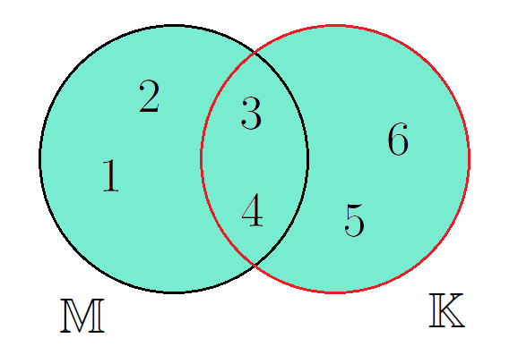

<!--

version:  0.0.1
language: de
narrator: Deutsch Female


logo:     https://raw.githubusercontent.com/MINT-the-GAP/Aufgabensammlung/refs/heads/main/Repetitorium/logo.png
email:    info@bildung-bedeutet-freiheit.de

tags: Repetitorium

comment: Hier entsteht ein mathematisches Repetitorium in LiaScript. https://mint-the-gap.github.io/Aufgabensammlung/

author: Martin Lommatzsch
 


@style
main > *:not(:last-child) {
  margin-bottom: 3rem;
}

input {
    text-align: center;
}

.flex-container {
    display: flex;
    flex-wrap: wrap;
    align-items: stretch;
    gap: 20px;
}

.flex-child {
    flex: 1;
    min-width: 350px;
    margin-right: 20px;
}

@media (max-width: 400px) {
    .flex-child {
        flex: 100%;
        margin-right: 0;
    }
}
@end

formula: \carry   \textcolor{red}{\scriptsize #1}
formula: \digit   \rlap{\carry{#1}}\phantom{#2}#2
formula: \permil  \text{‰}

import: https://raw.githubusercontent.com/LiaTemplates/Tikz-Jax/main/README.md

script: https://cdn.jsdelivr.net/gh/LiaTemplates/Tikz-Jax@main/dist/index.js

import: https://raw.githubusercontent.com/liaTemplates/algebrite/master/README.md

import: https://raw.githubusercontent.com/LiaTemplates/GGBScript/refs/heads/main/README.md
-->


# Repetitorium der Mathematik


> "Die Bildung kommt nicht vom Lesen, sondern vom Nachdenken über das Gelesene." \
-Carl Hilty


> "Gebildet ist der Mensch, der die höchsten Ergebnisse des Geistes in physiologische Reflexe umformt." \
-Nicolás Gómez Dávila


    {{|>}} Dieses Repetitorium der Mathematik ist aus der Motivation heraus entstanden, den naturwissenschaftlichen Unterricht an Schulen zu erleichtern. Die ersten Kapitel führen grundlegende mathematische „Vokabeln“, Zahleneigenschaften, Rechenoperationen und gebräuchliche Abkürzungen ein. Da viele Schülerinnen und Schüler durch die gesellschaftlich verbreitete Meinung, Mathematik und Naturwissenschaften seien „schwierig“, zu Ausreden und geringerer Leistungsbereitschaft neigen, soll in diesem Buch bewusst auf die Einfachheit und Klarheit der mathematischen Sprache hingewiesen werden. Diese Einfachheit erschließt sich jedoch oft erst nach der Schulzeit: Mathematik lebt von eindeutig definierten Begriffen, deren Abkürzungen und Symbolen. Anders als in Sprachen wie Deutsch oder Englisch ergibt sich ihre Bedeutung nicht erst aus dem Satzkontext. Zudem gibt es in der Mathematik im Gegensatz zu anderen Sprachen keine Ausnahmen von den Regeln.

    {{|>}} Das Buch versteht sich als Leitfaden für den Mathematikunterricht und als Wiederholungswerkzeug für die naturwissenschaftlichen Fächer. Es wird kontinuierlich weiterentwickelt und am Verständnis der Lernenden ausgerichtet. Zum Verständnis genügt der sichere Umgang mit Zahlen und Grundrechenarten, sodass das Werk für alle Schülerinnen und Schüler weiterführender Schulen geeignet ist. Es wird deutlich, dass mathematisches Verständnis eng mit der korrekten Verwendung definierter Begriffe verbunden ist. Daher sollte jede eingeführte „Vokabel“ verinnerlicht werden.

    {{|>}} Zu jedem Abschnitt gibt es Übungsaufgaben, deren Lösungen im Anhang stehen. Die Aufgaben sind so gestaltet, dass sie das Verständnis überprüfen und vertiefen; sie sollten vollständig bearbeitet und erst danach mit den Lösungen verglichen werden. In der Geometrie werden auch Zeichenaufgaben gestellt, zu denen im Anhang keine fertigen Zeichnungen enthalten sind. Manche Aufgaben erfordern Kenntnisse aus späteren Kapiteln; diese können nach Erwerb des entsprechenden Wissens bearbeitet werden, um vorhandene Kenntnisse zu festigen und zu erweitern. Oft steigert sich der Schwierigkeitsgrad innerhalb einer Aufgabe, sodass binnendifferenzierte Förderung möglich ist und jede Schülerin und jeder Schüler gefordert und gefördert werden kann.

    {{|>}} Alle *leicht schräg/kursiv* markierten Begriffe sind im mathematischen Wörterverzeichnis im Anhang erläutert. Dieser Abschnitt soll den Umgang mit der mathematischen Sprache erleichtern und deren logischen Aufbau verdeutlichen.

    {{|>}} Abschließend sei angemerkt, dass in Zukunft deutlich mehr Aufgaben mit Lösungen ergänzt werden, darunter auch solche, die auf weiter hinten behandelten Themen basieren. Hierzu werden Querverweise angegeben, um je nach Vorwissen auch komplexere Aufgaben bearbeiten zu können. Grundsätzlich gilt: Alle fehlerfreien Rechenwege sind zugelassen – entscheidend ist das korrekte Ergebnis.


> Diese Version kann inhaltliche und sprachliche Tippfehler enthalten und hat somit keinen Anspruch auf Richtigkeit. Außerdem kann nicht gewährleistet werden, dass der "Lehrplan" jedes Bundeslandes abgedeckt ist.


## Wichtige Hinweise


Einige Themengebiete der Mathematik sind besonders essentiell für ein grundlegendes Verständnis der Mathematik. In diesem Buch werden nach der Einführung diese Themen immer wieder in Aufgaben oder Erklärungen vorkommen. Die Themen sind in der nachfolgenden Auflistung nach Wichtigkeit geordnet. In Klammern sind die Themenbereich beschrieben, die mit dem zentralen Thema direkt verknüpft sind:


- Bruchrechnung
- Äquivalenzumformung
- Einsetzungsverfahren
- Funktionen
- Trigonometrie (Dreiecke)
- Einheiten (Potenzen) 
 
Ohne das Verständnis dieser Themenbereiche lassen sich weiterführende Themen nur schwer erschließen. Wenn diese Themen nicht verinnerlicht wurden, sollten diese weiter erschlossen werden, da im Kern nahezu alle Aufgaben letztendlich auf diesen Grundprinzipien basieren.


## Mengen

Zahlen können in verschiedene Kategorien, sogenannte *Mengen*, eingeordnet werden.  
Dabei bilden die sogenannten *natürlichen Zahlen* die Basis aller anderen *Zahlenmengen*,  
die in der Schule besprochen werden. Die *natürlichen Zahlen* werden durch das Symbol  
$\mathbb{N}$ beschrieben und beinhalten *Zahlen* wie $0, 1, 2, 3, 4, 5, 6, 7, 8, 9, 10, ...$.  

Die mathematische Schreibweise dazu wäre:  
$\mathbb{N} = \left\{0,1,2,\dots\right\}$,  
wobei in den geschweiften *Klammern* $\{\}$ alle *Zahlen* aufgelistet werden, die zur *Zahlenmenge* gehören.  

Oftmals werden die *natürlichen Zahlen* auch ohne Null verwendet und werden im Folgenden als $\mathbb{N}^+$ bezeichnet.  
Die erste Erweiterung der *natürlichen Zahlen* $\mathbb{N}$ sind die *ganzen Zahlen*  
$\mathbb{Z} = \{\dots,-2,-1,0,1,2,\dots\}$.  

Bei genauer Betrachtung fällt auf, dass die *natürlichen Zahlen* $\mathbb{N}$ eine *Teilmenge* der ganzen Zahlen $\mathbb{Z}$ sind.  
Dies wird mit dem *Mengenoperator* $\subset$ ("ist *Teilmenge* von") wie folgt geschrieben:

$$
\mathbb{N} \subset \mathbb{Z}
$$

Die Einführung der *ganzen Zahlen* ist bedeutsam, da die *Subtraktion* damit an Wichtigkeit verliert,  
weil zum Beispiel $-1$ als $+(-1)$ geschrieben werden kann.  

Die Erweiterung der *ganzen Zahlen* $\mathbb{Z}$ sind alle Zahlen, die durch *Brüche* dargestellt werden können.  
Diese Zahlen werden *rationale Zahlen* genannt:  
$\mathbb{Q} = \{\dots, -2, -\frac{3}{2}, -1, -\frac{1}{2}, 0, \frac{1}{7}, 1, 2, \frac{34}{15}, \dots\}$.

$$
\mathbb{N} \subset \mathbb{Z} \subset \mathbb{Q}
$$

Es gibt jedoch auch *Zahlen*, die nicht durch einen *Bruch* dargestellt werden können.  
Diese werden *reelle Zahlen* $\mathbb{R}$ genannt und umfassen zum Beispiel $\pi, \sqrt{2}$ und $\sqrt{3}$.  

Die letzte Erweiterung der *Zahlenmengen* wird durch die Zahl $i=\sqrt{-1}$ gegeben  
und führt zu den *komplexen Zahlen* $\mathbb{C}$.  
*Komplexe Zahlen* werden in der Regel nicht in der Schule besprochen,  
bieten aber Vorteile bei der Beschreibung von Zusammenhängen in der *Analysis*  
(*Analysis* ist eines der großen Teilgebiete der Mathematik neben der *Algebra*).

$$
\mathbb{N} \subset \mathbb{Z} \subset \mathbb{Q} \subset \mathbb{R} \subset \mathbb{C}
$$


### Mengenoperatoren

Es ist möglich *Teilmengen* aufzustellen, dazu werden bestimmte *Mengenoperatoren* wie $\subset$ verwendet.  
Sei die *Menge* $\mathbb{M} = \{1, 2, 3, 4\}$ und die *Menge* $\mathbb{K} = \{3, 4, 5, 6\}$ gegeben, dann existieren folgende *Mengenoperationen*:  

Die *Vereinigung* $\cup$ wird wie folgt dargestellt:

$$
\mathbb{M} \cup \mathbb{K} = \{ 1, 2, 3, 4, 5, 6 \} \quad \text{Vereinigung von $\mathbb{M}$ mit $\mathbb{K}$}
$$

Die *Vereinigung* wird gelesen als:  
"Alle Zahlen, die sich in $\mathbb{M}$ **oder** in $\mathbb{K}$ befinden."  
Das bedeutet, dass alle Zahlen der ersten *Menge* $\mathbb{M}$ und alle Zahlen der zweiten *Menge* $\mathbb{K}$ eine neue *Menge* bilden.  
Das mathematische "oder" unterscheidet sich vom sprachlichen "oder", da es in der Mathematik immer eindeutig dieselbe Bedeutung hat.  
Falls keine *Schnittmenge* vorhanden ist, sind die beiden *Mengen* *disjunkt*.

<center>

</center>


---

Eine weitere *Mengenoperation* ist der *Durchschnitt* $\cap$:

$$
\mathbb{M} \cap \mathbb{K} = \{ 3, 4 \} \quad \text{Durchschnitt von $\mathbb{M}$ und $\mathbb{K}$}
$$

Der *Durchschnitt* wird gelesen als:  
"Alle Zahlen, die sich in $\mathbb{M}$ **und** in $\mathbb{K}$ befinden."

<center>

</center>


In diesem Fall sind nur die $3$ und die $4$ in der resultierenden *Durchschnittsmenge*.

---

Die letzte wichtige *Mengenoperation* ist die *Differenz* $\setminus$:

$$
\mathbb{M} \setminus \mathbb{K} = \{ 1, 2 \} \quad \text{Differenz von $\mathbb{M}$ und $\mathbb{K}$}
$$

Das wird gelesen als:  
"Alle *Zahlen* von $\mathbb{M}$ ohne die *Zahlen* aus $\mathbb{K}$."

<center>

</center>


---

Wenn man die Reihenfolge der *Mengen* umkehrt, ergibt sich ein anderes Bild:

$$
\mathbb{K} \setminus \mathbb{M} = \{ 5, 6 \} \quad \text{Differenz von $\mathbb{K}$ und $\mathbb{M}$}
$$

<center>

</center>


Es wird deutlich, dass bei der *Differenz* von *Mengen* die Reihenfolge entscheidend ist, während sich der *Durchschnitt* und die *Vereinigung* nicht verändern.

---

Nun, da alle wichtigen *Mengenoperationen* eingeführt wurden, folgen noch einige wichtige mathematische Abkürzungen.  
Diese können als **Vokabeln** angesehen werden, die jeder kennen sollte.

Wenn eine Zahl ein *Element* einer *Zahlenmenge* ist, wird dies mathematisch so geschrieben:

$$
4 \in \mathbb{N}
$$

---


Weitere wichtige Abkürzungen der Mathematik werden nun aufgelistet und im Folgenden verwendet:

$$
\begin{align*}
\forall & \quad \text{für alle gilt} \\
\exists & \quad \text{es existiert} \\
\exists ! & \quad \text{es existiert genau ein} \\
\wedge & \quad \text{und} \\
\vee & \quad \text{oder} \\
\neg & \quad \text{nicht} \\
:= & \quad \text{definiert als} \\
\parallel & \quad \text{parallel zu} \\
\perp & \quad \text{orthogonal (senkrecht) zu} \\
\measuredangle & \quad \text{Winkelmaß zwischen} \\
\angle & \quad \text{Winkel zwischen} \\
\varnothing & \quad \text{leere Menge} \\
\Rightarrow & \quad \text{daraus folgt} \\
< & \quad \text{kleiner als} \\
> & \quad \text{größer als} \\
\stackrel{!}{=} & \quad \text{setze gleich} \\
\stackrel{\wedge}{=} & \quad \text{entspricht}
\end{align*}
$$

---

So würde der Satz "Die *Menge* $\mathbb{M}$ beinhaltet alle *Zahlen* $x$, die die Bedingung erfüllen, dass sie *Element* der *reellen Zahlen* sind und dass es genau eine *Zahl* $e$ gibt, durch die man $x$ teilen kann, sodass $1$ dabei herauskommt" mathematisch so aussehen: 


$$
\mathbb{M} = \left\{ x \in \mathbb{R} \ \middle| \ \exists ! e \in \mathbb{R} : \frac{x}{e} = 1 \right\}
$$


---


Mittels dieser Abkürzungen ist es möglich, eine *Zahlenmenge* einzuführen, welche von besonderer Bedeutung ist – die *Primzahlen*.  
Primzahlen sind *natürliche Zahlen* größer als 1, die genau zwei positive Teiler haben: **1** und **sich selbst**.  

Diese *Zahlenmenge* kann wie folgt definiert werden:

$$
\mathbb{P} = \left\{ p \in \mathbb{N} \ \middle| \ p > 1 \ \wedge \ \nexists n \in \mathbb{N},\ 1 < n < p,\ n \mid p \right\}
$$

Dabei gilt:  

- $\mathbb{P}$ bezeichnet die *Menge* der *Primzahlen*.  
- $\mathbb{N}$ bezeichnet die *Menge* der *natürlichen Zahlen*.  
- $n \mid p$ bedeutet "n teilt p ohne Rest".  
- $\nexists$ bedeutet "es existiert kein".  

**Interpretation:**  
Eine *Zahl* $p$ ist genau dann in der *Menge* $\mathbb{P}$, wenn sie größer als 1 ist und es keine *natürliche Zahl* $n$ gibt, die $p$ teilt, außer den *Zahlen* $1$ und $p$ selbst.


### Mengengrenzen


Das *Supremum* ist definiert als die "kleinste oberste Schranke" einer *Zahlenmenge*,  
während das *Infimum* als "größte unterste Schranke" definiert ist.  

Sei als Beispiel dazu folgende *Zahlenmenge* aus *natürlichen Zahlen* betrachtet:  

$$
\mathbb{M} = \left\{ 3,4,5,6,7,8 \right\}
$$

Dann ergibt sich hieraus folgendes *Infimum* und *Supremum*:

$$
\begin{align*}
   \sup  \mathbb{M}  & = 9  \\
   \inf  \mathbb{M}  & = 2  \\
   \Rightarrow \quad  2 & < x  < 9 \quad \forall x \in \mathbb{M}
\end{align*}
$$

---

Hierbei können dem *Supremum* und *Infimum* *Grenzen* auferlegt werden,  
sodass das *Supremum* der Menge $\mathbb{M}$ in den *Grenzen*  
zwischen $3 < x < 6$ und das *Infimum* zwischen $4 < x < 7$ wie folgt geschrieben wird:

$$
\begin{align*}
   \sup_{3<x<6}  \mathbb{M}  & = 7  \\
   \inf_{4<x<7}  \mathbb{M}  & = 3  
\end{align*}
$$

---

Die *Grenzen* müssen nicht ausschließlich (*exklusiv*),  
sondern können auch einschließend (*inklusiv*) sein:

$$
\begin{align*}
   \sup  \mathbb{M}  & = 8  \\
   \inf  \mathbb{M}  & = 3  \\
   \Rightarrow \quad  3 & \leq x  \leq 8 \quad \forall x \in \mathbb{M}
\end{align*}
$$

---

Dabei bildet das *Supremum* die größte *Zahl* der *Menge* und ist gleichzeitig das *Maximum*,  
während das *Infimum* gleich dem *Minimum* ist.  

Somit ergibt sich für inklusive Grenzen:

$$
\begin{align*}
   \sup  \mathbb{M}  & =  \max  \mathbb{M}  \\
   \inf  \mathbb{M}  & =  \min  \mathbb{M}  
\end{align*}
$$

---

> **Hinweis:**  
> Im folgenden Buch werden die Begriffe *Infimum* und *Supremum* lediglich zur Vollständigkeit erwähnt.  
> Sie sind nicht essentiell für ein allgemein bildendes Grundlagenverständnis.


#### Übungsaufgaben zu Mengen


   __Aufgabe 1:__ **Wähle** die kleinste Zahlenmenge **aus**, in der die jeweilige Zahl ist.


<section class="flex-container">
<div class="flex-child">

<!-- data-solution-button="5" -->
__$a)\;\;$__ $ -4 $ [[$\mathbb{N}$|($\mathbb{Z}$)|$\mathbb{Q}$|$\mathbb{R}$]] 

</div>
<div class="flex-child">

<!-- data-solution-button="5" -->
__$b)\;\;$__ $ 6 $ [[($\mathbb{N}$)|$\mathbb{Z}$|$\mathbb{Q}$|$\mathbb{R}$]] 

</div>
<div class="flex-child">

<!-- data-solution-button="5" -->
__$c)\;\;$__ $ 0,03 $ [[$\mathbb{N}$|$\mathbb{Z}$|($\mathbb{Q}$)|$\mathbb{R}$]] 

</div>
<div class="flex-child">

<!-- data-solution-button="5" -->
__$d)\;\;$__ $ \frac{7}{8} $ [[$\mathbb{N}$|$\mathbb{Z}$|($\mathbb{Q}$)|$\mathbb{R}$]] 

</div>
</section>


   __Aufgabe 2:__ **Wähle** die kleinste Zahlenmenge **aus**, in der die jeweilige Zahl ist.


<section class="flex-container">
<div class="flex-child">

<!-- data-solution-button="5" -->
__$a)\;\;$__ $ -\frac{3}{7} $ [[$\mathbb{N}$|$\mathbb{Z}$|($\mathbb{Q}$)|$\mathbb{R}$]] 

</div>
<div class="flex-child">

<!-- data-solution-button="5" -->
__$b)\;\;$__ $ \sqrt{3} $ [[$\mathbb{N}$|$\mathbb{Z}$|$\mathbb{Q}$|($\mathbb{R}$)]] 

</div>
<div class="flex-child">

<!-- data-solution-button="5" -->
__$c)\;\;$__ $ 13^2 $ [[($\mathbb{N}$)|$\mathbb{Z}$|$\mathbb{Q}$|$\mathbb{R}$]] 

</div>
<div class="flex-child">

<!-- data-solution-button="5" -->
__$d)\;\;$__ $ -7 $ [[$\mathbb{N}$|($\mathbb{Z}$)|$\mathbb{Q}$|$\mathbb{R}$]] 

</div>
</section>


   __Aufgabe 3:__ **Wähle** die kleinste Zahlenmenge **aus**, in der die jeweilige Zahl ist.


<section class="flex-container">
<div class="flex-child">

<!-- data-solution-button="5" -->
__$a)\;\;$__ $ 7,23 $ [[$\mathbb{N}$|$\mathbb{Z}$|($\mathbb{Q}$)|$\mathbb{R}$]] 

</div>
<div class="flex-child">

<!-- data-solution-button="5" -->
__$b)\;\;$__ $ -2 $ [[$\mathbb{N}$|($\mathbb{Z}$)|$\mathbb{Q}$|$\mathbb{R}$]] 

</div>
<div class="flex-child">

<!-- data-solution-button="5" -->
__$c)\;\;$__ $ \pi $ [[$\mathbb{N}$|$\mathbb{Z}$|$\mathbb{Q}$|($\mathbb{R}$)]] 

</div>
<div class="flex-child">

<!-- data-solution-button="5" -->
__$d)\;\;$__ $ 3,\bar{3} $ [[$\mathbb{N}$|$\mathbb{Z}$|($\mathbb{Q}$)|$\mathbb{R}$]] 

</div>
</section>


   __Aufgabe 4:__ **Wähle** die kleinste Zahlenmenge **aus**, in der die jeweilige Zahl ist.


<section class="flex-container">
<div class="flex-child">

<!-- data-solution-button="5" -->
__$a)\;\;$__ $ \frac{12}{4} $ [[$(\mathbb{N})$|$\mathbb{Z}$|$\mathbb{Q}$|$\mathbb{R}$]] 

</div>
<div class="flex-child">

<!-- data-solution-button="5" -->
__$b)\;\;$__ $ 0,0001 $ [[$\mathbb{N}$|$\mathbb{Z}$|($\mathbb{Q}$)|$\mathbb{R}$]] 

</div>
<div class="flex-child">

<!-- data-solution-button="5" -->
__$c)\;\;$__ $ -\sqrt{9} $ [[$\mathbb{N}$|($\mathbb{Z}$)|$\mathbb{Q}$|$\mathbb{R}$]] 

</div>
<div class="flex-child">

<!-- data-solution-button="5" -->
__$d)\;\;$__ $ -\sqrt[5]{7} $ [[$\mathbb{N}$|$\mathbb{Z}$|$\mathbb{Q}$|($\mathbb{R}$)]] 

</div>
</section>


   __Aufgabe 5:__ **Wähle** die kleinste Zahlenmenge **aus**, in der der beschriebene Term ist.


<section class="flex-container">
<div class="flex-child">

<!-- data-solution-button="5" -->
__$a)\;\;$__ $ 41:7 + 57:7 \in$ [[$(\mathbb{N})$|$\mathbb{Z}$|$\mathbb{Q}$|$\mathbb{R}$]] 

</div>
<div class="flex-child">

<!-- data-solution-button="5" -->
__$b)\;\;$__ $ \sqrt{49}-11,5 \in$ [[$\mathbb{N}$|$\mathbb{Z}$|($\mathbb{Q}$)|$\mathbb{R}$]] 

</div>
<div class="flex-child">

<!-- data-solution-button="5" -->
__$c)\;\;$__ $ \dfrac{2}{3}-\dfrac{14}{9}-0,\bar{1} \in$ [[$\mathbb{N}$|($\mathbb{Z}$)|$\mathbb{Q}$|$\mathbb{R}$]] 

</div>
<div class="flex-child">

<!-- data-solution-button="5" -->
__$d)\;\;$__ $ \dfrac{8}{7}-\pi  \in$ [[$\mathbb{N}$|$\mathbb{Z}$|$\mathbb{Q}$|($\mathbb{R}$)]] 

</div>
</section>


   __Aufgabe 6:__ **Wähle** die kleinste Zahlenmenge **aus**, in der der beschriebene Term ist.


<section class="flex-container">
<div class="flex-child">

<!-- data-solution-button="5" -->
__$a)\;\;$__ $ \dfrac{3}{8} + 1,625 \in$ [[($\mathbb{N}$)|$\mathbb{Z}$|$\mathbb{Q}$|$\mathbb{R}$]] 

</div>
<div class="flex-child">

<!-- data-solution-button="5" -->
__$b)\;\;$__ $ (-5)^3-\sqrt{81} \in$ [[$\mathbb{N}$|($\mathbb{Z}$)|$\mathbb{Q}$|$\mathbb{R}$]] 

</div>
<div class="flex-child">

<!-- data-solution-button="5" -->
__$c)\;\;$__ $ \dfrac{7}{3}+\dfrac{8}{7} \in$ [[$\mathbb{N}$|$\mathbb{Z}$|($\mathbb{Q}$)|$\mathbb{R}$]] 

</div>
<div class="flex-child">

<!-- data-solution-button="5" -->
__$d)\;\;$__ $ \pi^0-4 \in$ [[$\mathbb{N}$|($\mathbb{Z}$)|$\mathbb{Q}$|$\mathbb{R}$]] 

</div>
</section>


   __Aufgabe 7:__ **Wähle** die kleinste Zahlenmenge **aus**, in der der beschriebene Term ist.


<section class="flex-container">
<div class="flex-child">

<!-- data-solution-button="5" -->
__$a)\;\;$__ $ \sqrt{2^5-3^2} \in$ [[$\mathbb{N}$|$\mathbb{Z}$|$\mathbb{Q}$|($\mathbb{R}$)]] 

</div>
<div class="flex-child">

<!-- data-solution-button="5" -->
__$b)\;\;$__ $ \dfrac{\sqrt{8}+\sqrt{18}}{\sqrt{2}} \in$ [[($\mathbb{N}$)|$\mathbb{Z}$|$\mathbb{Q}$|$\mathbb{R}$]] 

</div>
<div class="flex-child">

<!-- data-solution-button="5" -->
__$c)\;\;$__ $ 0,15-\dfrac{23}{20} \in$ [[$\mathbb{N}$|($\mathbb{Z}$)|$\mathbb{Q}$|$\mathbb{R}$]] 

</div>
<div class="flex-child">

<!-- data-solution-button="5" -->
__$d)\;\;$__ $ 1,\bar{4} + 0,\bar{5} \in$ [[($\mathbb{N}$)|$\mathbb{Z}$|$\mathbb{Q}$|$\mathbb{R}$]] 

</div>
</section>


   __Aufgabe 8:__ **Wähle** die kleinste Zahlenmenge **aus**, in der der beschriebene Term ist.


<section class="flex-container">
<div class="flex-child">

<!-- data-solution-button="5" -->
__$a)\;\;$__ $ -4^3+(-3)^4 \in$ [[($\mathbb{N}$)|$\mathbb{Z}$|$\mathbb{Q}$|$\mathbb{R}$]] 

</div>
<div class="flex-child">

<!-- data-solution-button="5" -->
__$b)\;\;$__ $ \left(\sqrt{7}+\sqrt{11}\right)^2 \in$ [[$\mathbb{N}$|$\mathbb{Z}$|$\mathbb{Q}$|($\mathbb{R}$)]] 

</div>
<div class="flex-child">

<!-- data-solution-button="5" -->
__$c)\;\;$__ $ 8-\sqrt{6,25} \in$ [[$\mathbb{N}$|$\mathbb{Z}$|($\mathbb{Q}$)|$\mathbb{R}$]] 

</div>
<div class="flex-child">

<!-- data-solution-button="5" -->
__$d)\;\;$__ $ -0,45+\sqrt{0,25}+\dfrac{19}{20} \in$ [[($\mathbb{N}$)|$\mathbb{Z}$|$\mathbb{Q}$|$\mathbb{R}$]] 

</div>
</section>


   __Aufgabe 9:__ **Gib** die kleinste beziehungsweise größte Zahl der gegebenen Zahlenmenge **an**. Es gilt $\mathbb{K} \subset \mathbb{N}$.


__$a)\;\;$__ $ \mathbb{K} = \{ 15,28,17,34,26,24,14,32,29,22 \} $\

$\min(\mathbb{K}) = $ [[ 14 ]] \
$\max(\mathbb{K}) = $ [[ 34 ]] \


__$b)\;\;$__ $ \mathbb{K} = \{ 21,24,28,24,26,25,23,24,19,25,27,29,21,22,26 \} $\


$\min(\mathbb{K}) = $ [[ 19 ]] \
$\max(\mathbb{K}) = $ [[ 29 ]] \


__$c)\;\;$__ $ \mathbb{K} = \{ 14,19,16,15,17,15,18,9,19,11,13,17 \} $\


$\min(\mathbb{K}) = $ [[  9 ]] \
$\max(\mathbb{K}) = $ [[ 19 ]] \


   __Aufgabe 10:__ **Gib** die kleinste beziehungsweise größte Zahl der gegebenen Zahlenmenge **an**. Es gilt $\mathbb{K} \subset \mathbb{N}$.


__$a)\;\;$__ $ \mathbb{K} = \{ 83,46,55,64,91,75,61,39,84,55,47 \} $\


$\min(\mathbb{K}) = $ [[ 39 ]] \
$\max(\mathbb{K}) = $ [[ 91 ]] \


__$b)\;\;$__ $ \mathbb{K} = \{ 56,54,55,56,57,55,56,54,53,58,55,56,54,52,56,57 \} $\


$\min(\mathbb{K}) = $ [[ 52 ]] \
$\max(\mathbb{K}) = $ [[ 58 ]] \


__$c)\;\;$__ $ \mathbb{K} = \{ 29,33,28,31,35,24,36,32,28,27,35,34,29,30,35 \} $\


$\min(\mathbb{K}) = $ [[ 24 ]] \
$\max(\mathbb{K}) = $ [[ 36 ]] \


   __Aufgabe 11:__ **Gib** die kleinste beziehungsweise größte Zahl der gegebenen Zahlenmenge **an**. Es gilt $\mathbb{K} \subset \mathbb{N}$.


__$a)\;\;$__ $ \mathbb{K} = \{ 45,39,48,51,37,52,46,50,47,38,43,46,51,39,40 \} $\


$\min(\mathbb{K}) = $ [[ 37 ]] \
$\max(\mathbb{K}) = $ [[ 52 ]] \


__$b)\;\;$__ $ \mathbb{K} = \{ 34,37,31,32,39,33,34,35,38,32,30,34,39,38,34,33,31 \} $\


$\min(\mathbb{K}) = $ [[ 30 ]] \
$\max(\mathbb{K}) = $ [[ 39 ]] \


__$c)\;\;$__ $ \mathbb{K} = \{ 64,67,61,58,60,64,66,68,63,64,60,69,64,65,59,67,68,60 \} $\


$\min(\mathbb{K}) = $ [[ 58 ]] \
$\max(\mathbb{K}) = $ [[ 69 ]] \


   __Aufgabe 12:__ **Gib** die obere beziehungsweise untere Schranke der gegebenen Zahlenmenge **an**. Es gilt $\mathbb{K} \subset \mathbb{N}$.


__$a)\;\;$__ $ \mathbb{K} = \{ 15,28,17,34,26,24,14,32,29,22 \} $\


$\inf(\mathbb{K}) = $ [[ 13 ]] \
$\sup(\mathbb{K}) = $ [[ 35 ]] \


__$b)\;\;$__ $ \mathbb{K} = \{ 21,24,28,24,26,25,23,24,19,25,27,29,21,22,26 \} $\


$\inf(\mathbb{K}) = $ [[ 18 ]] \
$\sup(\mathbb{K}) = $ [[ 30 ]] \


__$c)\;\;$__ $ \mathbb{K} = \{ 14,19,16,15,17,15,18,9,19,11,13,17 \} $\


$\inf(\mathbb{K}) = $ [[  8 ]] \
$\sup(\mathbb{K}) = $ [[ 20 ]] \


   __Aufgabe 13:__ **Gib** die kleinste beziehungsweise größte Zahl der gegebenen Zahlenmenge **an**. Es gilt $\mathbb{K} \subset \mathbb{N}$.


__$a)\;\;$__ $ \mathbb{K} = \{ 83,46,55,64,91,75,61,39,84,55,47 \} $\


$\inf(\mathbb{K}) = $ [[ 38 ]] \
$\sup(\mathbb{K}) = $ [[ 92 ]] \


__$b)\;\;$__ $ \mathbb{K} = \{ 56,54,55,56,57,55,56,54,53,58,55,56,54,52,56,57 \} $\


$\inf(\mathbb{K}) = $ [[ 51 ]] \
$\sup(\mathbb{K}) = $ [[ 59 ]] \


__$c)\;\;$__ $ \mathbb{K} = \{ 29,33,28,31,35,24,36,32,28,27,35,34,29,30,35 \} $\


$\inf(\mathbb{K}) = $ [[ 26 ]] \
$\sup(\mathbb{K}) = $ [[ 37 ]] \


   __Aufgabe 14:__ **Gib** die kleinste beziehungsweise größte Zahl der gegebenen Zahlenmenge **an**. Es gilt $\mathbb{K} \subset \mathbb{N}$.


__$a)\;\;$__ $ \mathbb{K} = \{ 45,39,48,51,37,52,46,50,47,38,43,46,51,39,40 \} $\


$\inf(\mathbb{K}) = $ [[ 36 ]] \
$\sup(\mathbb{K}) = $ [[ 53 ]] \


__$b)\;\;$__ $ \mathbb{K} = \{ 34,37,31,32,39,33,34,35,38,32,30,34,39,38,34,33,31 \} $\


$\inf(\mathbb{K}) = $ [[ 29 ]] \
$\sup(\mathbb{K}) = $ [[ 40 ]] \


__$c)\;\;$__ $ \mathbb{K} = \{ 64,67,61,58,60,64,66,68,63,64,60,69,64,65,59,67,68,60 \} $\


$\inf(\mathbb{K}) = $ [[ 57 ]] \
$\sup(\mathbb{K}) = $ [[ 70 ]] \


   __Aufgabe 1:__ 


## Algebraische Grundlagen

{{|>}} Um den naturwissenschaftlichen Unterricht und mathematischen Erklärungen besser folgen zu können, müssen die Begrifflichkeiten der *Algebra* geklärt werden. Dazu werden im Laufe dieses Kapitels die wichtigsten mathematischen Vokabeln, Abkürzungen und Rechenvorschriften erläutert.


{{|>}} Der Begriff *Algebra* stammt aus dem Arabischen: al-ǧabr bedeutet so viel wie „das Wiederherstellen“ oder „das Ergänzen“. Geprägt wurde er im 9. Jahrhundert durch den persischen Gelehrten Muḥammad ibn Mūsā al-Ḫwārizmī in seinem Werk al-kitāb al-muḫtaṣar fī ḥisāb al-ǧabr wa’l-muqābala („Das kurzgefasste Buch über die Rechenverfahren durch Ergänzen und Ausgleichen“). Darin systematisierte er die Lösung *linearer* und *quadratischer* *Gleichungen* – ein entscheidender Schritt, um Rechnen mit Unbekannten zu einer eigenen Disziplin zu machen.

{{|>}} Die Wurzeln der *Algebra* reichen jedoch weit zurück: Bereits die Babylonier (um 1800 v. Chr.) lösten quadratische Probleme mit geometrischen Methoden, die Griechen entwickelten Proportionenlehre und Zahlentheorie, und indische Mathematiker führten die symbolische Behandlung von Unbekannten weiter aus. Al-Ḫwārizmīs Werk verband diese Traditionen, prägte den Namen und beeinflusste die Entwicklung der *Algebra* in Europa nachhaltig, insbesondere nach Übersetzungen ins Lateinische im 12. Jahrhundert.


### Arithmetik mit natürlichen Zahlen


{{|>}}  *Ziffern* sind die einzelnen Zeichen, die zur Darstellung von Zahlen verwendet werden. Im *Dezimalsystem* gibt es genau zehn *Ziffern*:

$$
0, 1, 2, 3, 4, 5, 6, 7, 8, 9
$$

{{|>}} Eine *Zahl* entsteht erst, wenn eine oder mehrere *Ziffern* in einer bestimmten Anordnung geschrieben werden. Da in unserem Zahlensystem - dem Dezimalsystem - nach der 9 keine weitere neue *Ziffer* kommt muss eine *Zahl* die größer als die 9 ist durch zwei *Ziffern* ausgedrückt werden. Die Position (Stelle) einer *Ziffer* in der *Zahl* bestimmt dabei ihren Wert. Die Stellenwerttafel bildet diese Wertigkeit ab. 


{{|>}} Im *Dezimalsystem* basiert jede Stelle auf *Potenzen* der Zahl 10:

<center>
<!-- data-type="none" 
data-sortable="false" 
style="width:300px" -->
| Tausender | Hunderter | Zehner | Einer |
|-----------|-----------|--------|-------|
| T | H | Z | E |
| $10^3$    | $10^2$    | $10^1$ | $10^0$ |
| $1000$    | $100$    | $10$ | $1$ |
</center>


{{|>}} Die Zahl $4 583$ besteht aus den *Ziffern* $4$, $5$, $8$ und $3$.  
In der Stellenwerttafel:

<center>
<!-- data-type="none" 
data-sortable="false" 
style="width:50px" -->
| T | H | Z | E |
|---|---|---|---|
| 4 | 5 | 8 | 3 |
</center>

Das bedeutet:

$$
4 \cdot 1000 \;+\; 5 \cdot 100 \;+\; 8 \cdot 10 \;+\; 3 \cdot 1
= 4000 + 500 + 80 + 3
$$

{{|>}} *Ziffern* sind somit die Bausteine der Zahldarstellung. *Zahlen* entstehen durch Anordnung von *Ziffern* und Interpretation ihrer Position in einem Stellenwertsystem. Die *Stellenwerttafel* hilft, den Wert jeder Ziffer in einer Zahl zu erkennen.


#### Terme und Gleichungen


{{|>}} Hinter großen Teilen des Verständnis der Mathematik steht das Wissen, was ein *Term* ist. Bei dem Beispiel 

$$
 \begin{equation}
\begin{split} 
4+5 = 3+6 \\ 
 \end{split}
\end{equation}  
$$

{{|>}} handelt es sich um eine *Gleichung* wobei die *Terme* $4+5$ und $3+6$ den gleichen Wert $9$ besitzen. Das *Äquivalenzzeichen* "=" wird oftmals fälschlicherweise als Aufforderung interpretiert, den *Wert des Terms* zu berechnen, doch gibt dieses lediglich die Gleichheit an. 

{{|>}} In einer weiteren Beispielaufgabe stehen drei verschiedene Seillängen mit $3\,$cm, $6\,$cm und $7\,$cm zur Verfügung. Wenn nun der *Term* 

$$
 \begin{equation}
\begin{split} 
\text{$4\cdot 3$\,cm\,+\,$5\cdot 6$\,cm\,+\,$2\cdot 7$\,cm } \\ 
 \end{split}
\end{equation}  
$$


{{|>}} niedergeschrieben wird, dann können dem *Term* verschiedene Informationen entnommen werden. So ist bekannt, dass viermal das $3\,$cm, fünfmal das $6\,$cm und zweimal das $7\,$cm Seilstück verwendet wurde und dass die Seilstücke zusammen eine *Länge* von $56\,$cm besitzen. Es wird deutlich, dass *Terme* auch ohne ein *Äquivalenzzeichen* niedergeschrieben werden können und dennoch eine Bedeutung besitzen. 

{{|>}} Wenn ein *Term* berechnet werden soll, ist eine systematisches Vorgehen zu empfehlen. Hierbei sollten einzelne Schritte visualisiert werden, sodass ein anderer Betrachter schnell die Rechnung nachvollziehen kann. Dies ist im folgenden Beispiel dargestellt:

$$
 \begin{equation}
\begin{split}  
& \;\;\;\; \left(6 \cdot 5 + 9 \cdot 8\right) :3 - 3 \cdot 7  \\
& = \left(30 + 72\right) :3 - 21  \\
& = 102 :3 - 21  \\
& = 34 - 21  \\
& = 13  \\ 
 \end{split}
\end{equation}  
$$

{{|>}} Deutlich zu erkennen ist, dass nach jeder Rechnung eine neue Zeile begonnen wurde und hierbei die *Äquivalenzzeichen* "=" stets untereinander stehen. Auch sind die *Rechenregeln* (wie *Punkt- vor Strichrechnung* und die Beachtung der *Klammern*) erkennbar, da im ersten Schritt alle *Produktwerte*, anschließend der *Summenwert* in der *Klammer* gefolgt vom *Quotientenwert* und abschließend der *Differenzwert* bestimmt wurde.  

{{|>}} Besonders das strukturierte, systematische und nachvollziehbare Niederschreiben von *Termveränderungen* bietet die Möglichkeit neue Erkenntnisse zu generieren und Auffälligkeiten zu entdecken, was ein wesentlicher Bestandteil der Mathematik ist.


#### Runden

    {{|>}} Um Rechnungen mit natürlichen Zahlen $\mathbb{N}$ schnell zu überprüfen lohnt sich die sogenannte Überschlagsrechnung, bei der die Zahlen gerundet werden. Um das *Runden* zu verstehen, muss sich nochmal die Stellenwerttafel vergegenwärtigt werden, da immer bestimmte Stellen betrachtet werden müssen: \


<center>
<!-- data-type="none" 
data-sortable="false" 
style="width:300px" -->
|  Zahl   |   Zehntausender   |  Tausender   |  Hunderter |  Zehner   |  Einer  |
| :-----: | :---------------: | :----------: | :--------: | :-------: | :-----: |
|   35069 |             3     |          5   |         0  |        6  |       9 |
</center>


    {{|>}} Beim *Runden* wird die in der vorherigen Stelle der betrachtete Stelle der Zahl analysiert. Soll also auf Tausender gerundet werden, muss die Hunderterziffer betrachtet werden. Handelt es sich um eine der Ziffern $\left\{0;1;2;3;4\right\}$ wird die betrachtete Stelle abgerundet - sie bleibt also unverändert. Handelt es sich allerdings um $\left\{5;6;7;8;9\right\}$, dann wird aufgerundet - also an der betrachteten Stelle wir die Ziffer um $1$ erhöht. Dies kann begründet werden, dass die Ziffern $\left\{0;1;2;3;4\right\}$ dichter an einer Null sind als an einer Zehn wie $\left\{5;6;7;8;9\right\}$. \


<center>
<!-- data-type="none"
data-sortable="false" 
style="width:300px" -->
|   Zahl    |    Auf Zehner gerundet     |   Auf Hunderter gerundet    | 
|  :-----:  |    :-----:    |   :-----:      |
| $391$     | $\approx 390$ |  $\approx 400$ |
| $382$     | $\approx 380$ |  $\approx 400$ |
| $373$     | $\approx 370$ |  $\approx 400$ |
| $364$     | $\approx 360$ |  $\approx 400$ |
| $355$     | $\approx 360$ |  $\approx 400$ |
| $346$     | $\approx 350$ |  $\approx 300$ |
| $337$     | $\approx 340$ |  $\approx 300$ |
| $328$     | $\approx 330$ |  $\approx 300$ |
| $319$     | $\approx 320$ |  $\approx 300$ |
</center>


    {{|>}} Somit kann eine länger dauernde Rechnung wie folgt dargestellt durch das Runden der Faktoren überschlagen werden: \

$$
\begin{equation}
\begin{split}
6167 \cdot 3139 \approx 6000 \cdot 3000 = 18000000 \\  
 \end{split}
\end{equation}  
$$


Im folgenden Video wird das Beschriebene nochmal anhand von Beispielen erklärt:  \

!?[Runden](https://www.youtube.com/watch?v=lkKLXE5FFes)


##### Übungsaufgaben - Runden


   __Aufgabe 1:__ *Gib* den auf Zehner gerundeten Wert *an*.


<section class="flex-container">
<div class="flex-child">

__$a)\;\;$__

<!-- data-solution-button="5" -->
$534 \approx$ [[  530  ]]

</div>
<div class="flex-child">

__$b)\;\;$__

<!-- data-solution-button="5" -->
$119 \approx$ [[  120  ]]

</div>
<div class="flex-child">

__$c)\;\;$__

<!-- data-solution-button="5" -->
$346 \approx$ [[  350  ]]

</div>
<div class="flex-child">

__$d)\;\;$__

<!-- data-solution-button="5" -->
$971 \approx$ [[  970  ]]

</div>
<div class="flex-child">

__$e)\;\;$__

<!-- data-solution-button="5" -->
$289 \approx$ [[  290  ]]

</div>
<div class="flex-child">

__$f)\;\;$__

<!-- data-solution-button="5" -->
$654 \approx$ [[  650  ]]

</div>
</section>


  __Aufgabe 2:__ *Gib* den auf Hunderter gerundeten Wert *an*.


<section class="flex-container">

<div class="flex-child">

__$a)\;\;$__

<!-- data-solution-button="5" -->
$7664 \approx$ [[7700    ]]

</div>


<div class="flex-child">

__$b)\;\;$__

<!-- data-solution-button="5" -->
$4467 \approx$ [[4500    ]]

</div>


<div class="flex-child">

__$c)\;\;$__

<!-- data-solution-button="5" -->
$2454 \approx$ [[2400    ]]

</div>


<div class="flex-child">

__$d)\;\;$__

<!-- data-solution-button="5" -->
$2163 \approx$ [[2200    ]]

</div>


<div class="flex-child">

__$e)\;\;$__

<!-- data-solution-button="5" -->
$2389 \approx$ [[2400    ]]

</div>


<div class="flex-child">

__$f)\;\;$__

<!-- data-solution-button="5" -->
$15314 \approx$ [[15300    ]]

</div>
</section>


  __Aufgabe 3:__ *Gib* den auf Tausender gerundeten Wert *an*.


<section class="flex-container">

<div class="flex-child">

__$a)\;\;$__

<!-- data-solution-button="5" -->
$78961 \approx$ [[79000    ]]

</div>


<div class="flex-child">

__$b)\;\;$__

<!-- data-solution-button="5" -->
$18207 \approx$ [[18000    ]]

</div>


<div class="flex-child">

__$c)\;\;$__

<!-- data-solution-button="5" -->
$138499 \approx$ [[138000    ]]

</div>


<div class="flex-child">

__$d)\;\;$__

<!-- data-solution-button="5" -->
$316418 \approx$ [[316000    ]]

</div>


<div class="flex-child">

__$e)\;\;$__

<!-- data-solution-button="5" -->
$218640 \approx$ [[219000    ]]

</div>


<div class="flex-child">

__$f)\;\;$__

<!-- data-solution-button="5" -->
$450748 \approx$ [[451000    ]]

</div>


</section>


  __Aufgabe 4:__ *Gib* den auf Zehntausender gerundeten Wert *an*.


<section class="flex-container">

<div class="flex-child">

__$a)\;\;$__

<!-- data-solution-button="5" -->
$464861 \approx$ [[460000    ]]

</div>


<div class="flex-child">

__$b)\;\;$__

<!-- data-solution-button="5" -->
$1103486 \approx$ [[1100000    ]]

</div>


<div class="flex-child">

__$c)\;\;$__

<!-- data-solution-button="5" -->
$1586404 \approx$ [[1590000    ]]

</div>


<div class="flex-child">

__$d)\;\;$__

<!-- data-solution-button="5" -->
$3185048 \approx$ [[3190000    ]]

</div>


<div class="flex-child">

__$e)\;\;$__

<!-- data-solution-button="5" -->
$8075604 \approx$ [[8080000    ]]

</div>


<div class="flex-child">

__$f)\;\;$__

<!-- data-solution-button="5" -->
$3446045 \approx$ [[3450000    ]]

</div>


</section>


  __Aufgabe 5:__ *Gib* den auf die angegebene Stelle gerundeten Wert *an*.


<section class="flex-container">

<div class="flex-child">

__$a)\;\;$__

<!-- data-solution-button="5" -->
Auf Tausender: $78163 \approx$ [[78000    ]]

</div>


<div class="flex-child">

__$b)\;\;$__

<!-- data-solution-button="5" -->
Auf Zehner: $78163 \approx$ [[78160    ]]

</div>


<div class="flex-child">

__$c)\;\;$__

<!-- data-solution-button="5" -->
Auf Hunderter: $29963 \approx$ [[30000    ]]

</div>


<div class="flex-child">

__$d)\;\;$__

<!-- data-solution-button="5" -->
Auf Tausender: $499 \approx$ [[    0    ]]

</div>


<div class="flex-child">

__$e)\;\;$__

<!-- data-solution-button="5" -->
Auf Zehner: $55164 \approx$ [[55160    ]]

</div>


<div class="flex-child">

__$f)\;\;$__

<!-- data-solution-button="5" -->
Auf Tausender: $854684 \approx$ [[855000    ]]

</div>


</section>


  __Aufgabe 6:__ *Gib* den auf die angegebene Stelle gerundeten Wert *an*.


<section class="flex-container">

<div class="flex-child">

__$a)\;\;$__

<!-- data-solution-button="5" -->
Auf Hunderter: $54164 \approx$ [[54200    ]]

</div>


<div class="flex-child">

__$b)\;\;$__

<!-- data-solution-button="5" -->
Auf Hunderttausender: $54164 \approx$ [[100000    ]]

</div>


<div class="flex-child">

__$c)\;\;$__

<!-- data-solution-button="5" -->
Auf Zehner: $8431 \approx$ [[8430      ]]

</div>


<div class="flex-child">

__$d)\;\;$__

<!-- data-solution-button="5" -->
Auf Millionen: $47081 \approx$ [[    0    ]]

</div>


<div class="flex-child">

__$e)\;\;$__

<!-- data-solution-button="5" -->
Auf Hunderter: $94516 \approx$ [[94500    ]]

</div>


<div class="flex-child">

__$f)\;\;$__

<!-- data-solution-button="5" -->
Auf Zehntausender: $998146 \approx$ [[1000000    ]]

</div>


</section>


  __Aufgabe 7:__ *Gib* den auf die angegebene Stelle gerundeten Wert in den freien Tabellenfeldern *an*.


<!-- data-type="none"
data-sortable="false" 
data-solution-button="5"-->
|   Zahl    |    Zehner     |   Hunderter    |   Tausender    |   Zehntausender    |   Hunderttausender   |
|  :-----:  |    :-----:    |   :-----:      |     :-----:    |     :-----:        |       :-----:        |
| $548062$  | [[ 548060  ]] |  [[ 548100  ]] | [[ 548000  ]]  |    [[ 550000  ]]   |     [[ 500000  ]]    |
| $48991$   | [[ 48990   ]] |  [[ 49000   ]] | [[ 49000   ]]  |    [[ 50000   ]]   |     [[   0     ]]    |
| $5184612$ | [[ 5184610 ]] |  [[ 5184600 ]] | [[ 5185000 ]]  |    [[ 5180000 ]]   |     [[ 5200000 ]]    |
|  $84151$  | [[ 84150   ]] |  [[ 84200   ]] | [[ 84000   ]]  |    [[ 80000   ]]   |     [[ 100000  ]]    |
| $2504468$ | [[ 2504470 ]] |  [[ 2504500 ]] | [[ 2504000 ]]  |    [[ 2500000 ]]   |     [[ 2500000 ]]    |


  __Aufgabe 8:__ *Gib* den auf die angegebene Stelle gerundeten Wert in den freien Tabellenfeldern *an*.


<!-- data-type="none"
data-sortable="false"  
data-solution-button="5"-->
|   Zahl    |    Zehner     |   Hunderter    |   Tausender    | Zehntausender | Hunderttausender |
|  :-----:  |    :-----:    |   :-----:      |     :-----:    |   :-----:     |     :-----:      |
| $278849$  | [[ 278850  ]] |  [[ 278800  ]] | [[ 279000  ]]  |  [[ 280000 ]] |   [[ 300000  ]]  |
| $67948$   | [[ 67950   ]] |  [[ 67900   ]] | [[ 68000   ]]  |  [[ 70000  ]] |   [[ 100000  ]]  |
| $126443$  | [[ 126440  ]] |  [[ 126400  ]] | [[ 126000  ]]  |  [[ 130000 ]] |   [[ 100000  ]]  |
|  $24367$  | [[ 24370   ]] |  [[ 24400   ]] | [[ 24000   ]]  |  [[ 20000  ]] |   [[ 0       ]]  |
| $2306637$ | [[ 2306640 ]] |  [[ 2306600 ]] | [[ 2307000 ]]  |  [[ 231000 ]] |   [[ 2300000 ]]  |


  __Aufgabe 9:__ Gegeben sei eine gerundete Zahl. *Gib* jeweils die kleinste und die größte Zahl *an*, die nach dem Runden zur gegebenen Zahl wird.


<!-- data-type="none"
data-sortable="false"  
data-solution-button="5"-->
| gerundete Zahl | wurde gerundete auf | kleinste Zahl |  größte Zahl  |
|  :----------:  | :-----------------: | :-----------: |  :---------:  |
|    $445000$    |      Tausender      | [[ 444500  ]] | [[ 445499  ]] |
|      $1700$    |      Hunderter      | [[   1650  ]] | [[ 1749    ]] |
|    $5000000$   |      Millionen      | [[ 4500000 ]] | [[ 5499999 ]] |
|      $1970$    |        Zehner       | [[ 1965    ]] | [[ 1974    ]] |
|    $780000$    |    Zehntausender    | [[ 775000  ]] | [[ 784999  ]] |


  __Aufgabe 10:__ Gegeben sei eine gerundete Zahl. *Gib* jeweils die kleinste und die größte Zahl *an*, die nach dem Runden zur gegebenen Zahl wird.


<!-- data-type="none"
data-sortable="false"  
data-solution-button="5"-->
| gerundete Zahl | wurde gerundete auf | kleinste Zahl |  größte Zahl  |
|  :----------:  | :-----------------: | :-----------: |  :---------:  |
|    $6000000$   |  Hunderttausender   | [[ 5950000 ]] | [[ 6049999 ]] |
|      $100$     |        Zehner       | [[   50   ]]  | [[  149    ]] |
|    $794000$    |      Tausender      | [[ 793500  ]] | [[ 794499  ]] |
|      $0$       |      Tausender      | [[ 0       ]] | [[ 499     ]] |
|      $6400$    |      Hunderter      | [[ 6350    ]] | [[ 6449    ]] |


#### Addition

    {{|>}} Die *Addition* ist die wichtigste Grundrechenart und lässt *Zahlen* größer als Eins überhaupt erst erfassbar werden, was am *Zahlenstrahl* schnell erkannt werden kann. Direkt hier wird schon deutlich, dass die Null das *neutrale Element* der *Addition* ist, da eine *Addition* von Null den *Wert des Terms* nicht verändert: $1+0=1$. \


<center>

```latex  @tikz

\begin{tikzpicture}[>=latex, scale=2] 

  \node at (-0.75,-1.25) {};
  \node at (7.5, 0.95) {};

    \draw[->, black!100, thick] (0,0) --  (6.5,0) node[right] {\large$x$};

\draw[-, black!100,thick]  ( 0,0.1) -- ( 0,-0.1) node[below] {\large$0$};
\draw[-, black!100,thick]  ( 1,0.1) -- ( 1,-0.1) node[below] {\large$1$};
\draw[-, black!100,thick]  ( 2,0.1) -- ( 2,-0.1) node[below] {\large$2$};
\draw[-, black!100,thick]  ( 3,0.1) -- ( 3,-0.1) node[below] {\large$3$}; 
\draw[-, black!100,thick]  ( 4,0.1) -- ( 4,-0.1) node[below] {\large$4$}; 
\draw[-, black!100,thick]  ( 5,0.1) -- ( 5,-0.1) node[below] {\large$5$}; 
\draw[-, black!100,thick]  ( 6,0.1) -- ( 6,-0.1) node[below] {\large$6$}; 

\draw[->, black!100,thick] (0,0.3) to[out=20,in=160] (1,0.3) ; \node at (0.5,0.5) {\large$+1$};
\draw[->, black!100,thick] (1,0.3) to[out=20,in=160] (2,0.3) ; \node at (1.5,0.5) {\large$+1$};
\draw[->, black!100,thick] (2,0.3) to[out=20,in=160] (3,0.3) ; \node at (2.5,0.5) {\large$+1$};

\end{tikzpicture} 

```
</center>


    {{|>}} Mit der *Addition* werden *Zahlen* zusammengezählt, was immer durch den *Additionsoperator* $+$ beschrieben wird. Der gesamte *Term* ist die sogenannte *Summe*, während der *Wert der Summe* immer auf der anderen Seite eines *Gleichheitszeichen* $=$ geschrieben wird. \


$$
\begin{equation}
\begin{split}
\underbrace{\text{Summand} + \text{Summand}}_{\text{Summe}}  & = \text{Wert der Summe} \\ 
 \end{split}
\end{equation}  
$$

Als Beispiel mit *Zahlen*:

$$
\begin{equation}
\begin{split} 
  2+4 &= 6   \\
 \end{split}
\end{equation}  
$$


    {{|>}} Im Beispiel aus Gleichung ist zu sehen, dass die Zwei mit der Vier zusammengezählt wurde, wie es der *Additionsoperator* $+$ (gesprochen "plus") gefordert hat. Am *Zahlenstrahl* verdeutlicht wird deutlich, dass vom ersten *Summanden* aus Schritte im *Wert* vom zweiten *Summanden* nach rechts gegangen wird, um beim *Wert der Summe* zu enden. \

<center>

```latex  @tikz

\begin{tikzpicture}[>=latex, scale=2] 

  \node at (-0.75,-1.25) {};
  \node at (7.5, 0.95) {};

    \draw[->, black!100, thick] (0,0) --  (6.5,0) node[right] {\large$x$};

\draw[-, black!100,thick]  ( 0,0.1) -- ( 0,-0.1) node[below] {\large$0$};
\draw[-, black!100,thick]  ( 1,0.1) -- ( 1,-0.1) node[below] {\large$1$};
\draw[-, black!100,thick]  ( 2,0.1) -- ( 2,-0.1) node[below] {\large$2$};
\draw[-, black!100,thick]  ( 3,0.1) -- ( 3,-0.1) node[below] {\large$3$}; 
\draw[-, black!100,thick]  ( 4,0.1) -- ( 4,-0.1) node[below] {\large$4$}; 
\draw[-, black!100,thick]  ( 5,0.1) -- ( 5,-0.1) node[below] {\large$5$}; 
\draw[-, black!100,thick]  ( 6,0.1) -- ( 6,-0.1) node[below] {\large$6$}; 

\draw[->, black!100,thick] (2,-0.4) to[out=340,in=200] (6,-0.4) ; \node at (4,-1.00) {\large$+4$};

\end{tikzpicture} 

```
</center>

    {{|>}} Bei der *Darstellung* am *Zahlenstrahl* wird deutlich, dass die *Addition* das *Assoziativgesetz* sowie das *Kommutativgesetz* erfüllt. \


*Kommutativgesetz* für die *Additon*: 

$$
\begin{equation}
\begin{split} 
  a+b=b+a   \\
 \end{split}
\end{equation}  
$$

Folgendes Beispiel des *Kommutativgesetzes* ist am *Zahlenstrahl* dargestellt:

$$
\begin{equation}
\begin{split} 
  2+4=4+2   \\
 \end{split}
\end{equation}  
$$

<center>

```latex  @tikz

\begin{tikzpicture}[>=latex, scale=2] 

  \node at (-0.75,-1.25) {};
  \node at (7.5, 0.95) {};

    \draw[->, black!100, thick] (0,0) --  (6.5,0) node[right] {\large$x$};

\draw[-, black!100,thick]  ( 0,0.1) -- ( 0,-0.1) node[below] {\large$0$};
\draw[-, black!100,thick]  ( 1,0.1) -- ( 1,-0.1) node[below] {\large$1$};
\draw[-, black!100,thick]  ( 2,0.1) -- ( 2,-0.1) node[below] {\large$2$};
\draw[-, black!100,thick]  ( 3,0.1) -- ( 3,-0.1) node[below] {\large$3$}; 
\draw[-, black!100,thick]  ( 4,0.1) -- ( 4,-0.1) node[below] {\large$4$}; 
\draw[-, black!100,thick]  ( 5,0.1) -- ( 5,-0.1) node[below] {\large$5$}; 
\draw[-, black!100,thick]  ( 6,0.1) -- ( 6,-0.1) node[below] {\large$6$}; 

\draw[->, black!100,thick] (2,-0.4) to[out=340,in=200] (6,-0.4) ; \node at (4,-1.00) {\large$+4$};

\draw[->, black!100,thick] (4,0.3) to[out=20,in=160] (6,0.3) ; \node at (5,0.750) {\large$+2$};

\end{tikzpicture} 

```
</center>


*Assoziativgesetz* für die *Additon*: 

$$
\begin{equation}
\begin{split} 
  a+b+c=(a+b)+c=a+(b+c)   \\
 \end{split}
\end{equation}  
$$

Folgendes Beispiel des *Assoziativgesetzes* ist am *Zahlenstrahl* dargestellt:

$$
\begin{equation}
\begin{split} 
  1+1+4=1+(1+4)   \\
 \end{split}
\end{equation}  
$$  
<center>

```latex  @tikz

\begin{tikzpicture}[>=latex, scale=2] 

  \node at (-0.75,-1.25) {};
  \node at (7.5, 1.35) {};

    \draw[->, black!100, thick] (0,0) --  (6.5,0) node[right] {\large$x$};

\draw[-, black!100,thick]  ( 0,0.1) -- ( 0,-0.1) node[below] {\large$0$};
\draw[-, black!100,thick]  ( 1,0.1) -- ( 1,-0.1) node[below] {\large$1$};
\draw[-, black!100,thick]  ( 2,0.1) -- ( 2,-0.1) node[below] {\large$2$};
\draw[-, black!100,thick]  ( 3,0.1) -- ( 3,-0.1) node[below] {\large$3$}; 
\draw[-, black!100,thick]  ( 4,0.1) -- ( 4,-0.1) node[below] {\large$4$}; 
\draw[-, black!100,thick]  ( 5,0.1) -- ( 5,-0.1) node[below] {\large$5$}; 
\draw[-, black!100,thick]  ( 6,0.1) -- ( 6,-0.1) node[below] {\large$6$}; 

\draw[->, black!100,thick] (1,-0.4) to[out=340,in=200] (2,-0.4) ; \node at (1.5,-1.00) {\large$+1$};
\draw[->, black!100,thick] (2,-0.4) to[out=340,in=200] (6,-0.4) ; \node at (4,-1.00) {\large$+4$};

\draw[->, black!100,thick] (1,0.3) to[out=20,in=160] (6,0.3) ; \node at (3.5,1.00) {\large$+1+4$};

\end{tikzpicture} 

```
</center>


    {{|>}} Für größere *Zahlen* lohnt sich eine Schreibweise, die die *Zahlen*, die *addiert* werden sollen, entsprechtend ihrer Position in der Stellenwerttafel untereinander schreibt. Dabei wird der *Wert des Terms* unter einem Strich ausgerechnet.\


<!-- data-type="none" 
data-sortable="false" -->
|  Tausender   |  Hunderter |  Zehner   |  Einer  |    |
| :----------: | :--------: | :-------: | :-----: | :-----: |
|       $1$      |      $3$     |    $4$      |    $7$    |    1. Summand    |
|       $4$      |      $2$     |    $6$      |    $5$    |    2. Summand    |
|       $5$      |      $5$     | $\textcolor{red}{1}0$ |    $\textcolor{red}{1}2$    |    Einzelziffersummen    |
|       $5$      |      $6$     |    $1$      |    $2$    |    Wert der Summe    |

    {{|>}} Außerhalb der *Stellenwerttafel* wirkt die Rechnung der schriftlichen *Addition* übersichtlicher: \


$$
\begin{equation}
\begin{split}
 1347&   \\
+4265& \\ \hline
+\hspace{0.5em}\hspace{0.5em}\textcolor{red}{1}2& \\ 
+\hspace{0.5em}\textcolor{red}{1}0\hspace{0.5em}& \\ 
+\hspace{0.5em}5\hspace{0.5em}\hspace{0.5em}& \\ 
+5\hspace{0.5em}\hspace{0.5em}\hspace{0.5em}& \\ \hline
5612& \\
 \end{split}
\end{equation}  
$$


    {{|>}} Dies kann noch wie folgt verkürzt geschrieben werden: \

$$
\begin{equation}
\begin{split}
1347&   \\
+4265& \\ 
	\textcolor{red}{11}\hspace{0.5em}\hspace{0.5em}&  \\ \hline
5612& \\
 \end{split}
\end{equation}  
$$


     {{|>}} Bei dieser Art der Schreibweise, werden die *Zahlen*, die entsprechend ihrer Position in der *Stellenwerttafel* untereinander stehen, einzeln *addiert*. Dabei wird immer bei der *Ziffern* der kleinsten Position in der *Stellenwerttafel* begonnen. Dies ist sind stets die *Ziffern*, die am weitesten rechts bei den *Zahlen* stehen. Wenn die *addierte* Zahl höher ist als Neun, dann wird die Eins der Zehn zur nächsten Zahlenspalte hinzugezählt. Diese Eins wird auch oft Merkeins genannt und ist in der Beispielrechnung rot eingefärbt. Der Vorteil dieser Schreibweise ist es, dass niemals höhere *Zahlen* als $9$ und $9$ *addiert* werden können. Folglich benötigt der Schüler nur ein sehr gutes Zahlenverständnis von der Zahl $0$ bis $18$ um jegliche Additionsaufgabe zu lösen. Falls mehr als zwei *Summanden* (im Beispiel sind $1337$ und $4265$ die *Summanden*) vorkommen ist es immer erlaubt in einer Nebenrechnung zunächst nur zwei *Summanden* zu *addieren* um dann anschließend die *Summe* der ersten beiden *Summanden* mit der nächsten *Summanden* zu verrechnen. \


Im folgenden Video wird das Beschriebene nochmal anhand von Beispielen erklärt: \

!?[Addition](https://www.youtube.com/watch?v=Tn9xv6jSyyI)


##### Übungen - Addition

  __Aufgabe 1:__ *Berechne* den Wert des Terms.


<section class="flex-container">

<div class="flex-child">
$a)\;\;$

<!-- data-solution-button="5"-->
$3821 + 1347=$[[  5168  ]] 
</div>

<div class="flex-child">
$b)\;\;$

<!-- data-solution-button="5"-->
$5962 + 8912=$[[  14874  ]] 
</div>

<div class="flex-child">
$c)\;\;$

<!-- data-solution-button="5"-->
$2512 + 3246=$[[  5758  ]] 
</div>

<div class="flex-child">
$d)\;\;$

<!-- data-solution-button="5"-->
$2353 + 4636=$[[  6989  ]] 
</div>

<div class="flex-child">
$e)\;\;$

<!-- data-solution-button="5"-->
$4462 + 9543=$[[  14005  ]] 
</div>

<div class="flex-child">
$f)\;\;$

<!-- data-solution-button="5"-->
$4156 + 3737=$[[  7893  ]] 
</div>

<div class="flex-child">
$g)\;\;$

<!-- data-solution-button="5"-->
$9948 + 5499=$[[  15447  ]] 
</div>

<div class="flex-child">
$h)\;\;$

<!-- data-solution-button="5"-->
$4784 + 8377=$[[  13161  ]] 
</div>


<div class="flex-child">
$i)\;\;$

<!-- data-solution-button="5"-->
$8437 + 4567=$[[  13004  ]] 
</div>

</section>


  __Aufgabe 2:__ *Berechne* den Wert des Terms.


<section class="flex-container">
<div class="flex-child">
$a)\;\;$

<!-- data-solution-button="5"-->
$3821 + 1347=$[[  5168  ]] 
</div>

<div class="flex-child">
$b)\;\;$

<!-- data-solution-button="5"-->
$5962 + 8912=$[[  14874  ]] 
</div>

<div class="flex-child">
$c)\;\;$

<!-- data-solution-button="5"-->
$2512 + 3246=$[[  5758  ]] 
</div>

<div class="flex-child">
$d)\;\;$

<!-- data-solution-button="5"-->
$2353 + 4636=$[[  6989  ]] 
</div>

<div class="flex-child">
$e)\;\;$

<!-- data-solution-button="5"-->
$4462 + 9543=$[[  14005  ]] 
</div>

<div class="flex-child">
$f)\;\;$

<!-- data-solution-button="5"-->
$4156 + 3737=$[[  7893  ]] 
</div>

<div class="flex-child">
$g)\;\;$

<!-- data-solution-button="5"-->
$9948 + 5499=$[[  15447  ]] 
</div>

<div class="flex-child">
$h)\;\;$

<!-- data-solution-button="5"-->
$4784 + 8377=$[[  13161  ]] 
</div>

<div class="flex-child">
$i)\;\;$

<!-- data-solution-button="5"-->
$9745 + 3726=$[[  13471  ]] 
</div>

</section>


  __Aufgabe 3:__ *Berechne* den Wert des Terms.


<section class="flex-container">
<div class="flex-child">
$a)\;\;$

<!-- data-solution-button="5"-->
$2634 + 5897=$[[  8531  ]] 
</div>

<div class="flex-child">
$b)\;\;$

<!-- data-solution-button="5"-->
$7185 + 4268=$[[  11453  ]] 
</div>

<div class="flex-child">
$c)\;\;$

<!-- data-solution-button="5"-->
$3492 + 8051=$[[  11543  ]] 
</div>

<div class="flex-child">
$d)\;\;$

<!-- data-solution-button="5"-->
$5924 + 7813=$[[  13737  ]] 
</div>

<div class="flex-child">
$e)\;\;$

<!-- data-solution-button="5"-->
$1847 + 9635=$[[  11482  ]] 
</div>

<div class="flex-child">
$f)\;\;$

<!-- data-solution-button="5"-->
$4076 + 2559=$[[  6635  ]] 
</div>

<div class="flex-child">
$g)\;\;$

<!-- data-solution-button="5"-->
$8321 + 1746=$[[  10067  ]] 
</div>

<div class="flex-child">
$h)\;\;$

<!-- data-solution-button="5"-->
$7560 + 4983=$[[  12543  ]] 
</div>

<div class="flex-child">
$i)\;\;$

<!-- data-solution-button="5"-->
$6214 + 3879=$[[  10093  ]] 
</div>

</section>


#### Subtraktion

    {{|>}} Die *Subtraktion*<!-- title="Test" --> ist die Umkehroperation der *Addition* und wird durch den *Subtraktionsoperator* $-$ (gesprochen "minus") beschrieben. Auch bei der *Subtraktion* ist somit die Null das *neutrale Element* der *Subktration*, da eine *Subktraktion* mit Null den *Wert des Terms* nicht verändert: $1-0=1$. Auf dem Zahlenstrahl wird somit die Richtung der Schritte der Addition von links nach rechts umgekehrt: \


<center>

```latex  @tikz

\begin{tikzpicture}[>=latex, scale=2] 

  \node at (-0.75,-1.25) {};
  \node at (7.5, 0.95) {};

    \draw[->, black!100, thick] (0,0) --  (6.5,0) node[right] {\large$x$};

\draw[-, black!100,thick]  ( 0,0.1) -- ( 0,-0.1) node[below] {\large$0$};
\draw[-, black!100,thick]  ( 1,0.1) -- ( 1,-0.1) node[below] {\large$1$};
\draw[-, black!100,thick]  ( 2,0.1) -- ( 2,-0.1) node[below] {\large$2$};
\draw[-, black!100,thick]  ( 3,0.1) -- ( 3,-0.1) node[below] {\large$3$}; 
\draw[-, black!100,thick]  ( 4,0.1) -- ( 4,-0.1) node[below] {\large$4$}; 
\draw[-, black!100,thick]  ( 5,0.1) -- ( 5,-0.1) node[below] {\large$5$}; 
\draw[-, black!100,thick]  ( 6,0.1) -- ( 6,-0.1) node[below] {\large$6$}; 

\draw[->, black!100,thick] (5,0.3) to[out=160,in=20] (4,0.3) ; \node at (4.5,0.5) {\large$-1$};
\draw[->, black!100,thick] (4,0.3) to[out=160,in=20] (3,0.3) ; \node at (3.5,0.5) {\large$-1$};
\draw[->, black!100,thick] (3,0.3) to[out=160,in=20] (2,0.3) ; \node at (2.5,0.5) {\large$-1$};

\end{tikzpicture} 

```
</center>


    {{|>}} Der gesamte *Term* ist die sogenannte *Differenz*, während der *Wert der Differenz* immer auf der anderen Seite eines *Gleichheitszeichen* $=$ geschrieben wird. Vom *Minuenden* wird dabei der *Subtrahend* abgezogen. \


$$
\begin{equation}
\begin{split}
\underbrace{\text{Minuend} - \text{Subtrahend}}_{\text{Differenz}}  & = \text{Wert der Differenz} \\ 
 \end{split}
\end{equation}  
$$

Als Beispiel mit *Zahlen*:

$$
\begin{equation}
\begin{split} 
  5 - 2 = 3   \\
 \end{split}
\end{equation}  
$$


<center>

```latex  @tikz

\begin{tikzpicture}[>=latex, scale=2] 

  \node at (-0.75,-1.25) {};
  \node at (7.5, 0.95) {};

    \draw[->, black!100, thick] (0,0) --  (6.5,0) node[right] {\large$x$};

\draw[-, black!100,thick]  ( 0,0.1) -- ( 0,-0.1) node[below] {\Large$0$};
\draw[-, black!100,thick]  ( 1,0.1) -- ( 1,-0.1) node[below] {\LARGE$1$};
\draw[-, black!100,thick]  ( 2,0.1) -- ( 2,-0.1) node[below] {\Huge$2$};
\draw[-, black!100,thick]  ( 3,0.1) -- ( 3,-0.1) node[below] {\large$3$}; 
\draw[-, black!100,thick]  ( 4,0.1) -- ( 4,-0.1) node[below] {\large$4$}; 
\draw[-, black!100,thick]  ( 5,0.1) -- ( 5,-0.1) node[below] {\large$5$}; 
\draw[-, black!100,thick]  ( 6,0.1) -- ( 6,-0.1) node[below] {\large$6$}; 

\draw[->, black!100,thick] (5,0.3) to[out=160,in=20] (2,0.3) ; \node at (3.5,0.75) {\large$-3$};

\end{tikzpicture} 

```
</center>


    {{|>}} Wie schon an den unterschiedlichen Bezeichnungen *Minuend* sowie *Subtrahend* zu erahnen ist, ist die *Subtraktion* wieder *kommutativ* noch *assoziativ*. \


$$
\begin{equation}
\begin{split}
  a-b & \neq b-a   \\
  a-b-c & \neq a-(b-c)  \\
 \end{split}
\end{equation}  
$$


    {{|>}} Auch bei der schriftlichen *Subtraktion* werden die Ziffern startend von der kleinsten Position in der *Stellenwerttafel* bearbeitet. Dabei kann die jeweilige *Ziffer* des *Subtrahenden* größer sein als die des *Minuenden*, wie in der zweiten Ziffernspalte. Hierbei ist die Zahl $6$ statt von der $3$ von der $13$ zu *subtrahieren*. Die dazu geschriebene Zehn muss anschließend von der nächsten Ziffernspalte abgezogen werden, was durch die Merkeins in rot wieder symbolisiert wird.


$$
\begin{equation}
\begin{split}
 6337&   \\
-4265& \\ 
	\textcolor{red}{1}\hspace{0.5em}\hspace{0.5em}&  \\ \hline
2072& \\
 \end{split}
\end{equation}  
$$


    {{|>}} Auch bei der *Subtraktion* kann es vorkommen, dass mehrere *Subtrahenden* vorzufinden sind. Dabei sind zwei Arten von Nebenrechnungen zulässig: Die erste Variante sieht vor, dass die *Subtrahenden* nacheinander vom *Minuenden* *subtrahiert* werden, während die zweite Variante vorsieht, dass die *Subtrahenden* *addiert* werden und anschließend die *Summe* der *Subtrahenden* vom *Minuend* abgezogen werden. 

Beispiele der ersten Variante:
$$
\begin{equation}
\begin{split}
  a - b - c &= (a - b) - c     \\
  874 - 125 - 236 &= (874 - 125) - 236      \\
 &\\
  a - b - c - d &= ((a - b) - c) - d      \\
  874 - 125 - 236 - 58 &= ((874 - 125) - 236) - 58      \\
 \end{split}
\end{equation}  
$$


Beispiele der zweiten Variante:
$$
\begin{equation}
\begin{split}
  a - b - c &= a - (b + c)     \\
  874 - 125 - 236 &= 874 - (125 + 236)     \\
 &\\
  a - b - c - d &= a - (b + c + d)     \\
  874 - 125 - 236 - 58 &= 874 - (125 + 236 + 58)     \\
 \end{split}
\end{equation}  
$$


    {{|>}} Beim schriftlichen *Subtrahieren* kann maximal die *Ziffer* $9$ als *Subtrahend* der einzelnen Spalten auftauchen. Somit ist die größte Zahl von der abgezogen werden kann die $18$. Folglich wird lediglich ein gutes Zahlenverständnis bei der *Subtraktion* von den Zahlen $0$ bis $18$ benötigt. \


Im folgenden Video wird das Beschriebene nochmal anhand von Beispielen erklärt:  \

!?[Subtraktion](https://www.youtube.com/watch?v=a2Nwh8npSUo)


##### Übungen - Subtraktion


  __Aufgabe 1:__ *Berechne* den Wert des Terms.


<section class="flex-container">

<div class="flex-child">
$a)\;\;$

<!-- data-solution-button="5"-->
$8642 - 3210=$[[  5432  ]] 
</div>

<div class="flex-child">
$b)\;\;$

<!-- data-solution-button="5"-->
$9753 - 6421=$[[  3332  ]] 
</div>

<div class="flex-child">
$c)\;\;$

<!-- data-solution-button="5"-->
$8642 - 4200=$[[  4442  ]] 
</div>

<div class="flex-child">
$d)\;\;$

<!-- data-solution-button="5"-->
$7531 - 4210=$[[  3321  ]] 
</div>

<div class="flex-child">
$e)\;\;$

<!-- data-solution-button="5"-->
$8640 - 4200=$[[  4440  ]] 
</div>

<div class="flex-child">
$f)\;\;$

<!-- data-solution-button="5"-->
$9751 - 6420=$[[  3331  ]] 
</div>

<div class="flex-child">
$g)\;\;$

<!-- data-solution-button="5"-->
$8643 - 4201=$[[  4442  ]] 
</div>

<div class="flex-child">
$h)\;\;$

<!-- data-solution-button="5"-->
$7532 - 4210=$[[  3322  ]] 
</div>

<div class="flex-child">
$i)\;\;$

<!-- data-solution-button="5"-->
$9754 - 6421=$[[  3333  ]] 
</div>

</section>


  __Aufgabe 2:__ *Berechne* den Wert des Terms.


<section class="flex-container">

<div class="flex-child">
$a)\;\;$

<!-- data-solution-button="5"-->
$8427 - 3958=$[[  4469  ]] 
</div>

<div class="flex-child">
$b)\;\;$

<!-- data-solution-button="5"-->
$7534 - 2867=$[[  4667  ]] 
</div>

<div class="flex-child">
$c)\;\;$

<!-- data-solution-button="5"-->
$9615 - 4879=$[[  4736  ]] 
</div>

<div class="flex-child">
$d)\;\;$

<!-- data-solution-button="5"-->
$7251 - 3684=$[[  3567  ]] 
</div>

<div class="flex-child">
$e)\;\;$

<!-- data-solution-button="5"-->
$8542 - 4968=$[[  3574  ]] 
</div>

<div class="flex-child">
$f)\;\;$

<!-- data-solution-button="5"-->
$6385 - 2796=$[[  3589  ]] 
</div>

<div class="flex-child">
$g)\;\;$

<!-- data-solution-button="5"-->
$9724 - 6839=$[[  2885  ]] 
</div>

<div class="flex-child">
$h)\;\;$

<!-- data-solution-button="5"-->
$8153 - 4297=$[[  3856  ]] 
</div>

<div class="flex-child">
$i)\;\;$

<!-- data-solution-button="5"-->
$7461 - 3578=$[[  3883  ]] 
</div>


</section>


  __Aufgabe 3:__ *Berechne* den Wert des Terms.


<section class="flex-container">

<div class="flex-child">
$a)\;\;$

<!-- data-solution-button="5"-->
$9625 - 3814=$[[  5811  ]] 
</div>

<div class="flex-child">
$b)\;\;$

<!-- data-solution-button="5"-->
$8742 - 5296=$[[  3446  ]] 
</div>

<div class="flex-child">
$c)\;\;$

<!-- data-solution-button="5"-->
$7538 - 2469=$[[  5069  ]] 
</div>

<div class="flex-child">
$d)\;\;$

<!-- data-solution-button="5"-->
$6804 - 3597=$[[  3207  ]] 
</div>

<div class="flex-child">
$e)\;\;$

<!-- data-solution-button="5"-->
$5917 - 2834=$[[  3083  ]] 
</div>

<div class="flex-child">
$f)\;\;$

<!-- data-solution-button="5"-->
$8421 - 5796=$[[  2625  ]] 
</div>

<div class="flex-child">
$g)\;\;$

<!-- data-solution-button="5"-->
$7250 - 4189=$[[  3061  ]] 
</div>

<div class="flex-child">
$h)\;\;$

<!-- data-solution-button="5"-->
$6398 - 2547=$[[  3851  ]] 
</div>

<div class="flex-child">
$i)\;\;$

<!-- data-solution-button="5"-->
$9573 - 6842=$[[  2731  ]] 
</div>

</section>


#### Multiplikation


    {{|>}} Die *Multiplikation* ist die erste abkürzende Schreibweise, die in der Schule eingeführt wird. Dabei wird die zum Beispiel Rechnung $3+3+3+3$ abgekürzt als $4 \cdot 3$ geschrieben, also vier mal die Drei, was durch den *Multiplikationsoperator* $\cdot$ beschrieben wird. Werden also gleichwertige *Summanden* *aufaddiert*, dann kann dies durch die *Multiplikation* im Sinne der Anzahl der *Summanden* mal dem Wert des *Summanden* beschrieben werden. Folglich werden die beiden *Faktoren* miteinander *multipliziert* und bilden ein *Produkt*, während der *Wert des Produkts* auf der anderen Seite des *Gleichheitszeichen* steht.


$$
\begin{equation}
\begin{split}
\underbrace{\text{Faktor} \cdot \text{Faktor}}_{\text{Produkt}}  & = \text{Wert des Produkts} \\ 
 \end{split}
\end{equation}  
$$


Als Beispiel mit *Zahlen*:

$$
\begin{equation}
\begin{split} 
  5 \cdot 4 &= 20   \\
 \end{split}
\end{equation}  
$$

    {{|>}} Am Beispiel kann schon erkannt werden, dass die Anzahl der gleichwertigen *Summanden* und der Wert des *Summanden* vertauscht werden kann. \


$$
\begin{equation}
\begin{split} 
  5 + 5 +5+5 &= 20   \\
  4+4+4+4+4 &= 20   \\
 \end{split}
\end{equation}  
$$

    {{|>}} Diese Rechnung kann ebenfalls geometrisch interpretiert werden, in dem mehrfache Schrittfolgen gleicher Werte am *Zahlenstrahl* vollzogen oder eine zweidimensionale *rechteckige* Anordnung von *Einheitsflächen* betrachtet wird. Beide Interpretationen werden am Beispiel $2 \cdot 4$ dargestellt: \


<center>

```latex  @tikz

\begin{tikzpicture}[>=latex, scale=2] 

  \node at (-0.75,-1.25) {};
  \node at (10.5, 0.95) {};

    \draw[->, black!100, thick] (0,0) --  (9.5,0) node[right] {\large$x$};

\draw[-, black!100,thick]  ( 0,0.1) -- ( 0,-0.1) node[below] {\large$0$};
\draw[-, black!100,thick]  ( 1,0.1) -- ( 1,-0.1) node[below] {\large$1$};
\draw[-, black!100,thick]  ( 2,0.1) -- ( 2,-0.1) node[below] {\large$2$};
\draw[-, black!100,thick]  ( 3,0.1) -- ( 3,-0.1) node[below] {\large$3$}; 
\draw[-, black!100,thick]  ( 4,0.1) -- ( 4,-0.1) node[below] {\large$4$}; 
\draw[-, black!100,thick]  ( 5,0.1) -- ( 5,-0.1) node[below] {\large$5$}; 
\draw[-, black!100,thick]  ( 6,0.1) -- ( 6,-0.1) node[below] {\large$6$}; 
\draw[-, black!100,thick]  ( 7,0.1) -- ( 7,-0.1) node[below] {\large$7$}; 
\draw[-, black!100,thick]  ( 8,0.1) -- ( 8,-0.1) node[below] {\large$8$}; 
\draw[-, black!100,thick]  ( 9,0.1) -- ( 9,-0.1) node[below] {\large$9$}; 

\draw[->, black!100,thick] (0,0.3) to[out=20,in=160] (2,0.3) ; \node at (1,0.65) {\large$+2$};
\draw[->, black!100,thick] (2,0.3) to[out=20,in=160] (4,0.3) ; \node at (3,0.65) {\large$+2$};
\draw[->, black!100,thick] (4,0.3) to[out=20,in=160] (6,0.3) ; \node at (5,0.65) {\large$+2$};
\draw[->, black!100,thick] (6,0.3) to[out=20,in=160] (8,0.3) ; \node at (7,0.65) {\large$+2$};

\end{tikzpicture} 

```
</center>


<center>

```latex  @tikz

\begin{tikzpicture}[>=latex, scale=2] 

  \node at (-0.75,-.5) {};
  \node at (10.5, 2.5) {};


\begin{scope}[yshift=1cm]
\begin{scope}[xshift=0cm]\fill[fill=green!45, draw=black]  (0,0)--(0.47,0)--(0.47,0.47)--(0,0.47)--(0,0) ;\end{scope} 
\begin{scope}[xshift=0.5cm]\fill[fill=green!45, draw=black]  (0,0)--(0.47,0)--(0.47,0.47)--(0,0.47)--(0,0) ;\end{scope} 
\begin{scope}[xshift=1cm]\fill[fill=green!45, draw=black]  (0,0)--(0.47,0)--(0.47,0.47)--(0,0.47)--(0,0) ;\end{scope} 
\begin{scope}[xshift=1.5cm]\fill[fill=green!45, draw=black]  (0,0)--(0.47,0)--(0.47,0.47)--(0,0.47)--(0,0) ;\end{scope} 
\end{scope}  

\begin{scope}[yshift=0.5cm]
\begin{scope}[xshift=0cm]\fill[fill=green!45, draw=black]  (0,0)--(0.47,0)--(0.47,0.47)--(0,0.47)--(0,0) ;\end{scope} 
\begin{scope}[xshift=0.5cm]\fill[fill=green!45, draw=black]  (0,0)--(0.47,0)--(0.47,0.47)--(0,0.47)--(0,0) ;\end{scope} 
\begin{scope}[xshift=1cm]\fill[fill=green!45, draw=black]  (0,0)--(0.47,0)--(0.47,0.47)--(0,0.47)--(0,0) ;\end{scope} 
\begin{scope}[xshift=1.5cm]\fill[fill=green!45, draw=black]  (0,0)--(0.47,0)--(0.47,0.47)--(0,0.47)--(0,0) ;\end{scope} 
\end{scope}  


\begin{scope}[xshift=8cm]
\begin{scope}[yshift=0cm]
\begin{scope}[xshift=0cm]\fill[fill=green!45, draw=black]  (0,0)--(0.47,0)--(0.47,0.47)--(0,0.47)--(0,0) ;\end{scope} 
\begin{scope}[xshift=0.5cm]\fill[fill=green!45, draw=black]  (0,0)--(0.47,0)--(0.47,0.47)--(0,0.47)--(0,0) ;\end{scope} 
\end{scope}  

\begin{scope}[yshift=0.5cm]
\begin{scope}[xshift=0cm]\fill[fill=green!45, draw=black]  (0,0)--(0.47,0)--(0.47,0.47)--(0,0.47)--(0,0) ;\end{scope} 
\begin{scope}[xshift=0.5cm]\fill[fill=green!45, draw=black]  (0,0)--(0.47,0)--(0.47,0.47)--(0,0.47)--(0,0) ;\end{scope} 
\end{scope}  

\begin{scope}[yshift=1cm]
\begin{scope}[xshift=0cm]\fill[fill=green!45, draw=black]  (0,0)--(0.47,0)--(0.47,0.47)--(0,0.47)--(0,0) ;\end{scope} 
\begin{scope}[xshift=0.5cm]\fill[fill=green!45, draw=black]  (0,0)--(0.47,0)--(0.47,0.47)--(0,0.47)--(0,0) ;\end{scope} 
\end{scope}  

\begin{scope}[yshift=1.5cm]
\begin{scope}[xshift=0cm]\fill[fill=green!45, draw=black]  (0,0)--(0.47,0)--(0.47,0.47)--(0,0.47)--(0,0) ;\end{scope} 
\begin{scope}[xshift=0.5cm]\fill[fill=green!45, draw=black]  (0,0)--(0.47,0)--(0.47,0.47)--(0,0.47)--(0,0) ;\end{scope} 
\end{scope}  
\end{scope}  

\end{tikzpicture} 

```
</center>


    {{|>}} Es wird deutlich, dass die *Multiplikation* das *Assoziativgesetz* sowie das *Kommutativgesetz* erfüllt. \


*Kommutativgesetz* für die *Multiplikation*: 

$$
\begin{equation}
\begin{split} 
  a \cdot b=b \cdot a   \\
 \end{split}
\end{equation}  
$$


*Assoziativgesetz* für die *Multiplikation*: 

$$
\begin{equation}
\begin{split} 
  a \cdot b \cdot c = (a \cdot b) \cdot c = a \cdot (b \cdot c)  \\
 \end{split}
\end{equation}  
$$


    {{|>}} Die schriftliche *Multiplikation* sieht Zahlen von $0$ bis $9 \cdot 9 = 81$ vor, da auch hier die einzelnen *Ziffern* der Zahl nacheinander bearbeitet werden. Die *Multiplikation* kann in mehreren Schritten aus der *Addition* heraus eingeführt werden. Hierbei wird das Beispiel $3463 \cdot 5$ betrachtet:  \


$$
\begin{equation}
\begin{split}
3463 &   \\
+3463 & \\ 
+3463 & \\ 
+3463 & \\ 
+3463 & \\ 
	\textcolor{red}{231}\hspace{0.5em}&  \\ \hline
17315& \\
 \end{split}
\end{equation}  
$$

$$
\begin{equation}
\begin{split}
3463 \cdot 5 &   \\ \hline
+\hspace{0.5em}\hspace{0.5em}\hspace{0.5em}15\textcolor{red}{}& \\ 
+\hspace{0.5em}\hspace{0.5em}30\textcolor{red}{0}& \\ 
+\hspace{0.5em}20\textcolor{red}{00}& \\ 
+15\textcolor{red}{000}& \\   \hline
17315& \\
 \end{split}
\end{equation}  
$$


$$
\begin{equation}
\begin{split}
3_{\textcolor{red}{2}}4_{\textcolor{red}{3}}6_{\textcolor{red}{1}}3 \cdot 5 &   \\ \hline 
17315& \\
 \end{split}
\end{equation}  

$$


    {{|>}} Hierbei wird deutlich, dass die Schreibweisen sich verkürzen, sodass bei der dritten Variante die Merkzahlen im *Index* der Ziffern des ersten *Faktors* geschrieben wurden. Dies ist nicht mehr übersichtlich genug, wenn beide *Faktoren* über mehrere Ziffern verfügen, sodass dann die Merkzahlen entweder seperat niedergeschrieben oder im Kopf behalten werden müssen. \


$$
\begin{equation}
\begin{split}
1337 \cdot \textcolor{blue}{2}\textcolor{green}{3} &   \\ \hline
\textcolor{blue}{2674}\textcolor{red}{0}& \\ 
+\textcolor{red}{0}\textcolor{green}{3011}& \\ \hline
29751& \\
 \end{split}
\end{equation}  
$$


    {{|>}} Aus der Gleichung ist zu erkennen, dass die $2$ auf die Zahl $7$ wirkt und danach auf die $3$. Dabei wird die Zehn der Rechnung $2 \cdot 7 = 14$ mit zur nächsten Ziffer von rechts gezählt. Das Ergebnis wird so notiert, dass die am weitest stehende *Ziffer* direkt unter der betrachten Zahl steht (im Beispiel unter der $2$). Anschließend wird dies mit der nächsten *Ziffer*, hier die Drei, wiederholt. Die untereinander geschriebenen Zahlen werden dann *addiert*, sodass sich der Wert des *Terms* ergibt. \


    {{|>}} Da die *Multiplikation* die abkürzende Schreibweise der *Addition* von gleichwertigen *Summanden* ist, ergibt sich daraus die erste *Vorrangsregel*: Punktrechnungen werden vor Strichrechnungen durchgeführt. \

$$
\begin{equation}
\begin{split}
\textcolor{blue}{3 \cdot 5} + \textcolor{red}{2 \cdot 8} & = \textcolor{blue}{5+5+ 5} + \textcolor{red}{8+8}   \\
 & = \textcolor{blue}{15} + \textcolor{red}{16}   \\ 
 & = 31   \\ 
 \end{split}
\end{equation}  
$$


Im folgenden Video wird das Beschriebene nochmal anhand von Beispielen erklärt:  \

!?[Multiplikation](https://www.youtube.com/watch?v=Gh4Zfdlq7K0)


##### Übungen - Multiplikation


  __Aufgabe 1:__ *Berechne* den Wert des Terms.

<section class="flex-container">

<div class="flex-child">
$a)\;\;$

<!-- data-solution-button="5"-->
$3245 \cdot 7=$[[  22715  ]] 
</div>

<div class="flex-child">
$b)\;\;$

<!-- data-solution-button="5"-->
$4862 \cdot 9=$[[  43758  ]] 
</div>

<div class="flex-child">
$c)\;\;$

<!-- data-solution-button="5"-->
$7513 \cdot 4=$[[  30052  ]] 
</div>

<div class="flex-child">
$d)\;\;$

<!-- data-solution-button="5"-->
$6294 \cdot 6=$[[  37764  ]] 
</div>

<div class="flex-child">
$e)\;\;$

<!-- data-solution-button="5"-->
$5921 \cdot 8=$[[  47368  ]] 
</div>

<div class="flex-child">
$f)\;\;$

<!-- data-solution-button="5"-->
$8472 \cdot 5=$[[  42360  ]] 
</div>

<div class="flex-child">
$g)\;\;$

<!-- data-solution-button="5"-->
$4386 \cdot 3=$[[  13158  ]] 
</div>

<div class="flex-child">
$h)\;\;$

<!-- data-solution-button="5"-->
$7154 \cdot 2=$[[  14308  ]] 
</div>

<div class="flex-child">
$i)\;\;$

<!-- data-solution-button="5"-->
$9643 \cdot 7=$[[  67501  ]] 
</div>

</section>


  __Aufgabe 2:__ *Berechne* den Wert des Terms.

<section class="flex-container">

<div class="flex-child">
$a)\;\;$

<!-- data-solution-button="5"-->
$3245 \cdot 12=$[[  38940  ]] 
</div>

<div class="flex-child">
$b)\;\;$

<!-- data-solution-button="5"-->
$4862 \cdot 27=$[[  131274  ]] 
</div>

<div class="flex-child">
$c)\;\;$

<!-- data-solution-button="5"-->
$7513 \cdot 34=$[[  255442  ]] 
</div>

<div class="flex-child">
$d)\;\;$

<!-- data-solution-button="5"-->
$6294 \cdot 46=$[[  289524  ]] 
</div>

<div class="flex-child">
$e)\;\;$

<!-- data-solution-button="5"-->
$5921 \cdot 53=$[[  313813  ]] 
</div>

<div class="flex-child">
$f)\;\;$

<!-- data-solution-button="5"-->
$8472 \cdot 65=$[[  550680  ]] 
</div>

<div class="flex-child">
$g)\;\;$

<!-- data-solution-button="5"-->
$4386 \cdot 72=$[[  315792  ]] 
</div>

<div class="flex-child">
$h)\;\;$

<!-- data-solution-button="5"-->
$7154 \cdot 84=$[[  600936  ]] 
</div>

<div class="flex-child">
$i)\;\;$

<!-- data-solution-button="5"-->
$9643 \cdot 91=$[[  877513  ]] 
</div>

</section>


  __Aufgabe 3:__ *Berechne* den Wert des Terms.

<section class="flex-container">

<div class="flex-child">
$a)\;\;$

<!-- data-solution-button="5"-->
$324 \cdot 187=$[[  60588  ]] 
</div>

<div class="flex-child">
$b)\;\;$

<!-- data-solution-button="5"-->
$486 \cdot 273=$[[  132678  ]] 
</div>

<div class="flex-child">
$c)\;\;$

<!-- data-solution-button="5"-->
$751 \cdot 342=$[[  256782  ]] 
</div>

<div class="flex-child">
$d)\;\;$

<!-- data-solution-button="5"-->
$629 \cdot 468=$[[  294372  ]] 
</div>

<div class="flex-child">
$e)\;\;$

<!-- data-solution-button="5"-->
$592 \cdot 531=$[[  314952  ]] 
</div>

<div class="flex-child">
$f)\;\;$

<!-- data-solution-button="5"-->
$847 \cdot 659=$[[  558173  ]] 
</div>

<div class="flex-child">
$g)\;\;$

<!-- data-solution-button="5"-->
$438 \cdot 726=$[[  318228  ]] 
</div>

<div class="flex-child">
$h)\;\;$

<!-- data-solution-button="5"-->
$715 \cdot 843=$[[  602145  ]] 
</div>

<div class="flex-child">
$i)\;\;$

<!-- data-solution-button="5"-->
$964 \cdot 917=$[[  883388  ]] 
</div>

</section>


#### Division

    {{|>}} Die *Division* stellt die umkehrende Frage der *Multiplikation*: "Wie oft passt die Zahl in die andere Zahl?". Bei der *Division* wird der *Dividend* durch den *Divisor* *dividiert*, was immer durch den *Divisionsoperator* $:$ beschrieben wird. Der gesamte *Term* ist der sogenannte *Quotient*, während der *Wert des Quotienten* auf der anderen Seite des *Gleichheitszeichen* $=$ geschrieben wird. \


$$
\begin{equation}
\begin{split}
\underbrace{\text{Dividend} : \text{Divisor}}_{\text{Quotient}}  & = \text{Wert des Quotienten} \\ 
 \end{split}
\end{equation}  
$$

    Da es sich um die Umkehrung der *Multiplikation* handelt, sollten auch wiederum alle Zahlen von $0$ bis $81$ beherrscht werden. Diese Umkehrung wird besonders deutlich, wenn die *Multiplikation* wie in dem folgenden Beispiel verwendet wird.


Als Beispiel mit *Zahlen*:

$$

\begin{equation*}
\begin{split}
8123 \cdot 3 &   \\ \hline
+\hspace{0.5em}\hspace{0.5em}\hspace{0.5em}\hspace{0.5em}\textcolor{red}{9}& \\ 
+\hspace{0.5em}\hspace{0.5em}\hspace{0.5em}\textcolor{orange}{6}0& \\ 
+\hspace{0.5em}\hspace{0.5em}\textcolor{green}{3}00& \\ 
+\textcolor{blue}{24}000& \\   \hline
24369& \\
 \end{split}
\end{equation*}  

\hspace{5em}

\begin{equation*}
\begin{split} 
  24369:3 &= 8123   \\
  \underline{-\textcolor{blue}{24}} \hspace{0.5em}\hspace{0.5em}\hspace{0.5em}\hspace{0.85em}\hspace{0.5em} &   \\
  03 \hspace{0.5em}\hspace{0.5em}\hspace{0.85em}\hspace{0.5em} &   \\
  \underline{-\hspace{0.5em}\textcolor{green}{3}} \hspace{0.5em}\hspace{0.5em}\hspace{0.85em}\hspace{0.5em} &   \\
  06 \hspace{0.5em}\hspace{0.85em}\hspace{0.5em} &   \\
  \underline{-\hspace{0.5em}\textcolor{orange}{6}} \hspace{0.5em}\hspace{0.85em}\hspace{0.5em} &   \\
  09 \hspace{0.85em}\hspace{0.5em} &   \\
  \underline{-\hspace{0.5em}\textcolor{red}{9}} \hspace{0.85em}\hspace{0.5em} &   \\
  0 \hspace{0.85em}\hspace{0.5em} &   \\
 \end{split}
\end{equation*}  
$$


    {{|>}} Bei der schriftlichen *Division* wird zunächst gefragt "Wie oft passt der *Divisor* ($3$) in die erste Ziffer des *Dividenden* ($2$)?" Die Antwort wäre "`Null mal"' und somit ist die Null die erste *Ziffer* des *Wert* des *Terms*, dem sogenannten *Quotienten*. Anschließend wir die gefundene *Ziffer* des *Quotienten* mit dem *Divisor* *multipliziert* und dieser *Wert* dieser Rechnung von der ersten *Ziffer* *subtrahiert*. Dann wird die nächste *Ziffer* zur Betrachtung mit nach unten gezogen (im Beispiel die Zahl $4$) und nun die sich danach immer wiederholende Frage "Wie oft passt der *Divisor* in diese Zahl?" gestellt. Die Antwort wird beim *Wert* des *Terms* notiert (im Beispiel $8$) und diese *Ziffer* des *Quotienten* dann wieder *multipliziert* mit dem *Divisor* von der besagten *Zahl* *subtrahiert* und anschließend die nächste *Ziffer* des *Dividenden* zur Betrachtung nach unten gezogen. Dieses Prozedur wiederholt sich solange bis alle *Zahlen* betrachtet wurden. \


    {{|>}} Bei höheren *Zahlen* im *Divisor* lohnt es sich diesen in zwei *Zahlen* zu zerlegen. So kann zum Beispiel der *Divisor* $72$ in zwei *Divisoren* $8$ und $9$ zerlegt werden. Dann muss zu erst durch eine *Zahl* *dividiert* werden und anschließend der *Quotient* aus der ersten *Division* durch die zweite *Zahl* *dividiert* werden. Da die *Division* mit am zeitaufwendigsten ist, wird später die *Bruchrechnung* eingeführt, welche eine *Division* bis zum *Wert* des *Terms* hin herauszögern kann.

 


Im folgenden Video wird das Beschriebene nochmal anhand von Beispielen erklärt:  \

!?[Division](https://www.youtube.com/watch?v=KkDMx59XTAs)


##### Übungen - Division


  __Aufgabe 1:__ *Berechne* den Wert des Terms.


<section class="flex-container">


<div class="flex-child">
$a)\;\;$

<!-- data-solution-button="5"-->
$8424 : 4=$[[  2106  ]] 
</div>

<div class="flex-child">
$b)\;\;$

<!-- data-solution-button="5"-->
$9360 : 6=$[[  1560  ]] 
</div>

<div class="flex-child">
$c)\;\;$

<!-- data-solution-button="5"-->
$7280 : 5=$[[  1456  ]] 
</div>

<div class="flex-child">
$d)\;\;$

<!-- data-solution-button="5"-->
$8643 : 3=$[[  2881  ]] 
</div>

<div class="flex-child">
$e)\;\;$

<!-- data-solution-button="5"-->
$9152 : 8=$[[  1144  ]] 
</div>

<div class="flex-child">
$f)\;\;$

<!-- data-solution-button="5"-->
$6727 : 7=$[[  961  ]] 
</div>

<div class="flex-child">
$g)\;\;$

<!-- data-solution-button="5"-->
$7944 : 4=$[[  1986  ]] 
</div>

<div class="flex-child">
$h)\;\;$

<!-- data-solution-button="5"-->
$8580 : 5=$[[  1716  ]] 
</div>

<div class="flex-child">
$i)\;\;$

<!-- data-solution-button="5"-->
$9990 : 9=$[[  1110  ]] 
</div>


</section>


  __Aufgabe 2:__ *Berechne* den Wert des Terms.


<section class="flex-container">

<div class="flex-child">
$a)\;\;$

<!-- data-solution-button="5"-->
$85344 : 8=$[[  10668  ]] 
</div>

<div class="flex-child">
$b)\;\;$

<!-- data-solution-button="5"-->
$91872 : 9=$[[  10208  ]] 
</div>

<div class="flex-child">
$c)\;\;$

<!-- data-solution-button="5"-->
$76440 : 6=$[[  12740  ]] 
</div>

<div class="flex-child">
$d)\;\;$

<!-- data-solution-button="5"-->
$84270 : 7=$[[  12039  ]] 
</div>

<div class="flex-child">
$e)\;\;$

<!-- data-solution-button="5"-->
$69336 : 4=$[[  17334  ]] 
</div>

<div class="flex-child">
$f)\;\;$

<!-- data-solution-button="5"-->
$92448 : 8=$[[  11556  ]] 
</div>

<div class="flex-child">
$g)\;\;$

<!-- data-solution-button="5"-->
$81648 : 3=$[[  27216  ]] 
</div>

<div class="flex-child">
$h)\;\;$

<!-- data-solution-button="5"-->
$73584 : 6=$[[  12264  ]] 
</div>

<div class="flex-child">
$i)\;\;$

<!-- data-solution-button="5"-->
$88209 : 9=$[[  9801  ]] 
</div>

</section>


  __Aufgabe 3:__ *Berechne* den Wert des Terms.


<section class="flex-container">

<div class="flex-child">
$a)\;\;$

<!-- data-solution-button="5"-->
$87552 : 16=$[[  5472  ]] 
</div>

<div class="flex-child">
$b)\;\;$

<!-- data-solution-button="5"-->
$94248 : 18=$[[  5236  ]] 
</div>

<div class="flex-child">
$c)\;\;$

<!-- data-solution-button="5"-->
$86184 : 24=$[[  3591  ]] 
</div>

<div class="flex-child">
$d)\;\;$

<!-- data-solution-button="5"-->
$91584 : 27=$[[  3392  ]] 
</div>

<div class="flex-child">
$e)\;\;$

<!-- data-solution-button="5"-->
$88452 : 36=$[[  2457  ]] 
</div>

<div class="flex-child">
$f)\;\;$

<!-- data-solution-button="5"-->
$97632 : 28=$[[  3480  ]] 
</div>

<div class="flex-child">
$g)\;\;$

<!-- data-solution-button="5"-->
$89424 : 45=$[[  1987  ]] 
</div>

<div class="flex-child">
$h)\;\;$

<!-- data-solution-button="5"-->
$98784 : 48=$[[  2058  ]] 
</div>

<div class="flex-child">
$i)\;\;$

<!-- data-solution-button="5"-->
$91854 : 54=$[[  1701  ]] 
</div>

</section>


##### Übungen - Arithmetik mit natürlichen Zahlen


  __Aufgabe 1:__ 


<!-- data-solution-button="5"-->

<section class="flex-container">


</section>


### Teilbarkeiten


#### Übungen - Teilbarkeiten


  __Aufgabe 1:__ 


<!-- data-solution-button="5"-->

<section class="flex-container">


</section>


### Bruchrechnung


#### Übungen - Bruchrechnung


  __Aufgabe 1:__ 


<!-- data-solution-button="5"-->

<section class="flex-container">


</section>


### Dezimalzahlen


#### Übungen - Dezimalzahlen


  __Aufgabe 1:__ *Gib* die Zahl gerundet auf drei Nachkommastellen *an*.


<section class="flex-container">
<div class="flex-child">

<!-- data-solution-button="5"-->
__$a)\;\;$__ $0,\overline{6} \approx$ [[ 0,667 ]] 

</div>
<div class="flex-child">

<!-- data-solution-button="5"-->
__$b)\;\;$__ $4,\overline{2} \approx$ [[ 4,222 ]] 

</div>
<div class="flex-child">

<!-- data-solution-button="5"-->
__$c)\;\;$__ $1,\overline{633} \approx$ [[ 1,634 ]] 

</div>
</section>


  __Aufgabe 2:__ *Gib* die Zahl gerundet auf drei Nachkommastellen *an*.


<section class="flex-container">
<div class="flex-child">

<!-- data-solution-button="5"-->
__$a)\;\;$__ $0,\overline{8} \approx$ [[ 0,889 ]] 

</div>
<div class="flex-child">

<!-- data-solution-button="5"-->
__$b)\;\;$__ $1,\overline{35} \approx$ [[ 1,354 ]] 

</div>
<div class="flex-child">

<!-- data-solution-button="5"-->
__$c)\;\;$__ $7,\overline{645891} \approx$ [[ 7,646 ]] 

</div>
</section>


  __Aufgabe 3:__ *Gib* die Zahl gerundet auf drei Nachkommastellen *an*.


<section class="flex-container">
<div class="flex-child">

<!-- data-solution-button="5"-->
__$a)\;\;$__ $5,\overline{91} \approx$ [[ 5,919 ]] 

</div>
<div class="flex-child">

<!-- data-solution-button="5"-->
__$b)\;\;$__ $2,\overline{7} \approx$ [[ 2,778 ]] 

</div>
<div class="flex-child">

<!-- data-solution-button="5"-->
__$c)\;\;$__ $0,\overline{45} \approx$ [[ 0,455 ]] 

</div>
</section>


  __Aufgabe 4:__ *Gib* die Zahl gerundet auf drei Nachkommastellen *an*.


<section class="flex-container">
<div class="flex-child">

<!-- data-solution-button="5"-->
__$a)\;\;$__ $0,\overline{9} \approx$ [[  1,000 ]] 

</div>
<div class="flex-child">

<!-- data-solution-button="5"-->
__$b)\;\;$__ $13,\overline{97} \approx$ [[ 13,980 ]] 

</div>
<div class="flex-child">

<!-- data-solution-button="5"-->
__$c)\;\;$__ $3,\overline{2486} \approx$ [[  3,249 ]] 

</div>
</section>


### Parameter


#### Übungen - Parameter


  __Aufgabe 1:__ 


<!-- data-solution-button="5"-->

<section class="flex-container">


</section>


### Einsetzungsverfahren


#### Übungen - Einsetzungsverfahren


  __Aufgabe 1:__ 


<!-- data-solution-button="5"-->

<section class="flex-container">


</section>


### Prozentrechnung


#### Übungen - Prozentrechnung


  __Aufgabe 1:__ 

<!-- data-solution-button="5"-->

<section class="flex-container">


</section>


### Negative Zahlen


#### Übungen - Negative Zahlen


  __Aufgabe 1:__ 


<!-- data-solution-button="5"-->

<section class="flex-container">


</section>


### Assoziativ- und Kommutativgesetz


#### Übungen - Assoziativ- und Kommutativgesetz


  __Aufgabe 1:__ 


<!-- data-solution-button="5"-->

<section class="flex-container">


</section>

### Distributivgesetz


#### Übungen - Distributivgesetz


  __Aufgabe 1:__ 


<!-- data-solution-button="5"-->

<section class="flex-container">


</section>


### Potenzen


#### Übungen - Potenzen


  __Aufgabe 1:__ 


<!-- data-solution-button="5"-->

<section class="flex-container">


</section>


### Logarithmen


#### Übungen - Logarithmen


  __Aufgabe 1:__ 


<!-- data-solution-button="5"-->

<section class="flex-container">


</section>

### Äquivalenzumformung


#### Übungen - Äquivalenzumformung


  __Aufgabe 1:__ 


<!-- data-solution-button="5"-->

<section class="flex-container">


</section>


### Quadratische Ergänzung


#### Übungen - Quadratische Ergänzung


  __Aufgabe 1:__ 


<!-- data-solution-button="5"-->

<section class="flex-container">


</section>


### Substitution


#### Übungen - Substitution


  __Aufgabe 1:__ 


<!-- data-solution-button="5"-->

<section class="flex-container">


</section>


### Gleichungssysteme


#### Übungen - Gleichungssysteme


  __Aufgabe 1:__ 

<!-- data-solution-button="5"-->

<section class="flex-container">


</section>


### Ungleichungen


#### Übungen - Ungleichungen


  __Aufgabe 1:__ 


<!-- data-solution-button="5"-->

<section class="flex-container">


</section>


### Fakultäten und Binomialkoeffizienten


#### Übungen - Fakultäten und Binomialkoeffizienten


  __Aufgabe 1:__ 


<!-- data-solution-button="5"-->

<section class="flex-container">


</section>


### Zahlensysteme

#### Übungen - Zahlensysteme


  __Aufgabe 1:__ 


<!-- data-solution-button="5"-->

<section class="flex-container">


</section>


### Einheiten


#### Übungen - Einheiten


  __Aufgabe 1:__ 


<!-- data-solution-button="5"-->

<section class="flex-container">


</section>

### Verhältnisse


#### Übungen - Verhältnisse


  __Aufgabe 1:__ 


<!-- data-solution-button="5"-->

<section class="flex-container">


</section>


### Gemischte Aufgaben


  __Aufgabe 1:__ 


<!-- data-solution-button="5"-->

<section class="flex-container">


</section>


